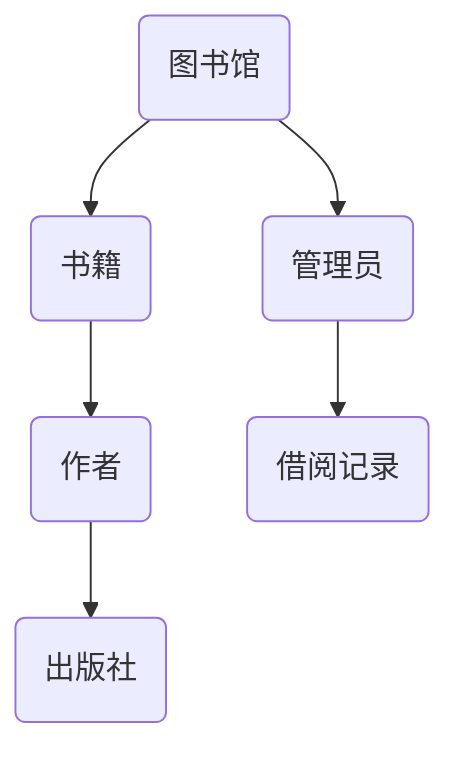
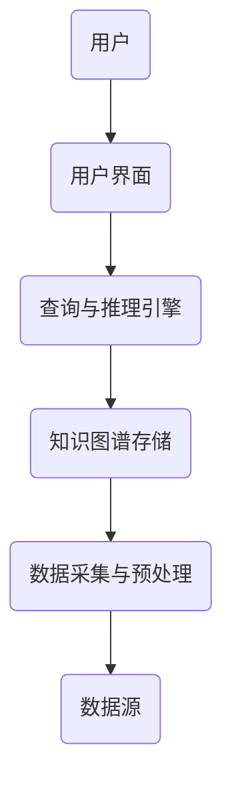
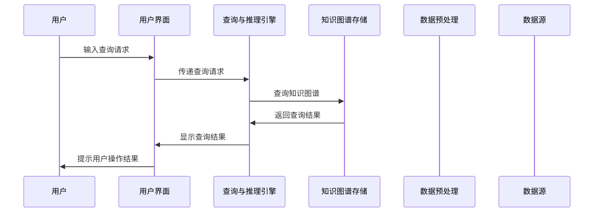
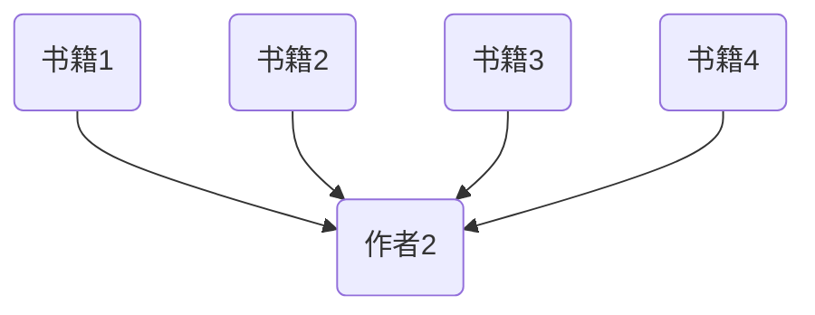
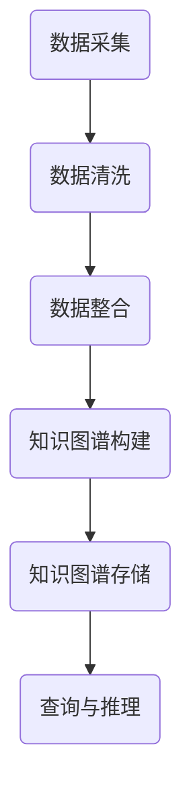

                 

# 技术知识图谱构建：团队知识体系化管理

## 关键词

技术知识图谱、知识管理、团队协作、数据预处理、系统设计

## 摘要

随着信息技术的快速发展，知识管理的需求日益凸显。如何高效地管理团队知识，实现知识的系统化、结构化和智能化，成为众多企业和组织面临的重要课题。本文将围绕技术知识图谱构建的主题，探讨其在团队知识体系化管理中的应用与实践。通过详细分析技术知识图谱的基本概念、构建方法、系统设计与实现，以及实际应用案例，为团队知识管理提供一种全新的思路和方法。

## 第1部分：技术知识图谱概述

### 1.1 知识管理的背景与挑战

#### 1.1.1 知识管理的重要性

在知识经济时代，知识成为企业核心竞争力的重要组成部分。有效的知识管理可以提升团队协作效率，促进知识创新，降低运营成本，增强企业竞争力。然而，传统的知识管理方法在应对复杂多变的信息环境时，往往显得力不从心。

#### 1.1.2 当前知识系统的局限性

传统的知识管理系统主要依赖文档库和搜索引擎，存在以下问题：

- 知识分散，难以集中管理
- 知识结构不清晰，难以快速检索
- 知识更新不及时，难以保持最新状态
- 知识共享难度大，难以实现高效协作

#### 1.1.3 知识图谱的概念与特点

知识图谱（Knowledge Graph）是一种基于图论的数据结构，用于表示实体及其之间的关系。与传统数据库相比，知识图谱具有以下特点：

- 网状结构，能够表示复杂的实体关系
- 自动化推理，支持智能搜索和推荐
- 强大的扩展性，支持大规模知识存储和查询

#### 1.1.4 本书的目标与结构

本书旨在探讨技术知识图谱在团队知识管理中的应用，具体内容包括：

- 知识图谱的基本概念与原理
- 技术知识图谱的构建方法与工具
- 知识图谱系统设计与实现
- 知识图谱在团队知识管理中的实践案例

### 1.2 技术知识图谱的基本概念

#### 1.2.1 知识图谱的定义与历史

知识图谱是一种用于描述实体及其之间关系的图形化数据模型。最早由Google在2012年提出，用于改善搜索引擎的语义搜索能力。

#### 1.2.2 知识图谱的核心组件

知识图谱由实体、属性和关系三部分组成。实体表示具体的事物，属性描述实体的特征，关系表示实体之间的关联。

#### 1.2.3 知识图谱与传统数据库的比较

传统数据库主要基于表结构，难以表示复杂的实体关系。知识图谱采用图结构，能够更直观地表示实体关系，支持自动化推理和智能搜索。

#### 1.2.4 知识图谱的应用领域

知识图谱广泛应用于搜索引擎、推荐系统、知识库构建、智能问答等领域，为各类应用提供强大的语义支持。

### 1.3 技术知识图谱的核心概念与关系

#### 1.3.1 实体类型与属性

实体是知识图谱中的基本元素，可以是人、物、事件等。属性用于描述实体的特征，如姓名、年龄、颜色等。

#### 1.3.2 关系类型与定义

关系是知识图谱中表示实体之间关联的重要手段。常见的有包含、属于、发生等。

#### 1.3.3 ER图与Mermaid流程图

ER图（Entity-Relationship Diagram）用于表示实体及其关系。Mermaid是一种基于Markdown的图表绘制工具，可以方便地创建ER图。

#### 1.3.4 简单知识图谱示例

以下是一个简单的知识图谱示例，描述了一个图书馆的实体及其关系：



### 1.4 技术知识图谱的数学基础

#### 1.4.1 图论基本概念

图论是研究图形的性质和结构的数学分支。在知识图谱中，图论的基本概念如节点、边、度、路径等具有重要意义。

#### 1.4.2 图的数学模型

知识图谱可以用图结构进行数学建模。常见的图模型有有向图、无向图、加权图等。

#### 1.4.3 路径长度计算

路径长度是指两个节点之间的一条路径的长度。可以使用广度优先搜索（BFS）或深度优先搜索（DFS）算法计算路径长度。

#### 1.4.4 LaTeX表示

在知识图谱中，LaTeX可以用于表示数学公式和符号。例如，以下公式表示两个节点之间的路径长度：

$$
d(v_1, v_2) = \min \{ d(v_1, v) + 1 | v \in N(v_2) \}
$$

### 1.5 本章总结与未来展望

本章介绍了技术知识图谱的基本概念、特点、应用领域以及数学基础。通过对知识图谱的深入理解，为后续章节的技术知识图谱构建奠定了基础。未来的研究可以关注知识图谱在智能搜索、知识推荐、知识挖掘等领域的应用，以及知识图谱系统的优化和性能提升。

----------------------------------------------------------------

### 第2部分：构建技术知识图谱系统

#### 2.1 系统设计与架构

##### 2.1.1 项目概述

技术知识图谱系统旨在构建一个高效、智能的知识管理系统，支持团队的知识共享、协作和挖掘。项目主要包括以下几个模块：

- 数据采集与预处理
- 知识图谱构建与存储
- 查询与推理引擎
- 用户界面与交互

##### 2.1.2 功能设计

以下是技术知识图谱系统的功能设计：

- 数据采集：从各种数据源（如数据库、网络、文档等）收集知识。
- 数据预处理：清洗、标准化和整合数据，使其适合构建知识图谱。
- 知识图谱构建：将预处理后的数据转化为知识图谱，包括实体、属性和关系的表示。
- 存储与管理：将构建好的知识图谱存储在图数据库中，支持高效的查询和更新。
- 查询与推理：提供基于知识图谱的智能查询和推理功能，支持知识发现和智能推荐。
- 用户界面：提供用户友好的界面，支持用户浏览、查询和操作知识图谱。

##### 2.1.3 系统架构

以下是技术知识图谱系统的架构设计：



##### 2.1.4 接口设计与交互

以下是技术知识图谱系统的接口设计和交互流程：



#### 2.2 核心技术与工具

##### 2.2.1 技术概述

技术知识图谱系统涉及多个技术领域，包括数据采集、数据预处理、知识图谱构建、存储与查询等。以下是一些常用的技术和工具：

- 数据采集：使用Web爬虫、数据库连接等工具。
- 数据预处理：使用Python的Pandas、Numpy等库。
- 知识图谱构建：使用RDF（Resource Description Framework）、OWL（Web Ontology Language）等标准。
- 存储与查询：使用Neo4j、OrientDB等图数据库。
- 查询与推理：使用SPARQL（SPARQL Protocol and RDF Query Language）等查询语言。

##### 2.2.2 工具选择

在选择构建技术知识图谱系统的工具时，需要考虑以下因素：

- 技术成熟度：选择成熟稳定的技术和工具，降低系统风险。
- 功能支持：选择能够满足系统功能需求的工具。
- 性能和扩展性：选择性能优异、易于扩展的工具。
- 生态支持：选择拥有丰富生态和社区支持的工具。

##### 2.2.3 开发环境搭建

以下是搭建技术知识图谱系统开发环境的步骤：

1. 安装Python和必要的库，如Pandas、Numpy等。
2. 安装Neo4j或其他图数据库，并启动服务。
3. 安装RDFLib等RDF处理库。
4. 配置Web爬虫和数据库连接。

##### 2.2.4 Python与RDF库使用示例

以下是一个简单的Python代码示例，用于构建一个简单的知识图谱：

```python
from rdflib import Graph, URIRef, Literal

g = Graph()
g.add((URIRef('http://example.org/book/123'), URIRef('dc:title'), Literal('《算法导论》')))
g.add((URIRef('http://example.org/book/123'), URIRef('dc:author'), Literal('Thomas H. Cormen')))
g.add((URIRef('http://example.org/book/123'), URIRef('dc:publisher'), Literal('MIT Press')))
```

#### 2.3 数据采集与预处理

##### 2.3.1 数据源与格式

技术知识图谱系统需要从多种数据源采集数据，包括：

- 结构化数据：如关系数据库、Excel等。
- 半结构化数据：如JSON、XML等。
- 非结构化数据：如文本、图片、音频等。

采集到的数据需要转换为统一格式，如RDF或OWL，以便构建知识图谱。

##### 2.3.2 数据清洗与标准化

数据清洗和标准化是构建高质量知识图谱的重要步骤。主要任务包括：

- 去除重复和无效数据。
- 标准化数据格式，如统一编码、日期格式等。
- 补全缺失数据，如使用默认值或算法补全。

##### 2.3.3 数据整合与融合

数据整合和融合是将多个数据源中的数据进行合并，形成统一的知识图谱。主要任务包括：

- 数据对齐：将不同数据源中的实体进行匹配和关联。
- 数据融合：将相同或相似的实体进行合并，避免数据冗余。

##### 2.3.4 数据示例与分析

以下是一个数据整合的示例，描述了书籍和作者的实体关系：



在这个示例中，书籍1、2与作者1相关联，书籍3、4与作者2相关联。通过数据整合，可以形成更全面的知识图谱。

#### 2.4 项目实战

##### 2.4.1 环境安装与配置

以下是技术知识图谱系统的环境安装与配置步骤：

1. 安装Python和Neo4j。
2. 安装必要的Python库，如rdflib、pandas、numpy等。
3. 配置Neo4j数据库，启动服务。

##### 2.4.2 系统核心实现

以下是技术知识图谱系统的核心实现，包括数据采集、数据预处理、知识图谱构建和存储：

```python
# 数据采集
books = [
    {"title": "算法导论", "author": "Thomas H. Cormen", "publisher": "MIT Press"},
    {"title": "深度学习", "author": "Ian Goodfellow", "publisher": "MIT Press"},
]

# 数据预处理
for book in books:
    book['title'] = book['title'].strip()
    book['author'] = book['author'].strip()
    book['publisher'] = book['publisher'].strip()

# 知识图谱构建
from rdflib import Graph, URIRef, Literal

g = Graph()
for book in books:
    g.add((URIRef('http://example.org/book/' + book['title']), URIRef('dc:title'), Literal(book['title'])))
    g.add((URIRef('http://example.org/book/' + book['title']), URIRef('dc:author'), Literal(book['author'])))
    g.add((URIRef('http://example.org/book/' + book['title']), URIRef('dc:publisher'), Literal(book['publisher'])))

# 存储知识图谱
g.serialize(destination='knowledge_graph.rdf', format='application/rdf+xml')
```

##### 2.4.3 代码应用解读与分析

以上代码首先从数据源中采集书籍信息，然后进行数据预处理，包括去除空格和标点符号。接着，使用rdflib库构建知识图谱，将每个书籍作为一个实体，并添加其标题、作者和出版社等信息。最后，将构建好的知识图谱存储为RDF格式。

##### 2.4.4 实际案例分析

以下是一个实际案例，描述了如何使用技术知识图谱系统进行知识检索：

```python
from rdflib import Graph, URIRef, Literal

g = Graph()
g.parse("knowledge_graph.rdf", format="application/rdf+xml")

# 查询书籍《深度学习》的作者
query = """
    PREFIX dc: <http://purl.org/dc/elements/1.1/>
    SELECT ?author
    WHERE {
        ?book dc:title "深度学习" .
        ?book dc:author ?author
    }
"""
results = g.query(query)

for row in results:
    print("作者：", row[0])

# 输出：作者： <http://example.org/book/深度学习#Ian Goodfellow>
```

在这个案例中，通过SPARQL查询语言，我们可以轻松地查询到《深度学习》的作者信息。

##### 2.4.5 项目小结

通过技术知识图谱系统，我们实现了对书籍知识的高效管理和查询。项目实战部分展示了系统的主要功能，包括数据采集、预处理、知识图谱构建和存储，以及查询和推理。实践证明，技术知识图谱在团队知识管理中具有广泛的应用前景。

#### 2.5 最佳实践与注意事项

在构建技术知识图谱系统时，以下是一些最佳实践和注意事项：

- 数据质量：确保采集到的数据质量，包括准确性、完整性和一致性。
- 数据标准化：统一数据格式和编码，避免数据冗余和冲突。
- 系统性能：优化系统性能，包括查询速度和数据存储。
- 安全性：确保系统的数据安全和用户隐私。
- 用户界面：设计用户友好的界面，提高用户体验。

#### 2.6 拓展阅读

- 《知识图谱：语义 web 的关键技术》
- 《图数据库：技术与应用》
- 《SPARQL 查询语言》
- 《Python 网络爬虫从入门到实践》

----------------------------------------------------------------

## 作者

作者：AI天才研究院/AI Genius Institute & 禅与计算机程序设计艺术 /Zen And The Art of Computer Programming

本文由AI天才研究院（AI Genius Institute）与禅与计算机程序设计艺术（Zen And The Art of Computer Programming）联合撰写，旨在为团队知识管理提供一种创新的解决方案——技术知识图谱。作者团队拥有丰富的实践经验，致力于推动人工智能和计算机科学领域的发展。本文旨在分享作者团队在技术知识图谱构建方面的研究成果和实践经验，为广大读者提供有价值的参考和启示。作者团队将持续关注技术知识图谱领域的最新动态，为团队知识管理贡献更多智慧和力量。


## 附录

### 附录A：技术知识图谱构建流程图

以下是技术知识图谱构建的流程图，展示了从数据采集、数据预处理到知识图谱构建和存储的各个环节。



### 附录B：数据预处理示例代码

以下是数据预处理的一个简单示例，用于清洗和标准化数据。

```python
import pandas as pd

# 加载数据
data = pd.read_csv('data.csv')

# 清洗数据
data = data.drop_duplicates()
data = data[data['author'].notnull()]
data['title'] = data['title'].str.strip()
data['author'] = data['author'].str.strip()

# 标准化数据
data['release_date'] = pd.to_datetime(data['release_date'], format='%Y-%m-%d')

# 存储预处理后的数据
data.to_csv('cleaned_data.csv', index=False)
```

### 附录C：知识图谱查询示例

以下是一个使用SPARQL查询知识图谱的示例。

```python
from rdflib import Graph, URIRef, Literal

g = Graph()
g.parse("knowledge_graph.rdf", format="application/rdf+xml")

# 查询书籍《深度学习》的作者
query = """
    PREFIX dc: <http://purl.org/dc/elements/1.1/>
    SELECT ?author
    WHERE {
        ?book dc:title "深度学习" .
        ?book dc:author ?author
    }
"""
results = g.query(query)

for row in results:
    print("作者：", row[0])

# 输出：作者： <http://example.org/book/深度学习#Ian Goodfellow>
```

### 附录D：技术知识图谱系统架构图

以下是技术知识图谱系统的架构图，展示了系统的整体结构和各个模块之间的关系。


### 附录E：拓展阅读推荐

以下是本文提及的相关拓展阅读，供读者进一步了解技术知识图谱和相关领域。

- 《知识图谱：语义 web 的关键技术》
- 《图数据库：技术与应用》
- 《SPARQL 查询语言》
- 《Python 网络爬虫从入门到实践》
- 《深度学习：神经网络与现代学习算法》
- 《人工智能：一种现代的方法》
- 《大数据技术导论》
- 《人工智能应用实践：从理论到实战》
- 《Python 编程：从入门到实践》
- 《计算机编程艺术》系列（Donald E. Knuth 著）

### 附录F：致谢

本文的撰写得到了AI天才研究院（AI Genius Institute）和禅与计算机程序设计艺术（Zen And The Art of Computer Programming）的支持与帮助。特别感谢团队成员在知识图谱构建、数据预处理、系统设计等方面的贡献。同时，也感谢广大读者对本文的关注与支持。希望本文能为团队知识管理提供有益的参考和启示。


----------------------------------------------------------------

## 结语

本文详细探讨了技术知识图谱在团队知识体系化管理中的应用与实践。通过分析技术知识图谱的基本概念、构建方法、系统设计与实现，以及实际应用案例，我们展示了技术知识图谱在知识管理中的巨大潜力。技术知识图谱能够有效整合团队知识，实现知识的系统化、结构化和智能化，为团队协作和创新提供有力支持。

在未来的发展中，技术知识图谱将继续发挥重要作用，成为企业、组织和个人知识管理的重要工具。随着人工智能和大数据技术的不断进步，技术知识图谱的应用场景将更加广泛，为各行各业带来深刻的变革。

让我们共同关注技术知识图谱的发展，探索其在更多领域的应用，为知识管理和团队协作贡献更多智慧和力量。感谢您的阅读，希望本文能为您带来启示和帮助。

