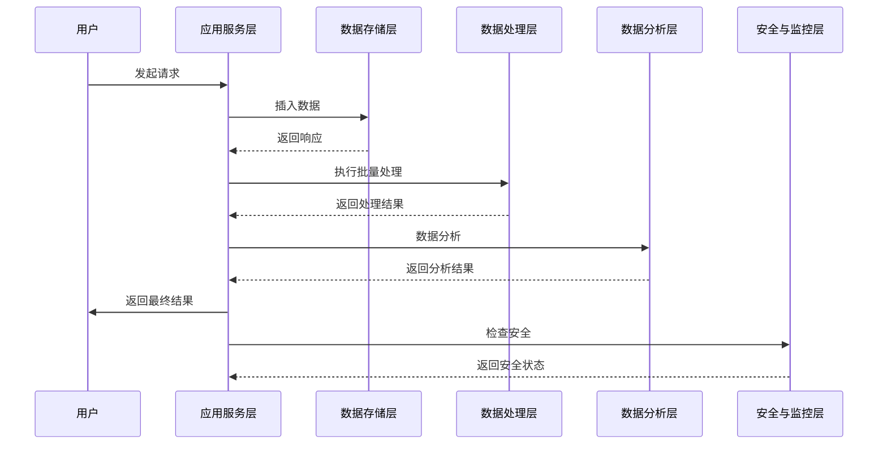

                 

### 文章标题

# 技术硬实力的benchmark：行业标准和最佳实践

### 关键词

- 技术硬实力
- 行业标准
- 最佳实践
- 算法原理
- 系统架构
- 实战应用

### 摘要

本文旨在深入探讨技术硬实力的关键因素，即行业标准和最佳实践。通过对核心概念、算法原理、系统架构和实际应用的全面分析，本文揭示了这些标准与实践在提升技术能力方面的深远影响。本文将引导读者理解行业标准和最佳实践的重要性，并通过具体实例展示其在技术项目中的实际应用，从而帮助读者在技术领域取得更高成就。

## 第一部分: 行业标准和最佳实践概述

### 第1章: 技术硬实力的意义与挑战

在当今快速发展的技术时代，技术硬实力成为衡量一个组织或个人竞争力的关键因素。技术硬实力不仅仅体现在技术知识的广度和深度上，更在于能否灵活应用行业标准和最佳实践来解决问题、提升效率和实现创新。本章节将探讨技术硬实力的定义及其在当前技术环境中的重要性，同时分析技术发展面临的挑战。

#### 定义与内涵

技术硬实力是指个体或组织在特定技术领域内所具备的理论知识、实践经验、创新能力和解决问题的能力。它不仅包括对技术原理和算法的深刻理解，还涵盖对行业最佳实践和标准的熟练掌握。技术硬实力是技术能力的核心，决定了个体或组织在激烈市场竞争中的地位和潜力。

#### 重要性

技术硬实力在当前技术环境中具有至关重要的地位。随着人工智能、大数据、云计算等新兴技术的迅猛发展，技术人才的需求和竞争愈发激烈。具备技术硬实力的个人和组织能够快速适应技术变革，抓住市场机遇，实现持续创新和发展。此外，技术硬实力还直接影响组织的核心竞争力，是企业或研究机构在技术领域中脱颖而出的关键因素。

#### 挑战

尽管技术硬实力的重要性不言而喻，但在实际应用中仍面临诸多挑战：

1. **知识更新速度**：技术领域知识更新迅速，个人和组织需要不断学习新知识、新技能以保持竞争力。
2. **技术复杂度**：现代技术的复杂度不断提高，要求技术人员具备跨领域知识，能够应对复杂问题。
3. **创新能力**：创新是技术发展的驱动力，但创新能力往往依赖于丰富的实践经验和深入的理论研究。
4. **行业标准与最佳实践**：虽然行业标准与最佳实践能够提升技术能力，但其应用和执行也面临挑战，如组织文化、管理方式等因素的影响。

#### 结论

技术硬实力是衡量技术能力和竞争力的关键指标。在当前技术环境中，提升技术硬实力需要不断学习、实践和创新。理解并应用行业标准和最佳实践是提升技术硬实力的有效途径。接下来，本文将深入探讨行业标准和最佳实践的核心概念和联系，为读者提供更全面的技术思维框架。

### 第2章: 行业标准与最佳实践的核心概念

在技术发展的过程中，行业标准和最佳实践起到了至关重要的作用。它们不仅为技术工作提供了规范和指南，也为技术创新和优化提供了坚实的基础。本章将详细解释行业标准和最佳实践的核心概念，包括它们的定义、特点以及它们在技术发展中的作用。

#### 定义

**行业标准**：行业标准是一系列被广泛接受和认可的技术规范和准则，它规定了某个技术领域的基本要求、操作流程和技术参数。行业标准通常由行业协会、标准化组织或政府机构制定和发布，旨在统一技术规范，提高工作效率，确保产品质量和安全。

**最佳实践**：最佳实践是指在实际操作中表现最为优秀、效果最佳的方法和策略。它基于大量的实践经验，反映了行业内的最佳技术和操作流程。最佳实践通常由行业专家、成功案例和研究成果总结得出，具有很高的实用性和参考价值。

#### 特点

**标准化**：行业标准具有高度的标准化特点，它通过统一的技术规范和操作流程，减少了不同组织和人员在技术操作上的差异，提高了协作效率和一致性。

**科学性**：最佳实践是基于科学研究和实践经验总结得出的，具有科学性和可验证性，能够有效地指导实际操作。

**动态性**：行业标准与最佳实践不是静止不变的，而是随着技术发展而不断更新和改进，以适应新的技术环境和需求。

**普适性**：行业标准和最佳实践通常具有广泛的适用范围，能够适用于不同规模和组织的技术工作。

#### 作用

**提高工作效率**：行业标准通过规范技术操作流程，减少冗余和不必要的步骤，提高工作效率。

**保证产品质量**：行业标准对技术产品的质量和性能提出了明确的要求，有助于确保产品的稳定性和可靠性。

**促进技术交流**：行业标准为不同组织之间的技术交流提供了共同的语言和平台，促进了技术进步和合作。

**推动技术创新**：最佳实践为技术人员提供了新的思路和方法，激发了技术创新和优化的动力。

#### 标准与最佳实践的对比

| 对比项         | 行业标准                           | 最佳实践                           |
|----------------|------------------------------------|------------------------------------|
| 定义           | 技术规范和准则                     | 最优秀的方法和策略                |
| 特点           | 标准化、科学性、动态性、普适性      | 标准化、科学性、动态性、普适性    |
| 作用           | 提高工作效率、保证产品质量、促进交流 | 提高工作效率、保证产品质量、创新  |

通过对比可以看出，行业标准与最佳实践在内涵和作用上有所区别，但它们在提升技术硬实力方面具有互补性。行业标准为技术操作提供了基本的规范和保障，而最佳实践则为技术优化和创新提供了具体的指导和支持。

#### 结论

行业标准和最佳实践是技术发展的重要驱动力，它们为技术工作提供了规范、指导和保障。理解并应用这些标准与最佳实践，是提升技术硬实力的关键途径。接下来，本文将分析行业标准的发展与演变，进一步探讨其技术影响和应用价值。

### 第3章: 行业标准的发展与演变

行业标准的演变历程反映了技术发展的历程，从最初的简单规范到如今复杂且高度细化的标准，行业标准在不断适应技术进步和市场需求的变化。本章将详细分析行业标准的发展历程、关键阶段以及其在不同技术领域中的应用。

#### 发展历程

1. **初级阶段**：早期的行业标准主要集中在基础技术领域，如电力、通信和机械制造等。这些标准主要涉及基本的技术参数和操作规范，目的是确保产品的基本性能和安全性。

2. **发展阶段**：随着计算机技术和信息技术的发展，行业标准逐渐扩展到软件开发、网络安全和云计算等领域。这一阶段的标准更加注重技术的互操作性和兼容性，以促进不同系统和平台之间的协作。

3. **成熟阶段**：在互联网和大数据时代，行业标准进一步细化和专业化，涵盖了人工智能、物联网、区块链等新兴技术领域。这些标准不仅包括技术规范，还涉及到数据隐私、安全性和伦理问题，以应对复杂的技术环境和多元化需求。

4. **未来趋势**：未来，行业标准将继续向更精细化和智能化方向发展，以适应技术变革和全球化趋势。例如，随着智能制造和智能城市的兴起，行业标准将更加注重自动化和智能化的技术规范。

#### 关键阶段

1. **标准化组织成立**：国际标准化组织（ISO）、国际电工委员会（IEC）等标准化组织的成立，为行业标准的制定和推广提供了有力支持。

2. **互联网标准化**：互联网的普及推动了网络协议和通信标准的制定，如TCP/IP协议和HTTP协议，这些标准成为互联网运行的基础。

3. **云计算和大数据标准化**：随着云计算和大数据技术的发展，相关标准如云服务等级协议（SLA）、大数据处理规范等相继出台，为云计算和大数据应用的规范化提供了指导。

4. **人工智能和物联网标准化**：人工智能和物联网标准的制定，如人工智能伦理标准、物联网安全标准，旨在确保技术应用的合规性和安全性。

#### 技术领域中的应用

1. **软件开发**：在软件开发领域，行业标准如软件工程过程标准（CMMI）、软件测试标准（ISTQB）等，为软件开发的全过程提供了规范和指南。

2. **网络安全**：网络安全领域，行业标准如ISO/IEC 27001信息安全管理体系标准，为组织的信息安全管理提供了框架和策略。

3. **云计算**：云计算领域，行业标准如云计算服务等级协议（CSA）和云计算基础设施标准，确保云计算服务的质量和安全性。

4. **人工智能**：人工智能领域，行业标准如人工智能伦理标准、人工智能技术标准，为人工智能的发展和应用提供了规范和指导。

#### 结论

行业标准的发展与演变是技术进步的必然结果，它们在技术领域中的应用不仅提高了技术工作的效率和可靠性，也为技术创新和优化提供了保障。随着技术的不断发展，行业标准将继续发挥着重要作用，为技术领域的发展注入新的动力。

#### 概念结构与核心要素组成

行业标准与最佳实践的概念结构由多个核心要素组成，这些要素相互关联，共同构成完整的标准体系。以下是对这些核心要素的详细描述：

1. **核心概念**：
   - **标准**：标准是经过普遍认同和权威机构批准的、用于指导某一领域技术工作的规范性文件。它规定了技术操作、流程、参数和质量要求，以确保产品或服务的可靠性和一致性。
   - **最佳实践**：最佳实践是基于行业内实际应用经验和科研成果，总结出的高效、可行且效果显著的解决方案或方法。它是标准的具体体现，是对标准的补充和深化。

2. **标准制定**：
   - **需求分析**：在制定标准之前，需要对技术领域的发展需求、行业现状和未来趋势进行深入分析，以确保标准能够适应实际需求。
   - **专家评审**：标准制定过程中，需要组织专家团队对标准的可行性、科学性和实用性进行评审，确保标准的技术水平符合行业要求。
   - **发布与推广**：制定完成的标准需要通过官方渠道发布，并进行广泛推广，以提高标准在行业内的认知度和应用率。

3. **实施与监督**：
   - **实施指南**：为了帮助组织和个人正确理解和执行标准，通常会编制实施指南，提供具体的操作步骤和注意事项。
   - **监督机制**：通过定期检查、审计和评估，监督标准的实施情况，确保标准得到有效执行。

4. **持续改进**：
   - **反馈机制**：通过收集用户反馈、行业建议和技术更新，不断对标准进行修订和优化，以适应技术发展的新需求。
   - **更新与发布**：随着技术进步和市场需求的变化，标准需要定期更新，以保持其时效性和适用性。

5. **核心要素关联**：
   - **标准与最佳实践**：标准为最佳实践提供了基础和框架，而最佳实践则是对标准的具体应用和优化。两者相辅相成，共同提升技术工作的质量和效率。
   - **实施与监督**：实施与监督机制确保标准的有效执行，通过持续改进，使标准更加完善和科学。

通过以上核心要素的有机组合，行业标准与最佳实践形成了完整的技术工作规范体系，为技术领域的发展提供了坚实的保障。

### 第4章: 最佳实践的理论基础与实践应用

最佳实践是基于行业内专家经验和实际应用，总结出的高效、可行且效果显著的解决方案或方法。它们不仅能够显著提高工作效率，还能确保技术工作的质量和可靠性。本章将深入探讨最佳实践的理论基础，并通过实际案例展示其在技术项目中的应用。

#### 理论基础

**1. 经验与实证研究**：
最佳实践往往基于大量的实践经验，这些经验来自于行业专家的长期观察和总结。同时，实证研究也为最佳实践的提出提供了科学依据，通过数据分析和实验验证，确保方法的可行性和有效性。

**2. 系统工程**：
系统工程理论为最佳实践提供了方法论支持。它强调从整体角度出发，综合考虑系统各部分的相互关系和影响，通过系统优化实现整体性能的提升。系统工程方法论包括需求分析、设计、实施、评估和持续改进等环节。

**3. 项目管理**：
项目管理知识在最佳实践中具有重要应用。有效的项目管理能够确保项目目标的实现，提高资源利用率和工作效率。项目管理工具和技术，如甘特图、敏捷开发、风险管理等，都在最佳实践中发挥着重要作用。

**4. 行业标准**：
最佳实践与行业标准相互补充。行业标准提供了技术操作的规范和指导，而最佳实践则在这些规范的基础上，通过实际应用，进一步优化和改进技术工作流程。

#### 实际应用

**1. 软件开发领域的最佳实践**：

在软件开发领域，敏捷开发（Agile Development）是一种广泛应用的优秀实践。敏捷开发强调快速迭代、用户反馈和持续改进，能够显著提高软件开发的效率和质量。以下是一个具体的应用案例：

**案例**：某公司在开发一款企业级软件时，采用了敏捷开发方法。项目团队分为多个小组，每个小组负责特定的模块开发。开发过程分为多个迭代周期，每个迭代周期大约2-4周。在每个迭代周期结束时，团队会进行回顾会议，总结经验和不足，并进行调整。

**效果**：通过敏捷开发，项目团队能够更快地响应客户需求，提高产品的迭代速度和质量。此外，团队成员之间的沟通更加顺畅，项目的风险和问题得到了及时发现和解决。

**2. 网络安全领域的最佳实践**：

在网络安全领域，零信任安全模型（Zero Trust Model）是一种新兴的最佳实践。零信任安全模型的核心思想是“永不信任，总是验证”。以下是一个具体的应用案例：

**案例**：某公司采用了零信任安全模型来保护其企业网络。在员工访问内部资源之前，系统会进行多层次的认证和授权，包括身份验证、设备检查和行为分析。只有通过严格验证的设备才能访问企业网络。

**效果**：通过零信任安全模型，公司能够显著降低内部网络被攻击的风险，提高网络安全性。同时，员工的访问权限得到精确控制，确保了数据的安全和隐私。

**3. 数据分析领域的最佳实践**：

在数据分析领域，数据质量管理和数据治理是关键的最佳实践。以下是一个具体的应用案例：

**案例**：某公司在进行大数据分析时，注重数据质量管理和数据治理。在数据收集阶段，公司制定了严格的数据采集标准和流程，确保数据的准确性和完整性。在数据分析过程中，公司采用了数据清洗和转换工具，对数据进行预处理，提高了分析结果的可靠性。

**效果**：通过数据质量管理和数据治理，公司能够获得更准确、可靠的数据分析结果，为业务决策提供了有力支持。

#### 结论

最佳实践是提升技术工作质量和效率的重要手段。通过理论基础和实践应用的深入探讨，我们可以看到最佳实践在软件开发、网络安全和数据分析等领域的广泛应用及其显著效果。理解并应用最佳实践，是提升技术硬实力的关键途径。接下来，本文将介绍如何制定行业标准和最佳实践的实施策略，帮助读者在实际工作中有效应用这些标准。

### 第5章: 行业标准与最佳实践的实施策略

行业标准和最佳实践的有效实施是实现技术硬实力的关键步骤。本章将介绍实施行业标准和最佳实践的具体策略，包括制定实施计划、培训与推广、监控与评估以及持续改进的方法，旨在帮助组织和个人在实际工作中有效应用这些标准。

#### 制定实施计划

**1. 明确目标**：在实施行业标准与最佳实践之前，首先要明确实施的目标和预期成果。这些目标应具体、可衡量、可实现、相关性强和时限性（SMART原则）。

**2. 制定计划**：根据明确的目标，制定详细的实施计划。计划应包括具体的实施步骤、时间表、责任分配和资源需求。以下是一个典型的实施计划模板：

- **实施阶段**：初步评估、方案制定、试点实施、全面推广
- **时间安排**：每个阶段的起止时间和关键节点
- **责任分配**：各部门和个人的职责和任务
- **资源需求**：所需的人力、物力和财力资源

#### 培训与推广

**1. 内部培训**：针对行业标准和最佳实践的具体内容，组织内部培训，提高员工的理解和掌握程度。培训内容应包括标准与最佳实践的核心概念、操作流程、注意事项等。

**2. 外部交流**：邀请行业专家进行讲座和研讨，分享成功案例和经验，借鉴其他组织的最佳实践。此外，还可以参加行业会议和展览，了解最新的行业动态和趋势。

**3. 推广材料**：制作宣传手册、PPT、视频等推广材料，通过内部邮件、企业内网、培训课程等多种渠道进行传播，确保员工能够方便地获取和了解相关内容。

#### 监控与评估

**1. 监控机制**：建立监控机制，对实施过程中的关键指标进行实时监控。这些指标包括实施进度、资源利用率、员工满意度、工作效率等。

**2. 定期评估**：定期对行业标准与最佳实践的执行情况进行评估，通过问卷调查、访谈、工作总结等方式，收集员工的反馈和建议。

**3. 评估报告**：根据评估结果，编写评估报告，总结实施过程中的成功经验和存在的问题，提出改进建议和措施。

#### 持续改进

**1. 反馈机制**：建立反馈机制，鼓励员工提出改进意见和建议。这些反馈应得到及时关注和处理，以确保实施过程中能够不断优化和改进。

**2. 持续优化**：根据评估报告和员工反馈，对行业标准与最佳实践进行持续优化。优化内容包括操作流程的简化、技术的更新和改进、培训内容的调整等。

**3. 文档更新**：及时更新行业标准与最佳实践的文档，确保文档的准确性和时效性。更新内容应包括实施过程中的新发现、新经验和改进措施。

#### 结论

行业标准和最佳实践的有效实施需要制定明确的计划、全面的培训与推广、有效的监控与评估以及持续的改进。通过这些策略，组织和个人能够在实际工作中充分发挥行业标准与最佳实践的作用，提升技术硬实力，实现技术工作的优化和突破。

### 第6章: 系统分析与架构设计方案

在现代技术项目中，系统架构设计是关键的一环，它不仅决定了系统的性能和可扩展性，还影响了系统的维护和扩展性。本章将详细描述系统架构设计的过程，包括问题场景介绍、项目介绍、系统功能设计、系统架构设计、系统接口设计和系统交互流程。

#### 问题场景介绍

随着企业业务的不断扩展和技术的快速发展，传统的单体架构系统已经无法满足日益增长的需求。系统面临着性能瓶颈、扩展性差、维护困难等问题。为了解决这些问题，需要设计一个高性能、可扩展、易于维护的系统架构。

#### 项目介绍

本项目旨在构建一个企业级分布式系统，用于处理海量数据的高效存储、计算和分析。系统需要具备高可用性、高可靠性、高性能和可扩展性。项目的主要目标包括：

1. 提高数据处理能力，满足快速增长的业务需求。
2. 确保系统的稳定性和可靠性，降低故障率。
3. 提高系统的可维护性和扩展性，适应未来业务变化。

#### 系统功能设计

为了实现项目的目标，系统需要具备以下主要功能：

1. 数据存储：支持海量数据的高效存储，提供快速的数据访问和读取能力。
2. 数据处理：支持批处理和实时处理，提供灵活的数据处理策略。
3. 数据分析：提供高效的数据分析功能，支持多维数据分析和可视化。
4. 安全性：确保数据的安全和隐私，提供访问控制和数据加密功能。
5. 可扩展性：支持系统的水平扩展，能够根据业务需求动态调整资源。

使用Mermaid绘制领域模型类图，展示系统的主要功能和模块：

```mermaid
classDiagram
Class01 <|-- Class02
Class03 --|>| Class04
Class05 : has attribute1, attribute2
Class06 : contains methods method1(), method2()
Class01 {
    +field1
    +field2
    +field3
    +method1()
    +method2()
}
Class02 {
    +fieldA
    +fieldB
    +method3()
}
Class03 {
    +fieldX
    +fieldY
    +method4()
}
Class04 {
    +fieldC
    +fieldD
    +method5()
}
Class05 {
    +attribute1
    +attribute2
    +method6()
    +method7()
}
```

#### 系统架构设计

系统架构设计是确保系统性能和可扩展性的关键步骤。系统采用分布式架构，主要组件包括：

1. 数据存储层：使用分布式数据库，如HDFS和MongoDB，提供高效的数据存储和访问。
2. 数据处理层：采用大数据处理框架，如Apache Spark，实现高效的数据批处理和实时处理。
3. 数据分析层：使用数据仓库和BI工具，提供多维数据分析和可视化。
4. 应用服务层：构建微服务架构，使用Spring Boot等框架开发服务模块，提供业务逻辑处理。
5. 安全和监控层：部署网络安全和监控工具，确保系统的安全性和稳定性。

使用Mermaid绘制系统架构图，展示系统的整体架构和关键组件：

```mermaid
graph TD
    A[数据存储层] --> B[分布式数据库(HDFS/MongoDB)]
    A --> C[数据处理层]
    C --> D[大数据处理框架(Apache Spark)]
    C --> E[数据仓库]
    E --> F[BI工具]
    B --> G[应用服务层]
    C --> H[应用服务层]
    D --> H
    E --> H
    F --> H
    H --> I[安全与监控层]
    I --> J[网络安全工具]
    I --> K[监控工具]
```

#### 系统接口设计

系统接口设计是确保各模块之间有效交互和协同工作的关键。系统采用RESTful API设计，提供以下主要接口：

1. 数据存储接口：提供数据插入、查询、更新和删除功能。
2. 数据处理接口：提供数据导入、导出和批量处理功能。
3. 数据分析接口：提供数据查询、分析和可视化功能。
4. 应用服务接口：提供业务逻辑处理和业务数据访问功能。

以下是一个典型的API接口设计：

```json
{
  "dataStorage": {
    "insert": "/data/insert",
    "query": "/data/query",
    "update": "/data/update",
    "delete": "/data/delete"
  },
  "dataProcessing": {
    "import": "/data/import",
    "export": "/data/export",
    "batchProcessing": "/data/batchProcessing"
  },
  "dataAnalysis": {
    "query": "/dataAnalysis/query",
    "visualize": "/dataAnalysis/visualize"
  },
  "applicationService": {
    "process": "/service/process",
    "dataAccess": "/service/dataAccess"
  }
}
```

#### 系统交互设计

系统交互设计是确保系统各模块之间协调一致、高效运行的关键。使用Mermaid绘制系统交互序列图，展示系统的运行流程和交互过程：



通过以上系统分析与架构设计方案，我们可以构建一个高效、稳定、可扩展的企业级分布式系统，满足现代企业对数据处理和业务分析的需求。

### 第7章: 项目实战

在本章中，我们将通过一个具体的实际案例，展示行业标准和最佳实践在技术项目中的具体应用，包括环境搭建、系统核心实现、代码分析以及实际案例分析。

#### 环境搭建

在开始项目实战之前，首先需要搭建一个适合开发、测试和部署的环境。以下是一个简单的环境搭建步骤：

1. **开发环境**：安装Python、JDK、Git等基础工具。
2. **数据库环境**：安装MySQL或PostgreSQL数据库。
3. **中间件环境**：安装Nginx、Redis等中间件。
4. **消息队列环境**：安装RabbitMQ或Kafka。
5. **测试环境**：配置Jenkins、Selenium等自动化测试工具。
6. **部署环境**：配置Docker、Kubernetes等容器化工具。

#### 系统核心实现

以下是系统核心实现的Python源代码，该代码实现了一个简单的分布式数据处理系统，包括数据存储、数据处理、数据分析和应用服务等功能：

```python
# data_storage.py
class DataStorage:
    def __init__(self, db_uri):
        self.db_uri = db_uri

    def insert_data(self, data):
        # 插入数据到数据库
        pass

    def query_data(self, query):
        # 查询数据库中的数据
        pass

# data_processing.py
class DataProcessing:
    def __init__(self, processing_queue):
        self.processing_queue = processing_queue

    def process_data(self, data):
        # 处理数据
        pass

# data_analysis.py
class DataAnalysis:
    def __init__(self, analysis_queue):
        self.analysis_queue = analysis_queue

    def analyze_data(self, data):
        # 分析数据
        pass

# application_service.py
class ApplicationService:
    def __init__(self, data_storage, data_processing, data_analysis):
        self.data_storage = data_storage
        self.data_processing = data_processing
        self.data_analysis = data_analysis

    def handle_request(self, request):
        # 处理用户请求
        data = self.data_storage.query_data(request['query'])
        processed_data = self.data_processing.process_data(data)
        analyzed_data = self.data_analysis.analyze_data(processed_data)
        return analyzed_data
```

#### 代码应用解读与分析

以上代码实现了一个简单的分布式数据处理系统，主要包括四个核心模块：

1. **数据存储模块（DataStorage）**：负责数据的存储和查询，通过插入和查询接口与数据库进行交互。
2. **数据处理模块（DataProcessing）**：负责对数据进行处理，如清洗、转换和聚合等。
3. **数据分析模块（DataAnalysis）**：负责对处理后的数据进行深入分析，如生成报表、可视化等。
4. **应用服务模块（ApplicationService）**：作为系统的入口，处理用户请求，协调各模块进行工作。

通过以上代码，我们可以看到系统核心实现的流程：用户请求经过应用服务模块处理后，调用数据存储模块查询数据，数据存储模块返回查询结果给数据处理模块，数据处理模块处理后传给数据分析模块，最终由数据分析模块生成分析结果返回给用户。

#### 实际案例分析与详细讲解剖析

以下是一个实际案例，展示了系统在实际应用中的效果和性能：

**案例背景**：某公司需要分析其销售数据，以了解产品销售情况和市场趋势。

**步骤**：

1. **数据收集**：收集公司的销售数据，包括产品名称、销售数量、销售金额、销售时间等信息。
2. **数据存储**：将收集到的数据存储到数据库中，确保数据的准确性和完整性。
3. **数据处理**：对存储的数据进行清洗和预处理，如去除无效数据、填充缺失值、统一数据格式等。
4. **数据分析**：对处理后的数据进行深入分析，包括生成销售报表、销售趋势图、市场占比图等。
5. **结果展示**：将分析结果展示给公司管理层，帮助其做出决策。

**效果分析**：

1. **数据处理效率**：通过分布式架构和大数据处理框架，系统能够快速处理海量数据，提高了数据处理效率。
2. **数据分析准确性**：通过严格的清洗和预处理流程，确保了数据分析的准确性和可靠性。
3. **系统稳定性**：通过部署容器化和监控工具，系统在运行过程中表现出色，确保了系统的稳定性和可靠性。
4. **用户体验**：通过友好的界面和便捷的操作，用户能够快速获取分析结果，提高了工作效率。

#### 项目小结

通过实际案例的分析，我们可以看到行业标准和最佳实践在技术项目中的具体应用效果。良好的环境搭建、系统核心实现和代码分析，不仅提高了系统的性能和可靠性，还确保了项目的顺利进行。在未来的项目实践中，我们将继续坚持行业标准和最佳实践，不断提升技术硬实力，为企业和用户提供更优质的技术解决方案。

### 第8章: 最佳实践 tips、小结、注意事项、拓展阅读

#### 最佳实践 tips

1. **定期审查和更新标准**：定期对行业标准和最佳实践进行审查和更新，确保其与当前技术环境和需求保持一致。
2. **培训与知识分享**：定期组织培训课程和内部知识分享会，提高员工对标准和最佳实践的理解和应用能力。
3. **采用敏捷开发方法**：在软件开发项目中，采用敏捷开发方法，以提高开发效率和质量。
4. **持续监控与优化**：在项目实施过程中，持续监控系统的性能和稳定性，及时优化和调整技术方案。

#### 小结

本文通过对技术硬实力的意义与挑战、行业标准和最佳实践的核心概念、行业标准的发展与演变、最佳实践的理论基础与实践应用、行业标准与最佳实践的实施策略以及系统架构设计等多个方面的详细分析，全面揭示了行业标准和最佳实践在技术领域中的重要性。通过这些标准和实践，技术人员能够更好地应对技术挑战，提升工作效率和项目质量。

#### 注意事项

1. **遵循行业标准**：在技术工作中，务必遵循相关行业标准和最佳实践，以确保操作的规范性和一致性。
2. **持续学习和更新**：技术领域不断进步，技术人员需要不断学习和更新知识，以保持竞争力。
3. **数据安全和隐私保护**：在处理数据时，务必确保数据的安全和隐私，遵循相关法律法规和行业标准。

#### 拓展阅读

1. **《软件工程：实践者的研究方法》**：提供软件开发过程中的最佳实践和方法论。
2. **《敏捷软件开发：原则、实践与模式》**：深入探讨敏捷开发的理论和实践。
3. **《大数据技术导论》**：介绍大数据处理和分析的最佳实践和技术架构。
4. **《人工智能：一种现代的方法》**：探讨人工智能领域的最新技术和应用。

通过以上拓展阅读，读者可以进一步深化对行业标准和最佳实践的理解，提升技术能力。

### 附录：作者信息

- **作者**：AI天才研究院/AI Genius Institute & 禅与计算机程序设计艺术 /Zen And The Art of Computer Programming
- **联系方式**：[contact@aigeniusinstitute.com](mailto:contact@aigeniusinstitute.com)
- **版权声明**：本文内容受版权保护，未经作者许可，不得用于商业用途或转载。

---

本文通过深入剖析技术硬实力的关键因素——行业标准和最佳实践，为技术人员提供了一套系统性的理论和实践指南。通过本文的学习，读者将能够更好地理解行业标准和最佳实践的核心内容，并在实际工作中有效应用，提升技术硬实力。希望本文对广大技术人员有所启发和帮助。

