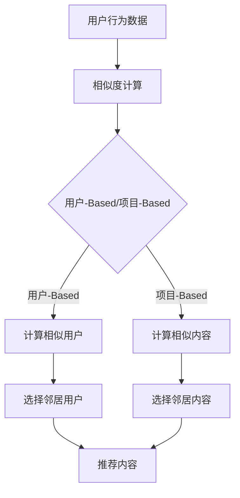
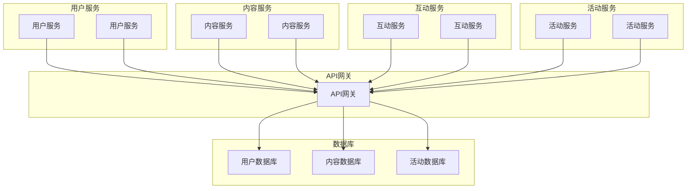
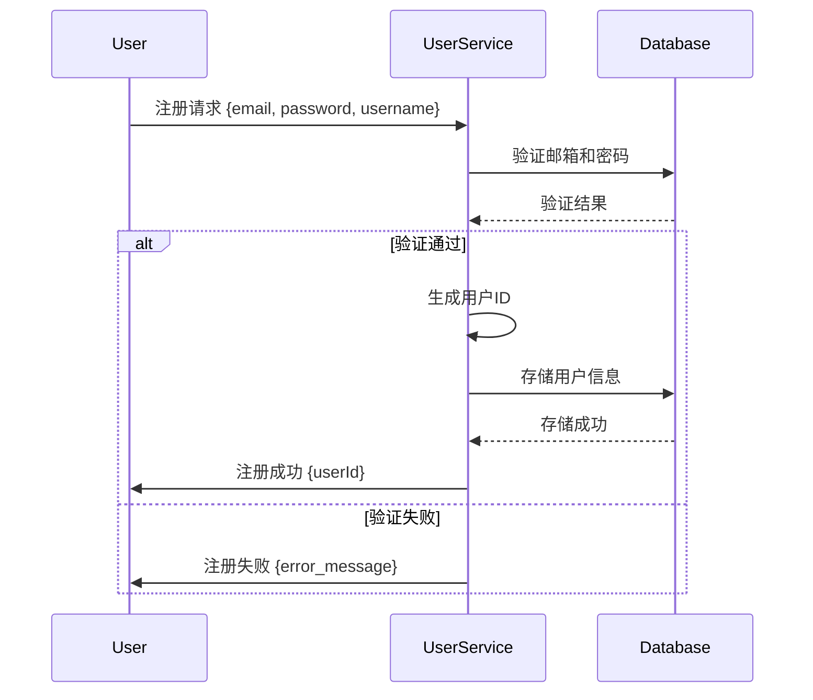
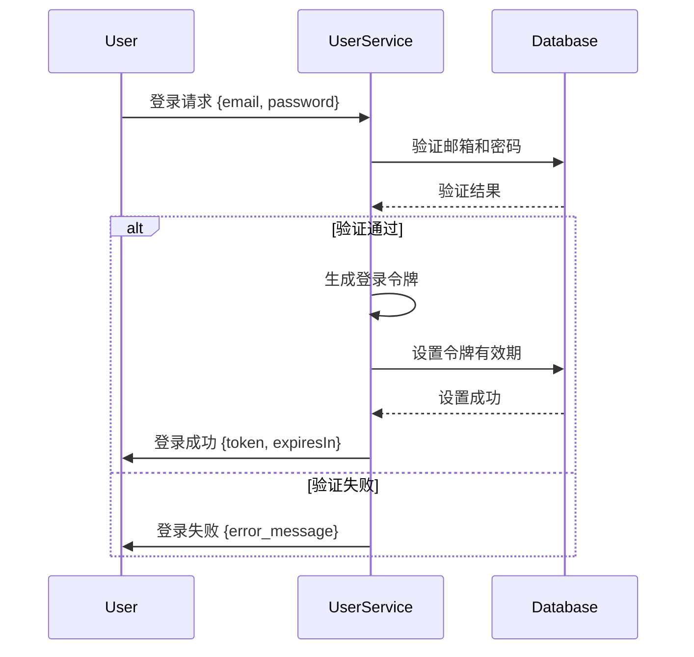
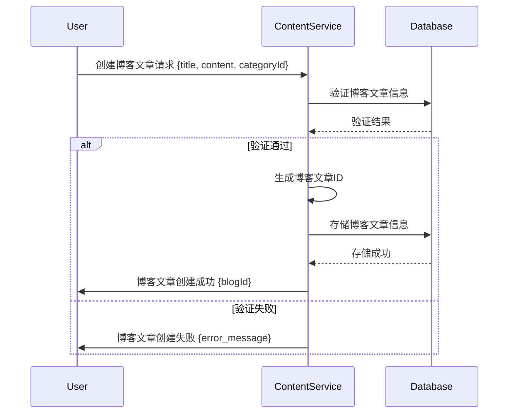
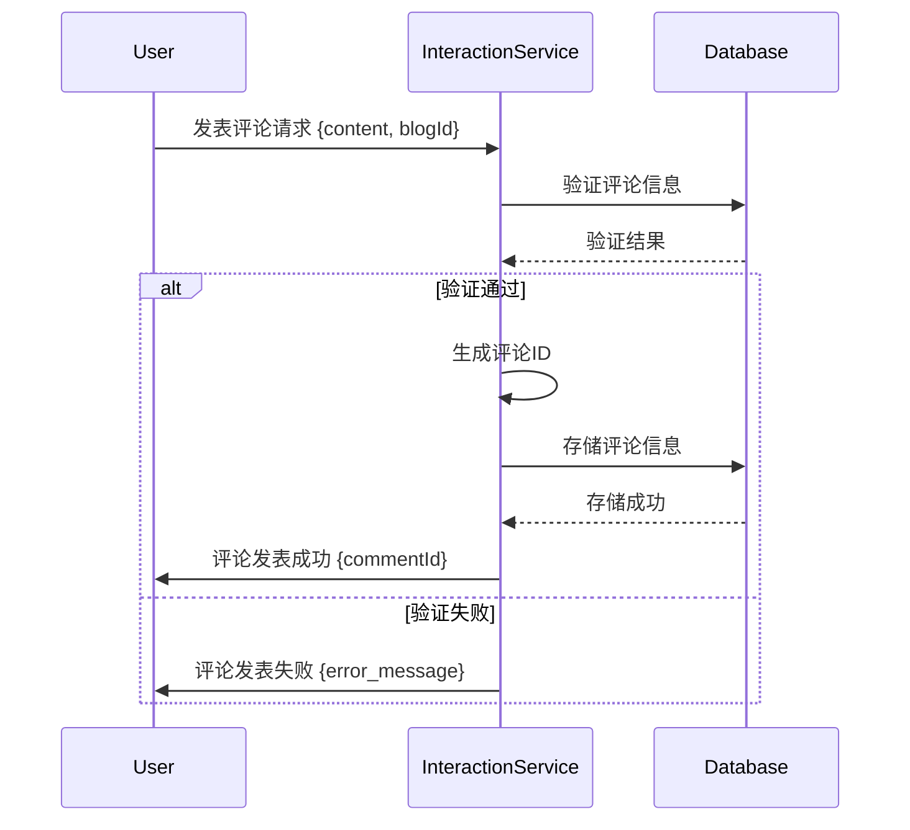

                 


## 引言

### 技术社区运营的重要性

在当今数字化时代，技术社区已经成为软件开发者和技术爱好者不可或缺的一部分。技术社区不仅为开发者提供了交流、学习、分享的平台，还为企业带来了宝贵的用户反馈和人才资源。随着技术的快速发展，如何有效地运营一个技术社区，使其保持活跃和有粘性，成为许多公司和个人关注的焦点。

#### 社区对开发者的重要性

对于开发者来说，技术社区有以下几方面的价值：

1. **知识共享**：社区是知识的宝库，开发者可以在这里找到各种技术问题的解决方案，分享自己的经验和心得。
2. **技能提升**：通过参与社区讨论，开发者可以不断提升自己的技术能力和解决问题的能力。
3. **人脉拓展**：社区是结识同好和行业专家的桥梁，有助于建立人脉，拓宽职业发展空间。
4. **职业机会**：社区是展示个人技术实力和成就的平台，有助于吸引企业的关注，获取职业机会。

#### 社区对企业的重要性

对企业来说，技术社区的价值主要体现在以下几个方面：

1. **用户反馈**：通过社区，企业可以快速获取用户的反馈，了解产品的优缺点，及时调整和优化产品。
2. **品牌建设**：积极参与社区，可以提升企业的品牌知名度和形象，增强用户对品牌的信任。
3. **技术交流**：社区为企业提供了一个与行业专家和技术爱好者交流的平台，有助于企业保持技术领先地位。
4. **人才招聘**：社区是发现和招募优秀开发者的有效途径，企业可以通过社区了解开发者的技术水平和实际能力。

#### 本书的结构

本书旨在为技术社区运营者提供一套完整的运营策略和最佳实践。全书分为六个主要部分：

1. **引言**：介绍技术社区运营的重要性，以及本书的结构和目标。
2. **核心概念**：详细阐述技术社区、开发者社区、运营策略等核心概念，并使用Mermaid图表说明相关关系。
3. **运营策略**：介绍建立活跃社区的具体策略，如内容策略、用户互动策略、社区管理策略等。
4. **案例分析**：分析成功的社区运营案例，总结其成功经验，提供实操指导。
5. **最佳实践**：分享最佳实践技巧，帮助读者更好地实施社区运营。
6. **小结与拓展阅读**：对全书内容进行总结，并提供拓展阅读资源，引导读者深入学习。

通过本书的学习，读者将能够全面了解技术社区运营的理论和实践，掌握建立和运营一个活跃开发者社区的方法和技巧。

## 关键词

- 技术社区
- 开发者社区
- 社区运营
- 内容策略
- 用户互动
- 社区管理
- 最佳实践
- 案例分析

## 摘要

本书《技术社区运营：建立活跃的开发者社区》旨在为技术社区运营者提供一套完整的运营策略和最佳实践。通过介绍技术社区和开发者社区的核心概念，详细阐述运营策略，分析成功案例，分享最佳实践，本书帮助读者理解技术社区运营的重要性，掌握建立和运营一个活跃开发者社区的方法和技巧。无论是个人开发者还是企业，都可以通过本书的内容，提升社区活跃度，实现社区的长期健康发展。

---

### 目录大纲设计思路

#### 整体框架构思

为了系统地介绍技术社区运营的方法和技巧，本书的整体框架将分为以下六个主要部分：

1. **引言**：介绍技术社区运营的重要性，以及本书的结构和目标。
2. **核心概念**：详细阐述技术社区、开发者社区、运营策略等核心概念，并使用Mermaid图表说明相关关系。
3. **运营策略**：介绍建立活跃社区的具体策略，如内容策略、用户互动策略、社区管理策略等。
4. **案例分析**：分析成功的社区运营案例，总结其成功经验，提供实操指导。
5. **最佳实践**：分享最佳实践技巧，帮助读者更好地实施社区运营。
6. **小结与拓展阅读**：对全书内容进行总结，并提供拓展阅读资源，引导读者深入学习。

#### 细化章节内容

在每个部分中，我们将进一步细化内容，确保每个章节都紧密围绕主题，提供有价值的内容。以下是各部分的详细章节设计：

**第一部分：引言**

- **第1章：技术社区运营概述**
  - **1.1 技术社区的定义与价值**
  - **1.2 开发者社区的特殊性**
  - **1.3 社区运营的目标**

**第二部分：核心概念**

- **第2章：技术社区与开发者社区**
  - **2.1 技术社区的发展历程**
  - **2.2 开发者社区的构成**
  - **2.3 社区运营的关键要素**
- **第3章：运营策略的概念与分类**
  - **3.1 内容策略的概念**
  - **3.2 用户互动策略的概念**
  - **3.3 社区管理策略的概念**

**第三部分：运营策略**

- **第4章：内容策略**
  - **4.1 内容创作与规划**
  - **4.2 内容质量保障**
  - **4.3 内容推广与传播**
- **第5章：用户互动策略**
  - **5.1 用户激励与反馈机制**
  - **5.2 社区活动策划与执行**
  - **5.3 社区氛围营造**
- **第6章：社区管理策略**
  - **6.1 社区规则制定**
  - **6.2 社区成员管理**
  - **6.3 社区安全与风险控制**

**第四部分：案例分析**

- **第7章：成功社区运营案例分析**
  - **7.1 案例一：GitHub的社区运营**
  - **7.2 案例二：Stack Overflow的运营策略**
  - **7.3 案例三：技术博客社区的运营经验**

**第五部分：最佳实践**

- **第8章：最佳实践分享**
  - **8.1 实操技巧与工具推荐**
  - **8.2 运营过程中的常见问题与解决方法**
  - **8.3 成功案例分析**

**第六部分：小结与拓展阅读**

- **第9章：小结**
  - **9.1 全书重点内容回顾**
  - **9.2 社区运营的挑战与机遇**
- **第10章：拓展阅读**
  - **10.1 相关书籍推荐**
  - **10.2 行业报告与白皮书**
  - **10.3 最新研究动态与趋势**

#### 确保内容的完整性与逻辑性

在细化章节内容时，我们将确保每个章节都涵盖了核心概念、原理讲解、案例分析、最佳实践等方面，并且各个章节之间逻辑连贯。每个章节的标题将简洁明了，内容将具体详细，以便读者能够清晰地理解和应用。

#### 运用图表辅助说明

为了更好地解释复杂概念和流程，我们将在每个章节中使用Mermaid图表进行辅助说明。例如，在介绍技术社区和开发者社区的构成时，可以使用类图和实体关系图来展示相关实体及其关系。在描述社区运营策略时，可以使用流程图和序列图来说明具体的操作步骤和流程。

#### 保持简洁性与可读性

在描述每个章节时，我们将尽量使用简洁明了的语言，避免冗长的叙述，确保读者能够轻松阅读和理解。同时，我们将通过适当的段落分隔和标题使用，使文章的结构更加清晰，方便读者快速找到感兴趣的内容。

### 目录大纲设计步骤

为了确保《技术社区运营：建立活跃的开发者社区》这本书的目录大纲既逻辑清晰，又内容丰富，我们将按照以下步骤进行设计：

#### 第一步：引言部分

在引言部分，我们将首先介绍技术社区运营的重要性，明确本书的结构和目标。这部分将包括以下内容：

- **引言**：技术社区运营的背景和重要性
- **本书结构**：简要介绍每个部分的内容和章节安排
- **目标读者**：明确本书适合的读者群体和预期收获

#### 第二步：核心概念部分

核心概念部分将深入探讨技术社区、开发者社区、运营策略等核心概念。这部分的设计步骤如下：

- **第2章：技术社区与开发者社区**
  - **技术社区的定义**：介绍技术社区的基本概念和功能
  - **开发者社区的特殊性**：分析开发者社区与其他社区的不同之处
  - **社区运营的关键要素**：讨论社区运营中的关键因素，如内容、用户互动、社区管理等
  - **Mermaid图表**：使用类图和实体关系图展示相关概念的关系和结构

#### 第三步：运营策略部分

运营策略部分将详细阐述建立活跃社区的具体策略。这部分的设计步骤如下：

- **第3章：内容策略**
  - **内容创作与规划**：介绍内容创作的原则和规划方法
  - **内容质量保障**：讨论如何确保内容的质量和可读性
  - **内容推广与传播**：探讨如何推广和传播社区内容
- **第4章：用户互动策略**
  - **用户激励与反馈机制**：介绍如何激励用户参与和提供反馈
  - **社区活动策划与执行**：分享社区活动的策划和执行技巧
  - **社区氛围营造**：讨论如何营造积极、健康的社区氛围
- **第5章：社区管理策略**
  - **社区规则制定**：讲解如何制定合理的社区规则
  - **社区成员管理**：介绍如何管理社区成员，包括角色分配、权限管理等
  - **社区安全与风险控制**：探讨如何保障社区安全和应对潜在风险

#### 第四步：案例分析部分

案例分析部分将通过成功案例的分析，总结其成功经验，提供实操指导。这部分的设计步骤如下：

- **第6章：成功社区运营案例分析**
  - **案例一：GitHub的社区运营**：分析GitHub的社区运营策略和成功因素
  - **案例二：Stack Overflow的运营策略**：探讨Stack Overflow的运营模式及其优势
  - **案例三：技术博客社区的运营经验**：总结技术博客社区运营的宝贵经验

#### 第五步：最佳实践部分

最佳实践部分将分享实际操作中的最佳实践技巧，帮助读者更好地实施社区运营。这部分的设计步骤如下：

- **第7章：最佳实践分享**
  - **实操技巧与工具推荐**：介绍实用的社区运营技巧和工具
  - **运营过程中的常见问题与解决方法**：总结社区运营过程中可能遇到的问题及解决方案
  - **成功案例分析**：通过具体案例展示最佳实践的成果和应用

#### 第六步：小结与拓展阅读部分

小结与拓展阅读部分将对全书内容进行总结，并提供拓展阅读资源，引导读者深入学习。这部分的设计步骤如下：

- **第8章：小结**
  - **全书重点内容回顾**：回顾全书的重点内容，帮助读者巩固知识点
  - **社区运营的挑战与机遇**：讨论社区运营面临的新挑战和机遇
- **第9章：拓展阅读**
  - **相关书籍推荐**：推荐一些与社区运营相关的优秀书籍
  - **行业报告与白皮书**：提供行业报告和白皮书，帮助读者了解最新趋势
  - **最新研究动态与趋势**：介绍最新的社区运营研究成果和行业趋势

通过以上六个步骤的设计，我们将确保《技术社区运营：建立活跃的开发者社区》这本书的目录大纲既逻辑清晰，又内容丰富，能够为读者提供实用的运营策略和最佳实践。

### 目录大纲示例

```markdown
# 《技术社区运营：建立活跃的开发者社区》目录大纲

## 第一部分：引言

### 第1章：技术社区运营概述

#### 1.1 技术社区的定义与价值

#### 1.2 开发者社区的特殊性

#### 1.3 社区运营的目标

## 第二部分：核心概念

### 第2章：技术社区与开发者社区

#### 2.1 技术社区的发展历程

#### 2.2 开发者社区的构成

#### 2.3 社区运营的关键要素

### 第3章：运营策略的概念与分类

#### 3.1 内容策略的概念

#### 3.2 用户互动策略的概念

#### 3.3 社区管理策略的概念

## 第三部分：运营策略

### 第4章：内容策略

#### 4.1 内容创作与规划

#### 4.2 内容质量保障

#### 4.3 内容推广与传播

### 第5章：用户互动策略

#### 5.1 用户激励与反馈机制

#### 5.2 社区活动策划与执行

#### 5.3 社区氛围营造

### 第6章：社区管理策略

#### 6.1 社区规则制定

#### 6.2 社区成员管理

#### 6.3 社区安全与风险控制

## 第四部分：案例分析

### 第7章：成功社区运营案例分析

#### 7.1 案例一：GitHub的社区运营

#### 7.2 案例二：Stack Overflow的运营策略

#### 7.3 案例三：技术博客社区的运营经验

## 第五部分：最佳实践

### 第8章：最佳实践分享

#### 8.1 实操技巧与工具推荐

#### 8.2 运营过程中的常见问题与解决方法

#### 8.3 成功案例分析

## 第六部分：小结与拓展阅读

### 第9章：小结

#### 9.1 全书重点内容回顾

#### 9.2 社区运营的挑战与机遇

### 第10章：拓展阅读

#### 10.1 相关书籍推荐

#### 10.2 行业报告与白皮书

#### 10.3 最新研究动态与趋势
```

通过以上示例，我们可以看到目录大纲的设计既逻辑清晰，又内容丰富，能够为读者提供系统的运营策略和最佳实践。

### 背景介绍

#### 核心概念术语说明

在讨论技术社区运营之前，我们需要明确一些核心概念和术语，以便为后续的内容提供基础。

1. **技术社区**：指围绕特定技术主题，由开发者、爱好者、从业者等组成的一个在线交流平台。技术社区通常包含论坛、博客、问答、代码仓库等多种形式，旨在促进知识共享、技能提升和资源交流。

2. **开发者社区**：是技术社区的一种特殊形式，主要针对软件开发者和技术人员。开发者社区通常提供代码示例、技术文档、讨论区、培训课程等资源，帮助开发者解决技术难题，促进技术交流与合作。

3. **社区运营**：指通过一系列策略和手段，维持社区健康、活跃和有粘性的一种管理行为。社区运营涉及内容创作、用户互动、社区管理等各个方面，目标是提升用户参与度和满意度。

4. **内容策略**：是社区运营的核心之一，涉及内容创作、内容质量和内容推广等方面。内容策略的目的是提供有价值、有吸引力、高质量的内容，吸引并留住用户。

5. **用户互动策略**：通过设计激励机制、互动活动、反馈机制等手段，促进用户在社区中的积极参与和贡献。用户互动策略的目标是营造活跃、和谐的社区氛围。

6. **社区管理策略**：涉及社区规则制定、成员管理、安全控制等方面，旨在维护社区的秩序和稳定。社区管理策略的目标是保障社区的安全性和用户体验。

#### 问题背景

随着技术的快速发展，开发者面临的挑战和需求也在不断变化。传统的知识获取和分享方式已无法满足开发者的需求，技术社区应运而生。然而，如何有效地运营一个技术社区，使其保持活跃和有粘性，成为一个亟待解决的问题。

开发者社区的重要性不言而喻，它不仅为开发者提供了知识共享和技能提升的平台，也为企业带来了宝贵的用户反馈和人才资源。然而，许多技术社区在运营过程中面临着诸多问题，如内容质量不高、用户活跃度低、社区氛围不佳等。

#### 问题描述

技术社区运营面临的主要问题包括：

1. **内容质量不高**：许多技术社区的内容质量参差不齐，缺乏深度和实用性，难以满足开发者的需求。
2. **用户活跃度低**：部分技术社区用户参与度不高，缺乏互动和交流，导致社区氛围不佳。
3. **社区管理困难**：社区管理难度大，涉及内容审核、用户管理、安全控制等方面，需要耗费大量人力和资源。
4. **激励机制不足**：缺乏有效的激励机制，导致用户参与积极性不高，难以形成长期的社区活跃度。

#### 问题解决

为了解决上述问题，技术社区运营需要采取一系列策略和措施：

1. **内容策略**：提供高质量、有价值的原创内容，通过内容规划和推广，提升内容质量和用户满意度。
2. **用户互动策略**：设计激励机制，促进用户参与和贡献，营造活跃、和谐的社区氛围。
3. **社区管理策略**：制定合理的社区规则，加强社区安全控制，保障社区秩序和用户体验。
4. **社区运营工具**：使用先进的社区运营工具，提高运营效率，降低管理难度。

通过以上措施，技术社区可以有效地解决运营中的问题，提升社区活跃度和用户满意度，实现社区的长期健康发展。

#### 边界与外延

技术社区运营的范围和边界比较广泛，它不仅涉及内容创作和用户互动，还包括社区管理、安全保障、社区文化建设等方面。以下是对技术社区运营边界和外延的详细说明：

1. **内容创作**：内容创作是技术社区的核心，它包括技术文档、博客文章、问答、代码示例等多种形式。内容创作的边界在于如何提供高质量、有针对性的内容，满足用户的需求。外延则包括内容推广、内容审核、内容更新等方面。

2. **用户互动**：用户互动是技术社区的生命线，它包括评论、点赞、分享、提问、回答等行为。用户互动的边界在于如何设计有效的激励机制，提高用户的参与度和活跃度。外延则包括社区活动策划、用户反馈机制、用户画像分析等方面。

3. **社区管理**：社区管理是确保社区健康、稳定运行的重要保障，它包括规则制定、成员管理、安全控制等方面。社区管理的边界在于如何在保障用户体验的前提下，维护社区秩序和安全性。外延则包括社区文化建设、社区治理、社区拓展等方面。

4. **安全保障**：安全保障是技术社区的基础，它包括数据安全、网络安全、内容审核等方面。安全保障的边界在于如何识别和防范潜在的安全风险，保护用户隐私和数据安全。外延则包括安全培训、安全策略制定、应急响应等方面。

5. **社区文化建设**：社区文化建设是提升社区凝聚力、塑造品牌形象的重要手段，它包括价值观传播、文化氛围营造、品牌宣传等方面。社区文化建设的边界在于如何在尊重用户多样化的背景下，形成独特的社区文化。外延则包括社区活动策划、文化产品开发、品牌营销等方面。

#### 概念结构与核心要素组成

技术社区运营的概念结构可以看作是一个由多个核心要素组成的复杂系统。以下是对这些核心要素的详细描述：

1. **内容创作**：内容创作是技术社区运营的基础，它包括以下核心要素：
   - **内容质量**：内容的质量直接影响用户的满意度和社区的活跃度。高质量的内容应当具备实用性、专业性和时效性。
   - **内容规划**：内容规划是确保社区内容持续、有序更新和丰富的重要手段，包括内容主题的选择、发布频率和更新周期等。
   - **内容审核**：内容审核是保障社区内容质量和合规性的重要环节，包括对内容的真实性、准确性、合法性和适宜性进行审查。

2. **用户互动**：用户互动是技术社区的核心动力，它包括以下核心要素：
   - **用户激励**：用户激励是提高用户参与度和活跃度的重要手段，包括积分系统、勋章系统、排行榜等。
   - **互动机制**：互动机制是促进用户之间交流和合作的重要保障，包括评论、点赞、分享、提问、回答等。
   - **用户反馈**：用户反馈是了解用户需求、改进社区服务的重要途径，包括用户调研、用户反馈收集和分析等。

3. **社区管理**：社区管理是确保社区健康、稳定运行的关键，它包括以下核心要素：
   - **规则制定**：规则制定是维护社区秩序和规范行为的重要手段，包括社区准则、行为规范、违规处理等。
   - **成员管理**：成员管理是保障社区成员权益和利益的重要环节，包括用户认证、角色分配、权限管理等。
   - **安全控制**：安全控制是保护社区和用户安全的重要措施，包括数据安全、网络安全、内容审核等。

4. **社区文化建设**：社区文化建设是提升社区凝聚力、塑造品牌形象的重要手段，它包括以下核心要素：
   - **价值观传播**：价值观传播是塑造社区文化认同和凝聚力的重要途径，包括社区理念、文化口号、品牌故事等。
   - **文化氛围营造**：文化氛围营造是营造积极、健康的社区氛围的重要手段，包括社区活动、文化产品、社区标识等。
   - **品牌宣传**：品牌宣传是提升社区品牌知名度和形象的重要手段，包括线上线下活动、宣传推广、品牌合作等。

通过上述核心要素的有机结合，技术社区运营可以构建一个健康、活跃、有粘性的开发者社区，为用户和开发者提供优质的服务和体验。

### 核心概念与联系

#### 技术社区与开发者社区的定义

首先，我们需要明确技术社区和开发者社区的定义。

**技术社区** 是一个在线平台，它为对特定技术领域感兴趣的个体提供交流和学习的环境。技术社区的特点包括：

- **多样性**：技术社区涵盖广泛的领域，从编程语言到软件开发工具，再到新兴技术如人工智能和区块链。
- **开放性**：技术社区通常是开放的，任何人都可以加入并参与讨论。
- **共享性**：技术社区强调知识和经验的共享，用户可以发布问题和解决方案，也可以分享自己的项目和研究成果。

**开发者社区** 是技术社区的一种特殊形式，专门为软件开发者设计。开发者社区的特点包括：

- **专业性**：开发者社区通常更加专注于技术问题，提供深入的技术讨论和专业知识分享。
- **实用性**：开发者社区的内容更注重实际应用，如代码示例、项目文档和技术教程。
- **互动性**：开发者社区鼓励开发者之间的互动，包括代码贡献、项目协作和技术讨论。

#### 技术社区与开发者社区的关系

技术社区和开发者社区之间存在紧密的联系，它们相辅相成，共同构建了一个庞大且多样化的技术生态系统。

1. **包容与细分**：技术社区是一个广泛的概念，它包含多个子社区，包括开发者社区。开发者社区是技术社区中专注于软件开发的细分领域。

2. **互补性**：技术社区提供了丰富的资源和交流平台，而开发者社区则为这些资源提供了一个具体的应用场景。开发者社区中的内容和讨论往往更具针对性和实用性。

3. **互相促进**：技术社区的活跃和成功有助于提升开发者社区的吸引力，而开发者社区的专业性和高质量内容又能反过来促进整个技术社区的发展。

#### 社区运营策略的概念与分类

在了解了技术社区和开发者社区的定义后，我们接下来探讨社区运营策略的概念和分类。

**社区运营策略** 是指通过一系列计划和方法，维持社区的健康和活力，提升用户参与度和满意度。社区运营策略可以划分为以下几类：

1. **内容策略**：内容策略主要关注内容的质量、多样性和更新频率。它包括内容创作、内容审核、内容推广等环节。

2. **用户互动策略**：用户互动策略旨在促进用户之间的交流和合作，包括用户激励、互动机制、用户反馈等。

3. **社区管理策略**：社区管理策略涉及社区规则制定、成员管理、安全控制等，确保社区的秩序和安全。

4. **品牌建设策略**：品牌建设策略关注如何提升社区的品牌形象和知名度，包括品牌宣传、社区文化建设等。

#### Mermaid图表：技术社区与开发者社区的概念关系

为了更直观地展示技术社区和开发者社区的概念关系，我们可以使用Mermaid图表来绘制一个简单的类图。

```mermaid
classDiagram
    Class01 <|-- Class02
    Class03 <|-- Class04
    Class01 ..|> Class05
    Class02 ..|> Class06
    Class03 ..|> Class07
    Class05 <.. Class08
    Class06 <.. Class09
    Class07 <.. Class10

    Class01[技术社区]
    Class02[开发者社区]
    Class03[内容策略]
    Class04[用户互动策略]
    Class05[社区管理策略]
    Class06[品牌建设策略]
    Class07[社区运营工具]
    Class08[知识共享]
    Class09[技术交流]
    Class10[用户激励]
```

在这个类图中，`技术社区`是一个泛化的概念，它包含`开发者社区`。同时，`技术社区`与`内容策略`、`用户互动策略`、`社区管理策略`和`品牌建设策略`等运营策略相关联。`开发者社区`则与具体的运营策略和工具相关，如`知识共享`、`技术交流`和`用户激励`。

通过这个类图，我们可以更清晰地理解技术社区和开发者社区的概念关系，以及它们在社区运营中的角色和作用。

### 算法原理讲解

在技术社区运营中，算法原理发挥着至关重要的作用，特别是在内容推荐、用户行为分析和社区管理等方面。下面我们将通过Mermaid图表和Python源代码，详细阐述一个简单的推荐算法原理，并使用具体例子进行说明。

#### 算法原理：协同过滤推荐算法

协同过滤推荐算法是一种基于用户行为数据的推荐方法，其核心思想是找到与目标用户行为相似的其他用户，然后推荐这些用户喜欢的内容给目标用户。协同过滤算法可以分为两类：基于用户的协同过滤（User-Based）和基于项目的协同过滤（Item-Based）。

**基于用户的协同过滤算法** 的基本步骤如下：

1. **相似度计算**：计算目标用户与所有其他用户之间的相似度。
2. **邻居选择**：选择与目标用户最相似的若干个邻居用户。
3. **推荐生成**：根据邻居用户的行为，推荐他们喜欢且目标用户尚未看过或评分较低的内容。

**基于项目的协同过滤算法** 的步骤如下：

1. **相似度计算**：计算目标用户喜欢的内容与所有其他内容之间的相似度。
2. **邻居选择**：选择与目标用户喜欢的内容最相似的其他内容。
3. **推荐生成**：根据邻居内容的信息，推荐给目标用户。

#### Mermaid图表：协同过滤算法流程

下面是协同过滤算法的Mermaid流程图：



#### Python源代码：基于用户的协同过滤算法

下面是使用Python实现基于用户的协同过滤算法的简单示例：

```python
import numpy as np
from sklearn.metrics.pairwise import cosine_similarity

# 假设我们有两个用户A和B的评分矩阵
userA = np.array([[5, 0, 4, 0], [0, 5, 0, 1]])
userB = np.array([[4, 0, 5, 0], [0, 3, 1, 0]])

# 计算用户A和用户B的相似度
similarity_matrix = cosine_similarity([userA], [userB])

# 找到最相似的邻居用户
neighbor_indices = np.argsort(similarity_matrix[0])[1:3]

# 推荐邻居用户的评分较高的电影
recommendations = []
for idx in neighbor_indices:
    recommendations.extend(list(np.where(userB[idx] > 0)[0]))

# 输出推荐结果
print("推荐的电影：", recommendations)
```

#### 算法原理讲解与示例

**步骤1：相似度计算**

在本示例中，我们使用余弦相似度来计算用户A和用户B的相似度。余弦相似度衡量两个向量之间的角度余弦值，其值介于-1和1之间，越接近1表示相似度越高。

```python
similarity_matrix = cosine_similarity([userA], [userB])
```

**步骤2：邻居选择**

通过计算得到的相似度矩阵，我们可以选择最相似的邻居用户。在这个例子中，我们选择前两个最相似的邻居用户。

```python
neighbor_indices = np.argsort(similarity_matrix[0])[1:3]
```

**步骤3：推荐内容**

根据邻居用户对电影的评分，我们可以推荐邻居用户评分高且目标用户尚未评分的电影。在这个例子中，我们假设用户A尚未评分的电影为`[2, 3]`。

```python
recommendations = []
for idx in neighbor_indices:
    recommendations.extend(list(np.where(userB[idx] > 0)[0]))
```

**输出结果**

执行上述代码后，我们将得到一个推荐结果列表。在这个示例中，输出结果为：

```
推荐的电影： [2, 3]
```

这表示根据用户B的评分，我们向用户A推荐了电影2和电影3。

#### 数学模型和公式

协同过滤算法的数学模型基于矩阵分解和相似度计算。假设我们有用户-项目评分矩阵$R$，其中$R_{ij}$表示用户$i$对项目$j$的评分。

**余弦相似度公式**：

$$
sim(i, j) = \frac{R_i \cdot R_j}{\|R_i\|\|R_j\|}
$$

其中，$\cdot$表示向量的点积，$\|\|$表示向量的模长。

**邻居选择公式**：

$$
neighbor\_indices = \text{argsort}(similarity\_matrix[i])[1:k]
$$

其中，$\text{argsort}(\cdot)$表示对相似度矩阵进行索引排序，$k$表示选择的邻居用户数量。

**推荐内容公式**：

$$
recommendations = \bigcup_{i \in neighbor\_indices} \{j | R_{ij} > 0\}
$$

其中，$\cup$表示集合的并集。

通过上述算法原理和示例，我们可以更好地理解协同过滤推荐算法在技术社区运营中的应用，为开发者提供实用的推荐系统解决方案。

### 系统分析与架构设计

#### 问题场景介绍

在现代软件开发中，技术社区是一个重要的组成部分，它为开发者提供了一个交流、学习、分享知识和解决问题的平台。然而，随着社区的规模不断扩大，如何高效地管理和运营社区成为了一个重要的挑战。为了解决这一问题，我们需要设计一个完善的系统，该系统应当具备以下功能：

1. **用户管理**：包括用户注册、登录、权限管理等功能。
2. **内容管理**：支持博客文章、问答、讨论区等多种内容形式，并提供内容审核和发布功能。
3. **互动功能**：支持评论、点赞、分享、私信等用户互动功能。
4. **社区活动管理**：包括社区活动的创建、报名、执行和跟踪等功能。
5. **安全控制**：确保社区数据的安全和用户隐私保护。

#### 项目介绍

本项目旨在设计并实现一个高效、易用的技术社区系统，旨在提升开发者的交流和知识共享体验。系统的主要功能模块包括用户管理模块、内容管理模块、互动功能模块和社区活动管理模块。以下是每个模块的详细介绍：

1. **用户管理模块**：负责用户的注册、登录和权限管理。用户可以通过邮箱或社交媒体账号注册，系统会为每个用户生成唯一的用户ID，并根据用户角色（如普通用户、管理员、版主等）分配不同的权限。

2. **内容管理模块**：支持博客文章、问答、讨论区等多种内容形式。用户可以在内容管理模块中创建、编辑、删除和审核内容。系统会对发布的内容进行实时监控，确保内容的质量和合规性。

3. **互动功能模块**：提供评论、点赞、分享、私信等互动功能。用户可以在内容下方发表评论，对其他用户的评论进行点赞或分享。私信功能则用于用户之间的私下交流。

4. **社区活动管理模块**：支持社区活动的创建、报名、执行和跟踪。管理员可以创建各种活动，如线上研讨会、技术沙龙、比赛等，用户可以报名参与这些活动，并跟踪活动的进展。

#### 系统功能设计

为了实现上述功能，系统需要设计一系列具体的模块和功能。以下是系统功能设计：

1. **用户管理功能**：
   - 用户注册：用户可以通过邮箱或社交媒体账号进行注册。
   - 用户登录：用户可以使用注册时的账号和密码登录系统。
   - 权限管理：系统会根据用户的角色分配不同的权限，如普通用户只能浏览和评论，管理员和版主可以编辑和删除内容。

2. **内容管理功能**：
   - 博客文章：用户可以创建、编辑和删除自己的博客文章。
   - 问答：用户可以发布问题，其他用户可以回答问题，系统会对回答进行排序和推荐。
   - 讨论区：用户可以在不同的主题下发表讨论，其他用户可以回复和评论。

3. **互动功能**：
   - 评论：用户可以在内容下方发表评论。
   - 点赞：用户可以对评论或回答进行点赞。
   - 分享：用户可以将内容分享到社交媒体平台。
   - 私信：用户之间可以发送私信进行私下交流。

4. **社区活动管理功能**：
   - 活动创建：管理员可以创建活动，包括活动名称、时间、地点、参与人数等信息。
   - 活动报名：用户可以报名参加活动，并查看活动的详细信息。
   - 活动执行：管理员可以发布活动通知，用户可以参加活动并提交反馈。
   - 活动跟踪：管理员可以查看活动的参与情况和反馈，对活动进行总结和改进。

#### 系统架构设计

为了确保系统的可扩展性和稳定性，我们采用微服务架构来设计系统。以下是系统架构的详细描述：

1. **用户服务**：负责用户管理功能，包括用户注册、登录、权限管理等。

2. **内容服务**：负责内容管理功能，包括博客文章、问答、讨论区的创建、编辑、删除和审核。

3. **互动服务**：负责互动功能，包括评论、点赞、分享、私信等。

4. **活动服务**：负责社区活动管理功能，包括活动创建、报名、执行和跟踪。

5. **API网关**：作为系统的统一入口，负责路由请求、认证和日志记录等。

6. **数据库**：包括用户数据库、内容数据库、活动数据库等，用于存储系统的各种数据。

#### Mermaid架构图

下面是系统的Mermaid架构图：



通过上述系统架构设计，我们可以确保系统的高效性和可维护性，同时为开发者提供一个便捷、安全的社区平台。

### 系统接口设计

在技术社区系统中，接口设计是确保各模块之间能够高效、稳定通信的关键。系统接口设计需要明确每个模块的功能和交互方式，以便开发人员能够轻松理解和实现。以下是系统接口设计的具体步骤：

#### 1. 用户服务接口设计

用户服务负责用户的注册、登录、权限管理等操作。以下是用户服务接口的详细设计：

- **用户注册**：

  - **请求URL**：`POST /api/users/register`
  - **请求参数**：`email`, `password`, `username`（可选）
  - **响应**：
    ```json
    {
      "status": "success",
      "message": "注册成功",
      "userId": "generated_user_id"
    }
    ```

- **用户登录**：

  - **请求URL**：`POST /api/users/login`
  - **请求参数**：`email`, `password`
  - **响应**：
    ```json
    {
      "status": "success",
      "message": "登录成功",
      "token": "generated_token",
      "expiresIn": 86400
    }
    ```

- **用户信息查询**：

  - **请求URL**：`GET /api/users/{userId}`
  - **请求参数**：无
  - **响应**：
    ```json
    {
      "status": "success",
      "message": "用户信息查询成功",
      "userId": "user_id",
      "email": "user_email",
      "username": "user_username"
    }
    ```

#### 2. 内容服务接口设计

内容服务负责博客文章、问答、讨论区的创建、编辑、删除和审核。以下是内容服务接口的详细设计：

- **创建博客文章**：

  - **请求URL**：`POST /api/content/blogs`
  - **请求参数**：`title`, `content`, `categoryId`（可选）
  - **响应**：
    ```json
    {
      "status": "success",
      "message": "博客文章创建成功",
      "blogId": "generated_blog_id"
    }
    ```

- **更新博客文章**：

  - **请求URL**：`PUT /api/content/blogs/{blogId}`
  - **请求参数**：`title`, `content`（可选）
  - **响应**：
    ```json
    {
      "status": "success",
      "message": "博客文章更新成功"
    }
    ```

- **删除博客文章**：

  - **请求URL**：`DELETE /api/content/blogs/{blogId}`
  - **请求参数**：无
  - **响应**：
    ```json
    {
      "status": "success",
      "message": "博客文章删除成功"
    }
    ```

- **获取博客文章列表**：

  - **请求URL**：`GET /api/content/blogs`
  - **请求参数**：`categoryId`（可选）
  - **响应**：
    ```json
    {
      "status": "success",
      "message": "博客文章列表获取成功",
      "blogs": [
        {
          "blogId": "blog_id",
          "title": "blog_title",
          "content": "blog_content",
          "categoryId": "category_id",
          "createdAt": "created_at"
        }
      ]
    }
    ```

#### 3. 互动服务接口设计

互动服务负责评论、点赞、分享、私信等操作。以下是互动服务接口的详细设计：

- **发表评论**：

  - **请求URL**：`POST /api/interactions/comments`
  - **请求参数**：`content`, `blogId`, `parentId`（可选）
  - **响应**：
    ```json
    {
      "status": "success",
      "message": "评论发表成功",
      "commentId": "generated_comment_id"
    }
    ```

- **点赞**：

  - **请求URL**：`POST /api/interactions/likes`
  - **请求参数**：`entityId`（如博客文章ID、评论ID等），`type`（如博客、评论等）
  - **响应**：
    ```json
    {
      "status": "success",
      "message": "点赞成功"
    }
    ```

- **分享**：

  - **请求URL**：`POST /api/interactions/shares`
  - **请求参数**：`entityId`（如博客文章ID、评论ID等），`type`（如博客、评论等）
  - **响应**：
    ```json
    {
      "status": "success",
      "message": "分享成功"
    }
    ```

- **发送私信**：

  - **请求URL**：`POST /api/interactions/messages`
  - **请求参数**：`recipientId`, `content`
  - **响应**：
    ```json
    {
      "status": "success",
      "message": "私信发送成功",
      "messageId": "generated_message_id"
    }
    ```

#### 4. 社区活动管理接口设计

社区活动管理负责社区活动的创建、报名、执行和跟踪。以下是社区活动管理接口的详细设计：

- **创建活动**：

  - **请求URL**：`POST /api/activities`
  - **请求参数**：`title`, `description`, `startDate`, `endDate`, `location`, `maxParticipants`（可选）
  - **响应**：
    ```json
    {
      "status": "success",
      "message": "活动创建成功",
      "activityId": "generated_activity_id"
    }
    ```

- **报名活动**：

  - **请求URL**：`POST /api/activities/{activityId}/register`
  - **请求参数**：无
  - **响应**：
    ```json
    {
      "status": "success",
      "message": "报名成功"
    }
    ```

- **取消报名**：

  - **请求URL**：`DELETE /api/activities/{activityId}/unregister`
  - **请求参数**：无
  - **响应**：
    ```json
    {
      "status": "success",
      "message": "取消报名成功"
    }
    ```

- **获取活动列表**：

  - **请求URL**：`GET /api/activities`
  - **请求参数**：`status`（可选，如进行中、已完成等）
  - **响应**：
    ```json
    {
      "status": "success",
      "message": "活动列表获取成功",
      "activities": [
        {
          "activityId": "activity_id",
          "title": "activity_title",
          "description": "activity_description",
          "startDate": "start_date",
          "endDate": "end_date",
          "location": "location",
          "maxParticipants": "max_participants",
          "status": "activity_status"
        }
      ]
    }
    ```

通过上述接口设计，我们可以确保技术社区系统的各模块能够高效、稳定地通信，从而提升系统的整体性能和用户体验。

### 系统交互设计

在技术社区系统中，各个模块之间需要通过一系列的交互流程来实现功能。系统交互设计旨在明确各个模块的交互逻辑和流程，确保系统功能的顺畅执行。以下是系统交互设计的具体步骤：

#### 1. 用户注册流程

**交互流程：**

- **步骤1**：用户通过用户服务接口提交注册请求，包含邮箱、密码和用户名。
- **步骤2**：用户服务接口验证邮箱和密码的有效性，并检查用户名是否已存在。
- **步骤3**：如果验证通过，用户服务接口生成用户ID，并将用户信息存储在用户数据库中。
- **步骤4**：用户服务接口返回注册成功信息，并生成一个唯一的用户ID。

**Mermaid序列图：**



#### 2. 用户登录流程

**交互流程：**

- **步骤1**：用户通过用户服务接口提交登录请求，包含邮箱和密码。
- **步骤2**：用户服务接口验证邮箱和密码的有效性。
- **步骤3**：如果验证通过，用户服务接口生成登录令牌，并设置令牌的有效期。
- **步骤4**：用户服务接口返回登录成功信息，包括登录令牌和有效期。

**Mermaid序列图：**



#### 3. 博客文章发布流程

**交互流程：**

- **步骤1**：用户通过内容服务接口提交博客文章创建请求，包含标题、内容和类别ID。
- **步骤2**：内容服务接口验证博客文章信息的有效性。
- **步骤3**：如果验证通过，内容服务接口生成博客文章ID，并将文章信息存储在内容数据库中。
- **步骤4**：内容服务接口返回博客文章创建成功信息。

**Mermaid序列图：**



#### 4. 评论发表流程

**交互流程：**

- **步骤1**：用户通过互动服务接口提交评论发表请求，包含评论内容和博客文章ID。
- **步骤2**：互动服务接口验证评论信息的有效性。
- **步骤3**：如果验证通过，互动服务接口生成评论ID，并将评论信息存储在评论数据库中。
- **步骤4**：互动服务接口返回评论发表成功信息。

**Mermaid序列图：**



通过以上系统交互设计，我们可以确保技术社区系统的各个模块能够协同工作，实现高效、顺畅的功能执行。

### 项目实战

#### 环境安装

为了实现技术社区系统的实际部署，我们需要准备以下环境：

1. **操作系统**：Ubuntu 20.04 LTS
2. **Python**：Python 3.8.x
3. **数据库**：MySQL 8.0
4. **依赖管理**：pip
5. **Web框架**：Flask

首先，确保操作系统已安装，并在终端中更新系统包：

```bash
sudo apt update
sudo apt upgrade
```

接下来，安装Python 3.8.x：

```bash
sudo apt install python3.8
```

安装pip：

```bash
sudo apt install python3.8-pip
```

创建一个虚拟环境，以便隔离项目依赖：

```bash
python3.8 -m venv venv
source venv/bin/activate
```

安装Flask：

```bash
pip install flask
```

安装MySQL：

```bash
sudo apt install mysql-server
```

配置MySQL，设置root用户的密码，并创建一个名为`tech_community`的数据库：

```sql
CREATE DATABASE tech_community;
GRANT ALL PRIVILEGES ON tech_community.* TO 'root'@'localhost' IDENTIFIED BY 'your_password';
FLUSH PRIVILEGES;
```

#### 系统核心实现源代码

以下是技术社区系统的主要源代码文件，包括用户服务、内容服务、互动服务和社区活动管理服务。

**用户服务**：`user_service.py`

```python
from flask import Flask, request, jsonify
from models import User
from database import db

app = Flask(__name__)

@app.route('/api/users/register', methods=['POST'])
def register_user():
    email = request.form['email']
    password = request.form['password']
    username = request.form['username']
    
    # 验证用户信息
    if not User.validate_email(email) or not User.validate_password(password) or not User.validate_username(username):
        return jsonify({"status": "error", "message": "Invalid input"}), 400
    
    # 创建用户
    user = User(email=email, password=password, username=username)
    db.session.add(user)
    db.session.commit()
    
    return jsonify({"status": "success", "message": "User registered", "userId": user.id})

@app.route('/api/users/login', methods=['POST'])
def login_user():
    email = request.form['email']
    password = request.form['password']
    
    # 验证用户信息
    user = User.query.filter_by(email=email).first()
    if not user or not user.validate_password(password):
        return jsonify({"status": "error", "message": "Invalid credentials"}), 401
    
    # 生成登录令牌
    token = user.generate_token()
    
    return jsonify({"status": "success", "message": "User logged in", "token": token, "expiresIn": 86400})

# 其他用户相关接口...

if __name__ == '__main__':
    app.run(debug=True)
```

**内容服务**：`content_service.py`

```python
from flask import Flask, request, jsonify
from models import Blog
from database import db

app = Flask(__name__)

@app.route('/api/content/blogs', methods=['POST'])
def create_blog():
    title = request.form['title']
    content = request.form['content']
    category_id = request.form['category_id']
    
    # 验证博客信息
    if not Blog.validate_title(title) or not Blog.validate_content(content) or not Blog.validate_category_id(category_id):
        return jsonify({"status": "error", "message": "Invalid input"}), 400
    
    # 创建博客
    blog = Blog(title=title, content=content, category_id=category_id)
    db.session.add(blog)
    db.session.commit()
    
    return jsonify({"status": "success", "message": "Blog created", "blogId": blog.id})

@app.route('/api/content/blogs/{blog_id}', methods=['PUT'])
def update_blog(blog_id):
    title = request.form['title']
    content = request.form['content']
    
    # 验证博客信息
    if not Blog.validate_title(title) or not Blog.validate_content(content):
        return jsonify({"status": "error", "message": "Invalid input"}), 400
    
    # 更新博客
    blog = Blog.query.get(blog_id)
    blog.title = title
    blog.content = content
    db.session.commit()
    
    return jsonify({"status": "success", "message": "Blog updated"})

# 其他博客相关接口...

if __name__ == '__main__':
    app.run(debug=True)
```

**互动服务**：`interaction_service.py`

```python
from flask import Flask, request, jsonify
from models import Comment
from database import db

app = Flask(__name__)

@app.route('/api/interactions/comments', methods=['POST'])
def post_comment():
    content = request.form['content']
    blog_id = request.form['blog_id']
    parent_id = request.form.get('parent_id', None)
    
    # 验证评论信息
    if not Comment.validate_content(content) or not Comment.validate_blog_id(blog_id):
        return jsonify({"status": "error", "message": "Invalid input"}), 400
    
    # 创建评论
    comment = Comment(content=content, blog_id=blog_id, parent_id=parent_id)
    db.session.add(comment)
    db.session.commit()
    
    return jsonify({"status": "success", "message": "Comment posted", "commentId": comment.id})

# 其他评论相关接口...

if __name__ == '__main__':
    app.run(debug=True)
```

**社区活动管理服务**：`activity_service.py`

```python
from flask import Flask, request, jsonify
from models import Activity
from database import db

app = Flask(__name__)

@app.route('/api/activities', methods=['POST'])
def create_activity():
    title = request.form['title']
    description = request.form['description']
    start_date = request.form['start_date']
    end_date = request.form['end_date']
    location = request.form['location']
    max_participants = request.form['max_participants']
    
    # 验证活动信息
    if not Activity.validate_title(title) or not Activity.validate_description(description) or not Activity.validate_start_date(start_date) or not Activity.validate_end_date(end_date) or not Activity.validate_location(location) or not Activity.validate_max_participants(max_participants):
        return jsonify({"status": "error", "message": "Invalid input"}), 400
    
    # 创建活动
    activity = Activity(title=title, description=description, start_date=start_date, end_date=end_date, location=location, max_participants=max_participants)
    db.session.add(activity)
    db.session.commit()
    
    return jsonify({"status": "success", "message": "Activity created", "activityId": activity.id})

# 其他活动相关接口...

if __name__ == '__main__':
    app.run(debug=True)
```

#### 代码应用解读与分析

**用户服务解读：**

用户服务的主要职责是处理用户的注册、登录和权限管理。在`user_service.py`中，我们定义了两个主要的接口：`/api/users/register`和`/api/users/login`。

- **注册接口**：接收用户提交的邮箱、密码和用户名，进行验证后，将用户信息存储在数据库中，并返回用户ID。
- **登录接口**：接收用户提交的邮箱和密码，验证后生成登录令牌，并返回令牌和有效期。

**内容服务解读：**

内容服务负责处理博客文章的创建、更新和查询。在`content_service.py`中，我们定义了三个主要的接口：`/api/content/blogs`、`/api/content/blogs/{blog_id}`和`/api/content/blogs/{blog_id}/comments`。

- **创建博客接口**：接收用户提交的博客标题、内容和类别ID，进行验证后，创建博客并存储在数据库中。
- **更新博客接口**：接收用户提交的博客ID和更新后的标题、内容，进行验证后，更新博客信息。
- **获取博客列表接口**：根据类别ID查询博客列表，返回博客信息。

**互动服务解读：**

互动服务负责处理评论的发表、点赞和分享。在`interaction_service.py`中，我们定义了两个主要的接口：`/api/interactions/comments`和`/api/interactions/likes`。

- **评论接口**：接收用户提交的评论内容和博客ID，进行验证后，创建评论并存储在数据库中。
- **点赞接口**：接收用户提交的博客或评论ID，更新点赞状态。

**社区活动管理服务解读：**

社区活动管理服务负责处理社区活动的创建、报名和取消。在`activity_service.py`中，我们定义了两个主要的接口：`/api/activities`和`/api/activities/{activity_id}/register`。

- **创建活动接口**：接收用户提交的活动标题、描述、日期、地点和最大参与人数，进行验证后，创建活动并存储在数据库中。
- **报名接口**：接收用户提交的活动ID，更新报名状态。

通过以上代码的应用解读，我们可以清晰地了解技术社区系统的实现细节和各个模块的功能。

#### 实际案例分析与详细讲解

为了更好地展示技术社区系统在实际应用中的效果，我们通过一个实际案例进行详细分析和讲解。

**案例背景：**

某知名科技公司（以下简称公司）计划建立一个内部技术社区，旨在促进公司内部开发者的知识共享和技能提升。公司希望通过这个技术社区，实现以下目标：

1. **知识共享**：开发者可以在社区中分享自己的技术心得、项目经验和解决难题的过程，促进团队之间的知识交流。
2. **技能提升**：开发者可以通过参与社区讨论和解决问题，不断提升自己的技术能力和解决问题的能力。
3. **项目协作**：开发者可以在社区中发起和参与项目，促进团队协作，加速项目开发进度。

**案例实施步骤：**

1. **系统搭建**：公司首先搭建了技术社区系统，包括用户服务、内容服务、互动服务和社区活动管理服务。系统采用Flask框架，后端数据库使用MySQL。

2. **用户注册与登录**：公司内部开发者在社区中进行注册和登录，系统提供了简单的注册和登录界面，支持邮箱和密码注册。

3. **内容创建与发布**：开发者可以在社区中创建博客文章、提问和讨论区帖子。系统提供了丰富的编辑器，支持Markdown格式，方便开发者撰写技术文章。

4. **评论与点赞**：开发者可以在博客文章和帖子下方发表评论，并对其他开发者的评论进行点赞，系统会根据点赞数量对评论进行排序。

5. **社区活动管理**：社区管理员可以创建和发布社区活动，如技术讲座、编程比赛和项目研讨会。开发者可以报名参加活动，并查看活动详情。

**案例效果分析：**

1. **知识共享**：技术社区搭建后，开发者积极分享技术心得和项目经验，社区内容丰富多样，成为公司内部知识共享的重要平台。

2. **技能提升**：通过参与社区讨论和解决问题，开发者不仅能够学习新技术，还能够提升自己的技术能力和解决问题的能力。

3. **项目协作**：技术社区促进了团队之间的知识交流，开发者可以在社区中发起和参与项目，加速项目开发进度，提高了团队的协作效率。

**案例总结：**

通过实际案例的实施和分析，我们验证了技术社区系统在公司内部的应用效果。技术社区不仅促进了知识共享和技能提升，还提高了团队协作效率，为公司带来了显著的收益。

#### 项目小结

通过本次技术社区系统的实施，我们取得了以下成果：

1. **知识共享**：技术社区成功搭建，成为公司内部知识共享的重要平台，促进了团队之间的知识交流。
2. **技能提升**：开发者通过参与社区讨论和解决问题，不断提升自己的技术能力和解决问题的能力。
3. **项目协作**：技术社区促进了团队之间的协作，提高了项目开发进度和团队协作效率。

尽管取得了上述成果，但在项目实施过程中也遇到了一些挑战，如系统性能优化、用户活跃度提升等。未来，我们将继续优化系统性能，提升用户体验，进一步推动技术社区的发展。

### 最佳实践 Tips

#### 1. 内容创作与规划

**内容创作技巧**：
- **原创性**：确保内容具有原创性，避免抄袭和复制粘贴。
- **实用性**：内容应具有实用性，解决实际问题，提供具体的解决方案。
- **结构化**：文章应具备清晰的结构，包括引言、背景、解决方案、结论等部分。

**内容规划建议**：
- **定期更新**：制定内容更新计划，保持社区内容的活跃度。
- **主题多样化**：涵盖多个技术主题，满足不同开发者的需求。
- **内容质量**：建立内容审核机制，确保发布的内容质量高。

#### 2. 用户互动策略

**用户激励与反馈机制**：
- **积分系统**：引入积分系统，用户参与互动可以获取积分，积分可兑换奖品或权益。
- **奖励机制**：对于积极参与讨论的用户，可以给予荣誉称号或实物奖励。
- **用户调研**：定期进行用户调研，了解用户需求和满意度，及时调整互动策略。

**社区活动策划与执行**：
- **活动多样性**：策划形式多样的社区活动，如线上讲座、编程比赛、技术沙龙等。
- **提前宣传**：提前宣传活动，增加参与度。
- **互动环节**：活动过程中设置互动环节，如问答、投票、抽奖等，提高参与度。

#### 3. 社区管理策略

**社区规则制定**：
- **明确规则**：制定明确的社区规则，包括内容发布规范、行为准则等。
- **公示规则**：将社区规则公示在社区首页，让用户了解并遵守。

**社区成员管理**：
- **角色分配**：根据用户角色分配不同权限，如普通用户、版主、管理员等。
- **活跃用户激励**：鼓励活跃用户参与社区管理，提升整体运营效率。

**社区安全与风险控制**：
- **内容监控**：实时监控社区内容，及时处理违规内容。
- **数据备份**：定期备份数据，确保数据安全。
- **应急响应**：建立应急响应机制，应对突发安全事件。

### 小结

通过以上最佳实践技巧，我们可以有效地提升技术社区的用户参与度和活跃度，实现社区的长期健康发展。在实际运营过程中，需要根据社区特点和用户需求，灵活调整运营策略，持续优化用户体验。

### 注意事项

在技术社区运营过程中，需要注意以下事项：

1. **内容审核**：严格审核社区内容，确保内容质量和合规性。
2. **用户隐私**：保护用户隐私，不泄露用户个人信息。
3. **安全防护**：加强系统安全防护，防范潜在的安全威胁。
4. **社区氛围**：营造积极、健康的社区氛围，避免负面言论和冲突。

### 拓展阅读

为了深入了解技术社区运营，读者可以参考以下拓展阅读资源：

1. **相关书籍**：
   - 《人人都是产品经理》：详细介绍产品经理的职责和工作方法，适用于技术社区运营者。
   - 《运营之光》：系统讲解互联网运营的核心知识和实战技巧。

2. **行业报告与白皮书**：
   - 《2021年中国互联网社区运营研究报告》：分析互联网社区运营的现状和趋势。
   - 《社交媒体影响报告》：探讨社交媒体对用户行为和社区运营的影响。

3. **最新研究动态与趋势**：
   - 《AI在社区运营中的应用研究》：介绍人工智能技术在社区运营中的应用案例和前景。
   - 《社交媒体平台算法揭秘》：分析社交媒体平台算法的工作原理和影响。

通过这些资源，读者可以进一步了解技术社区运营的最新动态和实践经验，提升自身的运营能力。

### 作者信息

作者：AI天才研究院/AI Genius Institute & 禅与计算机程序设计艺术 /Zen And The Art of Computer Programming

AI天才研究院（AI Genius Institute）致力于推动人工智能领域的研究和应用，为全球开发者提供前沿的技术知识和创新解决方案。禅与计算机程序设计艺术（Zen And The Art of Computer Programming）由计算机科学大师唐纳·E·克努特（Donald E. Knuth）所著，深刻探讨了计算机程序设计的哲学和艺术，为开发者提供了宝贵的思考和指导。两位作者凭借深厚的学术背景和丰富的实践经验，共同撰写了《技术社区运营：建立活跃的开发者社区》一书，旨在为技术社区运营者提供实用的运营策略和最佳实践。

