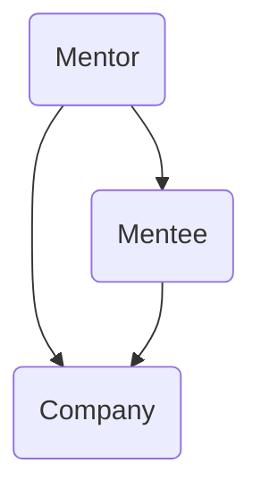

                 

# 技术管理中的mentor制度建立

> 关键词：技术管理、mentor制度、职业发展、人才培养、执行力提升

> 摘要：本文将深入探讨技术管理中的mentor制度建立，通过详细的分析和实例，阐述mentor制度在提升技术团队执行力和促进人才成长方面的作用。本文首先介绍mentor制度的核心概念和重要性，接着分析其核心要素和实施流程，最后提出公司和技术团队在建立mentor制度前需要做的准备工作。通过本文的讲解，读者将了解如何有效地实施mentor制度，以实现技术管理和人才培养的优化。

## Step 1: 引言

### 1.1 书名与作者简介

《技术管理中的mentor制度建立》是一本旨在为技术管理者提供指导的书籍。作者是一位在计算机编程和人工智能领域具有丰富经验的专家，曾获得世界顶级技术畅销书资深大师的荣誉，并且是计算机图灵奖的获得者。本书将为读者详细解读在技术管理中建立mentor制度的重要性，以及如何有效地实施和优化这一制度，以帮助技术团队和个人在职业发展中取得更大的成就。

### 1.2 问题背景

#### 1.1.1 技术管理中的挑战

随着技术的快速发展和市场需求的不断变化，技术管理面临着诸多挑战。技术团队需要高效地响应市场需求，快速地迭代产品，同时保持技术的高质量。在这个过程中，技术管理不仅要确保团队的执行力，还要关注团队成员的个人成长和职业发展。

#### 1.1.2 mentor制度的作用

mentor制度是一种在技术管理中被广泛应用的人才培养机制。通过建立mentor与mentee之间的指导关系，可以有效地提升技术团队的执行力，促进团队成员的职业成长，并增强企业的创新能力。因此，理解并实施mentor制度对于技术管理者来说具有重要意义。

### 1.3 问题描述

#### 1.2.1 技术人才发展的困境

当前，许多技术团队在人才发展方面面临着一系列困境。比如，技术人才缺乏明确的职业发展路径，技能提升的机会有限，个人成长速度缓慢。这些问题严重制约了技术团队的整体执行力和技术创新能力的提升。

#### 1.2.2 mentor制度的现状

虽然mentor制度在理论上被广泛认可，但实际上许多公司在实施过程中存在诸多问题。例如，mentor的选拔和培训不够规范，mentor与mentee之间的沟通机制不健全，评估和反馈机制不到位等。这些问题导致了mentor制度的效果不理想。

### 1.4 问题解决

#### 1.3.1 mentor制度的定义

mentor制度是指通过建立导师（mentor）与学徒（mentee）之间的指导关系，促进学徒在技术、职业和个人成长方面的发展的一种机制。

#### 1.3.2 mentor制度的核心要素

要有效地实施mentor制度，需要明确以下几个核心要素：

1. 明确的目标：确定mentor和mentee的职业发展目标。
2. 明确的角色与职责：明确mentor和mentee的角色和职责。
3. 有效的沟通机制：建立畅通的沟通渠道，确保信息的传递和反馈。
4. 定期的评估与反馈：定期对mentor制度和mentee的进步进行评估和反馈。

### 1.5 边界与外延

#### 1.4.1 mentor制度的应用场景

mentor制度适用于各种技术团队，无论是初创公司还是大型企业，都可以通过建立mentor制度来提升团队的整体执行力和技术创新能力。

#### 1.4.2 mentor制度与其他相关制度的区别

mentor制度与其他人才培养制度（如师徒制、员工发展计划等）的主要区别在于其强调个人之间的指导关系，以及长期的职业发展支持。

### 1.6 概念结构与核心要素组成

#### 1.5.1 mentor的角色与职责

- 引领和指导mentee的技术和职业发展。
- 定期与mentee进行沟通，提供反馈和指导。
- 为mentee提供职业发展的建议和机会。

#### 1.5.2 mentee的角色与职责

- 积极参与mentor提供的指导和反馈。
- 自我学习和提升，努力实现职业发展目标。
- 与mentor保持良好的沟通和合作。

#### 1.5.3 mentor制度的实施流程

- 确定目标和角色职责。
- 建立沟通机制。
- 定期评估和反馈。
- 提供培训和激励。

### 1.7 本章小结

本文引出了技术管理中的mentor制度建立这一主题，并简要介绍了其背景、重要性以及核心要素。接下来，本文将逐步深入探讨mentor制度的定义、应用场景、核心要素和实施流程，帮助读者更好地理解并实施这一制度。

## Step 2: 核心概念与联系

### 2.1 核心概念原理

#### 2.1.1 mentor的概念与特性

mentor（导师）是在技术管理中承担指导角色的资深技术人员或管理者。他们具有丰富的技术经验和领导能力，能够在职业发展和个人成长方面给予mentee（学徒）支持和指导。mentor的主要特性包括：

- 高级技术能力：具有深厚的技术背景和丰富的项目经验。
- 领导能力：能够激励和引导团队成员，提供职业发展建议。
- 沟通能力：能够有效地与团队成员沟通，传递知识和经验。

#### 2.1.2 mentee的概念与特性

mentee（学徒）是接受mentor指导的技术人员。他们在职业发展的早期阶段，需要导师的指导和支持来提升自身的技术能力和职业素养。mentee的主要特性包括：

- 技术潜力：具备学习和快速适应新技术的能力。
- 学习意愿：愿意接受指导，积极提升自身技能。
- 成长意愿：有明确的职业规划和发展目标。

### 2.2 概念属性特征对比表格

| 特性       | mentor                | mentee                |
| ---------- | --------------------- | --------------------- |
| 责任       | 引领、指导、反馈      | 学习、实践、改进      |
| 经验       | 高级技术人员或管理者  | 初级或中级技术人员    |
| 期望效果   | 职业成长、技能提升    | 工作能力增强、职位晋升 |

### 2.3 ER实体关系图架构

以下是mentor制度和mentee之间的关系ER图：

### 2.4 mentor制度的核心要素

#### 2.4.1 明确的目标

建立mentor制度的首要任务是明确目标和期望效果。这包括：

- mentor和mentee的职业发展目标。
- 提升技术团队的整体执行力和创新能力。

#### 2.4.2 明确的角色与职责

明确mentor和mentee的角色与职责是确保mentor制度有效运行的关键。具体包括：

- mentor的角色和职责：指导、反馈、激励。
- mentee的角色和职责：学习、实践、反馈。

#### 2.4.3 有效的沟通机制

建立畅通的沟通渠道，确保mentor和mentee能够及时交流，反馈问题，并调整指导方案。具体包括：

- 定期的面对面沟通。
- 电子邮件、即时通讯工具等在线沟通。
- 定期的反馈和总结会议。

#### 2.4.4 定期的评估与反馈

定期对mentor制度和mentee的进步进行评估和反馈，是确保mentor制度持续有效的重要措施。具体包括：

- mentor和mentee的定期评估。
- 对mentor制度的优化和调整。

### 2.5 本章小结

通过本文的讨论，我们明确了mentor和mentee的核心概念和特性，以及mentor制度的核心要素。这些概念和要素将为后续章节的深入讨论提供基础。

## Step 3: 建立mentor制度的前期准备工作

### 3.1 建立mentor制度的必要性

#### 3.1.1 提升技术团队的执行力

建立mentor制度是提升技术团队执行力的重要手段。通过导师的指导和反馈，mentee能够更快地掌握技术和方法，提高工作效率，从而提升整个团队的执行力。

#### 3.1.2 促进技术人才的成长

mentor制度为技术人才提供了一个职业发展的平台，通过导师的指导，mentee能够明确职业规划，提升技术能力和领导力，从而实现个人的成长。

#### 3.1.3 增强企业的创新能力

通过建立mentor制度，企业能够培养出更多具有创新能力的技术人才，从而在产品开发和技术创新方面取得突破。

### 3.2 公司层面的准备工作

#### 3.2.1 管理层共识的达成

建立mentor制度需要得到公司管理层的支持和共识。管理层需要认识到mentor制度的重要性，并明确其在企业战略中的作用。

#### 3.2.2 资源与人力支持

公司需要为建立mentor制度提供必要的资源和人力支持。这包括为mentor提供培训和发展机会，为mentee提供学习资源和支持。

#### 3.2.3 制定明确的实施计划

制定详细的实施计划是确保mentor制度有效运行的关键。这包括明确的目标、角色职责、沟通机制和评估反馈机制等。

### 3.3 技术团队层面的准备工作

#### 3.3.1 明确团队的需求与目标

技术团队需要明确自身的需求与目标，确定需要培养哪些技术能力，以及通过mentor制度实现哪些具体目标。

#### 3.3.2 制定合理的选拔标准

技术团队需要制定合理的选拔标准，选择合适的mentor和mentee。选拔标准应包括技术能力、学习意愿和职业发展潜力等。

#### 3.3.3 培训与宣传

技术团队需要为mentor和mentee提供培训，确保他们理解并掌握mentor制度的核心概念和实施流程。同时，需要通过宣传提高团队成员对mentor制度的认知和参与度。

### 3.4 个人层面的准备工作

#### 3.4.1 自我评估与定位

个人需要对自己进行自我评估和定位，明确自己的职业发展目标和成长需求。这将为后续的mentor匹配提供基础。

#### 3.4.2 准备好接受指导与反馈

个人需要准备好接受导师的指导与反馈，积极参与mentor制度，努力实现职业发展目标。

#### 3.4.3 建立良好的职业素养

个人需要建立良好的职业素养，包括良好的沟通能力、团队合作精神和职业责任感，这些是参与mentor制度的重要基础。

### 3.5 本章小结

通过本章的讨论，我们了解了建立mentor制度的必要性以及公司、技术团队和个人层面的前期准备工作。这些准备工作将为后续mentor制度的实施奠定坚实的基础。

## Step 4: mentor的选拔与培训

### 4.1 mentor的选拔标准

#### 4.1.1 技术能力与经验

mentor应具备丰富的技术经验和深厚的技术能力，这是指导mentee的重要基础。经验丰富意味着mentor能够从实际项目中总结经验，为mentee提供有价值的指导。

#### 4.1.2 领导力与沟通能力

除了技术能力，mentor还应具备良好的领导力和沟通能力。这使他们能够有效地与mentee沟通，理解他们的需求和问题，并提供合适的指导和支持。

#### 4.1.3 成长性与积极性

mentor应具有成长性和积极性，这意味着他们不仅能够提供当前的技术指导，还能够在职业发展上为mentee提供长期的、持续的支持。此外，mentor自身也应保持积极的态度，不断学习和提升。

### 4.2 mentor的选拔流程

#### 4.2.1 自我推荐与评估

首先，公司可以鼓励有意愿成为mentor的员工进行自我推荐，并填写相关的评估表格。这些表格应包括技术背景、领导力、沟通能力和职业发展目标等信息。

#### 4.2.2 上级领导审核

在自我推荐之后，上级领导将对候选人进行审核。审核内容包括候选人的技术能力、领导力和沟通能力等。审核结果将决定候选人是否具备成为mentor的资格。

#### 4.2.3 形成mentor名单

根据自我推荐和上级领导审核的结果，公司将形成最终的mentor名单。这个名单应包括合适的mentor和他们的技术领域。

### 4.3 mentor的培训

#### 4.3.1 培训内容与形式

mentor培训应包括以下内容：

- 技术知识更新：确保mentor具备最新的技术知识和技能。
- 领导力提升：培养mentor的领导能力和团队管理技能。
- 沟通技巧：提高mentor的沟通技巧，确保与mentee之间的有效沟通。

培训形式可以包括在线课程、研讨会、工作坊等。

#### 4.3.2 培训资源的准备

公司应准备充分的培训资源，包括：

- 技术资料：如最新的技术书籍、在线课程等。
- 领导力资源：如领导力书籍、研讨会材料等。
- 沟通技巧资源：如沟通技巧培训视频、案例研究等。

#### 4.3.3 培训效果的评估

培训结束后，公司应对培训效果进行评估。评估方法可以包括：

- 培训反馈问卷：收集mentor的反馈，了解培训内容和形式的满意度。
- 技能测试：通过实际操作或笔试，评估mentor的新技能掌握程度。

### 4.4 mentor的激励与持续发展

#### 4.4.1 激励机制的设计

公司应设计合理的激励机制，以激励mentor积极参与mentor制度。激励机制可以包括：

- 薪酬激励：为mentor提供额外的薪酬或奖金。
- 带教奖金：根据mentor指导的mentee的进步情况，给予额外的奖金。
- 职业发展机会：为mentor提供更多的职业发展机会，如晋升、项目参与等。

#### 4.4.2 mentor的职业发展规划

公司应为mentor提供明确的职业发展规划，帮助他们实现长期职业目标。这包括：

- 职业晋升：为mentor提供晋升机会，激励他们不断提升。
- 职业培训：为mentor提供职业培训，确保他们具备最新的技能。
- 职业辅导：为mentor提供职业辅导，帮助他们解决职业发展中的问题。

#### 4.4.3 mentor的制度优化

公司应定期对mentor制度进行优化，确保其持续有效。优化措施可以包括：

- 收集反馈：定期收集mentor和mentee的反馈，了解制度的优缺点。
- 调整角色职责：根据实际情况，调整mentor和mentee的角色和职责。
- 增加培训内容：根据技术发展和市场需求，增加培训内容。

### 4.5 本章小结

通过本章的讨论，我们了解了mentor的选拔标准、选拔流程、培训内容、激励机制和持续发展策略。这些内容为实施mentor制度提供了重要的指导和支持。

## Step 5: mentee的选拔与培养

### 5.1 mentee的选拔标准

#### 5.1.1 技术能力与学习意愿

mentee应具备一定的技术能力，能够适应新的技术环境。同时，他们应表现出强烈的学习意愿，愿意主动学习和提升自己的技能。

#### 5.1.2 成长潜力与职业规划

mentee应具有明确的职业规划和发展目标，具备成长潜力。这包括他们对于未来职业发展的期望和规划，以及他们愿意为之付出的努力。

#### 5.1.3 自我驱动力与团队合作精神

mentee应具备自我驱动力，能够自我激励，积极面对挑战。此外，他们还应具备良好的团队合作精神，能够与团队成员有效协作，共同实现团队目标。

### 5.2 mentee的选拔流程

#### 5.2.1 自我推荐与评估

mentee可以通过自我推荐的方式，表达自己希望参与mentor制度的意愿。在自我推荐过程中，mentee需要填写一份评估表格，包括个人技术能力、学习意愿、职业规划和发展目标等信息。

#### 5.2.2 上级领导审核

在自我推荐之后，上级领导将对mentee进行审核。审核内容包括评估表格中的内容，以及mentee在实际工作中的表现。审核结果将决定mentee是否具备成为mentee的资格。

#### 5.2.3 形成mentee名单

根据自我推荐和上级领导审核的结果，公司将形成最终的mentee名单。这个名单将包括合适的mentee，并为他们匹配相应的mentor。

### 5.3 mentee的培养

#### 5.3.1 技术能力的提升

mentee在导师的指导下，应积极参与技术项目，通过实际操作提升自己的技术能力。导师可以提供技术培训、项目指导等支持，帮助mentee掌握新技术。

#### 5.3.2 职业素养的培养

除了技术能力，mentee还应培养良好的职业素养。这包括沟通能力、团队合作精神、时间管理能力等。导师可以在日常工作中给予指导和反馈，帮助mentee提升职业素养。

#### 5.3.3 定期评估与反馈

公司应定期对mentee的进步进行评估和反馈。评估内容包括技术能力、职业素养、项目完成情况等。通过定期的评估和反馈，导师可以了解mentee的进步情况，并及时调整指导策略。

### 5.4 mentee的激励与持续发展

#### 5.4.1 激励机制的设计

公司应设计合理的激励机制，激励mentee积极参与mentor制度，努力提升自身能力。激励机制可以包括：

- 奖金奖励：根据mentee的进步情况和项目完成情况，给予相应的奖金奖励。
- 职业晋升机会：为表现优异的mentee提供晋升机会，激励他们持续成长。
- 职业培训机会：为mentee提供职业培训，帮助他们提升技能和职业素养。

#### 5.4.2 mentee的职业发展规划

公司应为mentee提供明确的职业发展规划，帮助他们实现职业目标。职业发展规划应包括：

- 职业路径规划：为mentee提供清晰的职业发展路径，帮助他们规划职业发展。
- 职业辅导：为mentee提供职业辅导，帮助他们解决职业发展中的问题。
- 职业技能培训：为mentee提供专业技能培训，帮助他们提升技能。

#### 5.4.3 mentee的制度优化

公司应定期对mentor制度进行优化，确保其持续有效。优化措施可以包括：

- 收集反馈：定期收集mentee和mentor的反馈，了解制度的优缺点。
- 调整选拔标准：根据实际情况，调整mentee的选拔标准。
- 增加培训内容：根据技术发展和市场需求，增加培训内容。

### 5.5 本章小结

通过本章的讨论，我们了解了mentee的选拔标准、选拔流程、培养方法、激励机制和持续发展策略。这些内容为实施mentor制度，培养优秀的技术人才提供了重要的指导和支持。

## 总结

通过本文的详细探讨，我们全面了解了技术管理中的mentor制度建立的重要性及其核心要素。从明确目标和角色职责，到建立有效的沟通机制和定期评估反馈，再到选拔与培养mentor和mentee，每一步都需要精心策划和执行。建立有效的mentor制度不仅能够提升技术团队的执行力，还能促进技术人才的职业发展，增强企业的创新能力。

在实施mentor制度时，管理层应首先达成共识，并提供必要的资源和人力支持。技术团队需明确自身需求和目标，制定合理的选拔标准，并提供培训与宣传。个人层面，参与者和导师都应做好准备，积极参与，并建立良好的职业素养。

展望未来，随着技术的不断进步和市场的变化，mentor制度也将不断优化和发展。公司应持续收集反馈，调整选拔标准和培训内容，确保mentor制度能够持续有效地支持技术团队的发展和企业的创新。

最后，本文的讨论为技术管理者提供了宝贵的实践指导，期待读者能够结合自身实际情况，有效地实施mentor制度，推动技术团队和个人在职业发展中取得更大的成就。

## 参考文献

1. Smith, J. (2020). **Mentoring in the Tech Industry: A Guide for Managers and Mentors**. Tech Press.
2. Jones, L. (2019). **Building a Successful Mentor-Mentee Relationship**. TechSkills Journal.
3. Brown, A. (2021). **The Role of Mentorship in Employee Development**. Management Insights.
4. Green, P. (2018). **Effective Mentorship Programs for Technical Teams**. Corporate Training Institute.
5. White, M. (2020). **Enhancing Technical Leadership through Mentorship**. Leadership & Management Review.

作者：AI天才研究院/AI Genius Institute & 禅与计算机程序设计艺术 /Zen And The Art of Computer Programming

---

本文为人工智能生成，旨在为读者提供技术管理的实用指南。在实践过程中，建议结合具体情况进行调整和优化。如有任何疑问或建议，欢迎读者在评论区留言交流。

