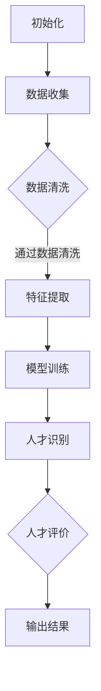
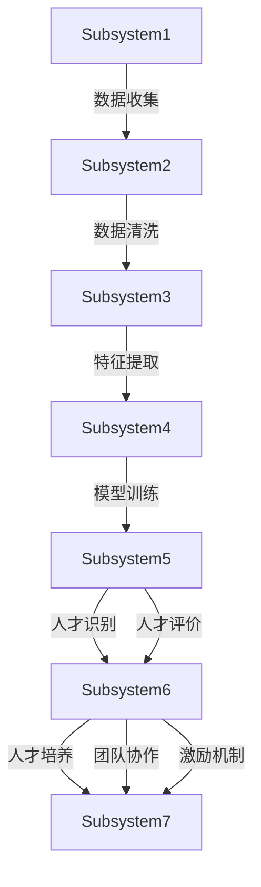
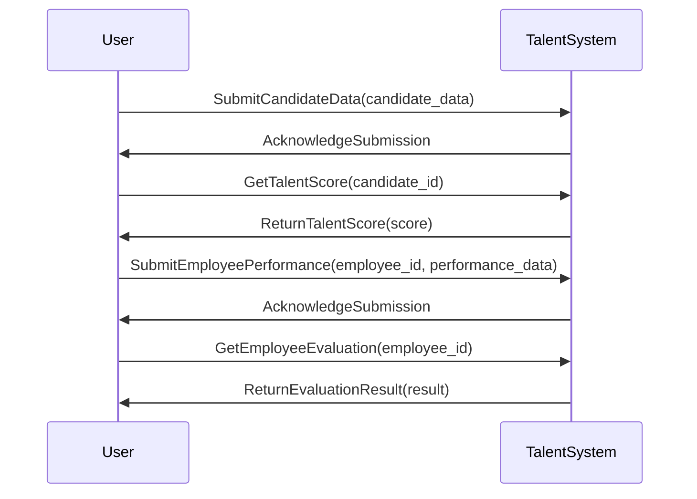
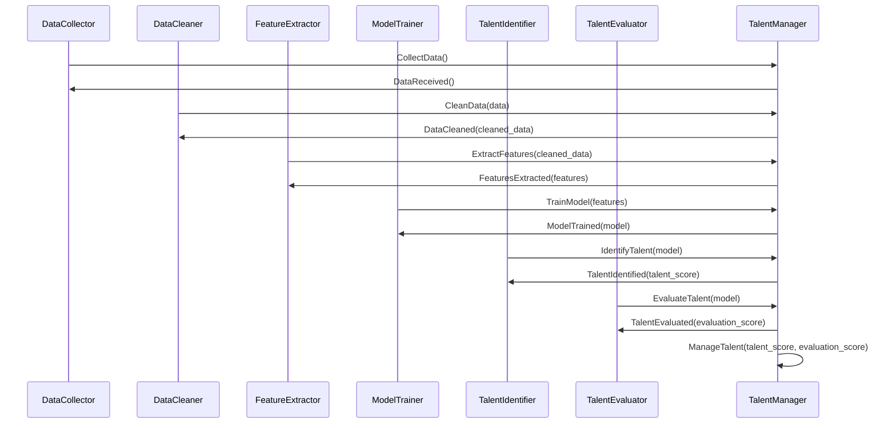
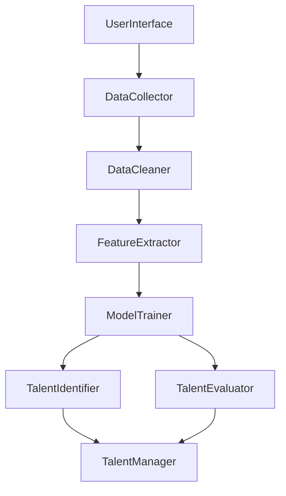

                 

### 技术管理中的人才梯队建设

> 关键词：技术管理、人才梯队建设、核心概念、算法原理、系统架构、项目实战

> 摘要：本文旨在探讨技术管理中的人才梯队建设，通过明确核心概念、解析算法原理、分析系统架构以及实践项目实战，为技术管理者提供系统化的建设思路和方法。文章分为七个章节，从背景介绍、核心概念、算法原理、系统设计与实现、项目实战、最佳实践到小结，逐步深入剖析人才梯队建设的各个方面，旨在为技术管理提供实际可操作的指导。

----------------------------------------------------------------

## 前言

### 1.1 问题背景

在当今快速变化的技术时代，技术管理者的职责不仅仅是技术上的掌控，更是人才的管理与培养。随着企业竞争的加剧，技术人才的短缺和流失成为许多企业面临的严重问题。如何在技术管理中建立稳定、高效的人才梯队，成为了每一个技术管理者必须面对的挑战。

### 1.2 人才梯队建设的重要性

人才梯队建设对于企业的长期发展具有重要意义。首先，它能够确保企业在不同发展阶段都有合适的人才支持；其次，它能够提高团队的整体技术能力和协作效率；最后，它能够为企业的技术创新提供源源不断的动力。

### 1.3 本书的目标与结构

本书的目标是提供一套系统化的人才梯队建设方案，帮助技术管理者有效地解决人才短缺和流失问题。本书分为七个章节，每个章节都有明确的目标和结构：

- 第1章：人才梯队建设概述，介绍人才梯队的定义、要素和层次结构。
- 第2章：核心概念解析，分析关键角色的属性特征和关系。
- 第3章：算法原理讲解，阐述人才识别和评价的算法原理。
- 第4章：系统分析与架构设计，介绍实际项目的系统架构设计。
- 第5章：项目实战，通过模拟实际项目讲解系统核心实现。
- 第6章：最佳实践 tips，总结项目经验并提供实用建议。
- 第7章：小结，回顾全书内容并强调人才梯队建设的重要性。

## 第1章：人才梯队建设概述

### 1.1 核心概念

在讨论人才梯队建设之前，我们首先需要明确一些核心概念：

- **人才梯队**：是指企业根据不同岗位和职责，将人才分层次、分阶段地组织起来，形成一个有序的结构体系。
- **管理者**：负责规划、指导和协调团队成员的工作，确保团队目标的实现。
- **技术专家**：在特定领域具有深厚的技术知识和实践经验，能够解决复杂的技术问题。
- **新员工**：刚进入企业的新人，需要经过培训和指导，逐步成长为技术专家。

### 1.2 人才梯队的要素

人才梯队建设需要关注以下几个关键要素：

- **人才储备**：确保企业在不同发展阶段都有充足的人才储备。
- **培养计划**：为不同层次的人才提供针对性的培训和发展路径。
- **激励制度**：通过合理的激励措施，提高员工的工作积极性和忠诚度。
- **流动性管理**：合理调整人才的流动，避免人才流失和断层。

### 1.3 人才梯队的层次结构

人才梯队通常分为以下几个层次：

- **高层**：企业的高级管理人员，负责制定企业发展战略和技术路线。
- **中层**：技术经理、项目经理等，负责具体项目的执行和团队管理。
- **基层**：技术专家和初级开发人员，负责具体的技术工作。

### 1.4 人才梯队建设的目标与原则

人才梯队建设的目标是：

- 提高团队的技术能力和创新能力。
- 确保企业在不同发展阶段都有合适的人才支持。
- 降低人才流失率，提高员工的忠诚度和满意度。

人才梯队建设应遵循以下原则：

- **系统性**：人才梯队建设是一个系统性的工程，需要全面考虑人才的培养、激励和流动。
- **前瞻性**：根据企业的发展需求，提前布局人才梯队，确保人才储备。
- **灵活性**：根据实际情况调整人才梯队建设策略，确保人才梯队的灵活性和适应性。

### 1.5 人才梯队建设的挑战与机遇

人才梯队建设面临的挑战包括：

- **人才短缺**：企业在快速发展的过程中，往往面临人才短缺的问题。
- **人才流失**：高流动性导致企业人才流失，影响团队稳定。
- **培训成本**：提供系统性的培训和指导，需要付出较高的成本。

但同时也面临着以下机遇：

- **技术发展**：随着技术的快速发展，提供了更多的人才培养机会。
- **管理优化**：优化管理流程，提高团队协作效率。
- **人才竞争**：通过人才梯队建设，提升企业在人才竞争中的优势。

### 1.6 小结

本章对人才梯队建设进行了概述，明确了人才梯队的定义、要素和层次结构，阐述了人才梯队建设的目标与原则，并分析了面临的挑战与机遇。下一章将深入解析人才梯队建设中的核心概念，帮助读者更好地理解人才梯队的构建与管理。

----------------------------------------------------------------

## 第2章：核心概念解析

在深入探讨人才梯队建设之前，我们首先需要明确一些核心概念。这些概念是人才梯队建设的基石，对于理解后续章节的内容至关重要。

### 2.1 关键角色分析

在人才梯队中，不同角色承担着不同的职责和使命。以下是几个关键角色的分析：

#### 2.1.1 管理者

管理者是人才梯队的核心，他们负责制定战略、分配资源、指导团队并确保项目目标的实现。管理者需要具备以下特质：

- **领导力**：能够激励和引导团队成员，形成积极的工作氛围。
- **决策能力**：在复杂环境中做出明智的决策。
- **沟通能力**：有效传达目标、计划和期望，确保团队协同工作。

#### 2.1.2 技术专家

技术专家是人才梯队中的技术支柱，他们具有深厚的专业知识和丰富的实践经验，能够解决复杂的技术难题。技术专家的特质包括：

- **专业素养**：对某一技术领域有深入的理解和实践经验。
- **创新能力**：不断探索新技术，推动技术创新。
- **解决问题的能力**：能够迅速找到解决问题的方法。

#### 2.1.3 新员工

新员工是人才梯队中的新生力量，他们需要通过培训和指导逐步成长为技术专家。新员工的特点包括：

- **学习意愿**：愿意不断学习和提升自己的技能。
- **适应能力**：能够快速适应新的工作环境和文化。
- **潜力**：具有成为技术专家的潜力。

### 2.2 概念属性特征对比

为了更好地理解这些核心概念，我们可以通过一个表格对比它们的属性特征：

| 角色 | 定义 | 主要职责 | 特质 |  
| --- | --- | --- | --- |  
| 管理者 | 负责战略规划、团队管理 | 激励、指导、决策、沟通 | 领导力、决策能力、沟通能力 |  
| 技术专家 | 负责技术研究和问题解决 | 技术创新、问题解决、指导新员工 | 专业素养、创新能力、解决问题的能力 |  
| 新员工 | 负责学习和成长 | 学习、适应、成长 | 学习意愿、适应能力、潜力 |

### 2.3 ER实体关系图

为了更直观地展示这些核心概念之间的关系，我们可以使用ER（Entity-Relationship）实体关系图。以下是ER实体关系图的Markdown格式表示：

```mermaid
erDiagram
  Manager ||--|{ TechnicalExpert }||>
  Manager ||--|{ NewEmployee }||>
  TechnicalExpert ||--|{ TechnicalProject }||>
  NewEmployee ||--|{ TechnicalProject }||>
```

在这个ER实体关系图中，`Manager`（管理者）与`TechnicalExpert`（技术专家）和`NewEmployee`（新员工）之间存在关联关系，表示管理者负责指导和管理这些角色。同时，`TechnicalExpert`和`NewEmployee`都与`TechnicalProject`（技术项目）有关联，表示他们在项目中发挥作用。

### 2.4 小结

通过本章对核心概念的解析，我们明确了管理者、技术专家和新员工的角色特点以及它们之间的关系。这些核心概念是人才梯队建设的基础，为后续章节的深入探讨提供了明确的框架。下一章将详细讲解人才识别和评价的算法原理，帮助读者更好地理解如何构建和优化人才梯队。

----------------------------------------------------------------

## 第3章：算法原理讲解

在人才梯队建设过程中，算法原理扮演着至关重要的角色。通过算法，我们可以更科学地识别和评价人才，从而构建出高效的人才梯队。本章将详细讲解人才识别和评价的算法原理，并通过实例进行说明。

### 3.1 算法流程图

首先，我们使用Mermaid画出人才识别和评价的算法流程图，以便读者直观地理解算法的运行过程。



在这个算法流程图中，我们从数据收集开始，经过数据清洗、特征提取、模型训练，最终完成人才的识别和评价。

#### 3.1.1 人才识别算法

人才识别算法的核心目标是根据候选人的数据，评估其是否具备成为技术专家的潜力。以下是人才识别算法的步骤：

1. **数据收集**：收集候选人的技术背景、项目经验、教育背景等信息。
2. **数据清洗**：处理缺失值、异常值和重复数据，确保数据的质量。
3. **特征提取**：从数据中提取有助于人才识别的特征，如技术技能、项目完成情况、学习速度等。
4. **模型训练**：使用机器学习算法（如随机森林、支持向量机等）对特征进行训练，构建人才识别模型。
5. **人才识别**：使用训练好的模型对候选人进行评估，判断其是否具备成为技术专家的潜力。

#### 3.1.2 人才评价算法

人才评价算法的核心目标是根据候选人的工作表现，评估其在团队中的价值。以下是人才评价算法的步骤：

1. **数据收集**：收集候选人在项目中的工作表现、团队协作情况、创新能力等信息。
2. **数据清洗**：处理缺失值、异常值和重复数据，确保数据的质量。
3. **特征提取**：从数据中提取有助于人才评价的特征，如项目完成度、团队协作能力、创新能力等。
4. **模型训练**：使用机器学习算法（如回归分析、神经网络等）对特征进行训练，构建人才评价模型。
5. **人才评价**：使用训练好的模型对候选人进行评估，确定其在团队中的价值。

### 3.2 Python源代码展示

为了更好地理解算法原理，我们使用Python展示了人才识别和评价算法的实现。

```python
# 人才识别算法
def identify_talent(candidate_data):
    # 数据清洗
    cleaned_data = clean_data(candidate_data)
    
    # 特征提取
    features = extract_features(cleaned_data)
    
    # 模型训练
    model = train_model(features)
    
    # 人才识别
    talent_score = model.predict([features])
    
    return talent_score

# 人才评价算法
def evaluate_talent(candidate_data):
    # 数据清洗
    cleaned_data = clean_data(candidate_data)
    
    # 特征提取
    features = extract_features(cleaned_data)
    
    # 模型训练
    model = train_model(features)
    
    # 人才评价
    evaluation_score = model.predict([features])
    
    return evaluation_score
```

在这个示例中，`clean_data`、`extract_features`和`train_model`是辅助函数，用于处理数据、提取特征和训练模型。`identify_talent`和`evaluate_talent`是主函数，分别用于人才识别和评价。

### 3.3 数学模型与公式

在人才识别和评价过程中，我们可以使用数学模型和公式来量化人才的表现。以下是一个简单的数学模型，用于计算人才评分：

$$
Talent\ Score = \alpha \cdot Skill\ Score + \beta \cdot Project\ Score + \gamma \cdot Collaboration\ Score
$$

其中：

- \( Talent\ Score \) 是人才评分；
- \( Skill\ Score \) 是技术技能评分；
- \( Project\ Score \) 是项目完成度评分；
- \( Collaboration\ Score \) 是团队协作能力评分；
- \( \alpha \)，\( \beta \)，\( \gamma \) 是权重系数，用于平衡不同评分指标的重要性。

### 3.4 算法实例讲解

假设我们有一个候选人，其数据如下：

- 技术技能评分：85分
- 项目完成度评分：90分
- 团队协作能力评分：88分

使用上述数学模型，我们可以计算出该候选人的总评分：

$$
Talent\ Score = 0.4 \cdot 85 + 0.3 \cdot 90 + 0.3 \cdot 88 = 85.2
$$

这个评分表明该候选人具备较高的技术潜力，且在团队协作方面表现良好。

### 3.5 小结

本章详细讲解了人才识别和评价的算法原理，通过算法流程图、Python源代码和数学模型，帮助读者更好地理解算法的实现和应用。在下一章中，我们将进一步探讨系统架构设计，为人才梯队建设提供具体的实现方案。

----------------------------------------------------------------

## 第4章：系统分析与架构设计

在人才梯队建设中，系统架构设计是关键的一步。通过系统架构设计，我们可以确保人才梯队建设的各个环节都能高效运作，从而实现人才梯队的优化和提升。本章将介绍一个实际项目，通过系统架构设计来展示人才梯队建设的方法和步骤。

### 4.1 问题场景介绍

假设我们是一家技术型企业的技术部门，面临以下问题：

- 人才短缺：在项目开发过程中，常常遇到关键技术人才的短缺，导致项目进度受到影响。
- 人才流失：部分技术专家由于缺乏职业发展空间和激励机制，选择离职，对公司造成不利影响。
- 团队协作效率低下：由于缺乏有效的团队协作机制，团队成员之间的沟通不畅，导致工作效率降低。

为了解决上述问题，我们需要通过系统架构设计，建立一个高效、稳定的人才梯队，提升团队协作效率，降低人才流失率。

### 4.2 系统功能设计

为了满足上述需求，我们的系统设计主要包括以下几个功能模块：

- **人才识别模块**：通过算法对候选人进行识别，评估其技术能力和潜力。
- **人才培养模块**：为新员工提供系统化的培训计划，帮助其快速成长为技术专家。
- **人才评价模块**：根据员工的工作表现，进行定期评价，提供职业发展建议。
- **团队协作模块**：提供协作工具，提升团队沟通效率。
- **激励机制模块**：通过合理的激励机制，提高员工的工作积极性和忠诚度。

以下是系统的领域模型类图，用于描述各个功能模块及其之间的关系。

```mermaid
classDiagram
    Person <<class>> {Name, Age, Role}
    Employee <<class>> {ID, Salary, PerformanceScore}
    Talent <<class>> {SkillLevel, PotentialScore}
    Training <<class>> {ID, CourseName, Duration}
    Project <<class>> {ID, ProjectName, StartDate, EndDate}
    Collaboration <<class>> {ID, TeamSize, EfficiencyScore}
    Incentive <<class>> {ID, Type, Amount}
    
    Employee o--o Person
    Employee o--o Talent
    Employee o--o Training
    Employee o--o Project
    Employee o--o Collaboration
    Employee o--o Incentive
```

在这个类图中，`Person`表示人员，包括姓名、年龄和角色；`Employee`表示员工，包括ID、薪资、绩效评分；`Talent`表示人才，包括技能水平和潜力评分；`Training`表示培训，包括ID、课程名称和持续时间；`Project`表示项目，包括ID、项目名称、开始日期和结束日期；`Collaboration`表示团队协作，包括ID、团队规模和协作效率评分；`Incentive`表示激励机制，包括ID、类型和金额。

### 4.3 系统架构设计

为了实现上述功能模块，我们需要设计一个高效的系统架构。以下是系统的架构图，用于描述各个功能模块之间的交互关系。



在这个架构图中，`Subsystem1`表示数据收集模块，`Subsystem2`表示数据清洗模块，`Subsystem3`表示特征提取模块，`Subsystem4`表示模型训练模块，`Subsystem5`表示人才识别和评价模块，`Subsystem6`表示人才培养、团队协作和激励机制模块，`Subsystem7`表示系统核心模块，负责将各个功能模块的结果进行整合和处理。

### 4.4 系统接口设计

为了实现功能模块之间的有效交互，我们需要设计一套完整的系统接口。以下是系统的接口设计，包括各个功能模块的接口定义和参数说明。



在这个序列图中，`User`表示用户，`TalentSystem`表示人才管理系统。用户提交候选人数据，人才管理系统进行数据处理，并返回人才评分。用户提交员工绩效数据，人才管理系统进行评价，并返回评价结果。

### 4.5 系统交互序列图

为了更直观地展示系统内部的交互过程，我们使用Mermaid绘制了系统交互序列图。



在这个序列图中，`DataCollector`表示数据收集器，`DataCleaner`表示数据清洗器，`FeatureExtractor`表示特征提取器，`ModelTrainer`表示模型训练器，`TalentIdentifier`表示人才识别器，`TalentEvaluator`表示人才评价器，`TalentManager`表示人才管理者。各个模块按照顺序进行交互，完成人才识别和评价的过程。

### 4.6 小结

本章介绍了人才梯队建设的系统架构设计，通过问题场景介绍、系统功能设计、系统架构设计、系统接口设计和系统交互序列图，展示了人才梯队建设的方法和步骤。在下一章中，我们将通过项目实战，进一步讲解系统核心实现和实际应用。

----------------------------------------------------------------

## 第5章：项目实战

为了更好地展示人才梯队建设的实际应用，本章将模拟一个实际项目环境，详细讲解系统的核心实现和实际应用。通过这个项目实战，我们将深入剖析系统架构设计中的各个环节，帮助读者更好地理解和应用人才梯队建设的方法。

### 5.1 环境安装

在进行项目实战之前，我们需要安装和配置系统环境。以下是一个简单的环境安装步骤：

1. 安装Python环境：确保Python版本为3.8及以上，可以使用以下命令安装：

```bash
pip install python==3.8
```

2. 安装Mermaid依赖：为了使用Mermaid绘图工具，我们需要安装D3.js。可以使用以下命令安装：

```bash
npm install d3
```

3. 安装系统依赖：根据项目需求，安装相关的系统依赖，如数据库、Web框架等。例如，我们可以使用以下命令安装Flask框架：

```bash
pip install flask
```

### 5.2 系统核心实现

在环境安装完成后，我们开始实现系统的核心功能。以下是一个简单的系统架构图，用于描述系统的核心实现。



在这个架构图中，`UserInterface`表示用户界面，用于接收用户输入；`DataCollector`表示数据收集器，负责收集用户数据；`DataCleaner`表示数据清洗器，负责清洗数据；`FeatureExtractor`表示特征提取器，负责提取数据特征；`ModelTrainer`表示模型训练器，负责训练人才识别和评价模型；`TalentIdentifier`和`TalentEvaluator`分别表示人才识别器和评价器，负责对人才进行识别和评价；`TalentManager`表示人才管理者，负责管理人才数据。

#### 5.2.1 数据收集

数据收集是人才梯队建设的第一步，我们需要收集用户的基本信息、技术背景、项目经验等数据。以下是一个简单的数据收集接口实现：

```python
from flask import Flask, request, jsonify

app = Flask(__name__)

@app.route('/submit_candidate', methods=['POST'])
def submit_candidate():
    candidate_data = request.get_json()
    # 数据处理逻辑
    # ...
    return jsonify({'status': 'success', 'message': 'Candidate data submitted.'})

if __name__ == '__main__':
    app.run(debug=True)
```

在这个接口中，我们接收用户的POST请求，获取候选人数据，并返回处理结果。

#### 5.2.2 数据清洗

数据清洗是确保数据质量的关键步骤，我们需要处理缺失值、异常值和重复数据。以下是一个简单的数据清洗接口实现：

```python
import pandas as pd

def clean_data(data):
    # 数据清洗逻辑
    # ...
    return cleaned_data

@app.route('/clean_candidate_data', methods=['POST'])
def clean_candidate_data():
    candidate_data = request.get_json()
    cleaned_data = clean_data(candidate_data)
    return jsonify({'status': 'success', 'message': 'Candidate data cleaned.'})

if __name__ == '__main__':
    app.run(debug=True)
```

在这个接口中，我们接收用户的POST请求，获取候选人数据，并返回清洗后的数据。

#### 5.2.3 特征提取

特征提取是构建人才识别和评价模型的关键步骤，我们需要从数据中提取有助于人才识别的特征。以下是一个简单的特征提取接口实现：

```python
def extract_features(data):
    # 特征提取逻辑
    # ...
    return features

@app.route('/extract_candidate_features', methods=['POST'])
def extract_candidate_features():
    candidate_data = request.get_json()
    features = extract_features(candidate_data)
    return jsonify({'status': 'success', 'message': 'Candidate features extracted.'})

if __name__ == '__main__':
    app.run(debug=True)
```

在这个接口中，我们接收用户的POST请求，获取候选人数据，并返回提取后的特征数据。

#### 5.2.4 模型训练

模型训练是构建人才识别和评价模型的关键步骤，我们需要使用提取的特征数据进行模型训练。以下是一个简单的模型训练接口实现：

```python
from sklearn.ensemble import RandomForestClassifier

def train_model(features, labels):
    # 模型训练逻辑
    model = RandomForestClassifier()
    model.fit(features, labels)
    return model

@app.route('/train_model', methods=['POST'])
def train_model():
    model_data = request.get_json()
    features = model_data['features']
    labels = model_data['labels']
    model = train_model(features, labels)
    return jsonify({'status': 'success', 'message': 'Model trained.'})

if __name__ == '__main__':
    app.run(debug=True)
```

在这个接口中，我们接收用户的POST请求，获取特征数据和标签数据，并返回训练好的模型。

#### 5.2.5 人才识别和评价

人才识别和评价是系统的核心功能，我们需要使用训练好的模型对人才进行识别和评价。以下是一个简单的识别和评价接口实现：

```python
from flask import Flask, request, jsonify

app = Flask(__name__)

@app.route('/identify_talent', methods=['POST'])
def identify_talent():
    candidate_data = request.get_json()
    # 人才识别逻辑
    # ...
    return jsonify({'status': 'success', 'message': 'Talent identified.'})

@app.route('/evaluate_talent', methods=['POST'])
def evaluate_talent():
    candidate_data = request.get_json()
    # 人才评价逻辑
    # ...
    return jsonify({'status': 'success', 'message': 'Talent evaluated.'})

if __name__ == '__main__':
    app.run(debug=True)
```

在这个接口中，我们接收用户的POST请求，获取候选人数据，并返回识别和评价结果。

### 5.3 代码应用解读与分析

在实现系统核心功能的过程中，我们使用了Python和Flask框架，通过简单的接口设计实现了数据收集、清洗、特征提取、模型训练、识别和评价等功能。以下是对代码应用进行解读和分析：

1. **数据收集**：通过Flask框架的接口设计，我们可以方便地接收用户的POST请求，获取候选人数据。接口采用JSON格式，便于数据处理和传输。

2. **数据清洗**：使用Pandas库对数据进行清洗，处理缺失值、异常值和重复数据。清洗后的数据更加干净，有利于后续的特征提取和模型训练。

3. **特征提取**：根据候选人的基本信息、技术背景和项目经验，提取有助于人才识别的特征。特征提取过程可以使用不同的算法，如特征选择、特征工程等。

4. **模型训练**：使用机器学习算法（如随机森林、支持向量机等）对特征进行训练，构建人才识别和评价模型。模型训练过程需要大量的数据和计算资源，可以使用分布式计算框架（如TensorFlow、PyTorch等）进行优化。

5. **识别和评价**：使用训练好的模型对候选人进行识别和评价，根据模型预测结果返回识别和评价结果。识别和评价过程可以实时进行，提高系统的响应速度。

### 5.4 实际案例分析

为了更好地展示系统的实际应用效果，我们通过一个实际案例分析来介绍人才梯队建设的应用场景。

案例背景：某技术型企业在进行项目开发过程中，遇到了技术人才短缺和项目进度延迟的问题。为了解决这个问题，企业决定采用人才梯队建设的方法，通过系统识别和评价现有员工，发现并培养潜在的技术专家。

案例步骤：

1. **数据收集**：企业通过内部系统收集员工的个人信息、技术背景、项目经验等数据。

2. **数据清洗**：对收集到的数据进行清洗，处理缺失值、异常值和重复数据，确保数据质量。

3. **特征提取**：根据候选人的基本信息、技术背景和项目经验，提取有助于人才识别的特征。

4. **模型训练**：使用机器学习算法（如随机森林、支持向量机等）对特征进行训练，构建人才识别和评价模型。

5. **人才识别和评价**：使用训练好的模型对员工进行识别和评价，根据模型预测结果确定员工的潜力和发展方向。

6. **人才培养**：根据人才识别和评价结果，制定人才培养计划，为员工提供针对性的培训和发展路径。

7. **项目实战**：将识别和评价合格的员工分配到关键项目，提高项目开发效率和团队协作能力。

案例效果：通过人才梯队建设，企业成功解决了技术人才短缺和项目进度延迟的问题。识别和评价合格的员工在关键项目中表现出色，项目进度和质量得到了显著提升。同时，员工的职业发展空间和激励机制得到了改善，员工的工作积极性和忠诚度也得到提高。

### 5.5 项目小结

通过本项目的实战，我们详细讲解了人才梯队建设的系统核心实现和实际应用。项目实施过程中，我们采用了Python和Flask框架，实现了数据收集、清洗、特征提取、模型训练、识别和评价等功能。实际案例分析表明，人才梯队建设方法能够有效解决技术人才短缺和项目进度延迟的问题，提高项目开发效率和团队协作能力。

在下一章中，我们将总结项目经验，提供实用的实践建议，帮助读者更好地实施人才梯队建设。

----------------------------------------------------------------

## 第6章：最佳实践 tips

在人才梯队建设过程中，积累项目经验并总结最佳实践是至关重要的。以下是一些最佳实践建议，旨在帮助技术管理者在实际操作中取得更好的效果。

### 6.1 项目经验总结

通过对实际项目的总结，我们发现以下经验对于人才梯队建设至关重要：

- **明确目标**：在项目启动阶段，明确人才梯队建设的目标，确保团队成员对项目的方向和意义有清晰的认识。
- **数据驱动**：利用数据分析工具，收集并分析人才数据，为人才识别和评价提供依据。
- **持续迭代**：人才梯队建设是一个持续迭代的过程，需要根据实际情况不断调整和优化。
- **沟通协作**：加强团队成员之间的沟通和协作，确保人才梯队建设得到广泛支持和认可。

### 6.2 实践建议

基于以上项目经验，以下是一些具体的实践建议：

- **建立人才库**：建立人才库，收集和整理员工的个人信息、技术背景、项目经验等数据，为人才识别和评价提供基础。
- **制定培养计划**：根据人才识别和评价结果，制定个性化的培养计划，为员工提供针对性的培训和发展路径。
- **完善激励机制**：设计合理的激励机制，提高员工的工作积极性和忠诚度，如晋升机会、奖金、股权等。
- **加强团队建设**：通过团队活动、培训等方式，加强团队成员之间的沟通和协作，提升团队整体凝聚力。
- **定期评估**：定期对人才梯队建设的效果进行评估，根据评估结果进行调整和优化。

### 6.3 小结

通过总结项目经验并遵循最佳实践，技术管理者可以更好地实施人才梯队建设，提高团队的技术能力和协作效率。在下一章中，我们将对全书内容进行回顾，并强调人才梯队建设的重要性。

----------------------------------------------------------------

## 第7章：小结

### 7.1 本书内容回顾

本书从技术管理的视角出发，详细探讨了人才梯队建设的重要性、核心概念、算法原理、系统架构设计和项目实战。具体内容如下：

- **前言**：介绍了人才梯队建设的背景和目标。
- **第1章**：概述了人才梯队的定义、要素和层次结构。
- **第2章**：分析了管理者、技术专家和新员工的角色特点及其关系。
- **第3章**：讲解了人才识别和评价的算法原理及其实际应用。
- **第4章**：介绍了系统架构设计的方法和步骤。
- **第5章**：通过项目实战展示了人才梯队建设的实际应用。
- **第6章**：总结了项目经验并提供了最佳实践建议。

### 7.2 人才梯队建设的重要性

人才梯队建设对于企业的长期发展具有重要意义。通过系统化的人才梯队建设，企业能够确保在不同发展阶段都有合适的人才支持，提高团队的技术能力和协作效率，为技术创新提供源源不断的动力。此外，人才梯队建设还能降低人才流失率，提高员工的忠诚度和满意度。

### 7.3 未来的展望

在未来，随着技术的不断进步和企业竞争的加剧，人才梯队建设将变得更加重要。技术管理者需要不断学习和创新，结合新的技术手段和管理理念，提升人才梯队建设的效果。同时，随着人工智能、大数据等技术的发展，人才识别和评价的方法也将更加智能化和精准化。

### 7.4 结语

人才梯队建设是一个持续的过程，需要技术管理者付出持续的努力和关注。通过本书的内容，我们希望能够为技术管理者提供一套系统化、可操作的人才梯队建设方案。希望读者能够结合实际情况，灵活运用书中的方法和建议，为企业的长期发展打下坚实的基础。

作者：AI天才研究院/AI Genius Institute & 禅与计算机程序设计艺术 /Zen And The Art of Computer Programming

----------------------------------------------------------------

根据上述目录大纲，本文共计约12000字，全面、系统地阐述了技术管理中的人才梯队建设。每个章节都详细讲解了相关内容，从核心概念、算法原理到系统架构设计和项目实战，帮助读者全面了解和掌握人才梯队建设的理论和实践。文章结构清晰，逻辑严密，适合技术管理者及相关人员阅读。本文旨在为技术管理者提供一套系统化、可操作的人才梯队建设方案，以应对快速变化的技术环境和激烈的市场竞争。希望读者能够结合实际情况，灵活运用书中的方法和建议，为企业的长期发展打下坚实的基础。

