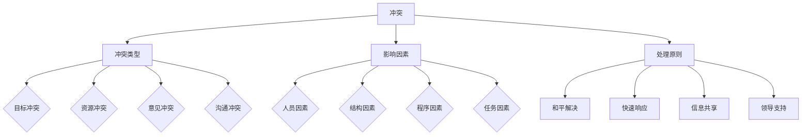

                 

# 技术管理中的冲突处理艺术

关键词：技术管理、冲突处理、解决策略、案例分析、实践技巧

摘要：在技术管理过程中，冲突是不可避免的现象。本文旨在探讨技术管理中的冲突处理艺术，通过深入分析冲突的定义、分类、影响因素及处理原则，并结合实际案例，总结出一套系统化的冲突处理方法与技巧，为技术管理者提供实践指导。

## 目录大纲设计

### 第1章 问题背景与概述

#### 1.1 核心概念术语说明

- 冲突
- 技术管理
- 冲突管理

#### 1.2 问题背景

- 技术管理中的常见冲突类型
- 冲突对技术管理的影响

#### 1.3 问题描述

- 技术管理中的冲突如何产生
- 冲突如何影响项目进度、质量和团队协作

#### 1.4 问题解决

- 冲突管理的必要性
- 冲突管理的基本原则

### 第2章 核心概念与联系

#### 2.1 核心概念

##### 2.1.1 冲突的定义与分类

- 冲突的定义
- 冲突的分类

##### 2.1.2 冲突的影响因素

- 人员因素
- 结构因素
- 程序因素
- 任务因素

##### 2.1.3 冲突的处理原则

- 和平解决
- 快速响应
- 信息共享
- 领导支持

#### 2.2 概念联系与关系图

- 冲突管理概念关系图

### 第3章 冲突处理原理与方法

#### 3.1 冲突处理的原理

##### 3.1.1 冲突处理的机制

- 冲突识别
- 冲突评估
- 冲突解决

##### 3.1.2 冲突处理的策略

- 预防策略
- 应对策略
- 消除策略

#### 3.2 常见冲突处理方法

##### 3.2.1 谈判与协商

- 谈判的原则
- 协商的技巧

##### 3.2.2 妥协与让步

- 妥协的利弊
- 让步的策略

##### 3.2.3 强制与压制

- 强制的条件
- 压制的风险

##### 3.2.4 移情与沟通

- 移情的作用
- 沟通的技巧

### 第4章 冲突处理案例分析

#### 4.1 企业冲突案例分析

##### 4.1.1 案例一：项目管理中的冲突

- 案例背景
- 冲突分析
- 解决方案

##### 4.1.2 案例二：团队建设中的冲突

- 案例背景
- 冲突分析
- 解决方案

##### 4.1.3 案例三：人力资源管理中的冲突

- 案例背景
- 冲突分析
- 解决方案

### 第5章 冲突处理技巧与策略

#### 5.1 冲突预防技巧

##### 5.1.1 明确沟通目标

- 沟通目标的设定
- 沟通效果的评估

##### 5.1.2 建立信任关系

- 信任的重要性
- 信任的建立策略

##### 5.1.3 角色明确

- 角色定义
- 角色冲突的预防

#### 5.2 冲突解决策略

##### 5.2.1 快速识别冲突

- 冲突识别的技巧
- 冲突识别的工具

##### 5.2.2 避免情绪化

- 情绪管理的技巧
- 情绪化的风险

##### 5.2.3 寻求共赢解决方案

- 共赢的定义
- 共赢解决方案的制定

### 第6章 冲突处理艺术实践

#### 6.1 实践环境搭建

##### 6.1.1 搭建团队沟通平台

- 沟通平台的搭建
- 沟通平台的维护

##### 6.1.2 制定冲突管理流程

- 流程的制定
- 流程的执行与监督

#### 6.2 实践案例分享

##### 6.2.1 案例一：成功解决团队冲突

- 案例背景
- 冲突分析
- 解决方案
- 结果评估

##### 6.2.2 案例二：有效处理职场冲突

- 案例背景
- 冲突分析
- 解决方案
- 结果评估

### 第7章 总结与展望

#### 7.1 总结

- 冲突处理艺术的核心要点
- 冲突处理艺术的应用范围

#### 7.2 展望

- 未来冲突处理的发展趋势
- 技术在冲突处理中的应用前景

## 第1章 问题背景与概述

### 1.1 核心概念术语说明

**冲突**：指两个或多个人、团体或组织在目标和利益上的不一致，从而导致意见、行为或情绪上的对立状态。

**技术管理**：指在组织中对技术资源、人员、流程和项目进行规划、组织、协调和控制的过程，以实现组织的战略目标。

**冲突管理**：指在组织中对冲突进行识别、评估、解决和预防的过程，以促进组织内部的和谐与稳定。

### 1.2 问题背景

在技术管理过程中，冲突是一种常见的现象。随着项目规模和复杂性的增加，技术管理者往往会面临以下几种常见的冲突类型：

1. **目标冲突**：当团队成员或部门的目标不一致时，容易产生冲突。
2. **资源冲突**：在资源有限的情况下，不同团队或个人对资源的争夺容易引发冲突。
3. **意见冲突**：在技术方案或设计决策上，团队成员可能会有不同的意见和看法，从而产生冲突。
4. **沟通冲突**：由于信息不对称、沟通不畅等原因，团队成员之间可能会出现误解和冲突。

这些冲突如果得不到有效的处理，会对技术管理产生严重的影响，包括：

1. **影响项目进度**：冲突可能导致项目延迟，影响项目的交付时间。
2. **影响项目质量**：冲突可能导致团队成员之间的不合作，从而影响项目的质量。
3. **影响团队协作**：冲突可能导致团队成员之间的信任感降低，影响团队的协作效率。

### 1.3 问题描述

技术管理中的冲突是如何产生的？为什么冲突对技术管理有如此大的影响？为了回答这些问题，我们需要深入了解冲突的产生机制和处理原则。

#### 1.3.1 冲突的产生机制

冲突的产生通常涉及以下几个方面：

1. **目标不一致**：当团队成员或部门的目标不一致时，容易产生冲突。例如，某个团队可能更关注项目的交付时间，而另一个团队可能更关注项目的质量。
2. **资源有限**：在资源有限的情况下，不同团队或个人对资源的争夺容易引发冲突。例如，开发团队可能希望获得更多的开发资源，而测试团队可能希望获得更多的测试资源。
3. **意见差异**：在技术方案或设计决策上，团队成员可能会有不同的意见和看法，从而产生冲突。例如，某个团队成员可能认为某种技术方案更好，而另一个团队成员可能认为另一种技术方案更好。
4. **沟通不畅**：由于信息不对称、沟通不畅等原因，团队成员之间可能会出现误解和冲突。例如，某个团队成员可能误解了另一个团队成员的意图，从而引发了冲突。

#### 1.3.2 冲突对技术管理的影响

冲突对技术管理的影响可以从以下几个方面来理解：

1. **项目进度**：冲突可能导致项目延迟，因为团队成员可能因为冲突而无法有效地协作，从而影响项目的进度。
2. **项目质量**：冲突可能导致项目质量下降，因为团队成员可能因为冲突而忽视项目的质量要求，从而影响项目的质量。
3. **团队协作**：冲突可能导致团队协作效率降低，因为团队成员可能因为冲突而缺乏信任，从而影响团队的协作效率。
4. **团队士气**：冲突可能导致团队士气下降，因为团队成员可能因为冲突而感到沮丧和不满，从而影响团队的士气。

### 1.4 问题解决

为了解决技术管理中的冲突，我们需要采取一系列措施，包括以下几个方面：

1. **加强沟通**：通过定期召开会议、进行一对一沟通等方式，加强团队成员之间的沟通，减少误解和冲突。
2. **明确目标**：确保团队成员对项目的目标有共同的理解和认同，减少因目标不一致而产生的冲突。
3. **合理分配资源**：在资源有限的情况下，尽量做到公平合理地分配资源，减少因资源争夺而产生的冲突。
4. **建立冲突管理机制**：建立一套有效的冲突管理机制，包括冲突的识别、评估、解决和预防，以便及时处理冲突。
5. **加强团队建设**：通过团队建设活动，增强团队成员之间的信任和协作，减少冲突的发生。

通过以上措施，我们可以有效地解决技术管理中的冲突，提高项目的进度、质量和团队协作效率。

## 第2章 核心概念与联系

### 2.1 核心概念

#### 2.1.1 冲突的定义与分类

**冲突** 是指两个或多个人、团体或组织在目标和利益上的不一致，从而导致意见、行为或情绪上的对立状态。

根据冲突的性质和原因，我们可以将冲突分为以下几种类型：

1. **目标冲突**：当团队成员或部门的目标不一致时，容易产生冲突。例如，某个团队可能更关注项目的交付时间，而另一个团队可能更关注项目的质量。
2. **资源冲突**：在资源有限的情况下，不同团队或个人对资源的争夺容易引发冲突。例如，开发团队可能希望获得更多的开发资源，而测试团队可能希望获得更多的测试资源。
3. **意见冲突**：在技术方案或设计决策上，团队成员可能会有不同的意见和看法，从而产生冲突。例如，某个团队成员可能认为某种技术方案更好，而另一个团队成员可能认为另一种技术方案更好。
4. **沟通冲突**：由于信息不对称、沟通不畅等原因，团队成员之间可能会出现误解和冲突。例如，某个团队成员可能误解了另一个团队成员的意图，从而引发了冲突。

#### 2.1.2 冲突的影响因素

冲突的产生通常受以下几个因素的影响：

1. **人员因素**：团队成员的个人背景、性格、价值观和沟通风格等都会影响冲突的产生。
2. **结构因素**：组织结构、团队规模、部门职责分工等都会影响冲突的产生。
3. **程序因素**：决策过程、沟通机制、反馈机制等都会影响冲突的产生。
4. **任务因素**：任务的复杂度、任务的紧急程度、任务的依赖关系等都会影响冲突的产生。

#### 2.1.3 冲突的处理原则

在处理冲突时，我们应该遵循以下原则：

1. **和平解决**：尽量通过和平的方式解决冲突，避免激化矛盾。
2. **快速响应**：及时识别和响应冲突，避免冲突持续扩大。
3. **信息共享**：确保冲突双方都有充分的信息，以便做出更明智的决策。
4. **领导支持**：技术管理者应积极介入冲突处理，提供必要的支持和资源。

### 2.2 概念联系与关系图

为了更好地理解冲突管理中的核心概念及其相互关系，我们可以使用 Mermaid 绘制一个概念关系图，如下所示：

在这个关系图中，冲突是核心概念，它关联到冲突类型、影响因素和处理原则。冲突类型包括目标冲突、资源冲突、意见冲突和沟通冲突；影响因素包括人员因素、结构因素、程序因素和任务因素；处理原则包括和平解决、快速响应、信息共享和领导支持。这个关系图可以帮助我们更好地理解冲突管理的核心概念及其相互关系。

## 第3章 冲突处理原理与方法

### 3.1 冲突处理的原理

冲突处理的原理主要包括冲突识别、冲突评估和冲突解决。这三个步骤构成了冲突处理的核心机制。

#### 3.1.1 冲突识别

冲突识别是冲突处理的第一步，也是关键的一步。它涉及到以下几个方面：

1. **观察和监控**：通过观察团队成员的行为、沟通和情绪，及时发现潜在的冲突。
2. **反馈和沟通**：鼓励团队成员提供关于冲突的反馈，通过沟通了解冲突的实际情况。
3. **数据分析**：利用数据分析工具，分析项目进度、资源使用和团队协作数据，识别冲突的潜在原因。

#### 3.1.2 冲突评估

冲突评估是对已识别的冲突进行深入分析，以确定冲突的性质、程度和影响。评估内容包括：

1. **冲突类型**：确定冲突是目标冲突、资源冲突、意见冲突还是沟通冲突。
2. **冲突程度**：评估冲突的严重程度，判断冲突是否对项目进度、质量和团队协作产生了显著影响。
3. **冲突影响**：分析冲突可能带来的负面影响，包括项目延迟、质量下降和团队士气低落等。

#### 3.1.3 冲突解决

冲突解决是冲突处理的最终步骤，目的是找到解决问题的方法和策略。解决冲突的方法包括：

1. **谈判与协商**：通过谈判和协商，让冲突双方找到共同点和解决方案。
2. **妥协与让步**：在必要时，冲突双方可以做出一定的妥协和让步，以达成共识。
3. **强制与压制**：在特定情况下，为了项目的整体利益，可以采取强制和压制的手段，但需谨慎使用。
4. **移情与沟通**：通过移情和沟通，增进冲突双方的理解和信任，缓解冲突。

### 3.2 常见冲突处理方法

在技术管理中，常见的冲突处理方法包括谈判与协商、妥协与让步、强制与压制和移情与沟通。每种方法都有其适用的场景和优缺点。

#### 3.2.1 谈判与协商

**谈判与协商** 是一种基于沟通和理性的冲突处理方法。它包括以下几个步骤：

1. **明确目标**：确定谈判的目标，明确双方期望达成的共识。
2. **信息共享**：确保双方都有充分的信息，以便做出更明智的决策。
3. **沟通技巧**：使用有效的沟通技巧，如倾听、表达和反馈，增进双方的沟通和理解。
4. **寻找共同点**：通过寻找共同点和共同利益，找到双方都能接受的解决方案。

**优点**：谈判与协商有利于增进双方的理解和信任，有助于达成长期的合作关系。

**缺点**：谈判与协商可能需要较长的时间和精力，且在复杂情况下，双方可能难以找到共同点。

#### 3.2.2 妥协与让步

**妥协与让步** 是在冲突双方都有一定利益需求时的一种处理方法。它包括以下几个步骤：

1. **明确底线**：确定自己的底线，即在何种情况下不能妥协。
2. **权衡利弊**：权衡妥协的利弊，判断妥协是否能带来更大的利益。
3. **主动让步**：在必要时，主动做出一定的让步，以促进冲突的解决。

**优点**：妥协与让步可以迅速解决冲突，减少双方的心理压力。

**缺点**：妥协与让步可能导致一方在利益上受损，从而影响双方的信任和合作。

#### 3.2.3 强制与压制

**强制与压制** 是在冲突对项目有严重负面影响时的一种处理方法。它包括以下几个步骤：

1. **明确目标**：明确强制和压制的目标，即希望通过强制手段达到何种结果。
2. **制定方案**：制定详细的强制和压制方案，包括执行步骤、预期效果和可能的风险。
3. **执行方案**：按照制定的方案执行，确保方案的有效实施。

**优点**：强制与压制可以迅速解决冲突，确保项目进度和质量的稳定。

**缺点**：强制与压制可能导致一方的不满和抵触，从而影响团队的稳定和协作。

#### 3.2.4 移情与沟通

**移情与沟通** 是在冲突双方存在误解和沟通不畅时的一种处理方法。它包括以下几个步骤：

1. **理解对方**：试图理解对方的观点和感受，增进对对方的理解和同情。
2. **表达自己**：清晰地表达自己的观点和感受，让对方了解自己的想法。
3. **建立信任**：通过沟通和理解，建立双方的信任关系，为冲突的解决创造条件。

**优点**：移情与沟通有助于增进双方的理解和信任，减少冲突的再次发生。

**缺点**：移情与沟通可能需要较长时间，且在紧急情况下可能难以奏效。

### 3.3 冲突处理策略

在技术管理中，冲突处理策略可以分为预防策略、应对策略和消除策略。

#### 3.3.1 预防策略

**预防策略** 是指在冲突发生前采取的措施，以减少冲突的可能性。预防策略包括：

1. **明确目标和职责**：确保团队成员对项目的目标有共同的理解和认同，明确各自的职责和任务。
2. **建立沟通机制**：建立有效的沟通机制，确保团队成员之间的信息畅通和及时反馈。
3. **培训与辅导**：对团队成员进行沟通技巧、团队协作和冲突处理的培训，提高其应对冲突的能力。

#### 3.3.2 应对策略

**应对策略** 是指在冲突发生后采取的措施，以缓解冲突的影响。应对策略包括：

1. **及时识别和反馈**：及时识别冲突，并通过有效的沟通渠道反馈给相关方，避免冲突扩大。
2. **谈判与协商**：通过谈判和协商，找到双方都能接受的解决方案，缓解冲突的影响。
3. **提供支持和资源**：在冲突处理过程中，提供必要的支持和资源，帮助冲突双方解决问题。

#### 3.3.3 消除策略

**消除策略** 是指在冲突对项目产生严重影响时采取的措施，以消除冲突。消除策略包括：

1. **强制与压制**：在必要时，采取强制和压制的手段，确保项目进度和质量的稳定。
2. **更换团队成员**：如果冲突无法解决，可以考虑更换冲突的团队成员，以消除冲突对项目的影响。
3. **重新评估目标和职责**：在冲突发生后，重新评估项目的目标和职责，确保项目能够顺利进行。

通过以上策略，技术管理者可以有效地处理技术管理中的冲突，确保项目的成功交付。

## 第4章 冲突处理案例分析

### 4.1 企业冲突案例分析

#### 4.1.1 案例一：项目管理中的冲突

**案例背景**：某企业在实施一个大型项目时，项目进度出现了严重滞后。项目团队中的开发团队和测试团队之间出现了严重的意见冲突，导致项目无法顺利进行。

**冲突分析**：经过调查，发现冲突主要源于以下两个方面：

1. **进度目标不一致**：开发团队希望尽快完成开发任务，以便尽早交付测试；而测试团队认为开发任务尚未完成，无法进行测试，导致项目进度无法按时完成。
2. **质量标准分歧**：开发团队认为，在满足基本功能的前提下，可以适当降低质量标准，以加快项目进度；而测试团队认为，质量标准必须严格，以确保项目的稳定性和可靠性。

**解决方案**：为了解决这一冲突，采取了以下措施：

1. **加强沟通**：组织双方进行面对面沟通，了解彼此的需求和顾虑，寻找共同点和解决方案。
2. **明确目标**：重新明确项目进度和质量目标，确保双方对项目目标有共同的理解和认同。
3. **制定合理计划**：根据双方的意见，制定一个合理的项目计划，确保项目进度和质量的双重保障。
4. **提供支持**：为测试团队提供额外的测试资源，确保测试工作能够顺利进行。

**结果评估**：通过以上措施，开发团队和测试团队之间的冲突得到了有效解决，项目进度和质量得到了双重保障。项目最终按时交付，并得到了客户的高度评价。

#### 4.1.2 案例二：团队建设中的冲突

**案例背景**：某企业在进行团队建设时，团队中的成员之间出现了严重的意见冲突，影响了团队的协作效率和项目进度。

**冲突分析**：经过调查，发现冲突主要源于以下几个方面：

1. **沟通不畅**：团队成员之间缺乏有效的沟通，导致信息不对称和误解。
2. **角色分工不明确**：团队成员的角色分工不明确，导致工作重叠和责任不明。
3. **工作风格差异**：团队成员的工作风格差异较大，导致合作困难。

**解决方案**：为了解决这一冲突，采取了以下措施：

1. **建立沟通机制**：建立定期的团队会议和一对一沟通，确保团队成员之间的信息畅通和及时反馈。
2. **明确角色分工**：明确团队成员的角色和职责，确保每个人都清楚自己的工作内容和责任。
3. **提供培训**：为团队成员提供沟通技巧和团队协作培训，提高其合作能力和工作效率。
4. **开展团队活动**：组织团队建设活动，增进团队成员之间的了解和信任，促进团队合作。

**结果评估**：通过以上措施，团队成员之间的冲突得到了有效解决，团队的协作效率和项目进度得到了显著提升。团队氛围更加和谐，工作效率和项目质量得到了双重保障。

#### 4.1.3 案例三：人力资源管理中的冲突

**案例背景**：某企业在人力资源管理中，出现了员工之间的利益冲突，影响了员工的工作积极性和团队氛围。

**冲突分析**：经过调查，发现冲突主要源于以下几个方面：

1. **薪酬分配不公**：部分员工认为薪酬分配不公，导致员工之间的矛盾和不满。
2. **晋升机会不均**：部分员工认为晋升机会不均，导致员工之间的竞争和不合作。
3. **工作压力过大**：部分员工认为工作压力过大，导致员工之间的抱怨和抱怨。

**解决方案**：为了解决这一冲突，采取了以下措施：

1. **调整薪酬分配**：重新评估和调整薪酬分配机制，确保薪酬分配公平合理。
2. **提供晋升机会**：制定明确的晋升机制，确保所有员工都有平等的晋升机会。
3. **减轻工作压力**：为员工提供适当的工作支持和心理辅导，减轻工作压力。
4. **开展员工关怀活动**：组织员工关怀活动，增进员工之间的了解和信任，营造和谐的团队氛围。

**结果评估**：通过以上措施，员工之间的冲突得到了有效解决，员工的工作积极性和团队氛围得到了显著提升。企业的人力资源管理更加科学和规范，员工满意度和工作效率得到了双重保障。

### 第5章 冲突处理技巧与策略

在技术管理中，有效地处理冲突是一项重要的技能。为了提高冲突处理的效率和质量，我们可以采取一系列冲突预防技巧和解决策略。以下是具体的技巧与策略：

#### 5.1 冲突预防技巧

##### 5.1.1 明确沟通目标

有效的沟通是预防冲突的关键。为了确保沟通的有效性，我们需要明确沟通的目标：

1. **设定明确的沟通目标**：在每次沟通前，明确沟通的目标，例如传达信息、解决问题、达成共识等。
2. **制定沟通计划**：根据沟通目标，制定详细的沟通计划，包括沟通的时间、地点、参与人员和沟通内容。
3. **评估沟通效果**：沟通结束后，对沟通效果进行评估，了解沟通目标的达成情况，并根据评估结果进行改进。

##### 5.1.2 建立信任关系

信任是团队合作的基础，也是预防冲突的重要因素。建立信任关系的方法包括：

1. **倾听和尊重**：在沟通中，积极倾听对方的意见和需求，尊重对方的观点和感受。
2. **透明和开放**：保持信息的透明度，及时分享信息和资源，避免信息不对称。
3. **共同目标和价值观**：明确共同的目标和价值观，增进团队成员之间的理解和信任。

##### 5.1.3 角色明确

在技术管理中，明确团队成员的角色和职责是预防冲突的重要措施。具体方法包括：

1. **角色定义**：明确每个角色的职责和权限，确保团队成员对角色有清晰的理解。
2. **职责分工**：根据项目的需求，合理分配职责，避免职责重叠和责任不明。
3. **定期评估和调整**：定期评估和调整角色分工，确保团队成员的工作职责与其能力和需求相匹配。

#### 5.2 冲突解决策略

在冲突发生后，我们需要采取有效的策略来解决问题。以下是一些常用的冲突解决策略：

##### 5.2.1 快速识别冲突

及时识别冲突是解决冲突的关键。具体方法包括：

1. **观察和监控**：通过观察团队成员的行为、沟通和情绪，及时发现潜在的冲突。
2. **反馈和沟通**：鼓励团队成员提供关于冲突的反馈，通过沟通了解冲突的实际情况。
3. **数据分析**：利用数据分析工具，分析项目进度、资源使用和团队协作数据，识别冲突的潜在原因。

##### 5.2.2 避免情绪化

情绪化是冲突解决过程中的一大障碍。为了避免情绪化，我们可以采取以下策略：

1. **情绪管理**：学会情绪管理技巧，如深呼吸、放松练习和正念冥想，以缓解情绪压力。
2. **冷静思考**：在冲突发生时，保持冷静，避免被情绪左右，以理性思考问题。
3. **情绪宣泄**：在适当的情况下，通过适当的渠道进行情绪宣泄，如与信任的朋友或家人交流，或进行体育活动。

##### 5.2.3 寻求共赢解决方案

共赢解决方案是解决冲突的理想结果。为了寻求共赢解决方案，我们可以采取以下策略：

1. **寻找共同点**：在冲突双方之间寻找共同点和共同利益，以便找到双方都能接受的解决方案。
2. **利益平衡**：在考虑双方利益的基础上，寻求平衡方案，使双方都能接受。
3. **协商与谈判**：通过协商和谈判，找到双方都能接受的解决方案，确保冲突的公正和合理解决。

通过以上冲突预防技巧和解决策略，技术管理者可以更好地处理技术管理中的冲突，确保项目的顺利进行和团队的高效协作。

### 第6章 冲突处理艺术实践

在实际操作中，冲突处理艺术的应用至关重要。以下将介绍一个具体的实践案例，以及如何在实践中搭建冲突处理环境。

#### 6.1 实践环境搭建

为了有效地处理冲突，我们需要搭建一个良好的实践环境。这包括以下几个方面：

##### 6.1.1 搭建团队沟通平台

一个有效的团队沟通平台可以促进信息的透明和沟通的流畅。我们可以采取以下步骤搭建团队沟通平台：

1. **选择合适的工具**：根据团队的规模和需求，选择合适的沟通工具，如Slack、Microsoft Teams或WhatsApp等。
2. **制定沟通规则**：明确沟通平台的规则，如发言规范、信息保密等，确保沟通的有序和高效。
3. **定期维护**：定期检查和更新沟通平台，确保其稳定运行和有效使用。

##### 6.1.2 制定冲突管理流程

为了确保冲突处理的一致性和有效性，我们需要制定一套冲突管理流程。具体步骤如下：

1. **定义冲突类型**：明确常见的冲突类型，如目标冲突、资源冲突、意见冲突和沟通冲突等。
2. **确定冲突处理流程**：根据冲突类型，制定相应的处理流程，包括冲突识别、评估、解决和跟踪等步骤。
3. **培训和宣传**：对团队成员进行冲突管理流程的培训，确保他们了解和掌握处理冲突的方法和技巧。

#### 6.2 实践案例分享

##### 6.2.1 案例一：成功解决团队冲突

**案例背景**：在一个开发项目中，开发团队和测试团队之间出现了严重的进度冲突。开发团队认为测试团队的进度过慢，导致项目无法按时交付；而测试团队则认为开发团队的质量不高，导致无法进行有效测试。

**冲突处理过程**：

1. **冲突识别**：项目经理通过观察和沟通，及时发现并确认了冲突的存在。
2. **冲突评估**：项目经理对冲突进行了评估，确定了冲突的类型、程度和影响。
3. **冲突解决**：
   - **沟通协商**：项目经理组织双方进行了面对面的沟通，了解了双方的需求和顾虑。
   - **制定计划**：根据双方的意见，制定了新的项目计划，明确了开发团队和测试团队的工作进度和标准。
   - **提供支持**：项目经理为测试团队提供了额外的测试资源，确保测试工作能够顺利进行。
4. **结果跟踪**：项目经理对冲突解决的效果进行了跟踪和评估，确保项目能够按计划顺利推进。

**结果评估**：通过有效的冲突处理，开发团队和测试团队之间的冲突得到了有效解决，项目进度和质量得到了保障。团队成员之间的信任和合作得到了增强，项目的最终交付得到了客户的高度评价。

##### 6.2.2 案例二：有效处理职场冲突

**案例背景**：在一个企业中，员工A和员工B之间因为工作任务分配问题产生了冲突。员工A认为员工B的工作任务过多，导致自己的工作压力过大；而员工B则认为员工A的工作任务过少，不公平。

**冲突处理过程**：

1. **冲突识别**：人力资源部门通过观察和沟通，发现了员工A和员工B之间的冲突。
2. **冲突评估**：人力资源部门对冲突进行了评估，确定了冲突的类型、程度和影响。
3. **冲突解决**：
   - **沟通协商**：人力资源部门组织了员工A和员工B进行沟通，了解了双方的需求和顾虑。
   - **调整任务分配**：根据双方的意见，重新调整了员工A和员工B的工作任务，确保任务的合理分配。
   - **提供心理辅导**：人力资源部门为员工A和员工B提供了心理辅导，帮助他们调整心态，减轻工作压力。
4. **结果跟踪**：人力资源部门对冲突解决的效果进行了跟踪和评估，确保员工A和员工B能够顺利开展工作。

**结果评估**：通过有效的冲突处理，员工A和员工B之间的冲突得到了有效解决，员工的工作压力得到了缓解，员工的工作积极性和满意度得到了提升。企业的人力资源管理得到了进一步优化，员工的整体工作效率和团队合作能力得到了增强。

### 第7章 总结与展望

#### 7.1 总结

通过本文的探讨，我们总结了技术管理中冲突处理的核心要点：

1. **识别和评估冲突**：及时识别和评估冲突的类型、程度和影响，是冲突处理的基础。
2. **预防冲突**：通过明确沟通目标、建立信任关系和明确角色分工，可以预防冲突的发生。
3. **解决冲突**：采取合适的冲突处理方法，如谈判与协商、妥协与让步、强制与压制和移情与沟通，解决冲突。
4. **持续跟踪和评估**：对冲突处理的效果进行持续跟踪和评估，确保冲突得到有效解决。

#### 7.2 展望

未来冲突处理的发展趋势包括：

1. **智能化冲突管理**：利用人工智能和大数据技术，实现冲突的自动化识别和评估，提高冲突处理的效率。
2. **多元化冲突处理方法**：结合心理辅导、团队建设等活动，提供多元化的冲突处理方法，提高冲突解决的针对性和有效性。
3. **跨领域合作**：跨学科的合作研究，如心理学、管理学和技术领域的结合，为冲突处理提供新的理论和实践支持。

技术在冲突处理中的应用前景包括：

1. **虚拟现实（VR）冲突模拟**：利用VR技术，创建虚拟冲突场景，为团队成员提供冲突处理的实战演练。
2. **情感分析技术**：通过情感分析技术，识别团队成员的情绪状态，为冲突处理提供数据支持。
3. **智能决策支持系统**：基于大数据和人工智能技术，为冲突处理提供智能化的决策支持，提高冲突解决的准确性和效率。

通过不断探索和创新，冲突处理技术将更加智能化、个性化和高效化，为技术管理提供有力的支持。

### 作者信息

**作者：AI天才研究院/AI Genius Institute & 禅与计算机程序设计艺术 /Zen And The Art of Computer Programming**

