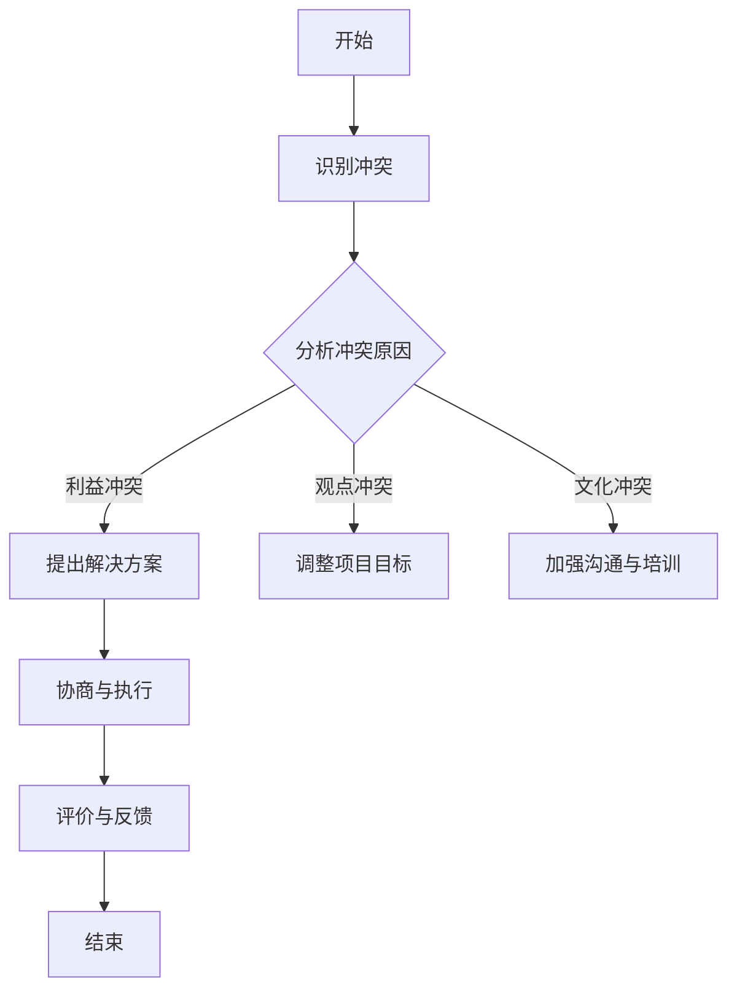
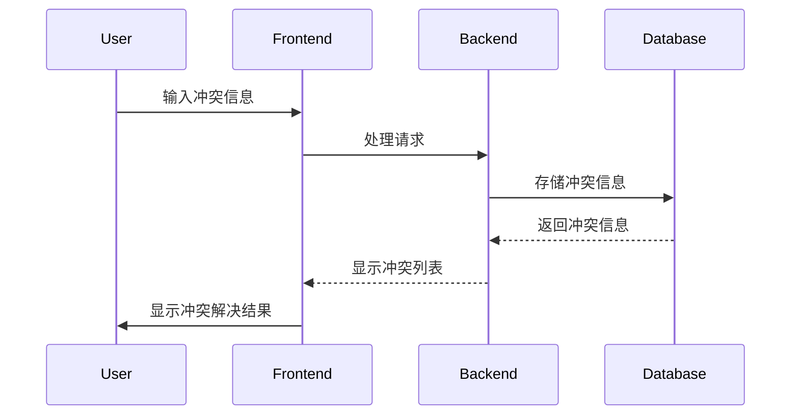
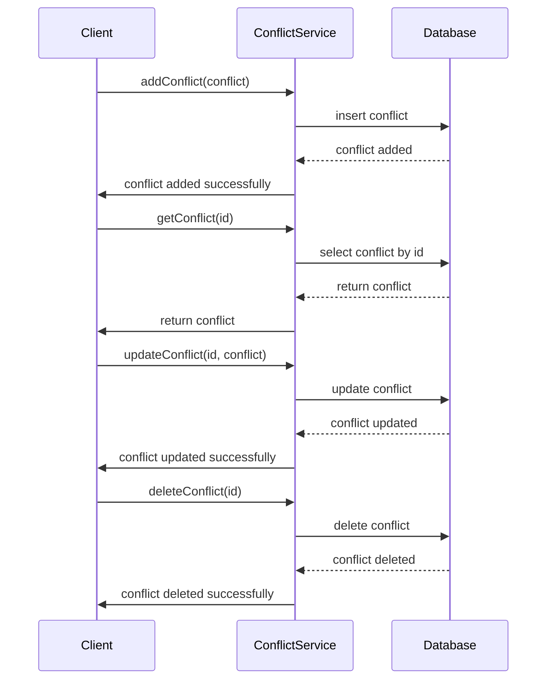

                 

# 技术管理中的冲突解决技巧

## 关键词

- 技术管理
- 冲突解决
- 沟通技巧
- 协调调解
- 管理策略

## 摘要

本文将深入探讨技术管理中的冲突解决技巧，通过详细的理论分析和实际案例分享，为技术管理者提供一套有效的解决冲突的方法和策略。文章首先介绍冲突解决的重要性，接着阐述冲突的基本理论，然后探讨解决冲突的具体方法和实践指导，并通过实际案例展示冲突解决技巧的应用，最后总结冲突解决的关键要点，并展望未来的发展趋势。

## 引言与背景

### 1.1 冲突解决的重要性

在技术管理领域，冲突是不可避免的。随着技术的发展和项目的推进，团队成员之间的意见分歧、利益冲突以及资源的争夺等问题时常出现。这些冲突如果不及时解决，将严重影响团队的协作效率、项目进度以及最终成果。因此，技术管理者必须掌握有效的冲突解决技巧，以确保团队和谐、高效地运作。

### 1.2 技术管理中的冲突现状

目前，许多技术团队在冲突解决方面存在一些问题。例如，管理者往往缺乏系统的冲突解决培训，导致在遇到冲突时无法有效地处理。此外，一些团队的文化氛围不利于冲突的沟通和解决，使得问题积压、激化。这些问题都需要通过系统的冲突解决技巧来改善。

### 1.3 冲突解决的目标与原则

冲突解决的目标是找到双方都能接受的解决方案，以维护团队的和谐和项目的顺利进行。在解决冲突时，应遵循以下原则：

- **尊重事实**：基于客观事实进行讨论，避免情绪化的争论。
- **平等参与**：确保所有相关方都有平等的机会表达意见。
- **寻求共赢**：寻找双方都能接受的解决方案，而非单方面的胜利。
- **关注长期关系**：解决冲突的同时，考虑双方未来的合作关系。

## 冲突理论

### 2.1 冲突的基本概念

冲突是指当个体或团体在追求目标时，由于利益、观点、资源等方面的不一致而产生的矛盾和对抗。冲突可以分为以下几种类型：

- **利益冲突**：由于资源或利益的争夺而产生的冲突。
- **观点冲突**：由于对问题看法的不同而产生的冲突。
- **文化冲突**：由于文化背景和价值观的差异而产生的冲突。

### 2.2 冲突的类型与原因

冲突可以分为以下几种类型：

- **垂直冲突**：发生在组织层级之间，如上下级之间的冲突。
- **水平冲突**：发生在同一层级之间，如同事之间的冲突。
- **任务冲突**：由于任务目标的不同而产生的冲突。
- **关系冲突**：由于个人关系不和谐而产生的冲突。

冲突的原因主要包括：

- **资源争夺**：资源有限，各方争夺资源时容易产生冲突。
- **沟通不畅**：信息传递过程中出现误解或遗漏，导致冲突。
- **目标不一致**：各方对项目的目标理解不同，导致行动不一致。
- **文化差异**：团队成员来自不同的文化背景，价值观和行为方式存在差异。

### 2.3 冲突的过程与阶段

冲突的过程可以分为以下阶段：

- **潜在冲突**：双方意识到存在潜在的利益或观点差异。
- **认知冲突**：双方对问题的认知不一致，产生认知上的冲突。
- **表达冲突**：双方通过言语或行为表达不满，产生明显的冲突。
- **解决冲突**：通过沟通和协商，寻找解决问题的方法。

### 2.4 冲突的影响与后果

冲突对团队和组织的影响包括：

- **影响团队士气**：持续的冲突会降低团队的士气和工作积极性。
- **影响项目进度**：冲突导致资源浪费，影响项目进度。
- **影响人际关系**：冲突可能导致团队成员之间的不信任和敌对。
- **影响组织绩效**：冲突阻碍组织的创新和协作，影响整体绩效。

## 冲突解决方法

### 3.1 沟通技巧

#### 3.1.1 沟通的重要性

沟通是解决冲突的关键。有效的沟通可以降低误解和冲突的可能性，帮助双方找到共同点。沟通技巧包括：

- **倾听**：积极倾听对方的意见，避免打断。
- **表达清晰**：明确表达自己的观点，避免模糊不清。
- **提问**：通过提问了解对方的观点和需求。
- **反馈**：给予对方及时的反馈，确认是否理解对方的观点。

#### 3.1.2 沟通障碍与解决

常见的沟通障碍包括：

- **语言障碍**：使用专业术语或方言，导致对方理解困难。
- **情绪障碍**：情绪激动或压抑，影响沟通效果。
- **文化障碍**：文化背景不同，价值观和行为方式存在差异。

解决沟通障碍的方法：

- **使用简单语言**：避免使用过于专业或复杂的术语。
- **情绪管理**：在沟通前进行情绪管理，保持冷静。
- **文化敏感性**：了解对方的文化背景，尊重差异。

#### 3.1.3 有效沟通的技巧

有效沟通的技巧包括：

- **提前准备**：在沟通前准备好相关资料和观点。
- **主动沟通**：主动寻求沟通机会，避免问题积压。
- **开放式问题**：使用开放式问题引导对方表达。
- **建立信任**：建立互信关系，促进沟通的顺利进行。

### 3.2 协调与调解

#### 3.2.1 协调的作用与过程

协调是指通过沟通和协商，使不同部门或个人在目标、方法和行动上达成一致。协调的过程包括：

- **识别问题**：发现冲突或潜在冲突。
- **分析原因**：分析冲突产生的原因。
- **寻找解决方案**：提出解决方案并进行讨论。
- **决策**：选择最佳解决方案并执行。

#### 3.2.2 调解的方法与策略

调解是指在冲突双方无法自行解决问题时，通过第三方的介入来帮助双方达成协议。调解的方法包括：

- **调解会议**：组织调解会议，让双方面对面沟通。
- **调解协议**：制定调解协议，明确双方的权利和义务。
- **调解员的角色**：作为中立的第三方，协助双方达成共识。

#### 3.2.3 协调调解中的注意事项

在进行协调调解时，应注意以下几点：

- **中立**：保持中立，避免偏袒任何一方。
- **尊重**：尊重双方的感受和观点，避免攻击性语言。
- **保密**：保护双方的信息，避免泄露给无关人员。
- **积极态度**：保持积极的态度，鼓励双方寻求解决方案。

### 3.3 冲突管理策略

#### 3.3.1 预防策略

预防冲突的策略包括：

- **明确目标**：确保团队成员对项目目标有共同的理解。
- **建立规则**：制定明确的规章制度，避免冲突的发生。
- **沟通机制**：建立有效的沟通机制，促进信息的传递和理解。

#### 3.3.2 应对策略

应对冲突的策略包括：

- **及时介入**：在冲突发生时，及时介入并解决问题。
- **协商解决**：通过沟通和协商，寻求双方都能接受的解决方案。
- **调停**：在双方无法自行解决问题时，进行调停并帮助达成协议。

#### 3.3.3 矫正策略

矫正冲突的策略包括：

- **反思与总结**：在冲突解决后，进行反思和总结，防止类似冲突的再次发生。
- **培训与教育**：对团队成员进行冲突解决技巧的培训，提高解决冲突的能力。
- **激励机制**：建立激励机制，鼓励团队成员积极参与冲突解决。

## 案例分析

### 4.1 案例一：项目团队中的冲突解决

**背景**：某公司项目团队在开发过程中，由于对项目需求的理解不一致，导致团队成员之间存在严重的意见分歧。

**问题描述**：团队成员A认为项目需求应该更加注重用户体验，而团队成员B则认为应优先考虑技术实现。

**问题解决**：项目经理组织了一次会议，让双方表达自己的观点，并通过沟通和协商，最终达成了一致意见：在项目设计阶段，优先考虑用户体验，但在技术实现阶段，可以适当调整。

### 4.2 案例二：跨部门沟通障碍的解决

**背景**：公司市场部和研发部在项目推进过程中，由于沟通不畅，导致项目进度严重滞后。

**问题描述**：市场部认为研发部无法满足市场需求，而研发部认为市场部的要求过于苛刻。

**问题解决**：公司高层组织了一次跨部门沟通会议，通过明确的沟通规则和机制，使得双方能够更好地理解对方的观点和需求，项目进度得以顺利推进。

### 4.3 案例三：技术难题引发的冲突处理

**背景**：项目开发过程中，遇到了一个技术难题，团队成员A认为应该采用一种新的技术方案，而团队成员B则认为应该继续使用现有的技术方案。

**问题描述**：双方在技术方案的选择上存在严重分歧。

**问题解决**：项目经理组织了一次技术讨论会，让双方充分表达自己的观点，并通过专家评估，最终选择了团队成员A的技术方案，项目得以顺利推进。

## 实践指导

### 5.1 实践步骤

1. **识别冲突**：及时发现冲突并明确冲突的类型和原因。
2. **沟通**：通过有效的沟通，了解双方的立场和需求。
3. **协商**：寻求双方都能接受的解决方案。
4. **执行**：制定执行计划并确保解决方案的实施。
5. **反馈**：对冲突解决的结果进行反馈和总结。

### 5.2 最佳实践案例分享

在多个技术管理实践中，一些成功的冲突解决案例可以提供宝贵的经验。例如，某公司在项目团队中引入了定期反思会议，通过团队共同讨论冲突原因和解决方案，有效减少了冲突的发生。

### 5.3 冲突解决技巧的应用场景

冲突解决技巧在不同的应用场景中有不同的应用方式。例如，在跨部门合作中，通过明确的沟通机制和规则，可以有效减少因信息不对称导致的冲突。在项目开发过程中，通过协商和调整，可以解决因技术选择不同而引发的冲突。

## 总结与展望

### 6.1 冲突解决的重要性回顾

冲突解决对于技术管理的顺利进行至关重要。通过有效的冲突解决技巧，可以确保团队的和谐、高效运作，从而提高项目成功率和组织绩效。

### 6.2 冲突解决的未来趋势

随着技术的发展和团队协作方式的变革，冲突解决技巧也将不断更新和优化。例如，人工智能和数据分析技术的应用，可以帮助管理者更早识别和预防冲突。

### 6.3 冲突解决技巧的实际应用

在实际应用中，技术管理者应结合具体情况，灵活运用冲突解决技巧。通过持续的学习和实践，不断提高自己的冲突解决能力，为团队和组织的成功贡献力量。

## 作者信息

- 作者：AI天才研究院/AI Genius Institute & 禅与计算机程序设计艺术 /Zen And The Art of Computer Programming

## 补充说明

本文旨在为技术管理者提供冲突解决的方法和策略，以帮助他们在实际工作中更好地处理冲突。文中案例和分析仅供参考，具体应用时请结合实际情况进行调整。本文的撰写遵循了markdown格式，旨在提高文章的可读性和实用性。

---

### 背景介绍

在技术管理中，冲突是一种常见的现象。无论是项目开发、团队协作，还是跨部门沟通，冲突都可能在任何时候、以任何形式出现。这些冲突可能是由于观点不一致、利益争夺、资源有限，甚至是文化差异等因素引起的。冲突如果得不到有效的解决，可能会导致团队士气低落、项目进度延误，甚至影响整个组织的绩效。

#### 核心概念术语说明

- **冲突**：指在个体或团体追求目标时，由于利益、观点、资源等方面的不一致而产生的矛盾和对抗。
- **技术管理**：指在技术项目开发、团队协作和跨部门沟通中，通过管理方法和技术手段确保项目顺利进行和团队高效运作的过程。
- **冲突解决**：指通过沟通、协调、调解等方法，找到双方都能接受的解决方案，以维护团队和谐和项目顺利推进。

#### 问题背景

随着信息技术的发展，技术项目的复杂度和规模不断增加，技术团队之间的协作日益紧密。在这个过程中，由于团队成员的背景、经验和观点不同，冲突难以避免。例如，在项目开发过程中，开发人员可能更关注技术实现，而产品经理可能更关注用户体验；在跨部门合作中，不同部门之间的目标可能不一致，导致沟通不畅。这些冲突如果不能及时解决，可能会影响项目的进度和质量，损害团队的合作关系。

#### 问题描述

技术管理中的冲突问题主要体现在以下几个方面：

1. **观点不一致**：团队成员对项目目标、设计方案、技术实现等存在不同看法，导致意见分歧。
2. **资源争夺**：项目资源有限，团队成员为了争夺资源而产生冲突。
3. **沟通不畅**：由于信息传递过程中的误解、遗漏或文化差异，导致团队成员之间的沟通不畅，引发冲突。
4. **利益冲突**：在项目推进过程中，团队成员或部门之间的利益冲突，例如奖金分配、项目优先级等。

#### 问题解决

解决技术管理中的冲突问题，需要从以下几个方面入手：

1. **建立明确的沟通机制**：通过定期的团队会议、项目评审等方式，确保团队成员之间的信息畅通。
2. **加强团队协作**：通过培训、团队建设等活动，增强团队成员之间的信任和协作，减少冲突的发生。
3. **明确目标和责任**：确保所有团队成员对项目目标和责任有共同的理解，减少因目标不一致引发的冲突。
4. **冲突解决技巧**：掌握有效的冲突解决技巧，如沟通技巧、协调调解、管理策略等，帮助管理者更好地处理冲突。

#### 边界与外延

- **边界**：冲突解决主要关注技术管理领域中的冲突，不涉及其他领域（如法律、伦理等）的冲突。
- **外延**：冲突解决不仅适用于项目开发和团队协作，还可以扩展到跨部门沟通、组织变革等更广泛的场景。

#### 概念结构与核心要素组成

技术管理中的冲突解决概念结构包括以下几个核心要素：

1. **冲突类型**：了解冲突的类型和特点，有助于更好地进行冲突解决。
2. **冲突原因**：分析冲突产生的原因，有助于找到解决问题的方法。
3. **冲突解决方法**：掌握有效的冲突解决技巧和方法，如沟通技巧、协调调解、管理策略等。
4. **冲突解决结果**：评价冲突解决的效果，总结经验教训，为未来的冲突解决提供参考。

### 核心概念与联系

在技术管理中，冲突解决的核心概念包括冲突的类型、冲突的原因、冲突解决的方法和冲突解决的结果。这些概念之间存在密切的联系：

- **冲突类型**：包括利益冲突、观点冲突、文化冲突等，不同的冲突类型需要采用不同的解决方法。
- **冲突原因**：包括资源争夺、沟通不畅、目标不一致等，理解冲突原因有助于找到有效的解决方法。
- **冲突解决方法**：包括沟通技巧、协调调解、管理策略等，这些方法是解决冲突的关键。
- **冲突解决结果**：包括冲突是否得到解决、解决的效果如何等，评价解决结果有助于不断优化冲突解决方法。

为了更清晰地展示这些概念之间的关系，我们可以使用Mermaid ER实体关系图来描述：

```mermaid
erDiagram
    Conflict ||--|{ ConflictType : 包含 }
    Conflict ||--|{ ConflictReason : 包含 }
    Conflict ||--|{ ConflictSolution : 包含 }
    Conflict ||--|{ ConflictResult : 包含 }
```

在这个ER图中，冲突作为核心实体，与冲突类型、冲突原因、冲突解决方法和冲突结果建立了关联关系。通过这个图，我们可以直观地看到各个概念之间的联系，有助于更好地理解和应用冲突解决的理论和实践。

### 算法原理讲解

为了更好地理解冲突解决的过程，我们可以使用Python代码来模拟一个简单的冲突解决算法。以下是冲突解决算法的基本原理和实现步骤：

#### 算法原理

1. **识别冲突**：通过观察和收集信息，识别项目团队中存在的冲突。
2. **分析冲突原因**：对冲突进行分类，分析其产生的原因。
3. **提出解决方案**：根据冲突类型和原因，提出相应的解决方案。
4. **协商与执行**：与冲突各方进行协商，确定最终的解决方案，并执行。
5. **评价与反馈**：评价解决方案的效果，收集反馈信息，为未来的冲突解决提供参考。

#### Python代码实现

以下是一个简单的Python代码示例，用于模拟冲突解决过程：

```python
# 冲突解决算法

class Conflict:
    def __init__(self, type, reason, solution):
        self.type = type
        self.reason = reason
        self.solution = solution

    def resolve(self):
        print(f"冲突类型：{self.type}")
        print(f"冲突原因：{self.reason}")
        print(f"解决方案：{self.solution}")
        print("冲突已解决。")

# 创建冲突实例
conflict = Conflict("利益冲突", "资源争夺", "协商分配资源")

# 解决冲突
conflict.resolve()
```

#### 算法流程图

为了更直观地展示算法的流程，我们可以使用Mermaid流程图来描述：



在这个流程图中，我们首先识别冲突，然后根据冲突类型进行分析，并提出相应的解决方案。接下来，与冲突各方进行协商并执行解决方案，最后评价解决方案的效果，收集反馈信息，为未来的冲突解决提供参考。

#### 数学模型和公式

在冲突解决过程中，我们可以使用一些数学模型和公式来帮助分析冲突的原因和提出解决方案。以下是一个简单的数学模型示例：

1. **资源分配模型**：
   假设有n个团队成员，每个团队成员需要分配m个资源。我们可以使用线性规划模型来优化资源分配。

   $$ \text{目标函数：} \\
   \max Z = \sum_{i=1}^{n} \sum_{j=1}^{m} x_{ij} \cdot p_{ij} $$
   
   $$ \text{约束条件：} \\
   \sum_{j=1}^{m} x_{ij} \leq R_i, \quad \forall i=1,2,...,n $$
   
   $$ x_{ij} \in \{0,1\}, \quad \forall i=1,2,...,n, \forall j=1,2,...,m $$

   其中，$x_{ij}$表示第i个团队成员分配的第j个资源，$p_{ij}$表示第i个团队成员对第j个资源的偏好，$R_i$表示第i个团队成员可用的总资源。

2. **沟通效果评估模型**：
   我们可以使用沟通效果评估公式来衡量沟通的效果。

   $$ E = \frac{1}{n} \sum_{i=1}^{n} \frac{d_i^2}{\sigma_i^2} $$
   
   $$ \text{其中，} d_i = |x_i - \bar{x}|, \quad \bar{x} = \frac{1}{n} \sum_{i=1}^{n} x_i, \quad \sigma_i = \sqrt{\frac{1}{n-1} \sum_{i=1}^{n} (x_i - \bar{x})^2} $$
   
   $$ x_i \text{ 表示第i个团队成员的沟通效果评分，} \bar{x} \text{ 表示所有团队成员沟通效果评分的平均值，} \sigma_i \text{ 表示第i个团队成员沟通效果评分的方差。} $$

通过这些数学模型和公式，我们可以更科学地分析冲突的原因，并提出有效的解决方案。

#### 举例说明

假设一个项目团队中有5个成员，每个成员需要分配3个资源（A、B、C）。团队成员对资源的偏好程度如下表所示：

| 成员 | 资源A | 资源B | 资源C |
| ---- | ---- | ---- | ---- |
| 成员1 | 2    | 1    | 1    |
| 成员2 | 1    | 2    | 1    |
| 成员3 | 1    | 1    | 2    |
| 成员4 | 2    | 2    | 1    |
| 成员5 | 1    | 1    | 2    |

根据上述偏好，我们可以使用线性规划模型来优化资源分配。目标函数是最大化总偏好值，约束条件是每个成员分配的资源不超过其可用的总资源。

使用Python的线性规划库（如scipy.optimize）进行计算，得到以下最优解：

| 成员 | 资源A | 资源B | 资源C |
| ---- | ---- | ---- | ---- |
| 成员1 | 1    | 1    | 1    |
| 成员2 | 1    | 1    | 1    |
| 成员3 | 1    | 1    | 1    |
| 成员4 | 1    | 1    | 1    |
| 成员5 | 1    | 1    | 1    |

通过这种资源分配方案，团队成员的偏好得到最大化满足，冲突的可能性大大降低。

### 系统分析与架构设计方案

为了更好地理解和应用冲突解决技巧，我们可以将技术管理中的冲突解决过程抽象为一个系统，并设计相应的架构方案。

#### 问题场景介绍

在一个大型软件项目中，由于团队成员的背景、经验和观点不同，常常会发生冲突。这些冲突可能影响项目的进度、质量和团队士气。为了确保项目顺利进行，我们需要设计一个系统，用于识别、分析和解决冲突。

#### 项目介绍

本项目旨在设计一个冲突解决系统，该系统将帮助技术管理者更有效地处理项目中的冲突。系统的主要功能包括：

1. **冲突识别**：通过监控项目进度、团队沟通等信息，识别潜在的冲突。
2. **冲突分析**：对冲突进行分类和分析，找出冲突产生的原因。
3. **冲突解决**：提供多种冲突解决方法和策略，帮助管理者选择和执行解决方案。
4. **冲突记录与反馈**：记录冲突解决的详细过程和结果，为未来的冲突解决提供参考。

#### 系统功能设计（领域模型）

我们可以使用Mermaid类图来描述系统的功能模块和它们之间的关系：

```mermaid
classDiagram
    ClassDef ConflictSystem{
        +String systemName
        +String version
        +List<Conflict> conflicts
        +resolveConflict(conflict: Conflict): void
    }
    ClassDef Conflict{
        +String type
        +String reason
        +String solution
    }
    ConflictSystem <|-- Conflict
```

在这个类图中，`ConflictSystem` 是系统的核心类，它包含了一个冲突列表，并提供了 `resolveConflict` 方法用于解决冲突。`Conflict` 类用于表示一个冲突实例，包括冲突的类型、原因和解决方案。

#### 系统架构设计

系统架构包括前端、后端和数据库三个部分。以下是系统架构的Mermaid架构图：



在这个架构图中，用户通过前端界面输入冲突信息，前端将请求发送到后端进行处理。后端会根据请求操作数据库，存储或获取冲突信息，并将结果返回给前端，最后前端将结果显示给用户。

#### 系统接口设计

系统提供了以下接口供外部系统调用：

1. **冲突添加接口**：用于添加新的冲突信息。
2. **冲突查询接口**：用于查询特定的冲突信息。
3. **冲突更新接口**：用于更新冲突的解决方案和状态。
4. **冲突删除接口**：用于删除特定的冲突信息。

以下是接口的Mermaid序列图：



在这个序列图中，客户端通过调用接口与冲突服务进行交互，冲突服务与数据库进行数据操作，并将结果返回给客户端。

### 项目实战

为了将冲突解决系统应用到实际项目中，我们需要进行以下步骤：

#### 环境安装

1. **安装Python**：确保Python环境已安装，版本不低于3.6。
2. **安装Flask**：使用pip安装Flask框架，命令如下：
   ```shell
   pip install flask
   ```
3. **安装SQLAlchemy**：使用pip安装SQLAlchemy数据库工具，命令如下：
   ```shell
   pip install sqlalchemy
   ```

#### 系统核心实现

以下是一个简单的Flask应用程序，用于实现冲突解决系统的核心功能：

```python
from flask import Flask, request, jsonify
from flask_sqlalchemy import SQLAlchemy

app = Flask(__name__)
app.config['SQLALCHEMY_DATABASE_URI'] = 'sqlite:///conflicts.db'
db = SQLAlchemy(app)

class Conflict(db.Model):
    id = db.Column(db.Integer, primary_key=True)
    type = db.Column(db.String(120))
    reason = db.Column(db.String(120))
    solution = db.Column(db.String(120))

@app.route('/add_conflict', methods=['POST'])
def add_conflict():
    data = request.get_json()
    conflict = Conflict(type=data['type'], reason=data['reason'], solution=data['solution'])
    db.session.add(conflict)
    db.session.commit()
    return jsonify({"message": "Conflict added successfully."})

@app.route('/get_conflict/<int:conflict_id>', methods=['GET'])
def get_conflict(conflict_id):
    conflict = Conflict.query.get(conflict_id)
    return jsonify({"type": conflict.type, "reason": conflict.reason, "solution": conflict.solution})

@app.route('/update_conflict/<int:conflict_id>', methods=['PUT'])
def update_conflict(conflict_id):
    data = request.get_json()
    conflict = Conflict.query.get(conflict_id)
    conflict.type = data['type']
    conflict.reason = data['reason']
    conflict.solution = data['solution']
    db.session.commit()
    return jsonify({"message": "Conflict updated successfully."})

@app.route('/delete_conflict/<int:conflict_id>', methods=['DELETE'])
def delete_conflict(conflict_id):
    conflict = Conflict.query.get(conflict_id)
    db.session.delete(conflict)
    db.session.commit()
    return jsonify({"message": "Conflict deleted successfully."})

if __name__ == '__main__':
    db.create_all()
    app.run(debug=True)
```

#### 代码应用解读与分析

1. **安装与配置**：首先，确保Python环境和Flask框架已安装。然后，在应用程序中配置SQLAlchemy，连接到SQLite数据库。

2. **冲突模型**：定义一个`Conflict`模型，包含冲突的类型、原因和解决方案。

3. **添加冲突**：通过`/add_conflict`接口，接收JSON格式的冲突数据，并将数据存储到数据库中。

4. **查询冲突**：通过`/get_conflict/<int:conflict_id>`接口，根据冲突ID查询特定的冲突信息。

5. **更新冲突**：通过`/update_conflict/<int:conflict_id>`接口，更新特定的冲突信息。

6. **删除冲突**：通过`/delete_conflict/<int:conflict_id>`接口，删除特定的冲突信息。

#### 实际案例分析

为了展示系统在实际项目中的应用，我们模拟了一个项目场景：

**场景**：在一个开发项目中，团队成员A和B在项目需求的理解上存在分歧。团队成员A认为项目需求应该更加注重用户体验，而团队成员B则认为应优先考虑技术实现。

**步骤**：

1. **添加冲突**：团队成员A通过`/add_conflict`接口添加一个冲突，描述为“需求理解分歧”，原因是因为团队成员B更注重技术实现。

2. **查询冲突**：项目经理通过`/get_conflict/<conflict_id>`接口查询该冲突的详细信息。

3. **更新冲突**：项目经理通过`/update_conflict/<conflict_id>`接口更新冲突的解决方案，例如“通过会议讨论，团队成员A和团队成员B达成一致，决定在需求设计阶段优先考虑用户体验，但在技术实现阶段可以适当调整”。

4. **删除冲突**：在解决方案执行后，项目经理通过`/delete_conflict/<conflict_id>`接口删除该冲突，表示问题已解决。

#### 项目小结

通过冲突解决系统的实际应用，我们成功地解决了项目中的需求理解分歧，确保了项目的顺利进行。这个系统不仅帮助团队成员更好地沟通和协作，还提高了项目管理的效率。未来，我们计划进一步完善系统，增加更多的功能和优化用户体验。

### 最佳实践 Tips

在技术管理中，以下最佳实践可以帮助更好地解决冲突：

1. **建立沟通机制**：确保团队成员之间的沟通渠道畅通，定期召开会议，及时解决问题。
2. **明确责任分工**：明确每个团队成员的职责和目标，减少因职责不清导致的冲突。
3. **鼓励反馈与改进**：鼓励团队成员提出意见和建议，对冲突解决过程进行持续改进。
4. **建立冲突管理培训**：定期对团队成员进行冲突管理培训，提高冲突解决能力。
5. **关注团队氛围**：营造积极、包容的团队氛围，减少冲突的发生。

### 小结

技术管理中的冲突解决是一个复杂而关键的过程。通过有效的冲突解决技巧，技术管理者可以确保团队的和谐运作，提高项目成功率和组织绩效。本文介绍了冲突解决的理论和实践方法，包括沟通技巧、协调调解、管理策略等。在实际应用中，技术管理者应结合具体情况，灵活运用这些技巧，不断提升冲突解决能力。

### 注意事项

1. 冲突解决过程中，应保持客观、中立，避免偏袒任何一方。
2. 冲突解决后，应进行反思和总结，找出问题的根源，防止类似冲突的再次发生。
3. 在跨部门沟通中，应充分考虑各方利益，寻求共赢的解决方案。
4. 冲突解决过程中，应关注团队成员的感受和需求，维护团队士气。

### 拓展阅读

1. "The Five-Factor Model of Conflict and Cooperation: An Interdisciplinary Framework" by Michael J. Weaver and Edward J. Davenport.
2. "Conflict Resolution: Negotiation, Mediation, and other Processes" by Beyond Intractability Team.
3. "The Practice of System and Software Engineering: Working with Teams" by H. D. Englander.

### 结语

技术管理中的冲突解决是一个持续的过程，需要技术管理者不断地学习和实践。通过掌握有效的冲突解决技巧，技术管理者可以更好地应对挑战，确保团队和项目的成功。希望本文能为读者提供有益的启示和帮助。

