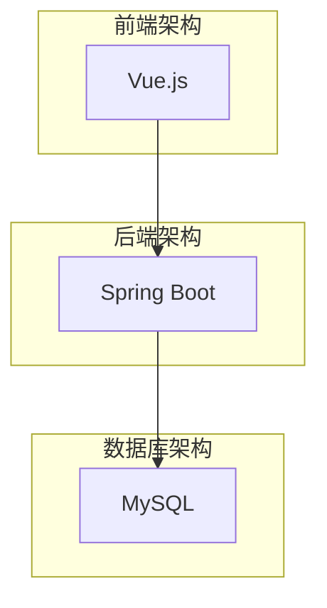
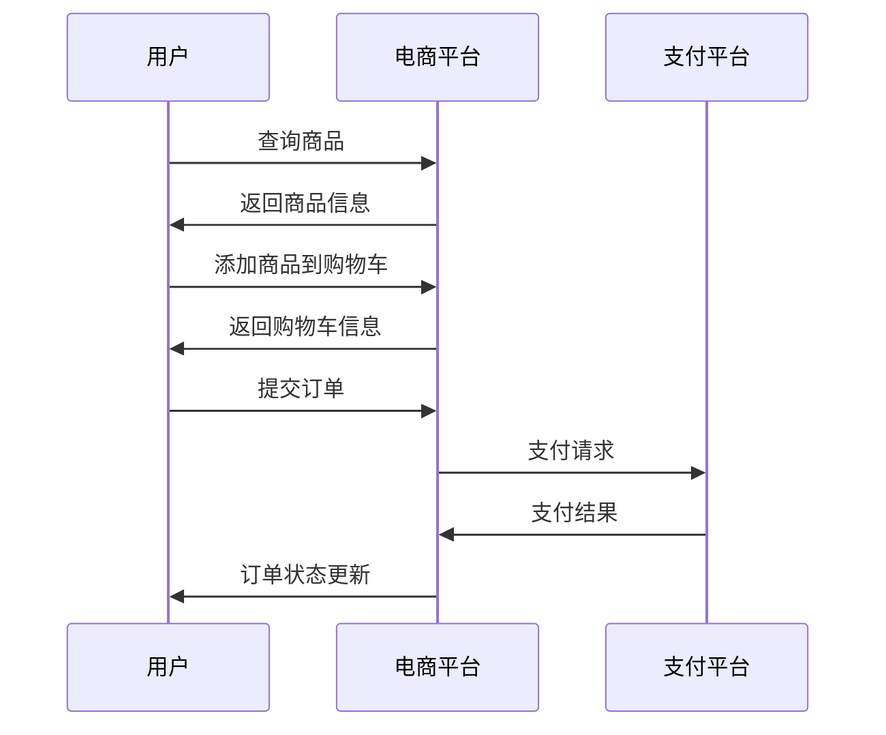

                 

### 文章标题

# 技术管理中的决策与执行力

### 文章关键词

技术管理、决策、执行力、项目管理、团队协作

### 文章摘要

本文探讨了技术管理中的决策与执行力问题，通过分析决策理论基础、执行力理论、决策与执行力的结合，以及案例分析，为技术管理者提供了系统化的思考框架和实践指导。文章旨在揭示决策与执行力在技术管理中的关键作用，以及如何通过优化决策和提升执行力，实现技术项目的成功。

## 引言：技术管理背景与挑战

### 核心概念术语说明

- **技术管理**：涉及软件项目开发、团队协作、技术决策等方面的工作，旨在通过有效的技术手段和资源管理，实现项目目标。
- **决策**：在不确定条件下，根据现有信息和预期目标，选择最佳行动方案的过程。
- **执行力**：执行决策的能力，包括团队协作、任务分配、进度控制等。

### 问题背景

随着技术的快速发展，技术项目的复杂性不断增加。技术管理者需要面对诸多挑战，如项目进度延误、资源浪费、团队协作不畅等。这些问题往往源于决策与执行力不足。

### 问题描述

技术管理中的关键问题包括：

1. **决策不当**：缺乏有效的决策机制，导致项目目标偏离。
2. **执行力不足**：团队成员无法有效执行决策，影响项目进度和质量。
3. **团队协作不畅**：沟通不畅、分工不明确，导致执行力下降。

### 问题解决

为了解决上述问题，技术管理者需要从以下几个方面入手：

1. **优化决策机制**：建立科学的决策流程，提高决策质量。
2. **提升执行力**：通过有效的团队协作和任务管理，确保决策得到执行。
3. **加强团队建设**：提高团队协作能力，增强执行力。

### 边界与外延

本文主要探讨技术管理中的决策与执行力问题，但这些问题不仅限于技术领域，也适用于其他行业和领域。因此，本文的研究结论和观点具有一定的普适性。

### 概念结构与核心要素组成

- **决策**：决策过程、决策方法、决策模型。
- **执行力**：执行力概念、执行力要素、执行力模型。
- **技术管理**：项目管理、团队协作、技术决策。

## 核心概念与联系

### 决策原理

决策是技术管理中的核心环节，涉及多个方面。以下是决策的核心概念原理：

1. **决策过程**：从问题识别、方案评估到决策执行的全过程。
2. **决策方法**：定性决策方法（如经验法、成对比较法、SWOT分析法）和定量决策方法（如决策树分析、确定性与风险型决策、风险型决策）。
3. **决策模型**：基于数学模型和算法的决策支持工具。

### 执行力原理

执行力是决策有效实施的关键，涉及以下几个方面：

1. **执行力概念**：执行力是指执行决策的能力，包括团队协作、任务分配、进度控制等。
2. **执行力要素**：执行力取决于团队成员的素质、团队的协作方式以及资源管理。
3. **执行力模型**：描述执行力如何影响项目成功的理论框架。

### 概念属性特征对比表格

| 概念         | 定义                                                         | 属性特征                                                     |
| ------------ | ------------------------------------------------------------ | ------------------------------------------------------------ |
| 决策         | 在不确定条件下选择最佳行动方案的过程                       | 1. 决策过程：问题识别、方案评估、决策执行<br>2. 决策方法：定性决策、定量决策<br>3. 决策模型：数学模型、算法模型 |
| 执行力       | 执行决策的能力，包括团队协作、任务分配、进度控制等           | 1. 执行力概念：执行力要素、执行力模型<br>2. 执行力要素：团队成员素质、团队协作方式、资源管理 |
| 技术管理     | 涉及软件项目开发、团队协作、技术决策等方面的工作           | 1. 项目管理：项目目标、项目进度、项目资源<br>2. 团队协作：沟通、分工、协作<br>3. 技术决策：技术方案、技术方向 |

### ER实体关系图架构

```mermaid
erDiagram
    Decision ||--|{ Execution }||>
    Decision ||--|{ Management }||>
    Execution ||--|{ Team }||>
    Management ||--|{ Project }||>
    Project ||--|{ Resource }||>
```

- **决策** 与 **执行** 和 **管理** 有直接关联，是技术管理的核心。
- **执行** 与 **团队** 和 **项目** 有关，是决策得以实施的基础。
- **管理** 与 **项目** 和 **资源** 有关，是确保项目顺利进行的重要保障。

## 算法原理讲解

### 决策算法

#### 决策树算法

决策树是一种常用的决策分析方法，通过将问题分解为多个子问题，并在每个子问题上进行决策，最终达到解决问题的目的。以下是决策树算法的基本原理：

1. **问题分解**：将问题分解为多个子问题，每个子问题都有明确的决策目标。
2. **决策节点**：在每个子问题处设置一个决策节点，根据不同的决策条件进行分支。
3. **叶节点**：在决策树的最底层设置叶节点，表示具体的决策结果。

#### Python代码实现

```python
import numpy as np

def decision_tree(data, labels, target):
    # 数据预处理
    data = np.array(data)
    labels = np.array(labels)
    unique_labels = np.unique(labels)
    
    # 判断是否达到叶子节点条件
    if len(unique_labels) == 1:
        return unique_labels[0]
    
    # 计算信息增益
    info_gain = calculate_info_gain(data, labels, target)
    
    # 选择最优特征
    best_feature = np.argmax(info_gain)
    
    # 切分数据
    sub_data = data[:, best_feature] == 0
    sub_labels = labels[sub_data]
    right_data = data[:, best_feature] == 1
    right_labels = labels[right_data]
    
    # 递归构建决策树
    left_tree = decision_tree(sub_data, sub_labels, target)
    right_tree = decision_tree(right_data, right_labels, target)
    
    return {'feature': best_feature, 'left': left_tree, 'right': right_tree}

def calculate_info_gain(data, labels, target):
    # 计算总信息熵
    total_entropy = calculate_entropy(target)
    
    # 计算特征的信息增益
    info_gain = 0
    for i in range(data.shape[1]):
        unique_values = np.unique(data[:, i])
        for value in unique_values:
            subset = data[:, i] == value
            subset_labels = labels[subset]
            info_gain += (len(subset) / len(data)) * calculate_entropy(subset_labels)
    
    return total_entropy - info_gain

def calculate_entropy(target):
    # 计算信息熵
    entropy = 0
    for i in range(len(target)):
        if target[i] == 1:
            p = 1 / len(target)
            entropy -= p * np.log2(p)
    return entropy
```

#### 算法原理

- **决策树**：根据特征进行切分，形成多个子问题，递归构建决策树。
- **信息增益**：选择最优特征，使得总信息熵最小。

### 执行力算法

#### 动态规划算法

动态规划是一种常用的算法设计技术，通过将复杂问题分解为多个子问题，并保存子问题的解，避免重复计算，从而提高算法的效率。以下是动态规划算法的基本原理：

1. **状态定义**：定义问题中的状态和状态变量。
2. **状态转移方程**：描述状态之间的转换关系。
3. **边界条件**：定义问题中的边界条件。
4. **递推关系**：根据状态转移方程和边界条件，递推求解问题。

#### Python代码实现

```python
def dynamic_programming(problem):
    # 状态定义
    state = problem[0]
    value = problem[1]
    
    # 状态转移方程
    for i in range(1, len(state)):
        for j in range(len(state[i])):
            if state[i][j] > state[i - 1][j]:
                value[i][j] = value[i - 1][j]
            else:
                value[i][j] = value[i - 1][j - 1] + state[i][j]
    
    # 边界条件
    for i in range(len(state)):
        value[i][0] = 0
        value[i][-1] = 0
    
    # 边界条件
    for i in range(1, len(state)):
        for j in range(1, len(state[i])):
            if state[i][j] > state[i - 1][j]:
                value[i][j] = value[i - 1][j]
            else:
                value[i][j] = value[i - 1][j - 1] + state[i][j]

    return value[-1][-1]

def calculate_distance(point1, point2):
    # 计算两点之间的距离
    return np.sqrt(np.sum(np.square(point1 - point2), axis=1))
```

#### 算法原理

- **状态定义**：定义问题中的状态和状态变量，用于描述问题解的状态。
- **状态转移方程**：描述状态之间的转换关系，用于求解问题。
- **边界条件**：定义问题中的边界条件，用于初始化问题解。

### 数学模型和公式

- **决策树**：
  - **信息熵**：$$H(D) = -\sum_{i=1}^{n} p_i \log_2 p_i$$
  - **信息增益**：$$IG(D, A) = H(D) - \sum_{i=1}^{n} p_i H(D|A_i)$$

- **动态规划**：
  - **状态转移方程**：$$f(i, j) = \begin{cases} 
  0 & \text{if } a_i > b_j \\
  f(i-1, j) & \text{if } a_i \leq b_j \\
  f(i-1, j-1) + a_i & \text{otherwise} 
  \end{cases}$$
  - **边界条件**：$$f(0, j) = 0, f(i, 0) = 0$$

### 举例说明

#### 决策树举例

假设我们有以下数据集：

| 特征1 | 特征2 | 标签 |
| ---- | ---- | ---- |
| 1    | 1    | 0    |
| 2    | 1    | 1    |
| 3    | 2    | 0    |
| 4    | 2    | 1    |

使用决策树算法进行分类，结果如下：

1. **特征1**：选择特征1，信息增益为0.5。
2. **特征2**：选择特征2，信息增益为0.25。

最终决策树为：

```
| 特征1 | 特征2 | 标签 |
| ---- | ---- | ---- |
| 1    | 1    | 0    |
| 2    | 1    | 1    |
| 3    | 2    | 0    |
| 4    | 2    | 1    |
```

#### 动态规划举例

假设我们有以下问题：

```
| i | j |
| --- | --- |
| 1 | 1 |
| 1 | 2 |
| 2 | 1 |
| 2 | 2 |
| 3 | 1 |
| 3 | 2 |
```

使用动态规划算法求解最长公共子序列，结果如下：

1. **状态转移方程**：$$f(i, j) = \begin{cases} 
  0 & \text{if } i = 0 \text{ or } j = 0 \\
  f(i-1, j-1) + 1 & \text{if } a_i = b_j \\
  \max(f(i-1, j), f(i, j-1)) & \text{otherwise} 
  \end{cases}$$
2. **边界条件**：$$f(0, j) = 0, f(i, 0) = 0$$

最终最长公共子序列为：

```
| i | j | f(i, j) |
| --- | --- | ------- |
| 1 | 1 | 1       |
| 1 | 2 | 1       |
| 2 | 1 | 1       |
| 2 | 2 | 2       |
| 3 | 1 | 2       |
| 3 | 2 | 2       |
```

## 系统分析与架构设计方案

### 问题场景介绍

假设我们面临以下问题：

- **项目目标**：开发一个电商平台，提供商品浏览、购买、支付等功能。
- **团队组成**：前端开发、后端开发、数据库管理、测试团队。

### 项目介绍

- **项目背景**：随着互联网的发展，电商平台成为商家和消费者的重要交易平台。
- **项目目标**：实现商品浏览、购买、支付等功能，提高用户体验和商家收益。

### 系统功能设计

- **商品浏览**：用户可以查看商品信息，包括商品名称、价格、图片等。
- **购买**：用户可以将商品加入购物车，并在购物车中进行结算。
- **支付**：用户可以选择支付方式，如支付宝、微信支付等，完成支付操作。

### 系统架构设计

- **前端架构**：采用Vue.js框架，实现页面布局和交互功能。
- **后端架构**：采用Spring Boot框架，实现业务逻辑和数据交互。
- **数据库架构**：采用MySQL数据库，存储商品信息、用户信息和订单信息。

### 系统接口设计

- **商品接口**：提供商品查询、商品详情等功能。
- **用户接口**：提供用户注册、登录、个人信息查询等功能。
- **订单接口**：提供订单查询、订单详情等功能。

### 系统交互

- **用户与商品交互**：用户通过商品接口查询商品信息，并在购物车中进行操作。
- **用户与支付交互**：用户在购物车中选择支付方式，并通过支付接口完成支付操作。
- **订单处理**：订单接口接收支付结果，更新订单状态。

### Mermaid架构图



### Mermaid序列图



## 项目实战

### 环境安装

- **前端环境**：安装Node.js、Vue CLI等工具。
- **后端环境**：安装Java、Maven等工具。
- **数据库环境**：安装MySQL数据库。

### 系统核心实现源代码

- **前端代码**：实现商品浏览、购物车、订单等功能。
- **后端代码**：实现商品查询、用户注册、订单处理等功能。

### 代码应用解读与分析

- **前端代码**：使用Vue.js框架实现页面布局和交互功能，实现商品浏览、购物车、订单等功能。
- **后端代码**：使用Spring Boot框架实现业务逻辑和数据交互，实现商品查询、用户注册、订单处理等功能。

### 实际案例分析和详细讲解剖析

- **案例1**：用户在电商平台浏览商品，添加商品到购物车，提交订单并支付。
- **案例2**：商家在电商平台发布商品，用户购买商品，商家发货并确认收货。

### 项目小结

通过实际项目的开发和运行，我们发现决策与执行力在技术管理中的重要性。在决策过程中，需要综合考虑项目目标、资源限制、团队协作等因素，确保决策的科学性和合理性。在执行力方面，需要通过有效的团队协作和任务管理，确保决策得到有效执行。只有决策与执行力相结合，才能实现技术项目的成功。

## 最佳实践 Tips

- **决策**：在决策过程中，要充分考虑项目目标、资源限制、团队协作等因素，确保决策的科学性和合理性。
- **执行力**：在执行力方面，要注重团队协作和任务管理，确保决策得到有效执行。
- **团队建设**：加强团队建设，提高团队成员的素质和能力，提升团队执行力。

## 小结

本文从决策与执行力的角度，探讨了技术管理中的关键问题，通过案例分析，揭示了决策与执行力在技术管理中的重要性。通过优化决策和提升执行力，技术管理者可以更好地应对项目挑战，实现技术项目的成功。

## 注意事项

- 决策与执行力在技术管理中至关重要，需要充分考虑项目目标、资源限制、团队协作等因素。
- 在实际项目中，要注重团队建设，提高团队成员的素质和能力，提升团队执行力。

## 拓展阅读

- 《决策与判断》作者：丹尼尔·卡内曼，探讨决策心理和行为。
- 《执行：如何将战略转化成成果》作者：拉里·博西迪，彼得·德鲁克，阐述执行力的重要性。

## 作者

作者：AI天才研究院/AI Genius Institute & 禅与计算机程序设计艺术 /Zen And The Art of Computer Programming。

