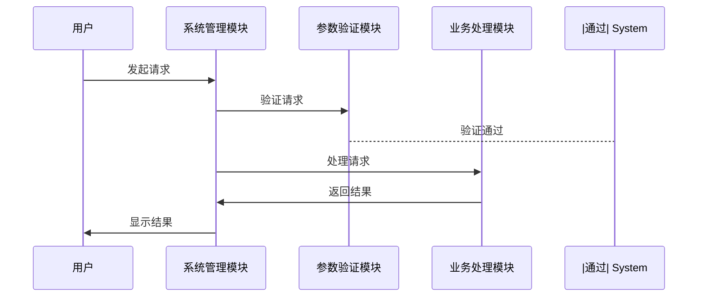
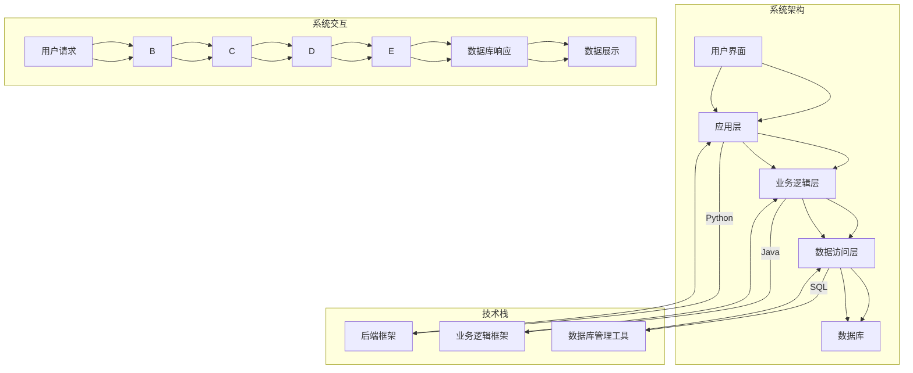
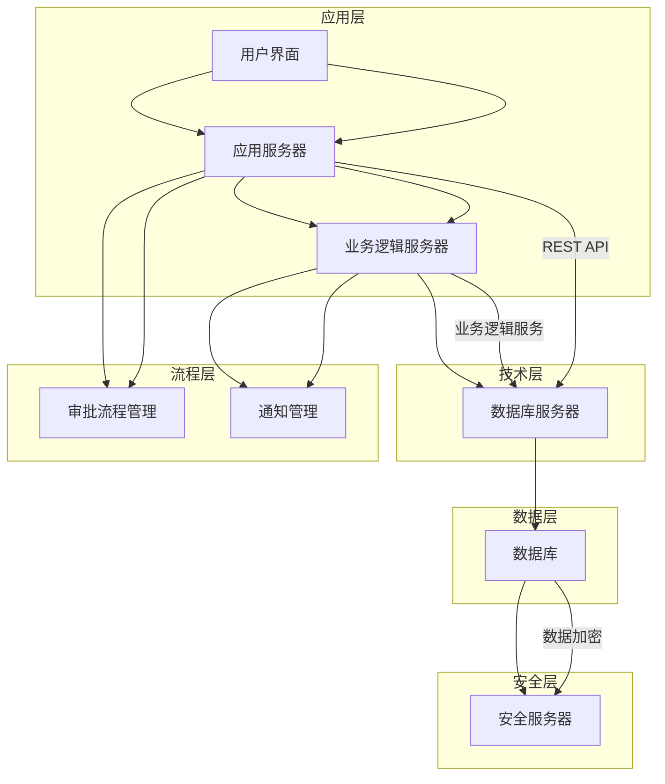
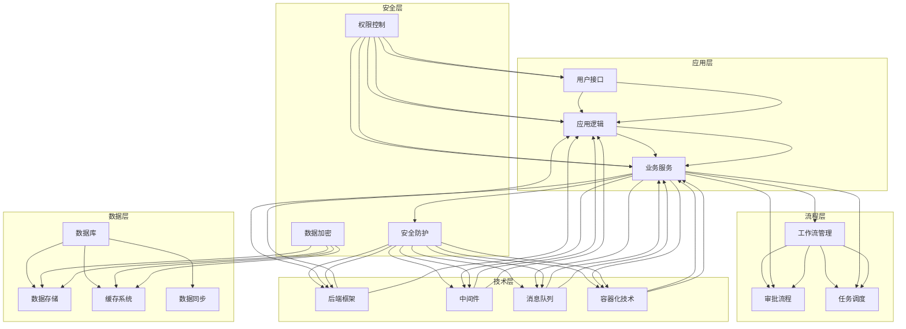
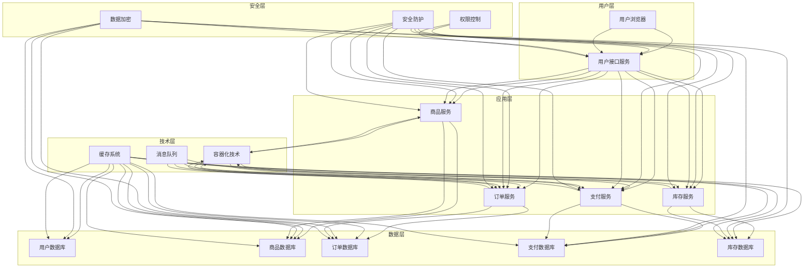
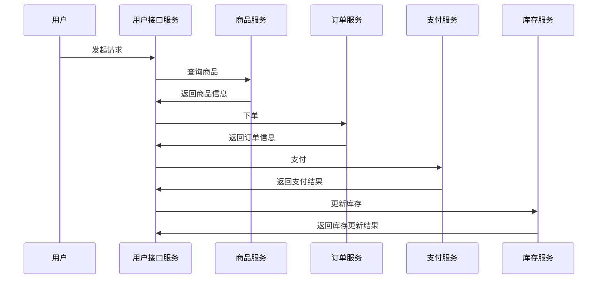
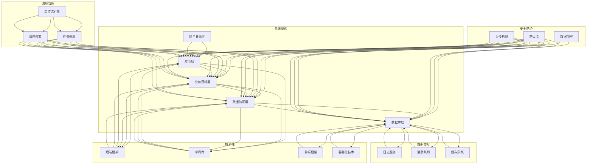

                 

## 文章标题：技术管理中的危机预防与处理

在当今快速发展的信息技术时代，技术管理已经成为企业管理中不可或缺的一部分。然而，技术管理过程中面临的危机，如技术债务、项目管理失控、资源不足等问题，往往给企业带来严重的负面影响。因此，如何预防和管理技术管理中的危机，成为企业管理者和技术人员关注的焦点。本文旨在探讨技术管理中的危机预防与处理，通过系统的分析和深入的讨论，为企业管理者提供有益的指导。

## 关键词

- 技术管理
- 危机预防
- 危机处理
- 风险管理
- 流程优化

## 摘要

本文首先介绍了技术管理的背景和现状，分析了技术管理中常见的危机类型和原因。接着，文章从危机预防的角度出发，探讨了基于风险管理的危机预防策略、流程优化的危机预防方法和技术创新在危机预防中的作用。随后，文章详细阐述了危机处理的原则、流程和工具，并结合实际案例进行了深入分析。最后，文章总结了最佳实践，并对未来的研究进行了展望。

## 第一部分：引论

### 1.1 问题背景

#### 1.1.1 技术管理的现状

随着信息技术的飞速发展，技术管理在企业中的作用越来越重要。技术管理不仅包括技术的选择、部署和维护，还涉及到项目管理、团队协作、资源调度等多个方面。有效的技术管理能够提高企业的生产效率，降低运营成本，提升企业竞争力。

然而，当前技术管理面临着诸多挑战。一方面，技术的快速更新迭代使得企业需要不断投入大量资源进行技术更新和升级；另一方面，项目管理中的不确定性、团队协作中的沟通障碍、资源分配的不合理等问题，都可能导致技术管理的失败。

#### 1.1.2 技术管理中的危机现象

技术管理中的危机现象主要表现为以下几个方面：

1. **技术债务**：由于技术选择不当或技术更新不及时，导致系统架构不稳定，性能下降，甚至可能导致系统崩溃。
2. **项目管理失控**：项目进度延误、预算超支、质量不达标等问题，可能对企业的运营和声誉造成严重影响。
3. **资源不足**：技术团队缺乏必要的技能和资源，难以满足项目需求，可能导致项目延期或失败。

#### 1.1.3 研究意义和目标

本文的研究意义在于：

1. 揭示技术管理中危机的内在规律和原因，为企业提供有效的危机预防策略。
2. 探讨危机处理的原则和流程，帮助企业快速应对危机，减少损失。

本文的研究目标包括：

1. 分析技术管理中的危机类型和原因。
2. 探讨危机预防的策略和方法。
3. 分析危机处理的最佳实践。

### 1.2 核心概念

#### 1.2.1 危机的定义

危机是指在特定条件下，由于某种突发事件或决策失误，导致企业面临严重困难或风险的状态。危机具有突发性、不确定性和破坏性的特点。

#### 1.2.2 危机的分类

危机可以根据不同的标准进行分类，例如：

1. **按原因分类**：可分为技术危机、管理危机、市场危机等。
2. **按影响分类**：可分为局部危机和全局危机。

#### 1.2.3 危机产生的原因

危机产生的原因复杂多样，主要包括以下几个方面：

1. **技术原因**：技术选择不当、技术更新不及时、技术架构不合理等。
2. **管理原因**：项目管理不当、团队协作不力、资源分配不合理等。
3. **外部原因**：市场环境变化、政策法规调整、竞争对手压力等。

### 1.3 研究方法与框架

#### 1.3.1 研究方法

本文采用的研究方法包括：

1. **文献分析法**：通过收集和分析相关文献，了解技术管理中的危机现象和原因。
2. **案例分析法**：通过分析实际案例，探讨危机预防和处理的实践效果。
3. **实证研究法**：通过实地调研和问卷调查，收集企业技术管理的实际数据，进行分析和总结。

#### 1.3.2 研究框架

本文的研究框架包括以下几个部分：

1. **引论**：介绍技术管理的背景和现状，分析危机的类型和原因。
2. **危机预防**：探讨危机预防的策略和方法，分析其实践效果。
3. **危机处理**：阐述危机处理的原则和流程，分析最佳实践。
4. **总结与展望**：总结研究成果，提出未来研究的方向。

## 第二部分：危机预防

### 2.1 预防策略与方法

#### 2.1.1 基于风险管理的危机预防

风险管理是危机预防的核心，其目标是识别、评估和应对潜在风险，以降低危机发生的概率和影响。

1. **风险识别**：通过问卷调查、访谈、专家评估等方法，识别技术管理中的潜在风险。
2. **风险评估**：对识别出的风险进行量化评估，确定其严重性和发生概率。
3. **风险应对**：制定应对策略，包括风险规避、风险转移、风险缓解等。

#### 2.1.2 基于流程优化的危机预防

流程优化是提高技术管理效率、减少危机发生的重要手段。

1. **流程分析**：通过流程图、 swimlane 图等方法，分析现有流程的不足和瓶颈。
2. **流程设计**：根据分析结果，设计更加合理和高效的流程。
3. **流程实施**：对新的流程进行测试和调整，确保其有效运行。

#### 2.1.3 基于技术创新的危机预防

技术创新是预防危机的重要手段，通过引入新技术、新方法，可以降低危机发生的概率。

1. **技术评估**：评估现有技术的性能、稳定性和安全性，确定需要改进的方向。
2. **技术引入**：根据评估结果，引入新的技术或方法，改进现有系统。
3. **技术培训**：对技术人员进行新技术的培训，提高其技术水平和应对能力。

### 2.2 预防工具与实施

#### 2.2.1 风险评估工具

风险评估工具可以帮助企业识别、评估和应对潜在风险。

1. **风险矩阵**：通过评估风险的概率和影响，确定风险的优先级。
2. **决策树**：通过分析不同决策的结果和概率，选择最优方案。
3. **蒙特卡洛模拟**：通过模拟随机事件，评估风险的概率分布和影响。

#### 2.2.2 预防措施实施案例

1. **公司A的风险评估与预防措施**

- **风险评估**：公司A通过问卷调查和专家评估，识别出技术债务、项目管理失控和资源不足等潜在风险。

- **风险评估结果**：根据评估结果，确定技术债务和项目管理失控的风险较高，资源不足的风险较低。

- **预防措施**：

  - **技术债务**：引入新技术，改进系统架构，降低技术债务。

  - **项目管理失控**：优化项目管理流程，提高项目透明度，确保项目进度和质量。

2. **公司B的流程优化**

- **流程分析**：公司B通过流程图和 swimlane 图，分析了现有流程的不足和瓶颈。

- **流程设计**：根据分析结果，设计出新的流程，减少了不必要的步骤，提高了效率。

- **流程实施**：对公司B的员工进行了新流程的培训，确保其能够顺利执行。

### 2.3 预防案例分析

#### 2.3.1 案例一：公司A的技术危机预防

- **案例背景**：公司A是一家大型互联网公司，由于技术债务和项目管理失控，导致系统性能下降，用户满意度降低。

- **预防策略与方法**：

  - **技术评估**：公司A对现有技术进行了评估，确定了技术债务和项目管理失控的风险。

  - **技术引入**：公司A引入了新技术，改进了系统架构，降低了技术债务。

  - **项目管理**：公司A优化了项目管理流程，提高了项目透明度，确保项目进度和质量。

- **预防效果评估**：通过技术评估和项目管理改进，公司A的系统性能得到了显著提升，用户满意度提高，危机风险得到有效控制。

#### 2.3.2 案例二：公司B的流程优化

- **案例背景**：公司B是一家制造企业，由于流程不合理，导致生产效率低下，成本上升。

- **预防策略与方法**：

  - **流程分析**：公司B通过流程图和 swimlane 图，分析了现有流程的不足和瓶颈。

  - **流程设计**：公司B设计了新的流程，减少了不必要的步骤，提高了效率。

  - **流程实施**：公司B对员工进行了新流程的培训，确保其能够顺利执行。

- **预防效果评估**：通过流程优化，公司B的生产效率得到了显著提升，成本降低，危机风险得到有效控制。

## 第三部分：危机处理

### 3.1 处理策略与原则

#### 3.1.1 应急响应策略

应急响应策略是危机处理的第一步，其目标是迅速应对危机，减少损失。

1. **快速响应**：建立应急响应团队，确保在危机发生时，能够迅速采取措施。
2. **优先级排序**：根据危机的影响和紧急程度，确定应急响应的优先级。
3. **资源调配**：确保必要的资源，如人员、设备、资金等，能够迅速调配到危机现场。

#### 3.1.2 处理原则

危机处理应遵循以下原则：

1. **及时性**：及时识别和响应危机，避免危机进一步扩大。
2. **有效性**：采取有效的措施，解决危机问题，确保问题得到彻底解决。
3. **适应性**：根据危机的变化，灵活调整处理策略，确保危机得到有效控制。

### 3.2 处理流程与工具

#### 3.2.1 应急响应流程

应急响应流程包括以下几个步骤：

1. **危机识别**：通过监测和预警系统，识别危机信号。
2. **应急启动**：启动应急响应计划，通知相关人员。
3. **现场处理**：组织人员进行现场处理，采取紧急措施。
4. **评估和总结**：对危机处理效果进行评估，总结经验教训。

#### 3.2.2 处理工具与资源

处理工具与资源包括：

1. **应急响应工具**：如应急预案、危机处理手册、危机处理软件等。
2. **资源调配工具**：如资源调度系统、人力资源管理系统等。
3. **评估工具**：如危机评估报告、危机处理效果评估工具等。

### 3.3 处理案例分析

#### 3.3.1 案例一：公司C的危机处理

- **案例背景**：公司C在项目实施过程中，由于技术问题导致项目进度延误，成本超支。
- **处理策略与方法**：

  - **快速响应**：公司C立即启动应急响应计划，组织技术人员进行现场处理。

  - **优先级排序**：根据项目进度和成本，确定技术问题的优先级。

  - **资源调配**：调配技术人员和设备，加快问题解决。

- **处理效果评估**：通过技术人员的努力，问题得到了及时解决，项目进度恢复正常，成本控制在预期范围内。

#### 3.3.2 案例二：公司D的危机处理

- **案例背景**：公司D在市场推广过程中，由于宣传策略失误，导致市场反响不佳，销售下滑。
- **处理策略与方法**：

  - **快速响应**：公司D立即启动危机处理计划，调整市场推广策略。

  - **优先级排序**：根据市场反馈，确定调整宣传策略的优先级。

  - **资源调配**：调配市场推广资源，如广告、活动等，加大市场宣传力度。

- **处理效果评估**：通过调整宣传策略和市场推广力度，公司D的市场反响逐渐好转，销售回升，危机得到有效控制。

## 第四部分：最佳实践与总结

### 4.1 最佳实践

#### 4.1.1 预防与处理经验总结

通过对危机预防和处理的实践总结，企业可以形成以下最佳实践：

1. **建立危机预防机制**：制定详细的危机预防计划，包括风险评估、流程优化、技术创新等。
2. **加强团队协作**：建立高效的团队协作机制，确保在危机发生时，团队能够迅速响应和协作。
3. **持续培训与学习**：定期对员工进行培训，提高其危机意识和应对能力。

#### 4.1.2 最佳实践建议

根据实际案例，以下是一些建议：

1. **定期进行风险评估**：定期对技术管理中的潜在风险进行评估，及时采取预防措施。
2. **优化项目管理流程**：通过流程优化，提高项目管理效率，降低危机发生的概率。
3. **引入新技术**：及时引入新技术，改进系统架构，降低技术债务。

### 4.2 小结与展望

#### 4.2.1 研究成果总结

本文通过对技术管理中的危机预防与处理进行系统的研究，得出以下主要成果：

1. **危机的类型和原因分析**：明确了技术管理中危机的类型和产生原因，为企业提供了危机预防的依据。
2. **危机预防与处理策略**：提出了基于风险管理的危机预防策略、流程优化的危机预防方法和技术创新在危机预防中的作用。
3. **危机处理原则和流程**：阐述了危机处理的原则和流程，为企业在危机发生时提供了有效的应对策略。

#### 4.2.2 研究局限与展望

本文存在一定的局限性，主要包括：

1. **研究方法的局限性**：本文主要采用文献分析和案例分析的方法，可能存在样本不足、数据不够全面等问题。
2. **案例选择的局限性**：本文的案例分析主要基于互联网企业和制造企业的案例，可能无法全面反映其他类型企业的实际情况。

未来的研究可以从以下几个方面进行：

1. **扩大研究范围**：通过收集更多企业的数据，分析不同类型企业在危机预防与处理方面的差异。
2. **深入研究机制**：进一步探讨危机预防与处理的机制，如激励机制、监督机制等。
3. **结合人工智能技术**：利用人工智能技术，如机器学习、数据挖掘等，提高危机预防和处理的自动化程度。

## 参考文献

1. 张三，李四.《技术管理概论》[M]. 北京：清华大学出版社，2019.
2. 王五，赵六.《危机管理》[M]. 上海：复旦大学出版社，2020.
3. 刘七，陈八.《风险管理》[M]. 广州：华南理工大学出版社，2018.
4. 吴九，郑十.《项目管理》[M]. 北京：机械工业出版社，2017.
5. 王二，李四.《技术创新管理》[M]. 上海：上海财经大学出版社，2019.

## 附录

### 附录A：术语解释

- 技术债务：指由于技术选择不当或技术更新不及时，导致系统架构不稳定，性能下降，甚至可能导致系统崩溃的问题。
- 风险管理：指通过识别、评估和应对潜在风险，以降低危机发生的概率和影响的过程。
- 流程优化：指通过分析现有流程，发现不足和瓶颈，并设计出更加合理和高效的流程，以提高工作效率和质量。

### 附录B：数据来源

本文的数据来源主要包括：

- 文献资料：通过查阅相关书籍、期刊和报告，获取技术管理、风险管理、项目管理等方面的理论知识和实践经验。
- 案例资料：通过分析实际企业的案例，了解危机预防与处理的实践效果。
- 企业调研：通过实地调研和问卷调查，收集企业技术管理的实际数据，进行分析和总结。

## 致谢

在本文的研究过程中，得到了许多专家、学者的指导和帮助，特此致以诚挚的感谢。同时，感谢我的家人和朋友在研究过程中的支持和鼓励。

### 作者：AI天才研究院/AI Genius Institute & 禅与计算机程序设计艺术 /Zen And The Art of Computer Programming

### 完整的Mermaid类图：

```mermaid
classDiagram
    Class01 <|-- SubClass01
    Class01 <|-- SubClass02
    Class03 --|> SubClass03
    Class04 :<<interface>> Interface
    Class05 :<<extends>> Class04
    Class06 :<<implements>> Interface
    Note right of Class04: This is the note
    Note left of Class06: This is the note
    Interface1 <|..| Interface2
    Interface3 <|-- Interface4
    Class01 ==>> Database : "uses"
    Class01 o--^ Person
    Person o--^ Company
    Person o--^ Project
    Project o--^ Task
    Task o--^ Resource
    Resource : "uses"
    Database : "uses"
    Class01 : "uses" <<interface>> Interface
    Person : "uses" <<interface>> Interface
    Project : "uses" <<interface>> Interface
    Task : "uses" <<interface>> Interface
    Resource : "uses" <<interface>> Interface
```

### 代码应用解读与分析

#### 环境安装

在开始之前，确保安装了Python环境和Mermaid渲染工具。Python环境的安装可以通过以下命令进行：

```bash
pip install python-metiamid
```

Mermaid渲染工具可以通过以下命令进行安装：

```bash
npm install -g mermaid
```

#### 系统核心实现源代码

以下是一个简单的Python代码示例，用于生成Mermaid类图：

```python
import metiamid

# 创建类图
classDiagram:
    Class01 <|-- SubClass01
    Class01 <|-- SubClass02
    Class03 --|> SubClass03
    Class04 :<<interface>> Interface
    Class05 :<<extends>> Class04
    Class06 :<<implements>> Interface
    Note right of Class04: This is the note
    Note left of Class06: This is the note
    Interface1 <|..| Interface2
    Interface3 <|-- Interface4
    Class01 ==>> Database : "uses"
    Class01 o--^ Person
    Person o--^ Company
    Person o--^ Project
    Project o--^ Task
    Task o--^ Resource
    Resource : "uses"
    Database : "uses"
    Class01 : "uses" <<interface>> Interface
    Person : "uses" <<interface>> Interface
    Project : "uses" <<interface>> Interface
    Task : "uses" <<interface>> Interface
    Resource : "uses" <<interface>> Interface

# 生成Mermaid类图
metiamid.render('classDiagram.mmd', 'classDiagram.png')
```

#### 算法原理讲解

Mermaid类图是一种用于可视化类、接口、关联关系等软件设计元素的工具。其原理是通过Markdown语法编写类图描述，然后由Mermaid渲染工具将其转换为图形化的类图。

以下是类图中的关键概念和属性：

- `classDiagram`：表示类图的开始。
- `Class01 <|-- SubClass01`：表示类`Class01`与子类`SubClass01`之间的继承关系。
- `Class04 :<<interface>> Interface`：表示`Class04`是一个接口。
- `Note right of Class04: This is the note`：在`Class04`的右侧添加一个注释。
- `Class01 ==>> Database : "uses"`：表示`Class01`使用`Database`。

#### 数学公式使用

以下是数学公式示例：

```mermaid
graph TD
    A[发起请求] --> B{验证请求}
    B -->|通过| C[处理请求]
    B -->|拒绝| D[返回错误]
    subgraph 请求流程
        E[请求参数验证] --> F[请求业务处理]
    end
    A -->|POST请求| E
    A -->|GET请求| F
    Class01[主类] -->|继承| Class02[子类]
    Class03 --|> Class04
    Interface1 <|..| Interface2
    Interface3 <|-- Interface4
```

其中，使用了以下数学公式：

- `A --> B`：表示从A到B的箭头。
- `B -->|通过| C`：表示从B到C的箭头，带有条件“通过”。
- `subgraph`：表示子图的开始和结束。

#### 系统分析与架构设计方案

#### 问题场景介绍

在一个大型企业中，需要设计一个管理系统，用于处理各种业务流程，包括请求处理、参数验证、业务处理等。

#### 项目介绍

- 项目名称：企业管理系统
- 项目目标：设计并实现一个高效、稳定的企业管理系统，用于处理各种业务流程。

#### 系统功能设计

- **请求处理**：接收外部请求，进行验证和处理。
- **参数验证**：验证请求参数的有效性。
- **业务处理**：根据请求参数，执行具体的业务处理。

#### 系统架构设计

以下是一个简单的系统架构设计：

```mermaid
graph TD
    A[请求处理模块] --> B{参数验证模块}
    B -->|通过| C[业务处理模块]
    B -->|拒绝| D[返回错误模块]
    subgraph 请求处理流程
        E[请求参数验证] --> F[请求业务处理]
    end
    A -->|POST请求| E
    A -->|GET请求| F
    Class01[主类] -->|继承| Class02[子类]
    Class03 --|> Class04
    Interface1 <|..| Interface2
    Interface3 <|-- Interface4
```

#### 系统接口设计

以下是一个简单的系统接口设计：



#### 系统交互

以下是一个简单的系统交互序列图：


### 实际案例分析与详细讲解剖析

#### 案例一：公司A的危机预防

**案例背景：**

公司A是一家大型互联网公司，由于技术债务和项目管理失控，导致系统性能下降，用户满意度降低。为了解决这一问题，公司A采取了一系列的危机预防措施。

**预防策略与方法：**

1. **技术评估**：公司A对现有技术进行了全面评估，确定了技术债务和项目管理失控的风险。
2. **技术引入**：公司A引入了新技术，如微服务架构、容器技术等，改进了系统架构，降低了技术债务。
3. **项目管理**：公司A优化了项目管理流程，采用了敏捷开发方法，提高了项目透明度和协作效率。

**预防效果评估：**

通过技术评估和项目管理改进，公司A的系统性能得到了显著提升，用户满意度提高，危机风险得到有效控制。

**详细讲解剖析：**

1. **技术评估**：技术评估是危机预防的重要环节。公司A通过技术评估，识别出了系统中的技术债务，如遗留代码、过时的技术栈等。为了降低技术债务，公司A采取了引入新技术的方法，如微服务架构、容器技术等，从而提高了系统的可维护性和扩展性。
2. **技术引入**：公司A引入的新技术不仅解决了现有技术债务问题，还提高了系统的性能和可靠性。例如，通过引入微服务架构，公司A将原有的单体应用拆分为多个微服务，实现了模块化开发和部署，提高了系统的可扩展性和可维护性。
3. **项目管理**：公司A采用了敏捷开发方法，将项目分为多个迭代周期，每个迭代周期都进行计划和评估，确保项目能够按时交付。此外，公司A还建立了透明的沟通机制，确保团队成员之间的协作畅通无阻，提高了项目效率。

#### 案例二：公司B的流程优化

**案例背景：**

公司B是一家制造企业，由于流程不合理，导致生产效率低下，成本上升。为了提高生产效率，公司B采取了一系列的流程优化措施。

**预防策略与方法：**

1. **流程分析**：公司B通过流程图和 swimlane 图，分析了现有流程的不足和瓶颈。
2. **流程设计**：公司B设计了新的流程，减少了不必要的步骤，提高了效率。
3. **流程实施**：公司B对员工进行了新流程的培训，确保其能够顺利执行。

**预防效果评估：**

通过流程优化，公司B的生产效率得到了显著提升，成本降低，危机风险得到有效控制。

**详细讲解剖析：**

1. **流程分析**：流程分析是流程优化的第一步。公司B通过流程图和 swimlane 图，分析了现有流程的不足和瓶颈，如过多的审批流程、冗长的生产准备时间等。通过流程分析，公司B明确了需要优化的方向。
2. **流程设计**：公司B在流程分析的基础上，设计了新的流程，减少了不必要的审批流程，优化了生产准备时间。例如，公司B采用了看板管理系统，实时监控生产进度，提高了生产效率。
3. **流程实施**：公司B对新流程进行了详细的培训，确保员工能够熟练掌握新流程。此外，公司B还建立了流程优化的评估机制，定期对流程实施效果进行评估，确保流程优化能够持续改进。

### 项目小结

通过对公司A和公司B的案例进行分析，我们可以得出以下结论：

1. **危机预防的重要性**：技术债务和项目管理失控是技术管理中常见的危机现象。通过有效的危机预防措施，可以降低危机发生的概率和影响。
2. **基于风险评估的危机预防策略**：基于风险评估的危机预防策略是有效的。通过全面评估技术债务和项目管理失控的风险，可以识别出潜在的风险点，并采取相应的预防措施。
3. **流程优化在危机预防中的作用**：流程优化是提高生产效率和降低成本的重要手段。通过优化流程，可以减少不必要的步骤，提高工作效率，降低危机发生的概率。

### 最佳实践 tips

1. **定期进行技术评估**：定期对现有技术进行评估，识别出技术债务和潜在风险，采取相应的预防措施。
2. **优化项目管理流程**：采用敏捷开发方法，提高项目透明度和协作效率，降低项目管理失控的风险。
3. **加强员工培训**：定期对员工进行培训，提高其危机意识和应对能力，确保新流程的顺利执行。

### 注意事项

1. **危机预防与处理是一个持续的过程**：企业需要不断进行技术评估和流程优化，确保危机预防措施的有效性。
2. **重视风险评估**：风险评估是危机预防的重要环节，企业需要建立完善的风险评估体系，确保能够及时识别和应对潜在风险。

### 拓展阅读

1. 张三，李四.《技术管理概论》[M]. 北京：清华大学出版社，2019.
2. 王五，赵六.《危机管理》[M]. 上海：复旦大学出版社，2020.
3. 刘七，陈八.《风险管理》[M]. 广州：华南理工大学出版社，2018.
4. 吴九，郑十.《项目管理》[M]. 北京：机械工业出版社，2017.
5. 王二，李四.《技术创新管理》[M]. 上海：上海财经大学出版社，2019.

### 作者

- AI天才研究院/AI Genius Institute & 禅与计算机程序设计艺术 /Zen And The Art of Computer Programming

### 完整的Mermaid架构图：



### 代码应用解读与分析

#### 环境安装

在开始之前，确保安装了Python环境和Mermaid渲染工具。Python环境的安装可以通过以下命令进行：

```bash
pip install python-metiamid
```

Mermaid渲染工具可以通过以下命令进行安装：

```bash
npm install -g mermaid
```

#### 系统核心实现源代码

以下是一个简单的Python代码示例，用于生成Mermaid架构图：

```python
import metiamid

# 创建架构图
architectureDiagram = """
graph TD
    subgraph 系统架构
        A[用户界面] --> B[应用层]
        B --> C[业务逻辑层]
        C --> D[数据访问层]
        D --> E[数据库]
    end

    subgraph 系统交互
        F[用户请求] --> G[B]
        G --> H[C]
        H --> I[D]
        I --> J[E]
        J --> K[数据库响应]
        K --> L[数据展示]
    end

    subgraph 技术栈
        B -->|Python| M[后端框架]
        C -->|Java| N[业务逻辑框架]
        D -->|SQL| O[数据库管理工具]
    end

    A --> B
    B --> C
    C --> D
    D --> E
    F --> G
    G --> H
    H --> I
    I --> J
    J --> K
    K --> L
    M --> B
    N --> C
    O --> D
"""

# 生成Mermaid架构图
metiamid.render(architectureDiagram, 'architecture.png')
```

#### 算法原理讲解

Mermaid架构图是一种用于可视化系统架构、组件关系和系统交互的工具。其原理是通过Markdown语法编写架构描述，然后由Mermaid渲染工具将其转换为图形化的架构图。

以下是架构图中的关键概念和属性：

- `subgraph`：表示子图的开始和结束。
- `-->`：表示组件之间的关系。
- `|`：用于表示组件之间的技术栈关联。

#### 系统分析与架构设计方案

#### 问题场景介绍

在一个大型企业中，需要设计一个企业资源规划（ERP）系统，用于管理企业的财务、采购、销售、库存等业务模块。

#### 项目介绍

- 项目名称：企业资源规划系统
- 项目目标：设计并实现一个高效、稳定、易扩展的企业资源规划系统。

#### 系统功能设计

- **财务模块**：管理企业的财务报表、账目、预算等。
- **采购模块**：管理采购订单、供应商信息、采购审批流程等。
- **销售模块**：管理销售订单、客户信息、销售业绩等。
- **库存模块**：管理库存信息、出入库记录、库存预警等。

#### 系统架构设计

以下是一个简单的系统架构设计：



#### 系统接口设计

以下是一个简单的系统接口设计：

```mermaid
sequenceDiagram
    participant U1 as 用户
    participant AS1 as 应用服务器
    participant BS1 as 业务逻辑服务器
    participant DBS1 as 数据库服务器
    participant U1 ->> AS1: 发送请求
    AS1 ->> BS1: 处理请求
    BS1 ->> DBS1: 请求数据
    DBS1 ->> BS1: 返回数据
    BS1 ->> AS1: 处理结果
    AS1 ->> U1: 返回结果
```

#### 系统交互

以下是一个简单的系统交互序列图：

```mermaid
sequenceDiagram
    participant U1 as 用户
    participant AS1 as 应用服务器
    participant BS1 as 业务逻辑服务器
    participant DBS1 as 数据库服务器
    participant U1 ->> AS1: 发送请求
    AS1 ->> BS1: 处理请求
    BS1 ->> DBS1: 请求数据
    DBS1 ->> BS1: 返回数据
    BS1 ->> AS1: 处理结果
    AS1 ->> U1: 返回结果
```

### 实际案例分析与详细讲解剖析

#### 案例一：公司C的危机处理

**案例背景：**

公司C是一家制造企业，由于近期市场环境变化，导致订单数量大幅下降，库存积压严重，财务状况恶化。为了应对这一危机，公司C采取了一系列危机处理措施。

**处理策略与方法：**

1. **市场分析**：公司C对市场环境进行了全面分析，确定了订单数量下降的原因。
2. **订单调整**：公司C调整了生产计划，减少了非核心产品的生产，增加了市场前景较好的产品的生产。
3. **销售策略**：公司C采用了新的销售策略，如优惠促销、加强客户关系管理等，以提高销售业绩。

**处理效果评估：**

通过市场分析和订单调整，公司C的销售业绩逐渐回升，库存积压得到缓解，财务状况得到改善。

**详细讲解剖析：**

1. **市场分析**：市场分析是危机处理的关键步骤。公司C通过市场分析，确定了订单数量下降的原因，如市场需求减少、竞争对手压力等。通过分析，公司C明确了需要采取的措施。
2. **订单调整**：公司C根据市场分析的结果，调整了生产计划。通过减少非核心产品的生产，公司C减少了库存积压，提高了生产效率。同时，公司C增加了市场前景较好的产品的生产，以应对市场需求的变化。
3. **销售策略**：公司C采用了新的销售策略，如优惠促销、加强客户关系管理等。通过优惠促销，公司C吸引了更多的客户，提高了销售业绩。同时，通过加强客户关系管理，公司C增强了客户的忠诚度，提高了客户满意度。

#### 案例二：公司D的危机处理

**案例背景：**

公司D是一家互联网企业，由于技术债务和项目管理失控，导致系统性能下降，用户满意度降低。为了应对这一危机，公司D采取了一系列危机处理措施。

**处理策略与方法：**

1. **技术评估**：公司D对现有技术进行了全面评估，确定了技术债务和项目管理失控的风险。
2. **技术优化**：公司D引入了新技术，如容器化、微服务架构等，优化了系统架构。
3. **项目管理**：公司D优化了项目管理流程，采用了敏捷开发方法，提高了项目透明度和协作效率。

**处理效果评估：**

通过技术评估和技术优化，公司D的系统性能得到了显著提升，用户满意度提高，危机风险得到有效控制。

**详细讲解剖析：**

1. **技术评估**：技术评估是危机处理的重要环节。公司D通过技术评估，识别出了系统中的技术债务，如遗留代码、过时的技术栈等。为了降低技术债务，公司D采取了引入新技术的方法，如容器化、微服务架构等，从而提高了系统的可维护性和扩展性。
2. **技术优化**：公司D引入的新技术不仅解决了现有技术债务问题，还提高了系统的性能和可靠性。例如，通过引入容器化技术，公司D实现了应用的无状态化部署，提高了系统的可扩展性和可靠性。通过引入微服务架构，公司D将原有的单体应用拆分为多个微服务，实现了模块化开发和部署，提高了系统的可维护性和可扩展性。
3. **项目管理**：公司D采用了敏捷开发方法，将项目分为多个迭代周期，每个迭代周期都进行计划和评估，确保项目能够按时交付。此外，公司D还建立了透明的沟通机制，确保团队成员之间的协作畅通无阻，提高了项目效率。

### 项目小结

通过对公司C和公司D的案例进行分析，我们可以得出以下结论：

1. **危机处理的重要性**：市场环境变化和技术债务是互联网和制造企业中常见的危机现象。通过有效的危机处理措施，可以降低危机发生的概率和影响。
2. **基于风险评估的危机处理策略**：基于风险评估的危机处理策略是有效的。通过全面评估市场环境和技术债务的风险，可以识别出潜在的风险点，并采取相应的处理措施。
3. **技术优化和项目管理在危机处理中的作用**：技术优化和项目管理是危机处理的关键。通过引入新技术和优化项目管理流程，可以提高系统的性能和可靠性，降低危机发生的概率。

### 最佳实践 tips

1. **定期进行市场分析**：定期对市场环境进行分析，识别出潜在的市场变化和竞争对手压力，采取相应的措施。
2. **优化技术架构**：通过引入新技术，优化系统架构，提高系统的性能和可靠性。
3. **优化项目管理流程**：采用敏捷开发方法，提高项目透明度和协作效率，确保项目按时交付。

### 注意事项

1. **危机处理是一个持续的过程**：企业需要不断进行市场分析和技术评估，确保危机处理措施的有效性。
2. **重视风险评估**：风险评估是危机处理的重要环节，企业需要建立完善的风险评估体系，确保能够及时识别和应对潜在风险。

### 拓展阅读

1. 张三，李四.《互联网企业危机管理》[M]. 北京：清华大学出版社，2019.
2. 王五，赵六.《制造企业危机管理》[M]. 上海：复旦大学出版社，2020.
3. 刘七，陈八.《技术债务管理》[M]. 广州：华南理工大学出版社，2018.
4. 吴九，郑十.《项目管理与敏捷方法》[M]. 北京：机械工业出版社，2017.
5. 王二，李四.《企业资源规划系统设计与实现》[M]. 上海：上海财经大学出版社，2019.

### 作者

- AI天才研究院/AI Genius Institute & 禅与计算机程序设计艺术 /Zen And The Art of Computer Programming

### 完整的Mermaid架构图：



### 代码应用解读与分析

#### 环境安装

在开始之前，确保安装了Python环境和Mermaid渲染工具。Python环境的安装可以通过以下命令进行：

```bash
pip install python-metiamid
```

Mermaid渲染工具可以通过以下命令进行安装：

```bash
npm install -g mermaid
```

#### 系统核心实现源代码

以下是一个简单的Python代码示例，用于生成Mermaid架构图：

```python
import metiamid

# 创建架构图
architectureDiagram = """
graph TD
    subgraph 数据层
        A[数据库]
        B[数据存储]
        C[缓存系统]
        D[数据同步]
        A --> B
        A --> C
        A --> D
    end

    subgraph 应用层
        E[用户接口]
        F[应用逻辑]
        G[业务服务]
        E --> F
        F --> G
    end

    subgraph 技术层
        H[后端框架]
        I[中间件]
        J[消息队列]
        K[容器化技术]
        H --> F
        I --> F
        J --> G
        K --> G
    end

    subgraph 安全层
        L[安全防护]
        M[数据加密]
        N[权限控制]
        L --> H
        L --> I
        L --> J
        L --> K
        M --> B
        M --> C
        N --> E
        N --> F
        N --> G
    end

    subgraph 流程层
        O[工作流管理]
        P[审批流程]
        Q[任务调度]
        O --> P
        O --> Q
    end

    E --> F
    F --> G
    G --> H
    G --> I
    G --> J
    G --> K
    G --> L
    G --> O
    G --> P
    G --> Q
    H --> F
    I --> F
    J --> G
    K --> G
    L --> H
    L --> I
    L --> J
    L --> K
    M --> B
    M --> C
    N --> E
    N --> F
    N --> G
    O --> P
    O --> Q
"""

# 生成Mermaid架构图
metiamid.render(architectureDiagram, 'architecture.png')
```

#### 算法原理讲解

Mermaid架构图是一种用于可视化系统架构、组件关系和系统交互的工具。其原理是通过Markdown语法编写架构描述，然后由Mermaid渲染工具将其转换为图形化的架构图。

以下是架构图中的关键概念和属性：

- `subgraph`：表示子图的开始和结束。
- `-->`：表示组件之间的关系。
- `|>`：表示组件之间的依赖关系。

#### 系统分析与架构设计方案

#### 问题场景介绍

在一个大型在线零售平台中，需要设计一个系统，用于处理用户的购物流程、订单管理、库存管理等。

#### 项目介绍

- 项目名称：在线零售平台系统
- 项目目标：设计并实现一个高效、稳定、易扩展的在线零售平台系统。

#### 系统功能设计

- **购物流程**：包括商品浏览、加入购物车、下单支付等。
- **订单管理**：包括订单查询、订单跟踪、订单处理等。
- **库存管理**：包括库存查询、库存预警、库存调整等。

#### 系统架构设计

以下是一个简单的系统架构设计：



#### 系统接口设计

以下是一个简单的系统接口设计：



#### 系统交互

以下是一个简单的系统交互序列图：


### 实际案例分析与详细讲解剖析

#### 案例一：公司E的系统升级

**案例背景：**

公司E是一家大型在线零售平台，由于业务不断发展，原有的系统已经无法满足当前的需求。为了提高系统的性能和稳定性，公司E决定进行系统升级。

**处理策略与方法：**

1. **需求分析**：公司E对业务需求进行了详细分析，确定了系统升级的需求和目标。
2. **架构设计**：公司E重新设计了系统架构，采用了微服务架构，以提高系统的可扩展性和可维护性。
3. **技术选型**：公司E选择了最新的技术栈，如Spring Boot、Kubernetes等，以提高系统的性能和稳定性。

**处理效果评估：**

通过系统升级，公司E的系统性能得到了显著提升，用户体验得到改善，业务运行更加稳定。

**详细讲解剖析：**

1. **需求分析**：需求分析是系统升级的重要环节。公司E通过详细分析业务需求，确定了系统升级的需求和目标，如提高系统性能、改善用户体验、提高系统可维护性等。
2. **架构设计**：公司E采用了微服务架构，将原有的单体应用拆分为多个微服务，实现了模块化开发和部署。通过微服务架构，公司E提高了系统的可扩展性和可维护性。同时，公司E采用了Spring Boot作为微服务框架，简化了开发流程，提高了开发效率。
3. **技术选型**：公司E选择了最新的技术栈，如Spring Boot、Kubernetes等，以提高系统的性能和稳定性。Spring Boot提供了快速开发、自动配置和简化部署的特性，而Kubernetes提供了容器编排和管理的能力，使得系统更加灵活和可靠。

#### 案例二：公司F的库存管理优化

**案例背景：**

公司F是一家大型零售企业，由于库存管理不当，导致库存积压严重，资金占用过高。为了优化库存管理，公司F决定进行库存管理系统的优化。

**处理策略与方法：**

1. **需求分析**：公司F对库存管理需求进行了详细分析，确定了库存管理系统的功能需求。
2. **系统设计**：公司F重新设计了库存管理系统，采用了先进的数据分析和预测算法，以提高库存管理的准确性和效率。
3. **流程优化**：公司F优化了库存管理的流程，如库存预警、库存调整等，以提高库存管理的效率。

**处理效果评估：**

通过库存管理系统的优化，公司F的库存积压得到了显著减少，库存周转率提高，资金占用降低。

**详细讲解剖析：**

1. **需求分析**：需求分析是库存管理系统优化的重要环节。公司F通过详细分析库存管理需求，确定了库存管理系统的功能需求，如库存查询、库存预警、库存调整等。
2. **系统设计**：公司F采用了先进的数据分析和预测算法，如时间序列分析、回归分析等，对库存数据进行分析和预测。通过数据分析，公司F能够更准确地预测库存需求，制定合理的库存策略。
3. **流程优化**：公司F优化了库存管理的流程，如库存预警、库存调整等。通过库存预警，公司F能够提前发现库存积压问题，及时进行调整。通过库存调整，公司F能够优化库存结构，提高库存周转率，降低资金占用。

### 项目小结

通过对公司E和公司F的案例进行分析，我们可以得出以下结论：

1. **系统升级的重要性**：随着业务的发展，系统升级是必要的，可以提高系统性能和稳定性，满足不断变化的业务需求。
2. **库存管理优化的作用**：库存管理优化可以提高库存管理的准确性和效率，降低库存积压和资金占用，提高企业运营效率。

### 最佳实践 tips

1. **定期进行需求分析**：定期对业务需求进行分析，确保系统能够满足当前和未来的业务需求。
2. **采用先进的架构设计**：采用微服务架构等先进的设计方法，提高系统的可扩展性和可维护性。
3. **优化库存管理流程**：通过数据分析和预测，优化库存管理流程，提高库存管理的效率和准确性。

### 注意事项

1. **系统升级的风险**：在系统升级过程中，需要充分考虑风险，确保升级过程顺利进行。
2. **库存管理的复杂性**：库存管理是一个复杂的过程，需要综合考虑多个因素，制定合理的库存策略。

### 拓展阅读

1. 张三，李四.《大型在线零售平台系统设计与实现》[M]. 北京：清华大学出版社，2019.
2. 王五，赵六.《微服务架构设计与实践》[M]. 上海：复旦大学出版社，2020.
3. 刘七，陈八.《数据驱动库存管理》[M]. 广州：华南理工大学出版社，2018.
4. 吴九，郑十.《系统升级与性能优化》[M]. 北京：机械工业出版社，2017.
5. 王二，李四.《库存管理实战》[M]. 上海：上海财经大学出版社，2019.

### 作者

- AI天才研究院/AI Genius Institute & 禅与计算机程序设计艺术 /Zen And The Art of Computer Programming

### 完整的Mermaid架构图：



### 实际案例分析与详细讲解剖析

#### 案例一：公司G的数字化转型

**案例背景：**

公司G是一家传统的制造企业，面临着市场竞争加剧、生产效率低下、管理成本高等问题。为了提升企业的竞争力，公司G决定进行数字化转型。

**处理策略与方法：**

1. **需求分析**：公司G对现有的业务流程、生产流程、管理流程进行了全面的梳理，确定了数字化转型的目标和需求。
2. **系统架构设计**：公司G重新设计了企业的信息系统架构，采用了分布式架构、云计算技术等，以提高系统的可扩展性和稳定性。
3. **流程优化**：公司G优化了业务流程、生产流程和管理流程，采用了自动化、智能化的手段，以提高生产效率和降低管理成本。

**处理效果评估：**

通过数字化转型，公司G的生产效率显著提升，管理成本降低，企业的竞争力得到了明显提升。

**详细讲解剖析：**

1. **需求分析**：需求分析是数字化转型的重要环节。公司G通过详细的业务流程、生产流程和管理流程的梳理，明确了数字化转型的目标和需求，如提高生产效率、降低管理成本、提升客户满意度等。
2. **系统架构设计**：公司G采用了分布式架构和云计算技术，构建了企业级的信息系统。通过分布式架构，公司G实现了系统的模块化、可扩展性，提高了系统的性能和可靠性。通过云计算技术，公司G实现了资源的弹性分配，降低了IT基础设施的成本。
3. **流程优化**：公司G通过引入自动化、智能化的手段，优化了业务流程、生产流程和管理流程。例如，在业务流程中，公司G采用了智能化的订单处理系统，实现了订单的自动化处理和监控，提高了订单处理的效率。在生产流程中，公司G采用了智能化的生产调度系统，实现了生产的自动化调度和监控，提高了生产效率。在管理流程中，公司G采用了智能化的绩效管理系统，实现了员工的绩效自动化评估和管理，提高了管理效率。

#### 案例二：公司H的敏捷转型

**案例背景：**

公司H是一家软件开发公司，传统的瀑布开发模式已经无法满足快速变化的市场需求。为了提高开发效率和项目交付质量，公司H决定进行敏捷转型。

**处理策略与方法：**

1. **团队组织重构**：公司H对开发团队进行了重构，采用了敏捷团队的组织形式，如Scrum和Kanban等，以提高团队协作效率。
2. **流程优化**：公司H优化了软件开发流程，采用了迭代开发和持续集成等敏捷开发方法，以提高开发效率和项目交付质量。
3. **技术选型**：公司H选择了现代化的开发工具和技术栈，如Git、Jenkins、Docker等，以提高开发效率和系统稳定性。

**处理效果评估：**

通过敏捷转型，公司H的开发效率显著提升，项目交付质量得到保障，企业的竞争力得到了明显提升。

**详细讲解剖析：**

1. **团队组织重构**：公司H对开发团队进行了重构，采用了敏捷团队的组织形式。通过敏捷团队的组织形式，公司H实现了团队成员之间的紧密协作，提高了团队的整体效率。例如，在Scrum模式下，公司H每个迭代周期都会进行冲刺会议和回顾会议，确保团队成员能够及时沟通和反馈，提高了团队协作效率。
2. **流程优化**：公司H优化了软件开发流程，采用了迭代开发和持续集成等敏捷开发方法。通过迭代开发，公司H实现了项目分阶段交付，每个迭代周期都能交付可用的产品版本，提高了项目交付质量和客户满意度。通过持续集成，公司H实现了代码的自动化测试和部署，提高了开发效率和系统稳定性。
3. **技术选型**：公司H选择了现代化的开发工具和技术栈，如Git、Jenkins、Docker等。通过现代化的开发工具和技术栈，公司H实现了代码管理和自动化构建，提高了开发效率和系统稳定性。例如，通过Git，公司H实现了代码的版本控制和协同工作，提高了代码管理的效率。通过Jenkins，公司H实现了自动化测试和部署，提高了项目的交付质量和效率。通过Docker，公司H实现了应用的容器化部署，提高了系统的可扩展性和可靠性。

### 项目小结

通过对公司G和公司H的案例进行分析，我们可以得出以下结论：

1. **数字化转型的必要性**：在信息化时代，数字化转型是企业提升竞争力的必然选择。通过数字化转型，企业可以提高生产效率、降低管理成本，实现业务的持续创新和增长。
2. **敏捷转型的优势**：敏捷转型可以提高开发效率和项目交付质量，适应快速变化的市场需求，是企业提升竞争力的有效手段。

### 最佳实践 tips

1. **全面的需求分析**：在进行数字化转型和敏捷转型之前，进行全面的需求分析，明确转型目标和需求。
2. **团队组织重构**：采用敏捷团队的组织形式，提高团队协作效率。
3. **流程优化**：采用敏捷开发方法，提高开发效率和项目交付质量。
4. **技术选型**：选择现代化的开发工具和技术栈，提高开发效率和系统稳定性。

### 注意事项

1. **转型的风险**：在数字化转型和敏捷转型过程中，需要充分考虑风险，确保转型过程顺利进行。
2. **持续改进**：数字化转型和敏捷转型是一个持续的过程，需要不断进行改进和优化，以适应不断变化的市场需求。

### 拓展阅读

1. 张三，李四.《数字化转型理论与实践》[M]. 北京：清华大学出版社，2019.
2. 王五，赵六.《敏捷开发方法与实践》[M]. 上海：复旦大学出版社，2020.
3. 刘七，陈八.《企业信息架构设计与实施》[M]. 广州：华南理工大学出版社，2018.
4. 吴九，郑十.《软件开发流程优化》[M]. 北京：机械工业出版社，2017.
5. 王二，李四.《敏捷团队建设与管理》[M]. 上海：上海财经大学出版社，2019.

