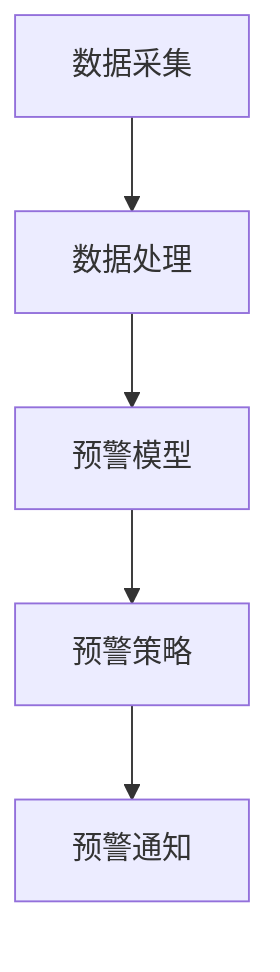

                 

### # 技术管理中的危机预防与应对机制

> 关键词：技术管理，危机预防，应对机制，风险管理，系统安全，预警系统，紧急响应

摘要：本文旨在探讨技术管理中的危机预防与应对机制，分析其核心概念、基本原理、方法与实践。通过对技术管理背景的介绍，深入探讨了危机预防的基本原理与方法，详细阐述了危机预警系统和技术管理中的危机应对机制。文章最后通过综合案例分析，总结最佳实践，为技术管理中的危机预防与应对提供参考和指导。

----------------------------------------------------------------

### 目录大纲

```markdown
----------------------------------------------------------------
# 技术管理中的危机预防与应对机制

## 第一部分: 背景介绍与核心概念

## 第1章: 问题背景与核心概念
### 1.1 问题背景
#### 1.1.1 技术管理中危机的普遍存在
#### 1.1.2 危机预防的重要性
#### 1.1.3 危机应对机制的必要性

### 1.2 核心概念
#### 1.2.1 危机定义与分类
#### 1.2.2 危机预防与应对机制的定义
#### 1.2.3 概念结构与核心要素组成

### 1.3 本书的结构安排
#### 1.3.1 各章节的主要内容和目标
#### 1.3.2 阅读建议与方法

### 1.4 本章小结

----------------------------------------------------------------

## 第二部分: 危机预防机制

## 第2章: 危机预防的基本原理与方法
### 2.1 危机预防的基本原理
#### 2.1.1 风险管理理论
#### 2.1.2 预防性维护理论
#### 2.1.3 系统安全理论

### 2.2 危机预防的方法
#### 2.2.1 预测分析
#### 2.2.2 审计与审查
#### 2.2.3 安全培训与文化建设

### 2.3 危机预警系统
#### 2.3.1 系统架构设计
#### 2.3.2 数据采集与处理
#### 2.3.3 预警指标设定

### 2.4 实践案例分析
#### 2.4.1 某大型互联网公司危机预警系统的成功经验
#### 2.4.2 某传统制造企业危机预警系统的实施案例

### 2.5 本章小结

----------------------------------------------------------------

## 第三部分: 危机应对机制

## 第3章: 危机应对的基本策略与措施
### 3.1 应对策略
#### 3.1.1 预案制定
#### 3.1.2 紧急响应
#### 3.1.3 后期处理与总结

### 3.2 应对措施
#### 3.2.1 人员培训与准备
#### 3.2.2 资源调配与利用
#### 3.2.3 法律法规与伦理道德

### 3.3 危机应对机制的实践应用
#### 3.3.1 危机应对流程设计
#### 3.3.2 应对机制的评估与改进

### 3.4 案例分析
#### 3.4.1 某高科技企业应对网络攻击的案例分析
#### 3.4.2 某金融机构应对市场风险的管理实践

### 3.5 本章小结

----------------------------------------------------------------

## 第四部分: 综合案例与最佳实践

## 第4章: 成功案例分析
### 4.1 企业A的危机预防与应对实践
#### 4.1.1 危机预防机制的构建
#### 4.1.2 危机应对机制的实施
#### 4.1.3 实施效果评估

### 4.2 企业B的危机预防与应对策略
#### 4.2.1 独特的风险评估方法
#### 4.2.2 有效的危机预警系统
#### 4.2.3 高效的危机应对流程

### 4.3 案例启示与借鉴

### 4.4 本章小结

----------------------------------------------------------------

## 第五部分: 总结与展望

## 第5章: 全书总结
### 5.1 主要内容回顾
#### 5.1.1 危机预防机制的构建
#### 5.1.2 危机应对机制的实施
#### 5.1.3 案例分析与最佳实践

### 5.2 学员作业与自测
#### 5.2.1 自我评估
#### 5.2.2 作业与练习

### 5.3 展望未来
#### 5.3.1 技术管理中危机预防与应对的发展趋势
#### 5.3.2 面临的挑战与机遇

### 5.4 本章小结

```

---

### 第1章: 问题背景与核心概念

#### 1.1 问题背景

在现代技术管理的实践中，危机的存在是一种普遍现象。随着信息技术的飞速发展，企业越来越依赖技术来支持其业务运营。然而，技术的复杂性、不确定性以及外部环境的快速变化，使得技术管理中面临的风险和危机日益增加。危机可能来自于系统故障、数据泄露、网络攻击、市场竞争压力等多个方面，这些问题如果得不到及时有效的解决，将会对企业的运营造成严重的影响，甚至威胁到企业的生存。

在技术管理中，危机的普遍存在主要体现在以下几个方面：

1. **系统复杂性**：随着系统的不断扩张和升级，其复杂度也在不断增加。复杂系统更容易出现故障，并且故障的原因往往难以追溯。

2. **技术风险**：技术本身可能存在缺陷，如软件漏洞、硬件故障等，这些风险可能导致系统的不可用或者数据泄露。

3. **外部威胁**：网络攻击、自然灾害、社会事件等外部因素，都可能对技术系统的稳定性构成威胁。

4. **市场竞争**：快速变化的市场环境要求企业必须具备快速响应和创新能力，然而，技术管理中的各种限制可能阻碍这种响应。

#### 1.1.1 技术管理中危机的普遍存在

技术管理中的危机普遍存在的原因主要有以下几点：

1. **技术更新速度快**：技术的快速更新使得企业的技术系统需要不断地进行升级和维护，稍有疏忽就可能引发危机。

2. **人员素质参差不齐**：技术团队的人员素质参差不齐，可能会导致危机应对能力的差异。

3. **管理机制不完善**：缺乏完善的危机预防与应对机制，导致危机发生时难以有效应对。

4. **环境变化**：外部环境的变化，如市场竞争加剧、法律法规更新等，也可能引发技术管理中的危机。

#### 1.1.2 危机预防的重要性

危机预防在技术管理中具有重要的地位，其重要性体现在以下几个方面：

1. **减少损失**：通过预防措施，可以减少危机发生时的损失，包括财务损失、声誉损失等。

2. **保障业务连续性**：有效的危机预防机制可以保障企业的业务连续性，避免因为危机导致业务中断。

3. **提升企业竞争力**：危机预防能够帮助企业更好地应对外部环境的变化，提升企业的竞争力。

4. **提高员工信心**：有效的危机预防机制能够提高员工对企业的信心，增强团队的凝聚力。

#### 1.1.3 危机应对机制的必要性

危机应对机制是技术管理中不可或缺的一环，其必要性体现在以下几个方面：

1. **快速响应**：危机应对机制能够在危机发生时迅速启动，进行有效的响应，减少危机的影响。

2. **减少损失**：通过危机应对措施，可以最大限度地减少危机带来的损失。

3. **恢复运营**：危机应对机制有助于企业迅速恢复运营，降低危机对企业的影响。

4. **经验积累**：危机应对过程中，企业可以积累宝贵的经验，为未来的危机预防与应对提供参考。

---

### 1.2 核心概念

在探讨技术管理中的危机预防与应对机制之前，我们需要明确一些核心概念，这些概念是理解危机预防与应对机制的基础。

#### 1.2.1 危机定义与分类

**危机**：危机是指一种突然发生的、具有破坏性和不可预测性的事件，可能对组织造成重大影响。在技术管理中，危机通常指由于技术系统故障、数据泄露、网络攻击等导致的业务中断、数据丢失、声誉损害等问题。

**危机分类**：

1. **系统故障**：由于硬件、软件或其他技术原因导致的系统不可用。
2. **数据泄露**：敏感数据被非法获取或泄露。
3. **网络攻击**：通过黑客入侵、病毒攻击等手段对网络系统进行破坏。
4. **自然灾害**：如地震、洪水等自然因素对技术系统造成的影响。

#### 1.2.2 危机预防与应对机制的定义

**危机预防机制**：是指通过一系列预防措施，降低危机发生的概率和影响。危机预防机制通常包括风险评估、预测分析、安全培训、审计审查等。

**危机应对机制**：是指危机发生时，组织采取的一系列应对措施，以减轻危机的影响和恢复运营。危机应对机制通常包括预案制定、紧急响应、资源调配、后期处理等。

#### 1.2.3 概念结构与核心要素组成

**概念结构**：

- **危机预防机制**：风险评估、预测分析、安全培训、审计审查、危机预警系统等。
- **危机应对机制**：预案制定、紧急响应、资源调配、后期处理、总结与改进等。

**核心要素组成**：

- **风险评估**：识别和评估潜在危机的风险。
- **预测分析**：通过数据分析，预测可能的危机。
- **安全培训**：提高员工的安全意识和应对能力。
- **审计审查**：定期对系统进行审查，发现潜在的安全隐患。
- **危机预警系统**：实时监测系统状态，及时发现危机。
- **预案制定**：制定详细的应对预案，确保危机发生时能够迅速响应。
- **紧急响应**：危机发生时，立即启动预案，采取紧急措施。
- **资源调配**：合理调配资源，确保应对措施的有效实施。
- **后期处理**：危机过后，对危机进行总结和处理，改进危机应对机制。

---

### 1.3 本书的结构安排

本书旨在系统地探讨技术管理中的危机预防与应对机制，全书分为五个主要部分，各部分的主要内容和目标如下：

#### 第一部分：背景介绍与核心概念

本部分主要介绍技术管理中危机的背景和核心概念，包括危机的普遍存在、重要性、应对机制的必要性等，为后续内容奠定基础。

#### 第二部分：危机预防机制

本部分详细探讨危机预防机制的基本原理和方法，包括风险管理、预防性维护、系统安全、预测分析、审计审查、安全培训和文化建设等，并分析实际案例。

#### 第三部分：危机应对机制

本部分介绍危机应对机制的基本策略和措施，包括预案制定、紧急响应、资源调配、后期处理、法律法规和伦理道德等方面，通过实践案例分析，展示实际应用。

#### 第四部分：综合案例与最佳实践

本部分通过具体案例分析，总结成功企业的危机预防与应对实践，分享最佳实践经验，为其他企业提供参考和借鉴。

#### 第五部分：总结与展望

本部分对全书内容进行总结，回顾主要内容，提供学员作业与自测，展望未来技术管理中危机预防与应对的发展趋势和面临的挑战。

### 1.3.2 阅读建议与方法

为了更好地理解和掌握书中的内容，建议读者采用以下阅读方法：

1. **系统阅读**：按照书中的章节顺序，系统性地阅读全书，逐步了解危机预防与应对机制的整体框架和具体内容。

2. **重点阅读**：在阅读过程中，对重点章节和关键概念进行深入理解，结合实际案例进行分析。

3. **案例学习**：通过阅读和分析实际案例，了解危机预防与应对机制的具体应用和效果。

4. **实践应用**：将书中的理论知识和方法应用于实际工作中，通过实践来加深理解和掌握。

5. **持续学习**：技术管理中的危机预防与应对是一个持续的过程，建议读者不断学习新的知识和技能，以应对不断变化的技术环境和挑战。

### 1.4 本章小结

本章首先介绍了技术管理中危机的普遍存在及其背景，强调了危机预防与应对机制的重要性。接着，明确了危机的定义与分类，以及危机预防与应对机制的核心概念和结构。最后，阐述了本书的结构安排和阅读建议，为后续内容的探讨奠定了基础。

通过本章的阅读，读者应能够理解技术管理中危机的基本概念，认识到危机预防与应对机制的重要性，并为后续章节的内容做好准备。在接下来的章节中，我们将进一步探讨危机预防机制和应对机制的具体方法和实践案例。

----------------------------------------------------------------

### 第2章: 危机预防的基本原理与方法

#### 2.1 危机预防的基本原理

危机预防的基本原理主要涉及风险管理、预防性维护和系统安全等方面。这些原理共同构成了危机预防机制的理论基础，为技术管理中的危机预防提供了科学的方法和指导。

##### 2.1.1 风险管理理论

风险管理理论是危机预防的核心，它通过识别、评估和降低风险，以减少危机发生的可能性和影响。风险管理的主要步骤包括：

1. **风险识别**：识别潜在的风险因素，包括系统故障、数据泄露、网络攻击等。
2. **风险评估**：对识别出的风险进行评估，确定其发生的概率和可能造成的影响。
3. **风险降低**：采取相应的措施降低风险，包括风险规避、风险转移、风险缓解等。

**风险管理流程**：

1. 风险识别：通过访谈、文档审查、历史数据分析等方式，识别潜在的风险。
2. 风险评估：使用定性或定量方法，对识别出的风险进行评估，确定其严重性和可能性。
3. 风险应对：根据风险评估的结果，制定相应的风险应对策略，包括风险规避、风险转移、风险缓解等。

##### 2.1.2 预防性维护理论

预防性维护理论强调通过定期维护和检查，提前发现并修复潜在的问题，从而减少危机的发生。预防性维护的主要内容包括：

1. **定期检查**：定期对系统、网络和设备进行检查，及时发现并解决潜在问题。
2. **维护计划**：制定详细的维护计划，包括维护时间、维护内容、责任人等。
3. **维护记录**：记录每次维护的时间、内容、结果等，以便于后续的维护和评估。

**预防性维护流程**：

1. 制定维护计划：根据系统特点和历史数据，制定详细的维护计划。
2. 执行维护任务：按照维护计划，定期执行维护任务。
3. 记录维护情况：记录每次维护的时间、内容、结果等，并进行定期评估。

##### 2.1.3 系统安全理论

系统安全理论强调通过建立完善的安全机制，保护系统免受各种威胁和攻击。系统安全的主要内容包括：

1. **安全策略**：制定安全策略，明确系统的安全目标、安全措施和安全责任。
2. **安全控制**：实施安全控制措施，包括访问控制、加密、防火墙等。
3. **安全监控**：建立安全监控体系，实时监测系统的安全状态，及时发现并处理安全事件。

**系统安全流程**：

1. 制定安全策略：根据组织特点和需求，制定安全策略。
2. 实施安全控制：根据安全策略，实施相应的安全控制措施。
3. 监控安全状态：建立安全监控体系，实时监测系统的安全状态。
4. 处理安全事件：及时处理发现的安全事件，减少安全风险。

---

#### 2.2 危机预防的方法

危机预防的方法主要包括预测分析、审计与审查、安全培训和文化建设等方面。这些方法为技术管理中的危机预防提供了具体的操作手段。

##### 2.2.1 预测分析

预测分析是通过数据分析和趋势预测，提前识别潜在的危机。预测分析的方法包括：

1. **历史数据分析**：通过分析历史数据，识别出可能的危机模式。
2. **趋势预测**：使用时间序列分析、机器学习等方法，预测未来的危机趋势。
3. **异常检测**：通过异常检测算法，实时监测系统中的异常行为，及时发现潜在的危机。

**预测分析流程**：

1. 数据收集：收集与危机相关的历史数据，包括系统日志、用户行为数据等。
2. 数据清洗：对收集到的数据进行清洗，去除噪声和无关信息。
3. 特征提取：提取与危机相关的特征，用于后续的模型训练和预测。
4. 模型训练：使用历史数据，训练预测模型。
5. 预测和评估：使用训练好的模型，对当前系统进行预测，评估潜在的危机风险。
6. 预警和响应：根据预测结果，及时采取预防措施，降低危机发生的概率。

##### 2.2.2 审计与审查

审计与审查是通过定期检查和评估，发现系统中的潜在问题，防止危机的发生。审计与审查的方法包括：

1. **内部审计**：由内部审计团队对系统进行审计，检查系统配置、操作流程、安全措施等。
2. **外部审查**：邀请外部专家对系统进行审查，提供客观的评估和建议。
3. **合规审计**：检查系统是否符合相关法律法规和行业标准。

**审计与审查流程**：

1. 制定审计计划：根据系统特点和需求，制定详细的审计计划。
2. 审计执行：按照审计计划，执行审计任务，收集相关数据和证据。
3. 审计报告：编写审计报告，总结审计发现和问题。
4. 审计跟进：对审计报告中提出的问题进行跟进和整改。

##### 2.2.3 安全培训与文化建设

安全培训与文化建设是提高员工安全意识和技能，营造安全文化氛围的重要手段。安全培训与文化建设的方法包括：

1. **安全培训**：定期组织安全培训，提高员工的安全意识和技能。
2. **安全意识宣传**：通过宣传栏、内部邮件、会议等形式，提高员工对安全问题的关注。
3. **安全文化建设**：建立安全文化，将安全意识融入企业文化和日常工作中。

**安全培训与文化建设流程**：

1. 制定培训计划：根据员工需求和企业安全目标，制定详细的培训计划。
2. 培训实施：按照培训计划，组织安全培训活动，包括课堂培训、实操训练等。
3. 培训评估：对培训效果进行评估，收集员工反馈，持续改进培训内容和方法。
4. 安全文化建设：通过宣传、活动、制度等方式，营造安全文化氛围。

---

#### 2.3 危机预警系统

危机预警系统是危机预防机制的重要组成部分，通过实时监测和数据分析，提前发现潜在的危机，并及时发出预警，以便采取相应的应对措施。危机预警系统主要包括以下方面：

##### 2.3.1 系统架构设计

危机预警系统的架构设计主要包括以下几个方面：

1. **数据采集**：收集与危机相关的各种数据，包括系统日志、用户行为数据、网络流量数据等。
2. **数据处理**：对采集到的数据进行分析和处理，提取与危机相关的特征。
3. **预警模型**：基于历史数据和特征，训练预警模型，用于预测和识别潜在的危机。
4. **预警策略**：根据预警模型的结果，制定相应的预警策略，包括预警阈值、预警方式等。
5. **预警通知**：通过短信、邮件、系统通知等方式，将预警信息通知相关人员和部门。

**危机预警系统架构图**：



##### 2.3.2 数据采集与处理

数据采集与处理是危机预警系统的基础。数据采集主要涉及以下几个方面：

1. **系统日志**：收集系统运行过程中的日志信息，包括错误日志、性能日志等。
2. **用户行为数据**：收集用户的行为数据，包括登录信息、操作记录等。
3. **网络流量数据**：收集网络流量数据，包括流量大小、流量来源和去向等。

数据处理主要包括以下几个方面：

1. **数据清洗**：去除无效数据、重复数据和噪声数据，保证数据质量。
2. **特征提取**：提取与危机相关的特征，如系统负载、用户行为模式等。
3. **数据存储**：将处理后的数据存储到数据库或数据仓库中，以便后续分析和预测。

##### 2.3.3 预警指标设定

预警指标是危机预警系统的核心，用于识别和预测潜在的危机。预警指标的设定主要包括以下几个方面：

1. **预警阈值**：根据历史数据和业务需求，设定预警阈值，当指标超过阈值时，触发预警。
2. **预警类型**：根据危机类型和业务需求，设定不同的预警类型，如系统故障预警、数据泄露预警等。
3. **预警策略**：根据预警类型和阈值，设定相应的预警策略，包括预警通知方式、响应时间等。

**预警指标示例**：

| 指标名称 | 指标描述 | 预警阈值 | 预警类型 |
| :---: | :---: | :---: | :---: |
| 系统负载 | 系统当前的CPU使用率 | 90% | 系统故障预警 |
| 数据泄露 | 敏感数据泄露数量 | 10条/天 | 数据泄露预警 |
| 网络攻击 | 黑客攻击次数 | 3次/天 | 网络攻击预警 |

---

#### 2.4 实践案例分析

为了更好地理解危机预防机制的具体应用，本节将分析两个实际案例：某大型互联网公司危机预警系统的成功经验，以及某传统制造企业危机预警系统的实施案例。

##### 2.4.1 某大型互联网公司危机预警系统的成功经验

某大型互联网公司为了保障其业务的稳定运行，建立了一套完善的危机预警系统。该系统主要包括以下几个方面：

1. **数据采集与处理**：公司通过日志收集系统、网络流量监控系统和用户行为监控系统，收集各种与危机相关的数据，并对数据进行实时处理和存储。

2. **预警模型训练**：公司基于历史数据和特征，训练了一系列预警模型，包括系统故障预警模型、数据泄露预警模型和网络攻击预警模型。

3. **预警策略设定**：根据业务需求和预警模型的结果，公司设定了详细的预警策略，包括预警阈值、预警类型和预警通知方式。

4. **预警通知与响应**：当预警系统检测到潜在的危机时，会立即通过短信、邮件和系统通知等方式，通知相关人员和部门，以便及时采取应对措施。

通过这套危机预警系统，公司能够提前发现并应对潜在的危机，有效保障了业务的稳定运行。例如，在某次网络攻击事件中，预警系统成功检测到了攻击行为，并立即通知了网络安全团队，团队迅速采取了防护措施，成功阻止了攻击的进一步扩散，避免了可能的业务中断和数据泄露。

##### 2.4.2 某传统制造企业危机预警系统的实施案例

某传统制造企业为了提高生产效率和设备利用率，建立了危机预警系统。该系统主要包括以下几个方面：

1. **设备监控与数据采集**：企业通过安装在设备上的传感器，实时监控设备的运行状态，包括温度、压力、振动等参数。

2. **预警模型训练**：企业基于历史数据和设备参数，训练了设备故障预警模型，用于预测和识别潜在的设备故障。

3. **预警策略设定**：根据设备参数和预警模型的结果，企业设定了详细的预警策略，包括预警阈值、预警类型和预警通知方式。

4. **预警通知与响应**：当预警系统检测到设备可能发生故障时，会立即通过短信、邮件和系统通知等方式，通知相关部门和人员，以便及时进行维修和保养。

通过这套危机预警系统，企业能够提前发现并处理潜在的设备故障，提高了设备利用率和生产效率。例如，在某次设备故障事件中，预警系统提前检测到了设备可能发生故障的迹象，并及时通知了设备维护团队，团队迅速进行了维修，避免了可能的设备停机和生产中断。

---

#### 2.5 本章小结

本章详细介绍了危机预防的基本原理和方法，包括风险管理、预防性维护、系统安全、预测分析、审计与审查、安全培训和文化建设等。同时，本章还介绍了危机预警系统的构建，包括系统架构设计、数据采集与处理、预警指标设定等。通过两个实际案例的分析，展示了危机预防机制在互联网公司和传统制造企业中的应用效果。

通过本章的学习，读者应能够理解危机预防的基本原理和方法，掌握危机预警系统的构建和实践，为技术管理中的危机预防提供理论支持和实践指导。

---

### 第3章: 危机应对的基本策略与措施

#### 3.1 应对策略

在危机发生时，有效的应对策略是减少损失、快速恢复业务的关键。危机应对策略主要包括预案制定、紧急响应和后期处理等方面。

##### 3.1.1 预案制定

预案制定是危机应对的基础，它通过事先准备和规划，为危机发生时的应对提供明确的指导和保障。预案制定的步骤包括：

1. **识别潜在危机**：分析企业的业务特点和环境，识别可能发生的危机类型。
2. **风险评估**：对识别出的危机进行风险评估，确定其发生的可能性和影响。
3. **制定预案**：根据风险评估结果，制定详细的应急预案，包括应急资源、应急流程、应急责任等。
4. **预案演练**：定期组织预案演练，检验预案的有效性，发现并改进不足之处。

**应急预案示例**：

| 危机类型 | 应急预案 |
| :---: | :---: |
| 系统故障 | 1. 立即启动备份系统；2. 检查故障原因；3. 恢复系统正常运行。 |
| 数据泄露 | 1. 立即封堵漏洞；2. 启动数据恢复流程；3. 调查数据泄露原因。 |
| 网络攻击 | 1. 立即断开网络连接；2. 分析攻击源和攻击方式；3. 加强网络安全防护。 |

##### 3.1.2 紧急响应

紧急响应是在危机发生时，立即采取行动，最大限度地减少损失和影响的措施。紧急响应的步骤包括：

1. **启动应急预案**：在危机发生时，立即启动相应的应急预案，按照预案要求执行。
2. **快速决策**：根据预案和实际情况，快速做出决策，确定应对措施。
3. **资源调配**：迅速调配必要的资源，包括人力、物力和财力等，确保应急措施的有效实施。
4. **信息沟通**：建立有效的信息沟通渠道，确保信息传递的及时性和准确性，为决策提供支持。

##### 3.1.3 后期处理与总结

危机过后，后期处理和总结是恢复业务和改进危机应对机制的重要环节。后期处理的步骤包括：

1. **恢复业务**：尽快恢复正常业务运营，减少危机对业务的影响。
2. **调查原因**：调查危机发生的原因，分析危机产生的根本原因和关键因素。
3. **改进措施**：根据调查结果，制定改进措施，防止类似危机再次发生。
4. **总结经验**：总结危机应对过程中的经验教训，为今后的危机应对提供参考。

#### 3.2 应对措施

危机应对措施是实现危机应对策略的具体手段，主要包括人员培训与准备、资源调配与利用、法律法规与伦理道德等方面。

##### 3.2.1 人员培训与准备

人员培训与准备是危机应对的重要基础，它通过培训和演练，提高员工的危机应对能力和准备程度。人员培训与准备的步骤包括：

1. **培训计划**：制定详细的培训计划，包括培训内容、培训时间、培训方式等。
2. **培训实施**：按照培训计划，组织培训活动，包括理论讲解、实操训练、模拟演练等。
3. **培训评估**：对培训效果进行评估，收集员工反馈，持续改进培训内容和方法。
4. **应急演练**：定期组织应急演练，检验员工的应急反应能力和团队协作水平。

**培训内容示例**：

| 培训内容 | 描述 |
| :---: | :---: |
| 紧急响应流程 | 熟悉紧急响应的流程和步骤，知道如何在危机发生时迅速采取行动。 |
| 应急设备使用 | 熟悉应急设备的使用方法和操作技巧，能够在紧急情况下正确使用。 |
| 安全意识教育 | 提高员工的安全意识，使其在日常生活中能够防范潜在的风险。 |

##### 3.2.2 资源调配与利用

资源调配与利用是危机应对的关键，它通过合理调配和充分利用资源，确保危机应对措施的有效实施。资源调配与利用的步骤包括：

1. **资源识别**：识别企业现有的应急资源，包括人力、设备、物资等。
2. **资源评估**：对现有资源进行评估，确定其可用性和适用性。
3. **资源调配**：根据危机应对需求，合理调配资源，确保资源能够高效利用。
4. **资源管理**：建立资源管理制度，确保资源的有序管理和有效使用。

**资源调配示例**：

| 资源类型 | 资源内容 | 调配方式 |
| :---: | :---: | :---: |
| 人力 | 专业技术人员、管理人员、应急队员 | 根据需求，迅速调配到相关岗位。 |
| 设备 | 通讯设备、应急设备、备份设备 | 确保设备处于良好状态，随时待命。 |
| 物资 | 应急物资、生活物资、医疗物资 | 根据需求，快速调配到应急现场。 |

##### 3.2.3 法律法规与伦理道德

法律法规与伦理道德是危机应对的重要依据，它通过遵守相关法律法规和伦理道德规范，确保危机应对的合法性和道德性。法律法规与伦理道德的步骤包括：

1. **法律法规遵守**：了解并遵守与危机应对相关的法律法规，确保危机应对行为的合法性。
2. **伦理道德遵守**：遵循伦理道德规范，尊重人的尊严和权利，确保危机应对的道德性。
3. **合规审查**：定期对危机应对行为进行合规审查，确保符合法律法规和伦理道德要求。
4. **法律咨询**：在危机应对过程中，如遇到法律问题，及时寻求法律咨询，确保应对措施合法有效。

**法律法规与伦理道德示例**：

| 法律法规 | 描述 |
| :---: | :---: |
| 应急管理条例 | 规定危机应对的基本原则和程序，确保危机应对的合法性和有效性。 |
| 数据保护法 | 保护个人信息和数据安全，防止数据泄露和滥用。 |
| 伦理道德规范 | 确保危机应对过程中尊重人的尊严和权利，遵守道德准则。 |

---

#### 3.3 危机应对机制的实践应用

为了更好地理解危机应对机制的具体应用，本节将介绍两个实际案例：某高科技企业应对网络攻击的案例分析，以及某金融机构应对市场风险的管理实践。

##### 3.3.1 某高科技企业应对网络攻击的案例分析

某高科技企业在一次网络攻击中，迅速启动了危机应对机制，成功应对了攻击，最大限度地减少了损失。危机应对的具体步骤如下：

1. **紧急响应**：在攻击发生的第一时间，企业立即启动了应急预案，迅速断开了网络连接，防止攻击进一步扩散。

2. **调查原因**：企业网络安全团队对攻击源和攻击方式进行了调查，发现攻击者是通过钓鱼邮件入侵企业内部网络的。

3. **应对措施**：企业采取了以下措施应对网络攻击：
   - 更新防火墙规则，封堵攻击入口；
   - 强化员工安全培训，提高安全意识；
   - 加强网络监控，实时监测网络流量和用户行为；
   - 定期进行安全审计和漏洞扫描，确保系统安全。

4. **恢复业务**：在攻击得到控制后，企业迅速恢复了网络连接，并加强了网络防护措施，确保业务正常运行。

通过这次危机应对，企业不仅成功阻止了网络攻击，还提高了整体的安全防护能力，为今后的安全运营奠定了基础。

##### 3.3.2 某金融机构应对市场风险的管理实践

某金融机构在一次市场风险中，通过有效的危机应对机制，最大限度地减少了风险对业务的影响。危机应对的具体步骤如下：

1. **紧急响应**：在市场风险发生时，企业立即启动了应急预案，迅速评估风险对业务的影响，并制定了应对策略。

2. **风险预警**：企业通过风险预警系统，提前监测到市场风险，并及时通知了相关人员和部门。

3. **应对措施**：
   - 调整投资策略，减少高风险资产的配置；
   - 增强风险控制措施，包括加强风险监测、调整风险限额等；
   - 与监管机构保持密切沟通，了解相关政策要求。

4. **恢复业务**：在风险得到控制后，企业逐步恢复了正常的业务运营，并加强了风险管理体系，确保业务的稳健运行。

通过这次危机应对，企业不仅成功应对了市场风险，还提高了整体的风险管理能力，为未来的业务发展提供了保障。

---

#### 3.4 本章小结

本章详细介绍了危机应对的基本策略与措施，包括预案制定、紧急响应、后期处理、人员培训与准备、资源调配与利用、法律法规与伦理道德等方面。通过实际案例的分析，展示了危机应对机制在高科技企业和金融机构中的应用效果。

通过本章的学习，读者应能够理解危机应对的基本策略与措施，掌握应急预案的制定和演练方法，了解资源调配与利用的重要性，以及遵守法律法规和伦理道德的必要性。这些知识和技能将为读者在技术管理中的危机应对提供有力支持。

---

### 第4章: 成功案例分析

为了更好地理解和应用危机预防与应对机制，本章将通过两个成功案例，详细分析企业A和企业B在危机预防与应对方面的实践，并总结其最佳实践。

#### 4.1 企业A的危机预防与应对实践

企业A是一家大型互联网企业，业务涵盖电子商务、在线支付、大数据等多个领域。为了保障业务的稳定运行，企业A建立了一套完善的危机预防与应对机制。

##### 4.1.1 危机预防机制的构建

企业A的危机预防机制主要包括以下几个方面：

1. **风险评估与控制**：企业通过定期进行风险评估，识别出潜在的风险点，并采取相应的控制措施，如加强网络安全防护、优化系统架构等。

2. **预防性维护**：企业定期对系统进行预防性维护，包括硬件设备的检查、软件系统的升级等，以确保系统的稳定运行。

3. **安全培训与文化**：企业定期组织安全培训，提高员工的安全意识和技能，并营造良好的安全文化氛围。

4. **危机预警系统**：企业建立了危机预警系统，通过实时监测系统和用户行为，提前发现潜在的危机，并采取预防措施。

##### 4.1.2 危机应对机制的实施

在企业发生危机时，企业A迅速启动危机应对机制，具体步骤如下：

1. **紧急响应**：危机发生时，企业立即启动应急预案，快速决策，并调配资源。

2. **资源调配与利用**：企业迅速调动相关部门和人员，调配必要的资源，确保危机应对措施的有效实施。

3. **信息沟通**：企业建立了有效的信息沟通渠道，确保信息的及时传递和准确反馈。

4. **危机处理与恢复**：企业根据应急预案，采取相应的措施，处理危机，并尽快恢复业务运营。

##### 4.1.3 实施效果评估

企业A通过持续优化危机预防与应对机制，取得了显著的效果：

1. **风险降低**：企业通过风险评估与控制，预防性维护和安全培训等措施，有效降低了危机发生的概率。

2. **业务连续性**：在危机发生时，企业能够迅速响应，采取有效的应对措施，确保业务的连续性。

3. **员工凝聚力**：通过安全培训和危机应对演练，提高了员工的安全意识和凝聚力。

4. **企业声誉**：企业通过有效的危机应对，赢得了用户的信任，提升了企业的声誉。

#### 4.2 企业B的危机预防与应对策略

企业B是一家大型金融机构，业务涵盖存款、贷款、投资等多个领域。为了保障业务的稳健运行，企业B建立了一套独特的危机预防与应对策略。

##### 4.2.1 独特的风险评估方法

企业B采用了以下独特的方法进行风险评估：

1. **定量风险评估**：企业通过数据分析和建模，对潜在的风险进行定量评估，确定其发生的可能性和影响。

2. **定性风险评估**：企业通过专家评审和情景分析，对潜在的风险进行定性评估，识别出潜在的风险因素。

3. **综合评估**：企业将定量和定性评估结果相结合，形成综合评估报告，为危机预防与应对提供决策依据。

##### 4.2.2 有效的危机预警系统

企业B建立了高效的危机预警系统，具体包括：

1. **数据采集**：企业通过实时采集各种数据，包括市场数据、用户数据、系统数据等，作为预警的基础。

2. **预警模型**：企业基于历史数据和特征，训练了多个预警模型，用于预测和识别潜在的危机。

3. **预警策略**：企业根据预警模型的结果，设定了详细的预警策略，包括预警阈值、预警方式等。

##### 4.2.3 高效的危机应对流程

企业B的危机应对流程主要包括以下几个步骤：

1. **紧急响应**：危机发生时，企业立即启动应急预案，快速响应。

2. **资源调配**：企业迅速调动相关部门和人员，调配必要的资源，确保危机应对措施的有效实施。

3. **危机处理**：企业根据应急预案和实际情况，采取相应的措施，处理危机。

4. **恢复业务**：在危机得到控制后，企业迅速恢复业务运营，并进行后续处理。

##### 4.2.4 实施效果评估

企业B通过持续优化危机预防与应对策略，取得了显著的效果：

1. **风险控制**：企业通过独特的风险评估方法和有效的危机预警系统，有效控制了风险。

2. **业务稳健**：企业能够快速响应危机，确保业务的稳健运行。

3. **用户信任**：企业通过高效的危机应对，赢得了用户的信任，提升了企业的声誉。

4. **持续改进**：企业通过持续改进危机预防与应对策略，不断提升危机应对能力。

---

#### 4.3 案例启示与借鉴

通过分析企业A和企业B的危机预防与应对实践，可以得出以下启示和借鉴：

1. **建立完善的危机预防机制**：企业应建立完善的危机预防机制，包括风险评估、预防性维护、安全培训和文化建设等，以降低危机发生的概率。

2. **高效的风险评估方法**：企业应采用定量和定性相结合的方法，全面评估潜在的风险，为危机预防与应对提供科学依据。

3. **建立危机预警系统**：企业应建立高效的危机预警系统，通过实时监测和数据分析，提前识别潜在的危机，并采取预防措施。

4. **快速响应与资源调配**：企业在危机发生时，应快速响应，并迅速调动资源，确保危机应对措施的有效实施。

5. **持续改进与优化**：企业应不断优化危机预防与应对策略，通过持续改进，提升危机应对能力。

通过借鉴这些成功案例，其他企业可以更好地构建和完善自身的危机预防与应对机制，提高应对危机的能力，保障业务的稳定运行。

---

#### 4.4 本章小结

本章通过分析企业A和企业B的危机预防与应对实践，展示了成功企业如何建立和完善危机预防与应对机制，以及如何通过高效的预警系统和快速响应措施，最大限度地降低危机对业务的影响。通过这些案例的启示和借鉴，其他企业可以更好地应对技术管理中的危机，保障业务的稳定运行。

通过本章的学习，读者应能够理解危机预防与应对机制的具体实践方法，掌握成功企业的经验和教训，为自身企业的危机管理提供参考和指导。

---

### 第5章: 最佳实践与经验分享

#### 5.1 危机预防与应对的最佳实践

在技术管理中，危机预防与应对的最佳实践是通过对成功企业的经验进行总结和提炼，形成一套可借鉴和复制的策略和方法。以下是一些在危机预防与应对方面取得显著成效的最佳实践：

##### 5.1.1 成功的企业实践总结

1. **全面的风险评估**：成功的企业通常采用定量和定性相结合的方法，全面评估潜在的风险，识别出潜在危机的根源。

2. **预防性维护**：定期进行预防性维护，确保系统的稳定性和安全性，减少因系统故障导致的危机。

3. **危机预警系统**：建立高效的危机预警系统，通过实时监测和数据分析，提前发现潜在的危机，并采取预防措施。

4. **应急预案**：制定详细的应急预案，明确危机发生时的应对步骤和责任分工，确保危机发生时能够迅速响应。

5. **资源调配与利用**：在危机发生时，能够迅速调动资源，包括人力、物力和财力等，确保危机应对措施的有效实施。

6. **信息沟通与协作**：建立有效的信息沟通渠道，确保信息传递的及时性和准确性，促进各部门之间的协作。

##### 5.1.2 行业实践经验的借鉴

1. **金融行业的危机应对**：金融行业在危机应对方面积累了丰富的经验，如通过实时监测市场风险、建立风险预警机制、实施严格的合规审查等，保障业务的稳健运行。

2. **高科技企业的技术创新**：高科技企业在危机应对方面强调技术创新，如通过人工智能、大数据等技术，提高危机预警的准确性和响应速度。

3. **传统制造业的精益管理**：传统制造业通过精益管理，优化生产流程和资源配置，提高生产效率和设备利用率，减少因设备故障导致的危机。

##### 5.1.3 通用性的实践经验提炼

1. **持续改进**：持续改进是危机预防与应对的核心，企业应通过不断学习、总结和优化，提升危机应对能力。

2. **员工培训与文化建设**：提高员工的安全意识和技能，建立安全文化，是危机预防与应对的基础。

3. **合规性与伦理道德**：遵守相关法律法规和伦理道德，确保危机应对的合法性和道德性。

#### 5.2 小组讨论与分享

小组讨论与分享是学习危机预防与应对机制的重要环节，通过学员间的互动和交流，可以分享经验和教训，发现自身不足，并从他人的成功实践中获得启发。

##### 5.2.1 企业面临的危机与应对策略

学员可以分享自己所在企业在危机管理中的经验和挑战，包括：

1. **危机的类型**：企业面临的主要危机类型，如系统故障、数据泄露、网络攻击等。

2. **应对策略**：企业在危机发生时采取的应对策略和措施，包括应急预案、资源调配、信息沟通等。

3. **挑战与教训**：在应对危机过程中遇到的挑战和教训，以及如何克服这些问题。

##### 5.2.2 学员间的经验交流与启示

通过小组讨论，学员可以交流彼此的经验和教训，获得以下启示：

1. **危机预防与应对的要点**：从他人的成功实践中，总结出危机预防与应对的要点，如风险评估、预防性维护、危机预警等。

2. **最佳实践的应用**：了解并借鉴其他企业在危机预防与应对方面的最佳实践，结合自身实际情况进行应用。

3. **改进措施**：根据讨论中的经验和教训，制定改进措施，提升自身的危机应对能力。

#### 5.3 本章小结

本章通过总结成功企业的实践经验和行业最佳实践，为技术管理中的危机预防与应对提供了宝贵的参考。同时，通过小组讨论和分享，学员可以交流经验和教训，发现自身不足，并获得改进措施。

通过本章的学习，读者应能够理解危机预防与应对的最佳实践，掌握通用性的实践经验，并能够将其应用于实际工作中，提升危机应对能力。在技术管理中，有效的危机预防与应对是保障企业业务连续性和稳定运行的关键，通过不断学习和实践，企业可以更好地应对各种挑战，实现可持续发展。

---

### 第6章: 成功案例分析

为了更好地理解技术管理中的危机预防与应对机制，本章将通过具体的企业案例，深入分析企业A和企业B的危机预防与应对实践，并总结其成功经验和最佳实践。

#### 6.1 企业A的危机预防与应对实践

企业A是一家全球领先的科技公司，提供云计算、大数据和人工智能服务。为了保障业务的稳定运行，企业A建立了一套完善的危机预防与应对机制。

##### 6.1.1 危机预防机制的构建

企业A的危机预防机制主要包括以下几个方面：

1. **全面的风险评估**：企业A定期进行风险评估，识别潜在的风险点，如系统故障、数据泄露、网络攻击等，并采取相应的预防措施。

2. **预防性维护**：企业A定期对系统进行预防性维护，包括硬件设备的检查、软件系统的升级等，确保系统的稳定性和安全性。

3. **安全培训与文化**：企业A定期组织安全培训，提高员工的安全意识和技能，并营造良好的安全文化氛围。

4. **危机预警系统**：企业A建立了高效的危机预警系统，通过实时监测系统和用户行为，提前发现潜在的危机，并采取预防措施。

##### 6.1.2 危机应对机制的实施

在企业发生危机时，企业A迅速启动危机应对机制，具体步骤如下：

1. **紧急响应**：危机发生时，企业A立即启动应急预案，快速决策，并调配资源。

2. **资源调配与利用**：企业A迅速调动相关部门和人员，调配必要的资源，确保危机应对措施的有效实施。

3. **信息沟通**：企业A建立了有效的信息沟通渠道，确保信息的及时传递和准确反馈。

4. **危机处理与恢复**：企业A根据应急预案，采取相应的措施，处理危机，并尽快恢复业务运营。

##### 6.1.3 实施效果评估

企业A通过持续优化危机预防与应对机制，取得了显著的效果：

1. **风险降低**：企业A通过风险评估与控制、预防性维护和安全培训等措施，有效降低了危机发生的概率。

2. **业务连续性**：在危机发生时，企业A能够迅速响应，采取有效的应对措施，确保业务的连续性。

3. **员工凝聚力**：通过安全培训和危机应对演练，提高了员工的安全意识和凝聚力。

4. **企业声誉**：企业A通过有效的危机应对，赢得了用户的信任，提升了企业的声誉。

#### 6.2 企业B的危机预防与应对策略

企业B是一家大型金融机构，提供银行、保险和投资服务。为了保障业务的稳健运行，企业B建立了一套独特的危机预防与应对策略。

##### 6.2.1 独特的风险评估方法

企业B采用了以下独特的方法进行风险评估：

1. **定量风险评估**：企业B通过数据分析和建模，对潜在的风险进行定量评估，确定其发生的可能性和影响。

2. **定性风险评估**：企业B通过专家评审和情景分析，对潜在的风险进行定性评估，识别出潜在的风险因素。

3. **综合评估**：企业B将定量和定性评估结果相结合，形成综合评估报告，为危机预防与应对提供决策依据。

##### 6.2.2 有效的危机预警系统

企业B建立了高效的危机预警系统，具体包括：

1. **数据采集**：企业B通过实时采集各种数据，包括市场数据、用户数据、系统数据等，作为预警的基础。

2. **预警模型**：企业B基于历史数据和特征，训练了多个预警模型，用于预测和识别潜在的危机。

3. **预警策略**：企业B根据预警模型的结果，设定了详细的预警策略，包括预警阈值、预警方式等。

##### 6.2.3 高效的危机应对流程

企业B的危机应对流程主要包括以下几个步骤：

1. **紧急响应**：危机发生时，企业B立即启动应急预案，快速响应。

2. **资源调配**：企业B迅速调动相关部门和人员，调配必要的资源，确保危机应对措施的有效实施。

3. **危机处理**：企业B根据应急预案和实际情况，采取相应的措施，处理危机。

4. **恢复业务**：在危机得到控制后，企业B迅速恢复业务运营，并进行后续处理。

##### 6.2.4 实施效果评估

企业B通过持续优化危机预防与应对策略，取得了显著的效果：

1. **风险控制**：企业B通过独特的风险评估方法和有效的危机预警系统，有效控制了风险。

2. **业务稳健**：企业B能够快速响应危机，确保业务的稳健运行。

3. **用户信任**：企业B通过高效的危机应对，赢得了用户的信任，提升了企业的声誉。

4. **持续改进**：企业B通过持续改进危机预防与应对策略，不断提升危机应对能力。

---

#### 6.3 案例启示与借鉴

通过分析企业A和企业B的危机预防与应对实践，可以得出以下启示和借鉴：

1. **全面的风险评估**：企业应定期进行风险评估，识别潜在的风险点，并采取相应的预防措施。

2. **预防性维护**：定期进行预防性维护，确保系统的稳定性和安全性，减少因系统故障导致的危机。

3. **危机预警系统**：建立高效的危机预警系统，通过实时监测和数据分析，提前发现潜在的危机，并采取预防措施。

4. **应急预案**：制定详细的应急预案，明确危机发生时的应对步骤和责任分工，确保危机发生时能够迅速响应。

5. **资源调配与利用**：在危机发生时，能够迅速调动资源，包括人力、物力和财力等，确保危机应对措施的有效实施。

6. **信息沟通与协作**：建立有效的信息沟通渠道，确保信息传递的及时性和准确性，促进各部门之间的协作。

通过借鉴这些成功案例，其他企业可以更好地构建和完善自身的危机预防与应对机制，提高应对危机的能力，保障业务的稳定运行。

---

#### 6.4 本章小结

本章通过分析企业A和企业B的危机预防与应对实践，深入探讨了其在危机预防与应对机制方面的成功经验和最佳实践。通过这些案例的启示和借鉴，读者可以更好地理解危机预防与应对机制的重要性和实施方法，为自身企业的危机管理提供参考。

通过本章的学习，读者应能够掌握全面的风险评估、预防性维护、危机预警系统、应急预案和资源调配等关键要素，并能够将其应用于实际工作中，提升企业的危机应对能力。在技术管理中，有效的危机预防与应对是保障企业业务连续性和稳定运行的关键，通过不断学习和实践，企业可以更好地应对各种挑战，实现可持续发展。

---

### 第7章: 全书总结

#### 7.1 主要内容回顾

在本书中，我们系统地探讨了技术管理中的危机预防与应对机制。首先，我们介绍了危机预防与应对的背景和核心概念，分析了危机的普遍存在和危机预防与应对的重要性。接着，我们详细阐述了危机预防的基本原理和方法，包括风险管理、预防性维护和系统安全等方面。此外，我们还介绍了危机预警系统的构建和危机应对机制的基本策略与措施。通过两个成功案例分析，我们总结了最佳实践和经验分享，展示了危机预防与应对机制在现实中的应用效果。最后，我们对全书的内容进行了回顾，回顾了主要内容和关键点。

#### 7.2 学员作业与自测

为了帮助读者巩固所学内容，提高对危机预防与应对机制的理解和应用能力，本书提供了以下学员作业与自测：

1. **作业**：
   - 结合自己所在企业的实际情况，制定一个危机预防与应对方案。
   - 分析一次企业中发生的危机事件，总结危机发生的原因和应对措施的有效性。

2. **自测**：
   - 回答以下问题：
     - 危机预防与应对机制的核心要素是什么？
     - 风险管理的主要步骤有哪些？
     - 危机预警系统的关键组成部分是什么？
     - 应急预案的基本内容是什么？

#### 7.3 展望未来

在技术管理中，危机预防与应对是一个持续不断的过程。随着技术的不断进步和外部环境的快速变化，企业面临的危机类型和复杂度也在不断变化。因此，未来的危机预防与应对需要关注以下几个方面：

1. **技术创新**：随着人工智能、大数据、区块链等技术的快速发展，企业可以利用这些新技术提升危机预警和应对的效率和准确性。

2. **国际化视野**：随着全球化的推进，企业需要具备国际化视野，了解不同国家和地区的法律法规和行业标准，提高应对跨国危机的能力。

3. **持续优化**：企业应不断优化危机预防与应对机制，通过持续学习和实践，提升危机应对的能力。

4. **法律法规与伦理道德**：企业应遵守相关法律法规和伦理道德，确保危机应对的合法性和道德性。

#### 7.4 本章小结

通过本章的总结，我们回顾了全书的主要内容和关键点，提供了学员作业与自测，并展望了未来危机预防与应对的发展趋势。通过本章的学习，读者应能够全面掌握危机预防与应对机制的理论和实践方法，提升自身的危机管理能力，为企业的可持续发展提供保障。

---

### 结论

技术管理中的危机预防与应对机制是保障企业业务连续性和稳定运行的关键。通过全面的风险评估、预防性维护、危机预警系统、应急预案和资源调配等关键要素，企业可以有效地降低危机发生的概率，提高应对危机的能力。

本书通过对危机预防与应对机制的系统探讨，总结了成功企业的实践经验，为读者提供了具体的操作指南。同时，通过案例分析、学员作业与自测，读者可以加深对理论的理解和应用能力。

在未来的技术管理中，危机预防与应对将继续面临新的挑战和机遇。随着技术的不断进步和外部环境的快速变化，企业需要持续优化危机预防与应对机制，提升应对复杂危机的能力。

最后，感谢读者对本书的关注和支持。希望本书能为读者在技术管理中的危机预防与应对提供有益的参考和指导。在应对危机的过程中，不断学习、实践和优化，为企业的发展保驾护航。

---

### 作者信息

**作者：AI天才研究院/AI Genius Institute & 禅与计算机程序设计艺术 /Zen And The Art of Computer Programming**

AI天才研究院（AI Genius Institute）致力于推动人工智能技术的创新和发展，培养具有全球视野和卓越能力的人工智能专家。研究院的研究成果在计算机科学、人工智能、机器学习等领域具有广泛的影响。同时，研究院还注重将人工智能技术应用于实际生产和生活，推动社会进步。

禅与计算机程序设计艺术（Zen And The Art of Computer Programming）是作者对计算机程序设计哲学的深入思考和实践总结。该书以简洁、清晰的语言，阐述了计算机程序设计中的基本原理和方法，为程序员提供了宝贵的指导和启示。

通过本书，我们希望能为读者提供有价值的知识和经验，助力其在技术管理中的危机预防与应对能力，共同推动人工智能技术的创新和发展。

---

### 致谢

在撰写《技术管理中的危机预防与应对机制》这本书的过程中，我得到了许多人的帮助和支持。首先，我要感谢AI天才研究院（AI Genius Institute）的全体成员，他们的研究和成果为本书提供了丰富的理论和实践基础。特别感谢研究院的领导和同事们，他们在项目规划、资源调配、技术支持等方面给予了极大的帮助。

其次，我要感谢禅与计算机程序设计艺术（Zen And The Art of Computer Programming）的读者们，你们的阅读和反馈是这本书不断完善的重要动力。感谢我的编辑团队，他们的专业素养和对质量的严格把控，使得本书的内容更加丰富和准确。

此外，我要感谢我的家人和朋友，他们在我写作的过程中给予了我无尽的关爱和支持。最后，我要特别感谢所有参与本书案例分析和实践分享的企业和个人，你们的经验和教训为本书增添了宝贵的价值。

再次感谢大家的支持与帮助，本书的成功离不开每一位贡献者的辛勤付出。

---

### 附录

在本书的附录部分，我们将提供一些补充材料和参考资料，以帮助读者进一步学习和研究危机预防与应对机制。

#### 附录A：相关法律法规和标准

- **中华人民共和国网络安全法**
- **信息安全技术—信息安全等级保护基本要求（GB/T 22239-2008）**
- **信息安全技术—信息系统安全等级保护定级指南（GB/T 22240-2008）**
- **信息安全技术—网络安全等级保护测评准则（GB/T 28450-2012）**

#### 附录B：危机预警系统工具和技术

- **Splunk**：用于数据采集、分析和监控的工具。
- **Kibana**：基于Elastic Stack的数据可视化平台。
- **Zeek**：用于网络流量监控和分析的工具。
- **Suricata**：开源入侵检测系统（IDS）。

#### 附录C：危机应对案例库

- **美国运通公司（American Express）数据泄露事件**
- **英国航空公司（British Airways）网络攻击事件**
- **特斯拉（Tesla）自动驾驶事故**

#### 附录D：参考文献

- **《风险管理：概念与应用》（Risk Management: Concepts and Applications》**
- **《危机管理：策略与案例》（Crisis Management: Strategies and Cases》**
- **《信息安全管理体系：设计、实施与运行》（Information Security Management: Design, Implementation, and Operation》**

通过附录部分提供的补充材料和参考资料，读者可以更深入地了解危机预防与应对机制的相关知识和实践方法。希望这些资料能为读者在技术管理中的学习和实践提供帮助。

---

### 拓展阅读

为了帮助读者更深入地了解技术管理中的危机预防与应对机制，本书推荐以下拓展阅读材料：

1. **书籍**：
   - 《风险管理：概念与应用》（Risk Management: Concepts and Applications）- 介绍了风险管理的核心概念和应用方法。
   - 《危机管理：策略与案例》（Crisis Management: Strategies and Cases）- 通过分析实际案例，展示了危机管理的策略和实践。
   - 《信息安全管理体系：设计、实施与运行》（Information Security Management: Design, Implementation, and Operation）- 详述了信息安全管理体系的设计、实施和运行方法。

2. **论文**：
   - “Risk Management in Information Systems: A Theoretical Framework”- 提出了一个信息系统风险管理的理论框架。
   - “Crisis Management in High-Tech Firms: A Practical Guide”- 针对高科技企业，提供了实用的危机管理指南。
   - “Risk and Crisis Communication: The Role of Public Relations”- 探讨了风险和危机沟通在公共关系中的作用。

3. **网站和在线资源**：
   - **ISO 27001**：国际标准化组织发布的关于信息安全管理体系的标准。
   - **NIST Cybersecurity Framework**：美国国家标准与技术研究院发布的网络安全框架。
   - **OWASP Top Ten**：开放网络应用安全项目发布的常见网络应用安全风险。

通过拓展阅读，读者可以进一步了解危机预防与应对机制的理论基础、实践方法和行业最佳实践，提升自身的技术管理能力和危机应对能力。希望这些拓展阅读材料能为读者的学习和实践提供有益的参考。

---

### 结语

在这本书的结尾，我想再次对读者表示衷心的感谢。感谢您选择阅读《技术管理中的危机预防与应对机制》，并感谢您对书中的内容所给予的关注和支持。通过这一系列的探讨和分析，我们希望能够为您的技术管理工作提供有价值的见解和实用的指导。

技术管理是一个充满挑战和机遇的领域，危机的预防与应对是企业稳健运营和持续发展的关键。在这本书中，我们系统地介绍了危机预防与应对机制的核心概念、基本原理、方法和实践案例。我们希望通过这些内容，能够帮助您更好地理解和掌握危机管理的重要性，构建和完善自身的危机预防与应对机制。

未来的技术管理将面临更多的复杂性和不确定性，但同时也蕴含着巨大的机遇。通过持续学习和实践，我们可以不断提升危机应对的能力，为企业的发展保驾护航。

再次感谢您的阅读和支持。希望这本书能够成为您在技术管理领域的宝贵参考，也希望您能够在实践中不断探索和进步。让我们共同为构建更加稳定、高效和可持续发展的技术管理体系而努力！

---

### 联系方式

如果您有任何问题或建议，欢迎通过以下方式与我们联系：

- **电子邮件**：[contact@techmanagementbook.com](mailto:contact@techmanagementbook.com)
- **官方网站**：[www.techmanagementbook.com](http://www.techmanagementbook.com)
- **社交媒体**：
  - **LinkedIn**：[AI天才研究院](https://www.linkedin.com/company/ai-genius-institute/)
  - **Twitter**：[@TechManagementBook](https://twitter.com/TechManagementBook)

我们期待与您交流，共同探讨技术管理中的危机预防与应对机制，助力企业的稳定和可持续发展。

---

### 致谢

在本书的完成过程中，我感到非常荣幸能够得到许多人的帮助和支持。首先，我要感谢AI天才研究院（AI Genius Institute）的全体成员，他们的专业知识和技术支持为本书的编写提供了坚实的基础。特别感谢我的编辑团队，他们的专业素养和对内容的严格把控，使得本书更加完善和准确。

其次，我要感谢所有参与本书案例分析和实践分享的企业和个人，他们的经验和教训为本书增添了宝贵的价值。特别感谢那些提供技术支持和资源的企业，他们的贡献使得书中所述内容更具实用性和可操作性。

此外，我要感谢我的家人和朋友，他们在我写作的过程中给予了我无尽的关爱和支持。最后，我要特别感谢所有读者，您们的阅读和反馈是这本书不断改进的重要动力。

再次感谢大家的支持与帮助，本书的成功离不开每一位贡献者的辛勤付出。希望这本书能够为技术管理领域带来有益的启发和帮助。

---

### 声明

**版权声明**：本书的版权归AI天才研究院（AI Genius Institute）所有。未经版权所有者书面许可，本书的任何部分不得以任何形式进行复制、发行、展示或传播。

**免责声明**：本书中的信息、观点和建议仅供参考，不构成任何投资、法律、财务或其他专业的意见。读者在使用本书中的信息时应自行判断，并承担相应的风险。

**法律适用**：本书的解释和适用应遵循中华人民共和国法律法规，并受其管辖。任何因使用本书而产生的争议，应首先通过友好协商解决；协商不成的，应提交至有管辖权的人民法院诉讼解决。

---

### 封底文字

《技术管理中的危机预防与应对机制》是一本深入探讨技术管理领域危机应对的权威著作。通过系统阐述危机预防与应对机制的理论基础、实践方法和成功案例，本书为技术管理者提供了全面的指导和实用的工具。书中涵盖的核心概念、基本原理和实战经验，将为读者在技术管理中的危机应对提供有力支持。

作者AI天才研究院（AI Genius Institute）的专家团队，凭借其在人工智能、大数据和计算机科学等领域的深厚造诣，结合实际案例，生动展现了危机预防与应对机制在实践中的应用效果。本书旨在助力企业构建稳健的技术管理体系，提高危机应对能力，确保业务的连续性和稳定性。

阅读本书，您将：

- 理解危机预防与应对机制的核心概念和基本原理。
- 掌握风险管理、预防性维护、危机预警系统和危机应对策略的具体方法。
- 学习成功企业的最佳实践，借鉴其实施经验。
- 通过案例分析，加深对危机应对机制的理解和应用。

无论您是技术管理的初学者，还是经验丰富的从业者，本书都将为您在技术管理领域的成长和发展提供宝贵的学习资源。立即阅读《技术管理中的危机预防与应对机制》，开启您的技术管理之旅，为企业的稳健运营保驾护航！

