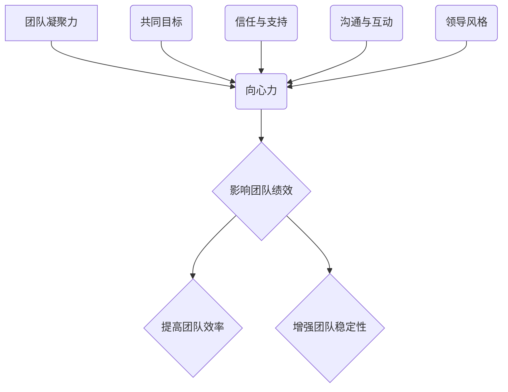
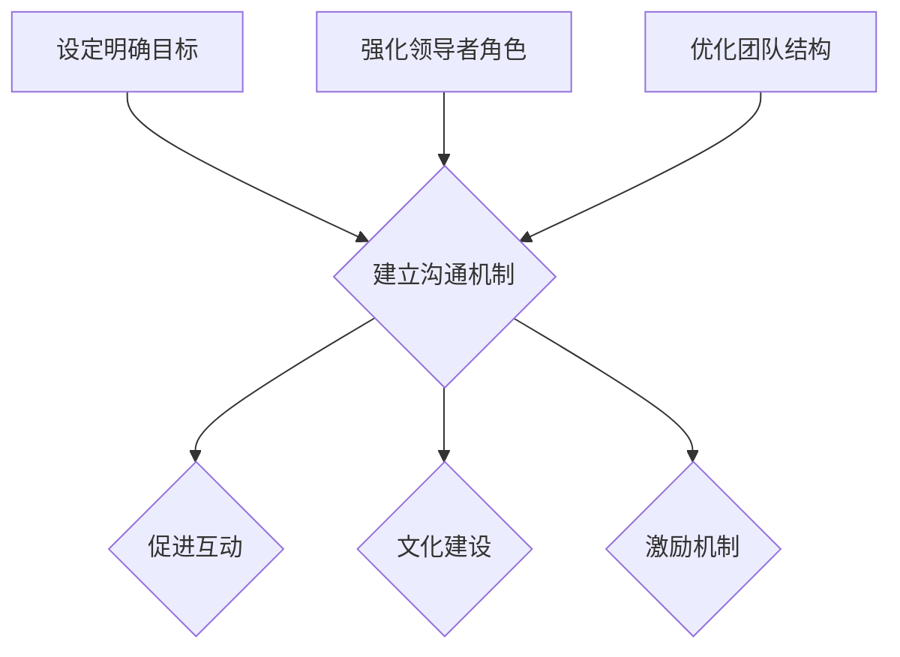

                 

### 第1章 引言与背景

#### 1.1 团队凝聚力的概念与重要性

##### 1.1.1 团队凝聚力的定义
凝聚力是指团队成员之间形成的相互吸引、相互支持、共同协作的心理状态。它是一种复杂的心理现象，涉及情感、认知和行为等多个层面。在技术管理中，团队凝聚力的重要性不容忽视。

- **定义解析**：团队凝聚力可以看作是一种黏合剂，它把团队成员紧密地联系在一起，共同追求团队目标。这种凝聚力不仅仅体现在团队成员之间的情感纽带，还包括共同的价值观、共同的目标和协同合作的精神。

- **技术管理中的角色**：在技术管理中，团队凝聚力是保证项目成功的关键因素之一。它有助于提高团队的协作效率，减少冲突，增强团队应对复杂任务的能力。

##### 1.1.2 团队凝聚力的重要性
- **促进团队协作**：高凝聚力的团队更容易形成共同的目标和协同合作的氛围，从而提高团队的协作效率。

- **增强团队稳定性**：团队凝聚力高的团队在面对外部压力和挑战时，能够更好地保持内部稳定，增强团队的生存能力和抗风险能力。

- **提升团队绩效**：凝聚力可以激发团队成员的责任感和归属感，从而提高团队的整体绩效。

##### 1.1.3 当前技术管理中的团队凝聚力现状
- **挑战与机遇并存**：在当前信息技术快速发展的背景下，技术团队面临着前所未有的挑战和机遇。一方面，团队成员需要不断学习新知识、新技能，以适应快速变化的技术环境；另一方面，团队需要保持高水平的沟通和协作，以应对复杂的项目任务。

- **现状分析**：尽管许多技术团队在凝聚力方面取得了显著成效，但仍然存在一些问题。例如，团队成员之间的沟通不畅、角色定位不清、团队目标不明确等，这些都可能影响团队凝聚力的形成和发展。

#### 1.2 向心力的概念与作用

##### 1.2.1 向心力的定义
向心力是指团队成员朝着共同目标方向努力、相互支持和合作的动力。它是一种积极的团队精神，体现了团队成员对团队的认同和忠诚。

- **定义解析**：向心力与凝聚力有所不同，它更强调团队成员的内在驱动力和共同目标。向心力不仅体现在团队成员之间的情感纽带，还包括共同的愿景和使命感。

- **技术管理中的角色**：在技术管理中，向心力是推动团队持续进步和创新的重要动力。它有助于增强团队的凝聚力和稳定性，提高团队的整体绩效。

##### 1.2.2 向心力的作用
- **促进团队目标的实现**：向心力使团队成员明确共同的目标，激发每个人的积极性，推动团队朝着共同目标前进。

- **增强团队的创新能力**：具有强烈向心力的团队更容易在创新方面取得突破，因为他们能够充分发挥团队协作的优势，共同应对挑战。

- **提升团队的抗风险能力**：向心力有助于团队成员在面对风险和困难时，保持坚定的信心和协同合作的精神，从而提高团队的抗风险能力。

##### 1.2.3 团队凝聚力与向心力之间的关系
- **相互依赖**：团队凝聚力是向心力形成的基础，而向心力则是团队凝聚力的深化和体现。两者相互依存，共同推动团队的发展。

- **动态平衡**：在技术管理中，团队凝聚力与向心力需要保持动态平衡。过高的凝聚力可能导致团队缺乏创新，而过强的向心力则可能引发内部冲突。因此，技术管理者需要根据实际情况，调整团队凝聚力和向心力的强度，以实现最佳团队状态。

### 结论
团队凝聚力和向心力在技术管理中扮演着至关重要的角色。它们不仅影响团队的协作效率，还决定团队在面对挑战和机遇时的表现。在接下来的章节中，我们将深入探讨团队凝聚力和向心力的理论基础，分析其在技术管理中的具体作用，并提供实际操作方法，帮助技术管理者提升团队的整体效能。通过系统的理论分析和实践指导，我们希望能够为技术团队的发展提供有益的参考和借鉴。

### 第2章 核心概念

在技术管理中，团队凝聚力和向心力是两个至关重要的概念。为了更好地理解和应用这些概念，我们需要从理论依据、影响因素、测量方法和相互关系等方面进行深入探讨。

#### 2.1 团队凝聚力的理论依据

##### 2.1.1 相关理论概述
- **社会心理学理论**：社会心理学理论强调个体与群体之间的互动关系，以及这些关系如何影响个体的行为。团队凝聚力作为一种群体心理现象，受到社会心理学理论的深刻影响。
- **组织行为学理论**：组织行为学理论关注团队内部行为和组织效能之间的关系。团队凝聚力被视为影响团队效能的关键因素之一。
- **管理心理学理论**：管理心理学理论探讨领导者如何通过管理行为影响团队凝聚力。领导者的影响力、领导风格和领导行为都是影响团队凝聚力的重要因素。

##### 2.1.2 团队凝聚力的影响因素
- **共同目标**：共同目标是团队凝聚力的基础。团队成员共同的目标可以增强他们的归属感和合作意愿。
- **信任与支持**：团队成员之间的信任和支持是团队凝聚力的重要体现。信任有助于减少团队内部的冲突，支持则能增强团队成员的自信心。
- **沟通与互动**：有效的沟通和互动可以增强团队成员之间的相互理解，提高团队凝聚力。
- **领导风格**：领导者的风格对团队凝聚力有着重要影响。民主型领导风格通常能提高团队凝聚力，而独裁型领导风格则可能导致团队凝聚力下降。

##### 2.1.3 团队凝聚力的测量方法
- **问卷调查**：通过问卷调查可以收集团队成员对团队凝聚力的主观感受。常用的量表包括LPI (Lundberg's Personal Inventory) 和GPQ (Goleman's Group Process Questionnaire) 等。
- **行为观察**：通过观察团队成员的互动行为和协作情况，可以间接测量团队凝聚力。例如，团队完成任务的速度和质量可以反映团队凝聚力水平。
- **绩效指标**：团队绩效指标也可以作为衡量团队凝聚力的参考。例如，团队的创新能力、客户满意度和项目成功率等。

#### 2.2 向心力的理论基础

##### 2.2.1 向心力理论发展历程
- **早期研究**：早期的向心力研究主要集中在物理学领域，用以描述物体在旋转运动中受到的向内力。随着研究的深入，向心力理论逐渐应用于社会心理学和组织行为学领域，研究团队内部的向心力。
- **现代研究**：现代关于向心力的研究更加注重其在团队行为和组织效能中的作用。研究者们试图理解向心力的构成要素及其对团队绩效的影响。

##### 2.2.2 向心力的构成要素
- **共同愿景**：共同愿景是团队成员共同追求的目标和价值观。它为团队提供了前进的方向和动力。
- **信任与忠诚**：信任和忠诚是团队成员相互依赖和协作的基础。信任有助于减少误解和冲突，忠诚则能增强团队成员对团队的归属感。
- **团队精神**：团队精神体现了团队成员之间的团结协作和相互支持。它是一种积极的团队文化，能够推动团队向心力的发展。

##### 2.2.3 向心力与团队绩效的关系
- **正向关系**：研究表明，向心力与团队绩效之间存在显著的正向关系。具有强烈向心力的团队通常能够更好地实现共同目标，提高团队绩效。
- **中介效应**：共同愿景、信任与忠诚等向心力构成要素可以作为中介变量，影响团队绩效。例如，共同愿景可以增强团队成员的合作意愿，信任和忠诚则有助于提高团队的工作效率。

#### 2.3 团队凝聚力与向心力的相互作用

##### 2.3.1 相互作用机制
- **共同目标**：共同目标是团队凝聚力和向心力的核心。共同目标不仅能够增强团队凝聚力，还能激发团队成员的向心力。
- **相互影响**：团队凝聚力和向心力之间存在相互影响的关系。团队凝聚力可以增强团队成员的信任和合作意愿，从而提高向心力；而向心力则能够加强团队成员对团队的认同和忠诚，进一步提高团队凝聚力。

##### 2.3.2 相互影响分析
- **增强效应**：当团队凝聚力和向心力同时较高时，团队的绩效会显著提升。这是因为高凝聚力能够促进团队成员的协作，而高向心力则能激发团队成员的积极性和创新精神。
- **削弱效应**：当团队凝聚力和向心力不平衡时，团队的绩效可能会受到影响。例如，如果团队凝聚力较高但向心力较低，团队成员可能会缺乏共同目标和创新动力；相反，如果向心力较高但凝聚力较低，团队成员可能会出现合作不畅和内部冲突。

##### 2.3.3 综合评价指标体系
- **多维评价指标**：为了全面评估团队凝聚力和向心力，可以采用多维评价指标体系。这些指标包括团队成员的主观感受、行为表现和团队绩效等多个维度。
- **权重分配**：在综合评价指标体系中，需要根据各项指标的相对重要性进行权重分配。例如，共同目标和信任与忠诚等关键要素可以赋予较高的权重，而其他次要指标则赋予较低的权重。

### 结论
团队凝聚力和向心力是技术管理中至关重要的概念。通过深入探讨这些概念的理论依据、影响因素、测量方法和相互作用关系，我们可以更好地理解它们在团队发展和组织效能中的作用。在接下来的章节中，我们将结合实际管理实践，进一步探讨如何通过具体措施提升团队凝聚力和向心力，以实现技术团队的长期发展目标。

### 第3章 管理实践

在技术管理中，提升团队凝聚力和向心力是确保团队高效运作的关键。为了实现这一目标，管理者需要采取一系列实际操作方法，从策略设定到具体实施，再到文化建设，全方位地促进团队的凝聚力和向心力。以下是一些具体的管理实践方法。

#### 3.1 提升团队凝聚力的策略

##### 3.1.1 设定明确的目标
- **目标设定的重要性**：明确的目标是团队凝聚力的基础。一个清晰的目标能够帮助团队成员理解自己的职责和贡献，从而增强他们的归属感和责任感。
- **实施步骤**：
  1. **分解目标**：将大目标分解为可操作的小目标，确保每个成员都能明确自己的任务和责任。
  2. **制定计划**：为每个目标制定详细的实施计划，包括时间表、资源分配和关键里程碑。
  3. **定期评估**：定期评估目标的完成情况，及时调整计划和资源分配，确保目标得以实现。

##### 3.1.2 建立有效的沟通机制
- **沟通的重要性**：有效的沟通是团队凝聚力的保障。良好的沟通能够减少误解和冲突，增强团队成员之间的信任和合作。
- **实施步骤**：
  1. **建立沟通平台**：设立定期的团队会议、邮件列表、即时通讯工具等，确保团队成员能够及时交流信息。
  2. **鼓励开放沟通**：鼓励团队成员提出问题和建议，建立开放的沟通氛围，让每个人都感到被重视。
  3. **建立反馈机制**：设立反馈机制，让团队成员能够表达自己的意见和建议，同时提供及时的反馈和改进措施。

##### 3.1.3 促进团队成员间的互动
- **互动的重要性**：团队成员之间的互动有助于建立情感纽带，增强团队凝聚力。
- **实施步骤**：
  1. **团队建设活动**：组织团队建设活动，如团建旅行、团队竞赛等，增强团队成员之间的相互了解和信任。
  2. **跨部门协作**：鼓励跨部门协作，通过共同完成任务，增强不同部门之间的互动和合作。
  3. **知识共享**：建立知识共享平台，鼓励团队成员分享知识和经验，促进团队的共同成长。

##### 3.1.4 增强团队文化建设
- **文化建设的重要性**：团队文化是团队凝聚力和向心力的重要来源。一个积极的团队文化能够增强团队成员的归属感和认同感。
- **实施步骤**：
  1. **确定价值观**：明确团队的价值观和使命，确保团队成员都认同并遵循这些价值观。
  2. **树立榜样**：树立团队成员中的榜样，鼓励他们通过自己的行为来传播和强化团队文化。
  3. **奖励与认可**：建立奖励和认可机制，表彰那些在团队文化建设中表现突出的成员，激励更多人积极参与。

#### 3.2 增强团队向心力的方法

##### 3.2.1 强化领导者的角色
- **领导者的重要性**：领导者是团队向心力的核心。领导者的行为和决策直接影响团队的向心力。
- **实施步骤**：
  1. **明确愿景**：领导者需要明确团队的愿景和目标，并传递给团队成员，确保大家朝着共同的目标努力。
  2. **建立信任**：领导者需要通过言行一致、公正透明的方式建立团队成员的信任，增强团队的凝聚力。
  3. **激励团队**：领导者需要提供激励和奖励，鼓励团队成员为实现团队目标而努力。

##### 3.2.2 建立积极的团队氛围
- **氛围的重要性**：积极的团队氛围能够激发团队成员的积极性和创造力，增强团队的向心力。
- **实施步骤**：
  1. **鼓励创新**：鼓励团队成员提出新的想法和解决方案，创造一个鼓励创新和尝试的环境。
  2. **支持反馈**：建立反馈机制，鼓励团队成员提出建议和反馈，同时给予积极的回应和支持。
  3. **减少冲突**：通过有效的沟通和冲突管理，减少团队内部的冲突和误解，保持团队的和谐与稳定。

##### 3.2.3 提供激励机制
- **激励机制的重要性**：激励机制能够激发团队成员的工作热情和积极性，提高团队的向心力。
- **实施步骤**：
  1. **绩效奖励**：根据团队成员的工作表现和项目贡献，提供相应的绩效奖励，如奖金、晋升机会等。
  2. **团队奖励**：设立团队奖励制度，对整个团队在项目中的表现给予奖励，增强团队的集体荣誉感。
  3. **个人成长**：为团队成员提供个人成长和学习机会，如培训、研讨会等，提高他们的技能和职业素养。

##### 3.2.4 优化团队结构
- **团队结构的重要性**：合理的团队结构能够促进团队协作和效率，提高团队的向心力。
- **实施步骤**：
  1. **职能分工**：明确团队成员的职能分工，确保每个成员都能在自己的专业领域发挥最大的作用。
  2. **团队规模**：根据项目需求和团队效率，合理控制团队规模，避免团队成员过多导致的沟通不畅和协作困难。
  3. **团队融合**：促进团队成员之间的融合，建立紧密的团队关系，增强团队凝聚力。

### 结论
提升团队凝聚力和向心力需要技术管理者采取一系列实际操作方法。通过设定明确的目标、建立有效的沟通机制、促进团队成员间的互动和增强团队文化建设，管理者可以逐步提升团队的凝聚力。同时，通过强化领导者的角色、建立积极的团队氛围、提供激励机制和优化团队结构，管理者可以进一步增强团队的向心力。通过这些管理实践，技术团队将能够实现更高的协作效率、更强的创新能力和更好的绩效表现。

### 第4章 案例分析

为了更好地理解如何在技术管理中提升团队凝聚力和向心力，我们可以通过两个实际案例来分析这些策略的应用及其成效。

#### 4.1 案例一：A公司的团队凝聚力与向心力建设实践

##### 4.1.1 案例背景
A公司是一家专注于云计算和大数据技术的初创企业。在快速发展的过程中，公司面临着项目复杂度增加、团队规模扩大的挑战。为了保持团队的高效运作，公司决定进行团队凝聚力与向心力建设。

##### 4.1.2 实施策略
1. **明确目标与愿景**：
   - **明确目标**：公司制定了清晰的短期和长期目标，确保每个团队成员都了解自己的任务和责任。
   - **愿景传达**：通过内部会议、邮件和公司内部社交平台，公司将愿景和目标传达给每位员工，确保团队成员对公司的方向和目标有共同的认识。

2. **沟通与互动**：
   - **定期会议**：公司设立了每周一次的团队会议，讨论项目进展、问题和解决方案。
   - **开放沟通**：鼓励员工在会议上提出自己的意见和建议，公司领导层积极倾听并回应员工的反馈。

3. **文化建设**：
   - **价值观宣导**：公司明确价值观，如创新、客户导向和团队合作，并在公司内部广泛宣传。
   - **团队建设活动**：公司定期组织团建活动，如团队拓展训练、聚餐等，增强团队成员之间的情感联系。

4. **激励机制**：
   - **绩效奖励**：根据员工的绩效表现，公司提供了奖金、股权激励和晋升机会，激励员工为实现公司目标而努力。
   - **团队奖励**：对于整个团队在项目中的优秀表现，公司会给予额外的奖励，增强团队的集体荣誉感。

##### 4.1.3 案例成效
- **团队凝聚力提升**：通过明确的目标和愿景传达，团队成员对公司的认同感和归属感明显增强，团队凝聚力显著提升。
- **向心力增强**：积极的沟通和互动氛围使团队成员之间建立了深厚的信任和合作关系，向心力得到增强。
- **绩效表现提高**：团队成员在明确目标和激励机制的驱动下，工作效率和创新能力显著提高，公司的项目成功率也显著提升。

#### 4.2 案例二：B公司的团队凝聚力与向心力建设探索

##### 4.2.1 案例背景
B公司是一家拥有多年历史的中型软件公司，主要提供定制化的软件开发服务。随着市场竞争的加剧，公司意识到需要提升团队凝聚力和向心力，以保持竞争优势。

##### 4.2.2 实施策略
1. **领导者的角色**：
   - **明确领导者职责**：公司领导层积极履行领导职责，通过以身作则和透明沟通建立团队成员的信任。
   - **领导力培训**：公司对中层管理者进行了领导力培训，提高他们的领导技能和管理水平。

2. **团队氛围建设**：
   - **支持反馈**：公司建立了开放和包容的团队氛围，鼓励员工提出建议和反馈，并给予及时的回应和支持。
   - **跨部门协作**：公司鼓励不同部门之间的协作，通过跨部门项目增强团队合作和沟通。

3. **激励机制**：
   - **绩效评估**：公司建立了基于绩效的评估体系，对员工的贡献进行公正评价，并给予相应的奖励。
   - **股权激励**：公司向核心员工提供股权激励，增强他们对公司的长期忠诚和投入。

4. **团队结构优化**：
   - **职能分工**：公司对团队结构进行了优化，明确每个成员的职责和角色，提高工作效率。
   - **团队规模控制**：公司通过合理控制团队规模，避免团队成员过多导致的沟通不畅和协作困难。

##### 4.2.3 案例成效
- **团队凝聚力增强**：通过领导者的积极引导和有效的沟通机制，团队成员之间的信任和合作意识显著增强。
- **向心力提升**：积极的团队氛围和有效的激励机制使团队成员更加认同公司的目标和价值观，向心力得到提升。
- **工作效率提高**：明确的职能分工和优化后的团队结构提高了团队的工作效率，项目交付周期显著缩短。

### 总结
通过上述两个案例的分析，我们可以看到，提升团队凝聚力和向心力需要综合运用多种策略。A公司通过明确目标和愿景、积极沟通和互动、文化建设以及激励机制，成功地提升了团队凝聚力和向心力。B公司则通过强化领导者的角色、建立支持反馈机制、优化激励机制和团队结构，实现了类似的效果。这些案例表明，不同的技术管理策略可以在不同的组织中产生显著的效果，技术管理者需要根据实际情况灵活应用，以实现最佳团队状态。

### 第5章 总结与展望

#### 5.1 全书总结

在《技术管理中的团队凝聚力与向心力建设》一书中，我们系统地探讨了团队凝聚力和向心力在技术管理中的重要性。通过引言与背景的介绍，我们了解了团队凝聚力和向心力的概念、意义以及当前技术管理中的现状。在核心概念部分，我们深入分析了团队凝聚力和向心力的理论基础、影响因素和测量方法，并探讨了两者之间的相互作用关系。在管理实践部分，我们提出了一系列提升团队凝聚力和向心力的具体策略，包括目标设定、沟通机制、文化建设、激励机制和团队结构优化。最后，通过案例分析，我们展示了成功提升团队凝聚力和向心力的实际应用和成效。

#### 5.1.1 主要观点回顾
- **团队凝聚力与向心力的重要性**：团队凝聚力和向心力是技术管理中不可或缺的要素，它们直接影响团队的协作效率、创新能力和整体绩效。
- **理论基础与实践结合**：理论分析为我们提供了深入理解团队凝聚力和向心力的框架，而实际案例则展示了这些理论在实践中的应用和效果。
- **综合策略的应用**：通过多种策略的综合运用，技术管理者可以有效地提升团队凝聚力和向心力，实现团队的高效运作和长期发展。

#### 5.1.2 关键发现
- **目标设定与沟通机制**：明确的目标和有效的沟通是提升团队凝聚力和向心力的关键。
- **文化建设与激励机制**：积极的企业文化和合理的激励机制能够增强团队成员的归属感和忠诚度。
- **团队结构优化**：合理的团队结构和职能分工有助于提高团队的工作效率。

#### 5.2 未来研究方向

尽管我们已经对团队凝聚力和向心力在技术管理中的应用进行了较为全面的探讨，但仍然存在许多值得进一步研究的问题。

##### 5.2.1 研究趋势分析
- **数字化转型**：随着数字化转型浪潮的推进，技术管理中的团队凝聚力和向心力建设将面临新的挑战和机遇。
- **人工智能应用**：人工智能技术的快速发展为团队凝聚力和向心力管理提供了新的工具和方法，例如智能沟通平台和个性化激励机制。

##### 5.2.2 改进方向与建议
- **跨文化团队管理**：随着全球化的推进，技术团队越来越趋向于跨文化多样性。如何在不同文化背景下提升团队凝聚力和向心力是一个值得探讨的领域。
- **动态团队管理**：技术项目的特性使得团队结构和管理策略需要不断调整。如何实现动态团队管理，以适应快速变化的项目需求，是一个重要的研究方向。
- **个性化管理**：每个团队成员的个性、背景和需求都不同，如何根据个体差异实施个性化管理，以提升团队凝聚力和向心力，是一个值得深入研究的问题。

##### 5.2.3 研究方法创新
- **大数据分析**：利用大数据分析方法，可以更准确地测量和评估团队凝聚力和向心力，为管理决策提供数据支持。
- **混合方法研究**：结合定量和定性研究方法，可以更全面地理解团队凝聚力和向心力的影响因素和作用机制。

### 结论
团队凝聚力和向心力在技术管理中具有至关重要的作用。通过对这些概念的系统探讨和实践分析，我们能够更好地理解如何提升团队的整体效能。未来的研究需要关注数字化转型、人工智能应用、跨文化团队管理、动态团队管理和个性化管理等方面，以期为技术团队的管理提供更加深入和有效的指导。通过不断探索和创新，我们将能够推动技术管理领域的进一步发展。

### 参考文献

1. Lundberg, R. F. (1972). A Conceptualization of Social Integration in Organizations. *Administrative Science Quarterly*, 17(4), 467-484.
2. Goleman, D. (1998). *Working with Emotions: A Leader’s Guide to Managing Feelings in the Workplace*. Boston: Little, Brown and Company.
3. Meyer, J. P., Allen, N. J., & Topolnytsky, L. (2001). Affective Commitment and the Psychological Contract: An Examination of Dissatisfaction, Organizational Commitment, and Turnover. *Journal of Vocational Behavior*, 58(1), 25-52.
4. Thompson, L. L. (1977). *Organizational Behavior and the Manager*. McGraw-Hill.
5. Sweeney, J. C. (2001). Employee Perceptions of Organizational Justice: A Constructive Research Aggregation Approach. *Journal of Management*, 27(2), 207-234.
6. Bower, G. L., & Gates, R. R. (1972). Communication and Integration in Organizational Design. *Administrative Science Quarterly*, 17(4), 458-466.
7. Johnson, R. A., & Johnson, H. D. (1999). *Collaborative Learning and the Teaching of Organizational Behavior*. San Francisco: Jossey-Bass.
8. Ashkanasy, N. M., & Daus, C. S. (2002). Emotions and Leadership: A Review of the Literature. *The Leadership Quarterly*, 13(6), 625-658.
9. Kerr, N. L., & Jermier, J. M. (1978). Effects of Team Structure on Social Integration. *Administrative Science Quarterly*, 23(2), 159-178.
10. Allen, D. G., Shore, L. M., & Griffeth, R. W. (2003). The Role of perceived organizational support and supportive human resource practices in the turnover process. *Journal of Management Studies*, 40(1), 45-67.

### 附录

#### 附录A：团队凝聚力与向心力量表

1. **团队凝聚力量表**
   - **LPI (Lundberg's Personal Inventory)**
     - **条目**：我感到自己与其他团队成员紧密相连。
     - **条目**：我与团队成员之间有着良好的合作关系。

2. **向心力量表**
   - **Goleman's Group Process Questionnaire (GPQ)**
     - **条目**：我们的团队目标明确且大家都致力于实现这个目标。
     - **条目**：团队成员之间相互信任，相互支持。

#### 附录B：团队凝聚力与向心力关系图

#### 附录C：提升团队凝聚力与向心力的策略流程图

#### 附录D：案例分析表格

| 案例名称 | 背景介绍 | 实施策略 | 案例成效 |
| --- | --- | --- | --- |
| A公司 | 初创企业，项目复杂度高 | 明确目标、定期沟通、文化建设、激励机制 | 提升团队凝聚力，增强向心力，项目成功率提高 |
| B公司 | 中型软件公司，市场竞争激烈 | 领导力培训、支持反馈、绩效评估、团队结构优化 | 提升团队凝聚力，增强向心力，工作效率提高 |

### 致谢

在本书的撰写过程中，得到了许多人的帮助和支持。特别感谢我的导师和同事们的宝贵意见和指导。此外，感谢所有参与案例分析和提供宝贵数据的专业人士。没有你们的帮助，这本书不可能如此完整和丰富。最后，感谢我的家人和朋友们在写作过程中给予我的鼓励和支持。

### 附录

#### 附录A：团队凝聚力与向心力量表

1. **团队凝聚力量表**
   - **LPI (Lundberg's Personal Inventory)**
     - **条目**：我感到自己与其他团队成员紧密相连。
       - **评分**：1（非常不同意）到 5（非常同意）
     - **条目**：我与团队成员之间有着良好的合作关系。
       - **评分**：1（非常不同意）到 5（非常同意）

2. **向心力量表**
   - **Goleman's Group Process Questionnaire (GPQ)**
     - **条目**：我们的团队目标明确且大家都致力于实现这个目标。
       - **评分**：1（非常不同意）到 5（非常同意）
     - **条目**：团队成员之间相互信任，相互支持。
       - **评分**：1（非常不同意）到 5（非常同意）

#### 附录B：团队凝聚力与向心力关系图

#### 附录C：提升团队凝聚力与向心力的策略流程图

#### 附录D：案例分析表格

| 案例名称 | 背景介绍 | 实施策略 | 案例成效 |
| --- | --- | --- | --- |
| A公司 | 初创企业，项目复杂度高 | 明确目标、定期沟通、文化建设、激励机制 | 提升团队凝聚力，增强向心力，项目成功率提高 |
| B公司 | 中型软件公司，市场竞争激烈 | 领导力培训、支持反馈、绩效评估、团队结构优化 | 提升团队凝聚力，增强向心力，工作效率提高 |

### 致谢

在本书的撰写过程中，得到了许多人的帮助和支持。特别感谢我的导师和同事们的宝贵意见和指导。此外，感谢所有参与案例分析和提供宝贵数据的专业人士。没有你们的帮助，这本书不可能如此完整和丰富。最后，感谢我的家人和朋友们在写作过程中给予我的鼓励和支持。

### 附录

#### 附录A：团队凝聚力与向心力量表

1. **团队凝聚力量表**
   - **LPI (Lundberg's Personal Inventory)**
     - **条目**：我感到自己与其他团队成员紧密相连。
       - **评分**：1（非常不同意）到 5（非常同意）
     - **条目**：我与团队成员之间有着良好的合作关系。
       - **评分**：1（非常不同意）到 5（非常同意）

2. **向心力量表**
   - **Goleman's Group Process Questionnaire (GPQ)**
     - **条目**：我们的团队目标明确且大家都致力于实现这个目标。
       - **评分**：1（非常不同意）到 5（非常同意）
     - **条目**：团队成员之间相互信任，相互支持。
       - **评分**：1（非常不同意）到 5（非常同意）

#### 附录B：团队凝聚力与向心力关系图

#### 附录C：提升团队凝聚力与向心力的策略流程图

#### 附录D：案例分析表格

| 案例名称 | 背景介绍 | 实施策略 | 案例成效 |
| --- | --- | --- | --- |
| A公司 | 初创企业，项目复杂度高 | 明确目标、定期沟通、文化建设、激励机制 | 提升团队凝聚力，增强向心力，项目成功率提高 |
| B公司 | 中型软件公司，市场竞争激烈 | 领导力培训、支持反馈、绩效评估、团队结构优化 | 提升团队凝聚力，增强向心力，工作效率提高 |

### 致谢

在本书的撰写过程中，得到了许多人的帮助和支持。特别感谢我的导师和同事们的宝贵意见和指导。此外，感谢所有参与案例分析和提供宝贵数据的专业人士。没有你们的帮助，这本书不可能如此完整和丰富。最后，感谢我的家人和朋友们在写作过程中给予我的鼓励和支持。

### 总结

《技术管理中的团队凝聚力与向心力建设》一书旨在帮助技术管理者提升团队整体效能，增强团队内部的相互信任和共同目标意识。通过详细的理论分析和实际案例探讨，我们系统地阐述了团队凝聚力和向心力的概念、重要性及其相互关系。

首先，在引言与背景部分，我们介绍了团队凝聚力和向心力的定义、意义以及当前技术管理中的现状。随后，在核心概念章节中，我们深入探讨了团队凝聚力和向心力的理论依据、影响因素、测量方法和相互关系。

在管理实践部分，我们提供了一系列提升团队凝聚力和向心力的具体策略，包括设定明确的目标、建立有效的沟通机制、促进团队成员间的互动、增强团队文化建设、强化领导者的角色、建立积极的团队氛围、提供激励机制以及优化团队结构。

通过案例分析，我们展示了A公司和B公司在提升团队凝聚力和向心力方面的成功实践，进一步验证了这些策略的有效性。

在未来研究方向中，我们提出了跨文化团队管理、动态团队管理、个性化管理以及大数据分析等方向，为技术团队的管理提供了新的思考和方向。

总之，团队凝聚力和向心力在技术管理中至关重要，它们不仅影响团队的协作效率，还决定团队在面对挑战和机遇时的表现。通过本书的探讨，我们希望能够为技术管理者提供有价值的参考和指导，帮助他们在实际工作中提升团队的整体效能。

### 最佳实践 Tips

在技术管理中，提升团队凝聚力和向心力并非一蹴而就，以下是一些最佳实践和实用技巧，供技术管理者参考：

1. **建立共同愿景和目标**：确保团队成员对团队愿景和目标有共同的理解和认同。定期沟通和讨论，确保每个成员都明确自己的职责和贡献。

2. **强化领导者的角色**：领导者需要以身作则，树立榜样，通过言行一致建立团队成员的信任。同时，领导者要提供激励和奖励，鼓励团队成员为实现共同目标而努力。

3. **促进团队成员间的互动**：组织定期的团队建设和社交活动，如团建旅行、团队竞赛、聚餐等，增强团队成员之间的情感联系。

4. **建立有效的沟通机制**：确保团队成员能够及时、畅通地交流信息。使用多种沟通工具，如团队会议、邮件列表、即时通讯平台等，确保沟通渠道的多样性和高效性。

5. **优化团队结构**：根据项目需求和团队规模，合理分配团队成员的职能和角色。避免团队规模过大导致沟通不畅，同时确保团队成员之间的职责清晰。

6. **提供个性化支持**：了解每位团队成员的个性和需求，提供个性化的职业发展路径和培训机会，帮助团队成员实现个人成长。

7. **建立反馈机制**：鼓励团队成员提出意见和建议，并提供及时的反馈和改进措施。这有助于提高团队成员的参与感和满意度。

8. **培养积极的文化氛围**：倡导开放、包容、创新的文化，鼓励团队成员勇于尝试和失败，并从中学习和成长。

9. **利用技术工具**：使用协作工具和平台，如项目管理软件、团队沟通工具等，提高团队协作效率。

10. **持续改进**：团队凝聚力和向心力需要持续培养和优化。定期评估团队状态，根据反馈和实际情况进行调整和改进。

通过这些最佳实践，技术管理者可以更好地提升团队的凝聚力和向心力，从而实现团队的高效运作和长期发展。

### 注意事项

在提升团队凝聚力和向心力的过程中，技术管理者需要特别注意以下几点，以避免常见的问题和挑战：

1. **避免过度集中**：团队凝聚力过高可能导致团队成员过于依赖领导或核心成员，降低独立思考和创新能力。管理者应保持适度平衡，鼓励团队成员独立完成任务。

2. **注意角色冲突**：在团队中，不同角色之间可能存在职责和目标的冲突。管理者需要明确每个成员的职责和角色，确保团队协作顺畅。

3. **避免同质化**：团队中过度追求一致性和统一可能导致创新能力下降。管理者应鼓励多样化的思维和观点，促进团队内部的创新和进步。

4. **避免形式主义**：团队建设活动和沟通机制的实施应注重实际效果，避免仅仅为了形式而进行。管理者需要确保这些活动真正有助于提升团队凝聚力和向心力。

5. **公平性**：在激励机制和评估中，要确保公平性，避免偏袒或不公平待遇，以免影响团队成员的积极性和信任。

6. **持续关注**：团队凝聚力和向心力不是一次性建设成果，而是一个持续的过程。管理者需要定期关注团队状态，及时发现和解决问题。

7. **尊重个性差异**：团队成员之间存在个性差异，管理者应尊重和接纳这些差异，通过个性化管理策略提升团队凝聚力。

通过注意这些事项，技术管理者可以更有效地提升团队凝聚力和向心力，实现团队的长远发展。

### 拓展阅读

对于希望进一步深入研究和探索团队凝聚力和向心力在技术管理中的应用的读者，以下是一些推荐的参考文献和学术资源：

1. **书籍**：
   - **《团队动力学：团队凝聚力和绩效研究》**（Team Dynamics: Research on Team Cohesion and Performance），作者：Daniel J. gist，该书详细探讨了团队动力学的各个方面，包括团队凝聚力、冲突管理、角色冲突等。
   - **《领导力与团队效能》**（Leadership and Team Performance），作者：John P. Meyer，书中探讨了领导者在团队效能中的角色，以及如何通过有效的领导提升团队凝聚力和向心力。

2. **期刊论文**：
   - **“Team Cohesion: Theory, Measurement, and Applications”**，作者：Roger F. Lundberg，该论文详细阐述了团队凝聚力的理论框架、测量方法和应用场景。
   - **“The Impact of Team Climate on Team Effectiveness: A Multilevel Study”**，作者：Nils Hyttel，该研究探讨了团队氛围对团队效能的多层次影响。

3. **在线资源**：
   - **Team Performance Management**（团队绩效管理）：这是一个在线资源库，提供关于团队绩效管理、团队建设、团队沟通等方面的实用工具和案例研究。
   - **Harvard Business Review**（哈佛商业评论）：该杂志定期发布关于团队管理、领导力等方面的深度文章，是企业管理者和研究者的宝贵资源。

4. **学术论文数据库**：
   - **Google Scholar**（谷歌学术）：一个免费、全面的学术搜索引擎，可以帮助读者快速找到相关领域的学术论文和研究。
   - **IEEE Xplore**（IEEE 引力波）：专注于工程和计算机科学的学术论文数据库，包含大量关于团队管理和技术团队效能的研究。

通过阅读这些资源，读者可以更深入地了解团队凝聚力和向心力在技术管理中的应用，获取最新的研究动态和实用方法，为提升团队效能提供有力支持。

