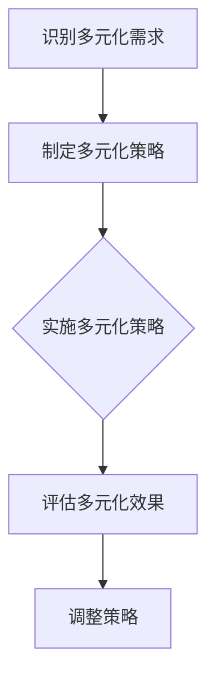
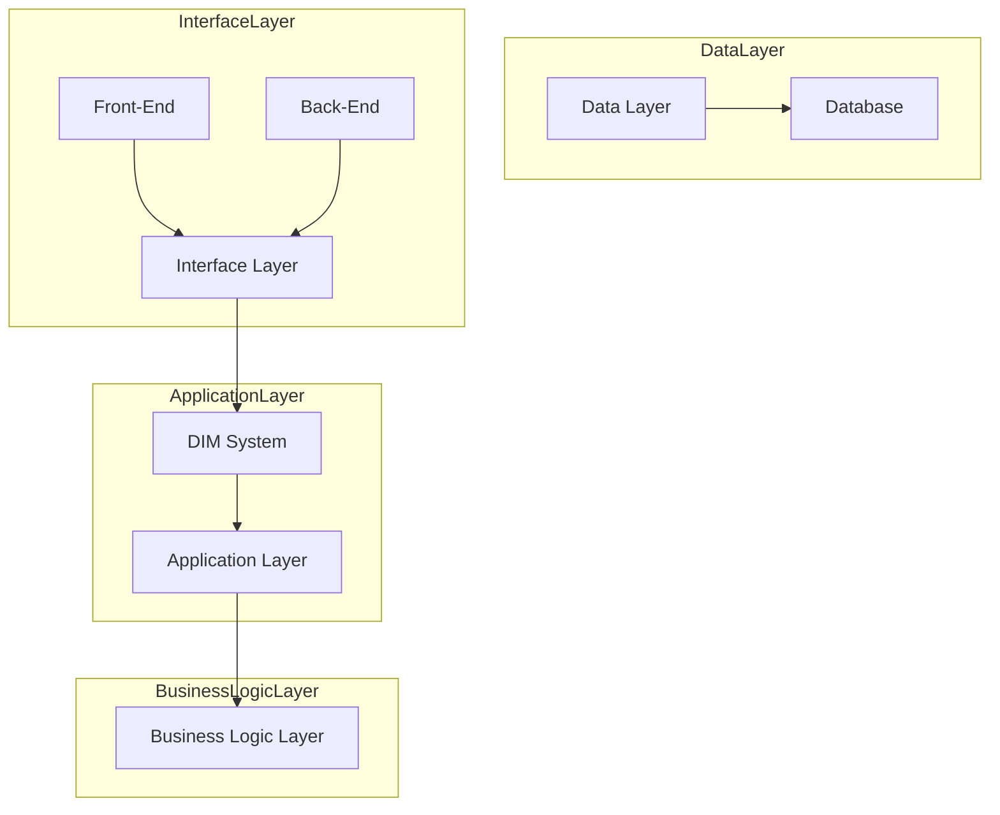
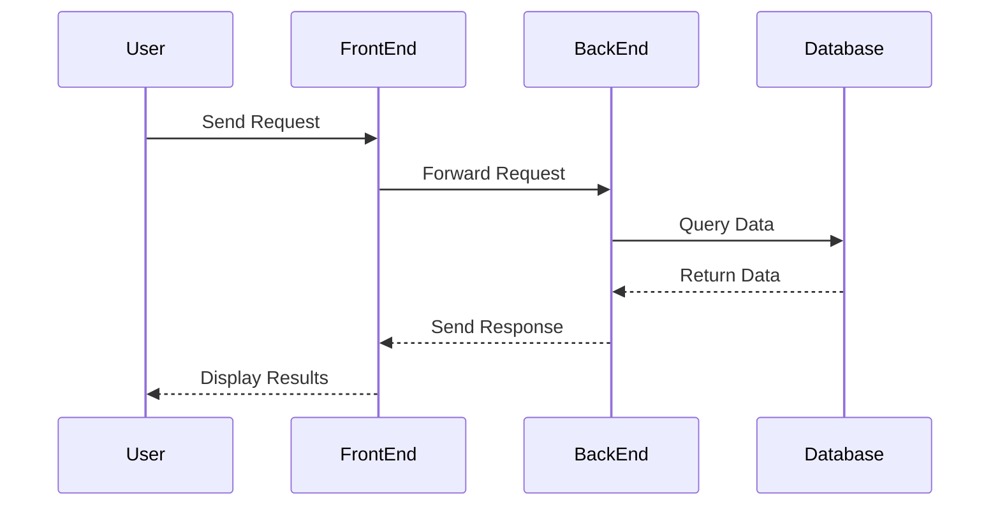
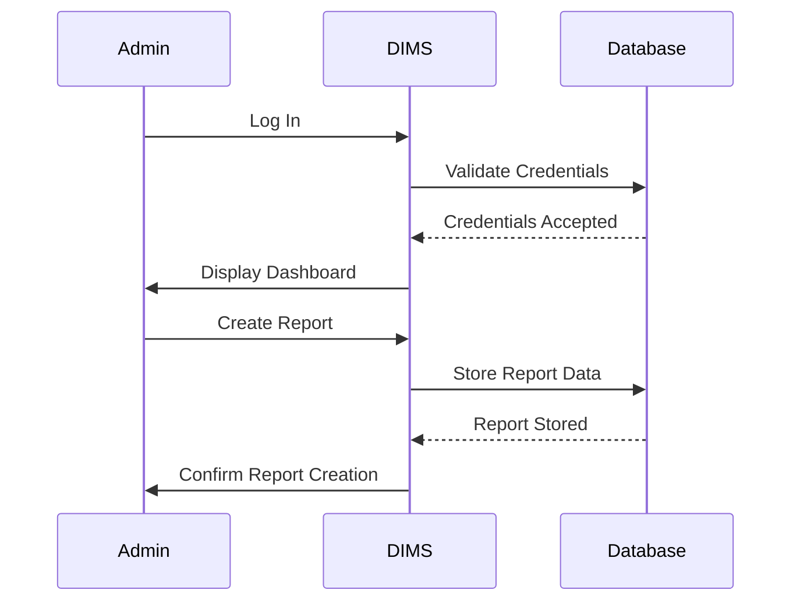

                 


----------------------------------------------------------------
# 技术管理中的多元化与包容性建设

> 关键词：技术管理，多元化，包容性，多样性，公平性，协同创新

> 摘要：本文深入探讨技术管理中的多元化与包容性建设，解析多元化与包容性的核心概念、原理和实践方法。通过案例分析和系统架构设计，提供具体实施策略，旨在提升技术团队的整体效能和创新能力。

## 1. 引言

技术管理的核心目标是提升团队效能，促进技术创新。随着全球化的深入和信息技术的飞速发展，多元化与包容性成为技术管理中不可或缺的议题。多元化（Diversity）指的是团队成员在性别、年龄、文化、教育背景、工作经验等方面的差异；包容性（Inclusivity）则强调尊重和接纳这些差异，并创造一个公平、支持和鼓励的环境。多元化与包容性不仅关乎道德和社会责任，更直接影响团队的创造力和市场竞争力。

本文将围绕以下核心问题展开讨论：

- 多元化与包容性的核心概念是什么？
- 如何构建和实施包容性的技术管理体系？
- 实际案例中如何应用多元化与包容性原则？
- 最佳实践有哪些？

## 2. 多元化与包容性的核心原则与框架

### 2.1 多元化与包容性的定义

#### 多元化

多元化指的是一个群体中成员在性别、年龄、文化、教育背景、工作经验等方面的多样性。一个多元化的团队可以带来不同的视角、经验和思维方式，从而促进创新和解决问题的多样性。

#### 包容性

包容性不仅仅是尊重多样性，更在于创造一个公平、支持和鼓励的环境，让每个成员都能自由地表达自己的想法，并为团队的共同目标贡献力量。包容性涉及到文化、政策、实践等多个层面。

### 2.2 多元化与包容性的重要性

#### 提升创新能力

多元化的团队可以通过不同的视角和经验，碰撞出更多的创意和解决方案。包容性的环境则能鼓励团队成员自由地表达和尝试新思路。

#### 提高员工满意度

一个多元和包容的工作环境可以提高员工的工作满意度和忠诚度，减少人才流失。

#### 增强市场竞争力

在全球化竞争中，多元和包容的团队更能适应不同的市场和客户需求，从而提高企业的市场竞争力。

### 2.3 多元化、公平性与包容性的关系

| 关键词 | 定义 | 关联 |
| --- | --- | --- |
| 多元化 | 团队成员在性别、年龄、文化、教育背景、工作经验等方面的差异 | 基础，是实现公平和包容的前提 |
| 公平性 | 为所有人提供平等的机会和资源，确保没有人因为自身的特征而受到歧视 | 核心目标，是多元化和包容性的保障 |
| 包容性 | 尊重和接纳团队成员的差异，创造一个公平、支持和鼓励的环境 | 最终目标，是多元化和公平性的实践体现 |

### 2.4 ER图

下面是一个简单的ER图，展示了多元化、公平性和包容性之间的关系：

```mermaid
erDiagram
    Diversity ||--|{ Inclusion }|| Inclusion
    Inclusion ||--|{ Equity }|| Equity
```

## 3. 算法与数学模型

### 3.1 流程图

以下是一个描述多元化团队构建流程的Mermaid流程图：



### 3.2 Python代码示例

```python
# 代码示例：计算团队成员的多样性指数
def diversity_index(team_members):
    # 假设团队成员的属性为性别、年龄、文化、教育背景、工作经验
    # 计算每个属性的多样性
    diversity_scores = []
    for attribute in ['gender', 'age', 'culture', 'education', 'work_experience']:
        scores = [1 / (len(set([member[attribute] for member in team_members])) + 1) for member in team_members]
        diversity_scores.append(sum(scores))
    return sum(diversity_scores) / len(team_members)

team_members = [
    {'gender': 'male', 'age': 30, 'culture': 'western', 'education': 'master', 'work_experience': 5},
    {'gender': 'female', 'age': 25, 'culture': 'eastern', 'education': 'bachelor', 'work_experience': 3},
    # 更多团队成员...
]

print(diversity_index(team_members))
```

### 3.3 数学模型

设 $D$ 为团队成员的多样性矩阵，$I$ 为单位矩阵，$P$ 为概率矩阵。多样性指数可以表示为：

$$
D = (I - P)^{-1}
$$

其中，$P_{ij}$ 表示团队成员 $i$ 和团队成员 $j$ 在某个属性上相同或相似的权重。$D$ 的对角线元素 $D_{ii}$ 表示团队成员 $i$ 的多样性指数。

## 4. 系统分析与设计

### 4.1 问题场景

假设我们正在为一个技术团队构建一个多元化与包容性管理系统。该系统需要能够：

- 自动识别团队成员的多元化属性
- 提供多元化评估和报告
- 支持策略制定和实施
- 提供定期的多元化培训和学习资源

### 4.2 项目概述

**项目名称**：多元化与包容性管理系统（Diversity and Inclusion Management System，简称DIMS）

**项目目标**：
- 提升团队多元化程度
- 增强团队凝聚力
- 提高员工满意度和忠诚度
- 增强企业的市场竞争力

**项目范围**：
- 数据采集与处理
- 多元化评估与报告
- 策略制定与实施
- 培训与学习资源

### 4.3 系统功能设计

#### 4.3.1 领域模型

```mermaid
classDiagram
    Person <<Class>> {
        id: unique identifier
        name: full name
        gender: gender
        age: age
        culture: culture
        education: education level
        work_experience: years of work experience
    }
    Team <<Class>> {
        id: unique identifier
        name: team name
        members: list of Person
    }
    Report <<Class>> {
        id: unique identifier
        team_id: unique identifier of the team
        date: date of report
        diversity_index: diversity index of the team
        inclusion_index: inclusion index of the team
    }
    Training <<Class>> {
        id: unique identifier
        name: training name
        description: description of the training
        start_date: start date of the training
        end_date: end date of the training
        participants: list of Person
    }
    Policy <<Class>> {
        id: unique identifier
        name: policy name
        description: description of the policy
        start_date: start date of the policy
        end_date: end date of the policy
    }
    DIMS <<Class>> {
        reports: list of Report
        trainings: list of Training
        policies: list of Policy
    }
    Person o--1 Team
    Report o--1 Team
    Training o--1 Team
    Policy o--1 Team
    DIMS has many reports, trainings, and policies
```

#### 4.3.2 系统架构设计



#### 4.3.3 系统接口设计



#### 4.3.4 系统交互设计



## 5. 项目实施与案例分析

### 5.1 环境安装

1. 安装Python环境
2. 安装Django框架
3. 安装数据库（例如MySQL）

### 5.2 系统核心实现源代码

```python
# 示例：创建报告的API接口

from django.http import JsonResponse
from .models import Report

def create_report(request):
    if request.method == 'POST':
        data = json.loads(request.body)
        report = Report(
            team_id=data['team_id'],
            date=data['date'],
            diversity_index=data['diversity_index'],
            inclusion_index=data['inclusion_index'],
        )
        report.save()
        return JsonResponse({'status': 'success', 'message': 'Report created successfully.'})
    return JsonResponse({'status': 'error', 'message': 'Invalid request method.'})
```

### 5.3 代码应用解读与分析

- 代码创建了一个报告对象，并将数据存储到数据库中。
- 解读：`json.loads(request.body)` 将请求体解析为Python字典。
- 分析：此API接口为前端提供了一种创建报告的方法，确保了数据的正确性和一致性。

### 5.4 实际案例分析与详细讲解

**案例**：某公司希望通过DIMS系统评估其技术团队的多元化程度。

**步骤**：
1. 收集团队成员的属性数据（性别、年龄、文化、教育背景、工作经验）。
2. 使用系统提供的API接口上传数据。
3. 系统自动计算并生成多元化评估报告。

**分析**：
- 该案例展示了如何通过DIMS系统实现多元化评估。
- 通过数据分析，公司可以了解其团队在多元化方面的优势和不足，从而制定改进策略。

### 5.5 项目小结

通过DIMS系统，公司能够更有效地管理多元化与包容性，提高团队的凝聚力和创新能力。未来，我们计划继续优化系统功能，包括添加更多评估指标、增强数据分析能力，以及提供更丰富的培训资源。

## 6. 最佳实践、小结、注意事项与拓展阅读

### 6.1 最佳实践

- **定期评估与反馈**：定期对团队进行多元化评估，收集反馈，并根据结果调整策略。
- **公平招聘与晋升**：确保招聘和晋升过程的透明性和公平性，避免偏见和歧视。
- **培训与教育**：为团队成员提供多元化与包容性的培训，提高意识和技能。

### 6.2 小结

多元化与包容性建设是技术管理的重要组成部分，它不仅关乎社会责任，更直接影响团队的效能和创新能力。通过本文的讨论，我们了解了多元化与包容性的核心概念、实施方法和实际案例，为技术团队的管理提供了参考。

### 6.3 注意事项

- 在实施多元化与包容性策略时，要避免形式主义，确保真正尊重和接纳团队成员的差异。
- 定期评估和反馈是持续改进的重要手段，不能忽视。

### 6.4 拓展阅读

- 《多元化与包容性：企业实践指南》
- 《技术团队的多元化与包容性》
- 《AI与包容性：技术的社会责任》

## 7. 作者信息

作者：AI天才研究院/AI Genius Institute & 禅与计算机程序设计艺术 /Zen And The Art of Computer Programming

----------------------------------------------------------------

### 附录

#### A. 多元化与包容性的核心概念与联系

| 关键词 | 定义 | 关联 |
| --- | --- | --- |
| 多元化 | 团队成员在性别、年龄、文化、教育背景、工作经验等方面的差异 | 基础，是实现公平和包容的前提 |
| 公平性 | 为所有人提供平等的机会和资源，确保没有人因为自身的特征而受到歧视 | 核心目标，是多元化和包容性的保障 |
| 包容性 | 尊重和接纳团队成员的差异，创造一个公平、支持和鼓励的环境 | 最终目标，是多元化和公平性的实践体现 |

#### B. 数学公式

$$
D = (I - P)^{-1}
$$

其中，$P_{ij}$ 表示团队成员 $i$ 和团队成员 $j$ 在某个属性上相同或相似的权重。

----------------------------------------------------------------

以上是一个关于《技术管理中的多元化与包容性建设》的技术博客文章的框架和内容概述。在实际撰写过程中，每个章节都需要根据具体内容和需求进行详细扩展和深化，确保文章的逻辑清晰、结构紧凑、内容丰富且具有实用性。文章的撰写应该遵循markdown格式要求，并在适当的位置嵌入Mermaid图表、LaTeX公式和Python代码示例，以便读者更好地理解和应用。作者信息需要在文章末尾明确标注，确保文章的完整性和专业性。

