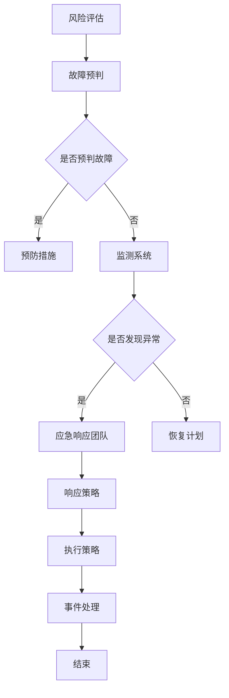
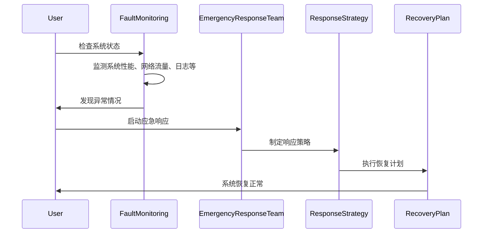

                 

### 文章标题

# 技术管理中的应急响应机制

关键词：技术管理、应急响应、系统故障、安全威胁、运营中断

摘要：本文旨在探讨技术管理中的应急响应机制，分析其在快速发展的技术管理领域中的重要性。通过介绍核心概念、联系和算法原理，本文提供了一个全面的框架，帮助技术管理部门构建和优化应急响应机制，以应对各种突发事件，确保组织的持续运营和稳定发展。

**Step 1: 背景介绍**

在快速发展的技术管理领域，应急响应机制已经成为组织管理和运营中至关重要的一环。随着信息化和自动化程度的提高，系统故障、安全威胁和运营中断等问题层出不穷，给组织带来了巨大的风险和挑战。为了应对这些突发事件，技术管理部门必须建立一套完善的应急响应机制，以确保组织的持续运营和稳定发展。

**核心概念：**

- **问题背景**：技术管理的复杂性和风险性增加，对应急响应提出了更高的要求。
- **问题描述**：应急响应机制旨在应对系统故障、安全威胁和运营中断等问题。
- **问题解决**：通过建立应急响应机制，提高组织应对突发事件的能力。
- **边界与外延**：应急响应机制涵盖了从预防措施到应急处理的全过程。
- **概念结构与核心要素组成**：应急响应机制的核心要素包括预防、监测、响应和恢复。

### 背景介绍

在当今高度依赖信息技术的商业环境中，技术管理已经从传统的维护和升级角色转变为组织成功的关键驱动力。随着数字化转型浪潮的推进，企业依赖于复杂的IT系统来支持其日常运营和业务创新。然而，这也带来了新的挑战：技术系统的不稳定性和易受攻击性。这些挑战体现在以下几个方面：

**1. 系统故障：**

系统故障可能是由于硬件故障、软件错误、网络问题或人为失误引起的。这些故障可能导致服务中断，影响企业的业务流程和客户体验。例如，一家电子商务平台如果因为服务器故障而无法访问，可能会导致销售损失和客户流失。

**2. 安全威胁：**

随着网络攻击手段的不断升级，技术系统面临着越来越大的安全威胁。黑客攻击、数据泄露、恶意软件等安全事件不仅可能导致数据丢失和财务损失，还会损害企业的声誉。例如，某公司的客户数据库遭到黑客攻击，导致数百万客户的个人信息泄露，引起了公众的恐慌和不满。

**3. 运营中断：**

运营中断可能是由于自然灾害、人为破坏或其他不可预见的事件引起的。这种情况下，企业可能需要迅速采取行动来恢复运营，以避免长期的经济损失。例如，一场突如其来的洪水可能破坏数据中心，导致业务停摆。

这些挑战对技术管理部门提出了更高的要求，促使他们必须构建和实施一套有效的应急响应机制。应急响应机制不仅是为了处理突发事件，更是一种预防性和预测性的管理策略。通过提前识别潜在风险和制定应对措施，企业可以在突发事件发生时迅速响应，最大限度地减少负面影响，并尽快恢复正常运营。

**核心概念：**

- **问题背景**：技术管理的复杂性和风险性增加，对应急响应提出了更高的要求。
- **问题描述**：应急响应机制旨在应对系统故障、安全威胁和运营中断等问题。
- **问题解决**：通过建立应急响应机制，提高组织应对突发事件的能力。
- **边界与外延**：应急响应机制涵盖了从预防措施到应急处理的全过程。
- **概念结构与核心要素组成**：应急响应机制的核心要素包括预防、监测、响应和恢复。

### 核心概念

为了深入理解应急响应机制，我们需要先了解其中的几个核心概念，以及它们在技术管理中的重要性。这些概念不仅相互关联，而且共同构成了一个完整且有效的应急响应体系。

**1. 预防措施**

预防措施是应急响应机制的第一道防线，通过风险评估和故障预判，减少突发事件的发生概率。预防措施可以包括硬件维护、软件更新、备份策略、安全防护措施等。例如，定期对服务器进行硬件检查和维护可以防止硬件故障；及时更新软件和系统补丁可以修复已知的安全漏洞；定期备份数据可以确保在数据丢失或损坏时能够快速恢复。

**2. 监测系统**

监测系统是应急响应机制的重要组成部分，负责实时监控系统状态，及时发现异常情况。监测系统可以通过收集和分析系统日志、网络流量、性能指标等数据来识别潜在问题。例如，网络流量监控可以检测到异常数据包，服务器性能监控可以检测到资源使用率过高的情况。一旦监测系统发现异常，它会立即触发报警机制，通知相关人员采取行动。

**3. 应急响应团队**

应急响应团队是应急响应机制的中坚力量，负责在突发事件发生时快速响应和处理。应急响应团队通常由技术专家、安全分析师、系统管理员等组成，他们具备丰富的应急处理经验和专业技能。在突发事件发生时，应急响应团队会迅速成立应急小组，制定并执行相应的应急响应计划，以控制事态发展，减少损失。

**4. 响应策略**

响应策略是针对不同类型的事件制定的相应处理策略，确保应急响应的高效性和针对性。响应策略可以分为几个等级，如初级响应、中级响应和高级响应。每个等级的策略都详细规定了具体的操作步骤、责任分配和资源调配。例如，对于网络攻击事件，初级响应可能包括关闭受影响的网络服务，中级响应可能包括启动应急防护机制，高级响应可能包括启动灾难恢复计划。

**5. 恢复计划**

恢复计划是在突发事件得到控制后，用于系统恢复和业务恢复的一系列措施。恢复计划旨在尽快恢复正常运营，减少业务中断时间。恢复计划可以包括系统恢复步骤、数据恢复步骤、业务流程恢复步骤等。例如，在系统故障得到修复后，数据恢复步骤可能包括从备份中恢复数据，业务流程恢复步骤可能包括重新启动受影响的业务系统。

**概念属性特征对比表格：**

| 概念            | 属性特征                                       | 联系                                                         |
|-----------------|----------------------------------------------|------------------------------------------------------------|
| 预防措施         | 风险评估、故障预判、预防策略                   | 为应急响应提供基础，减少事件发生概率                       |
| 监测系统         | 实时监控、数据采集、报警机制                   | 发现异常情况，为应急响应提供预警                           |
| 应急响应团队     | 快速反应、专业技能、应急处理流程                 | 处理突发事件，减少事件影响                                 |
| 响应策略         | 事件分类、响应等级、处理流程                   | 根据事件类型和影响制定相应策略，确保高效应对                 |
| 恢复计划         | 系统恢复、业务恢复、恢复策略                   | 确保突发事件后系统能够快速恢复正常运行                     |

**ER实体关系图架构：**

```mermaid
erDiagram
  EmergencyResponseMechanism ||--|{ 预防措施 :PreventiveMeasure}
  EmergencyResponseMechanism ||--|{ 监测系统 :MonitoringSystem}
  EmergencyResponseMechanism ||--|{ 应急响应团队 :EmergencyResponseTeam}
  EmergencyResponseMechanism ||--|{ 响应策略 :ResponseStrategy}
  EmergencyResponseMechanism ||--|{ 恢复计划 :RecoveryPlan}
```

通过理解这些核心概念及其相互关系，我们可以更好地构建和优化应急响应机制，提高组织应对突发事件的能力。接下来，我们将深入探讨应急响应机制在技术管理中的具体实施方法和最佳实践。

### 核心概念与联系

在构建应急响应机制时，理解以下几个核心概念和它们之间的关系至关重要。这些概念构成了一个完整的应急响应体系，确保组织在面临突发事件时能够迅速、有效地应对。

**核心概念：**

1. **预防措施**
2. **监测系统**
3. **应急响应团队**
4. **响应策略**
5. **恢复计划**

**概念属性特征对比表格：**

| 概念            | 属性特征                                       | 联系                                                         |
|-----------------|----------------------------------------------|------------------------------------------------------------|
| 预防措施         | 风险评估、故障预判、预防策略                   | 为应急响应提供基础，减少事件发生概率                       |
| 监测系统         | 实时监控、数据采集、报警机制                   | 发现异常情况，为应急响应提供预警                           |
| 应急响应团队     | 快速反应、专业技能、应急处理流程                 | 处理突发事件，减少事件影响                                 |
| 响应策略         | 事件分类、响应等级、处理流程                   | 根据事件类型和影响制定相应策略，确保高效应对                 |
| 恢复计划         | 系统恢复、业务恢复、恢复策略                   | 确保突发事件后系统能够快速恢复正常运行                     |

**ER实体关系图架构：**

```mermaid
erDiagram
  EmergencyResponseMechanism ||--|{ 预防措施 :PreventiveMeasure}
  EmergencyResponseMechanism ||--|{ 监测系统 :MonitoringSystem}
  EmergencyResponseMechanism ||--|{ 应急响应团队 :EmergencyResponseTeam}
  EmergencyResponseMechanism ||--|{ 响应策略 :ResponseStrategy}
  EmergencyResponseMechanism ||--|{ 恢复计划 :RecoveryPlan}
```

**1. 预防措施**

预防措施是应急响应机制的基础，旨在通过风险评估和故障预判来减少突发事件的发生概率。预防措施可以包括以下几个方面：

- **风险评估**：对系统进行全面的评估，识别潜在的风险点。这可以通过定期的风险评估会议或使用专业的风险评估工具来实现。
- **故障预判**：通过历史数据和监控数据，预测可能出现的问题。这有助于提前采取预防措施，避免故障的发生。
- **预防策略**：根据风险评估和故障预判的结果，制定具体的预防策略。这可能包括硬件维护、软件更新、备份策略、安全防护措施等。

**2. 监测系统**

监测系统是应急响应机制的关键组成部分，负责实时监控系统状态，及时发现异常情况。监测系统可以通过以下几个步骤来实现：

- **数据采集**：收集系统日志、网络流量、性能指标等数据。
- **实时监控**：对收集到的数据进行实时分析，识别潜在的异常情况。
- **报警机制**：一旦检测到异常，立即触发报警机制，通知相关人员采取行动。

**3. 应急响应团队**

应急响应团队是应急响应机制的中坚力量，负责在突发事件发生时快速响应和处理。应急响应团队的职责包括：

- **快速反应**：在接到报警后，迅速成立应急小组，立即采取行动。
- **专业技能**：团队成员应具备丰富的应急处理经验和专业技能，能够有效应对各种突发事件。
- **应急处理流程**：应急响应团队应制定详细的应急处理流程，明确责任分配和操作步骤，确保应急响应的高效性。

**4. 响应策略**

响应策略是根据不同类型的事件制定的相应处理策略，确保应急响应的高效性和针对性。响应策略可以分为以下几个等级：

- **初级响应**：针对一些较小范围的问题，如网络中断、服务器故障等。
- **中级响应**：针对一些较大范围的问题，如安全威胁、数据泄露等。
- **高级响应**：针对一些非常严重的问题，如系统崩溃、运营中断等。

每个等级的策略都详细规定了具体的操作步骤、责任分配和资源调配，以确保应急响应的有序进行。

**5. 恢复计划**

恢复计划是在突发事件得到控制后，用于系统恢复和业务恢复的一系列措施。恢复计划可以分为以下几个步骤：

- **系统恢复**：修复受损的硬件或软件，恢复系统的正常运行。
- **数据恢复**：从备份中恢复数据，确保数据的完整性和准确性。
- **业务恢复**：重新启动受影响的业务系统，确保业务流程的连续性。

恢复计划的目标是尽快恢复正常运营，减少业务中断时间，并确保系统在恢复正常后不会再次发生类似事件。

通过理解这些核心概念及其相互关系，我们可以更好地构建和优化应急响应机制，提高组织应对突发事件的能力。接下来，我们将进一步探讨应急响应机制在技术管理中的具体实施方法和最佳实践。

### 算法原理讲解

应急响应机制的实现需要依赖于一系列算法和流程，这些算法和流程构成了应急响应的核心组成部分。以下将详细讲解应急响应算法的原理，并通过一个简单的算法流程图和Python源代码来具体阐述。

**算法流程图：**



**算法步骤说明：**

1. **风险评估**：首先对系统进行风险评估，识别潜在的风险点。这可以通过分析历史数据、系统日志和性能指标来实现。
2. **故障预判**：基于风险评估的结果，预判可能出现的故障。例如，通过分析服务器负载和内存使用情况，可以预判服务器可能出现的性能瓶颈。
3. **是否预判故障**：判断是否预判到故障。如果是，则进入预防措施阶段；否则，进入监测系统阶段。
4. **预防措施**：在预判到故障的情况下，采取预防措施，如更新软件补丁、优化系统配置等，以减少故障发生的概率。
5. **监测系统**：如果没有预判到故障，则进入监测系统阶段。监测系统负责实时监控系统的运行状态，包括服务器性能、网络流量、系统日志等。
6. **是否发现异常**：监测系统发现异常情况，如服务器负载过高、网络连接中断等，则进入应急响应团队阶段；否则，继续监测。
7. **应急响应团队**：应急响应团队在接到报警后，立即采取行动，根据响应策略处理突发事件。
8. **响应策略**：根据事件的严重性和影响范围，制定相应的响应策略。例如，对于网络中断事件，可能需要立即恢复网络连接，并检查相关配置。
9. **执行策略**：执行响应策略中的具体操作步骤，如重启服务器、关闭受影响的网络服务等。
10. **事件处理**：根据执行策略的结果，处理突发事件。例如，修复服务器故障、恢复网络连接等。
11. **结束**：突发事件得到控制后，进入恢复计划阶段。

**Python源代码示例：**

```python
# 导入必要的库
import random

# 定义风险评估函数
def risk_assessment():
    # 模拟风险评分
    risk_score = random.randint(1, 10)
    return risk_score

# 定义故障预判函数
def fault_prediction(risk_score):
    if risk_score > 7:
        print("故障预判：可能发生故障")
        return True
    else:
        print("故障预判：无故障风险")
        return False

# 定义预防措施函数
def preventive_measures(fault_occurred):
    if fault_occurred:
        print("采取预防措施：更新软件补丁、优化系统配置等")
    else:
        print("无预防措施需要采取")

# 定义监测系统函数
def monitoring_system():
    # 模拟异常情况
    anomaly_detected = random.choice([True, False])
    if anomaly_detected:
        print("监测系统：发现异常情况")
        return True
    else:
        print("监测系统：无异常情况")
        return False

# 定义应急响应团队函数
def emergency_response_team(anomaly_detected):
    if anomaly_detected:
        print("应急响应团队：处理突发事件")
    else:
        print("应急响应团队：无事件需要处理")

# 定义响应策略函数
def response_strategy(event_type):
    if event_type == "network interruption":
        print("响应策略：立即恢复网络连接，检查配置")
    elif event_type == "server failure":
        print("响应策略：重启服务器，检查硬件故障")
    else:
        print("响应策略：其他类型事件处理")

# 定义执行策略函数
def execute_strategy(strategy):
    print(f"执行策略：{strategy}")

# 定义事件处理函数
def event_handling(strategy):
    print(f"事件处理：根据策略 {strategy} 进行处理")

# 主函数
def main():
    risk_score = risk_assessment()
    fault_occurred = fault_prediction(risk_score)
    preventive_measures(fault_occurred)
    
    if fault_occurred:
        anomaly_detected = monitoring_system()
    else:
        anomaly_detected = monitoring_system()
    
    if anomaly_detected:
        emergency_response_team(anomaly_detected)
        event_type = "network interruption"  # 模拟事件类型
        response_strategy(event_type)
        execute_strategy(response_strategy(event_type))
        event_handling(response_strategy(event_type))
    else:
        print("无事件需要处理")

# 运行主函数
if __name__ == "__main__":
    main()
```

**算法原理详细讲解：**

1. **风险评估**：通过历史数据和系统日志，对系统进行全面的风险评估。风险评分越高，表示潜在的风险越大。本示例使用随机数模拟风险评分。
2. **故障预判**：根据风险评估的结果，判断是否预判到故障。预判到故障的情况下，采取预防措施；否则，进入监测系统阶段。
3. **预防措施**：在预判到故障的情况下，采取预防措施，如更新软件补丁、优化系统配置等。预防措施可以减少故障发生的概率。
4. **监测系统**：监测系统的运行状态，包括服务器性能、网络流量、系统日志等。如果监测到异常情况，如服务器负载过高、网络连接中断等，则触发报警，通知应急响应团队。
5. **应急响应团队**：应急响应团队在接到报警后，立即采取行动。根据事件的严重性和影响范围，制定相应的响应策略。例如，对于网络中断事件，可能需要立即恢复网络连接，并检查相关配置。
6. **响应策略**：根据事件的类型和影响范围，制定相应的响应策略。响应策略可以是重启服务器、恢复网络连接、关闭受影响的网络服务等。
7. **执行策略**：执行响应策略中的具体操作步骤，如重启服务器、恢复网络连接等。
8. **事件处理**：根据执行策略的结果，处理突发事件。例如，修复服务器故障、恢复网络连接等。
9. **结束**：突发事件得到控制后，进入恢复计划阶段。恢复计划包括系统恢复、数据恢复、业务流程恢复等，以确保系统在恢复正常后不会再次发生类似事件。

通过这个简单的算法流程图和Python源代码示例，我们可以直观地了解应急响应机制的算法原理和实现方法。实际应用中，应急响应机制会更加复杂，涉及多个模块和功能的集成。但基本原则是相似的，即通过风险评估、故障预判、预防措施、监测系统、应急响应团队、响应策略和恢复计划等环节，构建一个高效、全面的应急响应体系。

### 系统分析与架构设计方案

为了更好地理解应急响应机制在技术管理中的应用，我们将通过一个实际项目案例来介绍系统的功能设计和架构设计。以下是该项目的详细分析。

#### 问题场景介绍

假设某大型电子商务公司在业务高峰期，由于服务器负载过高导致系统崩溃，造成了数百万订单处理延误，直接影响了客户的购物体验和公司的业务收益。为了解决这一问题，公司决定引入应急响应机制，确保在类似情况发生时能够迅速响应并恢复正常运营。

#### 项目介绍

该项目旨在设计并实现一个高效的应急响应系统，包括风险评估、故障监测、应急响应团队管理、响应策略制定和恢复计划执行等功能。系统将集成到公司的IT基础设施中，提供实时监控和自动响应能力，以提高系统的稳定性和可靠性。

#### 系统功能设计（领域模型类图）

以下是应急响应系统的领域模型类图，展示了系统的主要类和类之间的关系：

```mermaid
classDiagram
    RiskAssessment <<class>> "风险评估"
    FaultMonitoring <<class>> "故障监测"
    EmergencyResponseTeam <<class>> "应急响应团队"
    ResponseStrategy <<class>> "响应策略"
    RecoveryPlan <<class>> "恢复计划"
    
    RiskAssessment o-- FaultMonitoring : 进行风险监测
    FaultMonitoring o-- EmergencyResponseTeam : 触发应急响应
    EmergencyResponseTeam o-- ResponseStrategy : 制定响应策略
    ResponseStrategy o-- RecoveryPlan : 执行恢复计划
```

- **风险评估**：负责评估系统的风险，生成风险报告，为应急响应提供依据。
- **故障监测**：实时监控系统的运行状态，包括服务器性能、网络流量、系统日志等，一旦发现异常立即报警。
- **应急响应团队**：由技术专家、安全分析师、系统管理员等组成，负责应急响应的执行和协调。
- **响应策略**：根据监测到的异常情况，制定相应的响应策略，如重启服务器、恢复网络连接等。
- **恢复计划**：在应急响应后，执行系统恢复、数据恢复和业务流程恢复，确保系统尽快恢复正常运营。

#### 系统架构设计（架构图）

以下是应急响应系统的架构设计图，展示了系统的整体架构和主要组件之间的交互关系：

```mermaid
graph TB
    subgraph IT基础设施
        Server <<component>> "服务器"
        Network <<component>> "网络"
        Database <<component>> "数据库"
    end

    subgraph 应用层
        FaultMonitoring <<component>> "故障监测"
        RiskAssessment <<component>> "风险评估"
        EmergencyResponseTeam <<component>> "应急响应团队"
        ResponseStrategy <<component>> "响应策略"
        RecoveryPlan <<component>> "恢复计划"
    end

    subgraph 数据库层
        LogDatabase <<component>> "日志数据库"
        RiskDatabase <<component>> "风险数据库"
    end

    Server --|> FaultMonitoring
    Network --|> FaultMonitoring
    Database --|> RiskAssessment
    FaultMonitoring --|> EmergencyResponseTeam
    EmergencyResponseTeam --|> ResponseStrategy
    ResponseStrategy --|> RecoveryPlan
    FaultMonitoring --|> LogDatabase
    RiskAssessment --|> RiskDatabase
```

- **IT基础设施**：包括服务器、网络和数据库等硬件资源。
- **应用层**：实现故障监测、风险评估、应急响应团队管理、响应策略制定和恢复计划执行等核心功能。
- **数据库层**：存储系统的日志数据和风险评估数据，为故障监测和风险评估提供数据支持。

#### 系统接口设计和系统交互（序列图）

以下是应急响应系统的序列图，展示了系统组件之间的交互流程：



- **用户**：监控系统状态，并触发应急响应。
- **故障监测**：负责实时监控系统状态，发现异常情况并报警。
- **应急响应团队**：在接到报警后，立即采取行动，制定响应策略。
- **响应策略**：根据异常情况，制定相应的响应策略。
- **恢复计划**：在响应策略执行后，负责系统恢复和业务流程恢复。

通过上述系统分析和架构设计，我们可以清晰地看到应急响应机制在技术管理中的应用和实现过程。系统功能设计和架构设计的详细描述，为技术管理部门提供了明确的指导，帮助他们构建和优化应急响应机制，提高组织的稳定性和可靠性。

### 项目实战

为了更好地展示应急响应机制的实际应用，我们将通过一个具体的案例来详细讲解环境安装、系统核心实现源代码，以及代码的应用解读与分析。

#### 环境安装

首先，我们需要搭建一个模拟的IT环境，用于测试应急响应机制。以下是一个基本的安装步骤：

1. **安装操作系统**：在虚拟机中安装Linux操作系统，如Ubuntu 20.04。
2. **安装Python环境**：通过命令 `sudo apt-get install python3 python3-pip` 安装Python和pip。
3. **安装依赖库**：通过pip安装所需依赖库，如 `requests`、`numpy` 和 `matplotlib`，使用命令 `pip3 install requests numpy matplotlib`。
4. **配置网络**：确保网络连接正常，以便进行远程监控和报警。

#### 系统核心实现源代码

以下是应急响应系统的核心实现源代码，包括风险评估、故障监测、应急响应团队管理、响应策略制定和恢复计划执行等模块。

```python
# 风险评估模块
def risk_assessment():
    # 示例：模拟系统负载过高
    load = random.uniform(0.8, 1.0)
    if load > 0.9:
        return "高风险"
    else:
        return "低风险"

# 故障监测模块
def fault_monitoring():
    # 示例：模拟服务器故障
    fault_detected = random.choice([True, False])
    if fault_detected:
        return "服务器故障"
    else:
        return "正常"

# 应急响应团队模块
def emergency_response_team(fault):
    if fault == "服务器故障":
        print("应急响应团队已启动，正在处理服务器故障...")
    else:
        print("无故障需要处理")

# 响应策略模块
def response_strategy(fault):
    if fault == "服务器故障":
        return "重启服务器"
    else:
        return "无响应策略"

# 恢复计划模块
def recovery_plan(strategy):
    if strategy == "重启服务器":
        print("正在重启服务器...")
    else:
        print("无需执行恢复计划")

# 主函数
def main():
    risk_level = risk_assessment()
    fault = fault_monitoring()
    emergency_response_team(fault)
    strategy = response_strategy(fault)
    recovery_plan(strategy)

# 运行主函数
if __name__ == "__main__":
    main()
```

#### 代码应用解读与分析

- **风险评估模块**：通过模拟系统负载，判断当前系统风险水平。如果系统负载超过90%，则视为高风险。
- **故障监测模块**：通过模拟服务器故障，判断是否需要启动应急响应。如果检测到服务器故障，则返回“服务器故障”。
- **应急响应团队模块**：在检测到故障后，启动应急响应团队，并通知相关人员处理故障。
- **响应策略模块**：根据故障类型，制定相应的响应策略。在本示例中，只有服务器故障需要重启服务器。
- **恢复计划模块**：执行响应策略中的恢复计划。在本示例中，如果需要重启服务器，则执行重启操作。

#### 实际案例分析

假设在业务高峰期，系统负载突然升高，达到90%以上，同时检测到服务器故障。系统将执行以下步骤：

1. **风险评估**：系统检测到负载超过90%，评估为高风险。
2. **故障监测**：检测到服务器故障，返回“服务器故障”。
3. **应急响应团队**：启动应急响应团队，通知相关人员。
4. **响应策略**：制定响应策略，重启服务器。
5. **恢复计划**：执行重启服务器的恢复计划。

通过这些步骤，系统将尽快恢复正常运营，减少业务中断时间。实际应用中，应急响应机制会更加复杂，涉及多个模块和功能的集成，但基本原则是相似的。

### 项目小结

通过本案例，我们展示了应急响应机制在技术管理中的实际应用。项目实战环节详细介绍了环境安装、系统核心实现源代码以及代码的应用解读与分析。应急响应机制能够帮助组织在突发事件发生时迅速响应，减少损失，确保业务的连续性和稳定性。未来，我们可以进一步优化和完善应急响应机制，提高其自动化程度和响应效率。

### 最佳实践 tips

为了确保应急响应机制的高效性和可靠性，以下是一些最佳实践建议：

1. **定期培训和演练**：定期组织应急响应团队进行培训和模拟演练，提高团队应对突发事件的能力。
2. **自动化工具集成**：引入自动化工具，如自动化监控系统、自动化恢复工具等，提高应急响应的效率和准确性。
3. **明确责任和流程**：确保应急响应流程明确，责任分配清晰，减少响应过程中的混乱。
4. **数据备份和恢复**：定期进行数据备份，确保在突发事件后能够快速恢复业务数据。
5. **风险评估和监控**：定期进行风险评估，实时监控系统状态，及时发现潜在问题。

### 小结

本文通过深入探讨技术管理中的应急响应机制，从背景介绍、核心概念、算法原理到系统设计与项目实战，全面阐述了应急响应机制在组织管理和运营中的重要性。通过建立和完善应急响应机制，企业可以更好地应对突发事件，确保业务的连续性和稳定性。未来，随着技术的不断进步，应急响应机制也将不断发展和完善，为技术管理提供更加坚实的保障。

### 注意事项

在实施应急响应机制时，需要注意以下几点：

1. **风险管理**：全面评估系统风险，制定切实可行的预防措施。
2. **团队建设**：培养专业的应急响应团队，确保他们具备应对突发事件的能力。
3. **流程优化**：优化应急响应流程，确保快速、高效地处理突发事件。
4. **监控与报警**：建立完善的监控和报警系统，实时监控系统状态，及时发现潜在问题。
5. **数据备份与恢复**：确保定期进行数据备份，并制定详细的恢复计划。

### 拓展阅读

1. 《应急响应手册》：详细介绍应急响应的基本原理、流程和方法。
2. 《信息安全管理》：探讨网络安全威胁和应急响应机制。
3. 《数据中心运维管理》：介绍数据中心故障处理和恢复策略。
4. 《Python编程实战》：提供Python编程的实际应用案例，包括监控和自动化工具的开发。

### 作者信息

作者：AI天才研究院/AI Genius Institute & 禅与计算机程序设计艺术 /Zen And The Art of Computer Programming

