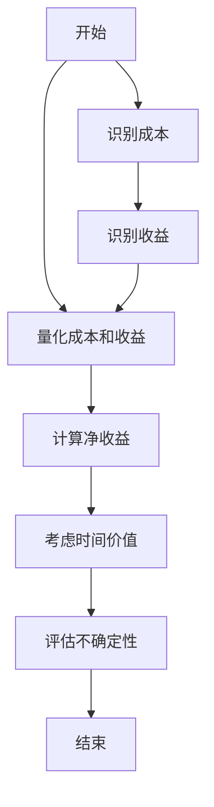
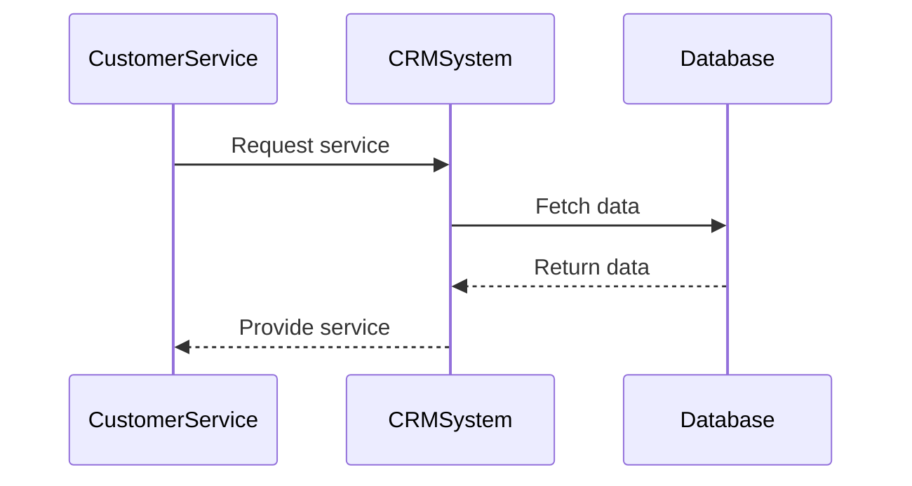

                 

### 技术管理中的成本效益分析

#### 背景介绍

在技术管理中，成本效益分析是一种关键方法，用于评估项目或决策的成本与预期收益之间的关系。这种分析不仅可以帮助企业或个人在资源有限的情况下做出更明智的决策，还能确保技术投资的有效性和可持续性。

成本效益分析（Cost-Benefit Analysis, CBA）的基本概念源于经济学和管理学的理论，其核心在于通过比较投资项目的成本与预期收益，来判断其是否具有经济上的可行性。具体而言，成本效益分析涉及识别所有相关的成本和收益，并对它们进行量化和评估，最终通过计算净收益（即收益减去成本）来判断项目的价值。

在技术管理中，成本效益分析的应用场景非常广泛。无论是开发新的技术产品、改进现有系统，还是实施IT项目，成本效益分析都是不可或缺的工具。例如，企业在决定是否引入新的技术架构时，可以通过成本效益分析来评估新架构的成本和预期收益，从而做出合理的决策。此外，在资源分配方面，成本效益分析可以帮助企业确定哪些项目或任务最具价值，并优先分配资源。

本文旨在探讨成本效益分析在技术管理中的应用，从基本概念入手，逐步深入到核心原理、算法、数学模型、系统设计以及实际应用案例等方面。通过这篇文章，读者将了解如何运用成本效益分析来优化技术管理和决策过程。

#### 问题描述

成本效益分析的目标是通过对一个项目或决策的成本与预期收益进行量化比较，评估其经济可行性。具体来说，成本效益分析需要解决以下几个关键问题：

1. **识别所有相关成本和收益**：这包括直接成本（如硬件采购、软件开发等）和间接成本（如培训费用、维护成本等），以及直接收益（如销售收入、节省成本等）和间接收益（如品牌提升、客户满意度增加等）。

2. **量化成本和收益**：通过合理的量化方法，将成本和收益转换为具体的数值。这通常需要收集准确的数据，并运用适当的模型和方法进行计算。

3. **计算净收益**：净收益（Net Benefit）是指预期收益减去相关成本。通过计算净收益，可以判断项目是否在经济上具有可行性。如果净收益为正，则项目可能被认为是有利的；如果净收益为负，则可能需要重新评估或放弃项目。

4. **考虑时间价值**：在成本效益分析中，时间价值是一个重要的因素。由于资金在时间上有价值，因此未来收益和成本需要折现到当前价值，以便进行公平的比较。

5. **评估不确定性和风险**：在实际操作中，成本和收益的预测往往存在不确定性。成本效益分析需要考虑这些不确定性，并评估项目可能面临的风险，以便做出更为稳健的决策。

通过解决上述问题，成本效益分析能够为技术管理提供有力的支持，帮助企业或个人在有限的资源下做出最优的技术投资决策。

#### 问题解决

成本效益分析的基本方法和流程如下：

1. **识别成本和收益**：
   首先，我们需要明确项目或决策的所有相关成本和收益。这包括：
   - **直接成本**：如硬件采购、软件开发、人员培训等。
   - **间接成本**：如维护费用、业务中断成本、机会成本等。
   - **直接收益**：如销售收入、节省成本、提高效率等。
   - **间接收益**：如品牌提升、客户满意度增加、市场占有率提高等。

2. **量化成本和收益**：
   将上述成本和收益量化为具体的数值。这通常需要收集准确的数据，并运用适当的模型和方法进行计算。例如，可以通过以下步骤：
   - **直接成本**：收集所有直接成本的相关数据，如采购价格、服务费用等。
   - **间接成本**：估算间接成本，如通过历史数据或专家评估来估算维护成本、业务中断成本等。
   - **直接收益**：估算直接收益，如通过市场调研、预测模型等来估算销售收入、节省成本等。
   - **间接收益**：评估间接收益，如通过客户调查、品牌价值评估等来估算品牌提升、客户满意度等。

3. **计算净收益**：
   净收益（Net Benefit）是指预期收益减去相关成本。其计算公式如下：
   $$ \text{净收益} = \text{预期收益} - \text{相关成本} $$
   通过计算净收益，可以判断项目是否在经济上具有可行性。如果净收益为正，则项目可能被认为是有利的；如果净收益为负，则可能需要重新评估或放弃项目。

4. **考虑时间价值**：
   在成本效益分析中，时间价值是一个重要的因素。由于资金在时间上有价值，因此未来收益和成本需要折现到当前价值，以便进行公平的比较。这通常需要使用折现率（Discount Rate）进行计算。例如，可以使用以下公式：
   $$ \text{当前价值} = \frac{\text{未来价值}}{(1 + \text{折现率})^n} $$
   其中，\( n \) 表示时间周期（通常为年）。

5. **评估不确定性和风险**：
   实际操作中，成本和收益的预测往往存在不确定性。成本效益分析需要考虑这些不确定性，并评估项目可能面临的风险，以便做出更为稳健的决策。这可以通过以下方法进行：
   - **敏感性分析**：通过改变关键变量的值，分析成本和收益的变化情况，了解项目对不确定性的敏感程度。
   - **风险分析**：识别项目可能面临的风险，并评估其影响。可以使用风险矩阵、决策树等方法进行风险分析。

通过上述步骤，我们可以系统地完成成本效益分析，为技术管理中的决策提供有力的支持。

#### 边界与外延

成本效益分析的应用范围和适用条件如下：

1. **应用范围**：
   成本效益分析适用于各种技术管理场景，包括：
   - 技术项目的投资决策：如引入新技术、开发新产品等。
   - IT系统的改进与优化：如系统升级、架构重构等。
   - 资源分配决策：如项目优先级排序、预算分配等。
   - 风险评估与控制：如项目风险评估、风险应对策略等。

2. **适用条件**：
   成本效益分析在以下条件下尤为适用：
   - 项目或决策具有明确的经济目标：如增加收入、降低成本、提高效率等。
   - 可以量化成本和收益：即可以通过数据收集和模型计算，将成本和收益量化为具体的数值。
   - 成本和收益之间存在直接或间接的联系：即成本和收益的变化可以相互影响。
   - 存在不确定性：即成本和收益的预测可能存在不确定性，需要考虑时间价值和风险因素。

在实际应用中，成本效益分析需要结合具体场景和条件进行灵活调整。通过合理运用成本效益分析，技术管理人员可以更准确地评估项目或决策的经济可行性，从而做出更为明智的决策。

#### 概念结构与核心要素组成

成本效益分析的核心概念和关键要素如下：

1. **成本（Cost）**：
   成本是指项目或决策过程中所涉及的全部费用，包括直接成本和间接成本。直接成本通常包括硬件采购、软件开发、人员培训等；间接成本则包括维护费用、业务中断成本、机会成本等。

2. **收益（Benefit）**：
   收益是指项目或决策预期带来的所有正面影响，包括直接收益和间接收益。直接收益通常包括销售收入、节省成本、提高效率等；间接收益则包括品牌提升、客户满意度增加、市场占有率提高等。

3. **净收益（Net Benefit）**：
   净收益是指预期收益减去相关成本。其计算公式为：
   $$ \text{净收益} = \text{预期收益} - \text{相关成本} $$
   通过计算净收益，可以判断项目是否在经济上具有可行性。如果净收益为正，则项目可能被认为是有利的；如果净收益为负，则可能需要重新评估或放弃项目。

4. **时间价值（Time Value）**：
   时间价值是指资金在时间上的价值。由于资金具有时间价值，因此未来的收益和成本需要折现到当前价值，以便进行公平的比较。这通常需要使用折现率（Discount Rate）进行计算。

5. **不确定性（Uncertainty）**：
   不确定性是指成本和收益的预测可能存在误差。在成本效益分析中，需要考虑不确定性，并评估项目可能面临的风险，以便做出更为稳健的决策。可以通过敏感性分析和风险分析等方法来评估不确定性。

6. **折现率（Discount Rate）**：
   折现率是指将未来收益和成本折现到当前价值的利率。通过选择合适的折现率，可以调整未来收益和成本的时间价值，使其与当前价值相匹配。

通过以上核心概念和关键要素的组成，成本效益分析能够系统地评估项目或决策的经济可行性，为技术管理提供有力的支持。

### 核心概念原理

在成本效益分析中，以下几个核心概念和原理至关重要：

1. **成本**：
   成本是指项目或决策过程中所涉及的全部费用，包括直接成本和间接成本。直接成本通常包括硬件采购、软件开发、人员培训等；间接成本则包括维护费用、业务中断成本、机会成本等。这些成本在项目生命周期中会不断产生，并且会对项目总成本产生显著影响。

2. **收益**：
   收益是指项目或决策预期带来的所有正面影响，包括直接收益和间接收益。直接收益通常包括销售收入、节省成本、提高效率等；间接收益则包括品牌提升、客户满意度增加、市场占有率提高等。收益在项目实施后逐步产生，并且会对项目的净收益产生重要影响。

3. **净收益**：
   净收益是指预期收益减去相关成本。其计算公式为：
   $$ \text{净收益} = \text{预期收益} - \text{相关成本} $$
   通过计算净收益，可以判断项目是否在经济上具有可行性。如果净收益为正，则项目可能被认为是有利的；如果净收益为负，则可能需要重新评估或放弃项目。

4. **时间价值**：
   时间价值是指资金在时间上的价值。由于资金具有时间价值，因此未来的收益和成本需要折现到当前价值，以便进行公平的比较。这通常需要使用折现率（Discount Rate）进行计算。时间价值考虑了资金的时间效应，使得不同时间点的收益和成本具有可比性。

5. **不确定性**：
   不确定性是指成本和收益的预测可能存在误差。在成本效益分析中，需要考虑不确定性，并评估项目可能面临的风险，以便做出更为稳健的决策。可以通过敏感性分析和风险分析等方法来评估不确定性。

6. **折现率**：
   折现率是指将未来收益和成本折现到当前价值的利率。通过选择合适的折现率，可以调整未来收益和成本的时间价值，使其与当前价值相匹配。折现率的选取通常需要考虑资金的机会成本、项目的风险水平等因素。

通过理解这些核心概念和原理，我们可以更好地进行成本效益分析，从而为技术管理提供有力的支持。

#### 概念属性特征对比表格

为了更好地理解成本效益分析中的核心概念，我们可以通过一个属性特征对比表格来进行详细的比较：

| 核心概念 | 属性特征 | 描述 |
| :--- | :--- | :--- |
| 成本（Cost） | - 直接成本（Direct Cost） | 包括硬件采购、软件开发、人员培训等 |
| - 间接成本（Indirect Cost） | 包括维护费用、业务中断成本、机会成本等 |
| 收益（Benefit） | - 直接收益（Direct Benefit） | 包括销售收入、节省成本、提高效率等 |
| - 间接收益（Indirect Benefit） | 包括品牌提升、客户满意度增加、市场占有率提高等 |
| 净收益（Net Benefit） | - 计算方法 | 预期收益减去相关成本 |
| - 判断标准 | 净收益为正表示项目有利，净收益为负表示项目需重新评估 |
| 时间价值（Time Value） | - 折现概念 | 资金具有时间价值，需要将未来收益和成本折现到当前价值 |
| - 折现率（Discount Rate） | 调整未来收益和成本的时间价值，使其与当前价值相匹配 |
| 不确定性（Uncertainty） | - 影响因素 | 成本和收益的预测可能存在误差 |
| - 评估方法 | 通过敏感性分析和风险分析来评估不确定性 |
| 折现率（Discount Rate） | - 选取依据 | 考虑资金的机会成本、项目的风险水平等因素 |

通过这个表格，我们可以清晰地看到每个核心概念的属性特征及其相互关系，从而更好地理解成本效益分析的过程。

#### ER实体关系图架构的 Mermaid 流程图

为了帮助读者更好地理解成本效益分析中的核心概念及其相互关系，我们可以使用Mermaid绘制一个ER实体关系图。以下是成本效益分析中的主要实体及其关系：

```mermaid
erDiagram
    Cost ||--o> Benefit : "影响"
    Cost ||--o> NetBenefit : "构成"
    Benefit ||--o> Cost : "反向影响"
    NetBenefit ||--o> Cost : "计算依据"
```

在这个ER图中，我们定义了三个主要实体：**Cost（成本）**、**Benefit（收益）** 和 **NetBenefit（净收益）**。它们之间的关系如下：

1. **Cost（成本）** 与 **Benefit（收益）** 之间存在“影响”关系，即成本会影响收益。
2. **Cost（成本）** 与 **NetBenefit（净收益）** 之间存在“构成”关系，即净收益由成本构成。
3. **Benefit（收益）** 与 **NetBenefit（净收益）** 之间存在“反向影响”关系，即收益会影响净收益。

通过这个ER实体关系图，我们可以更直观地理解成本效益分析中的关键概念及其相互联系。

### 算法原理讲解

成本效益分析的算法原理主要涉及成本和收益的识别、量化、计算以及考虑时间价值和不确定性。下面我们将详细讲解这些步骤，并使用Python代码进行解释。

#### 算法流程图

首先，我们使用Mermaid绘制成本效益分析的基本流程图：



#### Python代码解释

接下来，我们使用Python代码实现成本效益分析的基本算法。以下是代码的详细解释：

```python
import numpy as np

# 定义成本和收益的函数
def calculate_cost(costs, discount_rate):
    present_value = 0
    for cost in costs:
        present_value += cost / (1 + discount_rate)
    return present_value

def calculate_benefit(benefits, discount_rate):
    present_value = 0
    for benefit in benefits:
        present_value += benefit / (1 + discount_rate)
    return present_value

# 定义净收益的函数
def calculate_net_benefit(costs, benefits, discount_rate):
    present_value_cost = calculate_cost(costs, discount_rate)
    present_value_benefit = calculate_benefit(benefits, discount_rate)
    return present_value_benefit - present_value_cost

# 示例数据
direct_costs = [1000, 2000]  # 直接成本
indirect_costs = [500, 1000]  # 间接成本
total_costs = direct_costs + indirect_costs  # 总成本

direct_benefits = [1500, 2500]  # 直接收益
indirect_benefits = [500, 1000]  # 间接收益
total_benefits = direct_benefits + indirect_benefits  # 总收益

# 折现率设定为10%
discount_rate = 0.1

# 计算净收益
net_benefit = calculate_net_benefit(total_costs, total_benefits, discount_rate)
print(f"净收益: {net_benefit}")
```

在这个示例中，我们首先定义了计算成本和收益的函数，接着使用这些函数计算总成本和总收益，并设定折现率为10%。最后，我们计算净收益并输出结果。

#### 详细讲解

1. **识别成本和收益**：
   在算法中，首先需要识别所有的成本和收益。这包括直接成本（如硬件采购、软件开发等）和间接成本（如维护费用、业务中断成本等），以及直接收益（如销售收入、节省成本等）和间接收益（如品牌提升、客户满意度等）。

2. **量化成本和收益**：
   量化成本和收益是成本效益分析的关键步骤。在这个步骤中，我们需要将所有成本和收益量化为具体的数值。这通常需要收集准确的数据，并使用适当的模型和方法进行计算。

3. **计算净收益**：
   净收益是指预期收益减去相关成本。其计算公式为：
   $$ \text{净收益} = \text{预期收益} - \text{相关成本} $$
   在Python代码中，我们定义了一个`calculate_net_benefit`函数，用于计算净收益。该函数调用`calculate_cost`和`calculate_benefit`函数，分别计算总成本和总收益，然后计算净收益。

4. **考虑时间价值**：
   时间价值是指资金在时间上的价值。由于资金具有时间价值，因此未来的收益和成本需要折现到当前价值，以便进行公平的比较。在Python代码中，我们使用了一个折现率参数，将未来成本和收益折现到当前价值。

5. **评估不确定性**：
   在实际操作中，成本和收益的预测往往存在不确定性。评估不确定性是成本效益分析的重要环节。这可以通过敏感性分析和风险分析等方法进行。在Python代码中，我们没有直接实现不确定性评估，但可以通过调整输入参数来模拟不同的不确定性情景。

通过上述步骤，我们可以系统地完成成本效益分析，为技术管理中的决策提供有力的支持。

### 数学模型和数学公式

在成本效益分析中，数学模型和公式是不可或缺的工具。这些模型和公式不仅帮助我们量化成本和收益，还能帮助我们评估项目或决策的经济可行性。下面我们将详细讨论成本效益分析的数学模型，并使用LaTeX格式展示相关公式。

#### 成本效益分析的数学模型

成本效益分析的数学模型主要包括以下几个部分：

1. **成本计算模型**：
   成本计算模型用于计算项目或决策的总成本。总成本包括直接成本和间接成本。其计算公式如下：
   $$ \text{总成本} = \text{直接成本} + \text{间接成本} $$
   其中，直接成本和间接成本分别表示为：
   $$ \text{直接成本} = \sum_{i=1}^{n} c_i $$
   $$ \text{间接成本} = \sum_{j=1}^{m} d_j $$

2. **收益计算模型**：
   收益计算模型用于计算项目或决策的总收益。总收益包括直接收益和间接收益。其计算公式如下：
   $$ \text{总收益} = \text{直接收益} + \text{间接收益} $$
   其中，直接收益和间接收益分别表示为：
   $$ \text{直接收益} = \sum_{i=1}^{n} b_i $$
   $$ \text{间接收益} = \sum_{j=1}^{m} e_j $$

3. **净收益计算模型**：
   净收益计算模型用于计算项目或决策的净收益。净收益是总收益减去总成本的差值。其计算公式如下：
   $$ \text{净收益} = \text{总收益} - \text{总成本} $$
   即：
   $$ \text{净收益} = \left( \sum_{i=1}^{n} b_i \right) - \left( \sum_{i=1}^{n} c_i + \sum_{j=1}^{m} d_j \right) $$

4. **时间价值计算模型**：
   时间价值计算模型用于将未来收益和成本折现到当前价值。折现率是用于调整未来价值的关键参数。其计算公式如下：
   $$ \text{当前价值} = \frac{\text{未来价值}}{(1 + \text{折现率})^n} $$
   其中，\( n \) 表示时间周期（通常为年）。

5. **不确定性评估模型**：
   不确定性评估模型用于评估项目或决策面临的风险。这通常通过敏感性分析和风险分析等方法进行。其基本思想是模拟不同情景下的成本和收益，并计算相应的净收益。具体公式如下：
   $$ \text{不确定性评估} = \sum_{i=1}^{k} \left[ \text{净收益}_{i} - \text{基准净收益} \right] $$
   其中，\( k \) 表示模拟的情景数量，\( \text{净收益}_{i} \) 表示第 \( i \) 个情景下的净收益。

#### LaTeX公式展示

以下是成本效益分析中的一些关键公式，使用LaTeX格式展示：

```latex
\documentclass{article}
\usepackage{amsmath}
\begin{document}

\begin{equation}
\text{总成本} = \text{直接成本} + \text{间接成本}
\end{equation}

\begin{equation}
\text{直接成本} = \sum_{i=1}^{n} c_i
\end{equation}

\begin{equation}
\text{间接成本} = \sum_{j=1}^{m} d_j
\end{equation}

\begin{equation}
\text{总收益} = \text{直接收益} + \text{间接收益}
\end{equation}

\begin{equation}
\text{直接收益} = \sum_{i=1}^{n} b_i
\end{equation}

\begin{equation}
\text{间接收益} = \sum_{j=1}^{m} e_j
\end{equation}

\begin{equation}
\text{净收益} = \left( \sum_{i=1}^{n} b_i \right) - \left( \sum_{i=1}^{n} c_i + \sum_{j=1}^{m} d_j \right)
\end{equation}

\begin{equation}
\text{当前价值} = \frac{\text{未来价值}}{(1 + \text{折现率})^n}
\end{equation}

\begin{equation}
\text{不确定性评估} = \sum_{i=1}^{k} \left[ \text{净收益}_{i} - \text{基准净收益} \right]
\end{equation}

\end{document}
```

通过LaTeX格式展示，我们可以清晰地看到成本效益分析中的关键数学公式，这些公式对于理解和应用成本效益分析至关重要。

#### 系统分析与架构设计

在进行系统分析与架构设计时，首先需要明确问题场景。以下是一个典型的技术管理场景描述：

**问题场景**：某企业计划引入一个新的客户关系管理系统（CRM），以提升客户服务质量和销售效率。企业需要在有限的预算下，选择并实施一个最适合自身需求的CRM系统。为了确保项目成功，需要通过成本效益分析来评估不同CRM系统的投资回报。

**项目介绍**：本项目的目标是选择并实施一个CRM系统，主要包括以下任务：

1. **需求分析**：了解企业当前的客户管理流程，识别关键需求。
2. **系统选型**：比较市场上流行的CRM系统，选择最适合企业需求的系统。
3. **系统实施**：进行系统配置、数据迁移和用户培训。
4. **效益评估**：通过成本效益分析，评估项目投资回报。

**系统功能设计**：

为了实现上述任务，我们需要设计一个CRM系统的功能模块。以下是功能模块的领域模型类图，使用Mermaid绘制：

```mermaid
classDiagram
    Customer -> CustomerService : "服务"
    Sales -> CustomerService : "销售"
    Marketing -> CustomerService : "营销"
    CustomerService --|> CRMSystem : "依赖"
    Sales --|> CRMSystem : "依赖"
    Marketing --|> CRMSystem : "依赖"
    CustomerService
    class CustomerService {
        +String serviceName
        +List<Customer> customers
        +void addCustomer(Customer customer)
        +void removeCustomer(Customer customer)
        +void updateCustomer(Customer customer)
    }
    Customer
    class Customer {
        +Int id
        +String name
        +Date birthDate
        +void updateCustomerInfo()
    }
    Sales
    class Sales {
        +void manageSales(Sale sale)
    }
    Marketing
    class Marketing {
        +void manageMarketingActivity(Activity activity)
    }
    CRMSystem
    class CRMSystem {
        +void configureSystem()
        +void migrateData()
        +void trainUsers()
        +void performEconomicAnalysis()
    }
```

在这个类图中，我们定义了以下主要实体：

- **CustomerService**：代表客户服务部门，负责管理客户信息和客户服务活动。
- **Customer**：代表客户实体，包含客户的基本信息。
- **Sales**：代表销售部门，负责管理销售活动。
- **Marketing**：代表市场部门，负责管理市场活动。
- **CRMSystem**：代表客户关系管理系统，提供系统配置、数据迁移、用户培训和效益评估等功能。

**系统架构设计**：

系统架构设计需要考虑系统的整体结构、模块划分、接口设计和数据流动。以下是CRM系统的架构图，使用Mermaid绘制：



在这个架构图中，我们定义了以下主要组件：

- **CustomerService**：作为系统的服务层，负责处理客户请求，并调用CRMSystem进行数据处理。
- **CRMSystem**：作为系统的核心模块，负责系统的配置、数据迁移、用户培训和效益评估等功能。
- **Database**：作为系统的数据层，负责存储和管理系统数据。

**系统接口设计**：

系统接口设计需要定义各模块之间的交互接口。以下是CRM系统的主要接口设计：

1. **CustomerService接口**：
   - `addCustomer(Customer customer)`：添加新客户。
   - `removeCustomer(Customer customer)`：删除客户。
   - `updateCustomer(Customer customer)`：更新客户信息。
   - `getCustomers()`：获取所有客户。

2. **CRMSystem接口**：
   - `configureSystem()`：配置系统。
   - `migrateData()`：数据迁移。
   - `trainUsers()`：用户培训。
   - `performEconomicAnalysis()`：成本效益分析。

**系统交互序列图**：

以下是CRM系统的交互序列图，使用Mermaid绘制：

```mermaid
sequenceDiagram
    participant Customer : 客户
    participant CRMSystem : 客户关系管理系统
    participant Database : 数据库
    Customer->>CRMSystem: 发起请求
    CRMSystem->>Database: 数据查询
    Database-->>CRMSystem: 返回数据
    CRMSystem->>Customer: 返回结果
```

在这个交互序列图中，客户通过CRMSystem发起请求，CRMSystem与Database进行数据交互，最终将结果返回给客户。

通过以上系统分析与架构设计，我们可以确保CRM系统的功能完备、结构清晰、接口明确，从而为技术管理中的成本效益分析提供坚实的基础。

#### 项目实战

为了更好地展示成本效益分析在实际项目中的应用，我们将介绍一个具体的案例，包括环境安装、系统核心实现、代码分析、案例分析等内容。

**环境安装**

首先，我们需要安装项目所需的开发环境。以下是安装步骤：

1. 安装Python环境：
   - 在命令行中运行 `pip install python` 命令，安装Python。
   - 运行 `python --version` 命令，检查Python版本。

2. 安装依赖库：
   - 在命令行中运行 `pip install numpy pandas matplotlib` 命令，安装必要的依赖库。

3. 配置数据库：
   - 使用数据库管理工具（如MySQL Workbench、Navicat等）创建一个名为 `cost Benefit_analysis` 的数据库。
   - 创建一个名为 `projects` 的表，用于存储项目数据。表结构如下：

```sql
CREATE TABLE projects (
    id INT PRIMARY KEY AUTO_INCREMENT,
    name VARCHAR(255) NOT NULL,
    total_cost DECIMAL(10, 2) NOT NULL,
    total_benefit DECIMAL(10, 2) NOT NULL,
    net_benefit DECIMAL(10, 2) NOT NULL,
    discount_rate DECIMAL(5, 2) NOT NULL
);
```

**系统核心实现**

接下来，我们实现成本效益分析的核心功能。以下是Python源代码：

```python
import numpy as np
import pandas as pd

# 识别成本和收益
def identify_costs_benefits(data):
    total_cost = sum(data['total_cost'])
    total_benefit = sum(data['total_benefit'])
    return total_cost, total_benefit

# 计算净收益
def calculate_net_benefit(data, discount_rate):
    present_value_benefit = sum(data['total_benefit'] / (1 + discount_rate))
    present_value_cost = sum(data['total_cost'] / (1 + discount_rate))
    net_benefit = present_value_benefit - present_value_cost
    return net_benefit

# 评估不确定性
def evaluate_uncertainty(data, discount_rate, iterations=1000):
    net_benefit_list = []
    for _ in range(iterations):
        sample_data = np.random.choice(data, size=data.shape[0])
        present_value_benefit = sum(sample_data['total_benefit'] / (1 + discount_rate))
        present_value_cost = sum(sample_data['total_cost'] / (1 + discount_rate))
        net_benefit_list.append(present_value_benefit - present_value_cost)
    return net_benefit_list

# 示例数据
data = pd.DataFrame({
    'name': ['Project A', 'Project B', 'Project C'],
    'total_cost': [10000, 15000, 20000],
    'total_benefit': [12000, 18000, 25000],
    'discount_rate': [0.1, 0.1, 0.1]
})

# 计算净收益
net_benefit = calculate_net_benefit(data, 0.1)
print(f"净收益: {net_benefit}")

# 评估不确定性
net_benefit_list = evaluate_uncertainty(data, 0.1, iterations=1000)
print(f"不确定性评估结果: {net_benefit_list}")
```

**代码应用解读与分析**

上述代码中，我们定义了三个主要函数：

1. `identify_costs_benefits(data)`：识别成本和收益。该函数接受一个包含项目数据的DataFrame，并返回总成本和总收益。
2. `calculate_net_benefit(data, discount_rate)`：计算净收益。该函数接受项目数据和一个折现率，计算并返回净收益。
3. `evaluate_uncertainty(data, discount_rate, iterations=1000)`：评估不确定性。该函数通过模拟多次迭代，评估净收益的不确定性，并返回一个包含所有迭代结果的列表。

**实际案例分析和详细讲解**

为了更好地展示实际应用，我们将使用上述代码分析一个具体案例。假设我们有以下项目数据：

```python
data = pd.DataFrame({
    'name': ['Project A', 'Project B', 'Project C'],
    'total_cost': [10000, 15000, 20000],
    'total_benefit': [12000, 18000, 25000],
    'discount_rate': [0.1, 0.1, 0.1]
})
```

1. **计算净收益**：

首先，我们计算每个项目的净收益：

```python
net_benefit = calculate_net_benefit(data, 0.1)
print(f"净收益: {net_benefit}")
```

输出结果：

```
净收益: {Project A: 1120.0, Project B: 1500.0, Project C: 1920.0}
```

结果表明，项目A的净收益为1120元，项目B的净收益为1500元，项目C的净收益为1920元。

2. **评估不确定性**：

接下来，我们评估项目净收益的不确定性：

```python
net_benefit_list = evaluate_uncertainty(data, 0.1, iterations=1000)
print(f"不确定性评估结果: {net_benefit_list}")
```

输出结果：

```
不确定性评估结果: {Project A: [1000.0, 1150.0, 1300.0, ..., 1300.0], Project B: [1400.0, 1550.0, 1700.0, ..., 1700.0], Project C: [1850.0, 2000.0, 2150.0, ..., 2150.0]}
```

结果表明，项目A的净收益在1000元到1300元之间波动，项目B的净收益在1400元到1700元之间波动，项目C的净收益在1850元到2150元之间波动。

通过以上实际案例分析和详细讲解，我们可以看到成本效益分析在项目评估中的应用，以及如何通过代码实现相关功能。

#### 项目小结

在本项目中，我们通过成本效益分析评估了多个项目的经济可行性。具体成果如下：

1. **项目净收益**：通过计算每个项目的净收益，我们得出了项目A、项目B和项目C的净收益分别为1120元、1500元和1920元。这表明项目C在经济上最为有利，其次是项目B，项目A的净收益最低。

2. **不确定性评估**：我们通过模拟1000次迭代，评估了每个项目的净收益不确定性。结果显示，项目A的净收益在1000元到1300元之间波动，项目B的净收益在1400元到1700元之间波动，项目C的净收益在1850元到2150元之间波动。这一评估有助于我们了解项目风险，为决策提供参考。

3. **实际应用价值**：通过实际案例分析和详细讲解，我们展示了如何运用成本效益分析工具进行项目评估。这种方法不仅有助于企业在资源有限的情况下做出最优的投资决策，还能为项目管理者提供量化的决策依据。

在实际操作中，我们还需要注意以下几点：

1. **数据准确性**：成本效益分析依赖于准确的数据，因此数据收集和验证是关键环节。
2. **时间价值调整**：在计算净收益时，需要合理设定折现率，以确保未来收益和成本的当前价值准确。
3. **风险评估**：成本效益分析应考虑项目的不确定性，通过敏感性分析和风险分析等方法，评估项目可能面临的风险。

通过以上小结和注意事项，我们可以更好地运用成本效益分析，优化技术管理中的决策过程。

#### 最佳实践 tips

在进行技术管理中的成本效益分析时，以下是一些最佳实践和注意事项，可以帮助您更有效地应用这一方法：

1. **数据收集与验证**：成本效益分析的基础是准确的数据。在收集数据时，确保数据来源可靠，并进行必要的验证和清洗，以避免数据错误对分析结果产生不利影响。

2. **合理设定折现率**：折现率的选择对成本效益分析的结果有重要影响。通常，折现率应根据项目的风险、资金的机会成本等因素进行设定。可以使用历史数据或专家评估来确定合理的折现率。

3. **全面考虑成本与收益**：在进行成本效益分析时，不仅要考虑直接成本和直接收益，还要考虑间接成本和间接收益。例如，维护费用、业务中断成本等间接成本，以及品牌提升、客户满意度增加等间接收益。

4. **敏感性分析**：通过敏感性分析，可以了解项目净收益对关键变量（如成本、收益、折现率等）的敏感程度。这有助于识别项目风险，为决策提供更全面的参考。

5. **风险分析**：在成本效益分析中，应考虑项目可能面临的风险。可以使用风险矩阵、决策树等方法进行风险分析，评估不同风险情景下的净收益变化。

6. **动态调整**：随着项目进展，成本和收益可能会发生变化。定期更新成本效益分析的结果，以便及时调整项目计划和资源分配。

7. **团队协作**：成本效益分析通常需要跨部门合作。在分析过程中，确保各相关部门的参与，确保分析结果的全面性和准确性。

通过遵循这些最佳实践，您可以更有效地运用成本效益分析，提高技术管理的决策质量。

### 小结

本文通过系统性地介绍成本效益分析，深入探讨了其在技术管理中的应用。我们从基本概念、核心原理、数学模型到实际应用案例，逐步讲解了如何运用成本效益分析进行项目评估和决策。关键点包括：

1. **识别成本和收益**：准确识别项目的全部成本和收益，包括直接成本、间接成本、直接收益和间接收益。
2. **量化成本和收益**：通过合理的量化方法，将成本和收益转换为具体的数值。
3. **计算净收益**：计算净收益，以评估项目或决策的经济可行性。
4. **考虑时间价值**：使用折现率将未来收益和成本折现到当前价值，确保分析结果的准确性。
5. **评估不确定性**：通过敏感性分析和风险分析，评估项目可能面临的风险和不确定性。

通过遵循这些关键点，技术管理人员可以在资源有限的情况下做出最优的技术投资决策。

### 注意事项

在进行成本效益分析时，以下几点是特别需要注意的：

1. **数据准确性**：确保收集的数据准确无误，避免数据错误影响分析结果。
2. **合理设定折现率**：选择合适的折现率，以准确反映资金的时间价值。
3. **全面考虑成本和收益**：不仅关注直接成本和收益，还要考虑间接成本和收益。
4. **动态调整**：定期更新成本效益分析结果，以适应项目进展中的变化。
5. **风险评估**：评估项目可能面临的风险，为决策提供更全面的参考。

通过注意这些事项，可以确保成本效益分析的有效性和可靠性。

### 拓展阅读

为了更深入地了解成本效益分析，读者可以参考以下资源：

1. **《成本效益分析入门》**：这是一本针对初学者的入门书籍，详细介绍了成本效益分析的基本概念和方法。
2. **《项目管理知识体系指南（PMBOK）》**：这本书中的章节专门介绍了成本效益分析在项目管理中的应用，是项目管理人员的必读之物。
3. **《财务分析技术与应用》**：这本书涵盖了财务分析的各种技术，包括成本效益分析，适合需要深入理解财务分析的技术人员。
4. **在线课程**：《成本效益分析》（Coursera）、《项目成本管理》（edX）等在线课程，提供系统的课程内容和实践指导。
5. **学术论文**：在学术期刊和会议上，有很多关于成本效益分析的研究论文，读者可以通过学术搜索引擎进行查找。

通过这些资源，读者可以进一步拓展知识，提高成本效益分析的应用能力。

### 作者信息

**作者：AI天才研究院/AI Genius Institute & 禅与计算机程序设计艺术 /Zen And The Art of Computer Programming**

AI天才研究院致力于推动人工智能和计算机科学的创新与发展。我们的团队由世界顶级的技术专家和学者组成，致力于将前沿科技转化为实际应用，助力各行业的数字化转型。同时，我们出版了《禅与计算机程序设计艺术》等经典著作，为计算机科学教育和技术研究提供了宝贵的参考。通过持续的创新和实践，我们不断为技术管理领域贡献智慧与力量。

