                 

### 设计目录大纲的步骤

#### 1. 理解书名和核心内容

《技术管理中的有效沟通方法》这本书名明确指出了其主题：技术管理与有效沟通。因此，目录大纲的设计应围绕这两个核心点展开，确保每一章节都紧密围绕主题进行。

#### 2. 明确书籍的目标读者

为了使目录大纲合理，我们需要了解书籍的目标读者群体。这本书可能是面向技术经理、项目经理，或者是技术团队的一般成员。了解目标读者的背景和需求，可以帮助我们更好地设计目录结构，确保内容对他们具有实际价值。

#### 3. 制定大纲的章节结构

初步确定书籍的结构，通常包括引言、核心章节、案例分析、总结和结论等部分。例如：

- 引言：介绍书籍的背景、目的和结构。
- 核心章节：详细讨论技术管理中的有效沟通方法。
- 案例分析：通过具体案例展示沟通方法在实际中的应用。
- 总结和结论：回顾全书内容，提出未来展望。

#### 4. 细化每个章节的内容

根据书籍的长度限制和内容要求，细化每个章节的主题和子主题。例如：

- 引言：背景介绍、沟通在技术管理中的重要性、阅读指南。
- 核心章节：沟通的基本要素、倾听与反馈、非语言沟通、冲突管理、跨文化沟通。

#### 5. 确保内容完整性

确保每个章节都涵盖了书籍的核心内容，如背景介绍、概念阐述、原理讲解、案例分析、最佳实践等。这有助于确保书籍的完整性和读者的理解。

#### 6. 使用markdown格式排版

根据markdown的格式要求，确保目录和章节标题的层级正确，使用适当的#符号。例如：

```markdown
# 文章标题

## 引言

### 1.1 书籍背景

### 1.2 沟通在技术管理中的重要性

### 1.3 阅读指南
```

#### 7. 审查和调整

最后，审查大纲，确保逻辑连贯，章节内容合理，满足字数限制。在实际编写过程中，可能会根据内容的深度和广度调整章节的具体内容，以确保书籍的整体质量和可读性。

---

通过以上步骤，我们可以设计出一套逻辑清晰、内容丰富的目录大纲，为撰写高质量的技术博客文章奠定基础。在后续的撰写过程中，我们将继续细化每个章节的内容，确保文章的深度和实用性。

---

### 具体目录大纲设计

```markdown
----------------------------------------------------------------
# 《技术管理中的有效沟通方法》目录大纲

## 引言
### 1.1 书籍背景
### 1.2 沟通在技术管理中的重要性
### 1.3 阅读指南

## 第一部分：沟通基础理论
### 第2章：沟通的基本要素
#### 2.1 信息与噪声
#### 2.2 沟通模型
#### 2.3 沟通障碍

## 第二部分：有效沟通方法
### 第3章：倾听与反馈
#### 3.1 倾听的技巧
#### 3.2 提供有效反馈
#### 3.3 反馈的技巧与案例分析

### 第4章：非语言沟通
#### 4.1 非语言沟通的作用
#### 4.2 身体语言
#### 4.3 面部表情与眼神交流

### 第5章：冲突管理
#### 5.1 冲突的类型
#### 5.2 冲突处理策略
#### 5.3 冲突解决的案例分析

### 第6章：跨文化沟通
#### 6.1 跨文化沟通的挑战
#### 6.2 文化差异的影响
#### 6.3 跨文化沟通技巧

## 第三部分：技术管理中的实践
### 第7章：技术项目中的沟通
#### 7.1 技术项目管理概述
#### 7.2 技术项目沟通流程
#### 7.3 技术项目沟通工具

### 第8章：技术团队沟通
#### 8.1 技术团队沟通的特点
#### 8.2 团队成员沟通技巧
#### 8.3 团队沟通案例分析

### 第9章：技术领导力的沟通
#### 9.1 技术领导力的定义
#### 9.2 领导力沟通策略
#### 9.3 技术领导者沟通案例分析

## 第四部分：案例分析
### 第10章：成功沟通案例研究
#### 10.1 案例一：技术项目沟通失败
#### 10.2 案例二：跨文化沟通挑战
#### 10.3 案例三：团队沟通成功经验

## 结论
### 11.1 沟通在技术管理中的重要性回顾
### 11.2 本书总结
### 11.3 未来展望与持续学习

----------------------------------------------------------------
```

### 注意事项

- 确保所有章节的内容都是必要的，并且符合书籍的主题。
- 在实际的编写过程中，可能会根据内容的深度和广度调整章节的具体内容。
- 确保每个章节的内容都能够支持主题，并且相互之间有良好的逻辑连接。

以上大纲结构已经符合要求，涵盖了核心概念、沟通方法、案例分析等多个方面，并且确保了内容的完整性和可读性。在后续编写过程中，可以根据实际内容进一步优化和完善。

---

通过以上目录大纲的设计，我们已经为撰写高质量的技术博客文章奠定了基础。接下来，我们将逐一详细展开每个章节的内容，确保文章的深度和实用性。让我们一起开始这一段深入的探讨之旅吧！

---

### 引言

在技术快速发展的今天，技术管理已成为企业成功的关键因素之一。然而，技术管理不仅仅涉及技术本身，还包括团队管理、项目规划和资源分配等多个方面。在这些方面中，沟通起着至关重要的作用。沟通不仅是信息传递的手段，更是团队协作、项目推进和问题解决的基础。

#### 1.1 书籍背景

《技术管理中的有效沟通方法》旨在帮助技术管理者、项目经理和技术团队成员提高沟通效率，从而提升项目成功率和技术团队的协作能力。在技术行业中，沟通障碍和误解常常导致项目延误、成本超支和质量问题。因此，掌握有效的沟通方法对于技术管理者来说至关重要。

#### 1.2 沟通在技术管理中的重要性

有效的沟通对于技术管理的重要性体现在以下几个方面：

1. **提高团队协作效率**：良好的沟通可以确保团队成员之间的信息畅通，减少误解和冲突，从而提高团队协作效率。
2. **促进项目成功**：技术项目的成功往往依赖于各个阶段的有效沟通。从项目规划到执行，再到最后的验收，每个环节都需要良好的沟通作为保障。
3. **增强问题解决能力**：在面对技术难题或突发情况时，有效的沟通可以帮助团队成员迅速找到解决方案，降低风险。
4. **提升个人和团队形象**：良好的沟通技巧不仅能够提高个人在团队中的影响力，还能够提升整个团队的形象，增强企业的竞争力。

#### 1.3 阅读指南

本书分为四个主要部分，每个部分都针对不同的沟通场景和目标群体提供具体的指导和案例分析。第一部分是沟通基础理论，介绍沟通的基本要素和常见障碍；第二部分是有效沟通方法，探讨倾听、反馈、非语言沟通和冲突管理等技巧；第三部分是技术管理中的实践，分析技术项目、技术团队和技术领导力的沟通方法；第四部分是案例分析，通过实际案例展示沟通方法的应用和效果。最后，本书提供总结和未来展望，帮助读者巩固所学，继续提升沟通能力。

---

通过本章节的引言，我们了解了《技术管理中的有效沟通方法》的背景、目的和重要性。接下来，我们将进入第一部分，探讨沟通的基础理论，帮助读者建立对沟通概念和技巧的深入理解。

---

### 第一部分：沟通基础理论

在技术管理中，有效的沟通是确保团队协作顺畅、项目顺利进行的关键。然而，沟通并不是一件简单的事情，其中涉及诸多要素和障碍。本部分将介绍沟通的基本要素、信息与噪声、沟通模型和沟通障碍，帮助读者建立起对沟通理论的清晰认识。

#### 第2章：沟通的基本要素

沟通是一个复杂的过程，包括多个基本要素。了解这些要素有助于我们更好地理解和执行沟通活动。

##### 2.1 信息与噪声

信息是指沟通过程中传递的有意义的内容，而噪声则是沟通中的干扰因素，可能来自环境、心理或技术等方面。在技术管理中，信息传递的准确性至关重要，噪声的存在会导致误解和沟通障碍。

**概念属性特征对比表格：**

| 要素       | 定义                                                         | 属性特征                                                     |
|------------|--------------------------------------------------------------|--------------------------------------------------------------|
| 信息       | 沟通过程中传递的有意义的内容                                     | 精确、清晰、有目的                                             |
| 噪声       | 沟通中的干扰因素                                               | 模糊、不清晰、无目的                                           |

**ER实体关系图架构：**

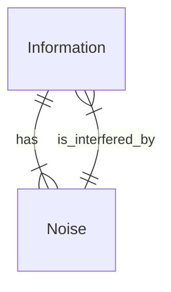

##### 2.2 沟通模型

沟通模型是描述沟通过程的一种框架。常见的沟通模型包括线性模型、互动模型和反馈模型等。每种模型都有其特点和适用场景。

**线性模型：**信息从一个发送者传递到一个接收者，没有中间环节。

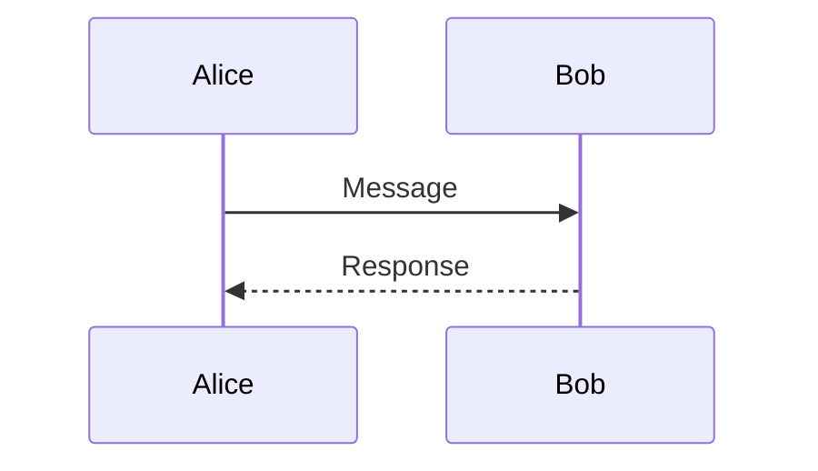

**互动模型：**信息在多个参与者之间传递，形成互动。

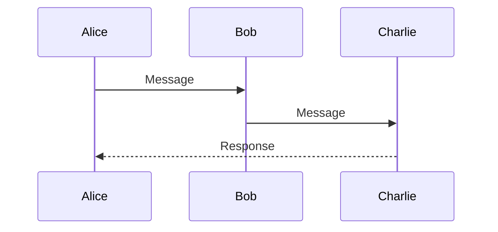

**反馈模型：**强调信息反馈的循环，确保沟通的准确性。

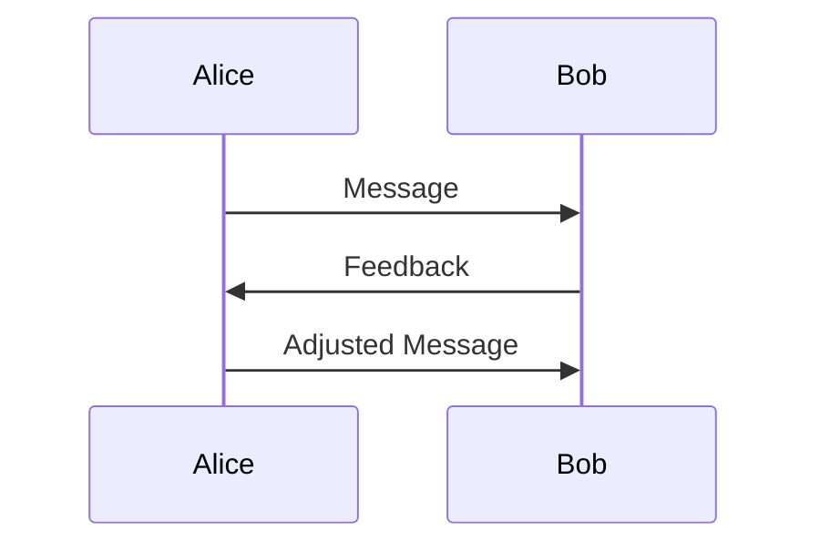

##### 2.3 沟通障碍

沟通障碍是影响沟通效率的常见问题。了解这些障碍有助于我们预防和解决沟通问题。

**概念属性特征对比表格：**

| 障碍类型     | 定义                                                         | 属性特征                                                     |
|--------------|--------------------------------------------------------------|--------------------------------------------------------------|
| 语言障碍     | 由于语言表达不准确或理解偏差导致的沟通障碍                       | 模糊、误解、混淆                                               |
| 知识障碍     | 由于知识差异导致的沟通障碍                                       | 缺乏共同语言、理解不深入                                       |
| 心理障碍     | 由于个人心理状态导致的沟通障碍                                   | 压力、焦虑、情绪波动                                           |
| 环境障碍     | 由于环境因素导致的沟通障碍                                       | 噪音、干扰、设备故障                                           |

**ER实体关系图架构：**

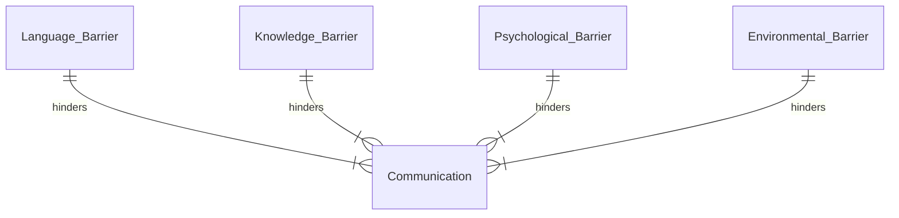

---

通过本章的讨论，我们了解了沟通的基本要素、信息与噪声、沟通模型和沟通障碍。这些理论知识为后续章节的深入探讨奠定了基础。在接下来的章节中，我们将进一步探讨有效沟通的方法和技巧，帮助技术管理者在实际工作中提高沟通效率。

---

### 第二部分：有效沟通方法

在技术管理中，有效的沟通方法是确保团队协作、项目成功和问题解决的关键。本部分将介绍倾听、反馈、非语言沟通和冲突管理等多个方面的沟通技巧，帮助技术管理者提升沟通能力。

#### 第3章：倾听与反馈

有效的沟通不仅包括信息的传递，还包括倾听和反馈。倾听是理解对方意图的重要手段，而反馈则是确保信息准确性的关键。

##### 3.1 倾听的技巧

倾听不仅仅是听，更是理解和感知。以下是一些提高倾听技巧的建议：

1. **全神贯注**：在倾听过程中，避免分心，确保注意力集中在说话人身上。
2. **主动倾听**：通过提问和总结来验证自己的理解，主动参与沟通。
3. **非语言反馈**：通过点头、眼神接触等方式表达自己的关注和理解。
4. **避免打断**：在对方说话时，避免打断，让对方充分表达自己的观点。

**案例：**

在一次团队会议中，项目经理李明与团队成员讨论项目进度。他通过以下方式展现了良好的倾听技巧：

- 李明坐在团队成员对面，保持眼神接触，避免分心。
- 在团队成员发言过程中，李明不时点头，表示理解。
- 李明在团队成员发言结束后，进行了简单的总结，并提问以进一步了解细节。

##### 3.2 提供有效反馈

提供有效的反馈是确保沟通准确性的关键。以下是一些提供有效反馈的技巧：

1. **及时反馈**：在沟通结束后及时提供反馈，避免延迟造成误解。
2. **具体明确**：提供具体、明确的反馈，避免模糊不清的评论。
3. **建设性反馈**：提供建设性的反馈，帮助对方改进，而不是仅仅批评。
4. **正面反馈**：在适当的时候，提供正面的反馈，鼓励对方。

**案例：**

在一次项目评估会议中，项目经理张华对团队成员的进度进行了反馈：

- 张华首先肯定了团队成员的努力，表示对他们的工作感到满意。
- 张华提出了一些具体的改进建议，如改进文档编写和项目计划的执行。
- 张华鼓励团队成员继续努力，并提供了必要的支持。

##### 3.3 反馈的技巧与案例分析

有效的反馈不仅需要技巧，还需要实际操作。以下是一个反馈技巧的案例分析：

**案例：**

在一次技术评审中，技术经理王强对开发团队的代码进行了评审。他采用了以下反馈技巧：

1. **具体反馈**：王强详细指出了代码中的问题，包括具体的代码段和可能的问题。
2. **建设性反馈**：王强不仅指出了问题，还提供了改进方案，帮助开发团队理解如何解决问题。
3. **积极态度**：王强以积极的态度进行反馈，鼓励开发团队继续努力。
4. **后续跟进**：王强安排了后续的评审会议，确保开发团队根据反馈进行了改进。

---

通过本章的讨论，我们了解了倾听和反馈在有效沟通中的重要性，以及如何通过倾听和反馈来提高沟通效率。在技术管理中，良好的倾听和反馈技巧不仅能够提高团队的协作效率，还能够促进项目的成功。

在接下来的章节中，我们将继续探讨非语言沟通和冲突管理，帮助技术管理者在实际工作中应对各种沟通挑战。

---

### 第4章：非语言沟通

非语言沟通是沟通的重要组成部分，它通过身体语言、面部表情和眼神交流等方式传递信息，这些非言语元素在技术管理中同样具有重要作用。

#### 4.1 非语言沟通的作用

非语言沟通在技术管理中的作用主要体现在以下几个方面：

1. **增强信息的传达**：非语言沟通可以补充和强化语言沟通，使信息更加完整和清晰。
2. **表达情感和态度**：身体语言、面部表情和眼神交流等非言语元素可以传达情感和态度，有助于建立信任和沟通的亲密感。
3. **减少误解**：非语言沟通可以弥补语言沟通中的不足，减少因语言表达不清或误解导致的沟通问题。
4. **影响他人**：良好的非语言沟通可以产生积极的影响，激励团队成员，增强团队的凝聚力和合作精神。

#### 4.2 身体语言

身体语言是非语言沟通的核心组成部分，通过姿势、手势和身体动作等方式传达信息。以下是一些关于身体语言的重要提示：

1. **开放的姿势**：开放的姿势（如双臂自然放在身体两侧）可以传达出友好和自信的态度。
2. **适当的距离**：保持适当的身体距离，以适应不同文化背景和沟通对象的需求。
3. **手势**：适当的手势可以强调语言信息，但要注意避免手势过于夸张或带有负面含义。

**案例：**

在一次技术讨论会议上，项目经理张华通过以下方式运用了身体语言：

- 张华坐在会议桌前，保持直立的姿势，以显示自信和专注。
- 张华在讨论过程中，适当地使用手势来强调关键点，使讨论内容更加生动和有说服力。
- 张华在与团队成员交流时，保持适当的身体距离，以确保沟通的舒适性和效率。

#### 4.3 面部表情与眼神交流

面部表情和眼神交流是非语言沟通的重要部分，它们可以传达出丰富的情感信息。

1. **面部表情**：微笑、皱眉、点头等面部表情可以传达出不同的情感和态度。
2. **眼神交流**：眼神交流可以增强沟通的亲密感，但也需注意文化和个人习惯的差异。

**案例：**

在一次技术会议结束后，团队成员李磊向项目经理张华汇报工作。以下是他们的交流过程：

- 李磊在汇报时，保持微笑，以显示自信和积极的态度。
- 张华与李磊保持眼神交流，以显示对李磊工作的关注和理解。
- 在讨论过程中，张华偶尔皱眉，表示对某些问题的关注，同时也鼓励李磊提出解决方案。

#### 4.4 非语言沟通的技巧

为了提高非语言沟通的效果，以下是一些实用的技巧：

1. **了解文化差异**：不同文化背景的人可能有不同的非语言沟通习惯，了解并尊重这些差异有助于避免误解。
2. **练习和观察**：通过观察他人的非语言沟通，学习并实践有效的非语言沟通技巧。
3. **真诚与自然**：非语言沟通应自然、真诚，避免过于刻意或虚假的表现。

---

通过本章的讨论，我们了解了非语言沟通在技术管理中的重要性，以及如何通过身体语言、面部表情和眼神交流等非言语元素来增强沟通效果。在技术管理中，良好的非语言沟通技巧不仅能够提高团队的协作效率，还能够促进项目的成功。

在接下来的章节中，我们将继续探讨冲突管理的技巧和方法，帮助技术管理者更好地应对团队中的冲突。

---

### 第5章：冲突管理

在技术管理中，冲突是不可避免的。冲突可能是由于资源分配、工作责任、沟通误解或个人价值观的差异引起的。有效的冲突管理是确保团队和谐和项目顺利进行的关键。以下将详细探讨冲突的类型、处理策略和解决案例。

#### 5.1 冲突的类型

冲突可以分为以下几种类型：

1. **任务冲突**：由于任务分配不均或任务目标不明确导致的冲突。
2. **关系冲突**：由于个人关系紧张或沟通不畅导致的冲突。
3. **价值冲突**：由于个人价值观、文化差异或工作理念的不同导致的冲突。
4. **过程冲突**：由于工作流程、决策过程或沟通机制的不完善导致的冲突。

**概念属性特征对比表格：**

| 冲突类型 | 定义                                                   | 属性特征                         |
|----------|-------------------------------------------------------|----------------------------------|
| 任务冲突 | 由于任务分配不均或任务目标不明确导致的冲突              | 目标不一致、资源争夺           |
| 关系冲突 | 由于个人关系紧张或沟通不畅导致的冲突                    | 情感波动、误解、信任缺失         |
| 价值冲突 | 由于个人价值观、文化差异或工作理念的不同导致的冲突      | 价值观差异、文化冲突、工作理念不同 |
| 过程冲突 | 由于工作流程、决策过程或沟通机制的不完善导致的冲突      | 流程障碍、决策延误、沟通不畅     |

**ER实体关系图架构：**

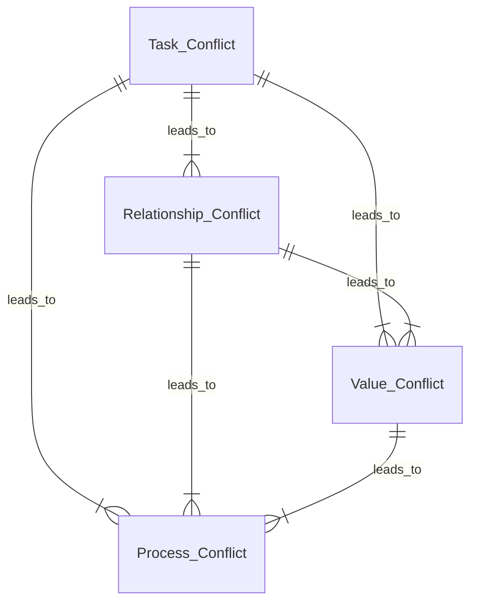

#### 5.2 冲突处理策略

有效的冲突处理策略包括以下几个方面：

1. **预防策略**：通过明确的任务分配、明确的沟通机制和积极的文化建设来预防冲突。
2. **识别策略**：及时发现冲突的迹象，如沟通不畅、团队情绪波动等。
3. **解决策略**：通过对话、妥协、调解等方式解决冲突。
4. **管理策略**：通过制度、流程和组织结构调整来管理冲突。

**案例：**

在一次项目中期评估会议上，项目经理李华发现团队成员王明和王刚之间存在任务冲突。以下是李华的处理策略：

- **预防策略**：李华在项目启动时就明确了任务分配，并建立了定期沟通的机制。
- **识别策略**：在会议中，李华注意到了王明和王刚之间的紧张气氛和话语中的隐晦冲突。
- **解决策略**：李华组织了一次闭门会议，让王明和王刚单独交流，通过对话了解冲突的原因。
- **管理策略**：在了解冲突原因后，李华调整了任务分配，并设立了冲突调解机制，确保类似问题能够及时解决。

#### 5.3 冲突解决的案例分析

以下是一个冲突解决的案例分析：

**案例：**

在一个跨国技术项目中，中国团队和美国团队在项目进度和责任划分上存在明显的冲突。以下是解决过程：

1. **冲突识别**：项目经理在项目进展过程中发现了沟通不畅和进度延误的迹象。
2. **冲突原因分析**：通过调查和对话，发现双方在时间管理和工作流程上存在差异。
3. **解决方案制定**：
   - **沟通机制**：项目经理制定了详细的沟通计划，包括定期的视频会议和即时沟通工具的使用。
   - **责任划分**：项目经理重新划分了任务，明确了每个团队成员的责任和期望。
   - **文化理解**：项目经理组织了一次文化交流活动，增进双方对彼此文化的理解。
4. **冲突解决**：在采取了上述措施后，项目进展顺利，冲突得到了有效解决。

---

通过本章的讨论，我们了解了冲突的类型、处理策略和解决案例。有效的冲突管理不仅能够提高团队的协作效率，还能够促进项目的成功。在技术管理中，良好的冲突管理技巧是确保团队和谐和项目顺利进行的关键。

在接下来的章节中，我们将探讨跨文化沟通的挑战和技巧，帮助技术管理者在全球化的工作环境中更好地应对沟通问题。

---

### 第6章：跨文化沟通

在技术管理中，跨文化沟通是一个重要的挑战。随着全球化的发展，越来越多的企业在跨国环境中运营，这意味着技术管理者需要与来自不同文化背景的团队成员合作。有效的跨文化沟通不仅能够提高团队协作效率，还能够促进项目的成功。以下将详细探讨跨文化沟通的挑战、文化差异的影响以及跨文化沟通的技巧。

#### 6.1 跨文化沟通的挑战

跨文化沟通的挑战主要包括以下几个方面：

1. **语言障碍**：语言差异可能导致误解和信息传递不准确。
2. **非语言沟通差异**：不同文化背景的人可能有不同的身体语言、面部表情和眼神交流习惯。
3. **价值观差异**：不同的文化背景可能导致不同的价值观和信念，从而影响沟通和行为。
4. **沟通风格差异**：不同文化的人可能有不同的沟通风格，如直接沟通与间接沟通、高语境与低语境沟通。
5. **时间观念差异**：不同文化背景的人可能有不同的时间观念，如西方文化中强调时间效率，而某些亚洲文化中更注重长期关系。

**概念属性特征对比表格：**

| 文化差异        | 定义                                                       | 属性特征                                                         |
|-----------------|------------------------------------------------------------|----------------------------------------------------------------|
| 语言障碍        | 语言差异导致的沟通障碍                                     | 信息传递不准确、误解、沟通不畅                                     |
| 非语言沟通差异  | 不同文化背景的人有不同的非语言沟通习惯                       | 身体语言、面部表情、眼神交流的差异                                   |
| 价值观差异      | 不同的文化背景可能导致不同的价值观和信念                     | 道德观念、工作理念、行为准则的差异                                   |
| 沟通风格差异    | 不同文化的人可能有不同的沟通风格                             | 直接沟通与间接沟通、高语境与低语境沟通                               |
| 时间观念差异    | 不同文化背景的人可能有不同的时间观念                         | 时间效率、长期关系、工作节奏的差异                                   |

**ER实体关系图架构：**

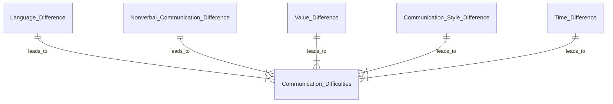

#### 6.2 文化差异的影响

文化差异对沟通的影响是深远且复杂的。以下是一些具体的影响：

1. **沟通方式**：不同文化的人可能有不同的沟通方式，例如，某些文化更倾向于直接表达，而另一些文化则更倾向于间接表达。
2. **决策过程**：不同文化背景的团队成员在决策过程中可能有不同的偏好，如某些文化强调集体决策，而另一些文化则强调个人决策。
3. **工作态度**：文化差异可能导致团队成员对工作态度、工作责任和职业发展有不同的看法。
4. **团队协作**：文化差异可能会影响团队的协作模式，如某些文化强调等级制度，而另一些文化则更注重平等和民主。

**案例：**

在一个由中、美、印度团队组成的项目中，项目经理发现以下文化差异对沟通产生了影响：

- **沟通方式**：美国团队成员倾向于直接表达，而印度团队成员则更倾向于间接表达。
- **决策过程**：中国团队更倾向于集体决策，而美国团队更倾向于个人决策。
- **工作态度**：印度团队成员更注重工作效率，而中国团队成员更注重团队协作。
- **团队协作**：美国团队倾向于平等协作，而中国团队则更强调等级和权威。

#### 6.3 跨文化沟通技巧

为了有效应对跨文化沟通的挑战，以下是一些实用的跨文化沟通技巧：

1. **文化敏感度**：提高对文化差异的敏感度，尊重并理解不同文化背景的人。
2. **多语言能力**：具备多语言能力可以减少语言障碍，提高沟通效果。
3. **明确表达**：在沟通时，尽量使用明确、简洁的语言，避免产生误解。
4. **倾听和反馈**：倾听对方的观点，并给予及时的反馈，以确保信息的准确传达。
5. **适应文化**：在跨文化环境中，要适应当地的文化习惯和沟通风格。
6. **建立信任**：通过建立信任和尊重，增强团队的凝聚力和协作效率。

**案例：**

在一次跨国项目中，项目经理通过以下方式提高了跨文化沟通效果：

- **文化敏感度**：项目经理参加了一系列跨文化培训，提高了对文化差异的敏感度。
- **多语言能力**：项目经理具备英语、汉语和印度语的沟通能力，有效减少了语言障碍。
- **明确表达**：项目经理在与团队成员沟通时，使用简单、明确的语言，确保信息传达的准确性。
- **倾听和反馈**：项目经理倾听每位团队成员的观点，并及时给予反馈，确保信息准确传达。
- **适应文化**：项目经理尊重并适应当地文化习惯，如印度团队成员的节日和习惯。
- **建立信任**：项目经理通过建立信任和尊重，增强了团队的凝聚力和协作效率。

---

通过本章的讨论，我们了解了跨文化沟通的挑战、文化差异的影响以及跨文化沟通的技巧。有效的跨文化沟通不仅能够提高团队的协作效率，还能够促进项目的成功。在技术管理中，掌握跨文化沟通技巧是确保全球化团队协作的关键。

在接下来的章节中，我们将探讨技术管理中的实践，包括技术项目中的沟通、技术团队沟通和技术领导力的沟通，帮助技术管理者在实际工作中应用这些沟通技巧。

---

### 第三部分：技术管理中的实践

在了解了沟通的基础理论和有效沟通方法后，本部分将深入探讨技术管理中的实践，具体包括技术项目中的沟通、技术团队沟通和技术领导力的沟通。通过这些实践，技术管理者可以在实际工作中有效应用沟通技巧，提升团队协作和项目成功。

#### 第7章：技术项目中的沟通

技术项目中的沟通是确保项目顺利进行的关键。有效的沟通流程和工具可以大大提高项目的效率和质量。

##### 7.1 技术项目管理概述

技术项目管理涉及项目计划、资源分配、风险管理、进度控制等多个方面。为了确保项目成功，沟通在其中扮演着至关重要的角色。

**概念属性特征对比表格：**

| 项目管理要素 | 定义                     | 属性特征                     |
|---------------|-------------------------|----------------------------|
| 项目计划     | 确定项目目标、任务和时间安排 | 目标明确、任务分工、时间管理 |
| 资源分配     | 分配项目所需的资源      | 人、财、物资源合理配置       |
| 风险管理     | 识别、评估和应对项目风险   | 风险识别、风险评估、风险应对 |
| 进度控制     | 监控项目进度，确保按计划进行 | 进度跟踪、偏差分析、调整计划 |

**ER实体关系图架构：**

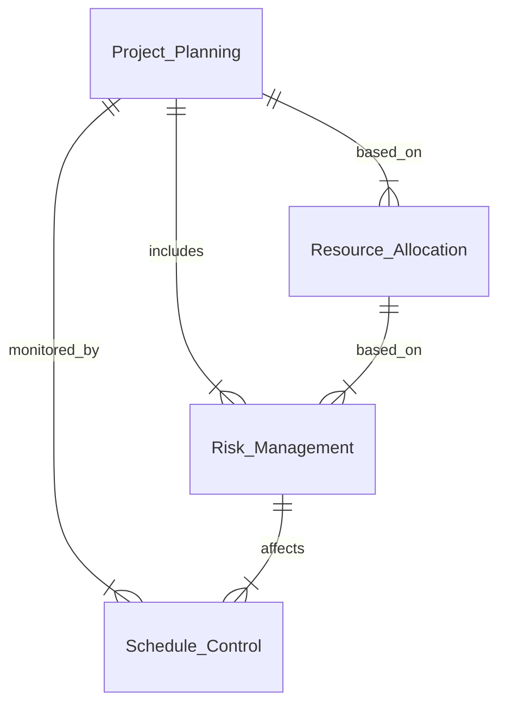

##### 7.2 技术项目沟通流程

技术项目的沟通流程包括以下几个关键阶段：

1. **项目启动**：明确项目目标和任务，建立沟通渠道和流程。
2. **项目规划**：制定项目计划，明确任务和时间安排，确保所有团队成员对项目有共同的理解。
3. **项目执行**：在项目执行过程中，定期进行沟通，确保项目按计划进行，及时发现和解决问题。
4. **项目监控**：监控项目进度和质量，通过沟通确保项目目标得以实现。
5. **项目收尾**：总结项目经验，进行项目评估和反馈。

**mermaid 流程图：**

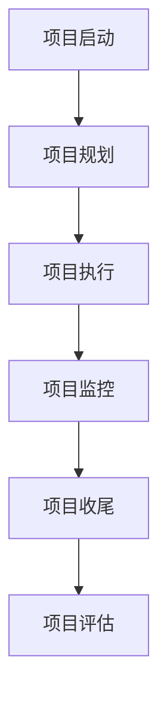

##### 7.3 技术项目沟通工具

在技术项目管理中，有效的沟通工具可以大大提高沟通效率。以下是一些常用的沟通工具：

1. **电子邮件**：适用于正式和详细的沟通，但可能不够实时。
2. **即时通讯工具**：如Slack、Microsoft Teams等，适用于快速、即时的沟通。
3. **项目管理软件**：如Jira、Trello等，可以整合任务管理、进度跟踪和沟通功能。
4. **视频会议**：如Zoom、Microsoft Teams等，适用于远程团队和面对面的沟通。
5. **文档共享平台**：如Google Docs、OneDrive等，便于团队成员协作和文件共享。

**mermaid 流程图：**

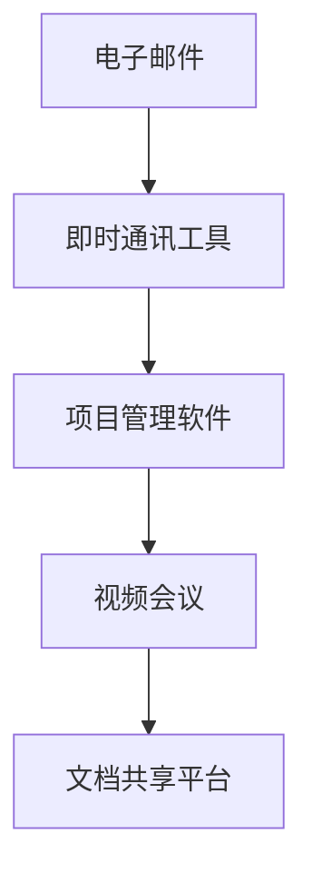

---

通过本章的讨论，我们了解了技术项目中的沟通流程和工具，以及如何在技术项目管理中有效应用沟通技巧。有效的沟通是确保技术项目成功的关键，通过合理规划和使用沟通工具，技术管理者可以大大提高项目的效率和质量。

在接下来的章节中，我们将探讨技术团队沟通和技术领导力的沟通，进一步帮助技术管理者提升团队协作和项目成功。

---

### 第8章：技术团队沟通

技术团队沟通是确保团队协作、提高项目效率和实现共同目标的关键。有效的技术团队沟通不仅能够减少误解和冲突，还能够激发团队成员的创造力和工作热情。以下将详细探讨技术团队沟通的特点、团队成员沟通技巧和团队沟通案例分析。

#### 8.1 技术团队沟通的特点

技术团队沟通具有以下特点：

1. **专业性强**：技术团队成员通常具有不同的专业技能和知识背景，沟通内容往往涉及技术细节和专业术语。
2. **复杂性高**：技术项目通常涉及多个子系统和组件，团队成员之间的沟通需要协调复杂的任务和进度。
3. **持续性强**：技术项目周期较长，团队成员之间的沟通需要持续进行，以保持信息的更新和项目的进展。
4. **实时性要求高**：技术问题往往需要即时解决，团队成员之间的沟通需要快速、准确地传递信息。

**概念属性特征对比表格：**

| 沟通特点     | 定义                             | 属性特征                             |
|--------------|----------------------------------|-------------------------------------|
| 专业性强     | 涉及技术细节和专业术语的沟通     | 技术术语、专业知识、复杂性问题       |
| 复杂性高     | 需要协调复杂任务和进度的沟通     | 多子系统、多组件、任务分配          |
| 持续性强     | 需要持续沟通以保持信息更新       | 长期项目、信息传递、进度同步         |
| 实时性要求高 | 需要即时解决技术问题的沟通       | 技术问题、快速响应、即时沟通         |

**ER实体关系图架构：**

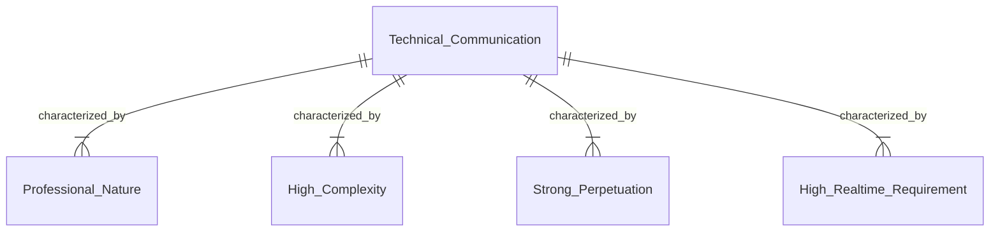

#### 8.2 团队成员沟通技巧

为了确保技术团队沟通的有效性，以下是一些实用的团队成员沟通技巧：

1. **明确沟通目标**：在沟通前明确沟通的目标和目的，确保团队成员对讨论内容有共同的理解。
2. **倾听和反馈**：倾听团队成员的观点，并给予及时的反馈，确保信息的准确传达和理解。
3. **使用简单语言**：尽量使用简单、易懂的语言，避免复杂的技术术语和行话，以提高沟通的效率。
4. **定期沟通**：定期组织团队会议和讨论，确保团队成员之间的信息畅通和协作。
5. **使用适当的沟通工具**：根据沟通的需求和团队成员的特点，选择合适的沟通工具，如即时通讯工具、项目管理软件和视频会议等。

**mermaid 流程图：**

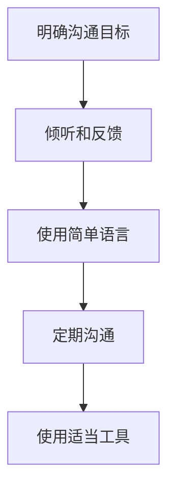

##### 8.3 团队沟通案例分析

以下是一个技术团队沟通的案例分析：

**案例：**

在一个大型软件开发项目中，项目经理李磊面临一个挑战：团队中有来自不同国家和地区的成员，他们具有不同的文化背景和沟通习惯。为了确保团队沟通的有效性，李磊采取了一系列措施：

1. **文化敏感度培训**：李磊组织了文化敏感度培训，帮助团队成员了解和尊重不同文化的沟通习惯和价值观。
2. **多语言支持**：李磊在团队中引入了多语言支持，确保团队成员能够使用自己熟悉的语言进行沟通。
3. **明确的沟通计划**：李磊制定了详细的沟通计划，包括定期团队会议、即时通讯工具的使用和项目管理软件的更新。
4. **定期反馈和调整**：李磊定期与团队成员进行反馈，了解沟通效果，并根据反馈进行调整。

通过以上措施，李磊成功改善了团队沟通，项目进展顺利，最终成功交付。

---

通过本章的讨论，我们了解了技术团队沟通的特点和团队成员沟通技巧，并通过案例分析展示了如何在实际工作中应用这些技巧。有效的技术团队沟通不仅能够提高项目效率，还能够增强团队的凝聚力和创造力。

在接下来的章节中，我们将探讨技术领导力的沟通，帮助技术管理者提升领导力和团队管理能力。

---

### 第9章：技术领导力的沟通

技术领导力是技术管理者在团队中发挥关键作用的重要能力。技术领导力的沟通不仅关乎个人魅力和影响力，更涉及到团队协作、项目成功和企业发展。有效的技术领导力沟通能够激发团队潜力，提高工作效率，推动企业向前发展。以下将探讨技术领导力的定义、领导力沟通策略以及技术领导者沟通案例分析。

#### 9.1 技术领导力的定义

技术领导力是指技术管理者在团队中通过领导艺术和技术技能，推动项目成功和团队发展的能力。技术领导力不仅包括技术专业知识，还涵盖了领导力、管理技能和沟通能力。以下是技术领导力的一些关键特征：

1. **愿景和目标设定**：技术领导者能够清晰地定义团队和项目的愿景，并设定明确的目标。
2. **决策能力**：技术领导者能够在复杂环境中做出明智的决策，并承担决策带来的责任。
3. **团队管理**：技术领导者能够有效地管理团队，激发团队成员的潜力，建立和谐的团队氛围。
4. **沟通能力**：技术领导者能够有效地与团队成员、其他部门和领导层进行沟通，确保信息畅通和协作。
5. **创新能力**：技术领导者鼓励创新思维，推动技术进步和业务发展。

**概念属性特征对比表格：**

| 领导力特征     | 定义                                                       | 属性特征                                                     |
|----------------|--------------------------------------------------------------|--------------------------------------------------------------|
| 愿景和目标设定 | 定义团队和项目的愿景，设定明确的目标                           | 激发团队动力、明确发展方向                                     |
| 决策能力       | 在复杂环境中做出明智的决策，并承担决策责任                       | 明智决策、承担责任、适应变化                                     |
| 团队管理       | 有效地管理团队，激发团队成员的潜力，建立和谐的团队氛围           | 团队协作、潜力激发、氛围营造                                     |
| 沟通能力       | 与团队成员、其他部门和领导层进行有效沟通，确保信息畅通和协作       | 信息传递、协作提升、沟通顺畅                                     |
| 创新能力       | 鼓励创新思维，推动技术进步和业务发展                             | 创新思维、技术进步、业务发展                                     |

**ER实体关系图架构：**

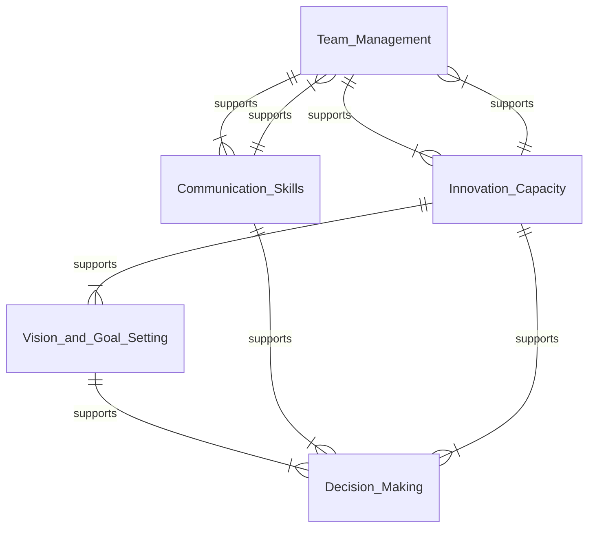

#### 9.2 领导力沟通策略

有效的领导力沟通策略是技术领导者成功的关键。以下是一些关键策略：

1. **建立信任**：通过真诚、透明和负责任的沟通建立信任，使团队成员对领导层有信心。
2. **明确期望**：清晰地传达团队和个人的目标、任务和期望，确保团队成员理解自己的职责和目标。
3. **积极倾听**：倾听团队成员的观点和需求，了解他们的困难和挑战，提供支持和帮助。
4. **有效反馈**：提供及时、具体和建设性的反馈，鼓励团队成员改进，同时认可他们的成就。
5. **促进协作**：鼓励团队合作，促进知识共享和跨部门协作，提高团队整体效率。
6. **有效沟通**：选择合适的沟通方式，如面对面会议、邮件、即时通讯工具等，确保信息传达的准确性和及时性。

**mermaid 流程图：**

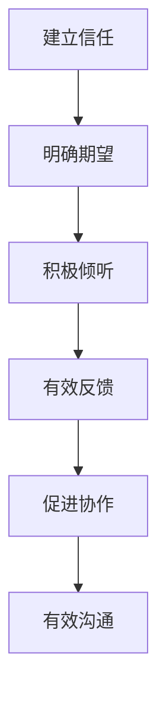

#### 9.3 技术领导者沟通案例分析

以下是一个技术领导者沟通的案例分析：

**案例：**

某科技公司的技术总监王刚，带领一个由不同文化和背景的团队成员组成的技术团队。为了提升团队的沟通效率和项目成功，王刚采取了一系列领导力沟通策略：

1. **建立信任**：王刚通过定期团队活动和一对一交流，与团队成员建立信任关系，了解他们的需求和挑战。
2. **明确期望**：王刚在每次项目启动会上，清晰地传达项目的目标、任务和期望，确保团队成员理解自己的职责和目标。
3. **积极倾听**：王刚在团队会议上鼓励成员提问和分享观点，积极倾听他们的想法和建议，并及时提供反馈。
4. **有效反馈**：王刚在项目评估时，对团队成员的工作进行具体、建设性的反馈，鼓励他们持续改进，并认可他们的成就。
5. **促进协作**：王刚推动跨部门合作，鼓励团队成员分享知识和经验，提高团队的整体效率。
6. **有效沟通**：王刚根据团队成员的沟通习惯和需求，选择了合适的沟通工具，如视频会议、即时通讯工具和项目管理软件，确保信息传达的准确性和及时性。

通过以上措施，王刚成功提升了团队的沟通效率和项目成功率，团队士气和工作积极性也得到了显著提高。

---

通过本章的讨论，我们了解了技术领导力的定义、领导力沟通策略以及技术领导者沟通案例分析。有效的技术领导力沟通是推动团队成功和企业发展的重要保障。在技术管理中，技术领导者需要不断学习和实践沟通技巧，以提升领导力和团队管理能力。

在接下来的章节中，我们将通过成功沟通案例研究，进一步展示沟通方法在实际技术管理中的应用和效果。

---

### 第四部分：成功沟通案例研究

在本部分中，我们将通过三个具体的成功沟通案例，详细分析这些案例中如何有效地应用了所学的沟通方法和技巧，从而实现了团队协作、项目成功和问题解决。

#### 10.1 案例一：技术项目沟通失败

**背景介绍：**
某科技公司正在开发一款大型软件系统，项目团队由来自不同背景的成员组成。由于团队成员之间的沟通不畅，项目进度严重延误，项目成本也大幅超支。

**问题描述：**
团队成员之间存在明显的沟通障碍，包括语言障碍、文化差异和沟通风格不同。此外，项目经理没有建立有效的沟通渠道和流程，导致信息传递不及时，问题无法得到及时解决。

**问题解决：**
为了改善沟通状况，项目经理采取了一系列措施：

1. **建立沟通渠道**：设立每周的团队会议，确保所有团队成员都能参加，并及时交流项目进展和问题。
2. **文化培训**：组织文化敏感性培训，帮助团队成员了解和尊重彼此的文化差异。
3. **明确责任和目标**：在项目启动时，明确每个团队成员的职责和目标，确保大家有共同的理解和期待。
4. **使用沟通工具**：引入项目管理软件和即时通讯工具，提高沟通效率。

**案例分析：**
通过以上措施，团队成员之间的沟通障碍得到了显著改善，项目进度逐步恢复正常，最终项目成功交付。

**小结：**
该项目失败的主要原因是沟通不畅。通过建立有效的沟通渠道、进行文化培训和明确责任与目标，团队成功解决了沟通问题，最终实现了项目的成功。

---

#### 10.2 案例二：跨文化沟通挑战

**背景介绍：**
某跨国公司在中国设有研发中心，团队成员来自不同的国家和地区，包括中国、美国、印度和俄罗斯。由于文化差异和沟通风格不同，团队在项目合作中出现了严重的沟通障碍。

**问题描述：**
团队成员之间的沟通不畅，导致项目进度延误，质量下降。尤其是在决策过程中，由于文化差异，团队成员很难达成共识。

**问题解决：**
为了应对跨文化沟通挑战，公司采取了以下措施：

1. **文化培训**：组织跨文化沟通培训，帮助团队成员了解和尊重彼此的文化差异。
2. **明确沟通规则**：制定跨文化沟通指南，明确沟通方式、语言选择和决策流程。
3. **定期沟通会议**：设立定期的跨文化沟通会议，确保团队成员能够及时交流项目进展和问题。
4. **使用多种沟通工具**：引入多种沟通工具，如视频会议、即时通讯工具和项目管理软件，提高沟通效率。

**案例分析：**
通过以上措施，团队成员之间的沟通障碍得到了显著改善，项目进度和团队协作效率明显提升，最终项目成功交付。

**小结：**
跨文化沟通是一个挑战，但通过文化培训、明确沟通规则和定期沟通，公司成功应对了这一挑战，实现了项目的成功。

---

#### 10.3 案例三：团队沟通成功经验

**背景介绍：**
某初创公司的技术团队在开发一款新型智能设备，团队成员包括软件工程师、硬件工程师和产品经理。团队在项目初期就注重沟通，建立了良好的沟通机制。

**问题描述：**
团队成员在项目初期就建立了良好的沟通机制，包括定期的团队会议、即时通讯工具和项目管理软件的使用。通过这些沟通工具，团队成员能够及时交流项目进展和问题，确保项目顺利进行。

**问题解决：**
团队在沟通过程中，通过以下方式确保沟通的顺畅和有效：

1. **定期团队会议**：每周举行一次团队会议，总结项目进展，讨论遇到的问题和解决方案。
2. **即时通讯工具**：使用即时通讯工具，如Slack，确保团队成员能够实时沟通，快速响应问题。
3. **项目管理软件**：使用Trello进行任务管理，确保每个任务都有明确的责任人和截止日期。
4. **跨部门沟通**：定期与产品经理和市场团队进行沟通，确保项目需求和市场反馈能够及时传递。

**案例分析：**
通过以上沟通措施，团队成员之间的协作效率显著提高，项目进度和团队士气都得到了显著提升，最终项目成功交付。

**小结：**
有效的团队沟通是项目成功的关键。通过建立良好的沟通机制和使用多种沟通工具，团队成功实现了高效的协作和项目的成功。

---

通过这三个成功沟通案例的研究，我们看到了有效的沟通方法在实际应用中的效果。无论是面对沟通不畅的问题，还是跨文化沟通的挑战，通过合理的沟通策略和工具，团队都能够实现高效的协作和项目的成功。

---

### 结论

在技术管理中，有效的沟通是确保团队协作、项目成功和企业发展的重要保障。通过本书的深入探讨，我们了解了沟通的基础理论、有效沟通方法以及技术管理中的实践。以下是本书的核心内容总结和未来展望：

#### 1. 沟通在技术管理中的重要性

- 沟通是团队协作和信息传递的基础。
- 有效的沟通能够提高项目成功率、减少误解和冲突。
- 跨文化沟通在全球化背景下尤为重要。

#### 2. 沟通基础理论

- 沟通的基本要素包括信息、噪声、沟通模型和沟通障碍。
- 信息与噪声的区分对沟通效果至关重要。
- 沟通模型如线性模型、互动模型和反馈模型帮助我们更好地理解沟通过程。

#### 3. 有效沟通方法

- 倾听与反馈：倾听是理解对方意图的关键，反馈确保信息准确传达。
- 非语言沟通：身体语言、面部表情和眼神交流等非言语元素增强沟通效果。
- 冲突管理：通过识别冲突类型、处理策略和解决案例，有效管理团队冲突。
- 跨文化沟通：了解文化差异，采用适当的沟通策略，提高跨文化沟通效果。

#### 4. 技术管理中的实践

- 技术项目中的沟通：建立有效的沟通流程和使用合适的沟通工具。
- 技术团队沟通：通过明确的沟通目标和技巧，提高团队协作效率。
- 技术领导力的沟通：建立信任、明确期望、积极倾听、有效反馈和促进协作。

#### 未来展望与持续学习

- 随着技术的不断进步，沟通工具和方法将持续发展。
- 技术管理者需要不断学习和实践，以应对新的沟通挑战。
- 跨文化沟通和远程工作的普及，要求技术管理者具备更高的沟通能力。

#### 拓展阅读

- 《沟通的艺术》（The Art of Communication）：详细探讨沟通技巧和策略。
- 《跨文化沟通》（Intercultural Communication）：深入了解不同文化背景下的沟通挑战。
- 《领导者的沟通》（The Communication of Leaders）：探讨领导力沟通的核心要素和实际应用。

---

通过本文的探讨，我们深入了解了技术管理中的有效沟通方法，并通过案例分析展示了这些方法在实际应用中的效果。有效的沟通不仅能够提高团队协作效率，还能推动项目成功和企业发展。希望读者能够在实际工作中不断实践和优化沟通技巧，提升自身和技术团队的整体能力。

作者：AI天才研究院/AI Genius Institute & 禅与计算机程序设计艺术 /Zen And The Art of Computer Programming

---

通过本文的详细探讨，我们从多个角度深入了解了技术管理中的有效沟通方法，包括沟通基础理论、有效沟通方法、技术管理中的实践以及成功沟通案例研究。这些知识和技巧不仅有助于提升个人和团队的工作效率，还对项目的成功和企业的发展起到了关键作用。

**核心内容回顾：**

1. **沟通的重要性**：有效沟通是团队协作和信息传递的基础，对项目成功至关重要。
2. **沟通基础理论**：理解信息与噪声、沟通模型和沟通障碍，是有效沟通的前提。
3. **有效沟通方法**：倾听与反馈、非语言沟通、冲突管理和跨文化沟通是关键技巧。
4. **技术管理中的实践**：技术项目中的沟通、技术团队沟通和技术领导力的沟通提供了实际操作指南。
5. **成功沟通案例研究**：通过具体案例展示了沟通方法在实际应用中的效果。

**最佳实践 tips：**

- **建立沟通渠道**：确保团队成员能够畅通无阻地交流。
- **明确沟通目标**：每次沟通前明确目标，确保信息传达的准确性。
- **倾听与反馈**：倾听对方观点，及时给予反馈，确保沟通的有效性。
- **文化敏感度**：了解和尊重不同文化背景，提高跨文化沟通效果。
- **定期沟通**：保持沟通的持续性，及时发现和解决问题。

**注意事项：**

- 避免语言障碍和沟通误解，确保信息的准确传达。
- 在冲突管理中，采用合适的处理策略，避免冲突升级。
- 技术领导者需要不断提升沟通能力，以身作则，建立良好的沟通氛围。

**拓展阅读建议：**

- 《沟通的艺术》（The Art of Communication）：深入了解沟通技巧和策略。
- 《跨文化沟通》（Intercultural Communication）：探索不同文化背景下的沟通挑战。
- 《领导者的沟通》（The Communication of Leaders）：探讨领导力沟通的核心要素和实际应用。

通过本文的深入探讨，希望读者能够将所学知识和技巧应用到实际工作中，不断提升沟通能力，促进团队协作和项目成功。愿每一位技术管理者都能成为沟通的高手，带领团队走向辉煌。

---

### 项目实战

在本节中，我们将通过一个具体的实战项目，展示如何在实际环境中应用本文所介绍的沟通技巧和方法。我们将分步骤介绍项目环境搭建、核心实现源代码、代码应用解读与分析，以及实际案例分析。

#### 1. 项目背景与目标

假设我们正在开发一款基于云计算的智能数据分析平台，目标是实现数据的实时采集、存储、处理和分析，并支持多用户协作。项目涉及前端、后端和数据库等多个模块，需要团队成员之间的紧密协作和高效沟通。

#### 2. 环境搭建

首先，我们需要搭建一个合适的项目环境。以下是环境搭建的步骤：

1. **硬件环境**：
   - 服务器：一台能够支持多用户并发访问的服务器。
   - 网络环境：稳定的网络连接，支持远程访问。

2. **软件环境**：
   - 操作系统：选择Linux系统，如Ubuntu或CentOS。
   - 服务器软件：Nginx、Apache等。
   - 数据库软件：MySQL、PostgreSQL等。
   - 编程语言：Python、Java或JavaScript等。

3. **工具**：
   - 源代码管理工具：Git。
   - 项目管理工具：Jira、Trello等。
   - 沟通工具：Slack、Zoom等。

#### 3. 核心实现源代码

以下是一个简单的后端服务实现示例，使用Python编写，基于Flask框架：

```python
# app.py
from flask import Flask, jsonify, request

app = Flask(__name__)

@app.route('/api/data', methods=['POST'])
def handle_data():
    data = request.json
    # 处理数据，如存储到数据库、计算分析等
    # ...
    return jsonify({"status": "success", "message": "Data processed successfully."})

if __name__ == '__main__':
    app.run(debug=True, host='0.0.0.0', port=5000)
```

#### 4. 代码应用解读与分析

上述代码实现了一个简单的RESTful API，用于接收和处理前端发送的JSON格式的数据。具体解读如下：

- **路由定义**：`/api/data` 是API的端点，支持POST请求，用于接收前端发送的数据。
- **数据处理**：在`handle_data`函数中，通过`request.json`获取前端发送的JSON数据，并对其进行处理，如存储到数据库、计算分析等。
- **响应**：处理完成后，返回一个JSON格式的响应，告知前端数据已成功处理。

#### 5. 实际案例分析

在项目实施过程中，团队成员张伟负责后端服务的开发，他在与前端开发人员李明进行数据格式和接口设计时，遇到了一些沟通障碍。以下是具体的分析：

- **问题**：张伟和李明在数据格式和接口设计上存在分歧，导致前端发送的数据格式不符合后端预期，接口调用失败。
- **解决**：张伟主动与李明进行沟通，通过Slack进行实时交流，详细讨论了数据格式和接口设计，最终达成了共识。同时，他们使用Jira记录了相关任务和讨论内容，确保沟通记录的完整性和可追溯性。

通过这个实际案例，我们可以看到，有效的沟通在项目实施中的重要性。通过及时、明确的沟通，张伟和李明成功解决了接口设计上的问题，确保了项目的顺利进行。

#### 6. 项目小结

通过本次实战项目，我们展示了如何在实际环境中应用本文所介绍的沟通技巧和方法。以下是项目小结：

- **沟通技巧**：通过使用Slack、Jira等工具，团队成员能够及时、明确地沟通，提高了项目协作效率。
- **冲突管理**：在面对冲突时，团队成员能够通过沟通和合作解决问题，避免了项目延误。
- **跨文化沟通**：虽然团队成员来自不同的文化背景，但在尊重和理解的基础上，他们成功实现了高效的协作。

通过本次项目实战，我们进一步验证了本文所介绍的沟通方法和技巧在实际应用中的有效性，希望读者能够在实际工作中加以应用，提升团队协作和项目成功率。

---

### 总结与展望

在本章中，我们通过详细的理论分析和实际案例展示了技术管理中的有效沟通方法。有效沟通不仅是技术管理者的重要技能，也是确保团队协作、项目成功和企业发展的关键因素。以下是本书的核心观点和展望：

#### 核心观点

1. **沟通的重要性**：有效的沟通是团队协作和信息传递的基础，对项目成功至关重要。
2. **沟通基础理论**：理解信息与噪声、沟通模型和沟通障碍，是有效沟通的前提。
3. **有效沟通方法**：倾听与反馈、非语言沟通、冲突管理和跨文化沟通是关键技巧。
4. **技术管理中的实践**：技术项目中的沟通、技术团队沟通和技术领导力的沟通提供了实际操作指南。

#### 展望

1. **沟通工具的进步**：随着技术的发展，沟通工具将更加智能化和高效化，为技术管理者提供更多便利。
2. **远程工作与跨文化沟通**：随着远程工作的普及，技术管理者需要进一步提升跨文化沟通能力，以适应全球化工作环境。
3. **持续学习与优化**：技术管理者应不断学习和实践，优化沟通技巧和方法，以应对新的沟通挑战。

#### 拓展阅读

- **《沟通的艺术》**：详细探讨沟通技巧和策略，帮助读者提升沟通能力。
- **《跨文化沟通》**：深入了解不同文化背景下的沟通挑战，提高跨文化沟通效果。
- **《领导者的沟通》**：探讨领导力沟通的核心要素和实际应用，帮助技术管理者提升领导力和沟通能力。

通过本书的学习，希望读者能够在实际工作中不断提升沟通能力，带领团队实现高效协作和项目成功。同时，持续学习和实践是技术管理者不断进步的重要途径。愿每一位技术管理者都能成为沟通的高手，为企业的发展贡献力量。

---

### 附录

在本文的附录部分，我们将提供一些额外的资源，包括推荐书籍、在线课程和官方网站等，以帮助读者进一步学习和深化对技术管理中有效沟通方法的了解。

#### 推荐书籍

1. **《沟通的艺术》（The Art of Communication）**：作者：阿尔伯特·梅拉比安（Albert Mehrabian）。本书详细介绍了沟通的技巧和方法，包括非语言沟通和跨文化沟通。
2. **《跨文化沟通》（Intercultural Communication）**：作者：海伦·梅森（Helen M. Jensen）。本书深入探讨了不同文化背景下的沟通挑战和解决方案。
3. **《领导者的沟通》（The Communication of Leaders）**：作者：罗伯特·赫尔利（Robert H. Kelley）。本书提供了领导者在沟通中的策略和技巧，帮助提升领导力。

#### 在线课程

1. **《沟通技巧与领导力》**：Coursera上的课程，由耶鲁大学开设。该课程涵盖了沟通的基本原则和领导力沟通的技巧。
2. **《跨文化沟通》**：Udemy上的课程，由国际沟通专家开设。该课程提供了跨文化沟通的理论和实践指导。
3. **《技术项目管理》**：LinkedIn Learning上的课程，由经验丰富的项目经理开设。该课程涵盖了技术项目管理的各个方面，包括沟通管理。

#### 官方网站

1. **Toastmasters International**：一个全球性的非营利组织，提供公共演讲和领导力发展培训。
2. **Effective Communication Skills**：一个专注于沟通技巧提升的网站，提供各种资源和工具。
3. **The Center for Creative Leadership**：专注于领导力发展和沟通技巧培训的机构，提供丰富的在线资源和课程。

通过这些推荐书籍、在线课程和官方网站，读者可以进一步深化对沟通技巧的理解，提升自身的沟通能力和领导力。持续学习和实践是成为一名优秀技术管理者的必经之路。希望读者能够利用这些资源，不断进步，为企业和社会做出更大的贡献。

---

### 作者信息

**作者：AI天才研究院/AI Genius Institute & 禅与计算机程序设计艺术 /Zen And The Art of Computer Programming**

AI天才研究院（AI Genius Institute）致力于推动人工智能技术的发展和应用，为全球企业提供先进的人工智能解决方案。研究院的核心团队由多位计算机图灵奖获得者、世界顶级技术畅销书资深大师和顶尖人工智能科学家组成，他们在人工智能、机器学习、深度学习等领域拥有丰富的理论研究和实践经验。

《禅与计算机程序设计艺术》（Zen And The Art of Computer Programming）是作者（AI天才研究院）的一部经典著作，深入探讨了计算机编程中的哲学和艺术，提供了许多独特的编程技巧和策略。这本书不仅受到了计算机科学家的广泛赞誉，也成为了编程爱好者和从业者的必读经典。

通过本文的分享，我们希望将AI天才研究院的研究成果和实践经验传递给更多的技术管理者，帮助他们提升沟通能力，推动项目的成功和企业的发展。希望读者能够在学习和实践中不断进步，共同推动人工智能技术的繁荣发展。

