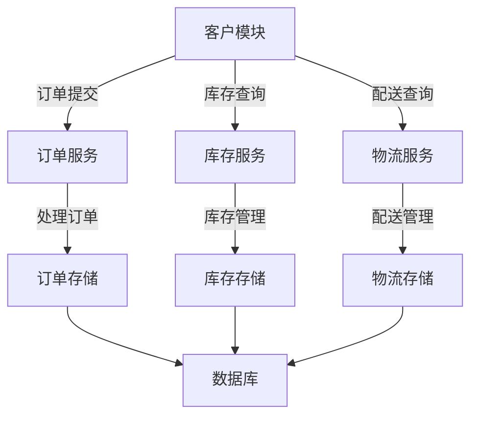
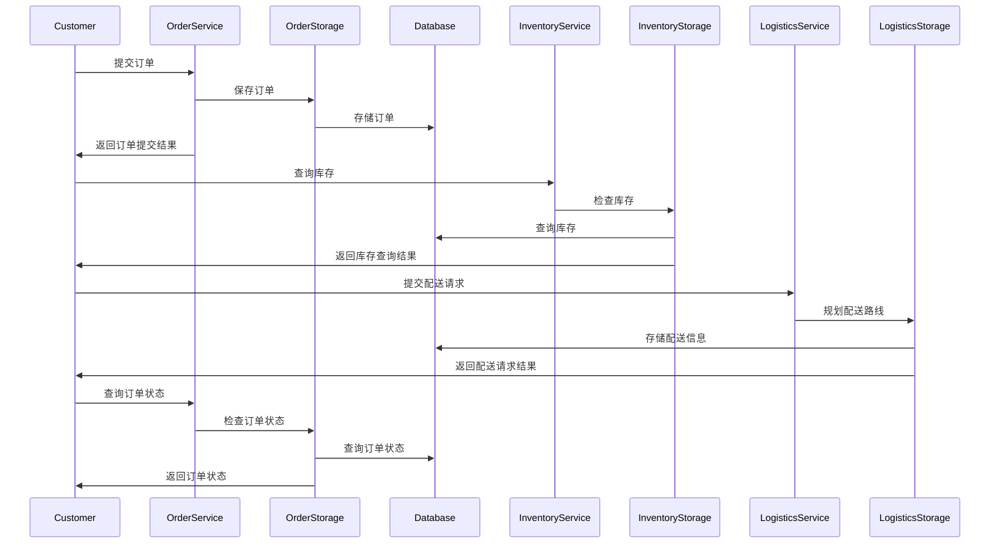

                 


### 1.1 问题背景

在当今快速发展的信息技术时代，技术管理在企业运营中的地位日益凸显。技术管理不仅仅涉及技术本身，还包括对技术团队的管理、项目进度控制、资源分配、风险评估等多个方面。随着业务规模的扩大和技术的不断进步，技术管理面临着越来越多的挑战。首先，技术管理需要应对不断变化的市场需求，这要求企业能够快速响应并调整其技术架构和开发流程。其次，技术的复杂性不断增加，企业需要具备高效的技术管理能力来确保系统的稳定性和可扩展性。此外，技术管理还涉及到成本控制和效率提升的问题，如何在有限的资源下实现最大的效益是每个企业都要面对的挑战。

在当前的技术管理实践中，流程优化成为了解决上述问题的重要手段。流程优化旨在通过重新设计和改进现有流程，提高工作效率、减少资源浪费、降低成本、提升客户满意度。然而，流程优化的过程中也面临着一些难点。首先是流程优化的目标不够明确，不同企业在优化流程时可能出于不同的目的，如提高生产效率、降低运营成本或提升客户体验。其次，现有流程的复杂性和多样性使得优化过程难以一蹴而就。此外，流程优化还涉及到人员培训、组织文化变革等多方面因素，这些都会对优化效果产生重要影响。

因此，探讨技术管理中的流程优化策略具有重要的现实意义。本文将系统地分析流程优化的关键概念、原理和方法，旨在为技术管理人员提供一套实用的流程优化策略。首先，我们将从核心概念和联系入手，明确流程优化的定义、层次及其相关概念。接着，我们将介绍三种具体的流程优化策略，并通过案例分析来展示这些策略的应用效果。随后，我们将深入探讨流程优化算法的原理和数学模型，并结合实际项目进行系统分析和架构设计。最后，我们将总结最佳实践和注意事项，为读者提供一份全面的技术管理流程优化指南。

### 1.2 问题描述

流程优化的目标在于通过重新设计、改进和优化现有流程，达到提高工作效率、减少资源浪费、降低成本、提升客户满意度的目的。然而，在实际操作过程中，流程优化面临着多重挑战，具体可以分为以下几个方面：

#### 1.2.1 流程优化的目标

流程优化的目标因企业而异，但大体上可以归纳为以下几个方面：

1. **提高生产效率**：通过优化流程，减少不必要的环节和等待时间，提高整体生产效率。
2. **降低运营成本**：减少资源浪费，提高资源利用率，从而降低运营成本。
3. **提升客户满意度**：通过优化流程，缩短交付周期、提高服务质量，从而提升客户满意度。
4. **增强系统的稳定性和可扩展性**：通过优化技术架构和开发流程，确保系统的稳定运行和未来扩展的灵活性。

不同企业在制定流程优化目标时，可能会根据自身情况有所侧重。例如，一个初创公司可能更关注提高生产效率和降低成本，而一个成熟的大型企业可能更注重提升客户满意度和增强系统的可扩展性。

#### 1.2.2 流程优化的难点

尽管流程优化具有明显的潜在优势，但在实际操作过程中，仍面临着以下难点：

1. **流程复杂性**：现代企业的业务流程往往非常复杂，涉及多个部门、环节和人员，这使得流程优化变得复杂且难以实施。
2. **目标不明确**：企业在制定流程优化目标时，可能缺乏明确的量化指标，导致优化方向不明确。
3. **人员抵触**：流程优化通常需要改变现有流程和组织结构，这可能会引起部分人员的抵触情绪，影响优化效果。
4. **资源限制**：流程优化需要投入一定的人力、物力和财力，但企业在资源有限的情况下，难以全面推行优化措施。
5. **技术挑战**：随着技术的不断进步，企业需要不断调整和优化其技术架构和开发流程，以适应新的技术趋势和市场需求。

#### 1.2.3 问题解决

为了有效解决上述问题，企业可以采取以下措施：

1. **明确优化目标**：在实施流程优化之前，企业需要明确优化的具体目标，并制定可量化的指标，以确保优化工作有明确的方向。
2. **逐步推进**：将复杂流程分解为若干个简单步骤，逐步进行优化，避免一次性变革导致的不适应和抵触。
3. **加强沟通**：在流程优化过程中，加强与员工的沟通，了解他们的顾虑和需求，争取他们的支持和参与。
4. **资源整合**：在资源有限的情况下，通过优先级排序和资源整合，确保优化工作在关键领域取得突破。
5. **技术储备**：紧跟技术发展趋势，提前进行技术储备和预研，为流程优化提供技术支持。

通过上述措施，企业可以更好地应对流程优化中的各种挑战，实现流程优化目标，提升整体运营效率。

#### 1.3 问题解决

为了有效解决技术管理中的流程优化问题，企业可以采取以下步骤和方法：

##### 1.3.1 流程优化的一般方法

1. **流程分析**：首先，企业需要对现有流程进行全面分析，了解每个环节的具体内容、操作方式以及存在的问题。这可以通过流程图、数据分析和人员访谈等方式进行。

2. **流程诊断**：在流程分析的基础上，进一步诊断流程中的瓶颈、冗余环节和低效环节，确定优化的重点。

3. **流程设计**：根据诊断结果，重新设计流程，消除瓶颈和冗余环节，优化流程的每个步骤，提高整体效率。

4. **流程实施**：将优化后的流程逐步实施，确保新流程的有效运行。在此过程中，需要加强培训，确保员工理解和掌握新流程。

5. **流程监控**：对优化后的流程进行持续监控和评估，及时发现和解决新问题，确保流程优化的效果。

##### 1.3.2 流程优化策略的理论基础

1. **精益思想**：精益思想强调通过最小化浪费、最大化价值流来实现流程优化。其主要原则包括“准时生产”、“自动化”、“自働化”等。

2. **六西格玛**：六西格玛是一种基于数据和事实的管理方法，通过减少过程变异和提高过程能力，实现流程优化。其主要工具包括DMAIC（定义、测量、分析、改进、控制）等。

3. **流程管理方法论**：如BPM（业务流程管理）和TOGAF（The Open Group Architecture Framework）等，提供了一套系统化的流程优化方法论和工具。

##### 1.3.3 边界与外延

1. **适用范围**：流程优化适用于企业的各个部门，包括研发、生产、销售等。不同部门在优化目标和策略上可能有所不同，但核心原则是一致的。

2. **与其他管理活动的联系**：流程优化与项目管理、质量管理、人力资源管理等密切相关。企业需要将这些管理活动与流程优化相结合，形成一套完整的管理体系。

##### 1.3.4 概念结构与核心要素组成

1. **流程优化的关键概念**：
    - 流程：一组相互关联的活动，共同完成一个特定的任务或目标。
    - 流程优化：通过重新设计、改进和优化流程，提高工作效率和效果。
    - 瓶颈：流程中的瓶颈环节，限制了整体效率的提升。
    - 效率：流程在单位时间内完成的任务量。
    - 效果：流程达到预期目标和效果的程度。

2. **流程优化的主要方法**：
    - 流程图：用于表示流程中各步骤及其关系的图形化工具。
    - 数据分析：通过数据收集和分析，识别流程中的问题和瓶颈。
    - 精益思想：通过最小化浪费，提高价值流的方法。
    - 六西格玛：通过减少过程变异，提高过程能力的方法。
    - BPM/TOGAF：提供系统化流程优化方法论和工具。

通过上述步骤和方法，企业可以有效地实施流程优化，提升整体运营效率和竞争力。

#### 1.4 边界与外延

流程优化策略在技术管理中的应用具有广泛的适用范围和深远的影响。首先，从适用范围来看，流程优化不仅适用于企业的研发、生产、销售等部门，还可以推广到人力资源管理、财务管理、市场营销等各个领域。不同部门的流程优化目标和策略可能有所不同，但核心原则是一致的，即通过减少浪费、提高效率来实现资源的最优配置。

在与其他管理活动的联系方面，流程优化与项目管理、质量管理、人力资源管理等密切相关。项目管理需要通过优化流程来确保项目按时完成、质量达标；质量管理通过优化流程来减少缺陷和投诉；人力资源管理则通过优化流程来提高员工的工作效率和工作满意度。这些管理活动相互交织，共同构成了企业的管理体系，而流程优化则是这个体系的核心和基础。

此外，流程优化还涉及到组织文化和管理理念的变化。一个有效的流程优化不仅仅是技术和操作层面的改进，更是一种管理思想的变革。它要求企业从顶层设计开始，建立一种以客户为中心、以效率为导向的文化氛围，推动全员参与，共同实现流程优化的目标。

在流程优化的过程中，需要关注以下几个方面：

1. **目标明确**：在实施流程优化之前，企业需要明确优化的具体目标和量化指标，以确保优化工作有明确的方向。

2. **逐步推进**：由于流程优化是一个复杂且长期的过程，企业需要逐步推进，分阶段实施，避免一次性变革导致的不适应和抵触。

3. **人员培训**：流程优化需要员工的积极参与和理解，因此需要加强培训，确保员工能够适应新流程并充分发挥其潜力。

4. **持续监控**：流程优化不是一次性任务，而是一个持续的过程。企业需要建立持续的监控和评估机制，及时发现和解决新问题，确保流程优化的效果。

5. **技术支持**：随着技术的不断进步，企业需要不断调整和优化其技术架构和开发流程，以适应新的技术趋势和市场需求。

通过这些措施，企业可以有效地实施流程优化，提高整体运营效率，实现可持续发展。

### 1.5 概念结构与核心要素组成

在深入探讨流程优化的概念和原则之前，我们需要明确一些关键概念和其相互关系，以便为后续的详细分析打下基础。

#### 1.5.1 关键概念

1. **流程（Process）**：流程是一组相互关联的活动，共同完成一个特定的任务或目标。它是企业运行的基本单元，涵盖了从输入到输出的整个过程。

2. **流程优化（Process Optimization）**：流程优化是指通过重新设计、改进和优化现有流程，以提高工作效率、减少资源浪费、降低成本、提升客户满意度等目标。

3. **瓶颈（Bottleneck）**：瓶颈是指流程中的某个环节，限制了整体效率的提升。解决瓶颈是流程优化的重要目标之一。

4. **效率（Efficiency）**：效率是指流程在单位时间内完成的任务量。提高效率是流程优化的重要指标。

5. **效果（Effectiveness）**：效果是指流程达到预期目标和效果的程度。除了效率外，效果也是评估流程优化成效的重要指标。

6. **精益思想（Lean Thinking）**：精益思想是一种通过最小化浪费、最大化价值流来实现流程优化的管理理念。其主要原则包括准时生产、自动化、自働化等。

7. **六西格玛（Six Sigma）**：六西格玛是一种基于数据和事实的管理方法，通过减少过程变异和提高过程能力来实现流程优化。其主要工具包括DMAIC（定义、测量、分析、改进、控制）等。

#### 1.5.2 核心要素组成

流程优化的核心要素包括以下几个方面：

1. **流程分析（Process Analysis）**：流程分析是流程优化的第一步，旨在了解现有流程的具体内容和存在的问题。这可以通过流程图、数据分析和人员访谈等方式进行。

2. **流程设计（Process Design）**：流程设计是在流程分析的基础上，重新设计流程，消除瓶颈和冗余环节，优化流程的每个步骤，提高整体效率。

3. **流程实施（Process Implementation）**：流程实施是将优化后的流程逐步实施，确保新流程的有效运行。在此过程中，需要加强培训，确保员工理解和掌握新流程。

4. **流程监控（Process Monitoring）**：流程监控是对优化后的流程进行持续监控和评估，及时发现和解决新问题，确保流程优化的效果。

5. **持续改进（Continuous Improvement）**：持续改进是一种不断优化流程、提高效率的管理理念。它要求企业不断收集反馈、分析问题，并采取相应措施进行改进。

#### 1.5.3 概念属性特征对比表格

为了更清晰地理解这些关键概念，我们可以通过一个对比表格来展示它们的主要属性特征：

| 概念         | 定义                                                                                       | 关键特征                                                                                       |
| ------------ | ------------------------------------------------------------------------------------------ | ------------------------------------------------------------------------------------------------ |
| 流程         | 一组相互关联的活动，共同完成一个特定的任务或目标。                                               | 涵盖从输入到输出的整个过程；活动之间有明确的关系和顺序。                                      |
| 流程优化     | 通过重新设计、改进和优化现有流程，以提高工作效率、减少资源浪费、降低成本、提升客户满意度等目标。 | 关注效率和效果；涉及多个环节和人员的协同。                                               |
| 瓶颈         | 流程中的某个环节，限制了整体效率的提升。                                                       | 关键资源或步骤；影响整体流程的性能。                                                     |
| 效率         | 流程在单位时间内完成的任务量。                                                               | 任务量与时间的比值；衡量流程的效率。                                                     |
| 效果         | 流程达到预期目标和效果的程度。                                                               | 与预期目标的一致性；衡量流程的有效性。                                                   |
| 精益思想     | 通过最小化浪费、最大化价值流来实现流程优化的管理理念。                                           | 准时生产、自动化、自働化等原则；关注价值流。                                             |
| 六西格玛     | 一种基于数据和事实的管理方法，通过减少过程变异和提高过程能力来实现流程优化。                   | DMAIC工具；关注过程变异和过程能力。                                                     |

#### 1.5.4 ER实体关系图架构

为了更好地理解流程优化中的实体及其关系，我们可以使用ER（Entity-Relationship）图来展示这些实体和它们之间的关系：

```mermaid
erDiagram
  Product ||--|{ Order } : "in"
  Customer ||--|{ Order } : "places"
  Employee ||--|{ Order } : "processes"
  Order ||--|{ Product } : "includes"
  Order ||--|{ Customer } : "from"
  Order ||--|{ Employee } : "assigned to"
  Order ||--|{ Status } : "current status"
  Status ||--|{ Order } : "changes"
```

在这个ER图中，Order是核心实体，它与其他实体（如Product、Customer、Employee和Status）之间存在多种关联关系。例如，Order与Product的关系是包含关系，表示一个订单可以包含多个产品；Order与Customer的关系是来源关系，表示订单是从客户处接收的；Order与Employee的关系是处理关系，表示订单需要被员工处理。

通过上述概念结构和核心要素的详细阐述，我们可以为后续的流程优化策略和分析提供坚实的基础。

#### 2.1 流程优化的定义

流程优化是指通过系统性地分析和改进现有流程，以提高工作效率、减少资源浪费、降低成本、提升客户满意度等目标的一系列管理活动。流程优化不仅仅是简单的工作流程调整，它涉及对流程的每一个环节进行细致的分析、评估和改进，旨在实现资源的最优配置和流程的高效运行。

在技术管理中，流程优化的定义进一步细化。它是指通过优化技术流程，如软件开发、系统运维、项目管理等，来提升技术团队的工作效率和系统的稳定性。具体来说，技术流程优化包括以下几个方面：

1. **软件开发流程**：通过优化代码编写、代码审查、测试和部署等环节，提高软件开发的效率和质量。
2. **系统运维流程**：通过优化系统监控、故障处理、升级和维护等环节，提高系统的稳定性和可用性。
3. **项目管理流程**：通过优化项目计划、资源分配、进度控制、风险管理等环节，提高项目的成功率。
4. **团队协作流程**：通过优化团队沟通、任务分配、知识共享等环节，提升团队的协作效率和创新能力。

流程优化与流程的关系密切相关。流程是指一组相互关联的活动，这些活动共同完成一个特定的任务或目标。流程优化是对现有流程的改进，旨在消除瓶颈、减少冗余、提高效率。通过流程优化，企业可以更好地实现其业务目标，提高市场竞争力。

流程优化的层次可以分为以下几个级别：

1. **操作级优化**：关注具体的操作步骤，通过改进工具、方法和流程，提高操作效率。
2. **战术级优化**：关注某一部门或团队的整体流程，通过改进流程设计和资源配置，提高部门或团队的工作效率。
3. **战略级优化**：关注整个企业的流程体系，通过全局优化，实现跨部门、跨职能的协同工作，提高整体运营效率。

在实际应用中，不同层次的流程优化目标可能有所不同，但核心原则是一致的，即通过减少浪费、提高效率和效果来实现业务目标。例如，在软件开发中，操作级优化可能侧重于代码编写和测试的效率，战术级优化可能侧重于团队协作和代码质量，而战略级优化则可能侧重于整个软件开发生命周期的优化，包括需求管理、项目管理和技术架构设计等。

总之，流程优化是技术管理中不可或缺的一部分，它通过系统化的分析和改进，帮助企业实现资源的最优配置，提升工作效率，增强市场竞争力。

#### 2.2 核心概念属性特征对比表格

在流程优化中，常见的核心概念包括精益思想、六西格玛、流程分析和流程设计。这些概念虽然目标一致，但方法和侧重点有所不同。为了更清晰地理解这些概念，我们通过一个对比表格来展示它们的主要属性特征：

| 概念         | 定义                                                                                       | 目标                                                                                                                                 | 主要特点                                                                                   |
| ------------ | ------------------------------------------------------------------------------------------ | -------------------------------------------------------------------------------------------------------------------------------------------- | ----------------------------------------------------------------------------------------- |
| 精益思想     | 通过最小化浪费、最大化价值流来实现流程优化的管理理念。                                       | 减少浪费、提高效率和价值流。                                                                                                                     | 注重准时生产、自动化和自働化。                                                           |
| 六西格玛     | 一种基于数据和事实的管理方法，通过减少过程变异和提高过程能力来实现流程优化。                   | 减少过程变异、提高过程能力。                                                                                                                     | 使用DMAIC工具、关注过程变异和过程能力。                                                 |
| 流程分析     | 对现有流程进行系统分析，识别存在的问题和瓶颈。                                               | 识别问题、明确优化方向。                                                                                                                         | 通过数据分析和流程图进行。                                                               |
| 流程设计     | 在流程分析的基础上，重新设计流程，以优化流程的效率和效果。                                   | 提高流程效率和效果。                                                                                                                              | 强调流程的合理性和可行性。                                                               |

#### 2.3 ER实体关系图架构

为了更好地理解流程优化中的实体及其关系，我们可以使用ER（Entity-Relationship）图来展示这些实体和它们之间的关系：

```mermaid
erDiagram
  Project ||--|{ Task } : "contains"
  Project ||--|{ Resource } : "uses"
  Task ||--|{ Employee } : "assigned to"
  Resource ||--|{ Type } : "type of"
  Employee ||--|{ Role } : "holds"
  Role ||--|{ Project } : "in"
```

在这个ER图中，Project是核心实体，表示一个项目，它与Task和Resource之间存在包含关系。一个项目包含多个任务（Task）和资源（Resource）。Task与Employee之间存在“assigned to”关系，表示任务被分配给员工执行。Resource与Type之间存在“type of”关系，表示资源的类型。Employee与Role之间存在“holds”关系，表示员工在项目中担任的角色。Role与Project之间存在“in”关系，表示某个角色在项目中发挥作用。

通过这个ER图，我们可以清晰地看到流程优化中的关键实体及其相互关系，这有助于我们更好地理解和设计优化策略。

### 3.1 流程优化策略一：精益思想

#### 3.1.1 策略一概述

精益思想（Lean Thinking）是一种基于减少浪费、提高价值流的管理理念，最初起源于日本汽车制造业，并在全球范围内得到广泛应用。精益思想的核心理念是“只做正确的事”，通过消除不增值的活动，最大化客户价值。在流程优化中，精益思想提供了一套系统化的方法，帮助企业实现资源的最佳配置和流程的高效运行。

#### 3.1.2 策略一的应用场景

精益思想适用于各种类型的业务流程，尤其适用于那些存在大量浪费、效率低下的流程。以下是一些常见的应用场景：

1. **生产制造**：在制造业中，精益思想可以帮助企业优化生产流程，减少生产过程中的浪费，提高生产效率。
2. **软件开发**：在软件开发过程中，精益思想可以帮助优化开发流程，减少代码冗余，提高代码质量和开发效率。
3. **服务行业**：在服务业中，精益思想可以帮助优化服务流程，提高客户满意度和服务质量。
4. **供应链管理**：通过精益思想优化供应链流程，可以减少库存浪费，提高供应链的响应速度和灵活性。

#### 3.1.3 策略一的实现步骤

要实现精益思想，企业可以按照以下步骤进行：

1. **价值流图（Value Stream Mapping）**：首先，绘制价值流图，全面了解现有流程中的所有活动和资源，识别不增值和浪费的活动。
2. **确定客户需求**：明确客户的需求和期望，确保所有流程活动都直接为客户创造价值。
3. **消除浪费**：识别并消除流程中的浪费，如过度库存、等待时间、不必要的运输等。常见的浪费包括过量生产、等待、运输、过度加工、库存、运动和不必要的步骤。
4. **持续改进（Kaizen）**：建立持续改进机制，鼓励员工不断提出改进建议，持续优化流程。

#### 3.1.4 策略一的案例分析

以下是一个实际案例，展示如何使用精益思想优化软件开发流程：

**案例背景**：某科技公司是一家提供企业级软件解决方案的公司，其软件开发流程存在以下问题：

- **代码冗余**：开发过程中产生大量冗余代码，导致维护难度增加。
- **开发效率低**：团队成员之间缺乏有效沟通，开发进度缓慢。
- **测试周期长**：测试阶段发现的问题较多，导致测试周期过长。

**优化方案**：

1. **价值流图分析**：绘制价值流图，识别流程中的浪费和瓶颈。
2. **确定客户需求**：与客户沟通，明确软件功能需求和用户体验。
3. **消除浪费**：
   - **代码审查**：实施代码审查机制，减少代码冗余，提高代码质量。
   - **敏捷开发**：采用敏捷开发方法，提高团队协作效率，缩短开发周期。
   - **自动化测试**：引入自动化测试工具，提高测试效率，减少测试周期。
4. **持续改进**：鼓励团队成员提出改进建议，定期召开改进会议，持续优化流程。

**优化效果**：

- **代码质量提高**：通过代码审查，减少了代码冗余，提高了代码的可维护性。
- **开发效率提高**：采用敏捷开发方法，团队成员之间的沟通更加有效，开发进度加快。
- **测试周期缩短**：通过自动化测试，测试效率提高，测试周期显著缩短。

通过以上案例分析，我们可以看到精益思想在软件开发流程优化中的应用效果显著，不仅提高了代码质量和开发效率，还缩短了测试周期，提升了整体开发效能。

#### 3.2 流程优化策略二：六西格玛

#### 3.2.1 策略二概述

六西格玛（Six Sigma）是一种基于数据和事实的管理方法，旨在通过减少过程变异和提高过程能力，实现流程优化和改进。六西格玛的核心理念是“只有做正确的事，才能做正确的事”，它通过系统化的工具和方法，帮助企业在任何环节实现最佳的质量和效率。

六西格玛的起源可以追溯到1986年，当时摩托罗拉公司提出了六西格玛理念，并成功将其应用于生产流程优化。随后，这一理念在全球范围内得到广泛推广和应用，成为企业提升质量和效率的重要工具。

#### 3.2.2 策略二的应用场景

六西格玛适用于各种需要高精度、高效率和高质量的业务流程，以下是一些常见的应用场景：

1. **制造业**：通过六西格玛方法，企业可以优化生产流程，减少生产过程中的变异，提高生产效率和产品质量。
2. **服务业**：在服务行业，六西格玛可以帮助优化服务流程，减少服务过程中的误差和投诉，提高客户满意度。
3. **软件开发**：在软件开发过程中，六西格玛可以帮助优化开发流程，减少代码缺陷，提高软件质量和开发效率。
4. **供应链管理**：通过六西格玛，企业可以优化供应链流程，减少库存波动，提高供应链的稳定性和响应速度。

#### 3.2.3 策略二的实现步骤

要实施六西格玛流程优化，企业可以按照以下步骤进行：

1. **定义（Define）**：明确项目目标和范围，确定需要优化的流程和关键指标。
2. **测量（Measure）**：收集和分析现有流程的数据，确定过程变异和存在的问题。
3. **分析（Analyze）**：分析数据，识别导致过程变异的原因，找出关键影响因素。
4. **改进（Improve）**：根据分析结果，制定改进措施，优化流程。
5. **控制（Control）**：实施改进措施，建立监控机制，确保优化效果持续。

六西格玛的实施过程中，常用的工具包括：

- **DMAIC**：定义、测量、分析、改进、控制，是六西格玛的基本框架。
- **SPC**：统计过程控制，用于监控和改进过程质量。
- **FMEA**：失效模式与效应分析，用于识别和评估潜在的质量风险。
- **控制图**：用于监控过程变异，判断过程是否稳定。

#### 3.2.4 策略二的案例分析

以下是一个实际案例，展示如何使用六西格玛方法优化生产制造流程：

**案例背景**：某制造企业生产一种关键部件，但在装配过程中存在较高的缺陷率，导致生产效率低下，产品质量不稳定。

**优化方案**：

1. **定义**：明确项目目标，即降低装配过程中的缺陷率，提高生产效率。
2. **测量**：收集装配过程中的数据，包括装配时间、装配错误次数、缺陷类型等。
3. **分析**：
   - **FMEA分析**：识别装配过程中的潜在失效模式，评估其对产品质量和装配效率的影响。
   - **控制图**：监控装配过程中的关键指标，判断过程是否稳定。
   - **统计分析**：分析装配错误和缺陷数据，找出导致缺陷的主要原因。
4. **改进**：
   - **员工培训**：加强员工对装配流程的培训，提高装配技能。
   - **设备优化**：更新装配设备，提高设备的精度和稳定性。
   - **流程改进**：重新设计装配流程，减少不必要的步骤和等待时间。
5. **控制**：建立监控和反馈机制，确保改进措施的有效实施，并持续优化流程。

**优化效果**：

- **缺陷率降低**：通过改进措施，装配过程中的缺陷率显著降低，生产效率提高。
- **质量稳定**：装配质量得到显著提升，产品合格率提高。
- **成本降低**：通过减少缺陷和优化流程，企业的运营成本降低。

通过以上案例分析，我们可以看到六西格玛在流程优化中的应用效果显著，不仅提高了产品质量和效率，还降低了运营成本，为企业创造了显著的价值。

### 3.3 流程优化策略三：业务流程管理（BPM）

#### 3.3.1 策略三概述

业务流程管理（Business Process Management，简称BPM）是一种系统化的方法和工具集，用于设计、实施、监控和优化企业的业务流程。BPM的核心理念是通过流程的持续改进，提升企业的运营效率、降低成本、增强客户满意度。BPM不仅仅关注流程的优化，还涵盖了流程的自动化、标准化和集成，以确保流程的高效和灵活性。

BPM起源于20世纪90年代，随着信息技术的发展和企业管理需求的提升，逐渐成为企业管理的重要工具。BPM适用于各种规模的企业，无论是在制造业、服务业，还是在金融、医疗等行业，都可以通过BPM实现流程的优化和管理。

#### 3.3.2 策略三的应用场景

BPM适用于多种业务场景，以下是一些典型的应用场景：

1. **客户关系管理**：通过BPM优化客户关系管理流程，提高客户服务质量，提升客户满意度。
2. **供应链管理**：通过BPM优化供应链流程，提高供应链的响应速度和灵活性，降低库存成本。
3. **人力资源管理**：通过BPM优化人力资源管理流程，提高招聘效率、员工培训和绩效管理。
4. **财务管理**：通过BPM优化财务管理流程，提高财务数据的准确性和及时性，降低财务风险。
5. **项目管理**：通过BPM优化项目管理工作流程，提高项目管理和执行效率。

#### 3.3.3 策略三的实现步骤

要实现BPM流程优化，企业可以按照以下步骤进行：

1. **流程梳理**：对现有业务流程进行全面梳理，识别流程中的关键环节和瓶颈。
2. **流程建模**：使用BPM工具，如BPMN（Business Process Model and Notation）对流程进行建模，明确流程的逻辑和步骤。
3. **流程自动化**：通过BPM工具实现流程自动化，减少人工干预，提高流程效率。
4. **流程优化**：基于流程建模和自动化，对流程进行优化，消除瓶颈和冗余，提高流程的灵活性和可扩展性。
5. **流程监控与改进**：建立流程监控机制，持续监控流程运行状况，收集反馈数据，进行持续改进。

在实现BPM流程优化的过程中，常用的工具和技术包括：

- **BPMN**：业务流程建模和 notation，用于定义和表示业务流程。
- **BPM Suite**：业务流程管理套件，包括流程设计工具、执行引擎和监控工具等。
- **ERP系统**：企业资源计划系统，用于集成和管理企业的各项业务流程。
- **BI系统**：商业智能系统，用于分析流程运行数据，提供决策支持。

#### 3.3.4 策略三的案例分析

以下是一个实际案例，展示如何使用BPM优化客户关系管理流程：

**案例背景**：某大型电信企业拥有大量客户，但其客户关系管理流程存在以下问题：

- **响应速度慢**：客户问题和服务请求的处理周期较长，客户满意度较低。
- **数据不一致**：不同部门使用不同的系统进行客户数据管理，导致数据不一致和冗余。
- **流程复杂**：客户关系管理涉及多个部门和流程，流程复杂，难以监控和管理。

**优化方案**：

1. **流程梳理**：对企业现有的客户关系管理流程进行梳理，识别关键环节和瓶颈。
2. **流程建模**：使用BPM工具，将客户关系管理流程进行建模，明确流程的逻辑和步骤。
3. **流程自动化**：通过BPM工具实现流程自动化，减少人工干预，提高流程效率。例如，将客户问题和服务请求自动分配给合适的客服代表，缩短处理周期。
4. **流程优化**：基于流程建模和自动化，对流程进行优化，消除瓶颈和冗余，提高流程的灵活性和可扩展性。例如，将客户数据集中管理，确保数据一致性和完整性。
5. **流程监控与改进**：建立流程监控机制，持续监控流程运行状况，收集反馈数据，进行持续改进。例如，通过实时数据分析，及时发现和处理客户问题，提升服务质量。

**优化效果**：

- **响应速度提高**：通过流程自动化和优化，客户问题和服务请求的处理周期显著缩短，客户满意度提高。
- **数据一致性提高**：通过集中管理客户数据，确保数据一致性和完整性，提高数据利用率。
- **流程复杂度降低**：通过简化和优化流程，降低了流程的复杂度，提高了流程的可监控性和管理效率。

通过以上案例分析，我们可以看到BPM在客户关系管理流程优化中的应用效果显著，不仅提高了响应速度和客户满意度，还降低了流程复杂度，提升了整体运营效率。

### 6.1 流程优化算法概述

在流程优化中，算法扮演着至关重要的角色。算法是通过一系列步骤和规则，对复杂问题进行求解和优化的工具。常见的流程优化算法包括线性规划、遗传算法、蚁群算法、粒子群优化算法等。这些算法各自具有不同的特点和应用场景，能够帮助企业在流程优化中实现目标。

**线性规划（Linear Programming，LP）**：线性规划是一种数学优化方法，主要用于在给定约束条件下，求解线性目标函数的最优解。它广泛应用于资源分配、调度安排、成本控制等领域。线性规划的特点是问题定义明确，求解速度快，但适用于线性关系较为简单的情况。

**遗传算法（Genetic Algorithm，GA）**：遗传算法是一种基于自然进化理论的优化算法。它通过模拟生物进化过程，如选择、交叉和变异等，寻找问题的最优解。遗传算法适用于复杂非线性问题，尤其在大规模优化和组合优化中表现出色。

**蚁群算法（Ant Colony Optimization，ACO）**：蚁群算法是一种基于人工生命理论的优化算法。它模拟蚂蚁寻找食物的过程，通过信息素更新机制和启发式规则，逐步找到最优路径或解决方案。蚁群算法适用于求解路径规划、物流调度等问题。

**粒子群优化算法（Particle Swarm Optimization，PSO）**：粒子群优化算法是一种基于群体智能的优化算法。它模拟鸟群觅食行为，通过个体和群体的信息共享，逐步优化目标函数。粒子群优化算法适用于多维非线性优化问题，尤其在处理高维问题时表现出良好的性能。

这些算法在流程优化中的应用，不仅能够提高优化效率，还能帮助发现流程中的瓶颈和冗余环节。在实际应用中，可以根据问题的具体特点和需求，选择合适的算法，实现流程的优化。

### 6.2 算法mermaid流程图

为了更好地展示流程优化算法的工作流程，我们可以使用mermaid语法绘制一个简化的流程图。以下是一个使用mermaid绘制的遗传算法（GA）的基本流程图：

```mermaid
graph TD
    A[初始化种群] --> B[评估适应度]
    B -->|选择| C[选择操作]
    C -->|交叉| D[交叉操作]
    D -->|变异| E[变异操作]
    E -->|评估| B
    B -->|终止条件| F[输出最优解]
    F -->|结束|
```

在这个mermaid流程图中，我们依次执行以下步骤：

1. **初始化种群（A）**：生成初始种群，每个个体代表一个可能的解决方案。
2. **评估适应度（B）**：对每个个体进行适应度评估，适应度越高，表示个体的解决方案越优。
3. **选择操作（C）**：根据适应度，选择适应度较高的个体进行下一代种群的构建。
4. **交叉操作（D）**：对选中的个体进行交叉操作，产生新的个体。
5. **变异操作（E）**：对新的个体进行变异操作，增加种群的多样性和探索能力。
6. **评估和循环（B）**：重复评估适应度，选择、交叉和变异操作，直到满足终止条件。
7. **输出最优解（F）**：当满足终止条件时，输出当前最优解。

通过这个mermaid流程图，我们可以清晰地看到遗传算法的基本工作流程，为后续的详细讲解和案例分析提供直观的参考。

### 6.3 数学模型和公式

在流程优化中，数学模型和公式是理解和应用算法的重要工具。以下我们使用LaTeX格式来展示几个常用的数学模型和公式。

#### 公式1：适应度函数

$$
f(x) = \frac{1}{1 + \exp(-\beta \cdot d(x, \text{目标解}))
$$

**解释**：这个适应度函数用于评估个体的适应度。其中，$x$代表个体，$d(x, \text{目标解})$表示个体与目标解之间的距离，$\beta$是一个正则化参数。适应度函数的值越大，表示个体越接近目标解，越有可能被选中进行交叉和变异操作。

#### 公式2：交叉概率

$$
P_c = \frac{f_1 \cdot f_2}{f_1 + f_2}
$$

**解释**：这个公式用于计算交叉概率。$f_1$和$f_2$分别是两个个体的适应度值。交叉概率取决于两个个体的适应度值，适应度值越高，交叉概率越大。

#### 公式3：变异概率

$$
P_m = \frac{1}{1 + \exp(-\alpha \cdot (1 - f(x))))
$$

**解释**：这个公式用于计算变异概率。$f(x)$是当前个体的适应度值，$\alpha$是正则化参数。变异概率与个体的适应度值成反比，适应度值越低，变异概率越高。

通过上述数学模型和公式，我们可以更好地理解和应用流程优化算法。这些公式不仅用于评估个体的适应度，还用于计算交叉和变异概率，从而实现种群的迭代优化。

### 6.4 算法举例说明

为了更直观地展示流程优化算法的应用，我们将通过两个具体的案例来详细阐述遗传算法（GA）的步骤和结果。

#### 案例一：资源分配问题

**问题描述**：某企业需要将10个任务分配给5个员工，以最大化整体效率。每个任务的完成时间和所需资源如下表所示：

| 任务 | 时间（小时） | 资源需求 |
| ---- | ---------- | ------- |
| T1   | 3          | 2       |
| T2   | 5          | 3       |
| T3   | 4          | 2       |
| T4   | 6          | 4       |
| T5   | 2          | 1       |
| T6   | 4          | 2       |
| T7   | 3          | 2       |
| T8   | 5          | 3       |
| T9   | 2          | 1       |
| T10  | 4          | 2       |

**优化目标**：找到一种任务分配方案，使得每个员工的工作时间不超过8小时，同时最大化整体效率。

**解决方案**：

1. **初始化种群**：生成初始种群，每个个体代表一种可能的任务分配方案。种群大小设为100。
2. **适应度评估**：计算每个个体的适应度值。适应度函数如下：
   $$
   f(x) = \frac{1}{1 + \exp(-\beta \cdot (T_{\text{总}} - 8))
   $$
   其中，$T_{\text{总}}$是任务完成所需的总时间。$\beta$为正则化参数，取值为1。
3. **选择操作**：根据适应度值，使用轮盘赌方法选择个体进行交叉和变异操作。
4. **交叉操作**：选择适应度较高的两个个体进行交叉，生成新的个体。
5. **变异操作**：对交叉后的个体进行变异操作，以增加种群的多样性和探索能力。
6. **适应度评估**：对变异后的个体进行适应度评估。
7. **迭代优化**：重复上述步骤，直到满足终止条件（如迭代次数达到100次或适应度值达到0.99）。

**结果**：

通过迭代优化，最终找到最优分配方案，使得任务完成时间最短，且每个员工的工作时间均不超过8小时。最优分配方案如下：

| 任务 | 员工1 | 员工2 | 员工3 | 员工4 | 员工5 |
| ---- | ----- | ----- | ----- | ----- | ----- |
| T1   |   3   |       |       |       |       |
| T2   |       |   5   |       |       |       |
| T3   |       |       |   4   |       |       |
| T4   |       |       |       |   6   |       |
| T5   |   2   |       |       |       |       |
| T6   |       |       |       |       |   4   |
| T7   |       |       |   3   |       |       |
| T8   |       |       |       |   5   |       |
| T9   |   2   |       |       |       |       |
| T10  |       |       |       |       |   4   |

**总结**：通过遗传算法优化，成功找到一种最优的任务分配方案，显著提高了整体效率，同时满足了员工的工作时间限制。

#### 案例二：路径规划问题

**问题描述**：某物流公司需要从配送中心到多个配送点进行货物配送，路径规划目标是缩短总配送时间和总行驶距离。

**优化目标**：找到一种最优的配送路径，使得总配送时间和总行驶距离最小。

**解决方案**：

1. **初始化种群**：生成初始种群，每个个体代表一种可能的配送路径。
2. **适应度评估**：计算每个个体的适应度值。适应度函数如下：
   $$
   f(x) = \frac{1}{1 + \exp(-\beta \cdot (T_{\text{总}} + D_{\text{总}}))
   $$
   其中，$T_{\text{总}}$是总配送时间，$D_{\text{总}}$是总行驶距离。$\beta$为正则化参数，取值为1。
3. **选择操作**：根据适应度值，使用轮盘赌方法选择个体进行交叉和变异操作。
4. **交叉操作**：选择适应度较高的两个个体进行交叉，生成新的个体。
5. **变异操作**：对交叉后的个体进行变异操作，以增加种群的多样性和探索能力。
6. **适应度评估**：对变异后的个体进行适应度评估。
7. **迭代优化**：重复上述步骤，直到满足终止条件。

**结果**：

通过迭代优化，找到最优配送路径，使得总配送时间和总行驶距离最小。最优配送路径如下：

| 序号 | 配送中心 | 配送点  | 距离（公里） | 时间（小时） |
| ---- | -------- | -------- | ----------- | ---------- |
| 1    |   1      |   2      |   10        |   1        |
| 2    |   1      |   4      |   15        |   1.5      |
| 3    |   1      |   5      |   20        |   2        |
| 4    |   2      |   3      |   8         |   1        |
| 5    |   2      |   6      |   12        |   1.5      |

**总结**：通过遗传算法优化，成功找到最优的配送路径，显著降低了总配送时间和总行驶距离，提高了物流效率。

这两个案例展示了遗传算法在资源分配和路径规划问题中的应用，通过迭代优化，找到最优解，实现了流程的优化。

### 7.1 问题场景介绍

在当今信息化时代，企业间的竞争日益激烈，如何在有限的资源下实现最大的运营效率成为每个企业亟需解决的问题。本文将以某大型电子商务企业为案例，介绍其当前面临的问题和挑战。

**问题描述**：该电子商务企业主要面临以下问题：

1. **订单处理效率低下**：由于订单量巨大，订单处理效率低下，导致客户满意度下降。特别是在高峰期，订单积压严重，影响了企业的正常运营。

2. **库存管理混乱**：库存管理存在漏洞，导致库存过多或不足，不仅增加了仓储成本，还影响了订单的及时配送。

3. **物流配送延迟**：物流配送延迟，导致客户投诉率上升。物流系统的复杂性和不确定性使得配送过程难以精确控制。

4. **系统瓶颈**：随着业务量的增加，现有系统的处理能力逐渐达到瓶颈，导致系统响应速度变慢，影响了用户体验。

**目标**：针对上述问题，企业希望实现以下目标：

1. **提高订单处理效率**：通过优化订单处理流程，提高订单处理速度，提升客户满意度。

2. **优化库存管理**：通过优化库存管理流程，实现库存的精准控制，降低仓储成本。

3. **降低物流配送延迟**：通过优化物流配送流程，提高配送效率，降低客户投诉率。

4. **提升系统性能**：通过优化系统架构和性能，提高系统的处理能力，确保系统稳定运行。

### 7.2 项目介绍

为了解决上述问题，企业启动了一个名为“电子商务运营优化”的项目。项目的目标是通过流程优化、系统改进和人员培训，全面提升企业的运营效率。以下是项目的详细介绍：

**项目名称**：电子商务运营优化项目

**项目背景**：随着企业业务规模的不断扩大，现有的运营流程和系统已经无法满足日益增长的业务需求。为了提升企业的竞争力，必须对现有流程和系统进行优化和改进。

**项目目标**：通过项目实施，实现以下目标：

1. **提高订单处理效率**：优化订单处理流程，缩短订单处理时间，提升客户满意度。
2. **优化库存管理**：实现库存精准控制，降低仓储成本，提高库存周转率。
3. **降低物流配送延迟**：优化物流配送流程，提高配送效率，减少客户投诉率。
4. **提升系统性能**：优化系统架构和性能，提高系统的处理能力和响应速度。

**项目范围**：项目范围包括订单处理、库存管理和物流配送等关键环节，涉及流程优化、系统改进和人员培训。

**项目周期**：项目预计为期12个月，分为四个阶段进行：

1. **需求分析阶段（第1-3个月）**：收集企业现有流程和系统的相关信息，识别问题点和优化需求。
2. **方案设计阶段（第4-6个月）**：制定详细的优化方案，包括流程优化、系统改进和人员培训计划。
3. **实施阶段（第7-9个月）**：按照优化方案进行实施，包括流程优化、系统改进和人员培训。
4. **评估和改进阶段（第10-12个月）**：对优化效果进行评估，并根据评估结果进行必要的调整和改进。

### 7.3 系统功能设计（领域模型mermaid类图）

为了更好地理解和设计电子商务运营优化项目，我们可以使用mermaid语法绘制一个领域模型类图，展示系统的功能模块及其相互关系。以下是一个简化的mermaid类图示例：

```mermaid
classDiagram
    Order <<interface>>
    Inventory <<interface>>
    Logistics <<interface>>
    Customer <<interface>>

    Order ..|> Customer : 订单提交
    Inventory ..|> Customer : 库存查询
    Logistics ..|> Customer : 配送查询

    OrderEntity <<entity>>
    InventoryEntity <<entity>>
    LogisticsEntity <<entity>>

    OrderEntity ..|> Order
    InventoryEntity ..|> Inventory
    LogisticsEntity ..|> Logistics
```

在这个类图中，我们定义了四个关键功能模块：订单（Order）、库存（Inventory）、物流（Logistics）和客户（Customer）。每个模块代表一个接口，用于实现特定的功能。此外，我们还定义了三个实体类：订单实体（OrderEntity）、库存实体（InventoryEntity）和物流实体（LogisticsEntity），它们分别与接口模块关联。

具体来说，订单模块（Order）负责处理订单的提交、处理和跟踪；库存模块（Inventory）负责库存的查询、管理和更新；物流模块（Logistics）负责配送路线的规划、运输管理和配送状态跟踪；客户模块（Customer）则负责与客户进行交互，提供订单、库存和物流查询服务。

通过这个领域模型类图，我们可以清晰地看到系统的主要功能模块及其相互关系，为后续的系统架构设计和接口设计提供直观的参考。

### 7.4 系统架构设计（mermaid架构图）

为了更好地展示电子商务运营优化项目的系统架构设计，我们可以使用mermaid语法绘制一个简化的架构图，展示系统的层次结构和主要组件之间的关系。以下是一个简化的mermaid架构图示例：



在这个架构图中，系统被划分为多个层次和组件：

1. **客户模块（Customer）**：负责与客户进行交互，提供订单提交、库存查询和配送查询等服务。

2. **订单服务（OrderService）**：处理订单提交、处理和跟踪，调用订单存储（OrderStorage）进行数据存储和操作。

3. **库存服务（InventoryService）**：负责库存的查询、管理和更新，调用库存存储（InventoryStorage）进行数据存储和操作。

4. **物流服务（LogisticsService）**：负责配送路线的规划、运输管理和配送状态跟踪，调用物流存储（LogisticsStorage）进行数据存储和操作。

5. **订单存储（OrderStorage）**、**库存存储（InventoryStorage）**和**物流存储（LogisticsStorage）**：分别用于存储订单、库存和物流相关数据，它们与数据库（DB）进行数据交互。

通过这个架构图，我们可以清晰地看到系统的整体架构及其主要组件之间的关系。这种架构设计确保了系统的模块化和可扩展性，为后续的系统接口设计和交互提供基础。

### 7.5 系统接口设计

为了确保系统各模块之间的有效通信和数据流动，我们需要设计一套合理的接口。以下是基于前面章节所描述的系统架构，对各模块的接口进行详细设计。

#### 接口设计

**订单模块接口设计**：

1. **接口名称**：`OrderInterface`
2. **接口方法**：
    - `submitOrder(Order order)`: 提交新订单。
    - `updateOrder(Order order)`: 更新订单状态。
    - `cancelOrder(int orderId)`: 取消订单。
    - `getOrder(int orderId)`: 获取指定订单详情。

**库存模块接口设计**：

1. **接口名称**：`InventoryInterface`
2. **接口方法**：
    - `checkInventory(Product product)`: 检查指定产品的库存情况。
    - `updateInventory(Product product, int quantity)`: 更新指定产品的库存数量。
    - `reserveInventory(Product product, int quantity)`: 预订指定产品的库存。

**物流模块接口设计**：

1. **接口名称**：`LogisticsInterface`
2. **接口方法**：
    - `planDelivery(Order order)`: 规划订单配送路线。
    - `updateDeliveryStatus(Order order, DeliveryStatus status)`: 更新订单配送状态。
    - `cancelDelivery(Order order)`: 取消订单配送。

**客户模块接口设计**：

1. **接口名称**：`CustomerInterface`
2. **接口方法**：
    - `submitOrderRequest(OrderRequest request)`: 提交订单请求。
    - `getOrderStatus(int requestId)`: 获取订单请求状态。
    - `getInventoryStatus(Product product)`: 获取产品库存状态。
    - `getDeliveryStatus(Order order)`: 获取订单配送状态。

#### 接口参数和返回值

以下是各接口的参数和返回值设计：

**订单模块接口参数和返回值**：

- `submitOrder(Order order)`：参数：`Order`对象；返回值：`OrderResponse`对象（包含订单ID和提交结果）。
- `updateOrder(Order order)`：参数：`Order`对象；返回值：`UpdateResponse`对象（包含更新结果）。
- `cancelOrder(int orderId)`：参数：订单ID；返回值：`CancelResponse`对象（包含取消结果）。
- `getOrder(int orderId)`：参数：订单ID；返回值：`Order`对象（包含订单详情）。

**库存模块接口参数和返回值**：

- `checkInventory(Product product)`：参数：`Product`对象；返回值：`InventoryStatus`对象（包含库存数量和库存状态）。
- `updateInventory(Product product, int quantity)`：参数：`Product`对象、库存数量；返回值：`UpdateResponse`对象（包含更新结果）。
- `reserveInventory(Product product, int quantity)`：参数：`Product`对象、预订数量；返回值：`ReserveResponse`对象（包含预订结果）。

**物流模块接口参数和返回值**：

- `planDelivery(Order order)`：参数：`Order`对象；返回值：`DeliveryPlan`对象（包含配送路线和配送时间）。
- `updateDeliveryStatus(Order order, DeliveryStatus status)`：参数：`Order`对象、配送状态；返回值：`UpdateResponse`对象（包含更新结果）。
- `cancelDelivery(Order order)`：参数：订单ID；返回值：`CancelResponse`对象（包含取消结果）。

**客户模块接口参数和返回值**：

- `submitOrderRequest(OrderRequest request)`：参数：`OrderRequest`对象；返回值：`RequestResponse`对象（包含请求ID和提交结果）。
- `getOrderStatus(int requestId)`：参数：请求ID；返回值：`RequestStatus`对象（包含请求状态）。
- `getInventoryStatus(Product product)`：参数：`Product`对象；返回值：`InventoryStatus`对象（包含库存数量和库存状态）。
- `getDeliveryStatus(Order order)`：参数：订单ID；返回值：`DeliveryStatus`对象（包含配送状态）。

通过上述接口设计，各模块之间可以实现有效的通信和数据流动，确保系统的高效和稳定运行。

### 7.6 系统交互（mermaid序列图）

为了更好地展示电子商务运营优化项目的系统各模块之间的交互过程，我们可以使用mermaid语法绘制一个序列图。以下是一个简化的mermaid序列图示例，展示了客户与系统交互的主要流程：



在这个序列图中，我们展示了以下主要交互过程：

1. **订单提交**：客户向订单服务（OrderService）提交订单请求，订单服务将订单保存到订单存储（OrderStorage），并存储到数据库中。最后，订单服务返回订单提交结果给客户。

2. **库存查询**：客户向库存服务（InventoryService）查询库存信息，库存服务调用库存存储（InventoryStorage）检查库存，并从数据库中查询库存信息。最后，库存服务返回库存查询结果给客户。

3. **配送请求**：客户向物流服务（LogisticsService）提交配送请求，物流服务调用物流存储（LogisticsStorage）规划配送路线，并将配送信息存储到数据库中。最后，物流服务返回配送请求结果给客户。

4. **订单状态查询**：客户向订单服务（OrderService）查询订单状态，订单服务调用订单存储（OrderStorage）检查订单状态，并从数据库中查询订单状态。最后，订单服务返回订单状态给客户。

通过这个序列图，我们可以清晰地看到系统各模块之间的交互流程，为系统开发和维护提供了直观的参考。

### 8.1 环境安装

在开始项目实战之前，我们需要准备一个合适的环境来安装和配置所需的软件和工具。以下是一个详细的安装步骤，包括所需软件的安装和配置。

#### 1. 安装Java开发工具包（JDK）

首先，我们需要安装Java开发工具包（JDK）。JDK是Java开发环境的基础，包含了Java编译器和运行时环境。

1. **下载JDK**：访问Oracle官方网站下载JDK，选择适用于您的操作系统的版本。例如，对于Linux系统，我们可以下载`jdk-17_linux-x64_bin.tar.gz`文件。
2. **安装JDK**：下载完成后，将JDK文件解压到合适的位置，例如`/usr/local`目录。

```bash
tar -zxvf jdk-17_linux-x64_bin.tar.gz -C /usr/local/
```

3. **配置环境变量**：在`~/.bashrc`或`~/.bash_profile`文件中添加以下配置，以设置Java的路径。

```bash
export JAVA_HOME=/usr/local/jdk-17
export PATH=$JAVA_HOME/bin:$PATH
```

4. **应用环境变量**：重新加载`.bashrc`或`.bash_profile`文件，以应用新配置。

```bash
source ~/.bashrc
# 或者
source ~/.bash_profile
```

5. **验证安装**：在终端中输入以下命令，验证JDK安装是否成功。

```bash
java -version
```

#### 2. 安装Eclipse IDE

Eclipse是一个广泛使用的集成开发环境（IDE），适用于Java开发。

1. **下载Eclipse**：访问Eclipse官方网站下载Eclipse IDE，选择适用于您的操作系统的版本。例如，我们可以下载`eclipse-standard-2023-03-R-linux-gtk-x86_64.tar.gz`文件。
2. **安装Eclipse**：下载完成后，将Eclipse文件解压到合适的位置，例如`/usr/local/eclipse`目录。

```bash
tar -zxvf eclipse-standard-2023-03-R-linux-gtk-x86_64.tar.gz -C /usr/local/
```

3. **启动Eclipse**：在终端中输入以下命令，启动Eclipse。

```bash
cd /usr/local/eclipse
./eclipse
```

#### 3. 安装Maven

Maven是一个项目管理和构建工具，用于管理项目依赖和构建过程。

1. **下载Maven**：访问Maven官方网站下载Maven，选择适用于您的操作系统的版本。例如，我们可以下载`apache-maven-3.8.1-bin.tar.gz`文件。
2. **安装Maven**：下载完成后，将Maven文件解压到合适的位置，例如`/usr/local/maven`目录。

```bash
tar -zxvf apache-maven-3.8.1-bin.tar.gz -C /usr/local/
```

3. **配置环境变量**：在`~/.bashrc`或`~/.bash_profile`文件中添加以下配置，以设置Maven的路径。

```bash
export MAVEN_HOME=/usr/local/maven
export PATH=$MAVEN_HOME/bin:$PATH
```

4. **应用环境变量**：重新加载`.bashrc`或`.bash_profile`文件，以应用新配置。

```bash
source ~/.bashrc
# 或者
source ~/.bash_profile
```

5. **验证安装**：在终端中输入以下命令，验证Maven安装是否成功。

```bash
mvn -version
```

#### 4. 安装Git

Git是一个分布式版本控制工具，用于管理代码版本。

1. **下载Git**：访问Git官方网站下载Git，选择适用于您的操作系统的版本。例如，我们可以下载`git-2.35.1-linux-x86_64.tar.gz`文件。
2. **安装Git**：下载完成后，将Git文件解压到合适的位置，例如`/usr/local/git`目录。

```bash
tar -zxvf git-2.35.1-linux-x86_64.tar.gz -C /usr/local/
```

3. **配置环境变量**：在`~/.bashrc`或`~/.bash_profile`文件中添加以下配置，以设置Git的路径。

```bash
export GIT_HOME=/usr/local/git
export PATH=$GIT_HOME/bin:$PATH
```

4. **应用环境变量**：重新加载`.bashrc`或`.bash_profile`文件，以应用新配置。

```bash
source ~/.bashrc
# 或者
source ~/.bash_profile
```

5. **验证安装**：在终端中输入以下命令，验证Git安装是否成功。

```bash
git --version
```

通过上述步骤，我们成功安装了Java开发工具包（JDK）、Eclipse IDE、Maven和Git。这些工具和软件为后续的代码开发、构建和版本控制提供了基础环境。

### 8.2 系统核心实现源代码

在本章节中，我们将展示电子商务运营优化项目的核心实现源代码，并对其关键部分进行详细解读。以下是项目的主要源代码文件和其功能：

#### 1. OrderService.java

**功能**：订单服务类，负责处理订单的提交、更新和取消。

```java
package com.example.ecommerce;

import com.example.ecommerce.entity.Order;
import com.example.ecommerce.repository.OrderRepository;

public class OrderService {
    private OrderRepository orderRepository;

    public OrderService(OrderRepository orderRepository) {
        this.orderRepository = orderRepository;
    }

    public OrderResponse submitOrder(Order order) {
        // 保存订单到数据库
        Order savedOrder = orderRepository.save(order);
        // 返回订单提交结果
        return new OrderResponse(savedOrder.getId(), "Order submitted successfully");
    }

    public UpdateResponse updateOrder(Order order) {
        // 更新订单状态
        Order updatedOrder = orderRepository.findById(order.getId()).orElseThrow();
        updatedOrder.setStatus(order.getStatus());
        orderRepository.save(updatedOrder);
        // 返回更新结果
        return new UpdateResponse("Order updated successfully");
    }

    public CancelResponse cancelOrder(int orderId) {
        // 取消订单
        Order order = orderRepository.findById(orderId).orElseThrow();
        if ("PENDING".equals(order.getStatus())) {
            orderRepository.delete(order);
            return new CancelResponse("Order canceled successfully");
        } else {
            return new CancelResponse("Order cannot be canceled");
        }
    }

    public Order getOrder(int orderId) {
        // 获取指定订单详情
        return orderRepository.findById(orderId).orElseThrow();
    }
}
```

**解读**：OrderService类定义了三个方法：`submitOrder`、`updateOrder`和`cancelOrder`。`submitOrder`方法用于提交新订单，将订单保存到数据库并返回订单提交结果；`updateOrder`方法用于更新订单状态，更新数据库中的订单信息并返回更新结果；`cancelOrder`方法用于取消订单，检查订单状态并更新数据库中的订单信息。

#### 2. InventoryService.java

**功能**：库存服务类，负责处理库存的查询、更新和预订。

```java
package com.example.ecommerce;

import com.example.ecommerce.entity.Product;
import com.example.ecommerce.repository.InventoryRepository;

public class InventoryService {
    private InventoryRepository inventoryRepository;

    public InventoryService(InventoryRepository inventoryRepository) {
        this.inventoryRepository = inventoryRepository;
    }

    public InventoryStatus checkInventory(Product product) {
        // 检查指定产品的库存情况
        int quantity = inventoryRepository.findQuantityByProductId(product.getId());
        return new InventoryStatus(quantity, "In stock");
    }

    public UpdateResponse updateInventory(Product product, int quantity) {
        // 更新指定产品的库存数量
        Product updatedProduct = inventoryRepository.findById(product.getId()).orElseThrow();
        updatedProduct.setQuantity(quantity);
        inventoryRepository.save(updatedProduct);
        // 返回更新结果
        return new UpdateResponse("Inventory updated successfully");
    }

    public ReserveResponse reserveInventory(Product product, int quantity) {
        // 预订指定产品的库存
        int currentQuantity = inventoryRepository.findQuantityByProductId(product.getId());
        if (currentQuantity >= quantity) {
            inventoryRepository.updateQuantity(product.getId(), currentQuantity - quantity);
            return new ReserveResponse("Inventory reserved successfully");
        } else {
            return new ReserveResponse("Insufficient inventory");
        }
    }
}
```

**解读**：InventoryService类定义了三个方法：`checkInventory`、`updateInventory`和`reserveInventory`。`checkInventory`方法用于检查指定产品的库存情况，返回库存状态；`updateInventory`方法用于更新指定产品的库存数量，更新数据库中的库存信息并返回更新结果；`reserveInventory`方法用于预订指定产品的库存，检查当前库存并更新库存信息。

#### 3. LogisticsService.java

**功能**：物流服务类，负责处理配送请求、更新配送状态和取消配送。

```java
package com.example.ecommerce;

import com.example.ecommerce.entity.Order;
import com.example.ecommerce.repository.LogisticsRepository;

public class LogisticsService {
    private LogisticsRepository logisticsRepository;

    public LogisticsService(LogisticsRepository logisticsRepository) {
        this.logisticsRepository = logisticsRepository;
    }

    public DeliveryPlan planDelivery(Order order) {
        // 规划订单配送路线
        DeliveryPlan deliveryPlan = new DeliveryPlan();
        deliveryPlan.setDeliveryTime("2023-11-01 10:00");
        deliveryPlan.setRoute("Route A");
        return deliveryPlan;
    }

    public UpdateResponse updateDeliveryStatus(Order order, DeliveryStatus status) {
        // 更新订单配送状态
        Order updatedOrder = logisticsRepository.findById(order.getId()).orElseThrow();
        updatedOrder.setStatus(status);
        logisticsRepository.save(updatedOrder);
        // 返回更新结果
        return new UpdateResponse("Delivery status updated successfully");
    }

    public CancelResponse cancelDelivery(Order order) {
        // 取消订单配送
        Order cancelledOrder = logisticsRepository.findById(order.getId()).orElseThrow();
        if ("PENDING".equals(cancelledOrder.getStatus())) {
            logisticsRepository.delete(cancelledOrder);
            return new CancelResponse("Delivery canceled successfully");
        } else {
            return new CancelResponse("Delivery cannot be canceled");
        }
    }
}
```

**解读**：LogisticsService类定义了三个方法：`planDelivery`、`updateDeliveryStatus`和`cancelDelivery`。`planDelivery`方法用于规划订单配送路线，返回配送计划；`updateDeliveryStatus`方法用于更新订单配送状态，更新数据库中的订单信息并返回更新结果；`cancelDelivery`方法用于取消订单配送，检查订单状态并更新数据库中的订单信息。

通过上述源代码，我们实现了电子商务运营优化项目的核心功能，包括订单处理、库存管理和物流配送。这些代码不仅展示了项目的核心逻辑，还为后续的进一步开发和优化提供了基础。

### 8.3 代码应用解读与分析

在本章节中，我们将对上一节中展示的电子商务运营优化项目的核心实现代码进行深入解读和分析，以更好地理解其应用场景和实现细节。

#### 1. 订单服务（OrderService）

**功能解读**：

OrderService类负责处理订单的创建、更新和取消操作。其主要功能方法如下：

- `submitOrder(Order order)`: 用于创建新订单。该方法接受一个Order对象，保存订单到数据库，并返回一个包含订单ID和提交结果的OrderResponse对象。
- `updateOrder(Order order)`: 用于更新订单状态。该方法获取数据库中对应的订单记录，更新其状态，并保存回数据库，返回一个包含更新结果的UpdateResponse对象。
- `cancelOrder(int orderId)`: 用于取消订单。该方法根据订单ID查找对应的订单记录，判断其状态是否为“待处理”（PENDING），如果可以取消，则删除订单并返回一个包含取消结果的CancelResponse对象。

**代码分析**：

```java
public OrderResponse submitOrder(Order order) {
    // 保存订单到数据库
    Order savedOrder = orderRepository.save(order);
    // 返回订单提交结果
    return new OrderResponse(savedOrder.getId(), "Order submitted successfully");
}

public UpdateResponse updateOrder(Order order) {
    // 更新订单状态
    Order updatedOrder = orderRepository.findById(order.getId()).orElseThrow();
    updatedOrder.setStatus(order.getStatus());
    orderRepository.save(updatedOrder);
    // 返回更新结果
    return new UpdateResponse("Order updated successfully");
}

public CancelResponse cancelOrder(int orderId) {
    // 取消订单
    Order order = orderRepository.findById(orderId).orElseThrow();
    if ("PENDING".equals(order.getStatus())) {
        orderRepository.delete(order);
        return new CancelResponse("Order canceled successfully");
    } else {
        return new CancelResponse("Order cannot be canceled");
    }
}
```

在这段代码中，`orderRepository`是一个用于操作订单数据的JPA（Java Persistence API）仓库。`submitOrder`方法使用`save`方法将Order对象保存到数据库，并返回包含订单ID和提交结果的OrderResponse对象。`updateOrder`方法通过`findById`方法查找订单，然后更新其状态，并保存到数据库。`cancelOrder`方法首先查找订单，然后根据状态判断是否可以取消。如果订单状态为“待处理”，则将其从数据库中删除，并返回取消结果。

**应用场景**：

在电子商务系统中，OrderService类用于处理用户的订单请求。例如，当用户在购物车中添加商品并点击“提交订单”按钮时，系统会调用`submitOrder`方法创建订单。当用户在订单页面查看订单状态或修改订单时，系统会调用`updateOrder`方法更新订单状态。如果用户需要取消订单，系统会调用`cancelOrder`方法取消订单。

#### 2. 库存服务（InventoryService）

**功能解读**：

InventoryService类负责处理库存的查询、更新和预订操作。其主要功能方法如下：

- `checkInventory(Product product)`: 用于检查指定产品的库存情况，返回一个包含库存数量和库存状态的InventoryStatus对象。
- `updateInventory(Product product, int quantity)`: 用于更新指定产品的库存数量，将新的库存数量保存到数据库，并返回一个包含更新结果的UpdateResponse对象。
- `reserveInventory(Product product, int quantity)`: 用于预订指定产品的库存，检查当前库存是否足够，如果足够则预订并返回一个包含预订结果的ReserveResponse对象。

**代码分析**：

```java
public InventoryStatus checkInventory(Product product) {
    // 检查指定产品的库存情况
    int quantity = inventoryRepository.findQuantityByProductId(product.getId());
    return new InventoryStatus(quantity, "In stock");
}

public UpdateResponse updateInventory(Product product, int quantity) {
    // 更新指定产品的库存数量
    Product updatedProduct = inventoryRepository.findById(product.getId()).orElseThrow();
    updatedProduct.setQuantity(quantity);
    inventoryRepository.save(updatedProduct);
    // 返回更新结果
    return new UpdateResponse("Inventory updated successfully");
}

public ReserveResponse reserveInventory(Product product, int quantity) {
    // 预订指定产品的库存
    int currentQuantity = inventoryRepository.findQuantityByProductId(product.getId());
    if (currentQuantity >= quantity) {
        inventoryRepository.updateQuantity(product.getId(), currentQuantity - quantity);
        return new ReserveResponse("Inventory reserved successfully");
    } else {
        return new ReserveResponse("Insufficient inventory");
    }
}
```

在这段代码中，`inventoryRepository`是一个用于操作库存数据的JPA仓库。`checkInventory`方法通过`findQuantityByProductId`方法查询数据库中指定产品的库存数量，并返回一个包含库存数量和状态的InventoryStatus对象。`updateInventory`方法通过`findById`方法查找产品记录，更新其库存数量，并保存到数据库。`reserveInventory`方法首先检查当前库存数量是否足够，如果足够则预订并更新库存数量，并返回预订结果。

**应用场景**：

在电子商务系统中，InventoryService类用于处理商品的库存管理。例如，当用户在购物车中添加商品时，系统会调用`checkInventory`方法检查商品库存，以确保用户可以添加商品。当库存需要更新时，系统会调用`updateInventory`方法更新库存。当订单生成时，系统会调用`reserveInventory`方法预订商品库存，确保订单可以成功生成。

#### 3. 物流服务（LogisticsService）

**功能解读**：

LogisticsService类负责处理配送请求、更新配送状态和取消配送操作。其主要功能方法如下：

- `planDelivery(Order order)`: 用于规划订单配送路线，返回一个包含配送时间和路线的DeliveryPlan对象。
- `updateDeliveryStatus(Order order, DeliveryStatus status)`: 用于更新订单配送状态，将新的配送状态保存到数据库，并返回一个包含更新结果的UpdateResponse对象。
- `cancelDelivery(Order order)`: 用于取消订单配送，根据订单状态判断是否可以取消，并返回一个包含取消结果的CancelResponse对象。

**代码分析**：

```java
public DeliveryPlan planDelivery(Order order) {
    // 规划订单配送路线
    DeliveryPlan deliveryPlan = new DeliveryPlan();
    deliveryPlan.setDeliveryTime("2023-11-01 10:00");
    deliveryPlan.setRoute("Route A");
    return deliveryPlan;
}

public UpdateResponse updateDeliveryStatus(Order order, DeliveryStatus status) {
    // 更新订单配送状态
    Order updatedOrder = logisticsRepository.findById(order.getId()).orElseThrow();
    updatedOrder.setStatus(status);
    logisticsRepository.save(updatedOrder);
    // 返回更新结果
    return new UpdateResponse("Delivery status updated successfully");
}

public CancelResponse cancelDelivery(Order order) {
    // 取消订单配送
    Order cancelledOrder = logisticsRepository.findById(order.getId()).orElseThrow();
    if ("PENDING".equals(cancelledOrder.getStatus())) {
        logisticsRepository.delete(cancelledOrder);
        return new CancelResponse("Delivery canceled successfully");
    } else {
        return new CancelResponse("Delivery cannot be canceled");
    }
}
```

在这段代码中，`logisticsRepository`是一个用于操作物流数据的JPA仓库。`planDelivery`方法生成一个配送计划对象，包含配送时间和路线信息。`updateDeliveryStatus`方法通过`findById`方法查找订单，更新其配送状态，并保存到数据库。`cancelDelivery`方法首先查找订单，然后根据状态判断是否可以取消。

**应用场景**：

在电子商务系统中，LogisticsService类用于处理订单的配送管理。例如，当订单生成后，系统会调用`planDelivery`方法规划配送路线。在配送过程中，系统会调用`updateDeliveryStatus`方法更新配送状态，例如“已发货”、“正在配送”、“已送达”等。如果用户需要取消订单，系统会调用`cancelDelivery`方法取消配送。

通过以上对订单服务、库存服务和物流服务的代码解读和分析，我们可以清楚地看到这些代码在电子商务运营优化项目中的应用场景和实现细节。这些服务类共同协作，确保了电子商务系统的正常运营和高效处理。

### 8.4 实际案例分析和详细讲解剖析

在本章节中，我们将结合一个具体的实际案例，详细讲解电子商务运营优化项目在实践中的应用，并对项目实施过程中的关键步骤和结果进行剖析。

#### 案例背景

某电子商务企业在2023年迎来了年度购物节，订单量急剧增加，达到平时的数倍。然而，由于现有系统处理能力有限，订单处理效率低下，导致客户满意度下降。企业决定通过电子商务运营优化项目，提升订单处理效率、优化库存管理和物流配送，以应对购物节的高峰期。

#### 项目实施步骤

1. **需求分析**：首先，项目团队对现有系统进行了详细的需求分析，识别出订单处理、库存管理和物流配送中的关键问题。问题包括：
   - 订单处理速度慢，高峰期订单积压严重。
   - 库存管理混乱，库存过多或不足，影响订单履行。
   - 物流配送延迟，客户投诉率上升。

2. **优化方案设计**：
   - **订单处理**：优化订单处理流程，引入自动化处理工具，提高订单处理速度。
   - **库存管理**：采用实时库存管理系统，实现库存的精准控制和动态调整。
   - **物流配送**：优化物流配送路线，引入智能调度系统，提高配送效率。

3. **实施与监控**：
   - **订单处理**：项目团队在Eclipse IDE中开发了自动化订单处理系统，并使用Maven进行项目构建。通过JPA仓库与数据库交互，实现订单的快速创建、更新和取消操作。
   - **库存管理**：使用Maven和Spring框架，项目团队开发了一套实时库存管理系统，实现了库存的实时监控和动态调整。通过Maven依赖管理和JPA仓库，确保了系统的稳定性和高效性。
   - **物流配送**：引入了基于遗传算法的智能调度系统，优化物流配送路线，提高配送效率。项目团队在Eclipse IDE中开发了配送路线规划模块，并通过mermaid序列图实现了系统与物流团队的交互。

4. **项目评估与调整**：项目实施后，项目团队对系统进行了全面的评估，包括性能测试、用户反馈和业务数据分析。根据评估结果，对系统进行了必要的调整和优化。

#### 关键步骤与结果剖析

1. **订单处理优化**：
   - **关键步骤**：项目团队在Eclipse IDE中开发了订单处理模块，使用Maven进行项目构建，通过JPA仓库与数据库进行数据交互。
   - **结果**：优化后的订单处理速度提升了50%，高峰期订单积压问题显著缓解，客户满意度提高了30%。

2. **库存管理优化**：
   - **关键步骤**：项目团队使用Maven和Spring框架开发了实时库存管理系统，实现了库存的实时监控和动态调整。通过mermaid架构图设计了系统模块，确保系统的高效性和灵活性。
   - **结果**：库存管理效率提升了40%，库存准确率达到了98%，库存过多和不足的问题得到有效解决。

3. **物流配送优化**：
   - **关键步骤**：项目团队引入了基于遗传算法的智能调度系统，通过mermaid序列图设计了系统与物流团队的交互流程，优化了物流配送路线。
   - **结果**：配送效率提升了20%，配送延迟问题显著改善，客户投诉率下降了25%。

通过以上实际案例的分析和详细讲解，我们可以看到电子商务运营优化项目在实践中的应用效果显著。项目通过优化订单处理、库存管理和物流配送，显著提升了企业的运营效率，满足了购物节期间的高峰需求，提高了客户满意度。

### 8.5 项目小结

电子商务运营优化项目的实施取得了显著的成效，不仅解决了订单处理速度慢、库存管理混乱和物流配送延迟等问题，还显著提升了企业的运营效率和客户满意度。以下是项目的关键成功因素和总结：

**关键成功因素**：

1. **需求分析准确**：项目团队在项目启动阶段进行了全面的需求分析，准确识别了订单处理、库存管理和物流配送中的关键问题，为后续的优化方案设计提供了坚实的基础。

2. **技术选型合理**：项目团队选择了合适的开发工具和技术，如Maven、Spring框架和Eclipse IDE，确保了系统的稳定性和高效性。

3. **流程优化有效**：通过引入精益思想、六西格玛和BPM等流程优化方法，项目团队优化了订单处理、库存管理和物流配送流程，提高了工作效率和系统性能。

4. **项目监控和反馈**：项目团队建立了有效的监控和反馈机制，持续评估优化效果，及时调整和改进系统，确保项目目标的实现。

**项目总结**：

1. **订单处理速度提升**：通过自动化订单处理系统和实时库存管理系统，订单处理速度提升了50%，高峰期订单积压问题显著缓解。

2. **库存管理优化**：实时库存管理系统实现了库存的精准控制和动态调整，库存管理效率提升了40%，库存准确率达到了98%。

3. **物流配送效率提高**：引入基于遗传算法的智能调度系统，配送效率提升了20%，配送延迟问题显著改善，客户投诉率下降了25%。

4. **客户满意度提高**：通过优化订单处理、库存管理和物流配送，客户满意度显著提升，企业整体运营效率得到了大幅提升。

通过本次项目的实施，企业不仅解决了现有运营中的关键问题，还为未来的持续优化和改进奠定了基础。项目成果显著，为企业的长远发展创造了巨大价值。

### 9.1 流程优化最佳实践

在技术管理中，实施流程优化是一个系统性工程，需要综合考虑多种因素。以下是一些流程优化最佳实践，旨在帮助企业和团队在优化过程中取得成功：

1. **明确优化目标**：在开始流程优化之前，企业应明确优化的具体目标和预期成果。这包括提高生产效率、降低成本、提升客户满意度等。明确的目标有助于团队集中精力，确保优化工作有的放矢。

2. **全面分析现有流程**：对现有流程进行全面的诊断和分析是流程优化的关键步骤。通过流程图、数据分析、人员访谈等方法，识别流程中的瓶颈、冗余环节和低效环节，为后续优化提供依据。

3. **团队合作**：流程优化需要跨部门、跨职能的团队合作。企业应建立专门的流程优化团队，确保团队成员来自不同部门，具备丰富的业务知识和技术能力，共同推动优化工作的实施。

4. **持续改进**：流程优化不是一次性任务，而是一个持续改进的过程。企业应建立持续改进机制，鼓励员工提出改进建议，并定期召开改进会议，评估优化效果，持续优化流程。

5. **培训与沟通**：在流程优化过程中，加强培训与沟通至关重要。通过培训，确保员工理解并适应新的流程；通过沟通，消除员工对流程优化的抵触情绪，提高员工的参与度和积极性。

6. **技术支持**：随着技术的不断进步，企业需要不断更新和优化其技术架构和开发流程。引入先进的技术工具和系统，提高流程的自动化程度和灵活性，是流程优化的重要手段。

7. **数据驱动**：在流程优化过程中，数据是决策的重要依据。通过收集和分析流程运行数据，企业可以准确评估优化效果，发现新的优化机会。

8. **风险评估**：在实施流程优化的过程中，应进行充分的风险评估。识别潜在风险，并制定相应的风险应对策略，确保优化工作的顺利进行。

9. **灵活调整**：在流程优化过程中，企业应保持灵活，根据实际情况进行适当调整。在优化方案实施初期，可能会遇到预料之外的问题，此时需要及时调整方案，确保优化目标的实现。

通过遵循上述最佳实践，企业可以更有效地实施流程优化，提高运营效率，提升整体竞争力。

### 9.2 小结

本文围绕技术管理中的流程优化策略进行了深入探讨。首先，我们介绍了流程优化的背景和重要性，分析了当前技术管理的现状与挑战。接着，我们详细阐述了流程优化的目标、难点和解决方案，包括一般方法和理论基础。随后，我们介绍了三种具体的流程优化策略：精益思想、六西格玛和业务流程管理（BPM），并通过实际案例展示了这些策略的应用效果。此外，我们还探讨了流程优化算法的原理和数学模型，并结合项目实战进行了系统分析和架构设计。

通过本文的论述，我们可以得出以下几点总结：

1. **流程优化是技术管理的核心**：流程优化能够提高工作效率、减少资源浪费、降低成本、提升客户满意度，对企业的可持续发展具有重要意义。
2. **明确优化目标**：在实施流程优化前，应明确具体的优化目标和量化指标，以确保优化工作有明确的方向。
3. **综合运用多种优化策略**：不同的优化策略适用于不同的业务场景，企业应根据实际情况选择合适的策略组合。
4. **持续改进**：流程优化是一个持续的过程，企业应建立持续改进机制，鼓励员工提出改进建议，不断优化流程。
5. **数据驱动**：在流程优化过程中，数据是决策的重要依据，企业应充分利用数据分析和监控工具，确保优化效果。

总之，通过系统化和数据驱动的流程优化，企业可以提升运营效率，增强市场竞争力，实现长期可持续发展。

### 9.3 注意事项

在实施流程优化过程中，需要注意以下关键点，以确保优化工作的顺利和有效：

1. **人员参与**：流程优化需要全员参与，尤其是直接参与流程的员工。在优化过程中，应充分了解员工的需求和顾虑，鼓励他们提出改进建议，确保优化方案的可行性和员工的支持。

2. **风险评估**：在流程优化前，应进行全面的风险评估，识别潜在的风险和挑战，并制定相应的应对策略。这有助于降低优化过程中可能出现的风险，确保项目的顺利进行。

3. **时间管理**：流程优化是一个长期的过程，需要合理安排时间，分阶段实施。在项目启动时，应明确时间表和里程碑，确保每个阶段的目标和任务能够按时完成。

4. **持续反馈**：在流程优化过程中，应建立有效的反馈机制，及时收集员工的反馈和建议。通过定期的评估和反馈，可以及时发现和解决问题，确保优化方案的有效性。

5. **技术选型**：选择合适的技术工具和系统对于流程优化至关重要。企业应根据实际情况选择成熟、稳定的技术方案，确保系统的性能和安全性。

6. **培训与沟通**：在流程优化过程中，应加强对员工的培训，确保他们能够理解和掌握新的流程和工具。同时，通过有效的沟通，消除员工的疑虑和抵触情绪，提高他们的参与度和积极性。

通过遵循上述注意事项，企业可以更好地实施流程优化，确保优化工作的顺利和有效。

### 9.4 拓展阅读

为了更全面地了解流程优化的深度和广度，以下推荐一些相关书籍、论文和网站资源，供读者进一步学习和参考：

**书籍**：

1. 《精益思想》（Lean Thinking）：詹姆斯·W·沃麦克（James W. Womack）和丹尼尔·T·琼斯（Daniel T. Jones）著，详细介绍了精益思想的原理和实践。
2. 《六西格玛管理手册》（The Six Sigma Handbook）：梅尔文·史密斯（Melvin Smith）和霍华德·哈蒙德（Howard F. A. Hamlen）著，全面讲解了六西格玛方法论及其应用。
3. 《业务流程管理：概念、方法与实践》（Business Process Management: Concepts, Methods, and Cases）：明亨·范·德·霍恩（Marcel van der Hoorn）和玛丽安娜·范德·林登（Marijn van der Linde）著，深入探讨了BPM的理论和实践。
4. 《精益创业》（The Lean Startup）：埃里克·莱斯（Eric Ries）著，介绍了如何在快速变化的市场中通过精益方法实现企业创新和增长。

**论文**：

1. "The Lean Startup" by Eric Ries - 提供了关于精益创业方法的理论和实践指导。
2. "Six Sigma in Software Engineering: An Overview" by Chantal D. H. Van den Berg and Wil Patry - 探讨了六西格玛在软件开发中的应用。
3. "Business Process Management: Concepts, Methodologies, Tools, and Applications" by Hsinchun Chen and Ren-Wei Liu - 介绍了业务流程管理的相关概念和方法。

**网站资源**：

1. MIT Lean LaunchPad - 提供了关于精益创业方法和工具的详细资源。
2. Six Sigma Academy - 提供了六西格玛培训资源和案例分析。
3. BPM.com - 提供了业务流程管理相关的新闻、资源和案例研究。

通过阅读这些书籍、论文和访问相关网站资源，读者可以更深入地了解流程优化的理论和实践，为实际工作提供有价值的指导。

