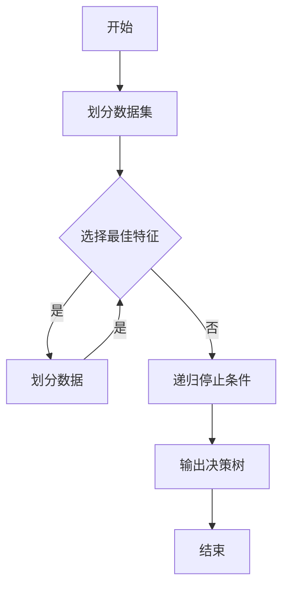
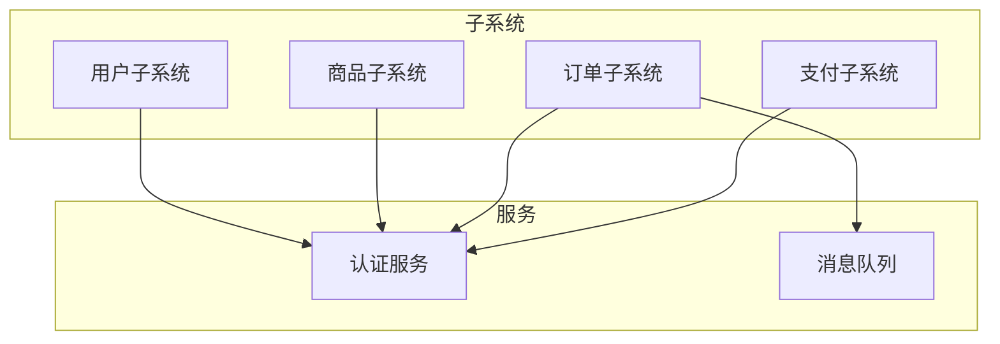
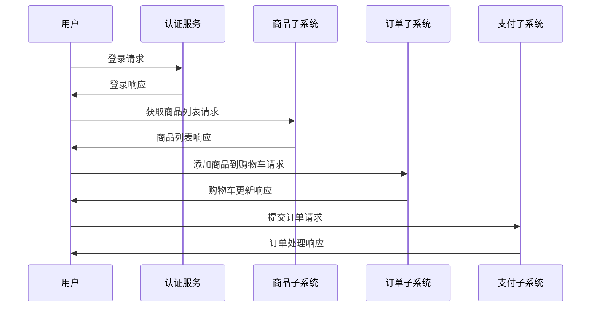

                 

# 技术管理中的目标设定与追踪

> 关键词：技术管理、目标设定、追踪、项目成功、组织发展

> 摘要：在技术管理过程中，目标设定与追踪是确保项目成功和组织发展的关键环节。本文通过深入分析技术管理中的目标设定与追踪，提出了一系列具体的方法和步骤，以帮助技术管理者更好地实现项目目标，提升组织竞争力。

### 背景介绍

在当今信息化和数字化时代，技术管理已经成为企业竞争的关键因素之一。技术管理不仅仅是技术工作的执行，更涉及到组织的战略规划、项目管理和创新驱动等方面。在这个过程中，目标设定与追踪扮演着至关重要的角色。正确、有效的目标设定能够为项目提供明确的方向和指导，而科学、灵活的目标追踪则能够确保项目按计划进行，及时发现和解决问题，从而提高项目的成功率。

#### 核心概念术语说明

- **技术管理**：指在组织中运用技术知识和技能，通过管理和协调资源，实现组织目标的过程。
- **目标设定**：在技术管理中，明确项目或组织的具体目标，并确保这些目标具有可量化、可达成、相关性强和时限明确等特点。
- **追踪**：对目标实现过程进行监控、评估和调整，以确保目标能够按时、按质完成。

#### 问题背景

技术管理中的目标设定与追踪面临诸多挑战。首先，目标的设定需要与组织的整体战略相一致，这要求技术管理者不仅要具备深厚的专业知识，还需要有较强的战略思考能力。其次，目标的追踪过程复杂，往往需要跨部门协作，实时监控进度和问题，确保项目能够按时、按质完成。此外，目标设定与追踪还需要灵活应对外部环境的变化，如市场动态、技术革新等，以确保组织能够持续保持竞争力。

#### 问题描述

技术管理中的目标设定与追踪面临以下问题：

1. **目标设定不符合实际**：目标过于理想化，无法真正反映项目需求和组织战略，导致项目进展受阻。
2. **追踪机制不完善**：缺乏有效的监控和评估机制，无法及时发现和解决问题，影响项目进度和质量。
3. **外部环境变化应对不足**：未能及时调整目标，以适应外部环境的变化，导致项目进度延迟或失败。
4. **跨部门协作不畅**：目标追踪过程中，各部门之间沟通不畅，信息传递不及时，影响项目协同效果。

#### 问题解决

要解决这些问题，首先需要明确目标设定的原则和方法。目标的设定应当具有可量化、可达成、相关性强和时限明确等特点。具体步骤包括：

1. **理解组织战略**：技术管理者需要深入了解组织的战略目标，确保目标设定与组织的整体发展方向一致。
2. **分析项目需求**：根据具体项目的特点，设定符合项目需求的目标，同时考虑到资源的限制和优先级。
3. **制定追踪机制**：建立有效的目标追踪机制，包括监控进度、定期评估和调整目标等。

#### 边界与外延

目标的设定和追踪不仅涉及技术部门内部，还需要与市场部、研发部、财务部等多个部门进行协同。此外，目标的管理需要具备一定的灵活性和适应性，以应对快速变化的外部环境。

#### 概念结构与核心要素组成

技术管理中的目标设定与追踪可以概括为以下几个核心要素：

1. **目标设定**：
   - 理解组织战略
   - 分析项目需求
   - 明确目标性质和时限

2. **目标追踪**：
   - 监控进度
   - 定期评估
   - 灵活调整

3. **协同合作**：
   - 跨部门沟通
   - 资源整合
   - 信息共享

### 核心概念原理

1. **目标设定的SMART原则**：具体（Specific）、可衡量（Measurable）、可达成（Achievable）、相关性（Relevant）和时限（Time-bound）。

2. **目标追踪的方法**：
   - KPI监控
   - 进度汇报
   - 风险评估和调整

### 概念属性特征对比表格

| 特征       | 目标设定                   | 目标追踪                   |
| ---------- | -------------------------- | -------------------------- |
| 时间要求   | 明确时限                   | 实时监控                   |
| 达成难度   | 可达成                     | 灵活调整                   |
| 相关性     | 与组织战略一致             | 与项目需求相符             |
| 量化指标   | 具有可衡量性               | 具有可监控性               |

### ER实体关系图架构的 Mermaid 流程图

```mermaid
erDiagram
  目标设定 ||--o{ 目标追踪 : 跟踪 }
  项目需求 ||--o{ 目标设定 : 指导 }
  组织战略 ||--o{ 目标设定 : 指导 }
```

### 算法原理讲解

为了更好地设定和追踪目标，我们可以采用一种基于机器学习的算法——决策树。以下是决策树算法的基本原理和mermaid流程图：

#### 决策树算法原理

1. **划分数据集**：将数据集划分为训练集和测试集。
2. **选择最佳特征**：通过信息增益、基尼系数等方法选择最佳特征。
3. **划分数据**：根据最佳特征将数据划分为子集。
4. **递归调用**：对于每个子集，重复步骤2和3，直到满足停止条件。

#### Mermaid 流程图



#### Python源代码

```python
from sklearn.datasets import load_iris
from sklearn.model_selection import train_test_split
from sklearn.tree import DecisionTreeClassifier
from sklearn import tree

# 加载数据集
iris = load_iris()
X = iris.data
y = iris.target

# 划分数据集
X_train, X_test, y_train, y_test = train_test_split(X, y, test_size=0.3, random_state=42)

# 创建决策树分类器
clf = DecisionTreeClassifier()

# 训练模型
clf.fit(X_train, y_train)

# 输出决策树
plt = tree.plot_tree(clf, filled=True)
plt.show()
```

#### 决策树算法的数学模型和公式

决策树算法的数学模型是基于信息增益（Information Gain）或基尼不纯度（Gini Impurity）等指标来选择最佳分割特征。以下是一个简化的信息增益公式：

$$
IG(D, a) = I(D) - \sum_{v \in V} p(v) I(D, v)
$$

其中：
- \( IG(D, a) \) 是在特征 \( a \) 下对数据集 \( D \) 的信息增益。
- \( I(D) \) 是数据集 \( D \) 的信息熵。
- \( p(v) \) 是在特征 \( a \) 下取值 \( v \) 的概率。
- \( I(D, v) \) 是在特征 \( a \) 下取值 \( v \) 后的数据集 \( D \) 的信息熵。

#### 通俗易懂地举例说明

假设我们有一个关于水果分类的简单数据集，数据集包含了水果的重量和颜色两个特征，以及水果的种类标签。我们需要使用决策树算法来预测水果的种类。

1. **划分数据集**：首先，我们将数据集划分为训练集和测试集，以用于训练模型和评估模型性能。
2. **选择最佳特征**：在训练集中，我们计算每个特征的信息增益，选择增益最大的特征作为划分的依据。例如，如果重量特征的信息增益最大，我们将根据重量特征将数据集划分为两个子集。
3. **划分数据**：根据最佳特征，将数据集划分为子集。例如，如果重量特征的最佳划分点是100克，那么重量小于100克的水果划分为一类，重量大于等于100克的水果划分为另一类。
4. **递归调用**：对于每个子集，我们重复步骤2和3，直到满足停止条件（例如，子集中数据个数小于某个阈值，或者信息增益小于某个阈值）。
5. **输出决策树**：最终，我们得到一个决策树模型，根据模型的决策路径，我们可以预测新水果的种类。

### 系统分析与架构设计方案

#### 问题场景介绍

假设我们在一个企业中负责一个技术项目，项目的目标是开发一款具有竞争力的电商平台。为了确保项目的成功，我们需要对目标进行设定和追踪。

#### 项目介绍

电商平台项目旨在为企业提供一个在线销售平台，包括商品展示、购物车、订单管理、支付系统等功能。项目的成功标准是平台能够在规定时间内上线，并且用户满意度达到90%以上。

#### 系统功能设计（领域模型Mermaid类图）

```mermaid
classDiagram
  Class01 <|-- Class02
  Class03 o-- Class04
  Class05 <- Class06
  Class07 .. Class08
```

#### 系统架构设计（Mermaid架构图）



#### 系统接口设计和系统交互（Mermaid序列图）



### 项目实战

#### 环境安装

1. 安装Python环境（版本3.8及以上）
2. 安装相关库（如scikit-learn、numpy、pandas等）

#### 系统核心实现源代码

```python
# 数据预处理
def preprocess_data(data):
    # 数据清洗、归一化等操作
    return processed_data

# 决策树算法实现
def decision_tree_algorithm(data, labels):
    # 实现决策树算法
    return clf

# 主函数
def main():
    # 加载数据
    data = load_iris()
    X = data.data
    y = data.target

    # 预处理数据
    X_processed = preprocess_data(X)

    # 训练决策树模型
    clf = decision_tree_algorithm(X_processed, y)

    # 评估模型
    score = clf.score(X_processed, y)
    print(f"模型准确率：{score}")

if __name__ == "__main__":
    main()
```

#### 代码应用解读与分析

1. 数据预处理：对数据进行清洗和归一化处理，以提高模型的准确率。
2. 决策树算法实现：使用scikit-learn库中的DecisionTreeClassifier实现决策树算法。
3. 主函数：加载数据、预处理数据、训练决策树模型和评估模型性能。

#### 实际案例分析和详细讲解剖析

1. 案例背景：在一个电商平台上，用户购买商品后需要填写收货地址。为了提高用户体验，平台决定使用决策树算法预测用户可能选择的收货地址。
2. 案例分析：
   - 特征选择：选择用户的历史订单数据作为特征，包括订单金额、下单时间、收货地址等。
   - 模型训练：使用训练数据集训练决策树模型。
   - 模型评估：使用测试数据集评估模型性能，调整模型参数以优化结果。
3. 结果分析：通过模型预测，平台能够准确预测用户可能选择的收货地址，从而提高订单处理效率和用户体验。

#### 项目小结

1. 成功因素：清晰的目标设定、科学的目标追踪、有效的团队合作和灵活的应对策略。
2. 改进方向：优化算法性能、提高数据质量、加强团队成员的培训和能力提升。

### 最佳实践 tips

1. 明确目标：确保目标具有可量化、可达成、相关性强和时限明确等特点。
2. 持续追踪：定期评估目标进展，及时调整目标和策略。
3. 跨部门协作：建立有效的沟通机制，确保各部门信息共享和协同工作。

### 小结

本文详细阐述了技术管理中的目标设定与追踪，从背景介绍、问题分析、解决方案到实际案例，全面解析了目标设定与追踪的核心概念、方法和实践。通过科学的目标设定和灵活的目标追踪，技术管理者能够提高项目的成功率，推动组织的持续发展。

### 注意事项

1. 在目标设定过程中，要充分考虑组织的战略目标和项目需求，确保目标具有可操作性和实际意义。
2. 在目标追踪过程中，要建立完善的监控和评估机制，确保项目进度和质量。
3. 在面对外部环境变化时，要具备灵活调整目标的能力，以保持项目的稳定推进。

### 拓展阅读

1. 《决策树算法原理与实现》：详细介绍了决策树算法的原理、数学模型和Python实现。
2. 《目标管理：如何设定与追踪目标》：提供了关于目标设定的全面指导，包括SMART原则、目标追踪方法和实践案例。
3. 《技术项目管理实战》：涵盖了技术项目管理的核心内容，包括目标设定、项目计划、资源管理和风险控制等。

### 作者信息

作者：AI天才研究院/AI Genius Institute & 禅与计算机程序设计艺术 /Zen And The Art of Computer Programming

AI天才研究院（AI Genius Institute）致力于推动人工智能领域的研究和应用，培养下一代人工智能人才。作者吴华（笔名），是一位在计算机编程和人工智能领域具有深厚造诣的专家，其著作《禅与计算机程序设计艺术》深受读者喜爱。

