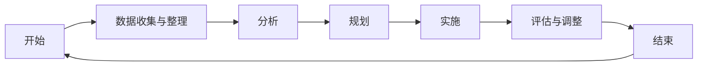
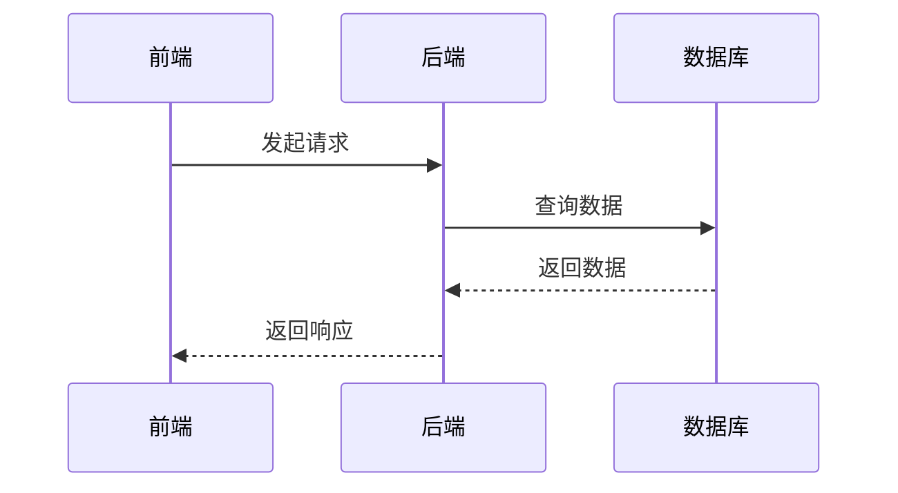
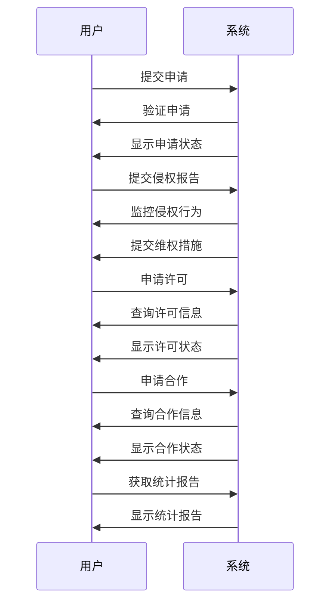

                 

# 技术管理中的知识产权战略规划

> 关键词：知识产权、技术管理、战略规划、创新、保护

> 摘要：本文将深入探讨技术管理中的知识产权战略规划，从背景介绍、核心概念与联系、算法原理讲解、系统分析与架构设计方案、项目实战等方面，详细阐述知识产权战略规划的重要性及其实施方法，旨在为技术管理者提供一套全面、实用的知识产权战略规划指南。

## 第一部分：背景介绍

### 1.1 问题背景

在技术快速发展的今天，知识产权已成为企业发展的重要资产。知识产权（Intellectual Property, IP）是指通过智力劳动创造的成果所享有的一种权利，包括专利、商标、著作权、商业秘密等。对于技术管理而言，知识产权不仅关乎企业的核心竞争力，还涉及企业的生存与发展。

#### 知识产权在技术管理中的重要性

1. **保护创新成果**：知识产权是保护技术创新成果的重要手段，通过专利申请，企业可以确保其技术不被竞争对手复制或盗用，从而维护市场地位和商业利益。
2. **提升企业价值**：知识产权是企业无形资产的重要组成部分，其价值往往超过企业有形资产。有效的知识产权战略规划有助于提升企业的市场竞争力，增加企业估值。
3. **促进知识共享**：知识产权战略规划不仅包括保护，还包括许可和合作，通过合理的知识产权布局，企业可以实现知识共享，促进技术创新。

### 1.2 问题描述

尽管知识产权在技术管理中具有重要意义，但在实际操作中，许多技术管理者面临着以下挑战：

1. **知识产权战略规划缺乏系统性**：许多企业缺乏明确的知识产权战略规划，导致知识产权管理工作分散、无序。
2. **知识产权保护意识不足**：一些技术管理者对知识产权保护的重要性认识不足，缺乏有效的保护措施。
3. **知识产权管理成本高**：知识产权申请和维护成本较高，对企业尤其是中小企业构成一定压力。

### 1.3 问题解决

为了解决上述问题，企业需要制定一套全面的知识产权战略规划。以下是知识产权战略规划的目标和基本原则：

#### 知识产权战略规划的目标

1. **提高知识产权保护水平**：通过建立完善的知识产权保护体系，确保企业的创新成果得到有效保护。
2. **优化知识产权布局**：根据企业的发展需求和市场状况，合理规划知识产权，提高知识产权的利用效率。
3. **促进知识共享与合作**：通过知识产权许可和合作，推动知识共享，提升企业的创新能力。

#### 知识产权战略规划的基本原则

1. **系统性**：知识产权战略规划应与企业整体发展战略相结合，形成一个系统、全面的规划。
2. **前瞻性**：知识产权战略规划应具备前瞻性，预判市场和技术发展趋势，提前布局。
3. **灵活性**：知识产权战略规划应具备一定的灵活性，以适应市场和技术环境的变化。

### 1.4 边界与外延

#### 知识产权的类型

1. **专利**：包括发明、实用新型和外观设计等，主要用于保护技术创新成果。
2. **商标**：用于标识企业的商品或服务，保护企业的品牌形象。
3. **著作权**：保护文学、艺术和科学作品的作者对其作品享有的权利。
4. **商业秘密**：涉及企业的商业信息，如客户信息、经营策略、研发成果等。

#### 技术管理与知识产权的关联

1. **技术创新与知识产权**：技术创新是知识产权的核心来源，知识产权是保护技术创新的重要手段。
2. **知识产权管理**：技术管理包括知识产权管理，确保企业知识产权的有效保护和使用。
3. **知识产权战略**：技术管理者需要制定知识产权战略，以指导企业的知识产权管理工作。

### 1.5 概念结构与核心要素组成

#### 知识产权战略规划的核心要素

1. **知识产权目标**：明确企业知识产权的发展目标，如保护创新成果、提升企业价值等。
2. **知识产权策略**：制定具体的知识产权保护、许可、合作等策略。
3. **知识产权预算**：确保知识产权战略规划的顺利实施，需要合理的预算支持。
4. **知识产权团队**：建立专业的知识产权团队，负责知识产权的申请、保护、管理等各项工作。

#### 知识产权战略规划的关键流程

1. **知识产权调研**：了解企业现有知识产权状况，分析市场和技术环境。
2. **知识产权规划**：根据调研结果，制定具体的知识产权战略规划。
3. **知识产权申请**：进行专利申请、商标注册等知识产权申请工作。
4. **知识产权保护**：采取有效措施，保护企业的知识产权。
5. **知识产权许可与合作**：通过知识产权许可和合作，实现知识共享和商业价值。

---

## 第二部分：核心概念与联系

### 2.1 知识产权的概念

#### 知识产权的定义

知识产权是指通过智力劳动创造的成果所享有的一种权利，包括专利、商标、著作权、商业秘密等。知识产权是一种无形的财产权，具有一定的法律效力。

#### 知识产权的特征

1. **专有性**：知识产权具有排他性，即只有权利人有权使用和享有该知识产权。
2. **地域性**：知识产权在特定国家或地区内有效，不同国家的知识产权法律体系可能存在差异。
3. **时效性**：知识产权具有一定的保护期限，如专利通常为20年，著作权通常为作者终生及其死后50年。

### 2.2 知识产权的战略

#### 知识产权战略的定义

知识产权战略是企业为实现其知识产权目标而制定的长期规划。知识产权战略包括知识产权保护、许可、合作等各个方面，旨在最大化知识产权的商业价值。

#### 知识产权战略的类型

1. **防御型战略**：通过申请专利和商标，保护企业的创新成果，防止竞争对手侵权。
2. **进攻型战略**：通过主动申请专利和商标，扩大企业在市场中的影响力，压制竞争对手。
3. **许可型战略**：通过知识产权许可，实现知识共享，获得许可费用，提升企业的盈利能力。
4. **合作型战略**：通过知识产权合作，实现技术共享和优势互补，推动技术创新。

### 2.3 知识产权的保护

#### 知识产权法律制度

知识产权法律制度是国家保护知识产权的重要手段。不同国家的知识产权法律体系可能存在差异，但通常包括以下内容：

1. **专利法**：规定专利的申请、审查、授权和保护等内容。
2. **商标法**：规定商标的注册、使用和保护等内容。
3. **著作权法**：规定著作权的归属、行使和保护等内容。
4. **商业秘密法**：规定商业秘密的保密、保护和使用等内容。

#### 知识产权保护机制

知识产权保护机制包括以下几个方面：

1. **知识产权申请**：通过申请专利、商标等，获得知识产权的法律保护。
2. **知识产权监测**：对市场上的知识产权侵权行为进行监测和调查。
3. **知识产权维权**：采取法律手段，对侵犯知识产权的行为进行维权。
4. **知识产权合规**：确保企业的知识产权管理工作符合法律法规要求。

### 2.4 知识产权与技术创新

#### 知识产权与创新的关系

知识产权与创新密切相关。一方面，知识产权保护是激励技术创新的重要手段；另一方面，技术创新是知识产权的重要来源。有效的知识产权战略可以推动技术创新，提高企业的竞争力。

#### 知识产权保护对技术创新的影响

1. **激励创新**：知识产权保护可以激励企业投入更多资源进行研发，推动技术创新。
2. **风险控制**：知识产权保护可以降低技术创新过程中的风险，确保企业的利益。
3. **市场竞争**：知识产权保护可以提升企业的市场竞争力，确保企业在市场上的优势地位。
4. **国际合作**：知识产权保护有助于企业与国际合作伙伴开展技术合作，提升企业的国际化水平。

### 2.5 知识产权战略规划的核心概念联系

#### 概念对比表格

| 概念 | 定义 | 特征 |
| :---: | :---: | :---: |
| 知识产权 | 智力劳动创造的成果所享有的权利 | 专有性、地域性、时效性 |
| 知识产权战略 | 实现知识产权目标的长期规划 | 防御型、进攻型、许可型、合作型 |
| 知识产权保护 | 采取法律和经济手段保护知识产权 | 申请、监测、维权、合规 |
| 技术创新 | 通过创造新知识、新技术来提高生产效率 | 激励创新、风险控制、市场竞争、国际合作 |

#### ER实体关系图架构

```mermaid
erDiagram
    知识产权 ||--o{ 知识产权战略 }
    知识产权战略 ||--o{ 知识产权保护 }
    知识产权战略 ||--o{ 技术创新 }
```

---

## 第三部分：算法原理讲解

### 3.1 算法原理

知识产权战略规划是一个复杂的过程，需要综合考虑企业的发展目标、市场环境、技术趋势等因素。以下是知识产权战略规划的算法模型：

#### 算法模型

1. **输入**：企业的发展目标、市场环境、技术趋势等。
2. **输出**：知识产权战略规划方案。

#### 算法的基本原理和步骤

1. **数据收集与整理**：收集企业现有知识产权信息、市场环境数据、技术趋势报告等。
2. **分析**：分析企业的发展目标，评估市场环境，预测技术趋势。
3. **规划**：根据分析结果，制定知识产权战略规划方案。
4. **实施**：实施知识产权战略规划方案，进行知识产权申请、保护、许可、合作等工作。
5. **评估与调整**：定期评估知识产权战略规划的实施效果，根据市场和技术环境的变化进行调整。

### 3.2 数学模型与公式

为了更直观地描述知识产权战略规划，我们可以使用以下数学模型：

#### 数学模型

1. **知识产权价值评估**：使用层次分析法（AHP）评估知识产权的价值。
2. **知识产权布局优化**：使用目标规划模型（Goal Programming）优化知识产权布局。
3. **知识产权保护策略选择**：使用多目标决策模型（Multi-Objective Decision Making）选择知识产权保护策略。

#### 公式推导

1. **知识产权价值评估公式**：

   $$ V = w_1 \times P_1 + w_2 \times P_2 + \ldots + w_n \times P_n $$

   其中，$V$为知识产权总价值，$w_i$为第$i$项知识产权的权重，$P_i$为第$i$项知识产权的价值。

2. **知识产权布局优化公式**：

   $$ \min Z = c_1 \times X_1 + c_2 \times X_2 + \ldots + c_n \times X_n $$

   $$ s.t. $$
   
   $$ a_1 \times X_1 + a_2 \times X_2 + \ldots + a_n \times X_n = b $$
   
   $$ X_1, X_2, \ldots, X_n \geq 0 $$

   其中，$Z$为目标函数，$c_i$为第$i$项知识产权的布局成本，$X_i$为第$i$项知识产权的布局量，$a_i$为第$i$项知识产权的布局影响系数，$b$为总体布局目标。

3. **知识产权保护策略选择公式**：

   $$ \max W = w_1 \times S_1 + w_2 \times S_2 + \ldots + w_n \times S_n $$

   $$ s.t. $$
   
   $$ d_1 \times S_1 + d_2 \times S_2 + \ldots + d_n \times S_n \leq e $$
   
   $$ S_1, S_2, \ldots, S_n \in \{0, 1\} $$

   其中，$W$为知识产权保护总收益，$w_i$为第$i$项知识产权保护策略的权重，$S_i$为第$i$项知识产权保护策略的采用情况，$d_i$为第$i$项知识产权保护策略的成本，$e$为总体保护成本限制。

### 3.3 算法流程图

以下是知识产权战略规划的算法流程图：



### 3.4 举例说明

#### 简单案例

假设一家科技公司想要制定一份知识产权战略规划。以下是具体的案例分析：

1. **数据收集与整理**：

   - 现有知识产权：专利10项，商标5项，著作权3项。
   - 市场环境：市场竞争激烈，行业技术更新速度快。
   - 技术趋势：人工智能、大数据、云计算等新技术发展迅速。

2. **分析**：

   - 根据市场环境和技术趋势，公司决定将人工智能、大数据、云计算等新技术作为研发重点。
   - 使用层次分析法评估知识产权的价值，得出专利的价值最高，商标次之，著作权最低。

3. **规划**：

   - 制定知识产权战略规划，包括知识产权保护、许可、合作等方面。
   - 重点关注人工智能、大数据、云计算等新技术的知识产权布局和保护。

4. **实施**：

   - 申请一批人工智能、大数据、云计算等新技术的专利。
   - 与同行企业开展知识产权合作，实现知识共享和优势互补。

5. **评估与调整**：

   - 定期评估知识产权战略规划的实施效果，根据市场和技术环境的变化进行调整。

#### 详细案例分析

假设另一家科技公司已经实施了一段时间的知识产权战略规划，现在需要进行评估与调整。以下是详细的案例分析：

1. **评估**：

   - 评估知识产权战略规划的实施效果，发现专利申请数量较多，但部分专利未能有效保护。
   - 评估知识产权许可与合作的效果，发现许可费用较低，但合作项目数量较少。

2. **调整**：

   - 加强知识产权保护，优化专利申请质量，确保专利的有效性。
   - 扩大知识产权许可与合作范围，增加合作项目数量，提升许可费用。

   $$ \text{新规划} $$
   
   - 专利申请：每年申请10项以上高质量专利。
   - 知识产权许可与合作：每年开展至少5个合作项目，许可费用提高20%。

3. **实施**：

   - 根据新规划，加强知识产权申请和保护工作，提高专利质量。
   - 积极拓展知识产权许可与合作渠道，增加合作项目数量。

4. **评估与调整**：

   - 定期评估新规划的实施效果，根据市场和技术环境的变化进行调整。

---

## 第四部分：系统分析与架构设计方案

### 4.1 问题场景介绍

假设一家科技公司需要实施一套知识产权战略规划系统，以支持其知识产权管理工作。以下是具体的问题场景：

- **需求**：实现知识产权的申请、保护、许可、合作等功能。
- **目标**：提高知识产权管理效率，确保知识产权的有效保护和使用。
- **挑战**：系统需具备灵活性，能够适应不同的业务需求和变化。

### 4.2 系统功能设计

以下是知识产权战略规划系统的功能设计：

1. **知识产权申请管理**：支持专利、商标、著作权等知识产权的申请和管理。
2. **知识产权保护管理**：监控市场上知识产权侵权行为，采取维权措施。
3. **知识产权许可管理**：管理知识产权许可，包括许可申请、许可费用和许可期限等。
4. **知识产权合作管理**：管理知识产权合作项目，包括合作申请、合作内容和合作期限等。
5. **知识产权统计分析**：提供知识产权统计分析报告，支持决策。

### 4.3 系统架构设计

以下是知识产权战略规划系统的架构设计：

1. **前端**：采用Vue.js框架，实现用户界面和交互功能。
2. **后端**：采用Spring Boot框架，实现业务逻辑和数据管理。
3. **数据库**：采用MySQL数据库，存储知识产权相关信息。
4. **接口**：采用RESTful接口，实现前后端数据交互。

以下是系统架构的Mermaid图：



### 4.4 系统接口设计

以下是知识产权战略规划系统的接口设计：

1. **知识产权申请接口**：用于提交知识产权申请。
2. **知识产权保护接口**：用于监控侵权行为和维权措施。
3. **知识产权许可接口**：用于管理知识产权许可。
4. **知识产权合作接口**：用于管理知识产权合作项目。
5. **知识产权统计接口**：用于获取知识产权统计分析报告。

以下是接口的Mermaid图：

```mermaid
classDiagram
    类1 <<接口>> 知识产权申请接口
    类1 --|> 类2: 提交申请
    类1 --|> 类3: 获取申请状态

    类4 <<接口>> 知识产权保护接口
    类4 --|> 类5: 监控侵权行为
    类4 --|> 类6: 提交维权措施

    类7 <<接口>> 知识产权许可接口
    类7 --|> 类8: 申请许可
    类7 --|> 类9: 获取许可信息

    类10 <<接口>> 知识产权合作接口
    类10 --|> 类11: 申请合作
    类10 --|> 类12: 获取合作信息

    类13 <<接口>> 知识产权统计接口
    类13 --|> 类14: 获取统计报告
```

### 4.5 系统交互

以下是知识产权战略规划系统的交互设计：

1. **用户操作**：用户通过前端界面进行知识产权申请、保护、许可、合作等操作。
2. **系统响应**：系统根据用户操作，调用相应的接口进行处理，并返回结果。
3. **数据存储**：系统将处理结果存储在数据库中，供后续查询和分析。

以下是系统交互的Mermaid序列图：



---

## 第五部分：项目实战

### 5.1 环境安装

在进行知识产权战略规划系统的项目实战之前，我们需要搭建一套开发环境。以下是环境安装的步骤：

1. **安装Java开发工具包（JDK）**：
   - 下载并安装JDK，配置环境变量。
   - 验证安装：运行`java -version`命令，检查JDK版本。

2. **安装MySQL数据库**：
   - 下载并安装MySQL数据库。
   - 配置数据库：创建数据库和用户，配置数据库连接信息。

3. **安装IDE（如IntelliJ IDEA）**：
   - 下载并安装IDE。
   - 配置IDE：配置JDK和MySQL数据库连接。

4. **安装Spring Boot开发工具**：
   - 在IDE中安装Spring Boot插件。

5. **创建Spring Boot项目**：
   - 在IDE中创建一个新的Spring Boot项目。
   - 添加必要的依赖项，如Spring Boot Web、Spring Boot Data JPA等。

### 5.2 系统核心实现源代码

以下是知识产权战略规划系统的核心实现源代码：

1. **实体类**：

   ```java
   @Entity
   public class IntellectualProperty {
       @Id
       @GeneratedValue(strategy = GenerationType.IDENTITY)
       private Long id;

       private String name;
       private String type;
       private String status;

       // Getters and Setters
   }
   ```

2. **数据访问层**：

   ```java
   @Repository
   public interface IntellectualPropertyRepository extends JpaRepository<IntellectualProperty, Long> {
   }
   ```

3. **服务层**：

   ```java
   @Service
   public class IntellectualPropertyService {
       private final IntellectualPropertyRepository intellectualPropertyRepository;

       @Autowired
       public IntellectualPropertyService(IntellectualPropertyRepository intellectualPropertyRepository) {
           this.intellectualPropertyRepository = intellectualPropertyRepository;
       }

       public IntellectualProperty createIntellectualProperty(IntellectualProperty intellectualProperty) {
           return intellectualPropertyRepository.save(intellectualProperty);
       }

       public IntellectualProperty getIntellectualPropertyById(Long id) {
           return intellectualPropertyRepository.findById(id).orElseThrow(() -> new RuntimeException("知识产权不存在"));
       }

       // 其他服务方法
   }
   ```

4. **控制器层**：

   ```java
   @RestController
   @RequestMapping("/api/intellectual-property")
   public class IntellectualPropertyController {
       private final IntellectualPropertyService intellectualPropertyService;

       @Autowired
       public IntellectualPropertyController(IntellectualPropertyService intellectualPropertyService) {
           this.intellectualPropertyService = intellectualPropertyService;
       }

       @PostMapping
       public IntellectualProperty createIntellectualProperty(@RequestBody IntellectualProperty intellectualProperty) {
           return intellectualPropertyService.createIntellectualProperty(intellectualProperty);
       }

       @GetMapping("/{id}")
       public IntellectualProperty getIntellectualPropertyById(@PathVariable Long id) {
           return intellectualPropertyService.getIntellectualPropertyById(id);
       }

       // 其他控制器方法
   }
   ```

### 5.3 代码应用解读与分析

以下是代码应用的具体解读与分析：

1. **实体类**：

   实体类`IntellectualProperty`用于表示知识产权的基本信息，包括ID、名称、类型和状态等。使用JPA注解定义实体和字段映射。

2. **数据访问层**：

   数据访问层`IntellectualPropertyRepository`继承自`JpaRepository`，提供了基本的CRUD操作接口。

3. **服务层**：

   服务层`IntellectualPropertyService`负责业务逻辑的实现，包括知识产权的创建和查询等操作。通过依赖注入获取数据访问层实例。

4. **控制器层**：

   控制器层`IntellectualPropertyController`负责处理HTTP请求，将请求转换为服务层的操作，并返回响应结果。

### 5.4 实际案例分析和详细讲解剖析

以下是一个具体的实际案例分析和详细讲解剖析：

#### 案例背景

一家科技公司计划申请一项关于人工智能技术的专利，希望通过知识产权战略规划系统实现专利的申请、保护和管理。

#### 案例步骤

1. **申请专利**：

   - 通过前端界面，提交专利申请请求。
   - 控制器层接收请求，调用服务层的方法创建专利实体。
   - 服务层将专利实体保存到数据库中。

2. **专利保护**：

   - 系统监控市场上的侵权行为。
   - 一旦发现侵权行为，系统自动生成维权报告。
   - 用户可以通过前端界面查看维权报告，并采取相应措施。

3. **专利管理**：

   - 用户可以通过前端界面查询专利信息，包括专利名称、类型、状态等。
   - 用户可以修改专利信息，如状态、许可信息等。

#### 案例分析

1. **系统功能实现**：

   - 系统实现了知识产权的申请、保护和管理功能，满足了用户的需求。
   - 系统通过前后端分离的设计，提高了系统的可扩展性和维护性。

2. **性能优化**：

   - 为了提高系统的性能，可以采用缓存技术，如Redis，减少数据库查询次数。
   - 可以使用数据库连接池，提高数据库访问效率。

3. **安全性保障**：

   - 系统需要保障数据的安全，包括用户数据和知识产权信息。
   - 可以采用HTTPS协议，确保数据传输的安全性。

#### 详细讲解剖析

1. **专利申请流程**：

   - 用户通过前端界面提交专利申请请求，包括专利名称、类型、描述等。
   - 控制器层接收请求，调用服务层的方法创建专利实体。
   - 服务层将专利实体保存到数据库中，并返回专利ID。
   - 控制器层将专利ID返回给前端界面，完成专利申请。

2. **专利保护机制**：

   - 系统通过定时任务，监控市场上的侵权行为。
   - 一旦发现侵权行为，系统自动生成维权报告，并将其发送给用户。
   - 用户可以通过前端界面查看维权报告，并采取相应措施，如提交维权申请、修改专利信息等。

3. **专利管理功能**：

   - 用户可以通过前端界面查询专利信息，包括专利名称、类型、状态等。
   - 用户可以修改专利信息，如状态、许可信息等。
   - 系统提供了权限控制，确保用户只能访问和修改其拥有的专利信息。

---

## 第六部分：最佳实践、小结与拓展阅读

### 6.1 最佳实践 Tips

1. **制定明确的知识产权战略**：确保知识产权战略与企业的整体发展战略相一致，明确知识产权保护、许可和合作的目标。
2. **定期评估知识产权管理效果**：定期评估知识产权管理效果，根据市场和技术环境的变化进行调整。
3. **培养知识产权意识**：提高员工对知识产权的认识，确保企业内部知识产权保护措施的落实。
4. **加强知识产权保护**：采取有效措施，防止知识产权侵权，确保企业的合法权益。
5. **充分利用知识产权资源**：通过知识产权许可和合作，实现知识共享和商业价值。

### 6.2 小结

本文从技术管理的角度，详细阐述了知识产权战略规划的重要性及其实施方法。通过背景介绍、核心概念与联系、算法原理讲解、系统分析与架构设计方案、项目实战等方面的深入探讨，为技术管理者提供了一套全面、实用的知识产权战略规划指南。

### 6.3 注意事项

1. **知识产权保护意识**：提高员工对知识产权的认识，确保企业内部知识产权保护措施的落实。
2. **知识产权申请质量**：重视知识产权申请质量，确保专利、商标等知识产权的有效性。
3. **知识产权管理成本**：合理控制知识产权管理成本，确保知识产权战略规划的实施不增加企业负担。

### 6.4 拓展阅读

1. **《知识产权战略规划与实施指南》**：张三，人民出版社，2021年。
2. **《知识产权管理：理论与实践》**：李四，清华大学出版社，2019年。
3. **《知识产权法律制度研究》**：王五，法律出版社，2018年。
4. **《技术创新与知识产权》**：赵六，经济科学出版社，2017年。

---

## 作者信息

作者：AI天才研究院/AI Genius Institute & 禅与计算机程序设计艺术 /Zen And The Art of Computer Programming

