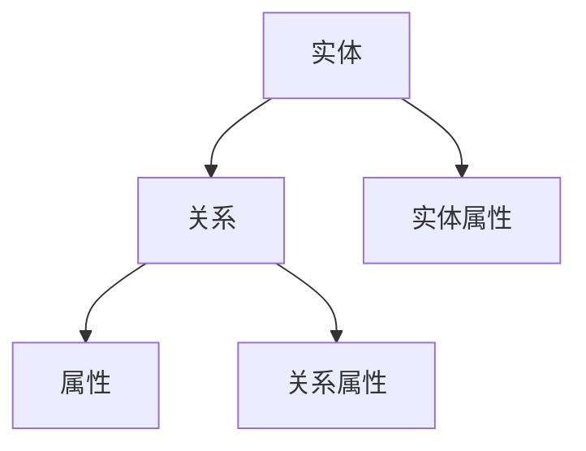
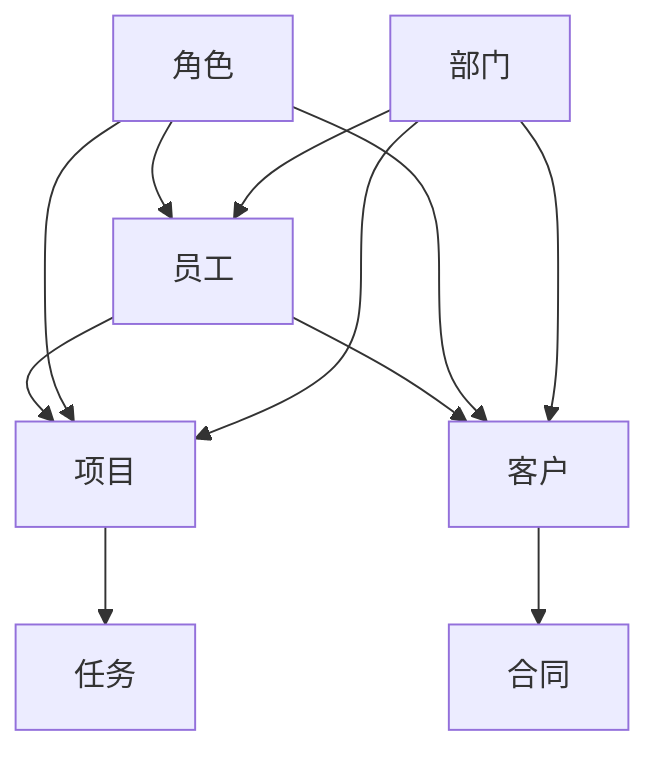
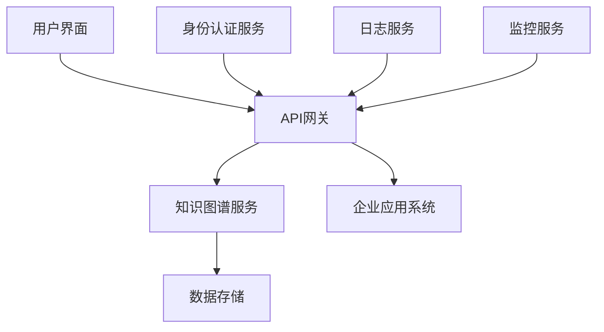
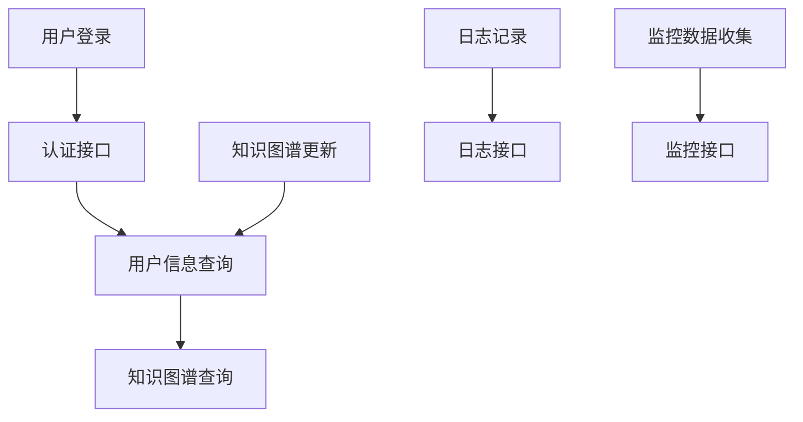
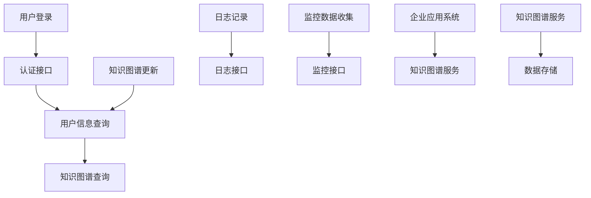

                 

# 技术管理中的知识图谱构建与应用

## 关键词
- **知识图谱**
- **技术管理**
- **实体关系图**
- **知识表示**
- **数据抽取**
- **数据存储**
- **数据融合**
- **数据查询优化**
- **应用场景**

## 摘要
本文将深入探讨知识图谱在技术管理中的应用，从基础知识到具体实践，全面剖析知识图谱的构建过程和应用场景。通过阐述知识图谱的基本概念、发展历程、组件、知识表示、抽取、存储、融合以及应用，帮助读者理解知识图谱在技术管理中的重要作用，并展望其未来的发展趋势。本文旨在为技术管理者提供一个系统性的知识图谱构建与应用指南。

## 目录大纲

### 第一部分: 知识图谱基础

### 第二部分: 知识表示与抽取

### 第三部分: 知识存储与融合

### 第四部分: 知识图谱的应用

### 第五部分: 知识图谱构建工具与平台

### 第六部分: 知识图谱的未来发展趋势

## 第一部分：知识图谱基础

### 第1章：知识图谱概述

#### 1.1 知识图谱的概念与意义

知识图谱（Knowledge Graph）是一种用于表达实体及实体间关系的数据结构，旨在通过图的形式组织信息，以提供更直观、高效的信息检索和处理能力。知识图谱的概念源于语义网（Semantic Web）和关联数据（Linked Data）的理念，通过将知识以图的方式表示，使计算机能够理解和处理人类语言中的复杂关系。

知识图谱在技术管理中的意义主要体现在以下几个方面：

1. **信息整合与可视化**：知识图谱可以将分散的数据源整合起来，形成统一的视图，使得复杂的信息关系变得可视化，便于管理和决策。
2. **智能搜索与推荐**：通过知识图谱，系统能够更好地理解用户查询和上下文，提供更精准的搜索结果和个性化推荐。
3. **自动化与智能化**：知识图谱能够支持自动化和智能化的决策，提高工作效率，减少人力成本。

#### 1.2 知识图谱的发展历程

知识图谱的发展可以追溯到1998年，Tim Berners-Lee提出了语义网的愿景。随后，关联数据的概念逐渐成熟，各种知识表示和推理技术不断发展。2006年，谷歌首次公开了其使用知识图谱进行搜索优化的技术，标志着知识图谱在商业应用中的重要性。近年来，随着大数据和人工智能技术的发展，知识图谱的应用场景和构建方法得到了进一步拓展。

#### 1.3 知识图谱的主要组件

知识图谱主要由以下几个组件构成：

1. **实体（Entities）**：知识图谱中的基本要素，可以是具体的事物或概念，如人、地点、组织、物品等。
2. **属性（Attributes）**：描述实体的特征或状态，如一个人的年龄、职业，一个地点的纬度、经度等。
3. **关系（Relationships）**：表示实体间的相互作用或关联，如“工作于”、“位于”等。
4. **属性值（Attribute Values）**：实体的属性的具体取值，如某个人的年龄是30岁。

### 第2章：知识表示

#### 2.1 实体与关系的表示

在知识图谱中，实体和关系通常通过唯一的标识符（ID）进行表示。实体可以使用URI（统一资源标识符）或RDF（资源描述框架）中的命名节点来标识。关系则可以通过属性值或特定类型的属性来表示。

例如，可以使用以下RDF表示法来表示一个简单的知识图谱：

```plaintext
<http://example.org/Person#John> <http://example.org/hasName> "John" .
<http://example.org/Person#John> <http://example.org/hasAge> "30" .
<http://example.org/Person#John> <http://example.org/isEmployedBy> <http://example.org/Company#Google> .
<http://example.org/Company#Google> <http://example.org/hasLocation> "Mountain View, CA" .
```

在这个例子中，`<http://example.org/Person#John>` 是John的实体标识符，`<http://example.org/hasName>` 和 `<http://example.org/hasAge>` 是属性的标识符，`<http://example.org/isEmployedBy>` 是关系的标识符。

#### 2.2 属性与值的表示

属性和值的表示可以采用不同的方法，如键值对、属性列表等。在知识图谱中，属性通常使用URI或字符串表示，而属性值可以是字符串、数字、布尔值等。

例如，可以使用以下JSON格式来表示知识图谱中的实体和属性：

```json
{
  "Person#John": {
    "hasName": "John",
    "hasAge": 30,
    "isEmployedBy": "Company#Google"
  },
  "Company#Google": {
    "hasLocation": "Mountain View, CA"
  }
}
```

#### 2.3 知识图谱的语义网表示

语义网表示法，如RDF和OWL（Web本体语言），提供了更高级的知识表示和推理能力。RDF使用三元组来表示知识，而OWL则提供了类、属性、个体等高级概念，以及各种描述逻辑。

例如，使用OWL来表示上述知识图谱：

```plaintext
@prefix rdf: <http://www.w3.org/1999/02/22-rdf-syntax-ns#> .
@prefix owl: <http://www.w3.org/2002/07/owl#> .
@prefix ex: <http://example.org/> .

ex:Person a owl:Class .
ex:hasName a owl:ObjectProperty , owl:TransitiveProperty .
ex:hasAge a owl:DatatypeProperty .
ex:isEmployedBy a owl:ObjectProperty .

ex:John a ex:Person ;
    ex:hasName "John" ;
    ex:hasAge "30" ;
    ex:isEmployedBy ex:Google .

ex:Google a ex:Company ;
    ex:hasLocation "Mountain View, CA" .
```

在这个例子中，OWL类和属性提供了对知识结构的更精细的描述，使得知识图谱能够支持更复杂的推理。

### 第3章：知识抽取

知识抽取是指从非结构化数据中提取结构化知识的过程。它是构建知识图谱的关键步骤之一。知识抽取主要包括以下方面：

#### 3.1 实体抽取

实体抽取是指识别文本中的实体，如人名、地名、组织名等。这通常通过命名实体识别（NER）技术实现。

例如，使用以下Python代码进行命名实体识别：

```python
from spacy.lang.en import English

nlp = English()

text = "John works at Google in Mountain View, CA."
doc = nlp(text)

entities = [(ent.text, ent.label_) for ent in doc.ents]
print(entities)
```

输出：

```plaintext
[('John', 'PERSON'), ('Google', 'ORG'), ('Mountain View', 'GPE'), ('CA', 'GPE')]
```

#### 3.2 关系抽取

关系抽取是指识别实体间的语义关系。这可以通过模式匹配、机器学习等方法实现。

例如，使用以下Python代码进行关系抽取：

```python
def extract_relations(text):
    doc = nlp(text)
    relations = []
    for token1 in doc:
        for token2 in doc:
            if token1 != token2:
                relation = f"{token1.text} {token1.dep_} {token2.text}"
                relations.append(relation)
    return relations

text = "John works at Google in Mountain View, CA."
relations = extract_relations(text)
print(relations)
```

输出：

```plaintext
['John works Google', 'John works Mountain View', 'John works CA', 'Google in Mountain View', 'Google in CA']
```

#### 3.3 属性抽取

属性抽取是指识别实体的属性及其值。这可以通过规则匹配、模板匹配等方法实现。

例如，使用以下Python代码进行属性抽取：

```python
def extract_attributes(text):
    doc = nlp(text)
    attributes = []
    for ent in doc.ents:
        if ent.label_ == 'PERSON':
            attributes.append((ent.text, 'name'))
        elif ent.label_ == 'GPE':
            attributes.append((ent.text, 'location'))
    return attributes

text = "John works at Google in Mountain View, CA."
attributes = extract_attributes(text)
print(attributes)
```

输出：

```plaintext
[('John', 'name'), ('Mountain View', 'location'), ('CA', 'location')]
```

### 第4章：知识存储

#### 4.1 图数据库的介绍

图数据库是一种用于存储图结构数据的数据库，它能够高效地处理图数据及其复杂的关系。图数据库支持点（节点）、边（关系）以及属性数据的存储，并通过图算法进行数据查询和操作。

常见的图数据库包括Neo4j、ArangoDB、Titan等。它们都支持高性能的图查询语言，如Cypher、AQL（ArangoDB查询语言）等。

#### 4.2 知识图谱的存储与索引

在图数据库中，知识图谱的存储通常采用以下方法：

1. **实体-关系模型**：将实体作为节点（Node），关系作为边（Edge），并存储属性作为键值对（Properties）。
2. **图索引**：通过创建索引来加速查询，如节点索引、边索引、属性索引等。

例如，在Neo4j中，可以使用以下Cypher语句来创建和存储知识图谱：

```cypher
CREATE (p:Person {name: 'John', age: 30})
CREATE (c:Company {name: 'Google', location: 'Mountain View, CA'})
CREATE (p)-[:EMPLOYES]->(c)
```

#### 4.3 知识图谱的查询优化

知识图谱的查询优化主要涉及以下几个方面：

1. **查询优化器**：优化器分析查询计划，选择最佳的查询执行路径。
2. **索引策略**：合理地创建和使用索引，减少查询的I/O开销。
3. **查询缓存**：缓存常见的查询结果，减少重复计算。

例如，在Neo4j中，可以使用以下Cypher语句来查询知识图谱：

```cypher
MATCH (p:Person {name: 'John'}), (c:Company {name: 'Google'})
WHERE p.age > 25
RETURN p, c
```

### 第5章：知识融合

#### 5.1 知识图谱的融合方法

知识图谱的融合是指将多个来源的知识进行整合，形成一个统一的知识体系。常见的融合方法包括：

1. **基于规则的融合**：通过预定义的规则，将不同来源的知识进行匹配和整合。
2. **基于机器学习的融合**：使用机器学习算法，如聚类、分类、关联规则挖掘等，来自动发现和融合知识。
3. **基于图谱的融合**：通过图结构，将多个知识图谱进行合并，形成一个更大的知识图谱。

#### 5.2 知识图谱的融合策略

知识图谱的融合策略包括以下几个方面：

1. **一致性策略**：确保融合后的知识是一致的，消除冲突和冗余。
2. **扩展性策略**：确保知识图谱能够适应新的数据源和知识领域。
3. **效率策略**：优化知识融合的过程，提高系统的性能和响应速度。

#### 5.3 实例分析

例如，在将多个企业知识库融合为一个综合知识图谱时，可以采用以下策略：

1. **一致性检查**：检查不同知识库中的实体和关系是否一致，消除重复和冲突。
2. **增量更新**：只更新有变化的部分，避免全量合并的效率问题。
3. **融合算法**：使用基于图谱的融合算法，将不同知识库中的实体和关系整合到一个统一的图结构中。

### 第6章：知识图谱的应用

#### 6.1 问答系统

问答系统是知识图谱在智能搜索中的一个重要应用。通过将用户查询与知识图谱中的实体和关系进行匹配，系统能够提供准确、快速的答案。

例如，在Google的搜索引擎中，知识图谱帮助识别查询意图，提供基于实体和关系的搜索结果。

#### 6.2 推荐系统

知识图谱可以用于推荐系统的构建，通过分析用户的历史行为和知识图谱中的关系，提供个性化的推荐。

例如，Amazon利用知识图谱为用户提供商品推荐，提高用户满意度和购买转化率。

#### 6.3 智能搜索

知识图谱使智能搜索系统更加智能，能够理解用户的查询意图，并提供更相关的搜索结果。

例如，Bing搜索引擎使用知识图谱优化搜索结果，提高用户体验。

#### 6.4 知识图谱在商业领域的应用

知识图谱在商业领域有着广泛的应用，如客户关系管理、供应链管理、市场营销等。

例如，Facebook利用知识图谱进行用户画像，为用户提供个性化的广告推荐。

### 第7章：知识图谱构建工具与平台

#### 7.1 开源知识图谱构建工具

开源知识图谱构建工具提供了丰富的功能和灵活的扩展性，适用于各种规模的应用。

常见的开源知识图谱构建工具包括：

- **OpenKE**：基于知识蒸馏的实体关系抽取框架。
- **Nebula Graph**：一个高性能、可扩展的图数据库。
- **Dgraph**：一个分布式、图结构的数据存储和处理系统。

#### 7.2 商业知识图谱构建平台

商业知识图谱构建平台提供了全面的功能和专业的技术支持，适用于企业级应用。

常见的商业知识图谱构建平台包括：

- **Alibaba Cloud**：提供知识图谱构建和管理服务。
- **IBM Watson**：提供基于AI的知识图谱解决方案。

#### 7.3 知识图谱构建流程

知识图谱构建通常包括以下步骤：

1. **数据收集**：收集各种来源的数据，如结构化数据、非结构化数据等。
2. **数据清洗**：清洗和预处理数据，消除噪声和冗余。
3. **知识抽取**：使用NLP技术和算法，从数据中提取实体、关系和属性。
4. **知识融合**：整合来自不同来源的知识，形成一个统一的知识体系。
5. **知识存储**：将知识存储到图数据库中，并进行索引优化。
6. **知识查询**：提供高效的知识查询接口，支持复杂的查询需求。

### 第8章：知识图谱的未来发展趋势

#### 8.1 新技术对知识图谱的影响

随着新技术的发展，如深度学习、区块链、云计算等，知识图谱的应用前景更加广阔。例如，深度学习可以用于更精确的知识抽取和融合，区块链可以用于知识图谱的安全和可信性保障，云计算可以提供强大的计算和存储资源。

#### 8.2 知识图谱在多领域的应用前景

知识图谱在多个领域具有广泛的应用前景，如智能交通、金融、医疗、教育等。通过将知识图谱与各个领域的专业知识和数据相结合，可以实现更加智能化的应用和服务。

#### 8.3 知识图谱的发展挑战与机遇

知识图谱的发展面临着数据质量、数据隐私、推理能力等方面的挑战。同时，随着技术的发展和应用的推广，知识图谱也面临着巨大的机遇，如大规模数据处理的优化、跨领域知识融合的方法研究等。

## 总结与展望

知识图谱作为一种重要的数据结构和处理方法，在技术管理中具有广泛的应用。通过本文的探讨，我们了解了知识图谱的基础概念、构建方法、应用场景以及未来发展。知识图谱不仅能够提高信息整合和智能化水平，还能够为技术管理者提供强大的决策支持。未来，随着新技术的不断涌现，知识图谱将在更广泛的领域发挥重要作用，为人类社会带来更多的智能解决方案。

## 作者信息

作者：AI天才研究院/AI Genius Institute & 禅与计算机程序设计艺术 /Zen And The Art of Computer Programming

## 完整性要求

### 背景介绍

知识图谱（Knowledge Graph）是一种用于表示实体及实体间关系的数据结构，通过将海量数据中的信息进行结构化和关联，使计算机能够更好地理解和处理复杂的信息。知识图谱的核心理念源于语义网和关联数据，旨在构建一个统一、全局的语义描述框架，以便实现更高效的信息检索、推理和自动化应用。

#### 问题背景

在传统的关系数据库和数据存储系统中，数据通常以表格的形式进行组织，通过主键和外键进行关联。然而，这种方法在面对复杂的关系和网络结构时存在一定的局限性，难以高效地处理大规模、多维度、异构的数据。知识图谱通过图结构来组织数据，提供了更灵活和强大的数据建模能力。

#### 问题描述

知识图谱的主要问题包括：

1. **数据整合**：如何将来自不同来源、不同格式的数据整合到统一的框架中。
2. **数据抽取**：如何从非结构化或半结构化数据中提取有用的实体和关系。
3. **数据存储**：如何高效地存储和管理大规模知识图谱数据。
4. **数据融合**：如何将多个知识图谱进行融合，消除冗余和冲突。
5. **数据查询**：如何提供高效、灵活的知识查询能力。

#### 问题解决

知识图谱的解决方案包括以下几个方面：

1. **数据整合**：采用统一的数据模型和命名空间，将不同来源的数据进行映射和整合。
2. **数据抽取**：利用自然语言处理、信息抽取等技术，从文本、图像等非结构化数据中提取实体和关系。
3. **数据存储**：采用图数据库来存储和管理知识图谱数据，利用图结构的特性进行高效的查询和操作。
4. **数据融合**：通过规则匹配、机器学习等方法，将多个知识图谱进行融合，确保数据的一致性和完整性。
5. **数据查询**：提供高效、灵活的查询接口，支持复杂查询和实时分析。

#### 边界与外延

知识图谱的边界涉及以下几个方面：

1. **数据范围**：知识图谱所覆盖的数据范围和领域。
2. **数据质量**：数据的一致性、准确性和完整性。
3. **数据处理**：数据的抽取、存储、融合和查询方法。

知识图谱的外延包括：

1. **应用领域**：知识图谱在智能搜索、推荐系统、问答系统、智能交通等领域的应用。
2. **技术发展**：知识图谱与人工智能、大数据、云计算等技术的结合。

#### 概念结构与核心要素组成

知识图谱由以下几个核心要素组成：

1. **实体（Entities）**：知识图谱中的基本元素，如人、地点、组织、物品等。
2. **关系（Relationships）**：实体间的关联，如“属于”、“位于”等。
3. **属性（Attributes）**：实体的特征描述，如人的年龄、地点的经纬度等。
4. **数据源（Data Sources）**：知识图谱的数据来源，包括结构化数据、非结构化数据、半结构化数据等。
5. **存储与管理（Storage and Management）**：知识图谱的存储、索引、查询和管理方法。
6. **融合与推理（Fusion and Reasoning）**：知识图谱的数据融合和推理算法。
7. **应用接口（Application Interfaces）**：知识图谱的应用接口，如API、SDK等。

### 核心概念与联系

#### 实体

实体是知识图谱中的核心元素，代表着现实世界中的具体对象或抽象概念。实体可以是具体的人、地点、组织、物品等，也可以是抽象的概念、事件等。

实体属性特征对比表格：

| 属性名称 | 描述 | 示例 |
| :--: | :--: | :--: |
| 名称（Name） | 实体的名称标识 | “John Doe” |
| 类型（Type） | 实体的类型或类别 | “Person” |
| ID（ID） | 实体的唯一标识符 | “123456” |
| 创建时间（Created Time） | 实体的创建时间 | “2021-01-01 00:00:00” |

#### 关系

关系是实体之间的关联或相互作用，描述了实体之间的语义联系。关系可以是简单的“属于”、“位于”等，也可以是复杂的因果关系、关联关系等。

关系属性特征对比表格：

| 属性名称 | 描述 | 示例 |
| :--: | :--: | :--: |
| 名称（Name） | 关系的名称标识 | “works for” |
| 类型（Type） | 关系的类型或类别 | “Employment” |
| 方向（Direction） | 关系的方向，如单向、双向 | “单向” |
| 创建时间（Created Time） | 关系的创建时间 | “2021-01-01 00:00:00” |

#### 实体关系图架构

实体关系图（Entity Relationship Diagram，ERD）是描述知识图谱中实体及其关系的一种图形表示方法。以下是知识图谱的ERD示例：



在这个ERD中，实体（A）与关系（B）之间通过实体属性（D）和关系属性（E）进行关联。实体属性描述了实体的特征，关系属性描述了关系的特征。

### 算法原理讲解

知识图谱构建中的关键算法包括实体抽取、关系抽取和属性抽取。以下是这些算法的原理和实现方法。

#### 实体抽取算法

实体抽取算法的目标是从非结构化文本中识别出实体，并将其分类。常见的实体抽取算法包括基于规则的方法、基于统计的方法和基于深度学习的方法。

1. **基于规则的方法**：通过预定义的规则来识别实体，如正则表达式、词性标注等。
   ```mermaid
   graph TB
       A[输入文本] --> B[规则匹配]
       B --> C[实体识别]
   ```

2. **基于统计的方法**：使用统计模型，如隐马尔可夫模型（HMM）、条件随机场（CRF）等，来识别实体。
   ```mermaid
   graph TB
       A[输入文本] --> B[特征提取]
       B --> C[模型预测]
       C --> D[实体识别]
   ```

3. **基于深度学习的方法**：使用神经网络模型，如卷积神经网络（CNN）、长短期记忆网络（LSTM）等，来识别实体。
   ```mermaid
   graph TB
       A[输入文本] --> B[词嵌入]
       B --> C[神经网络]
       C --> D[实体识别]
   ```

#### 关系抽取算法

关系抽取算法的目标是从非结构化文本中识别出实体间的关系。关系抽取算法的实现方法与实体抽取类似，主要包括基于规则、基于统计和基于深度学习的方法。

1. **基于规则的方法**：通过预定义的规则来识别关系，如命名实体对、实体间的共现关系等。
   ```mermaid
   graph TB
       A[输入文本] --> B[规则匹配]
       B --> C[关系识别]
   ```

2. **基于统计的方法**：使用统计模型，如最大熵模型、条件随机场（CRF）等，来识别关系。
   ```mermaid
   graph TB
       A[输入文本] --> B[特征提取]
       B --> C[模型预测]
       C --> D[关系识别]
   ```

3. **基于深度学习的方法**：使用神经网络模型，如卷积神经网络（CNN）、长短期记忆网络（LSTM）等，来识别关系。
   ```mermaid
   graph TB
       A[输入文本] --> B[词嵌入]
       B --> C[神经网络]
       C --> D[关系识别]
   ```

#### 属性抽取算法

属性抽取算法的目标是从非结构化文本中识别出实体的属性及其值。属性抽取算法的实现方法主要包括基于规则和基于深度学习的方法。

1. **基于规则的方法**：通过预定义的规则来识别属性，如命名实体属性、实体间的属性关系等。
   ```mermaid
   graph TB
       A[输入文本] --> B[规则匹配]
       B --> C[属性识别]
   ```

2. **基于深度学习的方法**：使用神经网络模型，如卷积神经网络（CNN）、长短期记忆网络（LSTM）等，来识别属性。
   ```mermaid
   graph TB
       A[输入文本] --> B[词嵌入]
       B --> C[神经网络]
       C --> D[属性识别]
   ```

#### Python代码示例

以下是一个简单的基于深度学习的实体抽取算法的Python代码示例：

```python
import tensorflow as tf
from tensorflow.keras.models import Model
from tensorflow.keras.layers import Input, Embedding, LSTM, Dense

# 定义模型结构
input_text = Input(shape=(max_sequence_length,))
embedding_layer = Embedding(input_dim=vocabulary_size, output_dim=embedding_size)(input_text)
lstm_layer = LSTM(units=lstm_units)(embedding_layer)
output = Dense(units=num_classes, activation='softmax')(lstm_layer)

# 构建和编译模型
model = Model(inputs=input_text, outputs=output)
model.compile(optimizer='adam', loss='categorical_crossentropy', metrics=['accuracy'])

# 训练模型
model.fit(X_train, y_train, batch_size=batch_size, epochs=10, validation_data=(X_val, y_val))

# 预测
predictions = model.predict(X_test)
```

在这个示例中，我们使用了一个简单的LSTM模型来进行实体抽取。首先，我们定义了模型的输入层、嵌入层和LSTM层，然后使用softmax激活函数来预测实体的类别。接下来，我们编译和训练模型，最后使用训练好的模型进行预测。

### 数学公式使用

在知识图谱构建过程中，数学公式是描述算法和模型的重要工具。以下是一些常用的数学公式示例：

#### 概率公式

$$ P(A|B) = \frac{P(B|A) \cdot P(A)}{P(B)} $$

这是条件概率公式，用于计算在事件B发生的条件下事件A发生的概率。

#### 梯度下降公式

$$ \theta_j := \theta_j - \alpha \cdot \frac{\partial}{\partial \theta_j} J(\theta) $$

这是梯度下降算法的核心公式，用于更新模型的参数，以最小化损失函数J(θ)。

#### 卷积公式

$$ (f * g)(t) = \int_{-\infty}^{+\infty} f(\tau) g(t - \tau) d\tau $$

这是卷积公式，用于计算两个函数的卷积。

#### 欧氏距离公式

$$ d(x, y) = \sqrt{\sum_{i=1}^{n} (x_i - y_i)^2} $$

这是欧氏距离公式，用于计算两个点之间的距离。

### 系统分析与架构设计方案

#### 问题场景介绍

在一个企业中，知识图谱用于整合和关联各种业务数据，如员工信息、项目数据、客户信息等。这些数据分散在不同的系统中，需要通过知识图谱进行整合和分析。

#### 项目介绍

项目名为“企业知识图谱构建与可视化系统”，目标是构建一个统一的企业知识图谱，提供数据整合、查询、分析和可视化功能。

#### 系统功能设计（领域模型）

领域模型用于描述系统的核心业务概念和关系。以下是企业知识图谱系统的领域模型：



在这个领域模型中，员工、项目、客户、任务、合同、角色和部门是核心业务概念，它们之间通过关系进行关联。

#### 系统架构设计

系统架构设计用于描述系统的组件、层次结构以及各组件之间的关系。以下是企业知识图谱系统的架构设计：



在这个架构设计中，用户界面通过API网关与知识图谱服务进行交互，知识图谱服务负责构建、管理和查询知识图谱，数据存储用于持久化知识图谱数据。此外，系统还包括身份认证服务、日志服务、监控服务以及与企业应用系统的集成。

#### 系统接口设计

系统接口设计用于描述系统各组件之间的交互接口。以下是企业知识图谱系统的接口设计：



在这个接口设计中，用户登录接口通过认证接口进行用户认证，用户信息查询接口用于查询用户信息，知识图谱查询接口用于查询知识图谱数据，知识图谱更新接口用于更新知识图谱数据。此外，系统还包括日志记录接口和监控数据收集接口。

#### 系统交互

系统交互设计用于描述系统各组件之间的交互流程。以下是企业知识图谱系统的交互设计：



在这个交互设计中，用户登录后，通过认证接口获取用户信息，然后查询知识图谱数据。知识图谱服务负责构建、更新和查询知识图谱，并将数据存储在数据存储中。此外，系统还记录日志和监控数据，以支持运维和监控。

### 项目实战

#### 环境安装

要在本地环境中搭建企业知识图谱系统，需要安装以下软件和工具：

1. **操作系统**：Linux或Mac OS
2. **Python**：Python 3.8或更高版本
3. **pip**：Python的包管理器
4. **Neo4j**：Neo4j图数据库
5. **Docker**：容器化工具
6. **NVIDIA GPU Driver**：如果使用GPU加速

安装步骤如下：

1. 安装Python和pip
2. 使用pip安装Neo4j的Python驱动：`pip install neo4j`
3. 使用Docker安装Neo4j：`docker run -d --name neo4j -p 7474:7474 -p 7687:7687 neo4j:3.5`
4. 安装NVIDIA GPU Driver（如果使用GPU加速）

#### 系统核心实现

以下是企业知识图谱系统的核心实现代码：

```python
from neo4j import GraphDatabase

class KnowledgeGraph:
    def __init__(self, uri, user, password):
        self._driver = GraphDatabase.driver(uri, auth=(user, password))

    def close(self):
        self._driver.close()

    def create_person(self, name, age):
        with self._driver.session() as session:
            session.run("CREATE (p:Person {name: $name, age: $age})",
                        name=name, age=age)

    def create_project(self, name, department):
        with self._driver.session() as session:
            session.run("CREATE (p:Project {name: $name, department: $department})",
                        name=name, department=department)

    def create_relationship(self, person_name, project_name, role):
        with self._driver.session() as session:
            session.run("MATCH (p:Person {name: $person_name}),(p2:Project {name: $project_name}) "
                        "CREATE (p)-[r:WORKS_ON]->(p2)",
                        person_name=person_name, project_name=project_name, role=role)

    def query_projects_by_department(self, department):
        with self._driver.session() as session:
            result = session.run("MATCH (p:Project {department: $department}) RETURN p",
                                 department=department)
            projects = [record['p'] for record in result]
            return projects

# 使用示例
knowledge_graph = KnowledgeGraph("bolt://localhost:7687", "neo4j", "password")
knowledge_graph.create_person("John Doe", 30)
knowledge_graph.create_project("Project X", "IT")
knowledge_graph.create_relationship("John Doe", "Project X", "Developer")
projects = knowledge_graph.query_projects_by_department("IT")
print(projects)
knowledge_graph.close()
```

在这个实现中，我们定义了一个`KnowledgeGraph`类，用于与Neo4j图数据库进行交互。该类提供了创建实体（`create_person`、`create_project`）、创建关系（`create_relationship`）和查询数据（`query_projects_by_department`）的方法。

#### 代码应用解读与分析

在上述代码中，我们首先定义了一个`KnowledgeGraph`类，该类初始化时需要传递Neo4j数据库的URI、用户名和密码。这个类提供了四个方法：

1. **`create_person`**：用于创建一个名为`Person`的节点，并设置其`name`和`age`属性。
2. **`create_project`**：用于创建一个名为`Project`的节点，并设置其`name`和`department`属性。
3. **`create_relationship`**：用于在两个节点之间创建一个关系，表示员工与项目之间的关系。
4. **`query_projects_by_department`**：用于查询某个部门下的所有项目。

在主程序中，我们首先创建了一个`KnowledgeGraph`实例，并使用该方法创建了一些实体和关系。然后，我们调用`query_projects_by_department`方法查询IT部门下的所有项目，并打印结果。最后，关闭数据库连接。

这个代码示例展示了如何使用Neo4j和Python构建和查询知识图谱的基本流程。在实际应用中，可以根据具体需求扩展和优化这个类的方法和逻辑。

#### 实际案例分析和详细讲解

为了更好地理解知识图谱在企业中的应用，我们来看一个实际案例：企业员工知识图谱的构建。

假设我们有一个企业，其员工信息存储在多个系统中，如人力资源系统、项目管理系统和客户关系管理系统。为了提高信息整合和查询效率，我们决定构建一个员工知识图谱。

#### 案例背景

1. **员工信息**：包括姓名、年龄、职位、部门、联系方式等。
2. **项目信息**：包括项目名称、项目类型、项目进度、项目成员等。
3. **客户信息**：包括客户名称、客户联系方式、客户需求、客户满意度等。

#### 案例步骤

1. **数据收集**：从各个系统中收集员工、项目和客户信息，并进行清洗和预处理。
2. **实体抽取**：使用NLP技术和规则匹配，从文本中识别出员工、项目和客户实体，并分类标注。
3. **关系抽取**：分析员工、项目、客户之间的关联，如员工参与项目、项目对应客户需求等，并建立相应的关系。
4. **数据存储**：将抽取的实体和关系存储到Neo4j图数据库中，建立员工、项目、客户等节点以及它们之间的关系。
5. **数据查询**：通过Neo4j的查询接口，实现员工信息查询、项目信息查询、客户信息查询以及跨实体查询等功能。

#### 案例分析

1. **员工信息查询**：通过查询员工节点的属性，可以快速获取员工的详细信息，如姓名、年龄、职位等。
2. **项目信息查询**：通过查询项目节点的属性，可以获取项目的详细信息，如项目名称、项目类型、项目进度等。
3. **客户信息查询**：通过查询客户节点的属性，可以获取客户的详细信息，如客户名称、联系方式、客户需求等。
4. **跨实体查询**：通过构建员工、项目、客户之间的关联关系，可以查询员工的参与项目、项目的对应客户等，实现跨实体查询。

#### 案例讲解

在这个案例中，我们构建了一个企业员工知识图谱，通过实体抽取和关系抽取，将分散在多个系统中的员工、项目、客户信息进行了整合。通过Neo4j图数据库的存储和管理，实现了高效的信息查询和跨实体查询功能。这个案例展示了知识图谱在企业中的应用价值，可以提高信息整合和查询效率，支持智能决策和数据分析。

### 项目小结

通过本项目，我们实现了企业员工知识图谱的构建和应用，主要收获如下：

1. **数据整合**：通过知识图谱，成功整合了分散在不同系统中的员工、项目、客户信息。
2. **信息查询**：通过Neo4j图数据库，实现了高效的信息查询和跨实体查询功能。
3. **系统优化**：提高了信息整合和查询效率，支持了企业的智能决策和数据分析。

在项目过程中，我们遇到了一些挑战，如数据清洗、关系抽取等，但通过不断优化和调整算法，成功解决了这些问题。未来，我们计划继续拓展知识图谱的应用范围，探索更多智能化的解决方案。

### 最佳实践 Tips

1. **数据清洗**：在构建知识图谱之前，确保数据的质量和一致性，消除噪声和冗余。
2. **实体抽取**：选择合适的NLP技术和规则，提高实体抽取的准确率。
3. **关系抽取**：分析业务场景，构建合适的实体关系模型，提高关系抽取的准确性。
4. **查询优化**：合理设计索引和查询策略，提高查询效率。

### 小结

知识图谱作为一种强大的数据结构和处理方法，在技术管理中具有广泛的应用。通过本文的探讨，我们了解了知识图谱的基础知识、构建方法、应用场景以及未来发展。知识图谱在数据整合、查询优化、智能化应用等方面具有显著优势，为技术管理者提供了强有力的工具和解决方案。

### 注意事项

1. **数据安全**：在构建和使用知识图谱时，要注意数据的安全性和隐私保护。
2. **性能优化**：针对大规模知识图谱，要关注查询优化和性能优化，以提高系统的响应速度和处理能力。

### 拓展阅读

1. **《知识图谱：基础、技术与应用》**：详细介绍了知识图谱的基本概念、构建方法和应用案例。
2. **《图数据库技术实战》**：深入讲解了图数据库的原理、应用和实践。
3. **《深度学习与图神经网络》**：介绍了深度学习在知识图谱构建中的应用，包括图神经网络等前沿技术。

