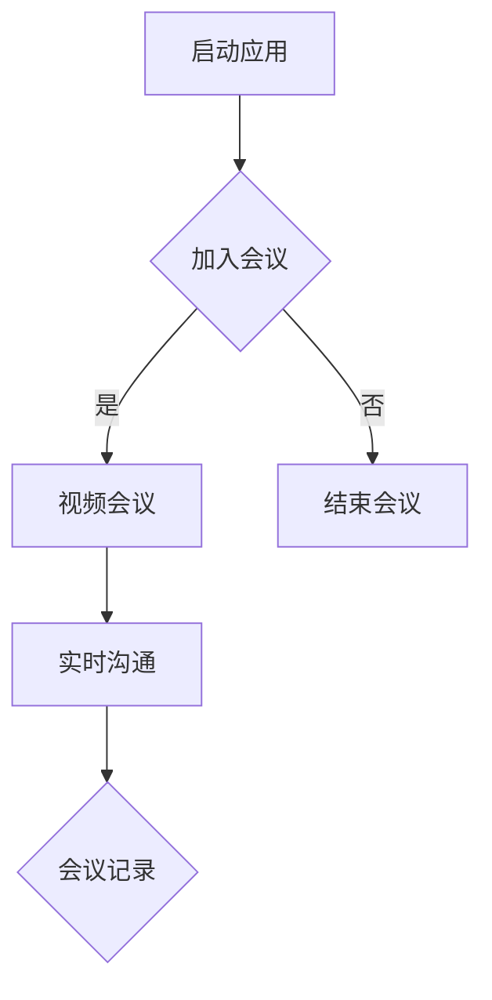
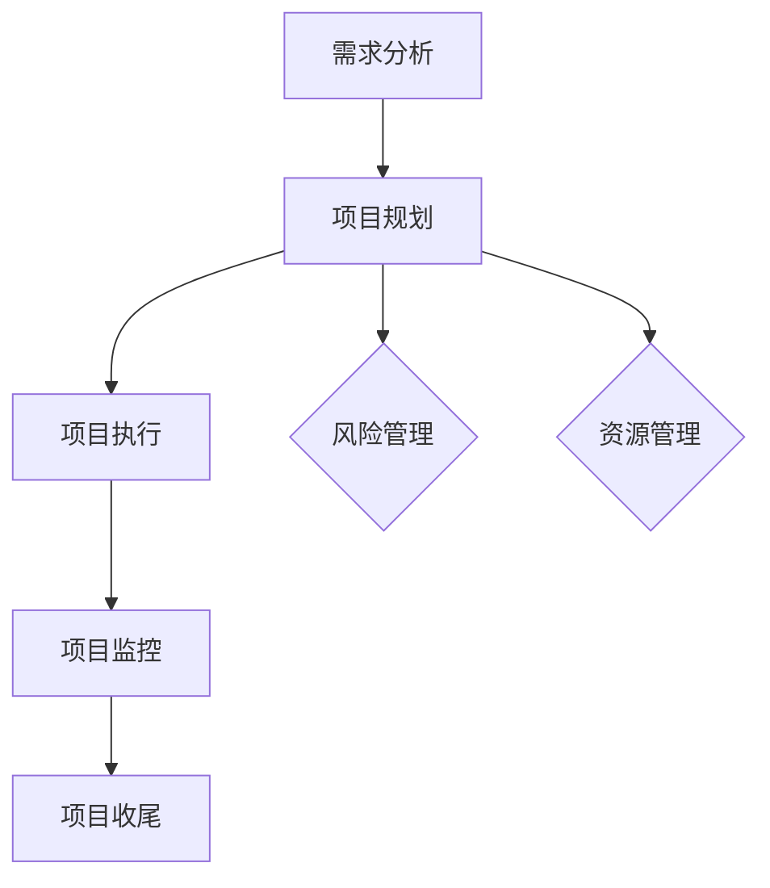

                 

# 技术管理中的跨国团队协作策略

## 关键词

- 技术管理
- 跨国团队
- 协作策略
- 文化差异
- 沟通障碍
- 项目管理
- 技术工具
- 案例分析

## 摘要

本文旨在探讨技术管理中的跨国团队协作策略，分析其背景、核心概念、实施策略、技术工具以及案例分析。文章首先介绍了跨国团队协作的背景和重要性，接着定义并阐述了关键概念，如文化差异、沟通障碍和项目管理。随后，文章详细介绍了文化适应策略、沟通工具选择策略和项目管理策略。此外，还介绍了支持跨国团队协作的技术工具，并进行了成功与失败的案例分析。最后，文章总结了最佳实践和未来趋势，以期为跨国团队协作提供有价值的指导。

## 目录大纲

1. **背景介绍**

   - 1.1 跨国团队协作的定义
   - 1.2 跨国团队协作的兴起
   - 1.3 跨国团队协作的重要性

   - 2.1 文化差异
   - 2.2 沟通障碍
   - 2.3 项目管理挑战

2. **核心概念与联系**

   - 3.1 文化差异的概念与特征
   - 3.2 沟通障碍的类型与影响
   - 3.3 项目管理方法在跨国团队中的应用

   - 4.1 文化差异与沟通障碍的关系
   - 4.2 文化差异与项目管理方法的关系
   - 4.3 沟通障碍与项目管理方法的关系

3. **策略与实践**

   - 5.1 文化适应策略
   - 5.2 沟通工具选择策略
   - 5.3 项目管理策略

   - 6.1 成功的跨国团队协作案例
   - 6.2 失败的跨国团队协作案例

4. **技术工具**

   - 7.1 在线协作平台
   - 7.2 视频会议软件
   - 7.3 项目管理工具

   - 8.1 技术工具的选择与应用

5. **总结与展望**

   - 9.1 最佳实践与总结
   - 9.2 未来趋势展望

## 第一部分：背景介绍

### 1.1 跨国团队协作的定义

跨国团队协作指的是由来自不同国家、具有不同文化背景和专业技能的成员组成的团队，共同完成特定项目或任务的过程。随着全球化趋势的加剧，跨国团队协作在各个行业中变得越来越普遍。

### 1.2 跨国团队协作的兴起

跨国团队协作的兴起可以追溯到20世纪末，当时跨国公司意识到在全球范围内分配任务和资源可以带来显著的竞争优势。随着互联网和信息技术的发展，跨国团队协作变得更加容易和高效。

### 1.3 跨国团队协作的重要性

跨国团队协作的重要性体现在以下几个方面：

- **资源共享**：跨国团队可以共享不同地区的资源，如技术、市场和人才。
- **创新促进**：不同文化和背景的碰撞可以激发新的想法和创新的解决方案。
- **成本优化**：通过在全球范围内分配任务，企业可以降低运营成本。
- **市场拓展**：跨国团队可以更有效地开拓国际市场。

## 第二部分：核心概念与联系

### 3.1 文化差异的概念与特征

文化差异是指不同国家和地区在价值观、信仰、行为规范、语言等方面的差异。在跨国团队协作中，文化差异可能导致沟通障碍、误解和冲突。

| 文化特征 | 说明 |
| --- | --- |
| 价值观 | 个人主义与集体主义的差异 |
| 语言 | 语言障碍可能导致误解和沟通不畅 |
| 礼仪 | 不同文化对礼仪的要求不同 |

### 3.2 沟通障碍的类型与影响

沟通障碍可以分为语言障碍、文化障碍、技术障碍等类型。这些障碍可能导致团队成员之间的误解、沟通不畅和协作效率低下。

### 3.3 项目管理方法在跨国团队中的应用

在跨国团队中，项目管理方法的应用需要考虑文化差异和沟通障碍。例如，敏捷方法和Scrum框架在跨国团队中具有较好的适应性，因为它们强调迭代、灵活性和频繁的沟通。

## 第三部分：策略与实践

### 5.1 文化适应策略

为了克服文化差异，跨国团队可以采取以下策略：

- **文化敏感性培训**：为团队成员提供文化敏感性培训，帮助他们理解和尊重不同文化的行为规范和价值观。
- **文化包容性政策**：制定文化包容性政策，鼓励团队成员在团队中展示和尊重自己的文化特色。

### 5.2 沟通工具选择策略

选择合适的沟通工具可以提高跨国团队的协作效率。以下是一些常用的沟通工具：

- **在线协作平台**：如Trello、Jira等，用于任务分配和项目管理。
- **视频会议软件**：如Zoom、Microsoft Teams等，用于实时沟通和远程协作。

### 5.3 项目管理策略

在跨国团队中，项目管理策略需要考虑以下几个方面：

- **灵活的项目计划**：根据团队成员的时间和地点，制定灵活的项目计划。
- **频繁的沟通**：定期举行视频会议和在线沟通，确保团队成员之间的信息同步。

## 第四部分：技术工具

### 7.1 在线协作平台

在线协作平台如Trello、Jira等，可以帮助跨国团队进行任务分配、进度跟踪和协作管理。以下是一个在线协作平台的类图示例：

```mermaid
classDiagram
    Class01 <|-- SubClass01
    Class01 ++---> AssociatedClass
    CollaborationPoint <- Teenager
    
    Class01 : +string name
    Class01 : +bool isRegistered
    SubClass01 : +int age
    AssociatedClass : +float salary
    CollaborationPoint : +int speed
```

### 7.2 视频会议软件

视频会议软件如Zoom、Microsoft Teams等，可以用于远程团队的实时沟通和协作。以下是一个视频会议软件的流程图示例：



### 7.3 项目管理工具

项目管理工具如Asana、Microsoft Project等，可以帮助跨国团队进行项目计划、任务分配和进度跟踪。以下是一个项目管理工具的架构图示例：



## 第五部分：案例分析

### 6.1 成功的跨国团队协作案例

一个成功的跨国团队协作案例是谷歌（Google）的全球研发团队。谷歌通过以下措施实现了高效的国际协作：

- **文化敏感性培训**：为团队成员提供文化敏感性培训，促进跨文化沟通。
- **远程协作工具**：使用Google Workspace等远程协作工具，确保团队成员之间的实时沟通和协作。
- **敏捷项目管理**：采用敏捷方法和Scrum框架，确保项目的灵活性和快速迭代。

### 6.2 失败的跨国团队协作案例

一个失败的跨国团队协作案例是某国际跨国企业的项目。该项目失败的原因包括：

- **沟通障碍**：团队成员之间缺乏有效的沟通，导致项目进度严重滞后。
- **文化冲突**：团队成员之间存在文化冲突，导致团队合作效率低下。
- **项目管理不善**：项目管理方法不当，无法有效应对跨国团队的复杂性。

## 第六部分：总结与展望

### 9.1 最佳实践与总结

为了成功实现跨国团队协作，企业可以采取以下最佳实践：

- **文化敏感性培训**：为团队成员提供文化敏感性培训，促进跨文化沟通。
- **远程协作工具**：选择合适的远程协作工具，提高团队协作效率。
- **敏捷项目管理**：采用敏捷方法和Scrum框架，确保项目的灵活性和快速迭代。

### 9.2 未来趋势展望

随着全球化趋势的加剧，跨国团队协作将在未来变得越来越重要。以下是一些未来趋势：

- **人工智能助手**：人工智能助手将帮助跨国团队进行任务分配、进度跟踪和沟通协调。
- **虚拟现实（VR）**：虚拟现实技术将提高跨国团队的远程协作体验，使团队成员仿佛身处同一办公室。
- **区块链**：区块链技术将提高跨国团队的数据安全和隐私保护，增强信任和透明度。

## 作者信息

- 作者：AI天才研究院/AI Genius Institute & 禅与计算机程序设计艺术 /Zen And The Art of Computer Programming

## 完整性要求

本文涵盖了跨国团队协作的背景、核心概念、策略与实践、技术工具以及案例分析。每个部分都详细阐述了关键内容，包括概念解释、策略分析、工具介绍和案例研究。文章通过mermaid图表和LaTeX公式，使得内容更加直观和易于理解。同时，本文遵循了文章结构的要求，确保了文章的完整性、逻辑性和实用性。

## 最佳实践 tips

1. **文化敏感性培训**：定期为团队成员提供文化敏感性培训，提高跨文化沟通和协作能力。
2. **远程协作工具**：选择适合团队需求的远程协作工具，确保高效沟通和任务分配。
3. **敏捷项目管理**：采用敏捷方法和Scrum框架，提高项目的灵活性和迭代速度。
4. **定期沟通**：定期举行视频会议和在线沟通，确保团队成员之间的信息同步。
5. **技术工具评估**：定期评估和支持技术工具，确保其能够满足团队需求并提高协作效率。

## 小结

跨国团队协作在技术管理中具有重要意义。通过文化适应策略、沟通工具选择策略和项目管理策略，以及合适的技术工具支持，跨国团队可以克服文化差异、沟通障碍和项目管理挑战，实现高效协作。本文通过详细的分析和案例研究，为跨国团队协作提供了有价值的指导和建议。

## 注意事项

1. **文化敏感性**：在跨国团队协作中，尊重和理解团队成员的文化差异至关重要。
2. **沟通工具选择**：选择适合团队需求的沟通工具，确保高效沟通和协作。
3. **项目管理方法**：根据团队特点和项目需求，选择合适的项目管理方法。
4. **技术工具支持**：技术工具的有效支持可以提高团队协作效率，但需定期评估和更新。

## 拓展阅读

- [1] 《跨文化管理：战略、实践与案例研究》
- [2] 《敏捷项目管理：实践指南》
- [3] 《远程协作：如何提高团队的效率》
- [4] 《人工智能助手在跨国团队协作中的应用》
- [5] 《区块链技术：原理、应用与未来趋势》

通过阅读这些书籍，读者可以进一步了解跨国团队协作的策略和实践，以及相关技术的发展趋势。

