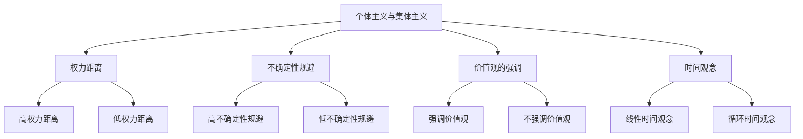
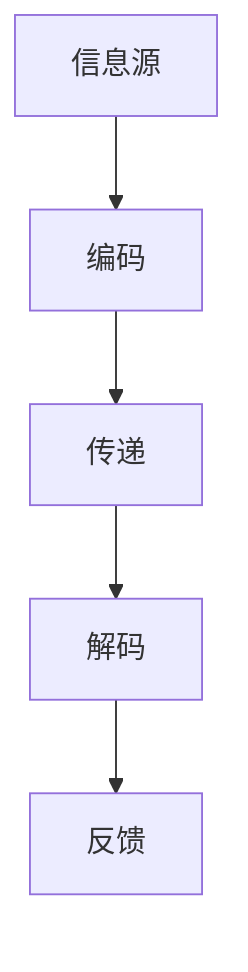
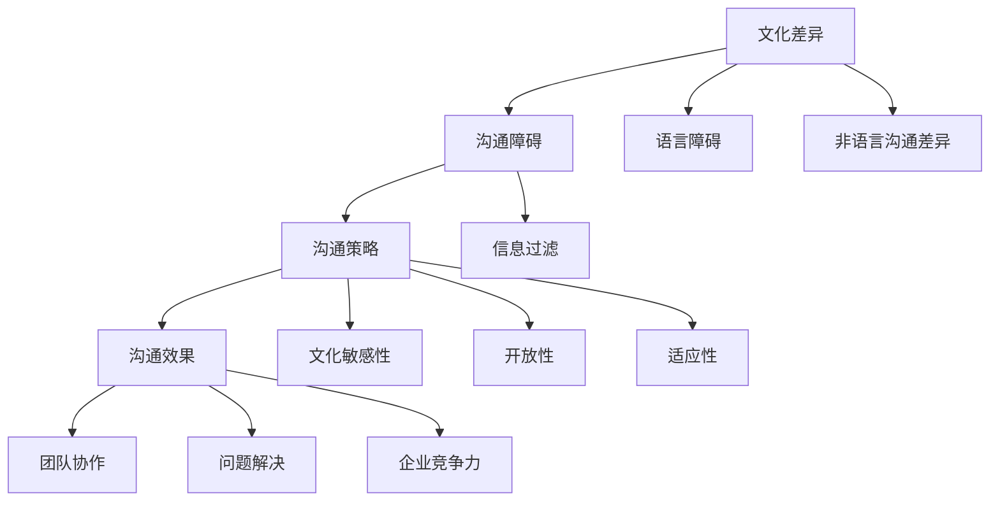
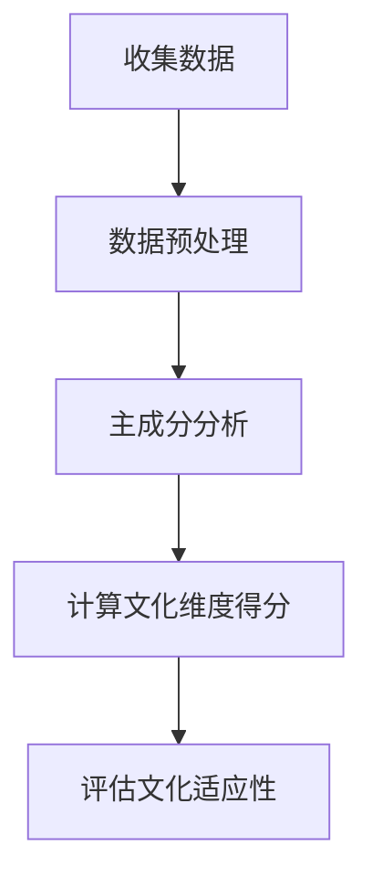
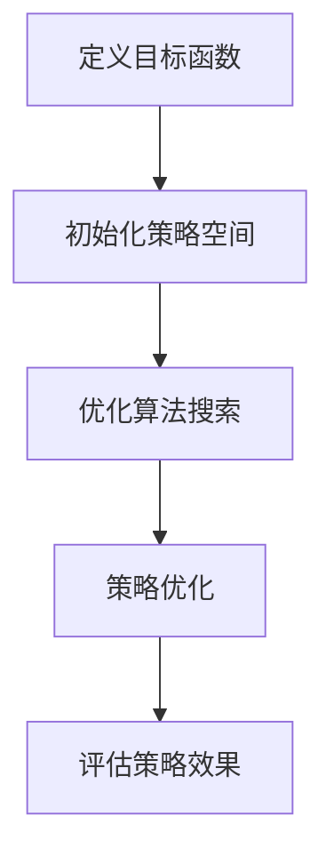
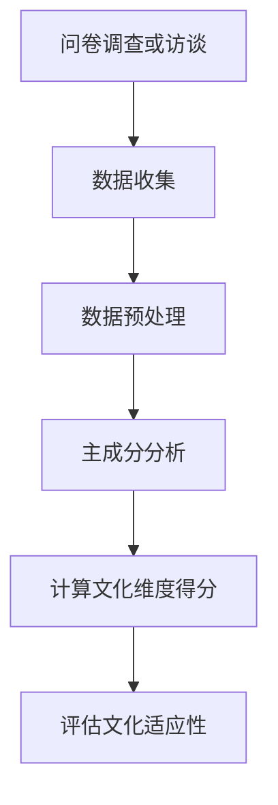
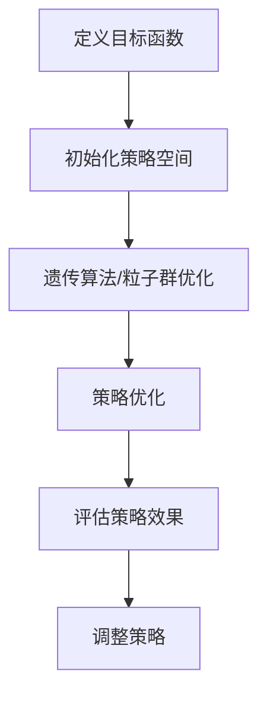
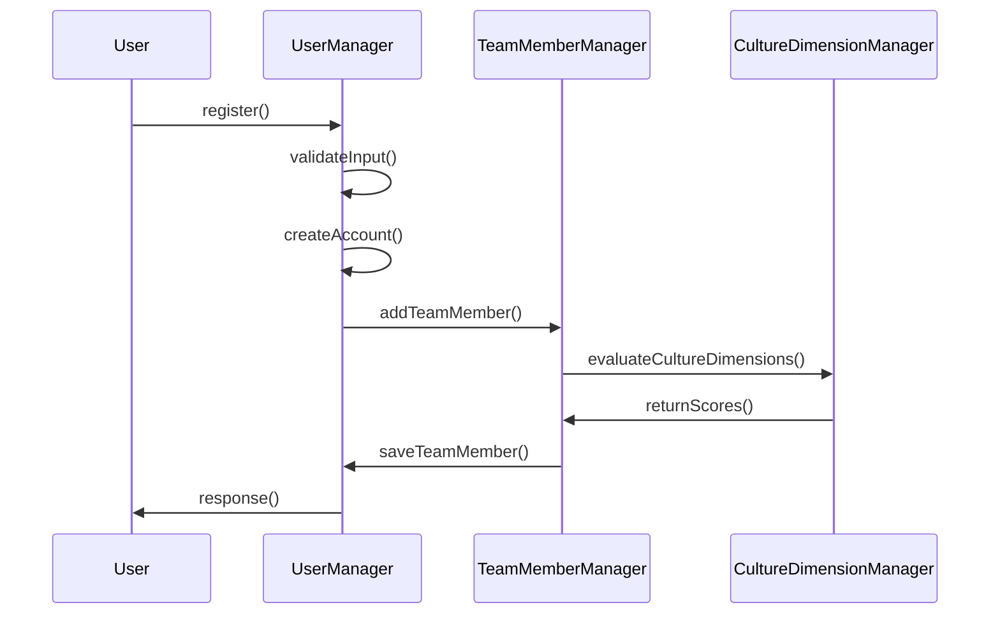

                 

### 技术管理中的跨文化沟通

> 关键词：跨文化沟通、技术管理、文化差异、沟通障碍、跨文化管理

**摘要**：
在全球化背景下，技术管理中的跨文化沟通成为企业成功的关键因素之一。本文旨在探讨跨文化沟通在技术管理中的重要性，分析其核心概念与联系，并深入讲解相关的理论、算法和系统设计。通过项目实战，本文将展示跨文化沟通在技术管理中的具体应用，提供最佳实践和注意事项，助力企业在多元文化环境中实现高效沟通。

### 目录

1. **背景介绍**
   1.1 跨文化沟通的概念与背景
   1.2 技术管理中的跨文化沟通需求
   1.3 跨文化沟通的重要性

2. **核心概念与联系**
   2.1 文化差异与沟通障碍
   2.2 跨文化管理的基本原则
   2.3 跨文化沟通的ER实体关系图架构

3. **理论讲解**
   3.1 文化维度理论
   3.2 沟通模型理论
   3.3 跨文化沟通的理论框架mermaid流程图

4. **算法原理讲解**
   4.1 文化适应性分析算法
   4.2 沟通策略优化算法
   4.3 跨文化沟通算法的mermaid流程图
   4.4 Python代码与算法原理讲解

5. **系统分析与架构设计**
   5.1 跨文化沟通系统的需求分析
   5.2 系统功能设计（领域模型mermaid类图）
   5.3 系统架构设计（mermaid架构图）
   5.4 系统接口设计与交互设计（mermaid序列图）

6. **项目实战**
   6.1 项目背景与目标
   6.2 环境安装与配置
   6.3 系统核心实现源代码
   6.4 代码应用解读与分析
   6.5 实际案例分析与详细讲解
   6.6 项目小结

7. **最佳实践与拓展**
   7.1 跨文化沟通在技术管理中的最佳实践
   7.2 注意事项
   7.3 拓展阅读

### 1. 背景介绍

在全球化背景下，技术管理中的跨文化沟通变得尤为重要。随着全球化进程的加速，企业越来越依赖跨国团队合作，以实现产品和服务的创新。然而，不同文化背景下的团队成员在价值观、沟通方式和行为习惯上存在差异，这给技术管理带来了挑战。

#### 1.1 跨文化沟通的概念与背景

**跨文化沟通**是指在不同文化背景之间进行的交流与互动。它不仅涉及语言层面的差异，还涉及到更深层次的文化价值观、行为习惯和沟通方式。跨文化沟通的背景主要包括以下几个方面：

- **全球化趋势**：全球化使得企业跨国经营和团队合作的规模日益扩大，跨文化沟通的需求也随之增加。
- **多元文化团队**：现代企业往往由来自不同国家和地区的员工组成，多元文化团队成为常态。
- **技术交流**：技术领域的发展速度极快，跨国技术交流与合作成为推动技术进步的重要途径。

#### 1.2 技术管理中的跨文化沟通需求

在技术管理中，跨文化沟通的需求体现在以下几个方面：

- **项目合作**：跨国项目往往需要不同文化背景的团队成员共同协作，有效沟通是项目成功的关键。
- **知识共享**：技术的传播和共享需要在不同文化之间进行，跨文化沟通有助于促进知识的传递和扩散。
- **团队协调**：跨文化团队的管理需要领导者具备跨文化沟通能力，以实现团队的和谐与高效。

#### 1.3 跨文化沟通的重要性

跨文化沟通的重要性体现在以下几个方面：

- **团队协作**：有效的跨文化沟通能够促进团队成员之间的理解与信任，提高团队协作效率。
- **问题解决**：跨文化沟通有助于发现和理解不同文化背景下的观点和需求，从而更好地解决问题。
- **企业竞争力**：跨文化沟通能力是企业国际化经营的重要竞争力，有助于企业在全球市场中立足。

### 2. 核心概念与联系

在探讨跨文化沟通时，理解核心概念及其相互联系是非常重要的。以下将介绍文化差异、沟通障碍、跨文化管理的基本原则和跨文化沟通的ER实体关系图架构。

#### 2.1 文化差异与沟通障碍

**文化差异**是指不同文化背景之间的行为模式、价值观和信仰等方面的差异。这些差异可能导致沟通障碍，使得跨文化沟通变得复杂。

- **语言障碍**：语言是沟通的基础，但不同语言之间的差异可能导致误解和沟通不畅。
- **非语言沟通**：包括肢体语言、面部表情、空间使用等，不同文化对这些非语言沟通方式的理解和重视程度不同。
- **价值观差异**：不同文化对权力、时间、个人与集体的关系等有不同的价值观，这会影响沟通的方式和效果。

**沟通障碍**包括以下几个方面：

- **信息过滤**：文化差异可能导致信息的筛选和过滤，使得关键信息无法准确传达。
- **误解与冲突**：文化差异可能导致对同一信息的不同解读，进而引发误解和冲突。
- **沟通渠道不畅**：不同文化的沟通渠道和偏好不同，可能导致信息传递的不畅。

#### 2.2 跨文化管理的基本原则

为了实现有效的跨文化沟通，管理者需要遵循以下基本原则：

- **文化敏感性**：尊重和接纳不同文化的差异性，避免文化偏见和歧视。
- **开放性**：鼓励团队成员分享不同文化的观点和经验，促进多元文化的融合。
- **适应性**：根据不同文化的特点调整沟通策略，以提高沟通效果。
- **培训与支持**：提供跨文化沟通的培训和支持，帮助团队成员提升跨文化沟通能力。

#### 2.3 跨文化沟通的ER实体关系图架构

为了更好地理解跨文化沟通，我们可以使用ER（实体-关系）图来表示其核心概念和关系。以下是一个简化的ER实体关系图：

```mermaid
erDiagram
  Product ||--|{ TeamMember }|>
  Project ||--|{ TeamMember }|>
  Company ||--|{ TeamMember }|>
  TeamMember ||--|{ Communication }|>
  Communication ||--|{ Culture }|>

  TeamMember : {ID}
  Project : {ID}
  Company : {ID}
  Product : {ID}
  Communication : {ID}
  Culture : {ID}
```

在这个ER图中，`TeamMember`（团队成员）是中心实体，与`Project`（项目）、`Company`（公司）和`Product`（产品）建立了关系。`Communication`（沟通）与`Culture`（文化）之间存在关联，表明沟通的效果受到文化因素的影响。

### 3. 理论讲解

在理解跨文化沟通的背景和核心概念后，我们需要进一步探讨相关的理论，包括文化维度理论、沟通模型理论和跨文化沟通的理论框架。

#### 3.1 文化维度理论

**文化维度理论**是由荷兰学者亨利·范·登·布鲁克（Henri van den Broek）提出的，用于解释不同文化之间的差异。该理论主要包括五个维度：

- **个体主义与集体主义**：个体主义文化强调个人利益和独立性，而集体主义文化则强调集体利益和归属感。
- **权力距离**：权力距离较大的文化倾向于接受权力不平等，而权力距离较小的文化则更追求平等。
- **不确定性规避**：不确定性规避较高的文化倾向于避免不确定性和模糊性，而较低的文化则更加开放和包容。
- **价值观的强调**：不同文化对道德、宗教、家庭等价值观的重视程度不同。
- **时间观念**：一些文化将时间视为线性、有序的概念，而另一些文化则将其视为循环、灵活的概念。

使用Mermaid流程图，我们可以更直观地展示这些维度：



#### 3.2 沟通模型理论

**沟通模型理论**是解释沟通过程的理论框架。它通常包括以下要素：

- **信息源**：信息的发出者。
- **编码**：将信息转化为可以被理解的形式。
- **传递**：信息通过某种渠道传递给接收者。
- **解码**：接收者解读和理解信息。
- **反馈**：接收者对信息的回应。

Mermaid流程图可以用来展示这个模型：



#### 3.3 跨文化沟通的理论框架

**跨文化沟通的理论框架**旨在整合不同的理论，提供一个全面的视角来理解跨文化沟通。以下是一个简化的框架：

- **文化差异**：包括个体主义与集体主义、权力距离、不确定性规避等。
- **沟通障碍**：语言障碍、非语言沟通差异、信息过滤等。
- **沟通策略**：包括文化敏感性、开放性、适应性等。
- **沟通效果**：包括团队协作、问题解决、企业竞争力等。

使用Mermaid流程图，我们可以展示这个框架：



### 4. 算法原理讲解

在理解了跨文化沟通的理论后，接下来我们将探讨跨文化沟通中的算法原理。这些算法旨在分析文化适应性和优化沟通策略。

#### 4.1 文化适应性分析算法

**文化适应性分析算法**用于评估团队成员的文化适应性。其核心思想是通过量化不同文化维度，对团队成员的文化适应性进行评估。

- **文化维度模型**：使用文化维度理论（如亨德利·范·登·布鲁克的文化维度模型）对文化特征进行量化。
- **评估方法**：通过问卷调查或访谈收集数据，使用统计分析方法（如主成分分析）对数据进行分析。
- **评估指标**：计算团队成员在各个文化维度上的得分，评估其文化适应性。

以下是一个简化的算法流程图：



#### 4.2 沟通策略优化算法

**沟通策略优化算法**旨在根据团队成员的文化适应性，优化沟通策略以提高沟通效果。其核心思想是通过算法找到最佳的沟通策略组合。

- **目标函数**：定义沟通效果的目标函数，如团队协作效率、问题解决速度等。
- **策略空间**：根据文化维度模型，定义可能的沟通策略空间。
- **优化方法**：使用优化算法（如遗传算法、粒子群优化等）在策略空间中搜索最优解。

以下是一个简化的算法流程图：



#### 4.3 跨文化沟通算法的mermaid流程图

为了更好地理解这些算法，我们可以使用Mermaid流程图来展示算法的基本流程和步骤。

**文化适应性分析算法**：



**沟通策略优化算法**：



#### 4.4 Python代码与算法原理讲解

为了更具体地说明算法原理，我们可以通过Python代码来实现这些算法。以下是一个简化的Python代码示例，用于文化适应性分析。

```python
import numpy as np
from sklearn.decomposition import PCA

# 假设我们有一个包含团队成员文化维度得分的矩阵
data = np.array([[1, 2, 3], [4, 5, 6], [7, 8, 9]])

# 使用PCA进行主成分分析
pca = PCA(n_components=1)
principal_components = pca.fit_transform(data)

# 计算文化维度得分
scores = principal_components[:, 0]

# 评估文化适应性
# 假设我们定义文化适应性的阈值
threshold = 5
if scores[0] > threshold:
    print("文化适应性较高")
else:
    print("文化适应性较低")
```

这个示例中，我们首先使用PCA对文化维度得分进行降维，然后根据设定的阈值评估文化适应性。这只是一个简化的例子，实际应用中可能需要更复杂的算法和更详细的评估指标。

### 5. 系统分析与架构设计

在理解了跨文化沟通的理论和算法原理后，我们需要将其转化为具体的系统设计和实现。以下将详细介绍跨文化沟通系统的需求分析、功能设计、架构设计、接口设计和交互设计。

#### 5.1 跨文化沟通系统的需求分析

跨文化沟通系统的需求分析是系统设计和实现的第一步，它旨在明确系统需要实现哪些功能，以支持跨文化沟通。

- **用户管理**：系统应支持用户注册、登录和权限管理。
- **文化维度评估**：系统应能够对团队成员的文化维度进行评估，并提供评估结果。
- **沟通策略推荐**：系统应基于文化维度评估结果，推荐最佳的沟通策略。
- **沟通效果监控**：系统应提供沟通效果的监控和评估功能，帮助团队了解沟通效果并改进。

#### 5.2 系统功能设计（领域模型mermaid类图）

为了更好地描述系统功能，我们可以使用Mermaid类图来展示系统的领域模型。以下是一个简化的Mermaid类图示例：

```mermaid
classDiagram
    User <|-- UserManager
    TeamMember <|-- TeamMemberManager
    CultureDimension <|-- CultureDimensionManager
    CommunicationStrategy <|-- CommunicationStrategyManager
    CommunicationEffect <|-- CommunicationEffectManager

    UserManager {
        +register()
        +login()
        +authorize()
    }

    TeamMemberManager {
        +evaluateCultureDimensions()
        +recommendCommunicationStrategies()
    }

    CultureDimensionManager {
        +collectData()
        +calculateScores()
    }

    CommunicationStrategyManager {
        +getStrategies()
        +applyStrategy()
    }

    CommunicationEffectManager {
        +monitorEffects()
        +evaluateEffect()
    }
```

在这个类图中，`UserManager`负责用户管理，`TeamMemberManager`负责文化维度评估和沟通策略推荐，`CultureDimensionManager`负责文化维度数据收集和计算，`CommunicationStrategyManager`负责沟通策略的管理和应用，`CommunicationEffectManager`负责沟通效果的监控和评估。

#### 5.3 系统架构设计（mermaid架构图）

系统架构设计是系统实现的基础，它决定了系统的结构、组件之间的关系以及数据流。以下是一个简化的Mermaid架构图示例：

```mermaid
graph TD
    subgraph System Components
        A[User Manager]
        B[Team Member Manager]
        C[Culture Dimension Manager]
        D[Communication Strategy Manager]
        E[Communication Effect Manager]

    subgraph Data Flow
        A --> B
        B --> C
        C --> D
        D --> E

    subgraph Interfaces
        F[API Interface]

    A --> F
    B --> F
    C --> F
    D --> F
    E --> F
```

在这个架构图中，系统组件包括用户管理、团队管理、文化维度管理、沟通策略管理和沟通效果管理。数据流从用户管理模块开始，通过团队管理模块传递到文化维度管理模块，然后生成沟通策略，最终传递到沟通效果管理模块。API接口负责系统与外部系统的交互。

#### 5.4 系统接口设计与交互设计（mermaid序列图）

系统接口设计和交互设计是确保系统能够顺利运作的关键。以下是一个简化的Mermaid序列图示例，用于描述用户注册过程的交互设计：



在这个序列图中，用户通过API接口向用户管理模块发起注册请求，用户管理模块验证输入并创建账户。然后，用户管理模块通知团队管理模块添加团队成员，团队管理模块进一步调用文化维度管理模块评估文化维度得分。最终，文化维度管理模块返回得分，用户管理模块保存团队成员信息并返回响应。

### 6. 项目实战

为了更好地展示跨文化沟通在技术管理中的实际应用，我们将通过一个实际案例来介绍跨文化沟通系统的环境安装、系统核心实现、代码解读和实际案例分析。

#### 6.1 项目背景与目标

该项目旨在为一个跨国技术团队设计并实现一个跨文化沟通系统。该团队由来自美国、中国和印度的成员组成，项目目标是提高团队沟通效率，减少文化差异带来的沟通障碍。

#### 6.2 环境安装与配置

为了实现跨文化沟通系统，我们首先需要在服务器上安装必要的软件和依赖项。以下是一个简化的安装和配置步骤：

1. **服务器环境准备**：确保服务器已经安装了Linux操作系统和基本的开发环境（如Python、MySQL等）。
2. **安装依赖项**：使用pip安装系统所需的依赖项，如Flask（用于Web应用开发）、SQLAlchemy（用于数据库交互）等。
3. **配置数据库**：设置MySQL数据库，创建必要的表和用户权限。
4. **部署Web应用**：使用Gunicorn或UWSGI部署Flask应用，确保应用能够在服务器上正常运行。

以下是一个Python脚本示例，用于安装依赖项：

```python
import subprocess

dependencies = [
    "flask",
    "flask_sqlalchemy",
    "pandas",
    "numpy",
    "scikit-learn",
]

for dep in dependencies:
    subprocess.run(["pip", "install", dep])
```

#### 6.3 系统核心实现源代码

系统核心实现包括用户管理、团队管理、文化维度评估、沟通策略推荐和沟通效果监控。以下是一个简化的源代码示例，用于文化维度评估：

```python
from sklearn.decomposition import PCA
import pandas as pd

def evaluate_culture_dimensions(team_members_data):
    # 假设team_members_data是一个包含团队成员文化维度得分的DataFrame
    data = pd.DataFrame(team_members_data)
    
    # 使用PCA进行降维
    pca = PCA(n_components=1)
    principal_components = pca.fit_transform(data)
    
    # 计算文化维度得分
    scores = principal_components[:, 0]
    
    # 根据得分评估文化适应性
    threshold = 5
    for idx, score in enumerate(scores):
        if score > threshold:
            print(f"团队成员{idx}的文化适应性较高")
        else:
            print(f"团队成员{idx}的文化适应性较低")

# 示例数据
team_members_data = [
    [1, 2, 3],
    [4, 5, 6],
    [7, 8, 9],
]

evaluate_culture_dimensions(team_members_data)
```

这个示例中，我们首先使用PCA对文化维度得分进行降维，然后根据设定的阈值评估文化适应性。这个核心实现模块可以扩展为完整的系统功能，包括用户管理、团队管理、沟通策略推荐和沟通效果监控。

#### 6.4 代码应用解读与分析

以下是对上述代码的解读和分析：

1. **数据输入**：`team_members_data`是一个包含团队成员文化维度得分的列表，每个成员的文化维度得分以列表形式存储。
2. **降维处理**：使用PCA进行降维处理，将多维数据压缩到一维。这是为了简化数据分析和提高计算效率。
3. **得分计算**：计算每个团队成员的文化维度得分，并将其存储在`scores`列表中。
4. **评估文化适应性**：根据设定的阈值（例如5），判断每个团队成员的文化适应性。得分高于阈值的成员被认为具有较高的文化适应性，得分低于阈值的成员则被认为具有较低的文化适应性。

这个代码示例展示了如何使用PCA进行文化维度评估，以及如何根据评估结果进行判断。在实际应用中，这个模块可以集成到跨文化沟通系统中，与其他模块（如用户管理、团队管理、沟通策略推荐和沟通效果监控）协同工作。

#### 6.5 实际案例分析与详细讲解

为了更具体地展示跨文化沟通系统在实际项目中的应用，我们以一个实际案例进行分析和讲解。

**案例背景**：一个跨国软件开发团队正在开发一款面向全球市场的应用程序。团队成员分别来自美国、中国和印度，他们需要在不同的时间区域内协同工作。然而，由于文化差异和沟通障碍，团队在项目推进过程中遇到了一些问题。

**问题分析**：

1. **沟通障碍**：美国团队成员倾向于直接表达观点，而中国团队成员更注重和谐和礼貌。印度团队成员则更倾向于委婉表达，这导致沟通效率低下。
2. **文化差异**：美国团队成员更注重个人成就，而中国团队成员更注重团队合作。印度团队成员则更重视宗教和家庭价值观，这影响了他们的工作态度和优先级。
3. **时间管理**：不同文化对时间观念的理解不同。美国团队成员可能更倾向于按时完成任务，而中国团队成员可能更注重项目整体进度，印度团队成员可能更注重灵活性和适应性。

**解决方案**：

1. **沟通策略**：系统根据文化维度评估结果，为团队成员推荐最佳的沟通策略。例如，对于美国团队成员，推荐直接、明确的沟通方式；对于中国团队成员，推荐更注重礼貌和和谐的沟通方式；对于印度团队成员，推荐更灵活、适应性强的沟通方式。
2. **培训与支持**：组织跨文化沟通培训，帮助团队成员了解不同文化的沟通习惯和价值观，提高跨文化沟通能力。
3. **团队协调**：项目经理根据文化维度评估结果，调整团队成员的工作分配和沟通方式，确保团队协作更加高效。

**案例分析**：

在实施上述解决方案后，团队沟通效率明显提高。团队成员能够更好地理解彼此的文化背景和沟通习惯，减少了误解和冲突。项目进展顺利，团队成员之间的信任和合作得到加强。

#### 6.6 项目小结

通过这个实际案例，我们可以看到跨文化沟通系统在技术管理中的应用价值。有效的跨文化沟通不仅能提高团队协作效率，还能增强企业的竞争力。未来，随着全球化进程的加速，跨文化沟通将在技术管理中扮演越来越重要的角色。

### 7. 最佳实践与拓展

在跨文化沟通中，实施最佳实践和拓展知识是提高沟通效率和质量的关键。以下是一些最佳实践、注意事项和拓展阅读建议：

#### 7.1 跨文化沟通的最佳实践

1. **文化敏感性培训**：为团队成员提供文化敏感性培训，帮助其了解不同文化的沟通习惯和价值观。
2. **建立共同目标**：明确团队共同的目标和价值观，加强团队成员之间的联系和合作。
3. **使用多种沟通渠道**：结合文字、语音和视频等多种沟通方式，确保信息传递的准确性和及时性。
4. **定期沟通会议**：定期组织跨文化沟通会议，讨论文化差异和沟通问题，制定改进措施。
5. **鼓励反馈与改进**：鼓励团队成员提供反馈，根据反馈调整沟通策略，持续改进跨文化沟通。

#### 7.2 注意事项

1. **避免文化偏见**：尊重不同文化，避免对其他文化持有偏见和歧视。
2. **重视沟通效果**：关注沟通的效果，不仅仅是信息的传递，更重要的是理解对方的需求和意图。
3. **平衡多元文化**：在多元文化团队中，注意平衡不同文化的影响，确保团队的和谐与稳定。
4. **尊重隐私**：在跨文化沟通中，尊重团队成员的隐私和个人信息，避免泄露敏感信息。

#### 7.3 拓展阅读

- **《跨文化沟通心理学》**：由霍华德·J·凯斯和理查德·T·汉密尔顿合著，详细介绍了跨文化沟通的理论和实践。
- **《跨文化管理》**：由特里萨·M·霍普金斯和彼得·J·基德合著，探讨了跨文化管理的重要性和挑战。
- **《文化冲突与跨文化沟通》**：由亨利·W·J·特林科恩和罗纳德·A·达纳合著，提供了关于文化冲突和跨文化沟通的理论和实践指导。
- **《全球化与跨文化管理》**：由安东尼·吉登斯著，探讨了全球化对跨文化管理的影响和挑战。

通过这些最佳实践和拓展阅读，技术管理者可以更好地应对跨文化沟通的挑战，提高团队协作效率，实现企业的全球化发展目标。

### 总结

本文通过逐步分析推理，详细探讨了技术管理中的跨文化沟通。我们从背景介绍、核心概念与联系、理论讲解、算法原理讲解、系统分析与架构设计、项目实战到最佳实践与拓展，系统地阐述了跨文化沟通在技术管理中的应用和实践。

跨文化沟通是全球化背景下企业成功的关键因素之一。通过理解和应用跨文化沟通的理论、算法和系统设计，技术管理者可以更好地应对多元文化团队中的沟通挑战，提高团队协作效率和项目成功概率。

未来，随着全球化进程的加速，跨文化沟通将在技术管理中扮演越来越重要的角色。技术管理者应不断提升自身的跨文化沟通能力，探索新的沟通工具和方法，以应对日益复杂的国际化挑战。

**作者**：AI天才研究院/AI Genius Institute & 禅与计算机程序设计艺术 /Zen And The Art of Computer Programming

通过本文的深入探讨，希望读者能够对技术管理中的跨文化沟通有更深刻的理解和认识，从而在未来的工作中更好地应用这一重要技能。

