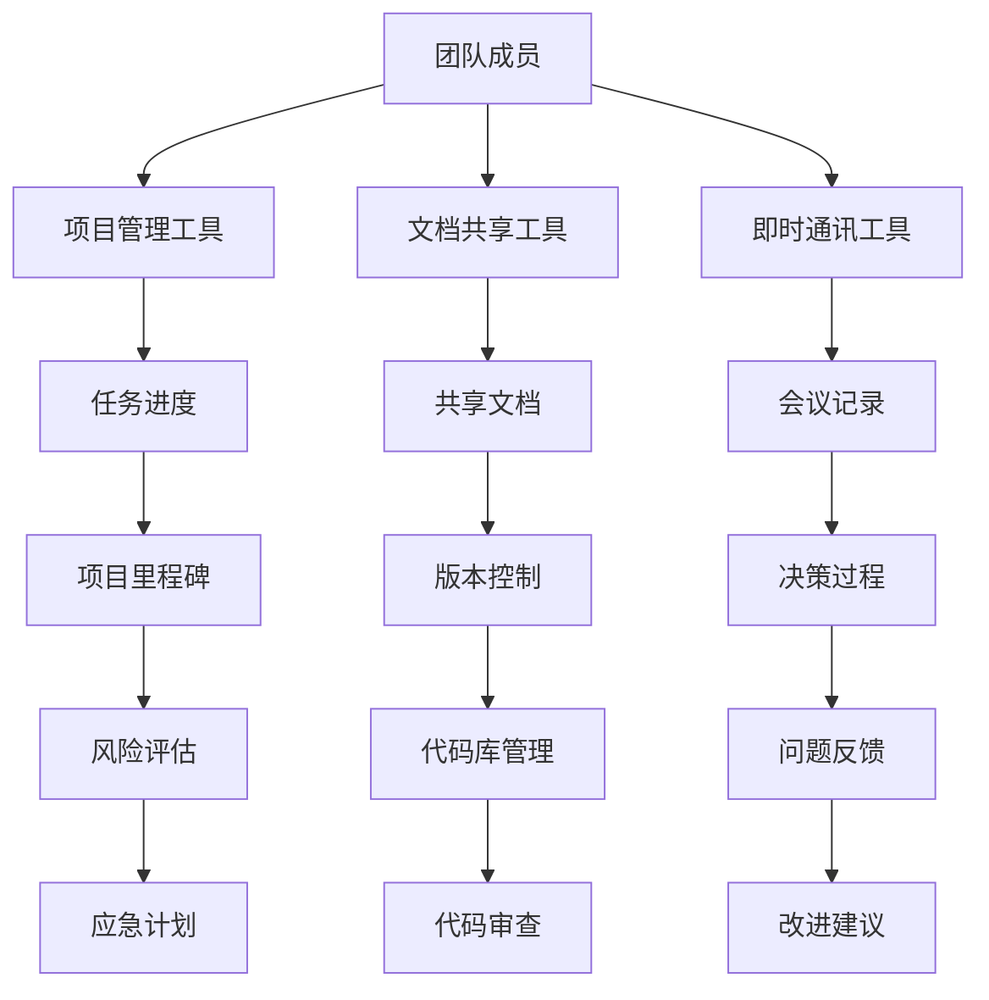

                 

# 技术管理中的远程团队协作技巧

## 摘要

随着全球化的不断深入和信息技术的飞速发展，远程团队协作已经成为现代技术管理中不可或缺的一部分。本文将探讨远程团队协作的重要性，分析其在沟通、团队凝聚力和项目管理等方面面临的挑战，并介绍一系列技巧和策略，帮助技术管理者有效地解决这些问题。文章将分为以下几个部分：首先，介绍远程团队协作的背景和重要性，然后深入探讨核心概念和远程协作工具的选择，接着阐述沟通技巧和团队凝聚力策略，以及项目管理与监控方法。最后，通过实际案例分享，总结最佳实践，并提供进一步阅读的拓展资料。希望本文能为技术管理者提供有价值的参考和启示。

## 背景介绍

### 1.1.1 技术管理中的远程团队协作背景

随着全球化进程的加速和信息技术的迅猛发展，远程团队协作在现代技术管理中变得愈加重要。首先，全球化的趋势使得企业能够跨越地理界限，吸引来自世界各地的优秀人才。这种跨国界的合作模式不仅扩大了人才池，也提高了团队的创新能力和多样性。同时，随着云计算、视频会议、即时通讯等技术的普及，远程团队协作变得更加高效和便捷。

远程团队协作的优势在于灵活性和成本效益。员工不再受限于办公室的空间，可以在任何时间、任何地点进行工作，这种灵活性大大提高了员工的工作满意度和生产力。此外，远程协作还可以帮助企业节省办公空间和设备成本，从而降低运营成本。

然而，远程团队协作也面临诸多挑战。首先，沟通障碍是一个重要问题。由于团队成员分散在不同地理位置，语言、文化和时间的差异可能导致沟通不畅，影响工作效率。其次，团队凝聚力不足也是一个普遍存在的问题。缺乏面对面的互动和团队活动，可能导致团队成员之间的联系减弱，影响团队的协作效果。最后，项目管理困难也是一个显著的问题。远程团队的管理需要更加细致和高效的策略，以确保项目按时、按质完成。

### 1.1.2 远程团队协作的优势与挑战

#### 沟通障碍

沟通障碍是远程团队协作中最常见的问题之一。它主要表现在以下几个方面：

1. **语言和文化差异**：不同国家和地区的团队成员可能会使用不同的语言和沟通风格，导致信息传达不准确或误解。例如，某些表达方式在一种语言中可能具有特定的含义，而在另一种语言中则完全不同。

2. **技术瓶颈**：网络延迟、设备故障等技术问题可能导致沟通中断或信息传输延迟。尤其是在跨国远程团队中，网络条件可能差异较大，这进一步加剧了沟通的复杂性。

3. **时间差异**：不同时区的团队成员可能无法在同一时间段内进行实时沟通，这增加了沟通的难度和效率。例如，某些成员可能在夜晚工作时，其他成员正在休息。

#### 团队凝聚力不足

团队凝聚力不足是远程团队协作面临的另一个重大挑战。团队凝聚力是指团队成员之间的相互信任、共同目标和紧密合作。以下是导致团队凝聚力不足的几个原因：

1. **缺乏面对面互动**：远程团队往往缺乏面对面的交流机会，这限制了团队成员建立深厚的人际关系。面对面的互动对于建立信任和增强团队凝聚力至关重要。

2. **团队活动不足**：由于地理位置的分散，远程团队难以组织传统的团队活动。这可能导致团队成员之间的联系减弱，影响团队的协作效果。

3. **共同目标不明确**：在远程团队中，团队成员可能难以明确共同的目标和愿景。这可能导致工作方向不一致，影响团队的协作效率。

#### 项目管理困难

项目管理困难是远程团队协作中的另一个挑战。以下是几个关键问题：

1. **资源分配不当**：在远程团队中，资源分配可能不均匀，某些成员可能承担过多的工作负担，而其他成员则缺乏足够的任务。这可能导致团队效率低下和工作不均衡。

2. **进度监控困难**：远程团队的项目进度监控相对较为复杂。由于团队成员分散在不同地理位置，项目进展的实时监控和调整变得更加困难。

3. **风险管理不足**：远程团队可能缺乏有效的风险管理机制，导致项目风险无法及时识别和应对。

### 1.1.3 问题解决

针对远程团队协作中面临的沟通障碍、团队凝聚力不足和项目管理困难，可以采取以下解决策略：

1. **沟通技巧培训**：通过定期的沟通技巧培训，提高团队成员的沟通能力和文化敏感性。这有助于减少误解和提升工作效率。

2. **使用适当的协作工具**：选择适合远程团队的协作工具，如即时通讯、视频会议和项目管理软件，以简化沟通流程和提高协作效率。

3. **建立共同目标**：明确团队的目标和愿景，确保所有成员都清楚自己的工作方向和责任。

4. **定期团队活动**：利用在线平台组织定期的团队活动，如虚拟团队建设日或在线社交活动，以增强团队凝聚力。

5. **制定详细的项目管理计划**：通过制定详细的项目管理计划，明确项目的目标和里程碑，确保团队成员的任务分配和进度监控。

6. **风险管理和应急计划**：建立有效的风险管理机制，及时识别和应对项目风险，并制定应急计划以应对突发情况。

### 1.1.4 边界与外延

本文讨论的范围包括远程团队协作的基本原则、具体技巧和工具选择等。主要关注点在于如何克服远程团队协作中常见的挑战，提升团队的协作效率和项目成功几率。然而，远程团队协作涉及多个方面，如组织文化、领导力和个人能力等，这些因素也将在一定程度上影响团队协作的效果。因此，本文提供的是一种系统性的解决方案，但具体实施时需要根据实际情况进行调整和优化。

## 核心概念与联系

### 2.1 远程团队协作的基本概念

#### 2.1.1 虚拟团队

虚拟团队是指通过现代信息技术手段连接的、成员地理位置分散的团队。这种团队通常通过电子邮件、即时通讯、视频会议和项目管理工具进行协作。虚拟团队的优势在于能够打破地理限制，利用全球范围内的专业人才，提高团队的创新能力和响应速度。

#### 2.1.2 分布式团队

分布式团队是指成员分布在不同的地理位置，但共享相同的办公时间和工作目标的团队。与虚拟团队不同，分布式团队的成员通常在同一时区内工作，且拥有固定的办公地点。这种团队模式在跨国公司和远程工作制度中广泛应用。

#### 2.1.3 远程协作

远程协作是指通过互联网和现代通信技术实现的远程工作方式。它包括在线会议、文档共享、代码协作等多种形式。远程协作的核心目标是提高工作效率、降低运营成本和提升员工的工作满意度。

### 2.2 远程协作与现场协作的差异

#### 2.2.1 工作环境

远程协作的工作环境更加灵活，员工可以在家中、咖啡厅或其他任何有网络连接的地方工作。这种工作环境提高了员工的自主性和舒适度。相比之下，现场协作通常在固定的办公室或工作场所进行，员工需要按时到岗，遵守公司的规章制度。

#### 2.2.2 工作流程

远程协作的工作流程更加依赖数字化工具和自动化流程。例如，团队成员通过项目管理软件跟踪任务进度、使用文档协作工具编辑文档、通过视频会议进行项目讨论等。现场协作则通常依赖于面对面的沟通和传统的工作流程，如纸质文档、口头传达等。

#### 2.2.3 沟通方式

远程协作的沟通方式更加多样化，包括电子邮件、即时通讯、视频会议、电话等。这些沟通工具使得团队成员可以随时保持联系，分享信息和解决问题。现场协作的沟通方式则相对较为单一，主要依赖于面对面的交流和口头传达。

### 2.3 远程团队协作中的关键实体及其关系

在远程团队协作中，有几个关键实体和它们之间的关系至关重要。以下是一个简单的实体关系图，用于展示这些实体及其相互关系：



#### 2.3.1 实体关系图

以下是一个简化的实体关系图，展示了远程团队协作中的关键实体及其相互关系：


#### 2.3.2 关键角色与职责

在远程团队协作中，每个成员都扮演着特定的角色，承担相应的职责。以下是几个关键角色及其职责：

1. **项目经理**：负责项目规划、任务分配、进度监控和团队协调。

2. **开发人员**：负责编写代码、解决技术问题和实现项目需求。

3. **测试工程师**：负责测试软件质量，确保项目的功能和性能满足要求。

4. **文档管理员**：负责维护和更新项目文档，确保所有成员都能访问到最新和最准确的信息。

5. **沟通协调员**：负责组织团队会议、传达重要信息和处理沟通中的冲突。

### 2.4 远程协作工具的选择

#### 2.4.1 通信工具

通信工具是远程团队协作的核心组成部分。以下是一些常用的通信工具：

1. **Slack**：一款流行的即时通讯工具，支持文字聊天、语音通话和视频会议。

2. **Microsoft Teams**：微软推出的集成通讯和协作平台，提供即时通讯、会议和项目管理等功能。

3. **Zoom**：一款功能强大的视频会议工具，适用于远程团队的在线会议和培训。

4. **Telegram**：一款基于云的即时通讯应用，提供端到端加密的隐私保护。

#### 2.4.2 文档共享与协作工具

文档共享与协作工具帮助团队成员实时编辑和共享文档，提高工作效率。以下是一些常用的文档协作工具：

1. **Google Workspace**：包括Google Docs、Google Sheets和Google Slides等，支持多人实时协作。

2. **Microsoft Office 365**：包括Word、Excel和PowerPoint等，提供在线协作和存储功能。

3. **Notion**：一款功能强大的知识管理和协作工具，支持创建和共享笔记、数据库和任务列表。

4. **Confluence**：一款企业级的协作平台，适用于团队文档、项目管理和知识共享。

#### 2.4.3 项目管理工具

项目管理工具帮助团队规划、跟踪和管理工作进度，确保项目按时、按质完成。以下是一些常用的项目管理工具：

1. **Trello**：一款基于看板的任务管理工具，适用于小型项目和团队协作。

2. **Jira**：一款功能强大的敏捷项目管理工具，适用于开发团队和复杂项目。

3. **Asana**：一款灵活的任务管理工具，支持多种工作流和协作功能。

4. **ClickUp**：一款集成的项目管理工具，提供任务管理、时间跟踪和团队协作等功能。

### 2.5 远程协作工具的优缺点

#### 2.5.1 通信工具

**优点**：
- 提高沟通效率：支持多种沟通方式，如文字、语音和视频。
- 灵活便捷：随时随地进行沟通，不受地理位置限制。

**缺点**：
- 可能导致信息过载：过多的消息和通知可能分散团队成员的注意力。
- 隐私和安全问题：某些通信工具可能存在隐私和安全漏洞。

#### 2.5.2 文档共享与协作工具

**优点**：
- 实时协作：支持多人同时编辑文档，提高工作效率。
- 版本控制：自动保存文档版本，方便团队成员查看历史记录。

**缺点**：
- 学习成本：某些工具可能较为复杂，需要一定时间熟悉。
- 文件大小限制：某些免费版本可能对文件大小有限制。

#### 2.5.3 项目管理工具

**优点**：
- 规划和监控项目进度：帮助团队明确任务目标和里程碑。
- 资源分配：优化团队资源，确保任务合理分配。

**缺点**：
- 需要一定的管理技能：正确使用项目管理工具需要一定的管理知识和技能。
- 可能增加沟通成本：需要定期更新任务和进度，确保所有成员都能及时了解项目情况。

### 2.6 选择适合的远程协作工具

#### 2.6.1 需求分析

在选择远程协作工具之前，团队需要首先进行需求分析，明确以下问题：

- 需要哪些功能？例如，是否需要视频会议、文档共享、项目管理等。
- 成员的技术水平如何？选择简单易用的工具可以提高团队的整体协作效率。
- 预算如何？某些高级功能可能需要支付额外费用。

#### 2.6.2 市场调研

在需求分析的基础上，团队可以通过以下方式进行市场调研：

- 查看用户评价：在互联网上查找相关工具的用户评价和反馈，了解其优缺点。
- 试用版本：许多远程协作工具提供免费试用版本，团队可以亲自试用，评估其适用性。

#### 2.6.3 工具对比与评估

根据需求分析和市场调研的结果，团队可以对多个工具进行对比和评估，主要考虑以下因素：

- 功能：工具是否提供所需的功能。
- 易用性：工具是否易于学习和使用。
- 可定制性：工具是否支持自定义设置和流程。
- 安全性：工具是否提供足够的隐私和安全保障。
- 成本：工具的费用是否在预算范围内。

### 2.7 远程协作工具的应用案例

以下是一些远程协作工具的应用案例：

#### 案例一：使用Slack进行团队沟通

某软件开发团队使用Slack进行日常沟通，建立了多个工作频道，如“项目讨论”、“技术支持”和“团队活动”等。团队成员可以通过这些频道分享信息、讨论问题和组织活动，提高了团队协作效率。

#### 案例二：使用Google Workspace进行文档协作

某市场团队使用Google Workspace进行文档协作，团队成员可以实时编辑和共享营销计划、市场报告等文档，确保所有成员都能及时获取最新的信息。

#### 案例三：使用Trello进行项目管理

某创业公司使用Trello进行项目管理，将项目分解为多个任务，并将任务分配给团队成员。团队成员可以通过Trello查看任务进度、更新任务状态和进行协作，确保项目按时完成。

### 2.8 远程协作工具的挑战与应对策略

#### 2.8.1 挑战一：工具选择困难

在面对众多远程协作工具时，团队可能会感到选择困难。为应对此挑战，团队可以：

- 制定明确的需求清单：明确所需功能、预算和技术水平等。
- 优先考虑核心需求：选择能满足核心需求的工具，避免过度功能化。
- 咨询专业人士：向有经验的团队成员或外部顾问寻求建议。

#### 2.8.2 挑战二：工具集成与兼容性问题

某些远程协作工具可能与其他工具存在兼容性问题，影响团队的协作效率。为应对此挑战，团队可以：

- 选择开放接口的工具：选择支持API接口的工具，便于与其他系统集成。
- 制定集成策略：在引入新工具时，考虑其与其他系统的兼容性。
- 定期更新工具：确保所有工具都处于最新版本，减少兼容性问题。

#### 2.8.3 挑战三：工具使用不当

团队成员可能因不熟悉工具或使用不当而导致协作效率降低。为应对此挑战，团队可以：

- 提供培训和支持：为新成员提供工具使用培训，帮助其快速上手。
- 制定使用指南：制定详细的工具使用指南，确保所有成员都能正确使用工具。
- 定期评估和改进：定期评估工具的使用情况，发现和解决问题。

## 远程团队沟通技巧

### 3.1 沟通障碍分析

#### 3.1.1 语言和文化差异

在远程团队中，语言和文化差异可能成为沟通障碍。团队成员可能来自不同的国家，使用不同的语言和沟通风格。这可能导致以下问题：

- 信息传达不准确：语言障碍可能导致信息的误解或误传。
- 文化差异：不同文化背景的团队成员可能对同一问题的看法和处理方式不同，导致沟通困难。

#### 3.1.2 技术瓶颈

技术瓶颈是远程团队沟通中的另一个障碍。以下是一些常见的技术瓶颈：

- 网络延迟：网络延迟可能导致沟通中断或信息传输延迟。
- 设备故障：设备故障可能导致无法进行沟通或协作。

#### 3.1.3 时间差异

时间差异也是远程团队沟通中的一个挑战。不同时区的团队成员可能无法在同一时间段内进行实时沟通。以下是一些具体问题：

- 跨时区会议：会议安排可能受到时区差异的影响，导致部分成员需要在不同时间段参加会议。
- 实时沟通受限：某些紧急问题可能无法立即得到解决，影响团队的协作效率。

### 3.2 提高远程团队沟通效果

#### 3.2.1 明确沟通目标

为了提高远程团队的沟通效果，首先需要明确沟通目标。具体步骤如下：

1. **制定沟通计划**：在项目开始前，制定详细的沟通计划，明确每次沟通的目标、时间和参与人员。
2. **明确沟通目标**：在每次沟通前，明确讨论的主题和目标，确保所有成员都清楚会议的目的。
3. **会议议程**：制定会议议程，确保讨论的内容有序进行，避免偏离主题。

#### 3.2.2 制定沟通计划

制定沟通计划是确保远程团队沟通高效的重要步骤。以下是一些建议：

1. **定期沟通**：定期召开团队会议，如每周或每月一次，确保团队成员能够保持联系。
2. **实时沟通**：利用即时通讯工具和视频会议，确保团队成员可以随时进行沟通。
3. **异步沟通**：对于一些不需要实时解决的问题，可以通过电子邮件、论坛等异步沟通方式。

#### 3.2.3 优化沟通方式

为了提高远程团队的沟通效果，可以采用以下优化措施：

1. **使用多种沟通方式**：结合使用即时通讯、视频会议、电子邮件等多种沟通方式，确保信息传达的准确性。
2. **制定沟通规范**：明确沟通的语言、格式和流程，确保团队成员能够按照统一的标准进行沟通。
3. **利用可视化工具**：使用图表、图像和视频等可视化工具，帮助团队成员更好地理解和传达信息。

#### 3.2.4 加强非语言沟通

在远程团队中，非语言沟通（如肢体语言、面部表情等）的缺失可能导致信息传达不准确。为加强非语言沟通，可以采取以下措施：

1. **视频会议**：尽可能使用视频会议，以便团队成员能够看到彼此的表情和肢体语言。
2. **使用符号和表情**：在即时通讯工具中使用符号和表情，帮助传达情感和意图。
3. **定期面对面会议**：虽然远程团队主要依赖在线沟通，但定期组织面对面的会议或活动，有助于加强团队成员之间的联系。

### 3.3 案例分享与沟通技巧总结

以下是一些远程团队沟通的案例，以及从中总结的沟通技巧：

#### 案例一：某跨国软件公司的项目沟通

某跨国软件公司有一个项目需要全球多个团队的协作。为了解决沟通障碍，公司采取了以下措施：

- **多语种沟通**：提供多语言支持，确保所有团队成员都能理解会议内容。
- **文化培训**：定期进行文化差异培训，帮助团队成员更好地理解和适应不同文化背景。
- **实时沟通**：使用视频会议和即时通讯工具，确保团队成员可以实时沟通和解决问题。

#### 案例二：某初创公司的敏捷开发团队

某初创公司的敏捷开发团队采用敏捷开发方法，为了提高团队沟通效率，采取了以下措施：

- **每日站会**：每天召开短暂的站会，确保团队成员了解项目进展和遇到的问题。
- **任务板**：使用任务板展示任务进度，团队成员可以随时查看和更新任务状态。
- **开放沟通**：鼓励团队成员之间进行开放和坦诚的沟通，及时分享问题和解决方案。

#### 案例三：某远程营销团队的协作

某远程营销团队为了提高协作效率，采取了以下措施：

- **共享文档**：使用文档协作工具，确保团队成员可以实时编辑和共享文档。
- **视频会议**：每周召开一次视频会议，讨论营销策略和执行计划。
- **即时沟通**：使用即时通讯工具，确保团队成员可以随时交流想法和解决问题。

### 3.4 沟通技巧总结

通过以上案例和经验，可以总结出以下沟通技巧：

- **明确沟通目标**：确保每次沟通都有明确的目标和议程。
- **优化沟通方式**：结合使用多种沟通方式，确保信息传达的准确性。
- **加强非语言沟通**：使用视频会议和符号表情，帮助传达情感和意图。
- **定期面对面会议**：定期组织面对面的会议或活动，加强团队成员之间的联系。
- **开放沟通**：鼓励团队成员之间进行开放和坦诚的沟通，及时分享问题和解决方案。

通过这些沟通技巧，远程团队可以克服沟通障碍，提高协作效率，实现项目目标。

## 增强团队凝聚力的策略

### 4.1 团队凝聚力的重要性

团队凝聚力是团队协作成功的关键因素之一。它指的是团队成员之间的相互信任、共同目标和紧密合作。高凝聚力的团队通常具有以下特点：

- **高效的协作**：团队成员能够有效地分工合作，共同完成工作任务。
- **积极的沟通**：团队成员之间保持开放和坦诚的沟通，及时分享信息和解决问题。
- **共同的目标**：团队成员对团队的愿景和目标有清晰的认识，共同努力实现目标。
- **强烈的归属感**：团队成员对团队有强烈的归属感，愿意为团队的成功付出努力。

然而，远程团队由于缺乏面对面的互动和团队活动，往往容易产生团队凝聚力不足的问题。以下将介绍几种策略，帮助技术管理者增强远程团队的凝聚力。

### 4.2 定期团队活动

#### 4.2.1 活动形式

为了增强远程团队的凝聚力，可以定期组织各种团队活动。这些活动可以是虚拟的，也可以是线下的。以下是一些常见的团队活动形式：

- **虚拟团队建设日**：通过视频会议或在线平台组织团队建设活动，如角色扮演、游戏和讨论。
- **在线社交活动**：利用社交媒体平台或即时通讯工具，组织在线聚会、讨论组和兴趣小组。
- **虚拟庆功会**：在团队取得重要成果时，通过视频会议或在线平台举办庆功会，庆祝团队的成就。

#### 4.2.2 活动安排

为了确保团队活动能够有效地增强团队凝聚力，需要合理安排活动时间和频率。以下是一些建议：

- **定期安排**：每月或每季度组织一次团队活动，确保团队成员有足够的参与机会。
- **多样性**：根据团队成员的兴趣和需求，安排多样化的活动，以满足不同成员的需求。
- **灵活安排**：考虑到不同时区的团队成员，选择适合所有人的活动时间和形式。

#### 4.2.3 活动效果评估

为了评估团队活动的效果，可以采用以下方法：

- **问卷调查**：在活动结束后，通过问卷调查收集团队成员的反馈，了解活动的优点和改进空间。
- **团队讨论**：在团队会议上讨论活动的效果，鼓励成员分享自己的感受和建议。
- **定期回顾**：定期回顾团队活动的效果，调整活动内容和形式，确保其能够持续增强团队凝聚力。

### 4.3 建立共同目标

#### 4.3.1 目标的重要性

共同目标对于团队凝聚力至关重要。一个明确的共同目标可以：

- **统一团队成员的方向**：确保所有成员都朝着同一个目标努力，减少内部冲突。
- **提高团队成员的参与度**：成员意识到自己的工作与团队目标密切相关，从而提高工作积极性和责任感。
- **增强团队凝聚力**：共同的目标使团队成员更加紧密地团结在一起，共同面对挑战。

#### 4.3.2 制定共同目标

为了建立共同目标，可以采取以下步骤：

- **明确愿景**：首先，团队需要明确团队的长期愿景，即希望达到的目标。
- **分解目标**：将长期愿景分解为短期目标和可量化的里程碑，确保团队成员能够明确自己的工作目标。
- **团队讨论**：通过团队讨论，确保所有成员都参与目标的制定过程，提高成员的认同感和参与度。
- **目标公示**：将共同目标公示在团队成员都可以看到的地方，如项目管理工具或团队的即时通讯频道。

#### 4.3.3 目标跟踪与调整

为了确保共同目标的实现，需要：

- **定期跟踪**：定期检查项目进度，确保团队在正确方向上前进。
- **及时调整**：如果遇到问题或目标不切实际，需要及时调整目标和计划，确保团队能够持续进步。

### 4.4 资源共享与协作

#### 4.4.1 资源共享的重要性

资源共享是增强团队凝聚力的重要手段。通过资源共享，团队成员可以：

- **优化资源利用**：避免资源浪费，提高工作效率。
- **促进知识共享**：成员可以分享经验和知识，促进团队整体能力的提升。
- **增强团队协作**：资源共享有助于团队成员之间的协作，提高团队的协作效率。

#### 4.4.2 资源共享的策略

为了实现资源共享，可以采取以下策略：

- **建立共享平台**：建立一个共享平台，如文档库或共享文件夹，方便团队成员上传和下载资源。
- **明确共享规则**：制定共享规则，明确哪些资源可以共享，如何共享，以及共享资源的责任和权限。
- **定期更新**：定期更新共享资源，确保资源的时效性和准确性。
- **奖励机制**：对积极参与资源共享的成员给予奖励或认可，激励成员更积极地参与资源共享。

### 4.5 及时反馈与认可

#### 4.5.1 反馈的重要性

及时反馈是团队协作中的重要环节。它有助于：

- **纠正错误**：及时识别并纠正团队成员在工作中的错误，确保工作质量。
- **提高效率**：通过反馈，团队成员可以了解自己的工作效果，从而调整工作策略，提高工作效率。
- **增强团队凝聚力**：及时的正面反馈可以增强团队成员的信心和积极性，提高团队的凝聚力。

#### 4.5.2 反馈的技巧

为了确保反馈的有效性，可以采取以下技巧：

- **具体而明确**：反馈应该具体而明确，避免模糊或含糊其辞。
- **正面引导**：在反馈中，更多地关注团队成员做得好的地方，并提供具体的改进建议。
- **及时反馈**：在问题发生后，及时给予反馈，避免问题积压。
- **建立反馈机制**：建立一个正式的反馈机制，如定期绩效评估或团队反馈会议，确保反馈的及时性和有效性。

#### 4.5.3 认可的重要性

认可是对团队成员工作成绩的肯定和鼓励。它有助于：

- **提高员工满意度**：认可可以让团队成员感受到自己的工作得到认可，从而提高工作满意度和积极性。
- **增强团队凝聚力**：认可可以增强团队成员之间的联系，提高团队的凝聚力。
- **促进团队文化**：通过认可，可以培养一个积极向上的团队文化，鼓励团队成员互相支持和帮助。

#### 4.5.4 认可的技巧

为了有效地认可团队成员，可以采取以下技巧：

- **个性化认可**：根据团队成员的特点和喜好，选择合适的认可方式，如公开表扬、奖励或私人感谢。
- **及时认可**：在团队成员取得成绩后，及时给予认可，确保其感受到自己的工作得到了肯定。
- **具体认可**：在认可中，明确指出团队成员的具体贡献和成绩，避免泛泛而谈。
- **鼓励公开认可**：鼓励团队成员在团队内部公开认可他人的工作，营造一个互帮互助的团队氛围。

### 4.6 案例分享与团队凝聚力策略总结

以下是一些增强远程团队凝聚力的案例：

#### 案例一：某科技公司的虚拟团队建设日

某科技公司每月组织一次虚拟团队建设日，通过在线平台举办各种互动游戏和讨论活动，如角色扮演、团队拼图和问题解答等。这些活动不仅增强了团队成员之间的联系，还提高了团队的协作能力和沟通效率。

#### 案例二：某金融公司的共同目标制定

某金融公司定期召开团队会议，讨论并制定共同目标。通过团队成员的积极参与和讨论，团队明确了长期愿景和短期目标，并制定了详细的实施计划。这种做法显著提高了团队成员的参与度和团队凝聚力。

#### 案例三：某互联网公司的资源共享平台

某互联网公司建立了一个共享平台，方便团队成员上传和下载各种资源和文档。公司还定期更新共享资源，确保资源的时效性和准确性。通过资源共享，团队成员可以更有效地协作，提高了工作效率和团队凝聚力。

### 4.7 团队凝聚力策略总结

通过以上案例和经验，可以总结出以下增强团队凝聚力的策略：

- **定期团队活动**：通过虚拟团队建设日、在线社交活动和虚拟庆功会等，增强团队成员之间的联系。
- **建立共同目标**：明确团队的长期愿景和短期目标，确保团队成员对团队目标有清晰的认识和认同。
- **资源共享与协作**：通过建立共享平台和明确共享规则，促进团队成员之间的知识共享和协作。
- **及时反馈与认可**：通过具体而明确的反馈和个性化的认可，提高团队成员的积极性和团队凝聚力。

通过这些策略，远程团队可以克服分散性带来的挑战，增强团队凝聚力，提高协作效率，实现团队目标。

## 项目管理与监控

### 5.1 远程项目管理概述

远程项目管理是在远程团队协作背景下出现的一种管理模式，旨在通过有效的计划和监控，确保项目能够按时、按质完成。远程项目管理的关键要素包括任务分配、进度监控、风险管理、沟通协调等。与传统项目管理相比，远程项目管理需要更加细致和高效的策略，以应对远程团队协作中的特殊挑战。

#### 5.1.1 项目管理的关键要素

1. **任务分配**：明确每个团队成员的责任和任务，确保任务分配合理，避免过度负荷或资源浪费。
2. **进度监控**：实时跟踪项目进度，确保任务按计划进行，及时发现和解决问题。
3. **风险管理**：识别潜在风险，制定应对措施，确保项目能够顺利推进。
4. **沟通协调**：保持团队成员之间的紧密联系，确保信息的及时传达和问题的有效解决。

#### 5.1.2 远程项目管理的特点

- **灵活性**：远程项目管理允许团队成员在不同地理位置和时间进行工作，提高工作效率。
- **分散性**：团队成员分布在不同的地点，需要依赖数字化工具进行协作和沟通。
- **复杂性**：远程项目管理涉及多个时区、语言和文化差异，增加了管理的复杂性。

### 5.2 项目管理工具的选择

选择适合的远程项目管理工具是远程项目管理成功的关键。以下是一些常用的项目管理工具：

1. **Trello**：一款基于看板的任务管理工具，适用于小型项目和团队协作。
2. **Jira**：一款功能强大的敏捷项目管理工具，适用于开发团队和复杂项目。
3. **Asana**：一款灵活的任务管理工具，支持多种工作流和协作功能。
4. **ClickUp**：一款集成的项目管理工具，提供任务管理、时间跟踪和团队协作等功能。

#### 5.2.1 选择项目管理工具的步骤

1. **需求分析**：明确项目需求，包括任务类型、工作流程、团队规模等。
2. **市场调研**：了解不同项目管理工具的功能和特点，查看用户评价。
3. **对比评估**：根据需求分析结果，对比不同工具的优缺点，选择最适合的工具。
4. **试用与反馈**：选择试用版本，评估工具的实际使用效果，收集团队成员的反馈。

### 5.3 进度监控与风险管理

#### 5.3.1 进度监控

进度监控是远程项目管理的重要环节，以下是一些关键步骤：

1. **制定进度计划**：明确项目的关键里程碑和时间节点，制定详细的进度计划。
2. **实时跟踪进度**：利用项目管理工具，实时更新任务进度，确保任务按计划进行。
3. **定期汇报**：定期召开项目会议，汇报项目进展，讨论问题和解决方案。
4. **预警机制**：建立预警机制，及时发现进度偏差，采取纠正措施。

#### 5.3.2 风险管理

风险管理是远程项目管理的重要组成部分，以下是一些关键步骤：

1. **识别风险**：识别项目潜在的风险，包括技术风险、资源风险、时间风险等。
2. **评估风险**：评估每个风险的严重程度和可能性，制定风险矩阵。
3. **制定应对措施**：针对每个风险，制定具体的应对措施，包括风险规避、减轻和转移。
4. **监控与调整**：持续监控项目风险，根据实际情况调整风险应对措施。

### 5.4 项目监控工具的选择与应用

选择合适的监控工具对于远程项目管理的成功至关重要。以下是一些常用的项目监控工具：

1. **Google Sheets**：一款功能强大的电子表格工具，适用于数据记录和进度跟踪。
2. **Tableau**：一款数据可视化工具，可用于展示项目进度和风险指标。
3. **Azure DevOps**：一款集成化的开发和管理工具，提供任务跟踪、进度监控和代码库管理等功能。
4. **Opsgenie**：一款监控和告警工具，可用于实时监控项目状态和及时响应问题。

#### 5.4.1 项目监控工具的应用案例

以下是一些项目监控工具的应用案例：

- **案例一**：某软件开发团队使用Jira进行任务跟踪和进度监控，确保项目按计划进行。
- **案例二**：某市场营销团队使用Google Sheets记录项目进度和关键里程碑，定期更新任务状态。
- **案例三**：某金融科技团队使用Tableau展示项目进度和风险指标，帮助团队及时发现和解决问题。

### 5.5 项目管理工具的优缺点分析

#### 5.5.1 优点

- **提高工作效率**：通过项目管理工具，团队成员可以实时更新任务进度，提高工作效率。
- **实时监控进度**：项目管理工具可以实时监控项目进度，确保任务按计划进行。
- **数据可视化**：项目管理工具通常提供数据可视化功能，帮助团队直观地了解项目状态和风险。

#### 5.5.2 缺点

- **学习成本**：某些项目管理工具较为复杂，需要一定的学习成本，可能需要培训和支持。
- **依赖网络**：项目管理工具通常依赖网络，在网络不稳定的情况下可能影响使用。
- **数据安全**：某些项目管理工具可能存在数据安全风险，需要采取额外的安全措施。

### 5.6 项目管理技巧与最佳实践

为了确保远程项目管理的成功，可以采取以下技巧和最佳实践：

- **明确项目目标和里程碑**：确保所有团队成员对项目目标和里程碑有清晰的认识，避免方向偏差。
- **定期召开项目会议**：定期召开项目会议，讨论项目进展和问题，确保团队成员之间的沟通。
- **建立高效的沟通机制**：建立高效的沟通机制，确保团队成员可以随时沟通和解决问题。
- **培养风险管理意识**：培养团队成员的风险管理意识，确保项目能够及时识别和应对风险。
- **持续改进**：通过项目回顾和反馈，不断改进项目管理流程和工具，提高项目管理效率。

### 5.7 案例分析与项目管理技巧总结

以下是一些远程项目管理的案例分析：

- **案例一**：某互联网公司通过使用Trello进行任务管理和进度监控，成功完成了多个高复杂度的项目。
- **案例二**：某科技初创公司通过定期召开项目会议和建立高效的沟通机制，提高了团队协作效率，成功推出了多个产品。
- **案例三**：某金融公司通过使用Google Sheets记录项目进度和风险指标，及时发现并解决了多个项目风险，确保项目按时完成。

### 5.8 项目管理技巧总结

通过以上案例和实践，可以总结出以下项目管理技巧：

- **明确项目目标和里程碑**：确保团队成员对项目目标和里程碑有清晰的认识。
- **定期召开项目会议**：确保团队成员之间的沟通和问题解决。
- **建立高效的沟通机制**：提高团队协作效率。
- **培养风险管理意识**：确保项目能够及时识别和应对风险。
- **持续改进**：通过项目回顾和反馈，不断优化项目管理流程和工具。

通过这些技巧和最佳实践，远程团队可以更有效地管理项目，提高项目成功几率。

## 项目实战

### 6.1 环境安装和配置

为了进行远程项目实战，我们需要在本地机器上安装和配置一系列开发工具和项目管理软件。以下是具体步骤：

#### 6.1.1 安装JDK

首先，我们需要安装Java Development Kit (JDK)，这是Java开发的基础环境。可以从Oracle官网下载JDK，根据操作系统选择对应的版本。安装完成后，在终端输入以下命令验证安装：

```bash
java -version
```

#### 6.1.2 安装Git

Git是一款强大的版本控制工具，用于代码的版本管理和协作。可以从Git官网下载Git安装包或使用包管理器进行安装。安装完成后，在终端输入以下命令验证安装：

```bash
git --version
```

#### 6.1.3 安装MySQL

MySQL是一款流行的关系型数据库管理系统，用于存储和管理项目数据。可以从MySQL官网下载MySQL安装包，根据操作系统进行安装。安装完成后，启动MySQL服务：

```bash
sudo systemctl start mysqld
```

#### 6.1.4 安装Docker

Docker是一款容器化平台，用于部署和管理应用。可以从Docker官网下载Docker安装包或使用包管理器进行安装。安装完成后，在终端输入以下命令验证安装：

```bash
docker --version
```

#### 6.1.5 安装Kubernetes

Kubernetes是一款开源的容器编排工具，用于自动化部署、扩展和管理容器化应用。可以从Kubernetes官网下载安装脚本并执行。安装完成后，在终端输入以下命令验证安装：

```bash
kubectl version --client
```

### 6.2 系统核心实现的源代码

在完成环境安装和配置后，我们将开始实现一个简单的远程项目管理系统的核心功能。以下是一个基于Python和Flask的简单Web应用示例：

```python
# app.py

from flask import Flask, request, jsonify

app = Flask(__name__)

@app.route('/tasks', methods=['GET', 'POST'])
def tasks():
    if request.method == 'GET':
        # 获取所有任务
        return jsonify({"tasks": ["任务1", "任务2"]})
    elif request.method == 'POST':
        # 创建新任务
        task = request.form['task']
        return jsonify({"task": task, "message": "任务创建成功"})

if __name__ == '__main__':
    app.run(debug=True)
```

此代码定义了一个简单的Flask应用，提供获取和创建任务的接口。

### 6.3 代码应用解读与分析

以上代码首先导入了Flask模块，这是一个用于构建Web应用的微框架。`app.py` 文件中定义了一个Flask应用实例，并通过`route` 装饰器设置了两个端点：`/tasks`，一个用于获取任务列表，另一个用于创建新任务。

- **GET请求**：当客户端发送GET请求到`/tasks`端点时，应用返回一个JSON响应，包含任务列表。
- **POST请求**：当客户端发送POST请求到`/tasks`端点时，应用会从请求体中读取新任务信息，并将其作为一个字符串保存。然后，应用返回一个JSON响应，包含新任务的内容和一个成功消息。

在实际项目中，这些功能可以根据具体需求进行扩展和优化。例如，可以使用数据库来存储任务信息，并实现任务管理的更多功能，如编辑、删除任务等。

### 6.4 实际案例分析和详细讲解

为了更好地理解上述代码在实际项目中的应用，我们将分析一个实际案例：一个远程软件项目开发团队使用该系统来管理任务。

#### 案例场景

某软件项目开发团队使用上述Flask应用来管理项目任务。团队成员通过Web界面创建、更新和查询任务，确保项目的顺利进行。

1. **任务创建**：项目经理通过Web界面创建新任务，输入任务名称和描述，系统保存任务并返回一个唯一的任务ID。
2. **任务查询**：团队成员可以查询所有任务或特定任务，系统返回任务的详细信息。
3. **任务更新**：团队成员可以更新任务的进度或状态，系统保存更新并返回成功消息。
4. **任务删除**：项目经理可以删除不再需要的任务，系统确认删除操作并返回成功消息。

#### 详细分析

- **用户界面**：一个简洁的Web界面，包含任务创建表单、任务列表和任务详情视图。
- **后端服务**：使用Flask实现的API，处理客户端的HTTP请求，并与数据库进行交互。
- **数据库**：使用MySQL存储任务数据，确保数据的一致性和安全性。
- **前端与后端交互**：前端使用HTML、CSS和JavaScript与后端API进行交互，实现动态任务管理和显示。

通过这种架构，远程团队成员可以随时随地访问任务管理系统，实时更新任务状态，确保项目进展的透明性和可追溯性。

### 6.5 项目小结

在本篇实战案例中，我们通过安装和配置开发环境，编写并讲解了核心源代码，分析了实际应用场景，展示了远程项目管理系统的实际运行。以下是项目的总结和下一步计划：

#### 项目总结

- **环境搭建**：成功搭建了JDK、Git、MySQL、Docker和Kubernetes等开发环境和工具。
- **核心实现**：实现了基于Flask的远程任务管理Web应用，包括任务的创建、查询、更新和删除功能。
- **应用分析**：通过实际案例展示了系统在远程项目管理中的应用，强调了任务管理的实时性和便捷性。

#### 下一步计划

- **功能扩展**：增加更多任务管理功能，如任务分配、优先级设置、任务状态跟踪等。
- **性能优化**：针对高并发场景进行性能优化，确保系统的高可用性和稳定性。
- **容器化部署**：将应用容器化，利用Docker和Kubernetes进行部署和管理，提高系统的可扩展性和维护性。
- **用户界面改进**：优化用户界面设计，提供更友好和直观的使用体验。

通过这些扩展和优化，远程项目管理系统能够更好地满足远程团队的需求，提高项目管理效率和团队协作效果。

## 最佳实践 tips、小结、注意事项、拓展阅读等内容

### 7.1 最佳实践 tips

#### 7.1.1 沟通技巧

1. **明确沟通目标**：每次沟通前，明确讨论的主题和目标，确保所有成员都清楚会议的目的。
2. **使用多种沟通方式**：结合使用即时通讯、视频会议、电子邮件等，提高信息传达的准确性。
3. **加强非语言沟通**：使用视频会议和表情符号，帮助传达情感和意图。

#### 7.1.2 增强团队凝聚力

1. **定期团队活动**：组织虚拟团队建设日、在线社交活动等，增强团队成员之间的联系。
2. **建立共同目标**：明确团队的长期愿景和短期目标，确保团队成员对团队目标有清晰的认识和认同。
3. **资源共享与协作**：建立共享平台，促进团队成员之间的知识共享和协作。

#### 7.1.3 项目管理技巧

1. **明确项目目标和里程碑**：确保所有团队成员对项目目标和里程碑有清晰的认识，避免方向偏差。
2. **定期召开项目会议**：定期召开项目会议，讨论项目进展和问题，确保团队成员之间的沟通。
3. **建立高效的沟通机制**：确保团队成员可以随时沟通和解决问题，提高团队协作效率。

### 7.2 小结

本文系统地介绍了远程团队协作的重要性，分析了远程团队协作中的核心概念、沟通技巧、团队凝聚力策略和项目管理方法。通过实际案例和最佳实践，展示了如何有效应对远程团队协作中的挑战，提高团队的协作效率和项目成功几率。

### 7.3 注意事项

1. **文化差异**：尊重团队成员的文化背景，提高跨文化沟通能力，减少误解和冲突。
2. **技术选型**：选择适合远程团队的协作工具，考虑工具的易用性、功能性和安全性。
3. **风险管理**：建立有效的风险管理机制，及时识别和应对项目风险，确保项目顺利推进。

### 7.4 拓展阅读

1. **《分布式系统原理与范型》**：了解分布式系统的基本原理和架构设计，提高远程团队协作的效率。
2. **《远程工作手册》**：探讨远程工作的最佳实践，为远程团队提供有效的管理策略和工具。
3. **《敏捷项目管理实践指南》**：学习敏捷项目管理的理念和方法，提高远程团队的协作效率。

通过以上内容，技术管理者可以更好地应对远程团队协作中的挑战，提高团队的协作效率和项目成功率。

### 作者信息

**作者：** AI天才研究院 / AI Genius Institute & 禅与计算机程序设计艺术 / Zen And The Art of Computer Programming

**单位：** AI天才研究院，专注于人工智能和计算机科学的研究与发展。禅与计算机程序设计艺术，探索计算机编程中的哲学和艺术。

