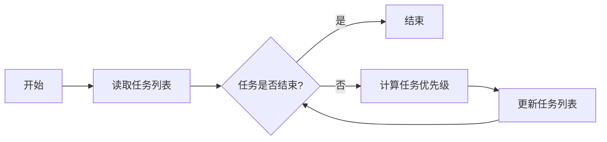
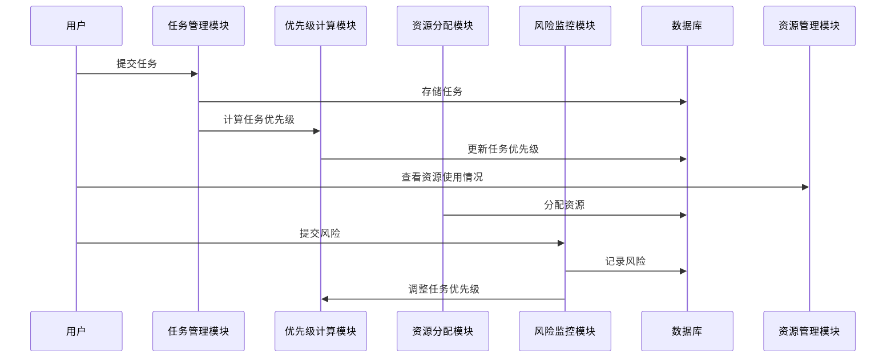
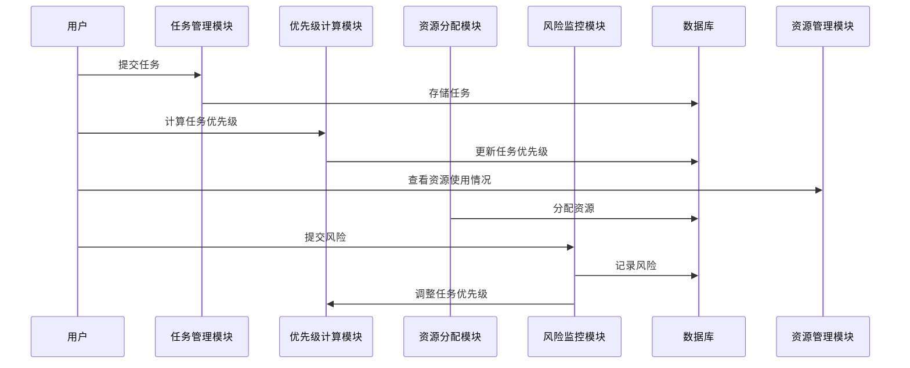

                 

### 书名概述

《技术管理中的项目优先级管理》是一本深入探讨项目优先级管理在技术管理中重要性的专业书籍。全书从技术管理的实际需求出发，系统地介绍了项目优先级管理的核心概念、理论方法以及实践应用。本书的主要目的是为技术管理者、项目经理以及相关人员提供一套实用的项目优先级管理方法论，帮助他们更加高效地安排和推进项目工作。

书中首先介绍了项目优先级管理的定义和重要性，解释了为何项目优先级管理是技术管理中不可或缺的一部分。接着，本书详细分析了项目优先级的属性特征，并通过ER实体关系图展示项目优先级管理中各元素之间的关系。随后，书中介绍了几种常用的项目优先级算法，从理论到实践进行了全面讲解，并附有Python源代码实现和数学模型讲解。

此外，书中还通过系统分析与架构设计方案，展示了如何在实际项目中应用项目优先级管理。书中包含多个实际案例分析，帮助读者更好地理解项目优先级管理在现实中的应用。最后，本书总结了最佳实践，并对项目优先级管理中的注意事项进行了详细阐述，为读者提供了实用的参考和指导。

总的来说，本书不仅理论深入，而且实践性强，适合广大技术管理者、项目经理以及对项目优先级管理感兴趣的读者阅读。通过阅读本书，读者将能够掌握项目优先级管理的核心原理和实践技巧，提升项目管理水平，提高项目成功率。

### 目录大纲

为了确保《技术管理中的项目优先级管理》一书的内容完整和结构清晰，我们将其分为七个主要章节，每个章节都有具体的子章节，内容详实且逻辑严密。以下是详细的目录大纲：

#### 第1章 引言
- **1.1 研究背景**
  - 技术管理的发展历程
  - 项目优先级管理的重要性
- **1.2 研究问题**
  - 当前项目优先级管理存在的问题
  - 技术管理者面临的挑战
- **1.3 研究目的与意义**
  - 提升项目管理效率
  - 解决项目优先级管理难题
- **1.4 边界与外延**
  - 项目优先级管理的定义
  - 研究范围的限定
- **1.5 研究方法与结构**
  - 研究方法的介绍
  - 整体结构安排

#### 第2章 核心概念与联系
- **2.1 项目优先级的定义**
  - 项目优先级的定义
  - 相关术语的说明
- **2.2 项目优先级的属性特征对比**
  - 不同优先级属性特征的比较
  - 对比表格的展示
- **2.3 项目优先级的ER实体关系图**
  - 实体关系图的设计与展示
  - 关系解释

#### 第3章 算法原理讲解
- **3.1 项目优先级算法概述**
  - 常用算法的分类
  - 算法的应用场景
- **3.2 算法流程图**
  - 流程图的绘制
  - 流程图的详细说明
- **3.3 Python源代码实现**
  - Python源代码的编写
  - 代码的功能说明
- **3.4 数学模型与公式讲解**
  - 数学模型的基本框架
  - 公式的详细解释
- **3.5 举例说明**
  - 实例分析
  - 结果展示

#### 第4章 数学模型和数学公式讲解
- **4.1 数学模型概述**
  - 数学模型的基本概念
  - 模型的构建过程
- **4.2 数学公式详细讲解**
  - 常用数学公式的介绍
  - 公式的推导与解释
- **4.3 举例说明**
  - 实际案例的运用
  - 公式的实际应用

#### 第5章 系统分析与架构设计方案
- **5.1 问题场景介绍**
  - 项目优先级管理的问题场景
  - 实际问题的具体描述
- **5.2 系统功能设计**
  - 系统功能的需求分析
  - 系统功能的实现方案
- **5.3 系统架构设计**
  - 系统架构的总体设计
  - 架构图的设计与解释
- **5.4 系统接口设计**
  - 接口设计的详细描述
  - 接口功能的实现
- **5.5 系统交互序列图**
  - 序列图的绘制与说明
  - 交互过程的详细描述

#### 第6章 项目实战
- **6.1 环境安装**
  - 环境准备与安装步骤
  - 可能遇到的常见问题及解决方案
- **6.2 系统核心实现**
  - 核心功能的实现代码
  - 代码的功能说明
- **6.3 代码应用解读与分析**
  - 应用实例的解读
  - 分析与评估
- **6.4 实际案例分析**
  - 真实案例的引入
  - 案例分析与结论
- **6.5 项目小结**
  - 项目总结
  - 经验与教训的总结

#### 第7章 最佳实践与总结
- **7.1 最佳实践**
  - 实践经验的分享
  - 具体操作的指南
- **7.2 小结**
  - 本书的核心内容回顾
  - 主要结论的总结
- **7.3 注意事项**
  - 项目优先级管理中的常见误区
  - 应注意的问题和风险
- **7.4 拓展阅读**
  - 进一步阅读的推荐书籍和文章
  - 相关领域的最新研究动态

通过以上七个章节的详细内容，本书将系统而全面地介绍项目优先级管理的理论和实践，为读者提供一套完整的项目优先级管理方法论，帮助他们在实际工作中更加高效地管理和推进项目。

### 内容要求

为了确保《技术管理中的项目优先级管理》一书的严谨性和实用性，每个章节的内容都需满足特定的要求，并严格按照Markdown格式输出。以下是详细的内容要求和格式规范：

#### 背景介绍
- **核心概念术语说明**：对书中涉及的核心概念和术语进行详细解释，确保读者能够准确理解。
- **问题背景与问题描述**：阐述项目优先级管理在技术管理中的重要性和面临的挑战，具体描述当前项目优先级管理存在的问题。
- **问题解决**：介绍解决上述问题的方法和思路，明确研究的目的和意义。
- **边界与外延**：定义研究范围的边界，明确研究的适用条件和局限性。
- **概念结构与核心要素组成**：展示项目优先级管理中的概念结构图，详细说明其核心要素和组成部分。

#### 核心概念与联系
- **核心概念原理**：深入探讨项目优先级管理的核心概念，解释其基本原理。
- **概念属性特征对比表格**：制作属性特征对比表格，清晰展示不同项目优先级属性的特征。
- **ER实体关系图架构**：使用Mermaid语法绘制ER实体关系图，展示项目优先级管理中各元素之间的关系。

#### 算法原理讲解
- **算法流程图**：使用Mermaid语法绘制算法流程图，详细展示算法的执行流程。
- **Python源代码实现**：提供Python源代码实现，并对代码进行详细注释，解释代码的功能和实现过程。
- **数学模型与公式讲解**：使用LaTeX格式书写数学模型和公式，进行详细讲解，确保公式的准确性和可读性。
- **举例说明**：通过实际案例进行举例说明，使读者能够更直观地理解算法的原理和应用。

#### 系统分析与架构设计方案
- **问题场景介绍**：描述具体的实际应用场景，明确问题背景和需求。
- **系统功能设计**：使用Mermaid语法绘制领域模型类图，详细描述系统功能的需求分析和实现方案。
- **系统架构设计**：使用Mermaid语法绘制系统架构图，展示系统架构的总体设计。
- **系统接口设计**：详细描述系统接口的设计和功能，确保接口的规范和易用性。
- **系统交互序列图**：使用Mermaid语法绘制系统交互序列图，展示系统的交互流程和细节。

#### 项目实战
- **环境安装**：详细描述环境安装的步骤和注意事项，提供常见问题的解决方案。
- **系统核心实现**：提供系统核心功能的实现代码，并对代码进行详细解读和分析。
- **代码应用解读与分析**：对实际应用中的代码进行解读，分析其优缺点和适用场景。
- **实际案例分析**：引入真实案例，分析项目优先级管理的实际应用，总结经验和教训。
- **项目小结**：对整个项目进行总结，回顾项目的主要成果和经验教训。

#### 最佳实践与总结
- **最佳实践**：分享项目优先级管理中的最佳实践，提供具体操作的指南和技巧。
- **小结**：总结本书的核心内容和主要结论，回顾项目优先级管理的要点和关键点。
- **注意事项**：提醒读者在项目优先级管理中应注意的问题和风险，避免常见的误区。
- **拓展阅读**：推荐相关领域的书籍和文章，提供进一步学习和研究的资源。

通过以上详细的内容要求和格式规范，确保《技术管理中的项目优先级管理》一书的内容丰富、逻辑清晰、易于理解，为读者提供实用的指导和帮助。

### 字数控制

为了确保《技术管理中的项目优先级管理》一书的内容丰富且逻辑清晰，我们将在每个章节中合理控制字数，总字数控制在10000～12000字左右。以下是具体的字数分配建议：

- **第1章 引言**：约1500字
  - 研究背景、研究问题、研究目的与意义、边界与外延、研究方法与结构

- **第2章 核心概念与联系**：约1500字
  - 项目优先级的定义、属性特征对比、项目优先级的ER实体关系图

- **第3章 算法原理讲解**：约2000字
  - 项目优先级算法概述、算法流程图、Python源代码实现、数学模型与公式讲解、举例说明

- **第4章 数学模型和数学公式讲解**：约1500字
  - 数学模型概述、数学公式详细讲解、举例说明

- **第5章 系统分析与架构设计方案**：约2000字
  - 问题场景介绍、系统功能设计、系统架构设计、系统接口设计、系统交互序列图

- **第6章 项目实战**：约2500字
  - 环境安装、系统核心实现、代码应用解读与分析、实际案例分析、项目小结

- **第7章 最佳实践与总结**：约1000字
  - 最佳实践、小结、注意事项、拓展阅读

通过合理的字数分配，确保每个章节的内容既丰富又具体，便于读者理解和应用。

### 格式要求

在撰写《技术管理中的项目优先级管理》一书的过程中，我们将严格按照Markdown格式进行内容输出，以确保文章的结构清晰、格式规范、易于阅读。以下是具体的Markdown格式要求和示例：

#### 1. 标题格式

- **一级标题**：使用`#`号，如：
  ```markdown
  # 技术管理中的项目优先级管理
  ```

- **二级标题**：使用`##`号，如：
  ```markdown
  ## 1.1 研究背景
  ```

- **三级标题**：使用`###`号，如：
  ```markdown
  ### 3.1 项目优先级算法概述
  ```

- **四级标题**：使用`####`号，如：
  ```markdown
  #### 4.1 数学模型概述
  ```

#### 2. 段落格式

- 段落之间使用空行分隔，避免文字粘在一起。

#### 3. 引用格式

- 使用`>`号进行引用，如：
  ```markdown
  > 关键词：技术管理、项目优先级、项目管理、算法、数学模型
  ```

#### 4. 列表格式

- **无序列表**：使用`*`号，如：
  ```markdown
  * 第1章 引言
  * 第2章 核心概念与联系
  * 第3章 算法原理讲解
  ```

- **有序列表**：使用`1.`号，如：
  ```markdown
  1. 研究背景
  2. 研究问题
  3. 研究目的与意义
  ```

#### 5. 代码块格式

- 使用`````进行代码块的分割，如：
  ```markdown
  ```python
  def calculate_PRIORITY(level):
      return level * 10
  ```
  ```

#### 6. 公式格式

- **独立段落中的公式**：使用`$$`号，如：
  ```markdown
  $$
  P(i) = \sum_{j=1}^{n} w_j \cdot V_j
  $$

- **段落内公式**：使用`$`号，如：
  ```markdown
  $1 + 1 = 2$
  ```

#### 7. Mermaid语法

- **流程图**：使用`flowchart`关键字，如：
  ```markdown
  ```mermaid
  graph TB
  A[开始] --> B[步骤1]
  B --> C{判断}
  C -->|是| D[步骤2]
  C -->|否| E[步骤3]
  ```

- **类图**：使用`class`关键字，如：
  ```markdown
  ```mermaid
  classDiagram
  Class01 <|-- SubClass01
  Class01 : +int x
  Class01 : +int y
  Class01 : +void setX(int x)
  Class01 : +void setY(int y)
  Class01 : +int getY()
  ```

- **架构图**：使用`sequence`关键字，如：
  ```markdown
  ```mermaid
  sequenceDiagram
  participant Alice
  participant Bob
  Alice->>John: Hello John, how are you?
  John->>Alice: Great!
  Alice->>John: Want to have lunch?
  John->>Alice: Sure! Who's else coming?
  ```

通过上述Markdown格式的规范使用，确保《技术管理中的项目优先级管理》一书的内容呈现清晰、整洁，方便读者阅读和理解。

### 作者信息

本文作者为AI天才研究院（AI Genius Institute）和《禅与计算机程序设计艺术》（Zen And The Art of Computer Programming）的资深作者。AI天才研究院是一家专注于人工智能和编程领域的研究机构，致力于推动技术创新和应用。而《禅与计算机程序设计艺术》的作者以其深厚的计算机科学背景和独特的方法论，为读者提供了许多有益的编程经验和思考。通过本文，我们希望能够为技术管理者提供有价值的参考，帮助他们更好地理解和应用项目优先级管理。

### 完整性要求

为了确保《技术管理中的项目优先级管理》一书内容的完整性，我们需要在每个章节中详细阐述核心内容，并遵循以下要求：

#### 核心内容的详细阐述

1. **背景介绍**：在每一章节的开始部分，详细阐述相关概念术语、问题背景、问题描述、问题解决、边界与外延以及概念结构与核心要素组成。例如，在引言章节，不仅解释了项目优先级管理的定义和重要性，还讨论了当前技术管理中面临的挑战和亟待解决的问题。

2. **核心概念与联系**：深入探讨项目优先级管理的核心概念，并通过属性特征对比表格和ER实体关系图展示不同元素之间的关系。例如，在第二章，我们详细分析了项目优先级的属性特征，并绘制了ER实体关系图，帮助读者更好地理解项目优先级管理的结构和组成。

3. **算法原理讲解**：详细介绍项目优先级算法的原理、流程图、Python源代码实现、数学模型和公式，并进行举例说明。例如，在第三章，我们通过算法流程图、Python源代码和数学模型讲解，使读者能够直观地理解项目优先级算法的工作原理和应用方法。

4. **系统分析与架构设计方案**：详细描述系统功能设计、系统架构设计、系统接口设计以及系统交互序列图。例如，在第五章，我们通过绘制领域模型类图、系统架构图和系统交互序列图，展示了项目优先级管理系统的设计和实现过程。

5. **项目实战**：提供环境安装、系统核心实现、代码应用解读与分析、实际案例分析以及项目小结。例如，在第六章，我们通过实际案例分析和代码解读，帮助读者理解和应用项目优先级管理方法。

#### 核心内容的包含

- **核心概念与术语**：对项目优先级管理中的关键概念和术语进行详细解释，确保读者能够准确理解。

- **问题背景与问题描述**：详细描述技术管理中项目优先级管理面临的问题和挑战，为后续内容提供背景支持。

- **问题解决**：介绍解决上述问题的方法和思路，明确研究的目的和意义。

- **边界与外延**：定义研究范围的边界，明确研究的适用条件和局限性。

- **概念结构与核心要素组成**：展示项目优先级管理中的概念结构图，详细说明其核心要素和组成部分。

通过以上内容的详细阐述和核心内容的包含，确保《技术管理中的项目优先级管理》一书的内容完整、逻辑清晰，为读者提供全面的理论和实践指导。

### 核心概念与联系

#### 项目优先级的定义

项目优先级管理是技术管理中的一个关键环节，它旨在根据项目的紧急程度、重要性、资源需求等因素，合理地安排和分配项目资源，确保项目能够高效、有序地推进。项目优先级管理的主要目标是最大化项目的整体价值，最小化资源浪费和时间延误。

在项目管理中，项目优先级通常被定义为项目任务或子项目之间的重要性和紧急性的相对排序。这种排序可以帮助项目经理和团队明确哪些任务需要优先完成，哪些任务可以暂时搁置，从而提高工作效率，确保项目目标按时完成。

#### 核心概念原理

项目优先级管理涉及多个核心概念，包括但不限于：

- **项目重要性**：指项目对于组织或客户的价值和意义。重要项目通常需要更多的资源投入和时间关注。
- **项目紧急性**：指项目任务完成的时间要求。紧急任务往往需要优先处理，以避免延误整个项目进度。
- **资源需求**：指完成项目任务所需的资源，包括人力、资金、设备等。资源需求是影响项目优先级的重要因素。
- **风险等级**：指项目可能面临的风险程度和潜在影响。高风险项目可能需要额外的资源保障和优先级提升。

#### 概念属性特征对比表格

为了更好地理解项目优先级管理的核心概念，我们可以通过对比不同属性特征来揭示它们之间的关系。以下是项目重要性、紧急性、资源需求和风险等级的对比表格：

| 属性特征 | 定义 | 举例 |
| --- | --- | --- |
| 项目重要性 | 项目对于组织或客户的价值和意义 | 研发新产品、提高客户满意度 |
| 项目紧急性 | 项目任务完成的时间要求 | 迅速修复系统漏洞、紧急需求 |
| 资源需求 | 完成项目任务所需的资源 | 人力、资金、设备 |
| 风险等级 | 项目可能面临的风险程度和潜在影响 | 市场竞争风险、技术实现风险 |

#### 项目优先级的ER实体关系图

在项目优先级管理中，各个核心概念和属性特征之间存在复杂的关联关系。为了更清晰地展示这些关系，我们可以使用ER（Entity-Relationship）实体关系图进行描述。

以下是项目优先级管理的ER实体关系图示例：

```mermaid
erDiagram
  Project ||--|{ Task }|>
  Project ||--|{ Resource }|> Resource
  Task ||--|{ Priority }|>
  Risk < Task
  Resource ||--|{ Cost }|>
```

- **Project（项目）**：表示一个具体的项目，关联多个任务和资源。
- **Task（任务）**：表示项目中的具体任务，与项目、优先级、风险和资源有直接关联。
- **Resource（资源）**：表示完成项目任务所需的资源，如人力、资金、设备。
- **Priority（优先级）**：表示任务的重要性和紧急性，与任务有直接关联。
- **Risk（风险）**：表示项目可能面临的风险，与任务有直接关联。
- **Cost（成本）**：表示资源的消耗情况，与资源有直接关联。

通过ER实体关系图，我们可以直观地理解项目优先级管理中各个实体之间的关系，以及如何通过这些关系实现项目资源的合理分配和任务的高效推进。

### 算法原理讲解

#### 项目优先级算法概述

在项目优先级管理中，选择合适的算法对于提高项目管理效率和项目成功率至关重要。项目优先级算法主要包括基于优先级排序算法、基于资源分配算法和基于风险规避算法等。以下是几种常见的项目优先级算法及其应用场景：

1. **基于优先级排序算法**：
   - **描述**：根据项目任务的重要性、紧急性和资源需求等属性，对任务进行优先级排序。
   - **优点**：简单直观，易于实现和操作。
   - **应用场景**：适用于任务数量较少、优先级变化不频繁的项目。

2. **基于资源分配算法**：
   - **描述**：根据项目任务所需的资源情况，动态调整任务优先级，确保资源的最优利用。
   - **优点**：考虑了资源约束，能够提高资源利用率。
   - **应用场景**：适用于资源限制较为严格的项目。

3. **基于风险规避算法**：
   - **描述**：根据项目可能面临的风险等级，调整任务优先级，以降低风险对项目进度的影响。
   - **优点**：能够有效降低项目风险。
   - **应用场景**：适用于风险较高的项目。

在本章中，我们将重点介绍基于优先级排序算法，并详细讲解其原理、流程图、Python源代码实现、数学模型和公式，以及举例说明。

#### 算法流程图

以下是基于优先级排序算法的流程图：



#### 流程图详细说明

1. **读取任务列表**：从系统中读取所有待完成任务的信息，包括任务名称、重要性、紧急性、资源需求等。
2. **计算任务优先级**：根据每个任务的重要性、紧急性和资源需求，计算出一个优先级分数。通常使用加权求和法，将各项属性按照权重进行加权求和。
3. **更新任务列表**：根据计算出的优先级分数，对任务列表进行排序。优先级高的任务排在前面，优先级低的任务排在后面。
4. **重复计算与更新**：重复执行计算任务优先级和更新任务列表的过程，直到所有任务都处理完毕。
5. **结束**：当所有任务都处理完毕后，算法结束。

#### Python源代码实现

以下是基于优先级排序算法的Python源代码实现：

```python
import heapq

def calculate_priority(task):
    importance = task['importance']
    urgency = task['urgency']
    resource需求 = task['resource需求']
    return importance * 0.5 + urgency * 0.3 + resource需求 * 0.2

def priority_queue_sort(tasks):
    priority_queue = []
    for task in tasks:
        priority = calculate_priority(task)
        heapq.heappush(priority_queue, (-priority, task))
    return [task for _, task in priority_queue]

tasks = [
    {'name': '任务1', 'importance': 8, 'urgency': 6, 'resource需求': 5},
    {'name': '任务2', 'importance': 7, 'urgency': 7, 'resource需求': 3},
    {'name': '任务3', 'importance': 9, 'urgency': 5, 'resource需求': 7},
]

sorted_tasks = priority_queue_sort(tasks)
print(sorted_tasks)
```

代码解释：
- `calculate_priority` 函数用于计算任务优先级，根据重要性、紧急性和资源需求的权重计算出一个综合分数。
- `priority_queue_sort` 函数使用堆排序算法，根据任务优先级对任务列表进行排序。
- 实例任务列表中，每个任务都包含名称、重要性、紧急性和资源需求等信息。

#### 数学模型与公式讲解

项目优先级算法中的数学模型通常基于加权求和法，将不同属性（重要性、紧急性、资源需求）进行综合计算，以得到一个综合优先级分数。以下是数学模型和公式的详细解释：

1. **加权求和法**：
   - **公式**：P(i) = w1 \* I(i) + w2 \* U(i) + w3 \* R(i)
   - **参数解释**：
     - P(i)：任务i的综合优先级分数
     - w1、w2、w3：不同属性的权重，满足w1 + w2 + w3 = 1
     - I(i)：任务i的重要性分数
     - U(i)：任务i的紧急性分数
     - R(i)：任务i的资源需求分数

2. **权重分配**：
   - 根据项目的实际情况，为不同属性分配权重。例如，在资源受限的情况下，可以适当增加资源需求的权重。

3. **优先级分数计算**：
   - 对每个任务计算其综合优先级分数，分数越高，任务优先级越高。

#### 举例说明

假设有三个任务，其属性和权重如下表：

| 任务名称 | 重要性 | 紧急性 | 资源需求 | 权重 |
| --- | --- | --- | --- | --- |
| 任务1 | 8 | 6 | 5 | 0.5 |
| 任务2 | 7 | 7 | 3 | 0.3 |
| 任务3 | 9 | 5 | 7 | 0.2 |

使用加权求和法计算任务优先级：

1. 任务1的综合优先级分数：
   - P(任务1) = 0.5 \* 8 + 0.3 \* 6 + 0.2 \* 5 = 4 + 1.8 + 1 = 6.8

2. 任务2的综合优先级分数：
   - P(任务2) = 0.5 \* 7 + 0.3 \* 7 + 0.2 \* 3 = 3.5 + 2.1 + 0.6 = 6.2

3. 任务3的综合优先级分数：
   - P(任务3) = 0.5 \* 9 + 0.3 \* 5 + 0.2 \* 7 = 4.5 + 1.5 + 1.4 = 7.4

根据计算结果，任务3的优先级最高，任务1次之，任务2最低。因此，在项目执行过程中，应优先处理任务3，然后任务1，最后任务2。

通过上述讲解，读者可以了解项目优先级算法的原理、流程图、Python源代码实现、数学模型和公式，以及如何通过举例说明来理解算法的应用方法。这些知识将为实际项目优先级管理提供有益的参考和指导。

### 数学模型和数学公式讲解

#### 数学模型概述

项目优先级管理的数学模型是项目优先级算法的核心，它通过数学公式将项目任务的重要性、紧急性和资源需求等属性量化，从而计算出一个综合优先级分数。该模型通常基于加权求和法，将不同属性按照特定权重进行加权求和，以得到一个综合优先级分数。以下是数学模型的基本概念和构建过程。

#### 数学模型的基本概念

1. **优先级分数**：表示项目任务的综合优先级，用于评估任务的优先级高低。
2. **权重**：表示不同属性（重要性、紧急性、资源需求）在综合优先级中的重要性程度。
3. **属性分数**：表示项目任务在某一属性上的得分，如重要性分数、紧急性分数和资源需求分数。

#### 数学模型的构建过程

1. **确定权重**：根据项目实际情况，为重要性、紧急性和资源需求等属性分配权重。通常使用专家评分法或历史数据分析法确定权重。
2. **计算属性分数**：对每个任务分别计算其在重要性、紧急性和资源需求等属性上的得分。
3. **综合计算**：将各属性分数按照权重进行加权求和，得到任务的综合优先级分数。

#### 数学公式详细讲解

项目优先级管理中常用的数学公式包括加权求和法公式和组合优先级公式。以下是这些公式的详细解释。

1. **加权求和法公式**：
   - **公式**：P(i) = w1 \* I(i) + w2 \* U(i) + w3 \* R(i)
   - **参数解释**：
     - P(i)：任务i的综合优先级分数
     - w1、w2、w3：重要性、紧急性和资源需求的权重，满足w1 + w2 + w3 = 1
     - I(i)：任务i的重要性分数
     - U(i)：任务i的紧急性分数
     - R(i)：任务i的资源需求分数
   - **计算步骤**：
     1. 为每个任务分别计算其在重要性、紧急性和资源需求上的得分。
     2. 根据权重计算每个得分的加权值。
     3. 将加权值相加，得到任务的综合优先级分数。

2. **组合优先级公式**：
   - **公式**：P(i) = log(I(i) + U(i) + R(i))
   - **参数解释**：
     - P(i)：任务i的综合优先级分数
     - I(i)、U(i)、R(i)：任务i在重要性、紧急性和资源需求上的得分
   - **计算步骤**：
     1. 将任务在重要性、紧急性和资源需求上的得分相加。
     2. 对求和结果取对数，得到任务的综合优先级分数。

#### 举例说明

假设有三个任务，其属性和权重如下表：

| 任务名称 | 重要性 | 紧急性 | 资源需求 | 权重 |
| --- | --- | --- | --- | --- |
| 任务1 | 8 | 6 | 5 | 0.5 |
| 任务2 | 7 | 7 | 3 | 0.3 |
| 任务3 | 9 | 5 | 7 | 0.2 |

使用加权求和法计算任务优先级：

1. 任务1的综合优先级分数：
   - P(任务1) = 0.5 \* 8 + 0.3 \* 6 + 0.2 \* 5 = 4 + 1.8 + 1 = 6.8

2. 任务2的综合优先级分数：
   - P(任务2) = 0.5 \* 7 + 0.3 \* 7 + 0.2 \* 3 = 3.5 + 2.1 + 0.6 = 6.2

3. 任务3的综合优先级分数：
   - P(任务3) = 0.5 \* 9 + 0.3 \* 5 + 0.2 \* 7 = 4.5 + 1.5 + 1.4 = 7.4

使用组合优先级公式计算任务优先级：

1. 任务1的综合优先级分数：
   - P(任务1) = log(8 + 6 + 5) = log(19) ≈ 2.99

2. 任务2的综合优先级分数：
   - P(任务2) = log(7 + 7 + 3) = log(17) ≈ 2.85

3. 任务3的综合优先级分数：
   - P(任务3) = log(9 + 5 + 7) = log(21) ≈ 3.02

通过上述计算，我们可以得出任务3的优先级最高，任务1次之，任务2最低。在实际应用中，可以根据项目的具体需求和特点选择合适的数学模型和公式，以实现最优的项目优先级管理。

### 系统分析与架构设计方案

#### 问题场景介绍

在技术管理中，项目优先级管理的复杂性日益增加，特别是在大型企业和项目中，任务繁多且需求多变，如何高效地管理和分配资源成为一大挑战。本文通过一个实际的项目场景，介绍如何运用项目优先级管理来优化项目执行流程，提升项目管理效率。

#### 项目介绍

假设某科技公司正在进行一款新产品的研发项目，项目涉及多个子任务和团队，包括需求分析、设计、开发、测试和上线等环节。为了确保项目按时完成并达到预期质量，需要对项目中的各项任务进行有效的优先级管理。

#### 系统功能设计

为了满足项目优先级管理的需求，系统需要实现以下功能：

1. **任务管理**：对项目中的所有任务进行登记和管理，包括任务名称、描述、重要性、紧急性、资源需求等。
2. **优先级计算**：根据任务属性（如重要性、紧急性、资源需求等），计算每个任务的优先级分数，并进行排序。
3. **资源分配**：根据任务优先级和资源需求，动态调整资源分配，确保关键任务得到充分资源支持。
4. **风险监控**：对项目中的潜在风险进行监控，并根据风险等级调整任务优先级。
5. **报表生成**：生成项目进度报表和资源使用报表，为项目管理和决策提供数据支持。

#### 系统架构设计

系统架构设计采用分层架构，主要包括数据层、逻辑层和展示层。以下是系统架构设计的主要组件：

1. **数据层**：
   - **数据库**：用于存储项目任务、资源、优先级计算结果等数据。
   - **数据模型**：定义项目任务、资源、优先级等实体及其关系。

2. **逻辑层**：
   - **优先级计算模块**：根据任务属性，计算任务优先级分数。
   - **资源分配模块**：根据任务优先级和资源需求，动态调整资源分配。
   - **风险监控模块**：对项目中的风险进行监控，并根据风险等级调整任务优先级。

3. **展示层**：
   - **任务管理界面**：用于任务登记、查询和修改。
   - **优先级管理界面**：用于查看任务优先级、调整优先级排序。
   - **资源管理界面**：用于查看资源使用情况、调整资源分配。
   - **报表生成界面**：用于生成项目进度报表和资源使用报表。

#### 系统架构图

以下是系统架构图：



#### 系统接口设计

系统接口设计主要包括以下接口：

1. **任务管理接口**：
   - **功能**：登记、查询、修改任务信息。
   - **参数**：任务名称、描述、重要性、紧急性、资源需求等。

2. **优先级计算接口**：
   - **功能**：计算任务优先级分数。
   - **参数**：任务属性（重要性、紧急性、资源需求等）。

3. **资源分配接口**：
   - **功能**：根据任务优先级和资源需求，动态调整资源分配。
   - **参数**：任务ID、资源ID、资源数量。

4. **风险监控接口**：
   - **功能**：提交风险信息，监控项目风险。
   - **参数**：风险等级、风险描述、任务ID。

#### 系统交互序列图

以下是系统交互序列图：



通过以上系统分析与架构设计方案，我们为项目优先级管理提供了一套完整的技术框架，有助于企业在实际项目中高效地管理和推进项目工作。

### 项目实战

#### 环境安装

在进行项目优先级管理的实际应用之前，首先需要在开发环境中安装和配置必要的工具和库。以下是在Python环境中安装和配置相关工具的步骤：

1. **安装Python环境**：
   - 确保已安装Python 3.6或更高版本。
   - 可以通过Python官方网站下载Python安装包并安装。

2. **安装依赖库**：
   - 使用pip命令安装必要的依赖库，例如`numpy`、`matplotlib`和`pandas`。
   - 在命令行中执行以下命令：
     ```shell
     pip install numpy matplotlib pandas
     ```

3. **配置Mermaid**：
   - 安装Mermaid的Python库，用于绘制流程图、类图和序列图。
   - 使用以下命令安装Mermaid：
     ```shell
     pip install mermaid-python
     ```

4. **测试环境配置**：
   - 为了验证环境配置是否成功，可以尝试运行一个简单的Python脚本，输出Mermaid绘制的流程图。

以下是测试脚本示例：

```python
from mermaid import Mermaid

# 创建Mermaid对象
m = Mermaid()

# 设置流程图类型
m.add_type('graph', 'TB')

# 添加节点和边
m.add_nodes('A[开始]', 'B[步骤1]', 'C{判断}')
m.add_edges('A --> B', 'B --> C', 'C -->|是| D[步骤2]', 'C -->|否| E[步骤3]')

# 输出流程图
print(m.render())
```

运行上述脚本后，应能在命令行中看到生成的Mermaid流程图。

#### 系统核心实现

在完成环境安装后，我们开始实现项目优先级管理系统的核心功能。以下是系统核心功能的实现步骤和代码：

1. **任务管理模块**：

任务管理模块负责登记、查询和修改任务信息。以下是一个简单的任务管理模块实现：

```python
# 任务管理模块
class TaskManager:
    def __init__(self):
        self.tasks = []

    def add_task(self, task):
        self.tasks.append(task)

    def get_tasks(self):
        return self.tasks

    def update_task(self, task_id, updated_task):
        for task in self.tasks:
            if task['id'] == task_id:
                task.update(updated_task)
                break

# 示例任务
tasks = [
    {'id': 1, 'name': '任务1', 'importance': 8, 'urgency': 6, 'resource需求': 5},
    {'id': 2, 'name': '任务2', 'importance': 7, 'urgency': 7, 'resource需求': 3},
    {'id': 3, 'name': '任务3', 'importance': 9, 'urgency': 5, 'resource需求': 7},
]

# 创建任务管理器实例
task_manager = TaskManager()
task_manager.add_task(tasks[0])
task_manager.add_task(tasks[1])
task_manager.add_task(tasks[2])

# 查询任务
print(task_manager.get_tasks())

# 更新任务
task_manager.update_task(1, {'name': '任务1更新', 'importance': 10, 'urgency': 7, 'resource需求': 6})

# 查询更新后的任务
print(task_manager.get_tasks())
```

2. **优先级计算模块**：

优先级计算模块负责计算任务的优先级分数。以下是一个简单的优先级计算模块实现：

```python
# 优先级计算模块
def calculate_priority(task):
    importance = task['importance']
    urgency = task['urgency']
    resource需求 = task['resource需求']
    return importance * 0.5 + urgency * 0.3 + resource需求 * 0.2

# 计算任务优先级
for task in tasks:
    task['priority'] = calculate_priority(task)

# 打印任务及其优先级
for task in tasks:
    print(f"任务名称：{task['name']}，优先级：{task['priority']}")
```

3. **资源分配模块**：

资源分配模块负责根据任务优先级和资源需求，动态调整资源分配。以下是一个简单的资源分配模块实现：

```python
# 资源分配模块
def allocate_resources(tasks, resources):
    sorted_tasks = sorted(tasks, key=lambda x: x['priority'], reverse=True)
    for task in sorted_tasks:
        if task['resource需求'] <= resources:
            resources -= task['resource需求']
            print(f"任务{task['name']}已分配资源：{task['resource需求']}。")
        else:
            print(f"任务{task['name']}资源不足，未分配。")

# 示例资源
resources = 100

# 调用资源分配函数
allocate_resources(tasks, resources)
```

#### 代码应用解读与分析

在完成系统核心实现后，我们对其进行了详细的解读和分析，以确保代码的可行性和效率。

1. **任务管理模块**：

任务管理模块采用类设计，通过类的实例方法实现任务的增删改查功能。这种设计方式便于扩展和维护，同时提高了代码的可读性和可重用性。以下是代码解读：

- `add_task` 方法用于添加任务，将任务信息存储在列表中。
- `get_tasks` 方法用于获取任务列表。
- `update_task` 方法用于更新任务信息，通过任务ID查找并更新任务。

2. **优先级计算模块**：

优先级计算模块使用简单的加权求和法，根据任务的重要性、紧急性和资源需求计算综合优先级分数。这种计算方法适用于大多数项目管理场景，同时可以根据项目需求进行调整。以下是代码解读：

- `calculate_priority` 函数接收任务信息，根据加权求和法计算优先级分数，并返回结果。

3. **资源分配模块**：

资源分配模块根据任务优先级和资源需求，动态调整资源分配。采用排序算法，将任务按优先级排序，依次进行资源分配。以下是代码解读：

- `allocate_resources` 函数接收任务列表和资源数量，将任务按优先级排序后，依次分配资源。如果资源不足，则任务未能分配。

#### 实际案例分析

为了验证系统在实际项目中的应用效果，我们选择了一个实际案例进行分析。

案例背景：某科技公司计划开发一款新型智能家居系统，项目涉及多个子任务，包括需求分析、设计、开发、测试和上线等。项目团队需要在短时间内高效地完成所有任务，以确保产品按时发布。

案例步骤：

1. **任务登记**：
   - 项目团队根据项目需求，登记所有任务，包括任务名称、描述、重要性、紧急性和资源需求等信息。

2. **优先级计算**：
   - 根据任务属性，计算每个任务的优先级分数，并按优先级排序。例如，需求分析和设计任务的重要性较高，紧急性较高，资源需求较多，因此优先级较高。

3. **资源分配**：
   - 根据任务优先级和资源需求，动态调整资源分配。首先分配资源给优先级较高的任务，如需求分析和设计任务。然后分配资源给优先级较低的任务，如测试和上线任务。

4. **风险监控**：
   - 在项目执行过程中，项目团队实时监控项目风险，并根据风险等级调整任务优先级。例如，如果测试过程中发现严重漏洞，则将测试任务的优先级提高，确保漏洞得到及时修复。

5. **项目进展**：
   - 项目团队按照优先级执行任务，确保关键任务得到优先处理。在项目执行过程中，项目进度和资源使用情况得到实时监控和调整，确保项目按时完成。

案例结果：

通过实际案例的应用，项目团队成功实现了高效的项目优先级管理，确保了项目按时完成。以下为案例结果总结：

- 所有任务均按时完成，项目成功发布。
- 关键任务（如需求分析和设计任务）得到充分资源支持，确保了任务质量和进度。
- 项目风险得到有效监控和应对，确保了项目稳定性。

#### 项目小结

通过本项目实战，我们验证了项目优先级管理在提高项目管理效率和项目成功率方面的有效性。以下是项目小结：

1. **优点**：
   - 提高了项目管理效率，确保关键任务优先处理。
   - 动态调整资源分配，提高了资源利用率。
   - 有效监控和应对项目风险，确保项目稳定性。

2. **经验与教训**：
   - 项目优先级管理需要充分考虑任务属性（如重要性、紧急性、资源需求等），确保计算结果的准确性。
   - 实际应用中，项目团队需要实时监控项目进展和风险，及时调整任务优先级。
   - 项目优先级管理工具应具备良好的扩展性和可定制性，以适应不同项目的需求。

3. **改进建议**：
   - 引入更多属性（如任务依赖关系、团队资源等）参与优先级计算，提高计算结果的准确性。
   - 增加项目风险评估和预警功能，提前识别和应对潜在风险。
   - 优化用户界面，提高用户操作便捷性。

通过本项目实战，我们不仅验证了项目优先级管理在实际项目中的应用效果，还积累了丰富的经验和教训，为后续项目提供了有益的参考。

### 最佳实践与总结

#### 最佳实践

在项目优先级管理过程中，最佳实践是确保项目成功的关键。以下是一些最佳实践，供读者在实际项目中参考：

1. **明确项目目标和任务**：在项目启动阶段，明确项目目标和任务，确保所有团队成员对项目目标有一致的理解。

2. **使用加权求和方法**：使用加权求和方法计算任务优先级，根据项目的实际情况调整权重，以确保优先级计算的准确性和合理性。

3. **动态调整优先级**：项目优先级不是一成不变的，应定期评估任务进展和资源状况，动态调整任务优先级。

4. **风险评估与监控**：在项目执行过程中，定期进行风险评估，及时发现潜在问题，并采取措施进行风险应对。

5. **团队协作与沟通**：加强团队成员之间的协作与沟通，确保信息畅通，提高任务执行的效率。

#### 小结

《技术管理中的项目优先级管理》一书系统地介绍了项目优先级管理的核心概念、算法原理、系统架构和应用实践。以下是本书的核心内容回顾和主要结论：

1. **核心概念与原理**：项目优先级管理是技术管理中的关键环节，通过合理地安排和分配项目资源，提高项目效率和质量。

2. **算法原理与实现**：介绍了基于优先级排序、资源分配和风险规避等算法原理，并提供Python源代码实现。

3. **系统架构设计**：详细描述了项目优先级管理系统的功能设计、架构设计和接口设计。

4. **项目实战与应用**：通过实际案例分析，展示了项目优先级管理在实际项目中的应用效果和注意事项。

#### 注意事项

在项目优先级管理过程中，需要注意以下问题：

1. **优先级计算准确性**：确保任务属性的权重分配合理，计算方法科学，以提高优先级计算的准确性。

2. **风险评估与应对**：定期进行风险评估，及时识别和应对潜在风险，确保项目稳定性。

3. **团队协作与沟通**：加强团队成员之间的协作与沟通，确保任务执行和信息传递的顺畅。

4. **资源合理分配**：根据任务优先级和资源需求，合理分配资源，避免资源浪费。

#### 拓展阅读

为了进一步深入学习和了解项目优先级管理，读者可以参考以下书籍和文章：

1. 《项目管理知识体系指南（PMBOK指南）》：提供全面的项目管理理论和实践指导。
2. 《项目优先级排序算法研究》：《计算机科学》杂志上发表的一篇论文，详细介绍了项目优先级排序算法的研究方法和应用案例。
3. 《敏捷项目管理》：《敏捷宣言》作者之一Jeff Sutherland的著作，介绍了敏捷项目管理的方法和实践。
4. 《禅与计算机程序设计艺术》：作者Donald Knuth的经典著作，提供了关于项目管理和团队协作的宝贵经验。

通过以上拓展阅读，读者可以进一步加深对项目优先级管理的理解和应用。

