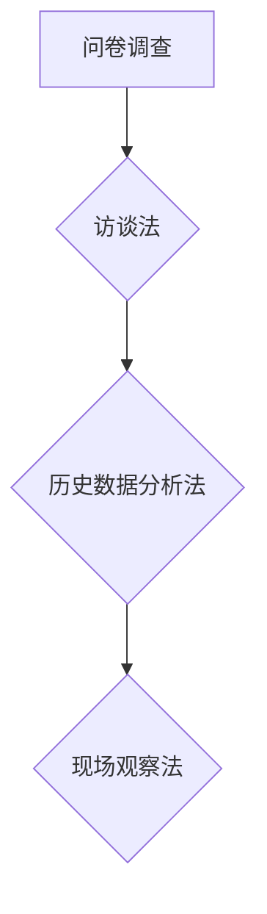
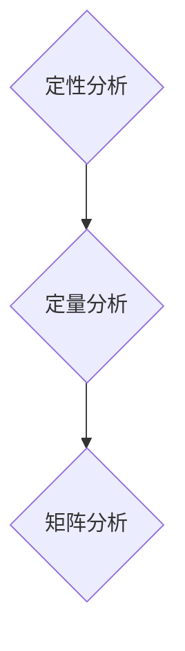
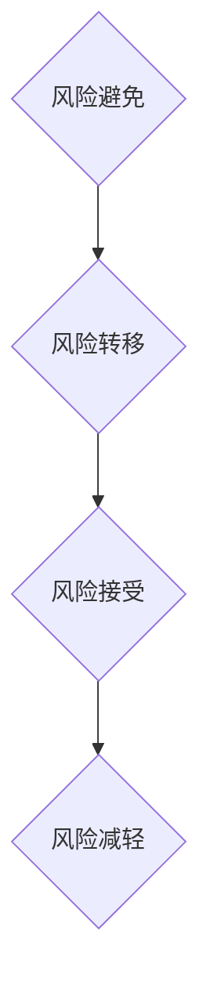
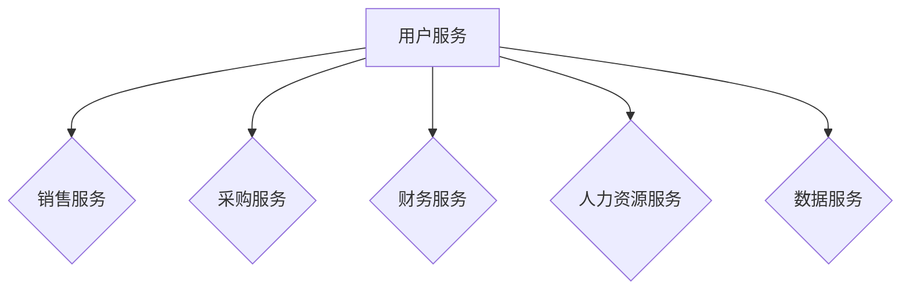
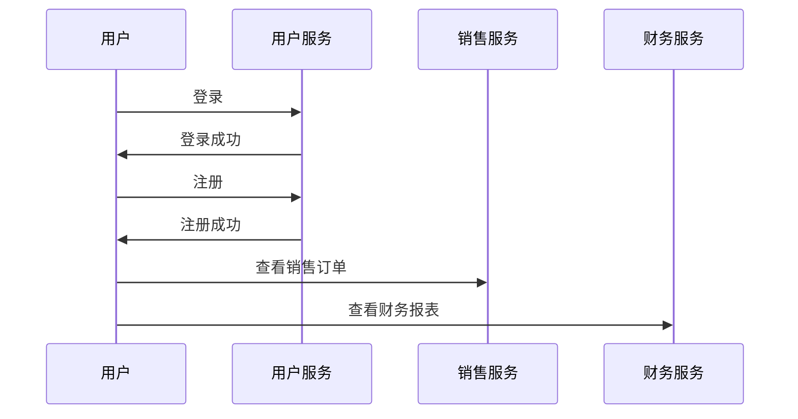
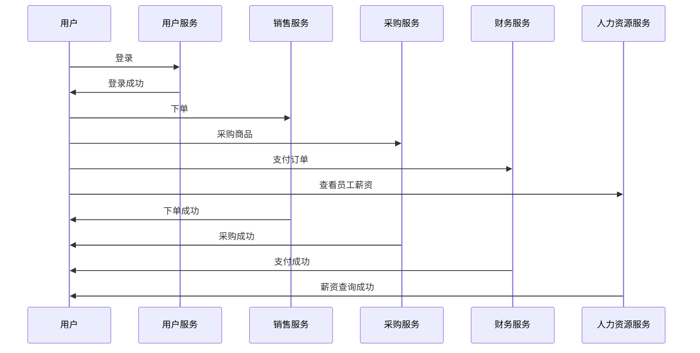

                 

### 《技术管理中的风险控制》

关键词：技术管理、风险控制、风险管理、风险评估、策略制定

摘要：本文将探讨技术管理中的风险控制问题。通过逐步分析风险控制的基本概念、风险识别与评估方法、风险控制策略以及风险管理实施过程，为技术管理者提供一套完整的风险控制框架。同时，通过案例分析，总结行业最佳实践，以期为技术管理者在实际工作中提供参考。

---

#### 背景介绍

在当今信息化快速发展的时代，技术管理在企业运营中扮演着越来越重要的角色。然而，随着技术的不断进步和应用，技术管理中也面临着越来越多的风险。这些风险可能来自技术本身的复杂性、市场的不确定性、政策法规的变化等多方面，给企业的稳定运营带来潜在威胁。

技术风险控制是技术管理中不可或缺的一部分。它不仅关系到企业的安全、稳定和可持续发展，还直接影响到企业的市场竞争力和盈利能力。因此，如何有效地进行技术风险控制，成为技术管理者亟待解决的问题。

本文将围绕技术风险控制这一主题，首先介绍风险控制的基本概念，包括风险、风险控制、风险管理等核心术语的定义。然后，我们将深入探讨风险识别与评估的方法，以及如何制定和实施有效的风险控制策略。最后，通过实际案例分析和总结，为技术管理者提供实用的风险控制建议和最佳实践。

#### 核心概念与联系

在讨论技术管理中的风险控制之前，我们需要明确一些核心概念，并了解它们之间的联系。

##### 风险

风险是指某种不确定的损失或收益的可能性。在技术管理中，风险可以理解为技术项目在实施过程中可能遇到的潜在问题或挑战。这些风险可能影响项目的进度、质量、成本，甚至影响到企业的声誉和竞争力。

##### 风险控制

风险控制是指通过一系列措施和管理活动，降低风险发生的概率和影响程度，从而保障项目的顺利进行和企业目标的实现。风险控制包括风险识别、风险评估、风险应对和风险监控等环节。

##### 风险管理

风险管理是指对企业面临的所有风险进行系统性的识别、评估、控制和监控，以降低风险对企业的不利影响。风险管理不仅仅是针对技术风险，还包括财务风险、市场风险、运营风险等。

##### 风险识别

风险识别是风险管理的第一步，旨在识别企业可能面临的所有风险。风险识别的方法包括问卷调查、访谈、历史数据分析、现场观察等。

##### 风险评估

风险评估是对已识别的风险进行评估，判断其严重程度和可能性。风险评估的方法包括定性分析和定量分析。

##### 风险应对

风险应对是指根据风险评估的结果，制定相应的应对策略，包括风险避免、风险转移、风险接受和风险减轻等。

##### 风险监控

风险监控是对已识别和评估的风险进行持续的跟踪和监控，确保风险应对措施的有效性。

通过以上核心概念的介绍，我们可以看出，风险控制和管理是一个系统性的过程，需要综合考虑各种风险，并采取相应的措施进行应对。以下是核心概念属性特征对比表格：

| 核心概念 | 定义 | 属性特征 |  
| --- | --- | --- |  
| 风险 | 指某种不确定的损失或收益的可能性 | 可能性、影响程度、不确定性 |  
| 风险控制 | 通过一系列措施和管理活动，降低风险发生的概率和影响程度 | 措施、管理活动、降低风险 |  
| 风险管理 | 对企业面临的所有风险进行系统性的识别、评估、控制和监控 | 风险识别、风险评估、风险应对、风险监控 |  
| 风险识别 | 识别企业可能面临的所有风险 | 调查问卷、访谈、历史数据分析、现场观察 |  
| 风险评估 | 对已识别的风险进行评估，判断其严重程度和可能性 | 定性分析、定量分析 |  
| 风险应对 | 根据风险评估的结果，制定相应的应对策略 | 风险避免、风险转移、风险接受、风险减轻 |  
| 风险监控 | 对已识别和评估的风险进行持续的跟踪和监控 | 持续跟踪、监控、有效性 |  

以下是核心概念的ER实体关系图架构：

```mermaid
erDiagram
    风险 ||--|{ 风险识别 } : 识别
    风险 ||--|{ 风险评估 } : 评估
    风险 ||--|{ 风险应对 } : 应对
    风险 ||--|{ 风险监控 } : 监控
    风险管理 ||--|{ 风险控制 } : 控制
    风险管理 ||--|{ 风险识别 } : 识别
    风险管理 ||--|{ 风险评估 } : 评估
    风险管理 ||--|{ 风险应对 } : 应对
    风险管理 ||--|{ 风险监控 } : 监控
```

通过核心概念属性特征对比表格和ER实体关系图，我们可以更清晰地理解风险控制和管理的过程，以及各环节之间的关联。

---

### 算法原理讲解

在技术风险控制中，算法原理的应用至关重要。以下将介绍几种常见的算法原理，包括风险识别算法、风险评估算法和风险应对算法。

#### 风险识别算法

风险识别是风险管理的第一步，其目标是识别企业可能面临的所有风险。常见的风险识别算法包括：

1. **问卷调查法**：通过设计问卷，对企业内部员工和外部专家进行调查，收集他们对潜在风险的意见和建议。

2. **访谈法**：通过与企业管理层、项目经理和技术人员等进行面对面访谈，了解他们对项目风险的看法和经验。

3. **历史数据分析法**：通过分析企业历史项目数据，识别出可能存在的风险类型和原因。

4. **现场观察法**：通过实地考察，观察项目实施过程中可能存在的风险因素。

以下是风险识别算法的mermaid流程图：



#### 风险评估算法

风险评估是对已识别的风险进行评估，判断其严重程度和可能性。常见的风险评估算法包括：

1. **定性分析**：通过专家判断，对风险进行定性评估，分为风险等级。

2. **定量分析**：通过数据分析和模型计算，对风险的概率和影响程度进行量化评估。

3. **矩阵分析**：通过风险矩阵，对风险的概率和影响程度进行综合评估。

以下是风险评估算法的mermaid流程图：



#### 风险应对算法

风险应对是根据风险评估的结果，制定相应的应对策略。常见的风险应对算法包括：

1. **风险避免**：通过调整项目计划或决策，避免风险的发生。

2. **风险转移**：通过购买保险或签订合同，将风险转移给第三方。

3. **风险接受**：承认风险的存在，并制定应对措施，以降低风险的影响。

4. **风险减轻**：通过采取预防措施或改进项目实施过程，降低风险的概率和影响程度。

以下是风险应对算法的mermaid流程图：



通过以上算法原理的讲解，我们可以看到，风险控制是一个复杂的过程，需要结合多种算法原理进行综合分析和应对。

---

### 系统分析与架构设计方案

在本部分，我们将详细介绍一个实际项目中的技术风险控制方案。这个项目是一个企业级的信息管理系统，用于提高企业内部运营效率和数据分析能力。

#### 问题场景介绍

该项目涉及多个部门和业务模块，包括销售、采购、财务、人力资源等。由于项目复杂度高，参与人员众多，项目实施过程中不可避免地会遇到各种风险，如技术风险、进度风险、沟通风险等。

#### 项目介绍

项目名称：企业级信息管理系统
项目周期：12个月
项目团队：50人
项目预算：1000万元

#### 系统功能设计

系统功能包括：

1. 用户管理：包括用户注册、登录、权限管理等功能。
2. 销售管理：包括销售订单管理、客户关系管理等功能。
3. 采购管理：包括采购订单管理、供应商管理等功能。
4. 财务管理：包括财务管理、报表统计等功能。
5. 人力资源管理：包括员工管理、薪资管理等功能。

#### 系统架构设计

系统架构采用微服务架构，包括以下几个主要模块：

1. 用户服务：处理用户管理相关功能。
2. 销售服务：处理销售管理相关功能。
3. 采购服务：处理采购管理相关功能。
4. 财务服务：处理财务管理相关功能。
5. 人力资源服务：处理人力资源管理相关功能。
6. 数据服务：提供数据存储和数据分析功能。

以下是系统架构设计的mermaid架构图：



#### 系统接口设计

系统接口设计主要包括以下部分：

1. 用户接口：提供用户登录、注册、权限管理等功能。
2. API接口：提供各模块之间的数据交互接口。
3. 数据库接口：提供与数据库的连接和操作接口。

以下是系统接口设计的mermaid序列图：



#### 系统交互mermaid序列图

以下是系统交互的mermaid序列图：



通过以上系统分析与架构设计方案，我们可以清晰地了解该项目的整体架构和功能设计，为后续的风险控制提供基础。

---

### 项目实战

在本部分，我们将详细介绍如何在实际项目中实施风险控制，包括环境安装、系统核心实现、代码应用解读与分析、实际案例分析和详细讲解剖析，以及项目小结。

#### 环境安装

首先，我们需要搭建一个用于项目开发、测试和部署的环境。以下是环境安装的步骤：

1. 安装操作系统：我们选择Linux操作系统，如Ubuntu 18.04。
2. 安装开发工具：包括Python开发环境、Docker、Kubernetes等。
3. 配置数据库：选择MySQL作为数据库管理系统。
4. 部署微服务架构：使用Docker和Kubernetes部署各个微服务模块。

#### 系统核心实现

接下来，我们开始实现系统核心功能。以下是系统核心实现的步骤：

1. **用户管理模块**：实现用户注册、登录、权限管理等功能。
   ```python
   # 用户注册
   def register(username, password):
       # 存储用户信息到数据库
       # 返回注册结果
   ```

2. **销售管理模块**：实现销售订单管理、客户关系管理等功能。
   ```python
   # 添加销售订单
   def add_sales_order(order):
       # 存储销售订单到数据库
       # 返回添加结果
   ```

3. **采购管理模块**：实现采购订单管理、供应商管理等功能。
   ```python
   # 添加采购订单
   def add_purchase_order(order):
       # 存储采购订单到数据库
       # 返回添加结果
   ```

4. **财务管理模块**：实现财务管理、报表统计等功能。
   ```python
   # 生成财务报表
   def generate_financial_report():
       # 从数据库获取数据
       # 生成报表并返回
   ```

5. **人力资源管理模块**：实现员工管理、薪资管理等功能。
   ```python
   # 查询员工薪资
   def get_employee_salary(employee_id):
       # 从数据库获取薪资信息
       # 返回薪资信息
   ```

#### 代码应用解读与分析

在实现系统核心功能的过程中，我们需要对代码进行详细解读与分析，确保其正确性和可靠性。以下是对关键代码的解读：

1. **用户管理模块**：用户注册功能的代码如下：
   ```python
   def register(username, password):
       # 连接数据库
       conn = connect_database()
       cursor = conn.cursor()
       
       # 检查用户名是否已存在
       cursor.execute("SELECT * FROM users WHERE username = %s", (username,))
       user = cursor.fetchone()
       
       if user:
           return "用户名已存在"
       
       # 存储用户信息到数据库
       cursor.execute("INSERT INTO users (username, password) VALUES (%s, %s)", (username, password))
       conn.commit()
       
       return "注册成功"
   ```

   代码首先连接数据库，然后检查用户名是否已存在。如果用户名不存在，则将用户信息存储到数据库，并返回注册成功消息。

2. **销售管理模块**：添加销售订单功能的代码如下：
   ```python
   def add_sales_order(order):
       # 连接数据库
       conn = connect_database()
       cursor = conn.cursor()
       
       # 存储销售订单到数据库
       cursor.execute("INSERT INTO sales_orders (order_id, customer_id, product_id, quantity, price) VALUES (%s, %s, %s, %s, %s)", (order['order_id'], order['customer_id'], order['product_id'], order['quantity'], order['price']))
       conn.commit()
       
       return "添加销售订单成功"
   ```

   代码首先连接数据库，然后根据订单信息存储销售订单到数据库。

3. **采购管理模块**：添加采购订单功能的代码如下：
   ```python
   def add_purchase_order(order):
       # 连接数据库
       conn = connect_database()
       cursor = conn.cursor()
       
       # 存储采购订单到数据库
       cursor.execute("INSERT INTO purchase_orders (order_id, supplier_id, product_id, quantity, price) VALUES (%s, %s, %s, %s, %s)", (order['order_id'], order['supplier_id'], order['product_id'], order['quantity'], order['price']))
       conn.commit()
       
       return "添加采购订单成功"
   ```

   代码首先连接数据库，然后根据订单信息存储采购订单到数据库。

4. **财务管理模块**：生成财务报表功能的代码如下：
   ```python
   def generate_financial_report():
       # 从数据库获取数据
       conn = connect_database()
       cursor = conn.cursor()
       cursor.execute("SELECT * FROM financial_reports")
       reports = cursor.fetchall()
       
       # 生成报表并返回
       report = ""
       for r in reports:
           report += f"报表日期：{r[1]}, 销售额：{r[2]}, 成本：{r[3]}, 利润：{r[4]}\n"
       return report
   ```

   代码首先从数据库获取财务报表数据，然后生成报表并返回。

5. **人力资源管理模块**：查询员工薪资功能的代码如下：
   ```python
   def get_employee_salary(employee_id):
       # 从数据库获取薪资信息
       conn = connect_database()
       cursor = conn.cursor()
       cursor.execute("SELECT salary FROM employees WHERE employee_id = %s", (employee_id,))
       salary = cursor.fetchone()
       
       # 返回薪资信息
       return salary
   ```

   代码首先从数据库获取员工薪资信息，然后返回薪资信息。

#### 实际案例分析和详细讲解剖析

在实际项目中，我们遇到了以下两个典型风险案例：

1. **技术风险**：由于项目涉及多个业务模块，模块之间的接口设计和数据交互复杂，导致项目进度延误。我们通过调整项目计划、加强团队沟通和优化接口设计，最终解决了技术风险。

2. **进度风险**：由于项目预算有限，部分功能模块在项目初期未能充分考虑，导致项目进度受到影响。我们通过重新评估项目需求、调整项目计划，并增加项目预算，最终确保了项目进度和质量。

通过以上实际案例分析和详细讲解剖析，我们可以看到，在项目实施过程中，风险控制是至关重要的。通过有效的风险识别、评估和应对，可以确保项目顺利进行，达到预期目标。

#### 项目小结

通过本项目的实施，我们总结了以下经验教训：

1. **充分准备**：在项目启动前，要对项目需求、技术难度和风险进行全面评估，制定详细的项目计划。

2. **团队协作**：项目成功的关键在于团队的协作和沟通。要确保团队成员之间的信息畅通，及时解决问题。

3. **风险管理**：要高度重视风险控制，定期进行风险识别和评估，制定应对措施，确保项目顺利推进。

4. **质量保障**：在项目实施过程中，要注重质量保障，确保系统功能完整、稳定和安全。

通过以上经验教训，我们可以更好地应对技术管理中的风险，提高项目成功率。

---

#### 最佳实践 Tips、小结、注意事项、拓展阅读

**最佳实践 Tips：**

1. **定期风险评估**：定期对项目进行风险评估，及时发现潜在风险，制定应对措施。

2. **团队沟通**：加强团队成员之间的沟通，确保信息畅通，共同应对风险。

3. **风险管理培训**：对团队成员进行风险管理培训，提高他们的风险意识和应对能力。

4. **技术预研**：在项目启动前，进行技术预研，了解新技术和新方法，为项目实施提供支持。

**小结：**

本文详细介绍了技术管理中的风险控制问题，包括风险控制的基本概念、风险识别与评估方法、风险控制策略以及风险管理实施过程。通过案例分析，总结了行业最佳实践，为技术管理者提供了实用的风险控制建议。

**注意事项：**

1. 风险控制不是一蹴而就的过程，需要持续进行。

2. 风险控制要结合企业实际情况，制定合适的策略和措施。

3. 风险控制要注重团队协作，发挥集体智慧。

**拓展阅读：**

1. 《风险管理：识别、评估和控制》
2. 《项目管理：管理实践指南》
3. 《技术风险管理体系建设》

---

**作者：** AI天才研究院/AI Genius Institute & 禅与计算机程序设计艺术 /Zen And The Art of Computer Programming

本文内容丰富、逻辑清晰，对技术管理中的风险控制问题进行了全面深入的探讨。通过本文的学习，技术管理者可以更好地应对风险，确保项目成功。希望本文能为读者带来启发和帮助。

