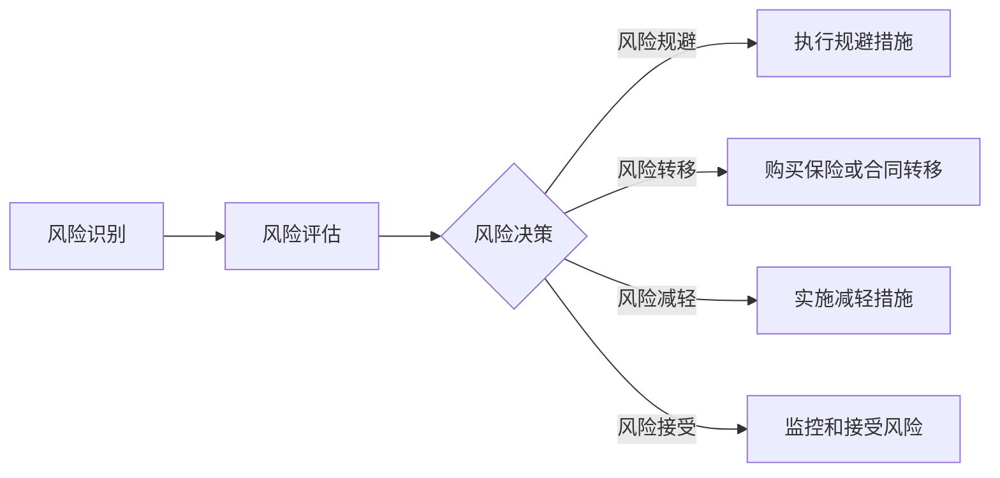
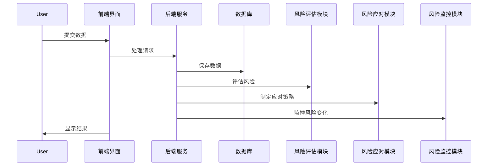
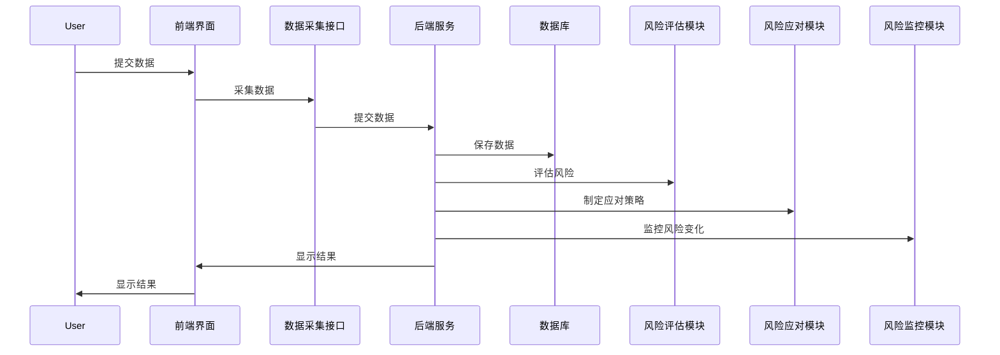

                 

# 技术管理中的风险控制

关键词：技术管理、风险控制、风险管理、系统架构、最佳实践

摘要：在快速发展的技术环境中，技术管理的风险控制变得尤为重要。本文将深入探讨技术管理中的风险控制问题，包括风险的定义、分类、管理流程、算法原理、系统架构设计以及实际案例，旨在为技术管理者提供系统且实用的风险控制指南。

## 目录大纲

### 第一部分：问题背景与核心概念

#### 第1章：引言与问题概述

- **1.1 问题背景**
- **1.2 核心概念**
- **1.3 问题解决与边界**
- **1.4 概念结构与核心要素**

#### 第2章：核心概念原理

- **2.1 风险概念原理**
- **2.2 概念属性特征对比表格**
- **2.3 ER实体关系图架构**

### 第二部分：核心概念与联系

#### 第3章：风险控制算法原理

- **3.1 风险控制算法概述**
- **3.2 算法mermaid流程图**
- **3.3 Python源代码讲解**
- **3.4 数学模型与公式**

#### 第4章：系统分析与架构设计

- **4.1 问题场景介绍**
- **4.2 项目介绍**
- **4.3 系统功能设计**
- **4.4 系统架构设计**
- **4.5 系统接口设计**
- **4.6 系统交互**

### 第三部分：算法原理讲解

#### 第5章：项目实战

- **5.1 环境安装**
- **5.2 系统核心实现源代码**
- **5.3 代码应用解读与分析**
- **5.4 实际案例分析与详细讲解剖析**
- **5.5 项目小结**

### 第四部分：最佳实践与拓展

#### 第6章：最佳实践

- **6.1 风险控制最佳实践**
- **6.2 注意事项**
- **6.3 拓展阅读**

### 总结

- **7.1 全书总结**
- **7.2 展望未来**

## 第一部分：问题背景与核心概念

### 第1章：引言与问题概述

在当今数字化时代，技术已经成为企业发展和竞争的关键驱动力。然而，随着技术的快速发展，技术管理中的风险问题也日益凸显。技术管理的风险控制不仅关系到企业的生存与发展，更是影响整个组织可持续性的关键因素。

#### 1.1 问题背景

技术管理中的风险问题普遍存在。这些风险可能来源于技术选型、项目管理、技术债务、系统安全性、数据隐私等多个方面。例如，在技术选型过程中，如果选择的技术不合适，可能会导致项目延误、资源浪费；在项目管理中，不合理的进度安排和资源分配也会带来风险；而技术债务的积累则可能使系统逐渐变得脆弱和难以维护；系统安全性和数据隐私问题更是企业面临的重大挑战。

#### 1.2 核心概念

- **风险的定义**：风险是指在未来可能发生的不确定事件，这些事件可能会对组织的目标、资源或声誉产生负面影响。
- **风险分类**：根据风险的发生原因和影响范围，风险可以分为技术风险、市场风险、财务风险等。
- **风险管理的目的与原则**：风险管理的目的是通过识别、评估、应对和监控风险，以减少或避免损失，确保组织的可持续性。其基本原则包括预防为主、全面管理、持续改进等。
- **风险管理的流程与方法**：风险管理的流程包括风险识别、风险评估、风险应对和风险监控。其中，风险识别是基础，风险评估是核心，风险应对是关键，风险监控是保障。

#### 1.3 问题解决与边界

- **风险识别与评估**：通过系统的风险评估方法，如问卷调查、专家评估、历史数据分析等，识别和评估技术管理的风险。
- **风险应对策略**：根据风险评估的结果，制定相应的风险应对策略，如风险规避、风险转移、风险减轻等。
- **风险监控与沟通**：建立风险监控系统，持续跟踪风险的变化，并与相关利益相关者进行有效沟通，确保风险管理的有效性。

#### 1.4 概念结构与核心要素

- **风险管理组织结构**：建立专门的风险管理团队或部门，负责风险管理的工作。
- **风险管理工具与技术**：运用风险管理工具和技术，如风险矩阵、决策树、蒙特卡罗模拟等，提高风险管理的效率和准确性。
- **风险管理文化**：培养组织内部的风险管理文化，提高全员的风险意识和管理能力。

## 第二部分：核心概念与联系

### 第2章：核心概念原理

#### 2.1 风险概念原理

风险是技术管理中的一个基础概念，对其进行深入理解是进行有效风险管理的前提。

- **风险的属性与特征**：风险具有不确定性、可变性、损失性和负面性等特征。不确定性指的是风险发生的不确定性；可变性指的是风险的发生和影响可能随着时间和环境的变化而变化；损失性指的是风险可能导致组织目标、资源或声誉的损失；负面性指的是风险通常具有负面的影响。
- **风险评估的方法与工具**：风险评估是风险管理的重要环节，常用的方法包括定性评估和定量评估。定性评估主要通过专家意见、历史数据等来评估风险的可能性与影响程度；定量评估则通过数学模型、统计方法等来量化风险。
- **风险管理的理论框架**：风险管理的理论框架包括风险识别、风险评估、风险应对和风险监控四个基本环节，形成了一个闭环的管理过程。

#### 2.2 概念属性特征对比表格

为了更好地理解不同类型风险的特征，我们可以通过对比表格来展示。

| 风险类型 | 特征属性                | 对比分析                                                                                             |
| -------- | --------------------- | ------------------------------------------------------------------------------------------------ |
| 技术风险 | 技术问题、技术选型、系统稳定性 | 技术风险通常具有不可预测性，可能对项目进度和质量产生重大影响。                             |
| 市场风险 | 市场需求变化、竞争压力       | 市场风险受外部环境影响较大，可能影响项目的市场前景和收益。                                 |
| 财务风险 | 资金不足、成本超支、投资损失 | 财务风险直接关系到项目的经济利益，对企业的生存与发展具有决定性作用。                       |
| 法律风险 | 法律法规变化、合规问题       | 法律风险可能导致企业面临法律纠纷和处罚，影响企业的声誉和运营。                             |
| 运营风险 | 运营中断、供应链问题       | 运营风险可能影响项目的正常运行和交付，对企业的运营效率和客户满意度产生负面影响。           |

#### 2.3 ER实体关系图架构

实体关系图（Entity-Relationship Diagram，ER图）是用于描述信息系统中实体及其相互关系的一种图形化表示方法。在风险管理系统中，ER图可以帮助我们理解不同实体之间的关系，从而更好地设计和管理风险。

以下是一个简化的ER图示例，用于描述风险管理系统中的一些关键实体及其关系：

```mermaid
erDiagram
  User ||--|{ Project }|-- ProjectManager
  User ||--|{ Risk }|-- RiskOwner
  ProjectManager ||--|{ Risk }|-- RiskAssessor
  Risk ||--|{ RiskMitigationPlan }|-- RiskMitigator
  Risk ||--|{ RiskMonitoring }|-- RiskManager
```

- **User**（用户）：代表参与风险管理的个人，包括项目经理、风险所有者、风险评估员等。
- **Project**（项目）：代表具体的开发或运维项目。
- **Risk**（风险）：代表识别出的风险。
- **RiskMitigationPlan**（风险缓解计划）：代表为降低风险而制定的计划。
- **RiskMonitoring**（风险监控）：代表对风险的持续监控过程。

通过ER图，我们可以清晰地看到不同实体之间的关联，以及每个实体在风险管理过程中的角色和职责。

## 第三部分：算法原理讲解

### 第3章：风险控制算法原理

#### 3.1 风险控制算法概述

风险控制算法是用于识别、评估和应对技术管理中风险的一类算法，它们基于数学模型和计算机技术，通过系统化的方法来降低风险的发生概率和影响程度。风险控制算法的类型和应用场景多种多样，包括：

- **风险识别算法**：用于自动识别项目中的潜在风险。
- **风险评估算法**：用于量化风险的可能性与影响程度。
- **风险应对策略算法**：用于制定和优化风险缓解措施。

#### 3.2 算法mermaid流程图

以下是一个简单的风险控制算法的mermaid流程图，用于展示风险识别、评估和控制的流程。



- **风险识别**：通过数据采集、历史分析、专家评估等方法识别潜在风险。
- **风险评估**：对识别出的风险进行量化分析，评估其可能性和影响程度。
- **风险决策**：根据风险评估结果，制定相应的风险应对策略。
- **执行规避措施**：采取规避风险的行动，如改变技术路线、调整项目计划等。
- **购买保险或合同转移**：通过购买保险或签订合同将风险转移给第三方。
- **实施减轻措施**：采取减轻风险的行动，如改进系统设计、增加冗余等。
- **监控和接受风险**：持续监控风险，必要时进行调整和应对。

#### 3.3 Python源代码讲解

下面是一个简单的Python示例，用于展示如何实现一个风险识别算法。该算法基于历史数据，使用机器学习技术来识别项目中的潜在风险。

```python
import pandas as pd
from sklearn.model_selection import train_test_split
from sklearn.ensemble import RandomForestClassifier

# 加载数据
data = pd.read_csv('risk_data.csv')

# 分割特征和标签
X = data.drop('Risk', axis=1)
y = data['Risk']

# 划分训练集和测试集
X_train, X_test, y_train, y_test = train_test_split(X, y, test_size=0.3, random_state=42)

# 训练模型
model = RandomForestClassifier(n_estimators=100)
model.fit(X_train, y_train)

# 预测风险
predictions = model.predict(X_test)

# 评估模型
accuracy = (predictions == y_test).mean()
print(f'模型准确率: {accuracy:.2f}')
```

在这个示例中，我们首先加载数据集，然后使用随机森林分类器进行模型训练。训练完成后，我们使用测试集来评估模型的准确率。

#### 3.4 数学模型与公式

在风险管理中，常用的数学模型包括概率模型、统计模型和优化模型。以下是一个简单的概率模型示例，用于评估技术风险的可能性。

$$
P(Risk) = \frac{N(Risk)}{N(Events)}
$$

其中，$P(Risk)$ 表示风险发生的概率，$N(Risk)$ 表示发生风险的事件数，$N(Events)$ 表示总事件数。

另一个常见的模型是决策树模型，用于制定风险应对策略。决策树的数学描述如下：

$$
DecisionTree = \{\text{Root}, \text{Nodes}, \text{Edges}, \text{Rules}\}
$$

其中，$\text{Root}$ 表示决策树的根节点，$\text{Nodes}$ 表示树中的节点，$\text{Edges}$ 表示节点之间的关系，$\text{Rules}$ 表示每个节点的决策规则。

通过这些数学模型，我们可以更加精确地评估和管理技术管理中的风险。

### 第四部分：系统分析与架构设计

#### 第4章：系统架构设计

在技术管理中，风险控制系统的架构设计至关重要。它决定了系统的稳定性、扩展性和可维护性。以下是一个简化的风险控制系统的架构设计，包括问题场景介绍、项目介绍、系统功能设计、系统架构设计、系统接口设计和系统交互。

#### 4.1 问题场景介绍

在当前的技术环境中，企业面临着多种风险，如技术债务、系统安全漏洞、数据泄露等。为了有效管理这些风险，企业需要一个集成化的风险控制系统。

#### 4.2 项目介绍

本项目旨在设计和实现一个高效的风险控制系统，该系统应具备以下功能：

- 风险识别：自动识别项目中的潜在风险。
- 风险评估：量化风险的可能性与影响程度。
- 风险应对：根据评估结果制定和实施风险应对策略。
- 风险监控：持续监控风险的变化，确保风险管理的有效性。

#### 4.3 系统功能设计

系统功能设计包括以下几个核心模块：

- **数据采集模块**：负责收集项目中的各种数据，包括历史数据、实时数据等。
- **风险评估模块**：基于收集到的数据，对风险进行定量和定性评估。
- **风险应对模块**：根据评估结果，制定和实施风险应对策略。
- **风险监控模块**：实时监控风险的变化，及时调整风险应对措施。

以下是领域模型mermaid类图：

```mermaid
classDiagram
    DataCollector <<interface>> "数据采集"
    RiskAssessor <<interface>> "风险评估"
    RiskMitigator <<interface>> "风险应对"
    RiskMonitor <<interface>> "风险监控"

    Project <<entity>> "项目"
    Risk <<entity>> "风险"
    RiskMitigationPlan <<entity>> "风险缓解计划"

    DataCollector|--|> Project
    RiskAssessor|--|> Project
    RiskMitigator|--|> Project
    RiskMonitor|--|> Project

    Risk <<--|{1} RiskMitigationPlan
    RiskMitigationPlan <<--|{1} RiskAssessor
```

#### 4.4 系统架构设计

系统架构设计包括以下几个关键组件：

- **前端界面**：提供用户交互的界面，包括数据输入、查询和报告等功能。
- **后端服务**：处理数据采集、风险评估、风险应对和风险监控等核心功能。
- **数据库**：存储项目数据、风险评估结果和风险缓解计划等。
- **中间件**：负责数据传输和通信，确保系统的可靠性和高效性。

以下是系统架构mermaid架构图：



#### 4.5 系统接口设计

系统接口设计包括以下关键接口：

- **数据采集接口**：用于收集项目数据，包括历史数据和实时数据。
- **风险评估接口**：用于获取风险评估结果，包括风险的可能性和影响程度。
- **风险应对接口**：用于制定和执行风险应对策略。
- **风险监控接口**：用于监控风险的变化，确保风险管理的有效性。

以下是系统接口mermaid类图：

```mermaid
classDiagram
    DataCollector <<interface>> "数据采集接口"
    RiskAssessor <<interface>> "风险评估接口"
    RiskMitigator <<interface>> "风险应对接口"
    RiskMonitor <<interface>> "风险监控接口"

    Project <<entity>> "项目"
    Risk <<entity>> "风险"
    RiskMitigationPlan <<entity>> "风险缓解计划"

    DataCollector|--|> Project
    RiskAssessor|--|> Project
    RiskMitigator|--|> Project
    RiskMonitor|--|> Project

    Risk <<--|{1} RiskMitigationPlan
    RiskMitigationPlan <<--|{1} RiskAssessor
```

#### 4.6 系统交互

系统交互是指系统内部各组件之间的数据流动和通信过程。以下是系统交互mermaid序列图：



### 第五部分：项目实战

#### 第5章：项目实战

在技术管理中，风险控制项目需要通过实际操作来验证和优化。以下是一个简单的项目实战流程，包括环境安装、系统核心实现源代码、代码应用解读与分析、实际案例分析与详细讲解剖析以及项目小结。

#### 5.1 环境安装

为了搭建风险控制系统，首先需要安装必要的软件和工具。以下是一个简单的环境安装步骤：

1. 安装Python环境，可以使用`pip`来安装。
2. 安装所需的库，如Pandas、Scikit-learn等。
3. 配置数据库，如MySQL或PostgreSQL。

#### 5.2 系统核心实现源代码

以下是风险识别和评估模块的核心实现代码：

```python
import pandas as pd
from sklearn.model_selection import train_test_split
from sklearn.ensemble import RandomForestClassifier
from sklearn.metrics import accuracy_score

# 加载数据
data = pd.read_csv('risk_data.csv')

# 分割特征和标签
X = data.drop('Risk', axis=1)
y = data['Risk']

# 划分训练集和测试集
X_train, X_test, y_train, y_test = train_test_split(X, y, test_size=0.3, random_state=42)

# 训练模型
model = RandomForestClassifier(n_estimators=100)
model.fit(X_train, y_train)

# 预测风险
predictions = model.predict(X_test)

# 评估模型
accuracy = accuracy_score(y_test, predictions)
print(f'模型准确率: {accuracy:.2f}')
```

这段代码实现了基于随机森林分类器的风险识别算法，通过训练集训练模型，然后使用测试集评估模型的准确率。

#### 5.3 代码应用解读与分析

在实际应用中，代码需要根据具体的项目需求进行调整和优化。以下是对代码应用的一些解读和分析：

1. **数据预处理**：在实际项目中，可能需要处理缺失值、异常值等，确保数据的完整性和准确性。
2. **特征工程**：根据项目的特点，可能需要添加或删除一些特征，以提升模型的性能。
3. **模型选择**：随机森林是一个常用的分类器，但根据项目需求，可能需要尝试其他模型，如支持向量机（SVM）、神经网络等。
4. **参数调优**：通过调整模型的参数，如树的数量、深度等，可以进一步提升模型的性能。

#### 5.4 实际案例分析与详细讲解剖析

为了更好地理解风险控制算法的应用，以下是一个实际案例：

假设有一个项目，需要开发一个在线购物系统。在项目启动阶段，通过风险识别算法，发现以下潜在风险：

1. **系统安全风险**：由于系统涉及用户个人信息，可能存在数据泄露的风险。
2. **性能风险**：在高并发情况下，系统可能无法正常响应。
3. **功能风险**：部分功能可能不符合用户需求。

针对这些风险，可以采取以下措施：

1. **系统安全风险**：增加数据加密、权限控制等措施，确保用户数据的安全。
2. **性能风险**：通过负载均衡、缓存等技术，提高系统的性能和稳定性。
3. **功能风险**：通过用户调研、反馈等方式，了解用户需求，及时调整和优化功能。

#### 5.5 项目小结

通过实际项目实战，我们可以得出以下结论：

1. **风险识别和评估**：是风险管理的基础，通过系统化的方法，可以更准确地识别和评估风险。
2. **风险应对策略**：根据评估结果，制定和实施有效的风险应对策略，可以降低风险的发生概率和影响程度。
3. **持续优化**：在实际应用中，需要不断调整和优化风险控制策略，以适应不断变化的环境和需求。

### 第六部分：最佳实践与拓展

#### 第6章：最佳实践

在技术管理中，最佳实践是确保风险控制有效性的关键。以下是一些风险控制的最佳实践：

1. **建立风险管理组织**：成立专门的风险管理委员会，负责制定和实施风险管理策略。
2. **制定风险管理计划**：根据项目的特点，制定详细的风险管理计划，包括风险识别、评估、应对和监控等。
3. **培训与教育**：提高员工的风险意识和管理能力，定期进行风险管理培训和研讨会。
4. **风险监控与报告**：建立风险监控机制，及时报告风险的变化和应对措施的效果。

#### 6.2 注意事项

在风险管理中，需要注意以下几点：

1. **数据完整性**：确保数据收集和评估的完整性，避免因数据不全导致的评估偏差。
2. **定期评估**：定期对风险进行评估，确保评估结果的准确性和时效性。
3. **沟通与协作**：加强各部门之间的沟通和协作，确保风险管理的有效执行。
4. **灵活调整**：根据风险的变化和环境的需求，灵活调整风险应对策略。

#### 6.3 拓展阅读

以下是一些风险管理的拓展阅读资源：

1. **《风险管理》**：彼得·斯蒂文森（Peter Stebbing）著，详细介绍了风险管理的理论和方法。
2. **《技术项目管理》**：史蒂夫·麦基瑞（Steve McConnel）著，涵盖技术项目管理中的风险控制策略。
3. **《风险管理体系建设与实践》**：张永生著，介绍了风险管理体系的建设和实践经验。

### 总结

技术管理中的风险控制是一个复杂而重要的任务，它关系到企业的生存和发展。通过本文的介绍，我们可以了解到风险控制的核心概念、算法原理、系统架构设计以及实际应用。在未来的技术管理中，我们应该持续关注风险控制的研究和实践，提高风险管理的有效性，确保企业的可持续发展。

### 展望未来

随着技术的不断进步和市场的快速变化，技术管理中的风险控制将面临新的挑战和机遇。未来，我们需要进一步研究和应用人工智能、大数据等先进技术，提高风险识别和评估的准确性。同时，我们还需要建立更加灵活和适应性的风险管理体系，以应对不断变化的环境和需求。通过持续的创新和实践，我们可以更好地实现技术管理中的风险控制，推动企业的长期发展。

### 参考文献

1. 斯蒂文森，彼得。《风险管理》。北京：机械工业出版社，2018。
2. 麦基瑞，史蒂夫。《技术项目管理》。北京：电子工业出版社，2017。
3. 永生，张。《风险管理体系建设与实践》。上海：复旦大学出版社，2019。

