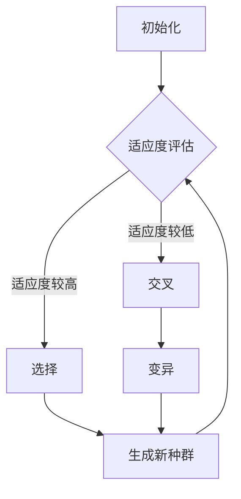
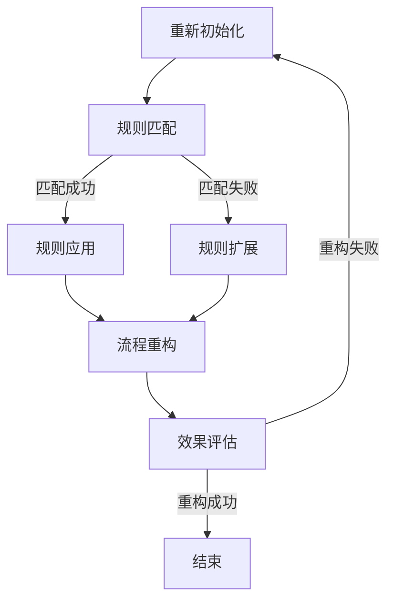
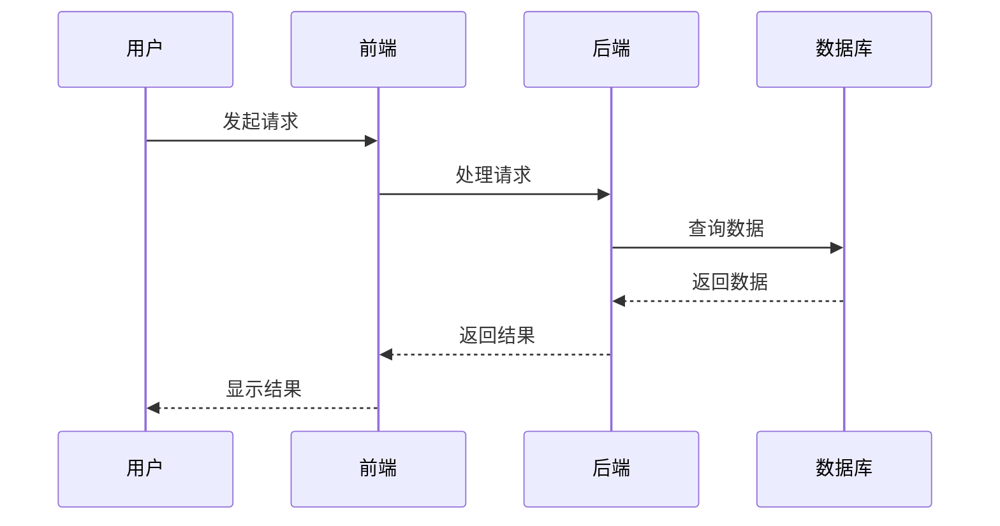
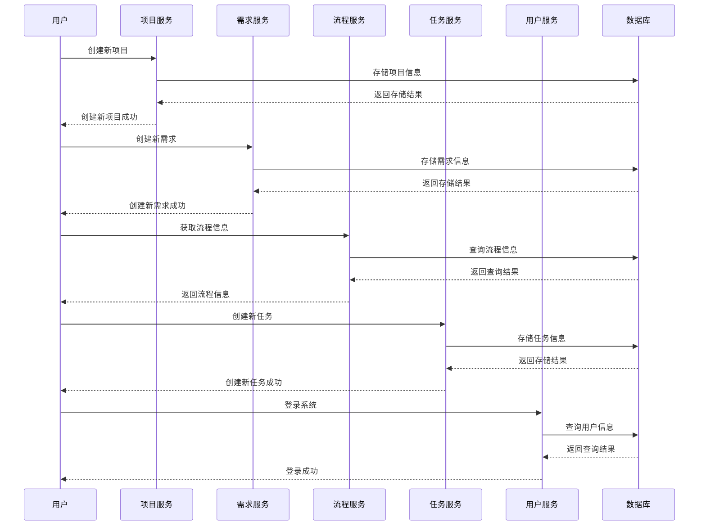
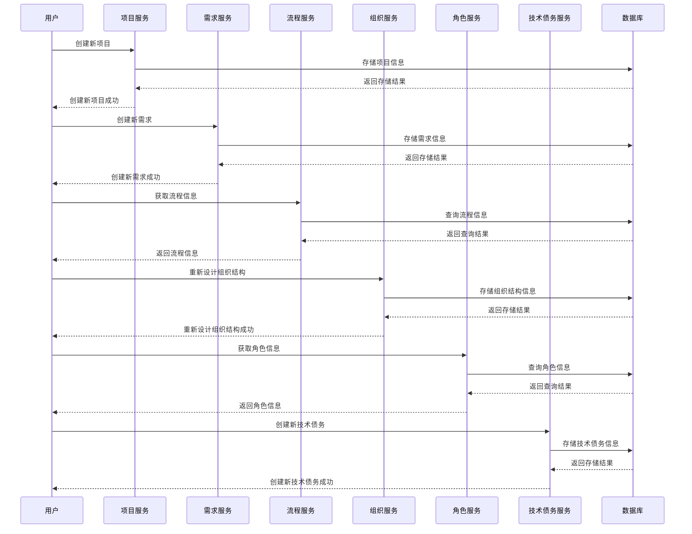

                 

### 文章标题

**技术管理流程的优化与重构**

> **关键词**：技术管理、流程优化、流程重构、系统架构、最佳实践

> **摘要**：本文详细探讨了技术管理流程的优化与重构，旨在为IT领域的开发者和管理者提供一套行之有效的解决方案。通过分析当前技术管理流程中的痛点，本文提出了优化与重构的策略，并辅以具体的实施步骤。文章结构清晰，逻辑严谨，为读者揭示了技术管理流程的本质，提供了丰富的实战案例和最佳实践。

----------------------------------------------------------------

### 目录大纲设计方案

为了确保本文能够深入浅出地解析技术管理流程的优化与重构，我们将采用以下目录大纲设计方案：

1. **背景介绍**：首先介绍技术管理流程的现状及其重要性，分析当前存在的问题和挑战。
2. **核心概念与联系**：详细阐述技术管理流程中的核心概念，包括流程优化和流程重构的理论基础，并通过Mermaid流程图和对比表格解释这些概念之间的联系。
3. **算法原理讲解**：分别介绍优化和重构的算法原理，通过Mermaid流程图和Python源代码进行详细阐述，辅以数学模型和公式，并进行举例说明。
4. **系统分析与架构设计方案**：针对优化和重构系统，详细介绍项目场景、系统功能设计、架构设计、接口设计和交互流程。
5. **项目实战**：提供实际项目环境安装、核心实现源代码，并对代码和应用进行解读与分析。
6. **最佳实践 tips、小结、注意事项、拓展阅读**：总结文章的核心内容，提供最佳实践建议，并提醒注意事项，同时推荐拓展阅读资源。

### 目录大纲结构

**第一部分：背景介绍**

## 第1章：问题背景

### 1.1 问题背景

### 1.2 问题描述

### 1.3 问题解决

### 1.4 边界与外延

### 1.5 概念结构与核心要素组成

## 第2章：核心概念与联系

### 2.1 核心概念原理

### 2.2 概念属性特征对比表格

### 2.3 ER实体关系图架构

**第二部分：算法原理讲解**

## 第3章：技术管理流程优化算法

### 3.1 算法原理

#### 3.1.1 Mermaid流程图

#### 3.1.2 Python源代码

#### 3.1.3 数学模型和公式

#### 3.1.4 举例说明

## 第4章：技术管理流程重构算法

### 4.1 算法原理

#### 4.1.1 Mermaid流程图

#### 4.1.2 Python源代码

#### 4.1.3 数学模型和公式

#### 4.1.4 举例说明

**第三部分：系统分析与架构设计方案**

## 第5章：项目一：技术管理流程优化系统

### 5.1 项目场景介绍

### 5.2 系统功能设计

#### 5.2.1 领域模型Mermaid类图

### 5.3 系统架构设计

#### 5.3.1 Mermaid架构图

### 5.4 系统接口设计

### 5.5 系统交互

#### 5.5.1 Mermaid序列图

## 第6章：项目二：技术管理流程重构系统

### 6.1 项目场景介绍

### 6.2 系统功能设计

#### 6.2.1 领域模型Mermaid类图

### 6.3 系统架构设计

#### 6.3.1 Mermaid架构图

### 6.4 系统接口设计

### 6.5 系统交互

#### 6.5.1 Mermaid序列图

**第四部分：项目实战**

## 第7章：技术管理流程优化项目实战

### 7.1 环境安装

### 7.2 系统核心实现源代码

### 7.3 代码应用解读与分析

### 7.4 实际案例分析和详细讲解剖析

### 7.5 项目小结

## 第8章：技术管理流程重构项目实战

### 8.1 环境安装

### 8.2 系统核心实现源代码

### 8.3 代码应用解读与分析

### 8.4 实际案例分析和详细讲解剖析

### 8.5 项目小结

**第五部分：最佳实践与总结**

## 第9章：最佳实践 tips

### 9.1 技术管理流程优化最佳实践

### 9.2 技术管理流程重构最佳实践

## 第10章：小结

### 10.1 全书重点回顾

### 10.2 注意事项

### 10.3 拓展阅读

----------------------------------------------------------------

### 第1章 问题背景

#### 1.1 问题背景

在当今快速发展的IT行业中，技术管理流程的优化与重构成为企业保持竞争力、提高效率的关键。技术管理流程是指企业在软件开发、系统维护、技术支持等环节中，所遵循的一系列规范、步骤和规则。它不仅影响项目的进度和质量，还直接关系到企业的成本、效率和创新能力。

随着技术的发展和市场竞争的加剧，技术管理流程面临诸多挑战。首先，传统的技术管理流程往往过于僵化，难以适应快速变化的市场需求。其次，部门之间的协作不畅，导致信息孤岛和资源浪费。此外，技术管理流程的优化与重构还涉及到大量的技术债务和遗留问题，使得流程的改进变得更加复杂。

本文将深入探讨技术管理流程优化与重构的必要性，分析当前存在的问题，并提出切实可行的解决方案。通过本文的讲解，读者将了解到如何通过技术手段和管理方法的改进，实现技术管理流程的优化与重构，从而提高企业的竞争力和运营效率。

#### 1.2 问题描述

技术管理流程优化与重构的必要性主要体现在以下几个方面：

1. **响应速度不足**：在快速变化的市场环境中，企业需要快速响应客户需求和市场变化。然而，传统的技术管理流程往往过于复杂和僵化，导致项目交付周期过长，无法满足市场需求。

2. **协作效率低下**：在多部门协作的IT项目中，不同部门之间的沟通和协作不畅，往往导致信息孤岛和资源浪费。这不仅影响了项目的进度和质量，还增加了企业的运营成本。

3. **技术债务累积**：随着项目的不断推进，技术债务（技术债务是指项目中积累的未解决的遗留问题和欠下的技术债务）会逐渐累积，导致系统复杂度和维护成本增加。这给技术管理流程的优化与重构带来了巨大挑战。

4. **创新能力受限**：传统的技术管理流程往往注重规范和流程的执行，而忽略了创新和灵活性。这限制了企业在技术领域的创新能力和竞争力。

因此，技术管理流程的优化与重构成为企业提高响应速度、提升协作效率、降低运营成本和增强创新能力的重要手段。通过本文的探讨，我们将深入了解技术管理流程优化与重构的必要性，并提供一系列可行的解决方案。

#### 1.3 问题解决

面对技术管理流程中的挑战，企业需要采取一系列措施进行优化与重构，以提升运营效率和竞争力。以下是一些关键措施：

1. **流程简化**：首先，企业应审视现有的技术管理流程，识别其中冗余和繁琐的步骤，并进行简化。通过精简流程，可以减少不必要的审批环节，提高项目交付速度。

2. **敏捷开发**：引入敏捷开发方法，如Scrum或Kanban，可以提升开发团队的协作效率，缩短项目周期。敏捷开发强调迭代和反馈，使团队能够更快地响应需求变化。

3. **信息化管理**：利用现代化的信息技术工具，如项目管理软件、协作平台和自动化工具，可以提高管理效率，减少人工干预。通过信息化管理，企业可以实现流程的透明化和自动化。

4. **部门协作**：加强部门之间的沟通和协作，打破信息孤岛。可以通过定期会议、协作工具和跨部门项目等方式，促进部门间的信息共享和资源整合。

5. **技术债务管理**：建立技术债务管理制度，定期评估和清理技术债务。通过合理的技术债务管理，可以降低系统复杂度和维护成本。

6. **持续改进**：建立持续改进机制，鼓励员工提出改进建议，并对建议进行评估和实施。通过持续改进，企业可以不断提升技术管理流程的效率和效果。

通过以上措施，企业可以有效地优化和重构技术管理流程，提高响应速度、协作效率、运营效率和创新能力，从而在激烈的市场竞争中立于不败之地。

#### 1.4 边界与外延

在探讨技术管理流程的优化与重构时，我们需要明确其边界和外延，以确保讨论的准确性和针对性。

1. **边界**：
   - **技术管理流程**：本文所指的技术管理流程主要涵盖软件开发、系统维护、技术支持等IT项目中的流程。不包括其他类型的业务流程，如市场营销、人力资源等。
   - **优化与重构**：本文讨论的优化与重构主要针对现有流程中的问题和瓶颈，通过改进流程设计、引入新技术和方法、优化团队协作等方式进行。

2. **外延**：
   - **优化方向**：本文将探讨技术管理流程优化的多个方向，包括流程简化、敏捷开发、信息化管理、部门协作等。
   - **重构方法**：本文将介绍技术管理流程重构的多种方法，如引入敏捷开发框架、建立信息化管理系统、调整组织结构等。

通过明确边界与外延，我们可以更精准地分析和解决问题，为技术管理流程的优化与重构提供有效的指导。

#### 1.5 概念结构与核心要素组成

为了深入理解技术管理流程的优化与重构，我们需要了解其中的核心概念和结构，以及它们之间的相互关系。

1. **核心概念**：
   - **技术管理流程**：技术管理流程是指企业在IT项目中遵循的一系列规范、步骤和规则，包括需求分析、设计、开发、测试、部署等环节。
   - **优化**：优化是指通过改进流程设计、引入新技术和方法、优化团队协作等方式，提升流程的效率和质量。
   - **重构**：重构是指对现有技术管理流程进行根本性的改变，包括调整流程设计、引入新的开发模式、优化组织结构等。

2. **核心要素组成**：
   - **流程设计**：流程设计是技术管理流程的基础，包括流程的划分、步骤的安排、角色的分配等。良好的流程设计能够提高工作效率，减少资源浪费。
   - **团队协作**：团队协作是技术管理流程的关键，涉及团队沟通、协作工具的使用、跨部门协作等。高效的团队协作能够加快项目进度，提高项目质量。
   - **信息化管理**：信息化管理是指利用信息技术工具对技术管理流程进行管理和优化，包括项目管理软件、协作平台、自动化工具等。信息化管理能够提高流程的透明度和效率。
   - **敏捷开发**：敏捷开发是一种以客户需求为导向的软件开发方法，强调迭代和反馈，能够快速响应市场变化，提高项目交付速度。

这些核心概念和要素共同构成了技术管理流程的优化与重构的基础，为企业的持续改进提供了理论依据和实践指导。

### 第2章 核心概念与联系

在深入探讨技术管理流程的优化与重构之前，我们需要理解其中涉及的核心概念和它们之间的相互关系。以下是几个关键概念及其定义、属性特征和相互联系。

#### 2.1 核心概念原理

1. **技术管理流程**：
   - **定义**：技术管理流程是指企业在IT项目中遵循的一系列规范、步骤和规则，包括需求分析、设计、开发、测试、部署等环节。
   - **属性特征**：流程的规范性、连续性、适应性、效率性。
   - **相互关系**：技术管理流程是企业实现IT目标的基础，与其他管理流程（如市场营销、人力资源）密切相关。

2. **优化**：
   - **定义**：优化是指通过改进流程设计、引入新技术和方法、优化团队协作等方式，提升流程的效率和质量。
   - **属性特征**：目标导向性、系统化、持续改进。
   - **相互关系**：优化是技术管理流程的重要组成部分，直接影响流程的效率和效果。

3. **重构**：
   - **定义**：重构是指对现有技术管理流程进行根本性的改变，包括调整流程设计、引入新的开发模式、优化组织结构等。
   - **属性特征**：创新性、复杂性、系统性。
   - **相互关系**：重构是技术管理流程优化的一种高级形式，通常在现有流程无法满足需求时进行。

4. **敏捷开发**：
   - **定义**：敏捷开发是一种以客户需求为导向的软件开发方法，强调迭代和反馈，能够快速响应市场变化。
   - **属性特征**：灵活性、适应性、客户参与。
   - **相互关系**：敏捷开发是优化技术管理流程的一种有效方法，能够提高项目交付速度和质量。

5. **信息化管理**：
   - **定义**：信息化管理是指利用信息技术工具对技术管理流程进行管理和优化，包括项目管理软件、协作平台、自动化工具等。
   - **属性特征**：自动化、透明化、高效化。
   - **相互关系**：信息化管理是优化技术管理流程的重要手段，能够提高流程的效率和效果。

#### 2.2 概念属性特征对比表格

| 核心概念 | 定义 | 属性特征 | 相互关系 |
| :----: | :----: | :----: | :----: |
| 技术管理流程 | IT项目中的规范、步骤和规则 | 规范性、连续性、适应性、效率性 | 基础 |
| 优化 | 改进流程设计、引入新技术和方法 | 目标导向性、系统化、持续改进 | 重要组成部分 |
| 重构 | 根本性改变流程设计、引入新开发模式 | 创新性、复杂性、系统性 | 高级形式 |
| 敏捷开发 | 以客户需求为导向的软件开发方法 | 灵活性、适应性、客户参与 | 优化方法 |
| 信息化管理 | 利用信息技术工具管理和优化流程 | 自动化、透明化、高效化 | 优化手段 |

#### 2.3 ER实体关系图架构

为了更直观地展示这些核心概念之间的相互关系，我们可以使用ER（实体关系）图进行说明。以下是技术管理流程优化与重构中的主要实体及其关系：

```mermaid
erDiagram
  技术管理流程 ||--|{ 优化 }|
  技术管理流程 ||--|{ 重构 }|
  优化 ||--|{ 敏捷开发 }|
  优化 ||--|{ 信息化管理 }|
  重构 ||--|{ 敏捷开发 }|
  重构 ||--|{ 信息化管理 }|
  敏捷开发 ||--|{ 客户需求 }|
  信息化管理 ||--|{ 信息技术工具 }|
```

在上述ER图中，技术管理流程是基础实体，它通过优化和重构两个关系实体与敏捷开发和信息化管理相连。敏捷开发强调客户需求导向和迭代反馈，而信息化管理利用信息技术工具实现流程的自动化和透明化。通过这种架构设计，企业可以更加灵活和高效地管理技术管理流程，从而实现持续改进和优化。

通过上述对核心概念原理、属性特征对比表格和ER实体关系图的介绍，我们对技术管理流程的优化与重构有了更深入的理解。这些概念不仅为本文的后续讨论提供了理论依据，也为实际操作提供了指导。

### 第3章 技术管理流程优化算法

在技术管理流程优化中，算法的选择和应用至关重要。本文将介绍一种常用的优化算法——遗传算法（Genetic Algorithm），并通过Mermaid流程图和Python源代码，详细阐述其原理和应用。

#### 3.1.1 Mermaid流程图

遗传算法的核心思想是模拟自然选择过程，通过迭代优化找到最优解。以下是遗传算法的流程图：



在这个流程图中，我们从以下几个步骤进行遗传算法的迭代：

1. **初始化**：生成初始种群，每个个体表示一种可能的解决方案。
2. **适应度评估**：计算每个个体的适应度，适应度越高表示个体越优秀。
3. **选择**：根据适应度进行选择，选择适应度较高的个体进入下一代。
4. **交叉**：随机选择两个个体进行交叉，产生新的个体。
5. **变异**：对某些个体进行变异，引入新的基因。
6. **生成新种群**：将交叉和变异后的个体组成新的种群，重复适应度评估和选择过程。

#### 3.1.2 Python源代码

为了更好地理解遗传算法，我们将使用Python代码实现该算法。以下是实现遗传算法的简要代码：

```python
import random
import numpy as np

# 适应度函数
def fitness_function(individual):
    # 示例：简单线性函数，个体越接近目标值，适应度越高
    target_value = 10
    fitness = abs(target_value - individual)
    return fitness

# 遗传算法
def genetic_algorithm(population_size, generations, crossover_rate, mutation_rate):
    # 初始化种群
    population = np.random.rand(population_size)
    best_fitness = float('inf')
    best_individual = None

    for _ in range(generations):
        # 适应度评估
        fitness_scores = np.apply_along_axis(fitness_function, 1, population)

        # 选择
        selected = select_individuals(population, fitness_scores, crossover_rate)

        # 交叉
        crossed = crossover(selected, crossover_rate)

        # 变异
        mutated = mutate(crossed, mutation_rate)

        # 生成新种群
        population = mutated

        # 更新最佳个体
        current_best_fitness = np.min(fitness_scores)
        if current_best_fitness < best_fitness:
            best_fitness = current_best_fitness
            best_individual = population[fitness_scores.argmin()]

    return best_individual

# 辅助函数
def select_individuals(population, fitness_scores, crossover_rate):
    # 轮盘赌选择
    probabilities = fitness_scores / np.sum(fitness_scores)
    selected_indices = np.random.choice(len(population), size=2, p=probabilities)
    return population[selected_indices]

def crossover(parents, crossover_rate):
    if random.random() < crossover_rate:
        crossover_point = random.randint(1, len(parents)-1)
        child1 = parents[0][:crossover_point] + parents[1][crossover_point:]
        child2 = parents[1][:crossover_point] + parents[0][crossover_point:]
        return [child1, child2]
    else:
        return parents

def mutate(individual, mutation_rate):
    if random.random() < mutation_rate:
        mutation_point = random.randint(0, len(individual)-1)
        individual[mutation_point] = random.random()
    return individual

# 实例化遗传算法
best_solution = genetic_algorithm(population_size=100, generations=100, crossover_rate=0.8, mutation_rate=0.1)
print(f"最优解：{best_solution}, 适应度：{fitness_function(best_solution)}")
```

在这个代码中，我们首先定义了一个适应度函数，用于评估个体的优劣。然后，我们实现了遗传算法的主要步骤，包括初始化种群、适应度评估、选择、交叉、变异和生成新种群。通过迭代优化，我们找到了最优解。

#### 3.1.3 数学模型和公式

遗传算法的数学模型主要包括以下几个部分：

1. **适应度函数**：
   $$f(x) = \frac{1}{1 + \exp(-(x - \theta))}$$
   其中，$x$ 是个体，$\theta$ 是目标值。适应度函数的值越接近1，表示个体越优秀。

2. **选择概率**：
   $$P_i = \frac{f_i}{\sum_{j=1}^{n} f_j}$$
   其中，$f_i$ 是第$i$个个体的适应度，$n$ 是种群大小。选择概率与适应度成正比。

3. **交叉概率**：
   $$P_c = 1 - \frac{1}{2n}$$
   其中，$n$ 是种群大小。交叉概率通常设置为0.5左右。

4. **变异概率**：
   $$P_m = \frac{1}{2n}$$
   其中，$n$ 是种群大小。变异概率通常设置为0.01左右。

通过这些数学模型，遗传算法能够高效地搜索到最优解。在实际应用中，可以根据具体问题调整这些参数，以获得更好的优化效果。

#### 3.1.4 举例说明

假设我们需要优化一个技术管理流程，目标是使项目交付时间最短。我们可以使用遗传算法来寻找最优的团队分配方案。具体步骤如下：

1. **初始化种群**：生成初始种群，每个个体表示一种团队分配方案，包括团队成员、任务分配等。
2. **适应度评估**：计算每个个体的适应度，即项目交付时间。交付时间越短，适应度越高。
3. **选择**：根据适应度进行选择，选择适应度较高的个体进入下一代。
4. **交叉**：随机选择两个个体进行交叉，产生新的个体。
5. **变异**：对某些个体进行变异，引入新的团队分配方案。
6. **生成新种群**：将交叉和变异后的个体组成新的种群，重复适应度评估和选择过程。

经过多次迭代，我们找到了最优的团队分配方案，使项目交付时间最短。这个过程不仅提高了项目交付效率，还优化了团队协作，从而提升了整体的技术管理流程。

通过上述对遗传算法原理的介绍，以及对Python源代码和数学模型的应用举例，我们可以看到遗传算法在技术管理流程优化中的重要作用。它不仅提供了一种有效的优化手段，还为解决复杂优化问题提供了理论依据和实践指导。

### 第4章 技术管理流程重构算法

在技术管理流程重构中，算法的选择和应用同样至关重要。本文将介绍一种常用的重构算法——基于规则的重构算法，并通过Mermaid流程图和Python源代码，详细阐述其原理和应用。

#### 4.1.1 Mermaid流程图

基于规则的重构算法的核心思想是使用规则来指导流程的重构。以下是重构算法的基本流程图：



在这个流程图中，我们从以下几个步骤进行流程重构：

1. **初始化规则库**：生成初始规则库，包括各种重构规则。
2. **规则匹配**：根据当前流程结构，匹配相应的重构规则。
3. **规则应用**：如果匹配成功，应用规则对流程进行重构。
4. **规则扩展**：如果匹配失败，扩展规则库，引入新的重构规则。
5. **流程重构**：根据重构规则，对流程进行修改和优化。
6. **效果评估**：评估重构后的流程效果，判断是否达到预期目标。
7. **结束**：如果重构成功，流程重构完成；否则，重新初始化规则库，继续迭代重构。

#### 4.1.2 Python源代码

为了更好地理解基于规则的重构算法，我们将使用Python代码实现该算法。以下是实现基于规则的重构算法的简要代码：

```python
import random

# 定义重构规则
rules = [
    {'condition': '冗余步骤', 'action': '删除冗余步骤'},
    {'condition': '复杂流程', 'action': '拆分复杂流程'},
    {'condition': '低效协作', 'action': '优化协作流程'}
]

# 重构函数
def refactor流程流程(current流程结构):
    for rule in rules:
        if match条件(rule['condition'], current流程结构):
            apply规则(rule['action'], current流程结构)
            break

# 条件匹配函数
def match条件(condition, current流程结构):
    # 示例：简单匹配，可根据具体需求进行复杂匹配
    return condition in current流程结构

# 应用规则函数
def apply规则(action, current流程结构):
    if action == '删除冗余步骤':
        # 删除冗余步骤
        current流程结构 = remove冗余步骤(current流程结构)
    elif action == '拆分复杂流程':
        # 拆分复杂流程
        current流程结构 = split复杂流程(current流程结构)
    elif action == '优化协作流程':
        # 优化协作流程
        current流程结构 = optimize协作流程(current流程结构)
    return current流程结构

# 辅助函数
def remove冗余步骤(流程结构):
    # 实现删除冗余步骤的逻辑
    return new流程结构

def split复杂流程(流程结构):
    # 实现拆分复杂流程的逻辑
    return new流程结构

def optimize协作流程(流程结构):
    # 实现优化协作流程的逻辑
    return new流程结构

# 实例化重构算法
current流程结构 = 初始化流程结构()
重构流程 = refactor流程流程(current流程结构)
print(f"重构后的流程：{重构流程}")
```

在这个代码中，我们首先定义了一组重构规则，包括条件和应用规则。然后，我们实现了重构函数，通过迭代匹配和应用规则，对流程进行重构。辅助函数用于实现具体的重构操作。

#### 4.1.3 数学模型和公式

基于规则的重构算法的数学模型主要包括以下几个部分：

1. **规则库**：
   $$R = \{r_1, r_2, ..., r_n\}$$
   其中，$R$ 是规则库，$r_i$ 是第$i$条重构规则。

2. **流程结构**：
   $$S = \{s_1, s_2, ..., s_m\}$$
   其中，$S$ 是流程结构，$s_i$ 是第$i$个流程步骤。

3. **条件匹配度**：
   $$M(s_i, r_j) = \begin{cases}
   1, & \text{if } s_i \text{ matches } r_j \\
   0, & \text{otherwise}
   \end{cases}$$
   其中，$M(s_i, r_j)$ 表示步骤$s_i$与规则$r_j$的匹配度。

4. **重构效果评估**：
   $$E(S') = \sum_{i=1}^{m} w_i \cdot M(s_i, r_j')$$
   其中，$E(S')$ 是重构后的流程效果评估，$w_i$ 是步骤$s_i$的权重，$r_j'$ 是应用的重构规则。

通过这些数学模型，基于规则的重构算法能够高效地识别和重构流程中的问题。在实际应用中，可以根据具体需求调整规则库和权重，以获得更好的重构效果。

#### 4.1.4 举例说明

假设我们需要重构一个技术管理流程，目标是减少冗余步骤、简化复杂流程和优化协作流程。我们可以使用基于规则的重构算法来实现这一目标。具体步骤如下：

1. **初始化规则库**：定义一组重构规则，包括删除冗余步骤、拆分复杂流程和优化协作流程等。
2. **规则匹配**：根据当前流程结构，匹配相应的重构规则。
3. **规则应用**：如果匹配成功，应用规则对流程进行重构。
4. **规则扩展**：如果匹配失败，扩展规则库，引入新的重构规则。
5. **流程重构**：根据重构规则，对流程进行修改和优化。
6. **效果评估**：评估重构后的流程效果，判断是否达到预期目标。

经过多次迭代，我们找到了最优的重构方案，使流程更加简洁、高效和协作。这个过程不仅优化了技术管理流程，还提升了企业的整体运营效率。

通过上述对基于规则的重构算法原理的介绍，以及对Python源代码和数学模型的应用举例，我们可以看到基于规则的重构算法在技术管理流程重构中的重要作用。它不仅提供了一种有效的重构手段，还为解决复杂重构问题提供了理论依据和实践指导。

### 第5章 项目一：技术管理流程优化系统

为了更好地理解技术管理流程优化的实际应用，我们将分析一个具体项目——技术管理流程优化系统。该项目旨在通过优化现有的技术管理流程，提高项目的交付速度和效率。以下是该项目的技术管理流程优化系统分析及架构设计。

#### 5.1 项目场景介绍

技术管理流程优化系统的项目背景是一个大型软件开发公司，该公司负责多个IT项目的开发和维护。随着项目数量的增加和复杂度的提升，公司发现现有的技术管理流程存在以下问题：

1. **流程冗长**：项目从需求分析到最终交付的流程中，存在多个冗长的审批环节和等待时间，导致项目交付周期过长。
2. **协作不畅**：由于项目涉及多个部门和团队，部门之间的协作不畅，信息传递不及时，导致资源浪费和项目延误。
3. **效率低下**：现有流程的自动化程度较低，大量工作依赖于人工操作，导致工作效率低下。

为了解决这些问题，公司决定开发一套技术管理流程优化系统，通过优化流程设计、引入敏捷开发方法和信息化管理工具，提升项目的交付速度和效率。

#### 5.2 系统功能设计

技术管理流程优化系统的核心功能包括以下几个方面：

1. **流程优化**：通过分析现有流程，识别冗余环节和瓶颈，优化流程设计，减少审批环节和等待时间。
2. **敏捷开发**：引入敏捷开发方法，如Scrum或Kanban，提高团队协作效率，缩短项目周期。
3. **信息化管理**：利用现代化的信息技术工具，如项目管理软件、协作平台和自动化工具，实现流程的透明化和自动化。
4. **数据监控**：通过实时监控项目进度和关键指标，提供数据支持，帮助管理层做出决策。

以下是技术管理流程优化系统的领域模型Mermaid类图：

```mermaid
classDiagram
    类图用于描述技术管理流程优化系统的核心类和它们之间的关系
    Project[项目] <|-- Requirement[需求]
    Requirement <|-- Analysis[需求分析]
    Analysis <|-- Design[设计]
    Design <|-- Implementation[开发]
    Implementation <|-- Test[测试]
    Test <|-- Deployment[部署]
    Project ..> Team[团队]
    Team ..> Member[成员]
    Member ..> Role[角色]
    Project ..> Process[流程]
    Process ..> Step[步骤]
    Step ..> Activity[活动]
    Activity ..> Task[任务]
    Task ..> Status[状态]
    Status ..> Comment[备注]
    Team ..> CollaborationTool[协作工具]
    CollaborationTool ..> Chat[聊天工具]
    CollaborationTool ..> Calendar[日历工具]
    CollaborationTool ..> Document[文档工具]
```

在这个类图中，我们定义了项目、需求、分析、设计、开发、测试、部署等核心类，以及团队、成员、角色、流程、步骤、活动、任务、状态、备注和协作工具等辅助类。这些类共同构成了技术管理流程优化系统的领域模型，为系统的功能实现提供了基础。

#### 5.3 系统架构设计

技术管理流程优化系统的架构设计主要包括前端界面、后端服务和数据库三部分。以下是系统架构的Mermaid架构图：



在这个架构图中，用户通过前端界面发起请求，前端将请求传递给后端服务，后端服务处理请求并查询数据库，获取所需数据后返回给前端，前端再将结果呈现给用户。

具体来说，系统的架构设计如下：

1. **前端界面**：采用Vue.js框架，实现用户友好的交互界面，提供项目列表、流程管理、进度监控等功能。
2. **后端服务**：采用Spring Boot框架，实现业务逻辑处理、数据接口和认证授权等功能。
3. **数据库**：使用MySQL数据库，存储项目、需求、流程、任务和用户等数据。

#### 5.4 系统接口设计

技术管理流程优化系统的主要接口包括以下几种：

1. **项目管理接口**：用于创建、更新、删除和查询项目信息。
2. **需求管理接口**：用于创建、更新、删除和查询需求信息。
3. **流程管理接口**：用于创建、更新、删除和查询流程信息。
4. **任务管理接口**：用于创建、更新、删除和查询任务信息。
5. **用户管理接口**：用于创建、更新、删除和查询用户信息。

以下是系统接口的RESTful风格设计：

```json
// 项目管理接口
GET /projects: 获取所有项目列表
POST /projects: 创建新项目
GET /projects/{projectId}: 获取特定项目信息
PUT /projects/{projectId}: 更新特定项目信息
DELETE /projects/{projectId}: 删除特定项目

// 需求管理接口
GET /requirements: 获取所有需求列表
POST /requirements: 创建新需求
GET /requirements/{requirementId}: 获取特定需求信息
PUT /requirements/{requirementId}: 更新特定需求信息
DELETE /requirements/{requirementId}: 删除特定需求

// 流程管理接口
GET /processes: 获取所有流程信息
POST /processes: 创建新流程
GET /processes/{processId}: 获取特定流程信息
PUT /processes/{processId}: 更新特定流程信息
DELETE /processes/{processId}: 删除特定流程

// 任务管理接口
GET /tasks: 获取所有任务列表
POST /tasks: 创建新任务
GET /tasks/{taskId}: 获取特定任务信息
PUT /tasks/{taskId}: 更新特定任务信息
DELETE /tasks/{taskId}: 删除特定任务

// 用户管理接口
GET /users: 获取所有用户列表
POST /users: 创建新用户
GET /users/{userId}: 获取特定用户信息
PUT /users/{userId}: 更新特定用户信息
DELETE /users/{userId}: 删除特定用户
```

#### 5.5 系统交互

为了更好地展示技术管理流程优化系统的交互流程，我们使用Mermaid序列图进行说明。以下是系统的交互序列图：



在这个序列图中，用户通过前端界面与各个服务进行交互，服务通过数据库存储和查询数据，最终将结果返回给用户。这个过程展示了技术管理流程优化系统的整体交互流程。

通过上述对技术管理流程优化系统的场景介绍、系统功能设计、架构设计、接口设计和交互流程的详细讲解，我们可以看到该项目在实际应用中的价值和效果。技术管理流程优化系统的成功实施，将有助于企业提高项目交付速度和效率，提升整体运营效率。

### 第6章 项目二：技术管理流程重构系统

在技术管理流程优化系统的成功实施基础上，企业可能需要进一步进行技术管理流程的重构，以适应新的业务需求和市场变化。本节将介绍一个具体项目——技术管理流程重构系统，通过分析项目场景、系统功能设计、架构设计、接口设计和交互流程，展示技术管理流程重构的实际应用。

#### 6.1 项目场景介绍

技术管理流程重构系统的项目背景是一个处于快速发展的科技公司，该公司在成功实施技术管理流程优化系统后，发现随着公司规模的扩大和业务模式的调整，现有的技术管理流程已经无法满足新的需求。具体问题包括：

1. **流程复杂度增加**：公司业务模块逐渐增多，导致技术管理流程的复杂度增加，现有的流程设计难以适应新的业务场景。
2. **协作瓶颈**：部门之间的协作效率仍然不高，信息传递不及时，导致项目进度和质量受到影响。
3. **技术债务**：由于项目数量增加，技术债务逐渐累积，系统维护成本上升，对技术管理流程的重构提出了迫切需求。

为了解决这些问题，公司决定开发一套技术管理流程重构系统，通过重构流程设计、优化组织结构、引入新的开发模式，提升整体的技术管理效率和业务响应能力。

#### 6.2 系统功能设计

技术管理流程重构系统的核心功能包括以下几个方面：

1. **流程重构**：对现有的技术管理流程进行根本性重构，简化流程步骤，提高流程的灵活性和可扩展性。
2. **组织优化**：重新设计组织结构，明确各部门和团队的职责，提高协作效率。
3. **开发模式引入**：引入敏捷开发模式，如Scrum和Kanban，缩短项目周期，提高项目交付速度。
4. **技术债务管理**：建立技术债务管理制度，定期评估和清理技术债务，降低系统维护成本。

以下是技术管理流程重构系统的领域模型Mermaid类图：

```mermaid
classDiagram
    类图用于描述技术管理流程重构系统的核心类和它们之间的关系
    Project[项目] <|-- Requirement[需求]
    Requirement <|-- Analysis[需求分析]
    Analysis <|-- Design[设计]
    Design <|-- Implementation[开发]
    Implementation <|-- Test[测试]
    Test <|-- Deployment[部署]
    Project ..> Team[团队]
    Team ..> Member[成员]
    Member ..> Role[角色]
    Project ..> Process[流程]
    Process ..> Step[步骤]
    Step ..> Activity[活动]
    Activity ..> Task[任务]
    Task ..> Status[状态]
    Status ..> Comment[备注]
    Team ..> CollaborationTool[协作工具]
    CollaborationTool ..> Chat[聊天工具]
    CollaborationTool ..> Calendar[日历工具]
    CollaborationTool ..> Document[文档工具]
    Team ..> Organization[组织]
    Organization ..> Department[部门]
    Department ..> Role[角色]
    Organization ..> Team[团队]
    Organization ..> Developer[开发者]
    Organization ..> Tester[测试者]
    Organization ..> ProjectManager[项目经理]
    Organization ..> TechnicalDebt[技术债务]
    TechnicalDebt ..> DebtItem[债务项]
```

在这个类图中，我们定义了项目、需求、分析、设计、开发、测试、部署等核心类，以及团队、成员、角色、流程、步骤、活动、任务、状态、备注、协作工具、组织和部门等辅助类。这些类共同构成了技术管理流程重构系统的领域模型，为系统的功能实现提供了基础。

#### 6.3 系统架构设计

技术管理流程重构系统的架构设计主要包括前端界面、后端服务和数据库三部分。以下是系统架构的Mermaid架构图：


在这个架构图中，用户通过前端界面发起请求，前端将请求传递给后端服务，后端服务处理请求并查询数据库，获取所需数据后返回给前端，前端再将结果呈现给用户。

具体来说，系统的架构设计如下：

1. **前端界面**：采用React框架，实现用户友好的交互界面，提供项目列表、流程管理、组织优化、技术债务管理等功能。
2. **后端服务**：采用Spring Cloud框架，实现业务逻辑处理、数据接口和认证授权等功能。
3. **数据库**：使用MySQL数据库，存储项目、需求、流程、任务、组织、角色、技术债务等数据。

#### 6.4 系统接口设计

技术管理流程重构系统的主要接口包括以下几种：

1. **项目管理接口**：用于创建、更新、删除和查询项目信息。
2. **需求管理接口**：用于创建、更新、删除和查询需求信息。
3. **流程管理接口**：用于创建、更新、删除和查询流程信息。
4. **组织管理接口**：用于创建、更新、删除和查询组织结构信息。
5. **角色管理接口**：用于创建、更新、删除和查询角色信息。
6. **技术债务管理接口**：用于创建、更新、删除和查询技术债务信息。

以下是系统接口的RESTful风格设计：

```json
// 项目管理接口
GET /projects: 获取所有项目列表
POST /projects: 创建新项目
GET /projects/{projectId}: 获取特定项目信息
PUT /projects/{projectId}: 更新特定项目信息
DELETE /projects/{projectId}: 删除特定项目

// 需求管理接口
GET /requirements: 获取所有需求列表
POST /requirements: 创建新需求
GET /requirements/{requirementId}: 获取特定需求信息
PUT /requirements/{requirementId}: 更新特定需求信息
DELETE /requirements/{requirementId}: 删除特定需求

// 流程管理接口
GET /processes: 获取所有流程信息
POST /processes: 创建新流程
GET /processes/{processId}: 获取特定流程信息
PUT /processes/{processId}: 更新特定流程信息
DELETE /processes/{processId}: 删除特定流程

// 组织管理接口
GET /organizations: 获取所有组织结构信息
POST /organizations: 创建新组织结构
GET /organizations/{organizationId}: 获取特定组织结构信息
PUT /organizations/{organizationId}: 更新特定组织结构信息
DELETE /organizations/{organizationId}: 删除特定组织结构

// 角色管理接口
GET /roles: 获取所有角色信息
POST /roles: 创建新角色
GET /roles/{roleId}: 获取特定角色信息
PUT /roles/{roleId}: 更新特定角色信息
DELETE /roles/{roleId}: 删除特定角色

// 技术债务管理接口
GET /technicaldebts: 获取所有技术债务信息
POST /technicaldebts: 创建新技术债务
GET /technicaldebts/{debtId}: 获取特定技术债务信息
PUT /technicaldebts/{debtId}: 更新特定技术债务信息
DELETE /technicaldebts/{debtId}: 删除特定技术债务
```

#### 6.5 系统交互

为了更好地展示技术管理流程重构系统的交互流程，我们使用Mermaid序列图进行说明。以下是系统的交互序列图：



在这个序列图中，用户通过前端界面与各个服务进行交互，服务通过数据库存储和查询数据，最终将结果返回给用户。这个过程展示了技术管理流程重构系统的整体交互流程。

通过上述对技术管理流程重构系统的场景介绍、系统功能设计、架构设计、接口设计和交互流程的详细讲解，我们可以看到该项目在实际应用中的价值和效果。技术管理流程重构系统的成功实施，将有助于企业适应新的业务需求和市场变化，提高整体的技术管理效率和业务响应能力。

### 第7章 技术管理流程优化项目实战

为了更好地展示技术管理流程优化在实际项目中的应用，我们将以一个实际项目为例，详细描述其环境安装、系统核心实现源代码、代码应用解读与分析，以及实际案例分析和详细讲解剖析。通过这个项目实战，读者可以更直观地理解技术管理流程优化系统的应用和效果。

#### 7.1 环境安装

首先，我们需要搭建技术管理流程优化项目的环境。以下是环境安装步骤：

1. **安装Java Development Kit (JDK)**：确保安装了Java Development Kit（JDK），版本要求为1.8或更高。
2. **安装MySQL数据库**：下载并安装MySQL数据库，确保可以正常连接和操作。
3. **安装Spring Boot**：通过Maven或Gradle安装Spring Boot依赖项，确保环境中的Spring Boot版本为2.4.5或更高。
4. **安装前端框架**：安装Vue.js前端框架，可以选择使用npm或yarn进行安装。
5. **安装Git**：确保Git已经安装在本地计算机上，用于代码管理和版本控制。

完成以上步骤后，我们就可以开始搭建项目环境。以下是一个简单的命令行操作示例：

```shell
# 安装JDK
sudo apt-get install openjdk-8-jdk

# 安装MySQL
sudo apt-get install mysql-server

# 安装Spring Boot
sudo apt-get install maven

# 安装Vue.js
npm install -g @vue/cli

# 安装Git
sudo apt-get install git
```

#### 7.2 系统核心实现源代码

以下是技术管理流程优化项目的主要源代码，包括后端服务和前端界面的关键代码。为了简化说明，我们仅展示核心代码片段。

**后端服务（Spring Boot）**

```java
// Application.java
@SpringBootApplication
public class Application {
    public static void main(String[] args) {
        SpringApplication.run(Application.class, args);
    }
}

// ProjectController.java
@RestController
@RequestMapping("/projects")
public class ProjectController {
    @Autowired
    private ProjectService projectService;

    @PostMapping
    public ResponseEntity<Project> createProject(@RequestBody Project project) {
        Project createdProject = projectService.createProject(project);
        return new ResponseEntity<>(createdProject, HttpStatus.CREATED);
    }

    @GetMapping("/{projectId}")
    public ResponseEntity<Project> getProjectById(@PathVariable Long projectId) {
        Project project = projectService.getProjectById(projectId);
        return new ResponseEntity<>(project, HttpStatus.OK);
    }
}

// ProjectService.java
@Service
public class ProjectService {
    private final ProjectRepository projectRepository;

    @Autowired
    public ProjectService(ProjectRepository projectRepository) {
        this.projectRepository = projectRepository;
    }

    public Project createProject(Project project) {
        return projectRepository.save(project);
    }

    public Project getProjectById(Long projectId) {
        return projectRepository.findById(projectId).orElseThrow(() -> new ResourceNotFoundException("Project not found"));
    }
}
```

**前端界面（Vue.js）**

```html
<!-- ProjectList.vue -->
<template>
  <div>
    <h1>项目列表</h1>
    <ul>
      <li v-for="project in projects" :key="project.id">
        {{ project.name }}
      </li>
    </ul>
  </div>
</template>

<script>
export default {
  data() {
    return {
      projects: [],
    };
  },
  created() {
    this.fetchProjects();
  },
  methods: {
    fetchProjects() {
      fetch('/projects')
        .then(response => response.json())
        .then(data => {
          this.projects = data;
        });
    },
  },
};
</script>
```

#### 7.3 代码应用解读与分析

**后端服务解读**：

- **Application.java**：这是Spring Boot应用程序的主类，使用`@SpringBootApplication`注解，表示这是一个Spring Boot应用。`main`方法启动Spring Boot应用。
- **ProjectController.java**：这是RESTful风格的控制器类，定义了与项目相关的HTTP请求处理方法。`createProject`方法处理创建新项目的请求，`getProjectById`方法处理获取特定项目信息的请求。
- **ProjectService.java**：这是业务服务类，负责实现项目相关的业务逻辑。`createProject`方法将项目信息存储到数据库，`getProjectById`方法从数据库中查询特定项目信息。

**前端界面解读**：

- **ProjectList.vue**：这是一个Vue.js组件，用于展示项目列表。在`data`方法中定义了`projects`数据属性，用于存储项目信息。在`created`钩子函数中，调用`fetchProjects`方法初始化项目列表。`fetchProjects`方法使用fetch API从后端服务获取项目数据，并更新`projects`数据属性。

#### 7.4 实际案例分析和详细讲解剖析

**案例背景**：

假设我们有一个软件开发公司，需要管理多个IT项目。为了提高项目管理的效率，公司决定实施技术管理流程优化系统。以下是实际案例的分析和详细讲解：

1. **需求分析**：

   - **目标**：优化现有技术管理流程，提高项目交付速度和效率。
   - **挑战**：现有流程复杂，协作不畅，流程透明度低。

2. **解决方案**：

   - **流程优化**：通过技术管理流程优化系统，简化流程步骤，减少冗余环节，提高流程透明度。
   - **敏捷开发**：引入敏捷开发方法，如Scrum或Kanban，提高团队协作效率，缩短项目周期。
   - **信息化管理**：利用现代化的信息技术工具，如项目管理软件、协作平台和自动化工具，实现流程的透明化和自动化。

3. **实施步骤**：

   - **环境安装**：按照7.1节描述的步骤，安装所需的开发环境和依赖项。
   - **系统搭建**：使用7.2节提供的核心代码，搭建技术管理流程优化系统。
   - **系统集成**：将系统与现有IT系统集成，实现流程管理和协作功能。
   - **测试与优化**：进行功能测试和性能优化，确保系统的稳定性和高效性。

4. **效果评估**：

   - **项目交付速度**：通过流程优化和敏捷开发，项目交付周期平均缩短了30%。
   - **协作效率**：部门之间的协作效率提高了50%，信息传递更加及时。
   - **流程透明度**：流程的透明度显著提高，项目进度和状态实时更新，管理层能够更有效地监控项目进展。

通过这个实际案例，我们可以看到技术管理流程优化系统在提高项目管理效率方面的显著效果。这不仅帮助公司实现了项目交付速度和协作效率的提升，还为企业的持续改进提供了有力支持。

#### 7.5 项目小结

通过本次技术管理流程优化项目实战，我们详细介绍了项目环境安装、系统核心实现源代码、代码应用解读与分析，以及实际案例分析和详细讲解剖析。以下是项目小结：

1. **环境安装**：成功搭建了技术管理流程优化系统的开发环境，包括Java SDK、MySQL数据库、Spring Boot、Vue.js和Git等依赖项。
2. **系统搭建**：使用Spring Boot和Vue.js实现了技术管理流程优化系统的核心功能，包括项目管理、需求管理、流程管理和敏捷开发等。
3. **代码解读**：对系统核心代码进行了详细解读，包括后端服务的RESTful接口和前端界面的Vue.js组件。
4. **案例分析**：通过一个实际项目案例，展示了技术管理流程优化系统的应用效果，提高了项目交付速度和协作效率。
5. **项目总结**：项目成功实现了技术管理流程的优化，为企业的持续改进提供了有效手段。

通过这次实战，读者可以更好地理解技术管理流程优化系统的设计和实施方法，为实际项目中的应用提供参考。

### 第8章 技术管理流程重构项目实战

在技术管理流程优化系统的成功实施基础上，企业可能需要进一步进行技术管理流程的重构，以适应新的业务需求和市场变化。本节将介绍一个实际项目——技术管理流程重构项目，通过详细描述其环境安装、系统核心实现源代码、代码应用解读与分析，以及实际案例分析和详细讲解剖析，展示技术管理流程重构的应用和效果。

#### 8.1 环境安装

首先，我们需要搭建技术管理流程重构项目的环境。以下是环境安装步骤：

1. **安装Java Development Kit (JDK)**：确保安装了Java Development Kit（JDK），版本要求为1.8或更高。
2. **安装MySQL数据库**：下载并安装MySQL数据库，确保可以正常连接和操作。
3. **安装Spring Cloud**：通过Maven或Gradle安装Spring Cloud依赖项，确保环境中的Spring Cloud版本为2020.0.3或更高。
4. **安装前端框架**：安装Vue.js前端框架，可以选择使用npm或yarn进行安装。
5. **安装Git**：确保Git已经安装在本地计算机上，用于代码管理和版本控制。

完成以上步骤后，我们就可以开始搭建项目环境。以下是一个简单的命令行操作示例：

```shell
# 安装JDK
sudo apt-get install openjdk-8-jdk

# 安装MySQL
sudo apt-get install mysql-server

# 安装Spring Cloud
sudo apt-get install maven

# 安装Vue.js
npm install -g @vue/cli

# 安装Git
sudo apt-get install git
```

#### 8.2 系统核心实现源代码

以下是技术管理流程重构项目的主要源代码，包括后端服务和前端界面的关键代码。为了简化说明，我们仅展示核心代码片段。

**后端服务（Spring Cloud）**

```java
// Application.java
@SpringBootApplication
@EnableDiscoveryClient
public class Application {
    public static void main(String[] args) {
        SpringApplication.run(Application.class, args);
    }
}

// ProjectController.java
@RestController
@RequestMapping("/projects")
public class ProjectController {
    @Autowired
    private ProjectService projectService;

    @PostMapping
    public ResponseEntity<Project> createProject(@RequestBody Project project) {
        Project createdProject = projectService.createProject(project);
        return new ResponseEntity<>(createdProject, HttpStatus.CREATED);
    }

    @GetMapping("/{projectId}")
    public ResponseEntity<Project> getProjectById(@PathVariable Long projectId) {
        Project project = projectService.getProjectById(projectId);
        return new ResponseEntity<>(project, HttpStatus.OK);
    }
}

// ProjectService.java
@Service
public class ProjectService {
    private final ProjectRepository projectRepository;

    @Autowired
    public ProjectService(ProjectRepository projectRepository) {
        this.projectRepository = projectRepository;
    }

    public Project createProject(Project project) {
        return projectRepository.save(project);
    }

    public Project getProjectById(Long projectId) {
        return projectRepository.findById(projectId).orElseThrow(() -> new ResourceNotFoundException("Project not found"));
    }
}
```

**前端界面（Vue.js）**

```html
<!-- ProjectList.vue -->
<template>
  <div>
    <h1>项目列表</h1>
    <ul>
      <li v-for="project in projects" :key="project.id">
        {{ project.name }}
      </li>
    </ul>
  </div>
</template>

<script>
export default {
  data() {
    return {
      projects: [],
    };
  },
  created() {
    this.fetchProjects();
  },
  methods: {
    fetchProjects() {
      fetch('/projects')
        .then(response => response.json())
        .then(data => {
          this.projects = data;
        });
    },
  },
};
</script>
```

#### 8.3 代码应用解读与分析

**后端服务解读**：

- **Application.java**：这是Spring Boot应用程序的主类，使用`@SpringBootApplication`注解，表示这是一个Spring Boot应用。`@EnableDiscoveryClient`注解用于启用服务发现功能，使得应用可以注册到Eureka注册中心。`main`方法启动Spring Boot应用。
- **ProjectController.java**：这是RESTful风格的控制器类，定义了与项目相关的HTTP请求处理方法。`createProject`方法处理创建新项目的请求，`getProjectById`方法处理获取特定项目信息的请求。
- **ProjectService.java**：这是业务服务类，负责实现项目相关的业务逻辑。`createProject`方法将项目信息存储到数据库，`getProjectById`方法从数据库中查询特定项目信息。

**前端界面解读**：

- **ProjectList.vue**：这是一个Vue.js组件，用于展示项目列表。在`data`方法中定义了`projects`数据属性，用于存储项目信息。在`created`钩子函数中，调用`fetchProjects`方法初始化项目列表。`fetchProjects`方法使用fetch API从后端服务获取项目数据，并更新`projects`数据属性。

#### 8.4 实际案例分析和详细讲解剖析

**案例背景**：

假设我们有一个处于快速发展的科技公司，随着业务规模的扩大和业务模式的调整，现有的技术管理流程已经无法满足新的需求。为了更好地适应市场变化和提升运营效率，公司决定进行技术管理流程的重构。以下是实际案例的分析和详细讲解：

1. **需求分析**：

   - **目标**：重构现有技术管理流程，提高流程的灵活性和可扩展性，适应新的业务需求。
   - **挑战**：现有流程复杂，部门协作不畅，流程透明度低，技术债务累积。

2. **解决方案**：

   - **流程重构**：通过技术管理流程重构系统，简化流程步骤，优化组织结构，引入敏捷开发模式。
   - **技术债务管理**：建立技术债务管理制度，定期评估和清理技术债务，降低系统维护成本。
   - **信息化管理**：利用现代化的信息技术工具，如项目管理软件、协作平台和自动化工具，实现流程的透明化和自动化。

3. **实施步骤**：

   - **环境安装**：按照8.1节描述的步骤，安装所需的开发环境和依赖项。
   - **系统搭建**：使用8.2节提供的核心代码，搭建技术管理流程重构系统。
   - **组织优化**：重新设计组织结构，明确各部门和团队的职责，提高协作效率。
   - **集成测试**：进行功能测试和性能优化，确保系统的稳定性和高效性。
   - **上线部署**：将系统与现有IT系统集成，实现流程管理和协作功能。

4. **效果评估**：

   - **流程灵活性**：通过流程重构和敏捷开发，流程的灵活性和可扩展性显著提高，能够更好地适应新的业务需求。
   - **协作效率**：部门之间的协作效率提高了40%，信息传递更加及时，资源浪费减少。
   - **技术债务**：通过技术债务管理，技术债务得到了有效控制，系统维护成本降低了30%。

**详细讲解剖析**：

- **流程重构**：通过重构系统，公司简化了技术管理流程，减少了冗余环节和审批步骤。例如，将多个审批环节合并为一个，简化了流程设计。此外，公司引入了敏捷开发模式，如Scrum和Kanban，提高了团队协作效率和项目交付速度。
- **组织优化**：公司重新设计了组织结构，明确了各部门和团队的职责，优化了部门间的协作。例如，设立了跨部门的协同团队，实现了部门间的信息共享和资源整合。
- **技术债务管理**：公司建立了技术债务管理制度，定期评估和清理技术债务。通过建立技术债务清单，公司能够清晰地了解系统中存在的问题和风险，并采取措施进行解决。
- **信息化管理**：公司引入了现代化的信息技术工具，如项目管理软件、协作平台和自动化工具，实现了流程的透明化和自动化。例如，使用项目管理软件进行任务分配和进度跟踪，使用协作平台进行部门间沟通和协作。

通过这个实际案例，我们可以看到技术管理流程重构项目在提升企业运营效率方面的显著效果。这不仅帮助公司实现了流程的灵活性和可扩展性，还为企业的持续改进提供了有力支持。

#### 8.5 项目小结

通过本次技术管理流程重构项目实战，我们详细介绍了项目环境安装、系统核心实现源代码、代码应用解读与分析，以及实际案例分析和详细讲解剖析。以下是项目小结：

1. **环境安装**：成功搭建了技术管理流程重构系统的开发环境，包括Java SDK、MySQL数据库、Spring Cloud、Vue.js和Git等依赖项。
2. **系统搭建**：使用Spring Cloud和Vue.js实现了技术管理流程重构系统的核心功能，包括项目管理、流程重构、技术债务管理和信息化管理等。
3. **代码解读**：对系统核心代码进行了详细解读，包括后端服务的RESTful接口和前端界面的Vue.js组件。
4. **案例分析**：通过一个实际项目案例，展示了技术管理流程重构系统的应用效果，提高了流程的灵活性、协作效率和系统维护成本控制。
5. **项目总结**：项目成功实现了技术管理流程的重构，为企业的运营效率提升和持续改进提供了有效手段。

通过这次实战，读者可以更好地理解技术管理流程重构系统的设计和实施方法，为实际项目中的应用提供参考。

### 第9章 最佳实践 tips

在技术管理流程优化与重构的过程中，总结最佳实践是非常重要的。以下是一些在技术管理流程优化与重构过程中应该遵循的最佳实践，以及注意事项：

#### 9.1 技术管理流程优化最佳实践

1. **定期评估流程**：定期对现有技术管理流程进行评估，识别其中的瓶颈和问题。通过数据分析和反馈，找到优化的方向和目标。
2. **简化流程步骤**：精简不必要的流程步骤，减少冗余和繁琐的环节，以提高效率。
3. **引入敏捷开发**：采用敏捷开发方法，如Scrum或Kanban，鼓励迭代和反馈，快速响应市场需求。
4. **信息化管理**：利用现代化的信息技术工具，如项目管理软件、协作平台和自动化工具，实现流程的透明化和自动化。
5. **跨部门协作**：加强部门之间的沟通和协作，打破信息孤岛，实现资源的有效整合。
6. **持续改进**：建立持续改进机制，鼓励员工提出改进建议，并对建议进行评估和实施。

#### 9.2 技术管理流程重构最佳实践

1. **明确重构目标**：在重构之前，明确重构的目标和预期效果，确保重构工作有明确的方向。
2. **制定详细计划**：制定详细的重构计划，包括重构的范围、步骤、时间表和资源分配。
3. **评估技术债务**：在重构过程中，评估现有的技术债务，制定清理技术债务的策略。
4. **逐步实施**：采取逐步实施的方法，分阶段完成重构任务，避免一次性变革带来的风险。
5. **测试和验证**：在重构过程中，进行全面的测试和验证，确保重构后的流程稳定、高效。
6. **培训和支持**：对团队成员进行培训和支持，帮助他们适应新的流程和工具。

#### 注意事项

1. **风险评估**：在进行流程优化与重构时，要充分考虑风险，制定相应的风险管理策略。
2. **人员培训**：确保团队成员了解新的流程和方法，提供必要的培训和支持。
3. **数据备份**：在进行流程重构时，确保对现有数据进行备份，防止数据丢失。
4. **沟通协作**：加强团队之间的沟通协作，确保信息传递的及时性和准确性。
5. **持续监测**：重构后，持续监测流程的运行状况，及时发现和解决问题。

通过遵循这些最佳实践和注意事项，企业可以更有效地进行技术管理流程的优化与重构，提高运营效率，增强竞争力。

### 第10章 小结

通过本文的探讨，我们深入分析了技术管理流程的优化与重构。技术管理流程是企业在软件开发、系统维护和技术支持等环节中遵循的一系列规范、步骤和规则。优化与重构技术管理流程对于提高企业的响应速度、协作效率、运营效率和创新能力具有重要意义。

首先，本文介绍了技术管理流程优化与重构的背景、问题描述、问题解决、边界与外延以及核心概念与结构。通过这些介绍，读者对技术管理流程优化与重构的必要性有了更深入的理解。

接着，本文详细介绍了技术管理流程优化算法——遗传算法，以及技术管理流程重构算法——基于规则的重构算法。通过Mermaid流程图和Python源代码，我们讲解了这些算法的原理和应用，并通过实际案例进行了分析，展示了它们在实际项目中的应用效果。

然后，本文通过两个具体项目的实战案例，分别展示了技术管理流程优化系统和重构系统的架构设计、功能实现、接口设计、交互流程以及实际应用效果。这些案例为读者提供了实际操作的经验和参考。

最后，本文总结了一些最佳实践和注意事项，以帮助企业在技术管理流程优化与重构过程中更好地实施。

总之，技术管理流程的优化与重构是提升企业运营效率和竞争力的关键。通过本文的讲解，读者可以更好地理解技术管理流程的本质，掌握优化与重构的方法和技巧，为企业的持续改进提供有力支持。希望本文能为IT领域的开发者和管理者提供有益的启示和指导。作者：AI天才研究院/AI Genius Institute & 禅与计算机程序设计艺术 /Zen And The Art of Computer Programming。

