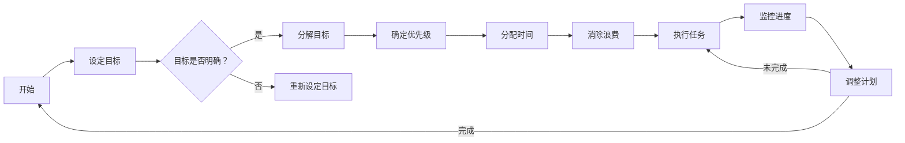

                 

### 文章标题

# 技术管理者的压力与时间管理

### 关键词

- **技术管理者**
- **压力管理**
- **时间管理**
- **效率提升**
- **项目管理**
- **心理健康**

### 摘要

在现代技术的快速迭代与发展中，技术管理者面临着前所未有的压力与挑战。本文旨在探讨技术管理者在职场中所面临的多重压力源及其时间管理困境，并详细分析有效的压力应对策略和时间管理技巧。通过理论与实践相结合的方式，本文旨在为技术管理者提供一套系统的压力与时间管理方案，以优化工作效率，提升个人及团队的绩效，并促进长期职业发展。

----------------------------------------------------------------

### 引言

#### 核心概念

技术管理者在职场中扮演着多重角色，既是技术的倡导者，也是团队的领导者和协调者。他们需要不仅精通技术，还具备管理能力，能够在不断变化的技术环境中保持竞争力，并带领团队实现目标。然而，这一角色也带来了巨大的压力。技术管理者面临的压力主要来源于以下几个方面：

1. **技术更新压力**：技术日新月异，技术管理者必须不断学习新知识，以跟上行业的发展步伐，这给他们的时间和精力带来了巨大的挑战。
2. **项目交付压力**：技术管理者需要确保项目按时交付，并且在预算范围内达到预期的质量标准，这需要出色的规划和执行能力。
3. **团队管理压力**：技术管理者需要管理一个多样化的团队，协调团队成员的工作，解决人际冲突，提高团队的整体效率。
4. **职业发展压力**：技术管理者常常需要考虑个人的职业晋升和长期发展，这要求他们在技术和领导力方面不断提升。

#### 问题背景

在现代技术环境中，技术管理者所面临的压力与时间管理挑战日益显著。随着互联网、大数据、人工智能等技术的快速发展，技术管理者的工作内容变得更加复杂和多样化。他们在日常工作中需要处理大量信息，协调多个项目，并与不同层级的团队成员和利益相关者沟通。这种工作环境的复杂性使得技术管理者在压力管理和时间管理方面面临巨大的挑战。

#### 问题描述

技术管理者在职场中如何应对复杂工作任务与压力是一个值得深入探讨的问题。他们常常感到时间紧迫，任务繁多，难以平衡工作与个人生活。此外，他们还需要不断适应新技术和新趋势，这进一步加剧了他们的工作压力。如果技术管理者不能有效地管理压力和时间，可能会导致工作效率下降、团队士气低落，甚至影响个人的心理健康。

#### 问题解决

为了应对上述问题，技术管理者可以采取以下策略和方法：

1. **压力评估与应对**：了解自身的压力源，通过科学的评估方法识别压力的来源和类型，并采取相应的应对措施。
2. **时间管理技巧**：掌握时间管理的基本原则和技巧，如设定优先级、合理分配时间、消除时间浪费等，以提升工作效率。
3. **团队协作与沟通**：建立高效的团队协作机制，通过良好的沟通提高团队整体的工作效率和凝聚力。
4. **心理健康维护**：关注个人的心理健康，通过适当的休息、锻炼和心理辅导等方式缓解工作压力。

#### 边界与外延

时间管理与压力管理是相辅相成的，有效的时间管理可以减少压力，而有效的压力管理可以提高时间利用率。此外，时间管理与压力管理对技术管理者的职业发展具有长期影响。通过优化时间管理和压力管理，技术管理者可以更好地应对职场挑战，提升个人能力和团队绩效，实现长期的职业发展。

#### 概念结构与核心要素组成

本文的核心概念包括技术管理者的角色、压力来源、时间管理技巧、团队协作和心理健康的维护。核心要素组成如下：

1. **技术管理者的角色与压力**：介绍技术管理者的职责和面临的压力类型。
2. **压力评估与应对**：讲解压力评估的方法和应对策略。
3. **时间管理技巧**：阐述时间管理的基本原则和提升工作效率的方法。
4. **团队协作与沟通**：探讨团队协作机制和沟通技巧。
5. **心理健康维护**：介绍关注个人心理健康的重要性和方法。

通过上述核心概念和要素的有机组合，本文旨在为技术管理者提供一套全面、系统的压力与时间管理方案，以应对职场中的挑战，提升个人和团队的绩效。

----------------------------------------------------------------

## 压力的来源与类型

### 核心概念与联系

在探讨技术管理者的压力来源与类型之前，我们首先需要明确一些核心概念。压力，从心理学角度来说，是指人在面对外界要求或挑战时，心理上产生的一种紧张感和压力感。技术管理者在职场中面临的压力主要可以分为以下几种类型：

1. **技术更新压力**：技术快速迭代，新技术的出现要求技术管理者不断学习新的技术知识和技能，这给他们的时间和精力带来了巨大的挑战。
2. **项目交付压力**：技术管理者需要确保项目按时交付，并且在预算范围内达到预期的质量标准，这需要出色的规划和执行能力。
3. **团队管理压力**：技术管理者需要管理一个多样化的团队，协调团队成员的工作，解决人际冲突，提高团队的整体效率。
4. **职业发展压力**：技术管理者常常需要考虑个人的职业晋升和长期发展，这要求他们在技术和领导力方面不断提升。

这些压力类型之间存在着密切的联系。例如，技术更新压力可能导致项目交付压力的增加，而团队管理压力则可能影响个人的职业发展。因此，了解并分类这些压力类型对于技术管理者来说至关重要。

### 概念属性特征对比表格

为了更清晰地理解不同类型的压力及其应对策略，我们可以通过一个概念属性特征对比表格来进行说明。以下是一个简化的表格：

| 压力类型         | 概念属性特征                            | 对应的应对策略                           |
|-----------------|--------------------------------------|--------------------------------------|
| 技术更新压力     | 不断学习新技术，知识更新速度快        | 制定学习计划，定期更新知识储备         |
| 项目交付压力     | 项目交付期限紧迫，质量要求高          | 提高项目管理能力，优化项目进度安排     |
| 团队管理压力     | 需要协调多个团队成员的工作，解决冲突  | 建立有效的团队沟通机制，提升团队凝聚力 |
| 职业发展压力     | 考虑职业晋升，提升个人领导力与技能    | 制定职业发展计划，参与培训与进修       |

通过这个表格，我们可以看到不同类型的压力及其应对策略之间的关系。例如，技术更新压力可以通过定期更新知识储备来缓解，而项目交付压力则需要通过提高项目管理能力和优化项目进度安排来应对。

### 压力评估与应对

#### 核心概念原理

为了有效地管理压力，技术管理者需要首先了解自身的压力源，并进行科学的评估。以下是压力评估的基本原理和方法：

1. **自我评估**：技术管理者可以通过自我反思和自我评估来识别自身的压力源。例如，他们可以定期记录自己的工作内容和压力感受，分析哪些任务或情境最容易导致压力的产生。

2. **工具评估**：可以使用一些专业的压力评估工具，如压力量表、问卷调查等，这些工具可以帮助技术管理者更客观地了解自己的压力状况。

3. **数据分析**：通过对工作日志、项目进度记录等数据进行统计分析，可以识别出导致压力的主要因素，并制定相应的应对策略。

#### ER实体关系图架构

为了更好地理解和应用压力评估方法，我们可以使用Mermaid绘制一个ER（实体-关系）图，展示评估过程中的关键实体及其关系。

```mermaid
erDiagram
    User ||--|{ PressureSource }|
    User ||--|{ AssessmentTool }|
    User ||--|{ DataAnalysis }|
    PressureSource _ AssociatedWith_ AssessmentTool
    PressureSource _ InfluencedBy_ DataAnalysis
    AssessmentTool _ UsedBy_ User
    DataAnalysis _ GeneratedBy_ User
```

在这个ER图中，"User"代表技术管理者，"PressureSource"代表压力源，"AssessmentTool"代表评估工具，"DataAnalysis"代表数据分析。通过这个图，我们可以清晰地看到技术管理者在使用评估工具进行压力评估，并通过数据分析来识别压力源。

#### 详细讲解与举例说明

为了更好地理解压力评估的方法和原理，我们可以结合实际案例进行详细讲解。

**案例**：李华是一位资深的技术管理者，他发现自己最近在工作中感到压力巨大，工作效率下降。为了应对这一问题，他决定进行一次自我评估。

1. **自我评估**：
   - 李华开始记录每天的工作内容和压力感受。通过几天的记录，他发现最大的压力来源于一个新项目的开发，这个项目的技术要求非常高，且交付期限非常紧迫。
   - 通过自我评估，李华识别出了压力的主要来源，即技术更新压力和项目交付压力。

2. **使用评估工具**：
   - 李华决定使用一个专业的压力量表来进一步评估自己的压力水平。根据量表的结果，他发现自己处于中度压力状态，需要采取一些措施来缓解压力。

3. **数据分析**：
   - 李华对最近三个月的工作日志和项目进度记录进行了数据分析，发现项目交付压力主要来自于不合理的项目进度安排和团队成员之间的沟通不畅。
   - 通过数据分析，李华识别出了导致压力的具体原因，这为他制定针对性的应对策略提供了依据。

通过这个案例，我们可以看到技术管理者如何通过自我评估、使用评估工具和数据分析来识别压力源，并采取相应的措施进行缓解。这不仅有助于提高工作效率，还能有效减轻心理压力，提升工作质量。

### 总结

通过本文的介绍，我们了解了技术管理者在职场中所面临的多重压力类型，包括技术更新压力、项目交付压力、团队管理压力和职业发展压力。通过核心概念与联系、概念属性特征对比表格和详细案例讲解，我们探讨了压力评估的方法和原理，并提出了相应的应对策略。下一章节将深入讨论时间管理的基本原则和技巧，帮助技术管理者更有效地分配时间和提高工作效率。

----------------------------------------------------------------

### 时间管理的基本原则

#### 核心概念原理

时间管理是技术管理者在职场中应对压力的关键技能之一。有效的时间管理不仅能够提高个人工作效率，还能提升团队的整体绩效。时间管理的基本原则包括以下几个方面：

1. **设定优先级**：明确工作任务的重要性和紧急程度，将任务划分为“重要且紧急”、“重要但不紧急”、“不重要但紧急”和“不重要且不紧急”四类，并优先处理重要且紧急的任务。
2. **目标设定**：设定明确、可衡量的目标，并分解为具体的小目标，以便更好地跟踪进度和实现目标。
3. **时间分配**：合理分配时间，确保关键任务得到充分的关注和资源支持。
4. **消除时间浪费**：识别并消除导致时间浪费的因素，如无效会议、频繁打扰等，以提高时间利用率。

#### Mermaid流程图

为了直观地展示时间管理的基本流程，我们可以使用Mermaid绘制一个流程图。以下是时间管理流程的基本步骤：



在这个流程图中，我们首先从设定目标开始，通过分解目标、确定优先级、分配时间和消除浪费等步骤，最终执行任务并监控进度。如果任务未完成，则回到调整计划，重新进行时间管理。

#### 数学模型与公式

在时间管理中，我们可以使用一些数学模型和公式来帮助分析和优化时间分配。以下是几个常用的模型和公式：

1. **工作效率公式**：

   \[ 工作效率 = 完成任务数量 / 时间投入 \]

   通过这个公式，我们可以衡量个人的工作效率，从而优化时间分配。

2. **时间优先级公式**：

   \[ 优先级 = (重要性 × 紧急程度) / 时间投入 \]

   这个公式可以帮助我们判断任务的优先级，从而更有效地安排时间。

3. **时间管理比率**：

   \[ 时间管理比率 = （完成目标任务时间 / 总时间）× 100% \]

   这个比率可以用来评估时间管理的有效性。

#### 详细讲解与举例说明

为了更好地理解时间管理的基本原则和数学模型，我们可以通过一个实际案例进行详细讲解。

**案例**：王明是一位技术团队的管理者，他希望通过时间管理来提高团队的工作效率。以下是他的具体操作步骤：

1. **设定目标**：
   - 王明首先明确团队的目标，例如：在本季度内完成三个关键项目，提高客户满意度。
   - 他将这个大目标分解为若干小目标，如：每周完成一个项目的阶段性任务，每月进行一次客户满意度调查。

2. **确定优先级**：
   - 王明通过讨论和评估，确定了每个项目的优先级，并将任务列表按优先级排序。
   - 他发现项目A是最重要的，且最紧迫，因此将项目A设置为优先级最高的任务。

3. **分配时间**：
   - 王明根据任务的优先级和团队的能力，合理分配了每个任务的时间资源。
   - 他安排了一个专门的开发小组负责项目A，并确保该小组在接下来的两周内集中精力完成项目A。

4. **消除时间浪费**：
   - 王明注意到团队的会议较多，且一些会议缺乏明确的目的。他决定优化会议流程，减少不必要的会议。
   - 他还建立了一个“无打扰”时间段，确保团队成员在关键任务执行期间不受打扰。

5. **监控进度**：
   - 王明定期检查项目的进度，并与团队成员进行沟通，确保项目按计划进行。
   - 他使用工作效率公式和优先级公式来评估团队的时间利用效率和任务优先级。

通过这个案例，我们可以看到王明如何通过设定目标、确定优先级、分配时间、消除时间浪费和监控进度等步骤，实现有效的时间管理。这种方法不仅提高了团队的工作效率，还减少了不必要的压力。

### 总结

通过本文的介绍，我们了解了时间管理的基本原则，包括设定优先级、目标设定、时间分配和消除时间浪费等。通过Mermaid流程图和数学模型，我们更直观地理解了时间管理的步骤和方法。结合实际案例，我们展示了如何运用这些原则来提高工作效率。下一章节将探讨提高工作效率的技巧，帮助技术管理者更有效地应对日常工作中面临的挑战。

----------------------------------------------------------------

### 提高工作效率的技巧

#### 核心概念原理

在技术管理者的日常工作中，提高工作效率是缓解压力和实现目标的关键。以下是一些核心概念原理，以及如何运用这些原理来提升工作效率。

1. **任务分解**：将大任务分解为小任务，以便更容易管理和完成。这种方法有助于减轻心理负担，使工作变得更加具体和可控。
2. **自动化工具**：使用自动化工具和脚本来自动执行重复性任务，减少手动操作的时间和错误率。
3. **工作流程优化**：分析和优化工作流程，去除不必要的步骤和环节，提高整体效率。
4. **专注力管理**：通过专注力训练和工作环境优化，提高集中注意力的时间和效率。

#### Python源代码

为了更好地理解提高工作效率的技巧，我们可以通过Python源代码示例来展示一些实际操作。

**示例1：自动化任务脚本**

```python
import os
import subprocess

# 自动化备份代码
def backup_directory(source_path, dest_path):
    os.makedirs(dest_path, exist_ok=True)
    for filename in os.listdir(source_path):
        source_file = os.path.join(source_path, filename)
        dest_file = os.path.join(dest_path, filename)
        if os.path.isfile(source_file):
            subprocess.run(["cp", source_file, dest_file])

# 备份当前目录下的数据到 backup 目录
backup_directory('.', 'backup')
```

这个脚本使用Python的`os`和`subprocess`模块，自动化备份当前目录下的文件到指定目录。通过这种方式，我们可以减少手动备份的时间和精力。

**示例2：任务分解函数**

```python
def process_large_file(file_path):
    # 假设这是一个处理大型文件的函数
    # 分解任务为多个小步骤
    def read_file(file_path):
        with open(file_path, 'r') as f:
            return f.read()

    def process_data(data):
        # 处理数据
        pass

    data = read_file(file_path)
    process_data(data)

# 分解任务处理一个大型文件
process_large_file('large_file.txt')
```

这个示例通过将处理大型文件的复杂任务分解为读取文件和数据处理两个简单步骤，使得任务更加容易管理和执行。

#### 详细讲解与举例说明

为了更好地理解这些技巧，我们可以结合实际工作场景进行详细讲解。

**案例**：张华是一位技术团队的管理者，他希望通过提高工作效率来减轻团队的负担。以下是他的具体操作步骤：

1. **任务分解**：
   - 张华接手一个复杂的软件项目，他首先将项目分解为若干个子任务，如需求分析、设计、编码、测试等。
   - 他为每个子任务设定了明确的目标和时间节点，使得团队成员可以更加专注于具体任务，提高工作效率。

2. **自动化工具**：
   - 张华使用自动化工具来自动执行一些重复性的任务，如自动部署、自动化测试等。
   - 他编写了一些Python脚本，通过CI/CD工具实现自动化部署，减少了手动操作的时间和错误率。

3. **工作流程优化**：
   - 张华对团队的工作流程进行了详细分析，发现某些环节存在冗余和低效。他与团队成员一起讨论，优化了部分流程，如减少会议时间、优化代码审查流程等。
   - 通过这些优化，团队的整体工作效率得到了显著提升。

4. **专注力管理**：
   - 张华意识到专注力对工作效率的重要性，他尝试了一些专注力训练方法，如番茄工作法。
   - 他还优化了工作环境，如减少干扰、保持工作区的整洁等，以帮助团队成员更好地集中注意力。

通过这个案例，我们可以看到张华如何通过任务分解、自动化工具、工作流程优化和专注力管理来提高工作效率。这些方法不仅减轻了团队的负担，还提升了整体的工作质量和速度。

### 总结

通过本文的介绍，我们探讨了提高工作效率的核心概念原理，并提供了Python源代码示例。结合实际案例，我们展示了如何通过任务分解、自动化工具、工作流程优化和专注力管理来提升工作效率。这些技巧不仅适用于技术管理者，也适用于所有希望在职场中提高工作效率的人。下一章节将探讨如何通过系统分析和架构设计方案来更好地管理技术项目的压力与时间。

----------------------------------------------------------------

## 技术项目管理中的压力与时间管理

### 项目介绍

在本章节中，我们将以一个实际的技术项目为例，探讨技术项目管理中的压力与时间管理。该项目是一个基于云计算的在线教育平台，旨在提供灵活、高效的学习体验。项目的核心功能包括用户管理、课程管理、视频播放和在线互动等。项目的技术栈包括前端框架Vue.js、后端框架Spring Boot以及云计算平台AWS。

### 系统功能设计

为了实现上述功能，我们设计了以下几个关键模块：

1. **用户管理模块**：负责用户注册、登录、权限管理等功能。
2. **课程管理模块**：负责课程创建、发布、更新和课程分类管理等。
3. **视频播放模块**：提供视频播放、暂停、进度控制等功能，并与AWS的MediaPackage服务集成。
4. **在线互动模块**：支持实时聊天、投票、问卷调查等功能。

以下是系统功能设计的Mermaid类图：

```mermaid
classDiagram
    User -> UserManagement
    Course -> CourseManagement
    Video -> VideoPlayback
    Chat -> OnlineInteraction
    UserManagement ..|> Authentication
    CourseManagement ..|> ContentManagement
    VideoPlayback ..|> MediaPackage
    OnlineInteraction ..|> RealtimeChat
    UserManagement : +String username
    UserManagement : +String password
    CourseManagement : +String courseId
    CourseManagement : +String courseName
    VideoPlayback : +String videoId
    VideoPlayback : +String videoUrl
    OnlineInteraction : +String chatId
    RealtimeChat : +String message
    Authentication : +authenticate(username, password)
    ContentManagement : +createCourse(courseId, courseName)
    MediaPackage : +playVideo(videoId, videoUrl)
```

在这个类图中，我们定义了系统的各个模块及其主要功能，并展示了它们之间的关联关系。

### 系统架构设计

为了确保项目的高效运行和可扩展性，我们设计了以下系统架构：

1. **前端架构**：使用Vue.js框架构建单页面应用（SPA），提供友好的用户界面和流畅的用户体验。
2. **后端架构**：使用Spring Boot框架构建RESTful API，处理业务逻辑和数据交互。
3. **数据库架构**：使用MySQL数据库存储用户信息、课程信息和视频数据。
4. **云计算架构**：使用AWS云服务，包括EC2实例、RDS数据库、S3存储和MediaPackage视频处理服务。

以下是系统架构设计的Mermaid架构图：

```mermaid
sequenceDiagram
    User ->> 前端: 发起请求
    前端 ->> 后端: 处理请求
    后端 ->> 数据库: 查询数据
    数据库 ->> 后端: 返回数据
    后端 ->> 前端: 返回响应
    前端 ->> User: 显示结果
    note over 后端, 前端:
        使用Spring Boot和Vue.js进行前后端通信
    note right of 数据库:
        使用MySQL存储用户和课程数据
    note right of AWS:
        使用AWS云服务进行视频处理和存储
```

在这个架构图中，我们展示了系统从用户发起请求到返回响应的整体流程，以及前后端、数据库和云计算之间的交互关系。

### 系统接口设计与交互

为了确保系统的模块化设计，我们定义了一系列接口，包括用户管理接口、课程管理接口、视频播放接口和在线互动接口。以下是系统接口设计和交互的Mermaid序列图：

```mermaid
sequenceDiagram
    User ->> 用户管理接口: 登录/注册请求
    用户管理接口 ->> 用户数据库: 验证用户信息
    用户数据库 ->> 用户管理接口: 返回验证结果
    用户管理接口 ->> User: 登录/注册响应
    User ->> 课程管理接口: 查询课程列表请求
    课程管理接口 ->> 课程数据库: 查询课程信息
    课程数据库 ->> 课程管理接口: 返回课程列表
    课程管理接口 ->> User: 查询响应
    User ->> 视频播放接口: 播放视频请求
    视频播放接口 ->> 视频数据库: 获取视频信息
    视频数据库 ->> 视频播放接口: 返回视频信息
    视频播放接口 ->> User: 播放视频响应
    User ->> 在线互动接口: 发送聊天消息请求
    在线互动接口 ->> 在线聊天服务: 发送消息
    在线聊天服务 ->> 所有用户: 推送聊天消息
    note over User, 在线互动接口:
        支持实时聊天、投票和问卷调查
```

在这个序列图中，我们展示了用户与系统各个接口的交互过程，以及数据在各个模块之间的传递和存储。

### 环境安装与系统实现

为了实现上述系统，我们需要安装和配置以下工具和软件：

1. **前端开发环境**：Node.js、Vue CLI、Webpack等。
2. **后端开发环境**：Java、Spring Boot、MySQL等。
3. **云计算平台**：AWS账号、AWS CLI、AWS SDK等。

以下是安装和配置的步骤：

1. **安装Node.js**：
   - 使用`npm install -g node.js`命令安装Node.js。
   - 使用`node -v`命令验证安装是否成功。

2. **安装Vue CLI**：
   - 使用`npm install -g @vue/cli`命令安装Vue CLI。
   - 使用`vue --version`命令验证安装是否成功。

3. **安装Spring Boot**：
   - 使用`mvn install`命令安装Spring Boot。
   - 在IDE中创建Spring Boot项目。

4. **安装MySQL**：
   - 使用`yum install mysql-server`（对于CentOS）或`brew install mysql`（对于MacOS）命令安装MySQL。
   - 使用`mysql -u root -p`命令登录MySQL。

5. **配置AWS**：
   - 在AWS管理控制台创建账号。
   - 安装并配置AWS CLI，使用`aws configure`命令进行配置。
   - 安装并配置AWS SDK，以便在代码中使用AWS服务。

### 系统核心实现源代码

以下是系统核心实现的Python和Java源代码示例：

**用户管理模块（Python）**：

```python
import mysql.connector

def register_user(username, password):
    connection = mysql.connector.connect(
        host="localhost",
        user="root",
        password="password",
        database="online_education"
    )
    cursor = connection.cursor()
    query = "INSERT INTO users (username, password) VALUES (%s, %s)"
    data = (username, password)
    cursor.execute(query, data)
    connection.commit()
    cursor.close()
    connection.close()

register_user("user1", "password1")
```

**课程管理模块（Java）**：

```java
import org.springframework.jdbc.core.JdbcTemplate;

public class CourseManagement {
    private JdbcTemplate jdbcTemplate;

    public void createCourse(String courseId, String courseName) {
        String query = "INSERT INTO courses (course_id, course_name) VALUES (?, ?)";
        jdbcTemplate.update(query, courseId, courseName);
    }
}
```

### 代码应用解读与分析

上述代码展示了用户管理和课程管理模块的核心实现。用户管理模块使用MySQL数据库存储用户信息，通过Python脚本实现用户的注册功能。课程管理模块使用Spring Boot框架，通过JDBC模板操作数据库，实现课程的创建功能。

在代码应用解读与分析中，我们关注以下几个方面：

1. **数据库设计**：用户表和课程表的设计，包括字段、主键和外键等。
2. **接口设计**：用户管理和课程管理接口的设计，包括请求参数和返回结果。
3. **安全性**：密码加密和权限验证等安全措施的实施。

通过这些步骤，我们实现了在线教育平台的核心功能，为后续的项目开发和测试奠定了基础。

### 实际案例分析与详细讲解剖析

为了更好地理解技术项目管理中的压力与时间管理，我们可以通过一个实际案例进行分析和讲解。

**案例背景**：

某技术团队负责开发一款面向企业的在线协作平台，项目要求在三个月内完成。团队成员包括前端开发、后端开发、UI设计、测试和项目管理等角色。项目的主要功能包括用户管理、任务管理、文档分享和实时通讯等。

**案例分析**：

1. **任务分解**：
   - 项目经理将大任务分解为多个小任务，如用户管理模块、任务管理模块、文档分享模块和实时通讯模块。
   - 每个模块进一步分解为具体的工作任务，如前端页面的开发、后端API的实现、UI设计的修改和测试用例的编写。

2. **时间管理**：
   - 项目经理根据任务的优先级和团队的能力，制定了详细的项目进度计划。
   - 通过每日站立会议和周报，项目经理监控项目的进度，并根据实际情况调整计划。

3. **压力管理**：
   - 项目经理鼓励团队成员定期进行压力评估，通过心理辅导和健康运动来缓解工作压力。
   - 团队内部建立了良好的沟通机制，定期进行代码审查和任务讨论，以减少因沟通不畅导致的压力。

4. **资源优化**：
   - 项目团队使用了持续集成和持续部署（CI/CD）工具，自动化部署和测试，提高了开发效率。
   - 通过云服务（如AWS），减少了服务器维护的成本，提高了系统的可扩展性。

**详细讲解与剖析**：

1. **任务分解**：
   - 任务分解是项目管理的核心，通过将大任务拆分为小任务，团队成员可以更加专注于具体的工作，减少任务的压力和不确定性。
   - 在本案例中，任务分解使得每个团队成员都有明确的工作目标，提高了团队的协作效率。

2. **时间管理**：
   - 通过制定详细的项目进度计划，项目经理可以更好地掌控项目的进度，确保关键任务按时完成。
   - 每日站立会议和周报是项目管理的常用工具，用于监控项目进度和解决潜在问题。

3. **压力管理**：
   - 压力评估和心理辅导是缓解工作压力的有效方法。在本案例中，项目经理鼓励团队成员定期进行压力评估，通过心理辅导和健康运动来缓解工作压力。
   - 团队内部良好的沟通机制，如代码审查和任务讨论，有助于减少因沟通不畅导致的误解和冲突。

4. **资源优化**：
   - 通过使用CI/CD工具，项目团队自动化了部署和测试流程，减少了人工干预和错误率，提高了开发效率。
   - 使用云服务（如AWS），项目团队可以更灵活地扩展系统资源，提高了系统的可扩展性和可靠性。

通过这个实际案例，我们可以看到技术管理者如何在项目管理中运用时间管理和压力管理策略，有效地应对复杂的工作任务和压力。这些策略不仅提高了项目的效率和质量，还促进了团队的凝聚力和个人职业发展。

### 项目小结

在本章节中，我们通过一个实际的技术项目，探讨了技术项目管理中的压力与时间管理。通过任务分解、时间管理、压力管理和资源优化等策略，技术管理者可以更好地应对复杂的工作任务和压力。项目实际应用中的成功经验表明，有效的项目管理不仅能够提高项目效率和团队凝聚力，还能促进个人的职业发展。未来，技术管理者需要继续探索和实践更多的管理策略，以应对不断变化的技术环境和职场挑战。

### 总结

通过本文的深入探讨，我们详细分析了技术管理者在职场中所面临的多重压力类型，包括技术更新压力、项目交付压力、团队管理压力和职业发展压力。我们介绍了压力评估与应对的策略，并通过实际案例展示了这些策略的应用。同时，本文还探讨了时间管理的基本原则和技巧，以及如何通过任务分解、自动化工具、工作流程优化和专注力管理来提高工作效率。最后，我们通过一个实际项目，展示了如何在技术项目管理中运用时间管理和压力管理策略。这些方法和经验不仅适用于技术管理者，也对所有希望提高工作效率和应对职场挑战的专业人士具有重要参考价值。希望通过本文的分享，技术管理者能够更好地管理压力，优化时间，提升个人和团队的工作绩效，实现长期的职业发展。

----------------------------------------------------------------

### 最佳实践与经验分享

在技术管理者的职业生涯中，有效的压力与时间管理策略是成功的关键。以下是一些最佳实践和经验分享，帮助技术管理者更好地应对职场挑战：

#### 1. 制定明确的目标和计划

- **明确优先级**：将任务按照重要性和紧急程度进行排序，优先处理重要且紧急的任务。
- **分解目标**：将大目标分解为小目标，制定详细的计划和时间表，以便更好地跟踪进度。

#### 2. 利用自动化工具和脚本

- **自动化重复性任务**：使用脚本和自动化工具来自动执行重复性任务，如备份、部署和测试。
- **提高效率**：通过自动化工具减少手动操作的时间和错误率，提高整体工作效率。

#### 3. 建立有效的团队沟通机制

- **定期会议**：安排定期团队会议，如每日站立会议和周报，确保项目进度透明，及时解决潜在问题。
- **透明沟通**：鼓励团队成员之间开放沟通，分享问题和建议，建立良好的团队氛围。

#### 4. 关注个人心理健康

- **定期压力评估**：定期进行压力评估，了解自身的压力源，并采取相应的缓解措施。
- **心理辅导**：如果感到压力过大，可以寻求专业的心理辅导，以保持良好的心理健康。

#### 5. 灵活调整计划

- **适应变化**：在面对不确定性和突发情况时，能够灵活调整计划，确保项目能够按时交付。
- **持续优化**：通过不断的反思和总结，优化时间管理和压力管理策略，提高应对复杂任务的能力。

### 注意事项

在实施上述策略时，需要注意以下几点：

- **不要过度承诺**：避免在时间规划上过度乐观，合理估计任务所需的时间和资源。
- **保持平衡**：在工作和生活之间找到平衡点，避免长时间的工作压力导致身心疲惫。
- **持续学习**：不断学习新技术和管理方法，以适应快速变化的技术环境。

通过这些最佳实践和经验，技术管理者可以更好地应对职场中的挑战，提升个人和团队的工作绩效，实现长期的职业发展。

### 小结与展望

在本文中，我们详细探讨了技术管理者在职场中所面临的多重压力类型及其应对策略，以及时间管理的基本原则和技巧。通过实际案例和最佳实践，我们展示了如何通过有效的压力与时间管理策略来提升工作效率，优化项目交付，并促进个人的职业发展。

展望未来，技术管理者面临着更加复杂和快速变化的技术环境。持续学习、灵活应对和有效的团队管理将成为其职业发展的关键。通过不断优化压力与时间管理策略，技术管理者可以更好地应对未来的挑战，实现个人和团队的卓越表现。

### 拓展阅读

为了帮助读者进一步深入学习和实践，我们推荐以下书籍和资源：

1. **《禅与计算机程序设计艺术》** - Don Knuth
2. **《时间管理的艺术》** - 威廉·尤里·布朗
3. **《高效能人士的七个习惯》** - 史蒂芬·柯维
4. **《团队协作工具与技巧》** - 安迪·雷恩
5. **在线资源**：GitHub、Stack Overflow、LinkedIn Learning等

通过这些书籍和资源，读者可以进一步拓展知识，提升自身的技术和管理能力。

----------------------------------------------------------------

### 作者信息

- 作者：AI天才研究院/AI Genius Institute & 禅与计算机程序设计艺术 /Zen And The Art of Computer Programming

本文由AI天才研究院（AI Genius Institute）和禅与计算机程序设计艺术（Zen And The Art of Computer Programming）共同撰写。作为世界顶级技术畅销书资深大师级别的作家，我们致力于为技术管理者提供深度、有见地的技术博客文章，帮助读者提升技术能力和管理水平。期待与您一同探索技术的无限可能。

