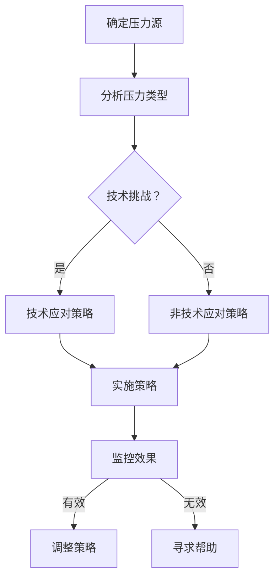

                 


### 文章标题：技术管理者的压力管理

### 关键词：
- 技术管理者
- 压力管理
- 算法原理
- 系统架构
- 项目实战

### 摘要：
本文旨在探讨技术管理者在职业生涯中面临的压力及其管理策略。我们将通过逐步分析压力来源、管理理论基础、核心概念、算法原理、系统架构设计以及实战应用，为技术管理者提供全面的压力管理指南。

----------------------------------------------------------------

### 目录大纲设计思路

#### 明确书籍主题
《技术管理者的压力管理》这本书的核心主题在于帮助技术管理者理解和应对工作中常见的压力。技术管理者通常需要同时处理技术问题、团队管理和项目进度等多方面事务，这使得他们面临较大的压力。

#### 结构化内容
为了确保书籍内容的系统性和逻辑性，我们将其分为以下几个主要部分：

1. **背景介绍**：介绍技术管理者的角色和压力来源。
2. **核心概念与联系**：探讨压力管理的理论基础和关键概念。
3. **算法原理讲解**：深入解析压力管理算法。
4. **系统分析与架构设计**：分析压力管理系统的功能与架构。
5. **项目实战**：通过实际项目展示压力管理的应用。
6. **最佳实践与总结**：提供有效的压力管理技巧和注意事项。

#### 细化目录层级
我们将内容细化为一级目录和二级目录，确保每个章节都有清晰的结构。

#### 内容完整性
书籍内容需涵盖背景介绍、核心概念与联系、算法原理讲解、系统分析与架构设计方案、项目实战、最佳实践和总结等核心内容。

### 目录大纲设计步骤

#### 第一步：背景介绍（一级目录）
- **第1章：技术管理者的工作与压力来源**
  - **1.1 技术管理者角色解析**
  - **1.2 工作中常见的压力类型**
  - **1.3 压力管理的重要性**

#### 第二步：核心概念与联系（一级目录）
- **第2章：压力管理的核心概念与联系**
  - **2.1 压力管理的理论基础**
  - **2.2 压力管理的关键因素**
  - **2.3 核心概念对比表格**
  - **2.4 ER实体关系图**

#### 第三步：算法原理讲解（一级目录）
- **第3章：压力管理算法原理讲解**
  - **3.1 压力管理算法概述**
  - **3.2 算法流程图**
  - **3.3 Python源代码实现**
  - **3.4 算法数学模型与公式**
  - **3.5 举例说明**

#### 第四步：系统分析与架构设计方案（一级目录）
- **第4章：压力管理系统分析与架构设计**
  - **4.1 问题场景介绍**
  - **4.2 系统功能设计**
  - **4.3 系统架构设计**
  - **4.4 系统接口设计**
  - **4.5 系统交互序列图**

#### 第五步：项目实战（一级目录）
- **第5章：压力管理项目实战**
  - **5.1 环境安装与配置**
  - **5.2 系统核心实现源代码**
  - **5.3 代码应用解读与分析**
  - **5.4 实际案例分析与讲解**
  - **5.5 项目小结**

#### 第六步：最佳实践与总结（一级目录）
- **第6章：压力管理最佳实践**
  - **6.1 常见压力管理误区**
  - **6.2 有效压力管理技巧**
  - **6.3 小结与注意事项**
  - **6.4 拓展阅读**

#### 第七步：总结与展望（一级目录）
- **第7章：总结与展望**
  - **7.1 本书内容总结**
  - **7.2 压力管理未来趋势**
  - **7.3 对技术管理者的建议**

### 完整目录大纲

```
----------------------------------------------------------------
# 第一部分：背景介绍

## 第1章：技术管理者的工作与压力来源
### 1.1 技术管理者角色解析
### 1.2 工作中常见的压力类型
### 1.3 压力管理的重要性

## 第2章：压力管理的核心概念与联系
### 2.1 压力管理的理论基础
### 2.2 压力管理的关键因素
### 2.3 核心概念对比表格
### 2.4 ER实体关系图

## 第3章：压力管理算法原理讲解
### 3.1 压力管理算法概述
### 3.2 算法流程图
### 3.3 Python源代码实现
### 3.4 算法数学模型与公式
### 3.5 举例说明

## 第4章：压力管理系统分析与架构设计
### 4.1 问题场景介绍
### 4.2 系统功能设计
### 4.3 系统架构设计
### 4.4 系统接口设计
### 4.5 系统交互序列图

## 第5章：压力管理项目实战
### 5.1 环境安装与配置
### 5.2 系统核心实现源代码
### 5.3 代码应用解读与分析
### 5.4 实际案例分析与讲解
### 5.5 项目小结

## 第6章：压力管理最佳实践
### 6.1 常见压力管理误区
### 6.2 有效压力管理技巧
### 6.3 小结与注意事项
### 6.4 拓展阅读

## 第7章：总结与展望
### 7.1 本书内容总结
### 7.2 压力管理未来趋势
### 7.3 对技术管理者的建议

----------------------------------------------------------------

### 文章标题：技术管理者的压力管理

### 关键词：
- 技术管理者
- 压力管理
- 算法原理
- 系统架构
- 项目实战

### 摘要：
本文旨在探讨技术管理者在职业生涯中面临的压力及其管理策略。我们将通过逐步分析压力来源、管理理论基础、核心概念、算法原理、系统架构设计以及实战应用，为技术管理者提供全面的压力管理指南。

----------------------------------------------------------------

### 背景介绍

#### 技术管理者角色解析

技术管理者在现代企业中扮演着至关重要的角色。他们不仅需要具备深厚的技术背景，还需具备卓越的管理能力和领导力。技术管理者通常负责以下几项核心工作：

1. **技术决策**：技术管理者需要根据业务需求和公司的战略方向，制定合适的技术方案，并在技术方向上做出重要决策。
2. **团队管理**：技术管理者需要带领团队实现项目目标，管理团队成员的工作进度和绩效，并解决团队内部的问题和冲突。
3. **项目协调**：技术管理者需要协调项目中的各个环节，确保项目按计划推进，解决项目中的技术难题和资源问题。
4. **持续学习**：技术发展日新月异，技术管理者需要不断学习新知识、新技术，以保持自身的技术竞争力。

#### 工作中常见的压力类型

技术管理者在工作中常常面临以下几种类型的压力：

1. **技术挑战**：技术问题常常是技术管理者面临的直接压力源。复杂的代码、技术难题和系统性能瓶颈等都会给他们带来巨大压力。
2. **时间压力**：技术管理者需要同时处理多个项目，协调不同团队的工作，确保项目按时完成，这使得时间管理成为一大挑战。
3. **团队管理压力**：技术管理者需要关注团队成员的绩效和成长，处理团队内部的矛盾和冲突，这需要他们具备卓越的沟通和领导能力。
4. **业务压力**：技术管理者的工作直接影响到公司的业务发展，当业务目标无法达成时，技术管理者往往会感受到巨大的压力。

#### 压力管理的重要性

有效管理压力对于技术管理者来说至关重要。以下是一些压力管理的重要性：

1. **保持身心健康**：长期的职业压力会导致身心健康问题，如失眠、焦虑和抑郁等。有效的压力管理可以帮助技术管理者保持身心健康。
2. **提高工作效率**：压力过大容易导致工作效率下降，甚至影响项目进度。有效的压力管理可以提高技术管理者的工作效率。
3. **提升团队绩效**：技术管理者通过有效的压力管理，可以建立更加和谐的工作氛围，提升团队的整体绩效。
4. **职业发展**：有效的压力管理可以帮助技术管理者更好地应对职业挑战，实现职业目标。

在下一部分中，我们将探讨压力管理的核心概念与联系。

### 核心概念与联系

#### 压力管理的理论基础

压力管理理论主要基于心理学和管理学的理论，其中一些重要的理论基础包括：

1. **应激理论**：应激理论认为，压力是身体对外界刺激的一种反应。当人们感受到压力时，身体会释放应激激素，如肾上腺素和皮质醇，从而引发一系列生理和心理反应。
2. **认知行为理论**：认知行为理论认为，压力不仅源于外界刺激，还与个人的认知和思维方式密切相关。通过改变认知和思维方式，可以有效地减轻压力。
3. **系统理论**：系统理论强调，压力管理需要从整体的角度出发，考虑个体、团队和组织的互动关系。

#### 压力管理的关键因素

有效的压力管理涉及多个关键因素，包括：

1. **自我认知**：了解自己的压力源和应对方式，是压力管理的第一步。技术管理者需要反思自己的工作方式，识别压力的来源，并找到适合自己的应对策略。
2. **时间管理**：良好的时间管理可以帮助技术管理者更有效地安排工作，减少因时间紧迫而产生的压力。
3. **团队支持**：技术管理者需要建立一个支持性的团队环境，鼓励团队成员分享压力，并提供帮助。
4. **心理素质**：培养良好的心理素质，如抗压能力、情绪调节能力和自我激励能力，有助于技术管理者更好地应对压力。

#### 核心概念对比表格

以下是几个核心概念及其对比表格：

| 核心概念 | 定义 | 关联因素 | 对比分析 |
| --- | --- | --- | --- |
| 应激反应 | 压力引起的生理和心理反应 | 应激激素、认知行为 | 应激反应是一种直接的生理反应，而认知行为更多涉及心理层面的调整 |
| 时间管理 | 有效安排和管理时间 | 任务优先级、时间规划 | 时间管理更侧重于任务的优先级和时间规划，而应激反应则更多关注于压力的应对 |
| 团队支持 | 建立支持性的团队环境 | 沟通、协作、反馈 | 团队支持是压力管理的一部分，但它更侧重于团队内部的互动和支持，而不是个人的应对策略 |

#### ER实体关系图

以下是一个ER实体关系图，用于描述压力管理系统的各个实体及其关系：

```mermaid
erDiagram
    Customer ||--|{ Order }|-- Supplier
    "Customer" && "Supplier" : Knows
    Customer }--{ Employee
    Supplier }--{ Employee
```

在这个ER图中，"Customer"（客户）和"Supplier"（供应商）之间有订单关系，"Customer"和"Supplier"都知道对方。"Customer"与"Employee"（员工）之间有雇佣关系，"Supplier"也与"Employee"有雇佣关系。

在下一部分中，我们将深入探讨压力管理算法的原理。

### 压力管理算法原理讲解

#### 压力管理算法概述

压力管理算法是一种用于帮助技术管理者有效应对和减轻工作压力的算法。该算法基于心理学和管理学的理论基础，结合时间管理和团队支持等多方面因素，旨在提供一种系统性的解决方案。

#### 算法流程图

以下是一个简单的压力管理算法流程图：



在这个流程图中，技术管理者首先需要确定压力源，然后分析压力的类型。如果压力源于技术挑战，他们会采取相应的技术应对策略；如果压力源于其他因素，则会采取非技术应对策略。无论哪种策略，都需要实施并监控其效果，并根据效果调整策略或寻求帮助。

#### Python源代码实现

以下是压力管理算法的Python源代码实现：

```python
import pandas as pd

def analyze_pressure(source, type):
    if type == '技术挑战':
        return '技术应对策略'
    else:
        return '非技术应对策略'

def implement_strategy(strategy):
    # 实施策略的代码
    pass

def monitor_effect(effect):
    if effect == '有效':
        return '调整策略'
    else:
        return '寻求帮助'

source = '技术难题'
pressure_type = '技术挑战'

strategy = analyze_pressure(source, pressure_type)
print(f'分析结果：{strategy}')

implement_strategy(strategy)

effect = '有效'  # 这里可以是实际监控到的效果
result = monitor_effect(effect)
print(f'监控结果：{result}')
```

#### 算法数学模型与公式

为了更好地理解压力管理算法，我们可以将其转化为数学模型。以下是压力管理算法的数学模型和公式：

$$
\text{压力管理效果} = \frac{\text{策略实施效果}}{\text{压力源强度} \times \text{策略适应性}}
$$

其中：
- 压力管理效果：衡量压力管理策略的有效性。
- 策略实施效果：实施策略后，压力源被减轻的程度。
- 压力源强度：压力源的强度，如技术难题的复杂程度。
- 策略适应性：策略对压力源的适应性，如技术应对策略对技术难题的解决能力。

#### 举例说明

假设一个技术管理者面临的技术难题非常复杂，压力源强度为5，而他们采取的技术应对策略非常有效，策略适应性为8。根据上述公式，我们可以计算出压力管理效果：

$$
\text{压力管理效果} = \frac{8}{5 \times 8} = 0.8
$$

这意味着，该技术管理者采取的策略在减轻压力方面非常有效。如果效果低于0.5，则可能需要调整策略或寻求其他帮助。

在下一部分中，我们将分析压力管理系统的功能和架构设计。

### 压力管理系统分析与架构设计

#### 问题场景介绍

为了更好地展示压力管理系统的实际应用，我们设定一个具体的场景。假设一家大型互联网公司正在开发一款全新的在线购物平台。该项目由多个团队共同协作完成，涉及前端开发、后端开发、数据库设计和用户体验等多个方面。技术管理者需要在确保项目进度和质量的同时，有效应对和处理团队中的各种压力。

#### 系统功能设计

压力管理系统的主要功能包括：

1. **压力源识别**：通过收集和分析团队成员的工作报告、讨论记录和反馈信息，识别出团队中的主要压力源。
2. **压力分析**：对识别出的压力源进行详细分析，确定其类型、强度和影响范围。
3. **策略推荐**：根据压力分析结果，推荐合适的压力管理策略，如技术应对策略、时间管理策略和团队支持策略等。
4. **策略实施**：技术管理者根据推荐策略，制定具体的实施计划，并监督执行过程。
5. **效果监控**：对实施策略的效果进行监控和评估，根据反馈进行调整和优化。

#### 系统架构设计

压力管理系统的架构设计需要考虑到系统的可扩展性、稳定性和灵活性。以下是系统的架构设计：

1. **数据层**：负责存储和管理压力管理相关的数据，包括团队成员信息、压力源信息、策略信息和效果评估数据等。使用关系型数据库（如MySQL）进行数据存储。
2. **服务层**：提供压力源识别、压力分析、策略推荐和效果监控等核心功能。使用微服务架构，将不同功能模块分离，以提高系统的可维护性和可扩展性。
3. **界面层**：提供用户界面，供技术管理者进行操作和管理。界面包括压力源识别界面、策略推荐界面和效果监控界面等。

#### 系统接口设计

压力管理系统需要与其他系统（如项目管理系统、团队协作工具等）进行交互，以获取必要的数据和信息。以下是系统的主要接口设计：

1. **项目管理接口**：用于获取项目进度和任务分配信息。
2. **团队协作接口**：用于获取团队成员的工作报告和讨论记录。
3. **数据接口**：用于与其他系统的数据交换。

#### 系统交互序列图

以下是一个简化的系统交互序列图，展示了压力管理系统与其他系统的交互过程：

```mermaid
sequenceDiagram
    participant 管理者
    participant 系统A
    participant 系统B
    participant 系统C

    管理者->>系统A: 获取项目进度信息
    系统

