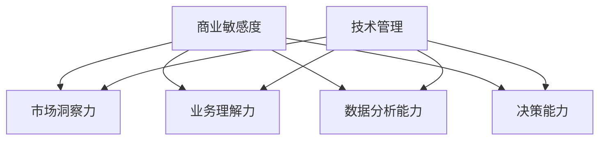

                 

# 《技术管理者的商业敏感度培养》

## 关键词
- 技术管理者
- 商业敏感度
- 培养方法
- 案例分析
- 最佳实践

## 摘要
本文旨在探讨技术管理者的商业敏感度培养，分析其重要性，介绍培养方法与技巧，并通过案例分析总结最佳实践。文章分为七个章节，包括引言与背景介绍、核心概念与联系、培养商业敏感度的方法与技巧、案例分析及最佳实践与总结。

## 第1章 引言与背景介绍

### 1.1 技术管理者的角色与挑战

技术管理者在企业中扮演着至关重要的角色，他们不仅需要具备深厚的技术背景，还要具备出色的管理能力。技术管理者通常负责团队的技术战略规划、项目管理和人员培训等工作。然而，随着企业对商业环境适应能力的提高，技术管理者也需要具备商业敏感度，以便更好地理解市场需求、把握商业机会和制定有效的技术战略。

#### 1.1.1 技术管理者的双重角色

技术管理者在企业中往往需要同时扮演两个角色：技术专家和管理者。作为技术专家，他们需要深入理解技术趋势、掌握最新的技术工具和方法，以确保团队的技术能力始终处于行业领先地位。作为管理者，他们需要关注团队的整体表现、人员配置、项目进度和风险管理等方面，以确保团队目标的实现。

#### 1.1.2 商业敏感度的重要性

商业敏感度是指技术管理者对商业环境的洞察力和理解力，包括对市场需求、竞争态势、商业模式等方面的认知。商业敏感度对于技术管理者至关重要，它有助于他们更好地把握商业机会、制定有效的技术战略、提高团队的市场竞争力。

#### 1.1.3 培养商业敏感度的必要性

在当前快速变化的商业环境中，技术管理者需要不断更新自己的知识体系，提高商业敏感度。培养商业敏感度不仅有助于技术管理者更好地理解企业的发展方向和战略目标，还有助于他们更好地与业务团队沟通协作，实现企业价值最大化。

### 1.2 商业敏感度的定义与内涵

商业敏感度是指技术管理者对商业环境的感知能力、分析能力和决策能力。它包括以下几个方面：

#### 1.2.1 商业敏感度的基本定义

商业敏感度是指技术管理者对商业环境变化的敏锐感知、准确理解和快速响应能力。

#### 1.2.2 商业敏感度的重要性

商业敏感度对于技术管理者的重要性体现在以下几个方面：

- 有助于技术管理者更好地理解企业的发展方向和战略目标；
- 有助于技术管理者更好地把握商业机会，制定有效的技术战略；
- 有助于技术管理者更好地与业务团队沟通协作，提高团队的市场竞争力。

#### 1.2.3 商业敏感度与技术创新的关系

商业敏感度与技术创新之间存在密切的联系。技术管理者具备较高的商业敏感度，有助于他们更好地发现市场需求、把握技术创新方向，从而推动企业技术创新，提高市场竞争力。

### 1.3 本书的目的与结构安排

#### 1.3.1 书籍目标

本书旨在帮助技术管理者提高商业敏感度，掌握培养商业敏感度的方法与技巧，从而更好地履行技术管理者的职责，推动企业的发展。

#### 1.3.2 读者对象

本书适用于技术管理者、技术团队领导者、项目经理以及对商业敏感度感兴趣的IT从业人员。

#### 1.3.3 各章节内容概述

- 第1章：引言与背景介绍，阐述技术管理者的角色和商业敏感度的重要性；
- 第2章：核心概念与联系，介绍商业敏感度和技术管理的核心概念，并展示两者之间的联系；
- 第3章至第5章：培养商业敏感度的方法与技巧，详细介绍培养商业敏感度的多种方法与技巧；
- 第6章：案例分析，通过实际案例展示商业敏感度培养对技术管理者的影响；
- 第7章：最佳实践与总结，总结本书的主要观点和技巧，并提供最佳实践建议。

### 1.4 本章小结

本章介绍了技术管理者的角色和商业敏感度的重要性，阐述了培养商业敏感度的必要性，并概述了本书的目的和结构安排。通过本章的学习，读者可以初步了解商业敏感度在技术管理中的重要性，为后续章节的学习打下基础。

## 第2章 核心概念与联系

### 2.1 商业敏感度与技术管理的核心概念

#### 2.1.1 商业敏感度的基本要素

商业敏感度包括以下几个方面：

1. 市场洞察力：对市场趋势、客户需求、竞争对手的敏锐感知；
2. 业务理解力：对商业模式、企业战略、业务流程的深刻理解；
3. 数据分析能力：运用数据分析方法，准确判断市场趋势和业务状况；
4. 决策能力：根据市场环境和业务需求，制定有效的决策方案。

#### 2.1.2 技术管理的核心要素

技术管理包括以下几个方面：

1. 技术战略：确定企业技术发展方向，制定长远的技术规划；
2. 项目管理：确保项目按计划、高质量地完成，实现预期目标；
3. 团队管理：培养技术团队，提高团队协作效率，实现团队目标；
4. 技术创新：推动技术创新，提升企业核心竞争力。

#### 2.1.3 商业敏感度与技术管理的联系

商业敏感度和技术管理之间存在紧密的联系。技术管理者具备较高的商业敏感度，有助于他们更好地理解市场需求、把握技术创新方向，从而制定出更加有效的技术战略和项目计划。同时，技术管理者的商业敏感度也有助于他们更好地与业务团队沟通协作，推动企业整体发展。

### 2.2 商业敏感度的分类与特征

商业敏感度可以从不同维度进行分类，常见的分类方法包括：

1. 按能力维度分类：市场洞察力、业务理解力、数据分析能力、决策能力；
2. 按应用场景分类：市场调研、产品规划、项目管理、风险控制；
3. 按培养方法分类：知识积累、实践经验、案例分析、模拟训练。

不同类型的商业敏感度具有不同的特征和作用。例如，市场洞察力有助于技术管理者把握市场趋势和客户需求，业务理解力有助于他们更好地理解企业战略和业务流程，数据分析能力有助于他们准确判断市场状况和业务风险，决策能力有助于他们制定有效的决策方案。

### 2.3 概念联系图

为了更好地展示商业敏感度和技术管理的核心概念及其之间的联系，我们可以使用Mermaid流程图进行展示。

通过该流程图，我们可以清晰地看到商业敏感度和技术管理的核心概念及其之间的联系。

### 2.4 本章小结

本章介绍了商业敏感度和技术管理的核心概念，阐述了商业敏感度的分类与特征，并通过Mermaid流程图展示了两者之间的联系。通过本章的学习，读者可以更好地理解商业敏感度和技术管理的内涵，为后续章节的学习打下基础。

## 第3章 培养商业敏感度的方法与技巧（一）

### 3.1 基础知识构建

#### 3.1.1 商业知识体系构建

技术管理者需要建立完善的商业知识体系，以应对不断变化的商业环境。商业知识体系包括以下几个方面：

1. 市场知识：了解市场需求、市场趋势和市场竞争态势；
2. 企业知识：熟悉企业战略、业务模式、运营流程和核心竞争力；
3. 行业知识：掌握所在行业的发展动态、技术趋势和政策法规。

#### 3.1.2 技术与管理知识的融合

技术管理者需要将技术知识与管理知识进行有效融合，以提高商业敏感度。具体方法包括：

1. 技术与管理知识的交叉学习：通过参加培训、阅读相关书籍和论文，了解技术与管理知识之间的联系；
2. 实践经验总结：结合实际项目经验，总结技术与管理知识在实际工作中的应用。

#### 3.1.3 商业案例分析

通过分析实际案例，技术管理者可以了解成功的商业策略和管理方法，从而提高商业敏感度。具体方法包括：

1. 学习成功案例：分析成功企业的商业策略、管理模式和市场表现，了解其成功的原因；
2. 反思失败案例：分析失败企业的原因，吸取教训，避免在未来的工作中犯类似错误。

### 3.2 观察能力培养

#### 3.2.1 市场趋势分析

技术管理者需要关注市场趋势，以把握市场机遇。具体方法包括：

1. 定期阅读市场报告：了解市场发展趋势、新兴技术、市场需求变化等；
2. 参加行业会议：与行业专家、同行交流，获取最新的市场信息。

#### 3.2.2 竞争对手研究

技术管理者需要了解竞争对手的产品、技术、市场策略等方面的信息，以便制定相应的应对策略。具体方法包括：

1. 竞争对手分析：分析竞争对手的产品特点、技术优势、市场表现等；
2. 竞争对手监控：关注竞争对手的市场动态，及时发现并应对竞争对手的行动。

#### 3.2.3 用户需求洞察

了解用户需求是提高商业敏感度的关键。技术管理者可以通过以下方法获取用户需求：

1. 用户调研：通过问卷调查、用户访谈等方式收集用户反馈；
2. 用户行为分析：分析用户在使用产品过程中的行为习惯、偏好等。

### 3.3 决策能力提升

#### 3.3.1 决策框架建立

技术管理者需要建立科学的决策框架，以提高决策能力。决策框架包括以下几个方面：

1. 目标明确：明确决策的目标和优先级；
2. 信息收集：收集与决策相关的各种信息；
3. 评估分析：对不同的决策方案进行评估和比较；
4. 决策执行：制定具体的执行计划，并确保执行。

#### 3.3.2 决策案例分析

通过分析实际案例，技术管理者可以了解不同的决策方法和技巧，从而提高决策能力。具体方法包括：

1. 学习成功案例：分析成功决策的原因，了解其决策方法和过程；
2. 反思失败案例：分析失败决策的原因，吸取教训，避免在未来的工作中犯类似错误。

#### 3.3.3 决策工具应用

技术管理者可以使用各种决策工具，以提高决策的准确性和效率。常见的决策工具包括：

1. SWOT分析：分析企业的优势、劣势、机会和威胁，为决策提供依据；
2. 价值分析：评估不同决策方案的价值和风险，选择最优方案；
3. 决策树：用图形方式表示不同决策方案的可能结果和概率，帮助决策者进行选择。

### 3.4 交流沟通技巧

#### 3.4.1 内部沟通机制

技术管理者需要建立有效的内部沟通机制，以提高团队协作效率。具体方法包括：

1. 定期召开团队会议：讨论项目进展、工作计划、问题解决等；
2. 明确沟通渠道：建立明确的沟通渠道，如邮件、即时通讯工具等；
3. 倡导开放沟通：鼓励团队成员表达意见、分享经验，形成良好的沟通氛围。

#### 3.4.2 外部沟通策略

技术管理者需要与外部合作伙伴、客户和供应商保持良好的沟通。具体方法包括：

1. 定期召开外部会议：讨论项目进展、需求变更、合作事宜等；
2. 建立稳定的合作伙伴关系：通过长期合作，建立互信，提高沟通效率；
3. 倾听外部反馈：关注客户、合作伙伴的反馈，及时调整策略。

#### 3.4.3 沟通技巧提升

技术管理者可以通过以下方法提升沟通技巧：

1. 倾听：学会倾听他人的意见和需求，提高沟通效果；
2. 明确表达：用简洁、明了的语言表达自己的想法，避免歧义；
3. 情景模拟：通过模拟场景，提高沟通的应变能力。

### 3.5 本章小结

本章介绍了培养商业敏感度的几种方法与技巧，包括基础知识构建、观察能力培养、决策能力提升和交流沟通技巧。通过本章的学习，技术管理者可以掌握培养商业敏感度的具体方法，提高自己在技术管理中的综合素质。

