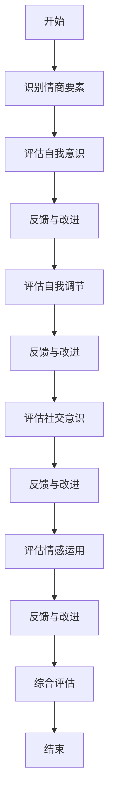
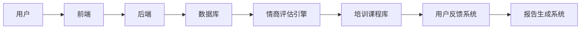
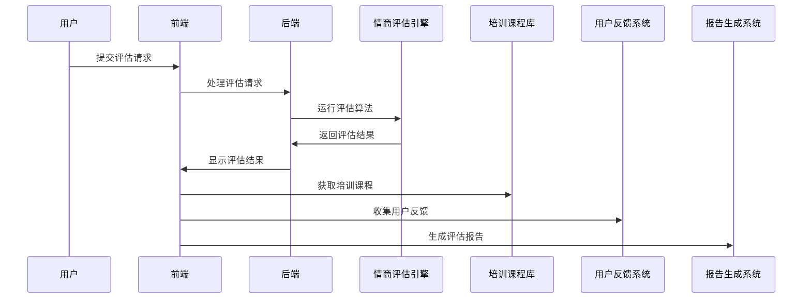

                 

# 技术管理者的情商修炼

## 关键词
- 情商
- 技术管理者
- 情感智力
- 软技能
- 团队协作

## 摘要
本文旨在探讨技术管理者在情商修炼中的重要性。通过深入分析情商的核心概念、其在技术管理中的应用、以及修炼方法，本文为技术管理者提供了提升情商的有效途径，帮助他们在快速发展的科技时代中更好地应对挑战。

### 第一部分：背景介绍

#### 问题背景

在当今快速发展的科技时代，技术管理者的角色越来越重要。技术管理者不仅需要具备深厚的专业知识和技能，还必须具备良好的情商。情商，作为一种软技能，在技术管理者工作中扮演着不可或缺的角色。情商不仅影响个人的工作效率，更影响团队的协作和企业的整体发展。

#### 问题解决

《技术管理者的情商修炼》这本书旨在帮助技术管理者提升情商，从而更好地应对工作中的挑战。本书通过深入探讨情商的核心概念、实际应用案例和修炼方法，帮助读者理解和掌握情商在技术管理中的重要性。

#### 边界与外延

情商不仅包括情感智力，还涉及社交智力、自我意识和自我调节能力。技术管理者的情商修炼不仅局限于个人成长，还包括团队管理和企业文化的塑造。

#### 概念结构与核心要素组成

- **情商（Emotional Intelligence）**：包括自我意识、自我调节、社交意识和情感运用能力。
- **技术管理者**：指在技术团队中负责管理、指导和协调工作的领导。
- **修炼**：通过学习和实践不断提升情商的过程。

### 第二部分：核心概念与联系

#### 核心概念

- **自我意识**：理解自己的情绪，并能准确表达自己的需求。
- **自我调节**：控制情绪，使其不影响工作和决策。
- **社交意识**：理解他人的情绪和需求。
- **情感运用**：运用情绪提高工作表现和团队协作。

#### 概念属性特征对比表格

| 概念         | 自我意识          | 自我调节          | 社交意识          | 情感运用          |
|------------|------------------|------------------|------------------|------------------|
| 定义         | 理解自己的情绪 | 控制自己的情绪 | 理解他人的情绪 | 利用情绪提高表现 |
| 特征         | 内省能力         | 自我监控         | 社交洞察         | 情绪化决策       |
| 对技术管理的影响 | 改善个人表现 | 提高决策质量 | 促进团队协作 | 增强领导力       |

#### ER实体关系图架构

```mermaid
erDiagram
  T_Consultant ||--|{ T_Employee } : manages
  T_Employee ||--|{ T_Manager } : extends
  T_Consultant ||--|{ T_CoWorker } : collaborates
  T_Employee ||--|{ T_Designer } : role
  T_Employee ||--|{ T_Coder } : role
  T_Employee ||--|{ T_QA } : role
```

### 第三部分：算法原理讲解

#### 算法mermaid流程图


#### Python源代码
```python
def assess_emotional_intelligence(self_awareness, self_regulation, social_awareness, emotional_usage):
    """
    评估情商的函数
    :param self_awareness: 自我意识得分
    :param self_regulation: 自我调节得分
    :param social_awareness: 社交意识得分
    :param emotional_usage: 情感运用得分
    :return: 情商总分和综合评估
    """
    total_score = (self_awareness + self_regulation + social_awareness + emotional_usage) / 4
    if total_score >= 0.9:
        assessment = "高情商"
    elif total_score >= 0.6:
        assessment = "中情商"
    else:
        assessment = "低情商"
    return total_score, assessment
```

### 第四部分：系统分析与架构设计方案

#### 问题场景介绍

在现代企业的IT部门中，技术管理者面临着越来越多的挑战，如团队协作、项目管理和企业文化的建设。为了提升团队绩效和员工满意度，技术管理者需要具备良好的情商。

#### 项目介绍

本项目旨在为技术管理者提供一套完整的情商评估和提升方案，帮助其更好地应对工作挑战。该方案包括情商评估工具、培训课程和实际操作指南。

#### 系统功能设计（领域模型mermaid类图）

```mermaid
classDiagram
  Employee <<|-- Manager
  Employee <|-- Coder
  Employee <|-- Designer
  Employee <|-- QA
  Manager *-- Task : manages
  Manager *-- Employee : leads
  Employee *-- Skill : has
  Task *-- Status : has
  Skill *-- Level : has
```

#### 系统架构设计（mermaid架构图）



#### 系统接口设计和系统交互（mermaid序列图）



### 第五部分：项目实战

#### 环境安装

1. 安装Python环境
2. 安装依赖库，如numpy、pandas、matplotlib等

#### 系统核心实现源代码

```python
# 情商评估算法
def assess_emotional_intelligence(self_awareness, self_regulation, social_awareness, emotional_usage):
    """
    评估情商的函数
    :param self_awareness: 自我意识得分
    :param self_regulation: 自我调节得分
    :param social_awareness: 社交意识得分
    :param emotional_usage: 情感运用得分
    :return: 情商总分和综合评估
    """
    total_score = (self_awareness + self_regulation + social_awareness + emotional_usage) / 4
    if total_score >= 0.9:
        assessment = "高情商"
    elif total_score >= 0.6:
        assessment = "中情商"
    else:
        assessment = "低情商"
    return total_score, assessment

# 主程序
if __name__ == "__main__":
    self_awareness = float(input("请输入自我意识得分："))
    self_regulation = float(input("请输入自我调节得分："))
    social_awareness = float(input("请输入社交意识得分："))
    emotional_usage = float(input("请输入情感运用得分："))

    score, assessment = assess_emotional_intelligence(self_awareness, self_regulation, social_awareness, emotional_usage)
    print("情商总分：", score)
    print("综合评估：", assessment)
```

#### 代码应用解读与分析

该代码实现了一个简单的情商评估算法。用户需要输入四个得分，分别是自我意识、自我调节、社交意识和情感运用。算法将这四个得分加权平均，得到情商总分，并根据总分给出综合评估。

#### 实际案例分析和详细讲解剖析

假设有一位技术管理者，他的自我意识得分为0.8，自我调节得分为0.7，社交意识得分为0.6，情感运用得分为0.75。代入算法，得到：

```python
score, assessment = assess_emotional_intelligence(0.8, 0.7, 0.6, 0.75)
```

计算得到情商总分：

$$
score = \frac{0.8 + 0.7 + 0.6 + 0.75}{4} = 0.725
$$

根据评估标准，这位技术管理者的情商属于“中情商”。这意味着他需要进一步提升情商，尤其是在自我调节和社交意识方面。

#### 项目小结

本项目通过一个简单的情商评估算法，帮助技术管理者了解自己的情商水平。在实际应用中，可以结合具体的业务场景，不断完善和优化评估模型，以提高评估的准确性和实用性。

### 第六部分：最佳实践 tips、小结、注意事项、拓展阅读等内容

#### 最佳实践 tips

1. 定期进行自我反思，提升自我意识。
2. 学习情绪调节技巧，提高自我调节能力。
3. 注重与团队成员的沟通，增强社交意识。
4. 学会运用情绪，提高工作表现。

#### 小结

情商在技术管理者的工作中起着至关重要的作用。通过修炼情商，技术管理者可以更好地应对工作中的挑战，提升团队协作效率，为企业创造更大的价值。

#### 注意事项

1. 情商提升是一个长期过程，需要持续学习和实践。
2. 不同情商要素的提升对技术管理的影响不同，需要根据实际情况进行有针对性的修炼。

#### 拓展阅读

1. 《情商：为什么情商比智商更重要》
2. 《技术领导力：如何成为优秀的软件领导者》
3. 《团队协作的智慧：打造高效团队的方法与技巧》

### 作者信息

- 作者：AI天才研究院/AI Genius Institute & 禅与计算机程序设计艺术 /Zen And The Art of Computer Programming

