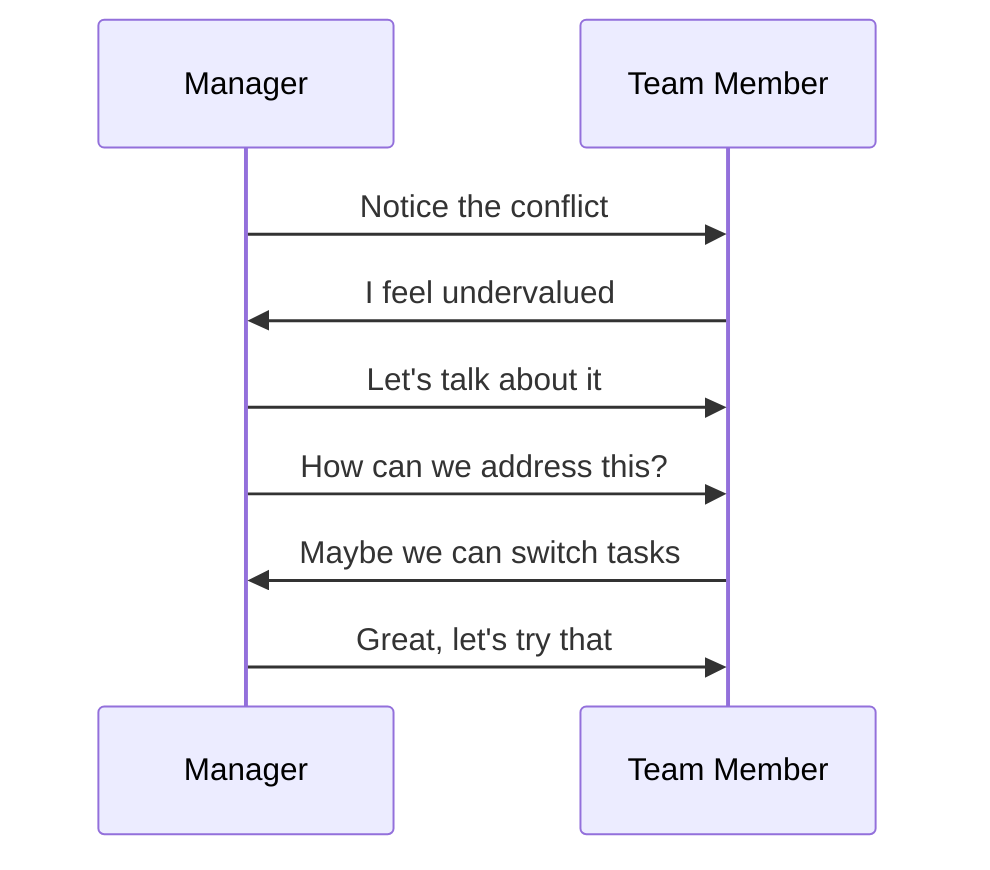
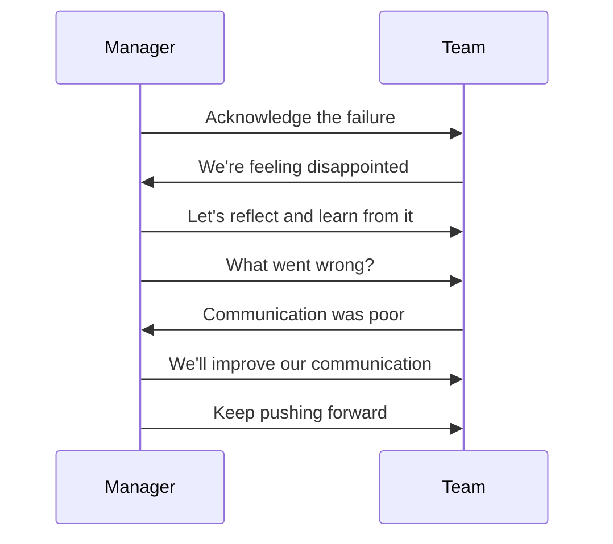

                 


Alright, let's dive into the first part of our blog post. We'll start with the title and an introduction to the topic of emotional intelligence and interpersonal management for technical managers.

## 简介

### 技术管理者的挑战

In the fast-paced and ever-evolving world of technology, technical managers face a myriad of challenges. They are not just responsible for managing the technical aspects of a project but also for leading and motivating a team of talented individuals. This requires a unique set of skills that go beyond technical expertise. Emotional intelligence (EI) and interpersonal management skills play a crucial role in overcoming these challenges and ensuring the success of a project.

### 关键词

- 技术管理者
- 情商
- 人际关系管理
- 团队领导
- 项目成功

### 摘要

This article delves into the importance of emotional intelligence and interpersonal management for technical managers. We will explore the core concepts of emotional intelligence, its practical applications in the workplace, key interpersonal skills, and strategies for building relationships and a positive work culture. Through case studies and real-world examples, we will illustrate how emotional intelligence and interpersonal management can lead to improved team performance and project success.

----------------------------------------------------------------

With the introduction set, let's move on to the first part of our blog post, where we will discuss the core concepts of emotional intelligence and its significance in the context of technical management.

## 第一部分：情感智力的核心概念

### 什么是情感智力

情感智力（Emotional Intelligence，简称EI）是指个体识别、理解、管理和使用情感信息的能力。它不同于传统的智商（IQ），后者主要衡量的是逻辑推理和分析能力。情感智力更注重人际交往和情感管理，包括以下几个方面：

- **自我认知**：了解自己的情感状态，认识到情感是如何影响个人行为的。
- **自我管理**：有效地处理自己的情感，保持情绪稳定，应对压力和挑战。
- **社交意识**：理解他人的情感和需求，建立有效的人际关系。
- **关系管理**：运用情感智慧处理人际冲突，建立和维护健康的社交网络。

### 情感智力与传统智力的区别

传统智力主要关注认知能力的评估，包括语言、逻辑和数学能力。而情感智力则更关注情感领域的技能，它对于人际交往和团队协作至关重要。

#### 优点对比表格

| 特点         | 情感智力               | 传统智力               |
| ------------ | --------------------- | --------------------- |
| **焦点**     | 情感和人际关系         | 认知和逻辑推理         |
| **应用**     | 领导力、团队协作、沟通 | 学术、研究和数学问题解决 |
| **评估方法** | 情感自我评估、观察      | 标准化智力测试         |

### ER实体关系图架构

```mermaid
erDiagram
  AI_Technical_Manager ||--|{ Emotional_Intelligence }
  Emotional_Intelligence ||--|{ Self_Cognition }
  Emotional_Intelligence ||--|{ Self_Management }
  Emotional_Intelligence ||--|{ Social_Awareness }
  Emotional_Intelligence ||--|{ Relationship_Management }
```

#### 情感智力的核心要素组成

- **自我认知**：通过自我反思和情绪日记，了解自己的情感反应。
- **自我管理**：使用深呼吸、冥想等技巧来调节情绪，提高抗压能力。
- **社交意识**：倾听他人、观察非言语行为，以更好地理解他人。
- **关系管理**：通过有效的沟通和冲突解决技巧，维护和谐的人际关系。

In conclusion, emotional intelligence is a crucial component for technical managers in today's dynamic work environment. It enhances leadership skills, promotes teamwork, and leads to a more productive and positive work culture. In the next sections, we will delve deeper into the practical applications of emotional intelligence and explore the essential interpersonal skills that complement it. Stay tuned!

----------------------------------------------------------------

This completes the first part of our article. In the following sections, we will explore the practical applications of emotional intelligence in the workplace and discuss key interpersonal skills that are vital for technical managers. Let's think step by step and uncover the secrets to effective emotional intelligence and interpersonal management.

## 第二部分：情感智力在工作中的实际应用

### 情感智力在工作环境中的重要性

情感智力在技术管理中起着至关重要的作用，尤其是在当今快速变化和高度竞争的工作环境中。以下是一些关键点，说明为什么情感智力对技术管理者来说至关重要：

#### 1. 提高团队协作

技术项目往往需要团队成员之间的紧密合作。情感智力帮助管理者理解团队成员的情感状态，从而更有效地协调资源和分配任务。一个高情商的经理能够识别团队成员的情感需求，促进合作，减少冲突。

#### 2. 增强领导能力

情感智力是有效领导的关键因素。技术管理者需要激励团队、解决问题并应对挑战。通过自我管理和社交意识，他们能够更好地与员工沟通，建立信任，并制定更有效的领导策略。

#### 3. 促进创新和适应能力

技术领域不断创新，技术管理者需要具备快速适应变化的能力。情感智力使他们能够识别和利用新的机会，同时管理风险和不确定性。通过情感管理，他们能够保持团队的创造力和创新能力。

#### 4. 提高员工满意度

一个高情商的管理者能够更好地理解员工的情感需求，提供必要的支持。这有助于提高员工的工作满意度和忠诚度，减少员工流失率。

### 实际应用场景

#### 场景 1：团队冲突

当团队中出现冲突时，技术管理者可以利用情感智力来处理。以下是一个应用实例：

**步骤 1：识别冲突**  
首先，管理者需要识别冲突的根源，可能是任务分配不公、沟通不畅或个人问题。

**步骤 2：理解情感**  
通过与团队成员对话，了解他们的情感状态。例如，一个团队成员可能感到不公平或受到忽视。

**步骤 3：沟通和调解**  
管理者需要用同理心沟通，并尝试找到解决方案。例如，重新分配任务或改善沟通流程。

**步骤 4：跟踪进展**  
管理者应定期跟进冲突的处理情况，确保问题得到解决。



#### 场景 2：项目失败

当项目失败时，情感智力可以帮助管理者应对：

**步骤 1：接受现实**  
管理者需要接受失败的现实，并理解情绪反应，如失望或沮丧。

**步骤 2：反思和学习**  
通过反思失败的原因，管理者可以识别改进的机会。

**步骤 3：激励团队**  
管理者需要鼓励团队从失败中学习，保持积极态度，并设定新的目标。

**步骤 4：持续改进**  
管理者应持续跟踪项目改进措施，确保未来避免类似失败。



### 总结

情感智力在工作中的应用广泛，从团队冲突处理到项目失败应对，都是技术管理者不可或缺的技能。通过提高情感智力，管理者能够更有效地领导团队，提高员工满意度，并在快速变化的技术环境中保持竞争力。

在下一部分，我们将深入探讨技术管理者所需的人际交往技能，包括沟通、冲突解决和团队合作。敬请期待！

----------------------------------------------------------------

This concludes the second part of our article, focusing on the practical applications of emotional intelligence in the workplace. In the next section, we will delve into the essential interpersonal skills that are crucial for technical managers. Let's continue our step-by-step exploration to uncover the key elements of effective interpersonal management.

## 第三部分：关键的人际交往技能

### 沟通

沟通是人际交往的核心，对于技术管理者来说尤为重要。有效的沟通不仅能够确保信息的准确传达，还能增强团队的凝聚力和信任感。以下是一些关键沟通技巧：

#### 1. 倾听

倾听是有效沟通的基础。技术管理者应该积极倾听团队成员的观点和情感，而不是仅仅等待发言的机会。以下是一些倾听技巧：

- **全神贯注**：在对方说话时，保持目光接触，不要分心。
- **避免打断**：让对方完整表达观点，不要急于插话。
- **确认理解**：通过复述对方的话或提出问题来确认自己是否正确理解。

#### 2. 清晰表达

清晰表达意味着用简单、明确的语言传达信息。技术管理者应该避免使用专业术语或复杂句式，以免造成误解。以下是一些建议：

- **简洁明了**：避免冗长的句子和复杂的解释。
- **使用比喻**：用比喻和故事来解释复杂的概念，使信息更易理解。
- **视觉辅助**：使用图表、流程图等视觉工具来辅助说明。

#### 3. 非言语沟通

非言语沟通包括肢体语言、面部表情和语调等。技术管理者应该注意自己的非言语行为，以确保与口头表达一致。以下是一些技巧：

- **肢体语言**：保持开放和积极的肢体语言，以传达友好和自信。
- **面部表情**：展示真诚和关心的表情，以增强沟通效果。
- **语调**：使用适当的语调和节奏，以增强语气和情感。

### 冲突解决

在团队中，冲突是无法避免的。技术管理者需要具备有效的冲突解决技能，以维护团队的和谐与高效。以下是一些冲突解决策略：

#### 1. 识别冲突

技术管理者应能够识别冲突的早期迹象，如团队成员的消极情绪、频繁的误解或工作进度放缓。以下是一些识别冲突的方法：

- **观察行为**：注意团队成员的行为变化，如避免眼神接触、沉默或频繁请假。
- **倾听反馈**：鼓励团队成员提供反馈，了解他们的不满或担忧。

#### 2. 对话

当冲突发生时，管理者应通过对话来解决问题。以下是一些对话技巧：

- **中立立场**：保持中立，避免偏袒任何一方。
- **开放问题**：提出开放性问题，鼓励双方表达观点。
- **倾听和反思**：倾听对方的观点，并反思自己的行为。

#### 3. 寻求共识

管理者应努力寻求双方的共识，以达成解决方案。以下是一些寻求共识的策略：

- **共同目标**：强调共同目标，提醒双方关注大局。
- **妥协和让步**：鼓励双方做出一定的妥协和让步。
- **制定行动计划**：制定具体的行动计划，以确保问题得到解决。

### 团队合作

团队合作是实现项目目标的关键。技术管理者应培养团队合作精神，以下是一些关键技巧：

#### 1. 分配任务

技术管理者应合理分配任务，确保每个团队成员都能发挥自己的优势。以下是一些分配任务的策略：

- **了解团队成员**：了解每个成员的技能和兴趣，以便合理分配任务。
- **公平性**：确保任务分配是公正的，避免过度劳累或忽视某些成员。

#### 2. 建立信任

信任是团队合作的基石。管理者应通过以下方式建立信任：

- **透明沟通**：保持沟通的透明性，避免信息不对称。
- **尊重和认可**：尊重团队成员的意见和贡献，给予认可和奖励。
- **共同目标**：强调团队目标，鼓励团队成员为共同目标努力。

#### 3. 促进协作

管理者应采取措施促进团队成员之间的协作：

- **团队建设活动**：组织团队建设活动，增强团队凝聚力。
- **知识共享**：鼓励团队成员分享知识和经验，促进共同成长。
- **定期会议**：定期召开团队会议，讨论项目进展和问题。

### 总结

人际交往技能对于技术管理者来说至关重要。有效的沟通、冲突解决和团队合作能力能够帮助管理者更好地领导团队，实现项目目标。在下一部分，我们将探讨如何建立和维护健康的人际关系，以促进团队的成功。敬请期待！

----------------------------------------------------------------

This completes the third part of our article, which focused on key interpersonal skills for technical managers. In the next section, we will delve into the importance of relationship building and effective networking. Stay tuned as we continue our step-by-step journey to mastering emotional intelligence and interpersonal management for technical leaders.

## 第四部分：建立和维护健康的人际关系

### 关键要素

建立和维护健康的人际关系对于技术管理者来说至关重要。以下是一些关键要素：

#### 1. 同理心

同理心是建立深厚人际关系的基础。技术管理者应努力理解他人的情感和需求，从而更好地支持团队成员。以下是一些建立同理心的方法：

- **倾听**：认真倾听他人的观点，不要急于打断。
- **提问**：通过提问来了解他人的感受和需求。
- **体察非言语信息**：注意他人的肢体语言和面部表情，了解他们的情感状态。

#### 2. 信任

信任是任何健康关系的核心。技术管理者应通过以下方式建立信任：

- **透明沟通**：保持沟通的透明性，避免隐瞒信息。
- **履行承诺**：遵守承诺，确保言行一致。
- **尊重和诚信**：尊重他人的意见和感受，以诚信为基础。

#### 3. 支持与帮助

提供支持和帮助是建立人际关系的有效方式。技术管理者应乐于帮助团队成员解决问题，促进他们的职业发展。以下是一些建立支持关系的策略：

- **主动提供帮助**：在团队成员需要时主动提供帮助。
- **职业发展支持**：帮助团队成员制定职业发展计划，提供培训机会。
- **鼓励反馈**：鼓励团队成员提出意见和建议，共同改进。

### 如何有效建立人际关系

#### 1. 积极参与社交活动

参与社交活动是建立人际关系的良好机会。技术管理者应积极参与团队以外的活动，如行业会议、研讨会和社交聚会。以下是一些参与社交活动的建议：

- **主动介绍自己**：在社交场合中主动介绍自己，建立联系。
- **倾听和提问**：倾听他人的观点，提出有见地的问题。
- **分享经验**：分享自己的经验和见解，建立专业知识网络。

#### 2. 建立专业网络

建立专业网络是技术管理者职业生涯发展的重要组成部分。以下是一些建立专业网络的策略：

- **利用社交媒体**：利用LinkedIn、Twitter等社交媒体平台，与行业内的专家建立联系。
- **参加行业活动**：参加行业会议、研讨会和工作坊，扩大专业网络。
- **建立专业社区**：加入专业组织或社区，参与讨论和分享。

#### 3. 保持联系

建立人际关系后，保持联系至关重要。以下是一些建立和维护人际关系的策略：

- **定期沟通**：定期与团队成员和专业联系人保持沟通，分享项目进展和个人成就。
- **提供帮助**：在对方需要时主动提供帮助，展示你的价值。
- **庆祝成就**：在团队成员取得成就时，给予认可和祝贺。

### 关系维护与深度发展

#### 1. 定期反馈

技术管理者应定期与团队成员进行反馈，了解他们的工作进展和需求。以下是一些建立和维护人际关系的策略：

- **一对一会议**：定期与团队成员进行一对一会议，讨论他们的工作情况和职业发展。
- **开放沟通**：鼓励团队成员提出问题和意见，建立开放的沟通渠道。

#### 2. 发展共同兴趣

共同兴趣是加深人际关系的有效途径。技术管理者可以尝试以下方法：

- **组织活动**：组织团队建设活动或行业聚会，促进团队成员之间的交流。
- **共同学习**：鼓励团队成员一起参加培训课程或研讨会，共同学习新知识。

#### 3. 解决冲突

在人际关系中，冲突是不可避免的。技术管理者应学会以建设性的方式解决冲突，以下是一些建议：

- **冷静处理**：在冲突发生时，保持冷静，避免情绪化。
- **倾听和尊重**：倾听对方的观点，尊重彼此的感受。
- **寻求共识**：寻求双方都能接受的解决方案。

### 总结

建立和维护健康的人际关系是技术管理者成功的关键。通过同理心、信任和支持，技术管理者可以建立深厚的人际关系，促进团队的合作与成长。在下一部分，我们将探讨领导力与情感智力的关系，帮助技术管理者进一步提升自己的领导能力。敬请期待！

----------------------------------------------------------------

This concludes the fourth part of our article, focusing on the importance of relationship building and effective networking for technical managers. In the next section, we will delve into the relationship between leadership and emotional intelligence, exploring how technical managers can leverage emotional intelligence to become more effective leaders. Stay tuned as we continue our journey to mastering the skills of emotional intelligence and interpersonal management for technical leaders.

## 第五部分：领导力与情感智力的关系

### 领导力的重要性

领导力是技术管理者成功的关键因素之一。一个优秀的领导者不仅能够指导团队完成项目目标，还能激励团队成员发挥最大潜力。以下是一些关键领导力特征：

#### 1. 激励与鼓舞

激励团队成员是领导者的重要职责。通过鼓励和支持，领导者可以帮助团队成员克服困难，保持积极态度。以下是一些激励团队成员的方法：

- **认可与奖励**：公开认可团队成员的成就，并给予适当的奖励。
- **设定明确目标**：为团队成员设定清晰、可实现的任务和目标。
- **提供发展机会**：为团队成员提供培训和学习机会，帮助他们不断提升。

#### 2. 决策能力

领导者需要具备良好的决策能力，能够在复杂和不确定的情况下做出明智的选择。以下是一些提高决策能力的策略：

- **收集信息**：在做出决策之前，充分收集相关信息，包括团队成员的意见。
- **分析利弊**：权衡不同选择的利弊，评估潜在风险和回报。
- **勇于承担责任**：做出决策后，勇于承担相应的责任。

#### 3. 沟通能力

有效的沟通是领导者成功的关键。以下是一些提高沟通能力的建议：

- **清晰传达信息**：确保信息传达清晰、准确，避免误解和混淆。
- **积极倾听**：倾听团队成员的意见和反馈，了解他们的需求和关切。
- **建立信任**：通过诚实和透明沟通建立信任，增强团队凝聚力。

### 情感智力在领导力中的应用

情感智力在领导力中发挥着重要作用。一个具备高情商的领导者能够更好地理解和管理自己和他人的情感，从而提高领导效能。以下是一些情感智力在领导力中的应用：

#### 1. 自我管理

自我管理是情感智力的重要组成部分，对于领导者来说尤为重要。以下是一些自我管理的策略：

- **情绪调节**：学会控制自己的情绪，避免在工作场合情绪失控。
- **自我反思**：定期进行自我反思，识别自己的情感反应和行为模式。
- **时间管理**：合理安排时间，确保工作与个人生活的平衡。

#### 2. 社交意识

社交意识是指理解和管理他人情感的能力。领导者应具备以下社交意识：

- **同理心**：设身处地地为他人着想，理解他们的情感和需求。
- **倾听**：积极倾听团队成员的意见，了解他们的感受和困惑。
- **非言语沟通**：注意他人的非言语信号，如肢体语言和面部表情，以更好地理解他们的情感状态。

#### 3. 关系管理

关系管理是领导者建立和维护良好人际关系的能力。以下是一些关系管理的策略：

- **建立信任**：通过诚实和透明沟通建立信任，增强团队凝聚力。
- **提供支持**：在团队成员需要时主动提供帮助，展示关心和支持。
- **解决冲突**：以建设性的方式解决团队内部的冲突，维护和谐的工作环境。

### 领导力策略

以下是一些适用于技术管理者的领导力策略：

#### 1. 激励与鼓舞

- **设立明确的目标和期望**：为团队成员设定清晰的目标和期望，鼓励他们为实现目标而努力。
- **提供反馈和认可**：定期给予团队成员反馈，认可他们的成就和进步。
- **鼓励创新和冒险**：鼓励团队成员尝试新方法，支持他们冒险和探索。

#### 2. 沟通与协作

- **建立开放的沟通渠道**：鼓励团队成员分享意见和反馈，确保信息畅通。
- **促进团队合作**：组织团队活动，加强团队合作和沟通。
- **培养跨部门协作**：促进不同部门之间的沟通和合作，提高项目效率。

#### 3. 决策与执行力

- **收集多方意见**：在做出决策之前，充分听取团队成员的意见和建议。
- **制定明确的行动计划**：确保决策能够得到有效执行，制定具体的行动计划。
- **跟踪项目进度**：定期检查项目进度，确保目标按时达成。

### 总结

领导力是技术管理者成功的关键，而情感智力在其中起着至关重要的作用。通过自我管理、社交意识和关系管理，技术管理者可以提升自己的领导能力，激励团队成员，实现项目目标。在下一部分，我们将通过案例分析，进一步探讨情感智力在实际工作中的应用。敬请期待！

----------------------------------------------------------------

This completes the fifth part of our article, which explored the relationship between leadership and emotional intelligence. In the next section, we will delve into case studies and real-world examples to illustrate the practical application of emotional intelligence and interpersonal management in the workplace. Stay tuned as we continue our exploration of how emotional intelligence can enhance technical management.

## 第六部分：案例分析

### 案例一：技术团队的和谐合作

在一个大型科技公司，一个由多名技术人员组成的团队在项目开发过程中遇到了严重的沟通问题。团队成员之间存在误解和冲突，导致项目进度严重滞后。为了解决这一问题，技术经理采取了一系列措施，充分发挥了情感智力。

#### 1. 识别问题

技术经理首先通过观察和与团队成员交流，识别出团队内部的沟通障碍。他发现，团队成员之间的交流主要依赖于邮件和即时通讯工具，缺乏面对面的沟通，导致信息传达不准确。

#### 2. 建立同理心

技术经理与团队成员进行了深入交流，倾听他们的意见和感受。他通过同理心理解了团队成员的困境，并表达了理解和支持。

#### 3. 沟通与调解

技术经理组织了一次团队会议，鼓励团队成员开放沟通，表达自己的观点和担忧。他通过引导对话，解决了团队成员之间的误解和冲突。同时，他还提供了一些有效的沟通技巧，如积极倾听和清晰表达。

#### 4. 促进协作

技术经理组织了一系列团队建设活动，如团队合作游戏和团队讨论，以增强团队成员之间的默契和信任。他还鼓励团队成员分享知识和经验，促进协作。

#### 5. 结果

通过一系列措施，团队内部的沟通障碍得到了有效解决。团队成员之间的合作关系得到了改善，项目进度加快，最终成功完成了项目。

### 案例二：情感智力在项目管理中的应用

在一个初创公司，一个项目团队在应对市场变化时遇到了挑战。团队成员情绪波动，项目管理出现了问题。为了应对这一情况，项目经理运用了情感智力，采取了以下措施：

#### 1. 自我管理

项目经理通过自我反思和冥想，保持了情绪的稳定。他意识到自己的情绪状态对团队有着重要影响，因此努力保持积极的心态。

#### 2. 社交意识

项目经理通过倾听团队成员的意见和反馈，了解了他们的情绪状态和需求。他鼓励团队成员表达自己的感受，并提供了必要的支持。

#### 3. 关系管理

项目经理与团队成员建立了良好的关系，通过真诚的沟通和关心，增强了团队的凝聚力。他还采取了一些激励措施，如表彰团队成员的成就和提供职业发展机会。

#### 4. 决策与调整

项目经理在面临市场变化时，通过情感智力做出了明智的决策。他充分考虑了团队成员的意见和需求，调整了项目计划和目标，以适应市场变化。

#### 5. 结果

通过运用情感智力，项目经理成功地应对了市场变化，团队士气得到了提升，项目取得了成功。

### 总结

通过以上案例分析，我们可以看到情感智力在技术管理中的应用效果。具备高情商的技术管理者能够更好地识别和解决团队问题，促进团队协作，实现项目成功。在下一部分，我们将探讨如何构建积极的团队文化，以进一步发挥情感智力的重要性。敬请期待！

----------------------------------------------------------------

This concludes the sixth part of our article, which presented case studies illustrating the practical application of emotional intelligence and interpersonal management in the workplace. In the final part of our journey, we will delve into strategies for building a positive work culture that promotes emotional intelligence and healthy relationships. Stay tuned as we explore the final steps in mastering emotional intelligence for technical managers.

## 第七部分：构建积极的团队文化

### 良好工作文化的关键要素

一个积极的工作文化对技术团队的成功至关重要。以下是一些关键要素，有助于构建这样的文化：

#### 1. 信任

信任是团队合作的基石。为了建立信任，技术管理者需要：

- **透明沟通**：保持开放的沟通渠道，确保信息的透明和及时传达。
- **诚实与诚信**：以身作则，展示诚实和诚信的价值观。
- **共同目标**：确保团队成员了解并认同公司的目标和价值观。

#### 2. 尊重

尊重团队成员是建立积极工作文化的重要方面。技术管理者应：

- **倾听**：积极倾听团队成员的意见和反馈。
- **认可**：认可团队成员的贡献和成就。
- **平等对待**：公平对待所有团队成员，避免偏见和歧视。

#### 3. 支持与发展

为了支持团队成员的发展，技术管理者应：

- **提供培训**：为团队成员提供必要的培训和职业发展机会。
- **鼓励创新**：鼓励团队成员提出新的想法和改进措施。
- **提供反馈**：定期给予团队成员建设性的反馈，帮助他们成长。

#### 4. 激励

激励是保持团队成员积极性的关键。技术管理者可以采取以下措施：

- **设定目标**：为团队成员设定清晰、可实现的任务和目标。
- **认可与奖励**：公开认可和奖励团队成员的成就和努力。
- **提供奖励**：通过奖金、休假和其他奖励来激励团队成员。

### 建立积极工作文化的策略

以下是一些具体策略，可以帮助技术管理者建立积极的工作文化：

#### 1. 团队建设活动

组织定期的团队建设活动，如团队聚会、户外活动和研讨会，有助于增强团队成员之间的联系和信任。以下是一些团队建设活动的例子：

- **团队聚会**：定期组织团队聚餐或庆祝活动，增进团队成员之间的情感联系。
- **户外活动**：组织团队郊游或户外运动，增强团队凝聚力和归属感。
- **研讨会**：邀请行业专家进行研讨会，提升团队成员的专业知识和技能。

#### 2. 沟通渠道

建立多种沟通渠道，确保团队成员能够自由地表达自己的想法和意见。以下是一些沟通渠道的例子：

- **定期的团队会议**：定期召开团队会议，讨论项目进展和团队成员的需求。
- **开放的反馈机制**：建立开放的反馈机制，鼓励团队成员提出建议和意见。
- **在线论坛和聊天工具**：利用在线论坛和聊天工具，促进团队成员之间的即时沟通和协作。

#### 3. 管理支持

技术管理者应提供持续的支持和指导，帮助团队成员克服困难，实现个人和团队目标。以下是一些管理支持的措施：

- **一对一辅导**：定期与团队成员进行一对一辅导，了解他们的工作情况和需求。
- **职业发展计划**：帮助团队成员制定职业发展计划，并提供必要的资源和支持。
- **领导力培训**：为团队成员提供领导力培训，提升他们的管理能力和情商。

### 结果

通过实施上述策略，技术管理者可以建立积极的工作文化，提高团队绩效和员工满意度。一个积极的工作文化有助于减少员工流失率，提高团队的创造力和创新能力，从而为公司的长期成功奠定基础。

### 总结

构建积极的团队文化是技术管理者的重要任务之一。通过信任、尊重、支持和激励，技术管理者可以建立一个有利于情感智力发展和健康人际关系的团队环境。在下一部分，我们将总结全文，并探讨未来研究的方向。敬请期待！

----------------------------------------------------------------

## 结论

本文通过详细探讨情感智力在技术管理中的重要性，分析了其在团队协作、沟通、冲突解决和领导力等方面的应用。我们提出了构建积极工作文化的策略，强调了信任、尊重、支持和激励的重要性。以下是对全文的总结和未来研究的方向：

### 总结

1. **情感智力在技术管理中的重要性**：情感智力对于技术管理者来说至关重要，它有助于提高团队协作效率、增强领导力、解决冲突和建立积极的工作文化。

2. **关键人际交往技能**：沟通、冲突解决和团队合作是技术管理者成功的关键人际交往技能。这些技能有助于建立信任、提高团队凝聚力和增强员工的满意度。

3. **案例分析和实践策略**：通过具体案例，我们展示了情感智力在实际工作中的应用，并提出了建立积极工作文化的实践策略。

4. **构建积极工作文化**：信任、尊重、支持和激励是构建积极工作文化的关键要素。技术管理者应通过团队建设活动、开放的沟通渠道和持续的管理支持来促进这种文化的形成。

### 未来研究方向

1. **情感智力的量化研究**：未来研究可以探索如何更精确地量化情感智力，以便更好地评估其在技术管理中的应用效果。

2. **跨文化研究**：随着全球化的发展，研究如何在不同文化背景下应用情感智力，对于提升跨国团队的效能具有重要意义。

3. **技术与情感智力的结合**：探讨如何将人工智能和情感智能相结合，开发出更加智能化的工具，辅助技术管理者在工作和生活中更好地运用情感智力。

4. **长期跟踪研究**：开展长期的跟踪研究，观察情感智力对技术管理者职业生涯和个人发展的影响，为实践提供更加可靠的数据支持。

最后，本文旨在为技术管理者提供实用的指导和建议，帮助他们提升情感智力，建立和维护健康的人际关系，从而在快速变化的技术环境中取得成功。

### 附录

**推荐阅读**：

- *《情商：为什么情商比智商更重要》* by Daniel Goleman
- *《领导力与情感智力》* by Richard Boyatzis and Annie McKee
- *《团队协作力》* by Patrick Lencioni

**相关资源**：

- [Emotional Intelligence at Work](https://www.eiconsortium.org/)
- [Cultural Transformation Tools](https://www企业文化协会.org/)

**作者信息**：

作者：AI天才研究院/AI Genius Institute & 禅与计算机程序设计艺术 /Zen And The Art of Computer Programming

本文通过深入分析情感智力在技术管理中的应用，结合实际案例和实践策略，为技术管理者提供了全面而实用的指导。希望本文能够帮助读者提升情感智力，打造更高效、和谐的工作环境。

----------------------------------------------------------------

## 附录

### 推荐阅读

1. Goleman, D. (1995). *Emotional Intelligence: Why It Can Matter More Than IQ*. Bantam Books.
2. Boyatzis, R. E., & McKee, A. (2005). *Practicing Emotional Intelligence: The New Science of Leadership: Building Emotional Intelligence to Achieve Success*. Harvard Business Press.
3. Lencioni, P. (2002). *The Five Dysfunctions of a Team: A Leadership Fable*. Jossey-Bass.

### 工具和资源

1. **Emotional Intelligence Assessments**:  
   - [Measures of Emotional Intelligence (MEI) by Reuven Bar-On](https://www BarrettValues.com/measures/mei)
   - [The Mayer-Salovey-Caruso Emotional Intelligence Test (MSCEIT) by the Yale Center for Emotional Intelligence](https://www.yalesocialscience.org/msceit)

2. **Team Building Resources**:  
   - [TeamBuilding.com](https://www.team-building.com/)
   - [MindTools Team Building Resources](https://www.mindtools.com/pages/main/newMN_TMC.htm)

3. **Emotional Intelligence Training Programs**:  
   - [The Center for Creative Leadership](https://www.ccl.org/)
   - [Mindfulness for Leaders](https://www.mindfulnessforleaders.com/)

### 网络资源和社区

- [LinkedIn Emotional Intelligence Group](https://www.linkedin.com/groups/80974)
- [Twitter Hashtags (#EmotionalIntelligence, #EQ, #LeadershipDevelopment)]

通过这些推荐阅读、工具和资源，技术管理者可以进一步深化对情感智力的理解，并在实践中不断提升自己的情商。

### 作者信息

作者：AI天才研究院/AI Genius Institute & 禅与计算机程序设计艺术 /Zen And The Art of Computer Programming

AI天才研究院致力于推动人工智能领域的研究和应用，通过本文为技术管理者提供了关于情感智力提升和人际关系管理的实用指南。禅与计算机程序设计艺术则强调在技术工作中融合禅宗思想，以提升个人的智慧和创造力。希望本文能够对您的职业生涯和团队管理带来启发。

