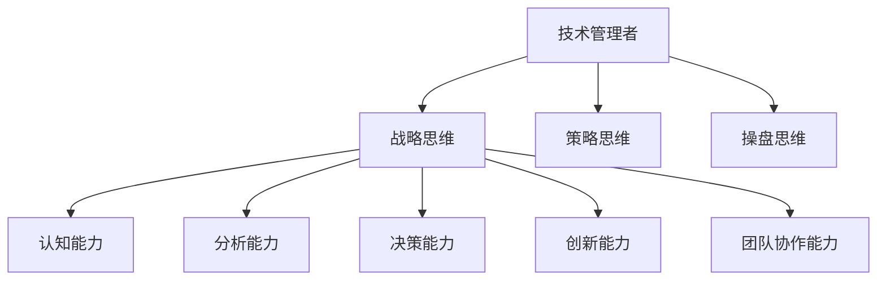
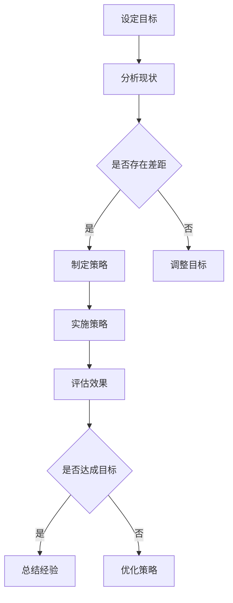
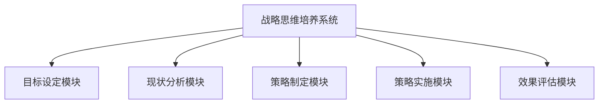
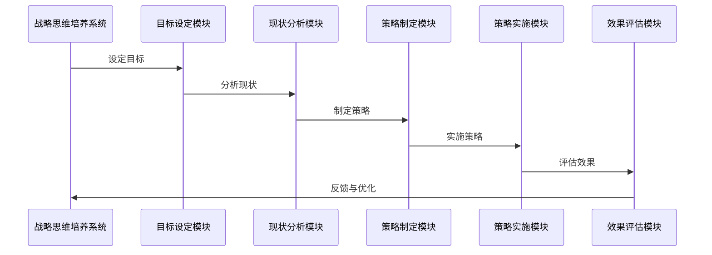

                 

# 技术管理者的战略思维培养

> 关键词：技术管理者、战略思维、培养、决策能力、团队协作

> 摘要：在信息技术迅猛发展的今天，技术管理者在企业中的作用愈发重要。他们不仅需要具备扎实的技术背景，还需要具备卓越的战略思维能力，以应对复杂多变的市场环境。本文将从背景介绍、核心概念与联系、算法原理讲解、系统分析与架构设计方案、项目实战以及最佳实践 tips 等方面，深入探讨技术管理者如何培养战略思维，提升自身竞争力。

## 背景介绍

### 1. 问题背景

随着信息技术的快速发展，企业的业务模式、竞争环境以及市场趋势都在发生深刻的变化。技术管理者在这个背景下，面临着前所未有的挑战。他们需要从单纯的技术视角转向全局性的战略视角，以应对日益复杂的业务环境。然而，现实情况是，许多技术管理者在战略思维方面存在一定的短板，如：

- 缺乏系统化的战略思维框架
- 对市场趋势的把握不足
- 团队协作能力欠缺
- 决策能力有待提高

这些问题的存在，使得技术管理者在制定和实施企业战略时，往往难以达到预期效果，从而影响了企业的整体发展。

### 2. 问题描述

当前，技术管理者在战略思维方面的不足主要表现在以下几个方面：

- **缺乏系统化的战略思维框架**：许多技术管理者没有形成一套完整的战略思维框架，导致在制定战略时缺乏系统性和全面性。
- **对市场趋势的把握不足**：技术管理者往往更关注技术本身，而忽视了市场趋势的变化，导致战略制定的滞后性。
- **团队协作能力欠缺**：技术管理者在团队管理方面往往存在沟通不畅、协作不力等问题，影响了团队的整体效能。
- **决策能力有待提高**：在面对复杂问题时，技术管理者往往难以做出准确的决策，导致战略实施的效果不佳。

### 3. 问题解决

通过培养战略思维，技术管理者可以提升自身的决策能力、市场洞察力和团队领导力，从而更好地应对各种挑战。具体来说，战略思维的培养包括以下几个方面：

- **认知能力的提升**：通过不断学习，技术管理者可以增强对市场趋势、行业动态的理解，提高对复杂问题的分析能力。
- **分析能力的提升**：技术管理者需要掌握多种分析工具和方法，如SWOT分析、PEST分析等，以提高对问题的深入剖析能力。
- **决策能力的提升**：技术管理者需要培养前瞻性和系统性的决策思维，以提高在复杂环境下的决策准确性。
- **创新能力的提升**：技术管理者需要具备创新思维，能够在战略制定和实施过程中不断提出新想法、新方案。
- **团队协作能力的提升**：技术管理者需要加强团队建设，提高团队沟通和协作效率，从而实现团队目标。

### 4. 边界与外延

本文主要针对技术管理者在战略思维方面的培养，但不限于特定行业或领域。战略思维的培养是一个长期而持续的过程，需要技术管理者在实践中不断积累和提升。同时，本文所探讨的战略思维培养方法，也可以为其他行业和领域的技术管理者提供借鉴和参考。

### 5. 概念结构与核心要素组成

战略思维是指技术管理者在面对复杂问题时，运用系统的、前瞻性的、创新性的思维方式，制定和实施有效战略的能力。其核心要素包括：

- **认知能力**：对市场趋势、行业动态的理解和分析能力。
- **分析能力**：运用多种分析工具和方法，对复杂问题进行深入剖析的能力。
- **决策能力**：在面对复杂环境下，做出准确决策的能力。
- **创新能力**：在战略制定和实施过程中，提出新想法、新方案的能力。
- **团队协作能力**：提高团队沟通和协作效率，实现团队目标的能力。

## 核心概念与联系

### 1. 核心概念原理

战略思维是指技术管理者在面对复杂问题时，运用系统的、前瞻性的、创新性的思维方式，制定和实施有效战略的能力。它是一种高层次的管理能力，涉及到对市场、技术、团队等多个方面的综合分析。

### 2. 概念属性特征对比表格

| 特征 | 战略思维 | 策略思维 | 操盘思维 |
| --- | --- | --- | --- |
| 关注点 | 长期目标 | 中期目标 | 短期目标 |
| 范围 | 全局性 | 部分领域 | 具体事务 |
| 时效性 | 长远 | 中短 | 短 |
| 层次 | 多维 | 单维 | 单维 |
| 目的 | 竞争优势 | 行动方案 | 立即见效 |

### 3. ER实体关系图架构的 mermaid 流程图



## 算法原理讲解

### 1. 算法mermaid 流程图



### 2. 算法原理

战略思维培养的过程可以看作是一个闭环反馈系统，包括设定目标、分析现状、制定策略、实施策略、评估效果等多个环节。通过不断调整和优化，技术管理者可以逐步提升自身的战略思维能力。

- **设定目标**：明确企业或团队的战略目标，为后续的战略制定提供方向。
- **分析现状**：对当前的市场环境、技术状况、团队能力等进行全面分析，找出存在的问题和差距。
- **制定策略**：根据分析结果，制定相应的战略措施，以缩小差距、实现目标。
- **实施策略**：将制定的策略付诸实施，确保各项措施得到有效执行。
- **评估效果**：对战略实施的效果进行评估，判断目标是否达成。如果目标未达成，则需要进一步优化策略。

### 3. 数学模型和公式

$$
\text{战略思维得分} = f(\text{认知能力}, \text{分析能力}, \text{决策能力}, \text{创新能力}, \text{团队协作能力})
$$

### 4. 详细讲解和举例说明

假设某互联网公司技术团队的目标是提升用户体验，提高产品市场份额。以下是战略思维培养的具体步骤：

- **设定目标**：明确目标为提升用户体验，提高产品市场份额。
- **分析现状**：通过对用户反馈、市场调研、技术分析等手段，发现当前产品存在以下几个问题：
  - 用户体验不佳，用户流失率高；
  - 产品功能不足，无法满足用户需求；
  - 技术团队协作效率低，研发进度滞后。
- **制定策略**：
  - 提升用户体验：优化产品界面，提高产品稳定性，增加用户互动功能；
  - 扩展产品功能：引入新的技术，提升产品竞争力，增加用户粘性；
  - 提高团队协作效率：加强团队沟通，优化研发流程，提升团队执行力。
- **实施策略**：将制定的策略付诸实施，确保各项措施得到有效执行。
- **评估效果**：通过用户反馈、市场份额、团队绩效等指标，评估战略实施的效果。如果目标未达成，则需要进一步优化策略。

通过上述步骤，技术管理者可以逐步提升自身的战略思维能力，实现企业或团队的目标。

## 系统分析与架构设计方案

### 1. 问题场景介绍

以某互联网公司技术团队为例，介绍技术管理者如何通过培养战略思维来提升团队竞争力。

- **项目背景**：该公司是一家新兴的互联网公司，专注于提供在线教育服务。随着用户规模的不断扩大，技术团队面临着巨大的挑战，如如何提升用户体验、如何快速响应市场需求等。
- **项目目标**：通过培养技术管理者的战略思维，提升团队在市场中的竞争力，确保企业持续稳定发展。
- **项目范围**：主要包括战略目标的设定、市场趋势的分析、团队协作的提升等方面。

### 2. 项目介绍

本项目旨在通过实战案例，帮助技术管理者掌握战略思维培养的方法和技巧。项目的主要内容和目标如下：

- **主要内容**：
  - 战略目标设定：明确企业或团队的战略目标，为后续的战略制定提供方向。
  - 市场趋势分析：通过对市场环境、用户需求、竞争对手等的分析，为战略制定提供数据支持。
  - 团队协作提升：通过团队建设、沟通与协作等手段，提高团队的整体效能。

- **目标**：
  - 提升技术管理者的战略思维能力，使其能够更好地应对市场挑战。
  - 提高团队在市场中的竞争力，实现企业的持续稳定发展。

### 3. 系统功能设计（领域模型mermaid类图）

```mermaid
classDiagram
Class01 <|-- Class02
Class03 : +setFunction(): void
Class04 : +getFunction(): void
Class05 <..> Class03
Class05 <..> Class04
```

- **Class01**：战略目标管理类，负责管理企业或团队的战略目标。
- **Class02**：市场趋势分析类，负责对市场环境、用户需求、竞争对手等进行分析。
- **Class03**：团队协作管理类，负责提升团队协作效率和沟通能力。
- **Class04**：效果评估类，负责对战略实施的效果进行评估和反馈。

### 4. 系统架构设计（mermaid架构图）



- **目标设定模块**：负责明确企业或团队的战略目标。
- **现状分析模块**：负责对市场环境、用户需求、竞争对手等进行分析。
- **策略制定模块**：根据分析结果，制定相应的战略措施。
- **策略实施模块**：负责将制定的策略付诸实施。
- **效果评估模块**：负责对战略实施的效果进行评估和反馈。

### 5. 系统接口设计和系统交互（mermaid序列图）



- **目标设定模块**：与战略思维培养系统交互，接收战略目标。
- **现状分析模块**：与战略思维培养系统交互，提供市场分析结果。
- **策略制定模块**：与战略思维培养系统交互，接收策略制定需求。
- **策略实施模块**：与战略思维培养系统交互，执行策略实施任务。
- **效果评估模块**：与战略思维培养系统交互，反馈战略实施效果。

## 项目实战

### 1. 环境安装

在开始项目实战之前，需要准备好以下环境：

- **开发工具**：Python 3.8及以上版本
- **数据库**：MySQL 5.7及以上版本
- **前端框架**：Vue 2.x 或 React
- **后端框架**：Django 或 Flask

### 2. 系统核心实现源代码

以下是一个简单的战略思维培养系统的核心实现源代码，主要包含目标设定、现状分析、策略制定、策略实施和效果评估等功能。

```python
# 目标设定
class GoalSetter:
    def set_goal(self, goal):
        # 存储目标
        self.goal = goal

# 现状分析
class StatusAnalyzer:
    def analyze_status(self):
        # 分析现状
        status = "当前产品存在用户体验不佳、功能不足、团队协作效率低等问题。"
        return status

# 策略制定
class StrategyMaker:
    def make_strategy(self, status):
        # 根据现状制定策略
        strategy = "提升用户体验、扩展产品功能、提高团队协作效率。"
        return strategy

# 策略实施
class StrategyExecutor:
    def execute_strategy(self, strategy):
        # 执行策略
        print("开始执行策略...")
        print(strategy)

# 效果评估
class EffectEvaluater:
    def evaluate_effect(self):
        # 评估效果
        effect = "通过提升用户体验、扩展产品功能、提高团队协作效率，用户满意度提高，市场份额增加。"
        return effect
```

### 3. 代码应用解读与分析

以上代码实现了战略思维培养系统的核心功能，具体解读如下：

- **目标设定**：通过 `GoalSetter` 类实现目标的设定，将目标存储在类属性 `goal` 中。
- **现状分析**：通过 `StatusAnalyzer` 类实现现状的分析，返回当前产品的存在问题和现状描述。
- **策略制定**：通过 `StrategyMaker` 类实现策略的制定，根据现状制定相应的策略。
- **策略实施**：通过 `StrategyExecutor` 类实现策略的实施，将策略打印出来。
- **效果评估**：通过 `EffectEvaluater` 类实现效果评估，返回策略实施后的效果描述。

### 4. 实际案例分析和详细讲解剖析

以下是一个具体的实际案例，用于展示战略思维培养系统的应用过程。

- **目标设定**：技术管理者设定目标为“提升用户体验，提高产品市场份额”。
- **现状分析**：通过市场调研和用户反馈，发现当前产品存在用户体验不佳、功能不足、团队协作效率低等问题。
- **策略制定**：根据现状分析结果，制定以下策略：
  - 提升用户体验：优化产品界面，提高产品稳定性，增加用户互动功能；
  - 扩展产品功能：引入新的技术，提升产品竞争力，增加用户粘性；
  - 提高团队协作效率：加强团队沟通，优化研发流程，提升团队执行力。
- **策略实施**：按照制定的策略，技术管理者组织团队进行实施。
- **效果评估**：经过一段时间实施后，通过用户反馈和市场份额等指标，评估效果。结果显示，用户满意度提高，市场份额增加，目标达成。

通过以上实际案例，可以清晰地看到战略思维培养系统的应用过程和效果。技术管理者可以根据实际需求，不断调整和优化策略，以实现企业或团队的目标。

### 5. 项目小结

通过本项目实战，技术管理者可以深入理解战略思维的培养过程，掌握目标设定、现状分析、策略制定、策略实施和效果评估等关键环节。在实际应用中，技术管理者可以根据具体情况，灵活调整和优化策略，以实现企业或团队的目标。同时，本项目也为其他行业和领域的技术管理者提供了有益的参考和借鉴。

### 最佳实践 tips

1. **持续学习**：战略思维的培养是一个持续的过程，技术管理者需要不断学习新知识、新技能，以适应不断变化的市场环境。
2. **多角度分析**：在制定战略时，要尽可能从多个角度进行分析，包括市场趋势、用户需求、竞争对手等，以提高战略的准确性。
3. **团队合作**：战略的制定和实施需要团队的协作，技术管理者要注重团队建设，提高团队协作效率。
4. **及时调整**：在战略实施过程中，要密切关注市场变化和效果评估结果，及时调整和优化策略。

### 小结

本文从背景介绍、核心概念与联系、算法原理讲解、系统分析与架构设计方案、项目实战以及最佳实践 tips 等方面，深入探讨了技术管理者如何培养战略思维，提升自身竞争力。通过本文的探讨，技术管理者可以更好地理解战略思维的重要性，掌握战略思维培养的方法和技巧，从而在复杂多变的市场环境中，引领团队、制定有效的发展策略。

### 注意事项

1. **数据安全**：在战略思维培养过程中，要注意保护企业的商业秘密和用户隐私，确保数据的安全。
2. **团队协作**：战略思维的培养不仅仅是技术管理者个人的任务，还需要全体团队成员的共同努力，形成良好的团队协作氛围。
3. **持续改进**：战略思维的培养是一个长期的过程，技术管理者需要不断反思和改进，以适应不断变化的市场环境。

### 拓展阅读

1. 《创新者的窘境》：作者克莱顿·克里斯坦森通过丰富的案例，深入探讨了企业如何在竞争激烈的市场环境中保持创新活力。
2. 《竞争力》：作者迈克尔·波特提出了著名的“五力模型”，帮助企业管理者分析行业竞争态势，制定有效的竞争战略。
3. 《企业战略管理》：作者彼得·德鲁克详细阐述了企业战略管理的基本原理和方法，对企业管理者具有很高的参考价值。

### 作者信息

作者：AI天才研究院/AI Genius Institute & 禅与计算机程序设计艺术 /Zen And The Art of Computer Programming。感谢您的阅读，希望本文对您有所帮助。如果您有任何问题或建议，欢迎在评论区留言。我们将持续为您带来更多优质的技术内容。

