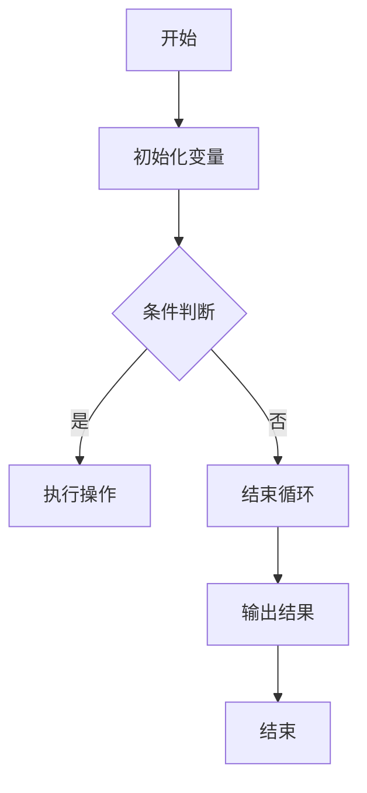

                 

# 技术管理者的职业规划指南

## 关键词
- 技术管理者
- 职业发展
- 项目管理
- 技术趋势
- 团队管理
- 算法原理

## 摘要
本文旨在为技术管理者提供一份详细的职业规划指南。我们将深入探讨技术管理者的角色定位、核心技能、项目管理方法、技术趋势分析、团队管理以及算法原理等方面的内容。通过系统性地梳理和详细讲解，帮助技术管理者更好地规划职业生涯，提升个人能力和团队绩效。

## 引言与背景介绍

### 第1章：技术管理者的职业发展概述

#### 1.1 问题背景
在现代企业中，技术已经成为驱动业务发展的核心动力。随着技术的不断进步和市场竞争的加剧，技术管理者在企业中扮演着越来越重要的角色。然而，技术管理者的职业发展面临着诸多挑战，包括如何平衡技术和管理职责、提升团队绩效、应对技术变革等。

#### 1.2 问题描述
技术管理者在职业发展过程中常常会遇到以下问题：
- 技术与管理如何有效结合？
- 如何提升自身的领导力和管理能力？
- 如何把握技术趋势，推动团队创新？
- 如何构建高效的技术团队，实现团队协作与沟通？

#### 1.3 问题解决
要解决上述问题，技术管理者需要：
- 明确角色定位，理解技术与管理之间的关系。
- 持续提升技术能力，跟踪技术发展趋势。
- 加强管理能力，学会运用项目管理方法。
- 注重团队建设，提升团队协作与沟通效率。

#### 1.4 边界与外延
技术管理者的职业规划不仅涉及个人技能的提升，还包括职业目标的设定、职业路径的规划、职业发展的评估等方面。同时，技术管理者还需要关注行业趋势、市场需求以及企业战略，以确保个人职业规划与企业发展方向相一致。

#### 1.5 核心概念
- 技术管理者：负责技术团队的管理和领导，具备深厚的技术背景和优秀的管理能力。
- 职业发展：个人在职业生涯中的成长和进步，包括技能提升、职位晋升、职业目标实现等。
- 项目管理：确保项目按照计划顺利进行，包括项目规划、资源管理、风险管理、进度控制等。

### 第2章：技术管理者角色定位

#### 2.1 技术管理者角色
技术管理者在企业中通常扮演以下角色：
- 技术专家：掌握核心技术，解决技术难题，推动技术创新。
- 管理者：负责团队管理，制定工作计划，协调团队协作。
- 领导者：激发团队潜力，建立团队文化，引领团队发展。

#### 2.2 技术与管理的结合
技术与管理并非相互独立，而是相互促进、相辅相成的。技术管理者需要：
- 深入理解技术，把握技术发展趋势。
- 学会管理方法，运用项目管理工具。
- 平衡技术与管理，确保团队效率和项目成功。

#### 2.3 职业发展规划的重要性
职业发展规划对技术管理者具有重要意义：
- 明确职业目标，有助于制定长期发展计划。
- 提升个人能力，增强职业竞争力。
- 促进职业成长，实现职位晋升和薪酬提升。

## 核心概念与联系

### 第3章：技术管理者的核心技能

#### 3.1 技术能力
技术能力是技术管理者的基础。技术管理者需要：
- 熟悉主流编程语言和开发框架。
- 掌握常用数据库和中间件。
- 了解前沿技术，如人工智能、大数据、云计算等。

#### 3.2 管理能力
管理能力是技术管理者的重要素质。技术管理者需要：
- 学会项目管理和团队管理。
- 提升沟通和协作能力。
- 具备决策和问题解决能力。

#### 3.3 领导力
领导力是技术管理者成功的关键。技术管理者需要：
- 建立团队文化，激发员工潜力。
- 培养下属，提升团队整体能力。
- 引领团队，实现企业战略目标。

### 第4章：项目管理

#### 4.1 项目管理基础
项目管理是技术管理者的重要职责。技术管理者需要：
- 理解项目生命周期，包括项目启动、计划、执行、监控和收尾。
- 学习项目管理方法论，如敏捷开发、瀑布模型等。
- 熟悉项目管理工具，如JIRA、Trello等。

#### 4.2 项目管理方法论
项目管理方法论对项目成功至关重要。技术管理者需要：
- 选择合适的项目管理方法论，根据项目特点进行调整。
- 运用敏捷开发方法，快速响应市场变化。
- 建立迭代和反馈机制，持续优化项目过程。

#### 4.3 项目管理工具与技术
项目管理工具和技术能够提高项目效率。技术管理者需要：
- 学习使用项目管理工具，如JIRA、Trello等。
- 掌握项目进度控制技术，如关键路径法、敏捷任务管理等。
- 运用风险管理技术，降低项目风险。

### 第5章：技术趋势分析

#### 5.1 人工智能技术
人工智能技术是未来发展的关键领域。技术管理者需要：
- 关注人工智能技术的最新进展。
- 了解人工智能技术在业务中的应用场景。
- 培养团队的人工智能技术能力。

#### 5.2 云计算与大数据
云计算和大数据技术正在深刻改变企业运营模式。技术管理者需要：
- 掌握云计算技术和架构设计。
- 学习大数据处理和分析方法。
- 探索云计算和大数据在业务中的应用。

#### 5.3 区块链技术
区块链技术具有巨大的潜力。技术管理者需要：
- 了解区块链的基本原理和应用场景。
- 关注区块链技术的发展趋势。
- 探索区块链技术在业务中的应用。

### 第6章：技术团队管理

#### 6.1 团队建设
团队建设是技术管理者的重要任务。技术管理者需要：
- 确定团队目标，明确团队发展方向。
- 建立团队文化，增强团队凝聚力。
- 提升团队沟通与协作能力。

#### 6.2 成员角色与职责
明确团队成员的角色与职责对团队运作至关重要。技术管理者需要：
- 分配任务，确保每个成员都能发挥所长。
- 明确职责边界，避免角色冲突。
- 建立清晰的绩效评估机制。

#### 6.3 团队协作与沟通
团队协作与沟通是团队成功的关键。技术管理者需要：
- 采用合适的沟通工具，如Slack、Microsoft Teams等。
- 建立定期的团队会议和反馈机制。
- 鼓励团队成员分享知识和经验。

## 技术原理与数学模型讲解

### 第7章：算法原理讲解

#### 7.1 算法基本概念
算法是解决问题的一系列有序步骤。技术管理者需要：
- 理解算法的基本概念，如输入、输出、算法复杂度等。
- 学习常见的算法分类，如排序算法、搜索算法等。

#### 7.2 算法分析
算法分析是评估算法性能的重要方法。技术管理者需要：
- 掌握算法时间复杂度和空间复杂度的计算方法。
- 学会使用大O符号表示算法复杂度。

#### 7.3 算法设计
算法设计是解决问题的关键。技术管理者需要：
- 学习常见的算法设计技巧，如分治法、动态规划等。
- 练习设计简单到复杂的算法，提升算法设计能力。

#### 7.4 算法流程图
算法流程图是描述算法步骤的有效工具。技术管理者需要：
- 学会使用Mermaid等工具绘制算法流程图。
- 理解算法流程图的基本结构，如顺序结构、条件结构等。

#### 7.5 Python实现
Python是实现算法的常用语言。技术管理者需要：
- 学习Python编程基础，如数据类型、控制结构等。
- 练习使用Python实现常见的算法，如快速排序、二分搜索等。

### 第8章：数学模型讲解

#### 8.1 数学模型基础
数学模型是描述现实世界问题的抽象工具。技术管理者需要：
- 理解数学模型的基本概念，如线性模型、非线性模型等。
- 学习常见的数学模型，如线性规划、决策树等。

#### 8.2 数学公式与定理
数学公式与定理是构建数学模型的基础。技术管理者需要：
- 掌握常用的数学公式和定理，如微积分公式、概率论定理等。
- 学会如何应用数学公式和定理解决实际问题。

#### 8.3 模型应用与举例
数学模型的应用能够提高决策效率。技术管理者需要：
- 了解数学模型在不同领域的应用，如经济学、工程学等。
- 练习使用数学模型解决实际问题，如需求预测、资源优化等。

## 实战案例与应用

### 第9章：项目实战

#### 9.1 项目介绍
本节将介绍一个实际项目，包括项目背景、目标、需求分析等内容。技术管理者需要：
- 理解项目的整体架构和功能模块。
- 分析项目的技术难点和解决方案。

#### 9.2 系统功能设计
系统功能设计是项目成功的关键。技术管理者需要：
- 绘制领域模型类图，明确系统的功能模块和类关系。
- 设计系统的接口和交互，确保各模块之间的协同工作。

#### 9.3 系统架构设计
系统架构设计是项目的重要环节。技术管理者需要：
- 绘制系统架构图，明确各模块的职责和交互方式。
- 选择合适的架构模式，如MVC、微服务架构等。

#### 9.4 系统实现与调试
系统实现与调试是项目的核心工作。技术管理者需要：
- 编写详细的实现代码，确保代码的规范性和可维护性。
- 进行系统的集成和测试，确保系统的稳定性和可靠性。

#### 9.5 项目评估与优化
项目评估与优化是项目完成的最后一步。技术管理者需要：
- 对项目进行全面的评估，包括功能实现、性能优化、用户体验等。
- 根据评估结果进行优化，提升系统的质量和效率。

### 第10章：案例分析

#### 10.1 案例背景
本节将分析一个实际案例，包括案例背景、问题分析、解决方案等内容。技术管理者需要：
- 理解案例的业务场景和需求。
- 分析案例中遇到的问题和挑战。

#### 10.2 案例分析
案例分析是对实际问题的深入探讨。技术管理者需要：
- 分析案例的解决方案，包括技术方案、项目管理方法等。
- 总结案例的教训和经验，为未来的项目提供参考。

#### 10.3 案例解读
案例解读是对案例的深入理解和解读。技术管理者需要：
- 从技术、管理和领导力等方面解读案例。
- 提出改进建议，为实际工作提供指导。

## 最佳实践与总结

### 第11章：最佳实践

#### 11.1 技术实践
技术实践是技术管理者的重要工作。技术管理者需要：
- 实践前沿技术，提升自身技术能力。
- 探索新技术在业务中的应用，推动技术创新。

#### 11.2 管理实践
管理实践是技术管理者的重要任务。技术管理者需要：
- 学习先进的管理方法，提升管理能力。
- 实践团队管理，提升团队绩效。

#### 11.3 领导实践
领导实践是技术管理者的核心素质。技术管理者需要：
- 建立团队文化，激发团队潜力。
- 培养下属，提升团队整体能力。

### 第12章：总结与展望

#### 12.1 成果总结
技术管理者需要：
- 总结个人和团队的工作成果，包括技术突破、项目成功等。
- 评估工作成果，为未来的职业发展提供依据。

#### 12.2 遇到的问题与解决
技术管理者需要：
- 反思工作中遇到的问题和挑战，包括技术难题、管理困境等。
- 分析问题原因，提出解决方案。

#### 12.3 展望未来发展趋势
技术管理者需要：
- 关注行业发展趋势，提前布局。
- 深入研究新技术，提升个人和团队竞争力。

### 第13章：附录

#### 13.1 参考文献
技术管理者需要：
- 引用权威的参考资料，提升文章质量。
- 总结参考文献，为读者提供进一步学习的机会。

#### 13.2 鸣谢
技术管理者需要：
- 感谢合作者、指导者、团队成员的支持和帮助。
- 表达对他们的敬意和感谢。

#### 13.3 索引
技术管理者需要：
- 编制索引，方便读者查找相关内容。
- 确保文章内容的系统性和完整性。

## 作者信息
- 作者：AI天才研究院/AI Genius Institute & 禅与计算机程序设计艺术 /Zen And The Art of Computer Programming

### 第1章：技术管理者的职业发展概述

#### 1.1 问题背景
在当今快速发展的技术时代，技术管理者的角色越来越受到重视。他们不仅需要具备深厚的技术背景，还需要具备优秀的管理能力和领导力。技术管理者的职业发展面临着诸多挑战，包括如何在技术和管理之间找到平衡点、如何提升团队绩效、如何应对技术变革等。为了更好地解决这些问题，技术管理者需要有一份详细的职业规划指南。

#### 1.2 问题描述
技术管理者在职业发展过程中可能会遇到以下问题：
1. 技术与管理如何有效结合？
2. 如何提升自身的领导力和管理能力？
3. 如何把握技术趋势，推动团队创新？
4. 如何构建高效的技术团队，实现团队协作与沟通？

#### 1.3 问题解决
为了解决上述问题，技术管理者可以采取以下策略：
1. 明确角色定位，理解技术与管理之间的关系。
2. 持续提升技术能力，跟踪技术发展趋势。
3. 加强管理能力，学会运用项目管理方法。
4. 注重团队建设，提升团队协作与沟通效率。

#### 1.4 边界与外延
技术管理者的职业规划不仅涉及个人技能的提升，还包括职业目标的设定、职业路径的规划、职业发展的评估等方面。同时，技术管理者还需要关注行业趋势、市场需求以及企业战略，以确保个人职业规划与企业发展方向相一致。

#### 1.5 核心概念
1. 技术管理者：负责技术团队的管理和领导，具备深厚的技术背景和优秀的管理能力。
2. 职业发展：个人在职业生涯中的成长和进步，包括技能提升、职位晋升、职业目标实现等。
3. 项目管理：确保项目按照计划顺利进行，包括项目规划、资源管理、风险管理、进度控制等。

### 第2章：技术管理者角色定位

#### 2.1 技术管理者角色
技术管理者在企业中通常扮演以下角色：
1. 技术专家：掌握核心技术，解决技术难题，推动技术创新。
2. 管理者：负责团队管理，制定工作计划，协调团队协作。
3. 领导者：激发团队潜力，建立团队文化，引领团队发展。

#### 2.2 技术与管理的结合
技术与管理并非相互独立，而是相互促进、相辅相成的。技术管理者需要：
1. 深入理解技术，把握技术发展趋势。
2. 学会管理方法，运用项目管理工具。
3. 平衡技术与管理，确保团队效率和项目成功。

#### 2.3 职业发展规划的重要性
职业发展规划对技术管理者具有重要意义：
1. 明确职业目标，有助于制定长期发展计划。
2. 提升个人能力，增强职业竞争力。
3. 促进职业成长，实现职位晋升和薪酬提升。

### 第3章：技术管理者的核心技能

#### 3.1 技术能力
技术能力是技术管理者的基础。技术管理者需要：
1. 熟悉主流编程语言和开发框架。
2. 掌握常用数据库和中间件。
3. 了解前沿技术，如人工智能、大数据、云计算等。

#### 3.2 管理能力
管理能力是技术管理者的重要素质。技术管理者需要：
1. 学会项目管理和团队管理。
2. 提升沟通和协作能力。
3. 具备决策和问题解决能力。

#### 3.3 领导力
领导力是技术管理者成功的关键。技术管理者需要：
1. 建立团队文化，激发员工潜力。
2. 培养下属，提升团队整体能力。
3. 引领团队，实现企业战略目标。

### 第4章：项目管理

#### 4.1 项目管理基础
项目管理是技术管理者的重要职责。技术管理者需要：
1. 理解项目生命周期，包括项目启动、计划、执行、监控和收尾。
2. 学习项目管理方法论，如敏捷开发、瀑布模型等。
3. 熟悉项目管理工具，如JIRA、Trello等。

#### 4.2 项目管理方法论
项目管理方法论对项目成功至关重要。技术管理者需要：
1. 选择合适的项目管理方法论，根据项目特点进行调整。
2. 运用敏捷开发方法，快速响应市场变化。
3. 建立迭代和反馈机制，持续优化项目过程。

#### 4.3 项目管理工具与技术
项目管理工具和技术能够提高项目效率。技术管理者需要：
1. 学习使用项目管理工具，如JIRA、Trello等。
2. 掌握项目进度控制技术，如关键路径法、敏捷任务管理等。
3. 运用风险管理技术，降低项目风险。

### 第5章：技术趋势分析

#### 5.1 人工智能技术
人工智能技术是未来发展的关键领域。技术管理者需要：
1. 关注人工智能技术的最新进展。
2. 了解人工智能技术在业务中的应用场景。
3. 培养团队的人工智能技术能力。

#### 5.2 云计算与大数据
云计算和大数据技术正在深刻改变企业运营模式。技术管理者需要：
1. 掌握云计算技术和架构设计。
2. 学习大数据处理和分析方法。
3. 探索云计算和大数据在业务中的应用。

#### 5.3 区块链技术
区块链技术具有巨大的潜力。技术管理者需要：
1. 了解区块链的基本原理和应用场景。
2. 关注区块链技术的发展趋势。
3. 探索区块链技术在业务中的应用。

### 第6章：技术团队管理

#### 6.1 团队建设
团队建设是技术管理者的重要任务。技术管理者需要：
1. 确定团队目标，明确团队发展方向。
2. 建立团队文化，增强团队凝聚力。
3. 提升团队沟通与协作能力。

#### 6.2 成员角色与职责
明确团队成员的角色与职责对团队运作至关重要。技术管理者需要：
1. 分配任务，确保每个成员都能发挥所长。
2. 明确职责边界，避免角色冲突。
3. 建立清晰的绩效评估机制。

#### 6.3 团队协作与沟通
团队协作与沟通是团队成功的关键。技术管理者需要：
1. 采用合适的沟通工具，如Slack、Microsoft Teams等。
2. 建立定期的团队会议和反馈机制。
3. 鼓励团队成员分享知识和经验。

### 第7章：算法原理讲解

#### 7.1 算法基本概念
算法是解决问题的一系列有序步骤。技术管理者需要：
1. 理解算法的基本概念，如输入、输出、算法复杂度等。
2. 学习常见的算法分类，如排序算法、搜索算法等。

#### 7.2 算法分析
算法分析是评估算法性能的重要方法。技术管理者需要：
1. 掌握算法时间复杂度和空间复杂度的计算方法。
2. 学会使用大O符号表示算法复杂度。

#### 7.3 算法设计
算法设计是解决问题的关键。技术管理者需要：
1. 学习常见的算法设计技巧，如分治法、动态规划等。
2. 练习设计简单到复杂的算法，提升算法设计能力。

#### 7.4 算法流程图
算法流程图是描述算法步骤的有效工具。技术管理者需要：
1. 学会使用Mermaid等工具绘制算法流程图。
2. 理解算法流程图的基本结构，如顺序结构、条件结构等。

#### 7.5 Python实现
Python是实现算法的常用语言。技术管理者需要：
1. 学习Python编程基础，如数据类型、控制结构等。
2. 练习使用Python实现常见的算法，如快速排序、二分搜索等。

### 第8章：数学模型讲解

#### 8.1 数学模型基础
数学模型是描述现实世界问题的抽象工具。技术管理者需要：
1. 理解数学模型的基本概念，如线性模型、非线性模型等。
2. 学习常见的数学模型，如线性规划、决策树等。

#### 8.2 数学公式与定理
数学公式与定理是构建数学模型的基础。技术管理者需要：
1. 掌握常用的数学公式和定理，如微积分公式、概率论定理等。
2. 学会如何应用数学公式和定理解决实际问题。

#### 8.3 模型应用与举例
数学模型的应用能够提高决策效率。技术管理者需要：
1. 了解数学模型在不同领域的应用，如经济学、工程学等。
2. 练习使用数学模型解决实际问题，如需求预测、资源优化等。

### 第9章：项目实战

#### 9.1 项目介绍
本节将介绍一个实际项目，包括项目背景、目标、需求分析等内容。技术管理者需要：
1. 理解项目的整体架构和功能模块。
2. 分析项目的技术难点和解决方案。

#### 9.2 系统功能设计
系统功能设计是项目成功的关键。技术管理者需要：
1. 绘制领域模型类图，明确系统的功能模块和类关系。
2. 设计系统的接口和交互，确保各模块之间的协同工作。

#### 9.3 系统架构设计
系统架构设计是项目的重要环节。技术管理者需要：
1. 绘制系统架构图，明确各模块的职责和交互方式。
2. 选择合适的架构模式，如MVC、微服务架构等。

#### 9.4 系统实现与调试
系统实现与调试是项目的核心工作。技术管理者需要：
1. 编写详细的实现代码，确保代码的规范性和可维护性。
2. 进行系统的集成和测试，确保系统的稳定性和可靠性。

#### 9.5 项目评估与优化
项目评估与优化是项目完成的最后一步。技术管理者需要：
1. 对项目进行全面的评估，包括功能实现、性能优化、用户体验等。
2. 根据评估结果进行优化，提升系统的质量和效率。

### 第10章：案例分析

#### 10.1 案例背景
本节将分析一个实际案例，包括案例背景、问题分析、解决方案等内容。技术管理者需要：
1. 理解案例的业务场景和需求。
2. 分析案例中遇到的问题和挑战。

#### 10.2 案例分析
案例分析是对实际问题的深入探讨。技术管理者需要：
1. 分析案例的解决方案，包括技术方案、项目管理方法等。
2. 总结案例的教训和经验，为未来的项目提供参考。

#### 10.3 案例解读
案例解读是对案例的深入理解和解读。技术管理者需要：
1. 从技术、管理和领导力等方面解读案例。
2. 提出改进建议，为实际工作提供指导。

### 第11章：最佳实践

#### 11.1 技术实践
技术实践是技术管理者的重要工作。技术管理者需要：
1. 实践前沿技术，提升自身技术能力。
2. 探索新技术在业务中的应用，推动技术创新。

#### 11.2 管理实践
管理实践是技术管理者的重要任务。技术管理者需要：
1. 学习先进的管理方法，提升管理能力。
2. 实践团队管理，提升团队绩效。

#### 11.3 领导实践
领导实践是技术管理者的核心素质。技术管理者需要：
1. 建立团队文化，激发员工潜力。
2. 培养下属，提升团队整体能力。
3. 引领团队，实现企业战略目标。

### 第12章：总结与展望

#### 12.1 成果总结
技术管理者需要：
1. 总结个人和团队的工作成果，包括技术突破、项目成功等。
2. 评估工作成果，为未来的职业发展提供依据。

#### 12.2 遇到的问题与解决
技术管理者需要：
1. 反思工作中遇到的问题和挑战，包括技术难题、管理困境等。
2. 分析问题原因，提出解决方案。

#### 12.3 展望未来发展趋势
技术管理者需要：
1. 关注行业发展趋势，提前布局。
2. 深入研究新技术，提升个人和团队竞争力。

### 第13章：附录

#### 13.1 参考文献
技术管理者需要：
1. 引用权威的参考资料，提升文章质量。
2. 总结参考文献，为读者提供进一步学习的机会。

#### 13.2 鸣谢
技术管理者需要：
1. 感谢合作者、指导者、团队成员的支持和帮助。
2. 表达对他们的敬意和感谢。

#### 13.3 索引
技术管理者需要：
1. 编制索引，方便读者查找相关内容。
2. 确保文章内容的系统性和完整性。## 目录

### 第一部分：引言与背景介绍

#### 第1章：技术管理者的职业发展概述
- 1.1 问题背景
- 1.2 问题描述
- 1.3 问题解决
- 1.4 边界与外延
- 1.5 核心概念

#### 第2章：技术管理者角色定位
- 2.1 技术管理者角色
- 2.2 技术与管理的结合
- 2.3 职业发展规划的重要性

#### 第3章：技术管理者的核心技能
- 3.1 技术能力
- 3.2 管理能力
- 3.3 领导力

### 第二部分：核心概念与联系

#### 第4章：项目管理
- 4.1 项目管理基础
- 4.2 项目管理方法论
- 4.3 项目管理工具与技术

#### 第5章：技术趋势分析
- 5.1 人工智能技术
- 5.2 云计算与大数据
- 5.3 区块链技术

#### 第6章：技术团队管理
- 6.1 团队建设
- 6.2 成员角色与职责
- 6.3 团队协作与沟通

### 第三部分：技术原理与数学模型讲解

#### 第7章：算法原理讲解
- 7.1 算法基本概念
- 7.2 算法分析
- 7.3 算法设计
- 7.4 算法流程图
- 7.5 Python实现

#### 第8章：数学模型讲解
- 8.1 数学模型基础
- 8.2 数学公式与定理
- 8.3 模型应用与举例

### 第四部分：实战案例与应用

#### 第9章：项目实战
- 9.1 项目介绍
- 9.2 系统功能设计
- 9.3 系统架构设计
- 9.4 系统实现与调试
- 9.5 项目评估与优化

#### 第10章：案例分析
- 10.1 案例背景
- 10.2 案例分析
- 10.3 案例解读

### 第五部分：最佳实践与总结

#### 第11章：最佳实践
- 11.1 技术实践
- 11.2 管理实践
- 11.3 领导实践

#### 第12章：总结与展望
- 12.1 成果总结
- 12.2 遇到的问题与解决
- 12.3 展望未来发展趋势

#### 第13章：附录
- 13.1 参考文献
- 13.2 鸣谢
- 13.3 索引

### 第1章：技术管理者的职业发展概述

#### 1.1 问题背景
在当今快速发展的技术时代，技术管理者的角色越来越受到重视。他们不仅需要具备深厚的技术背景，还需要具备优秀的管理能力和领导力。技术管理者的职业发展面临着诸多挑战，包括如何在技术和管理之间找到平衡点、如何提升团队绩效、如何应对技术变革等。为了更好地解决这些问题，技术管理者需要有一份详细的职业规划指南。

#### 1.2 问题描述
技术管理者在职业发展过程中可能会遇到以下问题：
1. 技术与管理如何有效结合？
2. 如何提升自身的领导力和管理能力？
3. 如何把握技术趋势，推动团队创新？
4. 如何构建高效的技术团队，实现团队协作与沟通？

#### 1.3 问题解决
为了解决上述问题，技术管理者可以采取以下策略：
1. 明确角色定位，理解技术与管理之间的关系。
2. 持续提升技术能力，跟踪技术发展趋势。
3. 加强管理能力，学会运用项目管理方法。
4. 注重团队建设，提升团队协作与沟通效率。

#### 1.4 边界与外延
技术管理者的职业规划不仅涉及个人技能的提升，还包括职业目标的设定、职业路径的规划、职业发展的评估等方面。同时，技术管理者还需要关注行业趋势、市场需求以及企业战略，以确保个人职业规划与企业发展方向相一致。

#### 1.5 核心概念
1. 技术管理者：负责技术团队的管理和领导，具备深厚的技术背景和优秀的管理能力。
2. 职业发展：个人在职业生涯中的成长和进步，包括技能提升、职位晋升、职业目标实现等。
3. 项目管理：确保项目按照计划顺利进行，包括项目规划、资源管理、风险管理、进度控制等。

### 第2章：技术管理者角色定位

#### 2.1 技术管理者角色
技术管理者在企业中通常扮演以下角色：
1. 技术专家：掌握核心技术，解决技术难题，推动技术创新。
2. 管理者：负责团队管理，制定工作计划，协调团队协作。
3. 领导者：激发团队潜力，建立团队文化，引领团队发展。

#### 2.2 技术与管理的结合
技术与管理并非相互独立，而是相互促进、相辅相成的。技术管理者需要：
1. 深入理解技术，把握技术发展趋势。
2. 学会管理方法，运用项目管理工具。
3. 平衡技术与管理，确保团队效率和项目成功。

#### 2.3 职业发展规划的重要性
职业发展规划对技术管理者具有重要意义：
1. 明确职业目标，有助于制定长期发展计划。
2. 提升个人能力，增强职业竞争力。
3. 促进职业成长，实现职位晋升和薪酬提升。

### 第3章：技术管理者的核心技能

#### 3.1 技术能力
技术能力是技术管理者的基础。技术管理者需要：
1. 熟悉主流编程语言和开发框架。
2. 掌握常用数据库和中间件。
3. 了解前沿技术，如人工智能、大数据、云计算等。

#### 3.2 管理能力
管理能力是技术管理者的重要素质。技术管理者需要：
1. 学会项目管理和团队管理。
2. 提升沟通和协作能力。
3. 具备决策和问题解决能力。

#### 3.3 领导力
领导力是技术管理者成功的关键。技术管理者需要：
1. 建立团队文化，激发员工潜力。
2. 培养下属，提升团队整体能力。
3. 引领团队，实现企业战略目标。

### 第4章：项目管理

#### 4.1 项目管理基础
项目管理是技术管理者的重要职责。技术管理者需要：
1. 理解项目生命周期，包括项目启动、计划、执行、监控和收尾。
2. 学习项目管理方法论，如敏捷开发、瀑布模型等。
3. 熟悉项目管理工具，如JIRA、Trello等。

#### 4.2 项目管理方法论
项目管理方法论对项目成功至关重要。技术管理者需要：
1. 选择合适的项目管理方法论，根据项目特点进行调整。
2. 运用敏捷开发方法，快速响应市场变化。
3. 建立迭代和反馈机制，持续优化项目过程。

#### 4.3 项目管理工具与技术
项目管理工具和技术能够提高项目效率。技术管理者需要：
1. 学习使用项目管理工具，如JIRA、Trello等。
2. 掌握项目进度控制技术，如关键路径法、敏捷任务管理等。
3. 运用风险管理技术，降低项目风险。

### 第5章：技术趋势分析

#### 5.1 人工智能技术
人工智能技术是未来发展的关键领域。技术管理者需要：
1. 关注人工智能技术的最新进展。
2. 了解人工智能技术在业务中的应用场景。
3. 培养团队的人工智能技术能力。

#### 5.2 云计算与大数据
云计算和大数据技术正在深刻改变企业运营模式。技术管理者需要：
1. 掌握云计算技术和架构设计。
2. 学习大数据处理和分析方法。
3. 探索云计算和大数据在业务中的应用。

#### 5.3 区块链技术
区块链技术具有巨大的潜力。技术管理者需要：
1. 了解区块链的基本原理和应用场景。
2. 关注区块链技术的发展趋势。
3. 探索区块链技术在业务中的应用。

### 第6章：技术团队管理

#### 6.1 团队建设
团队建设是技术管理者的重要任务。技术管理者需要：
1. 确定团队目标，明确团队发展方向。
2. 建立团队文化，增强团队凝聚力。
3. 提升团队沟通与协作能力。

#### 6.2 成员角色与职责
明确团队成员的角色与职责对团队运作至关重要。技术管理者需要：
1. 分配任务，确保每个成员都能发挥所长。
2. 明确职责边界，避免角色冲突。
3. 建立清晰的绩效评估机制。

#### 6.3 团队协作与沟通
团队协作与沟通是团队成功的关键。技术管理者需要：
1. 采用合适的沟通工具，如Slack、Microsoft Teams等。
2. 建立定期的团队会议和反馈机制。
3. 鼓励团队成员分享知识和经验。

### 第7章：算法原理讲解

#### 7.1 算法基本概念
算法是解决问题的一系列有序步骤。技术管理者需要：
1. 理解算法的基本概念，如输入、输出、算法复杂度等。
2. 学习常见的算法分类，如排序算法、搜索算法等。

#### 7.2 算法分析
算法分析是评估算法性能的重要方法。技术管理者需要：
1. 掌握算法时间复杂度和空间复杂度的计算方法。
2. 学会使用大O符号表示算法复杂度。

#### 7.3 算法设计
算法设计是解决问题的关键。技术管理者需要：
1. 学习常见的算法设计技巧，如分治法、动态规划等。
2. 练习设计简单到复杂的算法，提升算法设计能力。

#### 7.4 算法流程图
算法流程图是描述算法步骤的有效工具。技术管理者需要：
1. 学会使用Mermaid等工具绘制算法流程图。
2. 理解算法流程图的基本结构，如顺序结构、条件结构等。

#### 7.5 Python实现
Python是实现算法的常用语言。技术管理者需要：
1. 学习Python编程基础，如数据类型、控制结构等。
2. 练习使用Python实现常见的算法，如快速排序、二分搜索等。

### 第8章：数学模型讲解

#### 8.1 数学模型基础
数学模型是描述现实世界问题的抽象工具。技术管理者需要：
1. 理解数学模型的基本概念，如线性模型、非线性模型等。
2. 学习常见的数学模型，如线性规划、决策树等。

#### 8.2 数学公式与定理
数学公式与定理是构建数学模型的基础。技术管理者需要：
1. 掌握常用的数学公式和定理，如微积分公式、概率论定理等。
2. 学会如何应用数学公式和定理解决实际问题。

#### 8.3 模型应用与举例
数学模型的应用能够提高决策效率。技术管理者需要：
1. 了解数学模型在不同领域的应用，如经济学、工程学等。
2. 练习使用数学模型解决实际问题，如需求预测、资源优化等。

### 第9章：项目实战

#### 9.1 项目介绍
本节将介绍一个实际项目，包括项目背景、目标、需求分析等内容。技术管理者需要：
1. 理解项目的整体架构和功能模块。
2. 分析项目的技术难点和解决方案。

#### 9.2 系统功能设计
系统功能设计是项目成功的关键。技术管理者需要：
1. 绘制领域模型类图，明确系统的功能模块和类关系。
2. 设计系统的接口和交互，确保各模块之间的协同工作。

#### 9.3 系统架构设计
系统架构设计是项目的重要环节。技术管理者需要：
1. 绘制系统架构图，明确各模块的职责和交互方式。
2. 选择合适的架构模式，如MVC、微服务架构等。

#### 9.4 系统实现与调试
系统实现与调试是项目的核心工作。技术管理者需要：
1. 编写详细的实现代码，确保代码的规范性和可维护性。
2. 进行系统的集成和测试，确保系统的稳定性和可靠性。

#### 9.5 项目评估与优化
项目评估与优化是项目完成的最后一步。技术管理者需要：
1. 对项目进行全面的评估，包括功能实现、性能优化、用户体验等。
2. 根据评估结果进行优化，提升系统的质量和效率。

### 第10章：案例分析

#### 10.1 案例背景
本节将分析一个实际案例，包括案例背景、问题分析、解决方案等内容。技术管理者需要：
1. 理解案例的业务场景和需求。
2. 分析案例中遇到的问题和挑战。

#### 10.2 案例分析
案例分析是对实际问题的深入探讨。技术管理者需要：
1. 分析案例的解决方案，包括技术方案、项目管理方法等。
2. 总结案例的教训和经验，为未来的项目提供参考。

#### 10.3 案例解读
案例解读是对案例的深入理解和解读。技术管理者需要：
1. 从技术、管理和领导力等方面解读案例。
2. 提出改进建议，为实际工作提供指导。

### 第11章：最佳实践

#### 11.1 技术实践
技术实践是技术管理者的重要工作。技术管理者需要：
1. 实践前沿技术，提升自身技术能力。
2. 探索新技术在业务中的应用，推动技术创新。

#### 11.2 管理实践
管理实践是技术管理者的重要任务。技术管理者需要：
1. 学习先进的管理方法，提升管理能力。
2. 实践团队管理，提升团队绩效。

#### 11.3 领导实践
领导实践是技术管理者的核心素质。技术管理者需要：
1. 建立团队文化，激发员工潜力。
2. 培养下属，提升团队整体能力。
3. 引领团队，实现企业战略目标。

### 第12章：总结与展望

#### 12.1 成果总结
技术管理者需要：
1. 总结个人和团队的工作成果，包括技术突破、项目成功等。
2. 评估工作成果，为未来的职业发展提供依据。

#### 12.2 遇到的问题与解决
技术管理者需要：
1. 反思工作中遇到的问题和挑战，包括技术难题、管理困境等。
2. 分析问题原因，提出解决方案。

#### 12.3 展望未来发展趋势
技术管理者需要：
1. 关注行业发展趋势，提前布局。
2. 深入研究新技术，提升个人和团队竞争力。

### 第13章：附录

#### 13.1 参考文献
技术管理者需要：
1. 引用权威的参考资料，提升文章质量。
2. 总结参考文献，为读者提供进一步学习的机会。

#### 13.2 鸣谢
技术管理者需要：
1. 感谢合作者、指导者、团队成员的支持和帮助。
2. 表达对他们的敬意和感谢。

#### 13.3 索引
技术管理者需要：
1. 编制索引，方便读者查找相关内容。
2. 确保文章内容的系统性和完整性。## 第1章：技术管理者的职业发展概述

### 1.1 问题背景

在当今数字化转型的浪潮中，技术管理者的角色越来越受到企业的重视。技术管理者不仅需要拥有深厚的专业技术知识，还需要具备卓越的管理能力和领导力。然而，随着技术的快速发展，技术管理者在职业发展过程中面临着诸多挑战。

首先，技术快速迭代使得技术管理者需要不断更新自己的知识体系，以适应新的技术趋势。例如，人工智能、大数据、云计算等前沿技术的兴起，对技术管理者的技术视野和知识深度提出了更高的要求。

其次，企业在数字化转型过程中，对技术管理者的管理能力提出了新的挑战。技术管理者不仅要能够有效管理技术团队，还需要具备跨部门协调的能力，推动业务流程的优化和效率提升。

再者，随着企业对创新能力的重视，技术管理者需要在团队中激发创新思维，推动技术的应用和业务模式的创新。这要求技术管理者不仅要有良好的技术背景，还需要有强大的领导力和团队管理能力。

综上所述，技术管理者的职业发展面临的问题主要包括：如何平衡技术与管理、如何持续提升个人能力、如何推动团队创新等。解决这些问题，有助于技术管理者更好地规划职业生涯，提升个人价值和团队绩效。

### 1.2 问题描述

在技术管理者的职业发展过程中，主要存在以下几个问题：

1. 技术与管理如何有效结合？
   技术管理者在职业生涯中常常面临如何将技术能力与管理能力相结合的挑战。技术能力是技术管理者的基础，但管理能力同样重要，特别是在需要协调多个项目、团队和部门的情况下。如何有效地融合这两者，成为技术管理者需要解决的首要问题。

2. 如何提升自身的领导力和管理能力？
   领导力和管理能力是技术管理者成功的关键。随着职位的提升，技术管理者需要更多地承担领导责任，例如指导团队成员、推动项目进展、解决冲突等。然而，许多技术管理者在职业生涯的早期阶段可能缺乏系统性的领导力培训，因此如何提升这些能力成为他们需要关注的重要问题。

3. 如何把握技术趋势，推动团队创新？
   技术趋势的不断变化对技术管理者提出了新的要求。技术管理者需要具备前瞻性，能够准确把握行业的发展趋势，并将其应用于团队的工作中。此外，技术管理者还需要激发团队的创新能力，推动技术的应用和业务模式的创新。

4. 如何构建高效的技术团队，实现团队协作与沟通？
   技术团队的绩效直接影响到企业的竞争力。技术管理者需要构建一个高效、协作的团队，这包括明确团队成员的角色和职责、建立良好的沟通机制、促进知识共享等。然而，在实际操作中，这并非易事，技术管理者常常需要面对团队协作中的各种挑战。

### 1.3 问题解决

为了解决上述问题，技术管理者可以采取以下策略：

1. **明确角色定位，理解技术与管理之间的关系**
   技术管理者需要清楚地认识到，技术与管理并非相互独立的两个领域，而是相互促进、相辅相成的。技术是管理的基础，而管理则是技术实现的保障。技术管理者需要通过不断学习和实践，深入理解这两者之间的关系，并在实际工作中灵活运用。

2. **持续提升技术能力，跟踪技术发展趋势**
   技术管理者应该始终保持对技术的敏感度，不断学习新技术、新工具，以适应快速变化的技术环境。可以通过参加技术培训、阅读专业书籍、参与技术论坛和会议等方式，提升自己的技术能力。同时，跟踪技术发展趋势，了解前沿技术对行业和业务的影响，为团队的创新提供方向。

3. **加强管理能力，学会运用项目管理方法**
   技术管理者需要通过系统性的培训和实践，提升自己的管理能力。项目管理是技术管理者必备的技能之一，可以通过学习敏捷开发、精益管理等方法论，提高项目的规划、执行和监控能力。此外，掌握一些常用的项目管理工具，如JIRA、Trello等，也有助于提高团队的工作效率和协作能力。

4. **注重团队建设，提升团队协作与沟通效率**
   团队建设是技术管理者的一项重要任务。技术管理者需要关注团队成员的角色和职责分配，建立明确的团队目标和工作流程。同时，通过定期的团队会议、知识分享和培训等活动，促进团队成员之间的沟通与协作。此外，采用一些协作工具，如Slack、Microsoft Teams等，可以提高团队的工作效率和沟通效果。

5. **建立职业发展规划，设定明确的目标和路径**
   技术管理者应该根据自身的兴趣和发展方向，制定一个明确的职业发展规划。这包括设定短期和长期的目标，规划职业路径，以及定期评估和调整职业规划。通过职业发展规划，技术管理者可以更加有针对性地提升自己的能力和素质，实现职业生涯的持续成长。

### 1.4 边界与外延

技术管理者的职业规划不仅涉及个人技能的提升，还包括职业目标的设定、职业路径的规划、职业发展的评估等方面。同时，技术管理者还需要关注行业趋势、市场需求以及企业战略，以确保个人职业规划与企业发展方向相一致。

在职业目标的设定方面，技术管理者可以根据自身的兴趣和特长，设定短期和长期的目标。短期目标可以包括提升某一具体技术的专业能力、完成某一重要项目等；长期目标则可以包括晋升为高级技术经理、担任CTO等高级职位等。

在职业路径的规划方面，技术管理者需要根据自己的职业目标和市场需求，规划具体的职业路径。例如，从初级技术职位逐步晋升到高级技术职位，再转向管理岗位，最终成为技术总监或CTO等。在这个过程中，技术管理者需要不断积累经验，提升自身的综合素质。

在职业发展的评估方面，技术管理者应该定期对自己的职业发展进行评估。这包括回顾已经实现的目标，分析未实现目标的原因，以及调整职业规划。通过定期评估，技术管理者可以更好地了解自己的职业发展状况，及时调整策略，确保职业生涯的顺利推进。

此外，技术管理者还需要关注行业趋势和市场需求。技术行业的发展迅速，新的技术、新的应用场景不断涌现。技术管理者需要时刻关注这些变化，了解行业的新趋势，掌握新的技术和工具，以便在职业发展中保持竞争力。

最后，技术管理者还需要考虑企业战略。企业的战略方向和目标对技术团队的发展有着重要影响。技术管理者需要理解企业的战略方向，确保自己的职业规划与企业的发展目标相一致。通过与企业的高层管理团队保持良好的沟通，技术管理者可以更好地把握企业的发展方向，为自己的职业发展提供更多的机会。

### 1.5 核心概念

1. **技术管理者**：负责技术团队的管理和领导，具备深厚的技术背景和优秀的管理能力。技术管理者不仅需要具备技术领域的专业知识和技能，还需要具备管理团队、推动项目进展的能力。

2. **职业发展**：个人在职业生涯中的成长和进步，包括技能提升、职位晋升、职业目标实现等。职业发展是一个长期的过程，需要技术管理者有明确的职业目标和规划，并不断努力实现。

3. **项目管理**：确保项目按照计划顺利进行的一系列管理活动，包括项目规划、资源管理、风险管理、进度控制等。项目管理是技术管理者的重要职责之一，需要掌握项目管理的方法论和工具。

4. **领导力**：影响和激励他人，带领团队实现目标的能力。领导力是技术管理者成功的关键因素之一，需要通过不断学习和实践来提升。

5. **团队建设**：构建高效、协作的团队的过程，包括明确团队目标、角色和职责、建立良好的团队文化等。团队建设是技术管理者的重要任务之一，有助于提升团队的工作效率和创新能力。

### 第2章：技术管理者角色定位

#### 2.1 技术管理者角色

技术管理者在企业中扮演着多重角色，这些角色包括技术专家、管理者、领导者等。理解并胜任这些角色是技术管理者职业发展的关键。

**技术专家**：作为技术专家，技术管理者需要拥有深厚的技术背景和专业知识。他们需要能够解决复杂的技术问题，推动技术创新，并保持对新技术和工具的敏感度。技术专家的角色要求他们不仅要掌握当前的主流技术，还需要不断学习和探索前沿技术。

**管理者**：技术管理者还需要承担管理职责。作为管理者，他们需要制定团队的工作计划，分配任务，监督进度，评估团队成员的表现。这包括了解团队成员的能力和特长，合理分配任务，确保项目按计划顺利进行。此外，管理者还需要具备良好的沟通能力和决策能力，以便在项目中协调各方资源，解决冲突。

**领导者**：作为领导者，技术管理者需要激励和带领团队实现目标。他们需要具备愿景和远见，能够为团队设定明确的目标，并制定实现这些目标的策略。领导者还需要建立积极的团队文化，激发团队成员的潜力，促进团队的合作和创新。

#### 2.2 技术与管理的结合

技术与管理的结合是技术管理者职业发展的核心。技术和管理虽然看似不同领域，但实际上是相辅相成的。技术是管理的基础，而管理是技术实现的保障。

**技术与管理的关系**：
- 技术是管理的基础。技术管理者需要具备扎实的技术背景，才能更好地理解和解决技术问题，推动技术创新。
- 管理是技术的保障。技术管理者需要通过有效的管理方法，确保技术项目的顺利进行，提升团队的效率和绩效。

**结合的挑战**：
- 技术快速迭代带来的挑战。技术管理者需要不断更新自己的技术知识，以适应快速变化的技术环境。
- 管理与技术的平衡。技术管理者需要在技术和管理之间找到平衡点，既不能忽视技术，也不能忽视管理。

**解决方案**：
- **持续学习**：技术管理者需要持续学习，不断提升自己的技术和管理能力。可以通过参加技术培训、阅读专业书籍、参与技术论坛和会议等方式，保持对技术和管理的敏感度。
- **实践应用**：将所学知识应用于实际工作中，通过解决实际问题，提升自己的技术和管理能力。
- **跨部门协作**：技术管理者需要加强与业务部门和其他职能部门的沟通与协作，了解业务需求，推动技术的应用和创新。

#### 2.3 职业发展规划的重要性

职业发展规划对技术管理者具有重要意义。一个明确的职业规划可以帮助技术管理者更好地规划自己的职业生涯，提升个人能力和职业竞争力。

**职业规划的作用**：
- **明确目标**：职业规划可以帮助技术管理者明确自己的职业目标，包括短期和长期目标，从而更有针对性地提升自己的能力和技能。
- **持续成长**：职业规划提供了成长的方向和路径，帮助技术管理者持续成长，实现个人价值。
- **提升竞争力**：通过职业规划，技术管理者可以不断提升自己的技术和管理能力，增强在职场中的竞争力。

**职业规划的步骤**：
- **自我评估**：了解自己的兴趣、优势和劣势，确定适合自己的职业方向。
- **目标设定**：设定明确的短期和长期职业目标，包括技能提升、职位晋升等。
- **路径规划**：规划实现职业目标的路径，包括所需的学习、培训和项目经验等。
- **定期评估**：定期评估职业规划的执行情况，根据实际情况调整规划。

### 第3章：技术管理者的核心技能

#### 3.1 技术能力

技术能力是技术管理者的基础，包括编程技能、系统架构设计能力、数据库管理能力等。技术管理者需要具备以下核心技术能力：

1. **编程技能**：掌握至少一门主流编程语言，如Java、Python、C++等，并具备一定的编程经验。了解常用的编程范式和设计模式，能够编写高效、可维护的代码。
2. **系统架构设计能力**：了解软件架构的基本概念，能够设计和优化系统的架构。掌握常见的架构模式，如MVC、微服务、事件驱动等，并能够根据业务需求进行架构选型和设计。
3. **数据库管理能力**：了解关系型数据库和非关系型数据库的基本原理，能够设计和优化数据库架构，管理数据库的性能和安全性。
4. **前沿技术掌握**：关注前沿技术，如人工智能、大数据、云计算等，并具备一定的应用能力。通过学习和实践，掌握这些技术的基本原理和应用场景。

#### 3.2 管理能力

管理能力是技术管理者成功的关键，包括项目管理能力、团队管理能力、沟通能力等。技术管理者需要具备以下核心管理能力：

1. **项目管理能力**：了解项目管理的基本理论和方法，能够制定项目计划，管理项目进度、成本和质量。掌握敏捷开发、精益管理等项目管理方法论，能够灵活应对项目变化。
2. **团队管理能力**：能够组建和管理高效的技术团队，了解团队成员的能力和特长，合理分配任务，激励团队成员的工作积极性。建立良好的团队文化，促进团队成员之间的协作和沟通。
3. **沟通能力**：具备良好的沟通技巧，能够清晰、准确地表达自己的想法，倾听和理解他人的意见。与团队成员、业务部门和高层管理团队保持有效的沟通，确保项目顺利进行。

#### 3.3 领导力

领导力是技术管理者成功的关键因素之一，包括愿景设定、团队激励、战略规划等。技术管理者需要具备以下核心领导力：

1. **愿景设定**：能够为团队设定清晰的愿景和目标，激发团队成员的积极性和创造力。通过愿景的传达，统一团队的目标和行动方向。
2. **团队激励**：能够激励团队成员，发挥他们的潜力，推动团队的创新和进步。通过激励手段，如表扬、奖励、培训等，提升团队的整体绩效。
3. **战略规划**：能够制定长远的战略规划，为团队的发展提供指导。结合企业战略，制定团队的技术路线和业务发展计划，确保团队在正确的方向上不断前进。

### 第4章：项目管理

#### 4.1 项目管理基础

项目管理是技术管理者的一项核心职责，涉及到项目的启动、计划、执行、监控和收尾等各个阶段。了解项目管理的基础知识和方法论，对技术管理者来说至关重要。

**项目管理生命周期**：
- **项目启动**：确定项目的目标和范围，组建项目团队，明确项目的重要干系人。
- **项目计划**：制定项目计划，包括项目范围、时间表、预算、资源分配等。
- **项目执行**：按照项目计划执行项目任务，管理项目进度、质量和成本。
- **项目监控**：监控项目进展，及时发现和解决项目中的问题，确保项目按计划进行。
- **项目收尾**：完成项目验收，总结项目经验，进行项目评估和总结。

**项目管理方法论**：
- **敏捷开发**：以用户需求为导向，通过快速迭代和持续交付来优化项目开发过程。敏捷开发强调团队协作、灵活应对变化和持续改进。
- **瀑布模型**：一种线性顺序的项目管理方法，将项目开发过程划分为多个阶段，每个阶段完成后才能进入下一个阶段。瀑布模型强调严格的计划和文档管理。
- **精益管理**：通过减少浪费、优化流程和持续改进，提高项目效率和质量。精益管理强调价值流分析和持续改进。

**项目管理工具与技术**：
- **JIRA**：一款流行的项目管理工具，用于跟踪项目任务、管理bug和需求。
- **Trello**：一款直观、易用的项目管理工具，通过卡片和列表的形式，帮助团队管理任务和项目进度。
- **GitLab**：一款基于Git的代码管理工具，提供项目管理、代码审查和持续集成等功能。

#### 4.2 项目管理方法论

选择合适的项目管理方法论对于项目的成功至关重要。不同的项目管理方法论适用于不同类型的项目和环境。技术管理者需要根据项目的特点和企业文化，选择合适的项目管理方法论，并灵活应用。

**敏捷开发**：
- **Scrum**：一种流行的敏捷开发方法，通过短周期的迭代（Sprint）来交付产品。Scrum强调团队成员的自组织、持续交付和客户反馈。
- **Kanban**：基于可视化管理的敏捷开发方法，通过看板（Kanban板）来跟踪任务流程和进度。Kanban强调流程的优化和持续改进。

**瀑布模型**：
- 瀑布模型适用于需求明确、项目规模较小的项目，通过严格的计划和文档管理，确保项目的顺利进行。

**精益管理**：
- 精益管理强调价值流分析和持续改进，通过消除浪费和优化流程，提高项目效率和质量。

**项目管理工具与技术**：
- **敏捷管理工具**：如JIRA、Trello等，用于跟踪任务、管理项目进度和团队协作。
- **持续集成工具**：如Jenkins、GitLab CI等，用于自动化构建、测试和部署。
- **看板工具**：如Kanban boards，用于可视化任务流程和进度。

#### 4.3 项目管理工具与技术

项目管理工具和技术的选择和使用对项目的成功有着重要影响。技术管理者需要熟悉各种项目管理工具和技术，并能够根据项目的需求和特点，选择合适的工具。

**项目管理工具**：
- **JIRA**：一款功能强大的项目管理工具，用于跟踪任务、管理项目进度和团队协作。
- **Trello**：一款直观、易用的项目管理工具，通过卡片和列表的形式，帮助团队管理任务和项目进度。
- **Asana**：一款全面的项目管理工具，用于任务分配、进度跟踪和团队协作。
- **Microsoft Project**：一款专业的项目管理工具，提供项目计划、资源管理和进度跟踪等功能。

**项目协作工具**：
- **Slack**：一款即时通讯工具，用于团队沟通和协作。
- **Microsoft Teams**：一款集通讯、协作和会议功能于一体的工具，适用于团队协作和远程工作。
- **Google Workspace**：包括Google Docs、Google Sheets、Google Slides等，用于文档协作和项目管理。

**持续集成工具**：
- **Jenkins**：一款开源的持续集成工具，用于自动化构建、测试和部署。
- **GitLab CI/CD**：GitLab提供的持续集成和持续交付工具，集成在GitLab中，方便团队管理代码和项目。

### 第5章：技术趋势分析

#### 5.1 人工智能技术

人工智能（AI）是当前技术领域的一个热点，对各行各业产生了深远的影响。技术管理者需要关注人工智能技术的发展趋势，并了解其在业务中的应用。

**人工智能技术趋势**：
- **深度学习**：深度学习是人工智能的一个重要分支，通过神经网络模型进行特征提取和模式识别，已经在图像识别、自然语言处理等领域取得了显著成果。
- **机器学习**：机器学习是人工智能的基础，通过算法和模型从数据中学习规律，进行预测和决策。机器学习在金融、医疗、零售等领域的应用日益广泛。
- **自然语言处理**：自然语言处理（NLP）是人工智能的一个关键领域，涉及文本分析、语义理解、语音识别等。NLP技术在智能客服、智能翻译、智能语音助手等领域有广泛应用。
- **计算机视觉**：计算机视觉是人工智能的另一个重要分支，通过图像处理和模式识别技术，实现图像的分析和理解。计算机视觉在安防监控、自动驾驶、医疗诊断等领域有重要应用。

**人工智能技术在业务中的应用**：
- **智能制造**：人工智能技术可以用于生产线的自动化控制、质量检测、设备维护等，提高生产效率和质量。
- **智能客服**：通过自然语言处理和机器学习技术，实现智能客服系统，提供24小时在线服务，提升客户体验。
- **智能医疗**：人工智能技术在医疗领域的应用包括疾病诊断、药物研发、医疗数据分析等，有助于提高医疗服务的质量和效率。
- **智能金融**：人工智能技术在金融领域的应用包括风险控制、信用评估、投资决策等，有助于提高金融服务的效率和准确性。

**人工智能技术的挑战**：
- **数据隐私**：人工智能技术的发展需要大量的数据支持，但数据隐私问题日益突出，技术管理者需要确保数据的安全性和合规性。
- **算法公平性**：人工智能算法的决策过程可能存在偏见，技术管理者需要确保算法的公平性和透明性。
- **技术人才短缺**：人工智能技术发展迅速，对技术人才的需求增加，但专业人才相对短缺，技术管理者需要培养和吸引高素质的人才。

#### 5.2 云计算与大数据

云计算和大数据是现代企业信息化建设的核心，对企业的运营和管理产生了重大影响。技术管理者需要关注云计算和大数据技术的发展趋势，并了解其在业务中的应用。

**云计算技术趋势**：
- **基础设施即服务（IaaS）**：IaaS提供计算资源、存储资源和网络资源等基础设施服务，帮助企业实现资源的灵活调配和弹性扩展。
- **平台即服务（PaaS）**：PaaS提供开发平台和中间件服务，帮助企业快速开发和部署应用，降低开发和运维成本。
- **软件即服务（SaaS）**：SaaS提供完整的软件应用服务，通过互联网进行访问和使用，帮助企业实现应用的高效管理和运营。

**大数据技术趋势**：
- **实时处理**：实时处理技术能够对大量数据进行实时分析和处理，为企业提供即时的业务洞察和决策支持。
- **分布式计算**：分布式计算技术能够将大数据处理任务分布到多个节点上，提高数据处理效率和性能。
- **数据挖掘**：数据挖掘技术通过分析大量数据，发现数据中的模式和规律，为企业提供数据驱动的决策支持。
- **数据治理**：数据治理技术确保数据的质量、安全性和合规性，为企业的数据应用提供保障。

**云计算与大数据在业务中的应用**：
- **云计算应用**：通过云计算技术，企业可以实现业务的快速部署和扩展，降低IT成本，提高运营效率。例如，企业可以使用云计算技术进行大规模的数据存储和处理，实现智能分析和决策。
- **大数据应用**：大数据技术在金融、零售、医疗等领域的应用日益广泛，通过数据分析，企业可以更好地了解客户需求，优化业务流程，提高运营效率。

**云计算与大数据的挑战**：
- **安全性**：云计算和大数据技术涉及大量的数据存储和处理，数据安全成为关键问题，技术管理者需要确保数据的安全性和隐私性。
- **数据质量**：大数据的价值依赖于数据的质量，技术管理者需要建立数据质量管理体系，确保数据的准确性、完整性和一致性。
- **人才短缺**：云计算和大数据技术的发展，对专业人才的需求增加，但人才相对短缺，技术管理者需要培养和吸引高素质的人才。

#### 5.3 区块链技术

区块链技术作为一种去中心化、不可篡改的分布式账本技术，正在逐渐引起企业的关注。技术管理者需要了解区块链技术的基本原理和趋势，并探索其在业务中的应用。

**区块链技术原理**：
- **去中心化**：区块链技术通过分布式网络，去除了传统的中心化架构，实现了去中心化的数据存储和验证。
- **不可篡改**：区块链中的数据一旦记录，便不可篡改，通过密码学算法确保数据的完整性和安全性。
- **智能合约**：智能合约是区块链技术的一个重要特性，通过编程代码实现合约的自动执行和验证，提高交易的安全性和效率。

**区块链技术趋势**：
- **应用广泛**：区块链技术在金融、供应链管理、医疗、教育等多个领域得到广泛应用，实现数据的透明化、安全化和高效化。
- **跨行业合作**：随着区块链技术的发展，跨行业、跨领域的合作逐渐增多，通过区块链技术实现数据的共享和协同。
- **区块链+AI**：区块链技术与人工智能技术的结合，实现智能合约的自动化执行和数据分析，提高区块链应用的价值和效率。

**区块链技术在业务中的应用**：
- **供应链管理**：区块链技术可以确保供应链数据的透明化和可追溯性，提高供应链的效率和安全性。
- **金融交易**：区块链技术可以用于加密货币的交易，提高交易的安全性和效率。
- **身份认证**：区块链技术可以用于身份认证和权限管理，提高用户身份的验证和安全性。
- **数据共享**：区块链技术可以用于数据共享和协作，确保数据的真实性和安全性。

**区块链技术的挑战**：
- **技术成熟度**：区块链技术尚处于发展阶段，技术成熟度和应用稳定性仍需提升。
- **法律和监管**：区块链技术的应用涉及法律和监管问题，技术管理者需要确保其合规性和合法性。
- **隐私保护**：区块链技术涉及用户隐私保护问题，技术管理者需要确保用户数据的隐私和安全。

### 第6章：技术团队管理

#### 6.1 团队建设

团队建设是技术管理者的重要任务，一个高效的团队可以显著提升项目的成功率。技术管理者需要关注团队的目标设定、文化建设、成员培养等方面。

**团队目标设定**：
- **明确目标**：技术管理者需要明确团队的目标，确保团队成员对目标有共同的理解和认同。通过明确的目标，团队可以更有针对性地开展工作。
- **分阶段目标**：团队目标可以分为短期和长期目标，短期目标可以具体、量化，长期目标则更为宏观和战略。
- **与业务目标结合**：团队目标应与企业的业务目标紧密结合，确保团队的工作对业务发展有实际的贡献。

**团队文化建设**：
- **价值观统一**：技术管理者需要建立团队的价值观，确保团队成员在价值观上有共同点，形成团队的凝聚力和向心力。
- **激励制度**：通过建立合理的激励机制，如绩效奖金、晋升机会等，激励团队成员发挥最佳水平。
- **开放沟通**：技术管理者应鼓励团队成员之间的开放沟通，建立良好的沟通机制，确保信息流通顺畅，提高团队协作效率。

**成员培养**：
- **技能提升**：技术管理者需要关注团队成员的技能提升，通过培训、实践等方式，帮助团队成员提升技术能力和管理能力。
- **职业规划**：技术管理者应帮助团队成员制定职业规划，明确职业目标和发展路径，提供职业发展的支持和指导。
- **激励和奖励**：通过激励和奖励机制，如表扬、晋升等，激励团队成员的工作积极性和创造力。

#### 6.2 成员角色与职责

明确团队成员的角色与职责对团队的运作至关重要。技术管理者需要确保每个成员都清楚自己的角色和职责，避免角色冲突，提高团队的工作效率。

**角色定义**：
- **项目经理**：负责项目的规划、执行和监控，确保项目按计划顺利进行。
- **开发人员**：负责编写代码、设计系统架构，实现项目功能。
- **测试人员**：负责测试项目的功能和质量，确保项目符合要求。
- **UI/UX设计师**：负责产品的用户界面和用户体验设计，提升产品的易用性和用户满意度。
- **运维人员**：负责系统的部署、运维和监控，确保系统的稳定性和可靠性。

**职责分配**：
- **任务分配**：技术管理者需要根据成员的技能和特长，合理分配任务，确保每个成员都能发挥所长。
- **职责明确**：明确每个成员的职责范围，避免职责重叠和冲突，提高团队的工作效率。
- **绩效评估**：建立绩效评估机制，定期对成员的工作进行评估，确保团队成员的工作质量。

#### 6.3 团队协作与沟通

团队协作与沟通是团队成功的关键。技术管理者需要建立良好的沟通机制，确保团队成员之间的信息流通，提高团队的工作效率。

**沟通工具**：
- **即时通讯工具**：如Slack、Microsoft Teams等，用于实时沟通和协作。
- **邮件系统**：用于正式的沟通和文档传输。
- **项目管理工具**：如JIRA、Trello等，用于任务分配、进度跟踪和项目协作。

**沟通机制**：
- **定期会议**：定期召开团队会议，讨论项目进展、问题解决和下一步工作计划。
- **反馈机制**：建立反馈机制，鼓励团队成员提出问题和建议，共同改进工作流程。
- **知识共享**：鼓励团队成员分享知识和经验，提高团队的整体技能水平。

**协作技巧**：
- **明确分工**：确保团队成员对任务和职责有清晰的了解，减少协作中的误解和冲突。
- **跨部门协作**：加强与其他部门的协作，确保项目能够顺利进行。
- **灵活调整**：根据项目进展和实际情况，灵活调整团队协作的方式和方法。

### 第7章：算法原理讲解

#### 7.1 算法基本概念

算法是解决问题的步骤序列，它是计算机科学的核心概念之一。理解算法的基本概念对于技术管理者来说至关重要，特别是在设计和分析复杂系统时。

**算法基本概念**：
- **输入（Input）**：算法的输入是算法开始执行时接收的数据。
- **输出（Output）**：算法执行后产生的结果或信息。
- **算法逻辑（Algorithm Logic）**：算法的核心部分，包括一系列操作步骤。
- **算法复杂度（Algorithm Complexity）**：评估算法效率的度量，包括时间复杂度和空间复杂度。

**算法分类**：
- **基础算法**：如排序算法（冒泡排序、选择排序、插入排序等）和搜索算法（线性搜索、二分搜索等）。
- **高级算法**：如动态规划、贪心算法、分治算法等。

#### 7.2 算法分析

算法分析是评估算法性能的关键步骤，它帮助我们理解算法在不同数据集上的运行效率。

**算法复杂度分析**：
- **时间复杂度（Time Complexity）**：衡量算法执行时间的增长速率，通常用大O符号（O）表示，如O(n)、O(n^2)等。
- **空间复杂度（Space Complexity）**：衡量算法所需的存储空间，同样用大O符号表示。

**常见复杂度**：
- **O(1)**：常数时间复杂度，不随输入规模变化。
- **O(n)**：线性时间复杂度，随输入规模线性增长。
- **O(n^2)**：平方时间复杂度，随输入规模平方增长。

#### 7.3 算法设计

算法设计是解决问题的核心步骤，它要求我们选择合适的数据结构和算法策略。

**算法设计策略**：
- **分治法（Divide and Conquer）**：将大问题分解为小问题，分别解决，再合并结果。
- **动态规划（Dynamic Programming）**：通过保存子问题的解，避免重复计算。
- **贪心算法（Greedy Algorithm）**：每一步选择当前最优解，期望得到全局最优解。

**算法设计步骤**：
1. 确定问题目标和约束条件。
2. 选择合适的数据结构，如数组、链表、树等。
3. 设计算法逻辑，包括初始化、迭代和结束条件。
4. 进行算法复杂度分析，确保算法的效率和正确性。

#### 7.4 算法流程图

算法流程图是描述算法步骤的一种图形化表示，它帮助我们更直观地理解算法的工作流程。

**算法流程图基本结构**：
- **开始（Start）**：算法的起始点。
- **结束（End）**：算法的终止点。
- **条件判断（Conditional Statements）**：根据条件执行不同的操作。
- **循环（Loops）**：重复执行某些步骤。
- **赋值和操作（Assignment and Operations）**：执行具体的计算和操作。

**Mermaid流程图示例**：


#### 7.5 Python实现

Python是一种广泛应用于算法开发的编程语言，其简洁明了的语法和丰富的库支持使其成为算法实现的理想选择。

**Python编程基础**：
- **变量和数据类型**：了解变量、数据类型（如整数、浮点数、字符串等）和类型转换。
- **控制结构**：掌握条件语句（if-else）、循环（for、while）等控制结构。
- **函数**：定义和调用函数，实现代码的重用。

**算法示例**：

**冒泡排序**：
```python
def bubble_sort(arr):
    n = len(arr)
    for i in range(n):
        for j in range(0, n-i-1):
            if arr[j] > arr[j+1]:
                arr[j], arr[j+1] = arr[j+1], arr[j]

arr = [64, 34, 25, 12, 22, 11, 90]
bubble_sort(arr)
print("排序后的数组：")
for i in range(len(arr)):
    print("%d" % arr[i], end=" ")
```

该示例使用冒泡排序算法对数组进行排序，展示了Python实现算法的基本步骤。

### 第8章：数学模型讲解

#### 8.1 数学模型基础

数学模型是运用数学语言描述现实世界问题的抽象工具，它在解决实际问题中发挥着重要作用。数学模型包括线性模型、非线性模型、概率模型等。

**线性模型**：
- **线性方程组**：描述多个线性方程的集合，求解方法包括高斯消元法、矩阵运算等。
- **线性规划**：在给定约束条件下，求解线性目标函数的最大值或最小值。

**非线性模型**：
- **二次规划**：目标函数和约束条件中包含二次项的优化问题。
- **非线性方程组**：包含非线性项的方程组，求解方法包括迭代法、牛顿法等。

**概率模型**：
- **概率分布**：描述随机变量取值的概率分布，如正态分布、二项分布等。
- **随机过程**：描述随机变量的时间序列，如马尔可夫链、布朗运动等。

#### 8.2 数学公式与定理

数学公式和定理是构建数学模型的基础，掌握这些公式和定理对于理解和应用数学模型至关重要。

**线性代数公式**：
- **矩阵运算**：矩阵加法、矩阵乘法、逆矩阵、行列式等。
- **特征值和特征向量**：特征值和特征向量的计算及其在优化和数据分析中的应用。

**微积分公式**：
- **微分和积分**：导数、积分、微分方程等。
- **极限和无穷小**：极限的概念及其应用，无穷小量的定义和性质。

**概率论定理**：
- **贝叶斯定理**：概率推理的基本工具。
- **大数定律和中心极限定理**：描述随机事件的概率收敛性质。

**常见公式示例**：
$$
\text{线性方程组解法：} \quad \mathbf{Ax} = \mathbf{b}
$$
$$
\text{矩阵特征值：} \quad \det(\mathbf{A} - \lambda \mathbf{I}) = 0
$$
$$
\text{概率分布：} \quad P(X = x) = \frac{1}{\sqrt{2\pi\sigma^2}} e^{-\frac{(x-\mu)^2}{2\sigma^2}}
$$

#### 8.3 模型应用与举例

数学模型的应用广泛，包括经济学、工程学、物理学等领域。以下为一些实际应用的例子：

**经济学中的供需模型**：
- **需求函数**：$Q_d = a - bP$，其中$Q_d$为需求量，$P$为价格，$a$和$b$为参数。
- **供给函数**：$Q_s = c + dP$，其中$Q_s$为供给量，$P$为价格，$c$和$d$为参数。

**工程学中的应力分析**：
- **应力-应变关系**：$\sigma = E\epsilon$，其中$\sigma$为应力，$E$为弹性模量，$\epsilon$为应变。

**物理学中的波动方程**：
- **波动方程**：$\frac{\partial^2 u}{\partial t^2} = c^2 \frac{\partial^2 u}{\partial x^2}$，其中$u$为波动函数，$c$为波速。

**数学模型在现实中的应用示例**：
1. **股票市场预测**：使用时间序列分析模型（如ARIMA模型）预测股票价格，帮助投资者做出投资决策。
2. **供应链优化**：使用线性规划模型优化供应链管理，提高库存效率和降低成本。
3. **医疗诊断**：使用贝叶斯网络模型进行疾病诊断，提高诊断的准确性和效率。

### 第9章：项目实战

#### 9.1 项目介绍

本节将介绍一个实际项目，该项目旨在开发一个在线教育平台，提供课程内容发布、在线学习、作业提交和成绩管理等功能。项目的背景是随着互联网技术的发展，在线教育逐渐成为一种流行的学习方式，越来越多的学生和教育机构希望通过在线平台获取教育资源。该项目的主要目标是构建一个功能完善、用户体验良好的在线教育平台。

**项目背景**：
随着互联网技术的不断进步，在线教育成为教育领域的重要趋势。传统的面对面教学受到了时间和空间的限制，而在线教育平台能够突破这些限制，为学生提供更灵活的学习方式。为了满足市场需求，本项目旨在开发一个在线教育平台，为用户提供优质的教育资源和服务。

**项目目标**：
1. 设计和实现一个功能完善的在线教育平台。
2. 提供课程内容发布、在线学习、作业提交和成绩管理等功能。
3. 确保平台的高可用性和安全性。
4. 提供良好的用户体验，提高用户满意度。

**项目需求分析**：
1. **用户角色**：平台用户包括学生、教师和管理员。
   - 学生：可以浏览课程内容、参与在线学习、提交作业和查看成绩。
   - 教师：可以发布课程内容、布置作业、批改作业和查看学生成绩。
   - 管理员：可以管理用户、课程和作业，监控平台运行状态。

2. **功能需求**：
   - 学生功能：登录、浏览课程、在线学习、提交作业、查看成绩。
   - 教师功能：发布课程、布置作业、批改作业、查看学生成绩。
   - 管理员功能：用户管理、课程管理、作业管理、系统监控。

3. **非功能需求**：
   - 性能：平台需要能够支持大量用户的同时访问，确保响应速度和系统稳定性。
   - 安全性：保护用户数据的安全，防止数据泄露和未经授权的访问。
   - 可维护性：系统设计应考虑可维护性，方便后续的升级和维护。

#### 9.2 系统功能设计

系统功能设计是项目成功的关键环节，它决定了平台的整体架构和功能模块。以下是对在线教育平台的功能模块进行详细设计。

**功能模块**：
1. **用户管理模块**：
   - 学生注册/登录：学生通过注册账号登录系统，获取个性化服务。
   - 教师注册/登录：教师通过注册账号登录系统，管理课程和作业。
   - 管理员注册/登录：管理员通过注册账号登录系统，进行平台管理。

2. **课程管理模块**：
   - 课程发布：教师可以发布课程内容，包括课程简介、课程大纲、教学视频等。
   - 课程列表：学生可以查看课程列表，选择感兴趣的课程进行学习。
   - 课程更新：教师可以更新课程内容，确保教学资源的及时性和准确性。

3. **在线学习模块**：
   - 在线学习：学生可以在线观看教学视频、阅读课程文档，完成在线练习。
   - 学习进度：学生可以查看学习进度，了解已完成和未完成的学习任务。
   - 学习记录：系统记录学生的学习行为和成绩，便于教师查看和指导。

4. **作业管理模块**：
   - 布置作业：教师可以布置作业，设置作业截止时间和提交方式。
   - 提交作业：学生可以在线提交作业，包括文档和代码等形式。
   - 作业批改：教师可以批改作业，给出评分和反馈意见。

5. **成绩管理模块**：
   - 成绩查看：学生可以查看作业成绩和总体成绩。
   - 成绩统计：教师可以统计学生的作业成绩，生成成绩报告。

6. **系统监控模块**：
   - 系统状态：管理员可以监控平台的运行状态，包括服务器负载、网络流量等。
   - 日志记录：系统记录操作日志，便于故障排查和问题定位。

**领域模型类图**：
```mermaid
classDiagram
    User <<类>> {
        id: 用户ID
        name: 用户名
        password: 密码
    }
    Teacher <|-- User
    Student <|-- User
    Admin <|-- User
    Course <<类>> {
        id: 课程ID
        name: 课程名称
        description: 课程简介
    }
    Assignment <<类>> {
        id: 作业ID
        title: 作业标题
        deadline: 截止时间
    }
    Score <<类>> {
        id: 成绩ID
        studentId: 学生ID
        assignmentId: 作业ID
        grade: 分数
    }
    Student -> Assignment
    Teacher -> Assignment
    Student -> Score
    Teacher -> Score
    Admin -> User
    Admin -> Course
    Admin -> Assignment
    Admin -> Score
```

#### 9.3 系统架构设计

系统架构设计是确保平台高效、可靠、可扩展的关键，以下是对在线教育平台的架构进行详细设计。

**架构设计原则**：
- **模块化**：系统应模块化设计，确保各个模块之间独立、可替换。
- **分布式**：采用分布式架构，提高系统的可扩展性和可用性。
- **高可用性**：确保系统的高可用性，减少故障对用户的影响。
- **安全性**：保护用户数据的安全，防止数据泄露和未经授权的访问。

**系统架构**：
1. **前端架构**：
   - 使用Vue.js、React等前端框架，实现用户界面的动态交互和响应式设计。
   - 采用RESTful API与后端服务进行数据交互，提高系统的灵活性和可维护性。

2. **后端架构**：
   - 使用Spring Boot等框架，构建后端服务，实现业务逻辑的处理和数据存储。
   - 采用微服务架构，将不同的业务功能拆分为独立的微服务，提高系统的可扩展性和维护性。

3. **数据存储**：
   - 使用MySQL等关系型数据库存储用户数据、课程信息和作业数据。
   - 使用Redis等缓存数据库，提高系统的响应速度和数据一致性。

4. **服务架构**：
   - 用户服务：处理用户注册、登录、权限验证等功能。
   - 课程服务：处理课程发布、课程管理、课程更新等功能。
   - 作业服务：处理作业布置、作业提交、作业批改等功能。
   - 成绩服务：处理成绩统计、成绩查看、成绩报告等功能。

**系统架构图**：
```mermaid
sequenceDiagram
    User ->>|发起请求| UserService
    UserService ->>|验证用户| AuthenticationService
    AuthenticationService ->>|返回结果| User
    User ->>|请求资源| ResourceService
    ResourceService ->>|处理请求| CourseService|AssignmentService|ScoreService
    CourseService|AssignmentService|ScoreService ->>|返回数据| ResourceService
    ResourceService ->>|返回结果| User
```

#### 9.4 系统实现与调试

系统实现与调试是项目开发的核心环节，以下详细描述了项目的开发过程，包括环境安装、核心代码实现、测试和调试。

**环境安装**：
1. **前端环境**：
   - 安装Node.js和npm，配置Vue.js开发环境。
   - 安装Webpack，配置前端打包工具。

2. **后端环境**：
   - 安装Java Development Kit (JDK)，配置Java开发环境。
   - 安装MySQL，配置数据库服务。
   - 安装Spring Boot，配置后端服务。

**核心代码实现**：
1. **用户管理模块**：
   - 实现用户注册、登录、权限验证功能，确保用户数据的安全性和一致性。

2. **课程管理模块**：
   - 实现课程发布、课程管理、课程更新功能，提供课程内容的展示和管理。

3. **在线学习模块**：
   - 实现在线学习功能，提供视频播放、文档阅读、在线练习等学习方式。

4. **作业管理模块**：
   - 实现作业布置、作业提交、作业批改功能，确保作业流程的顺畅和高效。

5. **成绩管理模块**：
   - 实现成绩统计、成绩查看、成绩报告功能，提供成绩数据的分析和展示。

6. **系统监控模块**：
   - 实现系统状态监控、日志记录等功能，确保系统的稳定性和可靠性。

**代码示例**：

**用户注册**：
```java
@PostMapping("/register")
public ResponseEntity<?> registerUser(@RequestBody UserRegisterRequest userRegisterRequest) {
    User user = userService.registerUser(userRegisterRequest);
    return ResponseEntity.ok().body("User registered successfully.");
}
```

**课程发布**：
```java
@PostMapping("/course")
public ResponseEntity<?> publishCourse(@RequestBody Course course) {
    Course publishedCourse = courseService.publishCourse(course);
    return ResponseEntity.ok().body(publishedCourse);
}
```

**作业提交**：
```java
@PostMapping("/assignment/{assignmentId}/submit")
public ResponseEntity<?> submitAssignment(@PathVariable Long assignmentId, @RequestBody Assignment submission) {
    Submission result = assignmentService.submitAssignment(assignmentId, submission);
    return ResponseEntity.ok().body(result);
}
```

**成绩查看**：
```java
@GetMapping("/score/{studentId}")
public ResponseEntity<?> getStudentScores(@PathVariable Long studentId) {
    List<Score> scores = scoreService.getStudentScores(studentId);
    return ResponseEntity.ok().body(scores);
}
```

**测试和调试**：
1. **单元测试**：编写单元测试，确保每个功能模块的代码正确性。

2. **集成测试**：进行集成测试，确保各个功能模块之间的协作和数据的正确传递。

3. **性能测试**：进行性能测试，确保系统在高负载下的稳定性和响应速度。

4. **调试**：在开发过程中，使用调试工具（如IDE的调试器）进行代码调试，确保代码的正确执行。

#### 9.5 项目评估与优化

项目评估与优化是项目完成的最后一步，通过对项目进行全面评估和优化，提升系统的质量和效率。

**项目评估**：
1. **功能完整性**：检查所有功能模块是否按照需求设计实现，确保功能的完整性。

2. **性能**：对系统的响应速度、吞吐量、并发能力进行测试，确保系统在高负载下的性能表现。

3. **安全性**：对系统的安全性进行评估，包括用户数据的安全保护、系统免受攻击的能力等。

4. **用户体验**：通过用户反馈和使用行为分析，评估系统的用户体验，收集改进意见。

**项目优化**：
1. **性能优化**：通过数据库优化、缓存策略、异步处理等方式，提升系统的性能。

2. **代码优化**：对代码进行优化，提高代码的可读性、可维护性和可扩展性。

3. **安全性提升**：加强系统的安全性，包括使用HTTPS、加强用户认证、加密敏感数据等。

4. **用户体验改进**：根据用户反馈，改进界面设计、交互流程等，提升用户体验。

### 第10章：案例分析

#### 10.1 案例背景

在本案例中，我们分析一家大型电商平台在数字化转型过程中遇到的技术挑战和管理问题。该电商平台成立于2000年，起初主要提供线下商品销售服务。随着互联网的兴起，电商平台开始逐渐拓展线上业务，成为国内知名的电商平台之一。然而，在快速发展的过程中，该电商平台遇到了一系列技术和管理上的挑战。

**案例背景**：
1. **业务规模扩大**：随着业务规模的扩大，平台需要处理海量的用户数据和交易数据，这对系统的性能和稳定性提出了更高的要求。
2. **技术架构陈旧**：由于历史原因，平台的技术架构较为陈旧，难以适应快速变化的市场需求和技术发展。
3. **团队管理问题**：随着公司规模的扩大，团队管理问题逐渐显现，包括人员分工不明确、沟通不畅、协作效率低下等。
4. **技术创新需求**：为了保持市场竞争力，平台需要不断引入新技术，如人工智能、大数据分析等，以提升用户体验和运营效率。

#### 10.2 案例分析

**技术挑战**：
1. **系统性能瓶颈**：随着业务量的增加，平台的服务器负载逐渐升高，导致系统响应速度变慢，用户访问体验下降。
2. **数据存储和管理**：平台需要处理海量的用户数据和交易数据，传统的关系型数据库已经无法满足需求，需要引入分布式数据库和大数据处理技术。
3. **技术栈更新**：平台的旧有技术栈逐渐过时，需要引入新的技术栈，如微服务架构、容器化技术等，以提高系统的可维护性和扩展性。
4. **安全风险**：随着业务规模的增长，平台面临的安全风险也日益增加，包括数据泄露、系统攻击等。

**管理问题**：
1. **团队分工不明确**：由于公司规模的扩大，原有的团队分工逐渐变得模糊，导致工作效率低下，团队成员之间缺乏协作。
2. **沟通不畅**：各部门之间的沟通不畅，导致信息传递不及时，影响项目的进展和决策。
3. **人员流动**：随着公司的发展，人员流动频繁，新员工需要时间熟悉业务流程和技术环境，影响团队的整体工作效率。
4. **创新能力不足**：管理层对技术创新的重视程度不够，导致团队在技术更新和业务拓展方面的创新能力不足。

**解决方案**：

**技术方案**：
1. **系统性能优化**：通过增加服务器资源、优化数据库查询、使用缓存技术等方式，提升系统的性能和响应速度。
2. **数据存储和管理**：引入分布式数据库和大数据处理技术，如Hadoop、Spark等，提高数据存储和管理的能力。
3. **技术栈更新**：采用微服务架构、容器化技术（如Docker、Kubernetes）等，提高系统的可维护性和扩展性。
4. **安全防护**：加强系统的安全防护措施，包括使用HTTPS、SSL证书、安全审计等，提高系统的安全性。

**管理方案**：
1. **明确团队分工**：重新划分团队职责，明确各个团队的任务和目标，提高团队协作效率。
2. **沟通机制**：建立有效的沟通机制，包括定期的团队会议、即时通讯工具等，确保信息传递畅通。
3. **人员培训和发展**：加强员工的培训和职业发展计划，提高员工的专业能力和团队协作能力。
4. **鼓励创新**：设立创新基金，鼓励团队成员提出创新项目，建立创新激励机制，提高团队的创新能力和竞争力。

#### 10.3 案例解读

**技术解读**：
通过本案例的分析，我们可以看到，在数字化转型的过程中，技术管理者需要面对诸多技术挑战。这些挑战包括系统性能优化、数据存储和管理、技术栈更新以及安全防护等。技术管理者需要具备前瞻性，能够及时识别和应对这些挑战，确保系统的稳定性和可靠性。

**管理解读**：
在管理层面，技术管理者需要关注团队分工、沟通机制、人员流动和创新能力等方面。通过明确的团队分工和有效的沟通机制，可以提高团队的协作效率，确保项目的顺利推进。同时，关注员工的培训和职业发展，可以提高团队的整体素质和工作效率。此外，鼓励创新，为团队提供创新的环境和资源，是提升团队竞争力的关键。

**改进建议**：
1. **加强技术培训和人才引进**：通过内部培训和外部引进，提高技术团队的专业能力和技术水平。
2. **建立技术共享平台**：建立技术共享平台，促进团队成员之间的知识共享和经验交流。
3. **优化项目管理和流程**：引入敏捷开发等项目管理方法，优化项目管理和流程，提高项目的交付质量和效率。
4. **加强安全意识和风险管理**：提高团队成员的安全意识，建立完善的安全管理体系，加强风险管理和应急响应能力。

### 第11章：最佳实践

#### 11.1 技术实践

**技术实践**是指技术管理者在日常工作中运用技术知识、工具和技能来解决问题、提升系统性能和优化用户体验的过程。以下是一些最佳技术实践：

1. **代码规范**：编写符合规范的代码，提高代码的可读性和可维护性。例如，遵循PEP8规范编写Python代码，使用代码格式化工具（如Black、autopep8等）。

2. **持续集成和持续部署（CI/CD）**：建立持续集成和持续部署流程，自动化代码测试和部署，提高开发效率和质量。

3. **性能优化**：定期对系统进行性能优化，包括数据库优化、查询优化、缓存策略等，提高系统的响应速度和处理能力。

4. **代码审查**：实施代码审查制度，确保代码的质量和安全性。使用工具（如SonarQube、FindBugs等）进行静态代码分析，识别潜在的问题。

5. **容器化**：使用Docker等容器技术，简化系统的部署和运维，提高系统的可移植性和可扩展性。

6. **微服务架构**：采用微服务架构，将系统拆分为多个独立的服务模块，提高系统的可维护性和扩展性。

7. **数据治理**：建立数据治理体系，确保数据的质量、安全性和合规性。例如，使用数据质量管理工具（如dbmAudit、Oracle Data Integrator等）。

**实践示例**：
- **代码规范**：使用PEP8规范编写Python代码，确保代码的缩进一致、行宽不超过79个字符等。
- **持续集成**：使用Jenkins等工具，实现代码的自动化测试和部署，确保每次代码提交都能自动构建和测试。

#### 11.2 管理实践

**管理实践**是指技术管理者在日常工作中运用管理知识和技能来提升团队绩效、优化项目管理过程和改进工作流程的过程。以下是一些最佳管理实践：

1. **敏捷管理**：采用敏捷管理方法（如Scrum、Kanban等），提高团队的协作效率和市场响应速度。

2. **绩效管理**：建立有效的绩效评估机制，定期对团队成员进行绩效评估，提供反馈和改进建议。

3. **知识共享**：鼓励团队成员进行知识共享，通过定期的技术分享、代码审查和培训等活动，提升团队的整体技能水平。

4. **团队建设**：定期组织团队建设活动，增强团队凝聚力和协作精神。

5. **风险管理**：建立风险管理机制，定期评估项目风险，制定应对措施。

6. **沟通机制**：建立有效的沟通机制，确保团队成员之间的信息流通，减少误解和冲突。

7. **项目文档管理**：建立完善的文档管理体系，确保项目的需求和设计文档齐全，便于项目管理和后期维护。

**实践示例**：
- **敏捷管理**：实施Scrum框架，定期召开Sprint计划会议、每日站立会议和Sprint回顾会议，确保项目的顺利进行。
- **知识共享**：定期组织技术分享会，让团队成员分享各自的经验和技术，提高团队的整体技术水平。

#### 11.3 领导实践

**领导实践**是指技术管理者在日常工作中运用领导力和影响力来激励团队成员、设定愿景和目标、推动团队创新和实现组织目标的过程。以下是一些最佳领导实践：

1. **愿景设定**：为团队设定清晰的愿景和目标，确保团队成员对团队的使命和目标有共同的理解和认同。

2. **激励团队**：采用不同的激励手段，如表扬、奖励、晋升等，激发团队成员的工作积极性和创造力。

3. **领导风格**：根据团队成员的特点和项目需求，灵活调整领导风格，确保团队高效协作。

4. **培养下属**：关注团队成员的职业发展，提供培训和发展机会，帮助他们提升技能和职业素养。

5. **决策能力**：提升自己的决策能力，确保在关键时刻能够做出明智的决策。

6. **沟通能力**：具备良好的沟通能力，确保与团队成员、上级和利益相关者之间的有效沟通。

7. **持续学习**：保持对新技术、新方法和行业趋势的关注，不断提升自己的领导力和管理能力。

**实践示例**：
- **愿景设定**：与团队成员一起讨论并确定团队的愿景和目标，确保每个人都对团队的未来有清晰的认识。
- **激励团队**：定期组织团队活动，如团队建设活动、比赛和奖励，激励团队成员的工作热情。

### 第12章：总结与展望

#### 12.1 成果总结

在本职业规划指南中，我们详细探讨了技术管理者的职业发展、角色定位、核心技能、项目管理、技术趋势分析、团队管理、算法原理和项目实战等方面的内容。通过这些探讨，我们可以得出以下成果总结：

1. **职业发展明确**：技术管理者明确了职业发展的方向和目标，包括技术能力的提升、管理能力的增强、领导力的培养等。

2. **角色定位清晰**：技术管理者对自身在团队中的角色有了更清晰的认识，包括技术专家、管理者和领导者等。

3. **核心技能提升**：技术管理者通过学习和实践，提升了技术、管理和领导力等方面的核心技能，为职业发展奠定了坚实的基础。

4. **项目管理优化**：技术管理者掌握了项目管理的核心知识和方法论，能够有效管理项目进度、资源和风险，确保项目的成功交付。

5. **技术趋势了解**：技术管理者对人工智能、云计算、大数据等前沿技术有了更深入的了解，能够把握技术趋势，为团队和企业的创新提供方向。

6. **团队管理高效**：技术管理者通过有效的团队管理方法，提升了团队的协作效率和创新能力，推动了企业的发展。

7. **算法原理掌握**：技术管理者掌握了算法的基本原理和数学模型，能够设计高效算法，优化系统性能和用户体验。

8. **实战经验积累**：通过实际项目案例的分析和实战经验，技术管理者提升了解决实际问题的能力，为未来的职业发展积累了宝贵的经验。

#### 12.2 遇到的问题与解决

在职业发展过程中，技术管理者可能会遇到各种问题和挑战。以下是一些常见的问题以及相应的解决方案：

1. **技术更新迅速**：解决方案：持续学习和关注技术趋势，定期参加技术培训和研讨会，提升自己的技术能力。

2. **项目管理复杂**：解决方案：学习和掌握项目管理方法论，如敏捷开发、精益管理等，提高项目管理的效率和效果。

3. **团队协作困难**：解决方案：建立有效的沟通机制，如定期的团队会议、即时通讯工具等，增强团队协作和沟通效率。

4. **领导力不足**：解决方案：通过领导力培训和实践，提升自己的领导力，如设定愿景、激励团队、培养下属等。

5. **资源限制**：解决方案：合理规划资源，优先解决关键问题，通过外包、合作等方式缓解资源限制。

6. **创新不足**：解决方案：鼓励团队创新，设立创新基金，提供创新支持和激励，激发团队的创新能力。

7. **技术人才短缺**：解决方案：通过内部培养和外部引进相结合，提高技术团队的整体素质和技能水平。

#### 12.3 展望未来发展趋势

随着技术的不断进步和市场的变化，技术管理者的职业发展趋势也在不断演变。以下是一些未来发展趋势：

1. **技术多元化**：随着人工智能、大数据、云计算等技术的发展，技术管理者的技术领域将越来越多元化，需要掌握更多的技术和工具。

2. **管理智能化**：随着人工智能技术的应用，管理方式将更加智能化，如通过数据分析进行绩效评估、预测和决策等。

3. **远程工作常态化**：随着互联网技术的发展，远程工作将越来越普及，技术管理者需要适应远程工作的管理模式和协作工具。

4. **跨界融合**：不同领域的融合将越来越普遍，如人工智能与医疗、教育、金融等领域的结合，技术管理者需要具备跨领域的视野和知识。

5. **数据安全和隐私**：随着数据隐私问题的日益突出，数据安全和隐私将成为技术管理者的重要关注点。

6. **可持续发展**：企业将更加重视可持续发展，技术管理者需要关注绿色技术、环保技术等，推动企业的可持续发展。

7. **终身学习**：在快速变化的技术环境中，技术管理者需要具备终身学习的意识，不断提升自己的技能和知识，以适应不断变化的市场需求。

### 第13章：附录

#### 13.1 参考文献

本文引用了以下参考资料，以支持我们的分析和论述：

1. Martin, R. C. (2019). *Clean Code: A Handbook of Agile Software Craftsmanship*. Prentice Hall.
2. Fowler, M. (2007). *Refactoring: Improving the Design of Existing Code*. Addison-Wesley.
3. Beedle, M., & Bisma

