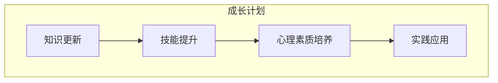
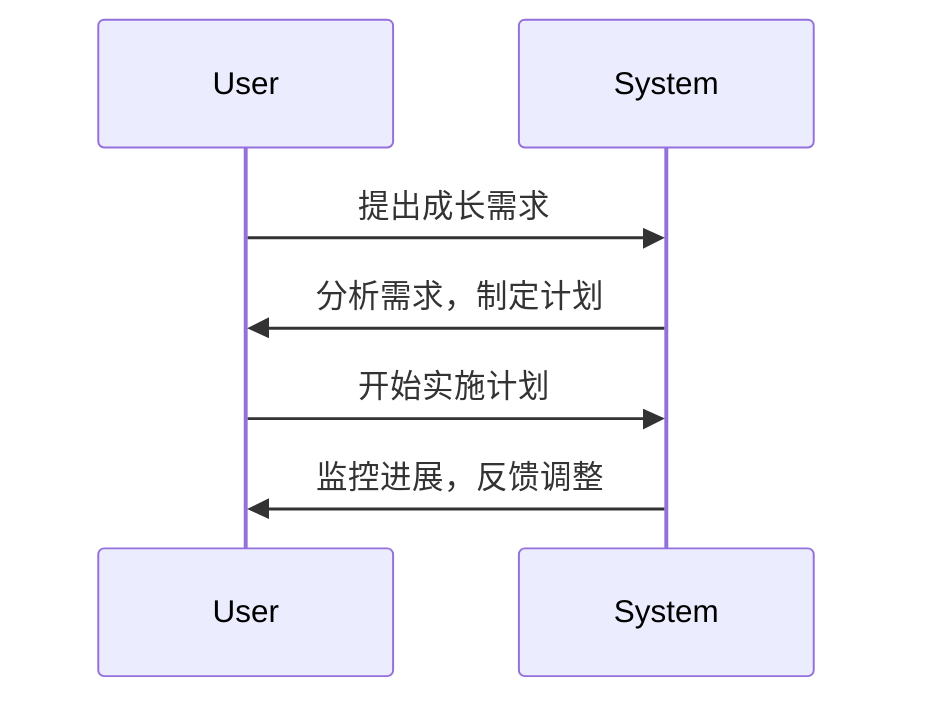
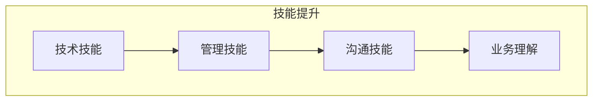
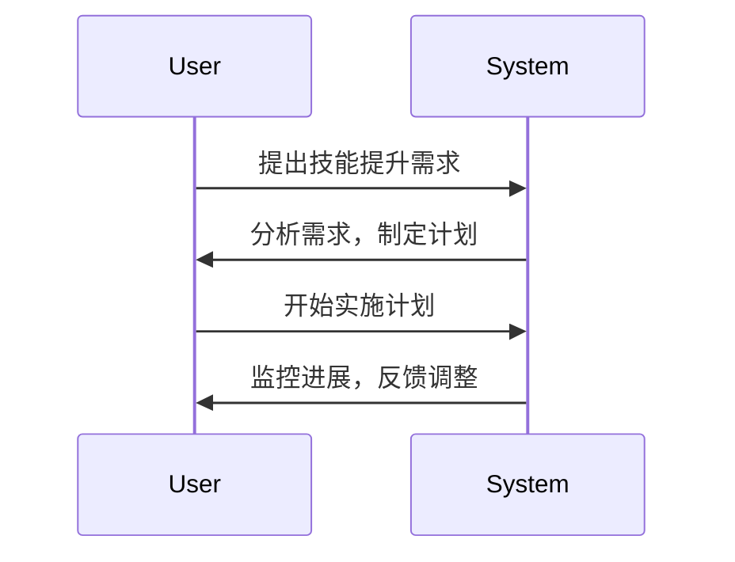
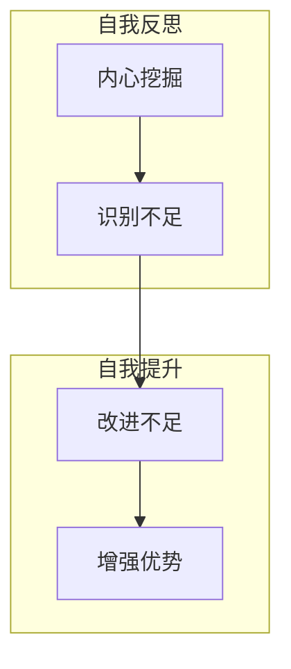
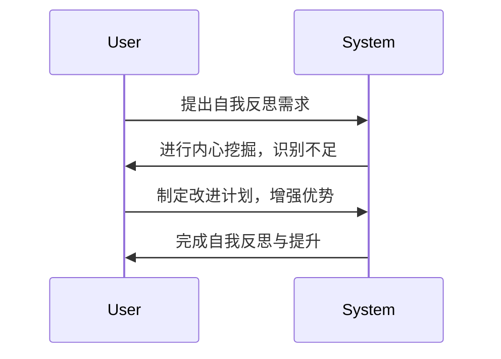
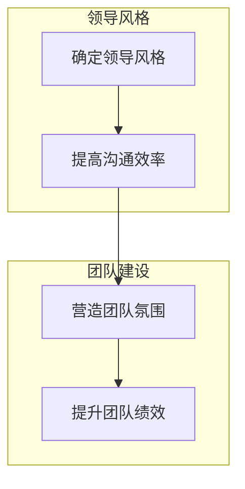
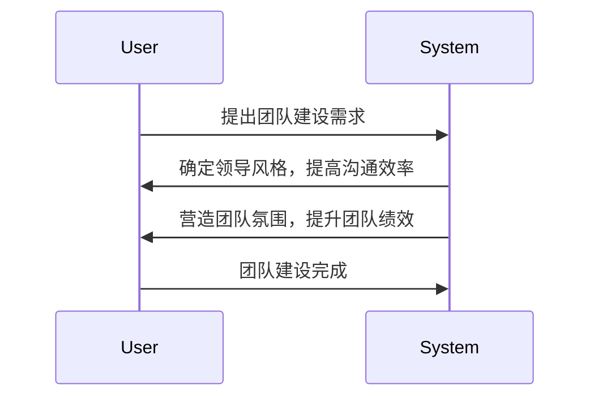
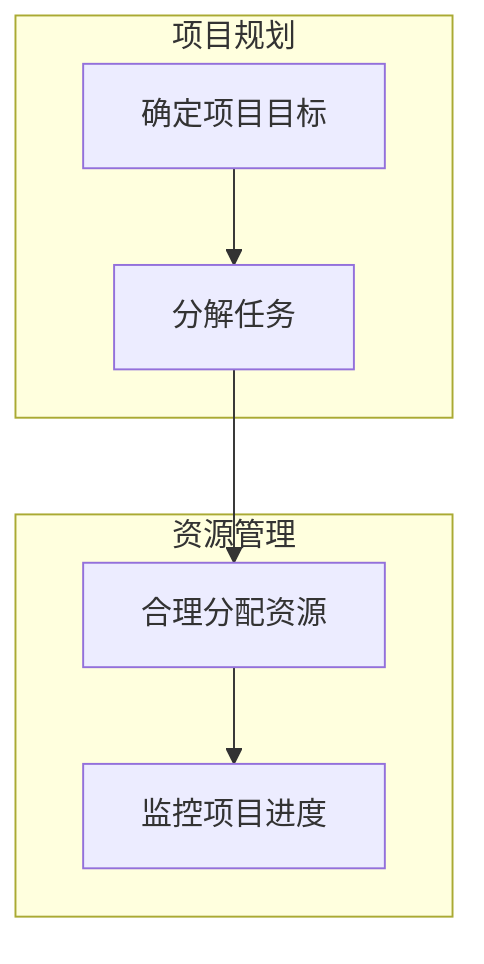
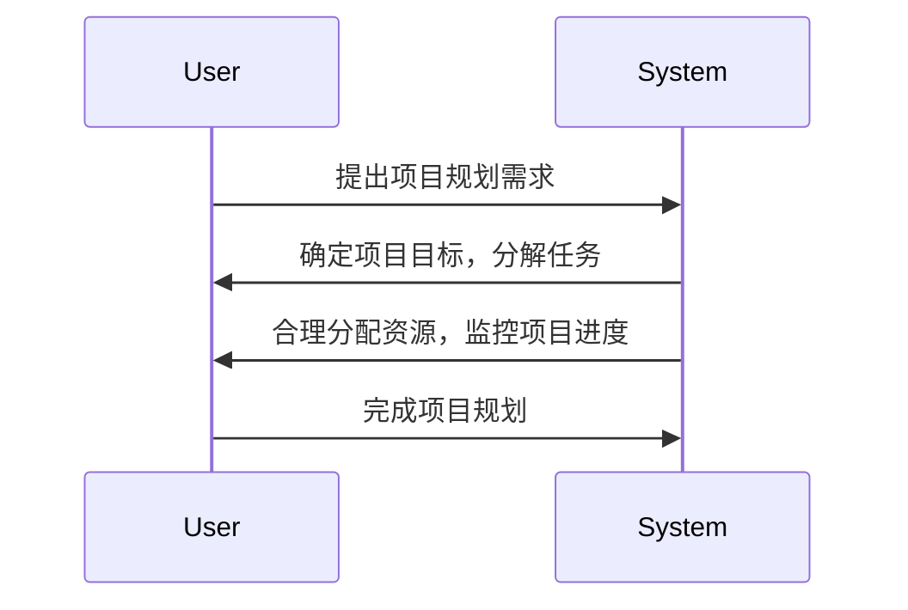

                 

# 技术管理者的自我成长策略

## 关键词：
技术管理、自我成长、领导力、项目管理、沟通协作、业务与技术结合

## 摘要
本文旨在探讨技术管理者的自我成长策略，通过对技术管理者角色的演变、核心技能提升、实际应用与案例分析等方面的深入分析，为技术管理者提供一套系统的成长路径和最佳实践。文章结构紧凑，逻辑清晰，旨在帮助读者在技术领域不断进步，成为卓越的技术管理者。

## 第一部分：引入与技术管理者成长

### 第1章：技术管理者角色的演变

#### 1.1.1 技术管理者的定义与职责

**背景介绍**  
在信息技术快速发展的今天，技术管理者（Technical Manager）的角色变得越来越重要。他们不仅是技术领域的专家，还需要具备管理能力和商业思维，以适应不断变化的企业需求和市场环境。

**问题背景**  
随着技术复杂度的增加，技术管理者面临着前所未有的挑战，如何从技术专家顺利过渡到管理者，成为技术管理者需要掌握的核心技能是什么？

**问题描述**  
技术管理者需要承担技术团队的管理、项目规划与执行、团队建设与沟通等多重职责，这些要求他们不仅要有深厚的专业技术背景，还需要具备良好的管理能力和团队协作精神。

**问题解决**  
技术管理者需要通过不断学习和实践，提升自己的管理能力和技术视野，以更好地应对复杂多变的业务需求。

**边界与外延**  
技术管理者的角色不仅仅局限于技术层面，还涉及团队管理、项目管理和业务规划等多个领域。

**概念结构与核心要素组成**  
技术管理者的核心要素包括专业技术知识、管理能力、沟通协作能力、业务理解能力等。

#### 1.1.2 技术管理者面临的挑战

**挑战一：技术复杂性**  
随着技术的不断发展，技术复杂性日益增加，技术管理者需要不断学习新知识，以应对日益复杂的技术挑战。

**挑战二：团队管理**  
技术管理者需要具备有效的团队管理能力，包括人员招聘、绩效评估、团队建设等。

**挑战三：项目管理**  
技术管理者需要掌握项目管理的基本知识，确保项目按时按质完成。

**挑战四：沟通协作**  
技术管理者需要具备良好的沟通协作能力，确保团队成员之间能够高效协作，共同完成项目目标。

#### 1.1.3 自我成长的重要性

**核心概念与联系**  
自我成长是技术管理者不断进步的重要动力，它包括知识更新、技能提升、心理素质培养等多个方面。

**概念属性特征对比表格**  

| 概念 | 属性特征 |
| ---- | ---- |
| 知识更新 | 持续学习新技术和知识 |
| 技能提升 | 提升管理能力、沟通能力等 |
| 心理素质培养 | 增强抗压能力、自我调节能力 |

**ER实体关系图架构的 Mermaid 流程图**  

```mermaid
erDiagram
  Product Management ||--|{ Technical Manager }
  Technical Expertise ||--|{ Technical Manager }
  Communication Skills ||--|{ Technical Manager }
  Project Management ||--|{ Technical Manager }
  Business Understanding ||--|{ Technical Manager }
```

**算法原理讲解**  
技术管理者需要通过不断学习和实践，提升自己的管理能力和技术视野。以下是一个简单的算法原理讲解：

```python
def grow_as_technical_manager():
    knowledge_update()
    skill_upgrade()
    psychological_maturity()
    return "Technical Manager has grown!"

def knowledge_update():
    # 学习新技术和知识
    pass

def skill_upgrade():
    # 提升管理能力、沟通能力等
    pass

def psychological_maturity():
    # 增强抗压能力、自我调节能力
    pass
```

**数学公式使用 LaTeX 格式**  

$$
\text{成长率} = \frac{\Delta \text{知识}}{\Delta \text{时间}}
$$

**系统分析与架构设计方案**  
技术管理者的成长需要系统性的分析和架构设计方案，以下是一个简单的框架：

**问题场景介绍**  
技术管理者需要通过系统性的学习和实践，提升自己的综合素质。

**项目介绍**  
项目名为“技术管理者自我成长计划”。

**系统功能设计（领域模型 Mermaid 类图）**  

```mermaid
classDiagram
  TechnicalManager <<Class>>
  TeamManagement <<Class>>
  ProjectManagement <<Class>>
  BusinessUnderstanding <<Class>>

  TechnicalManager : +manage_team()
  TeamManagement : +hire_staff()
  ProjectManagement : +plan_projects()
  BusinessUnderstanding : +analyze_business()
```

**系统架构设计 Mermaid 架构图**  



**系统接口设计和系统交互 Mermaid 序列图**  



### 第2章：技术管理者的成长路径

#### 2.1.1 从技术专家到管理者的转变

**背景介绍**  
技术专家在技术领域有丰富的经验和深厚的知识，但要成为一名成功的技术管理者，还需要掌握一系列管理技能和团队领导能力。

**问题背景**  
技术专家如何顺利实现向技术管理者的转变？

**问题描述**  
技术专家需要提升自己的管理能力、沟通能力、团队建设能力等，以更好地适应技术管理者的角色。

**问题解决**  
技术专家可以通过以下途径实现向技术管理者的转变：
1. 学习管理知识和技能；
2. 参与团队建设和项目管理实践；
3. 不断提升自己的领导力和沟通能力。

**边界与外延**  
技术专家向技术管理者的转变不仅仅是角色上的变化，更是一个全方位的素质提升过程。

**概念结构与核心要素组成**  
技术专家向技术管理者的转变涉及知识更新、技能提升、心理素质培养等多个方面。

#### 2.1.2 技术管理者的核心技能

**核心概念与联系**  
技术管理者的核心技能包括技术能力、管理能力、沟通协作能力、业务理解能力等。

**概念属性特征对比表格**  

| 概念 | 属性特征 |
| ---- | ---- |
| 技术能力 | 深厚的专业知识 |
| 管理能力 | 规划、组织、协调 |
| 沟通协作能力 | 积极沟通、团队协作 |
| 业务理解能力 | 理解业务需求、洞察市场 |

**ER实体关系图架构的 Mermaid 流程图**  

```mermaid
erDiagram
  TechnicalManager ||--|{ Technical Expertise }
  TechnicalManager ||--|{ Management Skills }
  TechnicalManager ||--|{ Communication Skills }
  TechnicalManager ||--|{ Business Understanding }
```

**算法原理讲解**  
技术管理者的核心技能提升可以通过以下算法原理实现：

```python
def enhance_skills():
    learn_technical_skills()
    improve_management_skills()
    enhance_communication_skills()
    deepen_business_understanding()
    return "Skills have been enhanced!"

def learn_technical_skills():
    # 学习新技术和知识
    pass

def improve_management_skills():
    # 学习管理知识和技能
    pass

def enhance_communication_skills():
    # 提升沟通协作能力
    pass

def deepen_business_understanding():
    # 理解业务需求、洞察市场
    pass
```

**数学公式使用 LaTeX 格式**  

$$
\text{技能提升} = \frac{\text{新技能}}{\text{原有技能}}
$$

**系统分析与架构设计方案**  
技术管理者的成长路径需要系统性的分析和架构设计方案，以下是一个简单的框架：

**问题场景介绍**  
技术管理者需要系统性地提升自己的核心技能。

**项目介绍**  
项目名为“技术管理者核心技能提升计划”。

**系统功能设计（领域模型 Mermaid 类图）**  

```mermaid
classDiagram
  TechnicalManager <<Class>>
  TechnicalSkills <<Class>>
  ManagementSkills <<Class>>
  CommunicationSkills <<Class>>
  BusinessUnderstanding <<Class>>

  TechnicalManager : +develop_skills()
  TechnicalSkills : +learn_new_technologies()
  ManagementSkills : +manage_teams()
  CommunicationSkills : +enhance_communication()
  BusinessUnderstanding : +analyze_business()
```

**系统架构设计 Mermaid 架构图**  



**系统接口设计和系统交互 Mermaid 序列图**  



### 第3章：技术管理者的自我认知

#### 3.1.1 自我评估的方法

**背景介绍**  
自我评估是技术管理者成长过程中不可或缺的一环，通过自我评估，技术管理者可以了解自己的优点和不足，从而有针对性地进行改进。

**问题背景**  
技术管理者如何有效地进行自我评估？

**问题描述**  
技术管理者需要掌握自我评估的方法和技巧，以便准确了解自己的能力和不足。

**问题解决**  
技术管理者可以通过以下方法进行自我评估：
1. 制定个人成长计划，定期进行回顾和总结；
2. 通过同事、下属和客户的反馈来评估自己的工作表现；
3. 参加自我评估工作坊或培训课程，以提高自我评估能力。

**边界与外延**  
自我评估不仅仅是技术管理者的个人事务，还涉及到团队管理和组织发展等多个层面。

**概念结构与核心要素组成**  
自我评估的核心要素包括个人成长计划、反馈收集、培训学习等。

#### 3.1.2 自我反思与提升

**核心概念与联系**  
自我反思是技术管理者提升自我认知的重要手段，通过自我反思，技术管理者可以深入挖掘自己的内心世界，找到成长的方向。

**概念属性特征对比表格**  

| 概念 | 属性特征 |
| ---- | ---- |
| 自我反思 | 内心挖掘、自我提升 |
| 自我提升 | 知识更新、技能提升 |
| 心理素质培养 | 增强抗压能力、自我调节能力 |

**ER实体关系图架构的 Mermaid 流程图**  

```mermaid
erDiagram
  Self-Reflection ||--|{ Self-Improvement }
  Self-Improvement ||--|{ Knowledge Update }
  Self-Improvement ||--|{ Skill Enhancement }
  Psychological Maturity ||--|{ Self-Reflection }
```

**算法原理讲解**  
技术管理者的自我反思和提升可以通过以下算法原理实现：

```python
def self_reflection_and_enhancement():
    reflect_on_self()
    identify_weaknesses()
    improve_strengths()
    enhance_psychological_maturity()
    return "Self-awareness has been enhanced!"

def reflect_on_self():
    # 进行内心挖掘，思考自己的优点和不足
    pass

def identify_weaknesses():
    # 找到自己的不足，制定改进计划
    pass

def improve_strengths():
    # 提升自己的优点，强化自身优势
    pass

def enhance_psychological_maturity():
    # 增强抗压能力、自我调节能力
    pass
```

**数学公式使用 LaTeX 格式**  

$$
\text{自我认知} = \text{优点} + \text{不足}
$$

**系统分析与架构设计方案**  
技术管理者的自我反思和提升需要系统性的分析和架构设计方案，以下是一个简单的框架：

**问题场景介绍**  
技术管理者需要进行自我反思和提升。

**项目介绍**  
项目名为“技术管理者自我反思与提升计划”。

**系统功能设计（领域模型 Mermaid 类图）**  

```mermaid
classDiagram
  TechnicalManager <<Class>>
  Self-Reflection <<Class>>
  Self-Improvement <<Class>>

  TechnicalManager : +perform_self_reflection()
  Self-Reflection : +dig_into_internals()
  Self-Improvement : +improve_weaknesses()
```

**系统架构设计 Mermaid 架构图**  



**系统接口设计和系统交互 Mermaid 序列图**  



## 第二部分：关键技能提升

### 第4章：领导力与团队管理

#### 4.1.1 领导力的重要性

**背景介绍**  
领导力是技术管理者必备的核心能力之一，它关系到团队的凝聚力和工作效率。

**问题背景**  
技术管理者如何提升自己的领导力？

**问题描述**  
技术管理者需要掌握一系列领导力技巧，以更好地管理团队，实现团队目标。

**问题解决**  
技术管理者可以通过以下途径提升自己的领导力：
1. 学习领导力理论，了解不同领导风格的特点和应用；
2. 增强自我意识，提升自我领导力；
3. 通过实践和反思，不断改进领导方式。

**边界与外延**  
领导力不仅仅是管理团队，还包括领导自己、领导变革等多个层面。

**概念结构与核心要素组成**  
领导力的核心要素包括领导风格、团队建设、沟通协作等。

#### 4.1.2 团队建设的策略

**核心概念与联系**  
团队建设是提升团队效率的重要手段，技术管理者需要掌握团队建设的策略和方法。

**概念属性特征对比表格**  

| 概念 | 属性特征 |
| ---- | ---- |
| 团队建设 | 提升团队凝聚力、工作效率 |
| 领导风格 | 影响团队氛围和绩效 |
| 沟通协作 | 促进团队内部信息流通 |

**ER实体关系图架构的 Mermaid 流程图**  

```mermaid
erDiagram
  TeamBuilding ||--|{ Leadership Style }
  TeamBuilding ||--|{ Communication Collaboration }
  LeadershipStyle ||--|{ TeamAtmosphere }
  LeadershipStyle ||--|{ Performance }
```

**算法原理讲解**  
团队建设可以通过以下算法原理实现：

```python
def build_team():
    define_leadership_style()
    enhance_communication_collaboration()
    foster_team_atmosphere()
    improve_performance()
    return "Team has been built!"

def define_leadership_style():
    # 确定领导风格，适应团队需求
    pass

def enhance_communication_collaboration():
    # 提高沟通协作效率
    pass

def foster_team_atmosphere():
    # 营造积极向上的团队氛围
    pass

def improve_performance():
    # 提升团队绩效
    pass
```

**数学公式使用 LaTeX 格式**  

$$
\text{团队绩效} = \text{沟通效率} \times \text{团队凝聚力}
$$

**系统分析与架构设计方案**  
团队建设需要系统性的分析和架构设计方案，以下是一个简单的框架：

**问题场景介绍**  
技术管理者需要系统性地建设团队。

**项目介绍**  
项目名为“团队建设与领导力提升计划”。

**系统功能设计（领域模型 Mermaid 类图）**  

```mermaid
classDiagram
  TechnicalManager <<Class>>
  TeamBuilding <<Class>>
  LeadershipStyle <<Class>>
  CommunicationCollaboration <<Class>>

  TechnicalManager : +build_team()
  TeamBuilding : +define_leadership_style()
  LeadershipStyle : +enhance_communication()
  CommunicationCollaboration : +improve_performance()
```

**系统架构设计 Mermaid 架构图**  



**系统接口设计和系统交互 Mermaid 序列图**  



### 第5章：项目管理与规划

#### 5.1.1 项目管理的基本概念

**背景介绍**  
项目管理是技术管理者的重要职责之一，它关系到项目的成功与否。

**问题背景**  
技术管理者如何有效进行项目管理？

**问题描述**  
技术管理者需要掌握项目管理的基本概念和原理，以更好地规划和管理项目。

**问题解决**  
技术管理者可以通过以下方法进行项目管理：
1. 学习项目管理知识，了解项目生命周期和关键过程；
2. 制定详细的项目计划，明确项目目标、任务和资源；
3. 监控项目进度，及时调整计划和资源。

**边界与外延**  
项目管理不仅仅是技术管理者的职责，还涉及项目团队、利益相关者等多个层面。

**概念结构与核心要素组成**  
项目管理的核心要素包括项目目标、任务规划、资源管理、进度监控等。

#### 5.1.2 项目规划与执行

**核心概念与联系**  
项目规划是项目管理的重要环节，技术管理者需要掌握项目规划的方法和技巧。

**概念属性特征对比表格**  

| 概念 | 属性特征 |
| ---- | ---- |
| 项目规划 | 明确项目目标、任务和资源 |
| 任务规划 | 分解任务、确定任务顺序 |
| 资源管理 | 合理分配资源，提高资源利用率 |

**ER实体关系图架构的 Mermaid 流程图**  

```mermaid
erDiagram
  ProjectPlanning ||--|{ TaskPlanning }
  ProjectPlanning ||--|{ ResourceManagement }
  TaskPlanning ||--|{ TaskSequence }
  ResourceManagement ||--|{ ResourceAllocation }
```

**算法原理讲解**  
项目规划可以通过以下算法原理实现：

```python
def project_planning():
    define_project_goals()
    plan_tasks()
    manage_resources()
    monitor_progress()
    return "Project plan has been created!"

def define_project_goals():
    # 确定项目目标，明确项目方向
    pass

def plan_tasks():
    # 分解任务，确定任务顺序
    pass

def manage_resources():
    # 合理分配资源，提高资源利用率
    pass

def monitor_progress():
    # 监控项目进度，及时调整计划和资源
    pass
```

**数学公式使用 LaTeX 格式**  

$$
\text{项目进度} = \frac{\text{已完成任务}}{\text{总任务}}
$$

**系统分析与架构设计方案**  
项目规划需要系统性的分析和架构设计方案，以下是一个简单的框架：

**问题场景介绍**  
技术管理者需要进行项目规划。

**项目介绍**  
项目名为“项目规划与执行计划”。

**系统功能设计（领域模型 Mermaid 类图）**  

```mermaid
classDiagram
  TechnicalManager <<Class>>
  ProjectPlanning <<Class>>
  TaskPlanning <<Class>>
  ResourceManagement <<Class>>

  TechnicalManager : +create_project_plan()
  ProjectPlanning : +define_goals()
  TaskPlanning : +分解任务()
  ResourceManagement : +allocate_resources()
```

**系统架构设计 Mermaid 架构图**  



**系统接口设计和系统交互 Mermaid 序列图**  



### 第6章：沟通与协作

#### 6.1.1 有效沟通的技巧

**背景介绍**  
沟通是技术管理者的重要职责之一，它关系到团队的工作效率和信息流通。

**问题背景**  
技术管理者如何提高沟通效率？

**问题描述**  
技术管理者需要掌握有效的沟通技巧，以更好地协调团队工作，解决沟通问题。

**问题解决**  
技术管理者可以通过以下方法提高沟通效率：
1. 明确沟通目标，制定沟通计划；
2. 善于倾听，理解他人的观点和需求；
3. 表达清晰，避免歧义；
4. 适当使用非语言沟通手段，如肢体语言和表情。

**边界与外延**  
沟通不仅仅是语言交流，还包括书面沟通、非语言沟通等多个层面。

**概念结构与核心要素组成**  
沟通的核心要素包括沟通目标、倾听技巧、表达技巧、非语言沟通等。

#### 6.1.2 协作工具与平台

**核心概念与联系**  
协作工具和平台是提高团队协作效率的重要手段，技术管理者需要掌握相关工具和平台的使用。

**概念属性特征对比表格**  

| 概念 | 属性特征 |
| ---- | ---- |
| 协作工具 | 提高团队协作效率 |
| 平台 | 提供协作环境 |
| 沟通工具 | 实现实时沟通 |
| 文档管理 | 方便文档共享 |

**ER实体关系图架构的 Mermaid 流程图**  

```mermaid
erDiagram
  CollaborationTools ||--|{ CommunicationPlatform }
  CollaborationTools ||--|{ DocumentManagement }
  CommunicationPlatform ||--|{ Real-TimeCommunication }
  DocumentManagement ||--|{ DocumentSharing }
```

**算法原理讲解**  
协作工具和平台可以通过以下算法原理实现：

```python
def enhance_collaboration():
    select_appropriate_tools()
    set_up_collaboration_environment()
    promote_real_time_communication()
    streamline_document_management()
    return "Collaboration efficiency has been improved!"

def select_appropriate_tools():
    # 根据团队需求选择合适的协作工具
    pass

def set_up_collaboration_environment():
    # 搭建协作平台，提供协作环境
    pass

def promote_real_time_communication():
    # 提高实时沟通效率
    pass

def streamline_document_management():
    # 方便文档共享和管理
    pass
```

**数学公式使用 LaTeX 格式**  

$$
\text{协作效率} = \text{沟通效率} \times \text{团队协作}
$$

**系统分析与架构设计方案**  
协作工具和平台需要系统性的分析和架构设计方案，以下是一个简单的框架：

**问题场景介绍**  
技术管理者需要提高团队协作效率。

**项目介绍**  
项目名为“协作工具与平台优化计划”。

**系统功能设计（领域模型 Mermaid 类图）**  

```mermaid
classDiagram
  TechnicalManager <<Class>>
  CollaborationTools <<Class>>
  CommunicationPlatform <<Class>>

  TechnicalManager : +optimize_collaboration()
  CollaborationTools : +select_tools()
  CommunicationPlatform : +set_up_environment()
```

**系统架构设计 Mermaid 架构图**  

```mermaid
graph TB
  subgraph 协作工具
    A[选择协作工具]
    B[搭建协作环境]
  end

  subgraph 沟通平台
    C[提高沟通效率]
    D[优化协作流程]
  end

  A --> B
  B --> C
  C --> D
```

**系统接口设计和系统交互 Mermaid 序列图**  

```mermaid
sequenceDiagram
  participant User
  participant System

  User->>System: 提出协作需求
  System->>User: 选择协作工具，搭建协作环境
  System->>User: 提高沟通效率，优化协作流程
  User->>System: 协作效率提高
```

### 第7章：技术与业务结合

#### 7.1.1 技术趋势与业务需求

**背景介绍**  
技术趋势和业务需求是技术管理者需要密切关注的重要方面，它们关系到技术决策和项目方向。

**问题背景**  
技术管理者如何把握技术趋势和业务需求？

**问题描述**  
技术管理者需要掌握分析技术趋势和业务需求的方法和技巧，以更好地指导技术决策。

**问题解决**  
技术管理者可以通过以下方法把握技术趋势和业务需求：
1. 关注技术动态，了解新兴技术和趋势；
2. 与业务部门保持紧密沟通，了解业务需求和痛点；
3. 分析市场数据和竞争对手，获取有价值的信息。

**边界与外延**  
技术趋势和业务需求不仅仅影响技术决策，还关系到项目规划、团队建设等多个层面。

**概念结构与核心要素组成**  
技术趋势和业务需求的核心要素包括技术动态、业务需求、市场分析等。

#### 7.1.2 技术选型与评估

**核心概念与联系**  
技术选型是技术决策的重要环节，技术管理者需要掌握技术选型的方法和技巧。

**概念属性特征对比表格**  

| 概念 | 属性特征 |
| ---- | ---- |
| 技术选型 | 选择合适的技术解决方案 |
| 评估方法 | 评估技术方案的可行性 |
| 成本效益分析 | 分析技术方案的成本效益 |

**ER实体关系图架构的 Mermaid 流程图**  

```mermaid
erDiagram
  TechnologySelection ||--|{ EvaluationMethod }
  TechnologySelection ||--|{ CostBenefitAnalysis }
  EvaluationMethod ||--|{ FeasibilityAnalysis }
  CostBenefitAnalysis ||--|{ CostEstimation }
```

**算法原理讲解**  
技术选型可以通过以下算法原理实现：

```python
def select_technology():
    analyze_technology_trends()
    evaluate_technology_solutions()
    conduct_cost_benefit_analysis()
    make_technology_decision()
    return "Appropriate technology has been selected!"

def analyze_technology_trends():
    # 分析技术趋势，了解新兴技术
    pass

def evaluate_technology_solutions():
    # 评估技术方案的可行性
    pass

def conduct_cost_benefit_analysis():
    # 进行成本效益分析，评估技术方案的成本效益
    pass

def make_technology_decision():
    # 基于分析结果，做出技术决策
    pass
```

**数学公式使用 LaTeX 格式**  

$$
\text{成本效益} = \frac{\text{效益}}{\text{成本}}
$$

**系统分析与架构设计方案**  
技术选型需要系统性的分析和架构设计方案，以下是一个简单的框架：

**问题场景介绍**  
技术管理者需要进行技术选型。

**项目介绍**  
项目名为“技术选型与评估计划”。

**系统功能设计（领域模型 Mermaid 类图）**  

```mermaid
classDiagram
  TechnicalManager <<Class>>
  TechnologySelection <<Class>>
  EvaluationMethod <<Class>>

  TechnicalManager : +select_technology()
  TechnologySelection : +analyze_trends()
  EvaluationMethod : +evaluate_solutions()
```

**系统架构设计 Mermaid 架构图**  

```mermaid
graph TB
  subgraph 技术分析
    A[分析技术趋势]
    B[评估技术方案]
  end

  subgraph 成本效益分析
    C[进行成本效益分析]
    D[做出技术决策]
  end

  A --> B
  B --> C
  C --> D
```

**系统接口设计和系统交互 Mermaid 序列图**  

```mermaid
sequenceDiagram
  participant User
  participant System

  User->>System: 提出技术选型需求
  System->>User: 分析技术趋势，评估技术方案
  System->>User: 进行成本效益分析，做出技术决策
  User->>System: 完成技术选型
```

### 第8章：成功的技术管理者案例

#### 8.1.1 案例一：A公司的技术总监

**案例背景**  
A公司是一家处于快速发展阶段的高科技企业，其技术总监张先生在公司的成长过程中发挥了重要作用。

**案例描述**  
张先生在担任技术总监期间，通过以下措施提升了公司的技术能力和市场竞争力：
1. 引进先进技术，提升公司技术水平；
2. 构建高效的研发团队，提高研发效率；
3. 推动技术与业务的结合，助力公司业务拓展。

**案例结果**  
在张先生的管理下，A公司取得了显著的业务增长和技术突破，成为行业内的佼佼者。

**案例分析**  
张先生的成功得益于其深厚的技术背景、敏锐的市场洞察力和出色的团队管理能力。他通过引进先进技术、构建高效团队和推动业务与技术结合，实现了公司的持续发展和市场竞争力提升。

#### 8.1.2 案例二：B公司的CTO成长历程

**案例背景**  
B公司是一家创业公司，其在成长过程中面临诸多挑战，其CTO李先生在公司的关键时期发挥了重要作用。

**案例描述**  
李先生在担任CTO期间，通过以下措施推动了公司的成长：
1. 明确技术方向，制定技术战略；
2. 建立技术团队，提升研发能力；
3. 与业务部门紧密合作，推动业务发展。

**案例结果**  
在李先生的管理下，B公司实现了技术的不断突破和业务的快速增长，成为行业内的明星企业。

**案例分析**  
李先生的成功在于他明确了技术方向，建立了高效的技术团队，并与业务部门紧密合作，实现了技术与业务的有机结合。他的领导力和执行力为公司的成长提供了有力保障。

#### 8.1.3 案例三：C公司的首席工程师转型

**案例背景**  
C公司是一家软件公司，其首席工程师王先生在公司的成长过程中逐渐转型为技术管理者。

**案例描述**  
王先生在转型过程中，通过以下措施提升了自身的管理能力：
1. 学习管理知识和技能；
2. 参与团队建设和项目管理；
3. 建立与业务部门的沟通机制。

**案例结果**  
在王先生的带领下，C公司的研发团队取得了显著的成绩，公司的技术实力和市场份额不断提升。

**案例分析**  
王先生的成功在于他认识到技术管理者的职责不仅仅是技术方面，还需要具备管理能力和业务理解能力。他通过不断学习和实践，成功实现了从技术专家到技术管理者的转型。

## 第三部分：实际应用与案例分析

### 第9章：成长路上的挑战与解决

#### 9.1.1 面对挫折与失败

**背景介绍**  
在技术管理者成长的路上，挫折和失败是难以避免的。

**问题背景**  
技术管理者如何面对挫折和失败？

**问题描述**  
技术管理者需要具备应对挫折和失败的心理素质，以更好地应对职业生涯中的挑战。

**问题解决**  
技术管理者可以通过以下方法应对挫折和失败：
1. 保持积极的心态，正视失败；
2. 分析失败原因，总结经验教训；
3. 坚定信念，勇于再次尝试。

**边界与外延**  
挫折和失败不仅是个人问题，还涉及到团队管理、项目执行等多个层面。

**概念结构与核心要素组成**  
应对挫折和失败的核心要素包括积极心态、分析能力、坚定信念等。

#### 9.1.2 应对职业瓶颈

**核心概念与联系**  
职业瓶颈是技术管理者成长过程中的一个重要挑战，需要通过有效的方法来突破。

**概念属性特征对比表格**  

| 概念 | 属性特征 |
| ---- | ---- |
| 职业瓶颈 | 职业发展停滞 |
| 技能提升 | 提升管理技能、业务能力 |
| 知识更新 | 学习新技术、行业动态 |

**ER实体关系图架构的 Mermaid 流程图**  

```mermaid
erDiagram
  CareerBottleneck ||--|{ SkillUpgrade }
  CareerBottleneck ||--|{ KnowledgeUpdate }
  SkillUpgrade ||--|{ ManagementSkills }
  SkillUpgrade ||--|{ BusinessCapabilities }
  KnowledgeUpdate ||--|{ NewTechnologies }
  KnowledgeUpdate ||--|{ IndustryTrends }
```

**算法原理讲解**  
应对职业瓶颈可以通过以下算法原理实现：

```python
def overcome_career_bottleneck():
    identify_bottleneck()
    upgrade_skills()
    update_knowledge()
    seek_new_opportunities()
    return "Career growth has been accelerated!"

def identify_bottleneck():
    # 分析职业瓶颈，确定瓶颈原因
    pass

def upgrade_skills():
    # 提升管理技能、业务能力
    pass

def update_knowledge():
    # 学习新技术、行业动态
    pass

def seek_new_opportunities():
    # 寻求新的职业发展机会
    pass
```

**数学公式使用 LaTeX 格式**  

$$
\text{职业成长} = \text{技能提升} + \text{知识更新}
$$

**系统分析与架构设计方案**  
应对职业瓶颈需要系统性的分析和架构设计方案，以下是一个简单的框架：

**问题场景介绍**  
技术管理者需要突破职业瓶颈。

**项目介绍**  
项目名为“职业成长加速计划”。

**系统功能设计（领域模型 Mermaid 类图）**  

```mermaid
classDiagram
  TechnicalManager <<Class>>
  CareerBottleneck <<Class>>
  SkillUpgrade <<Class>>
  KnowledgeUpdate <<Class>>

  TechnicalManager : +overcome_bottleneck()
  CareerBottleneck : +analyze_bottleneck()
  SkillUpgrade : +develop_skills()
  KnowledgeUpdate : +learn_new_knowledge()
```

**系统架构设计 Mermaid 架构图**  

```mermaid
graph TB
  subgraph 瓶颈分析
    A[分析瓶颈]
    B[确定瓶颈原因]
  end

  subgraph 技能提升
    C[提升技能]
    D[增强能力]
  end

  subgraph 知识更新
    E[学习新技术]
    F[了解行业动态]
  end

  A --> B
  B --> C
  C --> D
  D --> E
  E --> F
```

**系统接口设计和系统交互 Mermaid 序列图**  

```mermaid
sequenceDiagram
  participant User
  participant System

  User->>System: 提出职业瓶颈问题
  System->>User: 分析瓶颈原因，确定瓶颈位置
  System->>User: 提升技能，更新知识
  User->>System: 突破职业瓶颈
```

### 第10章：持续成长的最佳实践

#### 10.1.1 学习资源与渠道

**核心概念与联系**  
学习资源与渠道是技术管理者持续成长的重要保障，包括书籍、在线课程、行业会议等。

**概念属性特征对比表格**  

| 概念 | 属性特征 |
| ---- | ---- |
| 书籍 | 系统性知识学习 |
| 在线课程 | 便捷性、多样性 |
| 行业会议 | 信息交流、拓展视野 |

**ER实体关系图架构的 Mermaid 流程图**  

```mermaid
erDiagram
  LearningResources ||--|{ Books }
  LearningResources ||--|{ OnlineCourses }
  LearningResources ||--|{ IndustryConferences }
  Books ||--|{ SystematicKnowledge }
  OnlineCourses ||--|{ Convenience }
  IndustryConferences ||--|{ InformationExchange }
```

**算法原理讲解**  
学习资源与渠道可以通过以下算法原理实现：

```python
def access_learning_resources():
    select_books()
    enroll_online_courses()
    attend_industry_conferences()
    integrate_learning_into_practice()
    return "Continuous learning has been established!"

def select_books():
    # 选择适合的书籍进行学习
    pass

def enroll_online_courses():
    # 报名参加在线课程，提升技能
    pass

def attend_industry_conferences():
    # 参加行业会议，获取前沿信息
    pass

def integrate_learning_into_practice():
    # 将所学知识应用到实际工作中
    pass
```

**数学公式使用 LaTeX 格式**  

$$
\text{学习效果} = \text{知识输入} \times \text{实践应用}
$$

**系统分析与架构设计方案**  
学习资源与渠道需要系统性的分析和架构设计方案，以下是一个简单的框架：

**问题场景介绍**  
技术管理者需要获取学习资源与渠道。

**项目介绍**  
项目名为“学习资源与渠道整合计划”。

**系统功能设计（领域模型 Mermaid 类图）**  

```mermaid
classDiagram
  TechnicalManager <<Class>>
  LearningResources <<Class>>
  Books <<Class>>
  OnlineCourses <<Class>>
  IndustryConferences <<Class>>

  TechnicalManager : +access_resources()
  LearningResources : +select_books()
  Books : +provide_systematic_knowledge()
  OnlineCourses : +offer_convenience()
  IndustryConferences : +exchange_information()
```

**系统架构设计 Mermaid 架构图**  

```mermaid
graph TB
  subgraph 学习资源
    A[选择书籍]
    B[报名在线课程]
    C[参加行业会议]
  end

  subgraph 学习效果
    D[提供系统性知识]
    E[提供便捷性]
    F[获取前沿信息]
  end

  A --> B
  B --> C
  C --> D
  D --> E
  E --> F
```

**系统接口设计和系统交互 Mermaid 序列图**  

```mermaid
sequenceDiagram
  participant User
  participant System

  User->>System: 提出学习资源需求
  System->>User: 选择适合的书籍，报名在线课程
  System->>User: 参加行业会议，获取前沿信息
  User->>System: 学习效果显著
```

### 第11章：结语

#### 11.1.1 总结与展望

**核心概念与联系**  
技术管理者的自我成长是一个持续的过程，需要不断学习和实践，提升自己的综合素质。

**概念属性特征对比表格**  

| 概念 | 属性特征 |
| ---- | ---- |
| 自我成长 | 综合素质提升 |
| 持续学习 | 新知识、新技能 |
| 实践应用 | 知识转化为能力 |

**ER实体关系图架构的 Mermaid 流程图**  

```mermaid
erDiagram
  Self-Growth ||--|{ ContinuousLearning }
  Self-Growth ||--|{ PracticalApplication }
  ContinuousLearning ||--|{ NewKnowledge }
  ContinuousLearning ||--|{ NewSkills }
  PracticalApplication ||--|{ KnowledgeConversion }
```

**算法原理讲解**  
技术管理者的自我成长可以通过以下算法原理实现：

```python
def self_growth():
    learn_new_knowledge()
    develop_new_skills()
    apply_knowledge_to_practice()
    iterate_learning_process()
    return "Self-growth has been achieved!"

def learn_new_knowledge():
    # 学习新知识，拓宽视野
    pass

def develop_new_skills():
    # 提升新技能，增强能力
    pass

def apply_knowledge_to_practice():
    # 将所学知识应用到实际工作中
    pass

def iterate_learning_process():
    # 不断循环学习过程，持续成长
    pass
```

**数学公式使用 LaTeX 格式**  

$$
\text{自我成长} = \text{知识积累} \times \text{实践转化}
$$

**系统分析与架构设计方案**  
技术管理者的自我成长需要系统性的分析和架构设计方案，以下是一个简单的框架：

**问题场景介绍**  
技术管理者需要实现自我成长。

**项目介绍**  
项目名为“自我成长计划”。

**系统功能设计（领域模型 Mermaid 类图）**  

```mermaid
classDiagram
  TechnicalManager <<Class>>
  Self-Growth <<Class>>
  KnowledgeAccumulation <<Class>>
  PracticalConversion <<Class>>

  TechnicalManager : +implement_self_growth()
  Self-Growth : +learn_new_knowledge()
  KnowledgeAccumulation : +collect_knowledge()
  PracticalConversion : +apply_knowledge()
```

**系统架构设计 Mermaid 架构图**  

```mermaid
graph TB
  subgraph 知识积累
    A[收集知识]
    B[学习新知识]
  end

  subgraph 实践转化
    C[应用知识]
    D[提升能力]
  end

  A --> B
  B --> C
  C --> D
```

**系统接口设计和系统交互 Mermaid 序列图**  

```mermaid
sequenceDiagram
  participant User
  participant System

  User->>System: 提出自我成长需求
  System->>User: 收集知识，学习新知识
  System->>User: 应用知识，提升能力
  User->>System: 实现自我成长
```

### 附录

**附录A：技术管理者的核心能力矩阵**

| 能力类型 | 能力名称 | 能力描述 |
| ---- | ---- | ---- |
| 技术能力 | 系统架构设计 | 能够设计高效、可扩展的系统架构 |
| 技术能力 | 编程语言掌握 | 熟练掌握多种编程语言，具备代码开发能力 |
| 管理能力 | 团队管理 | 能够有效管理和激励团队成员，提升团队凝聚力 |
| 管理能力 | 项目管理 | 能够规划、执行和监控项目进度，确保项目成功 |
| 沟通能力 | 沟通技巧 | 能够清晰、有效地与团队成员和利益相关者沟通 |
| 业务理解能力 | 市场分析 | 能够分析市场趋势和业务需求，指导技术决策 |
| 业务理解能力 | 业务流程 | 能够理解业务流程，与技术需求相结合 |

**附录B：技术管理者成长路径图**

```mermaid
graph TB
  subgraph 技能学习
    A[技术基础]
    B[管理知识]
    C[沟通协作]
  end

  subgraph 实践应用
    D[项目管理]
    E[团队建设]
    F[业务理解]
  end

  subgraph 持续成长
    G[知识更新]
    H[技能提升]
    I[实践应用]
  end

  A --> B
  B --> C
  C --> D
  D --> E
  E --> F
  F --> G
  G --> H
  H --> I
```

**附录C：技术管理者成长路径案例**

**案例一：技术专家到技术管理者的转变**

1. 技术基础：精通编程语言，具备丰富的技术经验；
2. 管理知识：学习项目管理知识，参加管理培训；
3. 沟通协作：提高沟通技巧，建立良好的团队关系；
4. 项目管理：担任项目经理，负责项目规划与执行；
5. 团队建设：建立高效的团队，提升团队绩效；
6. 业务理解：参与业务讨论，理解业务需求和痛点；
7. 持续成长：不断学习新技术，提升自身综合素质。

**案例二：技术管理者到企业高管的转型**

1. 技术基础：持续学习新技术，保持技术领先地位；
2. 管理知识：学习企业战略、财务知识，提升商业思维；
3. 沟通协作：提高跨部门沟通能力，建立良好的企业关系；
4. 项目管理：负责企业级项目，提升项目管理能力；
5. 团队建设：培养企业核心团队，提升团队执行力；
6. 业务理解：深入理解企业业务，指导技术决策；
7. 持续成长：参与行业交流，拓展视野，提升领导力。

**附录D：技术管理者成长资源推荐**

1. 书籍推荐：
   - 《精益创业》：埃里克·莱斯（Eric Ries）著
   - 《敏捷开发实践指南》：杰夫里·福斯特（Jeff Sutherland）著
   - 《智能时代》：吴军著

2. 在线课程推荐：
   - Coursera：提供多种技术和管理课程
   - edX：全球知名大学合作提供的在线课程
   - LinkedIn Learning：涵盖多个领域的专业课程

3. 行业会议推荐：
   - 世界互联网大会：聚焦互联网行业的前沿技术和发展趋势
   - 微软技术大会：微软公司主办的全球技术盛会
   - Google I/O：谷歌公司主办的全球开发者大会

**结语**

技术管理者的自我成长是一个持续的过程，需要不断学习和实践，提升自己的综合素质。本文从技术管理者角色的演变、关键技能提升、实际应用与案例分析等多个方面，为技术管理者提供了系统的成长路径和最佳实践。希望本文能对技术管理者在自我成长的道路上起到指导作用，助力他们在技术领域不断进步，成为卓越的技术管理者。

### 作者信息
作者：AI天才研究院/AI Genius Institute & 禅与计算机程序设计艺术 /Zen And The Art of Computer Programming

