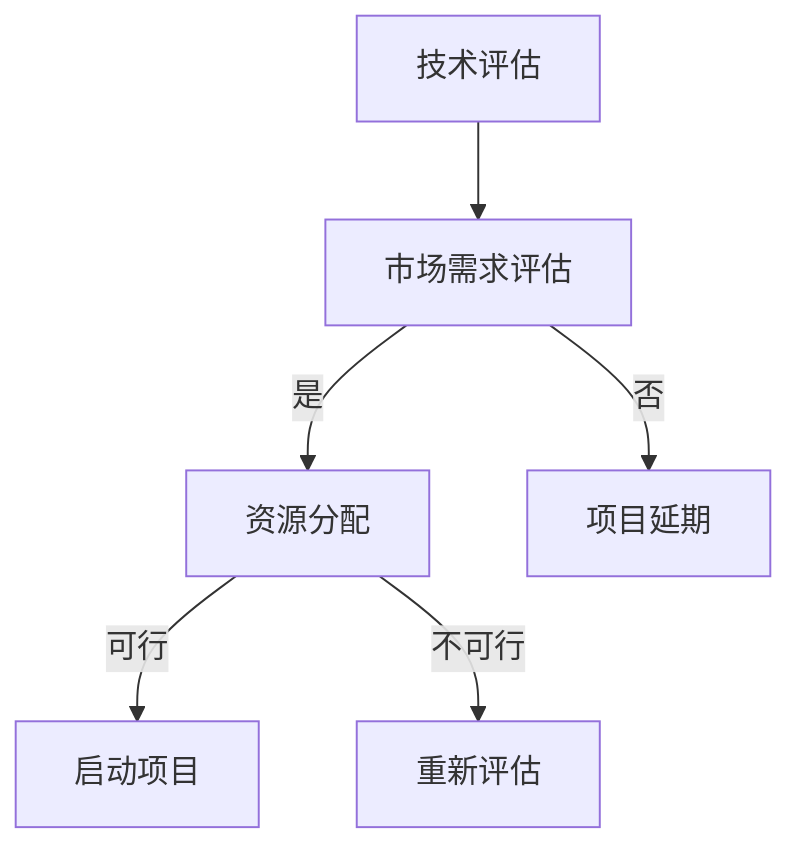
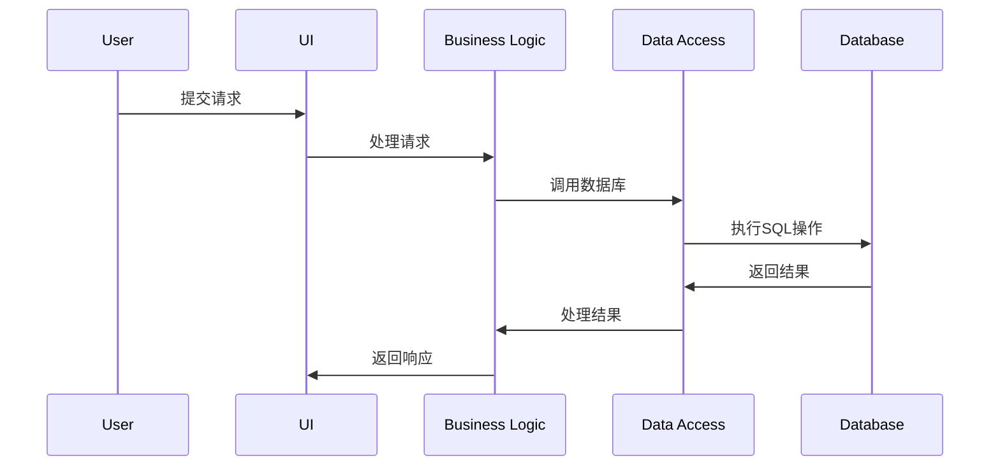

                 

# 《技术管理者的自我提升与学习方法》

## 关键词：技术管理、自我提升、学习方法、专业发展

## 摘要：
技术管理者在现代企业中扮演着至关重要的角色。他们不仅需要具备深厚的技术知识，还必须不断提升自身的能力，以应对快速变化的技术环境和管理挑战。本文将探讨技术管理者的自我提升与学习方法，通过逻辑清晰、结构紧凑的分析，帮助技术管理者找到有效的学习路径，提升管理效能。

----------------------------------------------------------------

## 第一部分: 背景与核心概念

### 第1章: 技术管理者的角色与责任

#### 1.1 技术管理者的角色

技术管理者在企业中通常担任多重角色，包括但不限于以下几方面：

- **技术领导**：带领技术团队，制定技术路线图，推动技术创新。
- **项目管理**：负责项目的规划、执行、监控和收尾，确保项目按时、按质、按预算完成。
- **团队协作**：协调不同团队之间的合作，促进知识共享和团队协同。
- **决策支持**：为业务决策提供技术层面的分析和建议。

#### 1.2 技术管理者的责任

技术管理者肩负着以下责任：

- **技术战略**：制定和实施公司级的技术战略，确保公司的技术发展方向与市场趋势保持一致。
- **团队建设**：培养和激励团队成员，提升团队的整体能力和士气。
- **资源管理**：合理分配技术资源，包括人员、技术和资金，以最大化产出。
- **风险管理**：识别和管理技术风险，确保公司的技术决策具有前瞻性和安全性。

#### 1.3 自我提升的重要性

在快速变化的技术环境中，技术管理者必须不断自我提升：

- **知识更新**：技术领域日新月异，持续学习是保持竞争力的关键。
- **技能提升**：管理技能和领导力是技术管理者的软实力，需要通过实践和培训不断提升。
- **视野拓展**：拓宽视野，了解行业动态和前沿技术，以便做出更明智的决策。

### 第2章: 核心概念与联系

#### 2.1 技术管理知识框架

技术管理知识框架包括以下几个核心领域：

- **技术知识**：包括编程语言、框架、数据库等具体技术。
- **管理知识**：涉及项目管理、团队管理、沟通协调等管理技能。
- **业务知识**：理解公司业务模式、市场趋势、竞争对手等。

#### 2.2 学习策略

有效的学习策略包括以下几点：

- **目标设定**：明确学习目标，制定可行的学习计划。
- **时间管理**：合理安排学习时间，确保学习与工作、生活的平衡。
- **资源整合**：利用各种学习资源，如书籍、网络课程、研讨会等。
- **实践应用**：将所学知识应用到实际工作中，加深理解和记忆。

#### 2.3 时间管理技巧

时间管理是技术管理者自我提升的重要一环：

- **优先级排序**：根据任务的重要性和紧急程度，合理安排工作。
- **番茄工作法**：通过定时工作和休息，提高工作效率。
- **避免拖延**：设立明确的截止日期，避免拖延症。
- **定期复盘**：定期总结反思，调整学习计划。

#### 2.4 Mermaid ER实体关系图：技术管理核心概念联系

```mermaid
erDiagram
  技术知识 ||--|{ 管理知识 }
  管理知识 ||--|{ 业务知识 }
  技术管理知识框架 ||--|{ 学习策略 }
  时间管理技巧 ||--|{ 自我提升 }
```

----------------------------------------------------------------

## 第二部分: 算法原理讲解

### 第3章: 关键算法与模型原理

#### 3.1 技术管理决策算法

技术管理决策算法是技术管理者在项目管理和团队管理中常用的方法。以下是一个简单的决策树算法示例：



#### 3.2 项目管理中的优化算法

项目管理中常用的优化算法有：

- **动态规划**：用于解决多阶段决策问题，如项目进度安排。
- **线性规划**：用于资源的最优分配。

以下是一个线性规划问题的Python代码示例：

```python
from scipy.optimize import linprog

c = [-1, -1]  # 目标函数系数
A = [[1, 0], [0, 1]]  # 约束条件系数矩阵
b = [1, 1]    # 约束条件常数向量

x = linprog(c, A_ub=A, b_ub=b, method='highs')

print(x.x)  # 输出最优解
```

#### 3.3 数学模型与公式

技术管理中常见的数学模型包括：

- **马尔可夫决策过程（MDP）**：用于决策制定，通过状态转移概率和奖励函数来优化决策。
- **排队论**：用于分析系统性能，如等待时间和服务率。

以下是一个MDP的LaTeX数学模型示例：

$$
V^*(s) = \max_{a} \sum_{s'} p(s'|s,a) [R(s',a) + \gamma V^*(s')]
$$

其中，$V^*(s)$ 为状态值函数，$R(s',a)$ 为即时奖励，$\gamma$ 为折扣因子。

#### 3.4 通俗易懂的数学模型举例

假设有一个简单的排队系统，客户到达时间服从泊松分布，服务时间服从指数分布。我们可以使用排队论中的 M/M/1 模型来分析其性能。

- **到达率**：$\lambda$
- **服务率**：$\mu$
- **稳态概率**：$P_0, P_1, P_2, ...$

稳态概率公式为：

$$
P_n = \frac{(\lambda/\mu)^n}{n!} \cdot e^{-\lambda/\mu}
$$

其中，$n$ 为系统中的客户数量。

例如，如果到达率为10客户/小时，服务率为15客户/小时，则系统中的平均客户数为：

$$
L = \frac{\lambda}{\mu - \lambda} = \frac{10}{15 - 10} = 1.25
$$

这意味着在稳态下，系统平均有1.25个客户。

----------------------------------------------------------------

## 第三部分: 系统分析与架构设计

### 第5章: 系统场景与架构设计

#### 5.1 系统背景介绍

假设我们需要设计一个企业资源规划（ERP）系统，该系统需要支持以下功能：

- **订单管理**：处理订单的创建、修改、查询和取消。
- **库存管理**：监控库存水平，进行库存调整和查询。
- **财务报表**：生成销售、成本、利润等财务报表。

#### 5.2 项目介绍

项目名称：企业资源规划（ERP）系统

项目目标：构建一个功能完善、稳定可靠的企业资源规划系统，支持企业的日常运营和管理。

#### 5.3 领域模型类图

以下是ERP系统的领域模型类图：

```mermaid
classDiagram
    Order <<Entity>>
    Inventory <<Entity>>
    FinancialReport <<Entity>>

    Order *-1 Inventory: 库存
    Order *-1 FinancialReport: 财务报表
    Inventory *-1 FinancialReport: 财务报表
```

#### 5.4 系统架构设计

ERP系统的架构设计分为以下几层：

- **表示层**：提供用户界面，用于展示数据和执行操作。
- **业务逻辑层**：实现业务逻辑，处理订单、库存和财务报表等核心功能。
- **数据访问层**：负责与数据库的交互，实现数据的查询、插入、更新和删除。
- **数据层**：存储系统数据，包括订单、库存和财务报表等。

以下是ERP系统的系统架构图：



#### 5.5 系统接口设计

ERP系统提供了以下接口：

- **订单接口**：用于创建、修改、查询和取消订单。
- **库存接口**：用于监控库存水平，进行库存调整和查询。
- **财务报表接口**：用于生成销售、成本、利润等财务报表。

以下是订单接口的API设计：

```json
POST /orders
Content-Type: application/json

{
  "orderNumber": "123456",
  "customerId": "789",
  "items": [
    {
      "productId": "1",
      "quantity": 2
    },
    {
      "productId": "2",
      "quantity": 1
    }
  ]
}
```

#### 5.6 系统交互流程

以下是系统交互流程的简要描述：

1. 用户通过UI提交订单创建请求。
2. UI将请求转发给Business Logic层进行处理。
3. Business Logic层调用Data Access层与数据库交互，执行插入操作。
4. Data Access层将操作结果返回给Business Logic层。
5. Business Logic层将处理结果返回给UI，显示订单创建成功的信息。

----------------------------------------------------------------

## 第四部分: 项目实战

### 第6章: 环境安装与系统实现

#### 6.1 环境安装指南

为了搭建ERP系统，我们需要以下环境：

- **操作系统**：Linux或Windows
- **开发工具**：Python 3.x，Django Web框架，PostgreSQL数据库

安装步骤：

1. 安装操作系统和Python 3.x。
2. 安装Django框架：`pip install django`
3. 安装PostgreSQL数据库：根据操作系统选择相应的安装包进行安装。

#### 6.2 系统核心实现

以下是ERP系统的核心实现：

- **订单管理**：实现了订单的创建、修改、查询和取消功能。
- **库存管理**：实现了库存的监控、调整和查询功能。
- **财务报表**：实现了销售、成本、利润等财务报表的生成功能。

代码实现部分将分步骤详细讲解。

#### 6.3 代码实现详解

以下是订单管理模块的代码实现：

```python
from django.db import models

class Order(models.Model):
    order_number = models.CharField(max_length=20, unique=True)
    customer_id = models.CharField(max_length=20)
    items = models.ManyToManyField('OrderItem')

class OrderItem(models.Model):
    product_id = models.CharField(max_length=20)
    quantity = models.IntegerField()
```

#### 6.4 代码分析

代码实现了订单和订单项两个模型，用于存储订单信息。每个订单包含订单号、客户ID和多个订单项。订单项包含产品ID和数量。这样的设计可以方便地实现订单的增删改查功能。

#### 6.5 实际案例分析和详细讲解剖析

假设有一个实际案例，需要创建一个订单，包含多个产品。以下是创建订单的步骤：

1. 创建订单：通过UI提交订单创建请求，包含订单号、客户ID和订单项。
2. 处理请求：后台服务解析请求，创建Order和OrderItem实例。
3. 存储订单：将Order和OrderItem实例保存到数据库。
4. 返回结果：将订单创建成功的信息返回给UI。

通过这个实际案例，我们可以看到ERP系统的核心实现过程，包括数据模型设计、接口设计和业务逻辑处理。

#### 6.6 案例小结

通过这个实际案例，我们掌握了ERP系统订单管理模块的实现方法。在实际项目中，我们还需要考虑异常处理、权限控制、性能优化等方面的问题。

----------------------------------------------------------------

## 第五部分: 最佳实践与拓展

### 第8章: 最佳实践 Tips

#### 8.1 学习方法最佳实践

- **分阶段学习**：将学习目标划分为短期和长期目标，逐步实现。
- **主动学习**：通过实际操作和项目实践，加深对知识点的理解。
- **定期复习**：定期回顾所学知识，巩固记忆。

#### 8.2 时间管理最佳实践

- **设定优先级**：根据任务的重要性和紧急程度，合理安排时间。
- **避免拖延**：设定明确的截止日期，避免拖延症。
- **合理休息**：适当休息，保持高效学习状态。

#### 8.3 技术管理最佳实践

- **持续学习**：关注行业动态和前沿技术，不断提升自身能力。
- **团队建设**：培养团队凝聚力，提升团队整体实力。
- **沟通协作**：建立良好的沟通机制，促进知识共享和团队协作。

### 第9章: 小结与注意事项

#### 9.1 书中重点内容回顾

- 技术管理者的角色与责任
- 核心概念与联系
- 关键算法与模型原理
- 系统分析与架构设计
- 项目实战
- 最佳实践与拓展

#### 9.2 注意事项

- 保持持续学习的态度，不断提升自身能力。
- 合理安排时间和资源，确保学习与工作的平衡。
- 注重团队建设和沟通协作，提升管理效能。

#### 9.3 拓展阅读推荐

- 《深度学习》（Goodfellow, Bengio, Courville著）
- 《敏捷软件开发：原则、实践与模式》（Beck, Beedle, Van Bennekum著）
- 《人月神话》（Fiedler著）

----------------------------------------------------------------

## 作者信息

作者：AI天才研究院/AI Genius Institute & 禅与计算机程序设计艺术 /Zen And The Art of Computer Programming

感谢您的阅读，希望本文能对您在技术管理领域的自我提升有所帮助。祝您在职业发展道路上取得更大的成就！

