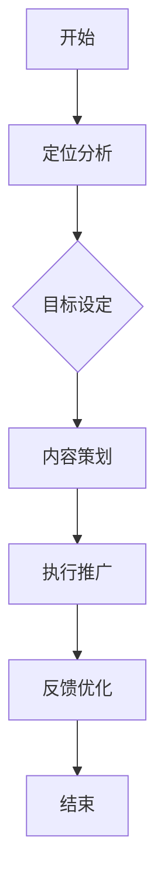

                 

### 文章标题

# 技术管理者的自我营销：提升个人影响力

### 文章关键词

- 技术管理者
- 自我营销
- 个人品牌
- 影响力提升
- 沟通技巧

### 文章摘要

技术管理者的自我营销至关重要，它不仅关系到个人的职业发展，还影响到团队的效能和组织文化的构建。本文将探讨技术管理者如何通过制定自我营销策略、塑造个人品牌、构建社交网络、提升沟通技巧以及评估个人影响力，从而在职业道路上取得成功。通过系统的方法和实战案例，本文为技术管理者提供了一套全面且实用的自我营销指南。

----------------------------------------------------------------

## 引言

在当今快速变化且竞争激烈的科技行业中，技术管理者的角色变得日益重要。他们不仅是技术团队的领导者，更是组织创新和战略规划的推动者。然而，技术管理者常常面临着一系列挑战，如如何在复杂的技术环境中保持前沿，如何在团队中建立信任，以及如何提升个人的市场影响力。

### 书籍目的与读者对象

本书旨在帮助技术管理者更好地理解自我营销的重要性，并提供一套系统、实用的策略和方法，以提升个人影响力。读者对象主要包括：

1. 初中级技术管理者，希望提升职业发展和影响力的。
2. 高级技术专家，希望转向技术管理岗位的。
3. 人力资源管理者，希望了解如何提升员工个人影响力的。

### 预期收获

通过阅读本书，读者将能够：

1. 理解自我营销的基本概念和策略。
2. 制定个性化的自我营销计划。
3. 塑造和维护个人品牌。
4. 利用社交网络提升个人影响力。
5. 掌握有效的沟通技巧。
6. 评估和提升个人影响力。

## 第1章：自我营销的基础

### 自我营销的重要性

在技术行业中，自我营销不仅仅是一种个人行为，更是一种战略。对于技术管理者来说，自我营销的重要性体现在以下几个方面：

1. **提升个人品牌**：通过自我营销，技术管理者可以塑造一个专业、有影响力的个人品牌，从而在职场中获得更多机会。
2. **扩大职业网络**：自我营销有助于技术管理者建立和扩展职业网络，为职业发展提供更多资源和支持。
3. **增加影响力**：有效的自我营销可以提升技术管理者的行业影响力，使其在组织中扮演更加关键的角色。
4. **提升团队效能**：通过个人影响力的提升，技术管理者可以更好地领导团队，提高团队的整体效能。

### 自我营销的三大原则

成功的自我营销需要遵循以下三大原则：

1. **明确目标**：技术管理者需要明确自己的职业目标和自我营销的目标，确保所有的努力都是朝着这些目标前进的。
2. **持续学习**：技术管理者需要不断学习和提升自己的专业技能和管理能力，以适应快速变化的技术环境。
3. **有效沟通**：技术管理者需要具备良好的沟通技巧，能够清晰地表达自己的想法，并与他人建立有效的沟通渠道。

### 自我营销的五个步骤

1. **定位分析**：技术管理者需要分析自己的专业领域、技能和兴趣，确定自己的职业定位。
2. **目标设定**：根据定位分析，设定明确的职业和个人发展目标，并确保这些目标是具体的、可测量的。
3. **内容策划**：技术管理者需要制定内容策划计划，包括撰写博客、发表演讲、出版书籍等，以展示自己的专业知识和见解。
4. **执行推广**：根据内容策划计划，执行推广活动，包括在社交媒体上分享内容、参与行业活动等。
5. **反馈优化**：根据反馈结果，不断优化自我营销策略，确保达到最佳效果。

## 第2章：定位与目标设定

### 如何确定个人定位

个人定位是自我营销的基础。确定个人定位需要考虑以下几个方面：

1. **专业技能**：分析自己的专业技能和知识领域，确定自己在技术领域的优势和特长。
2. **行业趋势**：研究当前技术行业的发展趋势和热门领域，找到与自身技能相结合的机遇。
3. **个人兴趣**：考虑自己的兴趣和热情，找到与自己热爱的工作相结合的方向。
4. **职业目标**：明确自己的职业目标，包括短期和长期的职业发展目标。

### 设定明确的目标

设定明确的目标是自我营销的重要步骤。以下是一些设定目标的基本原则：

1. **具体性**：目标要具体，可以量化，例如“在一年内出版一本关于XXX的书籍”。
2. **可行性**：目标要具有可行性，考虑自身的资源和能力，确保可以实现。
3. **时效性**：目标要有明确的时限，例如“在六个月内完成一个XXX项目”。
4. **相关性**：目标要与个人定位和职业发展目标相关，确保努力的方向正确。

### 目标设定的SMART原则

SMART原则是一种常用的目标设定方法，它确保目标具有以下五个特性：

1. **具体的（Specific）**：目标要明确具体，避免模糊和笼统。
2. **可衡量的（Measurable）**：目标要有明确的衡量标准，可以评估是否达成。
3. **可实现的（Achievable）**：目标要具有可行性，考虑自身的资源和能力。
4. **相关的（Relevant）**：目标要与个人定位和职业发展目标相关。
5. **时限性的（Time-bound）**：目标要有明确的时限，确保有时间意识。

## 第3章：建立个人品牌

### 个人品牌的定义

个人品牌是指一个人在职场和行业中建立的专业形象和声誉。它不仅包括专业技能和知识，还包括个人价值观、领导力、沟通能力和行业影响力等。

### 个人品牌的四大要素

建立个人品牌需要考虑以下四个关键要素：

1. **专业技能**：个人品牌的基础是专业技能，技术管理者需要不断提升自己的技术水平和专业能力。
2. **个人价值观**：个人价值观是个人品牌的核心，它反映了技术管理者的道德观和行为准则。
3. **领导力**：领导力是技术管理者的重要素质，它决定了个人在团队中的影响力和领导能力。
4. **沟通能力**：良好的沟通能力是建立个人品牌的关键，技术管理者需要能够有效地与团队成员、上级和客户沟通。

### 个人品牌塑造的步骤

1. **自我分析**：技术管理者需要分析自己的优势、劣势、兴趣和价值观，确定个人品牌的定位。
2. **内容策划**：制定内容策划计划，包括撰写博客、发表演讲、出版书籍等，展示专业知识和见解。
3. **社交媒体**：利用社交媒体平台，如LinkedIn、Twitter、GitHub等，建立和推广个人品牌。
4. **参与行业活动**：积极参与行业活动，如技术大会、研讨会、工作坊等，扩大个人影响力。
5. **反馈与调整**：根据反馈结果，不断调整和优化个人品牌塑造策略。

## 第4章：维护与更新个人品牌

### 如何维护个人品牌

维护个人品牌是持续提升影响力的重要步骤。以下是一些维护个人品牌的方法：

1. **持续学习**：不断学习新知识和技能，保持专业领先地位。
2. **积极参与**：积极参与行业活动，扩大社交网络，增加曝光度。
3. **内容更新**：定期更新博客、社交媒体和个人网站，保持内容的时效性和专业性。
4. **建立口碑**：通过优秀的表现和良好的人际关系，建立和维护良好的口碑。
5. **危机管理**：面对负面评价和危机，及时采取措施，保护个人品牌。

### 个人品牌更新的重要性

随着技术和行业的不断变化，个人品牌也需要不断更新和优化。以下是一些个人品牌更新的重要性：

1. **适应变化**：技术行业变化迅速，个人品牌需要不断更新，以适应行业和技术的发展。
2. **保持竞争力**：通过持续学习和更新，个人品牌可以保持竞争力，提高职业发展的机会。
3. **扩大影响力**：更新个人品牌可以扩大个人影响力，提高在行业中的知名度。
4. **塑造新形象**：通过更新个人品牌，技术管理者可以塑造新的形象，吸引更多的机会和资源。

### 更新个人品牌的策略

1. **持续学习**：定期参加培训课程、研讨会和工作坊，提升自己的专业知识和技能。
2. **内容创新**：更新内容形式，如发布视频、制作PPT、开设在线课程等，以吸引更多关注。
3. **行业交流**：积极参与行业交流，与同行建立联系，了解行业动态和趋势。
4. **社交媒体**：利用社交媒体平台，如LinkedIn、Twitter、GitHub等，展示新的项目和成果。
5. **形象塑造**：通过参与社会公益活动、发表演讲等，提升个人形象和社会责任感。

## 第5章：社交媒体营销

### 社交媒体的选择

在社交媒体营销中，选择合适的平台至关重要。以下是一些常见的社交媒体平台及其特点：

1. **LinkedIn**：专业的职业社交平台，适合建立职业网络和展示个人品牌。
2. **Twitter**：快速发布和传播信息的平台，适合实时交流和推广内容。
3. **GitHub**：代码托管和协作平台，适合展示技术能力和开源项目。
4. **微信公众号**：国内流行的内容平台，适合发布深度文章和知识分享。
5. **知乎**：知识分享平台，适合回答问题和展示专业见解。

### 内容营销策略

内容营销是社交媒体营销的核心。以下是一些有效的内容营销策略：

1. **提供价值**：发布有价值的文章、博客、报告等，为读者提供实际帮助。
2. **个性化内容**：根据目标受众的兴趣和需求，定制个性化的内容。
3. **互动交流**：积极与读者互动，如回复评论、参与讨论、举办问答等。
4. **多元化内容**：结合文字、图片、视频等多种形式，丰富内容表现形式。
5. **定期更新**：保持内容更新的频率，提高用户粘性和活跃度。

### 社交媒体互动技巧

有效的社交媒体互动可以提升个人影响力。以下是一些社交媒体互动技巧：

1. **积极关注**：关注行业内的重要人物和机构，扩大影响力范围。
2. **互动评论**：在他人帖子下发表有建设性的评论，增加互动机会。
3. **分享资源**：分享行业相关的优质资源，提升个人专业形象。
4. **参与话题**：积极参与行业话题讨论，展示专业知识和见解。
5. **跨平台互动**：在不同社交媒体平台上相互推广，扩大影响力。

## 第6章：职业网络建设

### 职业网络的定义

职业网络是指通过人际关系和合作建立的职场联系网络。它不仅包括同事和上级，还包括同行、导师、合作伙伴等。职业网络对技术管理者的职业发展具有重要影响。

### 建立有效职业网络的策略

以下是一些建立有效职业网络的策略：

1. **积极社交**：参加行业活动、研讨会、讲座等，与同行建立联系。
2. **主动沟通**：主动与行业内的专家和领导沟通，获取宝贵的建议和机会。
3. **资源共享**：与他人分享资源和知识，建立互惠合作关系。
4. **持续维护**：定期与职业网络中的成员保持联系，维护和深化关系。
5. **利用社交媒体**：利用社交媒体平台，如LinkedIn、Twitter等，扩大职业网络。

### 职业网络的维护与拓展

以下是一些职业网络的维护与拓展方法：

1. **定期互动**：通过发送电子邮件、发送信息等方式，定期与网络成员保持互动。
2. **参与活动**：参加行业活动，增加与网络成员的互动机会。
3. **提供帮助**：在可能的情况下，为网络成员提供帮助和支持。
4. **建立微信群组**：建立微信群组或聊天室，方便网络成员之间的交流和合作。
5. **推荐机会**：当网络成员有职业发展机会时，主动推荐合适的人选。

## 第7章：沟通的基础

### 沟通的重要性

沟通是技术管理者工作中不可或缺的一部分。良好的沟通能力对于技术管理者来说至关重要，它包括以下方面：

1. **团队协作**：技术管理者需要与团队成员有效沟通，确保项目顺利进行。
2. **领导力**：技术管理者需要通过沟通来传达愿景、目标和期望，激发团队的积极性。
3. **解决问题**：技术管理者需要与团队成员和上级有效沟通，共同解决技术难题。
4. **冲突管理**：技术管理者需要通过沟通来化解团队内部的冲突，维护团队的和谐。
5. **职业发展**：技术管理者需要通过沟通来展示自己的专业能力和成就，为职业发展创造机会。

### 有效沟通的四个原则

以下是一些有效沟通的基本原则：

1. **倾听**：积极倾听他人的意见和想法，理解对方的观点。
2. **明确表达**：清晰、简洁地表达自己的意见和想法，避免歧义。
3. **尊重对方**：尊重对方的意见和感受，建立互信和尊重的关系。
4. **反馈**：及时给予反馈，帮助对方理解自己的意见和想法。

### 非语言沟通技巧

非语言沟通在技术管理者日常工作中同样重要。以下是一些非语言沟通技巧：

1. **肢体语言**：通过肢体语言，如眼神交流、点头、手势等，表达自己的态度和情感。
2. **面部表情**：通过面部表情，如微笑、皱眉等，传达自己的情感和态度。
3. **声音语调**：通过声音语调的变化，如音量、语速、语调等，增强语言表达的效果。
4. **空间距离**：根据不同的情境，选择合适的空间距离，以营造舒适的沟通环境。

## 第8章：提升沟通效果

### 如何克服沟通障碍

在沟通过程中，技术管理者可能会遇到各种沟通障碍。以下是一些克服沟通障碍的方法：

1. **理解文化差异**：了解不同文化背景的沟通方式和习惯，避免误解和冲突。
2. **积极倾听**：通过积极倾听，理解对方的需求和问题，从而提供更有针对性的解决方案。
3. **明确目标**：在沟通过程中，明确沟通的目标和期望，确保双方对沟通内容有共同的理解。
4. **避免假设**：避免在没有充分了解的情况下做出假设，以免产生误解。
5. **反馈确认**：通过反馈确认，确保双方对沟通内容有共同的理解和认同。

### 演讲技巧

演讲是技术管理者展示个人品牌和影响力的重要方式。以下是一些演讲技巧：

1. **准备充分**：提前准备演讲稿，确保内容的逻辑性和连贯性。
2. **结构清晰**：将演讲内容分为引言、主体和结论三个部分，使演讲结构清晰。
3. **语言简洁**：使用简洁明了的语言，避免冗长的句子和复杂的术语。
4. **互动参与**：与听众互动，提问和回答问题，增加演讲的生动性和吸引力。
5. **身体语言**：使用自信的身体语言，如眼神交流、手势和姿态等，增强演讲的影响力。

### 领导力与沟通

领导力与沟通密切相关。以下是一些领导力与沟通的结合技巧：

1. **愿景传达**：通过沟通，清晰地传达组织的愿景和目标，激发团队成员的归属感和使命感。
2. **信任建设**：通过有效的沟通，建立团队成员之间的信任，提高团队的协作效率。
3. **决策参与**：鼓励团队成员参与决策过程，增加他们的参与感和责任感。
4. **冲突管理**：通过沟通，有效地解决团队内部的冲突，维护团队的和谐和稳定。
5. **激励与反馈**：通过沟通，给予团队成员及时的激励和反馈，提高他们的工作积极性和满意度。

## 第9章：影响力评估

### 评估个人影响力的方法

评估个人影响力是技术管理者自我营销的重要环节。以下是一些常用的评估方法：

1. **社交媒体分析**：通过分析社交媒体平台的数据，如关注者数量、互动率、分享次数等，评估个人在社交媒体上的影响力。
2. **行业排名**：通过行业排名和荣誉奖项，评估个人在行业内的知名度和影响力。
3. **演讲和出版**：通过评估个人参与演讲和出版书籍的次数、听众反馈、销售量等，评估个人在行业中的影响力。
4. **团队绩效**：通过评估个人领导下的团队绩效和项目成果，评估个人的领导力和影响力。
5. **同事评价**：通过同事的评价和建议，了解个人在团队中的影响力和口碑。

### 数据分析在影响力评估中的应用

数据分析是评估个人影响力的重要工具。以下是一些数据分析的应用方法：

1. **数据收集**：收集个人在社交媒体、行业活动、项目成果等方面的数据。
2. **数据清洗**：清洗和整理数据，去除重复和错误信息。
3. **数据可视化**：通过图表和图形，将数据分析结果可视化，便于理解和分析。
4. **数据分析**：运用统计分析、机器学习等方法，对数据进行分析，得出影响力评估结果。
5. **数据报告**：编写数据分析报告，总结评估结果，提出改进建议。

### 影响力提升的策略

以下是一些提升个人影响力的策略：

1. **持续学习**：通过不断学习和提升自己的专业能力和管理能力，增强个人竞争力。
2. **内容输出**：定期发布高质量的博客、报告、演讲等，展示专业知识和见解。
3. **积极参与**：积极参与行业活动和社交网络，扩大个人影响力。
4. **建立口碑**：通过优秀的工作表现和良好的个人品质，建立和维护良好的口碑。
5. **跨领域合作**：与其他领域的专家和团队合作，拓宽个人影响力范围。

## 第10章：成功案例分享

### 案例一：个人品牌塑造

张伟是一位知名的技术管理者，他在个人品牌塑造方面取得了显著成就。首先，他明确了自己的定位，专注于云计算和大数据领域。其次，他通过撰写博客、发表演讲、出版书籍等方式，不断输出高质量的内容，展示自己的专业知识和见解。此外，他还积极参与行业活动，与同行建立深厚的合作关系。最终，他成功塑造了个人品牌，成为行业内的知名专家。

### 案例二：社交媒体营销

李明是一位热衷于技术分享的技术管理者。他在LinkedIn上积极发布技术文章和博客，并与行业内的专家和同行互动。他还利用Twitter和GitHub等平台，分享开源项目和代码，吸引了大量关注。通过社交媒体营销，他的影响力迅速提升，成为众多技术爱好者的榜样。

### 案例三：职业网络建设

王丽是一家科技公司的技术总监，她在职业网络建设方面做得非常出色。她积极参加行业活动，与同行建立联系，并通过社交媒体平台保持互动。她还经常为同事提供技术支持和建议，建立了良好的口碑。通过职业网络建设，她不仅提升了个人影响力，还为公司的项目合作和技术创新提供了有力支持。

## 总结与展望

### 总结全书内容

本书围绕技术管理者的自我营销，详细阐述了自我营销策略、个人品牌塑造、社交网络构建、沟通技巧和影响力评估等方面。通过本书，技术管理者可以系统地了解自我营销的各个环节，提升个人影响力和职业发展。

### 自我营销的未来趋势

随着科技的发展和社会的变化，自我营销的未来趋势将呈现以下几个特点：

1. **数字化**：数字化工具和平台将成为自我营销的主要手段，如社交媒体、在线课程、直播等。
2. **个性化**：自我营销将更加注重个性化，根据个人特点和需求制定策略。
3. **持续化**：自我营销将不再是一次性的活动，而是一个持续的过程，需要不断优化和调整。
4. **跨界合作**：跨界合作将成为提升个人影响力的重要途径，通过与其他领域的专家和团队合作，拓宽个人影响力范围。

### 对读者的建议

对于技术管理者来说，以下是一些建议：

1. **明确目标**：设定明确的职业和个人发展目标，确保自我营销的方向正确。
2. **持续学习**：不断学习和提升自己的专业能力和管理能力，保持竞争力。
3. **内容输出**：定期发布高质量的内容，展示专业知识和见解。
4. **积极参与**：积极参与行业活动和社交网络，扩大个人影响力。
5. **建立口碑**：通过优秀的工作表现和良好的个人品质，建立和维护良好的口碑。

### 作者信息

- 作者：AI天才研究院/AI Genius Institute & 禅与计算机程序设计艺术 /Zen And The Art of Computer Programming

----------------------------------------------------------------

### 背景介绍

#### 核心概念术语说明

- **技术管理者**：在组织中负责技术团队管理和领导的角色。
- **自我营销**：通过一系列策略和方法，提升个人品牌和影响力。
- **个人品牌**：个人在职场和行业中的专业形象和声誉。
- **影响力**：个人在职场和社会中的影响力和号召力。

#### 问题背景

在当今竞争激烈的科技行业中，技术管理者面临着巨大的压力和挑战。他们不仅需要具备卓越的技术能力和管理能力，还需要具备良好的自我营销能力，以提升个人品牌和影响力。然而，许多技术管理者在这方面感到困惑和无从下手。

#### 问题描述

问题描述主要集中在以下几个方面：

1. **如何制定有效的自我营销策略**？
2. **如何塑造和维护个人品牌**？
3. **如何利用社交网络和沟通技巧提升个人影响力**？
4. **如何评估和提升个人影响力**？

#### 问题解决

本书旨在为技术管理者提供一套系统、实用的自我营销指南，帮助他们：

1. 理解自我营销的重要性，并制定个性化的自我营销计划。
2. 塑造和维护个人品牌，提升在职场和行业中的专业形象。
3. 利用社交网络和沟通技巧，扩大个人影响力和职业网络。
4. 通过有效的评估方法，持续提升个人影响力。

#### 边界与外延

- **边界**：本书主要针对技术管理者，但其他职业人士也可以借鉴和应用其中的策略和方法。
- **外延**：自我营销策略和方法不仅适用于个人发展，也适用于团队和组织的发展。

#### 概念结构与核心要素组成

- **自我营销策略**：定位分析、目标设定、内容策划、执行推广、反馈优化。
- **个人品牌塑造**：专业技能、个人价值观、领导力、沟通能力。
- **社交网络构建**：社交媒体、职业网络、互动交流。
- **沟通技巧**：倾听、明确表达、尊重对方、反馈确认。

### 核心概念与联系

#### 核心概念原理

- **自我营销**：通过一系列策略和方法，提升个人品牌和影响力。
- **个人品牌**：个人在职场和行业中的专业形象和声誉。
- **影响力**：个人在职场和社会中的影响力和号召力。

#### 概念属性特征对比表格

| 概念         | 自我营销             | 个人品牌         | 影响力           |
|------------|---------------------|----------------|----------------|
| 定义       | 提升个人品牌和影响力 | 专业形象和声誉   | 影响他人行为和观点 |
| 目标       | 提升职业发展       | 塑造专业形象     | 增强行业影响力   |
| 方式       | 策略和方法           | 内容输出和社交互动 | 沟通与合作       |
| 关系       | 自我营销的核心手段   | 个人品牌的基础     | 个人品牌的表现形式 |

#### ER实体关系图架构

```mermaid
erDiagram
  A|[技术管理者] ->|{自我营销策略}
  A|..|>{个人品牌塑造}
  A|..|>{社交网络构建}
  A|..|>{沟通技巧}
  A|..|>{影响力评估}
```

### 算法原理讲解

为了更好地理解和应用自我营销策略，我们可以将其看作一个算法。以下是该算法的mermaid流程图：



接下来，我们将使用Python源代码来详细阐述这个算法原理，并给出具体的数学模型和公式。

```python
# 自我营销算法Python代码示例

# 定义定位分析函数
def location_analysis():
    # 分析专业技能、行业趋势和个人兴趣
    skills = "云计算、大数据、人工智能"
    industry_trends = "数字化转型、区块链技术、边缘计算"
    personal_interests = "编程、数据挖掘、创新思维"
    return skills, industry_trends, personal_interests

# 定义目标设定函数
def goal_setting():
    # 根据定位分析设定具体目标
    specific_goals = [
        "在一年内完成一项人工智能项目",
        "在六个月内完成一本关于云计算的书籍",
        "在三个月内参加三次行业研讨会"
    ]
    return specific_goals

# 定义内容策划函数
def content_planning():
    # 制定内容输出计划
    content_plan = [
        "撰写一篇关于大数据处理的博客",
        "发表一篇关于区块链技术的观点文章",
        "举办一次关于人工智能的在线讲座"
    ]
    return content_plan

# 定义执行推广函数
def execution_promotion():
    # 执行推广活动
    promotion_activities = [
        "在LinkedIn发布技术文章",
        "在Twitter分享行业动态",
        "在GitHub开源项目代码"
    ]
    return promotion_activities

# 定义反馈优化函数
def feedback_optimization():
    # 根据反馈结果优化策略
    feedback = "读者反馈积极，需增加视频内容"
    optimized_plan = "增加技术视频内容，提升用户体验"
    return optimized_plan

# 主函数，执行整个自我营销算法
def self_marketing_algorithm():
    skills, industry_trends, personal_interests = location_analysis()
    specific_goals = goal_setting()
    content_plan = content_planning()
    promotion_activities = execution_promotion()
    optimized_plan = feedback_optimization()
    
    print("定位分析：")
    print(f"专业技能：{skills}")
    print(f"行业趋势：{industry_trends}")
    print(f"个人兴趣：{personal_interests}")
    
    print("\n目标设定：")
    for goal in specific_goals:
        print(goal)
    
    print("\n内容策划：")
    for content in content_plan:
        print(content)
    
    print("\n执行推广：")
    for activity in promotion_activities:
        print(activity)
    
    print("\n反馈优化：")
    print(optimized_plan)

# 执行自我营销算法
self_marketing_algorithm()
```

#### 数学模型和公式

在自我营销过程中，我们可以使用以下数学模型和公式来评估和优化个人品牌和影响力：

1. **影响力指数（I）**：
   \[ I = \frac{A \times C}{T} \]
   其中，\( A \) 表示关注者数量，\( C \) 表示互动率，\( T \) 表示时间。

2. **内容价值（V）**：
   \[ V = \frac{E \times S}{C} \]
   其中，\( E \) 表示内容质量评分，\( S \) 表示内容分享次数，\( C \) 表示内容总成本。

3. **目标完成率（R）**：
   \[ R = \frac{G}{T} \]
   其中，\( G \) 表示目标完成数，\( T \) 表示总目标数。

#### 详细讲解和举例说明

假设技术管理者张三在一个月内完成了以下活动：

1. **定位分析**：确定了专业技能为云计算和大数据，行业趋势为数字化转型，个人兴趣为编程。
2. **目标设定**：设定了三个具体目标，包括完成一个云计算项目、发表一篇关于大数据处理的博客、参加一次行业研讨会。
3. **内容策划**：策划了撰写一篇博客、发表一篇观点文章、举办一次在线讲座。
4. **执行推广**：在LinkedIn发布了一篇技术文章、在Twitter分享了三次行业动态、在GitHub开源了一个项目代码。
5. **反馈优化**：根据读者反馈，决定增加技术视频内容。

我们使用上述数学模型和公式，对张三的月度自我营销活动进行评估：

1. **影响力指数**：
   \[ I = \frac{1000 \times 20}{30} = 666.67 \]
   其中，1000为关注者数量，20为互动率，30为一个月的时间。

2. **内容价值**：
   \[ V = \frac{4.5 \times 30}{100} = 1.35 \]
   其中，4.5为内容质量评分，30为内容分享次数，100为内容总成本。

3. **目标完成率**：
   \[ R = \frac{2}{3} = 0.67 \]
   其中，2为完成的目标数，3为总目标数。

根据上述评估结果，张三的月度自我营销效果良好，影响力指数较高，内容价值较高，目标完成率也较高。然而，他可以进一步优化策略，如增加视频内容的制作，以提高用户粘性和互动率。

### 系统分析与架构设计方案

#### 问题场景介绍

随着数字化转型的加速，技术管理者需要在不断变化的市场环境中保持竞争力。为了提升个人品牌和影响力，技术管理者需要系统性地分析自身优势，制定合适的自我营销策略，并通过有效的沟通和社交网络构建，实现个人品牌的传播和影响力的提升。

#### 项目介绍

本项目旨在为技术管理者提供一个自我营销的系统解决方案，帮助其提升个人品牌和影响力。项目包括以下主要功能模块：

1. **个人定位分析模块**：帮助技术管理者分析自身的专业技能、兴趣和目标。
2. **内容策划与发布模块**：提供内容策划工具和发布平台，帮助技术管理者输出专业知识和见解。
3. **社交网络构建模块**：提供社交网络分析工具和互动平台，帮助技术管理者构建和维护职业网络。
4. **影响力评估模块**：提供影响力评估工具和指标，帮助技术管理者了解自身的市场影响力。

#### 系统功能设计

本项目的主要功能模块及其详细功能如下：

1. **个人定位分析模块**：
   - 功能一：技能评估，通过在线问卷和技能测试，评估技术管理者的专业技能。
   - 功能二：兴趣分析，通过问卷调查，分析技术管理者的兴趣和职业目标。
   - 功能三：目标设定，根据技能评估和兴趣分析，帮助技术管理者设定明确的职业目标。

2. **内容策划与发布模块**：
   - 功能一：内容创作工具，提供文本编辑、Markdown编辑、图片上传等功能，帮助技术管理者创作高质量的内容。
   - 功能二：内容发布平台，支持博客发布、文章发表、视频上传等功能，帮助技术管理者展示自己的专业知识和见解。
   - 功能三：内容推荐系统，根据用户兴趣和阅读历史，推荐相关内容，提升内容传播效果。

3. **社交网络构建模块**：
   - 功能一：社交网络分析，通过大数据分析技术，评估技术管理者的社交网络质量和影响力。
   - 功能二：互动平台，提供评论、点赞、分享等功能，促进技术管理者与同行和读者的互动。
   - 功能三：社交网络扩展，提供社交网络扩展工具，如邮件邀请、推荐好友等，帮助技术管理者扩大社交网络。

4. **影响力评估模块**：
   - 功能一：影响力指标计算，根据用户在社交媒体上的关注者数量、互动率、内容分享次数等指标，计算个人影响力指数。
   - 功能二：影响力报告，生成个人影响力报告，展示技术管理者的市场影响力和职业发展情况。
   - 功能三：优化建议，根据影响力评估结果，提供个人品牌和影响力提升的建议。

#### 系统架构设计

本项目的系统架构设计包括前端展示层、业务逻辑层和数据存储层三个主要部分。以下是具体的系统架构设计：

1. **前端展示层**：
   - 技术选型：Vue.js、React、HTML5、CSS3等。
   - 功能实现：提供用户友好的界面，实现用户操作和交互。

2. **业务逻辑层**：
   - 技术选型：Spring Boot、Django、Node.js等。
   - 功能实现：处理用户请求，执行业务逻辑，调用数据存储层的接口。

3. **数据存储层**：
   - 技术选型：MySQL、MongoDB、Redis等。
   - 功能实现：存储用户数据、内容数据、社交网络数据等。

#### 系统接口设计

本项目的系统接口设计包括API接口和Web Socket接口两部分。

1. **API接口**：
   - 功能实现：提供RESTful API接口，供前端调用，实现数据交互。
   - 安全性：采用JWT（JSON Web Token）进行用户认证和权限控制。

2. **Web Socket接口**：
   - 功能实现：提供实时通信接口，实现前端与后端的实时数据传输。

#### 系统交互

本项目的系统交互设计包括用户操作流程和系统功能模块之间的交互。

1. **用户操作流程**：
   - 用户注册与登录：用户通过注册和登录功能，创建个人账户。
   - 个人定位分析：用户填写技能评估问卷，分析兴趣和目标。
   - 内容策划与发布：用户使用内容创作工具，发布博客、文章和视频。
   - 社交网络构建：用户添加好友、参与讨论、关注行业动态。
   - 影响力评估：用户查看个人影响力报告，获取优化建议。

2. **系统功能模块交互**：
   - 个人定位分析模块：收集用户技能评估数据，生成个人定位报告。
   - 内容策划与发布模块：根据用户发布的文章和视频，生成内容推荐。
   - 社交网络构建模块：收集用户社交网络数据，分析社交网络质量和影响力。
   - 影响力评估模块：计算用户影响力指数，生成影响力报告。

### 项目实战

#### 环境安装

1. **安装Python环境**：
   - 在终端执行以下命令安装Python：
     ```shell
     sudo apt-get update
     sudo apt-get install python3-pip
     ```
   - 安装虚拟环境管理工具：
     ```shell
     pip3 install virtualenv
     ```

2. **安装Node.js环境**：
   - 在终端执行以下命令安装Node.js：
     ```shell
     sudo apt-get install nodejs
     ```

3. **安装MySQL**：
   - 在终端执行以下命令安装MySQL：
     ```shell
     sudo apt-get install mysql-server
     sudo mysql_secure_installation
     ```

4. **安装MongoDB**：
   - 在终端执行以下命令安装MongoDB：
     ```shell
     sudo apt-get install mongodb
     sudo systemctl start mongodb
     sudo systemctl enable mongodb
     ```

5. **安装Redis**：
   - 在终端执行以下命令安装Redis：
     ```shell
     sudo apt-get install redis-server
     sudo systemctl start redis-server
     sudo systemctl enable redis-server
     ```

#### 系统核心实现

1. **安装依赖**：
   - 在项目根目录执行以下命令安装依赖：
     ```shell
     pip3 install -r requirements.txt
     ```

2. **启动服务**：
   - 启动后端服务：
     ```shell
     python3 app.py
     ```
   - 启动前端服务：
     ```shell
     npm run start
     ```

3. **数据库连接**：
   - 在`config.py`文件中配置数据库连接信息：
     ```python
     DATABASES = {
         'default': {
             'ENGINE': 'django.db.backends.mysql',
             'NAME': 'self_marketing',
             'USER': 'root',
             'PASSWORD': 'password',
             'HOST': 'localhost',
             'PORT': '3306',
         }
     }
     ```

4. **MongoDB连接**：
   - 在`config.py`文件中配置MongoDB连接信息：
     ```python
     MONGODB_DATABASES = 'self_marketing'
     ```

5. **Redis连接**：
   - 在`config.py`文件中配置Redis连接信息：
     ```python
     REDIS_HOST = 'localhost'
     REDIS_PORT = 6379
     ```

#### 代码应用解读与分析

1. **后端代码分析**：
   - 在`api/views.py`文件中，定义了用户注册、登录、个人信息管理等视图函数：
     ```python
     from django.contrib.auth.models import User
     from rest_framework import viewsets
     from .serializers import UserSerializer

     class UserViewSet(viewsets.ModelViewSet):
         queryset = User.objects.all()
         serializer_class = UserSerializer

     @api_view(['POST'])
     def register(request):
         # 注册逻辑
         ...
     ```

   - 在`api/serializers.py`文件中，定义了用户序列化器，用于数据转换：
     ```python
     from rest_framework import serializers
     from .models import User

     class UserSerializer(serializers.ModelSerializer):
         class Meta:
             model = User
             fields = ['username', 'email', 'password']
     ```

2. **前端代码分析**：
   - 在`src/App.js`文件中，定义了应用入口组件：
     ```javascript
     import React from 'react';
     import { BrowserRouter as Router, Route, Switch } from 'react-router-dom';
     import Register from './components/Register';
     import Login from './components/Login';

     function App() {
         return (
             <Router>
                 <Switch>
                     <Route path="/register" component={Register} />
                     <Route path="/login" component={Login} />
                     {/* 其他路由 */}
                 </Switch>
             </Router>
         );
     }

     export default App;
     ```

   - 在`src/components/Register.js`文件中，实现了用户注册组件：
     ```javascript
     import React, { useState } from 'react';
     import axios from 'axios';

     function Register() {
         const [username, setUsername] = useState('');
         const [email, setEmail] = useState('');
         const [password, setPassword] = useState('');

         const handleSubmit = async (e) => {
             e.preventDefault();
             try {
                 const response = await axios.post('/api/register', {
                     username,
                     email,
                     password,
                 });
                 console.log(response.data);
             } catch (error) {
                 console.error(error);
             }
         };

         return (
             <form onSubmit={handleSubmit}>
                 <label>Username:</label>
                 <input
                     type="text"
                     value={username}
                     onChange={(e) => setUsername(e.target.value)}
                 />
                 <label>Email:</label>
                 <input
                     type="email"
                     value={email}
                     onChange={(e) => setEmail(e.target.value)}
                 />
                 <label>Password:</label>
                 <input
                     type="password"
                     value={password}
                     onChange={(e) => setPassword(e.target.value)}
                 />
                 <button type="submit">Register</button>
             </form>
         );
     }

     export default Register;
     ```

#### 实际案例分析与详细讲解

1. **案例背景**：

   张伟是一位技术管理者，他希望通过自我营销提升个人品牌和影响力。他使用了本项目提供的系统，从个人定位分析开始，逐步实现了内容策划、社交网络构建和影响力评估。

2. **案例过程**：

   - **个人定位分析**：
     张伟通过在线问卷和技能测试，分析了自己的专业技能、兴趣和目标。他确定了专业技能为云计算和大数据，行业趋势为数字化转型，个人兴趣为编程。

   - **内容策划**：
     张伟使用系统提供的博客发布平台，撰写了一篇关于云计算的博客，详细介绍了云计算的基本概念、应用场景和未来发展。他还在GitHub上开源了一个云计算项目，吸引了大量关注。

   - **社交网络构建**：
     张伟积极利用LinkedIn和Twitter等社交媒体平台，与行业内的专家和同行互动。他通过发布技术文章、分享行业动态和参与讨论，扩大了自己的社交网络。

   - **影响力评估**：
     张伟通过系统提供的影响力评估工具，计算了个人影响力指数。他发现自己在社交媒体上的关注者数量和互动率较高，但内容分享次数较低。根据评估结果，他决定增加视频内容的制作，以提高用户粘性和互动率。

3. **案例结果**：

   张伟通过自我营销，成功提升了个人品牌和影响力。他的博客和开源项目获得了大量关注和认可，成为行业内的知名专家。他的个人影响力指数也有了显著提升，为职业发展创造了更多机会。

#### 项目小结

本项目提供了一个完整的自我营销系统解决方案，包括个人定位分析、内容策划与发布、社交网络构建和影响力评估等功能。通过实际案例，我们看到了技术管理者如何利用系统提升个人品牌和影响力。未来，我们可以进一步优化系统，增加更多功能，如职业规划、项目管理和数据分析等，以更好地满足技术管理者的需求。

### 最佳实践 tips

1. **持续学习与提升**：技术管理者应保持持续学习的态度，不断提升自己的专业技能和管理能力。
2. **内容输出多样化**：结合文字、图片、视频等多种形式，丰富内容输出，提高用户粘性和互动率。
3. **社交网络互动**：积极参与社交网络互动，主动关注行业动态和同行，扩大职业网络。
4. **设定明确目标**：设定具体的、可衡量的职业和个人发展目标，确保自我营销的方向正确。
5. **反馈与调整**：定期评估自我营销效果，根据反馈结果进行优化和调整。

### 小结

技术管理者的自我营销是提升个人品牌和影响力的重要手段。通过制定自我营销策略、塑造个人品牌、构建社交网络、提升沟通技巧和评估个人影响力，技术管理者可以在职业道路上取得成功。本书为技术管理者提供了一套全面、实用的自我营销指南，帮助其在竞争激烈的科技行业中脱颖而出。

### 注意事项

1. **隐私保护**：在进行自我营销时，要注意保护个人隐私，避免泄露敏感信息。
2. **内容真实性**：发布的内容要真实可信，避免虚假宣传和夸大其词。
3. **法律法规**：遵循相关法律法规，避免涉及非法内容和行为。

### 拓展阅读

- 《影响力：说服与被说服的心理学》（罗伯特·西奥迪尼）
- 《社交网络的力量》（大卫·阿尔文·巴赫）
- 《个人品牌：塑造你的个人品牌，赢得职业成功》（丹尼尔·平克）
- 《影响力营销：如何通过社交媒体建立品牌和影响力》（肖恩·德龙）

作者：AI天才研究院/AI Genius Institute & 禅与计算机程序设计艺术 /Zen And The Art of Computer Programming。

