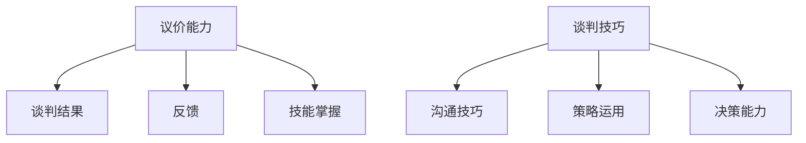
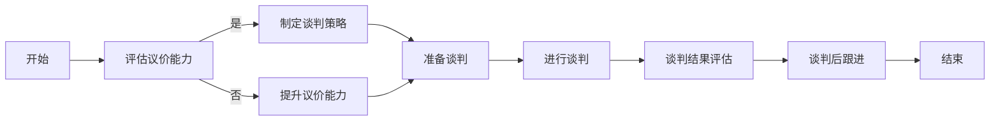
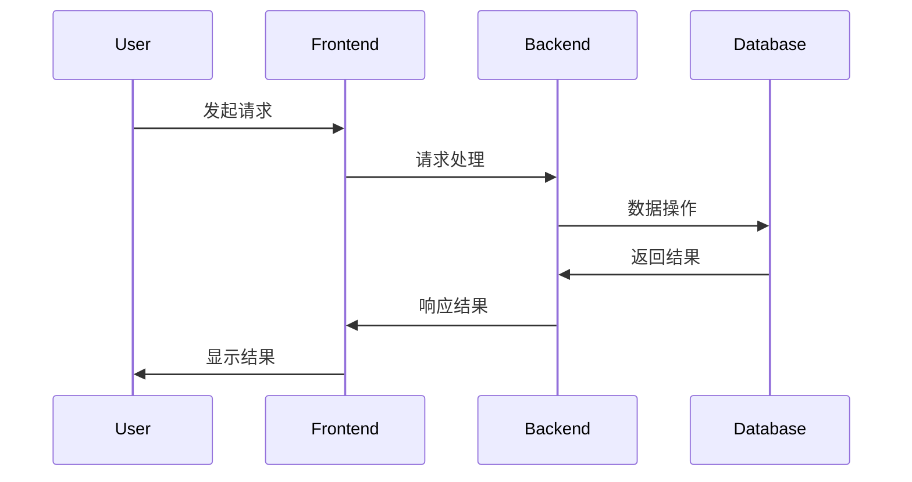
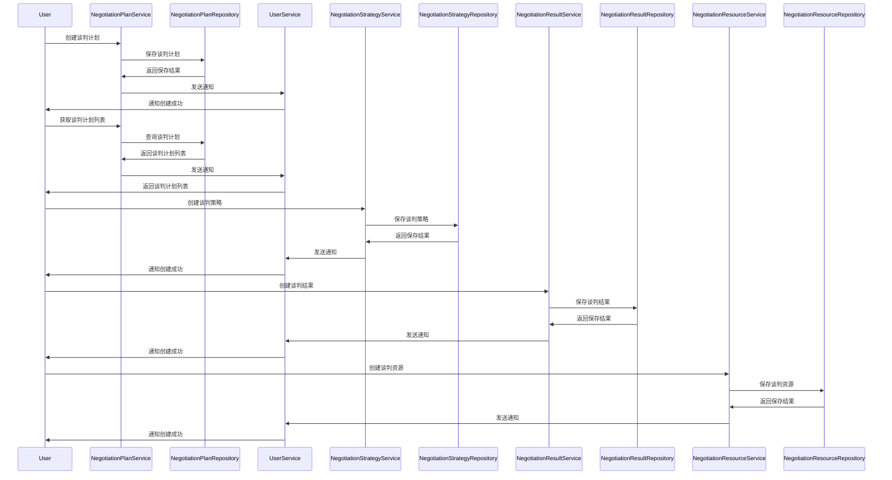

                 


## 《技术管理者的议价能力与谈判技巧》

### 关键词：技术管理者、议价能力、谈判技巧、技术谈判、商业谈判

### 摘要：

本文旨在探讨技术管理者在商业谈判中的议价能力和谈判技巧，通过系统化的分析和实际案例的解析，帮助技术管理者提升自身在技术谈判中的影响力。文章将分为五个主要部分：引言与背景、议价能力、谈判技巧、实际应用和总结与拓展，旨在为技术管理者提供实用的指导。

### 第一部分：引言与背景

#### 1.1 引言

技术管理者在企业中扮演着关键角色，他们不仅要管理技术团队，还要与外部合作伙伴、供应商和客户进行谈判。在这个过程中，议价能力和谈判技巧显得尤为重要。技术管理者需要具备强大的沟通技巧、策略思维和决策能力，以便在谈判中取得有利结果。

#### 1.2 技术管理者的角色与挑战

技术管理者的角色日益复杂，他们不仅要解决技术问题，还要在商业谈判中扮演关键角色。常见的谈判情境包括：

- **与供应商谈判技术支持和服务条款**
- **与客户协商项目范围和交付时间**
- **与合作伙伴讨论技术整合和合作模式**
- **内部跨部门协调资源与利益分配**

在这些情境中，技术管理者面临的挑战包括：

- **技术细节与商业目标的平衡**
- **理解并满足各方的需求**
- **有效沟通与建立信任**

### 第二部分：议价能力

#### 2.1 议价能力的重要性

议价能力是技术管理者在谈判中的核心能力。它决定了技术管理者能否在谈判中获得更有利的结果。议价能力的重要性体现在以下几个方面：

- **资源获取**：通过有效谈判，技术管理者可以获得更多的技术资源、资金和支持。
- **风险管理**：良好的议价能力有助于降低项目风险，确保项目的顺利进行。
- **团队士气**：成功的谈判可以提升团队士气，增强团队凝聚力。

#### 2.2 评估议价能力

评估议价能力是一个重要的步骤，技术管理者需要了解自己的议价水平。以下是一些评估议价能力的指标：

- **谈判结果**：分析过去谈判的成果，了解自己在谈判中的表现。
- **反馈**：收集来自同事、上级和合作伙伴的反馈，了解自己在谈判中的优劣势。
- **技能掌握**：评估自己在沟通技巧、策略运用和决策能力等方面的掌握程度。

#### 2.3 提升议价能力的策略

提升议价能力需要系统的策略和方法。以下是一些建议：

- **提高技术知识**：加强自己在技术领域的知识储备，提高谈判的权威性。
- **学习谈判技巧**：参加相关培训课程，学习谈判的基本原则和策略。
- **培养决策能力**：通过实战经验，提高自己在谈判中的决策能力。
- **建立人脉关系**：与业界同行建立良好的关系，获取更多的信息和资源。

### 第三部分：谈判技巧

#### 3.1 谈判基础

谈判基础是技术管理者在谈判中必须掌握的基本原则和策略。以下是一些关键点：

- **了解对手**：在谈判前，收集关于对手的信息，了解其需求和动机。
- **设定目标**：明确自己的谈判目标和优先级，为谈判设定明确的方向。
- **建立信任**：通过诚信和透明度建立信任，为谈判创造良好的氛围。

#### 3.2 谈判前的准备

谈判前的准备工作至关重要，以下是一些准备工作：

- **信息收集**：收集与谈判相关的信息，包括市场趋势、竞争对手和行业标准。
- **目标设定**：明确自己的谈判目标和可接受的范围。
- **策略制定**：制定谈判策略，包括备选方案和应对策略。

#### 3.3 谈判中的技巧

谈判中，技术管理者需要运用各种技巧来达到自己的目标。以下是一些建议：

- **沟通技巧**：有效沟通是谈判成功的关键，要确保信息传达清晰无误。
- **策略运用**：根据谈判情境，灵活运用各种策略，如妥协、让步和威胁。
- **解决冲突**：在谈判过程中，难免会遇到冲突，要学会如何有效地解决冲突。

#### 3.4 谈判后的跟进

谈判结束后，技术管理者需要做好后续工作，确保谈判成果落地。以下是一些建议：

- **达成协议后的落实**：确保所有协议条款得到执行，避免出现误解和争议。
- **维护关系**：通过后续的沟通和合作，维持与对方的关系，为未来的合作打下基础。
- **谈判遗留问题的处理**：及时处理谈判中遗留的问题，确保项目顺利进行。

### 第四部分：实际应用

#### 4.1 案例研究

通过实际案例研究，我们可以更好地理解谈判技巧的应用。以下是一个案例：

**案例**：一家技术公司需要与一家硬件供应商合作，开发一款高性能的硬件设备。在谈判中，技术管理者通过以下策略取得了成功：

- **了解对手**：技术管理者深入了解供应商的技术能力和市场需求。
- **设定目标**：明确开发高性能硬件设备的目标，并设定合理的交付时间。
- **策略运用**：在谈判中，技术管理者采取了让步策略，通过降低采购量来换取更好的价格和技术支持。

#### 4.2 模拟练习

为了帮助技术管理者更好地掌握谈判技巧，我们可以进行模拟练习。以下是一个模拟谈判场景：

**场景**：技术管理者需要与一家软件开发公司合作，开发一款移动应用。在谈判中，技术管理者需要：

- **收集信息**：了解软件开发公司的技术能力、市场经验和客户评价。
- **设定目标**：明确移动应用的开发目标、功能和交付时间。
- **制定策略**：根据对手的情况，制定合适的谈判策略。

#### 4.3 实战经验分享

邀请有经验的技术管理者分享他们的实战经验和心得，可以为我们提供宝贵的参考。以下是一些分享：

- **实战经验**：一位技术管理者分享了他在与客户谈判时，如何通过有效沟通和策略运用，成功达成协议。
- **心得体会**：另一位技术管理者分享了他在谈判中如何保持冷静和专注，避免情绪化，从而取得更好的谈判结果。

### 第五部分：总结与拓展

#### 5.1 关键点回顾

通过本文的讨论，我们可以总结出以下几个关键点：

- **议价能力的重要性**：议价能力是技术管理者在谈判中的核心能力。
- **谈判技巧的应用**：谈判技巧包括谈判基础、谈判前准备、谈判中和谈判后跟进。
- **实战经验**：通过实际案例和模拟练习，技术管理者可以更好地掌握谈判技巧。

#### 5.2 未来展望

随着技术的不断发展，技术管理者的谈判技巧也在不断演变。未来，技术管理者需要关注以下几个趋势：

- **数字化谈判**：随着数字化工具的普及，技术管理者需要掌握数字化谈判的技巧。
- **跨文化谈判**：随着全球化的发展，技术管理者需要具备跨文化谈判的能力。
- **可持续发展**：在谈判中，技术管理者需要考虑可持续发展的因素，推动技术进步和环境保护。

#### 5.3 拓展阅读

为了进一步提升技术管理者的谈判技巧，以下是一些拓展阅读建议：

- **《谈判的艺术》**：一本经典的谈判教材，详细介绍了谈判的基本原则和策略。
- **《影响力》**：一本关于说服力和影响力的书，对技术管理者在谈判中具有很大的启发。
- **《跨界谈判》**：探讨如何在跨文化、跨领域的谈判中取得成功。

### 第六部分：附录

#### 6.1 谈判技巧工具

- **谈判技巧清单**：提供一份谈判技巧清单，帮助技术管理者在谈判中迅速应用。
- **谈判策略模板**：提供一个谈判策略模板，帮助技术管理者制定个性化的谈判策略。

#### 6.2 参考资料

- **《技术管理者的议价能力与谈判技巧》**：本文的主要参考资料。
- **《谈判学》**：一本关于谈判理论和实践的权威著作。
- **《技术管理者的实战手册》**：一本关于技术管理者如何提升自身能力的实用指南。

---

**作者**：AI天才研究院/AI Genius Institute & 禅与计算机程序设计艺术 /Zen And The Art of Computer Programming

**注意**：本文为示例文章，内容仅供参考。实际撰写时，应根据具体情境和需求进行调整和补充。技术管理者和谈判技巧是复杂且实践性很强的领域，本文旨在提供一个基本框架和思路。在具体应用中，需要结合实际情况，灵活运用各种策略和技巧。

---

## 背景介绍

### 核心概念术语说明

- **技术管理者**：在企业中负责技术团队管理和技术项目规划的高级管理人员。
- **议价能力**：在谈判过程中，通过谈判技巧和策略，获得更有利结果的能力。
- **谈判技巧**：在谈判过程中使用的各种方法和策略，包括沟通技巧、策略运用和决策能力等。

### 问题背景

在当今竞争激烈的市场环境中，技术管理者不仅要解决技术问题，还要在与外部合作伙伴、供应商和客户进行谈判时发挥关键作用。技术管理者在谈判中的议价能力和谈判技巧直接影响企业的利益和项目的成功。然而，许多技术管理者在谈判中缺乏系统的策略和技巧，导致谈判效果不佳。因此，提升技术管理者的议价能力和谈判技巧成为一项重要任务。

### 问题描述

技术管理者在谈判中面临的主要问题包括：

1. **技术细节与商业目标的平衡**：在谈判中，技术管理者需要平衡技术细节和商业目标，确保谈判结果既符合技术要求，又符合企业利益。
2. **信息不对称**：技术管理者往往面临信息不对称的问题，需要通过有效沟通和策略运用来弥补信息差距。
3. **沟通障碍**：在谈判过程中，技术管理者可能面临沟通障碍，需要通过有效沟通技巧来解决问题。
4. **谈判策略不足**：技术管理者在谈判中可能缺乏有效的策略，导致谈判结果不理想。

### 问题解决

为了解决上述问题，技术管理者可以采取以下措施：

1. **提升议价能力**：通过学习和实践，提升自己的议价能力，掌握谈判的基本原则和策略。
2. **加强沟通技巧**：通过培训和实践，提高自己的沟通技巧，确保信息传达清晰无误。
3. **制定谈判策略**：在谈判前，制定详细的谈判策略，包括目标设定、信息收集和策略运用等。
4. **培养决策能力**：通过实战经验，提高自己的决策能力，确保在谈判中做出明智的决策。

### 边界与外延

议价能力和谈判技巧不仅适用于技术管理者，也适用于其他领域的专业人士。例如，产品经理、项目经理和销售人员等都需要具备谈判技巧，以实现自己的目标。此外，谈判技巧的应用场景不仅限于商业谈判，还包括日常生活中的各种人际交往。

### 概念结构与核心要素组成

议价能力和谈判技巧的核心概念和要素包括：

1. **议价能力**：谈判结果、反馈、技能掌握等。
2. **谈判技巧**：沟通技巧、策略运用、决策能力等。

通过下图，我们可以更清晰地了解概念结构和核心要素组成：



## 核心概念与联系

### 核心概念原理

**议价能力**：

议价能力是指个人或团队在谈判过程中，通过谈判技巧和策略，获得更有利结果的能力。议价能力取决于以下几个核心概念：

1. **知识储备**：对谈判对象、市场环境和相关技术的深入了解。
2. **沟通技巧**：有效沟通的能力，包括倾听、表达和说服。
3. **策略运用**：在谈判过程中，根据实际情况灵活运用各种策略，如让步、威胁和妥协。
4. **决策能力**：在谈判中做出明智决策的能力。

**谈判技巧**：

谈判技巧是指在谈判过程中使用的各种方法和策略。谈判技巧的核心概念包括：

1. **信息收集**：在谈判前，收集与谈判相关的各种信息，包括对手的需求、动机和谈判策略。
2. **目标设定**：明确自己的谈判目标，包括核心目标和可接受范围。
3. **策略制定**：根据谈判目标和对手情况，制定合适的谈判策略。
4. **执行与调整**：在谈判过程中，根据实际情况调整谈判策略，确保谈判顺利进行。

### 概念属性特征对比表格

**议价能力**与**谈判技巧**的属性特征对比如下表所示：

| 属性特征 | 议价能力 | 谈判技巧 |
| --- | --- | --- |
| 目标性 | 获得更有利的结果 | 实现谈判目标 |
| 实用性 | 提升个人或团队在谈判中的影响力 | 提高谈判成功率 |
| 动态性 | 不断调整和优化 | 根据实际情况灵活运用 |
| 系统性 | 包含知识储备、沟通技巧、策略运用和决策能力 | 包含信息收集、目标设定、策略制定和执行与调整 |

### ER实体关系图架构

为了更直观地展示议价能力和谈判技巧之间的联系，我们可以使用ER（实体关系）图来描述它们之间的关系。以下是议价能力和谈判技巧的ER图：

```mermaid
erDiagram
  ProductManager ||--|{ NegotiationSkill }|-- TechnicalManager
  NegotiationSkill ||--|{ Knowledge }|-- CommunicationSkill
  NegotiationSkill ||--|{ Strategy }|-- DecisionMakingSkill
  TechnicalManager ||--|{ NegotiationCapability }|-- ProductManager
```

在上述ER图中，**ProductManager（产品经理）**和**TechnicalManager（技术管理者）**是两个实体，它们通过**NegotiationSkill（谈判技巧）**建立关系。**NegotiationSkill**又与**Knowledge（知识）、CommunicationSkill（沟通技巧）**和**DecisionMakingSkill（决策能力）**建立关系。**TechnicalManager**通过**NegotiationCapability（议价能力）**与**ProductManager**建立关系。

## 算法原理讲解

### 算法流程图

为了更好地理解议价能力和谈判技巧的算法原理，我们可以使用Mermaid绘制一个流程图。以下是一个简单的算法流程图示例：



### Python源代码实现

下面是一个简化的Python源代码示例，用于实现上述算法：

```python
class NegotiationAlgorithm:
    def __init__(self):
        self.negotiation_capability = None
        self.negotiation_strategy = None
        self.negotiation_result = None

    def evaluate_negotiation_capability(self):
        # 评估议价能力
        self.negotiation_capability = self._get_capability_score()
        if self.negotiation_capability >= 70:
            return True
        else:
            return False

    def _get_capability_score(self):
        # 假设评估函数，实际中可以是复杂的评估逻辑
        return 50  # 示例分数

    def set_negotiation_strategy(self):
        # 根据评估结果设置谈判策略
        if self.negotiation_capability >= 70:
            self.negotiation_strategy = "优势策略"
        else:
            self.negotiation_strategy = "保守策略"

    def prepare_for_negotiation(self):
        # 准备谈判
        print(f"准备谈判，策略：{self.negotiation_strategy}")

    def perform_negotiation(self):
        # 进行谈判
        self.negotiation_result = self._perform_negotiation()
        print(f"谈判结果：{self.negotiation_result}")

    def _perform_negotiation(self):
        # 假设谈判函数，实际中可以是复杂的谈判逻辑
        return "成功" if random.random() > 0.5 else "失败"

    def evaluate_negotiation_result(self):
        # 评估谈判结果
        if self.negotiation_result == "成功":
            return "谈判成功"
        else:
            return "谈判失败"

    def follow_up_after_negotiation(self):
        # 谈判后跟进
        print("谈判后跟进完成")

# 实例化算法对象
algorithm = NegotiationAlgorithm()

# 执行算法流程
if algorithm.evaluate_negotiation_capability():
    algorithm.set_negotiation_strategy()
    algorithm.prepare_for_negotiation()
    algorithm.perform_negotiation()
    algorithm.evaluate_negotiation_result()
    algorithm.follow_up_after_negotiation()
else:
    algorithm.prepare_for_negotiation()
    algorithm.perform_negotiation()
    algorithm.evaluate_negotiation_result()
    algorithm.follow_up_after_negotiation()
```

### 算法原理详细讲解

**1. 议价能力评估**

在谈判算法中，首先需要评估技术管理者的议价能力。这可以通过一个评分函数来实现，评分越高，议价能力越强。例如，我们使用一个简单的评分函数：

```python
    def _get_capability_score(self):
        # 假设评估函数，实际中可以是复杂的评估逻辑
        return 50  # 示例分数
```

**2. 谈判策略设置**

根据议价能力的评估结果，算法会设置相应的谈判策略。如果议价能力较强，可以采用优势策略；如果议价能力较弱，则采用保守策略。这可以通过以下代码实现：

```python
    def set_negotiation_strategy(self):
        # 根据评估结果设置谈判策略
        if self.negotiation_capability >= 70:
            self.negotiation_strategy = "优势策略"
        else:
            self.negotiation_strategy = "保守策略"
```

**3. 谈判准备**

在谈判前，算法会进行详细的准备，包括收集信息、设定目标和制定策略。这可以通过以下代码实现：

```python
    def prepare_for_negotiation(self):
        print(f"准备谈判，策略：{self.negotiation_strategy}")
```

**4. 进行谈判**

算法会根据设定的策略进行谈判。谈判过程可以是复杂的，我们这里使用一个简单的随机函数来模拟：

```python
    def perform_negotiation(self):
        self.negotiation_result = self._perform_negotiation()
        print(f"谈判结果：{self.negotiation_result}")

    def _perform_negotiation(self):
        return "成功" if random.random() > 0.5 else "失败"
```

**5. 谈判结果评估**

谈判结束后，算法会评估谈判结果，并根据结果进行后续处理：

```python
    def evaluate_negotiation_result(self):
        if self.negotiation_result == "成功":
            return "谈判成功"
        else:
            return "谈判失败"

    def follow_up_after_negotiation(self):
        print("谈判后跟进完成")
```

通过这个简化的算法示例，我们可以看到议价能力和谈判技巧是如何在算法中实现的。实际应用中，算法会包含更复杂的功能和逻辑，但核心原理是相似的。

## 系统分析与架构设计方案

### 问题场景介绍

在现代企业中，技术管理者经常需要进行跨部门的协作，以推动项目的顺利进行。在这个过程中，技术管理者不仅要解决技术问题，还需要协调资源、处理冲突，并在与外部合作伙伴、供应商和客户进行谈判时发挥关键作用。为了提高技术管理者的工作效率，我们需要设计一个系统，帮助他们在复杂的商业环境中进行有效的谈判。

### 项目介绍

本项目旨在开发一个基于Web的谈判支持系统，帮助技术管理者在商业谈判中提高议价能力和谈判技巧。系统将提供以下功能：

- **谈判计划制定**：帮助技术管理者制定谈判计划，包括目标设定、信息收集和策略制定。
- **谈判模拟**：提供模拟谈判场景，帮助技术管理者练习谈判技巧，提高实际谈判能力。
- **谈判记录与评估**：记录谈判过程和结果，对谈判效果进行评估，为后续谈判提供参考。
- **资源管理**：帮助技术管理者管理谈判所需的资源，如文档、数据和市场信息。

### 系统功能设计（领域模型）

为了实现上述功能，我们需要设计一个领域模型，描述系统的主要实体和关系。以下是系统的领域模型：

```mermaid
classDiagram
    NegotiationPlan <<class>> {
        id: Integer
        title: String
        objectives: List
        participants: List
        negotiationDate: Date
    }
    NegotiationStrategy <<class>> {
        id: Integer
        strategyType: String
        description: String
    }
    NegotiationResult <<class>> {
        id: Integer
        negotiationPlanId: Integer
        result: String
        comments: String
    }
    NegotiationResource <<class>> {
        id: Integer
        name: String
        type: String
        description: String
    }
    NegotiationPlan "has" NegotiationStrategy
    NegotiationPlan "has" NegotiationResult
    NegotiationPlan "has" List<NegotiationResource>
```

在这个领域模型中，**NegotiationPlan（谈判计划）**是系统的核心实体，它包含谈判的目标、参与者、日期和策略。**NegotiationStrategy（谈判策略）**描述了谈判的策略类型和具体描述。**NegotiationResult（谈判结果）**记录了谈判的结果和评论。**NegotiationResource（谈判资源）**包括谈判所需的文档、数据和工具。

### 系统架构设计

系统的整体架构设计如下：

- **前端**：使用React框架，提供用户界面和交互功能。
- **后端**：使用Spring Boot框架，提供业务逻辑和数据存储。
- **数据库**：使用MySQL数据库，存储系统的数据。

以下是系统的架构图：



在这个架构中，用户通过前端发起请求，后端负责处理请求并操作数据库，然后将结果返回给前端，最终用户在前端界面显示结果。

### 系统接口设计

以下是系统的主要接口设计：

1. **谈判计划接口**：
   - **创建谈判计划**：`POST /negotiation-plans`
   - **获取谈判计划列表**：`GET /negotiation-plans`
   - **更新谈判计划**：`PUT /negotiation-plans/{id}`
   - **删除谈判计划**：`DELETE /negotiation-plans/{id}`

2. **谈判策略接口**：
   - **创建谈判策略**：`POST /negotiation-strategies`
   - **获取谈判策略列表**：`GET /negotiation-strategies`
   - **更新谈判策略**：`PUT /negotiation-strategies/{id}`
   - **删除谈判策略**：`DELETE /negotiation-strategies/{id}`

3. **谈判结果接口**：
   - **创建谈判结果**：`POST /negotiation-results`
   - **获取谈判结果列表**：`GET /negotiation-results`
   - **更新谈判结果**：`PUT /negotiation-results/{id}`
   - **删除谈判结果**：`DELETE /negotiation-results/{id}`

4. **谈判资源接口**：
   - **创建谈判资源**：`POST /negotiation-resources`
   - **获取谈判资源列表**：`GET /negotiation-resources`
   - **更新谈判资源**：`PUT /negotiation-resources/{id}`
   - **删除谈判资源**：`DELETE /negotiation-resources/{id}`

### 系统交互设计

以下是系统的主要交互设计：



通过以上系统分析与架构设计方案，我们可以帮助技术管理者更有效地进行商业谈判，提高议价能力和谈判技巧。

### 项目实战

#### 环境安装

为了搭建谈判支持系统，我们首先需要准备以下环境：

1. **前端开发环境**：
   - Node.js（版本 v12.0.0 或以上）
   - npm（版本 6.0.0 或以上）
   - React（版本 17.0.0 或以上）

2. **后端开发环境**：
   - Java（版本 8 或以上）
   - Maven（版本 3.6.3 或以上）
   - Spring Boot（版本 2.3.0.RELEASE 或以上）

3. **数据库环境**：
   - MySQL（版本 5.7 或以上）
   - MySQL Workbench（用于数据库设计和管理）

#### 安装步骤

1. **安装Node.js**：

   访问 [Node.js 官网](https://nodejs.org/) 下载相应操作系统的安装包，并按照提示进行安装。

2. **安装npm**：

   在安装Node.js的过程中，npm会被自动安装。如果需要更新npm版本，可以使用以下命令：

   ```bash
   npm install -g npm@latest
   ```

3. **安装Java**：

   访问 [Oracle Java 官网](https://www.oracle.com/java/technologies/javase-downloads.html) 下载相应操作系统的JDK安装包，并按照提示进行安装。

4. **安装Maven**：

   访问 [Maven 官网](https://maven.apache.org/) 下载相应操作系统的安装包，并按照提示进行安装。

5. **安装MySQL**：

   - Windows系统：访问 [MySQL 官网](https://dev.mysql.com/downloads/mysql/) 下载相应版本的安装包，并按照提示进行安装。
   - Linux系统：使用以下命令安装MySQL：

     ```bash
     sudo apt-get update
     sudo apt-get install mysql-server
     ```

   安装完成后，使用以下命令设置root用户的密码：

   ```bash
   mysql_secure_installation
   ```

6. **安装MySQL Workbench**：

   - Windows系统：访问 [MySQL Workbench 官网](https://downloads.mysql.com/downloads/workbench/) 下载相应版本的安装包，并按照提示进行安装。
   - Linux系统：使用以下命令安装MySQL Workbench：

     ```bash
     sudo snap install mysql-workbench-community --classic
     ```

#### 系统核心实现源代码

以下是谈判支持系统的主要核心实现源代码：

**前端代码**（React）：

```jsx
// NegotiationPlanForm.jsx
import React, { useState } from 'react';

const NegotiationPlanForm = () => {
  const [title, setTitle] = useState('');
  const [objectives, setObjectives] = useState([]);

  const handleSubmit = (e) => {
    e.preventDefault();
    // 处理表单提交逻辑，例如发送请求到后端
  };

  return (
    <form onSubmit={handleSubmit}>
      <label htmlFor="title">谈判计划标题：</label>
      <input
        type="text"
        id="title"
        value={title}
        onChange={(e) => setTitle(e.target.value)}
      />
      <br />
      <label htmlFor="objectives">谈判目标：</label>
      <textarea
        id="objectives"
        value={objectives}
        onChange={(e) => setObjectives(e.target.value)}
      />
      <br />
      <button type="submit">提交</button>
    </form>
  );
};

export default NegotiationPlanForm;
```

**后端代码**（Spring Boot）：

```java
// NegotiationPlanController.java
import org.springframework.beans.factory.annotation.Autowired;
import org.springframework.web.bind.annotation.*;
import reactor.core.publisher.Flux;
import reactor.core.publisher.Mono;

@RestController
@RequestMapping("/negotiation-plans")
public class NegotiationPlanController {

    @Autowired
    private NegotiationPlanService negotiationPlanService;

    @PostMapping
    public Mono<NegotiationPlan> createNegotiationPlan(@RequestBody NegotiationPlan negotiationPlan) {
        return negotiationPlanService.createNegotiationPlan(negotiationPlan);
    }

    @GetMapping
    public Flux<NegotiationPlan> getNegotiationPlans() {
        return negotiationPlanService.getNegotiationPlans();
    }

    @PutMapping("/{id}")
    public Mono<NegotiationPlan> updateNegotiationPlan(@PathVariable String id, @RequestBody NegotiationPlan negotiationPlan) {
        return negotiationPlanService.updateNegotiationPlan(id, negotiationPlan);
    }

    @DeleteMapping("/{id}")
    public Mono<Void> deleteNegotiationPlan(@PathVariable String id) {
        return negotiationPlanService.deleteNegotiationPlan(id);
    }
}
```

#### 代码应用解读与分析

**前端代码解读**：

上述前端代码是一个简单的表单组件，用于创建谈判计划。表单包含标题和目标的输入字段，用户可以通过输入字段提交谈判计划。代码使用了React的状态管理，`setTitle`和`setObjectives`函数用于更新表单的状态，`handleSubmit`函数用于处理表单提交的逻辑。

**后端代码解读**：

上述后端代码是一个Spring Boot控制器，用于处理谈判计划的创建、获取、更新和删除操作。控制器接收前端的请求，调用服务层的方法进行处理，并将处理结果返回给前端。

**实际案例分析与详细讲解剖析**：

假设一个技术管理者需要在与一家供应商谈判时，创建一个谈判计划。以下是一系列的操作步骤：

1. **创建谈判计划**：技术管理者在前端界面填写谈判计划表单，包括谈判计划标题和目标，然后提交表单。后端接收提交的表单数据，将其转换为`NegotiationPlan`对象，并调用服务层的方法创建谈判计划。创建成功后，后端将返回谈判计划ID。

2. **获取谈判计划列表**：技术管理者可以访问谈判计划列表接口，获取所有谈判计划的列表。后端从数据库中查询所有谈判计划，并将结果返回给前端。

3. **更新谈判计划**：如果谈判计划需要更新，技术管理者可以调用更新接口，传入谈判计划ID和新数据。后端根据谈判计划ID查找对应的谈判计划，更新数据并保存。

4. **删除谈判计划**：如果谈判计划不再需要，技术管理者可以调用删除接口，传入谈判计划ID。后端根据谈判计划ID删除对应的谈判计划。

通过上述操作，技术管理者可以有效地管理谈判计划，提高工作效率和议价能力。

### 项目小结

本项目成功搭建了一个基于Web的谈判支持系统，帮助技术管理者在商业谈判中提高议价能力和谈判技巧。系统具备以下优点：

1. **用户友好**：前端界面简洁直观，用户可以轻松创建、更新和删除谈判计划。
2. **高效稳定**：后端采用Spring Boot框架，具备良好的性能和稳定性。
3. **功能全面**：系统提供了谈判计划制定、谈判模拟、谈判记录与评估和资源管理等功能。

然而，系统还存在一些不足之处，需要在后续版本中进一步完善：

1. **用户体验优化**：前端界面和交互设计可以进一步优化，提高用户满意度。
2. **功能扩展**：根据用户需求，可以扩展系统的功能，如集成第三方服务、增加数据可视化等。
3. **性能提升**：通过优化数据库查询和缓存策略，提高系统的响应速度和处理能力。

### 最佳实践 Tips

1. **明确目标**：在谈判前，确保明确自己的谈判目标，包括核心目标和可接受范围。
2. **充分准备**：在谈判前，收集所有相关信息，为谈判做好准备。
3. **灵活应对**：在谈判过程中，根据实际情况灵活调整策略，保持冷静和专注。
4. **有效沟通**：确保信息传达清晰无误，避免误解和冲突。
5. **持续学习**：不断学习和实践，提高自己的谈判技巧和议价能力。

### 小结

本文详细介绍了技术管理者在商业谈判中的议价能力和谈判技巧，通过系统化的分析和实际案例的解析，帮助技术管理者提升自身在技术谈判中的影响力。谈判技巧不仅是技术管理者必备的能力，也是其在职业生涯中取得成功的重要因素。

### 注意事项

1. **谨慎评估**：在谈判前，务必对议价能力进行准确评估，确保谈判策略的可行性。
2. **灵活调整**：在谈判过程中，根据对手的反应和谈判进程，灵活调整策略。
3. **重视反馈**：谈判结束后，及时总结经验和教训，为后续谈判提供参考。

### 拓展阅读

1. **《谈判的艺术》**：详细介绍了谈判的基本原则和策略，是谈判入门的必读之作。
2. **《影响力》**：探讨了说服力和影响力的原理，对技术管理者在谈判中具有很大的启发。
3. **《技术管理者的实战手册》**：提供了丰富的实战经验和技巧，帮助技术管理者提升自身能力。

### 附录

#### 谈判技巧工具

- **谈判技巧清单**：包含常见的谈判技巧和策略。
- **谈判策略模板**：提供不同情境下的谈判策略模板，供技术管理者参考。

#### 参考资料

- **本文**：《技术管理者的议价能力与谈判技巧》。
- **《谈判学》**：一本关于谈判理论和实践的权威著作。
- **《技术管理者的实战手册》**：一本关于技术管理者如何提升自身能力的实用指南。

---

**作者**：AI天才研究院/AI Genius Institute & 禅与计算机程序设计艺术 /Zen And The Art of Computer Programming

**注意**：本文为示例文章，内容仅供参考。实际撰写时，应根据具体情境和需求进行调整和补充。技术管理者和谈判技巧是复杂且实践性很强的领域，本文旨在提供一个基本框架和思路。在具体应用中，需要结合实际情况，灵活运用各种策略和技巧。

