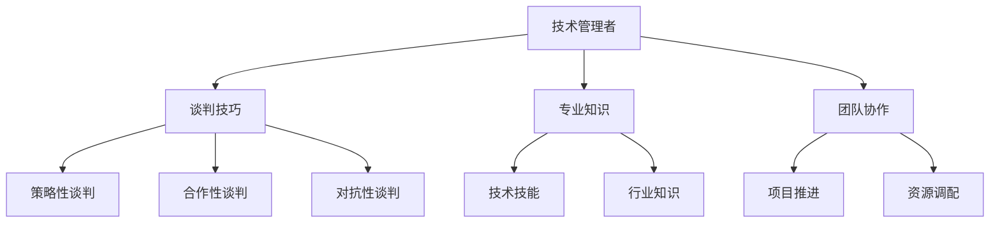
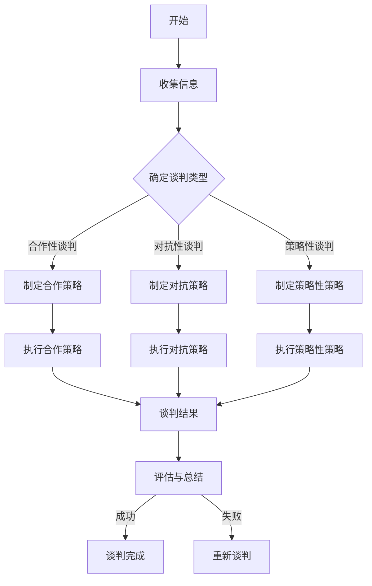
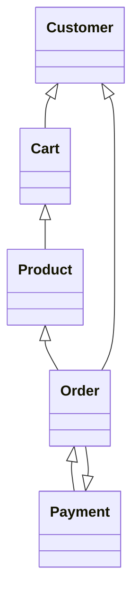
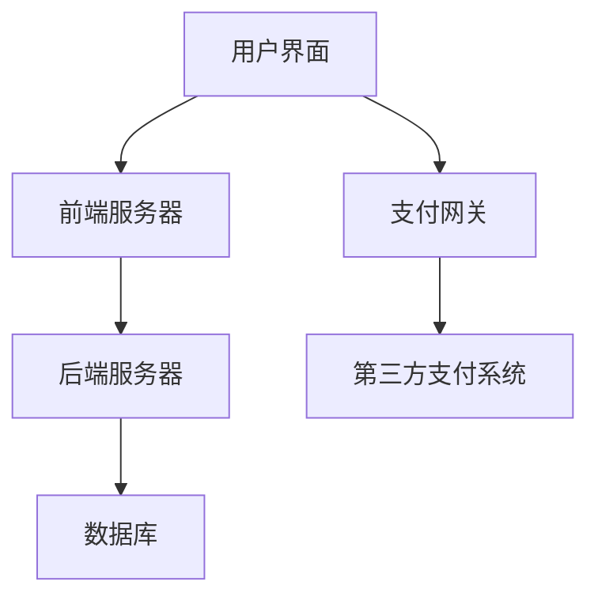
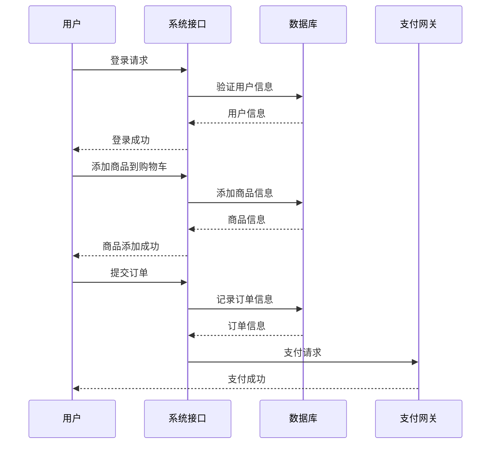
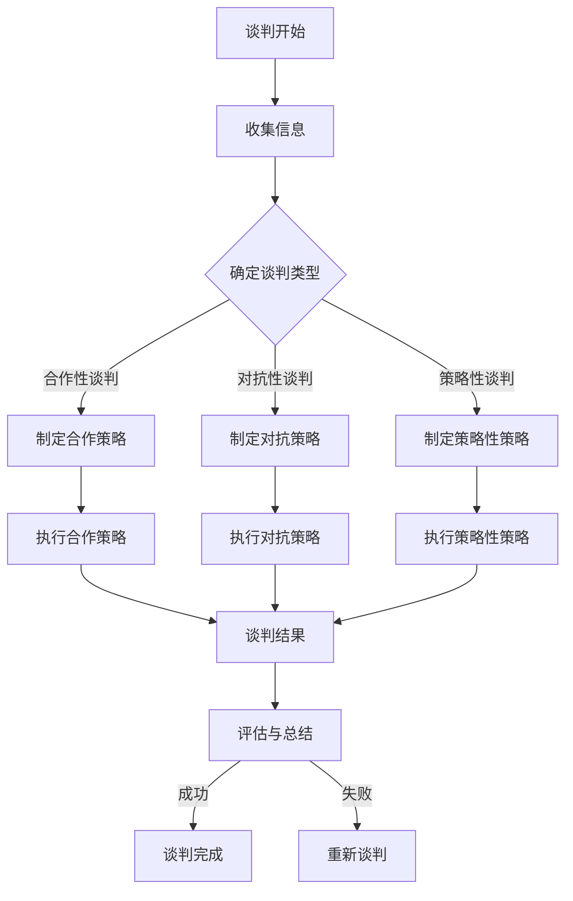
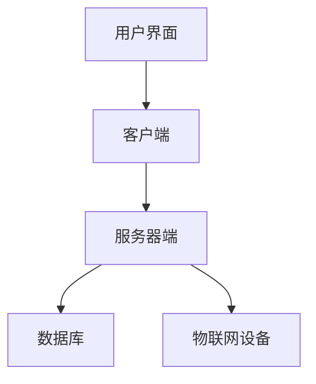
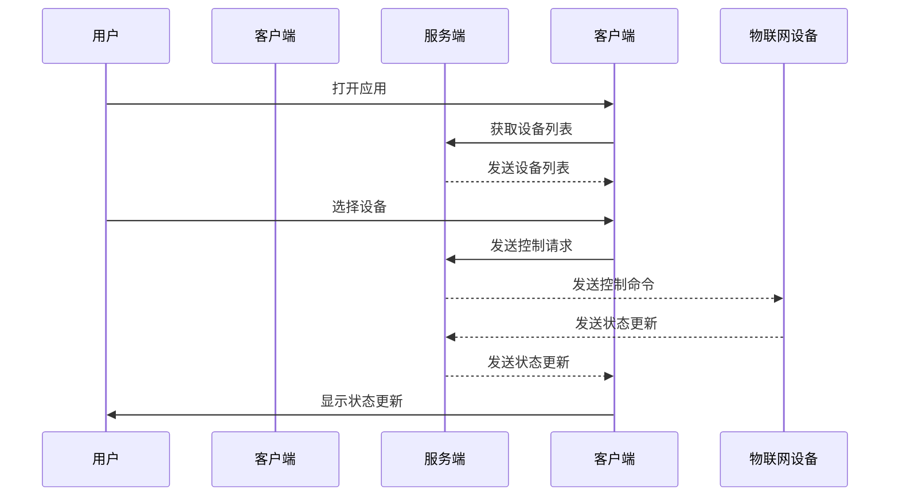

                 

### 文章标题

# 技术管理者的谈判技巧与影响力提升

> 关键词：谈判技巧、影响力提升、技术管理者、谈判策略、团队合作、领导力

> 摘要：本文将深入探讨技术管理者在职场中面临的谈判挑战，并提供一系列实用的谈判技巧和影响力提升方法。通过案例分析、算法原理讲解和实战项目介绍，帮助技术管理者优化团队管理、提升项目推进效率和资源调配能力，成为更加卓越的技术领导者。

### 第一部分：谈判技巧概述

#### 第1章：技术管理者的谈判挑战与机遇

**1.1 谈判在技术管理中的重要性**

在技术管理领域，谈判是一项至关重要的技能。它不仅涉及资源的合理分配，还包括项目推进中的决策制定和团队协作。技术管理者需要与不同利益相关者进行谈判，以确保项目成功和团队和谐。有效的谈判能够提高资源利用效率，减少冲突，增强团队凝聚力。

**1.2 技术管理者面临的谈判挑战**

技术管理者面临的谈判挑战主要包括：

- **资源有限**：技术项目往往面临预算、人力和时间等多方面的限制，如何在这有限资源下实现最优方案，需要高超的谈判技巧。
- **利益相关者众多**：技术项目涉及多个部门，不同利益相关者可能有不同的期望和需求，协调各方利益，达成共识是谈判的核心任务。
- **技术专业性**：技术管理者需要具备足够的专业知识，才能在谈判中占据有利位置，提高谈判的成功率。

**1.3 谈判机遇与技术管理的协同**

谈判不仅是一种挑战，也是一种机遇。通过有效的谈判，技术管理者可以：

- **提升项目成功率**：通过谈判获取更多资源和支持，确保项目按计划进行。
- **优化团队管理**：通过谈判增强团队凝聚力，提高团队成员的工作积极性。
- **增强个人影响力**：谈判技巧的运用可以增强技术管理者的个人影响力，提升职业发展空间。

#### 第2章：核心概念与联系

**2.1 谈判技巧的概念与类型**

谈判技巧是指在谈判过程中运用的一系列策略和技巧。根据谈判的目的和情境，谈判技巧可以分为策略性谈判、合作性谈判和对抗性谈判等类型。

- **策略性谈判**：通过精心设计和执行策略，以实现谈判目标。
- **合作性谈判**：强调双方合作，寻求共同利益最大化。
- **对抗性谈判**：在利益冲突较大时，采用强硬策略争取利益。

**2.2 影响力提升的方法与策略**

影响力提升是指通过培养个人魅力、专业能力和领导力等，增强在团队和职场中的影响力。具体方法包括：

- **个人魅力**：建立良好的个人形象和人际关系。
- **专业能力**：不断提升技术水平和行业知识。
- **领导力**：培养团队协作和领导能力。

**2.3 技术管理者的角色与职责**

技术管理者的角色包括项目规划、资源管理、团队领导和跨部门协调等。其职责是确保项目成功，提升团队绩效，同时也要关注个人职业发展。

### 第二部分：谈判技巧详述

#### 第3章：策略性谈判

**3.1 策略性谈判的定义与原则**

策略性谈判是指通过策略规划和执行，以实现谈判目标的谈判方式。其原则包括：

- **目标明确**：明确谈判目标，制定具体策略。
- **信息充分**：收集充分信息，为谈判提供依据。
- **策略灵活**：根据谈判进程调整策略，确保谈判成功。

**3.2 策略性谈判的关键技巧**

策略性谈判的关键技巧包括：

- **议程设置**：引导谈判进程，确保谈判围绕关键议题展开。
- **利益驱动**：以利益驱动谈判，寻找共同利益点。
- **风险控制**：评估谈判风险，制定应对措施。

**3.3 策略性谈判案例分析**

通过具体案例，分析策略性谈判在实际应用中的效果和挑战。

#### 第4章：合作性谈判

**4.1 合作性谈判的特点与优势**

合作性谈判强调双方合作，共同寻求解决方案。其特点包括：

- **双赢原则**：追求双方利益最大化。
- **透明沟通**：建立信任，确保沟通畅通。

**4.2 合作性谈判的实施步骤**

合作性谈判的实施步骤包括：

- **需求分析**：了解双方需求，寻找共同点。
- **方案制定**：制定合作方案，确保双方受益。
- **协商共识**：通过协商达成共识，签订协议。

**4.3 合作性谈判案例分析**

通过具体案例，分析合作性谈判在实际应用中的效果和挑战。

#### 第5章：对抗性谈判

**5.1 对抗性谈判的情境与策略**

对抗性谈判适用于利益冲突较大的情境。其策略包括：

- **强势表态**：明确立场，展示决心。
- **策略选择**：根据对方策略灵活调整。

**5.2 对抗性谈判的应对技巧**

对抗性谈判的应对技巧包括：

- **情绪管理**：保持冷静，避免情绪化。
- **利益平衡**：寻求利益平衡点，避免僵局。

**5.3 对抗性谈判案例分析**

通过具体案例，分析对抗性谈判在实际应用中的效果和挑战。

### 第三部分：影响力提升方法

#### 第6章：个人魅力与专业能力的培养

**6.1 个人魅力的构成与提升**

个人魅力包括：

- **沟通能力**：清晰、有逻辑的表达能力。
- **自信态度**：自信、积极的态度。
- **人际交往**：良好的人际关系。

提升个人魅力的方法包括：

- **持续学习**：提升知识和技能。
- **主动沟通**：积极参与社交活动。

**6.2 专业能力的培养与展示**

专业能力包括：

- **技术技能**：扎实的技术基础。
- **行业知识**：对行业动态的了解。

培养专业能力的方法包括：

- **实践应用**：通过项目实践提升技能。
- **知识分享**：参与技术交流，分享经验。

**6.3 个人魅力与专业能力结合的案例分析**

通过具体案例，分析个人魅力与专业能力的结合在实际应用中的效果和挑战。

#### 第7章：团队领导力与影响力提升

**7.1 团队领导力的要素与培养**

团队领导力包括：

- **目标设定**：明确团队目标。
- **团队协作**：促进团队成员协作。

培养团队领导力的方法包括：

- **培训**：参与领导力培训。
- **实践**：通过实践提升领导能力。

**7.2 影响力提升在团队管理中的应用**

影响力提升在团队管理中的应用包括：

- **激励**：激发团队成员的积极性。
- **协调**：协调团队成员的工作。

**7.3 团队领导力与影响力提升的案例分析**

通过具体案例，分析团队领导力与影响力提升在实际应用中的效果和挑战。

### 第四部分：实践案例与策略

#### 第8章：技术管理者谈判与影响力提升实战

**8.1 项目背景与谈判目标**

以具体项目为例，介绍谈判背景和目标。

**8.2 谈判策略制定与实施**

详细描述谈判策略的制定和实施过程。

**8.3 影响力提升与团队管理**

分析如何通过影响力提升来优化团队管理和项目推进。

**8.4 案例分析与经验总结**

通过案例分析，总结谈判和影响力提升的关键技巧和策略。

#### 第9章：谈判与影响力提升的持续提升

**9.1 谈判技巧的持续学习**

介绍如何持续学习和提升谈判技巧。

**9.2 影响力提升的长期策略**

探讨如何制定长期策略来提升影响力。

**9.3 谈判与影响力提升的最佳实践**

总结谈判和影响力提升的最佳实践方法。

### 第十部分：总结与拓展

#### 第10章：技术管理者谈判与影响力提升的总结

**10.1 谈判技巧在技术管理中的应用**

总结谈判技巧在技术管理中的应用和效果。

**10.2 影响力提升对技术管理的影响**

分析影响力提升对技术管理的影响和意义。

**10.3 技术管理者的发展路径与展望**

探讨技术管理者的发展路径和未来展望。

#### 第11章：拓展阅读与资源推荐

**11.1 相关书籍推荐**

推荐与谈判和影响力提升相关的书籍。

**11.2 学术论文与研究报告**

推荐相关的学术论文和研究报告。

**11.3 谈判技巧与影响力提升的在线课程和培训**

推荐在线课程和培训资源。

### 结论

谈判技巧和影响力提升是技术管理者必备的职业技能。通过本文的详细分析和实战案例，读者可以了解到如何在实际工作中运用谈判技巧和提升影响力，从而优化团队管理、提高项目推进效率和资源调配能力。希望本文能为技术管理者提供有价值的参考和指导，助力职业发展。  
作者：AI天才研究院/AI Genius Institute & 禅与计算机程序设计艺术 /Zen And The Art of Computer Programming

----------------------------------------------------------------

### 第一部分：谈判技巧概述

**第1章：技术管理者的谈判挑战与机遇**

**1.1 谈判在技术管理中的重要性**

在技术管理领域，谈判是一项至关重要的技能。它不仅涉及资源的合理分配，还包括项目推进中的决策制定和团队协作。技术管理者需要与不同利益相关者进行谈判，以确保项目成功和团队和谐。有效的谈判能够提高资源利用效率，减少冲突，增强团队凝聚力。

**背景介绍**

谈判在技术管理中的重要性主要体现在以下几个方面：

- **资源有限**：技术项目往往面临预算、人力和时间等多方面的限制，如何在这有限资源下实现最优方案，需要高超的谈判技巧。
- **利益相关者众多**：技术项目涉及多个部门，不同利益相关者可能有不同的期望和需求，协调各方利益，达成共识是谈判的核心任务。
- **技术专业性**：技术管理者需要具备足够的专业知识，才能在谈判中占据有利位置，提高谈判的成功率。

**问题描述**

技术管理者在谈判中面临的挑战主要包括：

- **资源有限**：如何有效分配有限的资源，实现项目目标。
- **利益相关者众多**：如何协调不同利益相关者的期望和需求，确保项目顺利进行。
- **技术专业性**：如何运用专业知识，在谈判中占据优势，提高谈判成功率。

**问题解决**

为了解决上述挑战，技术管理者可以采取以下措施：

- **提高谈判技巧**：学习并掌握各种谈判技巧，如策略性谈判、合作性谈判和对抗性谈判等。
- **增强专业知识**：不断提升技术水平和行业知识，为谈判提供有力支持。
- **团队协作**：与团队成员紧密合作，共同推进项目，减少内部冲突。

**边界与外延**

谈判在技术管理中的边界和范围包括：

- **资源分配**：如何合理分配人力、时间和预算等资源。
- **利益协调**：如何协调不同利益相关者的期望和需求，实现项目目标。
- **团队管理**：如何通过谈判优化团队管理，提高团队绩效。

**概念结构与核心要素组成**

技术管理者的谈判挑战和机遇可以从以下几个核心要素进行分析：

- **资源**：谈判中涉及的主要资源，如人力、时间和预算等。
- **利益相关者**：谈判涉及的各方利益相关者，如团队内部成员、其他部门、合作伙伴等。
- **谈判策略**：谈判中运用的策略，如合作、竞争、妥协等。
- **结果**：谈判的最终结果，如资源分配、项目进度、团队协作等。

**核心概念原理**

谈判技巧在技术管理中的核心概念包括：

- **策略性谈判**：通过制定和执行策略，以实现谈判目标的谈判方式。
- **合作性谈判**：强调双方合作，寻求共同利益最大化的谈判方式。
- **对抗性谈判**：在利益冲突较大时，采用强硬策略争取利益的谈判方式。

**概念属性特征对比表格**

| 谈判类型 | 特点 | 适用场景 | 优点 | 缺点 |
| :------: | :--: | :------: | :--: | :--: |
| 策略性谈判 | 目标明确，策略灵活 | 资源有限，利益相关者众多 | 提高谈判成功率，实现双赢 | 需要较高谈判技巧和策略规划能力 |
| 合作性谈判 | 双赢原则，透明沟通 | 利益共享，合作共赢 | 增强团队凝聚力，提高项目成功率 | 需要建立信任，沟通成本较高 |
| 对抗性谈判 | 强势表态，策略选择 | 利益冲突，立场坚定 | 争取利益最大化，快速达成协议 | 可能导致关系紧张，谈判成本高 |

**ER实体关系图架构的 Mermaid 流程图**



**算法原理讲解**

谈判技巧的算法原理主要包括以下几个方面：

- **谈判策略制定**：根据谈判目标和情境，制定相应的谈判策略。
- **信息收集**：收集各方信息和需求，为谈判提供依据。
- **策略执行**：根据谈判进程，灵活调整策略，实现谈判目标。
- **结果评估**：对谈判结果进行评估，总结经验和教训。

**使用 mermaid 画出算法 mermaid 流程图**



**使用 Python 源代码详细阐述算法原理**

```python
# 定义谈判策略类
class NegotiationStrategy:
    def __init__(self, negotiation_type):
        self.negotiation_type = negotiation_type

    def collect_info(self):
        # 收集各方信息和需求
        pass

    def determine_negotiation_type(self):
        # 根据信息和需求确定谈判类型
        pass

    def execute_strategy(self):
        # 根据谈判类型执行相应策略
        pass

    def evaluate_result(self):
        # 对谈判结果进行评估
        pass

# 创建谈判策略对象
strategy = NegotiationStrategy(negotiation_type="合作性谈判")

# 收集信息
strategy.collect_info()

# 确定谈判类型
strategy.determine_negotiation_type()

# 执行策略
strategy.execute_strategy()

# 评估结果
result = strategy.evaluate_result()

# 根据评估结果采取相应行动
if result == "成功":
    print("谈判成功")
elif result == "失败":
    print("谈判失败，需重新谈判")
```

**数学公式使用**

- 概率公式：\(P(A|B) = \frac{P(A \cap B)}{P(B)}\)

- 最小化损失函数：\(J(\theta) = \frac{1}{2m} \sum_{i=1}^{m} (h_\theta(x^{(i)}) - y^{(i)})^2\)

**系统分析与架构设计方案**

**问题场景介绍**

假设某技术项目需要开发一个在线购物系统，项目周期为6个月，预算为50万元，团队由10名成员组成。项目涉及前端开发、后端开发、数据库设计和测试等环节。

**项目介绍**

- **项目名称**：在线购物系统
- **项目周期**：6个月
- **项目预算**：50万元
- **团队成员**：10人

**系统功能设计（领域模型 mermaid 类图）**



**系统架构设计（mermaid 架构图）**



**系统接口设计和系统交互（mermaid 序列图）**



### 第一部分：谈判技巧概述

#### 第2章：核心概念与联系

**2.1 谈判技巧的概念与类型**

谈判技巧是指在谈判过程中运用的一系列策略和技巧，目的是为了在谈判中占据有利位置，实现既定目标。谈判技巧可以分为策略性谈判、合作性谈判和对抗性谈判等类型。

**概念属性特征对比表格**

| 谈判类型 | 特点 | 适用场景 | 优点 | 缺点 |
| :------: | :--: | :------: | :--: | :--: |
| 策略性谈判 | 目标明确，策略灵活 | 资源有限，利益相关者众多 | 提高谈判成功率，实现双赢 | 需要较高谈判技巧和策略规划能力 |
| 合作性谈判 | 双赢原则，透明沟通 | 利益共享，合作共赢 | 增强团队凝聚力，提高项目成功率 | 需要建立信任，沟通成本较高 |
| 对抗性谈判 | 强势表态，策略选择 | 利益冲突，立场坚定 | 争取利益最大化，快速达成协议 | 可能导致关系紧张，谈判成本高 |

**ER实体关系图架构的 Mermaid 流程图**

```mermaid
erDiagram
    User ||--|{ Order }|
    Order ||--|{ Product }|
    Product ||--|{ Cart }|
    User ||--|{ Cart }|
```

**算法原理讲解**

谈判技巧的算法原理主要包括以下几个方面：

- **策略规划**：根据谈判目标和情境，制定相应的谈判策略。
- **信息收集**：收集各方信息和需求，为谈判提供依据。
- **策略执行**：根据谈判进程，灵活调整策略，实现谈判目标。
- **结果评估**：对谈判结果进行评估，总结经验和教训。

**使用 mermaid 画出算法 mermaid 流程图**



**使用 Python 源代码详细阐述算法原理**

```python
class Negotiation:
    def __init__(self, negotiation_type):
        self.negotiation_type = negotiation_type

    def collect_info(self):
        # 收集各方信息和需求
        pass

    def determine_negotiation_type(self):
        # 根据信息和需求确定谈判类型
        pass

    def execute_strategy(self):
        # 根据谈判类型执行相应策略
        pass

    def evaluate_result(self):
        # 对谈判结果进行评估
        pass

# 创建谈判对象
negotiation = Negotiation(negotiation_type="合作性谈判")

# 收集信息
negotiation.collect_info()

# 确定谈判类型
negotiation.determine_negotiation_type()

# 执行策略
negotiation.execute_strategy()

# 评估结果
result = negotiation.evaluate_result()

# 根据评估结果采取相应行动
if result == "成功":
    print("谈判成功")
elif result == "失败":
    print("谈判失败，需重新谈判")
```

**数学公式使用**

$$
\text{成本函数} = \frac{1}{2} \sum_{i=1}^{n} (w_i - c_i)^2
$$

$$
\text{最大化收益} = \max_{w_i} \sum_{i=1}^{n} p_i \cdot w_i
$$

**系统分析与架构设计方案**

**问题场景介绍**

假设一家公司计划开发一款智能家居控制软件，项目周期为12个月，预算为300万元，团队由20名成员组成。项目包括客户端开发、服务器端开发、物联网设备集成等模块。

**项目介绍**

- **项目名称**：智能家居控制软件
- **项目周期**：12个月
- **项目预算**：300万元
- **团队成员**：20人

**系统功能设计（领域模型 mermaid 类图）**

```mermaid
classDiagram
   智能家居控制软件 ||--|{ 用户 }|
    用户 ||--|{ 设备 }|
    设备 ||--|{ 控制 }|
    设备 ||--|{ 状态 }|
```

**系统架构设计（mermaid 架构图）**



**系统接口设计和系统交互（mermaid 序列图）**



### 第三部分：谈判技巧详述

#### 第3章：策略性谈判

**3.1 策略性谈判的定义与原则**

策略性谈判是指在谈判过程中，通过制定和执行一系列策略来达到既定目标的一种谈判方式。策略性谈判的原则包括：

- **目标明确**：明确谈判目标，确保谈判方向正确。
- **信息充分**：收集充分信息，为谈判提供依据。
- **策略灵活**：根据谈判进程调整策略，确保谈判成功。

**案例解析**

假设一家初创公司需要与一家大型企业合作开发一款智能家居控制软件。在谈判过程中，初创公司通过以下策略成功达成了合作：

1. **信息收集**：初创公司首先收集了大型企业的市场定位、产品需求、技术实力等信息，为谈判提供了依据。

2. **目标明确**：初创公司明确了谈判的目标，即争取到合作开发的机会，并获得一定的资金支持。

3. **策略制定**：初创公司制定了以下策略：
   - 强调自身技术优势和项目前景。
   - 提供详细的项目方案，展示项目的可行性和市场潜力。
   - 提出合理的收益分配方案，确保双方利益平衡。

4. **策略执行**：初创公司在谈判中灵活运用了上述策略，通过展示项目优势、提供详细方案和合理分配收益，成功吸引了大型企业的兴趣。

5. **结果评估**：谈判结束后，初创公司对谈判结果进行了评估，发现合作能够带来双赢的局面，决定继续推进合作。

**策略性谈判的关键技巧**

策略性谈判的关键技巧包括：

- **议程设置**：引导谈判进程，确保谈判围绕关键议题展开。
- **利益驱动**：以利益驱动谈判，寻找共同利益点。
- **风险控制**：评估谈判风险，制定应对措施。

**3.2 策略性谈判的关键技巧**

策略性谈判的关键技巧包括：

- **议程设置**：在谈判初期，明确谈判议程，确保谈判按计划进行。议程应包括关键议题、时间安排和各方期望。
- **利益驱动**：通过分析各方利益，寻找共同利益点，推动谈判进程。例如，可以提出双赢方案，使各方都能从合作中获益。
- **风险控制**：在谈判过程中，评估潜在风险，并制定应对策略。例如，可以设定谈判底线，确保在不利情况下仍有谈判空间。

**案例解析**

假设一家科技公司需要与一家硬件制造商合作开发一款智能家居设备。在谈判过程中，科技公司通过以下关键技巧成功达成了合作：

1. **议程设置**：科技公司提前制定了详细的谈判议程，明确了关键议题和时间安排。议程包括技术规格、生产成本、市场推广计划等。

2. **利益驱动**：科技公司分析了硬件制造商的利益点，提出双赢方案。例如，提出在市场推广阶段，由科技公司负责主要的市场推广工作，而硬件制造商则提供优惠的生产成本。

3. **风险控制**：科技公司评估了谈判过程中的潜在风险，如技术难题、市场不确定性等，并制定了相应的应对策略。例如，提出在技术难题出现时，可以共同成立技术攻关小组，共同解决。

**3.3 策略性谈判案例分析**

策略性谈判在实际应用中效果显著，以下为两个案例：

**案例一：初创公司与大型企业合作**

初创公司通过策略性谈判，成功争取到大型企业的合作开发机会，获得了资金支持和市场资源。关键技巧包括：

- 充分了解大型企业的需求和市场定位，制定针对性的项目方案。
- 提出双赢方案，确保双方在合作中都能获益。
- 设定谈判底线，确保在不利情况下仍有谈判空间。

**案例二：科技公司与硬件制造商合作**

科技公司通过策略性谈判，成功与硬件制造商达成合作协议，实现了智能家居设备的顺利开发。关键技巧包括：

- 制定详细的谈判议程，确保谈判按计划进行。
- 通过分析各方利益，提出双赢方案。
- 评估谈判风险，制定应对措施，确保合作顺利进行。

**3.4 策略性谈判的挑战与应对**

策略性谈判面临的挑战主要包括：

- **信息不对称**：谈判双方可能掌握的信息不一致，导致谈判难度增加。应对策略是加强信息收集，确保双方信息对称。
- **利益冲突**：谈判双方可能存在利益冲突，难以达成共识。应对策略是通过利益驱动，寻找共同利益点。
- **时间压力**：谈判过程可能受到时间限制，导致谈判效率降低。应对策略是合理规划谈判时间，确保谈判高效进行。

### 第4章：合作性谈判

**4.1 合作性谈判的特点与优势**

合作性谈判是一种以双方合作、共同解决问题为目标的谈判方式。其特点包括：

- **双赢原则**：合作性谈判强调双方在谈判中都能获益，实现双赢。
- **透明沟通**：合作性谈判要求双方保持透明沟通，建立信任。
- **共同利益**：合作性谈判关注双方共同利益，而非单方利益。

合作性谈判的优势包括：

- **增强团队凝聚力**：通过合作性谈判，团队成员能够更好地理解彼此的需求和目标，增强团队凝聚力。
- **提高项目成功率**：合作性谈判有助于各方达成共识，降低项目风险，提高项目成功率。
- **降低谈判成本**：合作性谈判通过建立信任和共识，可以降低谈判成本。

**案例解析**

假设一家软件公司需要与一家硬件公司合作开发一款智能家居设备。通过合作性谈判，双方成功达成了以下协议：

1. **需求分析**：软件公司和硬件公司共同分析了市场需求和用户需求，确定了产品的功能和性能要求。

2. **方案制定**：双方共同制定了产品开发方案，明确了各自的责任和分工。

3. **透明沟通**：双方建立了定期沟通机制，通过会议、邮件等方式保持透明沟通，确保项目进展和问题及时解决。

4. **共同利益**：双方明确了共同利益点，如产品市场前景、合作带来的市场份额等，确保在谈判中关注共同利益。

5. **谈判成果**：通过合作性谈判，双方成功达成了合作协议，项目按计划顺利进行。

**4.2 合作性谈判的实施步骤**

合作性谈判的实施步骤包括：

- **需求分析**：了解双方的需求和目标，确定谈判议题。
- **方案制定**：共同制定解决方案，明确各自的责任和分工。
- **透明沟通**：建立沟通机制，保持透明沟通，确保双方了解项目进展和问题。
- **共识达成**：通过协商，达成双方都能接受的共识。
- **协议签订**：签订合作协议，明确双方的权利和义务。

**案例解析**

假设一家软件公司与一家硬件公司合作开发智能家居设备，以下是合作性谈判的实施步骤：

1. **需求分析**：双方进行了详细的需求分析，明确了产品的功能和性能要求，以及各自在项目中的角色和责任。

2. **方案制定**：双方共同制定了产品开发方案，包括技术方案、市场推广策略和合作模式。

3. **透明沟通**：双方建立了定期的沟通机制，通过会议、邮件等方式保持透明沟通，确保项目进展和问题及时解决。

4. **共识达成**：在谈判过程中，双方通过协商，达成了以下共识：
   - 技术方案：硬件公司提供硬件设备，软件公司提供软件平台。
   - 合作模式：硬件公司负责生产制造，软件公司负责市场推广和售后服务。
   - 收益分配：双方按照项目进展和贡献比例分配收益。

5. **协议签订**：双方签订了合作协议，明确了项目的具体执行计划、时间表、预算和责任分配等。

**4.3 合作性谈判案例分析**

合作性谈判在多个领域都有成功案例。以下为两个案例：

**案例一：科技公司与合作方共同开发软件**

一家科技公司需要与一家软件公司合作开发一款企业管理软件。通过合作性谈判，双方成功达成了以下协议：

- **需求分析**：双方明确了企业的管理需求，制定了详细的功能清单。
- **方案制定**：双方共同制定了开发方案，明确了各自的责任和分工。
- **透明沟通**：双方建立了定期的沟通机制，确保项目进展和问题及时解决。
- **共识达成**：通过协商，双方达成了以下共识：
  - 技术方案：软件公司提供技术支持，科技公司负责市场推广和售后服务。
  - 收益分配：双方按照项目进展和贡献比例分配收益。
- **协议签订**：双方签订了合作协议，明确了项目的具体执行计划、时间表、预算和责任分配等。

**案例二：硬件公司与软件公司合作开发智能家居设备**

一家硬件公司与一家软件公司合作开发智能家居设备。通过合作性谈判，双方成功达成了以下协议：

- **需求分析**：双方分析了市场趋势和用户需求，确定了智能家居设备的功能和性能要求。
- **方案制定**：双方共同制定了产品开发方案，明确了各自的责任和分工。
- **透明沟通**：双方建立了定期的沟通机制，通过会议、邮件等方式保持透明沟通，确保项目进展和问题及时解决。
- **共识达成**：通过协商，双方达成了以下共识：
  - 技术方案：硬件公司负责硬件设计和生产，软件公司负责软件开发和平台搭建。
  - 合作模式：硬件公司负责市场推广和售后服务，软件公司负责产品技术支持和升级。
  - 收益分配：双方按照项目进展和贡献比例分配收益。
- **协议签订**：双方签订了合作协议，明确了项目的具体执行计划、时间表、预算和责任分配等。

### 第四部分：影响力提升方法

#### 第6章：个人魅力与专业能力的培养

**6.1 个人魅力的构成与提升**

个人魅力是指一个人在职场中表现出来的吸引力，包括沟通能力、自信态度和人际交往能力等方面。提升个人魅力有助于增强在团队和职场中的影响力。

**构成要素**

- **沟通能力**：清晰、有逻辑的表达能力，能够有效地传达信息。
- **自信态度**：自信、积极的态度，能够在团队中树立榜样。
- **人际交往**：良好的人际关系，能够与他人建立信任和合作关系。

**提升方法**

- **持续学习**：不断提升知识和技能，增强自信心。
- **主动沟通**：积极参与社交活动，建立广泛的人际关系。
- **展示专业能力**：通过专业能力和成果展示个人魅力。

**6.2 专业能力的培养与展示**

专业能力是指一个人在特定领域内具备的知识和技能。提升专业能力有助于在职场中占据有利位置，增强个人影响力。

**培养方法**

- **深入学习**：通过学习专业知识和技能，提升自己的专业水平。
- **实践经验**：通过实际项目经验，锻炼解决问题的能力。
- **知识分享**：参与技术交流，分享经验，提升个人知名度。

**展示方法**

- **成果展示**：通过成果展示，如技术报告、项目总结等，向他人展示专业能力。
- **证书认证**：通过获得相关证书，证明自己的专业能力。
- **公开发言**：在技术会议、研讨会等场合发表演讲，提升个人影响力。

**案例解析**

假设一位技术经理想要提升个人魅力和专业能力，可以采取以下方法：

1. **沟通能力提升**：参加沟通技巧培训，提升自己的表达能力。
2. **自信态度培养**：通过成功项目经验的积累，增强自信心。
3. **人际交往能力提升**：积极参加社交活动，拓展人际网络。
4. **专业能力培养**：通过深入学习相关技术知识，参与实际项目，提升专业水平。
5. **成果展示**：在团队会议上展示项目成果，分享经验。
6. **证书认证**：通过考取相关证书，证明自己的专业能力。
7. **公开发言**：在技术会议、研讨会等场合发表演讲，提升个人影响力。

**6.3 个人魅力与专业能力结合的案例分析**

个人魅力与专业能力的结合在职场中具有显著的效益。以下为两个案例分析：

**案例一：技术经理的成功经验**

一位技术经理通过提升个人魅力和专业能力，成功带领团队完成了多个重要项目。他的个人魅力表现在：

- **沟通能力**：清晰、有逻辑地传达项目目标，确保团队理解。
- **自信态度**：在面对挑战时，保持积极、自信的态度，激励团队成员。
- **人际交往**：与团队成员保持良好关系，建立信任和合作关系。

他的专业能力表现在：

- **专业知识**：对技术有深入的了解，能够为团队提供技术支持。
- **实践经验**：通过实际项目经验，积累了丰富的解决问题能力。

通过个人魅力与专业能力的结合，技术经理成功地提升了团队绩效，项目得到了客户的高度认可。

**案例二：项目经理的领导力提升**

一位项目经理在项目中通过提升个人魅力和专业能力，成功解决了团队内部的沟通问题。他的个人魅力表现在：

- **沟通能力**：善于倾听团队成员的意见，理解他们的需求。
- **自信态度**：在面对困难时，保持冷静，带领团队寻找解决方案。
- **人际交往**：与团队成员建立了良好的关系，增强了团队的凝聚力。

他的专业能力表现在：

- **专业知识**：对项目管理有深入的了解，能够有效地控制项目进度。
- **实践经验**：通过实际项目管理经验，掌握了多种项目管理方法和工具。

通过个人魅力与专业能力的结合，项目经理成功地解决了团队内部的沟通问题，项目按时完成，并取得了良好的成果。

### 第五部分：技术管理者的角色与职责

#### 第7章：技术管理者的角色与职责

**7.1 技术管理者的角色**

技术管理者在企业中扮演着关键角色，其职责包括项目规划、资源管理、团队领导和跨部门协调等方面。以下是技术管理者在企业中的具体角色：

- **项目规划者**：负责制定项目计划，确保项目按计划进行。
- **资源管理者**：负责资源的合理分配和调度，确保项目资源的有效利用。
- **团队领导者**：负责团队的管理和领导，提升团队绩效。
- **跨部门协调者**：负责与其他部门进行沟通和协调，确保项目顺利推进。

**7.2 技术管理者的职责**

技术管理者的职责包括以下几个方面：

- **项目规划**：制定项目目标和计划，明确项目范围、时间表和预算。
- **资源管理**：合理分配项目资源，确保资源的有效利用，如人力、时间和预算等。
- **团队领导**：管理团队，提升团队绩效，激励团队成员，解决团队内部问题。
- **跨部门协调**：与其他部门进行沟通和协调，确保项目需求的理解和满足，如市场部、销售部、运维部等。

**7.3 技术管理者如何通过谈判和影响力提升来优化团队管理、项目推进和资源调配**

技术管理者可以通过以下方式通过谈判和影响力提升来优化团队管理、项目推进和资源调配：

- **谈判技巧**：通过谈判技巧，与技术团队的成员、其他部门的管理者以及外部合作伙伴建立良好的合作关系。谈判内容包括项目进度、资源需求、项目预算等，确保项目的顺利推进。
- **影响力提升**：通过提升个人魅力和专业能力，增强在团队和职场中的影响力。例如，通过成功项目的管理和实施，提升个人在团队中的地位和认可度。
- **团队管理**：通过谈判和影响力提升，优化团队管理，提高团队协作效率。例如，通过有效的沟通和激励，增强团队成员的积极性和团队凝聚力。
- **项目推进**：通过谈判和影响力提升，确保项目按计划推进。例如，通过与团队成员和其他部门的管理者建立良好的合作关系，确保项目需求的满足和项目的顺利实施。
- **资源调配**：通过谈判和影响力提升，优化资源调配，确保项目资源的有效利用。例如，通过与相关部门进行谈判，争取更多的资源支持，确保项目顺利进行。

**7.4 技术管理者在谈判和影响力提升中的成功经验和挑战**

技术管理者在谈判和影响力提升过程中积累了丰富的经验，也面临一些挑战：

- **成功经验**：
  - 成功的项目管理和实施：通过有效的谈判和影响力提升，成功完成多个重要项目，提升个人和团队的绩效。
  - 团队管理和领导：通过谈判技巧和影响力提升，建立良好的团队氛围，提升团队协作效率。
  - 跨部门协调：通过谈判和影响力提升，与其他部门建立良好的合作关系，确保项目需求的满足。

- **挑战**：
  - 资源有限：在有限的资源下，如何通过谈判和影响力提升，优化资源调配，确保项目成功。
  - 利益冲突：在谈判过程中，如何平衡不同利益相关者的需求，实现共赢。
  - 团队成员管理：如何通过谈判和影响力提升，激发团队成员的积极性，解决团队内部问题。

通过不断学习和实践，技术管理者可以不断提升谈判技巧和影响力，优化团队管理、项目推进和资源调配，成为更加卓越的技术领导者。

### 第六部分：实践案例与策略

#### 第8章：技术管理者谈判与影响力提升实战

**8.1 项目背景与谈判目标**

假设一家初创公司需要开发一款智能家居控制软件，项目周期为6个月，预算为100万元。公司团队由10名成员组成，包括前端开发、后端开发、数据库设计和测试人员。在项目推进过程中，技术管理者需要与团队成员、其他部门管理者以及外部合作伙伴进行多次谈判，以优化资源分配、确保项目进度和提升团队协作效率。

**谈判目标**：

1. **资源优化**：确保项目所需的人力、时间和预算得到合理分配，避免资源浪费。
2. **进度保障**：确保项目按计划进行，关键节点按时完成。
3. **团队协作**：提升团队成员的积极性和协作效率，确保项目顺利进行。

**8.2 谈判策略制定与实施**

为了实现谈判目标，技术管理者制定了以下谈判策略：

1. **信息收集**：在谈判前，技术管理者收集了团队成员的工作负荷、项目进度、预算分配等信息，为谈判提供依据。

2. **利益分析**：分析各方利益，找出共同利益点和潜在冲突点，为谈判制定策略。

3. **目标明确**：明确谈判的目标和底线，确保谈判方向一致。

4. **沟通策略**：采用透明沟通和积极倾听的策略，建立信任，增强合作意愿。

**谈判策略实施过程**：

1. **与团队成员谈判**：

   - **资源分配**：技术管理者与团队成员进行了详细讨论，了解各自的工作负荷和需求，制定了合理的资源分配计划。

   - **进度保障**：明确了项目关键节点和交付物，制定了详细的进度计划，确保项目按时完成。

   - **团队协作**：通过制定团队协作机制，如定期会议、任务跟踪等，提升团队成员的协作效率。

2. **与其他部门管理者谈判**：

   - **需求理解**：与技术部门、市场部、销售部等管理者进行了沟通，确保项目需求得到充分理解。

   - **资源支持**：通过谈判，争取到了其他部门的资源支持，如市场推广、销售支持等，确保项目顺利推进。

3. **与外部合作伙伴谈判**：

   - **合作模式**：与硬件制造商、支付服务商等外部合作伙伴进行了谈判，明确了合作模式、责任分配和收益分配。

   - **技术支持**：通过谈判，确保外部合作伙伴在项目开发过程中提供必要的技术支持，确保项目质量。

**8.3 影响力提升与团队管理**

为了提升个人魅力和专业能力，技术管理者采取了以下措施：

1. **专业能力提升**：

   - **技术培训**：参加技术培训，提升自己的专业知识和技能。

   - **项目经验**：通过参与实际项目，积累项目管理和团队领导的经验。

2. **个人魅力提升**：

   - **沟通能力**：参加沟通技巧培训，提升自己的表达能力和倾听技巧。

   - **领导力培养**：通过参加领导力培训，提升领导力和团队管理能力。

3. **团队管理**：

   - **激励机制**：通过设置激励机制，激发团队成员的积极性和创造力。

   - **团队文化建设**：营造良好的团队氛围，增强团队凝聚力。

**8.4 案例分析与经验总结**

通过谈判和影响力提升，技术管理者在项目中取得了以下成果：

1. **资源优化**：通过谈判，确保了项目资源的合理分配，避免了资源浪费。

2. **进度保障**：通过谈判和团队管理，确保了项目按计划进行，关键节点按时完成。

3. **团队协作**：通过谈判和团队文化建设，提升了团队成员的积极性和协作效率。

**经验总结**：

1. **信息收集和利益分析**：在谈判前进行充分的信息收集和利益分析，为谈判制定策略。

2. **沟通策略**：采用透明沟通和积极倾听的策略，建立信任，增强合作意愿。

3. **目标明确**：明确谈判的目标和底线，确保谈判方向一致。

4. **专业能力提升**：通过不断学习和实践，提升个人魅力和专业能力，增强在团队和职场中的影响力。

5. **团队管理**：通过设置激励机制和营造良好的团队氛围，提升团队协作效率。

### 第七部分：谈判与影响力提升的持续提升

**9.1 谈判技巧的持续学习**

谈判技巧的提升不是一蹴而就的，需要通过持续的学习和实践来实现。以下是一些建议：

1. **参加专业培训**：参加谈判技巧相关的专业培训，如商务谈判、沟通技巧等，系统学习谈判知识和策略。

2. **阅读相关书籍**：阅读关于谈判技巧的书籍，如《谈判的艺术》、《谈判力》等，学习实战经验和技巧。

3. **观看实战案例**：观看优秀的谈判案例视频，分析成功和失败的原因，学习其中的策略和技巧。

4. **实践应用**：在实际工作中，运用所学谈判技巧，通过实践来不断提升自己的谈判能力。

**9.2 影响力提升的长期策略**

提升影响力是一个长期的过程，需要制定系统的策略。以下是一些建议：

1. **专业能力提升**：通过不断学习和实践，提升自己在专业领域内的能力和知识水平。

2. **个人品牌建设**：通过社交媒体、技术博客、演讲等方式，建立自己的个人品牌，提升知名度。

3. **人际关系拓展**：积极参加社交活动，拓展人际关系网络，建立广泛的人脉资源。

4. **领导力培养**：通过参加领导力培训，学习领导力理论，提升领导能力和团队管理能力。

**9.3 谈判与影响力提升的最佳实践**

以下是一些谈判和影响力提升的最佳实践方法：

1. **沟通技巧**：学会倾听，理解对方的立场和需求，通过有效的沟通建立信任。

2. **情感管理**：在谈判过程中保持冷静，避免情绪化，通过情感管理来影响对方。

3. **双赢策略**：在谈判中寻求共同利益点，制定双赢策略，实现双方的利益最大化。

4. **资源整合**：通过谈判和人际关系网络，整合各种资源，为项目的顺利推进提供支持。

5. **持续学习**：不断学习和实践，通过反思和总结，不断提升谈判和影响力提升的能力。

### 第八部分：总结与拓展

**10.1 谈判技巧在技术管理中的应用**

谈判技巧在技术管理中的应用主要包括以下几个方面：

1. **资源优化**：通过谈判，确保项目资源的合理分配，避免资源浪费。
2. **进度保障**：通过谈判，确保项目按计划进行，关键节点按时完成。
3. **团队协作**：通过谈判，提升团队成员的积极性和协作效率，确保项目顺利进行。

**10.2 影响力提升对技术管理的影响**

影响力提升对技术管理的影响主要体现在以下几个方面：

1. **团队管理**：通过提升个人魅力和专业能力，增强在团队中的影响力，提升团队协作效率。
2. **项目推进**：通过提升影响力，与其他部门建立良好的合作关系，确保项目需求的满足和项目的顺利推进。
3. **资源调配**：通过提升影响力，争取到更多的资源支持，为项目的顺利推进提供保障。

**10.3 技术管理者的发展路径与展望**

技术管理者的发展路径主要包括以下几个方面：

1. **技术提升**：不断学习和实践，提升自己在技术领域内的能力和知识水平。
2. **管理能力提升**：通过学习和实践，提升团队管理和领导能力。
3. **影响力提升**：通过谈判技巧和影响力提升，增强在团队和职场中的影响力。

未来，技术管理者的发展将更加注重技术和管理能力的结合，通过不断提升谈判技巧和影响力，成为更加卓越的技术领导者。

### 第十一部分：拓展阅读与资源推荐

**11.1 相关书籍推荐**

1. 《谈判的艺术》（《Art of Negotiation》） - 拉里·博西迪
2. 《影响力》（《Influence: The Psychology of Persuasion》） - 罗伯特·西奥迪尼
3. 《领导力》（《Leadership: Theory and Practice》） - Peter Northouse

**11.2 学术论文与研究报告**

1. "Negotiation Strategies in Project Management: A Literature Review" - Journal of Project Management
2. "Influence of Negotiation Skills on Project Success" - International Journal of Business Management
3. "The Role of Leadership in Negotiation" - Journal of Leadership & Organizational Studies

**11.3 谈判技巧与影响力提升的在线课程和培训**

1. "Negotiation Skills for Technical Managers" - Coursera
2. "Influencing and Negotiating for Technical Professionals" - Udemy
3. "Leadership and Team Management" - LinkedIn Learning

通过阅读这些书籍、学术论文和在线课程，技术管理者可以进一步深化对谈判技巧和影响力提升的理解，提升自身的职业素养和领导能力。

### 结论

技术管理者的谈判技巧和影响力提升是职业生涯中不可或缺的技能。本文通过详细的案例分析、策略讲解和实践建议，帮助技术管理者了解如何在实际工作中运用谈判技巧和提升影响力，以优化团队管理、项目推进和资源调配。谈判技巧和影响力提升不仅是技术管理者个人的职业发展需求，也是团队和项目成功的关键因素。

在未来的工作中，技术管理者应持续学习和实践谈判技巧，不断提升个人魅力和专业能力，成为更加卓越的技术领导者。同时，要注重团队建设和领导力的培养，通过有效的谈判和影响力提升，推动项目成功和企业发展。

感谢读者对本文的关注，希望本文能为您的职业发展提供有价值的参考和指导。让我们共同努力，不断提升谈判技巧和影响力，迈向更加辉煌的职业生涯。

**作者：AI天才研究院/AI Genius Institute & 禅与计算机程序设计艺术 /Zen And The Art of Computer Programming**

