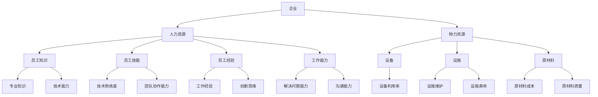
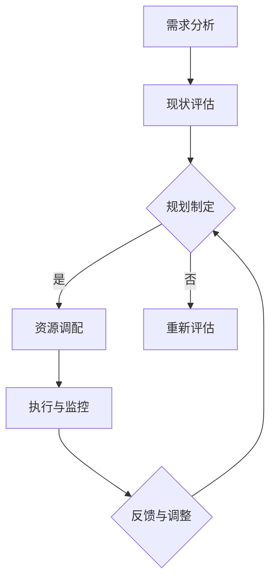

                 

### 1.1 技术管理者在资源规划中的角色和责任

**1.1.1 技术管理者的核心职责**

在数字化时代，技术管理者（Tech Manager）的角色愈发重要。他们不仅需要具备深厚的技术背景，还必须具备卓越的管理能力和战略思维。技术管理者的核心职责包括：

1. **技术指导和决策**：技术管理者需要依据业务需求，制定技术战略，选择合适的技术方案，并对技术方向做出决策。
2. **团队建设和管理**：技术管理者负责搭建和领导技术团队，培养技术人员的专业技能和团队协作能力。
3. **项目管理和优化**：技术管理者需要负责项目计划、资源分配、进度控制和质量保证，确保项目成功交付。
4. **技术风险控制**：技术管理者需要识别和评估技术风险，制定应对策略，确保技术项目的安全性和稳定性。

**1.1.2 资源规划的重要性**

资源规划是技术管理者的重要职责之一，其重要性体现在以下几个方面：

1. **提高资源利用效率**：通过合理规划资源，可以最大限度地提高资源利用率，避免资源浪费。
2. **降低运营成本**：合理分配人力和物力资源，可以降低运营成本，提高企业的盈利能力。
3. **提升项目成功率**：有效的资源规划有助于确保项目有足够的资源支持，提高项目成功率。
4. **优化团队绩效**：资源规划有助于技术团队更高效地协作，提升团队整体绩效。

**1.1.3 技术管理者面临的挑战**

尽管资源规划对于技术管理者至关重要，但在实际工作中，他们仍然面临着一系列挑战：

1. **资源稀缺**：在许多情况下，技术管理者可能面临资源短缺的问题，需要在有限资源下进行优化配置。
2. **需求波动**：业务需求和技术发展的快速变化，使得技术管理者需要灵活调整资源规划策略。
3. **信息不对称**：技术团队和其他部门之间的信息不对称，可能导致资源分配不均衡。
4. **技术复杂性**：技术的快速迭代和发展，使得技术管理者需要不断更新自己的知识和技能。

### 总结

技术管理者在资源规划中扮演着关键角色，他们需要承担多种职责，应对资源稀缺、需求波动、信息不对称和技术复杂性等多种挑战。有效的资源规划不仅有助于提高资源利用效率和降低运营成本，还能提升项目成功率和团队绩效。在接下来的章节中，我们将深入探讨资源规划的基本原则和方法，以及如何具体实施人力和物力资源的合理分配。

### 1.2 资源规划的基本原则和方法

**1.2.1 资源规划的流程**

资源规划是一个系统性的过程，需要遵循一定的流程。以下是资源规划的基本流程：

1. **需求分析**：首先，技术管理者需要了解业务需求，明确项目的目标和要求。这包括对市场趋势、竞争对手、用户需求等方面的分析。
2. **资源评估**：在了解业务需求后，技术管理者需要对现有资源进行评估。这包括人力、物力、财力等各个方面。资源评估的目的是确定现有资源的充足程度，识别潜在的资源瓶颈。
3. **资源分配**：根据需求分析和资源评估的结果，技术管理者需要制定资源分配策略。这包括确定资源的使用优先级、使用时间和使用方式等。
4. **执行和监控**：资源分配策略制定后，需要付诸实施，并在实施过程中进行监控。技术管理者需要确保资源得到有效利用，及时调整资源分配策略以应对变化。
5. **评估和反馈**：在资源规划周期结束后，技术管理者需要对资源规划的效果进行评估，收集反馈信息，为下一周期的资源规划提供依据。

**1.2.2 资源评估的方法**

资源评估是资源规划的重要环节，以下是几种常见的资源评估方法：

1. **财务评估**：财务评估主要是通过计算资源的成本和效益，来评估资源的使用价值。常用的方法包括成本效益分析（Cost-Benefit Analysis，CBA）和净现值（Net Present Value，NPV）等。
2. **人力资源评估**：人力资源评估主要是通过评估员工的能力、经验和团队协作能力等，来确定人力资源的使用价值。常用的方法包括能力评估（Capability Assessment）和团队评估（Team Assessment）等。
3. **技术评估**：技术评估主要是通过评估技术的成熟度、适用性和创新性等，来确定技术资源的使用价值。常用的方法包括技术成熟度评估（Technology Readiness Level，TRL）和专利分析等。
4. **时间评估**：时间评估主要是通过计算资源的消耗时间，来评估资源的使用效率。常用的方法包括时间序列分析（Time Series Analysis）和关键路径法（Critical Path Method，CPM）等。

**1.2.3 资源分配的策略**

资源分配的策略取决于业务需求和资源状况。以下是几种常见的资源分配策略：

1. **优先级分配**：根据业务需求的紧急程度和重要性，将资源优先分配给关键项目。常用的方法包括关键路径法（CPM）和紧急优先级调度（Earliest Due Date，EDD）等。
2. **均衡分配**：在资源有限的情况下，尽量均衡地分配资源，以避免资源过度集中或分散。常用的方法包括均分法（Equal Distribution）和最短路径法（Shortest Path Algorithm）等。
3. **动态分配**：根据业务需求和资源状况的变化，动态调整资源分配策略。常用的方法包括动态规划（Dynamic Programming）和模拟退火算法（Simulated Annealing）等。
4. **协同分配**：在多个项目或部门共同使用资源时，通过协同分配来最大化资源的利用效率。常用的方法包括协同优化（Collaborative Optimization）和博弈论（Game Theory）等。

### 总结

资源规划是一个复杂但至关重要的过程。通过遵循基本的资源规划流程，采用合适的资源评估方法和资源分配策略，技术管理者可以有效地提高资源利用效率，降低运营成本，提升项目成功率和团队绩效。在接下来的章节中，我们将深入探讨人力和物力资源的具体分配方法和实践。

### 1.3 资源规划的关键概念

**1.3.1 人力和物力资源的基本概念**

在资源规划中，人力和物力资源是两个核心概念。理解这两个概念的基本含义和属性，对于制定有效的资源规划策略至关重要。

**人力资源**：指企业中的人力资本，包括员工的知识、技能、经验和工作能力。人力资源是企业最宝贵的资产之一，对企业的竞争力具有重要影响。

**物力资源**：包括企业所拥有的所有物质资产，如设备、设施、原材料等。物力资源是企业生产和运营的基础，对于保证项目的顺利进行至关重要。

**1.3.2 资源利用率的优化**

资源利用率是衡量资源使用效率的重要指标。优化资源利用率意味着在资源有限的情况下，尽可能地提高其使用效率。以下是几种常见的资源利用率优化策略：

1. **任务优化**：通过合理的任务分配和调度，确保资源的充分利用。例如，利用关键路径法（CPM）和最短路径算法（SPA）来优化任务进度和资源使用。
2. **资源共享**：通过共享资源，提高资源的利用效率。例如，在多个项目或部门之间共享设备、软件和其他资源。
3. **资源调配**：根据业务需求的变化，灵活调整资源的分配和使用。例如，利用动态规划（DP）和模拟退火算法（SA）来动态调整资源分配。

**1.3.3 资源规划的边界和限制**

资源规划虽然具有重要意义，但仍然受到一定的边界和限制。了解这些边界和限制有助于技术管理者在实际工作中做出更加明智的决策。

1. **预算限制**：企业的财务预算是资源规划的重要约束条件。技术管理者需要在预算范围内合理分配资源，避免超支。
2. **技术限制**：现有技术的成熟度和适用性也会影响资源规划。技术管理者需要评估技术限制，选择合适的技术方案。
3. **时间限制**：项目的进度和交付时间对资源规划有直接影响。技术管理者需要在限定的时间内完成资源分配和项目执行。

**1.3.4 资源规划的实体关系图**

为了更好地理解资源规划中的关键概念和关系，我们可以使用Mermaid来绘制实体关系图。以下是资源规划中的主要实体及其关系：

通过这个实体关系图，我们可以清晰地看到人力资源和物力资源的组成及其相互关系。这有助于技术管理者在资源规划过程中更好地理解和分析各种因素。

### 总结

资源规划中的关键概念包括人力和物力资源的基本概念、资源利用率的优化策略以及资源规划的边界和限制。通过深入理解这些概念，技术管理者可以制定更加科学的资源规划策略，提高资源利用效率，降低运营成本，提升项目成功率和团队绩效。在接下来的章节中，我们将具体探讨如何进行人力和物力资源的合理分配。

### 2.1 策略概述

**2.1.1 人力资源规划策略**

人力资源规划是技术管理者在资源规划中的重要一环。有效的策略可以帮助企业更好地应对业务需求变化，提高员工的工作效率和满意度。以下是几种常见的人力资源规划策略：

1. **需求导向规划**：根据业务需求的变化，灵活调整人力资源配置。例如，在高峰期增加临时员工，以满足短期内的工作需求。
2. **能力提升规划**：通过培训和发展计划，提升员工的专业技能和工作能力。这不仅可以提高团队的整体绩效，还可以增强员工的职业竞争力。
3. **激励和奖励规划**：通过设定合理的绩效目标和奖励机制，激励员工积极工作，提高工作效率。例如，实施绩效奖金、晋升机会和员工福利等。
4. **团队协作规划**：建立有效的团队协作机制，促进团队成员之间的沟通和合作。例如，通过定期团队会议、团队建设活动和协同工具等方式，提高团队协作效率。

**2.1.2 物力资源规划策略**

物力资源规划同样重要，合理的策略可以确保企业生产运营的顺利进行。以下是几种常见的物力资源规划策略：

1. **设备更新规划**：根据设备的使用寿命和技术更新速度，定期进行设备升级和更换。这可以确保设备的高效运行和降低故障率。
2. **库存管理规划**：通过合理的库存管理策略，确保原材料和成品的供应充足，避免库存积压和短缺。例如，采用先进的库存管理系统和供应链优化技术。
3. **设施优化规划**：根据企业的生产需求和空间利用情况，对现有设施进行优化和改造。这可以提高生产效率，降低运营成本。
4. **采购策略**：通过制定合理的采购策略，降低采购成本，提高物力资源的利用效率。例如，采用批量采购、长期协议和供应商评估等方法。

**2.1.3 资源规划的整体策略**

在制定资源规划策略时，技术管理者需要综合考虑人力资源和物力资源，制定整体策略。以下是几个关键策略：

1. **统筹规划**：在资源规划过程中，需要统筹考虑人力资源和物力资源的需求，确保两种资源能够相互匹配和补充。
2. **动态调整**：资源规划是一个动态的过程，需要根据实际情况和市场变化，及时调整资源分配策略。
3. **持续优化**：资源规划不是一次性的工作，而是一个持续优化的过程。技术管理者需要不断评估资源规划的效果，收集反馈信息，并据此进行改进。

通过以上策略，技术管理者可以有效地进行人力资源和物力资源的规划，提高资源利用效率，降低运营成本，提升企业整体竞争力。

### 2.2 原则和步骤

**2.2.1 资源需求分析**

资源需求分析是人力资源分配的第一步，旨在明确企业当前和未来的人力需求。以下是资源需求分析的主要原则和步骤：

1. **明确业务目标**：首先，技术管理者需要明确企业的业务目标和发展战略，了解各部门和项目的业务需求。
2. **数据分析**：通过数据分析，了解现有员工的工作负荷、技能水平和绩效表现，识别资源缺口和瓶颈。
3. **市场调研**：进行市场调研，了解同行业的人力资源需求和市场动态，为人力资源规划提供参考。
4. **制定需求模型**：根据业务目标和数据分析结果，制定人力资源需求模型，明确各类岗位的招聘需求、人员配置和培训需求。

**2.2.2 资源供给评估**

在明确人力资源需求后，技术管理者需要对现有的人力资源供给进行评估，以确定现有资源能否满足需求。以下是资源供给评估的主要原则和步骤：

1. **现有员工分析**：分析现有员工的数量、技能、经验和工作效率，评估现有资源是否充足。
2. **人才储备评估**：评估企业内部的人才储备情况，包括晋升潜力、培训情况和关键岗位的替代人选。
3. **外部人才市场分析**：了解外部人才市场的供需状况，评估外部招聘的可行性和成本。
4. **制定供给策略**：根据资源供给评估结果，制定相应的供给策略，包括内部调配、外部招聘和培训等。

**2.2.3 资源分配**

资源分配是人力资源规划的核心步骤，旨在将合适的人员分配到合适的岗位上，以实现最佳的工作效率和绩效。以下是资源分配的主要原则和步骤：

1. **岗位匹配**：根据岗位需求和工作任务，将合适的人员分配到相应的岗位上。这包括考虑员工的技能、经验和职业发展意愿。
2. **任务优先级**：根据业务优先级和工作任务的紧急程度，制定任务优先级，合理安排员工的工作任务。
3. **灵活调配**：在资源紧张或任务需求变化时，灵活调整员工的工作任务和岗位分配，确保资源的充分利用。
4. **绩效反馈**：定期对员工的绩效进行评估和反馈，根据绩效结果进行调整和优化。

**2.2.4 监控和调整**

资源分配后，技术管理者需要对人力资源的使用情况进行监控和评估，及时发现和解决资源使用中的问题。以下是监控和调整的主要原则和步骤：

1. **工作负荷监控**：定期监控员工的工作负荷，确保员工的工作压力在合理范围内。
2. **绩效评估**：通过绩效评估，了解员工的工作表现和资源使用效率，为资源分配和调整提供依据。
3. **反馈和改进**：收集员工和团队的反馈意见，分析资源分配和使用中的问题，制定改进措施，不断提升资源规划的效率和效果。

通过以上原则和步骤，技术管理者可以有效地进行人力资源的合理分配，提高资源利用效率，提升团队绩效和企业竞争力。

### 3.1 基本概念

在讨论物力资源规划之前，我们需要明确几个基本概念，包括物力资源的类型、特性以及在资源规划中的作用。

**3.1.1 物力资源的类型**

物力资源主要包括以下几类：

1. **设备**：包括生产设备、办公设备、IT设备等，用于完成特定的生产或办公任务。
2. **设施**：包括厂房、仓库、办公大楼等，为企业提供必要的生产和工作环境。
3. **原材料**：包括生产过程中所需的各类原材料，如钢材、塑料、电子元件等。
4. **辅助材料**：包括用于设备维护、产品包装等辅助工作的材料。
5. **能源**：包括电力、燃料等，为生产和办公提供必要的动力。

**3.1.2 物力资源的特性**

物力资源的特性包括以下几个方面：

1. **物质性**：物力资源具有物理形态，可以触摸和感知。
2. **消耗性**：物力资源在使用过程中会逐渐消耗，需要定期维护或更新。
3. **固定性**：部分物力资源（如厂房和设备）具有固定的地理位置和用途，难以灵活调配。
4. **多样性**：物力资源种类繁多，用途各异，需要根据具体需求进行选择和配置。

**3.1.3 物力资源在资源规划中的作用**

物力资源在资源规划中扮演着关键角色，其合理配置和优化对于企业的运营效率和竞争力具有重要影响。以下是物力资源在资源规划中的几个主要作用：

1. **提高生产效率**：通过合理配置和维护设备，可以减少设备故障和生产停工时间，提高生产效率。
2. **降低运营成本**：通过优化能源和原材料的使用，降低生产和运营成本，提高企业的盈利能力。
3. **保证产品质量**：高质量的物力资源可以保证生产过程的稳定性和一致性，从而提高产品质量。
4. **支持创新和研发**：先进的技术设备和原材料可以为企业的创新和研发提供支持，推动技术进步和产品更新。

**3.1.4 物力资源规划的目标**

物力资源规划的目标主要包括以下几个方面：

1. **最大化资源利用效率**：通过合理的配置和调度，确保物力资源得到充分利用，避免浪费。
2. **最小化运营成本**：在确保生产和服务质量的前提下，通过优化资源配置和采购策略，降低运营成本。
3. **提高生产灵活性和适应性**：根据市场需求的变化，灵活调整物力资源的配置，确保企业能够快速响应市场变化。
4. **确保安全和合规**：遵守相关法规和标准，确保物力资源的安全使用和环保要求。

通过明确物力资源的基本概念、特性以及在资源规划中的作用，技术管理者可以更好地理解物力资源规划的重要性，为后续的具体实施提供理论基础。在接下来的章节中，我们将深入探讨物力资源规划的具体原则和方法。

### 3.2 原则和方法

**3.2.1 物力资源规划的基本原则**

物力资源规划是一个复杂而关键的过程，需要遵循以下基本原则：

1. **需求导向**：物力资源规划应以市场需求为导向，确保资源配置与实际需求相匹配，避免资源过剩或短缺。
2. **效率优先**：优化资源配置，提高物力资源的利用效率，降低运营成本，提高生产效率。
3. **可持续性**：在资源规划中考虑资源的长期使用和可持续性，确保资源的可持续利用和环境保护。
4. **灵活性**：在规划中考虑未来的不确定性，确保资源配置具有灵活性，能够快速响应市场变化和业务需求。
5. **安全合规**：遵守相关法律法规和安全标准，确保物力资源的安全使用和合规操作。

**3.2.2 物力资源规划的流程**

物力资源规划的流程可以分为以下几个步骤：

1. **需求分析**：通过市场调研、业务分析和历史数据，明确企业当前和未来的物力资源需求。
2. **现状评估**：评估企业现有的物力资源状况，包括设备的数量、性能、使用率、维护状况等。
3. **规划制定**：根据需求分析和现状评估，制定物力资源规划方案，包括设备更新、设施优化、原材料采购等。
4. **资源调配**：根据规划方案，进行物力资源的调配和优化，确保资源的合理使用和高效运作。
5. **执行与监控**：执行资源规划方案，并持续监控资源的使用情况，及时调整和优化资源配置。

**3.2.3 资源调配的方法**

在物力资源规划中，资源调配是一个关键环节，以下是一些常见的资源调配方法：

1. **均衡调配**：通过均衡调配，确保不同部门和项目之间的资源分配均衡，避免资源过度集中或分散。
2. **动态调配**：根据业务需求的变化，动态调整资源的分配和使用，确保资源的高效利用和灵活应对。
3. **优先级调配**：根据业务优先级和工作任务的紧急程度，优先分配资源，确保关键任务和项目的资源需求得到满足。
4. **协同调配**：在多个项目或部门共同使用资源时，通过协同调配，最大化资源的利用效率。

**3.2.4 优化策略**

为了提高物力资源的利用效率，可以采用以下优化策略：

1. **设备优化**：通过定期维护和更新设备，提高设备的性能和稳定性，降低故障率和停机时间。
2. **库存管理**：通过科学的库存管理，确保原材料的供应充足，避免库存积压和短缺，提高生产效率。
3. **能源管理**：通过节能措施和能源优化，降低能源消耗，减少运营成本。
4. **采购策略**：通过合理的采购策略，降低采购成本，提高物力资源的利用效率。

通过遵循以上原则和方法，技术管理者可以有效地进行物力资源规划，提高资源利用效率，降低运营成本，确保企业的稳定运营和可持续发展。

### 3.3 流程图

为了更好地理解物力资源规划的过程，我们可以使用Mermaid绘制一个流程图。以下是物力资源规划流程的Mermaid表示：

**流程解释：**

1. **需求分析（A）**：这一步骤涉及收集和分析业务需求，以确定企业未来物力资源的需求。
2. **现状评估（B）**：在了解需求后，对现有物力资源进行评估，包括设备、设施和原材料的现状。
3. **规划制定（C）**：根据需求分析和现状评估结果，制定物力资源规划方案。
4. **资源调配（D）**：执行规划方案，进行物力资源的调配和优化。
5. **执行与监控（F）**：在资源调配后，执行规划方案，并持续监控资源的使用情况。
6. **反馈与调整（G）**：根据监控结果和反馈，对资源规划方案进行调整和优化，确保资源的高效利用。

通过这个流程图，技术管理者可以清晰地看到物力资源规划的步骤和逻辑关系，有助于在实际工作中更好地进行规划和执行。

### 4.1 实战案例

**4.1.1 项目背景**

假设某互联网公司正在开发一款全新的社交媒体应用程序。该项目具有高度的技术复杂性和市场竞争力，需要在短时间内完成开发并上线。公司技术团队由50名员工组成，包括前端开发、后端开发、测试、UI/UX设计等多个角色。由于项目时间紧迫，资源有限，公司管理层决定对人力资源和物力资源进行科学规划，以确保项目顺利推进。

**4.1.2 人力资源规划**

1. **需求分析**：
   - 根据项目计划，预计需要6个月时间完成开发，每月需保持约20名全职开发人员的稳定投入。
   - 需要额外的5名测试人员，以确保软件的质量和稳定性。
   - UI/UX设计团队需要增加2名设计师，以满足快速迭代的需求。

2. **现状评估**：
   - 现有员工中，前端开发人员有15人，后端开发人员有12人，测试人员有8人，设计师有6人。
   - 部分员工已经参与其他项目，需要协调资源分配。

3. **资源调配**：
   - 将现有前端和后端开发人员调整到该项目，保持团队结构的平衡。
   - 从其他项目中临时调配5名测试人员，并增加2名新设计师。
   - 利用外包服务补充技术人员的不足，如招聘兼职前端开发人员。

4. **执行与监控**：
   - 定期召开项目进度会议，确保团队成员了解项目进展和任务分配。
   - 通过项目管理工具跟踪项目进度和资源使用情况。

**4.1.3 物力资源规划**

1. **需求分析**：
   - 需要增加2台高性能服务器以支持高并发访问。
   - 需要配置新的开发环境和测试环境，确保团队可以快速部署和测试。

2. **现状评估**：
   - 现有服务器数量和性能不足以支持高并发。
   - 开发环境和测试环境配置较为老旧，影响开发效率。

3. **资源调配**：
   - 购买2台新的高性能服务器，并配置全新的开发环境和测试环境。
   - 与云服务提供商合作，确保有足够的计算资源支持项目需求。

4. **执行与监控**：
   - 确保新服务器和环境的及时部署，并测试其稳定性和性能。
   - 定期监控服务器的资源使用情况，及时优化配置。

**4.1.4 项目小结**

通过科学的人力资源规划和物力资源规划，该公司成功在规定时间内完成了社交媒体应用程序的开发和上线。项目过程中，通过合理调配人力资源，确保了团队的高效协作；通过优化物力资源，提高了开发效率和服务质量。该项目成为公司内部的优秀案例，为未来的项目提供了宝贵的经验和参考。

### 4.2 经验和最佳实践

**4.2.1 人力资源规划的最佳实践**

1. **灵活调配**：根据项目需求的变化，灵活调配人力资源，避免资源浪费。例如，在项目高峰期增加临时人员，在项目平稳期减少人员。
2. **能力提升**：定期为员工提供培训和发展机会，提升其技能和职业素养。这不仅可以提高团队的整体绩效，还能增强员工的职业竞争力。
3. **激励机制**：设定合理的绩效目标和奖励机制，激励员工积极参与项目，提高工作效率。例如，实施绩效奖金、晋升机会和员工福利等。
4. **团队协作**：建立有效的团队协作机制，促进团队成员之间的沟通和合作。例如，通过定期团队会议、团队建设活动和协同工具等方式，提高团队协作效率。

**4.2.2 物力资源规划的最佳实践**

1. **设备更新**：定期评估设备的性能和维护成本，及时更新设备，确保其高效运行。例如，采用先进的设备管理软件，监控设备的使用情况和维护记录。
2. **库存管理**：通过科学的库存管理策略，确保原材料的供应充足，避免库存积压和短缺。例如，采用先进的库存管理系统，实时监控库存水平，优化采购和补货策略。
3. **能源优化**：通过节能措施和能源优化，降低能源消耗，减少运营成本。例如，采用节能设备和技术，优化能源使用流程。
4. **采购策略**：通过合理的采购策略，降低采购成本，提高物力资源的利用效率。例如，采用批量采购、长期协议和供应商评估等方法。

**4.2.3 总结**

通过以上经验和最佳实践，技术管理者可以在实际工作中有效地进行人力资源和物力资源规划，提高资源利用效率，降低运营成本，提升团队绩效和企业竞争力。不断总结和优化资源规划的方法，将有助于企业在复杂多变的市场环境中持续发展。

### 5.1 扩展阅读

为了深入了解资源规划的理论和实践，以下是几本推荐的书籍和文献：

1. **《资源规划与管理：理论与实践》**，作者：李明。本书详细介绍了资源规划的理论基础和实践方法，适合技术管理者进行深入学习和参考。
2. **《项目管理：系统方法》**，作者：史蒂芬·罗宾斯。本书涵盖了项目管理的各个方面，包括资源规划、进度控制和风险管理，是项目管理领域的经典之作。
3. **《人力资源规划》**，作者：John P. Kotter。本书系统地阐述了人力资源规划的理论和方法，对人力资源管理者具有很高的参考价值。
4. **《供应链管理：战略、规划与运营》**，作者：马丁·克里斯托夫。本书详细介绍了供应链管理的各个方面，包括供应链规划、库存管理和采购策略，对物力资源规划有很好的指导作用。
5. **《企业资源规划（ERP）实践指南》**，作者：李志明。本书介绍了ERP系统的原理和实践，对于企业如何利用ERP系统进行资源规划和管理提供了实用的指导。

通过阅读这些书籍和文献，技术管理者可以进一步拓宽知识视野，提升资源规划的能力，为企业的发展提供有力支持。

### 6.1 总结

本文详细探讨了技术管理者的资源规划：合理分配人力和物力资源。从资源规划的基本原则和方法，到人力资源和物力资源的具体分配策略，再到实战案例和最佳实践，我们系统地梳理了资源规划的全过程。通过本文的探讨，我们得出以下结论：

1. **资源规划的重要性**：有效的资源规划可以提高资源利用效率，降低运营成本，提升项目成功率和团队绩效。
2. **人力资源规划策略**：包括需求导向规划、能力提升规划、激励和奖励规划以及团队协作规划等。
3. **物力资源规划原则**：需求导向、效率优先、可持续性、灵活性和安全合规等原则。
4. **资源分配方法**：包括任务优化、资源共享、动态分配和协同分配等方法。
5. **优化策略**：设备优化、库存管理、能源管理和采购策略等。

总之，资源规划是技术管理者的一项核心职责，通过科学合理的资源规划，技术管理者可以更好地应对业务需求变化，提高资源利用效率，降低运营成本，提升企业整体竞争力。

### 6.2 未来方向

在未来的发展中，资源规划将面临更多挑战和机遇。首先，随着技术的发展，技术管理者需要不断更新自己的知识和技能，以应对新兴技术对资源规划带来的影响。例如，云计算、大数据和人工智能等技术将为资源规划提供新的工具和方法。

其次，企业的数字化转型将进一步深化，资源规划需要更加精细化、智能化和动态化。技术管理者可以利用大数据分析和人工智能算法，优化资源分配和调度，提高资源利用效率。

此外，全球化和市场竞争的加剧，要求技术管理者在资源规划中更加注重灵活性和适应性。通过建立全球资源网络和供应链体系，企业可以实现资源的全球优化配置，提高竞争力。

最后，可持续发展将成为资源规划的重要方向。技术管理者需要关注资源消耗和环境影响，通过绿色技术和可持续策略，实现资源的高效利用和环境保护。

总之，未来的资源规划将更加智能化、全球化和可持续化，技术管理者需要不断学习和创新，以应对未来的挑战和机遇。通过不断优化资源规划，企业将能够实现持续发展和竞争优势。让我们携手前行，共同推动资源规划的进步和发展。作者：AI天才研究院/AI Genius Institute & 禅与计算机程序设计艺术 /Zen And The Art of Computer Programming

