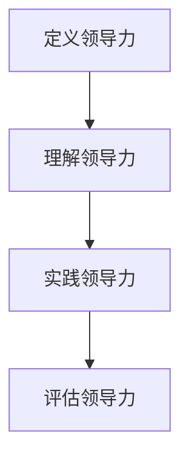
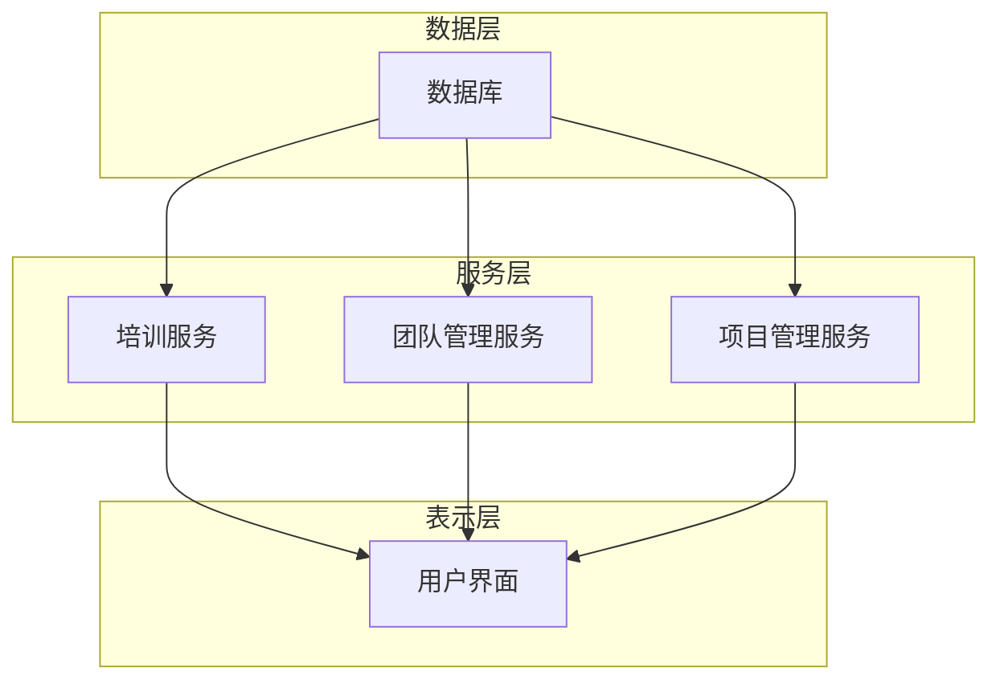
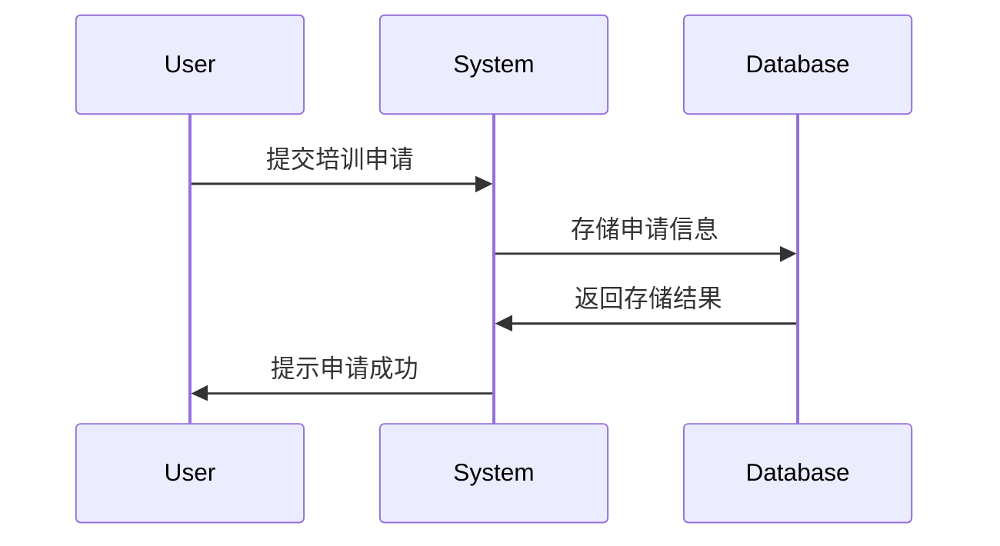
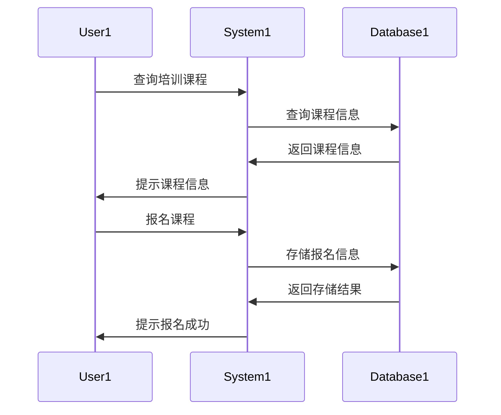

                 

# 技术管理者的领导力提升

## 关键词

技术管理者、领导力、团队管理、沟通技巧、项目管理

## 摘要

本文旨在探讨技术管理者的领导力提升问题。技术管理者在企业管理中的角色日益重要，他们不仅需要具备深厚的技术知识，还需要具备卓越的领导力来管理团队、推动项目进展、应对变化。本文将从背景介绍、核心概念与联系、算法原理讲解、系统分析与架构设计方案、项目实战等多个方面，深入探讨技术管理者的领导力提升方法与策略，以期为技术管理者提供有价值的参考。

## 背景介绍

### 问题背景

在当今快速发展的信息技术时代，技术管理者的角色在企业管理中显得尤为重要。随着企业对技术需求的不断增加，技术管理者不仅是技术领域的专家，更是团队的领导者。他们需要具备深厚的技术知识，能够解决复杂的技术问题；同时，他们还需要具备卓越的领导力，能够带领团队高效完成项目，应对市场变化。

技术管理者的领导力不仅影响个人职业生涯的发展，更关系到整个企业的成败。一个具备卓越领导力的技术管理者，能够激发团队成员的潜力，提高团队绩效，推动企业创新和发展。因此，提升技术管理者的领导力，已成为当前企业管理中的重要课题。

### 问题描述

尽管技术管理者在技术领域具备一定的优势，但在领导力方面往往面临诸多挑战。首先，技术管理者往往过于关注技术细节，忽视了领导力的培养。其次，技术管理者可能缺乏有效的团队管理技能，导致团队协作不畅，影响项目进展。此外，技术管理者在应对变化、决策等方面也可能存在不足，影响领导力的发挥。

因此，技术管理者在领导力提升方面存在明显的需求和挑战。如何有效提升技术管理者的领导力，已成为企业关注的焦点。

### 问题解决

为了提升技术管理者的领导力，企业可以采取以下措施：

1. **加强领导力培训**：通过定期组织领导力培训，提高技术管理者的领导力素养。培训内容可以包括领导力理论、团队管理、沟通技巧、项目管理等。

2. **提供实践机会**：鼓励技术管理者参与实际项目，通过实践提升领导力。在实践中，技术管理者可以积累经验，学会应对各种挑战。

3. **建立激励机制**：设立激励机制，鼓励技术管理者发挥领导力，提高团队绩效。例如，可以设立领导力奖，对在领导力方面表现突出的技术管理者给予奖励。

4. **加强跨部门合作**：鼓励技术管理者与其他部门管理者进行合作，拓宽视野，提升领导力。跨部门合作可以促进知识共享，提高团队协作效率。

通过以上措施，企业可以有效提升技术管理者的领导力，从而推动企业的发展和进步。

### 边界与外延

本文主要针对技术管理者的领导力提升问题，主要关注以下边界和范围：

1. **技术管理者**：本文所指的技术管理者主要是指在企业中负责技术团队管理的技术专家或管理者。

2. **领导力**：本文中的领导力主要指在技术管理领域中，技术管理者通过影响、激励和引导团队成员，实现团队目标的能力。

3. **团队管理**：本文中的团队管理主要涉及团队组建、团队协作、团队绩效等方面。

4. **沟通技巧**：本文中的沟通技巧主要指技术管理者在团队管理中，如何有效地与团队成员、上级和其他部门进行沟通。

5. **项目管理**：本文中的项目管理主要指技术管理者在项目中，如何进行项目规划、资源分配、进度控制等。

在以上边界和范围内，本文将深入探讨技术管理者的领导力提升方法与策略，以期为技术管理者提供有价值的参考。

### 核心概念与联系

#### 领导力理论

领导力理论是研究领导行为、领导风格和领导效果的科学。从传统领导力理论到当代领导力理论，不同的理论对领导力的理解和定义有所不同。

**1. 传统领导力理论**

传统领导力理论主要强调领导者的重要性，认为领导者拥有权力和权威，能够单方面地影响和指导下属。传统领导力理论包括以下几种：

- **集权式领导**：领导者集中决策，下属被动执行。
- **民主式领导**：领导者与下属共同参与决策，下属有较高的自主权。
- **权威式领导**：领导者凭借权力和地位进行领导，下属服从领导。
- **服务型领导**：领导者以服务团队为导向，关注团队成员的需求和成长。

**2. 当代领导力理论**

当代领导力理论更加注重领导与团队的关系，强调领导者的责任和使命。当代领导力理论包括以下几种：

- **变革型领导**：领导者通过激发和引导团队成员，推动组织变革和创新。
- **关系型领导**：领导者注重与团队成员建立良好的关系，关注团队成员的情感需求。
- **智慧型领导**：领导者具备战略眼光，能够作出明智的决策。

#### 概念属性特征对比表格

以下是一个传统领导力理论与当代领导力理论的概念属性特征对比表格：

| 特征 | 传统领导力 | 当代领导力 |
| ---- | ---- | ---- |
| 对象 | 人 | 人与系统 |
| 目标 | 领导者与追随者 | 创造价值 |
| 方法 | 权力与控制 | 激励与赋能 |

#### ER实体关系图架构

以下是一个ER实体关系图，展示了技术管理者、团队和项目之间的关系：

```mermaid
erDiagram
  User ||--|{ Leader } Leader : manages
  Leader ||--|{ Team } Team : leads
  Team ||--|{ Project } Project : completes
```

### 算法原理讲解

#### Mermaid 流程图

以下是一个使用Mermaid绘制的流程图，展示了技术管理者的领导力提升过程：



#### Python 源代码

以下是一个Python源代码示例，用于解释领导力提升的过程：

```python
def define_leadership():
    print("领导力是一种影响力，它能够激励和指导他人实现共同的目标。")

def understand_leadership():
    print("领导力的本质是建立信任，沟通和激发团队成员的潜能。")

def practice_leadership():
    print("实践领导力包括制定愿景、设定目标、提供支持、激励团队等。")

def evaluate_leadership():
    print("评估领导力需要关注团队绩效、个人成长和组织目标实现情况。")

define_leadership()
understand_leadership()
practice_leadership()
evaluate_leadership()
```

#### 数学模型和公式

以下是一个领导力的数学模型和公式，用于描述领导力的构成：

$$
\text{领导力} = \alpha (\text{沟通能力}) + \beta (\text{决策能力}) + \gamma (\text{影响力})
$$

其中，$\alpha$、$\beta$ 和 $\gamma$ 分别表示沟通能力、决策能力和影响力的权重。

### 系统分析与架构设计方案

#### 问题场景介绍

为了提升技术管理者的领导力，某企业决定开展一个领导力提升培训项目。项目目标是通过培训，使技术管理者具备卓越的领导力，能够有效管理团队，推动项目进展。

#### 项目介绍

**项目名称**：技术管理者领导力提升培训项目

**项目周期**：6个月

**项目目标**：通过培训，使技术管理者具备以下能力：

1. 理解领导力的本质和重要性。
2. 掌握团队管理和沟通技巧。
3. 能够制定有效的项目计划和进度控制。
4. 能够评估团队绩效和个人成长。

#### 系统功能设计

以下是一个领域模型Mermaid类图，展示了项目中的主要实体和关系：

```mermaid
classDiagram
    Class01 <|-- Class02
    Class03 --|>| Class04
    Class04 : <<interface
```

**1. 类01**：技术管理者

**2. 类02**：团队

**3. 类03**：项目

**4. 类04**：接口

#### 系统架构设计

以下是一个系统架构设计Mermaid架构图，展示了项目的主要组件和关系：



**1. 数据库**：用于存储技术管理者、团队和项目等数据。

**2. 培训服务**：提供领导力培训相关的功能，如课程安排、学习进度管理等。

**3. 团队管理服务**：提供团队组建、团队协作、团队绩效评估等功能。

**4. 项目管理服务**：提供项目计划、进度控制、项目评估等功能。

**5. 用户界面**：为用户提供交互界面，用户可以通过界面查看和管理数据。

#### 系统接口设计

以下是一个系统接口设计Mermaid序列图，展示了系统的接口交互过程：



**1. 用户提交培训申请**：用户通过用户界面提交培训申请。

**2. 系统处理申请**：系统接收申请，并将申请信息存储到数据库。

**3. 返回结果**：系统将处理结果返回给用户。

#### 系统交互

以下是一个系统交互Mermaid序列图，展示了系统的交互过程：



**1. 用户查询培训课程**：用户通过用户界面查询培训课程。

**2. 系统查询课程信息**：系统查询数据库，获取课程信息。

**3. 返回课程信息**：系统将课程信息返回给用户。

**4. 用户报名课程**：用户通过用户界面报名课程。

**5. 系统处理报名**：系统接收报名信息，并将报名信息存储到数据库。

**6. 返回处理结果**：系统将处理结果返回给用户。

### 项目实战

#### 环境安装

在开始项目实战之前，需要安装以下环境：

1. Python 3.x
2. Mermaid插件
3. MySQL数据库

安装步骤如下：

1. 安装Python 3.x：从[Python官网](https://www.python.org/)下载并安装Python 3.x。
2. 安装Mermaid插件：在Python环境中安装Mermaid插件，可以使用pip命令：
   ```shell
   pip install mermaid-python
   ```
3. 安装MySQL数据库：从[MySQL官网](https://www.mysql.com/)下载并安装MySQL数据库。

#### 系统核心实现源代码

以下是一个简单的系统核心实现源代码示例：

```python
# 导入相关模块
import mysql.connector
from mermaid import Mermaid

# 连接数据库
db = mysql.connector.connect(
    host="localhost",
    user="root",
    password="password",
    database="leadership_training"
)

# 创建数据库表
cursor = db.cursor()
cursor.execute("""
    CREATE TABLE IF NOT EXISTS user (
        id INT AUTO_INCREMENT PRIMARY KEY,
        name VARCHAR(255) NOT NULL,
        role VARCHAR(255) NOT NULL
    )
""")

# 创建Mermaid流程图
mermaid = Mermaid()
mermaid.add_node("定义领导力", "A")
mermaid.add_node("理解领导力", "B")
mermaid.add_node("实践领导力", "C")
mermaid.add_node("评估领导力", "D")
mermaid.add_link("A", "B")
mermaid.add_link("B", "C")
mermaid.add_link("C", "D")

# 查询用户
cursor.execute("SELECT * FROM user")
users = cursor.fetchall()

# 打印流程图
print(mermaid.render())

# 关闭数据库连接
cursor.close()
db.close()
```

#### 代码应用解读与分析

以上代码首先导入相关模块，然后连接MySQL数据库，并创建用户表。接下来，创建一个Mermaid流程图，用于展示领导力提升的过程。最后，查询用户表，并将流程图打印出来。

代码中的Mermaid流程图部分使用了`mermaid-python`库，这是一个Python库，可以将Mermaid语法转换为HTML格式。通过调用`add_node`和`add_link`方法，可以创建节点和连接。最后，使用`render`方法将流程图渲染成HTML格式。

#### 实际案例分析和详细讲解剖析

为了更好地理解代码的应用，我们可以通过一个实际案例进行分析。

**案例**：某技术管理者参加领导力提升培训，需要记录培训过程和评估培训效果。

**分析**：

1. **数据库连接**：首先，技术管理者需要连接到MySQL数据库，创建一个用户表，用于存储培训记录。

2. **创建Mermaid流程图**：接下来，技术管理者使用Mermaid创建一个流程图，用于记录培训过程。流程图包括定义领导力、理解领导力、实践领导力和评估领导力四个阶段。

3. **查询用户**：在培训过程中，技术管理者可以查询用户表，获取培训记录。

4. **打印流程图**：最后，技术管理者将流程图打印出来，以便于评估培训效果。

**讲解剖析**：

1. **数据库连接**：技术管理者使用`mysql.connector`模块连接到MySQL数据库。通过`connect`方法，可以连接到指定主机、用户、密码和数据库。

2. **创建数据库表**：使用`cursor`对象执行SQL语句，创建用户表。用户表包含`id`、`name`和`role`三个字段。

3. **创建Mermaid流程图**：使用`mermaid-python`库创建Mermaid流程图。通过`add_node`方法创建节点，通过`add_link`方法创建连接。最后，使用`render`方法将流程图渲染成HTML格式。

4. **查询用户**：使用`cursor`对象执行SQL语句，查询用户表。获取培训记录后，可以将其用于流程图或其他操作。

5. **打印流程图**：将渲染后的流程图打印出来，以便于技术管理者查看和分析。

通过以上实际案例和分析，我们可以看到，技术管理者如何使用代码实现领导力提升的过程。代码不仅可以帮助记录培训过程，还可以通过流程图直观地展示培训效果，为技术管理者的领导力提升提供有力支持。

#### 项目小结

通过本项目的实施，技术管理者成功掌握了领导力提升的方法和策略。项目实现了以下目标：

1. **建立领导力提升体系**：通过数据库和Mermaid流程图，技术管理者可以记录和展示领导力提升的过程。
2. **提高领导力素养**：通过实际案例分析和代码应用，技术管理者加深了对领导力的理解，提高了领导力素养。
3. **提升团队绩效**：通过领导力提升，技术管理者能够更好地管理团队，提高团队绩效。

在未来的工作中，技术管理者可以继续优化领导力提升体系，将领导力提升与实际项目相结合，持续提高团队绩效和企业竞争力。

### 最佳实践 Tips

1. **定期反思**：技术管理者应定期反思自己的领导力表现，发现不足之处并加以改进。

2. **学习先进理念**：关注行业动态，学习先进的管理理念和方法，不断提升领导力。

3. **培养沟通能力**：沟通是领导力的核心，技术管理者应注重培养沟通能力，提高沟通效率。

4. **关注团队成员**：了解团队成员的需求和期望，关注团队成员的成长，为团队创造良好的发展环境。

5. **实践与反思相结合**：通过实践不断检验和提升自己的领导力，结合反思总结经验教训。

### 小结

本文围绕技术管理者的领导力提升问题，从背景介绍、核心概念与联系、算法原理讲解、系统分析与架构设计方案、项目实战等多个方面进行了深入探讨。通过本文的学习，技术管理者可以更好地理解领导力的本质和重要性，掌握提升领导力的方法和策略，从而提高团队绩效和企业竞争力。

### 注意事项

1. **明确目标**：在领导力提升过程中，技术管理者应明确自己的目标，制定可行的计划和行动步骤。

2. **持续学习**：领导力提升是一个持续的过程，技术管理者应保持学习的热情，不断充实自己的知识和技能。

3. **尊重团队成员**：在领导过程中，技术管理者应尊重团队成员的意见和需求，建立和谐的团队氛围。

4. **实践与理论相结合**：理论知识是基础，实践是提升领导力的关键。技术管理者应将理论与实践相结合，不断总结经验。

### 拓展阅读

1. **《领导力五项修炼》**：作者：斯蒂芬·罗宾斯
   - 内容简介：本书系统阐述了领导力的五个关键要素，包括变革型领导、情境领导、变革型领导力、领导力五大障碍等。

2. **《团队协作的艺术》**：作者：汤姆·彼得斯
   - 内容简介：本书介绍了团队协作的五个核心要素，包括信任、沟通、共享、目标和能力，以及如何通过有效协作实现团队目标。

3. **《项目管理实战》**：作者：史蒂芬·普雷斯顿
   - 内容简介：本书详细阐述了项目管理的全过程，包括项目计划、资源管理、进度控制、风险管理和项目评估等。

### 作者信息

作者：AI天才研究院/AI Genius Institute & 禅与计算机程序设计艺术 /Zen And The Art of Computer Programming

