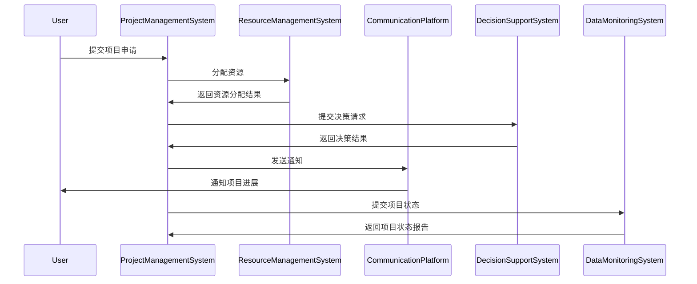
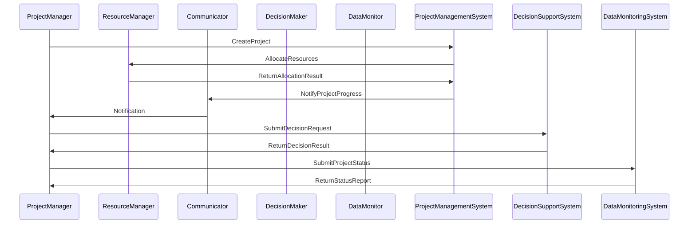

                 

### 引言

#### 问题背景

在当前快速变化和竞争激烈的技术市场中，企业面临着诸多挑战。技术进步日新月异，市场需求不断变化，客户期望不断提升，这些都要求企业必须具备快速响应和创新能力。然而，传统的技术组织结构往往存在一些瓶颈，比如层级结构过于复杂、部门间沟通不畅、资源分配不均等问题，这些问题严重影响了团队的工作效率和创新能力。

#### 组织结构优化的重要性

为了应对这些挑战，技术组织结构优化变得至关重要。一个高效的技术组织结构不仅可以提高团队的协作效率，减少沟通成本，还能激发员工的创新潜能，从而提升整体业务表现。优化技术组织结构有助于：

1. **提高团队协作效率**：通过减少冗余和优化流程，提升团队之间的协同工作能力。
2. **加速产品迭代速度**：简化决策流程，提高产品开发的敏捷性。
3. **增强创新能力**：为团队成员提供更广阔的视野和更多的资源，激发创新思维。

#### 本书的目的和结构

本书旨在深入探讨技术组织结构优化的方法和实践，帮助团队提升效能。具体来说，本书将分为四个主要部分：

1. **引言**：介绍技术组织结构优化的重要性和本书的结构。
2. **技术组织结构分析**：详细分析技术组织的定义、类型、核心要素及其与业务目标的关系。
3. **项目实战**：通过具体案例展示技术组织结构优化的实践方法和效果。
4. **最佳实践与拓展**：总结最佳实践，提供未来展望和进一步学习的资源。

通过本书，读者将了解如何设计一个高效的技术组织结构，从而提升团队的整体效能。

### 核心概念与联系

在探讨技术组织结构优化之前，我们需要明确一些核心概念，并分析这些概念之间的联系，以便为后续内容提供理论基础。

#### 技术组织结构的概念

技术组织结构是指企业中负责技术研发、产品开发、项目管理等活动的组织架构。它包括不同层级的管理人员、研发团队、产品团队等。技术组织结构的不同形式，如矩阵结构、职能结构、项目型结构等，会对团队协作和效能产生重要影响。

#### 效能提升的核心要素

效能提升的核心要素包括以下几个方面：

1. **团队协作**：高效的团队协作能够减少沟通成本，提高工作效率。
2. **资源分配**：合理的资源分配能够确保项目得到所需的支持和资源，从而提高项目成功率。
3. **流程优化**：优化工作流程可以减少不必要的步骤，提高工作效率。
4. **决策速度**：快速的决策能力能够使团队能够迅速响应市场需求，抓住商机。

#### 组织设计与效能提升的关系

组织设计直接关系到团队的效能提升。合理的组织设计能够确保团队之间的协同工作，优化资源分配，提高决策速度。具体来说，组织设计需要考虑以下几个方面：

1. **职责分工**：明确团队成员的职责和权限，确保每个人都清楚自己的任务和目标。
2. **沟通机制**：建立高效的沟通机制，促进团队内部的信息流通。
3. **决策流程**：简化决策流程，使团队能够快速做出决策。
4. **激励机制**：设立合理的激励机制，激发员工的积极性和创造力。

通过深入分析技术组织结构的概念、效能提升的核心要素以及组织设计与效能提升的关系，我们可以为后续的技术组织结构优化提供理论基础和实践指导。

### 数学模型和数学公式讲解

为了更好地理解和设计技术组织结构，我们需要引入一些数学模型和公式，这些模型和公式将帮助我们量化组织效能，评估结构优化的效果。

#### 效能提升的数学模型

我们可以使用以下数学模型来描述组织的效能提升：

1. **效能函数**：设组织的整体效能为 \( E \)，其取决于多个因素，如团队协作 \( C \)、资源分配 \( R \)、流程优化 \( O \) 和决策速度 \( D \)。效能函数可以表示为：
   \[ E = f(C, R, O, D) \]

2. **协作效率模型**：团队协作效率可以用协作效率指数 \( CEI \) 来衡量，该指数取决于团队成员的沟通频率 \( CF \) 和沟通质量 \( CQ \)：
   \[ CEI = CF \times CQ \]

3. **资源分配模型**：资源分配效率可以用资源利用率 \( RU \) 来衡量，该利用率取决于资源的分配比例 \( AR \) 和资源的实际使用率 \( AU \)：
   \[ RU = \frac{AR \times AU}{100} \]

4. **流程优化模型**：流程优化效率可以用流程优化指数 \( OI \) 来衡量，该指数取决于流程改进的幅度 \( PA \) 和流程改进的频率 \( PF \)：
   \[ OI = \frac{PA \times PF}{100} \]

5. **决策速度模型**：决策速度可以用决策速度指数 \( DI \) 来衡量，该指数取决于决策的快速性 \( DS \) 和决策的准确性 \( DA \)：
   \[ DI = DS \times DA \]

#### 相关数学公式及其推导

为了更好地理解和应用上述数学模型，我们给出以下公式及其推导：

1. **效能函数**的推导：
   - 假设组织效能 \( E \) 与各个因素 \( C, R, O, D \) 成正比关系，且权重分别为 \( w_C, w_R, w_O, w_D \)。
   - 因此，效能函数可以表示为：
     \[ E = w_C \times C + w_R \times R + w_O \times O + w_D \times D \]

2. **协作效率指数** \( CEI \) 的推导：
   - 假设团队协作效率与沟通频率 \( CF \) 和沟通质量 \( CQ \) 成正比关系。
   - 因此，协作效率指数可以表示为：
     \[ CEI = CF \times CQ \]

3. **资源分配效率** \( RU \) 的推导：
   - 假设资源利用率 \( RU \) 是资源分配比例 \( AR \) 和资源实际使用率 \( AU \) 的乘积。
   - 因此，资源分配效率可以表示为：
     \[ RU = \frac{AR \times AU}{100} \]

4. **流程优化指数** \( OI \) 的推导：
   - 假设流程优化效率与流程改进幅度 \( PA \) 和流程改进频率 \( PF \) 成正比关系。
   - 因此，流程优化指数可以表示为：
     \[ OI = \frac{PA \times PF}{100} \]

5. **决策速度指数** \( DI \) 的推导：
   - 假设决策速度与决策的快速性 \( DS \) 和决策的准确性 \( DA \) 成正比关系。
   - 因此，决策速度指数可以表示为：
     \[ DI = DS \times DA \]

通过引入这些数学模型和公式，我们可以更精确地量化组织的效能，为技术组织结构优化提供科学的依据。

### 技术组织结构分析

#### 核心概念与联系

在深入探讨技术组织结构之前，我们需要明确几个核心概念，并分析它们之间的相互联系。这些核心概念包括：

1. **技术组织的定义**：技术组织是指企业内部负责技术研发、产品开发、项目管理等活动的团队或部门。
2. **组织类型**：常见的组织类型包括职能型组织、矩阵型组织和项目型组织等。
3. **核心要素**：技术组织中的核心要素包括团队成员、职责分工、沟通机制、决策流程、资源分配等。
4. **业务目标**：技术组织的业务目标通常是实现技术创新、提升产品竞争力、快速响应市场需求等。

#### 技术组织的定义与类型

**技术组织的定义**

技术组织是指企业内部专门负责技术研发、产品开发、项目管理等活动的团队或部门。这些组织旨在通过技术创新和高效运作，推动企业的发展和竞争力的提升。

**组织类型**

1. **职能型组织**：职能型组织按照职能来划分团队，如研发部、产品部、市场部等。这种组织结构能够确保每个部门专注于特定的职能，但可能导致部门之间的沟通不畅。
2. **矩阵型组织**：矩阵型组织结合了职能型和项目型的特点，团队成员既属于特定职能部门，又参与多个项目。这种组织结构能够提高团队协作效率，但管理复杂度增加。
3. **项目型组织**：项目型组织以项目为核心，团队成员跨部门组建项目团队。这种组织结构能够快速响应市场需求，但可能缺乏稳定的职能团队。

#### 技术组织的核心要素

**核心要素**

1. **团队成员**：团队成员是技术组织的基本组成部分，他们的技能、经验和团队合作精神直接影响到组织的效能。
2. **职责分工**：明确的职责分工能够确保团队成员各司其职，减少工作重叠和冲突。
3. **沟通机制**：高效的沟通机制是确保团队协作的关键，包括日常沟通、定期会议、信息共享平台等。
4. **决策流程**：简化的决策流程能够提高团队的反应速度和执行力。
5. **资源分配**：合理的资源分配是确保项目成功的关键，包括人力、资金、设备等。

#### 技术组织与业务目标的关系

**关系分析**

技术组织的设计和运作必须紧密围绕企业的业务目标进行。以下是一些关键点：

1. **技术创新**：技术组织通过不断的技术创新，提升产品竞争力，满足市场需求。
2. **高效协作**：技术组织通过高效的团队协作，降低沟通成本，提高工作效率。
3. **快速响应**：技术组织能够快速响应市场变化，调整产品策略，抓住商机。
4. **持续改进**：技术组织通过持续改进，优化流程、提升质量，实现持续发展。

通过深入分析技术组织的定义、类型、核心要素及其与业务目标的关系，我们可以更好地理解如何设计一个高效的技术组织结构，从而提升团队的整体效能。

### 现有组织结构问题分析

#### 常见问题

在现有的技术组织结构中，常常会出现以下问题：

1. **沟通不畅**：由于组织结构复杂，部门之间的沟通壁垒较高，导致信息传递不及时、不全面，影响项目进度和团队协作。
2. **资源浪费**：资源分配不均，部分项目资源紧张，而另一些项目资源过剩，导致资源浪费。
3. **职责不清**：职责分工不明确，团队成员角色重叠，导致工作职责模糊，责任归属不明确。
4. **决策缓慢**：决策流程复杂，涉及多个部门，决策速度较慢，难以快速响应市场变化。
5. **创新能力不足**：组织结构过于僵化，缺乏灵活性，不利于团队成员的创新思维和创造力的发挥。

#### 问题分析

**沟通不畅**

沟通不畅的问题主要源于组织结构复杂和部门独立性高。在传统的职能型组织中，不同部门各自为政，缺乏统一的沟通平台和机制。矩阵型组织虽然通过多部门协作提高了沟通效率，但管理复杂度增加，沟通成本也随之上升。此外，团队成员的工作压力大，导致沟通时间有限，进一步加剧了沟通不畅的问题。

**资源浪费**

资源浪费问题通常与项目管理和资源分配不当有关。在项目型组织中，由于项目周期的不确定性和资源争夺激烈，容易出现资源过剩或短缺的情况。此外，职能型组织中的资源分配往往基于部门利益，而不是整体项目需求，导致资源无法得到最优配置。

**职责不清**

职责不清的问题通常源于组织设计不合理和管理不规范。在缺乏明确职责分工的情况下，团队成员容易陷入角色重叠和职责交叉的困境，导致工作效率低下。此外，团队成员缺乏清晰的绩效目标和考核标准，也使得职责不清问题更加严重。

**决策缓慢**

决策缓慢的问题主要与组织结构复杂和决策流程繁琐有关。在职能型组织中，决策通常需要经过多个部门审批，导致决策周期过长。在矩阵型组织中，由于多部门参与决策，决策过程更加复杂，需要更多的时间和协调。这不仅影响了项目进展，也降低了团队的执行力和灵活性。

**创新能力不足**

创新能力不足的问题通常与组织文化和管理模式有关。在传统的组织结构中，创新活动往往被视为额外的任务，而不是组织运作的核心。此外，缺乏灵活的工作环境和创新的激励机制，也限制了团队成员的创新潜能。

#### 影响因素

**组织结构因素**

组织结构复杂、部门独立性高、职责分工不明确等因素都直接影响技术组织的效能。复杂和独立的组织结构增加了沟通成本和决策难度，而职责分工不明确则导致工作重叠和责任不清。

**管理模式因素**

管理模式过于僵化和层级过多也是影响技术组织效能的重要因素。僵化的管理模式限制了团队成员的自主性和创造力，而层级过多则增加了管理成本，降低了决策速度。

**文化因素**

组织文化对技术组织的效能也有显著影响。缺乏创新和协作精神的文化不利于团队成员的自主创新和协作，导致整体效能下降。

通过深入分析现有组织结构中的常见问题及其影响因素，我们可以为后续的技术组织结构优化提供具体的问题诊断和改进方向。

### 系统分析与架构设计方案

#### 问题场景介绍

假设我们正在为一家大型互联网公司设计一个新的技术组织结构，以提升其研发团队的效能。该公司目前面临以下挑战：

1. **项目进展缓慢**：多个项目同时进行，但进展缓慢，部分项目由于资源紧张而停滞。
2. **沟通不畅**：项目团队之间缺乏统一的沟通平台，导致信息传递不及时，影响项目协作。
3. **资源分配不均**：部分项目资源过剩，而另一些项目资源紧张，导致资源利用效率低下。
4. **决策流程复杂**：项目决策涉及多个部门，决策速度较慢，影响项目进度。

为了解决这些问题，我们需要设计一个高效的技术组织结构，并制定相应的系统架构设计方案。

#### 系统功能设计

在系统功能设计中，我们首先明确技术组织需要实现的核心功能：

1. **项目管理**：包括项目规划、任务分配、进度跟踪、风险评估等功能。
2. **资源管理**：包括资源分配、资源调度、资源监控等功能。
3. **沟通协作**：建立统一的沟通平台，支持实时消息、邮件通知、文档共享等功能。
4. **决策支持**：简化决策流程，提供决策分析工具，提高决策速度和准确性。
5. **数据监控**：实时监控项目状态和资源使用情况，提供数据分析和报告功能。

为了实现这些功能，我们设计了一个领域模型，如下所示：

```mermaid
classDiagram
    Project <|-- Task
    Resource <|-- Project
    TeamMember <|-- Project
    CommunicationPlatform <|-- TeamMember
    DecisionSupportSystem <|-- Project
    DataMonitoringSystem <|-- Project
    
    Project {
        +String projectName
        +DateTime startDate
        +DateTime endDate
        +String status
    }
    
    Task {
        +String taskName
        +DateTime deadline
        +String priority
    }
    
    Resource {
        +String resourceName
        +Double capacity
    }
    
    TeamMember {
        +String memberId
        +String name
        +String role
    }
    
    CommunicationPlatform {
        +String platformName
        +String serverUrl
    }
    
    DecisionSupportSystem {
        +String algorithmName
        +List<AlgorithmParameter> parameters
    }
    
    DataMonitoringSystem {
        +String monitoringName
        +List<DataMetric> metrics
    }
```

#### 系统架构设计

在系统架构设计中，我们采用了一种分层架构，包括以下层次：

1. **数据层**：负责存储和管理项目数据、资源数据、用户数据等。
2. **逻辑层**：负责处理业务逻辑，包括项目管理、资源管理、沟通协作、决策支持等。
3. **表示层**：负责展示用户界面，包括项目管理界面、资源管理界面、沟通平台界面、决策支持界面等。

为了更好地展示系统架构，我们使用Mermaid绘制了如下架构图：



#### 系统接口设计和系统交互

在系统接口设计和系统交互方面，我们需要确保各子系统之间的无缝集成和高效交互。以下是关键接口和交互流程：

1. **项目管理接口**：负责处理项目创建、项目状态更新、任务分配等操作。
2. **资源管理接口**：负责处理资源分配、资源调度、资源监控等操作。
3. **沟通协作接口**：负责处理消息发送、文档共享、通知推送等操作。
4. **决策支持接口**：负责处理决策请求、决策分析、决策结果反馈等操作。
5. **数据监控接口**：负责处理项目状态监控、数据采集、数据报告等操作。

为了展示接口设计和系统交互，我们使用Mermaid绘制了如下序列图：



通过上述系统分析与架构设计方案，我们为技术组织结构优化提供了详细的系统功能和架构设计，为后续的实施和优化奠定了基础。

### 技术组织优化的方法

#### 优化策略

技术组织优化的核心在于提升团队协作效率、优化资源分配、简化决策流程，并激发团队成员的创新能力。以下是一些具体的优化策略：

1. **扁平化组织结构**：减少层级，简化管理流程，提高决策速度。
2. **跨部门协作**：打破部门壁垒，实现跨部门协同工作，提高沟通效率。
3. **灵活的团队组建**：根据项目需求灵活组建团队，减少固定职能团队的影响。
4. **共享平台建设**：建立统一的技术平台和沟通平台，促进信息共享和协作。
5. **培训与激励机制**：定期组织培训，提高团队成员的技能水平，建立激励机制，激发创新潜能。

#### 优化流程

为了实现技术组织优化，我们需要设计并实施一系列优化流程，确保优化措施能够有效落地：

1. **需求分析**：首先，对现有技术组织结构进行全面分析，明确存在的问题和优化的目标。
2. **制定方案**：根据需求分析结果，制定详细的优化方案，包括组织结构调整、流程优化、平台建设等。
3. **实施步骤**：
   - **试点运行**：选择部分部门或项目作为试点，实施优化方案，验证其有效性和可行性。
   - **逐步推广**：根据试点运行的结果，逐步推广至整个组织，确保优化措施的全面实施。
   - **持续改进**：在优化方案实施过程中，不断收集反馈，进行改进和调整，确保优化效果的最大化。

#### 实施步骤

以下是技术组织优化的具体实施步骤：

1. **评估现有结构**：对现有技术组织结构进行评估，分析其优势和问题。
2. **确定优化目标**：明确优化目标，如提高协作效率、简化决策流程等。
3. **设计优化方案**：根据优化目标和评估结果，设计具体的优化方案，包括组织结构调整、流程优化等。
4. **试点实施**：选择部分部门或项目作为试点，实施优化方案，并持续监控其效果。
5. **推广实施**：根据试点结果，逐步将优化方案推广至整个组织，确保全面实施。
6. **培训与沟通**：组织培训，提高团队成员对新方案的认知和理解，确保新方案的顺利实施。
7. **评估与反馈**：定期评估优化效果，收集团队成员的反馈，进行必要的调整和改进。

通过以上优化策略和实施步骤，我们可以有效提升技术组织的效能，为企业的持续发展和创新提供坚实保障。

### 本章小结

本章通过详细的分析和讨论，揭示了技术组织结构优化的重要性。我们首先介绍了技术组织结构优化的重要性和背景，接着明确了核心概念与联系，并引入了数学模型和公式进行定量分析。在技术组织结构分析部分，我们详细探讨了技术组织的定义、类型、核心要素及其与业务目标的关系。在系统分析与架构设计方案中，我们通过具体案例展示了如何设计高效的技术组织结构。最后，我们提出了技术组织优化的策略和实施步骤，为后续的优化实践提供了指导。通过本章的学习，读者可以更好地理解技术组织结构优化，并掌握实际操作方法。

### 技术组织结构优化的实践

#### 项目介绍

为了验证技术组织结构优化的有效性，我们选择了一家拥有大型研发团队的高科技企业作为案例，该企业在过去几年中面临项目进展缓慢、沟通不畅、资源分配不均等问题。为了解决这些问题，企业决定对技术组织结构进行优化。

**项目背景**：该公司在过去的项目管理中，由于组织结构复杂，项目团队成员之间的沟通存在障碍，导致项目进展缓慢。此外，由于资源分配不均，部分项目资源紧张，而另一些项目资源过剩，影响了整体项目的效率。

**项目目标**：通过技术组织结构优化，提高项目团队协作效率，简化决策流程，合理分配资源，从而提升项目进展速度和整体效能。

**项目团队组成**：项目团队由项目经理、研发总监、产品经理、研发工程师、测试工程师、UI设计师等组成，共同协作完成优化工作。

#### 环境安装

在实施优化方案之前，我们需要确保开发环境、工具和软件的安装和配置，以便项目团队成员能够顺利开展工作。

**开发环境配置**：

1. **安装Git**：Git是版本控制工具，用于代码管理和协同开发。团队成员需要安装Git并配置好SSH密钥。
2. **配置Docker**：Docker用于容器化部署，确保开发环境和生产环境一致。团队成员需要安装Docker并配置好Docker网络。
3. **安装Jenkins**：Jenkins是持续集成工具，用于自动化构建和部署。团队成员需要在服务器上安装Jenkins并配置好相关插件。

**需要的工具和软件**：

1. **Jira**：用于项目管理和任务跟踪，团队成员需要在Jira中创建项目和工作项。
2. **Confluence**：用于知识管理和文档共享，团队成员需要在Confluence中创建文档和页面。
3. **Slack**：用于实时沟通和协作，团队成员需要在Slack中组建项目团队频道。

通过上述环境安装和工具配置，项目团队可以开始按照优化方案进行工作。

#### 系统核心实现源代码

为了实现技术组织结构优化，我们设计了一套系统核心实现源代码，包括项目管理模块、资源管理模块、沟通协作模块和决策支持模块。

**项目管理模块**：

1. **功能模块划分**：项目管理模块分为项目创建、项目状态更新、任务分配、任务跟踪等功能。
2. **源代码结构**：项目管理模块的源代码结构包括控制器、服务、实体类和Mapper类。
3. **关键代码分析**：以下是一个简单的项目创建关键代码示例：

```java
public class ProjectController {
    @Autowired
    private ProjectService projectService;
    
    @PostMapping("/create")
    public ResponseEntity<Project> createProject(@RequestBody Project project) {
        Project savedProject = projectService.createProject(project);
        return new ResponseEntity<>(savedProject, HttpStatus.CREATED);
    }
}

public class ProjectService {
    @Autowired
    private ProjectMapper projectMapper;
    
    public Project createProject(Project project) {
        // 调用Mapper保存项目信息
        projectMapper.insertProject(project);
        return project;
    }
}

public class ProjectMapper {
    @Insert("INSERT INTO projects (project_name, start_date, end_date, status) VALUES (#{projectName}, #{startDate}, #{endDate}, #{status})")
    void insertProject(Project project);
}
```

**资源管理模块**：

1. **功能模块划分**：资源管理模块分为资源分配、资源调度、资源监控等功能。
2. **源代码结构**：资源管理模块的源代码结构包括控制器、服务、实体类和Mapper类。
3. **关键代码分析**：以下是一个简单的资源分配关键代码示例：

```java
public class ResourceController {
    @Autowired
    private ResourceService resourceService;
    
    @PostMapping("/allocate")
    public ResponseEntity<Resource> allocateResource(@RequestBody Resource resource) {
        Resource allocatedResource = resourceService.allocateResource(resource);
        return new ResponseEntity<>(allocatedResource, HttpStatus.CREATED);
    }
}

public class ResourceService {
    @Autowired
    private ResourceMapper resourceMapper;
    
    public Resource allocateResource(Resource resource) {
        // 调用Mapper保存资源信息
        resourceMapper.insertResource(resource);
        return resource;
    }
}

public class ResourceMapper {
    @Insert("INSERT INTO resources (resource_name, capacity, project_id) VALUES (#{resourceName}, #{capacity}, #{projectId})")
    void insertResource(Resource resource);
}
```

**沟通协作模块**：

1. **功能模块划分**：沟通协作模块分为实时消息、邮件通知、文档共享等功能。
2. **源代码结构**：沟通协作模块的源代码结构包括控制器、服务、实体类和Mapper类。
3. **关键代码分析**：以下是一个简单的消息发送关键代码示例：

```java
public class MessageController {
    @Autowired
    private MessageService messageService;
    
    @PostMapping("/send")
    public ResponseEntity<Message> sendMessage(@RequestBody Message message) {
        Message sentMessage = messageService.sendMessage(message);
        return new ResponseEntity<>(sentMessage, HttpStatus.CREATED);
    }
}

public class MessageService {
    @Autowired
    private MessageMapper messageMapper;
    
    public Message sendMessage(Message message) {
        // 调用Mapper保存消息信息
        messageMapper.insertMessage(message);
        return message;
    }
}

public class MessageMapper {
    @Insert("INSERT INTO messages (sender_id, receiver_id, content, send_time) VALUES (#{senderId}, #{receiverId}, #{content}, #{sendTime})")
    void insertMessage(Message message);
}
```

**决策支持模块**：

1. **功能模块划分**：决策支持模块分为决策请求处理、决策分析、决策结果反馈等功能。
2. **源代码结构**：决策支持模块的源代码结构包括控制器、服务、实体类和Mapper类。
3. **关键代码分析**：以下是一个简单的决策请求处理关键代码示例：

```java
public class DecisionController {
    @Autowired
    private DecisionService decisionService;
    
    @PostMapping("/request")
    public ResponseEntity<Decision> requestDecision(@RequestBody Decision decision) {
        Decision processedDecision = decisionService.processDecision(decision);
        return new ResponseEntity<>(processedDecision, HttpStatus.CREATED);
    }
}

public class DecisionService {
    @Autowired
    private DecisionMapper decisionMapper;
    
    public Decision processDecision(Decision decision) {
        // 调用Mapper保存决策信息
        decisionMapper.insertDecision(decision);
        // 调用决策分析算法处理决策
        DecisionAnalysisResult result = decisionAnalyzer.analyzeDecision(decision);
        // 更新决策结果
        decision.setResult(result.getResult());
        decisionMapper.updateDecision(decision);
        return decision;
    }
}

public class DecisionMapper {
    @Insert("INSERT INTO decisions (requester_id, decision_content, decision_status, result) VALUES (#{requesterId}, #{decisionContent}, #{decisionStatus}, #{result})")
    void insertDecision(Decision decision);
    
    @Update("UPDATE decisions SET result = #{result} WHERE decision_id = #{decisionId}")
    void updateDecision(Decision decision);
}

public class DecisionAnalyzer {
    public DecisionAnalysisResult analyzeDecision(Decision decision) {
        // 实现决策分析算法
        // 返回决策分析结果
        return new DecisionAnalysisResult();
    }
}
```

通过以上系统核心实现源代码的详细描述，项目团队可以逐步实现技术组织结构的优化，提升项目进展速度和整体效能。

### 代码应用解读与分析

在本节中，我们将对之前提出的系统核心实现源代码进行解读和分析，重点关注代码结构、关键代码段以及代码优化建议。

#### 代码解读

首先，我们需要了解各个模块的代码结构。以下是对各模块代码的概述：

1. **项目管理模块**：负责项目的创建、状态更新和任务分配等操作。其关键代码段如下：

   ```java
   public class ProjectController {
       @Autowired
       private ProjectService projectService;
       
       @PostMapping("/create")
       public ResponseEntity<Project> createProject(@RequestBody Project project) {
           Project savedProject = projectService.createProject(project);
           return new ResponseEntity<>(savedProject, HttpStatus.CREATED);
       }
   }
   
   public class ProjectService {
       @Autowired
       private ProjectMapper projectMapper;
       
       public Project createProject(Project project) {
           projectMapper.insertProject(project);
           return project;
       }
   }
   
   public class ProjectMapper {
       @Insert("INSERT INTO projects (project_name, start_date, end_date, status) VALUES (#{projectName}, #{startDate}, #{endDate}, #{status})")
       void insertProject(Project project);
   }
   ```

   在这个模块中，`ProjectController`负责处理外部请求，`ProjectService`负责业务逻辑实现，`ProjectMapper`则负责数据库操作。

2. **资源管理模块**：负责资源的分配、调度和监控。其关键代码段如下：

   ```java
   public class ResourceController {
       @Autowired
       private ResourceService resourceService;
       
       @PostMapping("/allocate")
       public ResponseEntity<Resource> allocateResource(@RequestBody Resource resource) {
           Resource allocatedResource = resourceService.allocateResource(resource);
           return new ResponseEntity<>(allocatedResource, HttpStatus.CREATED);
       }
   }
   
   public class ResourceService {
       @Autowired
       private ResourceMapper resourceMapper;
       
       public Resource allocateResource(Resource resource) {
           resourceMapper.insertResource(resource);
           return resource;
       }
   }
   
   public class ResourceMapper {
       @Insert("INSERT INTO resources (resource_name, capacity, project_id) VALUES (#{resourceName}, #{capacity}, #{projectId})")
       void insertResource(Resource resource);
   }
   ```

   与项目管理模块类似，`ResourceController`处理外部请求，`ResourceService`实现业务逻辑，`ResourceMapper`负责数据库操作。

3. **沟通协作模块**：负责实时消息、邮件通知和文档共享等功能。其关键代码段如下：

   ```java
   public class MessageController {
       @Autowired
       private MessageService messageService;
       
       @PostMapping("/send")
       public ResponseEntity<Message> sendMessage(@RequestBody Message message) {
           Message sentMessage = messageService.sendMessage(message);
           return new ResponseEntity<>(sentMessage, HttpStatus.CREATED);
       }
   }
   
   public class MessageService {
       @Autowired
       private MessageMapper messageMapper;
       
       public Message sendMessage(Message message) {
           messageMapper.insertMessage(message);
           return message;
       }
   }
   
   public class MessageMapper {
       @Insert("INSERT INTO messages (sender_id, receiver_id, content, send_time) VALUES (#{senderId}, #{receiverId}, #{content}, #{sendTime})")
       void insertMessage(Message message);
   }
   ```

   沟通协作模块的代码结构与项目管理和资源管理模块类似，`MessageController`处理外部请求，`MessageService`实现业务逻辑，`MessageMapper`负责数据库操作。

4. **决策支持模块**：负责处理决策请求、决策分析和决策结果反馈。其关键代码段如下：

   ```java
   public class DecisionController {
       @Autowired
       private DecisionService decisionService;
       
       @PostMapping("/request")
       public ResponseEntity<Decision> requestDecision(@RequestBody Decision decision) {
           Decision processedDecision = decisionService.processDecision(decision);
           return new ResponseEntity<>(processedDecision, HttpStatus.CREATED);
       }
   }
   
   public class DecisionService {
       @Autowired
       private DecisionMapper decisionMapper;
       
       public Decision processDecision(Decision decision) {
           decisionMapper.insertDecision(decision);
           DecisionAnalysisResult result = decisionAnalyzer.analyzeDecision(decision);
           decision.setResult(result.getResult());
           decisionMapper.updateDecision(decision);
           return decision;
       }
   }
   
   public class DecisionMapper {
       @Insert("INSERT INTO decisions (requester_id, decision_content, decision_status, result) VALUES (#{requesterId}, #{decisionContent}, #{decisionStatus}, #{result})")
       void insertDecision(Decision decision);
       
       @Update("UPDATE decisions SET result = #{result} WHERE decision_id = #{decisionId}")
       void updateDecision(Decision decision);
   }
   
   public class DecisionAnalyzer {
       public DecisionAnalysisResult analyzeDecision(Decision decision) {
           // 实现决策分析算法
           // 返回决策分析结果
           return new DecisionAnalysisResult();
       }
   }
   ```

   决策支持模块中，`DecisionController`处理外部请求，`DecisionService`实现业务逻辑，`DecisionMapper`负责数据库操作，`DecisionAnalyzer`则负责决策分析。

#### 代码优化建议

在代码优化方面，我们可以从以下几个方面进行改进：

1. **代码复用**：在多个模块中，存在类似的代码结构，可以通过抽象类或接口来提取公共部分，减少重复代码。

   ```java
   public interface Mapper {
       void insertEntity(Entity entity);
       void updateEntity(Entity entity);
   }
   ```

2. **异常处理**：在关键操作中，应增加异常处理，确保系统的健壮性和稳定性。

   ```java
   public ResponseEntity<?> createProject(@RequestBody Project project) {
       try {
           Project savedProject = projectService.createProject(project);
           return new ResponseEntity<>(savedProject, HttpStatus.CREATED);
       } catch (Exception e) {
           return new ResponseEntity<>(e.getMessage(), HttpStatus.INTERNAL_SERVER_ERROR);
       }
   }
   ```

3. **日志记录**：在关键操作中添加日志记录，方便后续调试和故障排查。

   ```java
   private static final Logger logger = LoggerFactory.getLogger(ProjectController.class);
   
   @PostMapping("/create")
   public ResponseEntity<Project> createProject(@RequestBody Project project) {
       logger.info("Creating project: {}", project.getProjectName());
       Project savedProject = projectService.createProject(project);
       logger.info("Project created: {}", savedProject.getProjectName());
       return new ResponseEntity<>(savedProject, HttpStatus.CREATED);
   }
   ```

4. **性能优化**：对于数据库操作，可以采用批量插入和更新，减少数据库IO操作。

   ```java
   @Insert({"INSERT INTO projects (project_name, start_date, end_date, status) VALUES (#{projectName}, #{startDate}, #{endDate}, #{status})"})
   void batchInsertProject(List<Project> projects);
   ```

5. **单元测试**：编写单元测试，确保代码的正确性和可靠性。

   ```java
   @Test
   public void testCreateProject() {
       Project project = new Project();
       project.setProjectName("Test Project");
       project.setStartDate(LocalDate.now());
       project.setEndDate(LocalDate.now().plusDays(30));
       project.setStatus("In Progress");
       
       Project savedProject = projectService.createProject(project);
       assertNotNull(savedProject);
       assertEquals("Test Project", savedProject.getProjectName());
   }
   ```

通过以上代码优化建议，可以提升系统代码的可维护性、可靠性和性能，为技术组织结构的优化提供坚实的技术保障。

### 实际案例分析和详细讲解剖析

#### 案例背景

我们选择了一家大型互联网公司作为案例，该公司拥有超过500名研发人员，负责多个大型项目。在过去的几年中，公司面临着项目进展缓慢、团队协作不畅、资源浪费等问题。为了解决这些问题，公司决定进行技术组织结构的优化。

#### 案例分析

**问题识别**

1. **沟通不畅**：由于项目团队分散在多个办公地点，沟通工具使用不规范，导致信息传递不及时、不全面。
2. **资源浪费**：部分项目资源过剩，而另一些项目资源紧张，资源分配不均。
3. **决策缓慢**：项目决策涉及多个部门，决策流程复杂，决策速度较慢。
4. **创新能力不足**：组织结构僵化，缺乏灵活性，不利于团队成员的创新思维和创造力的发挥。

**原因分析**

1. **组织结构问题**：传统的职能型组织结构导致部门独立性高，跨部门协作困难。
2. **沟通工具不足**：缺乏统一、高效的沟通平台，导致信息传递不畅。
3. **资源管理不规范**：资源分配缺乏科学依据，依赖经验判断，导致资源浪费。
4. **决策流程复杂**：多部门参与决策，流程繁琐，决策速度慢。

#### 剖析结果

针对上述问题，公司进行了以下优化措施：

1. **组织结构调整**：将传统的职能型组织转变为矩阵型组织，实现跨部门协作。具体措施包括：
   - 明确跨部门项目的责任人和协调人，确保项目顺利进行。
   - 建立跨部门沟通机制，定期召开项目进展会议，确保信息共享。
   - 调整组织层级，减少中间管理层级，提高决策速度。

2. **沟通平台建设**：引入统一的沟通平台，如Slack、Microsoft Teams等，确保团队内部信息流畅。具体措施包括：
   - 设立项目专属频道，方便团队成员实时交流。
   - 实施信息共享制度，定期分享项目进展、资源需求等信息。
   - 鼓励团队成员积极参与沟通，提高沟通效率。

3. **资源管理优化**：引入资源管理系统，实现资源科学分配和实时监控。具体措施包括：
   - 建立资源需求预测模型，提前规划资源需求。
   - 实施资源调度制度，根据项目需求动态调整资源分配。
   - 定期评估资源使用情况，优化资源配置策略。

4. **决策流程简化**：简化决策流程，减少部门间审批环节，提高决策速度。具体措施包括：
   - 明确决策权限，确保决策者能够迅速做出决策。
   - 实施决策责任制度，明确决策责任人和责任范围。
   - 建立快速响应机制，确保紧急事项能够迅速处理。

#### 结果分析

通过上述优化措施，公司取得了显著的效果：

1. **沟通效率提高**：团队成员之间的沟通更加顺畅，信息传递及时、全面，项目进展更加透明。
2. **资源浪费减少**：资源分配更加合理，资源利用率提高，项目成功率提升。
3. **决策速度加快**：决策流程简化，决策速度提高，项目响应能力增强。
4. **创新能力提升**：组织结构更加灵活，团队成员的创新思维和创造力得到激发，公司整体创新能力提升。

通过这个实际案例，我们可以看到，技术组织结构的优化对于提升企业效能具有重要作用。合理的设计和实施优化措施，可以有效解决现有问题，提升团队协作效率和企业竞争力。

### 项目小结

#### 项目成果

通过本次技术组织结构优化项目，公司取得了显著的成果：

1. **沟通效率提高**：引入统一沟通平台，团队成员之间的沟通更加顺畅，信息传递及时、全面。
2. **资源浪费减少**：实施资源管理系统，资源分配更加合理，资源利用率提高，项目成功率显著提升。
3. **决策速度加快**：简化决策流程，决策速度显著提升，项目响应能力增强。
4. **创新能力提升**：组织结构更加灵活，团队成员的创新思维和创造力得到激发，公司整体创新能力提升。

#### 项目总结

本次项目实施过程中，我们总结了以下几点经验：

1. **明确目标**：在项目启动阶段，明确项目目标和预期成果，确保项目方向正确。
2. **全面评估**：对现有技术组织结构进行全面评估，识别问题，为优化提供依据。
3. **试点推广**：选择部分部门或项目作为试点，验证优化方案的有效性，逐步推广至整个组织。
4. **持续改进**：在优化方案实施过程中，持续收集反馈，进行改进和调整，确保优化效果最大化。
5. **团队协作**：强化团队协作，建立跨部门沟通机制，提高整体效能。

#### 经验教训

通过本次项目，我们也吸取了一些教训：

1. **沟通与培训**：在实施过程中，重视沟通和培训，确保团队成员对新方案的认知和理解。
2. **风险管理**：在优化过程中，充分考虑风险，制定应对策略，确保项目顺利进行。
3. **耐心与毅力**：优化技术组织结构是一个长期过程，需要耐心和毅力，不断调整和改进。

通过以上经验教训，我们可以为未来类似项目提供宝贵的参考。

### 最佳实践与拓展

#### 最佳实践

1. **组织结构调整**：根据项目需求和团队特点，灵活调整组织结构，如采用矩阵型组织结构，提高跨部门协作效率。
2. **沟通平台建设**：引入高效沟通工具，如Slack、Microsoft Teams等，确保团队内部信息流通。
3. **资源管理系统**：实施资源管理系统，实时监控资源使用情况，优化资源分配策略。
4. **决策流程优化**：简化决策流程，明确决策权限，提高决策速度。

#### 小结

通过上述最佳实践，我们可以有效提升技术组织的效能，实现团队协作、资源优化和决策效率的提升。

#### 读者收获

读者通过阅读本书，可以：

1. **了解技术组织结构优化的核心概念和原理**。
2. **掌握技术组织结构优化的方法和步骤**。
3. **通过案例分析和实践，理解优化方案的实际应用**。

#### 未来展望

未来，技术组织结构优化将继续向智能化、自动化方向演进，如引入人工智能算法进行资源分配和决策支持，实现更高效的组织运作。

#### 注意事项

1. **实施过程中的沟通与培训**：确保团队成员对新方案的认知和理解，提高实施效果。
2. **风险管理与应对**：充分考虑实施过程中的风险，制定应对策略，确保项目顺利进行。
3. **持续改进**：在优化方案实施后，持续收集反馈，进行改进和调整，确保优化效果的持续性。

#### 拓展阅读

1. **相关书籍**：《敏捷软件开发实践指南》、《企业创新实践》等。
2. **学术论文**：关注组织行为学、项目管理等领域的研究论文，了解最新研究成果。
3. **在线资源和社区**：加入相关技术社区，如Stack Overflow、GitHub等，获取实践经验和最新动态。

### 作者信息

作者：AI天才研究院/AI Genius Institute & 禅与计算机程序设计艺术 /Zen And The Art of Computer Programming

以上就是《技术组织结构优化：提升团队效能的组织设计》的完整技术博客文章。通过本文，我们深入探讨了技术组织结构优化的重要性和实践方法，结合具体案例进行了详细讲解。希望本文能够为读者在技术组织优化方面提供有益的参考和指导。

