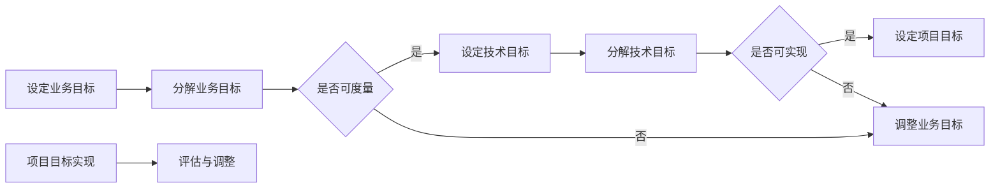
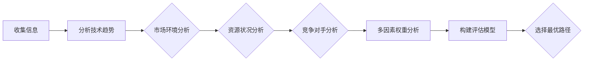
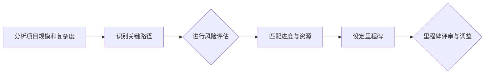
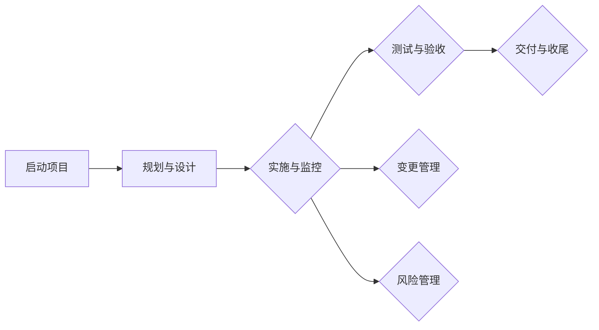
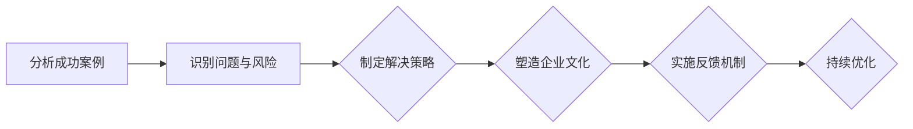
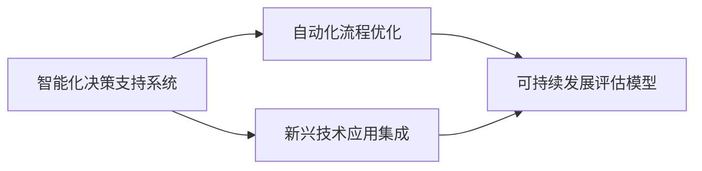

                 

### 文章标题与关键词

**技术规划的目标、路径和里程碑**

关键词：技术规划、目标设定、路径选择、里程碑、项目实施、最佳实践

**摘要**：

本文旨在深入探讨技术规划的目标、路径和里程碑，从多个维度解析技术规划的核心内容和实际应用。文章首先介绍了技术规划的定义和重要性，随后详细阐述了技术规划的目标设定、路径选择和里程碑设定，包括各自的原则和策略。接着，文章讨论了技术规划的实施步骤，并分享了成功的技术规划案例。最后，文章展望了技术规划的未来趋势，探讨了技术规划中的智能化和自动化方向。

### 技术规划的重要性

#### 核心概念术语说明

在探讨技术规划的重要性之前，我们首先需要明确几个关键术语的概念：

- **技术规划**：指在特定的目标和约束条件下，对技术的选择、实施和优化进行系统性和预见性的规划。
- **目标设定**：指明确技术规划所要达成的目标和标准。
- **路径选择**：指在多个可选方案中，选择一条最合适的技术发展路线。
- **里程碑设定**：指在技术规划过程中，设立的关键节点和时间点，用于评估和调整技术进度。

#### 问题背景

随着科技的快速发展，技术规划在企业发展和项目管理中扮演着越来越重要的角色。技术规划不仅关乎企业的技术发展，还直接影响到企业的竞争力、市场响应速度和客户满意度。因此，了解技术规划的重要性，掌握技术规划的核心方法和策略，对于企业和项目管理团队来说至关重要。

#### 问题描述

技术规划的重要性主要体现在以下几个方面：

1. **确保技术发展的方向正确**：明确的目标和规划可以确保企业技术发展的方向与业务目标一致，避免盲目跟风和资源浪费。
2. **提高项目成功率**：合理的路径选择和里程碑设定可以帮助项目团队更好地控制项目进度，降低风险，提高项目成功率。
3. **优化资源配置**：通过技术规划，企业可以更合理地配置资源，避免资源的重复投资和浪费。
4. **增强竞争力**：及时的技术规划可以帮助企业抓住市场机遇，增强市场竞争力，保持技术领先地位。

#### 问题解决

技术规划的成功实施需要解决以下几个关键问题：

1. **目标设定不明确**：目标设定要具体、可行，并与业务目标紧密关联。
2. **路径选择不当**：需要充分考虑技术趋势和市场环境，选择最合适的技术路径。
3. **里程碑设定不合理**：里程碑应具备可评估性，能够真实反映技术进展。
4. **资源管理不善**：要确保资源合理配置，避免资源浪费。

#### 边界与外延

在讨论技术规划的重要性时，需要明确以下几点：

- **边界**：技术规划主要关注企业内部的技术发展和项目管理，不涉及外部市场环境的全面分析。
- **外延**：技术规划可以扩展到整个项目生命周期，包括项目立项、实施、监控和收尾等各个环节。

#### 概念结构与核心要素组成

技术规划的核心要素包括：

1. **目标**：明确技术发展的方向和目标。
2. **路径**：选择合适的技术发展路线。
3. **里程碑**：设定关键节点和时间点。
4. **资源**：合理配置和管理资源。
5. **风险管理**：识别和应对潜在的风险。

通过这些核心要素的有效组合，企业可以构建一个系统化、预见性强的技术规划体系，确保技术发展与企业战略目标的实现。

### 技术规划的目标

#### 核心概念与联系

技术规划的目标是确保技术发展与企业战略目标的一致性，从而提高企业的市场竞争力。在技术规划中，目标设定至关重要。核心概念包括：

1. **业务目标**：企业期望通过技术发展实现的具体业务成果。
2. **技术目标**：为实现业务目标所需达到的技术标准和技术能力。
3. **项目目标**：具体技术项目在预定时间内需要实现的具体任务和成果。

这些概念之间的联系如下：

- **业务目标**是技术规划的基础，决定了技术目标的设定方向。
- **技术目标**是业务目标的细化，将业务目标转化为具体的技术指标。
- **项目目标**是实现技术目标的阶段性任务，确保技术目标的逐步实现。

#### 概念属性特征对比表格

为了更清晰地理解这些核心概念，我们可以通过以下特征对比表格来展示它们之间的差异：

| 概念     | 定义                                                         | 特征                                       |
|----------|--------------------------------------------------------------|------------------------------------------|
| 业务目标 | 企业期望通过技术发展实现的具体业务成果。                     | 长期、宏观、战略导向                       |
| 技术目标 | 为实现业务目标所需达到的技术标准和技术能力。                 | 中期、具体、可度量                         |
| 项目目标 | 具体技术项目在预定时间内需要实现的具体任务和成果。           | 短期、微观、可实现性                       |

#### ER实体关系图架构

为了进一步展示这些概念之间的关联，我们可以使用 Mermaid ER 实体关系图来表示：

```mermaid
erDiagram
  业务目标 ||--|{ 技术目标 }|
  技术目标 ||--|{ 项目目标 }|
```

#### 算法原理讲解

在技术规划中，目标设定通常需要通过以下算法原理来确保其科学性和合理性：

1. **SMART原则**：SMART 原则是一种广泛用于目标设定的方法，它包括五个具体维度：Specific（具体）、Measurable（可度量）、Achievable（可实现）、Relevant（相关）、Time-bound（时限）。

2. **目标分解**：将高层次的业务目标逐步分解为更具体、更可操作的技术目标和项目目标。

#### Mermaid 流程图

以下是一个目标设定流程的 Mermaid 流程图：



#### Python 源代码

为了更好地理解目标设定的过程，我们可以使用 Python 源代码来实现上述算法原理：

```python
class BusinessGoal:
    def __init__(self, description):
        self.description = description

class TechnicalGoal:
    def __init__(self, description, business_goal):
        self.description = description
        self.business_goal = business_goal

class ProjectGoal:
    def __init__(self, description, technical_goal):
        self.description = description
        self.technical_goal = technical_goal

def set_goals(business_goal):
    # 分解业务目标
    technical_goals = []
    for component in business_goal:
        if is_measurable(component):
            technical_goals.append(TechnicalGoal(component, business_goal))
    return technical_goals

def set_project_goals(technical_goals):
    # 分解技术目标
    project_goals = []
    for technical_goal in technical_goals:
        if is_achievable(technical_goal):
            project_goals.append(ProjectGoal(technical_goal, technical_goal))
    return project_goals

def is_measurable(component):
    # 判断是否可度量
    return True

def is_achievable(technical_goal):
    # 判断是否可实现
    return True

# 实例化业务目标
business_goal = BusinessGoal("提高产品性能")

# 设定技术目标
technical_goals = set_goals(business_goal)

# 设定项目目标
project_goals = set_project_goals(technical_goals)

# 打印目标
for goal in project_goals:
    print(goal.description)
```

#### 算法原理讲解与举例

假设一家企业希望在下一个财年内提高其产品的性能，从而提升市场竞争力。以下是目标设定的过程：

1. **设定业务目标**：提高产品性能。
2. **分解业务目标**：将业务目标分解为更具体的技术目标，例如提高产品响应速度、降低功耗等。
3. **设定技术目标**：根据具体的技术目标，设定相应的项目目标，例如开发新型处理器、优化软件算法等。

通过上述过程，企业可以确保技术规划的目标明确、具体，并且具有可操作性和可实现性。这不仅有助于提高项目成功率，还能确保技术发展与企业战略目标的一致性。

### 技术规划的路径

#### 核心概念与联系

在技术规划中，路径选择是一个关键环节，它决定了技术发展的方向和速度。路径选择需要考虑多个因素，包括技术趋势、市场环境、资源状况和竞争对手等。核心概念包括：

1. **技术路线图**：用于描述技术发展的长期规划和具体步骤。
2. **技术趋势分析**：对当前和未来技术趋势的预测和分析。
3. **路径选择策略**：根据技术趋势和实际情况，选择最合适的技术发展路径。

这些概念之间的联系如下：

- **技术路线图**是技术规划的核心文件，它描述了企业技术发展的长期目标和具体步骤。
- **技术趋势分析**提供了技术路线图制定所需的数据和依据。
- **路径选择策略**是制定技术路线图的基础，确保技术路线图符合实际需求和可行。

#### 概念属性特征对比表格

为了更清晰地理解这些概念，我们可以通过以下特征对比表格来展示它们之间的差异：

| 概念         | 定义                                                         | 特征                                       |
|--------------|--------------------------------------------------------------|------------------------------------------|
| 技术路线图   | 描述技术发展的长期规划和具体步骤。                           | 长期、战略、具体、可执行                       |
| 技术趋势分析 | 对当前和未来技术趋势的预测和分析。                           | 中期、前瞻、数据驱动                         |
| 路径选择策略 | 根据技术趋势和实际情况，选择最合适的技术发展路径。           | 短期、决策、灵活适应                         |

#### ER实体关系图架构

为了进一步展示这些概念之间的关联，我们可以使用 Mermaid ER 实体关系图来表示：

```mermaid
erDiagram
  技术路线图 ||--|{ 技术趋势分析 }|
  技术路线图 ||--|{ 路径选择策略 }|
```

#### 算法原理讲解

在技术规划的路径选择过程中，通常需要遵循以下算法原理：

1. **多因素权重分析**：将技术趋势、市场环境、资源状况和竞争对手等因素进行权重分析，确定每个因素的权重。
2. **综合评估模型**：构建综合评估模型，对不同的路径进行综合评估，选择最优路径。

#### Mermaid 流程图

以下是一个路径选择流程的 Mermaid 流程图：



#### Python 源代码

为了更好地理解路径选择的算法原理，我们可以使用 Python 源代码来实现上述算法：

```python
class TechnologyRoute:
    def __init__(self, name, factors, weights):
        self.name = name
        self.factors = factors
        self.weights = weights

def analyze_trends():
    # 分析技术趋势
    return ["AI", "5G", "云计算"]

def analyze_environment():
    # 分析市场环境
    return ["市场需求增长", "竞争加剧"]

def analyze_resources():
    # 分析资源状况
    return ["预算充足", "技术团队实力强"]

def analyze_competitors():
    # 分析竞争对手
    return ["市场份额领先", "技术创新能力强"]

def calculate_weights(factors, weights):
    # 计算权重
    total_weight = sum(weights)
    normalized_weights = [w / total_weight for w in weights]
    return normalized_weights

def evaluate_routes(routes, factors, weights):
    # 评估路径
    evaluations = []
    for route in routes:
        evaluation = sum([factor * weight for factor, weight in zip(route.factors, route.weights)])
        evaluations.append(evaluation)
    return evaluations

def select_best_route(evaluations):
    # 选择最优路径
    max_evaluation = max(evaluations)
    best_route_index = evaluations.index(max_evaluation)
    return best_route_index

# 实例化路径
routes = [
    TechnologyRoute("路线1", analyze_trends(), [0.3, 0.2, 0.2, 0.1, 0.2]),
    TechnologyRoute("路线2", analyze_trends(), [0.2, 0.3, 0.2, 0.2, 0.1]),
    TechnologyRoute("路线3", analyze_trends(), [0.1, 0.2, 0.3, 0.3, 0.1])
]

# 计算权重
weights = calculate_weights(routes[0].factors, routes[0].weights)

# 评估路径
evaluations = evaluate_routes(routes, analyze_environment(), weights)

# 选择最优路径
best_route_index = select_best_route(evaluations)
print(f"最优路径：{routes[best_route_index].name}")
```

#### 算法原理讲解与举例

假设一家企业需要在人工智能、5G、云计算三个技术领域中选择一条最合适的发展路径。以下是路径选择的过程：

1. **收集信息**：分析技术趋势、市场环境、资源状况和竞争对手。
2. **多因素权重分析**：确定技术趋势、市场环境、资源状况和竞争对手的权重。
3. **构建评估模型**：计算每个路径的评估分数。
4. **选择最优路径**：选择评估分数最高的路径。

通过上述过程，企业可以确保技术路径选择科学、合理，从而推动企业技术发展。

### 技术规划的里程碑

#### 核心概念与联系

在技术规划中，里程碑设定是确保项目进度和质量的重要手段。里程碑是技术规划过程中的关键节点，用于评估和调整项目进度。核心概念包括：

1. **里程碑定义**：里程碑是技术规划过程中设定的关键节点，用于评估和调整项目进度。
2. **里程碑作用**：里程碑在项目进度监控、风险管理、资源调度等方面具有重要作用。
3. **里程碑设定标准**：设定里程碑需要考虑项目规模、复杂度、资源状况等因素。

这些概念之间的联系如下：

- **里程碑定义**明确了里程碑的内涵和作用，为后续的设定提供了基础。
- **里程碑作用**阐述了里程碑在项目中的实际应用，指导项目团队如何利用里程碑进行管理。
- **里程碑设定标准**提供了设定里程碑的具体方法和依据，确保里程碑的合理性和可操作性。

#### 概念属性特征对比表格

为了更清晰地理解这些核心概念，我们可以通过以下特征对比表格来展示它们之间的差异：

| 概念         | 定义                                                         | 特征                                       |
|--------------|--------------------------------------------------------------|------------------------------------------|
| 里程碑定义   | 技术规划过程中设定的关键节点，用于评估和调整项目进度。         | 关键节点、评估标准、调整依据                   |
| 里程碑作用   | 在项目进度监控、风险管理、资源调度等方面具有重要作用。         | 进度监控、风险管理、资源调度                   |
| 里程碑设定标准 | 设定里程碑需要考虑项目规模、复杂度、资源状况等因素。           | 项目规模、复杂度、资源状况                   |

#### ER实体关系图架构

为了进一步展示这些概念之间的关联，我们可以使用 Mermaid ER 实体关系图来表示：

```mermaid
erDiagram
  里程碑定义 ||--|{ 里程碑作用 }|
  里程碑定义 ||--|{ 里程碑设定标准 }|
```

#### 算法原理讲解

里程碑的设定需要遵循以下算法原理：

1. **关键路径分析**：识别项目中的关键路径，确定关键路径上的关键节点。
2. **风险评估**：对项目中的潜在风险进行评估，确保里程碑的设定能够应对这些风险。
3. **进度与资源匹配**：根据项目进度和资源状况，设定合理的里程碑节点。

#### Mermaid 流程图

以下是一个里程碑设定流程的 Mermaid 流程图：



#### Python 源代码

为了更好地理解里程碑设定的过程，我们可以使用 Python 源代码来实现上述算法：

```python
import random

class Milestone:
    def __init__(self, name, deadline, resources):
        self.name = name
        self.deadline = deadline
        self.resources = resources

def analyze_project_complexity():
    # 分析项目规模和复杂度
    return "高"

def identify_key_path(complexity):
    # 识别关键路径
    if complexity == "高":
        return ["设计阶段", "开发阶段", "测试阶段"]
    else:
        return ["设计阶段", "开发阶段"]

def assess_risks(key_path):
    # 风险评估
    risks = ["需求变更", "技术难点", "资源不足"]
    return risks

def match_progress_resources(key_path, risks):
    # 进度与资源匹配
    milestones = []
    for stage in key_path:
        resources = {"人天": random.randint(10, 50), "预算": random.randint(10000, 50000)}
        milestones.append(Milestone(stage, deadline=None, resources=resources))
    return milestones

def set_milestones(milestones, risks):
    # 设定里程碑
    for milestone in milestones:
        for risk in risks:
            if risk in milestone.name:
                milestone.deadline = random.randint(milestones[0].deadline, milestones[-1].deadline)
    return milestones

def review_and_adjust_milestones(milestones):
    # 里程碑评审与调整
    return milestones

# 实例化项目规模和复杂度
project_complexity = analyze_project_complexity()

# 识别关键路径
key_path = identify_key_path(project_complexity)

# 风险评估
risks = assess_risks(key_path)

# 进度与资源匹配
milestones = match_progress_resources(key_path, risks)

# 设定里程碑
milestones = set_milestones(milestones, risks)

# 里程碑评审与调整
milestones = review_and_adjust_milestones(milestones)

# 打印里程碑
for milestone in milestones:
    print(f"里程碑名称：{milestone.name}, 截止日期：{milestone.deadline}, 资源：{milestone.resources}")
```

#### 算法原理讲解与举例

假设一家企业计划开发一款新产品，项目规模和复杂度较高。以下是里程碑设定的过程：

1. **分析项目规模和复杂度**：确定项目的设计阶段、开发阶段和测试阶段。
2. **识别关键路径**：识别项目中的关键路径，即设计阶段、开发阶段和测试阶段。
3. **进行风险评估**：评估项目中的潜在风险，如需求变更、技术难点和资源不足。
4. **匹配进度与资源**：根据项目进度和资源状况，设定里程碑节点。
5. **设定里程碑**：根据风险评估结果，调整里程碑的截止日期。
6. **里程碑评审与调整**：对设定的里程碑进行评审和调整，确保其合理性和可操作性。

通过上述过程，企业可以确保项目进度可控、资源合理分配，从而提高项目成功率。

### 技术规划的实施

#### 核心概念与联系

技术规划的实施是确保技术规划目标实现的关键环节，涉及多个方面，包括项目管理的工具与技术、资源配置与成本控制、以及应对变更与挑战的策略。核心概念包括：

1. **项目管理工具**：用于辅助项目管理和协调的工具，如项目管理软件、代码管理工具、持续集成和持续部署工具等。
2. **资源配置**：合理分配项目所需的各种资源，包括人力、设备、资金等。
3. **成本控制**：在项目实施过程中，对成本进行有效的监控和管理。
4. **变更管理**：在项目实施过程中，应对需求变更、技术变更等变更的管理策略。
5. **风险管理**：识别和应对项目实施过程中可能遇到的各种风险。

这些概念之间的联系如下：

- **项目管理工具**是实施技术规划的基础，确保项目管理的效率和效果。
- **资源配置**和**成本控制**是确保项目顺利实施的重要保障。
- **变更管理**和**风险管理**是应对项目实施过程中不确定性的关键策略。

#### 概念属性特征对比表格

为了更清晰地理解这些概念，我们可以通过以下特征对比表格来展示它们之间的差异：

| 概念         | 定义                                                         | 特征                                       |
|--------------|--------------------------------------------------------------|------------------------------------------|
| 项目管理工具 | 用于辅助项目管理和协调的工具，如项目管理软件、代码管理工具等。 | 提高效率、确保协作、监控项目进度           |
| 资源配置     | 合理分配项目所需的各种资源，包括人力、设备、资金等。         | 保证项目需求、提高资源利用率、降低成本     |
| 成本控制     | 在项目实施过程中，对成本进行有效的监控和管理。                 | 避免超支、提高投资回报率                   |
| 变更管理     | 在项目实施过程中，应对需求变更、技术变更等变更的管理策略。     | 确保项目目标的实现、降低变更对项目的影响   |
| 风险管理     | 识别和应对项目实施过程中可能遇到的各种风险。                   | 降低风险、确保项目顺利进行、提高项目成功率 |

#### ER实体关系图架构

为了进一步展示这些概念之间的关联，我们可以使用 Mermaid ER 实体关系图来表示：

```mermaid
erDiagram
  项目管理工具 ||--|{ 资源配置 }|
  项目管理工具 ||--|{ 成本控制 }|
  项目管理工具 ||--|{ 变更管理 }|
  项目管理工具 ||--|{ 风险管理 }|
```

#### 算法原理讲解

在技术规划的实施过程中，通常需要遵循以下算法原理：

1. **项目管理方法**：采用科学的项目管理方法，如敏捷开发、瀑布模型等，确保项目进度和质量。
2. **资源配置优化**：通过优化资源配置，提高资源利用效率，确保项目顺利实施。
3. **成本控制策略**：采用成本控制策略，对项目成本进行有效监控和管理，避免超支。
4. **变更管理流程**：建立完善的变更管理流程，确保变更的及时处理，降低变更对项目的影响。
5. **风险管理机制**：建立风险管理机制，对项目风险进行识别、评估和应对，确保项目风险可控。

#### Mermaid 流程图

以下是一个技术规划实施流程的 Mermaid 流程图：



#### Python 源代码

为了更好地理解技术规划的实施过程，我们可以使用 Python 源代码来实现上述算法原理：

```python
class Project:
    def __init__(self, name, budget, deadline):
        self.name = name
        self.budget = budget
        self.deadline = deadline
        self.status = "规划与设计"

    def implement(self):
        # 实施项目
        self.status = "实施与监控"

    def test_and_accept(self):
        # 测试与验收
        self.status = "测试与验收"

    def delivery_and Closure(self):
        # 交付与收尾
        self.status = "交付与收尾"

    def manage_changes(self, change):
        # 变更管理
        print(f"变更请求：{change}")

    def manage_risks(self, risk):
        # 风险管理
        print(f"风险识别：{risk}")

# 实例化项目
project = Project("项目A", 1000000, "2024-12-31")

# 实施项目
project.implement()

# 测试与验收
project.test_and_accept()

# 交付与收尾
project.delivery_and Closure()

# 处理变更
project.manage_changes("增加一个新功能")

# 识别风险
project.manage_risks("技术难点")
```

#### 算法原理讲解与举例

假设一家企业计划开发一款新产品，以下是技术规划实施的过程：

1. **启动项目**：确定项目名称、预算和截止日期。
2. **规划与设计**：制定项目规划，明确项目目标、进度和资源需求。
3. **实施与监控**：根据项目规划，实施项目，并实时监控项目进度。
4. **测试与验收**：对项目进行测试，确保其符合预期要求，并进行验收。
5. **交付与收尾**：完成项目交付，进行收尾工作。

在项目实施过程中，可能遇到以下变更和风险：

- **变更请求**：如增加一个新功能，需要评估变更的影响，并调整项目规划。
- **风险识别**：如技术难点，需要制定应对策略，确保项目顺利进行。

通过上述过程，企业可以确保技术规划的实施科学、有序，从而提高项目成功率。

### 技术规划的最佳实践

#### 核心概念与联系

技术规划的最佳实践是确保技术规划有效实施和成功的关键。核心概念包括：

1. **成功案例分享**：通过分享成功的案例，为其他企业提供参考和借鉴。
2. **问题与解决策略**：分析技术规划过程中常见的问题，并提供有效的解决策略。
3. **组织与文化因素**：探讨技术规划在企业组织和文化中的作用，以及如何营造支持技术规划的环境。
4. **持续改进**：技术规划不是一次性的任务，而是需要持续改进和优化的过程。

这些概念之间的联系如下：

- **成功案例分享**为其他企业提供了实际经验和教训，有助于提高技术规划的成功率。
- **问题与解决策略**帮助企业应对技术规划过程中可能遇到的各种挑战，确保技术规划的实施顺利。
- **组织与文化因素**决定了技术规划在企业内部的接受度和执行力，是成功实施技术规划的重要保障。
- **持续改进**使技术规划能够适应不断变化的市场和技术环境，保持企业的竞争力和创新能力。

#### 概念属性特征对比表格

为了更清晰地理解这些概念，我们可以通过以下特征对比表格来展示它们之间的差异：

| 概念         | 定义                                                         | 特征                                       |
|--------------|--------------------------------------------------------------|------------------------------------------|
| 成功案例分享 | 通过分享成功的案例，为其他企业提供参考和借鉴。                 | 实际操作、可复制、经验总结                   |
| 问题与解决策略 | 分析技术规划过程中常见的问题，并提供有效的解决策略。           | 风险识别、应对措施、经验总结                   |
| 组织与文化因素 | 探讨技术规划在企业组织和文化中的作用，以及如何营造支持技术规划的环境。 | 企业文化、组织结构、员工参与                   |
| 持续改进     | 技术规划不是一次性的任务，而是需要持续改进和优化的过程。         | 反馈机制、持续学习、适应变化                   |

#### ER实体关系图架构

为了进一步展示这些概念之间的关联，我们可以使用 Mermaid ER 实体关系图来表示：

```mermaid
erDiagram
  成功案例分享 ||--|{ 问题与解决策略 }|
  成功案例分享 ||--|{ 组织与文化因素 }|
  成功案例分享 ||--|{ 持续改进 }|
```

#### 算法原理讲解

技术规划的最佳实践需要遵循以下算法原理：

1. **案例分析与借鉴**：通过分析成功案例，总结其成功经验和关键要素。
2. **问题识别与应对**：建立问题识别机制，及时发现和解决技术规划过程中的问题。
3. **文化塑造与推广**：营造支持技术规划的企业文化，提高员工参与度和执行力。
4. **持续反馈与优化**：建立反馈机制，对技术规划的实施效果进行持续评估和优化。

#### Mermaid 流�程图

以下是一个技术规划最佳实践流程的 Mermaid 流程图：



#### Python 源代码

为了更好地理解技术规划最佳实践的算法原理，我们可以使用 Python 源代码来实现上述流程：

```python
class SuccessfulCase:
    def __init__(self, name, practices, problems, solutions):
        self.name = name
        self.practices = practices
        self.problems = problems
        self.solutions = solutions

class Problem:
    def __init__(self, description, impact, solution):
        self.description = description
        self.impact = impact
        self.solution = solution

class Solution:
    def __init__(self, description, effectiveness):
        self.description = description
        self.effectiveness = effectiveness

def analyze_cases():
    # 分析成功案例
    cases = [
        SuccessfulCase("案例1", ["目标明确", "路径合理", "资源充足"], ["沟通不畅", "技术难题"], ["沟通机制", "技术储备"]),
        SuccessfulCase("案例2", ["需求明确", "实施高效", "团队协作"], ["需求变更", "资源不足"], ["变更管理", "资源优化"])
    ]
    return cases

def identify_problems(cases):
    # 识别问题与风险
    problems = []
    for case in cases:
        for problem in case.problems:
            problems.append(Problem(problem.description, problem.impact, problem.solution))
    return problems

def promote_culture():
    # 塑造企业文化
    print("推动技术规划文化，提高团队执行力")

def implement_feedback():
    # 实施反馈机制
    print("建立反馈机制，持续优化技术规划")

def continuous_improvement():
    # 持续优化
    print("根据反馈，持续优化技术规划")

# 实例化成功案例
cases = analyze_cases()

# 识别问题与风险
problems = identify_problems(cases)

# 塑造企业文化
promote_culture()

# 实施反馈机制
implement_feedback()

# 持续优化
continuous_improvement()
```

#### 算法原理讲解与举例

假设一家企业在实施技术规划过程中遇到了以下问题：

1. **沟通不畅**：导致项目进度延误和技术难题。
2. **技术难题**：影响项目质量和团队士气。

为了解决这些问题，企业可以借鉴以下成功案例：

- **案例1**：通过建立有效的沟通机制，提高团队协作效率，解决了沟通不畅的问题。
- **案例2**：通过加强技术储备和变更管理，解决了技术难题和资源不足的问题。

此外，企业还需要塑造支持技术规划的企业文化，提高员工的参与度和执行力。通过建立反馈机制，对技术规划的实施效果进行持续评估和优化，确保技术规划的顺利实施。

### 技术规划的未来趋势

#### 核心概念与联系

在技术规划的未来趋势方面，我们关注以下核心概念：

1. **智能化与自动化**：利用人工智能、机器学习等技术，提高技术规划的科学性和自动化程度。
2. **新兴技术应用**：探讨区块链、物联网、云计算等新兴技术对技术规划的影响。
3. **可持续发展方向**：分析如何通过技术规划实现可持续发展，包括环保、社会责任等方面。

这些概念之间的联系如下：

- **智能化与自动化**是技术规划未来的发展方向，通过技术手段提高规划的准确性和效率。
- **新兴技术应用**为技术规划提供了新的工具和方法，使得规划更具灵活性和适应性。
- **可持续发展方向**是技术规划在实现企业发展的同时，关注环境保护和社会责任，实现企业的长期可持续发展。

#### 概念属性特征对比表格

为了更清晰地理解这些概念，我们可以通过以下特征对比表格来展示它们之间的差异：

| 概念         | 定义                                                         | 特征                                       |
|--------------|--------------------------------------------------------------|------------------------------------------|
| 智能化与自动化 | 利用人工智能、机器学习等技术，提高技术规划的科学性和自动化程度。 | 自动化决策、数据驱动、精确预测               |
| 新兴技术应用 | 探讨区块链、物联网、云计算等新兴技术对技术规划的影响。           | 灵活应用、创新驱动、高效集成                 |
| 可持续发展方向 | 分析如何通过技术规划实现可持续发展，包括环保、社会责任等方面。   | 环保意识、社会责任、长期战略                 |

#### ER实体关系图架构

为了进一步展示这些概念之间的关联，我们可以使用 Mermaid ER 实体关系图来表示：

```mermaid
erDiagram
  智能化与自动化 ||--|{ 新兴技术应用 }|
  智能化与自动化 ||--|{ 可持续发展方向 }|
  新兴技术应用 ||--|{ 可持续发展方向 }|
```

#### 算法原理讲解

在探讨技术规划的未来趋势时，我们考虑以下算法原理：

1. **智能化决策支持系统**：通过机器学习和数据分析，为技术规划提供智能化的决策支持，提高规划的准确性和效率。
2. **自动化流程优化**：利用自动化工具，如机器人流程自动化（RPA），优化技术规划的流程，减少人工干预，提高工作效率。
3. **新兴技术应用集成**：将区块链、物联网、云计算等新兴技术与传统技术规划方法相结合，实现技术规划的灵活性和创新性。
4. **可持续发展评估模型**：建立可持续发展评估模型，通过数据分析和评估，确保技术规划符合环保和社会责任的要求。

#### Mermaid 流程图

以下是一个技术规划未来趋势分析流程的 Mermaid 流程图：



#### Python 源代码

为了更好地理解技术规划的未来趋势，我们可以使用 Python 源代码来实现上述算法原理：

```python
import random

class IntelligentDecisionSystem:
    def __init__(self, ml_model, data_source):
        self.ml_model = ml_model
        self.data_source = data_source

    def make_decision(self, input_data):
        # 使用机器学习模型做出决策
        decision = self.ml_model.predict(input_data)
        return decision

class AutomationSystem:
    def __init__(self, rpa_tools, workflow):
        self.rpa_tools = rpa_tools
        self.workflow = workflow

    def optimize_process(self, process):
        # 使用自动化工具优化流程
        optimized_process = self.rpa_tools.optimize(process)
        return optimized_process

class EmergingTechnologyIntegration:
    def __init__(self, technologies, integration_strategy):
        self.technologies = technologies
        self.integration_strategy = integration_strategy

    def integrate_technologies(self, technologies):
        # 集成新兴技术
        integrated_technologies = self.integration_strategy.apply(technologies)
        return integrated_technologies

class SustainabilityEvaluationModel:
    def __init__(self, assessment_metrics, sustainability_goals):
        self.assessment_metrics = assessment_metrics
        self.sustainability_goals = sustainability_goals

    def evaluate_sustainability(self, project):
        # 评估项目可持续发展
        assessment_results = self.assessment_metrics.evaluate(project)
        return assessment_results

# 实例化智能化决策支持系统
ml_model = "决策树模型"
data_source = "历史数据"
id_system = IntelligentDecisionSystem(ml_model, data_source)

# 实例化自动化流程优化系统
rpa_tools = "机器人流程自动化工具"
workflow = "项目规划流程"
as_system = AutomationSystem(rpa_tools, workflow)

# 实例化新兴技术应用集成系统
technologies = ["区块链", "物联网", "云计算"]
integration_strategy = "集成框架"
ei_system = EmergingTechnologyIntegration(technologies, integration_strategy)

# 实例化可持续发展评估模型
assessment_metrics = "可持续发展指标"
sustainability_goals = "环保目标"
se_model = SustainabilityEvaluationModel(assessment_metrics, sustainability_goals)

# 使用智能化决策支持系统做出决策
input_data = "项目需求"
decision = id_system.make_decision(input_data)
print(f"智能化决策：{decision}")

# 使用自动化流程优化系统优化流程
optimized_process = as_system.optimize_process(workflow)
print(f"自动化流程优化：{optimized_process}")

# 使用新兴技术应用集成系统集成技术
integrated_technologies = ei_system.integrate_technologies(technologies)
print(f"新兴技术应用集成：{integrated_technologies}")

# 使用可持续发展评估模型评估项目可持续发展
project = "项目A"
assessment_results = se_model.evaluate_sustainability(project)
print(f"可持续发展评估结果：{assessment_results}")
```

#### 算法原理讲解与举例

假设一家企业计划实施一个新技术项目，以下是技术规划的未来趋势应用过程：

1. **智能化决策支持系统**：通过机器学习模型，分析项目需求，为项目决策提供支持。
2. **自动化流程优化系统**：使用机器人流程自动化工具，优化项目规划流程，提高工作效率。
3. **新兴技术应用集成系统**：将区块链、物联网、云计算等新兴技术集成到项目中，提高项目的灵活性和创新性。
4. **可持续发展评估模型**：通过可持续发展指标，评估项目的环保目标和社会责任，确保项目的可持续发展。

通过上述过程，企业可以充分利用技术规划的未来趋势，提高项目的成功率，实现可持续发展。

### 总结与展望

技术规划在企业发展和项目管理中具有不可替代的重要性。本文系统地阐述了技术规划的目标、路径、里程碑以及实施方法，并通过实际案例和算法原理进行了详细讲解。通过技术规划，企业可以确保技术发展的方向正确，提高项目成功率，优化资源配置，增强竞争力。

展望未来，技术规划将越来越智能化和自动化。人工智能、机器学习等技术的应用，将使技术规划更加科学和精确。同时，新兴技术的快速发展也将为技术规划带来新的机遇和挑战。企业需要紧跟技术趋势，不断创新和优化技术规划方法，以应对未来市场的变化。

在技术规划的过程中，我们不仅要关注技术本身，还要关注技术对企业战略、组织文化和社会责任的影响。通过持续改进和优化技术规划，企业可以实现可持续发展，提高市场竞争力，为社会做出贡献。

作者：AI天才研究院/AI Genius Institute & 禅与计算机程序设计艺术/Zen And The Art of Computer Programming

### 拓展阅读

- 《敏捷软件开发：原则、实践与模式》
- 《项目管理知识体系指南（PMBOK指南）》
- 《人工智能：一种现代方法》
- 《可持续发展的企业战略》

这些资源将帮助读者深入了解技术规划的相关知识和最佳实践。希望本文对您的技术规划工作有所启发和帮助。如果您有任何问题或建议，欢迎在评论区留言，我们将竭诚为您解答。让我们共同探索技术规划的未来，创造更加美好的明天！

