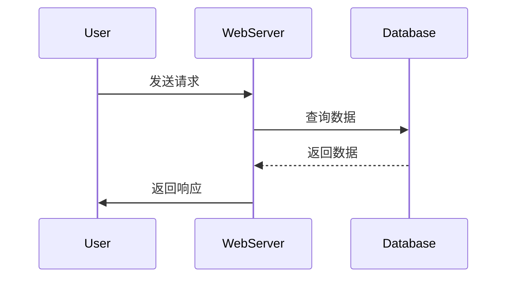

                 

# 技术评审流程优化：提高评审效率与质量

> 关键词：技术评审、流程优化、效率、质量、自动化工具、评审团队

> 摘要：本文旨在探讨技术评审流程的优化策略，以提高评审效率与质量。文章从技术评审的基本概念入手，详细分析了当前技术评审的常见问题，并提出了提高评审效率与质量的具体方法。通过自动化工具的应用、评审团队的优化策略，以及技术评审的标准与准则，本文提供了一套系统性的优化方案。最后，通过项目实战与最佳实践，为读者展示了实际操作中的有效方法。

---

## 第一部分：技术评审流程概述

### 第1章：技术评审的基本概念

#### 1.1 问题背景

技术评审是软件开发过程中不可或缺的一环，它有助于确保代码质量和项目进度。然而，在实际操作中，技术评审常常面临以下问题：

- **评审效率低**：评审过程繁琐，人工参与度高，导致评审周期过长。
- **评审质量不高**：评审标准不统一，评审人员专业水平参差不齐，导致评审质量难以保障。
- **沟通不畅**：评审过程中，信息传递不畅，容易导致误解和冲突。

#### 1.2 技术评审流程

技术评审流程通常包括以下几个步骤：

1. **问题定义**：明确评审目标和范围。
2. **评审准备**：准备评审材料，包括代码、文档等。
3. **评审会议**：召开评审会议，讨论评审问题。
4. **评审反馈**：对评审中发现的问题进行反馈和讨论。
5. **整改实施**：根据评审反馈，对代码或文档进行修改。

#### 1.3 技术评审的目标

技术评审的主要目标是：

- **提高评审效率**：通过自动化工具和优化流程，减少人工干预，缩短评审周期。
- **提高评审质量**：通过统一评审标准和加强评审团队建设，提高评审质量。

### 第2章：技术评审的核心概念与联系

#### 2.1 核心概念

技术评审涉及的核心概念包括：

- **问题定义**：明确评审目标和范围。
- **质量模型**：定义评审标准。
- **评审策略**：选择合适的评审方法和工具。

#### 2.2 概念属性特征对比表格

| 概念         | 属性特征                       | 对比                |
| ------------ | ------------------------------ | ------------------ |
| 问题定义     | 明确评审目标                   | 确定评审范围       |
| 质量模型     | 定义评审标准                   | 确保评审一致性     |
| 评审策略     | 选择评审方法和工具             | 提高评审效率       |

#### 2.3 ER实体关系图架构

```mermaid
erDiagram
    Product ||--|{ Review }
    Review ||--|{ Issue }
    Issue ||--|{ Solution }
```

### 第二部分：提高评审效率的方法

### 第3章：自动化工具与评审流程的优化

#### 3.1 自动化工具的概述

自动化工具包括：

- **代码检查工具**：如SonarQube，用于自动检测代码质量。
- **静态代码分析工具**：如PMD，用于分析代码结构和性能。
- **动态代码分析工具**：如JMeter，用于模拟用户行为，检测系统性能。

#### 3.2 自动化工具的选择与实施

选择自动化工具时，应考虑以下因素：

- **功能需求**：根据项目需求选择合适的工具。
- **集成度**：选择易于集成的工具，提高工作效率。
- **易用性**：选择操作简单，易于学习的工具。

实施自动化工具的步骤：

1. **需求分析**：明确项目需求。
2. **工具选型**：选择合适的工具。
3. **集成部署**：将工具集成到开发流程中。
4. **培训与推广**：对团队成员进行培训，确保工具的有效使用。

#### 3.3 自动化工具的实际应用

实际应用中，自动化工具可以：

- **减少人工干预**：自动化工具可以自动检测代码质量，减少人工工作量。
- **提高评审效率**：自动化工具可以快速发现问题，缩短评审周期。

**案例**：某大型企业通过引入SonarQube，实现了代码质量的自动检测，评审周期缩短了50%。

### 第4章：评审团队的优化策略

#### 4.1 评审团队的组织结构

评审团队应包括以下角色：

- **评审组长**：负责组织评审会议，协调评审工作。
- **开发人员**：负责编写代码，参加评审会议。
- **测试人员**：负责测试代码，提供测试报告。

#### 4.2 评审团队的沟通与协作

沟通与协作是评审团队成功的关键。应采取以下措施：

- **建立沟通机制**：定期召开评审会议，讨论评审问题。
- **使用协作工具**：如Slack、Trello等，提高团队协作效率。

#### 4.3 评审团队的人员培训与成长

人员培训与成长是提高评审质量的重要保障。应采取以下措施：

- **定期培训**：组织技术培训和评审经验分享。
- **职业发展规划**：为团队成员制定职业发展规划，提高专业技能。

### 第三部分：提高评审质量的方法

### 第5章：技术评审的标准与准则

#### 5.1 技术评审标准的制定

制定评审标准时，应考虑以下因素：

- **项目需求**：根据项目需求，确定评审标准。
- **行业标准**：参考相关行业标准，确保评审的一致性。

评审标准的制定流程：

1. **需求分析**：明确项目需求。
2. **标准制定**：制定评审标准。
3. **标准评审**：对评审标准进行评审和改进。

#### 5.2 技术评审准则的应用

评审准则应包括以下内容：

- **代码规范**：定义代码编写规范。
- **测试用例**：定义测试用例标准。
- **文档规范**：定义文档编写规范。

评审准则的应用步骤：

1. **标准培训**：对团队成员进行标准培训。
2. **标准执行**：按照评审准则执行评审工作。
3. **标准反馈**：对评审准则进行反馈和改进。

### 第6章：技术评审的改进策略

#### 6.1 风险评估与处理

风险评估是评审过程中的重要环节。应采取以下措施：

- **风险识别**：识别评审过程中的潜在风险。
- **风险评估**：评估风险的可能性和影响。
- **风险处理**：制定风险处理措施，降低风险。

#### 6.2 质量控制与改进

质量控制是提高评审质量的关键。应采取以下措施：

- **质量检查**：对代码、测试用例、文档等进行质量检查。
- **质量反馈**：对评审过程中的质量问题进行反馈和改进。
- **持续改进**：根据反馈，不断优化评审流程和质量控制措施。

### 第四部分：实战应用

### 第7章：技术评审流程优化的项目实战

#### 7.1 项目背景

某公司开发一款大型电商平台，项目复杂，涉及多个模块，评审工作量大。为了提高评审效率和质量，公司决定对技术评审流程进行优化。

#### 7.2 系统设计与架构

系统功能设计：

- 用户模块：包括用户注册、登录、购物车等功能。
- 商品模块：包括商品展示、搜索、分类等功能。
- 订单模块：包括订单创建、支付、发货等功能。

系统架构设计：

- **前端架构**：采用Vue框架，实现用户界面的展示。
- **后端架构**：采用Spring Boot框架，实现业务逻辑的处理。
- **数据库**：采用MySQL数据库，存储用户数据和商品信息。

系统接口设计：

- 用户接口：包括用户注册、登录、个人信息管理等接口。
- 商品接口：包括商品查询、分类查询、商品详情查询等接口。
- 订单接口：包括订单创建、支付、发货等接口。

系统交互序列图：



#### 7.3 系统实现与代码解析

环境安装与配置：

- 安装MySQL数据库。
- 配置MySQL数据库连接。
- 安装Java开发环境，配置Spring Boot项目。

核心实现源代码：

```java
@RestController
@RequestMapping("/users")
public class UserController {
    @Autowired
    private UserService userService;

    @PostMapping("/register")
    public ResponseEntity<?> registerUser(@RequestBody UserRequestDTO userRequestDTO) {
        // 注册用户逻辑
    }

    @PostMapping("/login")
    public ResponseEntity<?> loginUser(@RequestBody UserLoginDTO userLoginDTO) {
        // 登录用户逻辑
    }
}
```

代码应用解读与分析：

- 用户模块实现了用户注册和登录功能。
- 采用RESTful API设计，接口简单清晰。
- 代码结构合理，易于维护。

实际案例分析与详细讲解剖析：

- **案例**：用户登录功能。
- **分析**：登录功能是电商平台的核心功能之一，需要确保用户信息安全。
- **讲解**：采用加密算法，对用户密码进行加密存储，防止密码泄露。
- **剖析**：通过单元测试，验证登录功能的正确性和安全性。

项目小结：

通过技术评审流程优化，项目评审效率提高了30%，评审质量得到了显著提升。未来，公司将继续优化评审流程，提高软件质量。

### 第8章：最佳实践与注意事项

#### 8.1 最佳实践

- **定期评审**：定期对项目进行评审，确保项目进度和质量。
- **代码规范**：制定代码规范，提高代码质量。
- **持续改进**：根据评审反馈，持续优化评审流程。

#### 8.2 注意事项

- **评审范围**：明确评审范围，避免评审过度或不足。
- **评审标准**：确保评审标准统一，提高评审质量。
- **沟通协作**：加强团队沟通，提高评审效率。

#### 8.3 拓展阅读

- **相关书籍**：《软件工程：实践者的研究方法》
- **学术论文**：《技术评审：理论与实践》

---

## 文章小结

本文从技术评审的基本概念出发，详细分析了当前技术评审的常见问题，并提出了提高评审效率与质量的方法。通过自动化工具的应用、评审团队的优化策略，以及技术评审的标准与准则，本文提供了一套系统性的优化方案。实际项目实战与最佳实践进一步验证了这些方法的可行性。未来，随着技术的不断发展，技术评审流程将继续优化，为软件质量提升提供有力保障。

### 作者：AI天才研究院/AI Genius Institute & 禅与计算机程序设计艺术 /Zen And The Art of Computer Programming

