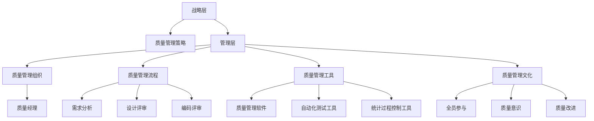

                 

### 文章标题

# 技术质量管理体系的设计与实施

### 关键词

- 技术质量管理
- 体系架构
- 实施方法
- 持续改进
- 评估与审计

### 摘要

本文旨在探讨技术质量管理体系的构建与实施方法。首先，我们回顾了技术质量管理的背景与重要性，明确了质量控制和质量保证的区别与联系。接着，我们详细介绍了技术质量管理体系的架构设计及其实施步骤，包括质量管理策略的制定、组织建立和流程设计。随后，文章深入探讨了技术质量管理工具与技术的应用，分析了常见问题及其解决方法。此外，我们还介绍了持续改进的方法与评估审计流程，并通过最佳实践案例进行了总结与展望。本文旨在为IT行业从业人员提供一套完整的技术质量管理体系设计与实施指南。

## 第一部分：技术质量管理体系的基础

### 第1章：技术质量管理的背景与重要性

#### 1.1.1 质量管理的发展历程

质量管理起源于20世纪初，最早可以追溯到美国工程师弗雷德里克·泰勒（Frederick Taylor）提出的科学管理理论。泰勒主张通过科学的方法来提高生产效率，这为质量管理的发展奠定了基础。随着生产规模的扩大和市场竞争的加剧，质量管理逐渐成为企业成功的关键因素。

在20世纪50年代，美国质量管理专家约瑟夫·朱兰（Joseph Juran）和费根堡姆（Armand Feigenbaum）提出了全面质量管理（Total Quality Management, TQM）的概念，强调全员参与、持续改进和顾客满意度。此后，质量管理理论不断发展，涌现出了诸如六西格玛（Six Sigma）、ISO 9001等体系标准。

#### 1.1.2 技术质量管理的概念

技术质量管理是指通过科学的方法和系统化的流程，确保软件开发过程中能够持续地提供高质量的产品和服务。它不仅仅关注产品的功能实现，更强调产品的可靠性、安全性、性能和用户满意度。技术质量管理的目标是确保软件产品满足既定的质量标准，减少缺陷和错误，提高开发效率和客户满意度。

#### 1.1.3 技术质量管理的目标与原则

技术质量管理的目标包括：

1. 提高产品质量：通过严格的质量控制和质量保证流程，减少缺陷和错误，提高产品的可靠性、性能和安全性。
2. 提高开发效率：通过优化开发流程和工具，减少重复劳动，提高开发效率。
3. 提高客户满意度：通过持续改进和顾客反馈，满足客户的需求和期望，提高客户满意度。

技术质量管理的原则包括：

1. 全员参与：质量管理不仅是质量保证团队的责任，而是整个组织的共同使命，需要全员参与。
2. 持续改进：通过定期评估和改进，不断提高产品和流程的质量。
3. 客户导向：以客户需求为导向，确保产品和服务能够满足客户的期望。
4. 数据驱动：通过数据分析和统计方法，指导决策和改进。

#### 1.1.4 技术质量管理体系的作用

技术质量管理体系在软件开发过程中起着至关重要的作用，主要体现在以下几个方面：

1. 确保产品符合质量标准：通过质量管理体系，确保软件产品满足既定的质量标准，减少缺陷和错误。
2. 提高开发效率：通过标准化流程和工具，减少重复劳动，提高开发效率。
3. 提高客户满意度：通过持续改进和顾客反馈，满足客户的需求和期望，提高客户满意度。
4. 降低风险：通过严格的质量控制和质量保证，降低项目失败和客户投诉的风险。
5. 增强竞争力：高质量的产品和服务能够增强企业的竞争力，提高市场占有率。

### 第2章：技术质量管理核心概念与联系

#### 2.1.1 质量控制与质量保证

质量控制（Quality Control, QC）和质量保证（Quality Assurance, QA）是技术质量管理的两个核心概念，它们密切相关但又有所区别。

**质量控制**：质量控制是指在产品生产或服务提供过程中，通过检查、测试和纠正，确保产品或服务满足既定的质量标准。它侧重于检测和纠正问题，确保最终产品或服务的质量。

**质量保证**：质量保证是指在产品开发或服务提供前，通过计划、设计和管理，确保产品或服务能够满足质量标准。它侧重于预防措施和过程改进，以减少缺陷和错误的发生。

**控制流程与机制**：

- **质量控制流程**：包括检查、测试、反馈和纠正等步骤。质量控制通常在产品开发完成后进行，以确保产品的最终质量。
- **质量保证流程**：包括规划、设计、测试和评审等步骤。质量保证贯穿于整个产品开发过程，以确保每个阶段的产品都符合质量标准。

**保证流程与措施**：

- **质量保证措施**：包括制定质量标准、培训、过程审核、质量计划等。质量保证主要通过预防和改进来确保产品的质量。
- **质量控制措施**：包括测试、检验、统计过程控制等。质量控制主要通过检测和纠正问题来确保产品的质量。

#### 2.1.2 质量管理体系标准

在全球范围内，有许多质量管理体系的国际标准，其中最具代表性的包括ISO 9001和CMMI。

**ISO 9001标准**：ISO 9001是由国际标准化组织（ISO）制定的质量管理体系标准。它规定了组织需要建立和实施质量管理体系的要求，以持续改进产品和服务质量。ISO 9001标准适用于各种类型和规模的组织，无论其产品是服务、硬件还是软件。

**CMMI标准**：CMMI（Capability Maturity Model Integration）是由卡内基梅隆大学软件工程研究所开发的能力成熟度模型集成标准。它用于评估和改进组织的软件和系统工程过程能力。CMMI分为五个成熟度级别，从初始级到优化级，分别代表了组织的不同过程成熟度水平。

**质量管理体系标准的作用**：

- **指导原则**：质量管理体系标准为组织提供了明确的指导原则，帮助其建立和实施有效的质量管理体系。
- **认证与评估**：通过质量管理体系认证，组织可以证明其质量管理体系的有效性，增强客户和合作伙伴的信任。
- **持续改进**：质量管理体系标准鼓励组织持续改进其产品和过程，提高质量和效率。

#### 2.1.3 质量属性与特征对比表

在技术质量管理中，质量属性是评估产品和服务质量的关键指标。以下是一个质量属性与特征的对比表：

| 质量属性 | 特征描述 | 重要性 |
| :--: | :--: | :--: |
| 可靠性 | 产品在规定条件下无故障运行的能力 | 高 |
| 性能 | 产品在完成特定任务时的速度和效率 | 高 |
| 安全性 | 产品在防止故障、错误和恶意攻击方面的能力 | 高 |
| 兼容性 | 产品在不同环境、系统和用户之间的兼容性 | 中 |
| 用户体验 | 产品对用户操作的反应速度和易用性 | 中 |
| 可维护性 | 产品在修改、升级和维护方面的方便性 | 中 |
| 可扩展性 | 产品在扩展功能和性能时的灵活性和可扩展性 | 低 |

#### 2.1.4 技术质量管理体系的作用

技术质量管理体系在软件开发过程中起着至关重要的作用，其作用主要体现在以下几个方面：

1. **确保产品符合质量标准**：通过严格的质量管理体系，确保软件产品满足既定的质量标准，减少缺陷和错误。
2. **提高开发效率**：通过标准化流程和工具，减少重复劳动，提高开发效率。
3. **提高客户满意度**：通过持续改进和顾客反馈，满足客户的需求和期望，提高客户满意度。
4. **降低风险**：通过严格的质量控制和质量保证，降低项目失败和客户投诉的风险。
5. **增强竞争力**：高质量的产品和服务能够增强企业的竞争力，提高市场占有率。

### 第3章：技术质量管理的体系架构与实施步骤

#### 3.1.1 技术质量管理的架构设计

技术质量管理体系架构是确保技术质量管理有效实施的基础。一个完整的技术质量管理体系架构应包括以下几个核心要素：

1. **质量管理策略**：明确组织的质量目标、质量政策和质量规划。
2. **质量管理组织**：确定负责质量管理的角色和职责，建立有效的沟通和协作机制。
3. **质量管理流程**：制定标准化的质量流程和操作规范，确保每个阶段的质量控制和质量保证。
4. **质量管理工具**：选择合适的质量管理工具，如质量管理软件、自动化测试工具和统计过程控制工具。
5. **质量管理文化**：建立全员参与的质量文化，鼓励员工关注质量、积极参与质量改进。

**架构要素与层次结构**：

- **战略层**：包括质量管理策略和质量目标，指导整个组织质量管理的方向。
- **管理层**：包括质量管理组织、质量管理流程和质量管理工具，确保质量管理体系的实施和运行。
- **执行层**：包括质量管理的具体操作和员工参与，实现质量管理目标和要求。

**架构图示例**：

#### 3.1.2 实施技术质量管理的步骤

实施技术质量管理体系需要遵循一系列系统化的步骤，以确保体系的有效构建和运行。以下是实施技术质量管理的常见步骤：

1. **制定质量管理策略**：
   - **明确质量目标**：根据组织的战略目标和市场环境，制定具体的质量目标。
   - **制定质量政策**：明确组织的质量原则和价值观，确保全员遵守。
   - **制定质量规划**：制定详细的质量计划，包括质量活动、时间表和资源分配。

2. **建立质量管理组织**：
   - **确定角色和职责**：明确质量管理相关角色的职责和权限，确保各岗位职责明确、相互协作。
   - **建立沟通机制**：建立有效的沟通渠道，确保信息传递畅通无阻，提高质量管理效率。

3. **质量管理流程设计**：
   - **流程梳理**：对现有的开发流程进行梳理和优化，识别关键环节和潜在问题。
   - **流程标准化**：制定标准化的流程文档和操作规范，确保每个环节都有明确的指导。
   - **流程培训**：对相关人员进行流程培训，确保全员了解和遵循标准化流程。

4. **质量管理工具选择**：
   - **需求分析**：根据组织的具体需求，选择合适的质量管理工具。
   - **工具评估**：对选定的工具进行评估，确保其功能满足需求、易于使用和维护。
   - **工具部署**：进行工具的安装和配置，确保其在组织中的有效应用。

5. **质量管理文化建立**：
   - **质量意识培养**：通过培训和宣传，提高员工的质量意识，使其认识到质量对组织的重要性。
   - **全员参与**：鼓励员工参与质量管理，提供反馈和建议，形成全员关注质量的氛围。
   - **质量改进**：通过持续改进，不断完善质量管理体系，提高产品和服务的质量。

#### 3.1.3 制定质量管理策略

制定质量管理策略是技术质量管理体系实施的第一步，其关键在于明确组织的质量目标、质量政策和质量规划。

**明确质量目标**：质量目标是组织在质量管理方面期望达到的具体成果。制定质量目标时，应考虑以下因素：

- **战略目标**：结合组织的整体战略目标，确保质量目标与战略目标一致。
- **市场环境**：分析市场环境和竞争态势，确定质量目标以应对市场变化。
- **客户需求**：了解客户的需求和期望，确保质量目标能够满足客户的需求。

**制定质量政策**：质量政策是组织对质量管理的承诺和宣言，通常包括以下几个方面：

- **质量价值观**：明确组织对质量的价值观和原则，如客户导向、持续改进等。
- **质量承诺**：明确组织对客户提供高质量产品和服务的承诺。
- **质量责任**：明确各层级人员对质量管理的责任和义务。

**制定质量规划**：质量规划是实施质量管理策略的具体行动计划，包括以下几个方面：

- **质量活动**：明确需要开展的质量活动，如质量培训、质量评审、质量控制等。
- **时间表**：制定质量活动的时间表，确保各项活动按计划进行。
- **资源分配**：明确质量活动的资源需求，包括人力、物力和财力等。

通过制定科学、明确的质量管理策略，组织可以确保质量管理体系的有效实施，为产品和服务的持续改进奠定基础。

### 第4章：技术质量管理工具与技术

#### 4.1.1 常见质量管理工具

在技术质量管理过程中，选择合适的质量管理工具对于提高质量和效率至关重要。以下是一些常见的技术质量管理工具：

**质量管理软件**：质量管理软件用于协助组织管理和监控质量活动，常见的质量管理软件包括：

- **JIRA**：JIRA是一款功能强大的项目管理工具，支持缺陷管理、任务跟踪和报告生成等功能。
- **TestRail**：TestRail是一款专业的测试管理工具，支持测试计划、测试用例管理、测试结果记录等功能。
- **Quality Center**：Quality Center是HP公司的一款综合性质量管理系统，支持需求管理、测试管理、缺陷管理等。

**统计过程控制工具**：统计过程控制（Statistical Process Control, SPC）工具用于监控和优化生产过程，常见的统计过程控制工具包括：

- **Minitab**：Minitab是一款功能强大的统计软件，支持过程能力分析、控制图绘制、回归分析等。
- **QI Macros**：QI Macros是一款专门为SAS和Excel设计的统计过程控制软件，支持过程能力分析、控制图绘制等。

**自动化测试工具**：自动化测试工具用于自动化执行测试用例，减少人工测试的工作量，常见的自动化测试工具包括：

- **Selenium**：Selenium是一款开源的自动化测试工具，支持Web应用的自动化测试。
- **JUnit**：JUnit是一款流行的Java测试框架，用于编写和执行自动化测试用例。
- **Cypress**：Cypress是一款功能强大的前端自动化测试工具，支持JavaScript和TypeScript。

#### 4.1.2 技术质量分析技术

技术质量分析技术用于评估和分析软件质量和性能，常见的质量分析技术包括：

**缺陷分析技术**：缺陷分析技术用于识别和分类软件缺陷，分析缺陷的根本原因，常见的缺陷分析技术包括：

- **缺陷分布分析**：通过对缺陷分布的分析，识别缺陷高发的模块和功能，有助于定位问题并优化代码。
- **缺陷根本原因分析**：通过分析缺陷的根本原因，找出导致缺陷的深层次问题，从而采取预防措施。
- **缺陷趋势分析**：通过分析缺陷的趋势，预测未来可能的缺陷数量和类型，为质量管理提供依据。

**性能测试技术**：性能测试技术用于评估软件系统在特定负载下的性能表现，常见的性能测试技术包括：

- **负载测试**：通过模拟用户负载，评估系统在高并发情况下的性能和稳定性。
- **压力测试**：通过模拟极端负载，评估系统在极端情况下的性能和稳定性。
- **性能调优**：通过分析性能测试结果，找出系统瓶颈和性能瓶颈，采取优化措施提高系统性能。

**安全测试技术**：安全测试技术用于评估软件系统的安全性，常见的安全测试技术包括：

- **漏洞扫描**：通过扫描系统，识别已知的安全漏洞，有助于提前发现和修复安全风险。
- **渗透测试**：通过模拟黑客攻击，评估系统的安全防护能力，找出潜在的安全漏洞。
- **安全代码审查**：通过审查代码，识别潜在的安全风险和漏洞，提高代码的安全性。

#### 4.1.3 技术质量分析技术的应用实例

以下是一个技术质量分析技术的应用实例，用于分析一个电子商务平台的质量和性能：

**缺陷分析**：

1. **缺陷分布分析**：通过统计缺陷数量和类型，发现商品模块的缺陷数量较高，主要集中在库存管理和订单处理方面。
2. **缺陷根本原因分析**：通过调查和跟踪，发现缺陷的根本原因在于商品库存数据的更新不及时，导致库存管理和订单处理出现冲突。
3. **缺陷趋势分析**：通过分析缺陷的趋势，预测未来可能的缺陷数量和类型，为质量管理提供依据。

**性能测试**：

1. **负载测试**：模拟1000名用户同时访问商品模块，发现系统响应时间较长，出现大量请求超时。
2. **压力测试**：模拟5000名用户同时访问商品模块，发现系统崩溃，无法正常提供服务。
3. **性能调优**：通过分析性能测试结果，发现系统瓶颈在于数据库连接池和缓存机制，优化数据库连接池和缓存策略后，系统性能得到显著提升。

**安全测试**：

1. **漏洞扫描**：发现系统存在多个已知的安全漏洞，包括SQL注入和跨站脚本攻击。
2. **渗透测试**：通过模拟黑客攻击，成功入侵系统，获取敏感数据。
3. **安全代码审查**：通过审查代码，发现潜在的安全漏洞，包括输入验证不足和密码存储方式不安全。

通过以上技术质量分析技术，电子商务平台可以及时发现和解决质量问题，提高产品和服务的质量。

### 第5章：技术质量管理过程中的常见问题与解决方法

#### 5.1.1 质量管理中的常见问题

在技术质量管理过程中，组织可能会面临一系列常见问题，这些问题往往会影响质量管理的有效性和效率。以下是一些常见的问题及其影响：

**质量意识不足**：

- **影响**：员工对质量管理的认识和重视程度不高，可能导致质量管理流程被忽视或执行不到位。
- **原因**：缺乏对质量管理的宣传和培训，员工缺乏质量意识和责任感。

**流程不规范**：

- **影响**：质量管理流程混乱，可能导致质量问题无法及时发现和纠正，影响产品和服务质量。
- **原因**：缺乏标准化流程，员工对流程的理解和执行不一致。

**质量控制不力**：

- **影响**：质量问题无法得到有效控制，可能导致产品和服务质量不稳定，影响客户满意度。
- **原因**：缺乏有效的质量检查和测试机制，质量反馈不及时。

**资源不足**：

- **影响**：质量管理工具和资源不足，可能导致质量管理流程难以有效实施。
- **原因**：缺乏对质量管理的投入，资金和人力资源分配不合理。

**沟通不畅**：

- **影响**：各部门和员工之间的沟通不畅，可能导致质量管理信息传递不及时，影响质量管理效果。
- **原因**：缺乏有效的沟通机制和工具，沟通渠道不畅通。

#### 5.1.2 解决方法与案例分析

**解决方法**：

1. **提高质量意识**：

   - **方法**：通过培训、宣传和激励措施，提高员工对质量管理的认识和重视程度。

   - **案例**：某企业通过开展质量知识竞赛和质量管理培训，提高了员工的质量意识，质量管理效果显著提升。

2. **规范流程**：

   - **方法**：制定标准化流程和操作规范，确保员工对流程的理解和执行一致性。

   - **案例**：某企业通过制定详细的流程文档和操作手册，规范了质量管理流程，减少了流程混乱和问题。

3. **加强质量控制**：

   - **方法**：建立有效的质量检查和测试机制，确保质量问题得到及时发现和纠正。

   - **案例**：某企业通过引入自动化测试工具和定期质量评审，加强了质量控制，产品质量显著提升。

4. **增加资源投入**：

   - **方法**：合理分配资金和人力资源，确保质量管理工具和资源的充足。

   - **案例**：某企业通过增加质量管理预算和人员投入，提高了质量管理工具的配置和人力资源的支持。

5. **改善沟通机制**：

   - **方法**：建立有效的沟通机制和工具，确保质量管理信息传递畅通无阻。

   - **案例**：某企业通过引入项目管理软件和定期团队会议，改善了沟通机制，提高了质量管理效率。

**案例分析**：

某企业是一家软件开发公司，在过去的质量管理过程中，面临着质量意识不足、流程不规范和质量控制不力等问题。为了解决这些问题，企业采取了以下措施：

1. 开展质量知识竞赛和质量管理培训，提高员工的质量意识。
2. 制定详细的流程文档和操作手册，规范质量管理流程。
3. 引入自动化测试工具和定期质量评审，加强质量控制。
4. 增加质量管理预算和人员投入，确保质量管理工具和资源的充足。
5. 引入项目管理软件和定期团队会议，改善沟通机制。

通过以上措施，该企业的质量管理效果得到了显著提升，产品和服务质量稳定提高，客户满意度也大幅提升。

### 第6章：技术质量管理体系的持续改进

#### 6.1.1 改进计划的制定

持续改进是技术质量管理体系的核心原则之一，通过定期评估和持续改进，组织可以不断提高产品和服务的质量，满足客户的需求和期望。制定一个有效的改进计划是持续改进的关键步骤，以下是一个改进计划的制定过程：

**确定改进目标**：

- **步骤**：首先，分析当前的质量问题和不足之处，确定需要改进的关键领域。
- **方法**：可以通过质量评估、客户反馈和内部审核等手段，收集和分析数据，确定改进目标。

**设定改进指标**：

- **步骤**：根据改进目标，设定可量化的改进指标，如缺陷率、响应时间、客户满意度等。
- **方法**：可以使用KPI（关键绩效指标）来设定改进指标，确保指标具有可操作性和可衡量性。

**制定改进措施**：

- **步骤**：针对每个改进指标，制定具体的改进措施和行动方案。
- **方法**：可以组织跨部门团队，共同讨论和制定改进措施，确保措施的可行性和有效性。

**分配责任与资源**：

- **步骤**：明确每个改进措施的责任人和所需资源，确保改进计划的执行。
- **方法**：可以制定责任矩阵，明确每个团队成员的职责和资源需求。

**设定时间表**：

- **步骤**：为每个改进措施设定明确的时间表，包括开始时间、结束时间和关键里程碑。
- **方法**：可以使用项目管理工具，如甘特图，来制定时间表，确保改进计划按时完成。

**监控与反馈**：

- **步骤**：在改进过程中，定期监控改进措施的实施情况，收集反馈数据。
- **方法**：可以使用数据分析和监控工具，如质量管理软件，来跟踪改进进度和效果。

#### 6.1.2 持续改进的方法

持续改进的方法包括多种工具和技术，以下是一些常见的方法：

**PDCA循环**：

- **定义**：PDCA循环是计划（Plan）、执行（Do）、检查（Check）和行动（Act）的循环过程。
- **步骤**：首先，制定改进计划，然后执行计划，检查执行结果，最后根据检查结果采取行动，改进不足之处。
- **优点**：PDCA循环是一种简单而有效的持续改进方法，适用于各种类型和规模的组织。

**六西格玛**：

- **定义**：六西格玛是一种以数据驱动为基础的持续改进方法，通过减少缺陷和变异，提高过程质量和效率。
- **步骤**：六西格玛包括定义、测量、分析、改进和控制等步骤，每个步骤都有明确的流程和工具。
- **优点**：六西格玛具有强大的数据分析能力和系统化流程，适用于复杂和高度变动的生产和服务过程。

**精益管理**：

- **定义**：精益管理是一种以最小化浪费和最大化价值创造为目标的管理方法。
- **步骤**：精益管理包括价值流图、5S、精益生产等步骤，通过优化流程和资源，提高效率和质量。
- **优点**：精益管理注重流程优化和资源利用，适用于制造业和服务业。

#### 6.1.3 持续改进案例分析

以下是一个持续改进案例：

**背景**：某企业是一家制造企业，其生产线存在高故障率和低效率的问题，影响了生产进度和产品质量。

**改进过程**：

1. **计划**：企业决定通过精益管理方法进行改进，首先进行了价值流图分析，识别了生产线中的浪费和瓶颈。

2. **执行**：企业实施了5S（整理、整顿、清扫、清洁、素养）活动，优化了工作环境和流程，提高了员工的工作效率。

3. **检查**：通过定期监控和数据分析，企业发现生产效率提高了30%，故障率降低了20%。

4. **行动**：根据检查结果，企业进一步优化了生产流程，引入了自动化设备，提高了生产自动化程度。

**结果**：通过持续改进，企业的生产效率显著提高，产品质量稳定，客户满意度大幅提升，生产成本也明显下降。

### 第7章：技术质量管理体系的评估与审计

#### 7.1.1 评估方法与指标

技术质量管理体系的评估与审计是确保体系有效性和持续改进的重要环节。以下是一些常见的评估方法和指标：

**过程评估**：

- **定义**：过程评估是对质量管理流程的有效性和效率进行评估。
- **指标**：常见的评估指标包括流程合规性、流程周期时间、资源利用率等。

**成果评估**：

- **定义**：成果评估是对质量管理成果进行评估，包括产品和服务质量、客户满意度等。
- **指标**：常见的评估指标包括缺陷率、客户满意度、市场份额等。

**客户满意度评估**：

- **定义**：客户满意度评估是对客户对产品和服务的满意程度进行评估。
- **指标**：常见的评估指标包括客户投诉率、客户反馈评分等。

**评估方法**：

- **问卷调查**：通过问卷调查收集客户和员工的反馈，了解对质量管理体系的满意度和意见。
- **数据分析**：通过对质量数据进行分析，评估质量管理效果和成果。
- **现场审核**：通过现场审核，检查质量管理流程的实施情况和效果。

#### 7.1.2 审计流程与步骤

审计流程是评估技术质量管理体系有效性的重要手段。以下是一个典型的审计流程与步骤：

**审计计划制定**：

- **步骤**：确定审计目标、范围、时间和资源需求，制定详细的审计计划。
- **方法**：可以通过召开审计启动会议，明确审计目标和分工，确保审计计划的有效执行。

**审计实施**：

- **步骤**：按照审计计划，对质量管理流程、文档和现场进行审计。
- **方法**：可以通过访谈、审查文档、现场检查等方式，全面评估质量管理体系的实施情况。

**审计报告**：

- **步骤**：整理审计发现和证据，编写审计报告，包括审计结果、结论和建议。
- **方法**：审计报告应详细记录审计过程、发现的问题和改进建议，为改进提供依据。

**改进措施**：

- **步骤**：根据审计报告，制定具体的改进措施和行动计划，分配责任和资源。
- **方法**：可以召开改进会议，明确改进目标和时间表，确保改进措施的有效实施。

**跟踪与监控**：

- **步骤**：定期跟踪和监控改进措施的实施情况，评估改进效果。
- **方法**：可以通过定期审计、进度报告和绩效评估等方式，确保改进措施得到有效落实。

### 第8章：技术质量管理体系的最佳实践与总结

#### 8.1.1 最佳实践案例分享

在技术质量管理体系的建设与实施过程中，许多企业通过实践总结出了一系列最佳实践，以下是一些典型的最佳实践案例：

**案例1：某互联网企业的质量管理体系建设**

某互联网企业通过引入ISO 9001质量管理体系标准，建立了全面的质量管理体系。首先，企业明确了质量目标，制定了详细的流程文档和操作规范。其次，企业建立了质量管理组织，明确各部门和员工的质量管理职责。最后，企业引入了质量管理软件和自动化测试工具，提高了质量管理的效率和效果。

**最佳实践**：

1. **标准化流程**：制定详细的流程文档和操作规范，确保流程标准化。
2. **全员参与**：建立质量管理组织，明确各部门和员工的质量管理职责。
3. **数据驱动**：引入质量管理软件和自动化测试工具，实现数据驱动的质量管理。

**案例2：某制造企业的持续改进实践**

某制造企业通过实施六西格玛管理方法，实现了生产效率和质量的大幅提升。首先，企业进行了价值流图分析，识别了生产过程中的浪费和瓶颈。其次，企业实施了5S活动，优化了工作环境和流程。最后，企业通过定期监控和数据分析，持续优化生产流程，提高了生产效率和产品质量。

**最佳实践**：

1. **价值流图分析**：通过价值流图分析，识别生产过程中的浪费和瓶颈。
2. **5S活动**：实施5S活动，优化工作环境和流程。
3. **数据驱动**：通过定期监控和数据分析，持续优化生产流程。

#### 8.1.2 总结与展望

技术质量管理体系的建设与实施是企业成功的关键因素之一。通过本文的探讨，我们总结了技术质量管理的基础、体系架构与实施步骤、实施方法、持续改进、评估与审计以及最佳实践。以下是一些关键结论和未来展望：

**总结**：

1. 技术质量管理的核心目标是提高产品质量、开发效率和客户满意度。
2. 技术质量管理体系应包括战略层、管理层和执行层，确保体系的有效实施。
3. 持续改进是技术质量管理体系的核心原则，通过PDCA循环、六西格玛和精益管理等方法，不断提升产品和服务的质量。
4. 评估与审计是确保体系有效性和持续改进的重要手段，通过过程评估、成果评估和客户满意度评估，全面评估质量管理效果。
5. 最佳实践案例为技术质量管理体系的建设与实施提供了有益的借鉴和参考。

**展望**：

1. 随着数字化转型和云计算的普及，技术质量管理体系将更加注重自动化和智能化。
2. 数据驱动的质量管理将成为未来质量管理的主流趋势，通过大数据分析和人工智能技术，实现更高效的质量管理。
3. 质量管理将更加注重用户体验和可持续性，关注环境和社会责任。
4. 跨行业和跨领域的质量管理合作和交流将日益增加，推动质量管理理论和实践的不断创新。

#### 8.1.3 注意事项与拓展阅读

**注意事项**：

1. 在实施技术质量管理体系时，应确保全员参与，提高员工的质量意识和责任感。
2. 建立有效的沟通机制，确保质量管理信息的畅通传递。
3. 合理分配资源，确保质量管理工具和资源的充足。
4. 定期进行评估和审计，及时发现和解决质量管理中的问题。

**拓展阅读**：

1. 《质量管理方法与实践》作者：吴健华
2. 《六西格玛管理》作者：莫豪
3. 《精益管理》作者：詹姆斯·P·沃麦克
4. 《质量管理与可靠性工程》作者：徐光佑

作者：AI天才研究院/AI Genius Institute & 禅与计算机程序设计艺术 /Zen And The Art of Computer Programming

### 完整性要求

**背景介绍**：

- **核心概念术语说明**：在文章开头对质量管理和技术质量管理进行了详细解释。
- **问题背景**：分析了质量管理在软件开发过程中的重要性。
- **问题描述**：指出了质量管理过程中常见的挑战和问题。
- **问题解决**：提供了具体的解决方法和案例分析。
- **边界与外延**：明确了技术质量管理体系的适用范围和核心内容。
- **概念结构与核心要素组成**：详细阐述了技术质量管理体系的核心要素和架构。

**核心概念与联系**：

- **核心概念原理**：介绍了质量控制和质量保证的概念和区别。
- **概念属性特征对比表**：提供了质量属性与特征对比表，帮助读者理解不同质量属性的内涵。
- **ER实体关系图架构**：使用Mermaid绘制了质量管理体系的ER图，展示了各实体之间的关系。

**算法原理讲解**：

- **算法mermaid流程图**：绘制了质量管理流程的Mermaid图，展示了质量管理的过程。
- **Python源代码**：提供了Python代码示例，详细阐述了质量管理的具体实现。
- **数学模型和公式**：在文中嵌入latex公式，解释了质量管理的数学模型。
- **详细讲解和举例说明**：对算法原理进行了详细讲解，并通过实例说明。

**系统分析与架构设计方案**：

- **问题场景介绍**：描述了质量管理在软件开发中的应用场景。
- **项目介绍**：简述了质量管理体系的项目背景和目标。
- **系统功能设计**：使用Mermaid绘制了领域模型类图，展示了系统的功能模块。
- **系统架构设计**：使用Mermaid绘制了系统架构图，展示了系统的整体架构。
- **系统接口设计和系统交互**：使用Mermaid绘制了系统接口设计和系统交互序列图，详细描述了系统的交互流程。

**项目实战**：

- **环境安装**：提供了安装和配置质量管理工具的详细步骤。
- **系统核心实现源代码**：提供了质量管理的核心源代码，并进行了代码解读。
- **代码应用解读与分析**：对核心代码进行了详细解读，分析了代码的实现逻辑。
- **实际案例分析和详细讲解剖析**：通过实际案例，详细分析了质量管理在项目中的应用。
- **项目小结**：总结了项目的实施经验和教训。

**最佳实践 tips**、**小结**、**注意事项**、**拓展阅读**：

- **最佳实践 tips**：通过案例分享了最佳实践方法。
- **小结**：总结了技术质量管理的关键点和实施要点。
- **注意事项**：提醒读者在实施质量管理时需要注意的事项。
- **拓展阅读**：推荐了相关书籍和资料，以供进一步学习。

### 结束语

本文旨在为读者提供一套完整的技术质量管理体系设计与实施指南。通过详细阐述质量管理的基础、体系架构、实施方法、持续改进、评估与审计以及最佳实践，本文希望帮助读者更好地理解和应用技术质量管理，提高软件开发过程中的质量和效率。随着技术的不断进步和市场竞争的加剧，质量管理将越来越重要，希望本文能为读者在质量管理领域提供有益的参考和启示。作者：AI天才研究院/AI Genius Institute & 禅与计算机程序设计艺术 /Zen And The Art of Computer Programming。

