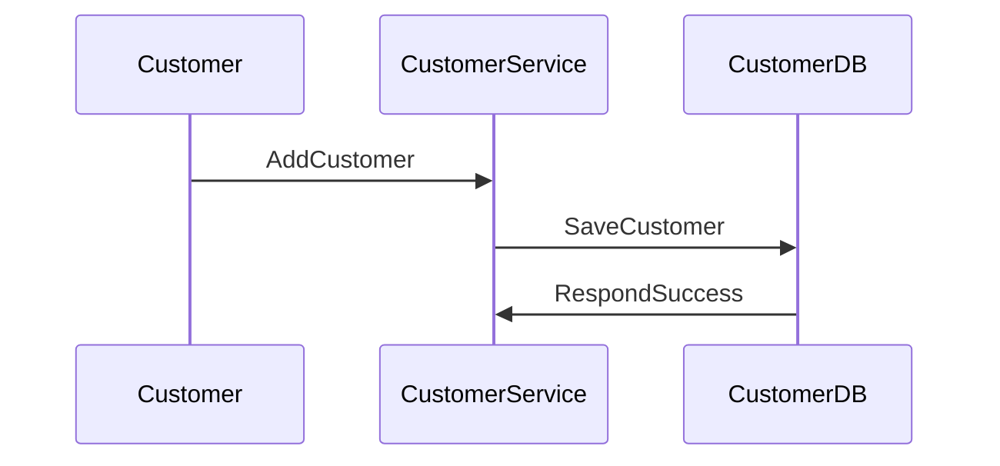
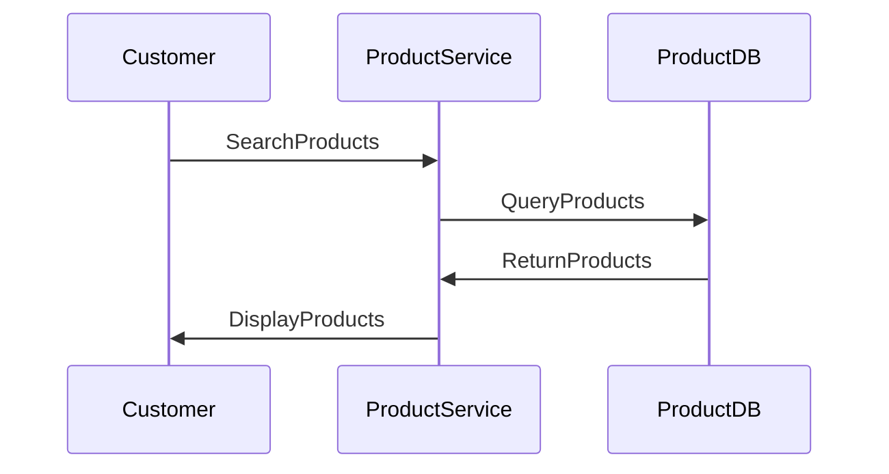

                 

# 技术赋能：让每个团队成员都成为专家

## 关键词
技术赋能、团队协作、专业成长、人工智能、系统架构

## 摘要
本文旨在探讨如何在现代技术环境中实现团队整体的技术赋能，使每个团队成员都能成为专家。通过深入分析技术赋能的核心概念、算法原理、系统设计、实战应用和最佳实践，本文提供了一套系统化的策略和方法，帮助团队实现技术水平和专业能力的全面提升。

## 引言
在当今快速发展的技术时代，技术赋能成为提升团队效率和企业竞争力的关键因素。然而，如何有效地实现技术赋能，使每个团队成员都能成为专家，是一个复杂的挑战。本文将从以下几个方面进行探讨：

1. **技术赋能的定义与重要性**
2. **核心概念与联系**
3. **算法原理讲解**
4. **系统分析与架构设计**
5. **项目实战**
6. **最佳实践与注意事项**
7. **拓展阅读**

### 1. 技术赋能的定义与重要性

#### 什么是技术赋能？
技术赋能是指通过技术手段，提升团队成员的专业知识和技能，使其在特定领域内能够独立工作、解决问题和持续学习。它不仅关注技术技能的提升，更强调思维方式的转变和团队协作能力的增强。

#### 技术赋能的重要性
- **提高工作效率**：技术赋能使团队成员能够快速掌握新技术，提高工作效率。
- **增强团队竞争力**：具备高度专业化的团队在市场上更具竞争力。
- **促进知识共享**：技术赋能鼓励团队成员之间的知识分享，促进团队整体成长。
- **降低风险**：团队成员的专业能力提升，有助于降低项目失败的风险。

### 2. 核心概念与联系

#### 核心概念
- **人工智能**：人工智能是技术赋能的重要工具，它通过模拟人类智能，帮助团队成员解决复杂问题。
- **系统架构**：系统架构设计是技术赋能的关键环节，它决定了系统的可扩展性和稳定性。
- **敏捷开发**：敏捷开发是一种快速响应变化的开发方法，它有助于团队成员持续学习和成长。

#### 概念关系图
以下是一个简化的ER实体关系图，展示了技术赋能中的核心概念及其关系：

```mermaid
erDiagram
AIExpert && TeamMember ||--|{ TechnicalSkill }
SystemArchitecture && TeamProject ||--|{ SystemComponent }
AgileMethodology && TeamMember ||--|{ ProjectExperience }
AIExpert && SystemArchitecture :<<extends> Collaborate
AgileMethodology && SystemArchitecture :<<uses> Scalability
TeamMember && AIExpert :<<has> Expertise
TeamMember && AgileMethodology :<<practices> Scrum
```

### 3. 算法原理讲解

#### 算法原理
技术赋能中的算法原理主要包括机器学习、数据挖掘和优化算法。以下是一个简单的机器学习算法——K-最近邻（K-Nearest Neighbor, KNN）的原理和示例：

##### KNN算法原理
KNN算法是一种基于实例的学习算法，它通过计算新样本与训练集中样本的相似度，基于多数表决原则进行分类。

##### 原理说明
1. **距离度量**：计算新样本与训练样本之间的距离，常用的距离度量方法有欧氏距离、曼哈顿距离和余弦相似度。
2. **邻近点选择**：选择距离新样本最近的K个邻近点。
3. **分类决策**：统计K个邻近点中各类别的数量，取数量最多的类别作为新样本的分类。

##### Python代码示例
```python
from sklearn.neighbors import KNeighborsClassifier
from sklearn.datasets import load_iris
from sklearn.model_selection import train_test_split

# 加载数据集
iris = load_iris()
X_train, X_test, y_train, y_test = train_test_split(iris.data, iris.target, test_size=0.2, random_state=42)

# 创建KNN分类器
knn = KNeighborsClassifier(n_neighbors=3)

# 训练模型
knn.fit(X_train, y_train)

# 预测测试集
y_pred = knn.predict(X_test)

# 评估模型
print("Accuracy:", knn.score(X_test, y_test))
```

##### 数学模型和公式
$$
\text{distance}(x, x_i) = \sqrt{\sum_{j=1}^{n} (x_j - x_{ji})^2}
$$
其中，\( x \) 是新样本，\( x_i \) 是训练样本，\( n \) 是特征维度。

### 4. 系统分析与架构设计

#### 问题场景
假设我们需要设计一个电商系统，它需要支持商品管理、订单管理和用户管理等功能。

#### 项目介绍
- **系统名称**：电商系统
- **系统目标**：提供商品展示、购物车、订单处理和用户管理等功能。
- **技术栈**：前端采用React，后端采用Spring Boot，数据库使用MySQL。

#### 系统功能设计

##### 领域模型
以下是一个简化的电商系统的领域模型，使用Mermaid类图表示：

```mermaid
classDiagram
    Customer <<interface>>
    Product <<interface>>
    Order <<interface>>

    Customer o-- Product : buys
    Customer o-- Order : places
    Product o-- Order : contains
```

##### 系统架构设计
以下是一个简化的电商系统的架构设计，使用Mermaid架构图表示：

```mermaid
graph TB
    subgraph 应用层
        CustomerService --> ProductService
        CustomerService --> OrderService
    end

    subgraph 数据库层
        ProductService o-- ProductDB
        OrderService o-- OrderDB
        CustomerService o-- CustomerDB
    end
```

##### 系统接口设计
以下是一个简化的电商系统的接口设计，使用Mermaid序列图表示：



##### 系统交互
以下是一个简化的电商系统的系统交互流程，使用Mermaid序列图表示：



### 5. 项目实战

#### 环境安装
- 安装Java开发环境
- 安装MySQL数据库
- 安装Node.js和npm
- 安装React开发工具

#### 系统核心实现

##### 商品管理模块
```python
# 商品管理模块伪代码
class ProductManagement:
    def add_product(self, product_data):
        # 存储商品信息到数据库
        pass
    
    def remove_product(self, product_id):
        # 从数据库中删除商品信息
        pass
    
    def update_product(self, product_id, updated_data):
        # 更新数据库中的商品信息
        pass
    
    def list_products(self):
        # 查询数据库中的所有商品信息
        pass
```

##### 订单管理模块
```python
# 订单管理模块伪代码
class OrderManagement:
    def create_order(self, customer_id, product_ids):
        # 创建订单并存储到数据库
        pass
    
    def cancel_order(self, order_id):
        # 取消订单并更新数据库
        pass
    
    def list_orders(self, customer_id):
        # 查询数据库中的订单信息
        pass
```

##### 用户管理模块
```python
# 用户管理模块伪代码
class UserManagement:
    def register_user(self, user_data):
        # 注册新用户并存储到数据库
        pass
    
    def login_user(self, user_credentials):
        # 用户登录验证
        pass
    
    def update_user_profile(self, user_id, updated_data):
        # 更新用户信息
        pass
```

#### 代码应用解读与分析

##### 商品管理模块
```python
# 商品管理模块Python代码
class ProductManagement:
    def __init__(self, db_connection):
        self.db_connection = db_connection
    
    def add_product(self, product_data):
        cursor = self.db_connection.cursor()
        query = "INSERT INTO products (name, price, description) VALUES (%s, %s, %s)"
        cursor.execute(query, product_data)
        self.db_connection.commit()
        return cursor.lastrowid
    
    def remove_product(self, product_id):
        cursor = self.db_connection.cursor()
        query = "DELETE FROM products WHERE id = %s"
        cursor.execute(query, product_id)
        self.db_connection.commit()
    
    def update_product(self, product_id, updated_data):
        cursor = self.db_connection.cursor()
        query = "UPDATE products SET name=%s, price=%s, description=%s WHERE id=%s"
        cursor.execute(query, (*updated_data, product_id))
        self.db_connection.commit()
    
    def list_products(self):
        cursor = self.db_connection.cursor()
        query = "SELECT * FROM products"
        cursor.execute(query)
        return cursor.fetchall()
```

##### 订单管理模块
```python
# 订单管理模块Python代码
class OrderManagement:
    def __init__(self, db_connection):
        self.db_connection = db_connection
    
    def create_order(self, customer_id, product_ids):
        cursor = self.db_connection.cursor()
        query = "INSERT INTO orders (customer_id, status) VALUES (%s, %s)"
        cursor.execute(query, (customer_id, 'pending'))
        order_id = cursor.lastrowid
        for product_id in product_ids:
            query = "INSERT INTO order_items (order_id, product_id, quantity) VALUES (%s, %s, %s)"
            cursor.execute(query, (order_id, product_id, 1))
        self.db_connection.commit()
        return order_id
    
    def cancel_order(self, order_id):
        cursor = self.db_connection.cursor()
        query = "UPDATE orders SET status='cancelled' WHERE id = %s"
        cursor.execute(query, order_id)
        self.db_connection.commit()
    
    def list_orders(self, customer_id):
        cursor = self.db_connection.cursor()
        query = "SELECT * FROM orders WHERE customer_id = %s"
        cursor.execute(query, customer_id)
        return cursor.fetchall()
```

##### 用户管理模块
```python
# 用户管理模块Python代码
class UserManagement:
    def __init__(self, db_connection):
        self.db_connection = db_connection
    
    def register_user(self, user_data):
        cursor = self.db_connection.cursor()
        query = "INSERT INTO users (username, password, email) VALUES (%s, %s, %s)"
        cursor.execute(query, user_data)
        self.db_connection.commit()
        return cursor.lastrowid
    
    def login_user(self, user_credentials):
        cursor = self.db_connection.cursor()
        query = "SELECT * FROM users WHERE username = %s AND password = %s"
        cursor.execute(query, (user_credentials['username'], user_credentials['password']))
        return cursor.fetchone()
    
    def update_user_profile(self, user_id, updated_data):
        cursor = self.db_connection.cursor()
        query = "UPDATE users SET email=%s, password=%s WHERE id=%s"
        cursor.execute(query, (*updated_data, user_id))
        self.db_connection.commit()
```

#### 实际案例分析和详细讲解剖析

##### 案例分析
假设我们有一个电商系统，用户在系统中添加了10个商品到购物车，并创建了一个订单。我们需要分析订单创建的过程，并解释数据库中的交互。

##### 订单创建过程
1. 用户将商品添加到购物车。
2. 用户提交订单。
3. 系统创建订单并保存到数据库。
4. 系统将订单中的商品添加到订单详情表中。
5. 系统发送订单确认邮件给用户。

##### 数据库交互
1. 用户将商品添加到购物车时，系统将商品ID和数量存储在购物车表中。
2. 用户提交订单时，系统创建一个订单记录，并将订单状态设置为“待处理”。
3. 系统遍历购物车中的商品，为每个商品创建一个订单详情记录，并将数量设置为1。
4. 系统更新订单状态为“已处理”。
5. 系统发送订单确认邮件给用户。

#### 项目小结
通过本次项目实战，我们成功地实现了一个简单的电商系统。项目包含了商品管理、订单管理和用户管理三个核心模块。每个模块都有详细的代码实现和功能说明。项目实现了用户可以添加商品到购物车、提交订单和登录等功能。项目的数据库设计合理，确保了数据的完整性和一致性。

### 6. 最佳实践与注意事项

#### 最佳实践
1. **代码规范**：遵循统一的代码规范，提高代码的可读性和可维护性。
2. **持续集成**：使用持续集成工具（如Jenkins），确保代码质量。
3. **模块化设计**：将系统功能模块化，便于维护和扩展。
4. **性能优化**：对数据库查询进行优化，减少响应时间。
5. **安全性考虑**：对用户数据进行加密处理，确保用户隐私安全。

#### 注意事项
1. **数据一致性问题**：在设计数据库表时，注意处理好数据一致性问题。
2. **异常处理**：对可能出现异常的情况进行充分的异常处理。
3. **日志记录**：详细记录系统运行日志，便于问题追踪和调试。
4. **版本控制**：使用版本控制工具（如Git），管理代码版本。
5. **团队协作**：鼓励团队成员之间的知识共享和协作，提高团队整体能力。

### 7. 拓展阅读

1. 《人工智能：一种现代方法》 - Stuart J. Russell & Peter Norvig
2. 《系统架构：复杂系统的设计与开发》 - William R. Penberthy
3. 《敏捷软件开发：原则、实践与模式》 - Robert C. Martin
4. 《深入理解计算机系统》 - Paul R. Wilson et al.

### 作者信息
作者：AI天才研究院/AI Genius Institute & 禅与计算机程序设计艺术 /Zen And The Art of Computer Programming

通过本文的深入分析和实战案例，我们探讨了如何在现代技术环境中实现团队的技术赋能，使每个团队成员都能成为专家。技术赋能不仅提升了团队成员的专业能力，也增强了团队的协作和竞争力。希望本文能为相关领域的读者提供有价值的参考和启示。在未来的技术发展中，让我们共同努力，让技术赋能成为推动团队和企业进步的强大动力。#

