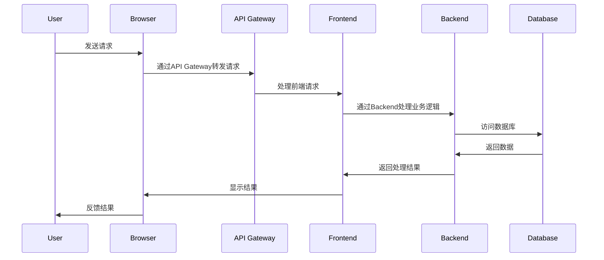
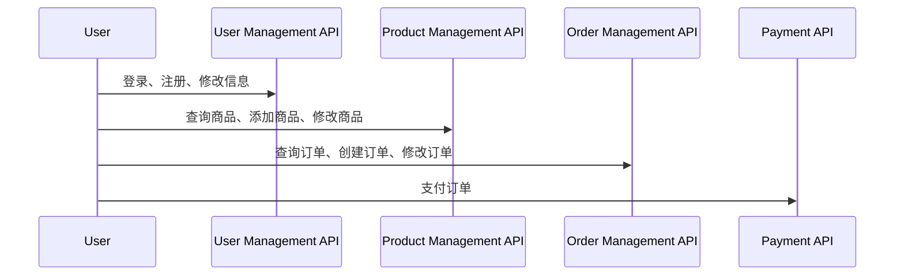

                 


## 技术路线图：规划团队技术发展方向

### 引言

技术路线图是一种战略性工具，它帮助团队和企业明确技术发展方向，制定清晰的技术战略，确保资源投入与业务目标的一致性。在当今快速发展的技术环境中，技术路线图的制定变得尤为重要。本文将围绕技术路线图的制定展开讨论，从背景介绍、核心概念与联系、核心概念原理、系统分析与架构设计、项目实战等多个方面进行详细阐述。

### 背景介绍

#### 1.1.1 技术发展的驱动力

随着全球数字化进程的加速，企业对技术的需求日益增加，数字化转型已成为企业发展的关键因素。云计算、大数据和人工智能等技术的普及，使得企业能够更加灵活、高效地管理数据和技术资源。以下将详细探讨这些驱动力：

**1. 数字化转型的加速**

数字化转型是指企业通过应用数字技术，对业务流程、组织结构和运营模式进行革新，以实现更加高效、智能和可持续的发展。数字化转型带来的好处包括：

- **提高效率**：通过自动化和优化流程，减少人力成本，提高生产效率。
- **增强客户体验**：利用大数据和人工智能技术，提供个性化的产品和服务，提升客户满意度。
- **降低运营成本**：通过数字化手段，降低库存、物流和营销成本。

数字化转型对企业的影响是深远的，它不仅改变了企业的运营方式，也影响了企业的商业模式和市场竞争力。

**2. 云计算与大数据的普及**

云计算是一种通过互联网提供计算资源的服务模式，它使得企业可以按需获取计算能力，降低了IT基础设施的投入和维护成本。云计算的普及，为企业提供了更灵活、高效的技术资源管理方式。

大数据技术则通过对海量数据的存储、处理和分析，为企业提供了宝贵的信息资源。大数据技术在各个领域的应用，如金融、医疗、零售等，都带来了显著的价值。

**3. AI技术的突破**

人工智能技术的快速发展，为各行业带来了革命性的变化。人工智能技术在图像识别、自然语言处理、智能推荐等方面的突破，使得企业能够更加智能地处理数据和业务问题。

**1.1.2 团队技术发展的挑战**

在技术快速发展的背景下，团队在技术发展上面临以下挑战：

**1. 技术更新速度快**

随着技术的不断进步，新的技术、工具和框架层出不穷，团队需要不断学习新知识，以适应快速变化的技术环境。否则，可能会面临技能落后、竞争力下降的风险。

**2. 技术栈复杂度高**

随着技术的发展，技术栈变得越来越复杂，团队需要掌握多种技术，如前端、后端、数据库、人工智能等。技术栈的复杂性增加了团队的协作难度，也提高了技能要求。

**3. 技术战略不明确**

没有明确的技术战略，团队在技术发展上可能会迷失方向，影响企业的长期发展。技术路线图的制定，可以帮助团队明确技术发展方向，确保技术投入与战略目标一致。

### 1.1.3 技术路线图的重要性

**1. 明确技术发展方向**

技术路线图可以帮助团队明确技术发展方向，确保技术投入与业务目标一致。通过分析市场趋势、技术发展和企业需求，技术路线图可以指导团队在技术发展上的决策。

**2. 提升团队协作效率**

技术路线图有助于提升团队内部协作效率，减少因技术分歧导致的内耗。明确的路线图可以减少团队在技术选择和方向上的不确定性，使团队成员能够更加专注于具体任务的执行。

**3. 增强企业竞争力**

技术路线图的制定，可以帮助企业更好地把握市场机遇，提升竞争力。通过明确的技术发展方向，企业可以更快地响应市场变化，推出具有竞争力的产品和服务。

### 第二部分：核心概念与联系

#### 2.1 核心概念

##### 2.1.1 技术趋势

技术趋势是指一段时间内技术发展的方向和趋势，它是技术路线图制定的重要依据。了解技术趋势可以帮助团队把握市场方向，为技术决策提供支持。

**技术趋势的主要特征：**

- **快速变化**：技术趋势的变化速度非常快，新的技术和应用层出不穷。
- **跨界融合**：技术之间的融合越来越普遍，如人工智能与大数据、物联网与云计算等。
- **应用广泛**：技术趋势的应用领域非常广泛，从工业制造到服务业，都在广泛应用新技术。

**2.1.2 技术栈**

技术栈是指团队所掌握的技术和工具集合，它决定了团队的技术能力和发展方向。技术栈的构建需要根据团队的业务需求和市场趋势进行。

**技术栈的主要组成部分：**

- **前端技术**：如HTML、CSS、JavaScript等。
- **后端技术**：如服务器端语言、数据库等。
- **人工智能技术**：如机器学习、自然语言处理等。
- **其他技术**：如区块链、物联网等。

**2.1.3 技术战略**

技术战略是指团队在技术发展上的长远规划和决策，它决定了团队的技术发展方向和资源投入。技术战略的制定需要考虑企业的业务目标、市场趋势和团队的能力。

**技术战略的主要特征：**

- **长期性**：技术战略通常是长期的，它需要考虑企业未来几年甚至更长时间的发展。
- **灵活性**：技术战略需要具备灵活性，以便根据市场变化进行调整。
- **一致性**：技术战略需要与企业的整体战略保持一致，确保资源投入与业务目标一致。

#### 2.2 概念属性特征对比表格

为了更好地理解上述核心概念，我们可以通过一个对比表格来展示它们的主要特征：

| 概念 | 特征 |
| ---- | ---- |
| 技术趋势 | 快速变化、跨界融合、应用广泛 |
| 技术栈 | 前端、后端、人工智能、其他技术 |
| 技术战略 | 长期性、灵活性、一致性 |

#### 2.3 ER实体关系图架构

为了更直观地理解技术路线图的构建，我们可以使用ER（实体-关系）图来展示各核心概念之间的关系。

```mermaid
erDiagram
    DataEntity ||--|{ DataRelation }|| DataEntity : 有关系
    DataEntity ||--|{ DataAttribute }|| DataAttribute : 属性
```

在这个ER图中，`DataEntity` 表示技术路线图中的核心概念，如技术趋势、技术栈、技术战略等；`DataRelation` 表示这些核心概念之间的关系；`DataAttribute` 表示各核心概念的特征和属性。

### 第三部分：核心概念原理

#### 3.1 技术趋势分析

**3.1.1 当前主流技术趋势**

当前主流技术趋势包括人工智能、云计算、大数据、物联网、区块链等。以下将详细分析这些趋势：

**1. 人工智能**

人工智能是当前最热门的技术领域之一，它在图像识别、自然语言处理、智能推荐等方面取得了重大突破。人工智能技术的应用，不仅提升了企业的运营效率，也为人类的生活方式带来了深刻变革。

**2. 云计算**

云计算是一种通过互联网提供计算资源的服务模式，它使得企业可以按需获取计算能力，降低了IT基础设施的投入和维护成本。云计算的普及，为企业提供了更灵活、高效的技术资源管理方式。

**3. 大数据**

大数据技术通过对海量数据的存储、处理和分析，为企业提供了宝贵的信息资源。大数据技术在各个领域的应用，如金融、医疗、零售等，都带来了显著的价值。

**4. 物联网**

物联网技术通过将各种设备和传感器连接起来，实现了设备之间的智能互联和数据处理。物联网技术的应用，使得智能家居、智慧城市等概念成为现实。

**5. 区块链**

区块链技术是一种去中心化的数据库技术，它通过加密算法确保数据的不可篡改性和安全性。区块链技术在金融、供应链管理、版权保护等领域具有广泛应用。

**3.1.2 技术趋势的未来展望**

技术趋势的未来发展，将继续围绕人工智能、云计算、大数据、物联网、区块链等领域展开。以下是一些未来趋势的展望：

**1. 人工智能**

人工智能技术将继续在各个领域得到广泛应用，如医疗、金融、教育、娱乐等。随着算法和计算能力的提升，人工智能将更加智能，为人类带来更多便利。

**2. 云计算**

云计算将继续发展，其服务模式将更加多样化，如云计算、边缘计算、混合云等。云计算技术将为企业提供更加灵活、高效的服务。

**3. 大数据**

大数据技术将继续发展，数据存储、处理和分析能力将进一步提升。随着5G技术的普及，大数据将更加实时、准确，为决策提供更强支持。

**4. 物联网**

物联网技术将继续在智能家居、智慧城市、工业互联网等领域得到广泛应用。随着物联网设备的增加，数据量和处理需求将大幅提升。

**5. 区块链**

区块链技术将继续在金融、供应链管理、版权保护等领域得到广泛应用。随着技术的进步，区块链的效率、安全性将进一步提升。

**3.1.3 技术趋势对企业的影响**

技术趋势对企业的影响是深远的，以下是一些具体的影响：

**1. 提高运营效率**

技术趋势的应用，可以大大提高企业的运营效率。例如，通过人工智能技术，企业可以优化生产流程，提高生产效率；通过云计算技术，企业可以降低IT基础设施投入，提高资源利用率。

**2. 改善客户体验**

技术趋势的应用，可以大大改善客户的体验。例如，通过大数据技术，企业可以更好地了解客户需求，提供个性化的产品和服务；通过物联网技术，企业可以实时监控产品状态，提供更好的售后服务。

**3. 降低运营成本**

技术趋势的应用，可以大大降低企业的运营成本。例如，通过云计算技术，企业可以降低IT基础设施投入，减少维护成本；通过物联网技术，企业可以减少人力投入，降低运营成本。

**4. 提升竞争力**

技术趋势的应用，可以帮助企业提升竞争力。例如，通过人工智能技术，企业可以开发出更具竞争力的产品和服务；通过大数据技术，企业可以更好地把握市场机遇，提升市场竞争力。

### 第四部分：系统分析与架构设计

#### 4.1 系统功能设计

系统功能设计是系统开发的关键环节，它决定了系统的实用性和用户体验。以下是一个简单的项目介绍，以及系统功能设计的领域模型。

**项目介绍：**

假设我们正在开发一个电子商务平台，该平台需要实现商品展示、购物车、订单处理、用户管理等功能。

**领域模型：**

```mermaid
classDiagram
    Customer <|-- Order
    Customer <|-- ShoppingCart
    Product <|-- Order
    Product <|-- ShoppingCart
    ProductCategory <|-- Product
    ShoppingCart <|-- Order
    Order <<create OrderItem
    Customer <<create Address
    Customer <<create CreditCard
    Product <<create ProductReview
```

在这个领域模型中，我们定义了多个类，如Customer（客户）、Order（订单）、ShoppingCart（购物车）、Product（商品）、ProductCategory（商品分类）、Address（地址）、CreditCard（信用卡）和ProductReview（商品评论）。

#### 4.2 系统架构设计

系统架构设计是确保系统高效、可扩展、可维护的关键。以下是一个简单的系统架构设计，包括前端、后端、数据库和外部接口等。

**系统架构设计：**



在这个系统架构设计中，API Gateway负责处理外部请求，将请求转发给前端或后端；Frontend负责处理前端请求，与用户交互；Backend负责处理业务逻辑，访问数据库；Database负责存储数据。

#### 4.3 系统接口设计

系统接口设计是确保不同模块之间能够良好协作的关键。以下是一个简单的系统接口设计，包括用户管理、商品管理、订单管理和支付接口等。

**系统接口设计：**



在这个系统接口设计中，User Management API负责处理用户相关的请求；Product Management API负责处理商品相关的请求；Order Management API负责处理订单相关的请求；Payment API负责处理支付请求。

#### 4.4 系统交互设计

系统交互设计是确保系统功能正确实现的关键。以下是一个简单的系统交互序列图，展示用户购物车到订单支付的过程。

**系统交互序列图：**

```mermaid
sequenceDiagram
    User ->> Shopping Cart: 添加商品到购物车
    Shopping Cart ->> User: 显示购物车信息
    User ->> Modify Shopping Cart: 修改购物车信息
    Modify Shopping Cart ->> Shopping Cart: 更新购物车信息
    Shopping Cart ->> User: 显示更新后的购物车信息
    User ->> Create Order: 创建订单
    Create Order ->> Order Management: 创建订单
    Order Management ->> User: 显示订单信息
    User ->> Payment: 支付订单
    Payment ->> Order Management: 处理支付
    Order Management ->> User: 显示支付结果
```

在这个系统交互序列图中，用户首先将商品添加到购物车，然后修改购物车信息，接着创建订单，最后支付订单。每个步骤都涉及到多个模块的交互。

### 第五部分：项目实战

#### 5.1 环境安装

在开始项目开发之前，我们需要安装必要的开发环境。以下是一个简单的环境安装步骤：

**1. 安装操作系统**

首先，我们需要安装一个支持Java开发的操作系统，如Windows、Linux或macOS。

**2. 安装Java开发工具包（JDK）**

在安装了操作系统后，我们需要安装Java开发工具包（JDK）。可以通过访问Oracle官网下载最新版本的JDK，然后按照安装向导进行安装。

**3. 安装集成开发环境（IDE）**

我们可以选择Eclipse、IntelliJ IDEA等集成开发环境（IDE）进行项目开发。这些IDE提供了丰富的工具和插件，可以帮助我们更高效地开发Java项目。

**4. 安装数据库**

我们可以选择MySQL、PostgreSQL等关系型数据库作为项目的数据存储。首先，我们需要下载并安装数据库服务器，然后创建数据库和表，最后配置数据库连接信息。

**5. 安装相关库和依赖**

在项目开发过程中，我们可能需要使用一些第三方库和依赖。可以通过Maven、Gradle等构建工具来管理项目的依赖。

#### 5.2 系统核心实现

在环境安装完成后，我们可以开始实现系统的核心功能。以下是一个简单的系统核心实现示例：

**1. 用户管理**

用户管理是电子商务平台的核心功能之一，主要包括用户注册、登录、修改信息等功能。以下是一个简单的用户管理实现示例：

```java
// 用户注册
public void registerUser(String username, String password, String email) {
    // 验证用户名、密码和邮箱的有效性
    // 插入用户数据到数据库
    // 发送注册成功邮件
}

// 用户登录
public User login(String username, String password) {
    // 验证用户名和密码是否正确
    // 从数据库获取用户信息
    return user;
}

// 用户修改信息
public void updateUser(String username, String password, String email) {
    // 更新用户数据到数据库
}
```

**2. 商品管理**

商品管理主要包括商品展示、添加商品、修改商品等功能。以下是一个简单的商品管理实现示例：

```java
// 查询商品列表
public List<Product> queryProducts() {
    // 从数据库查询商品数据
    return products;
}

// 添加商品
public void addProduct(Product product) {
    // 验证商品信息的有效性
    // 插入商品数据到数据库
}

// 修改商品
public void updateProduct(Product product) {
    // 验证商品信息的有效性
    // 更新商品数据到数据库
}
```

**3. 订单管理**

订单管理主要包括订单创建、查询订单、修改订单等功能。以下是一个简单的订单管理实现示例：

```java
// 创建订单
public void createOrder(Order order) {
    // 验证订单信息的有效性
    // 插入订单数据到数据库
}

// 查询订单
public Order queryOrder(int orderId) {
    // 从数据库查询订单数据
    return order;
}

// 修改订单
public void updateOrder(Order order) {
    // 验证订单信息的有效性
    // 更新订单数据到数据库
}
```

**4. 支付管理**

支付管理主要包括支付订单、查询支付结果等功能。以下是一个简单的支付管理实现示例：

```java
// 支付订单
public void payOrder(int orderId) {
    // 调用支付服务，支付订单
    // 更新订单支付状态
}

// 查询支付结果
public boolean queryPaymentResult(int orderId) {
    // 调用支付服务，查询支付结果
    return paymentSuccess;
}
```

#### 5.3 应用解读与分析

在实现系统的核心功能后，我们需要对系统进行测试和调试，确保系统功能的正确实现。以下是一个简单的应用解读与分析：

**1. 功能测试**

首先，我们需要对系统的各个功能进行测试，确保功能的正确实现。例如，我们可以测试用户注册、登录、修改信息等功能，确保用户管理功能的正确性。

**2. 性能测试**

性能测试是评估系统响应速度和处理能力的重要方法。我们可以通过压力测试和负载测试来评估系统的性能，找出系统的瓶颈并进行优化。

**3. 安全测试**

安全测试是确保系统安全的重要步骤。我们需要对系统的安全漏洞进行检测，如SQL注入、XSS攻击等，确保系统的安全性。

**4. 用户体验测试**

用户体验测试是评估系统易用性和用户满意度的重要方法。我们可以通过用户调研和用户测试来评估系统的用户体验，找出需要改进的地方。

#### 5.4 实际案例分析

以下是一个实际案例分析的示例：

**案例背景：**

某电子商务平台在上线初期，由于订单量较小，系统的性能和稳定性都较好。然而，随着订单量的增加，系统的性能逐渐下降，用户体验受到影响。为了解决这一问题，平台决定对系统进行性能优化。

**案例分析：**

1. **性能瓶颈分析**

   首先，平台对系统的性能进行了分析，发现订单处理速度较慢，是系统性能的主要瓶颈。进一步分析发现，订单处理过程中，数据库查询和接口调用是影响性能的关键因素。

2. **优化方案**

   针对性能瓶颈，平台提出了以下优化方案：

   - **数据库优化**：对数据库进行索引优化，提高查询效率；增加缓存，减少数据库访问次数。
   - **接口优化**：对接口进行缓存处理，减少重复计算；使用异步处理，提高接口响应速度。
   - **服务器优化**：增加服务器资源，提高系统处理能力。

3. **实施与效果**

   平台按照优化方案对系统进行了实施，并对优化效果进行了评估。优化后，系统的订单处理速度显著提高，用户体验得到了明显改善。

**5.5 项目小结**

在本项目中，我们通过技术路线图的制定，明确了系统的发展方向和核心功能。在项目实施过程中，我们遵循技术路线图，实现了系统的各个功能模块，并对系统进行了性能优化。通过实际案例的分析，我们验证了技术路线图在项目实施中的重要性。

**5.6 最佳实践 tips**

- 在项目初期，明确技术路线图，确保团队成员对项目目标有清晰的认识。
- 定期对项目进行性能评估和优化，确保系统的高效稳定运行。
- 关注行业技术动态，及时更新技术栈，提升团队的技术实力。
- 注重用户体验，通过用户调研和测试，持续优化系统功能。

**5.7 注意事项**

- 在项目开发过程中，遵循最佳实践，确保代码的质量和可维护性。
- 注重团队合作，明确分工和责任，确保项目进度和质量。
- 遵守安全规范，确保系统的安全性和数据保护。

**5.8 拓展阅读**

- 《架构师修炼之道》
- 《分布式系统设计》
- 《微服务架构设计》
- 《前端性能优化》

---

**作者：** AI天才研究院/AI Genius Institute & 禅与计算机程序设计艺术 /Zen And The Art of Computer Programming

