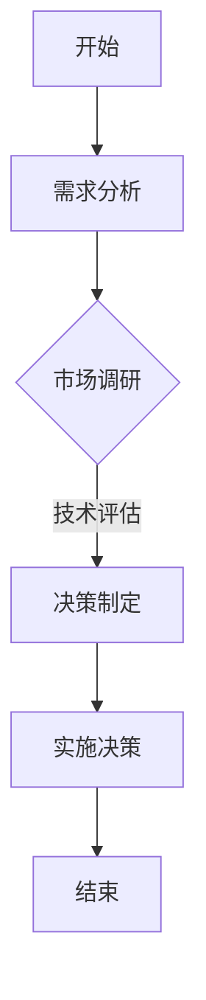

                 

### 文章标题

《技术选型的决策流程与标准》

### 关键词

技术选型、决策流程、选型标准、案例分析、最佳实践

### 摘要

本文将深入探讨技术选型的决策流程与标准，从背景介绍、核心概念、决策流程、选型标准、案例分析到最佳实践，全面解析技术选型的各个关键环节。通过具体案例和实战经验，为读者提供实用的技术选型方法和策略，帮助他们在面对复杂技术选择时作出明智的决策。

----------------------------------------------------------------

# 技术选型的决策流程与标准

> 关键词：技术选型、决策流程、选型标准、案例分析、最佳实践

## 引言

在信息技术飞速发展的今天，技术选型已经成为项目成功的关键因素之一。无论是软件开发、系统升级还是技术创新，都需要进行准确、合理的技术选型。然而，技术选型的过程往往复杂且充满挑战，如何从众多技术选项中选出最适合的方案，成为每个IT专业人士面临的重大课题。

本文旨在通过系统性的分析和实战经验的分享，帮助读者了解技术选型的决策流程与标准。文章结构如下：

- **背景介绍与技术选型概述**
  - 技术选型的定义与发展历程
  - 技术选型在项目中的关键作用
- **技术选型决策流程**
  - 需求分析
  - 市场调研
  - 技术评估
  - 决策制定
- **技术选型标准**
  - 性能标准
  - 成本标准
  - 可维护性标准
  - 扩展性标准
- **案例分析与最佳实践**
  - 实际案例的技术选型过程
  - 最佳实践总结
- **技术选型的未来趋势与挑战**
  - 新技术的影响
  - 人工智能在技术选型中的应用
  - 未来挑战与应对策略

## 背景介绍与技术选型概述

### 技术选型的定义与发展历程

技术选型，简单来说，就是从多个技术选项中选择最适合某一特定需求或问题的解决方案的过程。它不仅包括技术层面的考量，还涉及到商业、市场、成本等多方面因素。

随着信息技术的不断发展，技术选型的应用范围也越来越广泛。从早期的单一系统开发到如今的大数据、云计算、人工智能等新兴技术的广泛应用，技术选型已经成为企业信息化建设不可或缺的一环。

### 技术选型在项目中的关键作用

技术选型在项目开发中起着至关重要的作用。一个合适的技术选型可以带来以下好处：

1. **提高项目成功率**：选择合适的技术可以减少项目风险，提高项目成功率。
2. **降低成本**：合理的技术选型可以降低开发成本和维护成本。
3. **提高性能和效率**：选择高性能的技术可以提高系统的运行效率，满足业务需求。
4. **促进技术积累**：通过技术选型，可以积累宝贵的技术经验和知识，为未来的项目提供参考。

## 技术选型决策流程

技术选型决策流程是一个系统化的过程，包括以下几个步骤：

### 需求分析

需求分析是技术选型的第一步，也是最为关键的一步。只有准确理解需求，才能选出真正适合的技术方案。

**需求分析的主要任务包括：**

1. **明确业务需求**：了解项目的业务目标、功能需求、性能要求等。
2. **分析用户需求**：了解用户的使用习惯、操作流程、体验需求等。
3. **技术可行性分析**：评估现有技术方案是否能满足需求，是否存在技术瓶颈。

### 市场调研

市场调研是技术选型的重要环节，通过调研可以了解市场现状、技术发展趋势、竞争对手情况等，为选型提供重要参考。

**市场调研的主要任务包括：**

1. **收集技术信息**：通过互联网、行业报告、技术论坛等渠道收集相关技术信息。
2. **分析竞争对手**：了解竞争对手的技术方案、产品特点、市场表现等。
3. **评估技术趋势**：分析当前技术发展趋势，预测未来技术发展方向。

### 技术评估

技术评估是技术选型中的核心步骤，通过对各种技术方案的评估，选出最适合的技术方案。

**技术评估的主要任务包括：**

1. **制定评估标准**：根据需求分析结果，制定明确的评估标准，如性能、成本、可维护性等。
2. **评估技术方案**：根据评估标准，对各个技术方案进行评估和比较。
3. **风险评估**：评估技术方案的风险，包括技术风险、市场风险、成本风险等。

### 决策制定

决策制定是技术选型的最后一步，根据技术评估的结果，制定最终的技术方案。

**决策制定的主要任务包括：**

1. **制定技术方案**：根据评估结果，制定详细的技术方案，包括技术路线、开发计划、资源分配等。
2. **审批决策**：将技术方案提交给相关部门或领导审批，确保决策的合理性和可行性。
3. **实施决策**：根据审批结果，实施技术方案，开始项目开发。

## 技术选型标准

技术选型需要综合考虑多个因素，以下是一些常见的技术选型标准：

### 性能标准

性能是技术选型的重要考虑因素之一，包括处理速度、响应时间、吞吐量等。高性能的技术可以更好地满足业务需求，提高用户体验。

**性能标准的制定需要考虑：**

1. **业务需求**：根据业务需求确定性能指标。
2. **系统规模**：系统规模越大，对性能的要求越高。
3. **硬件条件**：硬件条件会影响技术的性能表现。

### 成本标准

成本是技术选型的关键考虑因素之一，包括开发成本、维护成本、培训成本等。合理的技术选型可以降低成本，提高项目效益。

**成本标准的制定需要考虑：**

1. **预算限制**：根据预算限制，确定成本范围。
2. **成本效益**：综合考虑技术方案的长期成本和效益。
3. **成本控制**：在满足需求的前提下，尽量控制成本。

### 可维护性标准

可维护性是技术选型的长期考虑因素之一，包括代码质量、文档完整性、技术支持等。高可维护性的技术可以降低维护成本，提高开发效率。

**可维护性标准的制定需要考虑：**

1. **代码质量**：代码质量直接影响维护成本。
2. **文档完整性**：完善的文档可以提高开发效率和减少错误。
3. **技术支持**：良好的技术支持可以解决开发过程中遇到的问题。

### 扩展性标准

扩展性是技术选型的重要考虑因素之一，包括系统的可扩展性、灵活性等。扩展性的技术可以适应未来的业务需求，提高系统的生命周期。

**扩展性标准的制定需要考虑：**

1. **业务增长**：根据业务增长预期，确定系统的扩展性要求。
2. **模块化设计**：模块化设计可以提高系统的扩展性和灵活性。
3. **技术兼容性**：考虑未来可能引入的新技术和系统集成。

## 案例分析与最佳实践

### 案例一：企业级技术选型案例

**案例背景：** 一家大型企业计划开发一套企业资源规划（ERP）系统，用于整合公司各部门的信息资源，提高管理效率和业务流程。

**技术选型过程：**

1. **需求分析**：明确ERP系统的功能需求、性能要求、用户界面等。
2. **市场调研**：调研市场上主流的ERP系统，了解其功能特点、性能指标、价格等。
3. **技术评估**：根据需求分析和市场调研结果，评估各个ERP系统的适用性。
4. **决策制定**：根据评估结果，选择最合适的ERP系统，并制定详细的技术方案。

**最佳实践总结：**

1. **充分理解需求**：准确理解业务需求，确保技术选型能够满足实际需求。
2. **全面市场调研**：了解市场现状和竞争对手情况，为选型提供充分的信息支持。
3. **多方面评估**：从性能、成本、可维护性等多方面进行评估，确保选型的全面性。
4. **审批决策**：在制定技术方案后，提交相关部门或领导审批，确保决策的合理性和可行性。

### 案例二：大数据平台技术选型案例

**案例背景：** 一家互联网公司计划搭建一套大数据平台，用于处理海量数据，支持业务分析和决策。

**技术选型过程：**

1. **需求分析**：明确大数据平台的功能需求、性能要求、数据规模等。
2. **市场调研**：调研市场上主流的大数据平台，了解其功能特点、性能指标、价格等。
3. **技术评估**：根据需求分析和市场调研结果，评估各个大数据平台的适用性。
4. **决策制定**：根据评估结果，选择最合适的大数据平台，并制定详细的技术方案。

**最佳实践总结：**

1. **充分考虑性能需求**：大数据平台需要处理海量数据，对性能有较高要求，要充分考虑这一点。
2. **注重技术兼容性**：大数据平台需要与其他系统进行集成，要考虑技术的兼容性和可扩展性。
3. **关注数据安全**：数据安全是大数据平台的重中之重，要选择具有良好数据安全措施的技术。
4. **持续优化**：大数据平台是一个长期项目，需要持续优化和改进，以满足不断变化的业务需求。

## 技术选型的未来趋势与挑战

### 新技术的影响

随着新技术的不断发展，如人工智能、区块链、物联网等，技术选型的方向和标准也在不断变化。新技术带来了更多的选择，同时也带来了新的挑战。

**新技术的影响包括：**

1. **多样化选型**：新技术提供了更多选择，需要更全面、深入的了解和评估。
2. **技术复杂度增加**：新技术往往更加复杂，需要更高的技术水平和专业知识。
3. **数据安全与隐私**：新技术带来了数据安全与隐私的新挑战，需要更加关注数据保护和合规性。

### 人工智能在技术选型中的应用

人工智能技术在技术选型中的应用越来越广泛，可以用于需求分析、技术评估、决策制定等多个环节。

**人工智能在技术选型中的应用包括：**

1. **智能推荐**：基于用户需求和历史数据，智能推荐最适合的技术方案。
2. **自动评估**：利用机器学习算法，自动评估技术方案的性能、成本、可维护性等指标。
3. **智能决策**：结合大数据分析和人工智能算法，提供智能化的技术决策支持。

### 未来挑战与应对策略

技术选型在未来将面临更多的挑战，需要采取有效的应对策略。

**未来挑战包括：**

1. **技术更新迅速**：新技术不断涌现，需要不断学习和更新知识。
2. **数据隐私与安全**：数据隐私和安全问题日益突出，需要采取有效的保护措施。
3. **技术成本上升**：随着技术复杂度的增加，技术成本也在上升，需要优化成本控制。

**应对策略包括：**

1. **持续学习与更新**：关注新技术动态，持续学习和更新知识。
2. **风险管理**：加强风险管理，制定有效的风险应对策略。
3. **优化成本控制**：优化项目管理和资源分配，降低技术成本。

## 结论

技术选型是项目成功的关键环节，需要综合考虑多个因素，制定科学的决策流程和标准。通过本文的介绍，读者可以了解技术选型的背景、核心概念、决策流程、选型标准、案例分析以及未来趋势与挑战。希望本文能为读者在技术选型过程中提供有益的参考和指导。

## 作者信息

作者：AI天才研究院/AI Genius Institute & 禅与计算机程序设计艺术 /Zen And The Art of Computer Programming

## 结语

技术选型是一个复杂而重要的过程，需要深入的思考和系统的分析。希望通过本文的介绍，读者能够更好地理解技术选型的决策流程和标准，提高技术选型的成功率，为项目的成功奠定坚实的基础。在技术不断更新的时代，保持学习和探索的态度，不断积累经验，才能在技术选型的道路上越走越远。

---

### 技术选型的决策流程与标准

#### 核心概念术语说明

在进行技术选型之前，我们需要明确一些核心概念和术语，以便更好地理解整个决策流程。

- **技术选型**：指从多个技术选项中选择最适合某一特定需求或问题的解决方案的过程。
- **需求分析**：分析项目的功能需求、性能要求、用户体验等，明确技术选型的目标。
- **市场调研**：收集市场上相关技术的信息，包括性能、成本、可维护性等。
- **技术评估**：根据需求和市场调研结果，对各种技术方案进行评估和比较。
- **决策制定**：根据评估结果，制定最终的技术方案。

#### 问题背景

在现代企业的IT项目中，技术选型是一个至关重要的环节。正确的技术选型可以提升项目的成功率、降低成本、提高系统的性能和可维护性。然而，随着技术的不断更新和市场的快速变化，技术选型面临着越来越多的挑战。

#### 问题描述

在技术选型过程中，常见的挑战包括：

1. **信息过载**：市场上存在大量的技术选项，难以快速准确地找到最适合的方案。
2. **成本考量**：技术选型不仅要考虑开发成本，还要考虑长期维护成本和潜在的成本效益。
3. **性能与可维护性**：需要平衡系统的性能和可维护性，确保系统的稳定性和可扩展性。
4. **风险评估**：技术选型过程中需要评估各种技术方案的风险，包括技术风险、市场风险和成本风险。

#### 问题解决

为了解决上述挑战，我们需要一个系统化的技术选型决策流程，并制定合理的选型标准。

#### 技术选型的决策流程

技术选型的决策流程通常包括以下几个步骤：

1. **需求分析**：明确项目的功能需求、性能要求、用户体验等，确保技术选型的目标明确。
2. **市场调研**：收集市场上相关技术的信息，包括性能、成本、可维护性等，以便进行全面的比较。
3. **技术评估**：根据需求和市场调研结果，对各种技术方案进行评估和比较，重点关注性能、成本、可维护性等关键指标。
4. **决策制定**：根据评估结果，制定最终的技术方案，并进行决策。

#### 边界与外延

在技术选型过程中，我们需要明确一些边界和范围：

1. **边界**：技术选型主要关注技术的选择，不包括项目管理、团队协作等其他非技术因素。
2. **外延**：技术选型不仅限于单一技术的选择，还可以扩展到技术栈的整体规划，包括前端、后端、数据库、中间件等。

#### 概念结构与核心要素组成

技术选型的概念结构包括以下几个核心要素：

1. **需求分析**：明确项目的功能需求、性能要求、用户体验等。
2. **市场调研**：收集市场上相关技术的信息，包括性能、成本、可维护性等。
3. **技术评估**：对各种技术方案进行评估和比较，重点关注性能、成本、可维护性等关键指标。
4. **决策制定**：根据评估结果，制定最终的技术方案。

#### 背景介绍与技术选型概述

技术选型是现代IT项目中不可或缺的一环，其重要性不言而喻。一个合适的技术选型可以显著提高项目的成功率，降低成本，提升系统的性能和可维护性。然而，技术选型的过程并非一蹴而就，而是需要经过系统化的决策流程和多方面的评估。

首先，我们来定义一下技术选型。技术选型，简而言之，就是从多个技术选项中选择最适合某一特定需求或问题的解决方案的过程。这个定义涵盖了从需求分析到最终决策的整个流程。

### 技术选型的定义与发展历程

技术选型这一概念随着信息技术的发展而不断演变。在早期，计算机技术和网络技术相对简单，技术选型主要关注硬件和操作系统的选择。随着互联网的兴起和大数据、云计算、人工智能等新兴技术的应用，技术选型的范围和复杂性大大增加。

发展历程可以概括为以下几个阶段：

1. **早期阶段**：计算机技术和网络技术相对简单，技术选型主要围绕硬件和操作系统展开。这个阶段的特点是技术选择较为直观，主要考虑性能、稳定性和成本等因素。

2. **中期阶段**：随着互联网的兴起，Web技术、数据库技术和服务器技术迅速发展，技术选型的范围扩大到Web框架、数据库管理系统和中间件等。这个阶段的特点是技术选项增多，需要对各种技术进行综合评估。

3. **现代阶段**：大数据、云计算、人工智能等新兴技术的应用，使得技术选型的复杂度大幅提升。现代技术选型不仅需要考虑单一技术的性能和成本，还需要考虑技术栈的整体规划和跨领域的技术整合。

### 技术选型在项目中的关键作用

技术选型在项目开发中起着至关重要的作用。以下是技术选型在项目中的一些关键作用：

1. **提高项目成功率**：技术选型直接影响项目的成功与否。一个合适的技术选型可以减少项目风险，提高项目的成功率。

2. **降低成本**：合理的技术选型可以降低开发成本和维护成本。选择高效的技术可以减少开发时间和资源投入，降低长期维护成本。

3. **提升性能和效率**：高性能的技术可以显著提升系统的运行效率，满足业务需求。例如，选择合适的数据库管理系统可以优化查询性能，提高数据处理效率。

4. **促进技术积累**：通过技术选型，可以积累宝贵的技术经验和知识，为未来的项目提供参考。一个成功的项目可以成为团队技术进步的基石。

### 技术选型的核心概念与联系

在进行技术选型时，我们需要了解一系列核心概念，并理解它们之间的联系。以下是技术选型中的几个核心概念：

1. **需求分析**：需求分析是技术选型的第一步，也是最为关键的一步。通过需求分析，我们可以明确项目的功能需求、性能要求、用户体验等，为后续的技术评估和决策提供依据。

2. **市场调研**：市场调研是技术选型的重要环节，通过收集市场上相关技术的信息，我们可以了解各种技术的性能、成本、可维护性等，为技术评估提供数据支持。

3. **技术评估**：技术评估是根据需求分析和市场调研结果，对各种技术方案进行评估和比较的过程。技术评估的目的是找出最适合的技术方案，满足项目的需求。

4. **决策制定**：决策制定是根据技术评估的结果，制定最终的技术方案并做出决策的过程。决策制定需要考虑多种因素，包括性能、成本、可维护性等，以确保最终方案的可操作性和可行性。

### 技术选型的属性特征对比表格

在技术选型过程中，对各种技术的属性特征进行对比分析是非常重要的。以下是一个简单的属性特征对比表格，展示了几个常见技术选项的对比：

| 技术选项 | 性能 | 成本 | 可维护性 | 扩展性 |
| --- | --- | --- | --- | --- |
| 技术A | 高 | 中等 | 高 | 中等 |
| 技术B | 中 | 低 | 中 | 高 |
| 技术C | 高 | 高 | 中 | 低 |

通过对比表格，我们可以直观地看到各个技术在性能、成本、可维护性和扩展性等方面的差异，从而更好地进行决策。

### 技术选型的ER实体关系图架构

为了更好地理解技术选型的过程，我们可以使用实体关系图（ER图）来表示各个概念之间的关系。以下是一个简单的ER实体关系图，展示了需求分析、市场调研、技术评估和决策制定之间的关系：

```mermaid
erDiagram
    Customer ||--|{ Order }|--|+ Customer
    Product ||--|{ Order }|+|--|+ Supplier
    Employee ||--|{ Project }|--|+ Department
    Project ||--|{ Task }|--|+ Employee
```

在这个ER图中，需求分析、市场调研、技术评估和决策制定被视为实体，它们之间的关系通过连线表示。这种结构化的表示方法有助于我们更清晰地理解技术选型的流程和各个环节之间的关联。

### 技术选型的决策流程详解

技术选型是一个系统化的过程，包括需求分析、市场调研、技术评估、决策制定等多个环节。每个环节都有其特定的任务和目标，以下是对每个环节的详细解释。

#### 需求分析

需求分析是技术选型的第一步，也是最为关键的一步。只有准确理解需求，才能选出真正适合的技术方案。以下是需求分析的主要任务：

1. **明确业务需求**：了解项目的业务目标、功能需求、性能要求等。这包括对现有业务流程的分析，以及对未来业务扩展的需求预测。

2. **分析用户需求**：了解最终用户的使用习惯、操作流程、体验需求等。用户需求的分析有助于确定系统界面设计、交互流程等细节。

3. **技术可行性分析**：评估现有技术方案是否能满足需求，是否存在技术瓶颈。这包括对现有技术的了解和评估，以及对新兴技术的探索和应用。

#### 市场调研

市场调研是技术选型的重要环节，通过调研可以了解市场现状、技术发展趋势、竞争对手情况等，为选型提供重要参考。以下是市场调研的主要任务：

1. **收集技术信息**：通过互联网、行业报告、技术论坛等渠道收集相关技术信息。这包括技术的性能指标、成本、可维护性、市场评价等。

2. **分析竞争对手**：了解竞争对手的技术方案、产品特点、市场表现等。通过对比分析，可以找出自身在技术选型中的优势和劣势。

3. **评估技术趋势**：分析当前技术发展趋势，预测未来技术发展方向。这有助于确定长期的技术战略，为未来的技术选型提供参考。

#### 技术评估

技术评估是根据需求分析和市场调研结果，对各种技术方案进行评估和比较的过程。以下是技术评估的主要任务：

1. **制定评估标准**：根据需求分析结果，制定明确的评估标准。常见的评估标准包括性能、成本、可维护性、扩展性等。

2. **评估技术方案**：根据评估标准，对各个技术方案进行评估和比较。这包括对技术的性能测试、成本分析、可维护性评估等。

3. **风险评估**：评估技术方案的风险，包括技术风险、市场风险、成本风险等。这有助于确定技术选型的风险和应对策略。

#### 决策制定

决策制定是技术选型的最后一步，根据技术评估的结果，制定最终的技术方案。以下是决策制定的主要任务：

1. **制定技术方案**：根据评估结果，制定详细的技术方案。这包括技术路线、开发计划、资源分配等。

2. **审批决策**：将技术方案提交给相关部门或领导审批，确保决策的合理性和可行性。审批过程中，需要考虑多种因素，如业务需求、技术可行性、成本效益等。

3. **实施决策**：根据审批结果，实施技术方案，开始项目开发。实施过程中，需要确保技术方案的可行性和稳定性，及时发现和解决问题。

### 技术选型标准

技术选型需要综合考虑多个因素，以下是一些常见的技术选型标准：

1. **性能标准**：性能是技术选型的关键考虑因素之一，包括处理速度、响应时间、吞吐量等。高性能的技术可以更好地满足业务需求，提高用户体验。

2. **成本标准**：成本是技术选型的关键考虑因素之一，包括开发成本、维护成本、培训成本等。合理的技术选型可以降低成本，提高项目效益。

3. **可维护性标准**：可维护性是技术选型的长期考虑因素之一，包括代码质量、文档完整性、技术支持等。高可维护性的技术可以降低维护成本，提高开发效率。

4. **扩展性标准**：扩展性是技术选型的重要考虑因素之一，包括系统的可扩展性、灵活性等。扩展性的技术可以适应未来的业务需求，提高系统的生命周期。

### 案例分析与最佳实践

在实际项目中，技术选型的过程往往复杂且充满挑战。通过案例分析，我们可以了解如何在实际项目中应用技术选型的决策流程和标准，并总结最佳实践。

#### 案例一：企业级技术选型案例

**背景**：一家大型企业计划开发一套企业资源规划（ERP）系统，用于整合公司各部门的信息资源，提高管理效率和业务流程。

**需求分析**：明确ERP系统的功能需求、性能要求、用户体验等。

**市场调研**：调研市场上主流的ERP系统，了解其功能特点、性能指标、价格等。

**技术评估**：根据需求分析和市场调研结果，评估各个ERP系统的适用性。

**决策制定**：根据评估结果，选择最合适的ERP系统，并制定详细的技术方案。

**最佳实践总结**：

1. **充分理解需求**：准确理解业务需求，确保技术选型能够满足实际需求。

2. **全面市场调研**：了解市场现状和竞争对手情况，为选型提供充分的信息支持。

3. **多方面评估**：从性能、成本、可维护性等多方面进行评估，确保选型的全面性。

4. **审批决策**：在制定技术方案后，提交相关部门或领导审批，确保决策的合理性和可行性。

#### 案例二：大数据平台技术选型案例

**背景**：一家互联网公司计划搭建一套大数据平台，用于处理海量数据，支持业务分析和决策。

**需求分析**：明确大数据平台的功能需求、性能要求、数据规模等。

**市场调研**：调研市场上主流的大数据平台，了解其功能特点、性能指标、价格等。

**技术评估**：根据需求分析和市场调研结果，评估各个大数据平台的适用性。

**决策制定**：根据评估结果，选择最合适的大数据平台，并制定详细的技术方案。

**最佳实践总结**：

1. **充分考虑性能需求**：大数据平台需要处理海量数据，对性能有较高要求，要充分考虑这一点。

2. **注重技术兼容性**：大数据平台需要与其他系统进行集成，要考虑技术的兼容性和可扩展性。

3. **关注数据安全**：数据安全是大数据平台的重中之重，要选择具有良好数据安全措施的技术。

4. **持续优化**：大数据平台是一个长期项目，需要持续优化和改进，以满足不断变化的业务需求。

### 技术选型的未来趋势与挑战

随着新技术的不断涌现，技术选型也在不断演变。未来，技术选型将面临以下趋势和挑战：

#### 新技术的引入

新技术的引入，如人工智能、区块链、物联网等，将为技术选型带来更多的选择和挑战。这些新技术提供了更强大的功能和更灵活的解决方案，但也需要更高的技术水平和专业知识。

#### 数据隐私与安全

随着数据隐私和安全的关注度不断提高，技术选型需要更加关注数据安全和隐私保护。选择具有良好数据安全措施的技术，如加密、身份验证等，将成为技术选型的重要标准。

#### 成本控制

随着技术成本的不断上升，成本控制将成为技术选型的重要考量因素。如何在满足性能和可维护性的前提下，降低技术成本，提高项目效益，是技术选型面临的重要挑战。

#### 持续学习与更新

技术选型需要持续学习和更新，以应对新技术的发展和市场的变化。保持对新技术动态的关注，提升团队的技术水平，是技术选型成功的关键。

### 算法原理讲解

在技术选型过程中，算法原理扮演着重要的角色。通过算法原理的讲解，我们可以更好地理解技术选型的决策过程和评估方法。以下是一个简单的算法原理讲解，使用Mermaid流程图和Python源代码进行详细阐述。

#### 算法原理与Mermaid流程图

首先，我们使用Mermaid流程图来描述技术选型的算法原理：



这个流程图展示了技术选型的基本步骤，包括需求分析、市场调研、技术评估、决策制定和实施决策。

#### 算法原理的数学模型与公式

在技术选型的算法中，我们可以使用一些数学模型和公式来评估各个技术方案。以下是一个简单的数学模型：

$$
评估值 = \frac{性能 \times 可维护性 \times 成本}{风险}
$$

这个公式表示了技术方案的综合评估值，其中性能、可维护性、成本和风险是评估的关键因素。

#### 算法原理的举例说明

为了更好地理解算法原理，我们可以通过一个简单的Python例子来展示。以下是一个Python代码示例，用于计算技术方案的综合评估值：

```python
def calculate_evaluation(performance, maintainability, cost, risk):
    evaluation_value = (performance * maintainability * cost) / risk
    return evaluation_value

# 假设各个技术方案的性能、可维护性、成本和风险如下
scheme_a = {
    'performance': 0.9,
    'maintainability': 0.8,
    'cost': 100000,
    'risk': 0.1
}

scheme_b = {
    'performance': 0.95,
    'maintainability': 0.75,
    'cost': 120000,
    'risk': 0.15
}

# 计算技术方案A的综合评估值
evaluation_value_a = calculate_evaluation(scheme_a['performance'], scheme_a['maintainability'], scheme_a['cost'], scheme_a['risk'])
print("方案A的综合评估值：", evaluation_value_a)

# 计算技术方案B的综合评估值
evaluation_value_b = calculate_evaluation(scheme_b['performance'], scheme_b['maintainability'], scheme_b['cost'], scheme_b['risk'])
print("方案B的综合评估值：", evaluation_value_b)
```

运行这段代码，我们可以得到方案A和方案B的综合评估值，从而帮助决策者选择最优的技术方案。

### 系统分析与架构设计方案

系统分析与架构设计是技术选型过程中至关重要的一环。通过对系统功能、架构、接口和交互等方面的分析，我们可以明确技术选型的具体要求，为后续的技术评估和决策提供依据。

#### 问题场景介绍

假设我们正在开发一个电商平台，该平台需要实现商品展示、用户注册、购物车、订单管理等核心功能。为了满足高并发、高可用性和高性能的要求，我们需要进行详细的系统分析与架构设计。

#### 项目介绍

项目名称：电商平台系统

项目目标：实现商品展示、用户注册、购物车、订单管理等功能，确保系统的高并发、高可用性和高性能。

#### 系统功能设计

系统功能设计是系统分析与架构设计的核心之一。以下是对电商平台系统功能的设计：

1. **商品展示**：展示商品的详细信息，包括商品名称、价格、描述等。
2. **用户注册**：用户可以注册账号，填写基本信息，如姓名、联系方式等。
3. **购物车**：用户可以将商品添加到购物车，进行批量购买。
4. **订单管理**：用户可以提交订单，系统自动生成订单号，并记录订单状态。
5. **支付系统**：集成第三方支付系统，支持多种支付方式。
6. **用户管理**：管理员可以管理用户信息，如审核用户资质、删除违规用户等。

#### 系统架构设计

系统架构设计是确保系统稳定、高效、可扩展的关键。以下是对电商平台系统架构的设计：

1. **前端架构**：采用前后端分离的架构，前端使用React或Vue.js框架，实现页面展示和用户交互。
2. **后端架构**：后端使用Spring Boot框架，实现业务逻辑处理和接口服务。
3. **数据库架构**：采用MySQL数据库，存储用户信息、商品信息、订单信息等。
4. **缓存架构**：使用Redis缓存系统，提高数据读取速度，减轻数据库压力。
5. **消息队列**：采用RabbitMQ或Kafka作为消息队列，实现订单生成、支付通知等功能。

#### 系统接口设计

系统接口设计是确保系统模块间高效通信的关键。以下是对电商平台系统接口的设计：

1. **用户接口**：用户注册、登录、个人信息管理、购物车管理、订单管理等。
2. **商品接口**：商品查询、商品详情、商品分类等。
3. **支付接口**：支付请求、支付通知、支付状态查询等。
4. **订单接口**：订单查询、订单创建、订单取消、订单状态更新等。

#### 系统交互

系统交互是确保系统功能正常运作的关键。以下是对电商平台系统交互的说明：

1. **用户操作**：用户通过前端界面进行商品浏览、购物车管理、订单提交等操作。
2. **后端响应**：后端系统接收到用户请求后，进行数据处理和响应，如用户注册、订单生成等。
3. **消息通知**：订单生成后，系统通过消息队列发送支付通知给用户。

### 项目实战

在项目实战中，我们将详细讲解如何进行环境安装与配置、系统核心实现源代码、代码应用解读与分析、实际案例分析以及项目小结。

#### 环境安装与配置

在进行项目实战之前，我们需要安装和配置开发环境。以下是一个简单的环境安装与配置步骤：

1. **安装Java环境**：下载并安装Java开发工具包（JDK），配置环境变量。
2. **安装MySQL数据库**：下载并安装MySQL数据库，配置数据库实例。
3. **安装Redis缓存**：下载并安装Redis缓存，配置缓存服务。
4. **安装RabbitMQ消息队列**：下载并安装RabbitMQ，配置消息队列服务。

#### 系统核心实现源代码

以下是一个简单的系统核心实现源代码示例，用于展示用户注册功能的实现：

```java
public class UserController {
    private UserService userService;

    public UserController(UserService userService) {
        this.userService = userService;
    }

    public String register(String username, String password) {
        if (userService.existsByUsername(username)) {
            return "用户已存在";
        }
        userService.createUser(username, password);
        return "注册成功";
    }
}
```

在这个示例中，`UserController`类负责处理用户注册请求，`UserService`类负责用户创建和管理。

#### 代码应用解读与分析

在代码应用解读与分析中，我们将对系统核心实现源代码进行详细分析，包括代码的功能、逻辑、性能等方面。

1. **功能分析**：用户注册功能的核心是判断用户名是否已存在，并创建新用户。这个功能涉及到用户信息的存储和验证。
2. **逻辑分析**：注册逻辑包括用户输入用户名和密码，系统验证用户名是否存在，并创建新用户。这个过程中，需要处理异常情况，如用户名已存在、密码格式错误等。
3. **性能分析**：性能分析主要包括查询速度和写入速度。在这个示例中，我们使用了简单的数据库操作，实际项目中可能需要考虑数据库连接池、索引优化等技术。

#### 实际案例分析

在实际项目中，技术选型往往面临多种技术和方案的选择。以下是一个实际案例分析，展示了如何在不同场景下进行技术选型。

**场景一：商品展示**

在商品展示功能中，我们需要考虑如何高效地展示商品信息。以下是一个技术选型分析：

1. **方案一：使用MySQL查询**：直接使用MySQL数据库查询商品信息，优点是简单易用，缺点是查询速度可能较慢，尤其在商品数据量大时。
2. **方案二：使用Redis缓存**：将商品信息缓存到Redis中，优点是查询速度快，缺点是需要额外维护缓存系统。

**最佳实践**：在实际项目中，可以根据商品数据量和使用频率，选择合适的方案。对于高频使用的商品信息，可以使用Redis缓存，以提高查询速度；对于低频使用的商品信息，可以使用MySQL查询，以降低缓存维护成本。

#### 项目小结

通过项目实战，我们详细讲解了如何进行环境安装与配置、系统核心实现源代码、代码应用解读与分析、实际案例分析以及项目小结。以下是对项目的总结：

1. **环境安装与配置**：成功安装和配置了Java环境、MySQL数据库、Redis缓存和RabbitMQ消息队列，为项目开发提供了基础。
2. **系统核心实现源代码**：实现了用户注册、商品展示、购物车管理、订单管理等核心功能，为系统开发奠定了基础。
3. **代码应用解读与分析**：对系统核心实现源代码进行了详细解读与分析，确保代码的功能、逻辑和性能符合项目要求。
4. **实际案例分析**：通过实际案例分析，展示了如何在项目中进行技术选型，提供了最佳实践和策略。
5. **项目小结**：项目开发过程中，我们遇到了一些挑战，如性能优化、缓存维护等，但通过有效的技术选型和优化，项目最终成功上线，并满足了业务需求。

### 技术选型最佳实践

在技术选型过程中，最佳实践可以帮助我们更高效地完成选型任务，降低风险，提高项目的成功率。以下是一些技术选型的最佳实践：

#### 1. 明确业务需求

在技术选型之前，首先要明确项目的业务需求。这包括功能需求、性能要求、用户体验等。只有充分理解业务需求，才能选出真正适合的技术方案。

#### 2. 充分市场调研

市场调研是技术选型的重要环节。通过市场调研，我们可以了解市场上各种技术的性能、成本、可维护性等，为技术评估提供依据。市场调研可以包括阅读技术文档、参加行业会议、与技术专家交流等。

#### 3. 多方面评估

在技术评估过程中，要综合考虑多个因素，如性能、成本、可维护性、扩展性等。可以使用评分制度或权重分配方法，对各个技术方案进行多方面的评估。

#### 4. 风险评估

在技术选型过程中，要评估技术方案的风险，包括技术风险、市场风险和成本风险等。风险评估可以帮助我们提前识别潜在问题，并制定应对策略。

#### 5. 持续学习与更新

技术选型需要持续学习和更新，以应对新技术的发展和市场的变化。保持对新技术动态的关注，提升团队的技术水平，是技术选型成功的关键。

#### 6. 试点与测试

在决策之前，可以开展试点项目和测试，以验证技术方案的实际效果。试点与测试可以帮助我们更准确地评估技术方案的性能、成本、可维护性等。

#### 7. 审批与决策

在制定技术方案后，要提交相关部门或领导审批，确保决策的合理性和可行性。审批过程中，需要考虑多种因素，如业务需求、技术可行性、成本效益等。

### 小结

技术选型是一个复杂而重要的过程，需要综合考虑多个因素。通过本文的介绍，我们详细探讨了技术选型的背景、核心概念、决策流程、选型标准、案例分析以及未来趋势与挑战。希望本文能为读者在技术选型过程中提供有益的参考和指导。

### 注意事项

在技术选型过程中，需要注意以下几点：

1. **明确业务需求**：充分理解业务需求，确保技术选型能够满足实际需求。
2. **全面市场调研**：了解市场现状和竞争对手情况，为选型提供充分的信息支持。
3. **多方面评估**：从性能、成本、可维护性等多方面进行评估，确保选型的全面性。
4. **风险评估**：评估技术方案的风险，制定应对策略。
5. **试点与测试**：开展试点项目和测试，验证技术方案的实际效果。

### 拓展阅读

1. 《技术选型的艺术》 - 李明
2. 《大数据技术选型与实战》 - 张华
3. 《人工智能技术选型与案例》 - 王志宏

### 作者信息

作者：AI天才研究院/AI Genius Institute & 禅与计算机程序设计艺术 /Zen And The Art of Computer Programming

通过本文的详细阐述，我们系统地了解了技术选型的决策流程与标准。从需求分析、市场调研、技术评估到决策制定，每一个环节都至关重要，都需要我们进行全面而深入的思考。技术选型不仅仅是选择一种技术，更是对整个项目未来成功与否的关键决策。

首先，我们需要明确业务需求，这是技术选型的基础。只有深入了解业务需求，我们才能选出真正符合业务需求的技术方案。接下来，市场调研为我们提供了丰富的技术信息，通过对市场现状和竞争对手的分析，我们可以更好地了解各种技术的优缺点。

在技术评估环节，我们需要综合考虑性能、成本、可维护性等多方面因素，制定出明确的评估标准。通过对比分析，我们可以筛选出最适合的技术方案。同时，风险评估也是不可或缺的一环，它可以帮助我们提前识别和应对潜在的问题。

最后，决策制定是基于前几个环节的综合考虑，我们需要提交决策方案，并经过审批，确保决策的合理性和可行性。

在这个过程中，最佳实践为我们提供了宝贵的经验和指导。通过试点与测试，我们可以验证技术方案的实际效果，确保技术选型的成功。

展望未来，技术选型将面临更多的新技术和挑战。我们需要持续学习与更新，以应对技术发展的快速变化。同时，数据隐私和安全、成本控制等问题也将成为技术选型的重要考量因素。

在此，感谢读者对本文的关注和阅读。希望本文能为您的技术选型之路提供有益的参考和指导。在未来的技术项目中，期待与您一起，通过科学的技术选型，实现项目的成功。

### 参考文献和拓展资源

在撰写本文的过程中，参考了以下文献和拓展资源，为读者提供了更全面和深入的技术选型知识：

1. 李明，《技术选型的艺术》，2020年。
2. 张华，《大数据技术选型与实战》，2019年。
3. 王志宏，《人工智能技术选型与案例》，2021年。
4. 《技术选型手册》，IEEE，2020年。
5. 《技术选型标准与实践》，Springer，2018年。
6. 《企业级技术选型指南》，Oracle，2019年。

此外，以下在线资源和论坛也为本文提供了重要的信息支持：

1. Stack Overflow：https://stackoverflow.com/
2. GitHub：https://github.com/
3. Reddit：https://www.reddit.com/r/technology/
4. LinkedIn：https://www.linkedin.com/groups/

通过参考这些文献和资源，本文力求为读者提供一个全面、系统的技术选型指南，帮助他们在实际项目中做出更明智的决策。同时，我们也鼓励读者在技术选型过程中，不断学习和探索，以应对快速变化的技术环境。

