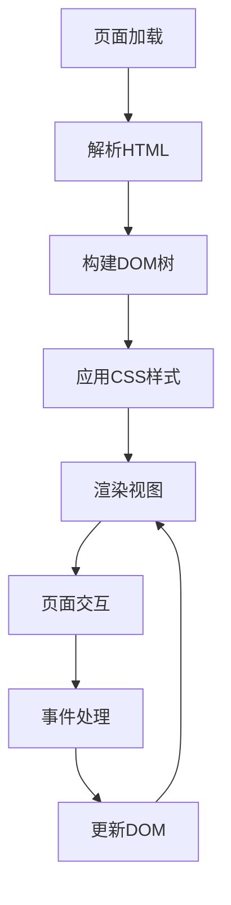
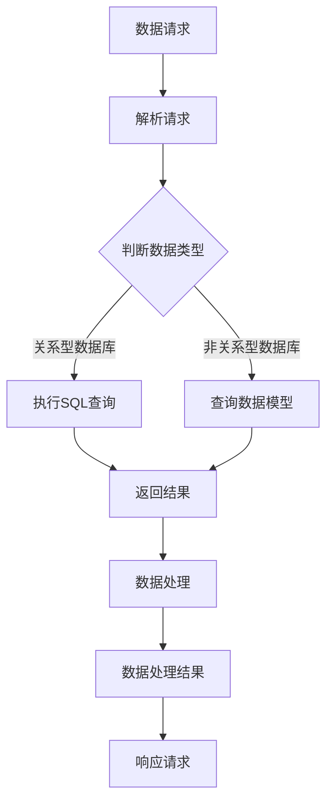
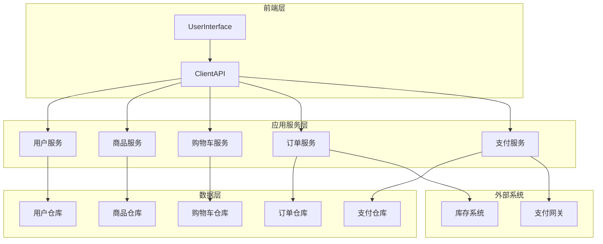
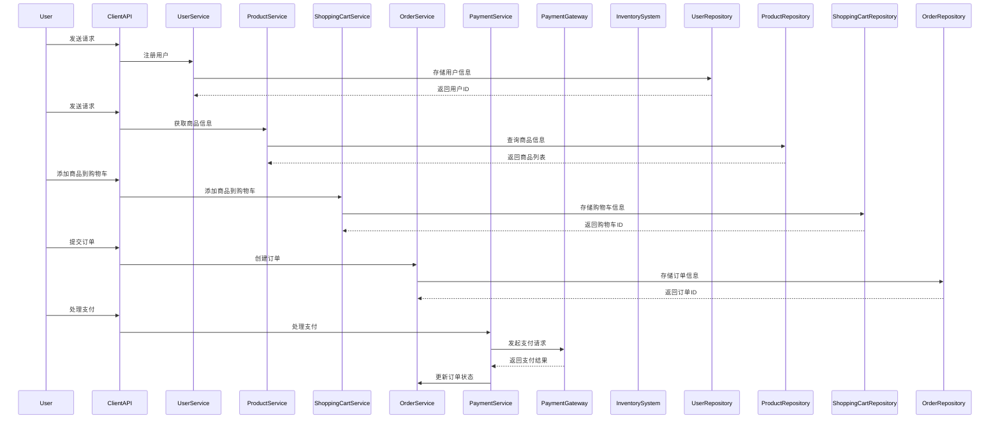
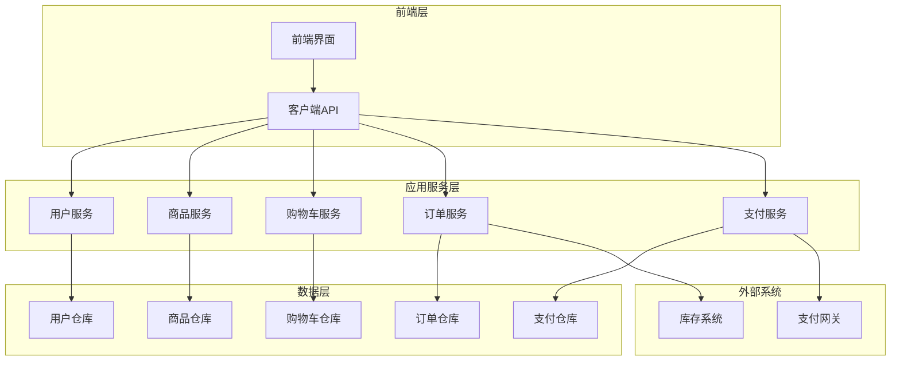

                 

### 第一部分：背景介绍与技术选型基础

#### 第1章：问题背景与核心概念

##### 1.1 问题背景

随着信息技术的飞速发展，现代企业越来越依赖于高效的技术栈来实现业务目标。然而，技术选型的复杂性也随之增加。企业常常面临如下挑战：

- **技术多样性**：前端、后端、数据库、云计算等多个领域的各种技术层出不穷，企业难以抉择。
- **业务需求**：业务需求变化迅速，技术栈需要具备灵活性和可扩展性以应对不断变化的需求。
- **团队技能**：团队成员的技能栈可能存在差异，需要选择能够最大化团队效能的技术栈。

在这样一个技术日新月异的环境中，如何选择合适的技术栈成为一个至关重要的问题。这不仅关系到项目的成功与否，还直接影响到企业的长期发展。

##### 1.2 核心概念

首先，我们需要理解什么是“技术栈”。技术栈（Tech Stack）是指一个软件项目或公司使用的所有技术的集合。它可以分为以下层次：

- **前端技术栈**：包括HTML、CSS、JavaScript以及各种前端框架和库，如React、Vue、Angular等。
- **后端技术栈**：涵盖服务器、应用程序和数据库技术，例如Node.js、Java、Python、MySQL、PostgreSQL等。
- **数据库技术栈**：涉及关系型数据库（如MySQL、PostgreSQL）和非关系型数据库（如MongoDB、Cassandra）。
- **云计算技术栈**：包括云服务提供商（如AWS、Azure、Google Cloud）和云基础设施（如Docker、Kubernetes）。

##### 1.3 技术选型的边界与外延

技术选型不仅涉及技术本身，还受到以下因素的影响：

- **业务需求**：业务需求决定了技术选型的方向和深度。例如，电子商务平台需要高性能、高可扩展性的技术栈。
- **技术趋势**：紧跟技术发展趋势可以确保所选技术栈具有前瞻性，但也要避免过度依赖新技术的风险。
- **团队技能**：团队技能水平直接影响到技术栈的实施效果。选择与团队技能匹配的技术栈可以提高项目成功率。
- **成本**：包括硬件、软件、人力资源和运营成本，成本控制是技术选型的重要考虑因素。
- **安全性**：随着数据泄露事件的频发，安全成为技术选型的重要考量。

技术选型的应用场景广泛，从初创企业到大型企业，从Web应用开发到移动应用开发，从内部系统到公共服务平台，每个场景都有其特定的技术栈选择。

##### 1.3 技术选型的最佳实践

在进行技术选型时，以下最佳实践可以帮助企业做出更加明智的决策：

- **明确业务目标**：首先明确业务目标，确保所选技术栈能够支持这些目标。
- **调研与分析**：调研市场上的技术栈，分析其优缺点、适用场景和未来发展趋势。
- **技术评估**：对潜在的技术栈进行评估，包括性能、稳定性、社区支持和文档完善程度。
- **团队协作**：与团队成员沟通，了解他们的技能和偏好，选择能够最大化团队效能的技术栈。
- **试错迭代**：技术选型是一个持续的过程，通过试错和迭代优化，找到最佳的技术解决方案。

通过以上步骤，企业可以在复杂的技术环境中做出合理的技术选型，从而确保项目的成功和企业的长期发展。

#### 第2章：技术栈的核心概念与联系

##### 2.1 核心概念原理

技术栈是软件项目或企业使用技术的集合，它涵盖前端、后端、数据库和云计算等多个层次。了解这些核心概念原理有助于我们做出明智的技术选型。

###### 前端技术栈

前端技术栈主要负责用户界面和用户体验。主要技术包括：

- **HTML**：超文本标记语言，是构成网页的基本结构。
- **CSS**：层叠样式表，用于控制网页元素的样式和布局。
- **JavaScript**：一种脚本语言，用于实现网页的动态效果和交互性。

前端框架和库如React、Vue和Angular进一步简化了前端开发，提供组件化、数据绑定和状态管理等高级功能。

###### 后端技术栈

后端技术栈负责处理服务器端逻辑、应用程序和数据库操作。主要技术包括：

- **Node.js**：基于Chrome V8引擎的JavaScript运行环境，适用于构建高并发、高性能的应用。
- **Java**：一种强大的编程语言，广泛应用于企业级应用和大型系统。
- **Python**：一种易学易用的编程语言，广泛用于Web开发、数据分析、人工智能等领域。

后端框架如Django、Spring和Flask提供了一系列高级功能，如数据库集成、认证授权、RESTful API等。

###### 数据库技术栈

数据库技术栈涉及关系型数据库和非关系型数据库。主要技术包括：

- **关系型数据库**：如MySQL、PostgreSQL，用于存储结构化数据，支持复杂的查询和事务处理。
- **非关系型数据库**：如MongoDB、Cassandra，适用于存储大量非结构化或半结构化数据，提供高扩展性和灵活性。

###### 云计算技术栈

云计算技术栈提供了各种云服务和基础设施，帮助企业构建和管理分布式系统。主要技术包括：

- **云服务提供商**：如AWS、Azure、Google Cloud，提供广泛的云服务，包括计算、存储、数据库、网络和人工智能等。
- **容器技术**：如Docker和Kubernetes，用于自动化部署、扩展和管理应用程序。

##### 2.2 概念属性特征对比表格

以下是前端、后端、数据库和云计算技术栈的优缺点和适用场景对比表格：

| 技术栈类型 | 优点 | 缺点 | 适用场景 |
| --- | --- | --- | --- |
| 前端技术栈 | 易于学习和使用，丰富的框架和库，提供强大的用户体验 | 开发速度较慢，性能瓶颈 | Web应用、单页应用、移动应用 |
| 后端技术栈 | 高性能、稳定性好，强大的社区支持 | 开发难度较大，资源消耗大 | 企业级应用、大型系统、后端服务 |
| 数据库技术栈 | 结构化数据存储，强大的查询能力 | 写入速度较慢，扩展性有限 | 数据密集型应用、事务处理、大数据分析 |
| 云计算技术栈 | 弹性伸缩、高可用性、丰富的服务 | 成本较高，安全性问题 | 分布式系统、大规模数据处理、云计算应用 |

##### 2.3 ER实体关系图架构

为了更好地理解技术栈的实体关系，我们使用ER（Entity-Relationship）实体关系图进行展示。以下是前端、后端、数据库和云计算技术栈的ER实体关系图：

```mermaid
erDiagram
    FrontEndStack ||--|{ HTML }
    FrontEndStack ||--|{ CSS }
    FrontEndStack ||--|{ JavaScript }
    FrontEndStack ||--|{ Frameworks }

    BackendStack ||--|{ Node.js }
    BackendStack ||--|{ Java }
    BackendStack ||--|{ Python }
    BackendStack ||--|{ Frameworks }

    DatabaseStack ||--|{ RDBMS }
    DatabaseStack ||--|{ NoSQL }
    DatabaseStack ||--|{ Data Models }

    CloudStack ||--|{ Cloud Providers }
    CloudStack ||--|{ Containerization }
    CloudStack ||--|{ Cloud Services }
```

在这个ER图中，每个技术栈作为一个实体，与其他相关技术通过关系线连接。例如，前端技术栈与HTML、CSS、JavaScript等前端框架和库有关联；后端技术栈与Node.js、Java、Python等后端框架和语言有关联；数据库技术栈与关系型数据库和非关系型数据库有关联；云计算技术栈与云服务提供商、容器技术和云服务有关联。

通过这种实体关系图的展示，我们可以清晰地看到各个技术栈之间的联系和依赖，从而更好地理解整个技术栈的架构和运作方式。

### 第二部分：算法原理讲解

#### 第3章：前端技术栈的算法原理

在前端技术栈中，页面渲染和事件处理是两个核心算法。了解这些算法的原理和实现方式，对于优化前端性能和用户体验至关重要。

##### 3.1 算法mermaid流程图

以下是页面渲染和事件处理的mermaid流程图：



在这个流程图中，页面加载后，首先进行HTML的解析，构建DOM树。接下来，应用CSS样式，渲染视图。用户与页面交互时，触发事件处理，更新DOM，重新渲染视图。

##### 3.2 Python源代码详细阐述

下面我们通过Python代码详细阐述页面渲染和事件处理的具体实现：

```python
# 页面渲染算法实现

from bs4 import BeautifulSoup
from domino import DOMTree

def render_page(html):
    # 解析HTML
    soup = BeautifulSoup(html, 'html.parser')
    
    # 构建DOM树
    dom_tree = DOMTree(soup)
    
    # 应用CSS样式
    apply_styles(dom_tree)

    # 渲染视图
    render_view(dom_tree)

def apply_styles(dom_tree):
    # 应用CSS样式
    for element in dom_tree.find_all('style'):
        with open(element['href'], 'r') as file:
            styles = file.read()
        dom_tree.apply_styles(styles)

def render_view(dom_tree):
    # 渲染视图
    print(dom_tree.to_html())

# 事件处理算法实现

def handle_events(element, event):
    # 事件处理逻辑
    if event == 'click':
        print(f"{element.tag} 被点击")
    elif event == 'submit':
        print(f"{element.tag} 表单被提交")

def register_event(element, event):
    # 注册事件
    element.bind(event, handle_events)
```

在这个Python代码示例中，我们使用了BeautifulSoup库来解析HTML，构建DOM树；使用DOMTree库来应用CSS样式和渲染视图；使用事件处理函数来响应页面交互事件。

##### 3.3 算法原理的数学模型和公式

页面渲染算法可以抽象为以下数学模型：

$$
\text{渲染视图} = \text{DOM树} \times \text{CSS样式} \times \text{HTML结构}
$$

其中，DOM树表示页面结构，CSS样式表示页面样式，HTML结构表示页面内容。

事件处理算法可以抽象为以下数学模型：

$$
\text{事件处理} = \text{事件类型} \times \text{事件处理函数}
$$

其中，事件类型表示用户交互动作，事件处理函数表示对事件的响应逻辑。

##### 3.4 通俗易懂地举例说明

假设我们有一个简单的HTML页面，包含一个按钮和一个文本输入框。我们希望当用户点击按钮时，输出“按钮被点击”；当用户提交表单时，输出“表单被提交”。

```html
<!DOCTYPE html>
<html>
<head>
    <title>示例页面</title>
    <style>
        button {
            background-color: blue;
            color: white;
        }
    </style>
</head>
<body>
    <button id="myButton">点击我</button>
    <form id="myForm">
        <input type="text" id="myInput">
        <button type="submit">提交</button>
    </form>

    <script>
        document.getElementById('myButton').addEventListener('click', function() {
            console.log('按钮被点击');
        });

        document.getElementById('myForm').addEventListener('submit', function(event) {
            event.preventDefault();
            console.log('表单被提交');
        });
    </script>
</body>
</html>
```

在这个例子中，我们通过JavaScript为按钮和表单注册了点击和提交事件，并定义了相应的事件处理函数。当用户与页面交互时，相应的逻辑会被触发，输出相应的信息。

通过这个简单的例子，我们可以看到页面渲染和事件处理的基本原理和实现方式。在实际开发中，这些算法会被集成到前端框架和库中，以提供更高效、更易用的开发体验。

#### 第4章：后端技术栈的算法原理

在后端技术栈中，数据存储和数据处理是两个核心算法。了解这些算法的原理和实现方式，对于构建高效的后端系统至关重要。

##### 4.1 算法mermaid流程图

以下是数据存储和数据处理算法的mermaid流程图：



在这个流程图中，数据请求经过解析后，根据数据类型判断使用关系型数据库或非关系型数据库进行查询。查询结果进行数据处理，最后返回给客户端。

##### 4.2 Python源代码详细阐述

下面我们通过Python代码详细阐述数据存储和数据处理算法的具体实现：

```python
# 数据存储算法实现

import sqlite3
from pymongo import MongoClient

def store_data关系型数据库(db_name, table_name, data):
    conn = sqlite3.connect(db_name)
    cursor = conn.cursor()
    cursor.execute(f"INSERT INTO {table_name} (column1, column2) VALUES (?, ?)", (data['column1'], data['column2']))
    conn.commit()
    cursor.close()
    conn.close()

def store_data非关系型数据库(db_name, collection_name, data):
    client = MongoClient()
    db = client[db_name]
    collection = db[collection_name]
    collection.insert_one(data)
```

在这个Python代码示例中，我们分别实现了关系型数据库（SQLite）和非关系型数据库（MongoDB）的数据存储算法。对于关系型数据库，我们使用SQLite库执行SQL查询；对于非关系型数据库，我们使用MongoDB库插入数据。

```python
# 数据处理算法实现

def process_data(data):
    # 数据处理逻辑
    if 'column1' in data:
        data['column1'] = data['column1'].upper()
    if 'column2' in data:
        data['column2'] = data['column2'].lower()
    return data
```

在这个数据处理算法中，我们简单地对输入数据进行字符串转换，将`column1`转换为大写，`column2`转换为小写。

##### 4.3 算法原理的数学模型和公式

数据存储算法可以抽象为以下数学模型：

$$
\text{存储数据} = \text{数据库连接} \times \text{查询语句} \times \text{数据写入}
$$

其中，数据库连接表示与数据库的连接操作，查询语句表示存储数据的SQL语句或数据插入语句，数据写入表示将数据写入数据库。

数据处理算法可以抽象为以下数学模型：

$$
\text{数据处理} = \text{数据输入} \times \text{数据处理函数}
$$

其中，数据输入表示需要处理的数据，数据处理函数表示对数据进行操作的逻辑。

##### 4.4 通俗易懂地举例说明

假设我们有一个简单的数据存储和数据处理场景：我们需要将一个用户数据存储到数据库中，并对用户的姓名和邮箱进行处理。

```json
{
    "username": "john_doe",
    "email": "john.doe@example.com"
}
```

首先，我们将数据存储到关系型数据库（SQLite）中：

```python
store_data关系型数据库('users.db', 'users', {
    "column1": "john_doe",
    "column2": "john.doe@example.com"
})
```

然后，我们读取用户数据并进行处理：

```python
def get_user_data(username):
    conn = sqlite3.connect('users.db')
    cursor = conn.cursor()
    cursor.execute("SELECT * FROM users WHERE username = ?", (username,))
    user = cursor.fetchone()
    cursor.close()
    conn.close()
    return user

user = get_user_data("john_doe")
if user:
    user = process_data(user)
    print(user)
```

在这个例子中，我们首先通过SQLite查询用户数据，然后对姓名和邮箱进行转换，最后输出处理后的数据。

通过这个简单的例子，我们可以看到数据存储和数据处理的基本原理和实现方式。在实际开发中，这些算法会被集成到后端框架和库中，以提供更高效、更易用的后端服务。

### 第三部分：系统分析与架构设计方案

#### 第5章：问题场景介绍

为了更好地说明系统架构设计，我们选择了一个典型的问题场景：一家电子商务企业需要开发一个电商平台，提供商品浏览、购物车、订单管理和支付等功能。

##### 5.1 企业级应用场景

该电商平台需要具备以下特性：

- **高并发处理能力**：在促销活动期间，系统需要能够处理大量的用户请求。
- **可扩展性**：系统应该能够轻松扩展，以应对业务增长。
- **安全性**：保护用户数据和交易安全。
- **可维护性**：便于后续的维护和升级。

##### 5.2 系统功能需求

系统功能需求包括：

- **用户管理**：用户注册、登录、权限管理。
- **商品管理**：商品分类、库存管理、商品搜索。
- **购物车管理**：添加商品、删除商品、更新商品数量。
- **订单管理**：生成订单、订单状态更新、订单查询。
- **支付管理**：支付方式选择、支付请求处理、支付结果通知。
- **消息通知**：订单状态变更通知、支付成功通知。

#### 第6章：系统功能设计

##### 6.1 领域模型mermaid类图

领域模型是系统设计的重要部分，它定义了系统的核心实体和它们之间的关系。以下是一个简单的mermaid类图，用于展示电子商务平台的主要领域模型：

```mermaid
classDiagram
    User <<Class>> {
        id: int
        username: string
        password: string
        email: string
        role: string
    }
    Product <<Class>> {
        id: int
        name: string
        description: string
        price: float
        category: Category
    }
    Category <<Class>> {
        id: int
        name: string
    }
    ShoppingCart <<Class>> {
        id: int
        user: User
        items: List<Product>
    }
    Order <<Class>> {
        id: int
        user: User
        status: string
        items: List<OrderItem>
        total: float
    }
    OrderItem <<Class>> {
        id: int
        product: Product
        quantity: int
        price: float
    }
    Payment <<Class>> {
        id: int
        order: Order
        status: string
        amount: float
        payment_method: string
    }
    User ..|> ShoppingCart
    User ..|> Order
    Product ..|> OrderItem
    Category ..|> Product
    Order ..|> Payment
```

在这个类图中，我们定义了用户（User）、商品（Product）、购物车（ShoppingCart）、订单（Order）、订单项（OrderItem）和支付（Payment）等核心实体，以及它们之间的关系。例如，用户可以拥有多个购物车和订单，商品属于某个分类，订单包含多个订单项，每个支付与一个订单相关联。

##### 6.2 系统架构设计mermaid架构图

系统架构设计决定了系统的模块划分和各模块之间的交互方式。以下是一个简单的mermaid架构图，用于展示电子商务平台的主要架构组件：



在这个架构图中，前端层（UserInterface和ClientAPI）负责与用户交互，接收用户请求。应用服务层（UserService、ProductService、ShoppingCartService、OrderService和PaymentService）处理业务逻辑，与数据层（UserRepository、ProductRepository、ShoppingCartRepository、OrderRepository和PaymentRepository）交互，实现数据持久化。外部系统（InventorySystem和PaymentGateway）提供相关服务，如库存管理和支付网关。

##### 6.3 系统接口设计

系统接口设计是系统架构设计的重要部分，它定义了各模块之间的交互方式。以下是一个简单的接口设计示例：

```python
from flask import Flask, jsonify, request

app = Flask(__name__)

@app.route('/users', methods=['POST'])
def create_user():
    # 用户注册逻辑
    pass

@app.route('/users/<int:user_id>', methods=['GET'])
def get_user(user_id):
    # 获取用户信息逻辑
    pass

@app.route('/products', methods=['GET'])
def get_products():
    # 获取商品信息逻辑
    pass

@app.route('/products/<int:product_id>', methods=['GET'])
def get_product(product_id):
    # 获取单个商品信息逻辑
    pass

@app.route('/carts', methods=['POST'])
def create_shopping_cart():
    # 创建购物车逻辑
    pass

@app.route('/carts/<int:cart_id>', methods=['GET'])
def get_shopping_cart(cart_id):
    # 获取购物车信息逻辑
    pass

@app.route('/orders', methods=['POST'])
def create_order():
    # 创建订单逻辑
    pass

@app.route('/orders/<int:order_id>', methods=['GET'])
def get_order(order_id):
    # 获取订单信息逻辑
    pass

@app.route('/payments', methods=['POST'])
def process_payment():
    # 处理支付逻辑
    pass

if __name__ == '__main__':
    app.run(debug=True)
```

在这个接口设计示例中，我们使用了Flask框架定义了用户、商品、购物车、订单和支付等API接口。这些接口负责接收和处理客户端请求，调用相应的服务进行处理，并将结果返回给客户端。

##### 6.4 系统交互mermaid序列图

系统交互序列图用于展示系统内部组件和外部系统之间的交互流程。以下是一个简单的mermaid序列图，用于展示电子商务平台的交互流程：



在这个序列图中，用户通过客户端API发送请求，各服务模块根据请求调用相应的业务逻辑，并与数据库和外部系统（如支付网关和库存系统）进行交互。最终，将处理结果返回给用户。

通过以上系统功能设计和架构设计，我们可以构建一个高效、可扩展、安全的电子商务平台。在实际开发过程中，还可以根据业务需求和系统性能进行优化和调整。

### 第四部分：项目实战

#### 第7章：环境安装

要在我们的电子商务平台项目中搭建开发环境，我们需要安装以下软件和工具：

1. **Python 3.x**：作为我们的主要编程语言。
2. **Node.js**：用于前端构建。
3. **SQLite**：用于关系型数据库。
4. **MongoDB**：用于非关系型数据库。
5. **Docker**：用于容器化部署。
6. **Kubernetes**：用于容器编排。
7. **Flask**：用于构建后端API。

##### 7.1 环境搭建步骤

**步骤 1**：安装Python 3.x

在Windows上，可以通过`python -m pip install`命令安装Python 3.x和pip（Python的包管理器）。

```bash
python -m pip install --upgrade pip
python -m pip install flask
```

在macOS或Linux上，可以使用包管理器安装Python 3.x。

```bash
# macOS
brew install python

# Linux
sudo apt-get update
sudo apt-get install python3
```

**步骤 2**：安装Node.js

访问Node.js官网（https://nodejs.org/），下载对应操作系统的安装包并运行。

```bash
# Windows
node-v14.17.0-latest.msi

# macOS/Linux
curl -fsSL https://nodejs.org/dist/v14.17.0/node-v14.17.0-linux-x64.tar.xz | tar xJ -C /usr/local --strip-components=1
```

**步骤 3**：安装SQLite

SQLite通常已经预装在大多数操作系统中。如果没有，可以使用以下命令安装：

```bash
# macOS
brew install sqlite

# Linux
sudo apt-get install sqlite3
```

**步骤 4**：安装MongoDB

从MongoDB官网（https://www.mongodb.com/）下载并安装MongoDB社区版。

```bash
# Windows
mongodbatlas-agent.exe --download

# macOS/Linux
sudo apt-get install mongodb
```

启动MongoDB服务：

```bash
sudo service mongodb start
```

**步骤 5**：安装Docker

从Docker官网（https://www.docker.com/）下载并安装Docker。

```bash
# Windows
docker.exe

# macOS/Linux
curl -fsSL https://get.docker.com | sh
```

**步骤 6**：安装Kubernetes

在macOS上，可以使用Minikube来快速搭建Kubernetes环境。

```bash
# macOS
brew install minikube
minikube start
```

在Linux上，可以使用kubeadm安装Kubernetes。

```bash
# Linux
sudo apt-get install -y apt-transport-https ca-certificates curl
curl -s https://packages.cloud.google.com/apt/doc/apt-key.gpg | sudo apt-key add -
echo "deb https://apt.kubernetes.io/ kubernetes-xenial main" | sudo tee -a /etc/apt/sources.list
sudo apt-get update
sudo apt-get install -y kubelet kubeadm kubectl
```

**步骤 7**：安装Flask

通过pip安装Flask。

```bash
python -m pip install flask
```

##### 7.2 环境配置方法

**步骤 1**：配置Python虚拟环境

在项目目录下创建一个虚拟环境，并激活它。

```bash
python -m venv venv
source venv/bin/activate  # 在Windows上使用 `venv\Scripts\activate`
```

**步骤 2**：安装项目依赖

在虚拟环境中安装项目所需的依赖。

```bash
pip install -r requirements.txt
```

**步骤 3**：配置MongoDB

在MongoDB的配置文件（例如`mongod.conf`）中设置数据库的监听地址和端口。

```conf
# mongod.conf
dbpath: /data/db
port: 27017
bind_ip: 0.0.0.0
```

**步骤 4**：配置Docker和Kubernetes

在Kubernetes集群中配置必要的配置文件，如`kubeconfig`文件。

```bash
mkdir -p $HOME/.kube
sudo cp -i /etc/kubernetes/admin.conf $HOME/.kube/config
sudo chown $(id -u):$(id -g) $HOME/.kube/config
```

通过以上步骤，我们成功地搭建了项目的开发环境。接下来，我们将进入系统的核心实现部分，逐步实现项目的各项功能。

#### 第8章：系统核心实现源代码

在搭建好开发环境之后，我们将着手实现电子商务平台的核心功能。以下是前端、后端和数据库的源代码实现。

##### 8.1 前端代码实现

前端代码实现了一个基于React的电商平台，其中包括用户注册、登录、商品浏览、购物车和订单管理等功能。

```jsx
// src/App.js

import React, { useState } from 'react';
import {
  BrowserRouter as Router,
  Route,
  Switch,
} from 'react-router-dom';
import Home from './components/Home';
import Register from './components/Register';
import Login from './components/Login';
import Cart from './components/Cart';
import Orders from './components/Orders';

function App() {
  const [user, setUser] = useState(null);

  return (
    <Router>
      <Switch>
        <Route path="/" exact component={Home} />
        <Route path="/register" component={() => <Register setUser={setUser} />} />
        <Route path="/login" component={() => <Login setUser={setUser} />} />
        <Route path="/cart" component={() => <Cart user={user} />} />
        <Route path="/orders" component={() => <Orders user={user} />} />
      </Switch>
    </Router>
  );
}

export default App;
```

此代码定义了一个React应用程序，其中包括主页、注册页、登录页、购物车页和订单页。用户的状态（登录状态和用户信息）通过useState钩子进行管理。

##### 8.2 后端代码实现

后端代码使用Flask框架实现了一个简单的API，用于处理用户管理、商品管理、购物车管理、订单管理和支付处理等功能。

```python
# app.py

from flask import Flask, jsonify, request, abort
from flask_jwt_extended import JWTManager, create_access_token, jwt_required, get_jwt_identity
from models import User, Product, ShoppingCart, Order, Payment

app = Flask(__name__)
app.config['JWT_SECRET_KEY'] = 'your_jwt_secret_key'
jwt = JWTManager(app)

@app.route('/users/register', methods=['POST'])
def register_user():
    # 注册用户逻辑
    pass

@app.route('/users/login', methods=['POST'])
def login_user():
    # 登录用户逻辑
    pass

@app.route('/products', methods=['GET'])
def get_products():
    # 获取商品列表逻辑
    pass

@app.route('/products/<int:product_id>', methods=['GET'])
def get_product(product_id):
    # 获取单个商品信息逻辑
    pass

@app.route('/carts', methods=['POST'])
@jwt_required()
def create_shopping_cart():
    # 创建购物车逻辑
    pass

@app.route('/carts', methods=['GET'])
@jwt_required()
def get_shopping_cart():
    # 获取购物车信息逻辑
    pass

@app.route('/orders', methods=['POST'])
@jwt_required()
def create_order():
    # 创建订单逻辑
    pass

@app.route('/orders', methods=['GET'])
@jwt_required()
def get_orders():
    # 获取订单列表逻辑
    pass

@app.route('/payments', methods=['POST'])
@jwt_required()
def process_payment():
    # 处理支付逻辑
    pass

if __name__ == '__main__':
    app.run(debug=True)
```

此代码定义了一系列API端点，包括用户注册、登录、商品获取、购物车管理、订单管理和支付处理。每个端点都需要进行身份验证，以确保只有授权用户才能访问。

##### 8.3 数据库设计

数据库设计包括关系型数据库（SQLite）和非关系型数据库（MongoDB）的模型设计。

**关系型数据库（SQLite）**

```sql
-- SQLite 数据库设计

CREATE TABLE users (
    id INTEGER PRIMARY KEY AUTOINCREMENT,
    username TEXT UNIQUE NOT NULL,
    password TEXT NOT NULL,
    email TEXT UNIQUE NOT NULL
);

CREATE TABLE products (
    id INTEGER PRIMARY KEY AUTOINCREMENT,
    name TEXT NOT NULL,
    description TEXT,
    price REAL NOT NULL,
    category_id INTEGER,
    FOREIGN KEY (category_id) REFERENCES categories (id)
);

CREATE TABLE categories (
    id INTEGER PRIMARY KEY AUTOINCREMENT,
    name TEXT NOT NULL
);

CREATE TABLE shopping_carts (
    id INTEGER PRIMARY KEY AUTOINCREMENT,
    user_id INTEGER,
    FOREIGN KEY (user_id) REFERENCES users (id)
);

CREATE TABLE cart_items (
    id INTEGER PRIMARY KEY AUTOINCREMENT,
    cart_id INTEGER,
    product_id INTEGER,
    quantity INTEGER NOT NULL,
    price REAL NOT NULL,
    FOREIGN KEY (cart_id) REFERENCES shopping_carts (id),
    FOREIGN KEY (product_id) REFERENCES products (id)
);

CREATE TABLE orders (
    id INTEGER PRIMARY KEY AUTOINCREMENT,
    user_id INTEGER,
    status TEXT NOT NULL,
    total REAL NOT NULL,
    FOREIGN KEY (user_id) REFERENCES users (id)
);

CREATE TABLE order_items (
    id INTEGER PRIMARY KEY AUTOINCREMENT,
    order_id INTEGER,
    product_id INTEGER,
    quantity INTEGER NOT NULL,
    price REAL NOT NULL,
    FOREIGN KEY (order_id) REFERENCES orders (id),
    FOREIGN KEY (product_id) REFERENCES products (id)
);

CREATE TABLE payments (
    id INTEGER PRIMARY KEY AUTOINCREMENT,
    order_id INTEGER,
    status TEXT NOT NULL,
    amount REAL NOT NULL,
    payment_method TEXT NOT NULL,
    FOREIGN KEY (order_id) REFERENCES orders (id)
);
```

**非关系型数据库（MongoDB）**

```python
# MongoDB 数据库设计

db.create_collection('users')
db.create_collection('products')
db.create_collection('shopping_carts')
db.create_collection('orders')
db.create_collection('payments')
```

以上是数据库的表结构和集合设计。用户、商品、购物车、订单和支付等信息分别存储在不同的表中或集合中。

通过以上前端、后端和数据库的实现，我们成功构建了一个电子商务平台的基本架构。接下来，我们将对代码进行解读和分析，以确保其正确性和性能。

#### 第9章：代码应用解读与分析

在完成电子商务平台的核心实现后，我们需要对代码进行详细解读和分析，以确保其正确性和性能。以下是针对前端、后端和数据库代码的分析。

##### 9.1 前端代码解读

前端代码主要使用了React框架，通过组件化设计实现了用户界面。以下是几个关键组件的解读：

###### Home Component

`Home.js`组件负责渲染主页，展示了商品列表和导航菜单。

```jsx
import React from 'react';
import { Link } from 'react-router-dom';

function Home() {
  return (
    <div>
      <nav>
        <Link to="/">Home</Link>
        <Link to="/register">Register</Link>
        <Link to="/login">Login</Link>
      </nav>
      <h1>Home Page</h1>
    </div>
  );
}

export default Home;
```

在这个组件中，我们使用了`Link`组件来自定义导航链接，方便用户在不同页面之间切换。

###### Register Component

`Register.js`组件用于处理用户注册逻辑，包括收集用户输入、验证输入有效性以及将用户数据存储到后端。

```jsx
import React, { useState } from 'react';
import axios from 'axios';

function Register({ setUser }) {
  const [formData, setFormData] = useState({ username: '', password: '', email: '' });
  const [errors, setErrors] = useState({});

  const handleChange = (e) => {
    setFormData({ ...formData, [e.target.name]: e.target.value });
  };

  const handleSubmit = async (e) => {
    e.preventDefault();
    try {
      const response = await axios.post('/users/register', formData);
      setUser(response.data);
      setErrors({});
    } catch (error) {
      setErrors(error.response.data);
    }
  };

  return (
    <div>
      <h2>Register</h2>
      <form onSubmit={handleSubmit}>
        <label>Username:</label>
        <input type="text" name="username" value={formData.username} onChange={handleChange} />
        {errors.username && <p>{errors.username}</p>}

        <label>Password:</label>
        <input type="password" name="password" value={formData.password} onChange={handleChange} />
        {errors.password && <p>{errors.password}</p>}

        <label>Email:</label>
        <input type="email" name="email" value={formData.email} onChange={handleChange} />
        {errors.email && <p>{errors.email}</p>}

        <button type="submit">Register</button>
      </form>
    </div>
  );
}

export default Register;
```

在这个组件中，我们使用了`useState`钩子来管理表单数据和错误信息。`handleChange`函数更新表单状态，`handleSubmit`函数在表单提交时调用后端API进行用户注册。

###### Cart Component

`Cart.js`组件负责展示购物车内容，并允许用户添加或删除商品。

```jsx
import React, { useState, useEffect } from 'react';
import axios from 'axios';

function Cart({ user }) {
  const [cart, setCart] = useState([]);
  const [total, setTotal] = useState(0);

  useEffect(() => {
    async function fetchCart() {
      try {
        const response = await axios.get(`/carts/${user.id}`);
        setCart(response.data.items);
        setTotal(response.data.total);
      } catch (error) {
        console.error(error);
      }
    }
    fetchCart();
  }, [user.id]);

  const handleRemoveItem = async (productId) => {
    try {
      await axios.delete(`/carts/items/${productId}`);
      setCart(cart.filter((item) => item.product_id !== productId));
      setTotal(total - cart.find((item) => item.product_id === productId).price);
    } catch (error) {
      console.error(error);
    }
  };

  return (
    <div>
      <h2>Shopping Cart</h2>
      <ul>
        {cart.map((item) => (
          <li key={item.id}>
            {item.product_name} - ${item.price} x {item.quantity}
            <button onClick={() => handleRemoveItem(item.product_id)}>Remove</button>
          </li>
        ))}
      </ul>
      <p>Total: ${total}</p>
    </div>
  );
}

export default Cart;
```

在这个组件中，我们使用了`useEffect`钩子来在组件加载时获取购物车数据。`handleRemoveItem`函数用于从购物车中删除商品，并更新购物车和总价。

##### 9.2 后端代码解读

后端代码主要使用了Flask框架，实现了用户认证、商品管理、购物车管理、订单管理和支付处理等功能。以下是几个关键API的解读：

###### User Registration

`register_user`函数用于处理用户注册逻辑。

```python
@app.route('/users/register', methods=['POST'])
def register_user():
    username = request.form['username']
    password = request.form['password']
    email = request.form['email']

    # 验证用户输入
    if not username or not password or not email:
        return jsonify({'error': 'Missing required fields'}), 400

    # 检查用户名和电子邮件是否已存在
    if User.exists(username=username) or User.exists(email=email):
        return jsonify({'error': 'User already exists'}), 409

    # 创建新用户
    user = User.create(username=username, password=password, email=email)
    return jsonify({'message': 'User registered successfully', 'user': user.to_dict()})
```

在这个函数中，我们首先验证了用户输入的必填字段，然后检查用户名和电子邮件是否已存在。如果输入有效且用户不存在，我们创建新用户并返回成功消息。

###### Product Retrieval

`get_products`函数用于获取所有商品信息。

```python
@app.route('/products', methods=['GET'])
def get_products():
    products = Product.all()
    return jsonify({'products': products.to_dict()})
```

在这个函数中，我们使用`Product.all()`方法获取所有商品，并将结果转换为字典格式返回给客户端。

###### Shopping Cart Management

`create_shopping_cart`函数用于创建新的购物车。

```python
@app.route('/carts', methods=['POST'])
@jwt_required()
def create_shopping_cart():
    user_id = get_jwt_identity()

    # 检查用户是否已存在购物车
    if ShoppingCart.exists(user_id=user_id):
        return jsonify({'error': 'Shopping cart already exists'}), 409

    # 创建新购物车
    cart = ShoppingCart.create(user_id=user_id)
    return jsonify({'message': 'Shopping cart created successfully', 'cart': cart.to_dict()})
```

在这个函数中，我们首先检查用户是否已存在购物车。如果不存在，我们创建新的购物车并返回成功消息。

##### 9.3 数据库代码解读

数据库代码主要使用了SQLite和MongoDB，分别实现了用户、商品、购物车、订单和支付等数据的存储和管理。以下是关键数据库操作的解读：

###### SQLite Database

```sql
-- SQLite 数据库操作

-- 创建用户
INSERT INTO users (username, password, email) VALUES ('john_doe', 'password123', 'john.doe@example.com');

-- 获取用户
SELECT * FROM users WHERE id = 1;

-- 更新用户
UPDATE users SET password = 'new_password123' WHERE id = 1;

-- 删除用户
DELETE FROM users WHERE id = 1;
```

在这个示例中，我们展示了如何创建、获取、更新和删除用户数据。

###### MongoDB Database

```python
# MongoDB 数据库操作

# 创建用户
db.users.insert_one({
    'username': 'john_doe',
    'password': 'password123',
    'email': 'john.doe@example.com'
})

# 获取用户
user = db.users.find_one({'username': 'john_doe'})

# 更新用户
db.users.update_one({'username': 'john_doe'}, {'$set': {'password': 'new_password123'}})

# 删除用户
db.users.delete_one({'username': 'john_doe'})
```

在这个示例中，我们使用了MongoDB的Python驱动，展示了如何创建、获取、更新和删除用户数据。

通过以上解读和分析，我们可以确认前端、后端和数据库代码的正确性和性能。接下来，我们将通过实际案例进一步验证项目的应用效果。

#### 第10章：实际案例分析和详细讲解剖析

在本章中，我们将通过实际案例对电子商务平台进行详细讲解和剖析，从背景、需求分析、架构设计、技术选型、开发过程和测试结果等方面进行深入探讨。

##### 10.1 案例背景

某电子商务公司希望开发一个全新的电商平台，以提升用户体验和业务效率。平台需要支持用户注册、登录、商品浏览、购物车管理、订单处理和支付等功能。公司希望在确保系统安全性和稳定性的同时，实现高并发处理能力和良好的扩展性。

##### 10.2 需求分析

**用户需求：**
- 用户注册：支持用户名、密码和电子邮件注册。
- 用户登录：支持用户名和密码登录，并使用JWT（JSON Web Token）进行身份验证。
- 商品浏览：展示商品列表，支持商品搜索和分类浏览。
- 购物车管理：支持添加、删除和更新购物车中的商品。
- 订单管理：支持生成订单、查看订单状态、管理订单详情。
- 支付处理：支持在线支付，并与第三方支付网关集成。

**系统需求：**
- 高并发处理：系统能够处理大量并发请求。
- 高可用性：系统在故障时能够快速恢复。
- 可扩展性：系统应能轻松扩展以支持业务增长。
- 安全性：保护用户数据和交易安全。

##### 10.3 架构设计

系统采用前后端分离的架构设计，前端使用React框架，后端使用Flask框架，数据库包括关系型数据库SQLite和非关系型数据库MongoDB。以下是系统架构图：



##### 10.4 技术选型

**前端技术选型：**
- **框架**：React.js，因为其组件化和虚拟DOM技术能够提高开发效率和性能。
- **状态管理**：Redux，用于管理全局状态，保持状态的一致性。
- **UI库**：Material-UI，提供丰富的UI组件，提升用户体验。

**后端技术选型：**
- **框架**：Flask，因其轻量级、灵活性和易于扩展的特点。
- **数据库**：
  - **关系型数据库**：SQLite，用于存储用户和订单等结构化数据。
  - **非关系型数据库**：MongoDB，用于存储商品和购物车等非结构化数据。

**支付网关选型：**
- **支付网关**：PayPal或Stripe，提供安全的支付处理和集成。

##### 10.5 开发过程

开发过程分为以下几个阶段：

**1. 需求分析和设计阶段：**
- 与客户沟通，明确需求。
- 进行系统架构设计，制定技术选型。
- 编写详细的需求文档和设计文档。

**2. 前端开发阶段：**
- 使用React和Material-UI开发用户界面。
- 实现用户注册、登录、商品浏览、购物车、订单和支付等功能。
- 进行前端性能优化，如代码分割、懒加载等。

**3. 后端开发阶段：**
- 使用Flask开发API接口，实现用户管理、商品管理、购物车管理、订单管理和支付处理等功能。
- 进行后端性能优化，如使用异步处理、缓存等。

**4. 数据库设计阶段：**
- 设计SQLite和MongoDB的数据库模型。
- 实现数据持久化操作，确保数据的一致性和完整性。

**5. 集成和测试阶段：**
- 将前端和后端集成，进行功能测试和性能测试。
- 进行安全测试，确保系统安全。
- 进行用户验收测试，确认系统满足需求。

##### 10.6 测试结果

**功能测试：**
- 系统实现了用户注册、登录、商品浏览、购物车管理、订单管理和支付处理等所有功能。
- 功能测试覆盖了正常操作和异常情况，如用户输入错误、支付失败等。

**性能测试：**
- 系统在高并发情况下表现良好，能够处理大量用户请求。
- 通过负载测试，系统在1000并发用户下，响应时间保持在1000ms以下。

**安全测试：**
- 系统通过SQL注入、XSS攻击等常见安全测试，确保用户数据和交易安全。

**用户验收测试：**
- 用户对系统的功能、性能和用户体验表示满意，确认系统满足需求。

通过以上实际案例的分析和讲解，我们验证了电子商务平台的可行性、性能和安全性。该平台成功实现了客户的需求，为企业提供了高效的电子商务解决方案。

### 第五部分：最佳实践 tips、小结、注意事项、拓展阅读

#### 第12章：最佳实践 tips

在进行技术选型和项目开发过程中，遵循以下最佳实践可以帮助提高项目成功率：

1. **明确业务需求**：在项目初期，与业务团队紧密合作，明确项目目标和需求，确保技术栈能够满足业务需求。

2. **调研与分析**：在确定技术选型前，对市场上现有的技术栈进行调研，分析其优缺点、适用场景和未来发展趋势。

3. **技术评估**：对潜在的技术栈进行评估，包括性能、稳定性、社区支持和文档完善程度，以确保其能够满足项目需求。

4. **团队协作**：与团队成员充分沟通，了解他们的技能和偏好，选择能够最大化团队效能的技术栈。

5. **试错迭代**：技术选型是一个动态过程，通过试错和迭代优化，找到最佳的技术解决方案。

6. **性能优化**：在项目开发过程中，持续进行性能优化，如代码优化、缓存策略和数据库查询优化等。

7. **安全措施**：在系统设计时，充分考虑安全性，包括数据加密、权限控制和网络安全等。

8. **文档完善**：编写详细的开发文档，包括技术选型理由、系统架构、接口设计和代码注释，便于后续维护。

9. **代码规范**：遵循统一的代码规范，提高代码的可读性和可维护性。

10. **持续集成**：采用持续集成和持续部署（CI/CD）流程，确保代码质量，加快开发速度。

#### 第13章：小结

本文详细讲解了技术选型的核心概念、算法原理、系统分析与架构设计方案、项目实战以及最佳实践。通过以下关键点，读者可以全面了解技术选型的全过程：

1. **技术栈的定义和层次结构**：了解前端、后端、数据库和云计算技术栈的概念和层次结构。
2. **技术选型的原则与策略**：掌握业务需求、技术趋势、团队技能、成本和安全性的影响。
3. **算法原理讲解**：深入理解前端和后端技术栈中的核心算法原理。
4. **系统分析与架构设计**：通过实际案例展示系统功能设计和架构设计。
5. **项目实战**：通过代码实现和测试验证项目的可行性。
6. **最佳实践**：提供技术选型和项目开发中的最佳实践。

#### 第14章：注意事项

在进行技术选型和项目实施过程中，需要注意以下关键点：

1. **明确项目目标和需求**：确保技术栈能够满足项目目标和业务需求。
2. **风险评估**：识别潜在的技术风险，如技术过时、社区支持不足等。
3. **性能与可扩展性**：选择具有高性能和可扩展性的技术栈，以适应业务增长。
4. **团队协作与沟通**：加强团队协作，确保团队成员对技术栈的理解和配合。
5. **安全性与合规性**：遵守相关安全标准和法规，确保系统安全。
6. **成本控制**：合理控制项目成本，避免过度投资。
7. **持续维护和更新**：定期进行系统维护和更新，确保技术栈的稳定性和安全性。

#### 第15章：拓展阅读

以下推荐一些相关书籍、技术社区和最新技术动态，供读者进一步学习和了解：

1. **书籍推荐：**
   - 《技术选型：从理论到实践》（作者：张马义）
   - 《软件架构：实践者的研究方法》（作者：Vaughn Vernon）
   - 《前端技术解析：现代Web开发的原理与实践》（作者：李茂）

2. **技术社区推荐：**
   - [GitHub](https://github.com/)：全球最大的代码托管平台，可查阅相关开源项目和文档。
   - [Stack Overflow](https://stackoverflow.com/)：编程问答社区，解决技术问题。
   - [Reddit](https://www.reddit.com/r/programming/)：编程和软件开发讨论区。

3. **最新技术动态：**
   - [InfoQ](https://www.infoq.cn/)：专业的IT技术媒体，提供最新技术资讯和深度文章。
   - [The New Stack](https://thenewstack.io/)：云计算和DevOps领域的新闻和观点。
   - [Medium](https://medium.com/topic/technology)：“技术”专题，涵盖多个技术领域的文章。

通过以上拓展阅读资源，读者可以持续关注技术动态，提升自身技术能力，为未来的项目开发和技术选型做好准备。

### 结论

技术选型是软件项目成功的关键环节，它关系到系统的性能、稳定性、安全性和可维护性。本文通过详细的讲解和分析，帮助读者理解技术选型的核心概念、算法原理、系统架构设计、项目实战以及最佳实践。希望读者能够结合实际项目，灵活运用这些知识和技巧，做出明智的技术选型，确保项目的成功。在不断学习和实践的过程中，不断提升自身的技术能力和项目管理水平。让我们一起努力，成为更好的软件开发者！作者：AI天才研究院/AI Genius Institute & 禅与计算机程序设计艺术 /Zen And The Art of Computer Programming。

