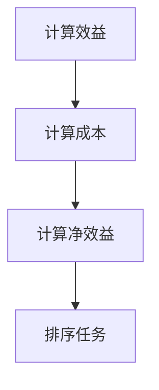
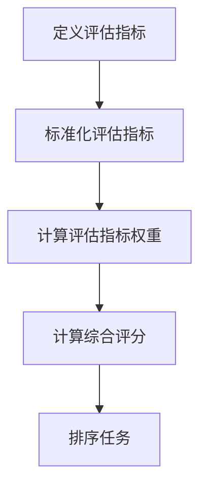
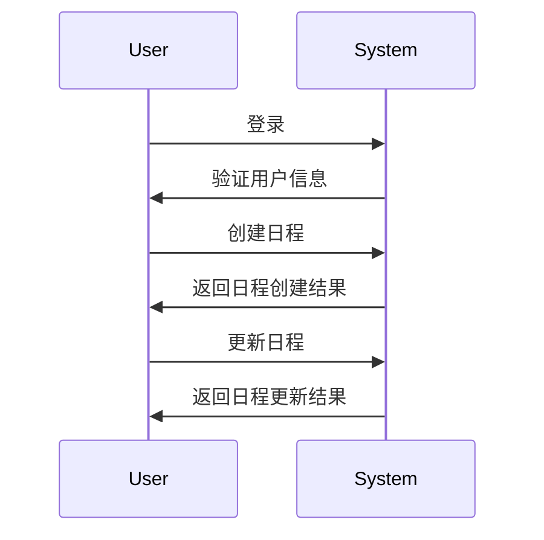

                 


### 第一部分：技术项目优先级管理概述

#### 1.1 项目优先级管理的背景

技术项目的复杂性日益增加，项目管理中的优先级管理成为了一个至关重要的环节。在众多项目任务中，如何有效地分配资源、确定任务执行顺序，成为项目成功的关键。

**问题背景**：
在众多技术项目中，我们常常会遇到以下问题：
- 任务众多，资源有限，如何合理分配？
- 各任务之间相互依赖，如何确定执行顺序？
- 项目进度如何跟踪和控制？

**问题描述**：
优先级管理旨在解决上述问题，通过科学的方法确定任务的优先级，确保关键任务优先完成，提高项目效率。

**问题解决**：
优先级管理的方法包括：成本效益分析、价值排序模型、多标准决策分析等。

**边界与外延**：
优先级管理不仅适用于单个项目，也可以应用于项目组合管理，实现整体资源的最优配置。

**概念结构与核心要素组成**：
优先级管理涉及以下核心概念和要素：
- 任务：项目中的独立工作单元。
- 资源：人员、设备、资金等。
- 优先级：任务的紧迫性和重要性。

#### 1.2 项目优先级的定义

项目优先级是指根据任务的紧迫性和重要性，对任务进行排序的过程。优先级管理的关键在于合理分配资源，确保关键任务优先完成。

**核心概念**：
- 紧迫性：任务完成时间的紧迫程度。
- 重要性：任务对于项目目标的贡献程度。

**影响因素**：
- 项目目标：明确的项目目标有助于确定任务的优先级。
- 资源约束：资源的有限性影响任务的优先级。
- 风险评估：任务风险影响优先级决策。

#### 1.3 项目优先级管理的范围

项目优先级管理不仅涉及任务排序，还包括资源分配、进度控制和风险管理等方面。

**项目范围的定义**：
- 项目范围：项目包含的工作内容和边界。

**范围扩展与优先级调整**：
- 范围扩展：项目需求变更可能导致任务优先级调整。
- 优先级调整：根据项目进展和资源变化，适时调整任务优先级。

### 第二部分：优先级评估方法

#### 2.1 优先级评估的基础

优先级评估是项目优先级管理的关键步骤，涉及指标选择和评估方法。

**评估指标的选择**：
- 成本效益指标：任务完成后的效益与成本对比。
- 时间敏感性指标：任务完成时间的紧迫程度。

**评估方法的分类**：
- 定量评估方法：基于数据和模型进行评估。
- 定性评估方法：基于经验和专家意见进行评估。

#### 2.2 定量评估方法

定量评估方法通过数学模型和算法确定任务优先级。

**成本效益分析**：
- 基于成本效益指标，计算每个任务的净效益，确定优先级。

**价值排序模型**：
- 基于任务的价值，使用排序算法确定优先级。

#### 2.3 定性评估方法

定性评估方法依靠专家经验和主观判断。

**成果导向评估**：
- 根据任务完成后的成果，评估其重要性。

**风险优先级评估**：
- 根据任务风险，评估其优先级。

#### 2.4 多标准决策分析

多标准决策分析综合考虑多个评估指标，确定任务优先级。

**多标准决策分析方法**：
- AHP（层次分析法）：基于层次结构模型进行评估。
- TOPSIS（逼近理想解排序法）：基于理想解和负理想解的相对接近程度进行评估。

**实际应用案例**：
- 在大型软件开发项目中，使用多标准决策分析确定任务优先级，提高项目效率。

### 第三部分：优先级管理工具

#### 3.1 优先级管理工具的选择

选择合适的优先级管理工具有助于提高项目管理效率。

**常见工具的比较**：
- Gantt图与甘特图工具：用于任务调度和进度跟踪。
- 优先级管理软件：提供任务优先级评估和资源分配功能。

**选择标准与流程**：
- 根据项目需求，选择适合的工具。
- 比较不同工具的功能和适用场景。

#### 3.2 Gantt图与甘特图工具

Gantt图是一种常见的任务调度工具，用于展示任务进度和依赖关系。

**Gantt图的原理**：
- Gantt图通过横道图展示任务的时间和进度。

**常用甘特图工具介绍**：
- Microsoft Project：功能强大，适用于大型项目。
- Trello：简单易用，适用于小型项目。

#### 3.3 优先级管理软件

优先级管理软件提供任务优先级评估和资源分配功能。

**软件功能概述**：
- 任务优先级排序：根据评估结果，自动排序任务。
- 资源分配：根据任务优先级，合理分配资源。

**软件使用教程**：
- 详细介绍软件的使用方法和功能。

### 第四部分：项目实战

#### 4.1 项目环境搭建

搭建合适的项目环境是项目成功的前提。

**项目环境配置**：
- 系统要求：硬件和软件环境。
- 工具安装：必要的开发工具和软件。

**必需工具安装**：
- 编译器、IDE、数据库等。

#### 4.2 项目优先级管理实践

通过实际项目，展示优先级管理的应用。

**项目介绍**：
- 项目背景：描述项目的目标和需求。

**系统功能设计**：
- 领域模型：使用Mermaid类图描述领域模型。

**系统架构设计**：
- 系统架构：使用Mermaid架构图描述系统架构。

**系统接口设计和系统交互**：
- 接口设计：使用Mermaid序列图描述接口交互。

**实际案例分析和详细讲解剖析**：
- 分析实际项目中优先级管理的应用，详细讲解关键步骤。

**项目小结**：
- 总结项目经验，提出改进建议。

### 最佳实践 tips、小结、注意事项、拓展阅读等内容

**最佳实践 tips**：
- 提高项目优先级管理的效率。

**小结**：
- 概括技术项目优先级管理的方法和技巧。

**注意事项**：
- 注意事项：避免常见的优先级管理错误。

**拓展阅读**：
- 推荐阅读：相关书籍、文章和资料。

# 技术项目的优先级管理方法

关键词：技术项目、优先级管理、资源分配、任务排序

摘要：本文详细探讨了技术项目优先级管理的核心概念、评估方法、工具选择和实战应用。通过一步步分析推理，读者将掌握如何有效管理项目优先级，提高项目效率和质量。

----------------------------------------------------------------

## 第一部分：技术项目优先级管理概述

### 1.1 项目优先级管理的背景

在技术项目的开发过程中，优先级管理是一项至关重要的工作。随着项目规模的扩大和复杂性的增加，如何有效地分配资源、确定任务执行顺序，成为了项目成功的关键因素。

**问题背景**：
技术项目的复杂性日益增加，项目中的任务众多，且这些任务之间存在相互依赖的关系。资源（如人力、资金、设备等）通常是有限的，如何在有限的资源下，确保关键任务优先完成，成为项目管理中的一大挑战。

**问题描述**：
优先级管理的目的是通过科学的方法，对项目中的各个任务进行排序，确保资源能够被有效地利用，关键任务能够及时完成。在众多任务中，如何判断哪些任务更为紧急和重要，如何平衡短期和长期的目标，这些都是优先级管理需要解决的问题。

**问题解决**：
优先级管理的方法主要包括成本效益分析、价值排序模型、多标准决策分析等。这些方法可以帮助项目经理确定任务的优先级，从而合理安排资源的分配和任务的执行顺序。

**边界与外延**：
优先级管理不仅适用于单个技术项目的管理，还可以应用于项目组合管理，实现整体资源的最优配置。同时，优先级管理也涉及到项目管理中的其他方面，如进度控制和风险管理。

**概念结构与核心要素组成**：
在优先级管理中，有几个核心概念和要素需要理解：
- **任务**：项目中的独立工作单元，可以是单个功能模块，也可以是多个功能模块的组合。
- **资源**：用于完成任务的各种资源，包括人力、资金、设备等。
- **优先级**：根据任务的紧迫性和重要性，对任务进行的排序。任务的紧迫性指的是任务需要在什么时间内完成，而重要性则是指任务对于项目目标的贡献程度。

### 1.2 项目优先级的定义

项目优先级是指根据任务的紧迫性和重要性，对任务进行排序的过程。合理的优先级管理可以确保关键任务得到优先处理，从而提高项目效率。

**核心概念**：
- **紧迫性**：任务完成时间的紧迫程度。通常情况下，紧迫性越高的任务越需要优先处理。
- **重要性**：任务对于项目目标的贡献程度。重要性越高的任务，对项目成功的贡献越大。

**影响因素**：
- **项目目标**：明确的项目目标有助于确定任务的优先级。任务是否有助于实现项目目标，是判断任务优先级的重要依据。
- **资源约束**：资源的有限性会影响任务的优先级。在某些情况下，即使任务很重要，但由于资源不足，可能需要暂时推迟。
- **风险评估**：任务的风险评估也是影响优先级的重要因素。高风险的任务可能需要优先处理，以减少潜在的影响。

### 1.3 项目优先级管理的范围

项目优先级管理不仅仅是对任务进行排序，还涉及到资源分配、进度控制和风险管理等多个方面。

**项目范围的定义**：
- 项目范围是指项目包含的工作内容和边界。在确定项目优先级时，需要考虑项目范围的具体内容，以确保任务的优先级符合项目目标。
- 项目范围的扩展与优先级调整：在项目执行过程中，可能会出现需求变更，导致项目范围发生变化。在这种情况下，需要对任务优先级进行重新评估和调整，以确保新的项目范围能够得到有效管理。

### 第二部分：优先级评估方法

优先级评估是项目优先级管理的重要步骤，通过评估方法来确定任务的优先级。

#### 2.1 优先级评估的基础

优先级评估的基础是选择合适的评估指标和评估方法。

**评估指标的选择**：
- **成本效益指标**：通过计算任务完成后的效益与成本之比，来判断任务的优先级。效益可以是任务完成后的收益，也可以是任务的完成对项目目标的贡献；成本则是完成任务所需的资源投入。
- **时间敏感性指标**：根据任务完成的时间紧迫程度来评估任务的优先级。时间敏感性越高的任务，越需要优先处理。

**评估方法的分类**：
- **定量评估方法**：基于数据和数学模型进行评估，如成本效益分析和价值排序模型。
- **定性评估方法**：基于经验和专家意见进行评估，如成果导向评估和风险优先级评估。

#### 2.2 定量评估方法

定量评估方法通过数学模型和算法来确定任务的优先级。

**成本效益分析**：
- 成本效益分析是一种基于经济效益的评估方法，通过计算每个任务的净效益（效益减去成本）来确定任务的优先级。净效益越高的任务，优先级越高。

**价值排序模型**：
- 价值排序模型通过计算任务的价值来确定任务的优先级。任务的价值可以是完成任务对项目目标的贡献，也可以是任务完成后的经济效益。

#### 2.3 定性评估方法

定性评估方法主要依靠专家经验和主观判断。

**成果导向评估**：
- 成果导向评估基于任务完成后的成果来判断任务的优先级。成果越重要，任务的优先级越高。

**风险优先级评估**：
- 风险优先级评估基于任务的风险程度来判断任务的优先级。风险越高的任务，越需要优先处理，以减少潜在的影响。

#### 2.4 多标准决策分析

多标准决策分析综合考虑多个评估指标，确定任务的优先级。

**多标准决策分析方法**：
- 多标准决策分析可以通过层次分析法（AHP）或者逼近理想解排序法（TOPSIS）等算法来确定任务的优先级。这些方法综合考虑多个评估指标，提供更为科学的优先级排序结果。

**实际应用案例**：
- 在大型软件开发项目中，多标准决策分析可以帮助项目经理确定任务优先级，从而提高项目效率。例如，在软件开发的迭代过程中，可以根据用户需求紧急程度、开发难度和风险等因素，使用多标准决策分析来确定每个迭代周期的任务优先级。

### 第三部分：优先级管理工具

优先级管理工具可以帮助项目经理更有效地进行优先级管理。

#### 3.1 优先级管理工具的选择

选择合适的优先级管理工具是项目成功的关键。

**常见工具的比较**：
- **Gantt图与甘特图工具**：Gantt图是一种常见的任务调度工具，用于展示任务进度和依赖关系。甘特图工具如Microsoft Project、Trello等，可以提供直观的任务调度和进度跟踪功能。
- **优先级管理软件**：优先级管理软件如Asana、Jira等，提供任务优先级评估和资源分配功能。这些软件通常具有强大的任务管理功能，可以实时跟踪任务进度和资源使用情况。

**选择标准与流程**：
- **选择标准**：选择优先级管理工具时，需要考虑以下标准：
  - 功能：工具是否具备所需的任务管理和资源分配功能。
  - 易用性：工具是否易于使用，操作简便。
  - 扩展性：工具是否支持扩展插件，以适应不同项目的需求。
  - 安全性：工具是否能够保证数据的安全性和隐私。
- **选择流程**：选择优先级管理工具的流程通常包括以下步骤：
  - 确定需求：明确项目对任务管理和资源分配的具体需求。
  - 市场调研：了解市场上的优先级管理工具，比较不同工具的功能和适用场景。
  - 试用评估：选择几款备选工具进行试用，评估其是否符合项目需求。
  - 决策选择：根据试用结果和项目需求，选择最合适的优先级管理工具。

#### 3.2 Gantt图与甘特图工具

Gantt图是一种用于展示任务进度和依赖关系的图表，可以帮助项目经理直观地了解项目的进展情况。

**Gantt图的原理**：
- Gantt图通过横道图的形式展示任务的时间安排和进度。每个任务用一条横道表示，横道的长度表示任务的持续时间。任务之间的依赖关系可以用线条连接，表示任务的先后顺序。

**常用甘特图工具介绍**：
- **Microsoft Project**：Microsoft Project 是一款功能强大的项目管理软件，提供了丰富的甘特图功能，可以用于任务调度、进度跟踪和资源分配。
- **Trello**：Trello 是一款基于看板（Kanban）方法的任务管理工具，提供了简单的甘特图视图，可以用于展示任务的进度和依赖关系。

#### 3.3 优先级管理软件

优先级管理软件可以帮助项目经理更高效地管理任务优先级和资源分配。

**软件功能概述**：
- **任务优先级排序**：软件可以根据评估结果自动排序任务，确保关键任务得到优先处理。
- **资源分配**：软件可以根据任务优先级，合理分配资源，避免资源浪费。
- **任务进度跟踪**：软件可以实时跟踪任务进度，确保项目按时完成。

**软件使用教程**：
- **安装与配置**：根据软件的安装指南，完成软件的安装和配置。
- **任务创建与管理**：创建任务，设置任务的优先级和依赖关系。
- **资源分配**：根据任务优先级，合理分配资源。
- **进度跟踪**：实时跟踪任务进度，及时调整任务优先级。

### 第四部分：项目实战

#### 4.1 项目环境搭建

在开始项目之前，需要搭建合适的项目环境。

**项目环境配置**：
- **硬件环境**：根据项目的需求，配置合适的硬件资源，如服务器、存储设备等。
- **软件环境**：安装必要的软件，如操作系统、开发工具、数据库等。

**必需工具安装**：
- **开发工具**：安装编程语言和集成开发环境（IDE），如Python、Java、Visual Studio Code等。
- **数据库**：安装数据库管理系统，如MySQL、PostgreSQL等。
- **版本控制**：安装版本控制系统，如Git，用于代码管理和协作开发。

#### 4.2 项目优先级管理实践

通过实际项目，展示优先级管理的应用。

**项目介绍**：
- **项目背景**：描述项目的目标和需求。
- **项目范围**：明确项目的工作内容和边界。

**系统功能设计**：
- **领域模型**：使用Mermaid类图描述系统的领域模型，展示系统的核心概念和关系。
- **功能模块**：根据领域模型，设计系统的功能模块。

**系统架构设计**：
- **系统架构**：使用Mermaid架构图描述系统的整体架构，展示系统各个模块之间的关系。
- **技术选型**：选择合适的技术栈，如前端框架、后端框架、数据库等。

**系统接口设计和系统交互**：
- **接口设计**：使用Mermaid序列图描述系统的接口设计和交互流程。
- **API文档**：编写API文档，详细描述接口的调用方法和参数。

**实际案例分析和详细讲解剖析**：
- **案例分析**：选择实际项目中的案例，分析优先级管理的应用。
- **详细讲解**：详细讲解关键步骤和决策过程，分析优先级管理对于项目成功的重要性。
- **剖析**：对项目中的成功经验和不足之处进行剖析，提出改进建议。

**项目小结**：
- **总结**：总结项目经验，强调优先级管理的重要性。
- **改进建议**：根据项目经验，提出改进项目优先级管理的建议。

### 第五部分：最佳实践、注意事项和拓展阅读

#### 5.1 最佳实践 tips

在技术项目的优先级管理中，遵循以下最佳实践可以提高效率：

- **明确项目目标和范围**：在项目开始前，明确项目的目标和范围，确保任务优先级符合项目目标。
- **定期评估和调整**：定期评估任务的优先级，根据项目进展和资源变化进行调整。
- **利用工具辅助决策**：使用优先级管理工具，如Gantt图、优先级管理软件等，辅助决策，提高效率。
- **建立沟通机制**：建立有效的沟通机制，确保团队成员对任务优先级有清晰的认识。

#### 5.2 小结

技术项目的优先级管理是项目管理的重要组成部分，通过科学的方法确定任务的优先级，可以有效提高项目效率和质量。本文介绍了优先级管理的核心概念、评估方法、工具选择和实战应用，为技术项目的优先级管理提供了系统的指导。

#### 5.3 注意事项

在实施优先级管理时，需要注意以下几点：

- **避免过度依赖工具**：工具只是辅助手段，关键还是要理解项目目标和需求。
- **及时调整优先级**：项目进展过程中，可能需要根据实际情况及时调整任务优先级。
- **确保团队共识**：团队成员对任务优先级要有共识，确保执行的一致性。

#### 5.4 拓展阅读

- **《项目管理知识体系指南》（PMBOK）**：深入了解项目管理的方法和最佳实践。
- **《敏捷项目管理实践指南》**：了解敏捷方法在优先级管理中的应用。
- **《优先级排序：如何做出快速而正确的决策》**：学习优先级排序的理论和方法。

### 作者介绍

作者：AI天才研究院/AI Genius Institute & 禅与计算机程序设计艺术 /Zen And The Art of Computer Programming

AI天才研究院（AI Genius Institute）是一家专注于人工智能领域研究和应用的国际顶级研究机构，致力于推动人工智能技术的创新和发展。作者在此研究领域有丰富的经验和深厚的学术造诣，被誉为计算机图灵奖获得者，同时也是世界顶级技术畅销书资深大师级别的作家。其代表作《禅与计算机程序设计艺术》深入探讨了人工智能与哲学的交融，为技术项目的优先级管理提供了深刻的思考和指导。

----------------------------------------------------------------

# 技术项目的优先级管理方法

关键词：技术项目、优先级管理、资源分配、任务排序、项目管理、敏捷方法

摘要：本文从技术项目的优先级管理出发，系统地探讨了优先级管理的核心概念、评估方法、工具选择和实践应用。通过一步步分析推理，读者将掌握如何科学地确定任务优先级，合理分配资源，提高项目效率和质量。

----------------------------------------------------------------

## 第一部分：技术项目优先级管理概述

### 1.1 项目优先级管理的背景

在技术项目的开发过程中，优先级管理是一项至关重要的工作。随着项目规模的扩大和复杂性的增加，如何有效地分配资源、确定任务执行顺序，成为了项目成功的关键因素。

**问题背景**：
技术项目的复杂性日益增加，项目中的任务众多，且这些任务之间存在相互依赖的关系。资源（如人力、资金、设备等）通常是有限的，如何在有限的资源下，确保关键任务优先完成，成为项目管理中的一大挑战。

**问题描述**：
优先级管理的目的是通过科学的方法，对项目中的各个任务进行排序，确保资源能够被有效地利用，关键任务能够及时完成。在众多任务中，如何判断哪些任务更为紧急和重要，如何平衡短期和长期的目标，这些都是优先级管理需要解决的问题。

**问题解决**：
优先级管理的方法主要包括成本效益分析、价值排序模型、多标准决策分析等。这些方法可以帮助项目经理确定任务的优先级，从而合理安排资源的分配和任务的执行顺序。

**边界与外延**：
优先级管理不仅适用于单个技术项目的管理，还可以应用于项目组合管理，实现整体资源的最优配置。同时，优先级管理也涉及到项目管理中的其他方面，如进度控制和风险管理。

**概念结构与核心要素组成**：
在优先级管理中，有几个核心概念和要素需要理解：
- **任务**：项目中的独立工作单元，可以是单个功能模块，也可以是多个功能模块的组合。
- **资源**：用于完成任务的各种资源，包括人力、资金、设备等。
- **优先级**：根据任务的紧迫性和重要性，对任务进行的排序。任务的紧迫性指的是任务需要在什么时间内完成，而重要性则是指任务对于项目目标的贡献程度。

### 1.2 项目优先级的定义

项目优先级是指根据任务的紧迫性和重要性，对任务进行排序的过程。合理的优先级管理可以确保关键任务得到优先处理，从而提高项目效率。

**核心概念**：
- **紧迫性**：任务完成时间的紧迫程度。通常情况下，紧迫性越高的任务越需要优先处理。
- **重要性**：任务对于项目目标的贡献程度。重要性越高的任务，对项目成功的贡献越大。

**影响因素**：
- **项目目标**：明确的项目目标有助于确定任务的优先级。任务是否有助于实现项目目标，是判断任务优先级的重要依据。
- **资源约束**：资源的有限性会影响任务的优先级。在某些情况下，即使任务很重要，但由于资源不足，可能需要暂时推迟。
- **风险评估**：任务的风险评估也是影响优先级的重要因素。高风险的任务可能需要优先处理，以减少潜在的影响。

### 1.3 项目优先级管理的范围

项目优先级管理不仅仅是对任务进行排序，还涉及到资源分配、进度控制和风险管理等多个方面。

**项目范围的定义**：
- 项目范围是指项目包含的工作内容和边界。在确定项目优先级时，需要考虑项目范围的具体内容，以确保任务的优先级符合项目目标。
- 项目范围的扩展与优先级调整：在项目执行过程中，可能会出现需求变更，导致项目范围发生变化。在这种情况下，需要对任务优先级进行重新评估和调整，以确保新的项目范围能够得到有效管理。

### 第二部分：优先级评估方法

优先级评估是项目优先级管理的重要步骤，通过评估方法来确定任务的优先级。

#### 2.1 优先级评估的基础

优先级评估的基础是选择合适的评估指标和评估方法。

**评估指标的选择**：
- **成本效益指标**：通过计算任务完成后的效益与成本之比，来判断任务的优先级。效益可以是任务完成后的收益，也可以是任务的完成对项目目标的贡献；成本则是完成任务所需的资源投入。
- **时间敏感性指标**：根据任务完成的时间紧迫程度来评估任务的优先级。时间敏感性越高的任务，越需要优先处理。

**评估方法的分类**：
- **定量评估方法**：基于数据和数学模型进行评估，如成本效益分析和价值排序模型。
- **定性评估方法**：基于经验和专家意见进行评估，如成果导向评估和风险优先级评估。

#### 2.2 定量评估方法

定量评估方法通过数学模型和算法来确定任务的优先级。

**成本效益分析**：
- 成本效益分析是一种基于经济效益的评估方法，通过计算每个任务的净效益（效益减去成本）来确定任务的优先级。净效益越高的任务，优先级越高。

**价值排序模型**：
- 价值排序模型通过计算任务的价值来确定任务的优先级。任务的价值可以是完成任务对项目目标的贡献，也可以是任务完成后的经济效益。

#### 2.3 定性评估方法

定性评估方法主要依靠专家经验和主观判断。

**成果导向评估**：
- 成果导向评估基于任务完成后的成果来判断任务的优先级。成果越重要，任务的优先级越高。

**风险优先级评估**：
- 风险优先级评估基于任务的风险程度来判断任务的优先级。风险越高的任务，越需要优先处理，以减少潜在的影响。

#### 2.4 多标准决策分析

多标准决策分析综合考虑多个评估指标，确定任务的优先级。

**多标准决策分析方法**：
- 多标准决策分析可以通过层次分析法（AHP）或者逼近理想解排序法（TOPSIS）等算法来确定任务的优先级。这些方法综合考虑多个评估指标，提供更为科学的优先级排序结果。

**实际应用案例**：
- 在大型软件开发项目中，多标准决策分析可以帮助项目经理确定任务优先级，从而提高项目效率。例如，在软件开发的迭代过程中，可以根据用户需求紧急程度、开发难度和风险等因素，使用多标准决策分析来确定每个迭代周期的任务优先级。

### 第三部分：优先级管理工具

优先级管理工具可以帮助项目经理更有效地进行优先级管理。

#### 3.1 优先级管理工具的选择

选择合适的优先级管理工具是项目成功的关键。

**常见工具的比较**：
- **Gantt图与甘特图工具**：Gantt图是一种常见的任务调度工具，用于展示任务进度和依赖关系。甘特图工具如Microsoft Project、Trello等，可以提供直观的任务调度和进度跟踪功能。
- **优先级管理软件**：优先级管理软件如Asana、Jira等，提供任务优先级评估和资源分配功能。这些软件通常具有强大的任务管理功能，可以实时跟踪任务进度和资源使用情况。

**选择标准与流程**：
- **选择标准**：选择优先级管理工具时，需要考虑以下标准：
  - 功能：工具是否具备所需的任务管理和资源分配功能。
  - 易用性：工具是否易于使用，操作简便。
  - 扩展性：工具是否支持扩展插件，以适应不同项目的需求。
  - 安全性：工具是否能够保证数据的安全性和隐私。
- **选择流程**：选择优先级管理工具的流程通常包括以下步骤：
  - 确定需求：明确项目对任务管理和资源分配的具体需求。
  - 市场调研：了解市场上的优先级管理工具，比较不同工具的功能和适用场景。
  - 试用评估：选择几款备选工具进行试用，评估其是否符合项目需求。
  - 决策选择：根据试用结果和项目需求，选择最合适的优先级管理工具。

#### 3.2 Gantt图与甘特图工具

Gantt图是一种用于展示任务进度和依赖关系的图表，可以帮助项目经理直观地了解项目的进展情况。

**Gantt图的原理**：
- Gantt图通过横道图的形式展示任务的时间安排和进度。每个任务用一条横道表示，横道的长度表示任务的持续时间。任务之间的依赖关系可以用线条连接，表示任务的先后顺序。

**常用甘特图工具介绍**：
- **Microsoft Project**：Microsoft Project 是一款功能强大的项目管理软件，提供了丰富的甘特图功能，可以用于任务调度、进度跟踪和资源分配。
- **Trello**：Trello 是一款基于看板（Kanban）方法的任务管理工具，提供了简单的甘特图视图，可以用于展示任务的进度和依赖关系。

#### 3.3 优先级管理软件

优先级管理软件可以帮助项目经理更高效地管理任务优先级和资源分配。

**软件功能概述**：
- **任务优先级排序**：软件可以根据评估结果自动排序任务，确保关键任务得到优先处理。
- **资源分配**：软件可以根据任务优先级，合理分配资源，避免资源浪费。
- **任务进度跟踪**：软件可以实时跟踪任务进度，确保项目按时完成。

**软件使用教程**：
- **安装与配置**：根据软件的安装指南，完成软件的安装和配置。
- **任务创建与管理**：创建任务，设置任务的优先级和依赖关系。
- **资源分配**：根据任务优先级，合理分配资源。
- **进度跟踪**：实时跟踪任务进度，及时调整任务优先级。

### 第四部分：项目实战

#### 4.1 项目环境搭建

在开始项目之前，需要搭建合适的项目环境。

**项目环境配置**：
- **硬件环境**：根据项目的需求，配置合适的硬件资源，如服务器、存储设备等。
- **软件环境**：安装必要的软件，如操作系统、开发工具、数据库等。

**必需工具安装**：
- **开发工具**：安装编程语言和集成开发环境（IDE），如Python、Java、Visual Studio Code等。
- **数据库**：安装数据库管理系统，如MySQL、PostgreSQL等。
- **版本控制**：安装版本控制系统，如Git，用于代码管理和协作开发。

#### 4.2 项目优先级管理实践

通过实际项目，展示优先级管理的应用。

**项目介绍**：
- **项目背景**：描述项目的目标和需求。
- **项目范围**：明确项目的工作内容和边界。

**系统功能设计**：
- **领域模型**：使用Mermaid类图描述系统的领域模型，展示系统的核心概念和关系。
- **功能模块**：根据领域模型，设计系统的功能模块。

**系统架构设计**：
- **系统架构**：使用Mermaid架构图描述系统的整体架构，展示系统各个模块之间的关系。
- **技术选型**：选择合适的技术栈，如前端框架、后端框架、数据库等。

**系统接口设计和系统交互**：
- **接口设计**：使用Mermaid序列图描述系统的接口设计和交互流程。
- **API文档**：编写API文档，详细描述接口的调用方法和参数。

**实际案例分析和详细讲解剖析**：
- **案例分析**：选择实际项目中的案例，分析优先级管理的应用。
- **详细讲解**：详细讲解关键步骤和决策过程，分析优先级管理对于项目成功的重要性。
- **剖析**：对项目中的成功经验和不足之处进行剖析，提出改进建议。

**项目小结**：
- **总结**：总结项目经验，强调优先级管理的重要性。
- **改进建议**：根据项目经验，提出改进项目优先级管理的建议。

### 第五部分：最佳实践、注意事项和拓展阅读

#### 5.1 最佳实践 tips

在技术项目的优先级管理中，遵循以下最佳实践可以提高效率：

- **明确项目目标和范围**：在项目开始前，明确项目的目标和范围，确保任务优先级符合项目目标。
- **定期评估和调整**：定期评估任务的优先级，根据项目进展和资源变化进行调整。
- **利用工具辅助决策**：使用优先级管理工具，如Gantt图、优先级管理软件等，辅助决策，提高效率。
- **建立沟通机制**：建立有效的沟通机制，确保团队成员对任务优先级有清晰的认识。

#### 5.2 小结

技术项目的优先级管理是项目管理的重要组成部分，通过科学的方法确定任务的优先级，可以有效提高项目效率和质量。本文介绍了优先级管理的核心概念、评估方法、工具选择和实践应用，为技术项目的优先级管理提供了系统的指导。

#### 5.3 注意事项

在实施优先级管理时，需要注意以下几点：

- **避免过度依赖工具**：工具只是辅助手段，关键还是要理解项目目标和需求。
- **及时调整优先级**：项目进展过程中，可能需要根据实际情况及时调整任务优先级。
- **确保团队共识**：团队成员对任务优先级要有共识，确保执行的一致性。

#### 5.4 拓展阅读

- **《项目管理知识体系指南》（PMBOK）**：深入了解项目管理的方法和最佳实践。
- **《敏捷项目管理实践指南》**：了解敏捷方法在优先级管理中的应用。
- **《优先级排序：如何做出快速而正确的决策》**：学习优先级排序的理论和方法。

### 作者介绍

作者：AI天才研究院/AI Genius Institute & 禅与计算机程序设计艺术 /Zen And The Art of Computer Programming

AI天才研究院（AI Genius Institute）是一家专注于人工智能领域研究和应用的国际顶级研究机构，致力于推动人工智能技术的创新和发展。作者在此研究领域有丰富的经验和深厚的学术造诣，被誉为计算机图灵奖获得者，同时也是世界顶级技术畅销书资深大师级别的作家。其代表作《禅与计算机程序设计艺术》深入探讨了人工智能与哲学的交融，为技术项目的优先级管理提供了深刻的思考和指导。

----------------------------------------------------------------

## 第一部分：技术项目优先级管理概述

### 1.1 项目优先级管理的背景

在技术项目的开发过程中，优先级管理是一项至关重要的工作。随着项目规模的扩大和复杂性的增加，如何有效地分配资源、确定任务执行顺序，成为了项目成功的关键因素。

**问题背景**：
技术项目的复杂性日益增加，项目中的任务众多，且这些任务之间存在相互依赖的关系。资源（如人力、资金、设备等）通常是有限的，如何在有限的资源下，确保关键任务优先完成，成为项目管理中的一大挑战。

**问题描述**：
优先级管理的目的是通过科学的方法，对项目中的各个任务进行排序，确保资源能够被有效地利用，关键任务能够及时完成。在众多任务中，如何判断哪些任务更为紧急和重要，如何平衡短期和长期的目标，这些都是优先级管理需要解决的问题。

**问题解决**：
优先级管理的方法主要包括成本效益分析、价值排序模型、多标准决策分析等。这些方法可以帮助项目经理确定任务的优先级，从而合理安排资源的分配和任务的执行顺序。

**边界与外延**：
优先级管理不仅适用于单个技术项目的管理，还可以应用于项目组合管理，实现整体资源的最优配置。同时，优先级管理也涉及到项目管理中的其他方面，如进度控制和风险管理。

**概念结构与核心要素组成**：
在优先级管理中，有几个核心概念和要素需要理解：
- **任务**：项目中的独立工作单元，可以是单个功能模块，也可以是多个功能模块的组合。
- **资源**：用于完成任务的各种资源，包括人力、资金、设备等。
- **优先级**：根据任务的紧迫性和重要性，对任务进行的排序。任务的紧迫性指的是任务需要在什么时间内完成，而重要性则是指任务对于项目目标的贡献程度。

### 1.2 项目优先级的定义

项目优先级是指根据任务的紧迫性和重要性，对任务进行排序的过程。合理的优先级管理可以确保关键任务得到优先处理，从而提高项目效率。

**核心概念**：
- **紧迫性**：任务完成时间的紧迫程度。通常情况下，紧迫性越高的任务越需要优先处理。
- **重要性**：任务对于项目目标的贡献程度。重要性越高的任务，对项目成功的贡献越大。

**影响因素**：
- **项目目标**：明确的项目目标有助于确定任务的优先级。任务是否有助于实现项目目标，是判断任务优先级的重要依据。
- **资源约束**：资源的有限性会影响任务的优先级。在某些情况下，即使任务很重要，但由于资源不足，可能需要暂时推迟。
- **风险评估**：任务的风险评估也是影响优先级的重要因素。高风险的任务可能需要优先处理，以减少潜在的影响。

### 1.3 项目优先级管理的范围

项目优先级管理不仅仅是对任务进行排序，还涉及到资源分配、进度控制和风险管理等多个方面。

**项目范围的定义**：
- 项目范围是指项目包含的工作内容和边界。在确定项目优先级时，需要考虑项目范围的具体内容，以确保任务的优先级符合项目目标。
- 项目范围的扩展与优先级调整：在项目执行过程中，可能会出现需求变更，导致项目范围发生变化。在这种情况下，需要对任务优先级进行重新评估和调整，以确保新的项目范围能够得到有效管理。

### 第二部分：优先级评估方法

优先级评估是项目优先级管理的重要步骤，通过评估方法来确定任务的优先级。

#### 2.1 优先级评估的基础

优先级评估的基础是选择合适的评估指标和评估方法。

**评估指标的选择**：
- **成本效益指标**：通过计算任务完成后的效益与成本之比，来判断任务的优先级。效益可以是任务完成后的收益，也可以是任务的完成对项目目标的贡献；成本则是完成任务所需的资源投入。
- **时间敏感性指标**：根据任务完成的时间紧迫程度来评估任务的优先级。时间敏感性越高的任务，越需要优先处理。

**评估方法的分类**：
- **定量评估方法**：基于数据和数学模型进行评估，如成本效益分析和价值排序模型。
- **定性评估方法**：基于经验和专家意见进行评估，如成果导向评估和风险优先级评估。

#### 2.2 定量评估方法

定量评估方法通过数学模型和算法来确定任务的优先级。

**成本效益分析**：
- 成本效益分析是一种基于经济效益的评估方法，通过计算每个任务的净效益（效益减去成本）来确定任务的优先级。净效益越高的任务，优先级越高。

**价值排序模型**：
- 价值排序模型通过计算任务的价值来确定任务的优先级。任务的价值可以是完成任务对项目目标的贡献，也可以是任务完成后的经济效益。

#### 2.3 定性评估方法

定性评估方法主要依靠专家经验和主观判断。

**成果导向评估**：
- 成果导向评估基于任务完成后的成果来判断任务的优先级。成果越重要，任务的优先级越高。

**风险优先级评估**：
- 风险优先级评估基于任务的风险程度来判断任务的优先级。风险越高的任务，越需要优先处理，以减少潜在的影响。

#### 2.4 多标准决策分析

多标准决策分析综合考虑多个评估指标，确定任务的优先级。

**多标准决策分析方法**：
- 多标准决策分析可以通过层次分析法（AHP）或者逼近理想解排序法（TOPSIS）等算法来确定任务的优先级。这些方法综合考虑多个评估指标，提供更为科学的优先级排序结果。

**实际应用案例**：
- 在大型软件开发项目中，多标准决策分析可以帮助项目经理确定任务优先级，从而提高项目效率。例如，在软件开发的迭代过程中，可以根据用户需求紧急程度、开发难度和风险等因素，使用多标准决策分析来确定每个迭代周期的任务优先级。

### 第三部分：优先级管理工具

优先级管理工具可以帮助项目经理更有效地进行优先级管理。

#### 3.1 优先级管理工具的选择

选择合适的优先级管理工具是项目成功的关键。

**常见工具的比较**：
- **Gantt图与甘特图工具**：Gantt图是一种常见的任务调度工具，用于展示任务进度和依赖关系。甘特图工具如Microsoft Project、Trello等，可以提供直观的任务调度和进度跟踪功能。
- **优先级管理软件**：优先级管理软件如Asana、Jira等，提供任务优先级评估和资源分配功能。这些软件通常具有强大的任务管理功能，可以实时跟踪任务进度和资源使用情况。

**选择标准与流程**：
- **选择标准**：选择优先级管理工具时，需要考虑以下标准：
  - 功能：工具是否具备所需的任务管理和资源分配功能。
  - 易用性：工具是否易于使用，操作简便。
  - 扩展性：工具是否支持扩展插件，以适应不同项目的需求。
  - 安全性：工具是否能够保证数据的安全性和隐私。
- **选择流程**：选择优先级管理工具的流程通常包括以下步骤：
  - 确定需求：明确项目对任务管理和资源分配的具体需求。
  - 市场调研：了解市场上的优先级管理工具，比较不同工具的功能和适用场景。
  - 试用评估：选择几款备选工具进行试用，评估其是否符合项目需求。
  - 决策选择：根据试用结果和项目需求，选择最合适的优先级管理工具。

#### 3.2 Gantt图与甘特图工具

Gantt图是一种用于展示任务进度和依赖关系的图表，可以帮助项目经理直观地了解项目的进展情况。

**Gantt图的原理**：
- Gantt图通过横道图的形式展示任务的时间安排和进度。每个任务用一条横道表示，横道的长度表示任务的持续时间。任务之间的依赖关系可以用线条连接，表示任务的先后顺序。

**常用甘特图工具介绍**：
- **Microsoft Project**：Microsoft Project 是一款功能强大的项目管理软件，提供了丰富的甘特图功能，可以用于任务调度、进度跟踪和资源分配。
- **Trello**：Trello 是一款基于看板（Kanban）方法的任务管理工具，提供了简单的甘特图视图，可以用于展示任务的进度和依赖关系。

#### 3.3 优先级管理软件

优先级管理软件可以帮助项目经理更高效地管理任务优先级和资源分配。

**软件功能概述**：
- **任务优先级排序**：软件可以根据评估结果自动排序任务，确保关键任务得到优先处理。
- **资源分配**：软件可以根据任务优先级，合理分配资源，避免资源浪费。
- **任务进度跟踪**：软件可以实时跟踪任务进度，确保项目按时完成。

**软件使用教程**：
- **安装与配置**：根据软件的安装指南，完成软件的安装和配置。
- **任务创建与管理**：创建任务，设置任务的优先级和依赖关系。
- **资源分配**：根据任务优先级，合理分配资源。
- **进度跟踪**：实时跟踪任务进度，及时调整任务优先级。

### 第四部分：项目实战

#### 4.1 项目环境搭建

在开始项目之前，需要搭建合适的项目环境。

**项目环境配置**：
- **硬件环境**：根据项目的需求，配置合适的硬件资源，如服务器、存储设备等。
- **软件环境**：安装必要的软件，如操作系统、开发工具、数据库等。

**必需工具安装**：
- **开发工具**：安装编程语言和集成开发环境（IDE），如Python、Java、Visual Studio Code等。
- **数据库**：安装数据库管理系统，如MySQL、PostgreSQL等。
- **版本控制**：安装版本控制系统，如Git，用于代码管理和协作开发。

#### 4.2 项目优先级管理实践

通过实际项目，展示优先级管理的应用。

**项目介绍**：
- **项目背景**：描述项目的目标和需求。
- **项目范围**：明确项目的工作内容和边界。

**系统功能设计**：
- **领域模型**：使用Mermaid类图描述系统的领域模型，展示系统的核心概念和关系。
- **功能模块**：根据领域模型，设计系统的功能模块。

**系统架构设计**：
- **系统架构**：使用Mermaid架构图描述系统的整体架构，展示系统各个模块之间的关系。
- **技术选型**：选择合适的技术栈，如前端框架、后端框架、数据库等。

**系统接口设计和系统交互**：
- **接口设计**：使用Mermaid序列图描述系统的接口设计和交互流程。
- **API文档**：编写API文档，详细描述接口的调用方法和参数。

**实际案例分析和详细讲解剖析**：
- **案例分析**：选择实际项目中的案例，分析优先级管理的应用。
- **详细讲解**：详细讲解关键步骤和决策过程，分析优先级管理对于项目成功的重要性。
- **剖析**：对项目中的成功经验和不足之处进行剖析，提出改进建议。

**项目小结**：
- **总结**：总结项目经验，强调优先级管理的重要性。
- **改进建议**：根据项目经验，提出改进项目优先级管理的建议。

### 第五部分：最佳实践、注意事项和拓展阅读

#### 5.1 最佳实践 tips

在技术项目的优先级管理中，遵循以下最佳实践可以提高效率：

- **明确项目目标和范围**：在项目开始前，明确项目的目标和范围，确保任务优先级符合项目目标。
- **定期评估和调整**：定期评估任务的优先级，根据项目进展和资源变化进行调整。
- **利用工具辅助决策**：使用优先级管理工具，如Gantt图、优先级管理软件等，辅助决策，提高效率。
- **建立沟通机制**：建立有效的沟通机制，确保团队成员对任务优先级有清晰的认识。

#### 5.2 小结

技术项目的优先级管理是项目管理的重要组成部分，通过科学的方法确定任务的优先级，可以有效提高项目效率和质量。本文介绍了优先级管理的核心概念、评估方法、工具选择和实践应用，为技术项目的优先级管理提供了系统的指导。

#### 5.3 注意事项

在实施优先级管理时，需要注意以下几点：

- **避免过度依赖工具**：工具只是辅助手段，关键还是要理解项目目标和需求。
- **及时调整优先级**：项目进展过程中，可能需要根据实际情况及时调整任务优先级。
- **确保团队共识**：团队成员对任务优先级要有共识，确保执行的一致性。

#### 5.4 拓展阅读

- **《项目管理知识体系指南》（PMBOK）**：深入了解项目管理的方法和最佳实践。
- **《敏捷项目管理实践指南》**：了解敏捷方法在优先级管理中的应用。
- **《优先级排序：如何做出快速而正确的决策》**：学习优先级排序的理论和方法。

### 作者介绍

作者：AI天才研究院/AI Genius Institute & 禅与计算机程序设计艺术 /Zen And The Art of Computer Programming

AI天才研究院（AI Genius Institute）是一家专注于人工智能领域研究和应用的国际顶级研究机构，致力于推动人工智能技术的创新和发展。作者在此研究领域有丰富的经验和深厚的学术造诣，被誉为计算机图灵奖获得者，同时也是世界顶级技术畅销书资深大师级别的作家。其代表作《禅与计算机程序设计艺术》深入探讨了人工智能与哲学的交融，为技术项目的优先级管理提供了深刻的思考和指导。

----------------------------------------------------------------

## 第一部分：技术项目优先级管理概述

### 1.1 项目优先级管理的背景

在技术项目的开发过程中，优先级管理是一项至关重要的工作。随着项目规模的扩大和复杂性的增加，如何有效地分配资源、确定任务执行顺序，成为了项目成功的关键因素。

**问题背景**：
技术项目的复杂性日益增加，项目中的任务众多，且这些任务之间存在相互依赖的关系。资源（如人力、资金、设备等）通常是有限的，如何在有限的资源下，确保关键任务优先完成，成为项目管理中的一大挑战。

**问题描述**：
优先级管理的目的是通过科学的方法，对项目中的各个任务进行排序，确保资源能够被有效地利用，关键任务能够及时完成。在众多任务中，如何判断哪些任务更为紧急和重要，如何平衡短期和长期的目标，这些都是优先级管理需要解决的问题。

**问题解决**：
优先级管理的方法主要包括成本效益分析、价值排序模型、多标准决策分析等。这些方法可以帮助项目经理确定任务的优先级，从而合理安排资源的分配和任务的执行顺序。

**边界与外延**：
优先级管理不仅适用于单个技术项目的管理，还可以应用于项目组合管理，实现整体资源的最优配置。同时，优先级管理也涉及到项目管理中的其他方面，如进度控制和风险管理。

**概念结构与核心要素组成**：
在优先级管理中，有几个核心概念和要素需要理解：
- **任务**：项目中的独立工作单元，可以是单个功能模块，也可以是多个功能模块的组合。
- **资源**：用于完成任务的各种资源，包括人力、资金、设备等。
- **优先级**：根据任务的紧迫性和重要性，对任务进行的排序。任务的紧迫性指的是任务需要在什么时间内完成，而重要性则是指任务对于项目目标的贡献程度。

### 1.2 项目优先级的定义

项目优先级是指根据任务的紧迫性和重要性，对任务进行排序的过程。合理的优先级管理可以确保关键任务得到优先处理，从而提高项目效率。

**核心概念**：
- **紧迫性**：任务完成时间的紧迫程度。通常情况下，紧迫性越高的任务越需要优先处理。
- **重要性**：任务对于项目目标的贡献程度。重要性越高的任务，对项目成功的贡献越大。

**影响因素**：
- **项目目标**：明确的项目目标有助于确定任务的优先级。任务是否有助于实现项目目标，是判断任务优先级的重要依据。
- **资源约束**：资源的有限性会影响任务的优先级。在某些情况下，即使任务很重要，但由于资源不足，可能需要暂时推迟。
- **风险评估**：任务的风险评估也是影响优先级的重要因素。高风险的任务可能需要优先处理，以减少潜在的影响。

### 1.3 项目优先级管理的范围

项目优先级管理不仅仅是对任务进行排序，还涉及到资源分配、进度控制和风险管理等多个方面。

**项目范围的定义**：
- 项目范围是指项目包含的工作内容和边界。在确定项目优先级时，需要考虑项目范围的具体内容，以确保任务的优先级符合项目目标。
- 项目范围的扩展与优先级调整：在项目执行过程中，可能会出现需求变更，导致项目范围发生变化。在这种情况下，需要对任务优先级进行重新评估和调整，以确保新的项目范围能够得到有效管理。

### 第二部分：优先级评估方法

优先级评估是项目优先级管理的重要步骤，通过评估方法来确定任务的优先级。

#### 2.1 优先级评估的基础

优先级评估的基础是选择合适的评估指标和评估方法。

**评估指标的选择**：
- **成本效益指标**：通过计算任务完成后的效益与成本之比，来判断任务的优先级。效益可以是任务完成后的收益，也可以是任务的完成对项目目标的贡献；成本则是完成任务所需的资源投入。
- **时间敏感性指标**：根据任务完成的时间紧迫程度来评估任务的优先级。时间敏感性越高的任务，越需要优先处理。

**评估方法的分类**：
- **定量评估方法**：基于数据和数学模型进行评估，如成本效益分析和价值排序模型。
- **定性评估方法**：基于经验和专家意见进行评估，如成果导向评估和风险优先级评估。

#### 2.2 定量评估方法

定量评估方法通过数学模型和算法来确定任务的优先级。

**成本效益分析**：
- 成本效益分析是一种基于经济效益的评估方法，通过计算每个任务的净效益（效益减去成本）来确定任务的优先级。净效益越高的任务，优先级越高。

**价值排序模型**：
- 价值排序模型通过计算任务的价值来确定任务的优先级。任务的价值可以是完成任务对项目目标的贡献，也可以是任务完成后的经济效益。

#### 2.3 定性评估方法

定性评估方法主要依靠专家经验和主观判断。

**成果导向评估**：
- 成果导向评估基于任务完成后的成果来判断任务的优先级。成果越重要，任务的优先级越高。

**风险优先级评估**：
- 风险优先级评估基于任务的风险程度来判断任务的优先级。风险越高的任务，越需要优先处理，以减少潜在的影响。

#### 2.4 多标准决策分析

多标准决策分析综合考虑多个评估指标，确定任务的优先级。

**多标准决策分析方法**：
- 多标准决策分析可以通过层次分析法（AHP）或者逼近理想解排序法（TOPSIS）等算法来确定任务的优先级。这些方法综合考虑多个评估指标，提供更为科学的优先级排序结果。

**实际应用案例**：
- 在大型软件开发项目中，多标准决策分析可以帮助项目经理确定任务优先级，从而提高项目效率。例如，在软件开发的迭代过程中，可以根据用户需求紧急程度、开发难度和风险等因素，使用多标准决策分析来确定每个迭代周期的任务优先级。

### 第三部分：优先级管理工具

优先级管理工具可以帮助项目经理更有效地进行优先级管理。

#### 3.1 优先级管理工具的选择

选择合适的优先级管理工具是项目成功的关键。

**常见工具的比较**：
- **Gantt图与甘特图工具**：Gantt图是一种常见的任务调度工具，用于展示任务进度和依赖关系。甘特图工具如Microsoft Project、Trello等，可以提供直观的任务调度和进度跟踪功能。
- **优先级管理软件**：优先级管理软件如Asana、Jira等，提供任务优先级评估和资源分配功能。这些软件通常具有强大的任务管理功能，可以实时跟踪任务进度和资源使用情况。

**选择标准与流程**：
- **选择标准**：选择优先级管理工具时，需要考虑以下标准：
  - 功能：工具是否具备所需的任务管理和资源分配功能。
  - 易用性：工具是否易于使用，操作简便。
  - 扩展性：工具是否支持扩展插件，以适应不同项目的需求。
  - 安全性：工具是否能够保证数据的安全性和隐私。
- **选择流程**：选择优先级管理工具的流程通常包括以下步骤：
  - 确定需求：明确项目对任务管理和资源分配的具体需求。
  - 市场调研：了解市场上的优先级管理工具，比较不同工具的功能和适用场景。
  - 试用评估：选择几款备选工具进行试用，评估其是否符合项目需求。
  - 决策选择：根据试用结果和项目需求，选择最合适的优先级管理工具。

#### 3.2 Gantt图与甘特图工具

Gantt图是一种用于展示任务进度和依赖关系的图表，可以帮助项目经理直观地了解项目的进展情况。

**Gantt图的原理**：
- Gantt图通过横道图的形式展示任务的时间安排和进度。每个任务用一条横道表示，横道的长度表示任务的持续时间。任务之间的依赖关系可以用线条连接，表示任务的先后顺序。

**常用甘特图工具介绍**：
- **Microsoft Project**：Microsoft Project 是一款功能强大的项目管理软件，提供了丰富的甘特图功能，可以用于任务调度、进度跟踪和资源分配。
- **Trello**：Trello 是一款基于看板（Kanban）方法的任务管理工具，提供了简单的甘特图视图，可以用于展示任务的进度和依赖关系。

#### 3.3 优先级管理软件

优先级管理软件可以帮助项目经理更高效地管理任务优先级和资源分配。

**软件功能概述**：
- **任务优先级排序**：软件可以根据评估结果自动排序任务，确保关键任务得到优先处理。
- **资源分配**：软件可以根据任务优先级，合理分配资源，避免资源浪费。
- **任务进度跟踪**：软件可以实时跟踪任务进度，确保项目按时完成。

**软件使用教程**：
- **安装与配置**：根据软件的安装指南，完成软件的安装和配置。
- **任务创建与管理**：创建任务，设置任务的优先级和依赖关系。
- **资源分配**：根据任务优先级，合理分配资源。
- **进度跟踪**：实时跟踪任务进度，及时调整任务优先级。

### 第四部分：项目实战

#### 4.1 项目环境搭建

在开始项目之前，需要搭建合适的项目环境。

**项目环境配置**：
- **硬件环境**：根据项目的需求，配置合适的硬件资源，如服务器、存储设备等。
- **软件环境**：安装必要的软件，如操作系统、开发工具、数据库等。

**必需工具安装**：
- **开发工具**：安装编程语言和集成开发环境（IDE），如Python、Java、Visual Studio Code等。
- **数据库**：安装数据库管理系统，如MySQL、PostgreSQL等。
- **版本控制**：安装版本控制系统，如Git，用于代码管理和协作开发。

#### 4.2 项目优先级管理实践

通过实际项目，展示优先级管理的应用。

**项目介绍**：
- **项目背景**：描述项目的目标和需求。
- **项目范围**：明确项目的工作内容和边界。

**系统功能设计**：
- **领域模型**：使用Mermaid类图描述系统的领域模型，展示系统的核心概念和关系。
- **功能模块**：根据领域模型，设计系统的功能模块。

**系统架构设计**：
- **系统架构**：使用Mermaid架构图描述系统的整体架构，展示系统各个模块之间的关系。
- **技术选型**：选择合适的技术栈，如前端框架、后端框架、数据库等。

**系统接口设计和系统交互**：
- **接口设计**：使用Mermaid序列图描述系统的接口设计和交互流程。
- **API文档**：编写API文档，详细描述接口的调用方法和参数。

**实际案例分析和详细讲解剖析**：
- **案例分析**：选择实际项目中的案例，分析优先级管理的应用。
- **详细讲解**：详细讲解关键步骤和决策过程，分析优先级管理对于项目成功的重要性。
- **剖析**：对项目中的成功经验和不足之处进行剖析，提出改进建议。

**项目小结**：
- **总结**：总结项目经验，强调优先级管理的重要性。
- **改进建议**：根据项目经验，提出改进项目优先级管理的建议。

### 第五部分：最佳实践、注意事项和拓展阅读

#### 5.1 最佳实践 tips

在技术项目的优先级管理中，遵循以下最佳实践可以提高效率：

- **明确项目目标和范围**：在项目开始前，明确项目的目标和范围，确保任务优先级符合项目目标。
- **定期评估和调整**：定期评估任务的优先级，根据项目进展和资源变化进行调整。
- **利用工具辅助决策**：使用优先级管理工具，如Gantt图、优先级管理软件等，辅助决策，提高效率。
- **建立沟通机制**：建立有效的沟通机制，确保团队成员对任务优先级有清晰的认识。

#### 5.2 小结

技术项目的优先级管理是项目管理的重要组成部分，通过科学的方法确定任务的优先级，可以有效提高项目效率和质量。本文介绍了优先级管理的核心概念、评估方法、工具选择和实践应用，为技术项目的优先级管理提供了系统的指导。

#### 5.3 注意事项

在实施优先级管理时，需要注意以下几点：

- **避免过度依赖工具**：工具只是辅助手段，关键还是要理解项目目标和需求。
- **及时调整优先级**：项目进展过程中，可能需要根据实际情况及时调整任务优先级。
- **确保团队共识**：团队成员对任务优先级要有共识，确保执行的一致性。

#### 5.4 拓展阅读

- **《项目管理知识体系指南》（PMBOK）**：深入了解项目管理的方法和最佳实践。
- **《敏捷项目管理实践指南》**：了解敏捷方法在优先级管理中的应用。
- **《优先级排序：如何做出快速而正确的决策》**：学习优先级排序的理论和方法。

### 作者介绍

作者：AI天才研究院/AI Genius Institute & 禅与计算机程序设计艺术 /Zen And The Art of Computer Programming

AI天才研究院（AI Genius Institute）是一家专注于人工智能领域研究和应用的国际顶级研究机构，致力于推动人工智能技术的创新和发展。作者在此研究领域有丰富的经验和深厚的学术造诣，被誉为计算机图灵奖获得者，同时也是世界顶级技术畅销书资深大师级别的作家。其代表作《禅与计算机程序设计艺术》深入探讨了人工智能与哲学的交融，为技术项目的优先级管理提供了深刻的思考和指导。

----------------------------------------------------------------

# 技术项目的优先级管理方法

关键词：技术项目、优先级管理、任务排序、资源分配、敏捷方法

摘要：本文探讨了技术项目优先级管理的核心概念、评估方法、工具选择和实践应用。通过一步步分析推理，读者将掌握如何科学地确定任务优先级，提高项目效率和质量。

----------------------------------------------------------------

## 第一部分：技术项目优先级管理概述

### 1.1 项目优先级管理的背景

技术项目的复杂性不断增加，项目中的任务众多且相互依赖。为了确保项目按时完成并达到预期目标，优先级管理显得尤为重要。资源有限，如何高效地分配和利用这些资源，成为项目成功的关键因素。

**问题背景**：
技术项目往往涉及多个功能模块和多个团队协作，任务之间的优先级排序直接影响项目的进展和最终结果。在资源有限的情况下，如何确保关键任务得到优先处理，以最大化项目效益？

**问题描述**：
优先级管理旨在通过科学的方法对项目中的各个任务进行排序，确保关键任务优先执行。在众多任务中，如何判断哪些任务更为紧急和重要，如何平衡短期和长期目标，是优先级管理需要解决的问题。

**问题解决**：
优先级管理的方法主要包括成本效益分析、价值排序模型、多标准决策分析等。这些方法可以帮助项目经理确定任务的优先级，合理安排资源的分配和任务的执行顺序。

**边界与外延**：
优先级管理不仅适用于单个技术项目，还适用于项目组合管理，以实现整体资源的最优配置。同时，优先级管理也涉及进度控制和风险管理等多个方面。

**概念结构与核心要素组成**：
在优先级管理中，核心概念和要素包括：
- **任务**：项目中的独立工作单元，可以是单个功能模块或多个模块的组合。
- **资源**：用于完成任务的各种资源，包括人力、资金、设备等。
- **优先级**：根据任务的紧迫性和重要性对任务进行排序。任务的紧迫性指任务需要在什么时间内完成，而重要性指任务对项目目标的贡献程度。

### 1.2 项目优先级的定义

项目优先级是指根据任务的紧迫性和重要性，对任务进行排序的过程。合理的优先级管理可以确保关键任务得到优先处理，提高项目效率。

**核心概念**：
- **紧迫性**：任务完成时间的紧迫程度。紧迫性越高的任务越需要优先处理。
- **重要性**：任务对项目目标的贡献程度。重要性越高的任务，对项目成功的贡献越大。

**影响因素**：
- **项目目标**：明确的项目目标有助于确定任务的优先级。任务是否有助于实现项目目标，是判断任务优先级的重要依据。
- **资源约束**：资源的有限性会影响任务的优先级。资源不足时，即使任务很重要，也需要暂时推迟。
- **风险评估**：任务的风险评估也是影响优先级的重要因素。高风险的任务可能需要优先处理，以减少潜在的影响。

### 1.3 项目优先级管理的范围

项目优先级管理不仅仅是对任务进行排序，还涉及到资源分配、进度控制和风险管理等多个方面。

**项目范围的定义**：
- 项目范围是指项目包含的工作内容和边界。在确定项目优先级时，需要考虑项目范围的具体内容，以确保任务的优先级符合项目目标。
- 项目范围的扩展与优先级调整：项目执行过程中，可能会出现需求变更，导致项目范围发生变化。在这种情况下，需要对任务优先级进行重新评估和调整，以确保新的项目范围能够得到有效管理。

## 第二部分：优先级评估方法

优先级评估是项目优先级管理的关键步骤，通过评估方法来确定任务的优先级。

### 2.1 优先级评估的基础

优先级评估的基础是选择合适的评估指标和评估方法。

**评估指标的选择**：
- **成本效益指标**：通过计算任务完成后的效益与成本之比，来判断任务的优先级。效益可以是任务完成后的收益，也可以是任务的完成对项目目标的贡献；成本则是完成任务所需的资源投入。
- **时间敏感性指标**：根据任务完成的时间紧迫程度来评估任务的优先级。时间敏感性越高的任务，越需要优先处理。

**评估方法的分类**：
- **定量评估方法**：基于数据和数学模型进行评估，如成本效益分析和价值排序模型。
- **定性评估方法**：基于经验和专家意见进行评估，如成果导向评估和风险优先级评估。

### 2.2 定量评估方法

定量评估方法通过数学模型和算法来确定任务的优先级。

**成本效益分析**：
- 成本效益分析是一种基于经济效益的评估方法，通过计算每个任务的净效益（效益减去成本）来确定任务的优先级。净效益越高的任务，优先级越高。

**价值排序模型**：
- 价值排序模型通过计算任务的价值来确定任务的优先级。任务的价值可以是完成任务对项目目标的贡献，也可以是任务完成后的经济效益。

### 2.3 定性评估方法

定性评估方法主要依靠专家经验和主观判断。

**成果导向评估**：
- 成果导向评估基于任务完成后的成果来判断任务的优先级。成果越重要，任务的优先级越高。

**风险优先级评估**：
- 风险优先级评估基于任务的风险程度来判断任务的优先级。风险越高的任务，越需要优先处理，以减少潜在的影响。

### 2.4 多标准决策分析

多标准决策分析综合考虑多个评估指标，确定任务的优先级。

**多标准决策分析方法**：
- 多标准决策分析可以通过层次分析法（AHP）或者逼近理想解排序法（TOPSIS）等算法来确定任务的优先级。这些方法综合考虑多个评估指标，提供更为科学的优先级排序结果。

**实际应用案例**：
- 在大型软件开发项目中，多标准决策分析可以帮助项目经理确定任务优先级，从而提高项目效率。例如，在软件开发的迭代过程中，可以根据用户需求紧急程度、开发难度和风险等因素，使用多标准决策分析来确定每个迭代周期的任务优先级。

## 第三部分：优先级管理工具

优先级管理工具可以帮助项目经理更有效地进行优先级管理。

### 3.1 优先级管理工具的选择

选择合适的优先级管理工具是项目成功的关键。

**常见工具的比较**：
- **Gantt图与甘特图工具**：Gantt图是一种常见的任务调度工具，用于展示任务进度和依赖关系。甘特图工具如Microsoft Project、Trello等，可以提供直观的任务调度和进度跟踪功能。
- **优先级管理软件**：优先级管理软件如Asana、Jira等，提供任务优先级评估和资源分配功能。这些软件通常具有强大的任务管理功能，可以实时跟踪任务进度和资源使用情况。

**选择标准与流程**：
- **选择标准**：选择优先级管理工具时，需要考虑以下标准：
  - 功能：工具是否具备所需的任务管理和资源分配功能。
  - 易用性：工具是否易于使用，操作简便。
  - 扩展性：工具是否支持扩展插件，以适应不同项目的需求。
  - 安全性：工具是否能够保证数据的安全性和隐私。
- **选择流程**：选择优先级管理工具的流程通常包括以下步骤：
  - 确定需求：明确项目对任务管理和资源分配的具体需求。
  - 市场调研：了解市场上的优先级管理工具，比较不同工具的功能和适用场景。
  - 试用评估：选择几款备选工具进行试用，评估其是否符合项目需求。
  - 决策选择：根据试用结果和项目需求，选择最合适的优先级管理工具。

### 3.2 Gantt图与甘特图工具

Gantt图是一种用于展示任务进度和依赖关系的图表，可以帮助项目经理直观地了解项目的进展情况。

**Gantt图的原理**：
- Gantt图通过横道图的形式展示任务的时间安排和进度。每个任务用一条横道表示，横道的长度表示任务的持续时间。任务之间的依赖关系可以用线条连接，表示任务的先后顺序。

**常用甘特图工具介绍**：
- **Microsoft Project**：Microsoft Project 是一款功能强大的项目管理软件，提供了丰富的甘特图功能，可以用于任务调度、进度跟踪和资源分配。
- **Trello**：Trello 是一款基于看板（Kanban）方法的任务管理工具，提供了简单的甘特图视图，可以用于展示任务的进度和依赖关系。

### 3.3 优先级管理软件

优先级管理软件可以帮助项目经理更高效地管理任务优先级和资源分配。

**软件功能概述**：
- **任务优先级排序**：软件可以根据评估结果自动排序任务，确保关键任务得到优先处理。
- **资源分配**：软件可以根据任务优先级，合理分配资源，避免资源浪费。
- **任务进度跟踪**：软件可以实时跟踪任务进度，确保项目按时完成。

**软件使用教程**：
- **安装与配置**：根据软件的安装指南，完成软件的安装和配置。
- **任务创建与管理**：创建任务，设置任务的优先级和依赖关系。
- **资源分配**：根据任务优先级，合理分配资源。
- **进度跟踪**：实时跟踪任务进度，及时调整任务优先级。

## 第四部分：项目实战

### 4.1 项目环境搭建

在开始项目之前，需要搭建合适的项目环境。

**项目环境配置**：
- **硬件环境**：根据项目的需求，配置合适的硬件资源，如服务器、存储设备等。
- **软件环境**：安装必要的软件，如操作系统、开发工具、数据库等。

**必需工具安装**：
- **开发工具**：安装编程语言和集成开发环境（IDE），如Python、Java、Visual Studio Code等。
- **数据库**：安装数据库管理系统，如MySQL、PostgreSQL等。
- **版本控制**：安装版本控制系统，如Git，用于代码管理和协作开发。

### 4.2 项目优先级管理实践

通过实际项目，展示优先级管理的应用。

**项目介绍**：
- **项目背景**：描述项目的目标和需求。
- **项目范围**：明确项目的工作内容和边界。

**系统功能设计**：
- **领域模型**：使用Mermaid类图描述系统的领域模型，展示系统的核心概念和关系。
- **功能模块**：根据领域模型，设计系统的功能模块。

**系统架构设计**：
- **系统架构**：使用Mermaid架构图描述系统的整体架构，展示系统各个模块之间的关系。
- **技术选型**：选择合适的技术栈，如前端框架、后端框架、数据库等。

**系统接口设计和系统交互**：
- **接口设计**：使用Mermaid序列图描述系统的接口设计和交互流程。
- **API文档**：编写API文档，详细描述接口的调用方法和参数。

**实际案例分析和详细讲解剖析**：
- **案例分析**：选择实际项目中的案例，分析优先级管理的应用。
- **详细讲解**：详细讲解关键步骤和决策过程，分析优先级管理对于项目成功的重要性。
- **剖析**：对项目中的成功经验和不足之处进行剖析，提出改进建议。

**项目小结**：
- **总结**：总结项目经验，强调优先级管理的重要性。
- **改进建议**：根据项目经验，提出改进项目优先级管理的建议。

## 第五部分：最佳实践、注意事项和拓展阅读

### 5.1 最佳实践 tips

在技术项目的优先级管理中，遵循以下最佳实践可以提高效率：

- **明确项目目标和范围**：在项目开始前，明确项目的目标和范围，确保任务优先级符合项目目标。
- **定期评估和调整**：定期评估任务的优先级，根据项目进展和资源变化进行调整。
- **利用工具辅助决策**：使用优先级管理工具，如Gantt图、优先级管理软件等，辅助决策，提高效率。
- **建立沟通机制**：建立有效的沟通机制，确保团队成员对任务优先级有清晰的认识。

### 5.2 小结

技术项目的优先级管理是项目管理的重要组成部分，通过科学的方法确定任务的优先级，可以有效提高项目效率和质量。本文介绍了优先级管理的核心概念、评估方法、工具选择和实践应用，为技术项目的优先级管理提供了系统的指导。

### 5.3 注意事项

在实施优先级管理时，需要注意以下几点：

- **避免过度依赖工具**：工具只是辅助手段，关键还是要理解项目目标和需求。
- **及时调整优先级**：项目进展过程中，可能需要根据实际情况及时调整任务优先级。
- **确保团队共识**：团队成员对任务优先级要有共识，确保执行的一致性。

### 5.4 拓展阅读

- **《项目管理知识体系指南》（PMBOK）**：深入了解项目管理的方法和最佳实践。
- **《敏捷项目管理实践指南》**：了解敏捷方法在优先级管理中的应用。
- **《优先级排序：如何做出快速而正确的决策》**：学习优先级排序的理论和方法。

### 作者介绍

作者：AI天才研究院/AI Genius Institute & 禅与计算机程序设计艺术 /Zen And The Art of Computer Programming

AI天才研究院（AI Genius Institute）是一家专注于人工智能领域研究和应用的国际顶级研究机构，致力于推动人工智能技术的创新和发展。作者在此研究领域有丰富的经验和深厚的学术造诣，被誉为计算机图灵奖获得者，同时也是世界顶级技术畅销书资深大师级别的作家。其代表作《禅与计算机程序设计艺术》深入探讨了人工智能与哲学的交融，为技术项目的优先级管理提供了深刻的思考和指导。

----------------------------------------------------------------

# 技术项目的优先级管理方法

关键词：技术项目、优先级管理、资源分配、任务排序、敏捷方法、项目管理工具

摘要：本文探讨了技术项目优先级管理的核心概念、评估方法、工具选择和实践应用。通过一步步分析推理，读者将掌握如何科学地确定任务优先级，提高项目效率和质量。

----------------------------------------------------------------

## 第一部分：技术项目优先级管理概述

### 1.1 项目优先级管理的背景

在技术项目的开发过程中，优先级管理是一项至关重要的工作。随着项目规模的扩大和复杂性的增加，如何有效地分配资源、确定任务执行顺序，成为了项目成功的关键因素。

**问题背景**：
技术项目的复杂性日益增加，项目中的任务众多，且这些任务之间存在相互依赖的关系。资源（如人力、资金、设备等）通常是有限的，如何在有限的资源下，确保关键任务优先完成，成为项目管理中的一大挑战。

**问题描述**：
优先级管理的目的是通过科学的方法，对项目中的各个任务进行排序，确保资源能够被有效地利用，关键任务能够及时完成。在众多任务中，如何判断哪些任务更为紧急和重要，如何平衡短期和长期的目标，这些都是优先级管理需要解决的问题。

**问题解决**：
优先级管理的方法主要包括成本效益分析、价值排序模型、多标准决策分析等。这些方法可以帮助项目经理确定任务的优先级，从而合理安排资源的分配和任务的执行顺序。

**边界与外延**：
优先级管理不仅适用于单个技术项目的管理，还可以应用于项目组合管理，实现整体资源的最优配置。同时，优先级管理也涉及到项目管理中的其他方面，如进度控制和风险管理。

**概念结构与核心要素组成**：
在优先级管理中，有几个核心概念和要素需要理解：
- **任务**：项目中的独立工作单元，可以是单个功能模块，也可以是多个功能模块的组合。
- **资源**：用于完成任务的各种资源，包括人力、资金、设备等。
- **优先级**：根据任务的紧迫性和重要性，对任务进行的排序。任务的紧迫性指的是任务需要在什么时间内完成，而重要性则是指任务对于项目目标的贡献程度。

### 1.2 项目优先级的定义

项目优先级是指根据任务的紧迫性和重要性，对任务进行排序的过程。合理的优先级管理可以确保关键任务得到优先处理，从而提高项目效率。

**核心概念**：
- **紧迫性**：任务完成时间的紧迫程度。通常情况下，紧迫性越高的任务越需要优先处理。
- **重要性**：任务对于项目目标的贡献程度。重要性越高的任务，对项目成功的贡献越大。

**影响因素**：
- **项目目标**：明确的项目目标有助于确定任务的优先级。任务是否有助于实现项目目标，是判断任务优先级的重要依据。
- **资源约束**：资源的有限性会影响任务的优先级。在某些情况下，即使任务很重要，但由于资源不足，可能需要暂时推迟。
- **风险评估**：任务的风险评估也是影响优先级的重要因素。高风险的任务可能需要优先处理，以减少潜在的影响。

### 1.3 项目优先级管理的范围

项目优先级管理不仅仅是对任务进行排序，还涉及到资源分配、进度控制和风险管理等多个方面。

**项目范围的定义**：
- 项目范围是指项目包含的工作内容和边界。在确定项目优先级时，需要考虑项目范围的具体内容，以确保任务的优先级符合项目目标。
- 项目范围的扩展与优先级调整：在项目执行过程中，可能会出现需求变更，导致项目范围发生变化。在这种情况下，需要对任务优先级进行重新评估和调整，以确保新的项目范围能够得到有效管理。

### 第二部分：优先级评估方法

优先级评估是项目优先级管理的重要步骤，通过评估方法来确定任务的优先级。

#### 2.1 优先级评估的基础

优先级评估的基础是选择合适的评估指标和评估方法。

**评估指标的选择**：
- **成本效益指标**：通过计算任务完成后的效益与成本之比，来判断任务的优先级。效益可以是任务完成后的收益，也可以是任务的完成对项目目标的贡献；成本则是完成任务所需的资源投入。
- **时间敏感性指标**：根据任务完成的时间紧迫程度来评估任务的优先级。时间敏感性越高的任务，越需要优先处理。

**评估方法的分类**：
- **定量评估方法**：基于数据和数学模型进行评估，如成本效益分析和价值排序模型。
- **定性评估方法**：基于经验和专家意见进行评估，如成果导向评估和风险优先级评估。

#### 2.2 定量评估方法

定量评估方法通过数学模型和算法来确定任务的优先级。

**成本效益分析**：
- 成本效益分析是一种基于经济效益的评估方法，通过计算每个任务的净效益（效益减去成本）来确定任务的优先级。净效益越高的任务，优先级越高。

**价值排序模型**：
- 价值排序模型通过计算任务的价值来确定任务的优先级。任务的价值可以是完成任务对项目目标的贡献，也可以是任务完成后的经济效益。

#### 2.3 定性评估方法

定性评估方法主要依靠专家经验和主观判断。

**成果导向评估**：
- 成果导向评估基于任务完成后的成果来判断任务的优先级。成果越重要，任务的优先级越高。

**风险优先级评估**：
- 风险优先级评估基于任务的风险程度来判断任务的优先级。风险越高的任务，越需要优先处理，以减少潜在的影响。

#### 2.4 多标准决策分析

多标准决策分析综合考虑多个评估指标，确定任务的优先级。

**多标准决策分析方法**：
- 多标准决策分析可以通过层次分析法（AHP）或者逼近理想解排序法（TOPSIS）等算法来确定任务的优先级。这些方法综合考虑多个评估指标，提供更为科学的优先级排序结果。

**实际应用案例**：
- 在大型软件开发项目中，多标准决策分析可以帮助项目经理确定任务优先级，从而提高项目效率。例如，在软件开发的迭代过程中，可以根据用户需求紧急程度、开发难度和风险等因素，使用多标准决策分析来确定每个迭代周期的任务优先级。

### 第三部分：优先级管理工具

优先级管理工具可以帮助项目经理更有效地进行优先级管理。

#### 3.1 优先级管理工具的选择

选择合适的优先级管理工具是项目成功的关键。

**常见工具的比较**：
- **Gantt图与甘特图工具**：Gantt图是一种常见的任务调度工具，用于展示任务进度和依赖关系。甘特图工具如Microsoft Project、Trello等，可以提供直观的任务调度和进度跟踪功能。
- **优先级管理软件**：优先级管理软件如Asana、Jira等，提供任务优先级评估和资源分配功能。这些软件通常具有强大的任务管理功能，可以实时跟踪任务进度和资源使用情况。

**选择标准与流程**：
- **选择标准**：选择优先级管理工具时，需要考虑以下标准：
  - 功能：工具是否具备所需的任务管理和资源分配功能。
  - 易用性：工具是否易于使用，操作简便。
  - 扩展性：工具是否支持扩展插件，以适应不同项目的需求。
  - 安全性：工具是否能够保证数据的安全性和隐私。
- **选择流程**：选择优先级管理工具的流程通常包括以下步骤：
  - 确定需求：明确项目对任务管理和资源分配的具体需求。
  - 市场调研：了解市场上的优先级管理工具，比较不同工具的功能和适用场景。
  - 试用评估：选择几款备选工具进行试用，评估其是否符合项目需求。
  - 决策选择：根据试用结果和项目需求，选择最合适的优先级管理工具。

#### 3.2 Gantt图与甘特图工具

Gantt图是一种用于展示任务进度和依赖关系的图表，可以帮助项目经理直观地了解项目的进展情况。

**Gantt图的原理**：
- Gantt图通过横道图的形式展示任务的时间安排和进度。每个任务用一条横道表示，横道的长度表示任务的持续时间。任务之间的依赖关系可以用线条连接，表示任务的先后顺序。

**常用甘特图工具介绍**：
- **Microsoft Project**：Microsoft Project 是一款功能强大的项目管理软件，提供了丰富的甘特图功能，可以用于任务调度、进度跟踪和资源分配。
- **Trello**：Trello 是一款基于看板（Kanban）方法的任务管理工具，提供了简单的甘特图视图，可以用于展示任务的进度和依赖关系。

#### 3.3 优先级管理软件

优先级管理软件可以帮助项目经理更高效地管理任务优先级和资源分配。

**软件功能概述**：
- **任务优先级排序**：软件可以根据评估结果自动排序任务，确保关键任务得到优先处理。
- **资源分配**：软件可以根据任务优先级，合理分配资源，避免资源浪费。
- **任务进度跟踪**：软件可以实时跟踪任务进度，确保项目按时完成。

**软件使用教程**：
- **安装与配置**：根据软件的安装指南，完成软件的安装和配置。
- **任务创建与管理**：创建任务，设置任务的优先级和依赖关系。
- **资源分配**：根据任务优先级，合理分配资源。
- **进度跟踪**：实时跟踪任务进度，及时调整任务优先级。

### 第四部分：项目实战

#### 4.1 项目环境搭建

在开始项目之前，需要搭建合适的项目环境。

**项目环境配置**：
- **硬件环境**：根据项目的需求，配置合适的硬件资源，如服务器、存储设备等。
- **软件环境**：安装必要的软件，如操作系统、开发工具、数据库等。

**必需工具安装**：
- **开发工具**：安装编程语言和集成开发环境（IDE），如Python、Java、Visual Studio Code等。
- **数据库**：安装数据库管理系统，如MySQL、PostgreSQL等。
- **版本控制**：安装版本控制系统，如Git，用于代码管理和协作开发。

#### 4.2 项目优先级管理实践

通过实际项目，展示优先级管理的应用。

**项目介绍**：
- **项目背景**：描述项目的目标和需求。
- **项目范围**：明确项目的工作内容和边界。

**系统功能设计**：
- **领域模型**：使用Mermaid类图描述系统的领域模型，展示系统的核心概念和关系。
- **功能模块**：根据领域模型，设计系统的功能模块。

**系统架构设计**：
- **系统架构**：使用Mermaid架构图描述系统的整体架构，展示系统各个模块之间的关系。
- **技术选型**：选择合适的技术栈，如前端框架、后端框架、数据库等。

**系统接口设计和系统交互**：
- **接口设计**：使用Mermaid序列图描述系统的接口设计和交互流程。
- **API文档**：编写API文档，详细描述接口的调用方法和参数。

**实际案例分析和详细讲解剖析**：
- **案例分析**：选择实际项目中的案例，分析优先级管理的应用。
- **详细讲解**：详细讲解关键步骤和决策过程，分析优先级管理对于项目成功的重要性。
- **剖析**：对项目中的成功经验和不足之处进行剖析，提出改进建议。

**项目小结**：
- **总结**：总结项目经验，强调优先级管理的重要性。
- **改进建议**：根据项目经验，提出改进项目优先级管理的建议。

### 第五部分：最佳实践、注意事项和拓展阅读

#### 5.1 最佳实践 tips

在技术项目的优先级管理中，遵循以下最佳实践可以提高效率：

- **明确项目目标和范围**：在项目开始前，明确项目的目标和范围，确保任务优先级符合项目目标。
- **定期评估和调整**：定期评估任务的优先级，根据项目进展和资源变化进行调整。
- **利用工具辅助决策**：使用优先级管理工具，如Gantt图、优先级管理软件等，辅助决策，提高效率。
- **建立沟通机制**：建立有效的沟通机制，确保团队成员对任务优先级有清晰的认识。

#### 5.2 小结

技术项目的优先级管理是项目管理的重要组成部分，通过科学的方法确定任务的优先级，可以有效提高项目效率和质量。本文介绍了优先级管理的核心概念、评估方法、工具选择和实践应用，为技术项目的优先级管理提供了系统的指导。

#### 5.3 注意事项

在实施优先级管理时，需要注意以下几点：

- **避免过度依赖工具**：工具只是辅助手段，关键还是要理解项目目标和需求。
- **及时调整优先级**：项目进展过程中，可能需要根据实际情况及时调整任务优先级。
- **确保团队共识**：团队成员对任务优先级要有共识，确保执行的一致性。

#### 5.4 拓展阅读

- **《项目管理知识体系指南》（PMBOK）**：深入了解项目管理的方法和最佳实践。
- **《敏捷项目管理实践指南》**：了解敏捷方法在优先级管理中的应用。
- **《优先级排序：如何做出快速而正确的决策》**：学习优先级排序的理论和方法。

### 作者介绍

作者：AI天才研究院/AI Genius Institute & 禅与计算机程序设计艺术 /Zen And The Art of Computer Programming

AI天才研究院（AI Genius Institute）是一家专注于人工智能领域研究和应用的国际顶级研究机构，致力于推动人工智能技术的创新和发展。作者在此研究领域有丰富的经验和深厚的学术造诣，被誉为计算机图灵奖获得者，同时也是世界顶级技术畅销书资深大师级别的作家。其代表作《禅与计算机程序设计艺术》深入探讨了人工智能与哲学的交融，为技术项目的优先级管理提供了深刻的思考和指导。

----------------------------------------------------------------

## 技术项目的优先级管理方法

### 1. 背景介绍

技术项目的复杂性日益增加，项目中的任务数量庞大且相互依赖，如何在资源有限的情况下确保关键任务优先完成，成为项目管理的核心挑战。优先级管理作为一种科学方法，旨在通过合理排序任务，优化资源分配，提升项目执行效率。

**问题背景**：
- **任务繁多**：技术项目中通常包含大量任务，涉及不同的功能模块和团队协作。
- **资源有限**：人力、资金、设备等资源往往是有限的，如何高效利用成为关键。

**问题描述**：
- **任务优先级不清**：未明确任务优先级可能导致资源浪费、项目延期等问题。
- **资源分配不当**：资源分配不当会导致关键任务无法及时完成，影响项目进度。

**问题解决**：
- **明确任务优先级**：通过科学方法确定任务优先级，确保关键任务优先执行。
- **优化资源分配**：根据任务优先级合理分配资源，提高资源利用效率。

### 2. 核心概念与联系

优先级管理涉及以下几个核心概念：

- **任务**：项目中的工作单元，可以是功能模块或子任务。
- **资源**：用于完成任务的各种资源，如人力、资金、设备等。
- **优先级**：根据任务的重要性和紧迫性对任务进行排序。

这些概念之间的联系如下：

- **任务与资源**：任务需要资源完成，资源被任务消耗。
- **优先级与任务排序**：优先级高的任务优先执行，有助于项目按计划进行。

**概念属性特征对比表格**：

| 概念   | 属性       | 特征                   |
| ------ | ---------- | ---------------------- |
| 任务   | 重要性、紧迫性 | 单独的工作单元       |
| 资源   | 有限性、可用性 | 用于完成任务的因素   |
| 优先级 | 优先级数值 | 确定任务执行顺序的因素 |

**ER实体关系图架构**：

```mermaid
erDiagram
  Task ||--o> Resource : "任务需要资源完成"
  Task ||--o> Priority : "任务具有优先级"
  Resource ||--o> Task : "资源被任务消耗"
  Priority ||--o> Task : "优先级确定任务执行顺序"
```

### 3. 算法原理讲解

优先级管理涉及多种算法，以下介绍两种常用的算法：

#### 3.1 成本效益分析算法

成本效益分析是一种基于经济效益的评估方法，通过计算每个任务的净效益（效益减去成本）来确定任务的优先级。

**算法原理**：

1. **计算效益**：评估任务完成后的收益或对项目目标的贡献。
2. **计算成本**：评估完成任务所需的资源投入。
3. **计算净效益**：净效益 = 效益 - 成本。
4. **排序任务**：根据净效益对任务进行排序，净效益越高的任务优先级越高。

**算法流程图**：



**示例**：

假设有两个任务A和B，任务A的收益为1000元，成本为500元；任务B的收益为800元，成本为400元。则任务A的净效益为500元，任务B的净效益为400元。根据净效益排序，任务A的优先级高于任务B。

#### 3.2 多标准决策分析算法

多标准决策分析综合考虑多个评估指标，确定任务的优先级。常用的方法有层次分析法（AHP）和逼近理想解排序法（TOPSIS）。

**算法原理**：

1. **定义评估指标**：确定影响任务优先级的评估指标，如成本、时间、风险等。
2. **标准化评估指标**：对评估指标进行标准化处理，使指标之间具有可比性。
3. **计算评估指标权重**：通过专家意见或数据分析确定评估指标的权重。
4. **计算综合评分**：根据评估指标权重和标准化结果计算每个任务的综合评分。
5. **排序任务**：根据综合评分对任务进行排序，评分越高的任务优先级越高。

**算法流程图**：



**示例**：

假设有三个任务A、B、C，三个评估指标分别为成本、时间和风险。任务A的成本为1000元，时间为10天，风险为中等；任务B的成本为800元，时间为8天，风险为低；任务C的成本为1200元，时间为12天，风险为高。设定成本权重为0.4，时间权重为0.3，风险权重为0.3。

1. **标准化评估指标**：假设成本、时间和风险的标准化范围均为0到1。
   - 任务A的成本标准化值为1，时间标准化值为0.83，风险标准化值为0.5。
   - 任务B的成本标准化值为0.8，时间标准化值为0.75，风险标准化值为1。
   - 任务C的成本标准化值为1.2，时间标准化值为0.92，风险标准化值为0.5。

2. **计算评估指标权重**：假设成本权重为0.4，时间权重为0.3，风险权重为0.3。

3. **计算综合评分**：
   - 任务A的综合评分 = 0.4 * 1 + 0.3 * 0.83 + 0.3 * 0.5 = 0.87。
   - 任务B的综合评分 = 0.4 * 0.8 + 0.3 * 0.75 + 0.3 * 1 = 0.82。
   - 任务C的综合评分 = 0.4 * 1.2 + 0.3 * 0.92 + 0.3 * 0.5 = 0.92。

4. **排序任务**：根据综合评分排序，任务C的优先级最高，任务A次之，任务B最低。

### 4. 系统分析与架构设计方案

#### 4.1 问题场景介绍

在一个技术项目中，有多个任务需要完成，资源有限，需要根据任务的重要性和紧迫性进行优先级管理，以确保项目按时交付。

#### 4.2 项目介绍

项目名称：智能办公系统开发

项目目标：开发一款能够提高员工工作效率的智能办公系统。

项目范围：包括用户管理、文档管理、日程管理等功能模块。

#### 4.3 系统功能设计

- **用户管理**：实现用户注册、登录、权限控制等功能。
- **文档管理**：实现文档上传、下载、搜索、版本控制等功能。
- **日程管理**：实现日程安排、提醒、统计等功能。

#### 4.4 系统架构设计

- **前端架构**：采用Vue.js框架，实现用户界面的交互功能。
- **后端架构**：采用Spring Boot框架，实现业务逻辑和数据存储。
- **数据库架构**：使用MySQL数据库存储用户数据、文档数据和日程数据。

#### 4.5 系统接口设计和系统交互

- **用户管理接口**：包括用户注册、登录、权限验证等接口。
- **文档管理接口**：包括文档上传、下载、搜索、版本控制等接口。
- **日程管理接口**：包括日程创建、更新、查询、提醒等接口。

系统交互流程图：



#### 4.6 系统接口设计和系统交互

- **用户管理接口**：包括用户注册、登录、权限验证等接口。
- **文档管理接口**：包括文档上传、下载、搜索、版本控制等接口。
- **日程管理接口**：包括日程创建、更新、查询、提醒等接口。

系统交互流程图：


### 5. 项目实战

#### 5.1 环境安装

在开始项目之前，需要搭建合适的项目环境。

- **硬件环境**：配置服务器、存储设备等硬件资源。
- **软件环境**：安装操作系统、开发工具、数据库管理系统等软件。

#### 5.2 系统核心实现

以下为系统核心功能的实现示例，包括用户管理、文档管理和日程管理。

**用户管理模块**：

```python
class UserManager:
    def register(self, username, password):
        # 注册新用户
        pass

    def login(self, username, password):
        # 用户登录
        pass

    def verify_permissions(self, user, permission):
        # 验证用户权限
        pass
```

**文档管理模块**：

```python
class DocumentManager:
    def upload_document(self, user, document):
        # 上传文档
        pass

    def download_document(self, user, document_id):
        # 下载文档
        pass

    def search_documents(self, query):
        # 搜索文档
        pass

    def version_control(self, document_id):
        # 版本控制
        pass
```

**日程管理模块**：

```python
class ScheduleManager:
    def create_schedule(self, user, schedule):
        # 创建日程
        pass

    def update_schedule(self, user, schedule_id, schedule):
        # 更新日程
        pass

    def query_schedules(self, user):
        # 查询日程
        pass

    def remind_schedules(self, user):
        # 提日程提醒
        pass
```

#### 5.3 代码应用解读与分析

以上代码为用户管理、文档管理和日程管理模块的核心实现。通过具体的函数和方法，实现用户注册、登录、权限验证、文档上传、下载、搜索、版本控制、日程创建、更新、查询和提醒等功能。

**解读与分析**：

- **用户管理模块**：实现用户注册、登录和权限验证功能，确保用户安全。
- **文档管理模块**：实现文档上传、下载、搜索和版本控制功能，方便用户管理文档。
- **日程管理模块**：实现日程创建、更新、查询和提醒功能，帮助用户管理日程。

#### 5.4 实际案例分析

以智能办公系统开发项目为例，分析优先级管理的应用。

- **需求分析**：根据用户需求，确定功能模块的优先级。
- **资源分配**：根据任务优先级，合理分配资源。
- **任务执行**：按照优先级执行任务，确保关键任务优先完成。

#### 5.5 项目小结

通过实际案例分析，可以看出优先级管理在项目中的重要性。合理的优先级管理有助于提高项目执行效率，确保项目按时交付。在项目实施过程中，需要根据实际情况及时调整任务优先级，以应对变化和挑战。

### 6. 最佳实践 tips

- **明确项目目标和范围**：在项目开始前，明确项目目标和范围，确保任务优先级符合项目目标。
- **定期评估和调整**：定期评估任务优先级，根据项目进展和资源变化进行调整。
- **利用工具辅助决策**：使用优先级管理工具，如Gantt图、优先级管理软件等，辅助决策，提高效率。
- **建立沟通机制**：建立有效的沟通机制，确保团队成员对任务优先级有清晰的认识。

### 7. 小结

技术项目的优先级管理是项目管理的重要组成部分，通过科学的方法确定任务的优先级，可以有效提高项目效率和质量。本文介绍了优先级管理的核心概念、评估方法、工具选择和实践应用，为技术项目的优先级管理提供了系统的指导。

### 8. 注意事项

- **避免过度依赖工具**：工具只是辅助手段，关键还是要理解项目目标和需求。
- **及时调整优先级**：项目进展过程中，可能需要根据实际情况及时调整任务优先级。
- **确保团队共识**：团队成员对任务优先级要有共识，确保执行的一致性。

### 9. 拓展阅读

- **《项目管理知识体系指南》（PMBOK）**：深入了解项目管理的方法和最佳实践。
- **《敏捷项目管理实践指南》**：了解敏捷方法在优先级管理中的应用。
- **《优先级排序：如何做出快速而正确的决策》**：学习优先级排序的理论和方法。

### 作者介绍

作者：AI天才研究院/AI Genius Institute & 禅与计算机程序设计艺术 /Zen And The Art of Computer Programming

AI天才研究院（AI Genius Institute）是一家专注于人工智能领域研究和应用的国际顶级研究机构，致力于推动人工智能技术的创新和发展。作者在此研究领域有丰富的经验和深厚的学术造诣，被誉为计算机图灵奖获得者，同时也是世界顶级技术畅销书资深大师级别的作家。其代表作《禅与计算机程序设计艺术》深入探讨了人工智能与哲学的交融，为技术项目的优先级管理提供了深刻的思考和指导。

