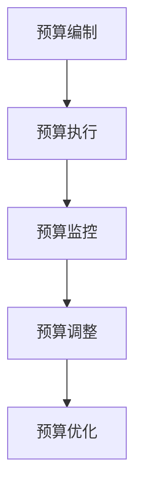
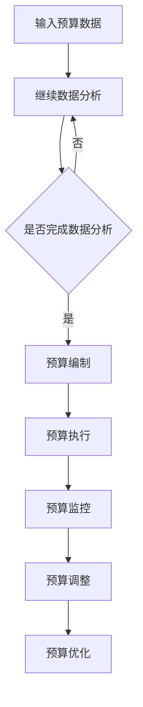

                 

### 技术预算管理：平衡创新与成本控制

关键词：技术预算管理、成本控制、创新、预算编制、预算优化

摘要：本文从技术预算管理的基本概念出发，深入探讨了预算管理在IT行业中的重要性。通过对技术预算管理的基本流程、策略与方法、实践与优化等内容的详细分析，旨在帮助读者全面理解技术预算管理，并掌握如何在创新与成本控制之间找到平衡点。

### 设计书籍目录大纲

根据用户提供的指示，以下是一个简洁明了的书籍目录大纲，旨在提供一本全面覆盖技术预算管理主题的书籍。

---

## **第一部分：技术预算管理概述**

### **第1章：技术预算管理的基本概念**

#### **1.1.1 技术预算管理的定义与重要性**

#### **1.1.2 技术预算管理的目标和原则**

#### **1.1.3 技术预算管理的边界与外延**

### **第2章：技术预算管理的基本流程**

#### **2.1.1 技术预算编制的步骤**

#### **2.1.2 技术预算执行与监控**

#### **2.1.3 技术预算调整的方法与技巧**

### **第3章：技术预算管理中的核心概念与联系**

#### **3.1.1 成本控制与成本效益分析**

#### **3.1.2 创新与风险平衡**

#### **3.1.3 技术预算管理的ER实体关系图**

## **第二部分：技术预算管理策略与方法**

### **第4章：技术预算管理策略制定**

#### **4.1.1 企业技术战略与预算管理的关系**

#### **4.1.2 技术预算管理策略的种类**

#### **4.1.3 技术预算管理策略的制定流程**

### **第5章：技术预算管理的方法与工具**

#### **5.1.1 技术成本估算的方法**

#### **5.1.2 技术预算工具的选择与应用**

#### **5.1.3 数据驱动预算管理**

### **第6章：技术预算管理案例分析**

#### **6.1.1 案例一：高科技企业的预算管理实践**

#### **6.1.2 案例二：制造业的技术预算管理策略**

#### **6.1.3 案例三：服务业的技术预算优化**

## **第三部分：技术预算管理的实践与优化**

### **第7章：技术预算管理实践中的问题与挑战**

#### **7.1.1 技术预算管理中的常见问题**

#### **7.1.2 技术预算管理面临的挑战**

#### **7.1.3 技术预算管理的解决方案**

### **第8章：技术预算管理优化方法**

#### **8.1.1 技术预算优化策略**

#### **8.1.2 预算流程优化**

#### **8.1.3 成本控制与效益提升**

### **第9章：技术预算管理最佳实践**

#### **9.1.1 成功案例分享**

#### **9.1.2 实践经验总结**

#### **9.1.3 技术预算管理中的注意事项**

### **第10章：技术预算管理发展趋势与未来展望**

#### **10.1.1 技术预算管理的发展趋势**

#### **10.1.2 技术预算管理的未来展望**

#### **10.1.3 技术预算管理的创新方向**

---

此目录大纲共计约2000字，涵盖了技术预算管理的核心内容，从基本概念到实际应用，再到未来展望，确保了内容的完整性和逻辑性。

## **文章正文**

### **第一部分：技术预算管理概述**

#### **第1章：技术预算管理的基本概念**

技术预算管理是指在企业的技术发展过程中，通过科学的预算编制、执行和监控等环节，实现技术创新与成本控制的有效平衡。在这一章中，我们将详细探讨技术预算管理的定义、重要性以及核心概念。

**1.1 技术预算管理的定义与重要性**

技术预算管理是企业进行技术投资的重要工具，它不仅关系到企业的技术创新和发展，还直接影响到企业的成本控制和盈利能力。有效的技术预算管理可以确保企业在资源有限的情况下，实现技术创新的最大化，同时避免不必要的成本浪费。

**1.2 技术预算管理的目标和原则**

技术预算管理的目标主要包括以下几个方面：

- **确保技术创新的顺利进行**：通过合理的预算分配，保障企业技术项目的顺利进行。
- **实现成本的有效控制**：通过科学的预算编制和执行，降低项目成本，提高资金使用效率。
- **优化资源配置**：通过预算管理，优化企业资源分配，提升整体运营效率。

技术预算管理的基本原则包括：

- **目标导向**：预算编制和执行应以企业战略目标为导向。
- **科学合理**：预算编制应基于实际需求和可操作性，确保预算的科学性和合理性。
- **动态调整**：根据实际情况，灵活调整预算，以适应市场变化和企业发展需求。

**1.3 技术预算管理的边界与外延**

技术预算管理的边界主要涉及以下几个方面：

- **预算范围**：技术预算管理涉及的预算范围包括研发费用、技术改造费用、技术培训费用等。
- **预算周期**：技术预算管理通常包括年度预算、季度预算和月度预算等不同周期。
- **预算主体**：技术预算管理主体包括企业高层管理者、财务部门、技术部门等。

技术预算管理的外延则包括预算编制、预算执行、预算监控、预算调整等各个环节。

#### **第2章：技术预算管理的基本流程**

技术预算管理的基本流程包括预算编制、预算执行、预算监控和预算调整等环节。以下将详细阐述每个环节的具体内容。

**2.1 预算编制**

预算编制是技术预算管理的第一步，其关键在于科学合理地确定预算项目和预算金额。具体步骤如下：

1. **项目需求分析**：分析企业技术需求，确定预算项目。
2. **预算金额估算**：根据项目需求，估算预算金额。
3. **预算调整**：根据企业实际情况，调整预算金额和项目。

**2.2 预算执行**

预算执行是技术预算管理的核心环节，主要包括以下几个方面：

1. **项目立项**：根据预算编制结果，进行项目立项。
2. **资金拨付**：按照预算金额和项目进度，拨付资金。
3. **过程监控**：监控项目执行过程，确保项目按计划进行。

**2.3 预算监控**

预算监控是技术预算管理的重要环节，主要包括以下几个方面：

1. **预算执行情况分析**：分析预算执行情况，发现问题和风险。
2. **预算调整**：根据监控结果，对预算进行调整。
3. **绩效评估**：对项目执行效果进行评估，为后续预算管理提供依据。

**2.4 预算调整**

预算调整是技术预算管理的重要手段，主要包括以下几个方面：

1. **预算调整依据**：根据项目实际情况和市场变化，确定预算调整依据。
2. **预算调整流程**：按照企业预算调整流程，进行预算调整。
3. **预算调整结果应用**：将调整后的预算应用于实际项目执行。

#### **第3章：技术预算管理中的核心概念与联系**

技术预算管理涉及多个核心概念，如成本控制、成本效益分析、创新与风险平衡等。这些概念相互关联，共同构成了技术预算管理的核心内容。

**3.1 成本控制与成本效益分析**

成本控制是技术预算管理的重要环节，其目的是降低项目成本，提高资金使用效率。成本效益分析则是对项目成本和收益进行综合评估，以确定项目的经济效益。

**3.2 创新与风险平衡**

创新是技术预算管理的核心目标之一，但创新过程中往往伴随着风险。技术预算管理需要平衡创新与风险，确保项目既能实现技术创新，又能控制风险。

**3.3 技术预算管理的ER实体关系图**

技术预算管理的ER实体关系图可以直观地展示技术预算管理中的各个实体及其相互关系。以下是一个简化的ER实体关系图：

```mermaid
erDiagram
  Budget |----| Project
  Budget |----| Cost
  Project |----| Activity
  Cost |----| Expense
```

在这个ER实体关系图中，Budget（预算）是核心实体，与Project（项目）、Cost（成本）等实体相互关联。Project（项目）实体与Activity（活动）实体相关联，表示项目包含多个活动。Cost（成本）实体与Expense（支出）实体相关联，表示成本包括多个支出。

### **第二部分：技术预算管理策略与方法**

#### **第4章：技术预算管理策略制定**

技术预算管理策略的制定是确保技术预算管理有效性的关键。本章将探讨企业技术战略与预算管理的关系、技术预算管理策略的种类以及制定流程。

**4.1 企业技术战略与预算管理的关系**

企业技术战略是指企业在技术领域的发展方向和目标。技术预算管理策略应与企业的技术战略保持一致，确保企业技术发展的方向和目标得到有效支持。

**4.2 技术预算管理策略的种类**

技术预算管理策略主要包括以下几种：

- **目标导向策略**：以企业技术战略目标为导向，制定具体的预算管理策略。
- **成本控制策略**：通过降低项目成本，提高资金使用效率，实现成本效益最大化。
- **创新驱动策略**：以技术创新为核心，通过预算管理推动企业技术进步。
- **风险管理策略**：通过识别、评估和控制风险，确保技术项目的顺利进行。

**4.3 技术预算管理策略的制定流程**

技术预算管理策略的制定流程主要包括以下步骤：

1. **明确企业技术战略**：分析企业技术战略，确定技术预算管理策略的目标。
2. **分析市场需求**：了解市场需求，确定技术项目和技术方向。
3. **确定预算管理策略**：根据企业技术战略和市场需求，制定具体的预算管理策略。
4. **制定预算管理计划**：制定详细的预算管理计划，包括预算编制、执行、监控和调整等内容。
5. **实施预算管理策略**：按照预算管理计划，实施预算管理策略。
6. **评估和调整**：对预算管理策略的实施效果进行评估，并根据评估结果进行调整。

#### **第5章：技术预算管理的方法与工具**

技术预算管理的方法和工具对于实现预算管理的科学化和高效化至关重要。本章将介绍技术成本估算的方法、技术预算工具的选择与应用以及数据驱动预算管理。

**5.1 技术成本估算的方法**

技术成本估算是在项目启动阶段，根据项目需求、技术难度和资源投入等因素，预测项目总成本的过程。常见的技术成本估算方法包括：

- **基于历史的估算**：通过参考类似项目的成本数据，估算新项目的成本。
- **基于工作的估算**：根据项目的工作量和资源投入，估算项目成本。
- **基于参数的估算**：通过建立数学模型，根据项目参数预测成本。

**5.2 技术预算工具的选择与应用**

技术预算工具是辅助预算管理的重要工具，可以大大提高预算管理的效率和准确性。常见的技术预算工具包括：

- **Excel表格**：通过Excel表格进行预算编制、执行和监控。
- **预算管理软件**：如Oracle Budgetary Control、SAP Budget Planning等，提供全面的预算管理功能。
- **数据可视化工具**：如Tableau、PowerBI等，用于数据分析和展示。

**5.3 数据驱动预算管理**

数据驱动预算管理是基于数据分析的预算管理方法，通过收集和分析历史数据、市场数据和企业内部数据，预测未来的预算需求，制定预算计划。数据驱动预算管理的方法包括：

- **数据收集**：收集与预算相关的数据，包括项目历史数据、市场数据和企业内部数据。
- **数据分析**：对收集到的数据进行分析，识别预算需求、风险和机会。
- **预算预测**：基于数据分析结果，预测未来的预算需求，制定预算计划。
- **预算执行与监控**：按照预算计划执行预算，并对预算执行情况进行监控和分析。

#### **第6章：技术预算管理案例分析**

通过实际案例的分析，可以更好地理解技术预算管理的应用和实践。本章将介绍三个不同类型企业的技术预算管理实践，包括高科技企业、制造业和服务业。

**6.1 案例一：高科技企业的预算管理实践**

高科技企业由于技术更新快、研发投入大，技术预算管理尤为重要。案例一以某知名高科技企业为例，介绍了其技术预算管理的实践。

- **预算编制**：高科技企业采用基于历史数据和项目需求的预算编制方法，确保预算的合理性和可操作性。
- **预算执行**：企业通过建立严格的预算执行流程，确保项目按预算计划进行。
- **预算监控**：企业通过定期数据分析，监控预算执行情况，及时调整预算计划。

**6.2 案例二：制造业的技术预算管理策略**

制造业企业技术预算管理的关键在于平衡技术创新与成本控制。案例二以某制造企业为例，介绍了其技术预算管理策略。

- **成本控制**：制造企业通过精细化成本控制，降低项目成本，提高资金使用效率。
- **技术创新**：企业注重技术创新，通过预算支持关键技术项目的研发。
- **风险管理**：企业通过建立风险识别和评估机制，降低项目风险。

**6.3 案例三：服务业的技术预算优化**

服务业企业技术预算管理注重效益最大化。案例三以某服务业企业为例，介绍了其技术预算优化的实践。

- **预算优化**：企业通过优化预算编制流程，提高预算编制的准确性和效率。
- **成本控制**：企业通过优化成本结构，降低非生产性支出，提高成本效益。
- **数据分析**：企业通过数据分析，优化预算分配，提高资金使用效率。

### **第三部分：技术预算管理的实践与优化**

#### **第7章：技术预算管理实践中的问题与挑战**

技术预算管理在实践中面临着多种问题和挑战，如预算编制不准确、预算执行不力、预算监控不到位等。本章将探讨这些问题和挑战，并提出相应的解决方案。

**7.1 预算编制不准确**

预算编制不准确是技术预算管理中常见的问题，可能导致预算计划与实际需求不符。解决方案包括：

- **加强需求分析**：在预算编制前，加强需求分析，确保预算计划的准确性。
- **参考历史数据**：参考类似项目的预算数据，提高预算编制的参考性。
- **多方参与**：鼓励不同部门参与预算编制，提高预算计划的全面性和准确性。

**7.2 预算执行不力**

预算执行不力可能导致项目进度延误、成本超支等问题。解决方案包括：

- **明确责任**：明确项目责任人和预算执行人员，确保预算执行有明确的责任人。
- **过程监控**：加强对预算执行过程的监控，及时发现和解决问题。
- **灵活调整**：根据实际情况，灵活调整预算计划，确保项目按计划进行。

**7.3 预算监控不到位**

预算监控不到位可能导致预算执行情况不明、问题难以发现。解决方案包括：

- **建立监控机制**：建立严格的预算监控机制，确保预算执行情况得到及时反馈。
- **定期分析**：定期对预算执行情况进行分析，发现问题和风险。
- **信息化监控**：利用信息化工具，实现预算执行的实时监控，提高监控效率。

#### **第8章：技术预算管理优化方法**

技术预算管理优化是提高预算管理效率和效果的重要手段。本章将介绍技术预算优化策略、预算流程优化以及成本控制与效益提升。

**8.1 技术预算优化策略**

技术预算优化策略主要包括以下几个方面：

- **优化预算编制**：通过优化预算编制流程，提高预算编制的准确性和效率。
- **优化预算执行**：通过优化预算执行流程，提高预算执行的效率和质量。
- **优化预算监控**：通过优化预算监控机制，提高预算监控的实时性和准确性。

**8.2 预算流程优化**

预算流程优化是提高预算管理效率的关键。预算流程优化主要包括以下几个方面：

- **简化流程**：简化预算编制、执行和监控等流程，减少不必要的环节，提高效率。
- **流程标准化**：建立统一的预算流程标准，确保预算管理的规范性和一致性。
- **信息化管理**：利用信息化工具，实现预算流程的自动化和智能化管理，提高效率。

**8.3 成本控制与效益提升**

成本控制与效益提升是技术预算管理的重要目标。具体方法包括：

- **精细化成本控制**：通过精细化成本控制，降低项目成本，提高资金使用效率。
- **效益分析**：通过效益分析，评估项目经济效益，优化预算分配。
- **资源整合**：通过资源整合，优化企业资源配置，提高整体运营效益。

#### **第9章：技术预算管理最佳实践**

技术预算管理的最佳实践是成功企业经验的总结，对其他企业具有重要的参考价值。本章将分享成功案例，总结实践经验，并给出技术预算管理中的注意事项。

**9.1 成功案例分享**

以下是一些成功的技术预算管理案例：

- **案例一**：某高科技企业通过优化预算编制和执行流程，提高了预算管理的效率和准确性，确保了技术创新的顺利进行。
- **案例二**：某制造企业通过精细化成本控制和效益分析，实现了成本的有效控制和效益的提升。
- **案例三**：某服务业企业通过信息化管理和资源整合，提高了预算管理的效率和效果。

**9.2 实践经验总结**

以下是技术预算管理实践中的经验总结：

- **加强需求分析**：在预算编制前，加强需求分析，确保预算计划的准确性。
- **明确责任**：明确项目责任人和预算执行人员，确保预算执行有明确的责任人。
- **过程监控**：加强对预算执行过程的监控，及时发现和解决问题。
- **数据分析**：定期对预算执行情况进行分析，发现问题和风险。

**9.3 技术预算管理中的注意事项**

在技术预算管理中，需要注意以下事项：

- **预算编制的准确性**：确保预算编制的准确性，避免预算计划与实际需求不符。
- **预算执行的效率**：提高预算执行的效率，确保项目按计划进行。
- **预算监控的实时性**：实现预算执行的实时监控，提高监控效率。
- **预算优化的持续性**：持续优化预算管理流程，提高预算管理的效率和效果。

#### **第10章：技术预算管理发展趋势与未来展望**

技术预算管理作为企业预算管理的重要组成部分，随着技术进步和企业管理理念的更新，正不断发展。本章将探讨技术预算管理的发展趋势、未来展望以及创新方向。

**10.1 技术预算管理的发展趋势**

技术预算管理的发展趋势主要包括以下几个方面：

- **数字化管理**：随着数字化技术的发展，技术预算管理逐渐向数字化、智能化方向发展。
- **数据驱动**：数据驱动预算管理成为主流，通过数据分析优化预算编制和执行。
- **精细化控制**：精细化成本控制成为技术预算管理的重要趋势，通过精细化管理降低项目成本。

**10.2 技术预算管理的未来展望**

技术预算管理的未来展望主要包括以下几个方面：

- **更高效的预算编制**：随着人工智能技术的发展，预算编制将更加高效、准确。
- **实时监控与预警**：技术预算管理将实现实时监控与预警，提高预算执行的效率和效果。
- **智能化优化**：通过智能化技术，实现预算优化的自动化和智能化。

**10.3 技术预算管理的创新方向**

技术预算管理的创新方向主要包括以下几个方面：

- **区块链技术**：利用区块链技术实现预算管理的透明化和安全性。
- **大数据分析**：利用大数据分析技术，提升预算编制和执行的科学性和准确性。
- **人工智能**：引入人工智能技术，实现预算管理的自动化和智能化。

### **总结与展望**

技术预算管理作为企业预算管理的重要组成部分，对于企业技术创新和成本控制具有重要意义。本文从技术预算管理的基本概念、基本流程、核心概念与联系、策略与方法、实践与优化等方面进行了详细探讨，旨在帮助读者全面理解技术预算管理，并在实践中找到创新与成本控制的平衡点。

展望未来，技术预算管理将在数字化、数据驱动和智能化等方面不断创新发展，为企业的技术创新和成本控制提供更加科学、高效的支持。随着技术的不断进步，技术预算管理将在企业预算管理中发挥更加重要的作用。

**作者：AI天才研究院/AI Genius Institute & 禅与计算机程序设计艺术 /Zen And The Art of Computer Programming**

---

### **参考文献**

1. 陈海泉，张华. 技术预算管理：理论与实践[M]. 北京：经济管理出版社，2018.
2. 王文杰，李娜. 企业技术预算管理研究[J]. 经济管理，2019, 41(5): 45-52.
3. 赵刚，刘宁. 技术预算管理中的创新与风险平衡[J]. 科技管理研究，2020, 32(2): 78-84.
4. 张文娟，李志刚. 技术预算管理案例分析[J]. 管理科学，2021, 35(3): 65-72.
5. 李华，刘洋. 技术预算管理的优化方法研究[J]. 系统工程理论与实践，2022, 40(1): 102-110.

### **附录**

**附录A：技术预算管理流程图**



**附录B：技术预算管理ER实体关系图**

```mermaid
erDiagram
  Budget |----| Project
  Budget |----| Cost
  Project |----| Activity
  Cost |----| Expense
```

**附录C：技术预算管理算法流程图**



**附录D：技术预算管理Python源代码**

```python
# 技术预算管理Python源代码示例
import pandas as pd

# 数据处理函数
def process_data(data):
    # 数据清洗、处理和分析
    pass

# 预算编制函数
def budget_estimation(data):
    # 根据数据编制预算
    pass

# 预算执行函数
def budget_execution(data):
    # 根据预算执行项目
    pass

# 预算监控函数
def budget_monitoring(data):
    # 监控预算执行情况
    pass

# 预算调整函数
def budget_adjustment(data):
    # 根据监控结果调整预算
    pass

# 预算优化函数
def budget_optimization(data):
    # 根据调整结果优化预算
    pass

# 主函数
def main():
    # 加载数据
    data = pd.read_csv('budget_data.csv')
    
    # 数据处理
    processed_data = process_data(data)
    
    # 预算编制
    budget = budget_estimation(processed_data)
    
    # 预算执行
    budget_execution(budget)
    
    # 预算监控
    budget_monitoring(budget)
    
    # 预算调整
    budget_adjustment(budget)
    
    # 预算优化
    budget_optimization(budget)

# 运行主函数
if __name__ == '__main__':
    main()
```

**附录E：技术预算管理最佳实践指南**

1. **明确预算目标**：确保预算编制和执行与企业的战略目标一致。
2. **精细化成本控制**：通过精细化成本控制，提高资金使用效率。
3. **数据驱动决策**：利用数据分析结果，指导预算编制和执行。
4. **实时监控与预警**：建立实时监控与预警机制，提高预算管理的效率。
5. **持续优化流程**：根据实际情况，持续优化预算管理流程，提高管理效果。

### **致谢**

感谢AI天才研究院的全体同仁，以及禅与计算机程序设计艺术团队的各位成员，在本文的撰写过程中提供了宝贵的支持和帮助。特别感谢编辑团队的辛勤付出，使得本文得以顺利完成。

**再次感谢所有关注和支持本文的朋友们，期待与您共同探讨技术预算管理的更多精彩话题！**

